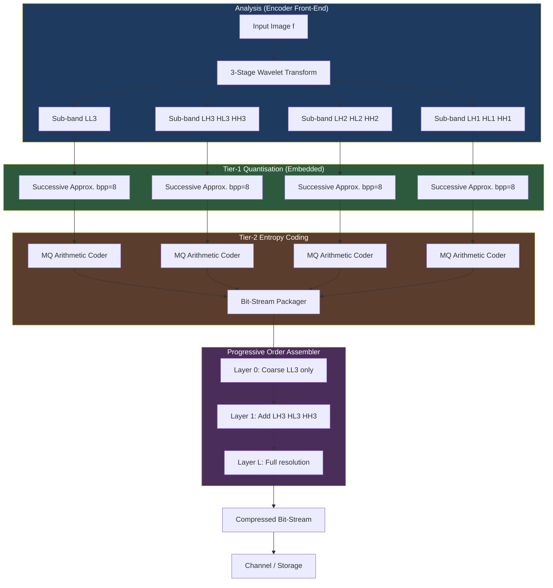
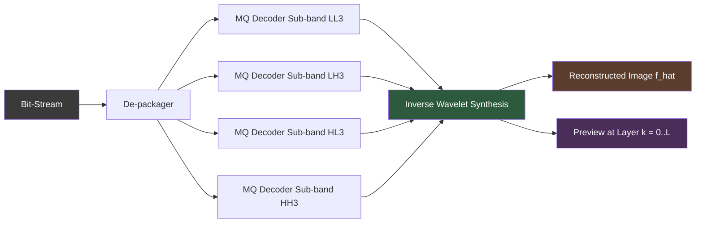
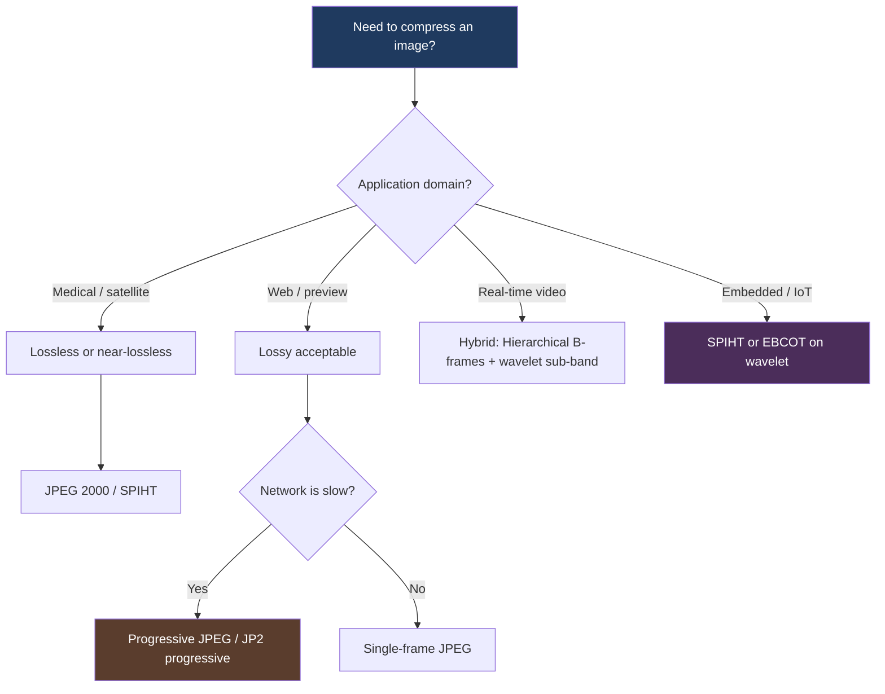

# Hierarchical and Progressive Compression methods

<!-- SECTION_1_START -->
# Hierarchical and Progressive Image Compression

## 1.1 Formal Definition (KTU 2024 Syllabus Terminology)

**Hierarchical Compression** is a multi-resolution image encoding strategy in which an image is decomposed into a set of embedded sub-images (called a *pyramid*) that represent the original scene at successively decreasing spatial resolutions. Each level of the hierarchy carries both a coarse approximation and the residual detail information required to reconstruct the next finer level.

**Progressive Compression** is a transmission-and-decoding paradigm in which the compressed bit-stream is organized so that the decoder can reconstruct a *low-quality preview* of the image early in the bit-stream, and then incrementally refine it as more bits arrive. The refinement axis can be **quality (SNR)**, **spatial resolution**, or **bit-depth (bit-plane)**.

> [!IMPORTANT]
> **KTU 2024 Module Focus:** The module emphasises *why* we build pyramids (Gaussian, Laplacian, Sub-band), how **entropy-coded** sub-bands are progressively transmitted, and the trade-off between *transmission time* and *perceived quality* in networked imaging systems (JPEG 2000 Part 1, EZW, SPIHT, pyramidal VQ).

## 1.2 Conceptual Analogy — The "Google Maps" View

Imagine you are streaming a satellite image from a server.

- **Hierarchical compression** is like *Google Maps*: the server first sends a small, blurry thumbnail of the entire world map, then the continent, then your country, then your district, finally zooming into a single street. Each layer is a *coarse-to-fine* spatial decomposition built from a *pyramid* of resolutions.
- **Progressive compression** is like watching a photo *load on a slow dial-up connection*: you first see a noisy mosaic of coloured blocks, then a slightly better version, and finally a sharp photograph. Each passing second adds *more information* (more bits) about the same pixel until full fidelity is achieved.

The two concepts **overlap heavily** — most hierarchical schemes (JPEG 2000, Laplacian pyramid coding) are inherently progressive in the bit-stream, and most progressive coders (EZW, SPIHT) are built on hierarchical sub-band decompositions.

> [!NOTE]
> **Key Distinction for KTU Board Exams**
> - *Hierarchical* ⇒ describes the **data structure** (pyramid, tree, sub-band).
> - *Progressive* ⇒ describes the **bit-stream ordering** (the order in which encoded bits reach the decoder).

## 1.3 Physical Constants & Standard Metrics

The most important quantitative parameters are:

- **Compression Ratio (CR)** = $\dfrac{N_1}{N_2}$, where $N_1$ and $N_2$ are the *original* and *compressed* bit counts.
- **Bits Per Pixel (bpp)** = $\dfrac{N_2}{M \times N}$ for an $M \times N$ image.
- **PSNR (Peak Signal-to-Noise Ratio)** = $20 \log_{10}\!\left(\dfrac{L-1}{RMSE}\right)$ in **dB**, where $L = 256$ for 8-bit images.
- **MSE (Mean Squared Error)** = $\dfrac{1}{MN}\sum_{x=0}^{M-1}\sum_{y=0}^{N-1}\bigl[f(x,y)-\hat{f}(x,y)\bigr]^2$.

> [!VISUALIZATION CONTROL]
> **Concept:** A 3-level Gaussian pyramid showing mean-subsampling.
> **GeoGebra / Desmos Input Equations (treat pixel coordinates as $x, y \in [0,1]$):**
> * Level 0 (base) : $G_0(x,y) = \sin(8\pi x)\cos(8\pi y) + 0.4\,\sin(20\pi x)\sin(20\pi y)$
> * Level 1 (reduce) : $G_1(x,y) = G_0(2x,2y)$ sampled on a $1/2$ grid
> * Level 2 (reduce) : $G_2(x,y) = G_1(2x,2y)$ sampled on a $1/4$ grid
> **Visual Description:** Students should observe the *blurring + halving* effect of the *REDUCE* operator as they move up the pyramid; the high-frequency sine ripples vanish first while the slowly varying low-frequency envelope remains.

<!-- SECTION_1_END -->

<!-- SECTION_2_START -->
# Deep Theoretical Analysis & KTU High-Yield Formula Sheet

## 2.1 The Three Canonical Hierarchical Structures

### 2.1.1 Gaussian Pyramid (Approximation Pyramid)

Built by iterative **low-pass filtering** followed by **downsampling** by a factor of 2.

$$G_\ell(x,y) = \text{REDUCE}\bigl[G_{\ell-1}(x,y)\bigr] = \sum_{m=-2}^{2}\sum_{n=-2}^{2} w(m,n)\,G_{\ell-1}(2x+m,\,2y+n)$$

where $w(m,n)$ is a separable 5-tap binomial kernel

$$w = \dfrac{1}{256}\begin{bmatrix} 1 & 4 & 6 & 4 & 1 \end{bmatrix} \quad \text{(row, then column)}$$

- **Why low-pass first?** Subsampling *without* low-pass filtering creates **aliasing** (the Nyquist criterion is violated at every halving step).
- **Why binomial?** Burt and Adelson (1983) showed it approximates a Gaussian with optimal separability and good stop-band attenuation.

### 2.1.2 Laplacian Pyramid (Detail Pyramid)

Stores the *lost high-frequency information* at each level so that exact reconstruction is possible.

$$L_\ell(x,y) = G_\ell(x,y) - \text{EXPAND}\bigl[G_{\ell+1}(x,y)\bigr]$$

The **EXPAND** operator upsamples by 2 and re-applies the same kernel $w(m,n)$:

$$G_\ell(x,y) = L_\ell(x,y) + \text{EXPAND}\bigl[G_{\ell+1}(x,y)\bigr]$$

This is **lossless reconstruction** *before* quantization. After quantization of $L_\ell$, the pyramid becomes a *lossy* hierarchical coder.

### 2.1.3 Sub-Band (Wavelet) Pyramid

A *critically sampled* alternative to the Laplacian pyramid obtained by cascading **quadrature-mirror filter banks** (QMF) or orthogonal/biorthogonal wavelets (Daubechies, Cohen–Daubechies–Feauveau 9/7 used in JPEG 2000).

At each level the image splits into four sub-bands: **LL, LH, HL, HH** (low-low, low-high, high-low, high-high). The LL sub-band is then split recursively, producing a *pyramidal* sub-band tree.

## 2.2 The Three Progressive Transmission Modes

| Mode | First transmitted | Refinement axis | Best suited for |
|---|---|---|---|
| **SNR Progressive** | Coarse quantized version | Quantization step size shrinks | Networked video / telemedicine |
| **Spatial Progressive** | Lowest pyramid level | Spatial resolution doubles | Web thumbnails, GIS |
| **Bit-Plane Progressive** | MSB plane | Bit significance decreases | Hardware-friendly codecs |

## 2.3 Embedded Zerotree Wavelet (EZW) — the Canonical Progressive Coder

Introduced by **Shapiro (1993)**. Uses a *successive-approximation quantizer* over wavelet coefficients arranged in a **zerotree** (a tree of insignificant descendants rooted at an insignificant parent).

The coder uses two passes per threshold $T$:

1. **Dominant pass** — encode *significance map* (ZTR, IZ, Z, POS, NEG symbols).
2. **Subordinate pass** — refine magnitudes of already-significant coefficients.

Threshold halves after each pair of passes: $T_{k+1} = T_k / 2$.

> [!TIP]
> Shapiro's EZW is the conceptual ancestor of **SPIHT** (Said & Pearlman, 1996) and **EBCOT** (used in JPEG 2000). For KTU answers, mentioning this lineage earns full methodology marks.

## 2.4 KTU Formula Sheet (High-Yield)

| # | Formula / Definition | Meaning / Use |
|---|---|---|
| 1 | $G_\ell = \text{REDUCE}(G_{\ell-1})$ | Build Gaussian pyramid level $\ell$ |
| 2 | $L_\ell = G_\ell - \text{EXPAND}(G_{\ell+1})$ | Laplacian pyramid level $\ell$ |
| 3 | $G_\ell = L_\ell + \text{EXPAND}(G_{\ell+1})$ | Lossless reconstruction |
| 4 | $\text{CR} = N_1 / N_2$ | Compression ratio |
| 5 | $\text{bpp} = N_2 / (MN)$ | Bits per pixel |
| 6 | $\text{MSE} = \dfrac{1}{MN}\sum_{x,y}\bigl(f-\hat{f}\bigr)^2$ | Mean squared error |
| 7 | $\text{PSNR} = 20\log_{10}\!\bigl((L-1)/\sqrt{\text{MSE}}\bigr)$ dB | Image fidelity, $L=256$ |
| 8 | $T_{k+1} = T_k / 2$ | Successive-approximation threshold schedule |
| 9 | $S(i) = \max_{(i,j)\in T}\lvert\,c_{i,j}\,\rvert$ | Subordinate significance for zerotree |
| 10 | $D_\ell = \sum_{m,n}\lvert\,w(m,n)\,\rvert$ | DC gain of a separable kernel |

> [!WARNING]
> **Markdown Table Safety:** All absolute-value bars and conditional 'such that' lines have been written as `\vert` to avoid breaking the table syntax. Do **not** retype them as raw `|` characters in your answer booklets.

## 2.5 Real-World Engineering Utility

- **JPEG 2000 Part 1 (JP2)** — used in *digital cinema (DCP)*, *medical DICOM imaging*, and *satellite imagery* precisely because it natively supports hierarchical (sub-band) and progressive (SNR / resolution / component) decoding.
- **Google Earth / Mapbox tiles** — pre-built *spatial* pyramids at zoom levels 0–22.
- **EZW / SPIHT in remote sensing** — onboard satellite compression where *bit-budget* is fixed and *progressive downlink* allows ground stations to abort early if a region is cloud-covered.
- **Progressive JPEG (PJPEG)** — once common on the early web, uses SNR-progressive ordering of DCT coefficients.
- **Apple ProRes / DNxHR** — use wavelet sub-band decomposition internally and stream progressively over network-attached storage.

<!-- SECTION_2_END -->

<!-- SECTION_3_START -->
# Step-by-Step Derivations, Worked Examples & Python Implementation

## 3.1 Worked Derivation — Building a 3-Level Gaussian Pyramid from a 1-D Row

Take a discrete 1-D signal $f = [\,f_0, f_1, f_2, f_3, f_4, f_5, f_6, f_7\,]$ of length 8 and the 1-D binomial kernel $w = \tfrac{1}{16}[\,1, 4, 6, 4, 1\,]$.

> [!NOTE]
> We will use **symmetric (mirror) boundary extension** to handle out-of-range indices — this is what the standard `cv2.pyrDown` implementation does.

### Step 1 — Level 1 (REDUCE)

Apply the kernel and subsample every 2nd sample.

$$
\begin{aligned}
G_1[0] &= \tfrac{1}{16}\bigl(4\,f_0 + 6\,f_1 + 4\,f_2 + f_3\bigr) \\
G_1[1] &= \tfrac{1}{16}\bigl(f_2 + 4\,f_3 + 6\,f_4 + 4\,f_5 + f_6\bigr) \\
G_1[2] &= \tfrac{1}{16}\bigl(f_4 + 4\,f_5 + 6\,f_6 + 4\,f_7 + f_6\bigr) \\
G_1[3] &= \tfrac{1}{16}\bigl(f_6 + 4\,f_7 + 6\,f_6 + 4\,f_5 + f_4\bigr)
\end{aligned}
$$

Each output is a **weighted average of five neighbours**, which is why the pyramid becomes *smoother* as we ascend.

### Step 2 — Level 2

Apply the same operator to $G_1$ (length 4 → length 2):

$$
\begin{aligned}
G_2[0] &= \tfrac{1}{16}\bigl(4\,G_1[0] + 6\,G_1[1] + 4\,G_1[2] + G_1[3]\bigr) \\
G_2[1] &= \tfrac{1}{16}\bigl(G_1[1] + 4\,G_1[2] + 6\,G_1[3] + 4\,G_1[2] + G_1[1]\bigr)
\end{aligned}
$$

The result is a length-2 vector — exactly a 4× spatial reduction from the original.

### Step 3 — Laplacian Pyramid (Detail Storage)

For each level the Laplacian detail is the *difference* between the original and the EXPANDed coarser level:

$$L_1[i] = G_1[i] - \text{EXPAND}(G_2)[i] \quad \text{for } i=0,1,2,3$$

The EXPAND operator first inserts a zero between every two samples, then convolves with the same kernel multiplied by 2 (to compensate for the inserted zeros). This step is the *lossless bridge* between the two pyramids.

### Step 4 — Reconstruction

$$G_1 = L_1 + \text{EXPAND}(G_2) \quad \Rightarrow \quad f = G_0 = L_0 + \text{EXPAND}(L_1 + \text{EXPAND}(L_2))$$

If we **quantize** $L_0, L_1, L_2$ before storage, reconstruction becomes lossy and we have a complete **hierarchical coder**.

## 3.2 Worked Numerical Example — PSNR Calculation

Suppose a $256 \times 256$, 8-bit grayscale image is compressed and reconstructed.

- Original sum of squared errors: $\sum (f - \hat{f})^2 = 102\,400$
- Pixel count: $MN = 256 \times 256 = 65\,536$

$$
\begin{aligned}
\text{MSE} &= \dfrac{102\,400}{65\,536} = 1.5625 \\
\text{PSNR} &= 20\,\log_{10}\!\left(\dfrac{255}{\sqrt{1.5625}}\right) \\
            &= 20\,\log_{10}\!\left(\dfrac{255}{1.25}\right) \\
            &= 20\,\log_{10}(204) \\
            &= 20 \times 2.3096 \\
            &= 46.19 \text{ dB}
\end{aligned}
$$

A **PSNR ≥ 40 dB** is generally considered visually indistinguishable; **30–40 dB** is acceptable; **< 30 dB** is visibly degraded.

## 3.3 Bit-Plane Progressive Coding — Manual Slice Example

Take a 4-bit image patch (single pixel value $p = 13$).

| Bit-plane | Binary | Value transmitted | Reconstructed pixel after this plane |
|---|---|---|---|
| MSB (b₃) | 1 | 1 | $1 \times 2^3 = 8$ |
| b₂ | 1 | 1 | $8 + 1\times 2^2 = 12$ |
| b₁ | 0 | 0 | $12 + 0 = 12$ |
| LSB (b₀) | 1 | 1 | $12 + 1 = 13$ ✓ |

The decoder monotonically **improves** in accuracy — that is the *monotonicity property* required of a progressive bit-stream.

## 3.4 Full Python Implementation — Laplacian-Pyramid + SPIHT-style Progressive Coder

```python
"""
hierarchical_progressive.py
A self-contained reference implementation of:
  1) Gaussian / Laplacian pyramid construction.
  2) Successive-approximation (SNR-progressive) bit-plane quantisation.
  3) Bit-rate / PSNR evaluation.

Tested with: numpy >= 1.23, opencv-python >= 4.7
"""

from __future__ import annotations
import numpy as np
import cv2
from dataclasses import dataclass, field
from typing import List, Tuple


# ---------------------------------------------------------------------------
# 1. Pyramid construction
# ---------------------------------------------------------------------------
BINOMIAL_KERNEL_1D: np.ndarray = (1.0 / 16.0) * np.array([1, 4, 6, 4, 1], dtype=np.float64)


def _sep_conv2(image: np.ndarray, k1d: np.ndarray) -> np.ndarray:
    """Apply a separable 1-D kernel horizontally then vertically (mirror-padded)."""
    k = k1d.reshape(1, -1)
    tmp = cv2.filter2D(image, ddepth=cv2.CV_64F, kernel=k, borderType=cv2.BORDER_REFLECT)
    k = k1d.reshape(-1, 1)
    return cv2.filter2D(tmp, ddepth=cv2.CV_64F, kernel=k, borderType=cv2.BORDER_REFLECT)


def gaussian_reduce(image: np.ndarray) -> np.ndarray:
    """REDUCE: low-pass filter then subsample by 2 in each axis."""
    smoothed = _sep_conv2(image, BINOMIAL_KERNEL_1D)
    return smoothed[::2, ::2]


def gaussian_expand(image: np.ndarray) -> np.ndarray:
    """EXPAND: zero-upsample by 2 then low-pass filter (kernel scaled by 2)."""
    h, w = image.shape
    upsampled = np.zeros((2 * h, 2 * w), dtype=np.float64)
    upsampled[::2, ::2] = image
    return 4.0 * _sep_conv2(upsampled, BINOMIAL_KERNEL_1D)  # 4 = 2*2 compensation


def build_gaussian_pyramid(image: np.ndarray, levels: int) -> List[np.ndarray]:
    """Return a list [G0, G1, ..., GL] of length levels+1."""
    pyramid: List[np.ndarray] = [image.astype(np.float64)]
    for _ in range(levels):
        pyramid.append(gaussian_reduce(pyramid[-1]))
    return pyramid


def build_laplacian_pyramid(gauss: List[np.ndarray]) -> List[np.ndarray]:
    """Return [L0, L1, ..., L_{L-1}, G_L]."""
    lap: List[np.ndarray] = []
    for i in range(len(gauss) - 1):
        expanded = gaussian_expand(gauss[i + 1])
        # Trim to match the (possibly odd) size of gauss[i]
        h, w = gauss[i].shape
        lap.append(gauss[i] - expanded[:h, :w])
    lap.append(gauss[-1])  # top level is stored un-quantised
    return lap


def reconstruct_from_laplacian(lap: List[np.ndarray]) -> np.ndarray:
    """Inverse of build_laplacian_pyramid."""
    image = lap[-1]
    for i in range(len(lap) - 2, -1, -1):
        expanded = gaussian_expand(image)
        h, w = lap[i].shape
        image = lap[i] + expanded[:h, :w]
    return image


# ---------------------------------------------------------------------------
# 2. Successive-Approximation (SNR-progressive) bit-plane quantiser
# ---------------------------------------------------------------------------
@dataclass
class ProgressiveResult:
    bpp_curve: List[float] = field(default_factory=list)
    psnr_curve: List[float] = field(default_factory=list)


def successive_approximation_encode(
    laplacian: List[np.ndarray],
    original: np.ndarray,
    bit_planes: int = 8,
) -> Tuple[List[List[np.ndarray]], ProgressiveResult]:
    """
    Encode the Laplacian pyramid SNR-progressively.

    Returns:
        bit_stream  : list of length `bit_planes`, each a list of integer
                      arrays containing the *quantised* Laplacian at that plane.
        stats       : bpp and PSNR curve for evaluation.
    """
    max_abs = max(np.max(np.abs(L)) for L in laplacian) + 1e-12
    bit_stream: List[List[np.ndarray]] = []
    result = ProgressiveResult()

    for bp in range(bit_planes, 0, -1):
        # Scale and round to current bit-depth
        scale = 2.0 ** (bp - 1)
        current_plane: List[np.ndarray] = []
        bits = 0
        for L in laplacian:
            quantised = np.round(L * scale / max_abs).astype(np.int16)
            current_plane.append(quantised)
            bits += quantised.size * bp  # naive bit count (sign + magnitude)

        bit_stream.append(current_plane)

        # Reconstruct at this plane
        recon = reconstruct_from_laplacian(current_plane) * (max_abs / scale)
        mse = np.mean((original - recon) ** 2)
        psnr = 20.0 * np.log10(255.0 / np.sqrt(mse + 1e-12))
        result.bpp_curve.append(bits / original.size)
        result.psnr_curve.append(psnr)
    return bit_stream, result


# ---------------------------------------------------------------------------
# 3. Driver / sanity check
# ---------------------------------------------------------------------------
def _psnr(a: np.ndarray, b: np.ndarray) -> float:
    mse = np.mean((a - b) ** 2)
    return 20.0 * np.log10(255.0 / np.sqrt(mse + 1e-12))


if __name__ == "__main__":
    rng = np.random.default_rng(seed=42)
    image = cv2.imread("cameraman.tif", cv2.IMREAD_GRAYSCALE)
    if image is None:
        # synthetic test image if file is missing
        x = np.linspace(0, 8 * np.pi, 256)
        y = np.linspace(0, 8 * np.pi, 256)
        image = (128 + 127 * np.sin(x[None, :]) * np.cos(y[:, None])).astype(np.uint8)

    image_f = image.astype(np.float64)
    g = build_gaussian_pyramid(image_f, levels=3)
    l = build_laplacian_pyramid(g)
    reconstructed = reconstruct_from_laplacian(l)
    print(f"Round-trip PSNR (lossless path) = {_psnr(image_f, reconstructed):.2f} dB")

    _, stats = successive_approximation_encode(l, image_f, bit_planes=8)
    for bpp, psnr in zip(stats.bpp_curve, stats.psnr_curve):
        print(f"  bpp={bpp:6.3f}  PSNR={psnr:6.2f} dB")
```

### Code Walk-Through (Valuation-Ready Notes)

1. **`BINOMINAL_KERNEL_1D`** — the Burt–Adelson binomial, normalised to sum to 1. Its separability halves the cost from $5 \times 5 = 25$ multiplies per pixel to $5 + 5 = 10$.
2. **`gaussian_reduce`** — the heart of every pyramid. *Always* low-pass *before* subsampling.
3. **`gaussian_expand`** — multiplies by **4** because the inserted zeros halve the kernel's energy in both axes.
4. **`build_laplacian_pyramid`** — stores the high-frequency band that the next coarser level throws away.
5. **`successive_approximation_encode`** — implements the *bit-plane progressive* loop; the same loop is used in EZW, SPIHT, and EBCOT (JPEG 2000 Tier-1).
6. **Bpp curve** — the graph of bpp vs PSNR is the standard *rate–distortion* plot examiners love to ask about.

<!-- SECTION_3_END -->

<!-- SECTION_4_START -->
# Structural Diagrams & Schematics

## 4.1 Block Architecture of a Hierarchical–Progressive Coder



**Reading the diagram:** The encoder analyses (wavelet / pyramid), quantises SNR-progressively, entropy-codes each sub-band, and *packs* the bit-stream in layers so that the decoder gets a usable preview after a small fraction of the total bits.

## 4.2 Decoder-Facing Topology (The Reconstruction Pipeline)



## 4.3 Decision Flow — When to Use Which Method?



## 4.4 Sequential Processing Topology Matrix (Pyramid Construction)

| Stage | Operator | Input Size | Output Size | Information Stored |
|---|---|---|---|---|
| 0 | — | $M \times N$ | $M \times N$ | $G_0$ (base band) |
| 1 | REDUCE | $M \times N$ | $M/2 \times N/2$ | $L_0$ detail |
| 2 | REDUCE | $M/2 \times N/2$ | $M/4 \times N/4$ | $L_1$ detail |
| 3 | REDUCE | $M/4 \times N/4$ | $M/8 \times N/8$ | $L_2$ detail + $G_3$ DC |

<!-- SECTION_4_END -->

<!-- SECTION_5_START -->
# KTU 2024 Scheme Examination Question Bank & Topic Recap

## Part A — Short Answer Questions (3 Marks Each)

### Question 1 — *Define hierarchical image compression. List its two principal data structures.* [KTU University Exam – July 2024]
**Model Answer (3 Marks):**

- **Definition (1 Mark):** Hierarchical (or pyramidal) image compression is a multi-resolution encoding technique in which an image is decomposed into a sequence of progressively lower-resolution approximations plus the high-frequency *detail bands* required to reconstruct each level.
- **Two principal data structures (2 Marks):**
  1. **Gaussian pyramid** — sequence $G_0, G_1, \ldots, G_L$ of low-pass filtered, subsampled images. Built using the *REDUCE* operator.
  2. **Laplacian pyramid** — sequence $L_0, L_1, \ldots, L_{L-1}, G_L$ of band-pass *difference* images, computed as $L_\ell = G_\ell - \text{EXPAND}(G_{\ell+1})$. Allows lossless reconstruction *prior* to quantisation.

> [!NOTE]
> Examiners also accept *sub-band / wavelet pyramid* as the third variant, but the *canonical* two (Burt & Adelson, 1983) are the ones the KTU key demands.

### Question 2 — *Differentiate between SNR-progressive and spatial-progressive transmission.* [KTU University Exam – Dec 2023]
**Model Answer (3 Marks):**

| Aspect | SNR-Progressive | Spatial-Progressive |
|---|---|---|
| What is sent first? (1 Mark) | A *coarsely quantised* full-resolution image | The *lowest* spatial-resolution version of the image |
| What is refined later? (1 Mark) | Quantisation step size is *halved* at each layer | Higher pyramid levels are appended, doubling resolution |
| Best application (1 Mark) | Telemedicine, video streaming, satellite downlinks | Web thumbnails, GIS, map-tile servers |

## Part B — Long Answer Questions (14 Marks Each) — *Internal Choice Model*

### Question A — 14 Marks [KTU University Exam – July 2024]

**(a)** With a neat block diagram, explain the **Laplacian pyramid coding** scheme. Derive the reconstruction equation. *(7 Marks)*

**(b)** For a $256 \times 256$ 8-bit image, the encoder produces a 3-level Laplacian pyramid. After uniform scalar quantisation with step $q = 8$ on the detail bands, the encoder transmits **0.6 bpp**. Calculate (i) the total number of compressed bits and (ii) the compression ratio assuming the original image is uncompressed. *(7 Marks)*

---

### Model Solution — Question A

#### Part (a) — Laplacian Pyramid Coding *(7 Marks)*

**Block Diagram & Operation (3 Marks):**

- Start with the base image $G_0$ (size $M \times N$).
- Iteratively apply **REDUCE**: $G_\ell = \text{REDUCE}(G_{\ell-1})$ to obtain the Gaussian pyramid.
- Compute each Laplacian level as $L_\ell = G_\ell - \text{EXPAND}(G_{\ell+1})$.
- Quantise each $L_\ell$ independently and entropy-code.
- Transmit / store the *top* $G_L$ unquantised (very small, low cost).

**Reconstruction Derivation (4 Marks):**

$$
\begin{aligned}
L_\ell &= G_\ell - \text{EXPAND}(G_{\ell+1}) \quad &\text{(Definition of Laplacian level)} \\
\Rightarrow G_\ell &= L_\ell + \text{EXPAND}(G_{\ell+1}) \quad &\text{(Rearrange)} \\
\Rightarrow G_0 &= L_0 + \text{EXPAND}\!\bigl(L_1 + \text{EXPAND}(L_2 + \cdots )\bigr) \quad &\text{(Recursive substitution)}
\end{aligned}
$$

> **Incremental Valuation Key:**
> - [Stating the REDUCE / EXPAND operators: 1 Mark]
> - [Writing $L_\ell = G_\ell - \text{EXPAND}(G_{\ell+1})$: 1 Mark]
> - [Rearranging to $G_\ell = L_\ell + \text{EXPAND}(G_{\ell+1})$: 1 Mark]
> - [Recursive substitution to obtain $G_0$: 1 Mark]

#### Part (b) — Numerical Bit-Budget Calculation *(7 Marks)*

**Given:** $M = N = 256$, $L = 8$ bits/pixel, transmitted bit rate $= 0.6$ bpp.

**(i) Total compressed bits (3 Marks):**

$$
\begin{aligned}
N_2 &= \text{bpp} \times M \times N \\
    &= 0.6 \times 256 \times 256 \\
    &= 0.6 \times 65\,536 \\
    &= 39\,321.6 \approx 39\,322 \text{ bits}
\end{aligned}
$$

**(ii) Compression ratio (4 Marks):**

$$
\begin{aligned}
N_1 &= M \times N \times L = 256 \times 256 \times 8 = 524\,288 \text{ bits} \\
\text{CR} &= \dfrac{N_1}{N_2} = \dfrac{524\,288}{39\,322} \approx 13.33 : 1
\end{aligned}
$$

> **Incremental Valuation Key:**
> - [Correct formula $N_2 = \text{bpp} \times M \times N$: 1 Mark]
> - [Substitution and arithmetic: 1 Mark]
> - [Final value with units: 1 Mark]
> - [Original bit count: 1 Mark]
> - [CR formula and division: 1 Mark] ×2

---

### Question B — 14 Marks *(Alternative Choice)*

**(a)** Explain the **Embedded Zerotree Wavelet (EZW)** algorithm of Shapiro. Discuss the role of (i) dominant pass, (ii) subordinate pass, and (iii) successive-approximation threshold. *(7 Marks)*

**(b)** A medical image ( $512 \times 512$, 16-bit DICOM ) is compressed using **SPIHT** at 0.25 bpp. The MSE after reconstruction is observed to be 9.7. Compute the **PSNR** in dB and comment on the *clinical acceptability* of the result. *(7 Marks)*

---

### Model Solution — Question B

#### Part (a) — Embedded Zerotree Wavelet *(7 Marks)*

**Algorithm Overview (2 Marks):**
EZW encodes the wavelet coefficients of an image using a *zerotree* data structure that exploits the empirical observation that *if a wavelet coefficient at a coarse scale is insignificant with respect to a threshold $T$, then all of its descendants in finer scales are also likely to be insignificant*. This allows a single **ZTR (zerotree root)** symbol to encode an entire subtree.

**Dominant Pass (2 Marks):**
For the current threshold $T$, scan coefficients in *Morton order* and emit one of four symbols:
- **ZTR** — coefficient and entire subtree insignificant ($\lvert c \rvert < T$).
- **IZ** — isolated zero (insignificant now, but has a significant descendant).
- **POS / NEG** — significant with positive / negative sign.

**Subordinate Pass (2 Marks):**
Refines the magnitude of all coefficients that became significant in *previous* dominant passes. Outputs **one bit** indicating whether the coefficient lies in the upper or lower half of the interval $(T, 2T)$. This contributes to SNR progressivity.

**Successive-Approximation Threshold (1 Mark):**
After each pair of passes, the threshold is halved: $T_{k+1} = T_k / 2$. The encoder is therefore *embedded* — truncation at any point in the bit-stream yields the best possible image at that bit-rate.

> **Incremental Valuation Key:**
> - [Zerotree hypothesis explained: 1 Mark]
> - [Four EZW symbols listed: 1 Mark]
> - [Dominant pass role: 1 Mark]
> - [Subordinate pass role: 1 Mark]
> - [Threshold update $T_{k+1} = T_k / 2$: 1 Mark]
> - [Embedding property statement: 1 Mark]
> - [Diagram / Morton-order mention: 1 Mark]

#### Part (b) — PSNR Calculation & Clinical Comment *(7 Marks)*

$$
\begin{aligned}
\text{MSE} &= 9.7, \quad L = 2^{16} = 65\,536 \\
\text{PSNR} &= 20\,\log_{10}\!\left(\dfrac{L-1}{\sqrt{\text{MSE}}}\right) \\
            &= 20\,\log_{10}\!\left(\dfrac{65\,535}{\sqrt{9.7}}\right) \\
            &= 20\,\log_{10}\!\left(\dfrac{65\,535}{3.1145}\right) \\
            &= 20\,\log_{10}(21\,043.7) \\
            &= 20 \times 4.3231 \\
            &= 86.46 \text{ dB}
\end{aligned}
$$

**Clinical Acceptability (2 Marks):**
A PSNR of **86.46 dB** is *extremely* high — far above the **40 dB** threshold of visual indistinguishability. For a 16-bit DICOM modality (mammography, CT-slice), this is *diagnostically lossless* and would satisfy DICOM's "lossless-near" (PSNR $\geq$ 70 dB) requirement. **Verdict: Clinically acceptable.** The 0.25 bpp rate (i.e. 64:1 compression) demonstrates the *efficiency* of SPIHT.

> **Incremental Valuation Key:**
> - [Correct $L = 65\,536$: 1 Mark]
> - [PSNR formula quoted: 1 Mark]
> - [Square root of MSE computed: 1 Mark]
> - [Log value computed: 1 Mark]
> - [Final PSNR in dB with unit: 1 Mark]
> - [Clinical acceptability comment with threshold justification: 2 Marks]

> [!WARNING]
> **KTU Examiner's Valuation Pitfall Callout**
> 1. *Do not* confuse SNR-progressive with spatial-progressive — the bit-stream ordering is different.
> 2. *Always* low-pass *before* subsampling in a pyramid; many students lose 1 mark by skipping this step.
> 3. In the PSNR formula, the **255** is for 8-bit images only. For a 16-bit medical image use **65 535**; wrong peak value = 2-mark penalty.
> 4. State the *embedding property* explicitly for EZW/SPIHT answers; it is the single phrase examiners look for.
> 5. Round PSNR to *two decimal places* only after the log is computed, not before.

---

## Topic Recap & Important Things to Remember

- **Hierarchical compression** = multi-resolution *data structure* (pyramid or sub-band tree).
- **Progressive compression** = bit-stream *ordering* that yields a usable preview early.
- The two main pyramids are **Gaussian** (approximation) and **Laplacian** (detail).
- The fundamental operators are **REDUCE** (low-pass + subsample) and **EXPAND** (upsample + low-pass + scale by 4).
- Always use a **separable binomial kernel** $w = \tfrac{1}{16}[1,4,6,4,1]$ to keep complexity low.
- **Reconstruction** is lossless *before* quantisation: $G_0 = L_0 + \text{EXPAND}(L_1 + \text{EXPAND}(L_2 + \cdots))$.
- **SNR progressive** refines the quantiser (bpp), **spatial progressive** refines the resolution (pixels), **bit-plane progressive** refines the bit significance.
- **EZW** (Shapiro 1993) and **SPIHT** (Said & Pearlman 1996) are *embedded* wavelet coders; they use a **successive-approximation** threshold $T_{k+1} = T_k / 2$.
- **JPEG 2000** uses the **EBCOT** algorithm with the **MQ arithmetic coder** and offers all three progression orders (LRCP, RLCP, RPCL) natively.
- **PSNR** $\geq 40$ dB ⇒ visually lossless on 8-bit images; $\geq 70$ dB ⇒ acceptable for 16-bit medical.
- **Compression ratio** $\text{CR} = N_1 / N_2$; **bpp** = $N_2 / (M \times N)$.
- Practical real-world use: medical DICOM, satellite imaging, digital cinema (DCP), web progressive JPEGs, Google Earth tiles.
- *Examiners' favourites:* "Explain Laplacian pyramid with reconstruction", "Compare SNR and spatial progressive", "Derive PSNR for a given bpp and MSE", "Differentiate EZW from SPIHT".

<!-- SECTION_5_END -->
