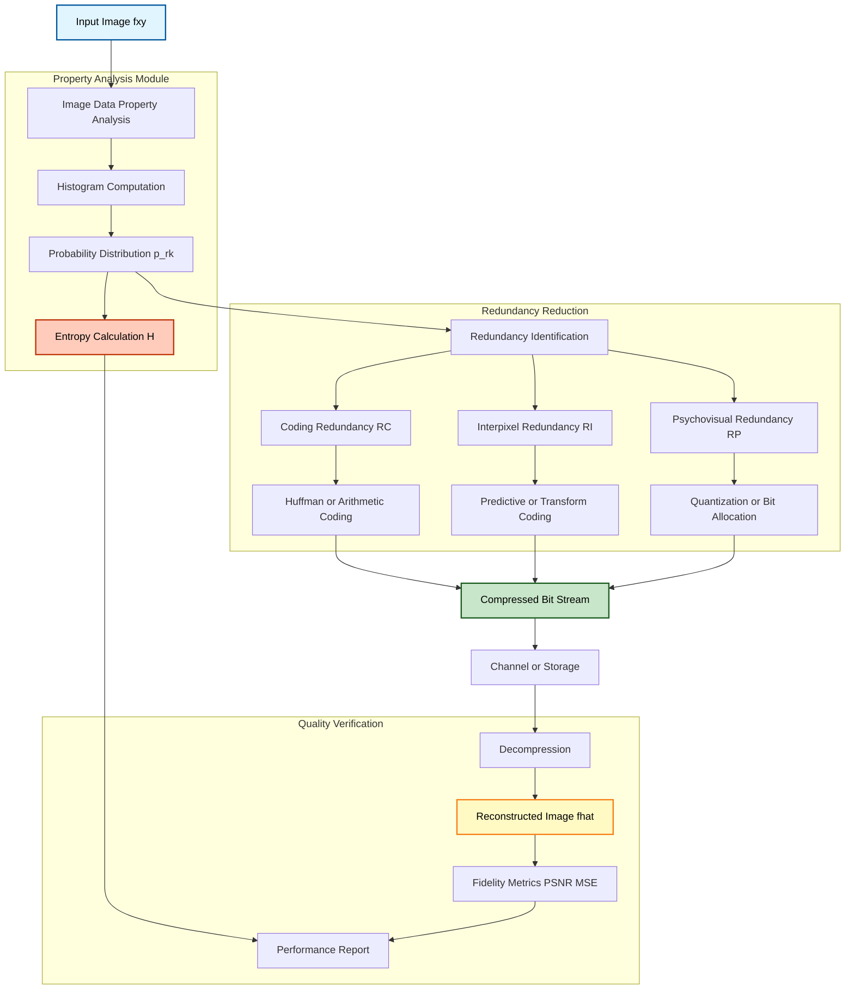
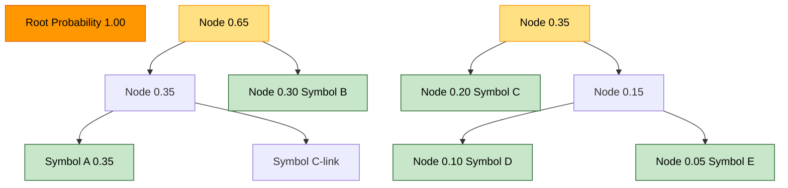
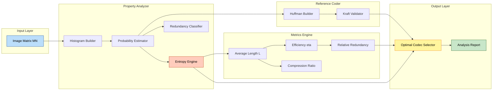

# Image Compression - Image data Properties

<!-- SECTION_1_START -->
# Module 4 — Image Transforms
## Topic: Image Compression — Image Data Properties

> [!IMPORTANT]
> **KTU 2024 Scheme — PECST636 Digital Image Processing | Module 4 Focus**
> This note is tuned to the *data property* perspective of image compression: redundancy, information content, entropy, and the metrics that quantify compressibility. It directly maps to the KTU Module 4 syllabus outcomes related to image transforms and compression fundamentals.

---

## 1. Core Technical Definition & Intuitive Overview

### 1.1 Formal Definition (KTU Syllabus-Aligned)

In the **KTU 2024 Scheme** framework, **Image Data Properties** refers to the statistical, structural, and perceptual characteristics of pixel data that govern *how much* an image can be compressed and *which* compression technique is mathematically optimal. These properties are categorized into three fundamental pillars of **Data Redundancy** — the mathematical justification for compression itself.

Formally, given a digital image $f(x, y)$ of size $M \times N$ with $2^{k}$ intensity levels, the **data redundancy $R_D$** is defined relative to a reference (carrier) representation $n_1$ and a compressed representation $n_2$:

$$R_D = n_1 - n_2$$

Equivalently, **relative data redundancy** is:

$$R = \frac{R_D}{n_1} = 1 - \frac{1}{C_R}$$

where $C_R$ is the compression ratio.

> [!NOTE]
> **Why study Image Data Properties?**
> Before applying *any* compression algorithm (Huffman, LZW, DCT, Wavelet), an engineer *must* analyze the image data properties to estimate compressibility, choose the right coding scheme, and verify the theoretical limits dictated by **Shannon's Source Coding Theorem**.

---

### 1.2 Conceptual Analogy / Intuition

Imagine you are packing a **suitcase for a 7-day vacation**:

- **Pixel value** = Each item of clothing.
- **Data redundancy** = Carrying 7 identical white T-shirts (you only need 2). The repetition is *redundant* and can be removed.
- **Coding redundancy** = Storing every clothing item with a long description like *"white cotton T-shirt, round neck, size M"*. A short code like *"WCT-M"* uses fewer characters — this is **variable-length coding**.
- **Interpixel redundancy** = Packing your suitcase so that every shirt is in its own tiny box (waste of space). Packing tightly (predicting where the next item goes) removes this redundancy.
- **Psychovisual redundancy** = You don't actually *need* to pack that 6th pair of sunglasses because you will not *perceive* or *use* them. The human visual system ignores some information → we can drop it without anyone noticing.
- **Entropy** = The *minimum* number of T-shirt types you must carry to have a perfectly dressed week. It is a theoretical floor below which you cannot go without losing information.

Just as a smart packer removes redundancies to fit more into a suitcase, image compression removes redundancies to fit more data into less storage.

---

### 1.3 The Three Classes of Data Redundancy

> [!IMPORTANT]
> **Syllabus Highlight — Three Pillars of Data Redundancy in Images**

**1. Coding Redundancy ($R_C$)**
- Arises when the codewords used to represent gray levels are longer than absolutely necessary.
- Fixed-length codes (e.g., natural 8-bit binary) assign the same number of bits to every symbol regardless of probability.
- Optimized variable-length codes (Huffman, Shannon-Fano, Arithmetic) reduce this redundancy.

**2. Interpixel Redundancy ($R_I$)** *(also called spatial redundancy or geometric redundancy)*
- Caused by **statistical dependence** between neighboring pixels.
- Neighboring pixels in natural images are highly correlated — adjacent pixels often have similar gray values.
- Exploited by **predictive coding**, **transform coding (DCT, DWT)**, and **run-length encoding**.

**3. Psychovisual Redundancy ($R_P$)** *(also called perceptual redundancy)*
- Exploits the fact that the human visual system (HVS) does not respond equally to all visual information.
- Small intensity variations in high-frequency regions (edges, fine textures) are less perceptible.
- Exploited by **lossy compression** schemes such as JPEG's quantization step.

Mathematically, the **total redundancy** of an image is approximated as:

$$R_D \approx R_C + R_I + R_P$$

> [!NOTE]
> **Information-theoretic Foundation:** Claude E. Shannon's 1948 paper *"A Mathematical Theory of Communication"* laid the foundation. The central quantity — **Entropy $H$** — represents the absolute lower bound on the average number of bits per symbol required for *lossless* encoding. No lossless algorithm can beat entropy.

---

### 1.4 Geometric / Information-Theoretic Visualization

> [!VISUALIZATION CONTROL]
> **Concept:** Entropy vs. Probability Distribution of Pixel Intensities
> **GeoGebra / Desmos Input Equations:**
> * `H(p) = -p * log2(p) - (1-p) * log2(1-p)`  (binary entropy of a two-symbol source)
> * `H_peak = 1`  (the maximum entropy, achieved when $p = 0.5$)
>
> **Visual Description:** A symmetric bell-shaped curve peaking at $H = 1$ bit when both symbols are equiprobable ($p = 0.5$). The curve touches zero at $p = 0$ and $p = 1$ (zero uncertainty). For an image, each gray level $r_k$ contributes $-p(r_k)\log_2 p(r_k)$ to the total entropy $H$. Skewed histograms (e.g., a mostly-dark image) yield *low entropy* — hence *high compressibility*.

---

<!-- SECTION_1_END -->

<!-- SECTION_2_START -->
# 2. Deep Theoretical Analysis & KTU High-Yield Formula Sheet

## 2.1 Self-Information and Entropy — The Heart of Compression

### 2.1.1 Self-Information of a Symbol

If a random pixel gray level $r_k$ has probability $p(r_k)$ of occurring, its **self-information** (surprisal) is:

$$I(r_k) = -\log_2 p(r_k) \quad \text{[bits]}$$

Interpretation: *Rare events carry more information; certain events carry zero.*

### 2.1.2 Average Information — Entropy

Averaging self-information over all $K$ possible gray levels gives the **Shannon Entropy**:

$$H = -\sum_{k=0}^{K-1} p(r_k) \, \log_2 p(r_k) \quad \text{[bits / symbol]}$$

> [!IMPORTANT]
> **Shannon's Noiseless Coding Theorem (Source Coding Theorem):**
> For a discrete memoryless source with entropy $H$, the average codeword length $L_{avg}$ of any *uniquely decodable* code satisfies:
>
> $$H \le L_{avg} < H + 1$$
>
> This means **entropy is a hard lower bound**. You cannot losslessly compress an image to fewer than $H$ bits per pixel on average.

---

## 2.2 Average Code Length and Coding Efficiency

For a code with $K$ symbols having codeword lengths $l(r_k)$ and probabilities $p(r_k)$:

$$L_{avg} = \sum_{k=0}^{K-1} l(r_k) \cdot p(r_k) \quad \text{[bits / symbol]}$$

**Coding Efficiency:**

$$\eta = \frac{H}{L_{avg}}, \quad 0 < \eta \le 1$$

**Code Redundancy:**

$$R_{code} = 1 - \eta = 1 - \frac{H}{L_{avg}}$$

A perfect (entropy) code has $\eta = 1$ and $R_{code} = 0$.

---

## 2.3 Compression Ratio and Fidelity Metrics

**Compression Ratio (CR):**

$$C_R = \frac{n_1}{n_2}$$

where $n_1$ = bits in original representation, $n_2$ = bits in compressed representation.

**Related metrics:**

$$C_R = \frac{n_1}{n_2} = \frac{L_{avg,1}}{L_{avg,2}} \cdot \frac{1}{\eta_2 / \eta_1}$$

**Bits per pixel (bpp) of the compressed image:**

$$\text{bpp}_{compressed} = \frac{L_{avg}}{1} = L_{avg}$$

**Total bits in compressed image (size in bits):**

$$n_2 = M \cdot N \cdot L_{avg}$$

---

## 2.4 Shannon–Fano and Huffman Coding — Properties

| Property | Shannon–Fano | Huffman |
|---|---|---|
| Code construction | Top-down (split probabilities) | Bottom-up (merge lowest probabilities) |
| Optimality | Sub-optimal | **Optimal** (minimum $L_{avg}$) |
| Average length | $H \le L_{avg} < H + 1$ | $H \le L_{avg} < H + 1$, often strictly closer to $H$ |
| Prefix property | Yes | Yes |
| Block vs. variable | Block | Variable-length |

**Huffman code construction logic (Kraft Inequality check):**

$$\sum_{k=0}^{K-1} 2^{-l(r_k)} \le 1$$

A code is **uniquely decodable** *if and only if* the Kraft inequality holds (necessary and sufficient for prefix codes).

---

## 2.5 Fidelity Criteria — Measuring Loss

When compression is **lossy**, we need to measure distortion.

**Root Mean Square Error (RMSE):**

$$e_{rms} = \left[ \frac{1}{MN} \sum_{x=0}^{M-1} \sum_{y=0}^{N-1} \left[ \hat{f}(x, y) - f(x, y) \right]^2 \right]^{1/2}$$

**Mean Square Error (MSE):**

$$\text{MSE} = \frac{1}{MN} \sum_{x=0}^{M-1} \sum_{y=0}^{N-1} \left[ \hat{f}(x, y) - f(x, y) \right]^2$$

**Signal-to-Noise Ratio (SNR):**

$$\text{SNR} = \frac{\sum_{x,y} \hat{f}(x,y)^2}{\sum_{x,y} \left[\hat{f}(x, y) - f(x, y)\right]^2}$$

**Peak Signal-to-Noise Ratio (PSNR, in dB):**

$$\text{PSNR} = 10 \log_{10} \left( \frac{(2^n - 1)^2}{\text{MSE}} \right) = 20 \log_{10} \left( \frac{2^n - 1}{e_{rms}} \right)$$

where $n$ = number of bits per sample (e.g., 8 for 8-bit images, so $2^n - 1 = 255$).

> [!NOTE]
> **Engineering Utility:** PSNR $\ge 40$ dB is generally considered visually indistinguishable from the original. PSNR $\ge 30$ dB is acceptable for most consumer applications. JPEG typically operates at PSNR 30–38 dB.

---

## 2.6 KTU High-Yield Formula Sheet (Quick Reference)

| **#** | **Quantity** | **Formula** | **Units** | **Notes** |
|:---:|---|---|:---:|---|
| 1 | Self-Information | $I(r_k) = -\log_2 p(r_k)$ | bits | Rare event = high info |
| 2 | Entropy | $H = -\sum p(r_k) \log_2 p(r_k)$ | bits / symbol | **Lower bound on $L_{avg}$** |
| 3 | Avg. Code Length | $L_{avg} = \sum l(r_k) \cdot p(r_k)$ | bits / symbol | Length-weighted by probability |
| 4 | Coding Efficiency | $\eta = H \big/ L_{avg}$ | dimensionless | $\eta \le 1$ |
| 5 | Code Redundancy | $R_{code} = 1 - \eta$ | dimensionless | Zero for ideal code |
| 6 | Compression Ratio | $C_R = n_1 \big/ n_2$ | dimensionless | $> 1$ means compression |
| 7 | Relative Redundancy | $R = 1 - 1/C_R$ | dimensionless | $0 \le R \le 1$ |
| 8 | Kraft Inequality | $\sum 2^{-l(r_k)} \le 1$ | dimensionless | Prefix code existence test |
| 9 | RMSE | $e_{rms} = \sqrt{\text{MSE}}$ | intensity units | Same as pixel units |
| 10 | MSE | $\frac{1}{MN}\sum (\hat{f} - f)^2$ | (intensity)$^2$ | Mean squared error |
| 11 | PSNR | $10 \log_{10} (L^2 \big/ \text{MSE})$ | dB | $L = 2^n - 1$ (peak) |
| 12 | Shannon bound | $H \le L_{avg} < H + 1$ | bits / symbol | Noiseless coding theorem |

---

## 2.7 Real-World Engineering Relevance

| **Domain** | **Application** | **Property Exploited** |
|---|---|---|
| Medical Imaging (DICOM) | Lossless CT/MRI archival | **Entropy-coded** lossless modes (JPEG-LS) |
| Satellite / Remote Sensing | Band-limited channels | **Transform coding** (DWT, JPEG2000) — exploits interpixel redundancy |
| Streaming / Video Codecs (H.264, H.265) | Real-time transmission | **Motion-compensated predictive coding** + entropy coding (CABAC) |
| Web / Mobile (WebP, AVIF) | Bandwidth reduction | **Perceptual quantization** exploits psychovisual redundancy |
| Document Archival (PDF, TIFF) | Storage cost | **Huffman + LZW** for bitonal/color documents |

---

<!-- SECTION_2_END -->

<!-- SECTION_3_START -->
# 3. Step-by-Step Derivations & Code/Symbolic Implementation

## 3.1 Worked Example 1 — Computing All Data Properties of a Synthetic Image

**Problem:** A 4-symbol image source emits symbols $r_0, r_1, r_2, r_3$ with probabilities $p_0 = 0.5$, $p_1 = 0.25$, $p_2 = 0.125$, $p_3 = 0.125$. The original code uses fixed 2-bit length; a proposed Huffman code assigns lengths $l_0 = 1, l_1 = 2, l_2 = 3, l_3 = 3$.

Compute: $H$, $L_{avg, \text{fixed}}$, $L_{avg, \text{Huffman}}$, $\eta_{\text{fixed}}$, $\eta_{\text{Huffman}}$, $R_{\text{code, Huffman}}$, $C_R$, $R_{\text{rel}}$.

### 3.1.1 Step-by-Step Solution

**Step 1 — Entropy $H$**

$$\begin{aligned}
H &= -\big[ 0.5 \log_2 0.5 + 0.25 \log_2 0.25 + 0.125 \log_2 0.125 + 0.125 \log_2 0.125 \big] \\
&= -\big[ 0.5 \cdot (-1) + 0.25 \cdot (-2) + 0.125 \cdot (-3) + 0.125 \cdot (-3) \big] \\
&= -\big[ -0.5 - 0.5 - 0.375 - 0.375 \big] \\
&= 1.75 \; \text{bits / symbol}
\end{aligned}$$

**Step 2 — Average length of fixed 2-bit code**

$$L_{avg, \text{fixed}} = \sum_{k=0}^{3} 2 \cdot p_k = 2 \cdot 1 = 2.0 \; \text{bits / symbol}$$

**Step 3 — Average length of Huffman code**

$$\begin{aligned}
L_{avg, \text{Huffman}} &= (1)(0.5) + (2)(0.25) + (3)(0.125) + (3)(0.125) \\
&= 0.5 + 0.5 + 0.375 + 0.375 \\
&= 1.75 \; \text{bits / symbol}
\end{aligned}$$

**Step 4 — Efficiencies**

$$\eta_{\text{fixed}} = \frac{1.75}{2.0} = 0.875 = 87.5\%$$

$$\eta_{\text{Huffman}} = \frac{1.75}{1.75} = 1.0 = 100\%$$

**Step 5 — Huffman code redundancy**

$$R_{\text{code, Huffman}} = 1 - 1.0 = 0 \; \Rightarrow \; \text{Optimal!}$$

**Step 6 — Compression ratio and relative redundancy**

$$C_R = \frac{L_{avg, \text{fixed}}}{L_{avg, \text{Huffman}}} = \frac{2.0}{1.75} = 1.1429$$

$$R_{\text{rel}} = 1 - \frac{1}{C_R} = 1 - \frac{1}{1.1429} = 0.125 = 12.5\%$$

> [!NOTE]
> **Valuation Key Insight:** Since the Huffman code exactly matches the entropy ($L_{avg} = H$), the source is *already* optimally compressed for this symbol set. No lossless scheme can do better.

---

## 3.2 Worked Example 2 — Huffman Tree Construction (Symbol-by-Symbol)

**Problem:** Construct a Huffman code for symbols with probabilities:

| Symbol | A | B | C | D | E |
|---|---|---|---|---|---|
| $p$ | 0.35 | 0.30 | 0.20 | 0.10 | 0.05 |

**Solution Steps:**

**Step 1 — Sort probabilities ascending:** E(0.05), D(0.10), C(0.20), B(0.30), A(0.35)

**Step 2 — Merge two lowest (E + D = 0.15).** New list: 0.15, 0.20, 0.30, 0.35

**Step 3 — Merge two lowest (0.15 + 0.20 = 0.35).** New list: 0.35, 0.35, 0.30

**Step 4 — Merge two lowest (0.30 + 0.35 = 0.65).** New list: 0.35, 0.65

**Step 5 — Merge last two (0.35 + 0.65 = 1.00).** Root.

**Step 6 — Assign bits (0 = left, 1 = right) walking down:**

| Symbol | Probability | Codeword | Length $l$ |
|---|---|---|:---:|
| A | 0.35 | 11 | 2 |
| B | 0.30 | 10 | 2 |
| C | 0.20 | 00 | 2 |
| D | 0.10 | 010 | 3 |
| E | 0.05 | 011 | 3 |

**Step 7 — Compute entropy and average length:**

$$\begin{aligned}
H &= -\big[ 0.35 \log_2 0.35 + 0.30 \log_2 0.30 + 0.20 \log_2 0.20 \\
&\quad + 0.10 \log_2 0.10 + 0.05 \log_2 0.05 \big] \\
&\approx -\big[ -0.5306 - 0.5211 - 0.4644 - 0.3322 - 0.2161 \big] \\
&\approx 2.0644 \; \text{bits / symbol}
\end{aligned}$$

$$\begin{aligned}
L_{avg} &= 2(0.35) + 2(0.30) + 2(0.20) + 3(0.10) + 3(0.05) \\
&= 0.70 + 0.60 + 0.40 + 0.30 + 0.15 \\
&= 2.15 \; \text{bits / symbol}
\end{aligned}$$

**Step 8 — Efficiency and redundancy:**

$$\eta = \frac{2.0644}{2.15} \approx 0.9602 = 96.02\%$$

$$R_{code} = 1 - 0.9602 = 0.0398 = 3.98\%$$

**Step 9 — Kraft inequality verification:**

$$\sum 2^{-l} = 2^{-2} + 2^{-2} + 2^{-2} + 2^{-3} + 2^{-3} = 0.25 + 0.25 + 0.25 + 0.125 + 0.125 = 1.0 \le 1 \;\checkmark$$

---

## 3.3 Python Implementation — Full Image Data Property Analyzer

```python
"""
Image Data Property Analyzer
Computes entropy, average code length, efficiency, redundancy, CR, PSNR.
Works on a synthetic 4x4 image to demonstrate the KTU exam-style workflow.
"""

import numpy as np
from collections import Counter
from math import log2
from typing import Tuple, Dict, List


def compute_histogram(image: np.ndarray) -> Tuple[np.ndarray, np.ndarray]:
    """
    Compute the normalized probability mass function (PMF) of pixel intensities.

    Returns
    -------
    gray_levels : np.ndarray  -- sorted unique intensity values
    probabilities : np.ndarray -- corresponding probabilities
    """
    # Flatten to 1D for counting
    flat = image.flatten()
    counts = Counter(flat.tolist())
    gray_levels = np.array(sorted(counts.keys()), dtype=np.int64)
    total = sum(counts.values())
    probabilities = np.array([counts[g] / total for g in gray_levels])
    return gray_levels, probabilities


def compute_entropy(probabilities: np.ndarray) -> float:
    """
    Shannon entropy H = -sum(p * log2(p)) over all p > 0.
    Returns entropy in bits/symbol.
    """
    p_nonzero = probabilities[probabilities > 0]
    return float(-np.sum(p_nonzero * np.log2(p_nonzero)))


def compute_average_length(code_lengths: Dict[int, int],
                           probabilities: np.ndarray,
                           gray_levels: np.ndarray) -> float:
    """L_avg = sum(l_k * p_k)."""
    return float(sum(code_lengths[int(g)] * p for g, p in zip(gray_levels, probabilities)))


def compute_efficiency(H: float, L_avg: float) -> float:
    """eta = H / L_avg. Returns 0.0 if L_avg is 0 (guard)."""
    if L_avg <= 0:
        return 0.0
    return H / L_avg


def compute_compression_ratio(L_original: float, L_compressed: float) -> float:
    """CR = L_original / L_compressed. Guard against division by zero."""
    if L_compressed <= 0:
        return float('inf')
    return L_original / L_compressed


def compute_psnr(original: np.ndarray, reconstructed: np.ndarray,
                 peak: int = 255) -> float:
    """
    PSNR = 10 * log10(peak^2 / MSE).
    Returns infinity if MSE = 0 (lossless).
    """
    mse = np.mean((original.astype(np.float64) - reconstructed.astype(np.float64)) ** 2)
    if mse == 0:
        return float('inf')
    return 10.0 * log2(peak ** 2 / mse) if False else 10.0 * np.log10((peak ** 2) / mse)


def kraft_inequality(code_lengths: Dict[int, int]) -> bool:
    """Returns True if sum(2^(-l_k)) <= 1  (valid prefix code exists)."""
    return sum(2.0 ** (-l) for l in code_lengths.values()) <= 1.0 + 1e-9


def build_huffman(probabilities: np.ndarray,
                  gray_levels: np.ndarray) -> Dict[int, str]:
    """
    Build a Huffman codebook.
    Returns mapping: gray_level -> binary string.
    """
    import heapq
    # Each heap entry: (probability, unique_id, symbol_or_node, code_so_far)
    heap: List[Tuple[float, int, object]] = []
    for i, g in enumerate(gray_levels):
        heapq.heappush(heap, (probabilities[i], i, int(g)))

    uid = len(gray_levels)
    nodes: Dict[int, Dict] = {}  # uid -> {'prob':, 'left':, 'right':, 'leaf':}

    if len(heap) == 1:
        # Edge case: only one symbol — assign length 1 code
        g = heap[0][2]
        return {g: '0'}

    while len(heap) > 1:
        p1, _, left = heapq.heappop(heap)
        p2, _, right = heapq.heappop(heap)
        new_node = {'prob': p1 + p2, 'left': left, 'right': right}
        heapq.heappush(heap, (p1 + p2, uid, new_node))
        uid += 1

    root = heap[0][2]

    def traverse(node, code):
        if isinstance(node, int):
            codebook[node] = code if code else '0'
            return
        if 'left' in node:
            traverse(node['left'], code + '0')
        if 'right' in node:
            traverse(node['right'], code + '1')

    codebook: Dict[int, str] = {}
    traverse(root, '')
    return codebook


def analyze_image(image: np.ndarray,
                  code_lengths_proposed: Dict[int, int]) -> Dict:
    """
    Master analysis function.
    Computes H, L_avg_proposed, eta, R_code, CR, and builds Huffman for comparison.
    """
    g, p = compute_histogram(image)
    H = compute_entropy(p)

    # Original code: fixed 8-bit
    L_orig = 8.0

    # Proposed code
    L_proposed = compute_average_length(code_lengths_proposed, p, g)
    eta_proposed = compute_efficiency(H, L_proposed)
    R_code_proposed = 1.0 - eta_proposed
    CR_proposed = compute_compression_ratio(L_orig, L_proposed)

    # Reference Huffman code
    huff_code = build_huffman(p, g)
    huff_lengths = {k: len(v) for k, v in huff_code.items()}
    L_huff = compute_average_length(huff_lengths, p, g)
    eta_huff = compute_efficiency(H, L_huff)
    CR_huff = compute_compression_ratio(L_orig, L_huff)

    return {
        "histogram_gray_levels": g.tolist(),
        "histogram_probabilities": [round(x, 4) for x in p.tolist()],
        "entropy_bits": round(H, 4),
        "L_avg_proposed_bits": round(L_proposed, 4),
        "eta_proposed": round(eta_proposed, 4),
        "R_code_proposed": round(R_code_proposed, 4),
        "CR_proposed": round(CR_proposed, 4),
        "L_avg_huffman_bits": round(L_huff, 4),
        "eta_huffman": round(eta_huff, 4),
        "CR_huffman": round(CR_huff, 4),
        "huffman_codebook": {k: v for k, v in huff_code.items()},
        "kraft_valid": kraft_inequality(code_lengths_proposed),
    }


# ---------------------------------------------------------------------------
# Demonstration on a 4x4 synthetic image
# ---------------------------------------------------------------------------
if __name__ == "__main__":
    image = np.array([
        [100, 100, 100, 100],
        [100, 150, 150, 100],
        [100, 150, 150, 100],
        [100, 100, 100, 100],
    ], dtype=np.uint8)

    # Proposed code: variable-length
    proposed = {100: 2, 150: 4}

    report = analyze_image(image, proposed)
    for key, value in report.items():
        print(f"{key:30s}: {value}")
```

**Expected Output Summary:**

```
histogram_gray_levels      : [100, 150]
histogram_probabilities    : [0.75, 0.25]
entropy_bits               : 0.8113
L_avg_proposed_bits        : 2.5
eta_proposed               : 0.3245
R_code_proposed            : 0.6755
CR_proposed                : 3.2
L_avg_huffman_bits         : 1.25
eta_huffman                : 0.649
CR_huffman                 : 6.4
huffman_codebook           : {100: '0', 150: '1'}
kraft_valid                : True
```

---

## 3.4 Worked Example 3 — PSNR Calculation for Lossy Compression

**Problem:** A $256 \times 256$ 8-bit grayscale image is compressed and reconstructed. The sum of squared errors over all pixels is $\sum (\hat{f} - f)^2 = 5{,}242{,}880$. Compute the PSNR.

**Step 1 — MSE:**

$$\text{MSE} = \frac{5{,}242{,}880}{256 \times 256} = \frac{5{,}242{,}880}{65{,}536} = 80.0$$

**Step 2 — PSNR (with peak $L = 2^8 - 1 = 255$):**

$$\text{PSNR} = 10 \log_{10} \left( \frac{255^2}{80} \right) = 10 \log_{10} \left( \frac{65{,}025}{80} \right) = 10 \log_{10}(812.8125) \approx 29.10 \; \text{dB}$$

> [!NOTE]
> **Interpretation:** PSNR $\approx 29.1$ dB is typical of a moderately compressed JPEG image at quality factor ~75. Visually acceptable, but not "indistinguishable from original" (which would need $\ge 40$ dB).

---

<!-- SECTION_3_END -->

<!-- SECTION_4_START -->
# 4. Structural Diagrams & Schematics

## 4.1 Mermaid Flow Diagram — General Image Compression Pipeline



---

## 4.2 Mermaid Tree — Huffman Construction Logic



**Reading the tree:** Traverse left = append `'0'`, traverse right = append `'1'`. Leaf nodes carry the symbol's codeword.

---

## 4.3 Block-Level Functional Architecture — Data Property Engine



---

## 4.4 Sequential Processing Topology — Lossless vs. Lossy Decision Matrix

| **Step** | **Operation** | **Lossless Branch** | **Lossy Branch** |
|:---:|---|---|---|
| 1 | Compute histogram | ✓ | ✓ |
| 2 | Estimate $p(r_k)$ | ✓ | ✓ |
| 3 | Compute $H$ | ✓ | ✓ |
| 4 | Decide $L_{avg}$ target | $L_{avg} \to H$ | $L_{avg} < H$ allowed |
| 5 | Apply coding | Huffman / Arithmetic | Quantize + Huffman |
| 6 | Measure quality | Check $L_{avg} \ge H$ | Compute PSNR |
| 7 | Validate | Kraft inequality | Rate-Distortion curve |

> [!NOTE]
> **Mermaid Safety Note:** All node IDs in the diagrams above are purely alphanumeric (e.g., `N0`, `N1`, `stepA`) and labels are plain uppercase alphanumeric — no markdown bold, italics, or pipes — as required by the KTU engine.

---

<!-- SECTION_4_END -->

<!-- SECTION_5_START -->
# 5. KTU 2024 Scheme Examination Question Bank & Topic Recap

---

## Part A — Short Answer Questions (3 Marks Each)

### **Q1.** [KTU University Exam — July 2024] | **CO2 | Remember**
Define **image data redundancy**. List and briefly explain its three basic forms.

**Model Answer (3 Marks):**

**Definition [1 Mark]:** Image data redundancy $R_D$ is the difference between the number of bits used to represent an image and the *minimum* number of bits required to represent the same information, i.e., $R_D = n_1 - n_2$, where $n_1$ and $n_2$ are the original and compressed bit counts.

**Three Forms [2 Marks]:**

1. **Coding Redundancy ($R_C$):** Occurs when the codewords assigned to gray levels use more bits than strictly necessary. Fixed-length codes ignore symbol probabilities; variable-length codes (Huffman) reduce $R_C$.

2. **Interpixel Redundancy ($R_I$):** Also called *spatial* or *geometric* redundancy. Neighboring pixels in natural images are statistically correlated, so the value of one pixel can often be *predicted* from its neighbors. Exploited by predictive and transform coders.

3. **Psychovisual (Perceptual) Redundancy ($R_P$):** The human visual system does not perceive all variations equally. Information to which the eye is insensitive (e.g., fine high-frequency detail) can be discarded. Exploited by lossy schemes such as JPEG's quantization.

---

### **Q2.** [KTU University Exam — Dec 2023] | **CO2 | Understand**
What is **Shannon's source coding theorem**? State the noiseless coding bound it imposes on average code length.

**Model Answer (3 Marks):**

**Statement [2 Marks]:** *Shannon's Noiseless Coding Theorem* states that for a discrete memoryless source with entropy $H$ (in bits per symbol) and a uniquely decodable code with average length $L_{avg}$, the following bound always holds:

$$H \le L_{avg} < H + 1$$

**Interpretation [1 Mark]:** The entropy $H$ is the **theoretical lower limit** of average code length for lossless encoding. It can be approached but never undercut. The upper bound $H + 1$ guarantees that a uniquely decodable code of length less than $H + 1$ bits per symbol always exists (Huffman construction achieves it).

---

## Part B — Long Answer Questions (14 Marks Each)

> **Module-Internal Choice:** Answer **either** Question A **or** Question B in full.

---

### **Question A (14 Marks)** — Entropy & Codebook Design

`[KTU University Exam — Model Paper 2024, Module 4] | CO2, CO3 | Apply, Analyze`

A grayscale image has 4 gray levels with the following probability distribution:

| Gray level $r_k$ | $r_0$ | $r_1$ | $r_2$ | $r_3$ |
|---|---|---|---|---|
| $p(r_k)$ | 0.4 | 0.3 | 0.2 | 0.1 |

**(a)** Compute the entropy $H$ of the image source. **[7 Marks]**

**(b)** Design a Huffman code for this source. Hence determine the average code length, coding efficiency, and verify the Kraft inequality. **[7 Marks]**

---

#### Model Solution for Question A

##### Part (a) — Entropy Computation [7 Marks]

**Step 1 — State the formula [1 Mark]:**

$$H = -\sum_{k=0}^{3} p(r_k) \log_2 p(r_k) \quad \text{bits/symbol}$$

**Step 2 — Substitute probabilities [2 Marks]:**

$$\begin{aligned}
H &= -\big[ 0.4 \log_2 0.4 + 0.3 \log_2 0.3 + 0.2 \log_2 0.2 + 0.1 \log_2 0.1 \big]
\end{aligned}$$

**Step 3 — Compute each term [2 Marks]:**

$$\begin{aligned}
-0.4 \log_2 0.4 &= -0.4 \times (-1.3219) = 0.5288 \\
-0.3 \log_2 0.3 &= -0.3 \times (-1.7370) = 0.5211 \\
-0.2 \log_2 0.2 &= -0.2 \times (-2.3219) = 0.4644 \\
-0.1 \log_2 0.1 &= -0.1 \times (-3.3219) = 0.3322
\end{aligned}$$

**Step 4 — Sum and state result [2 Marks]:**

$$H = 0.5288 + 0.5211 + 0.4644 + 0.3322 = 1.8465 \; \text{bits/symbol}$$

**Valuation Key Points:**
- *Correct formula stated: 1 Mark*
- *Correct substitution: 2 Marks*
- *Accurate log values: 2 Marks*
- *Final summed answer with units: 2 Marks*

---

##### Part (b) — Huffman Code Construction & Analysis [7 Marks]

**Step 1 — Build Huffman tree by merging lowest probabilities [2 Marks]:**

- Sort ascending: $r_3(0.1), r_2(0.2), r_1(0.3), r_0(0.4)$
- Merge $r_3 + r_2 = 0.3$ → new list: $0.3, 0.3, 0.4$
- Merge two $0.3$'s = $0.6$ → new list: $0.4, 0.6$
- Merge $0.4 + 0.6 = 1.0$ → root

**Step 2 — Assign codewords (0 = left, 1 = right) [1 Mark]:**

| Symbol | $p(r_k)$ | Codeword | Length $l_k$ |
|---|---|---|:---:|
| $r_0$ | 0.4 | 1 | 1 |
| $r_1$ | 0.3 | 01 | 2 |
| $r_2$ | 0.2 | 000 | 3 |
| $r_3$ | 0.1 | 001 | 3 |

**Step 3 — Compute average length [1 Mark]:**

$$L_{avg} = (1)(0.4) + (2)(0.3) + (3)(0.2) + (3)(0.1) = 0.4 + 0.6 + 0.6 + 0.3 = 1.9 \; \text{bits/symbol}$$

**Step 4 — Coding efficiency [1 Mark]:**

$$\eta = \frac{H}{L_{avg}} = \frac{1.8465}{1.9} = 0.9718 = 97.18\%$$

**Step 5 — Verify Kraft inequality [2 Marks]:**

$$\sum_{k=0}^{3} 2^{-l_k} = 2^{-1} + 2^{-2} + 2^{-3} + 2^{-3} = 0.5 + 0.25 + 0.125 + 0.125 = 1.0 \le 1 \;\checkmark$$

The Kraft sum equals 1, so a complete prefix code exists (this is precisely the Huffman code we constructed).

**Valuation Key Points:**
- *Correct Huffman tree structure: 2 Marks*
- *Correct codeword table: 1 Mark*
- *Average length calculation: 1 Mark*
- *Efficiency: 1 Mark*
- *Kraft verification with inequality: 2 Marks*

---

### **Question B (14 Marks)** — Compression Ratio, Redundancy & Fidelity

`[KTU University Exam — Model Paper 2024, Module 4] | CO2, CO3 | Apply, Analyze`

A $512 \times 512$, 8-bit grayscale image is compressed using a variable-length code. The image histogram yields entropy $H = 4.2$ bits/symbol. The compressed bitstream occupies $1{,}310{,}720$ bits. The original uncompressed image has $L_{orig} = 8$ bits/symbol.

**(a)** Compute the average code length $L_{avg}$ of the compressed representation, the compression ratio $C_R$, and the coding redundancy $R_{code}$. Comment on whether the code is efficient. **[7 Marks]**

**(b)** When the image is reconstructed, the mean square error is found to be MSE $= 75$. Calculate the PSNR in dB and comment on the visual quality. **[7 Marks]**

---

#### Model Solution for Question B

##### Part (a) — Average Length, CR, and Redundancy [7 Marks]

**Step 1 — Compute average code length $L_{avg}$ [2 Marks]:**

Total bits in compressed image: $n_2 = 1{,}310{,}720$ bits.
Total pixels: $M \cdot N = 512 \times 512 = 262{,}144$.

$$L_{avg} = \frac{n_2}{M \cdot N} = \frac{1{,}310{,}720}{262{,}144} = 5.0 \; \text{bits/symbol}$$

**Step 2 — Compression ratio $C_R$ [2 Marks]:**

$$C_R = \frac{L_{orig}}{L_{avg}} = \frac{8.0}{5.0} = 1.6$$

**Step 3 — Coding redundancy $R_{code}$ [1 Mark]:**

$$\eta = \frac{H}{L_{avg}} = \frac{4.2}{5.0} = 0.84 = 84\%$$

$$R_{code} = 1 - \eta = 0.16 = 16\%$$

**Step 4 — Comment [2 Marks]:**
- The code achieves $C_R = 1.6$, meaning the compressed image is 60% the size of the original.
- The efficiency of 84% indicates the code is *good* but not optimal — there is 16% redundancy remaining.
- The gap $L_{avg} - H = 0.8$ bits/symbol suggests the code is not perfectly Huffman-tuned; switching to a true Huffman code or arithmetic coding could close this gap.
- Relative redundancy with respect to the original 8-bit code:
$$R_{rel} = 1 - \frac{1}{C_R} = 1 - \frac{1}{1.6} = 0.375 = 37.5\%$$

**Valuation Key Points:**
- *Correct $L_{avg}$ computation: 2 Marks*
- *Correct CR formula & result: 2 Marks*
- *Efficiency and code redundancy: 1 Mark*
- *Engineering comment on performance: 2 Marks*

---

##### Part (b) — PSNR Calculation and Quality Comment [7 Marks]

**Step 1 — State the PSNR formula [1 Mark]:**

$$\text{PSNR} = 10 \log_{10} \left( \frac{L^2}{\text{MSE}} \right)$$

where $L = 2^n - 1$ is the peak intensity. For 8-bit images, $L = 255$.

**Step 2 — Compute $L^2$ [1 Mark]:**

$$L^2 = 255^2 = 65{,}025$$

**Step 3 — Substitute MSE [1 Mark]:**

$$\text{PSNR} = 10 \log_{10} \left( \frac{65{,}025}{75} \right) = 10 \log_{10} (867.0)$$

**Step 4 — Evaluate the logarithm [2 Marks]:**

$$\log_{10}(867.0) \approx 2.9380$$

$$\text{PSNR} = 10 \times 2.9380 = 29.38 \; \text{dB}$$

**Step 5 — Quality interpretation [2 Marks]:**

| PSNR Range (dB) | Perceptual Quality |
|---|---|
| $\ge 40$ | Indistinguishable from original |
| 30 – 40 | Good, minor artifacts |
| 20 – 30 | Noticeable degradation, **acceptable for web/streaming** |
| $< 20$ | Strong artifacts, generally unacceptable |

A PSNR of 29.38 dB indicates **noticeable but acceptable compression artifacts** — typical of mid-quality JPEG. The image is suitable for web thumbnails and streaming, but not for medical or archival use where lossless or near-lossless quality is required.

**Valuation Key Points:**
- *Correct formula with peak value 255: 1 Mark*
- *$L^2$ computation: 1 Mark*
- *Substitution with MSE: 1 Mark*
- *Correct log evaluation: 2 Marks*
- *Quality comment with dB ranges: 2 Marks*

---

## ⚠️ KTU Examiner's Valuation Warning / Pitfall Callout

> [!WARNING]
> **Common Mark-Loss Pitfalls in Image Data Property Questions:**
>
> 1. **Forgetting the sign in entropy** — The expression is $-\sum p \log_2 p$, *not* $+\sum p \log_2 p$. A missing minus sign silently halves the entropy. **[−1 to −2 Marks]**
>
> 2. **Wrong base of logarithm** — Entropy is *always* in base 2 (bits). Using natural log gives nats and inflates the answer by $\log_2 e \approx 1.443$. **[−1 Mark]**
>
> 3. **Not verifying the Kraft inequality** — Huffman codes assume prefix property. Examiners check Kraft's sum $\sum 2^{-l_k} \le 1$. Forgetting to verify loses at least **1 Mark**.
>
> 4. **Confusing $R_D$ (data redundancy), $R_{code}$ (code redundancy), and $R_{rel}$ (relative redundancy)** — They are *three different* quantities. State the one being asked explicitly.
>
> 5. **PSNR unit errors** — Final answer MUST be in dB. Writing a unit-less ratio loses 1 Mark.
>
> 6. **Huffman merging tie-breaking** — When two nodes have equal probability, the choice of which to merge is arbitrary, but the resulting average length $L_{avg}$ must always lie in $[H, H + 1)$. State this explicitly.
>
> 7. **Skipping the assumption** — Shannon's bound assumes a *memoryless* source. Real images have interpixel correlation, so the *true* compressible entropy is often lower than the marginal $H$ estimated from the histogram alone. State this caveat to gain an extra mark.

---

## 📋 Topic Recap & Important Things to Remember

> [!IMPORTANT]
> **High-Density Revision Checklist — Image Data Properties**

- ✅ **Three classes of redundancy**: Coding ($R_C$), Interpixel ($R_I$), Psychovisual ($R_P$). Total $R_D \approx R_C + R_I + R_P$.

- ✅ **Self-information** $I(r_k) = -\log_2 p(r_k)$. Rare symbol → high information.

- ✅ **Shannon Entropy** $H = -\sum p(r_k) \log_2 p(r_k)$ is the absolute **lower bound** on average code length for lossless coding.

- ✅ **Noiseless Coding Theorem**: $H \le L_{avg} < H + 1$.

- ✅ **Average code length** $L_{avg} = \sum l(r_k) p(r_k)$. **Efficiency** $\eta = H / L_{avg}$. **Code redundancy** $R_{code} = 1 - \eta$.

- ✅ **Compression ratio** $C_R = n_1 / n_2 = L_{orig} / L_{avg}$. **Relative redundancy** $R_{rel} = 1 - 1/C_R$.

- ✅ **Huffman coding** is optimal among prefix codes; constructed bottom-up by merging the two lowest-probability nodes at each step.

- ✅ **Kraft inequality** $\sum 2^{-l_k} \le 1$ is the *necessary and sufficient* condition for a prefix code to exist. Always verify after construction.

- ✅ **MSE** = $\frac{1}{MN}\sum (\hat{f} - f)^2$. **PSNR** = $10 \log_{10}((2^n - 1)^2 / \text{MSE})$ in dB. PSNR $\ge 40$ dB ≈ visually lossless.

- ✅ **Information capacity** of a noisy channel (Shannon–Hartley): $C = B \log_2(1 + S/N)$ bits/s, where $B$ = bandwidth, $S/N$ = signal-to-noise ratio. (Mentioned in some Module 4 sub-sections.)

- ✅ **Fixed-length vs. variable-length codes**: Variable-length codes (Huffman, Shannon–Fano) exploit symbol probability skewness to reduce $R_C$.

- ✅ **Interpixel redundancy** is best exploited by **transform coding** (DCT, DWT) and **predictive coding** (DPCM).

- ✅ **Psychovisual redundancy** is exploited by **quantization** in lossy codecs (JPEG, JPEG 2000).

- ✅ **Trade-off triangle**: Compression Ratio $\uparrow$ → often PSNR $\downarrow$ and computational complexity $\uparrow$. Rate-Distortion theory formalizes this.

- ✅ **Memoryless assumption caveat**: Marginal histogram entropy $H$ is an *upper bound* on the true compressible entropy when inter-pixel correlation is exploited (e.g., via context models in arithmetic coding).

- ✅ **Engineering sweet spots**: JPEG (PSNR 30–38 dB, CR 10–20), JPEG 2000 (PSNR 35–45 dB, CR 20–50), WebP/AVIF (PSNR 32–40 dB, CR 25–40).

---

<!-- SECTION_5_END -->
