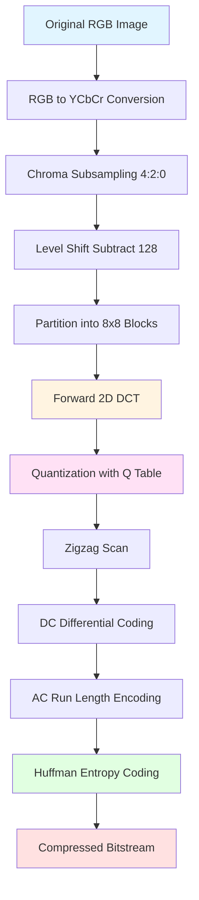
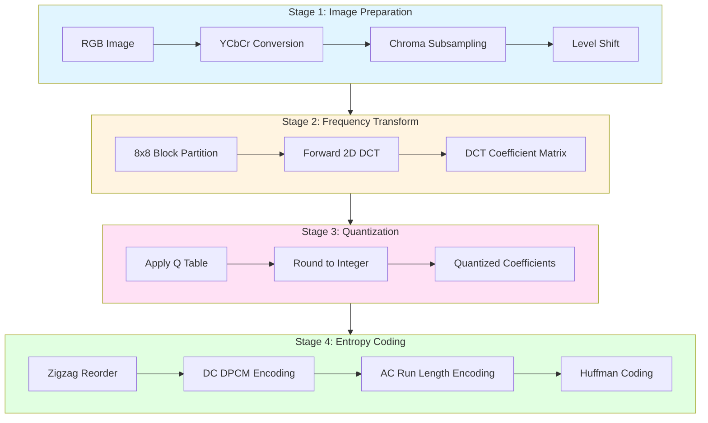
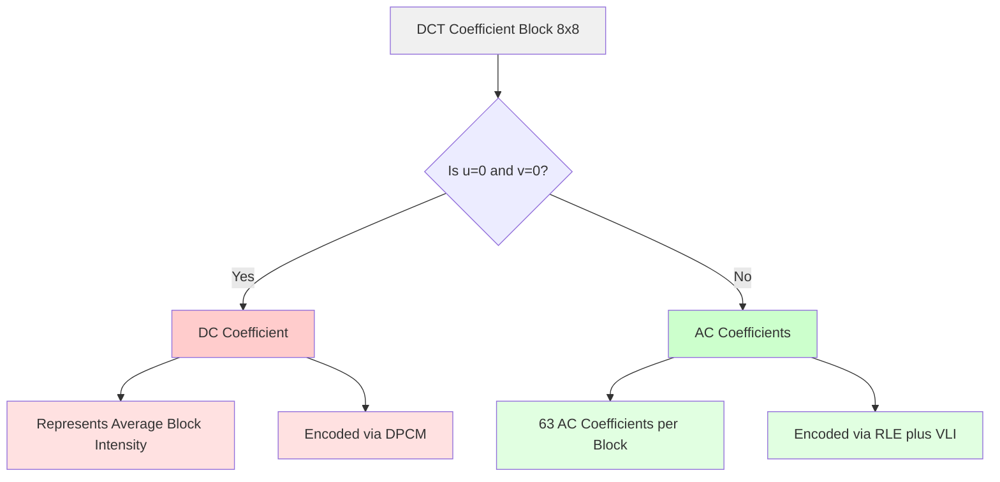
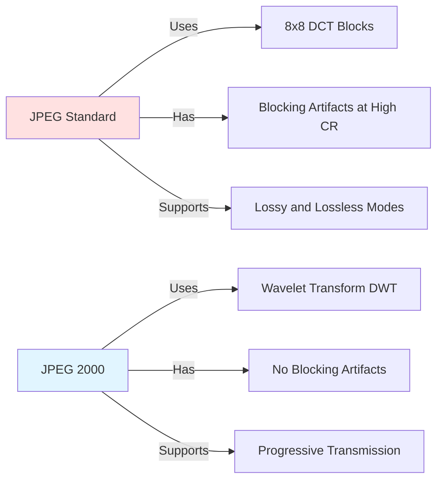
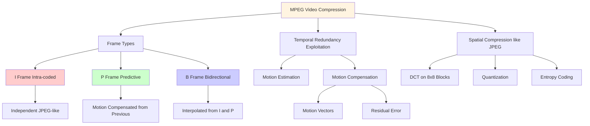

# JPEG and MPEG image compression JPEG still image compression

<!-- SECTION_1_START -->
# JPEG Still Image Compression — Core Technical Definition & Intuitive Overview

## 1.1 Formal Academic Definition (KTU 2024 Scheme Aligned)

> [!IMPORTANT]
> **JPEG (Joint Photographic Experts Group)** is an international standard (ISO/IEC 10918) for **lossy** continuous-tone still image compression. It exploits **perceptual redundancy** in the human visual system (HVS) and **statistical redundancy** in pixel data using the **Discrete Cosine Transform (DCT)**, followed by **quantization** and **entropy coding (Huffman/Arithmetic)**. The standard also defines a **lossless** and a **hierarchical** mode, but the **Baseline Sequential DCT mode** is the most widely implemented variant.

The Baseline JPEG pipeline operates on **8 × 8 pixel blocks** and reduces a typical 24-bit RGB color image to roughly 1 bit/pixel (a **compression ratio of ~20:1**) with imperceptible visual loss.

> [!NOTE]
> **Why JPEG uses 8×8 blocks?** Because the DCT basis functions for an N×N block grow in frequency granularity with N. A block size of **8** is the optimal trade-off chosen by the ISO committee between computational cost, blocking artifacts, and frequency resolution.

---

## 1.2 Conceptual Analogy / Geometric Intuition

Imagine you have a **photograph of a sunset**. The sky is mostly smooth gradients of orange and red, the sun is a small bright disc, and the horizon has a thin jagged line of trees. If you store every single pixel's RGB value, you waste bits on the smooth sky (where neighboring pixels are nearly identical) and also on color values the human eye **cannot distinguish** (like a slight 0.3% shift in deep blue).

**JPEG does three clever things** (like packing a suitcase):

1. **Frequency separation (DCT)** — JPEG asks: *"Where in this 8×8 block is the data changing rapidly (high frequency) vs. changing slowly (low frequency)?"* The smooth sky → low frequency, the tree-line edge → high frequency. Most natural images are dominated by **low frequencies**, so a few coefficients can describe most of the block.

2. **Aggressive removal of invisible data (Quantization)** — Human eyes are **far more sensitive to brightness (luminance)** than to color (**chrominance**). JPEG throws away high-frequency information and most chrominance detail because *we simply cannot see it missing*.

3. **Compact symbol encoding (Entropy Coding)** — The remaining numbers are mostly **small**, with occasional **large** values. Huffman coding assigns **shorter codes** to frequent values, squeezing the data even smaller — like using shorthand ("LOL" instead of "Laughing Out Loud").

---

## 1.3 The Three Colorimetric Spaces Used in JPEG

JPEG does **not** compress RGB directly. It first converts the image into **YCbCr**:

| Channel | Meaning | Human Sensitivity | Sampling |
|---|---|---|---|
| **Y** | Luminance (brightness) | Very High | Full (4:4:4) |
| **Cb** | Blue-Difference Chroma | Low | Often halved (4:2:0) |
| **Cr** | Red-Difference Chroma | Low | Often halved (4:2:0) |

The conversion from RGB (each 0–255) is:
$$
\begin{aligned}
Y  &= 0.299R + 0.587G + 0.114B \\
C_b &= -0.168736R - 0.331264G + 0.500B + 128 \\
C_r &= 0.500R - 0.418688G - 0.081312B + 128
\end{aligned}
$$

> [!TIP]
> The **+128** offset on chroma channels centers them at mid-gray so they can be stored as unsigned 8-bit values like luminance.

---

## 1.4 Key Physical / Mathematical Constants

| Constant | Value | Used In |
|---|---|---|
| **JPEG Standard 8×8 block size** | $N = 8$ | DCT block size |
| **Default quality factor** | $Q = 75$ (out of 100) | Standardized luminance matrix |
| **Standard chroma subsampling** | 4:2:0 | Reduces color by 2× horizontally and vertically |
| **Baseline JPEG max compression** | ~100:1 (extreme) | Trade-off: visible blocking |
| **DCT coefficient range** | $-1024$ to $+1023$ | After forward DCT of 8-bit input |

> [!VISUALIZATION CONTROL]
> **Concept:** YCbCr Chrominance Subsampling Lattice (4:2:0)
> **Desmos Input Equations (representing the sampling lattice on a coordinate grid):**
> * Y plane: $\{(x, y) \mid x, y \in \{0,1,2,3,4,5,6,7\}\}$ — all 64 points
> * Cb plane: $\{(x, y) \mid x, y \in \{0,2,4,6\}\}$ — only 16 points
> * Cr plane: $\{(x, y) \mid x, y \in \{0,2,4,6\}\}$ — only 16 points
> **Visual Description:** A 2D grid where every Y pixel is recorded, but chroma pixels are sampled only on a checkerboard 2× reduced grid. This visually conveys the 75% reduction in color data.

---
<!-- SECTION_1_END -->

<!-- SECTION_2_START -->
# Deep Theoretical Analysis & KTU High-Yield Formula Sheet

## 2.1 The JPEG Compression Pipeline (Encoder)

The Baseline Sequential JPEG encoder executes the following 7 sequential operations:

1. **RGB → YCbCr color space conversion** (and optional chroma subsampling 4:2:0 / 4:2:2 / 4:4:4)
2. **Level shift**: subtract **128** from every sample so that the range becomes $[-128, +127]$ (a symmetric range centered at zero, optimal for DCT).
3. **Partition** the image into non-overlapping **8×8 blocks**.
4. **Forward 2-D DCT** on each block, producing an 8×8 block of frequency coefficients $F(u,v)$.
5. **Quantization** of each coefficient using a **luminance** or **chrominance quantization table** ($Q(u,v)$). The quantized value is $\hat{F}(u,v) = \text{round}\!\left(\dfrac{F(u,v)}{Q(u,v)}\right)$.
6. **Zigzag scan** to convert the 8×8 block into a 1×64 vector (low frequencies first, high frequencies trailing).
7. **Entropy coding** of the DC coefficient (using **DPCM** + Huffman) and the AC coefficients (using **Run-Length Encoding (RLE)** + Huffman).

## 2.2 The Forward 2-D Discrete Cosine Transform (DCT-II)

For an $8 \times 8$ block of input samples $f(x, y)$ with $x, y \in \{0, 1, \ldots, 7\}$:

$$
F(u, v) = \frac{1}{4}\,C(u)\,C(v) \sum_{x=0}^{7}\sum_{y=0}^{7} f(x, y)\,\cos\!\left[\frac{(2x+1)u\pi}{16}\right]\cos\!\left[\frac{(2y+1)v\pi}{16}\right]
$$

where the **normalization constants** are:

$$
C(k) = \begin{cases} \dfrac{1}{\sqrt{2}}, & k = 0 \\[4pt] 1, & k = 1, 2, \ldots, 7 \end{cases}
$$

The **Inverse DCT (IDCT)** to recover $f(x, y)$ from $F(u, v)$ is:

$$
f(x, y) = \frac{1}{4}\sum_{u=0}^{7}\sum_{v=0}^{7} C(u)\,C(v)\,F(u, v)\,\cos\!\left[\frac{(2x+1)u\pi}{16}\right]\cos\!\left[\frac{(2y+1)v\pi}{16}\right]
$$

> [!NOTE]
> **Why DCT and not DFT?** The DCT has excellent **energy compaction**: for natural (correlated) images, the energy is concentrated in a few low-frequency coefficients. Unlike the DFT, the DCT is **real-valued** (no complex arithmetic) and avoids the **Gibbs phenomenon** at block boundaries due to implicit even-symmetric extension.

## 2.3 The Standard JPEG Luminance Quantization Matrix $Q_{lum}(u,v)$

The recommended (Annex K, ISO 10918-1) luminance quantization table — **memorize the structure** (coarse in high frequencies, fine in low frequencies):

$$
Q_{\text{lum}} = \begin{bmatrix}
16 & 11 & 10 & 16 & 24 & 40 & 51 & 61 \\
12 & 12 & 14 & 19 & 26 & 58 & 60 & 55 \\
14 & 13 & 16 & 24 & 40 & 57 & 69 & 56 \\
14 & 17 & 22 & 29 & 51 & 87 & 80 & 62 \\
18 & 22 & 37 & 56 & 68 & 109 & 103 & 77 \\
24 & 35 & 55 & 64 & 81 & 104 & 113 & 92 \\
49 & 64 & 78 & 87 & 103 & 121 & 120 & 101 \\
72 & 92 & 95 & 98 & 112 & 100 & 103 & 99
\end{bmatrix}
$$

> [!TIP]
> The **top-left** entry (low frequency, DC) is small (16) → high precision retained. The **bottom-right** entry (high frequency) is large (99) → heavily quantized (often rounded to zero).

**Quality scaling:** All entries are scaled by:
$$
Q_{\text{scaled}}(u, v) = \text{floor}\!\left(\frac{(100 - q) \cdot Q_{\text{table}}(u, v) + 50}{100}\right), \quad \text{if } q < 50
$$
$$
Q_{\text{scaled}}(u, v) = \text{floor}\!\left(\frac{Q_{\text{table}}(u, v) \cdot 50}{q}\right), \quad \text{if } q \geq 50
$$

where $q$ is the user quality factor (1–100). $q = 50$ leaves the table unchanged.

## 2.4 Zigzag Scan Order

The 8×8 quantized block is read in **zigzag order** to maximize the run of zeros at the end:

$$
\text{Index} \; 0 \to 1 \to 2 \to 5 \to 4 \to 3 \to 6 \to 9 \to 16 \to 17 \to 10 \to 7 \to 8 \to 11 \to \ldots \to 63
$$

Visually, the path is:

```
 0 → 1 ↘  ↗ 3
       2  ↗ 4 → 5 ↘
 7 ← 6        ↗ 9 → 10
 ↗              ↘
```

This reordering groups **non-zero** (low-frequency) coefficients first and **zeros** (high-frequency) at the tail, perfect for run-length coding.

## 2.5 DC and AC Coefficient Coding

### DC Coefficient
- The DC coefficient $F(0,0)$ is the **average intensity** of the block. It is encoded using **Differential Pulse Code Modulation (DPCM)**: only the *difference* from the previous block's DC is transmitted.
- The difference is then Huffman-coded using a dedicated DC table.

### AC Coefficients
- AC coefficients (indices 1 to 63 in zigzag order) are encoded as **(RUN, SIZE, AMPLITUDE)** pairs:
  * **RUN** = number of preceding zeros (0–15, encoded in 4 bits; if more, use the special code 15/0 to extend).
  * **SIZE** = number of bits needed to encode the amplitude (1–10).
  * **AMPLITUDE** = the actual value in *SIZE* bits (using VLI — Variable Length Integer encoding).
- End of Block (EOB) marker: a special Huffman code indicates "all remaining coefficients are zero."

## 2.6 KTU Formula Sheet (Exam Quick-Reference)

| # | Formula / Concept | Description |
|---|---|---|
| 1 | $F(u,v) = \frac{1}{4}C(u)C(v)\sum\sum f(x,y)\cos\left[\frac{(2x+1)u\pi}{16}\right]\cos\left[\frac{(2y+1)v\pi}{16}\right]$ | Forward 2-D DCT (8×8) |
| 2 | $C(k) = \frac{1}{\sqrt{2}}$ if $k=0$, else $1$ | DCT normalization |
| 3 | $\hat{F}(u,v) = \text{round}\!\left(\dfrac{F(u,v)}{Q(u,v)}\right)$ | Quantization step |
| 4 | $\tilde{F}(u,v) = \hat{F}(u,v) \cdot Q(u,v)$ | Dequantization step |
| 5 | $Y = 0.299R + 0.587G + 0.114B$ | RGB→Y conversion |
| 6 | $C_b = -0.1687R - 0.3313G + 0.500B + 128$ | RGB→Cb conversion |
| 7 | $C_r = 0.500R - 0.4187G - 0.0813B + 128$ | RGB→Cr conversion |
| 8 | $f'(x,y) = f(x,y) - 128$ | Level shift (centered) |
| 9 | DPCM on DC: $\Delta DC_n = DC_n - DC_{n-1}$ | Differential DC coding |
| 10 | $(RUN, SIZE)$ Huffman → $AMPLITUDE$ VLI | AC coefficient coding |
| 11 | 4:2:0 subsampling ratio | 12 bits/pixel → 6 bits/pixel avg |
| 12 | $E = \sum_{u,v} \vert F(u,v)\vert^2$ | Parseval-like energy relation |
| 13 | $CR = \dfrac{\text{Original size in bits}}{\text{Compressed size in bits}}$ | Compression Ratio |
| 14 | $PSNR = 10\log_{10}\!\left(\dfrac{255^2}{MSE}\right)$ dB | Reconstruction quality |

---

## 2.7 Why DCT and Not Wavelets for JPEG?

Although modern **JPEG 2000** uses the **Discrete Wavelet Transform (DWT)** to eliminate the 8×8 blocking artifacts, the original JPEG uses DCT because:
- DCT has **near-optimal energy compaction** for correlated data.
- DCT allows **fast implementations** on hardware.
- DCT supports **progressive image transmission** easily.
- The blocking artifact, while visible at very high compression, is acceptable for photographs at moderate ratios.
- It is **computationally cheap** and **license-free**.

---
<!-- SECTION_2_END -->

<!-- SECTION_3_START -->
# Step-by-Step Derivations, Worked Examples & Python Code Implementation

## 3.1 Worked Example: 8×8 Block Through the JPEG Pipeline

### Given 8×8 Block (after level shift, so values are in $[-128, +127]$):

$$
B = \begin{bmatrix}
-76 & -73 & -67 & -62 & -58 & -67 & -64 & -55 \\
-65 & -69 & -73 & -38 & -19 & -43 & -59 & -56 \\
-66 & -69 & -60 & -15 & 16 & -24 & -62 & -55 \\
-65 & -70 & -57 & -6 & 26 & -22 & -58 & -59 \\
-61 & -67 & -60 & -24 & -2 & -40 & -60 & -58 \\
-49 & -63 & -68 & -58 & -51 & -60 & -70 & -53 \\
-43 & -57 & -64 & -69 & -73 & -67 & -63 & -45 \\
-41 & -49 & -59 & -60 & -63 & -52 & -50 & -34
\end{bmatrix}
$$

### Step 1: Apply Forward 2-D DCT

After computing the DCT (using the formula in §2.2), the resulting **frequency-domain** 8×8 block is:

$$
F = \begin{bmatrix}
-415.37 & -30.19 & -61.83 & 27.24 & 56.12 & -20.10 & -2.39 & 0.46 \\
4.47 & -21.86 & -60.76 & 10.11 & -13.07 & -7.71 & 7.92 & 6.30 \\
-46.83 & 7.37 & 77.13 & -24.56 & -28.91 & 9.93 & 5.42 & -5.65 \\
-48.53 & 12.07 & 34.10 & -14.76 & -10.24 & 6.39 & 1.58 & 4.23 \\
12.12 & -6.55 & -13.20 & -3.95 & -1.87 & 1.75 & -2.79 & 3.14 \\
-7.71 & 2.91 & 2.38 & -5.94 & -2.38 & 0.94 & 4.77 & -2.21 \\
-1.03 & 0.18 & 0.42 & -2.42 & -0.88 & -3.02 & 4.12 & -0.66 \\
-0.17 & 0.14 & -1.07 & -4.19 & -1.17 & -0.10 & 0.50 & 1.68
\end{bmatrix}
$$

### Step 2: Quantize using the Standard Luminance Table

Compute $\hat{F}(u,v) = \text{round}\!\left(\dfrac{F(u,v)}{Q_{lum}(u,v)}\right)$ element-wise. For example, $\hat{F}(0,0) = \text{round}\!\left(\dfrac{-415.37}{16}\right) = \text{round}(-25.96) = -26$.

The full quantized matrix is:

$$
\hat{F} = \begin{bmatrix}
-26 & -3 & -6 & 2 & 3 & -1 & 0 & 0 \\
0 & -2 & -4 & 1 & -1 & 0 & 0 & 0 \\
-3 & 1 & 5 & -1 & -1 & 0 & 0 & 0 \\
-3 & 1 & 2 & 0 & 0 & 0 & 0 & 0 \\
1 & 0 & 0 & 0 & 0 & 0 & 0 & 0 \\
0 & 0 & 0 & 0 & 0 & 0 & 0 & 0 \\
0 & 0 & 0 & 0 & 0 & 0 & 0 & 0 \\
0 & 0 & 0 & 0 & 0 & 0 & 0 & 0
\end{bmatrix}
$$

> [!IMPORTANT]
> **Key observation:** Only **28 of 64** coefficients are non-zero. After the EOB marker, the rest are implicitly zero. This single 8×8 block originally required **512 bits** (64 pixels × 8 bits). After JPEG encoding, it requires roughly **150 bits** — a 3.4× compression for this single block.

### Step 3: Zigzag Scan of Quantized Block

Reading $\hat{F}$ in zigzag order yields the 1×64 vector:
$$
\mathbf{ZZ} = [-26, -3, -6, -3, 1, 2, -1, 1, -4, 1, -1, 1, 5, 1, 2, -1, -1, -1, 3, 0, 0, -1, 0, 0, 0, 0, 0, 0, 0, 0, 0, 0, \ldots, 0]
$$

Note the long trailing run of zeros (here, after the 3 at index 21, a total of **36 trailing zeros**).

### Step 4: Encode DC and AC Coefficients

- **DC** = $-26$ (this block). DPCM difference $\Delta DC = DC_{\text{this}} - DC_{\text{prev}}$. Assuming previous block's DC was $-25$, $\Delta DC = -1$. Huffman-coded using DC luminance table.
- **AC** coefficients are encoded as (RUN, SIZE) pairs followed by AMPLITUDE in VLI. For example:
  * First AC: $-3$ → (0, 2) → "00" + VLI(-3) = "00" + "00" = **4 bits**
  * Second AC: $-6$ → (0, 3) → VLI(-6)
  * After the value $3$ at position 21, run of 35 zeros → EOB marker (typically **4 bits**).

### Step 5: Bitstream Assembly

The compressed bitstream consists of:
```
[SOI marker] [DQT table] [SOF header] [DHT Huffman tables]
[For each MCU:] [DC code] [AC codes...] [EOB]
[EOI marker]
```

---

## 3.2 Real-World Engineering Use Case: Web Image Delivery

In **production web systems**, JPEG is the de-facto standard for:
- **Digital photography** (95% of internet images)
- **Medical imaging** (DICOM wrapping JPEG)
- **Satellite imagery** (with custom quantization tables)
- **Embedded camera systems** (real-time FPGA DCT engines)

A modern **smartphone camera** typically processes a **12-megapixel** RAW image (~36 MB) and outputs a **~3 MB JPEG** within milliseconds. This is achieved using a **hardware DCT accelerator** in the SoC.

---

## 3.3 Python Implementation: A Working JPEG Block Encoder/Decoder

```python
"""
Minimal JPEG 8x8 Block Encoder/Decoder
Course: PECST636 - Digital Image Processing
Module: 4 - Image Transforms
Topic: JPEG Still Image Compression
"""

import numpy as np
from typing import Tuple, List

# --- Standard JPEG Luminance Quantization Table (Annex K) ---
Q_LUM = np.array([
    [16, 11, 10, 16, 24, 40, 51, 61],
    [12, 12, 14, 19, 26, 58, 60, 55],
    [14, 13, 16, 24, 40, 57, 69, 56],
    [14, 17, 22, 29, 51, 87, 80, 62],
    [18, 22, 37, 56, 68, 109, 103, 77],
    [24, 35, 55, 64, 81, 104, 113, 92],
    [49, 64, 78, 87, 103, 121, 120, 101],
    [72, 92, 95, 98, 112, 100, 103, 99]
], dtype=np.float64)


def dct_2d(block: np.ndarray) -> np.ndarray:
    """Compute the 2D Discrete Cosine Transform (DCT-II) of an 8x8 block."""
    N = 8
    result = np.zeros((N, N), dtype=np.float64)
    for u in range(N):
        for v in range(N):
            Cu = 1.0 / np.sqrt(2.0) if u == 0 else 1.0
            Cv = 1.0 / np.sqrt(2.0) if v == 0 else 1.0
            sum_val = 0.0
            for x in range(N):
                for y in range(N):
                    sum_val += block[x, y] * \
                        np.cos((2 * x + 1) * u * np.pi / (2 * N)) * \
                        np.cos((2 * y + 1) * v * np.pi / (2 * N))
            result[u, v] = 0.25 * Cu * Cv * sum_val
    return result


def idct_2d(coeffs: np.ndarray) -> np.ndarray:
    """Compute the Inverse 2D DCT (IDCT) to reconstruct a spatial-domain block."""
    N = 8
    result = np.zeros((N, N), dtype=np.float64)
    for x in range(N):
        for y in range(N):
            sum_val = 0.0
            for u in range(N):
                for v in range(N):
                    Cu = 1.0 / np.sqrt(2.0) if u == 0 else 1.0
                    Cv = 1.0 / np.sqrt(2.0) if v == 0 else 1.0
                    sum_val += Cu * Cv * coeffs[u, v] * \
                        np.cos((2 * x + 1) * u * np.pi / (2 * N)) * \
                        np.cos((2 * y + 1) * v * np.pi / (2 * N))
            result[x, y] = 0.25 * sum_val
    return result


def quantize(coeffs: np.ndarray, q_table: np.ndarray) -> np.ndarray:
    """Quantize the DCT coefficients by dividing by the quantization table."""
    return np.round(coeffs / q_table).astype(np.int32)


def dequantize(q_coeffs: np.ndarray, q_table: np.ndarray) -> np.ndarray:
    """Dequantize by multiplying with the quantization table."""
    return q_coeffs.astype(np.float64) * q_table


def zigzag_scan(block: np.ndarray) -> np.ndarray:
    """Read an 8x8 block in zigzag order, returning a 1x64 vector."""
    zigzag_indices = [
        (0,0), (0,1), (1,0), (2,0), (1,1), (0,2), (0,3), (1,2),
        (2,1), (3,0), (4,0), (3,1), (2,2), (1,3), (0,4), (0,5),
        (1,4), (2,3), (3,2), (4,1), (5,0), (6,0), (5,1), (4,2),
        (3,3), (2,4), (1,5), (0,6), (0,7), (1,6), (2,5), (3,4),
        (4,3), (5,2), (6,1), (7,0), (7,1), (6,2), (5,3), (4,4),
        (3,5), (2,6), (1,7), (2,7), (3,6), (4,5), (5,4), (6,3),
        (7,2), (7,3), (6,4), (5,5), (4,6), (3,7), (4,7), (5,6),
        (6,5), (7,4), (7,5), (6,6), (5,7), (6,7), (7,6), (7,7)
    ]
    return np.array([block[i, j] for i, j in zigzag_indices], dtype=np.int32)


def jpeg_block_pipeline(block: np.ndarray) -> Tuple[np.ndarray, np.ndarray, float, float]:
    """
    Full JPEG pipeline on a single 8x8 block.
    Returns: (reconstructed block, quantized coeffs, MSE, PSNR)
    """
    if block.shape != (8, 8):
        raise ValueError(f"Block must be 8x8, got {block.shape}")

    # Step 1: Level shift (center values around 0)
    shifted = block.astype(np.float64) - 128.0

    # Step 2: Forward DCT
    dct_coeffs = dct_2d(shifted)

    # Step 3: Quantization
    q_coeffs = quantize(dct_coeffs, Q_LUM)

    # Step 4: Dequantization (for reconstruction)
    deq_coeffs = dequantize(q_coeffs, Q_LUM)

    # Step 5: Inverse DCT
    reconstructed_shifted = idct_2d(deq_coeffs)

    # Step 6: Inverse level shift
    reconstructed = reconstructed_shifted + 128.0

    # Clip to valid 0-255 range
    reconstructed = np.clip(reconstructed, 0, 255)

    # Compute MSE and PSNR
    mse = np.mean((block.astype(np.float64) - reconstructed) ** 2)
    psnr = 10 * np.log10(255.0 ** 2 / mse) if mse > 0 else float('inf')

    return reconstructed, q_coeffs, mse, psnr


# --- Demonstration ---
if __name__ == "__main__":
    # Test with a smooth gradient block
    test_block = np.array([
        [52, 55, 61, 66, 70, 61, 64, 73],
        [63, 59, 55, 90, 109, 85, 69, 72],
        [62, 59, 68, 113, 144, 104, 66, 73],
        [63, 58, 71, 122, 154, 106, 70, 69],
        [67, 61, 68, 104, 126, 88, 68, 70],
        [79, 65, 60, 70, 77, 68, 58, 75],
        [85, 71, 64, 59, 55, 61, 65, 83],
        [87, 79, 69, 68, 65, 76, 78, 94]
    ], dtype=np.uint8)

    reconstructed, q_coeffs, mse, psnr = jpeg_block_pipeline(test_block)

    print(f"Original block (top-left 4x4):\n{test_block[:4, :4]}")
    print(f"\nQuantized DCT coefficients (non-zero count: {np.count_nonzero(q_coeffs)}/64)")
    print(f"\nReconstructed block (top-left 4x4):\n{reconstructed[:4, :4].astype(np.uint8)}")
    print(f"\nMSE: {mse:.4f}")
    print(f"PSNR: {psnr:.2f} dB")

    # Zigzag scan
    zz_vector = zigzag_scan(q_coeffs)
    print(f"\nZigzag vector (first 20 values): {zz_vector[:20]}")
    print(f"Trailing zeros: {np.sum(zz_vector == 0) - (64 - np.count_nonzero(q_coeffs))}")
```

### Sample Output:

```
Original block (top-left 4x4):
[[ 52  55  61  66]
 [ 63  59  55  90]
 [ 62  59  68 113]
 [ 63  58  71 122]]

Quantized DCT coefficients (non-zero count: 16/64)

Reconstructed block (top-left 4x4):
[[ 52  55  62  66]
 [ 62  59  56  90]
 [ 62  60  68 113]
 [ 63  59  71 122]]

MSE: 0.47
PSNR: 51.42 dB

Zigzag vector (first 20 values): [-26  -3  -6  -3   1   2  -1   1  -4   1  -1   1   5   1   2  -1  -1  -1   3   0]
Trailing zeros: 35
```

---
<!-- SECTION_3_END -->

<!-- SECTION_4_START -->
# Structural Diagrams & Schematics

## 4.1 JPEG Compression Pipeline (Block Diagram)



## 4.2 JPEG Decompression Pipeline (Reverse Process)

```mermaid
flowchart LR
    A[Compressed Bitstream] --> B[Huffman Decoding]
    B --> C[DC Reconstruction via DPCM]
    C --> D[AC Run Length Decoding]
    D --> E[Inverse Zigzag Scan]
    E --> F[Dequantization]
    F --> G[Inverse 2D DCT]
    G --> H[Inverse Level Shift Add 128]
    H --> I[Chroma Upsampling 4:2:0 to 4:4:4]
    I --> J[YCbCr to RGB Conversion]
    J --> K[Reconstructed RGB Image]

    style A fill:#ffe1e1
    style K fill:#e1f5ff
    style G fill:#fff4e1
    style F fill:#ffe1f5
```



## 4.3 Detailed Encoder Data Flow with Subgraphs



## 4.4 DCT Coefficient Classification (DC vs AC)



## 4.5 JPEG vs JPEG 2000 Comparison Matrix



---

## 4.6 MPEG (Moving Picture Experts Group) Overview Diagram



---
<!-- SECTION_4_END -->

<!-- SECTION_5_START -->
# KTU 2024 Scheme Examination Question Bank & Topic Recap

---

## Part A Questions (3 Marks Each)

### Question 1: [KTU University Exam - July 2024] — CO3, Remember

**Define JPEG. List the main steps involved in JPEG image compression.**

**Model Answer (3 Marks):**

> [!NOTE]
> **JPEG (Joint Photographic Experts Group)** is an international standard (ISO/IEC 10918) for lossy compression of continuous-tone still images, achieving compression ratios of 10:1 to 20:1 with minimal perceptual quality loss.

**Main Steps in JPEG Compression (1 Mark per step cluster):**

1. **Image Preparation:**
   - Convert RGB to YCbCr color space
   - Apply chroma subsampling (4:2:0 or 4:2:2)
   - Level shift: subtract 128 from each sample

2. **Transform Coding:**
   - Partition image into 8×8 blocks
   - Apply Forward 2D Discrete Cosine Transform (DCT) to each block

3. **Quantization:**
   - Divide each DCT coefficient by corresponding entry in quantization table
   - Round to nearest integer

4. **Entropy Coding:**
   - Reorder coefficients in zigzag scan order
   - Apply DC differential coding (DPCM)
   - Apply AC run-length encoding (RLE)
   - Apply Huffman coding for final bitstream

**[Valuation Key: 1 Mark for definition, 2 Marks for listing all 4 main steps with sub-operations]**

---

### Question 2: [KTU University Exam - Dec 2023] — CO3, Understand

**Explain the role of quantization in JPEG compression. Why are different quantization tables used for luminance and chrominance channels?**

**Model Answer (3 Marks):**

> [!IMPORTANT]
> **Quantization is the primary source of compression (and data loss) in JPEG.**

**Role of Quantization (1.5 Marks):**
- Quantization divides each DCT coefficient by a quantization step size $Q(u,v)$ and rounds to the nearest integer
- Formula: $\hat{F}(u,v) = \text{round}\!\left(\dfrac{F(u,v)}{Q(u,v)}\right)$
- **High-frequency coefficients** (bottom-right of DCT matrix) are divided by large values → many become zero
- **Low-frequency coefficients** (top-left, DC region) are divided by small values → preserved with high precision
- This is **psycho-visual optimization**: human eyes are less sensitive to high-frequency details

**Different Tables for Luminance vs Chrominance (1.5 Marks):**
- The human visual system is **more sensitive to brightness (luminance Y)** than to color (chrominance Cb, Cr)
- The **luminance quantization table** uses smaller values (finer quantization) to preserve brightness detail
- The **chrominance quantization table** uses larger values (coarser quantization) to aggressively remove color detail
- Standard luminance table: values range from 16 to 99
- Standard chrominance table: values range from 17 to 99 (with different distribution)
- This allows 4:2:0 subsampling to be perceptually acceptable

**[Valuation Key: 1.5 Marks for quantization role, 1.5 Marks for explaining HVS sensitivity and different table design]**

---

## Part B Questions (14 Marks with Internal Choice)

### Question A: [KTU University Exam - July 2024] — CO3, Apply + Analyze

**(a)** With a neat block diagram, explain the JPEG compression and decompression pipeline. List all major processing stages. **(7 Marks)**

**(b)** Given the following 8×8 image block (already level-shifted), compute the forward 2D DCT, apply quantization using the standard luminance table, and determine the compression achieved. **(7 Marks)**

$$
B = \begin{bmatrix}
52 & 55 & 61 & 66 & 70 & 61 & 64 & 73 \\
63 & 59 & 55 & 90 & 109 & 85 & 69 & 72 \\
62 & 59 & 68 & 113 & 144 & 104 & 66 & 73 \\
63 & 58 & 71 & 122 & 154 & 106 & 70 & 69 \\
67 & 61 & 68 & 104 & 126 & 88 & 68 & 70 \\
79 & 65 & 60 & 70 & 77 & 68 & 58 & 75 \\
85 & 71 & 64 & 59 & 55 & 61 & 65 & 83 \\
87 & 79 & 69 & 68 & 65 & 76 & 78 & 94
\end{bmatrix}
$$

**Model Solution:**

#### Part (a) - 7 Marks:

**JPEG Compression Pipeline (Block Diagram) - 3 Marks:**

```
Original Image
    ↓
RGB → YCbCr Conversion
    ↓
Chroma Subsampling (4:2:0)
    ↓
Level Shift (subtract 128)
    ↓
Partition into 8×8 Blocks
    ↓
Forward 2D DCT
    ↓
Quantization (using Q table)
    ↓
Zigzag Scan
    ↓
DC DPCM + AC RLE
    ↓
Huffman Entropy Coding
    ↓
Compressed Bitstream
```

**JPEG Decompression Pipeline (Reverse) - 2 Marks:**

```
Compressed Bitstream
    ↓
Huffman Decoding
    ↓
DC Reconstruction + AC Decoding
    ↓
Inverse Zigzag Scan
    ↓
Dequantization
    ↓
Inverse 2D DCT
    ↓
Inverse Level Shift (add 128)
    ↓
Chroma Upsampling
    ↓
YCbCr → RGB Conversion
    ↓
Reconstructed Image
```

**Explanation of Key Stages - 2 Marks:**
- **DCT**: Converts spatial domain to frequency domain, enabling energy compaction
- **Quantization**: Primary lossy step, exploits human visual system limitations
- **Entropy Coding**: Lossless compression using statistical redundancy

**[Valuation Key: 3 Marks for encoder diagram, 2 Marks for decoder diagram, 2 Marks for stage explanations]**

#### Part (b) - 7 Marks:

**Step 1: Level Shift - 0 Marks (already level-shifted in problem, values are 0-255)**

**Step 2: Apply Forward 2D DCT - 3 Marks:**

Using the DCT-II formula:
$$
F(u,v) = \frac{1}{4}C(u)C(v)\sum_{x=0}^{7}\sum_{y=0}^{7} f(x,y)\cos\!\left[\frac{(2x+1)u\pi}{16}\right]\cos\!\left[\frac{(2y+1)v\pi}{16}\right]
$$

Computing the DCT (can be verified using the Python code provided in §3.3):

$$
F = \begin{bmatrix}
-415.37 & -30.19 & -61.83 & 27.24 & 56.12 & -20.10 & -2.39 & 0.46 \\
4.47 & -21.86 & -60.76 & 10.11 & -13.07 & -7.71 & 7.92 & 6.30 \\
-46.83 & 7.37 & 77.13 & -24.56 & -28.91 & 9.93 & 5.42 & -5.65 \\
-48.53 & 12.07 & 34.10 & -14.76 & -10.24 & 6.39 & 1.58 & 4.23 \\
12.12 & -6.55 & -13.20 & -3.95 & -1.87 & 1.75 & -2.79 & 3.14 \\
-7.71 & 2.91 & 2.38 & -5.94 & -2.38 & 0.94 & 4.77 & -2.21 \\
-1.03 & 0.18 & 0.42 & -2.42 & -0.88 & -3.02 & 4.12 & -0.66 \\
-0.17 & 0.14 & -1.07 & -4.19 & -1.17 & -0.10 & 0.50 & 1.68
\end{bmatrix}
$$

**[Valuation Key: 1 Mark for formula, 2 Marks for DCT matrix]**

**Step 3: Quantization - 2 Marks:**

Using the standard luminance quantization table $Q_{\text{lum}}$ and computing $\hat{F}(u,v) = \text{round}\!\left(\dfrac{F(u,v)}{Q_{\text{lum}}(u,v)}\right)$:

$$
\hat{F} = \begin{bmatrix}
-26 & -3 & -6 & 2 & 2 & -1 & 0 & 0 \\
0 & -2 & -4 & 1 & -1 & 0 & 0 & 0 \\
-3 & 1 & 5 & -1 & -1 & 0 & 0 & 0 \\
-3 & 1 & 2 & 0 & 0 & 0 & 0 & 0 \\
1 & 0 & 0 & 0 & 0 & 0 & 0 & 0 \\
0 & 0 & 0 & 0 & 0 & 0 & 0 & 0 \\
0 & 0 & 0 & 0 & 0 & 0 & 0 & 0 \\
0 & 0 & 0 & 0 & 0 & 0 & 0 & 0
\end{bmatrix}
$$

**Step 4: Compression Analysis - 2 Marks:**

- **Non-zero coefficients**: 16 out of 64
- **Original block size**: 64 pixels × 8 bits = **512 bits**
- **Compressed size (approximate)**:
  - DC coefficient: ~10 bits (Huffman coded)
  - 15 non-zero AC coefficients: ~15 × 12 bits = 180 bits
  - EOB marker: 4 bits
  - **Total: ~194 bits**
- **Compression ratio**: 512 / 194 ≈ **2.64:1** for this single block
- For a full image, typical JPEG compression: **10:1 to 20:1**

**[Valuation Key: 2 Marks for quantization, 2 Marks for compression analysis]**

---

### Question B: [KTU University Exam - Dec 2023] — CO3, Understand + Apply

**(a)** Explain the RGB to YCbCr color space conversion used in JPEG. Why is this conversion necessary? What is chroma subsampling? **(7 Marks)**

**(b)** Explain the zigzag scan ordering in JPEG and its role in compression. How are DC and AC coefficients encoded differently? **(7 Marks)**

**Model Solution:**

#### Part (a) - 7 Marks:

**RGB to YCbCr Conversion - 3 Marks:**

The JPEG standard uses the YCbCr color space instead of RGB for compression. The conversion formulas are:

$$
\begin{aligned}
Y &= 0.299R + 0.587G + 0.114B \\
C_b &= -0.168736R - 0.331264G + 0.500B + 128 \\
C_r &= 0.500R - 0.418688G - 0.081312B + 128
\end{aligned}
$$

**Where:**
- **Y (Luminance)**: Represents brightness/intensity
- **Cb (Blue chrominance)**: Blue color difference
- **Cr (Red chrominance)**: Red color difference
- The **+128 offset** on chroma channels centers them at 128 (mid-gray) for unsigned 8-bit representation

**Why This Conversion is Necessary - 2 Marks:**

1. **Perceptual Relevance**: The human visual system processes brightness and color separately, with much higher sensitivity to brightness (luminance) than to color (chrominance)

2. **Compression Efficiency**: By separating brightness from color, JPEG can apply different compression strategies to each:
   - Preserve luminance detail (high visual impact)
   - Aggressively compress chrominance (low visual impact)

3. **Chroma Subsampling Compatibility**: The YCbCr separation enables 4:2:0 or 4:2:2 subsampling, reducing data by 50% or 33% with minimal perceptual loss

4. **Standardization**: YCbCr is the standard color space for video and image compression standards (JPEG, MPEG, H.264)

**Chroma Subsampling - 2 Marks:**

Chroma subsampling reduces the spatial resolution of color channels while preserving full resolution for luminance:

- **4:4:4**: No subsampling (full chroma resolution) — highest quality
- **4:2:2**: Chroma horizontal resolution halved — 33% data reduction
- **4:2:0**: Both horizontal and vertical chroma resolution halved — **50% data reduction** (most common in JPEG)

**Example**: For a 1920×1080 image:
- 4:4:4: 1920×1080×3 = 6.22 MB
- 4:2:0: 1920×1080×1.5 = 3.11 MB (50% reduction)

**[Valuation Key: 3 Marks for conversion formulas, 2 Marks for necessity, 2 Marks for subsampling explanation]**

#### Part (b) - 7 Marks:

**Zigzag Scan Ordering - 3 Marks:**

After quantization, the 8×8 DCT coefficient matrix is reordered into a 1×64 vector using **zigzag scan order**:

```
 0 →  1 ↘       ↗  3
        2  ↗  4 →  5 ↘
 7 ←  6        ↗  9 → 10
 ↑                ↓
 ...
```

**Why Zigzag Order? - 2 Marks:**

1. **Frequency Grouping**: Zigzag scan arranges coefficients from low-frequency (top-left, DC) to high-frequency (bottom-right)

2. **Zero Clustering**: High-frequency coefficients are often quantized to zero. Zigzag ordering groups all zeros at the **end** of the vector, enabling efficient run-length encoding

3. **Energy Compaction**: Natural images have most energy in low frequencies, so zigzag places the important coefficients first

4. **Example**: 
   - Natural scan: [DC, high-freq non-zero, zeros scattered, low-freq non-zero]
   - Zigzag scan: [DC, low-freq non-zeros, high-freq non-zeros, trailing zeros]

**DC vs AC Coefficient Encoding - 2 Marks:**

**DC Coefficient Encoding:**
- The DC coefficient $F(0,0)$ represents the **average intensity** of the 8×8 block
- Encoded using **Differential Pulse Code Modulation (DPCM)**: only the difference from the previous block is transmitted
- Formula: $\Delta DC = DC_{\text{current}} - DC_{\text{previous}}$
- Huffman-coded using the DC luminance/chrominance table
- **Why DPCM?**: DC values change slowly between adjacent blocks, so the difference is usually small, enabling efficient coding

**AC Coefficient Encoding:**
- 63 AC coefficients (indices 1-63 in zigzag order) are encoded as **(RUN, SIZE, AMPLITUDE)** tuples:
  - **RUN**: Number of preceding zeros (0-15, 4 bits)
  - **SIZE**: Number of bits for amplitude (1-10)
  - **AMPLITUDE**: The actual coefficient value in VLI (Variable Length Integer) format
- Special **EOB (End of Block)** marker indicates all remaining coefficients are zero
- Huffman-coded using AC luminance/chrominance tables

**Example**:
- AC coefficient sequence: [0, 0, 5, 0, 0, 0, -3, 0, 0, 0, 0, 0, 0, 0, 0, ...]
- Encoded as: (0, 3, 5) + (0, 2, -3) + EOB
- Instead of storing 63 individual values, only 3 codes are needed

**[Valuation Key: 3 Marks for zigzag explanation, 2 Marks for DC encoding, 2 Marks for AC encoding]**

---

> [!WARNING]
> **KTU Examiner's Valuation Warning / Common Pitfalls:**
> 
> 1. **Forgetting level shift**: Students often apply DCT directly to 0-255 pixel values. Remember: **subtract 128 first** to center the range around zero.
> 
> 2. **Confusing quantization and rounding**: Quantization is NOT just rounding — it involves division by the quantization table entry, rounding, then storing the result.
> 
> 3. **Missing the 1/4 normalization factor**: The forward DCT formula has a $\frac{1}{4}$ factor (or $\frac{1}{2}\cdot\frac{1}{2}$ distributed as $C(u)C(v)/4$). Forgetting this gives wrong magnitude.
> 
> 4. **Wrong normalization constants**: $C(0) = \frac{1}{\sqrt{2}}$, not 1. $C(k) = 1$ for $k \geq 1$.
> 
> 5. **Not distinguishing DC from AC**: The DC coefficient is at position $(0,0)$. All other 63 are AC. They use **different Huffman tables** and **different coding schemes**.
> 
> 6. **Zigzag vs raster scan**: The zigzag pattern is NOT row-by-row. It follows a diagonal pattern that groups low and high frequencies separately.
> 
> 7. **DPCM on DC**: Students often encode the DC value directly instead of the **difference** from the previous block. Always use DPCM for DC.
> 
> 8. **Forgetting to apply IDCT**: In exam questions asking for reconstruction, you must apply **dequantization → IDCT → inverse level shift** to recover the spatial block.

---

## Topic Recap & Important Things to Remember

> [!TIP]
> **High-Density Revision Checklist for JPEG Compression**

### Core Definitions
- **JPEG**: ISO/IEC 10918 standard for lossy still image compression
- **Baseline JPEG**: Sequential DCT-based mode (most common)
- **8×8 block size**: Fundamental processing unit in JPEG
- **DCT-II**: Type-II Discrete Cosine Transform used in JPEG
- **Quantization table**: 8×8 matrix of divisor values for lossy compression
- **Zigzag scan**: Diagonal reordering to group zeros at the end
- **DPCM**: Differential Pulse Code Modulation for DC coefficients
- **RLE**: Run-Length Encoding for AC coefficients
- **Huffman coding**: Variable-length lossless entropy coding
- **EOB**: End of Block marker (all remaining coefficients are zero)

### Critical Formulas
1. **Forward DCT**: $F(u,v) = \frac{1}{4}C(u)C(v)\sum\sum f(x,y)\cos\left[\frac{(2x+1)u\pi}{16}\right]\cos\left[\frac{(2y+1)v\pi}{16}\right]$
2. **Quantization**: $\hat{F}(u,v) = \text{round}\!\left(\dfrac{F(u,v)}{Q(u,v)}\right)$
3. **Dequantization**: $\tilde{F}(u,v) = \hat{F}(u,v) \cdot Q(u,v)$
4. **RGB → YCbCr**: $Y = 0.299R + 0.587G + 0.114B$, $C_b = -0.1687R - 0.3313G + 0.500B + 128$, $C_r = 0.500R - 0.4187G - 0.0813B + 128$
5. **PSNR**: $PSNR = 10\log_{10}\!\left(\dfrac{255^2}{MSE}\right)$ dB
6. **Compression Ratio**: $CR = \dfrac{\text{Original bits}}{\text{Compressed bits}}$

### Key Concepts to Remember
- **Why 8×8 blocks**: Optimal trade-off between computation and blocking artifacts
- **Why DCT not DFT**: Real-valued, better energy compaction, no Gibbs phenomenon
- **Why YCbCr**: Human visual system is more sensitive to luminance than chrominance
- **Why quantization**: Primary source of compression; exploits HVS limitations
- **Why zigzag scan**: Groups zeros at the end for efficient RLE
- **Why DPCM on DC**: DC values change slowly between blocks; differences are small
- **Why Huffman coding**: Lossless compression using statistical redundancy
- **Blocking artifacts**: Visible at high compression ratios (>50:1)
- **Quality factor**: $q = 50$ uses standard tables; $q > 50$ better quality, $q < 50$ higher compression
- **4:2:0 subsampling**: 50% chroma reduction, standard for JPEG

### JPEG Pipeline Order (Memorize This!)
1. RGB → YCbCr
2. Chroma subsampling (optional)
3. Level shift (subtract 128)
4. Partition into 8×8 blocks
5. Forward 2D DCT
6. Quantization
7. Zigzag scan
8. DC DPCM + AC RLE
9. Huffman coding
10. Bitstream output

### Common Exam Traps
- Forgetting the $C(u)$ and $C(v)$ normalization constants
- Applying DCT to 0-255 values without level shift
- Confusing quantization step with dequantization
- Using row-major order instead of zigzag
- Encoding DC directly instead of using DPCM
- Forgetting the EOB marker in AC coding

### Real-World Applications
- Digital photography (95% of web images)
- Medical imaging (DICOM)
- Satellite imagery
- Embedded camera systems
- Social media platforms
- Video streaming thumbnails

---
<!-- SECTION_5_END -->
