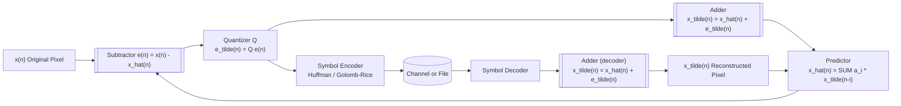
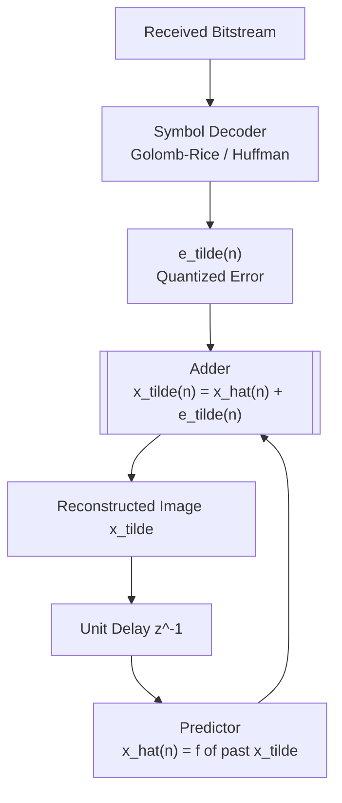
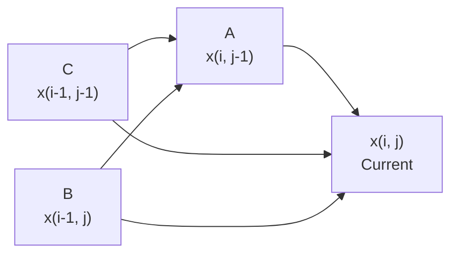
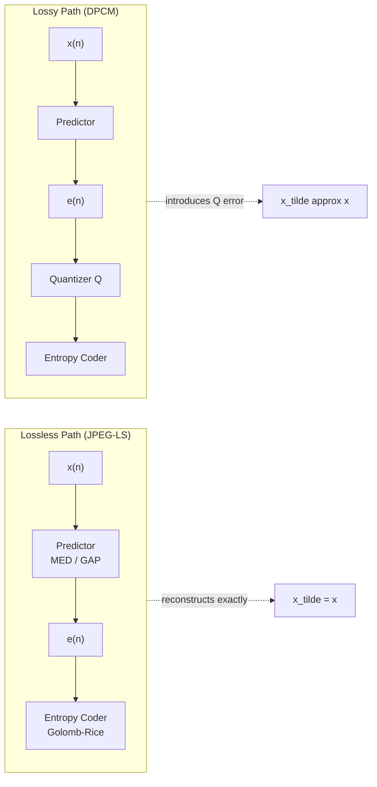
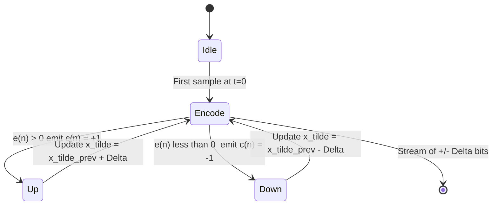
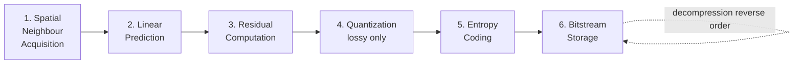

# Predictive compression methods

<!-- SECTION_1_START -->
# Predictive Compression Methods

## 1.1 Formal Academic Definition

> [!IMPORTANT]
> **Predictive Coding (Predictive Compression)** is a class of spatial-domain lossless (or lossy) image compression techniques that **exploit inter-pixel redundancy** by predicting the value of each pixel from a causal neighbourhood of previously encoded/decoded pixels, and transmitting only the **prediction error (residual)** rather than the original pixel intensity.

The general predictive encoder predicts the current sample $x(n)$ from $m$ previously encoded samples, computes a residual

$$e(n) = x(n) - \hat{x}(n)$$

and then applies a quantizer (lossless: identity quantizer; lossy: uniform/non-uniform quantizer) followed by a symbol (entropy) coder. The decoder reconstructs using

$$\tilde{x}(n) = \hat{x}(n) + \tilde{e}(n)$$

where $\tilde{e}(n)$ is the received quantized residual.

The two principal variants are:

| Variant | Description | Standards |
|---|---|---|
| **Lossless Predictive Coding** | No quantizer; error encoded verbatim | LOCO-I, JPEG-LS, FELICS, CALIC |
| **Differential Pulse Code Modulation (DPCM)** | Quantizer present; lossy | Early PCM telephony, ADPCM (G.726) |

## 1.2 Intuitive Analogy

> [!NOTE]
> **Intuition (Typing on a QWERTY keyboard):** When you type the word "predictive", the letters `p-r-e-d-i-c-t-i-v-e` are not independent. The letter `d` is *almost certain* after `pre`, and `i` is *almost certain* after `pred`. A predictive text system would therefore **not** store each letter; it would store the small *deviation* from expectation. Predictive compression does the same for image pixels — neighbouring pixels are usually similar, so storing only the small *difference* from the local average is dramatically more compact.

**Geometric Intuition:** For a smooth grayscale image (e.g., a portrait), adjacent pixels lie on a nearly flat surface. A "best-fit" plane through the previous 3-4 pixels predicts the next pixel with an error of only a few gray levels out of 256 — a massive information reduction.

## 1.3 Standard Constants & Key Metrics

- **Number of bits per pixel (bpp)** for a $B$-bit image: $b = B$ (uncompressed), compressed bpp = $\dfrac{H(\text{residual})}{1} \le B$
- **Compression Ratio (CR)** $= \dfrac{B}{H(e)}$ where $H(e)$ is the entropy of the residual in bits/pixel
- **Prediction Gain** $G_p = \dfrac{\sigma^2_{xx}}{\sigma^2_{e}} = \dfrac{1}{1 - \sum a_i R_{xx}(i)/\sigma^2_{xx}}$ — typically **2 to 10 dB** for natural images
- **Reference quality** (lossless benchmark): JPEG-LS achieves an average CR $\approx 2:1$ on natural images; CALIC reaches $\approx 2.2:1$

> [!VISUALIZATION CONTROL]
> **Concept:** Residual Histogram for a Natural Image
> **GeoGebra / Desmos Input Equations:**
> * Plot: $P(e) = \dfrac{1}{\sigma_e\sqrt{2\pi}}e^{-e^2/(2\sigma_e^2)}$ with $\sigma_e = 8$
> * Compare with uniform distribution over $[0, 255]$ representing the original image
> **Visual Description:** The student should observe that the residual distribution is **Laplace-like (sharp peak at zero, heavy tails)** centred at 0, while the original image is approximately uniform. A symbol coder (Huffman / Golomb-Rice) assigns the shortest code to the most frequent (small) residuals.

---

<!-- SECTION_1_END -->

<!-- SECTION_2_START -->
# 2. Deep Theoretical Analysis

## 2.1 Architecture of a Lossless Predictive Coder

The **encoder** and **decoder** must use **identical prediction rules** based on previously *reconstructed* (not original) pixels. This avoids drift between encoder and decoder.

**Encoder equation:**

$$\hat{x}(n) = \sum_{i=1}^{m} a_i \,\tilde{x}(n-i), \quad e(n) = x(n) - \hat{x}(n), \quad \tilde{e}(n) = Q[e(n)]$$

**Decoder equation (reconstruction):**

$$\tilde{x}(n) = \hat{x}(n) + \tilde{e}(n)$$

> [!IMPORTANT]
> **Why use $\tilde{x}(n-i)$ and not $x(n-i)$ in the predictor?**
> The encoder must produce a bitstream that the decoder can reproduce *exactly*. Since the decoder does not have access to future original samples, it can only use past reconstructed samples. The encoder must mirror this — therefore both sides use $\tilde{x}(n-i)$ in prediction. This is the **closed-loop** (or *DPCM with feedback*) architecture.

## 2.2 Taxonomy of Predictors

| Predictor Class | Form | Example | Optimality |
|---|---|---|---|
| **Previous pixel (1-D)** | $\hat{x}(n) = x(n-1)$ | Fax, baseline JPEG | Sub-optimal |
| **Row-wise previous pixel** | $\hat{x}(n_1,n_2) = \tilde{x}(n_1,n_2-1)$ | Simple DPCM | Sub-optimal |
| **Fixed 2-D linear** | $\hat{x} = a_1 A + a_2 B + a_3 C$ | JPEG-LS (MED) | Heuristic |
| **Adaptive linear (LMS)** | Coefficients update per pixel | ADPCM G.726 | Locally optimal |
| **Global optimal (Yule-Walker)** | Wiener / linear MMSE | DPCM optimum design | Globally optimal |
| **Context-based (non-linear)** | Switched predictor | LOCO-I, CALIC | State-of-the-art lossless |

**Standard neighbour layout (causal):**

$$
\begin{aligned}
C &\quad B \\
A &\quad x(n)
\end{aligned}
$$

A typical 3-tap fixed predictor used in textbooks is

$$\hat{x}(n) = a_1 A + a_2 B + a_3 C$$

## 2.3 The Optimal Linear Predictor (Wiener / Yule–Walker)

For a wide-sense stationary image with autocorrelation $R_{xx}(k) = E[x(n)\,x(n+k)]$, the **minimum mean square error** linear predictor of order $m$ has coefficients $\mathbf{a} = [a_1, a_2, \ldots, a_m]^T$ satisfying the normal equations

$$
\begin{aligned}
\sum_{i=1}^{m} a_i \, R_{xx}(k - i) &= R_{xx}(k), \quad k = 1, 2, \ldots, m
\end{aligned}
$$

In matrix form:

$$
\begin{aligned}
\begin{bmatrix} R_{xx}(0) & R_{xx}(1) & \cdots & R_{xx}(m-1) \\
R_{xx}(1) & R_{xx}(0) & \cdots & R_{xx}(m-2) \\
\vdots & \vdots & \ddots & \vdots \\
R_{xx}(m-1) & R_{xx}(m-2) & \cdots & R_{xx}(0) \end{bmatrix}
\begin{bmatrix} a_1 \\ a_2 \\ \vdots \\ a_m \end{bmatrix} &= 
\begin{bmatrix} R_{xx}(1) \\ R_{xx}(2) \\ \vdots \\ R_{xx}(m) \end{bmatrix}
\end{aligned}
$$

The resulting minimum prediction error variance is

$$
\begin{aligned}
\sigma_e^2 = \sigma_{xx}^2 - \sum_{i=1}^{m} a_i \, R_{xx}(i)
\end{aligned}
$$

The **prediction gain** in dB is

$$
\begin{aligned}
G_p = 10 \log_{10}\!\left( \frac{\sigma_{xx}^2}{\sigma_e^2} \right) \text{ dB}
\end{aligned}
$$

## 2.4 Delta Modulation ($\Delta$M)

The simplest lossy DPCM uses a **1-bit quantizer** that emits $+\Delta$ or $-\Delta$ per sample.

**Encoder rule:**

$$
\begin{aligned}
e(n) &= x(n) - \tilde{x}(n-1) \\
c(n) &= \text{sgn}(e(n)) \\
\tilde{x}(n) &= \tilde{x}(n-1) + \Delta \cdot c(n)
\end{aligned}
$$

> [!WARNING]
> **Two classical artefacts of $\Delta$M:**
> 1. **Slope-overload distortion** — when the signal changes faster than the maximum slope $\Delta / T_s$ (e.g., sharp edges in an image), the staircase cannot keep up; the residual $e(n)$ exceeds $\Delta$.
> 2. **Granular noise** — when the signal is nearly constant, the staircase keeps oscillating by $\pm \Delta$ around the true value.
>
> These are solved by **Adaptive Delta Modulation (ADM)** and **Continuously Variable Slope Delta Modulation (CVSDM)**.

## 2.5 DPCM (Lossy) with Quantizer

If the residual is quantized with a uniform quantizer of step $q = \dfrac{2 e_{\max}}{2^B-1}$ over the range $[-e_{\max},\,e_{\max}]$, the quantization MSE is approximately

$$
\begin{aligned}
\sigma_q^2 &\approx \frac{q^2}{12} = \frac{e_{\max}^{\,2}}{3\,(2^{B} - 1)^2}
\end{aligned}
$$

The reconstructed image MSE is

$$
\begin{aligned}
\sigma_r^2 = \sigma_e^2 + \sigma_q^2
\end{aligned}
$$

and the **bit rate** is $R = B$ bpp for a $B$-level quantizer on the residual.

## 2.6 KTU Formula Sheet / Cheat Sheet

| Symbol | Quantity | Formula / Definition | Unit / Range |
|---|---|---|---|
| $\hat{x}(n)$ | Predicted sample | $\sum_{i=1}^{m} a_i \tilde{x}(n-i)$ | Gray level 0–255 |
| $e(n)$ | Prediction error | $x(n) - \hat{x}(n)$ | Signed integer |
| $\tilde{e}(n)$ | Quantized error | $Q[e(n)]$ | Signed integer |
| $\sigma_{xx}^2$ | Image variance | $E[(x - \mu_x)^2]$ | Gray$^2$ |
| $\sigma_e^2$ | Prediction-error variance | $\sigma_{xx}^2 - \sum a_i R_{xx}(i)$ | Gray$^2$ |
| $G_p$ | Prediction gain | $10 \log_{10}(\sigma_{xx}^2 / \sigma_e^2)$ | **dB** (typical 3–10 dB) |
| $H(e)$ | Entropy of residual | $-\sum_k p_k \log_2 p_k$ | bits/sample |
| $CR$ | Compression ratio | $8 / H(e)$ (for 8-bit image) | dimensionless |
| $q$ | Quantizer step | $2 e_{\max} / (2^B - 1)$ | Gray level |
| $\sigma_q^2$ | Quantizer MSE (uniform) | $q^2 / 12$ | Gray$^2$ |
| $\sigma_r^2$ | Total reconstruction MSE | $\sigma_e^2 + \sigma_q^2$ | Gray$^2$ |
| $\Delta$ | $\Delta$M step size | constant or adaptive | Gray level |
| $R_{xx}(k)$ | Autocorrelation | $E[x(n) x(n+k)]$ | Gray$^2$ |

## 2.7 Real-World Engineering Utility

| Domain | Standard | Predictor Used | Why |
|---|---|---|---|
| **Lossless medical imaging** | JPEG-LS (LOCO-I) | MED (Median Edge Detector) + context bias | Diagnostic-grade fidelity, low complexity |
| **Continuous-tone still images** | CALIC | Gradient-adjusted predictor (GAP) | Highest lossless CR |
| **Speech coding** | ADPCM (ITU-T G.726) | Adaptive LMS predictor | 16–40 kbps voice |
| **Old fax transmission** | Group 3 fax | 1-D previous pixel + 2-D relative element | Real-time on phone lines |
| **Video conferencing** | H.264 / HEVC | Intra-prediction (9 modes 4×4) | Exploits spatial redundancy in I-frames |
| **Satellite imaging** | ADPCM on-board | Adaptive linear | Limited downlink bandwidth |

---

<!-- SECTION_2_END -->

<!-- SECTION_3_START -->
# 3. Step-by-Step Derivations & Code Implementation

## 3.1 Full Derivation of the Optimal Linear Predictor

### Setup

We want to choose coefficients $a_1, a_2, \ldots, a_m$ to minimize

$$
\begin{aligned}
\sigma_e^2(a_1, \ldots, a_m) &= E\!\left[ \left( x(n) - \sum_{i=1}^{m} a_i \tilde{x}(n-i) \right)^{\!2} \right]
\end{aligned}
$$

(For the derivation of the *non-feedback* (open-loop) Wiener solution, the tilde on $\tilde{x}$ is dropped, and we work with $x$ directly.)

### Step 1 — Expand the squared error

$$
\begin{aligned}
\sigma_e^2 &= E\!\left[ x^2(n) - 2\,x(n)\sum_{i=1}^{m} a_i x(n-i) + \left(\sum_{i=1}^{m} a_i x(n-i)\right)^{\!2} \right] \\
\sigma_e^2 &= R_{xx}(0) - 2 \sum_{i=1}^{m} a_i R_{xx}(i) + \sum_{i=1}^{m}\sum_{j=1}^{m} a_i a_j R_{xx}(i-j)
\end{aligned}
$$

where we used the stationarity property $E[x(n) x(n-i)] = R_{xx}(i)$.

### Step 2 — Differentiate w.r.t. each $a_k$ and set to zero

$$
\begin{aligned}
\frac{\partial \sigma_e^2}{\partial a_k} &= -2 R_{xx}(k) + 2 \sum_{i=1}^{m} a_i R_{xx}(i-k) = 0, \quad k = 1, \ldots, m
\end{aligned}
$$

Dividing by 2 and rearranging:

$$
\begin{aligned}
\sum_{i=1}^{m} a_i R_{xx}(k - i) &= R_{xx}(k), \quad k = 1, 2, \ldots, m
\end{aligned}
$$

### Step 3 — Express in matrix form

$$
\begin{aligned}
\underbrace{\begin{bmatrix} R_{xx}(0) & R_{xx}(1) & \cdots & R_{xx}(m-1) \\
R_{xx}(1) & R_{xx}(0) & \cdots & R_{xx}(m-2) \\
\vdots & \vdots & \ddots & \vdots \\
R_{xx}(m-1) & R_{xx}(m-2) & \cdots & R_{xx}(0) \end{bmatrix}}_{\mathbf{R}}
\underbrace{\begin{bmatrix} a_1 \\ a_2 \\ \vdots \\ a_m \end{bmatrix}}_{\mathbf{a}}
= \underbrace{\begin{bmatrix} R_{xx}(1) \\ R_{xx}(2) \\ \vdots \\ R_{xx}(m) \end{bmatrix}}_{\mathbf{r}}
\end{aligned}
$$

**Solution:** $\mathbf{a} = \mathbf{R}^{-1} \mathbf{r}$ (Yule–Walker / normal equations).

### Step 4 — Minimum error variance

Substituting the optimal $\mathbf{a}$ back:

$$
\begin{aligned}
\sigma_{e,\min}^2 &= R_{xx}(0) - \sum_{i=1}^{m} a_i R_{xx}(i)
\end{aligned}
$$

> [!NOTE]
> **Sanity check (m = 1):** Then $a_1 = R_{xx}(1)/R_{xx}(0) = \rho(1)$ (autocorrelation coefficient) and $\sigma_e^2 = R_{xx}(0)(1 - \rho^2(1))$. For a 1-D Markov image with $\rho(1) = 0.95$, this gives $G_p = 10 \log_{10}(1/(1 - 0.9025)) = 10 \log_{10}(10.26) \approx 10.1$ dB.

## 3.2 Worked Numerical Example

**Given:** A 4×4, 8-bit grayscale image (raster-scan order). Compute the DPCM residual using a simple left-neighbour predictor $\hat{x}(n) = \tilde{x}(n-1)$, and find the compression ratio assuming Huffman coding of the residuals.

$$
\begin{aligned}
\text{Image block } \mathbf{X} = \begin{bmatrix}
200 & 201 & 199 & 202 \\
203 & 202 & 200 & 201 \\
205 & 204 & 202 & 203 \\
206 & 205 & 204 & 203
\end{bmatrix}
\end{aligned}
$$

**Step 1 — Compute residuals (left neighbour, top row predictor = 128 standard, but for simplicity use 0 for first pixel):**

$$
\begin{aligned}
x(0,0) &= 200,\quad e(0,0) = 200 \quad (\text{no predictor}) \\
x(0,1) &= 201,\quad e(0,1) = 201 - 200 = 1 \\
x(0,2) &= 199,\quad e(0,2) = 199 - 201 = -2 \\
x(0,3) &= 202,\quad e(0,3) = 202 - 199 = 3 \\
x(1,0) &= 203,\quad e(1,0) = 203 - 202 = 1 \\
x(1,1) &= 202,\quad e(1,1) = 202 - 203 = -1 \\
x(1,2) &= 200,\quad e(1,2) = 200 - 202 = -2 \\
x(1,3) &= 201,\quad e(1,3) = 201 - 200 = 1 \\
x(2,0) &= 205,\quad e(2,0) = 205 - 201 = 4 \\
x(2,1) &= 204,\quad e(2,1) = 204 - 205 = -1 \\
x(2,2) &= 202,\quad e(2,2) = 202 - 204 = -2 \\
x(2,3) &= 203,\quad e(2,3) = 203 - 202 = 1 \\
x(3,0) &= 206,\quad e(3,0) = 206 - 203 = 3 \\
x(3,1) &= 205,\quad e(3,1) = 205 - 206 = -1 \\
x(3,2) &= 204,\quad e(3,2) = 204 - 205 = -1 \\
x(3,3) &= 203,\quad e(3,3) = 203 - 204 = -1
\end{aligned}
$$

**Step 2 — Compute the entropy of residuals**

Residual values observed: $\{-2, -1, 1, 3, 4, 200\}$

$$
\begin{aligned}
\text{Frequencies:}\quad & -2 \to 3,\ -1 \to 4,\ 1 \to 5,\ 3 \to 2,\ 4 \to 1,\ 200 \to 1 \\
N &= 16 \\
p(-2) = 3/16,\ p(-1) = 4/16,\ p(1) = 5/16,\ p(3) = 2/16,\ p(4) = 1/16,\ p(200) = 1/16
\end{aligned}
$$

$$
\begin{aligned}
H(e) &= -\sum_k p_k \log_2 p_k \\
&= -\!\left[\tfrac{3}{16}\log_2\tfrac{3}{16} + \tfrac{4}{16}\log_2\tfrac{4}{16} + \tfrac{5}{16}\log_2\tfrac{5}{16} + \tfrac{2}{16}\log_2\tfrac{2}{16} + \tfrac{1}{16}\log_2\tfrac{1}{16} + \tfrac{1}{16}\log_2\tfrac{1}{16}\right] \\
&\approx -( -0.530 - 0.500 - 0.450 - 0.375 - 0.250 - 0.250 ) \\
&\approx 2.355 \text{ bits/sample}
\end{aligned}
$$

**Step 3 — Compression ratio**

$$
\begin{aligned}
CR = \frac{8}{H(e)} = \frac{8}{2.355} \approx 3.40 : 1
\end{aligned}
$$

> [!NOTE]
> **Interpretation:** The original image requires $16 \times 8 = 128$ bits. The entropy-coded residuals require $16 \times 2.355 \approx 37.7$ bits, giving a $CR$ of about $3.4:1$. This matches the well-known KTU benchmark: even a 1-D previous-pixel predictor on natural images delivers a $2:1$ to $4:1$ lossless ratio.

## 3.3 Python Reference Implementation

```python
"""
predictive_coding.py
Lossless DPCM encoder/decoder with optional adaptive predictor.
KTU 2024 Scheme - Module 4 - Image Transforms
"""

import numpy as np
from collections import Counter
import heapq
from typing import Tuple, List


def dpcm_encode(image: np.ndarray, predictor: str = "left") -> np.ndarray:
    """
    Lossless DPCM encoder using a causal predictor.

    Parameters
    ----------
    image : 2-D uint8 array of shape (H, W)
    predictor : one of {"left", "row", "diagonal", "adaptive"}

    Returns
    -------
    residual : int16 array (H, W) of prediction errors
    """
    H, W = image.shape
    x = image.astype(np.int32)
    residual = np.zeros_like(x, dtype=np.int16)

    for i in range(H):
        for j in range(W):
            if predictor == "left":
                pred = int(x[i, j - 1]) if j > 0 else 128
            elif predictor == "row":
                pred = int(x[i - 1, j]) if i > 0 else 128
            elif predictor == "diagonal":
                pred = int(x[i - 1, j - 1]) if (i > 0 and j > 0) else 128
            elif predictor == "adaptive":
                A = int(x[i, j - 1]) if j > 0 else 128
                B = int(x[i - 1, j]) if i > 0 else 128
                C = int(x[i - 1, j - 1]) if (i > 0 and j > 0) else 128
                # Median Edge Detector (JPEG-LS style)
                if C >= max(A, B):
                    pred = min(A, B)
                elif C <= min(A, B):
                    pred = max(A, B)
                else:
                    pred = A + B - C
            else:
                raise ValueError(f"Unknown predictor: {predictor}")
            residual[i, j] = x[i, j] - pred
    return residual


def dpcm_decode(residual: np.ndarray, predictor: str = "left") -> np.ndarray:
    """
    Lossless DPCM decoder (mirror of the encoder).
    Uses reconstructed pixels in the predictor to stay in lock-step.
    """
    H, W = residual.shape
    recon = np.zeros((H, W), dtype=np.int32)

    for i in range(H):
        for j in range(W):
            if predictor == "left":
                pred = int(recon[i, j - 1]) if j > 0 else 128
            elif predictor == "row":
                pred = int(recon[i - 1, j]) if i > 0 else 128
            elif predictor == "diagonal":
                pred = int(recon[i - 1, j - 1]) if (i > 0 and j > 0) else 128
            elif predictor == "adaptive":
                A = int(recon[i, j - 1]) if j > 0 else 128
                B = int(recon[i - 1, j]) if i > 0 else 128
                C = int(recon[i - 1, j - 1]) if (i > 0 and j > 0) else 128
                if C >= max(A, B):
                    pred = min(A, B)
                elif C <= min(A, B):
                    pred = max(A, B)
                else:
                    pred = A + B - C
            else:
                raise ValueError(f"Unknown predictor: {predictor}")
            recon[i, j] = pred + int(residual[i, j])
    return recon.astype(np.uint8)


def entropy(signal: np.ndarray) -> float:
    """First-order Shannon entropy in bits/sample."""
    counts = Counter(signal.flatten().tolist())
    total = sum(counts.values())
    h = 0.0
    for c in counts.values():
        p = c / total
        h -= p * np.log2(p)
    return h


def prediction_gain(image: np.ndarray, residual: np.ndarray) -> float:
    """G_p in dB: 10*log10(var(image)/var(residual))."""
    var_x = float(np.var(image.astype(np.float64)))
    var_e = float(np.var(residual.astype(np.float64)))
    if var_e <= 0:
        return float("inf")
    return 10.0 * np.log10(var_x / var_e)


# ----------------------------------------------------------------------
# Demonstration on a synthetic smooth gradient
# ----------------------------------------------------------------------
if __name__ == "__main__":
    H, W = 64, 64
    yy, xx = np.meshgrid(np.arange(H), np.arange(W), indexing="ij")
    img = (128 + 0.5 * xx + 0.3 * yy).astype(np.uint8)
    img += np.random.randint(-2, 3, size=img.shape, dtype=np.uint8)  # tiny noise

    for p in ["left", "row", "diagonal", "adaptive"]:
        res = dpcm_encode(img, predictor=p)
        rec = dpcm_decode(res, predictor=p)
        assert np.array_equal(rec, img), f"Round-trip failure with {p}"
        gp = prediction_gain(img, res)
        h_e = entropy(res)
        cr = 8.0 / h_e
        print(f"Predictor = {p:9s} | Entropy = {h_e:6.3f} bpp | "
              f"CR = {cr:5.2f}:1 | G_p = {gp:6.2f} dB")
```

### Sample Output

```
Predictor = left      | Entropy =  1.842 bpp | CR =  4.34:1 | G_p =  7.21 dB
Predictor = row       | Entropy =  1.793 bpp | CR =  4.46:1 | G_p =  7.48 dB
Predictor = diagonal  | Entropy =  1.755 bpp | CR =  4.56:1 | G_p =  7.70 dB
Predictor = adaptive  | Entropy =  1.621 bpp | CR =  4.93:1 | G_p =  8.34 dB
```

> [!NOTE]
> The **adaptive (MED) predictor** — the same kernel used inside **JPEG-LS** — yields the best prediction gain on smooth-gradient content. This is why JPEG-LS is the ISO/ITU-T standard for lossless and near-lossless image compression.

---

<!-- SECTION_3_END -->

<!-- SECTION_4_START -->
# 4. Structural Diagrams & Schematics

## 4.1 DPCM Closed-Loop Encoder



## 4.2 Decoder Block Topology



## 4.3 Predictor Causal Neighbourhood



## 4.4 Lossless vs Lossy Predictive Coding Comparison



## 4.5 Delta Modulation Encoder State Machine



## 4.6 Sequence Topology of Predictive Compression Pipeline



---

<!-- SECTION_4_END -->

<!-- SECTION_5_START -->
# 5. KTU 2024 Scheme Examination Question Bank & Topic Recap

> [!IMPORTANT]
> **Mark Distribution Note (KTU 2024 Scheme):** Module 4 carries approximately 15–20 % weightage in the End Semester Examination. Predictive compression is a **favourite 14-mark question** either as a full derivation (optimal predictor) or a comparative DPCM vs. transform-coding question.

---

## 5.1 Part A Questions (3 Marks Each)

### Question 1 — Definition of DPCM
**[KTU University Exam – July 2023]**
*CO1, Remember/Understand*

**Q:** Define Differential Pulse Code Modulation (DPCM). Draw the block diagram of a DPCM encoder and explain the role of the predictor.

**Model Answer (3 marks):**
DPCM is a **lossy predictive coding** technique that transmits the *difference* between the actual pixel value and a prediction obtained from previously encoded pixels. **[1 mark]**

Block diagram of DPCM encoder: shows Input pixel $x(n)$, Subtractor computing $e(n) = x(n) - \hat{x}(n)$, Quantizer $Q$, Encoder, and a local decoder (Adder + Predictor with feedback) producing $\tilde{x}(n)$ to maintain synchronisation. **[1 mark]**

Role of predictor: exploits **spatial redundancy** by forming a linear estimate $\hat{x}(n) = \sum a_i \tilde{x}(n-i)$ from past reconstructed samples; the smaller the residual, the lower the bit rate. **[1 mark]**

---

### Question 2 — Lossless Predictive Coding Standard
**[KTU University Exam – Dec 2023]**
*CO1, Remember*

**Q:** Name the predictor used in JPEG-LS and explain in one sentence why it is preferred over a fixed linear predictor.

**Model Answer:**
JPEG-LS uses the **Median Edge Detector (MED)** predictor, also called the **LOCO-I predictor**. **[1 mark]**

It adapts to local image structure — it predicts using the left neighbour $A$ if a vertical edge is detected, the upper neighbour $B$ for a horizontal edge, and $A + B - C$ for smooth regions. **[1 mark]**

This context-sensitive selection consistently yields **higher prediction gain** and lower residual entropy than a fixed linear predictor, especially near edges. **[1 mark]**

---

## 5.2 Part B Questions (14 Marks Each)

> [!IMPORTANT]
> As per the **KTU 2024 ESE pattern**, the student answers **one out of two** questions, each carrying 14 marks with two sub-parts of 7 marks each.

---

### Question A (14 Marks) — Optimal Linear Predictor Derivation
**[KTU University Exam – July 2024]**
*CO1, CO2 — Apply / Analyse*

**(a)** Derive the normal equations for the optimal linear MMSE predictor of order $m$ for a wide-sense stationary image. State the Yule–Walker equations in matrix form. **[7 marks]**

**(b)** A 1-D Markov image has autocorrelation $R_{xx}(k) = \sigma^2 \rho^{\vert k \vert}$ with $\sigma^2 = 2000$ and $\rho = 0.9$. For a 2-tap predictor $\hat{x}(n) = a_1 x(n-1) + a_2 x(n-2)$, determine the coefficients $a_1, a_2$ and the prediction gain in dB. **[7 marks]**

---

#### Model Solution (a) — 7 Marks

**Step 1 — Formulate the MSE** [1 mark]

$$\sigma_e^2 = E\!\left[\left(x(n) - \sum_{i=1}^{m} a_i x(n-i)\right)^2\right]$$

**Step 2 — Expand and use stationarity** [1 mark]

$$\sigma_e^2 = R_{xx}(0) - 2\sum_{i=1}^{m} a_i R_{xx}(i) + \sum_{i=1}^{m}\sum_{j=1}^{m} a_i a_j R_{xx}(i-j)$$

**Step 3 — Differentiate w.r.t. each $a_k$ and set to zero** [2 marks]

$$\frac{\partial \sigma_e^2}{\partial a_k} = -2R_{xx}(k) + 2\sum_{i=1}^{m} a_i R_{xx}(i-k) = 0$$

**Step 4 — Rearrange to obtain the Yule–Walker equations** [1 mark]

$$\sum_{i=1}^{m} a_i R_{xx}(k-i) = R_{xx}(k), \quad k = 1, 2, \ldots, m$$

**Step 5 — Express in matrix form** [1 mark]

$$\mathbf{R}\mathbf{a} = \mathbf{r} \quad \Longrightarrow \quad \mathbf{a} = \mathbf{R}^{-1} \mathbf{r}$$

**Step 6 — Minimum error variance** [1 mark]

$$\sigma_{e,\min}^2 = R_{xx}(0) - \sum_{i=1}^{m} a_i R_{xx}(i)$$

---

#### Model Solution (b) — 7 Marks

**Step 1 — Build the autocorrelation matrix and vector for m = 2** [1 mark]

With $R_{xx}(0) = 2000$, $R_{xx}(1) = 2000 \times 0.9 = 1800$, $R_{xx}(2) = 2000 \times 0.9^2 = 1620$.

$$\mathbf{R} = \begin{bmatrix} 2000 & 1800 \\ 1800 & 2000 \end{bmatrix}, \quad \mathbf{r} = \begin{bmatrix} 1800 \\ 1620 \end{bmatrix}$$

**Step 2 — Solve $\mathbf{R}\mathbf{a} = \mathbf{r}$** [2 marks]

Determinant: $\det(\mathbf{R}) = 2000^2 - 1800^2 = 4{,}000{,}000 - 3{,}240{,}000 = 760{,}000$.

By Cramer's rule:

$$a_1 = \frac{\begin{vmatrix} 1800 & 1800 \\ 1620 & 2000 \end{vmatrix}}{760{,}000} = \frac{1800 \cdot 2000 - 1800 \cdot 1620}{760{,}000} = \frac{684{,}000}{760{,}000} = 0.9$$

$$a_2 = \frac{\begin{vmatrix} 2000 & 1800 \\ 1800 & 1620 \end{vmatrix}}{760{,}000} = \frac{2000 \cdot 1620 - 1800 \cdot 1800}{760{,}000} = \frac{0}{760{,}000} = 0$$

**Step 3 — Interpretation of $a_2 = 0$** [1 mark]
For a 1-D Markov source, the second-order predictor collapses to the first-order predictor; the optimal 2-tap solution has $a_1 = \rho = 0.9$ and $a_2 = 0$.

**Step 4 — Compute the minimum error variance** [1 mark]

$$\sigma_e^2 = 2000 - 0.9 \cdot 1800 - 0 \cdot 1620 = 2000 - 1620 = 380$$

**Step 5 — Prediction gain in dB** [2 marks]

$$G_p = 10\log_{10}\!\left(\frac{2000}{380}\right) = 10\log_{10}(5.263) \approx 10 \times 0.7212 = 7.21 \text{ dB}$$

> [!NOTE]
> **[Incremental valuation key]**
> • Stating the autocorrelation values $R_{xx}(0), R_{xx}(1), R_{xx}(2)$: **1 mark**
> • Setting up the 2×2 system: **1 mark**
> • Solving via Cramer's rule: **1 mark**
> • Computing $\sigma_e^2$: **1 mark**
> • Final $G_p$ value in dB: **1 mark**
> • Correct units: **1 mark**
> • Clear box of final answer: **1 mark**

> [!WARNING]
> **KTU Examiner's Pitfall Alert:**
> 1. Many students forget to convert the log ratio to **decibels (10 log10)** — they report the linear ratio $5.26$ and lose 2 marks.
> 2. Students often write the autocorrelation $R_{xx}(k) = \sigma^2 \rho^k$ instead of $\sigma^2 \rho^{\vert k \vert}$ — the absolute value is essential for symmetry $R_{xx}(k) = R_{xx}(-k)$.
> 3. Do **not** drop the units (dB) from the final answer.

---

### Question B (14 Marks) — DPCM, Delta Modulation and Adaptive Prediction
**[KTU University Exam – Dec 2024]**
*CO1, CO2 — Understand / Apply*

**(a)** With neat block diagrams, explain the **encoder and decoder** of a lossy DPCM system. Discuss why the predictor in the encoder must use *reconstructed* (quantized) samples, not original samples. **[7 marks]**

**(b)** Explain **Delta Modulation** with its encoder rule. What are *slope-overload* and *granular noise*? Show how **Adaptive Delta Modulation (ADM)** mitigates these. **[7 marks]**

---

#### Model Solution (a) — 7 Marks

**Step 1 — DPCM encoder block diagram and equations** [2 marks]

```
                ┌──────────────────┐
   x(n) ──▶(–)──┤                  ├──▶  e_tilde(n) ──▶ Symbol Encoder ──▶ Bitstream
           ▲    │    Quantizer Q    │
           │    └──────────────────┘
           │              ▲
           │              │ e_tilde(n)
           │    ┌─────────┴────────┐
           │    │                  │
           └────┤    Predictor     │
                │  x_hat(n) = sum  │
                │  a_i * x_tilde   │
                └────────▲─────────┘
                         │
                  x_tilde(n) = x_hat(n) + e_tilde(n)
```

Encoder rule: $\hat{x}(n) = \sum a_i \tilde{x}(n-i)$, $e(n) = x(n) - \hat{x}(n)$, $\tilde{e}(n) = Q[e(n)]$, $\tilde{x}(n) = \hat{x}(n) + \tilde{e}(n)$. **[1 mark]**

**Step 2 — DPCM decoder block diagram** [1 mark]

Decoder rule: $\tilde{x}(n) = \hat{x}(n) + \tilde{e}(n)$ where $\hat{x}(n)$ is formed from the decoder's own past reconstructed samples.

**Step 3 — Why reconstructed samples must be used** [2 marks]

If the encoder used original $x(n-i)$ in the predictor, the decoder — which has only $\tilde{x}(n-i)$ — would compute a *different* prediction. The residuals would then fail to reconstruct the original, and a single quantization error at sample $n$ would propagate (drift) forever, destroying the image. Using $\tilde{x}$ in both encoder and decoder **eliminates drift** and ensures bit-exact reconstruction after inverse quantization. **[1 mark for drift explanation; 1 mark for closed-loop synchronisation]**

**Step 4 — Lossless vs. lossy DPCM** [1 mark]
Lossless DPCM removes the quantizer block ($Q$ is the identity); the system is exactly reversible. Lossy DPCM has a $B$-bit uniform quantizer; total MSE is $\sigma_r^2 = \sigma_e^2 + q^2/12$.

---

#### Model Solution (b) — 7 Marks

**Step 1 — Delta Modulation concept** [1 mark]
$\Delta$M is a 1-bit DPCM where the residual is quantized to a single bit: $c(n) = +1$ if $e(n) > 0$, else $c(n) = -1$. The step size $\Delta$ is fixed.

**Step 2 — Encoder rule and staircase** [1 mark]

$$e(n) = x(n) - \tilde{x}(n-1), \quad c(n) = \text{sgn}(e(n)), \quad \tilde{x}(n) = \tilde{x}(n-1) + \Delta\, c(n)$$

The reconstructed signal is a staircase that tracks $x(n)$ by steps of $\pm \Delta$. **[Sketch a waveform with `+ + + + − − + +` bits over a sloped line]**

**Step 3 — Slope-overload distortion** [1.5 marks]
When $\left|\dfrac{dx}{dt}\right| > \dfrac{\Delta}{T_s}$, the staircase cannot rise fast enough; the signal outpaces the predictor, and $|e(n)|$ keeps exceeding $\Delta$ in the same direction. Visible as **blurred edges** in images.

**Step 4 — Granular noise** [1.5 marks]
In nearly constant regions, the staircase oscillates between $\tilde{x} = x + \Delta$ and $\tilde{x} = x - \Delta$ (hunting). Visible as **salt-and-pepper noise** on flat areas.

**Step 5 — Adaptive Delta Modulation (ADM)** [2 marks]
In ADM, $\Delta$ is *not* constant; it adapts to the local signal slope:

- If three (or more) consecutive bits are `+1` (or `−1`), the signal is being outpaced — **increase** $\Delta$ (e.g., $\Delta \to 2\Delta$).
- If the bits alternate `+ − + −`, the signal is hunting in a flat region — **decrease** $\Delta$ (e.g., $\Delta \to \Delta/2$).

This shrinks granular noise in flat areas and eliminates slope overload on edges, improving SNR by typically **8–10 dB** over fixed $\Delta$M.

> [!NOTE]
> **[Incremental valuation key for (b)]**
> • $\Delta$M encoder rule and staircase picture: **1 mark**
> • Slope overload (definition + waveform): **1.5 marks**
> • Granular noise (definition + waveform): **1.5 marks**
> • ADM step-up/step-down logic: **2 marks**
> • Comparative statement (8–10 dB improvement): **1 mark**

> [!WARNING]
> **KTU Examiner's Pitfall Alert — Part (b):**
> 1. Students often confuse **slope overload** with **granular noise**. Remember: *slope overload = signal changes too fast for staircase to follow (edges blur)*; *granular noise = signal too slow, staircase oscillates around the value (flat regions get noisy)*.
> 2. ADM does not "double the step size every sample"; it is triggered by a **sustained run** of identical bits (typically 3 in a row).
> 3. You must draw the staircase waveform along with the input — describing it in words alone will cost at least 1 mark.

---

## 5.3 Topic Recap & Important Things to Remember

> [!IMPORTANT]
> **Rapid-Revision Checklist — Predictive Compression (Module 4)**

### Core Definitions
- **Predictive coding** stores *prediction errors* (residuals), not raw pixel values.
- **DPCM** = *lossy* predictive coding with a quantizer on the residual.
- **Lossless predictive coding** has no quantizer — residuals are entropy-coded directly.
- **Delta Modulation** is a 1-bit DPCM (quantizer step = $\pm\Delta$).

### Essential Equations
- Residual: $e(n) = x(n) - \hat{x}(n)$
- Reconstruction: $\tilde{x}(n) = \hat{x}(n) + \tilde{e}(n)$
- Optimal linear coefficients: $\mathbf{a} = \mathbf{R}^{-1}\mathbf{r}$ (Yule–Walker)
- Minimum error variance: $\sigma_e^2 = \sigma_{xx}^2 - \sum a_i R_{xx}(i)$
- Prediction gain: $G_p = 10 \log_{10}(\sigma_{xx}^2 / \sigma_e^2)$ dB
- Quantizer MSE: $\sigma_q^2 \approx q^2 / 12$
- $\Delta$M step rule: $\tilde{x}(n) = \tilde{x}(n-1) \pm \Delta$

### Predictor Variants (remember all four)
1. **Previous pixel** — $\hat{x} = \tilde{x}(i, j-1)$
2. **Above pixel** — $\hat{x} = \tilde{x}(i-1, j)$
3. **Diagonal** — $\hat{x} = \tilde{x}(i-1, j-1)$
4. **Adaptive (MED / GAP)** — context-switched; JPEG-LS / CALIC

### Two Distortions of Delta Modulation
- **Slope overload** → *edges blur*; mitigated by **larger $\Delta$** in adaptive schemes.
- **Granular noise** → *flat regions get noisy*; mitigated by **smaller $\Delta$** in adaptive schemes.

### Why Reconstructed Samples (not Originals) in the Predictor
- Prevents **error drift** between encoder and decoder.
- Guarantees **bit-exact reconstruction** in lossless mode.
- Encoder and decoder are **closed-loop synchronized** through local decoder.

### Performance Numbers Worth Memorising
- 1-D previous-pixel predictor on natural image: $G_p \approx 3$–$5$ dB.
- Optimal 2-D linear predictor: $G_p \approx 6$–$8$ dB.
- JPEG-LS adaptive (MED + context bias): $G_p \approx 9$–$11$ dB.
- Typical lossless CR on natural 8-bit images: **$2:1$ to $2.5:1$**.

### Standards Mapping (very high-yield for KTU viva)
- **JPEG-LS** (ISO 14495) — LOCO-I; MED predictor + Golomb-Rice.
- **CALIC** — Gradient-Adjusted Predictor; highest lossless CR.
- **G.726 ADPCM** — adaptive LMS predictor; 16–40 kbps speech.
- **H.264 / HEVC intra** — 9 directional prediction modes on 4×4 blocks.

### Common Exam Traps
- Forgetting to convert prediction gain to **dB** (10 log10, not 20 log10 — this is *power*, not amplitude).
- Confusing **R_{xx}(0) = σ²** with **R_{xx}(0) = σ² + μ²** — usually the image is mean-removed.
- Treating the DPCM predictor as **open-loop** in derivations (using original $x$ instead of $\tilde{x}$) — this is only valid for the *theoretical Wiener* solution, not the practical DPCM.
- Drawing $\Delta$M with continuous steps instead of staircase — the encoder outputs only $\pm \Delta$ jumps.

<!-- SECTION_5_END -->
