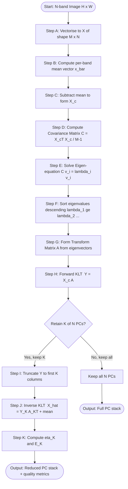
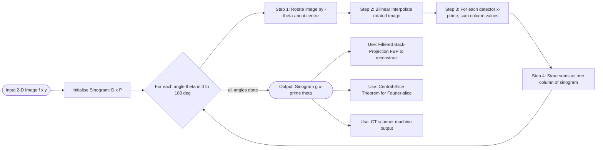
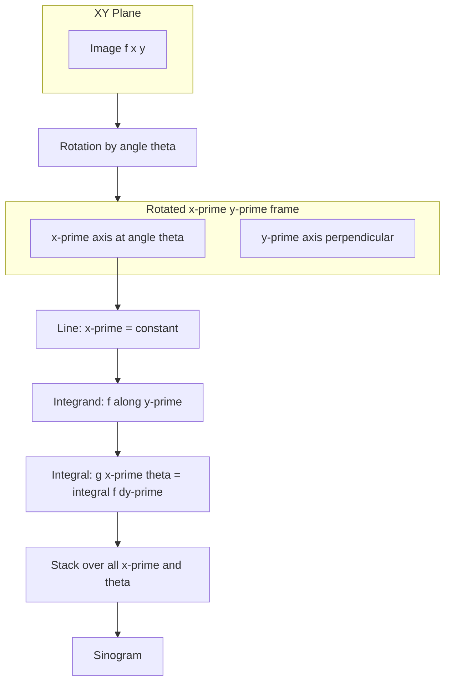
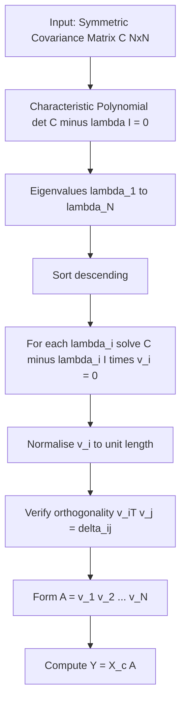

# Principal component analysis Radon Transform

<!-- SECTION_1_START -->
# Module 4 — Image Transforms: PCA & Radon Transform

## 1. Core Technical Definition & Intuitive Overview

### 1.1 Principal Component Analysis (PCA) — The Karhunen–Loève Transform in DIP

> [!IMPORTANT]
> **Formal Definition (KTU 2024 Syllabus Term)**
> Principal Component Analysis (PCA), also called the **Karhunen–Loève Transform (KLT)** or **Hotelling Transform** in the image-processing literature, is an *orthogonal linear transformation* that re-expresses a multivariate (multi-band) image dataset along a set of new, mutually uncorrelated axes — the **principal components** — ordered so that the first axis captures the maximum possible data variance, the second captures the next maximum subject to orthogonality, and so on.

In simpler words, PCA finds a *new set of axes* for your image bands (e.g., the Red, Green, Blue, Near-Infrared channels of a satellite image) such that the most "interesting" or "informative" variation is squeezed into the first few axes and the rest (mostly noise or redundancy) is pushed into the later axes.

> [!NOTE]
> **Conceptual Analogy (The "Best Camera Angle" Intuition)**
> Imagine a long, tilted rectangular box lying on the floor. If you take a photo of it from directly above, you see a foreshortened line — you lose information. If you stand so that your camera is *aligned with the longest edge of the box*, the photo captures the full length and you recover the most "spread-out" information. PCA mathematically finds that magic viewing direction automatically, then repeats it orthogonally for the second-best view, and so on. For multi-spectral images, this means the "longest edge" of the data cloud in N-dimensional band-space.

**Key Constants / Metrics (used throughout the chapter):**

- Number of image bands: **N**
- Number of pixels per band: **M** (e.g., for an 8-bit 512×512 image, **M = 262,144**)
- Eigenvalues of the covariance matrix: $\lambda_1 \geq \lambda_2 \geq \cdots \geq \lambda_N$
- Total variance: $\sigma^2_{total} = \sum_{i=1}^{N} \lambda_i$
- Information content of $k$-th component: $\eta_k = \dfrac{\lambda_k}{\sum_{i=1}^{N} \lambda_i}$

> [!TIP]
> **GeoGebra / Desmos Visualization (for 2-D intuition of PCA)**
> **Concept:** Scatter-plot of two correlated variables with PCA axes overlaid.
> **Input commands (Desmos):**
> * Scatter points: `(2,1), (3,2), (4,3), (5,4), (6,5), (1,2), (2,3)`
> * Mean: `(3.5, 2.857)`
> * PC1 line: $y - 2.857 = 0.81(x - 3.5)$
> * PC2 line: $y - 2.857 = -1.23(x - 3.5)$
> **Visual Description:** A diagonal "cigar-shaped" point cloud appears. The long red line (PC1) runs along the cloud's main elongation; the short green line (PC2) is perpendicular. The red line preserves the maximum spread (variance) of the data, while the green line preserves the residual. Projecting every point vertically onto the red line yields 1-D data that retains the most information.

### 1.2 The Radon Transform — Projecting Images onto Lines

> [!IMPORTANT]
> **Formal Definition (KTU 2024 Syllabus Term)**
> The **Radon Transform** $\mathcal{R}\{f(x,y)\}$ of a 2-D continuous image $f(x,y)$ is the integral of the function along every straight line in the plane, parameterized by the perpendicular distance $x'$ of the line from the origin and the angle $\theta$ it makes with the x-axis. The transform produces a 2-D function $g(x',\theta)$ that is the *sinogram* of the image — a record of all 1-D line integrals.

Mathematically (the line is defined by $x\cos\theta + y\sin\theta = x'$):

$$g(x',\theta) = \mathcal{R}\{f(x,y)\} = \int\!\!\int_{-\infty}^{+\infty} f(x,y) \, \delta(x\cos\theta + y\sin\theta - x') \, dx \, dy$$

> [!NOTE]
> **Conceptual Analogy (The "X-Ray CT Scanner" Intuition)**
> Place a transparent 2-D object (your image) on a light table. Now sweep a parallel-beam of light across it from a fixed direction and *measure the total brightness that survives* at each detector position. That 1-D measurement is one *projection*. Rotate the light source by a small angle (e.g., 1°), repeat, rotate again, and so on for a full 180°. Stack all the 1-D projections side-by-side as rows. The resulting 2-D image is the *sinogram*. The Radon Transform is the mathematical statement of that "light-measuring" process. **This is exactly how a medical CT scanner works** — and the inverse Radon transform (Filtered Back-Projection) is how the cross-sectional image is reconstructed.

**Key Constants / Metrics:**

- Projection angle step: $\Delta\theta$ (typically **1°** for a $180°$ sweep or **0.5°** for high-quality CT)
- Number of projections: **P = $\lceil 180° / \Delta\theta \rceil$**
- Detector count per projection: **D** (equal to image width for parallel-beam)
- Sinogram size: **D × P** pixels

> [!TIP]
> **GeoGebra / Desmos Visualization (Radon projection geometry)**
> **Concept:** A line integral across a Shepp–Logan phantom.
> **Input commands (Desmos):**
> * Image region: $-1 \leq x \leq 1$, $-1 \leq y \leq 1$
> * Phantom approximation: $f(x,y) = 0.8\,\text{ellipse}(x,y;0.69,0.92) - 0.5\,\text{ellipse}(x,y;0.6624,0.874)$
> * Projection line at $\theta = 45°$, $x' = 0.3$: $x + y = 0.424$
> **Visual Description:** The line cuts through two ellipses; the integral $g(0.3, 45°)$ is the *sum of all values along that line*. Plotting $g(x',\theta)$ for many $x'$ at the same $\theta$ yields a 1-D sinusoidal trace; sweeping $\theta$ fills the sinogram with sine-wave patterns.

---

<!-- SECTION_1_END -->

<!-- SECTION_2_START -->
# 2. Deep Theoretical Analysis & KTU High-Yield Formula Sheet

## 2.1 Principal Component Analysis — Operational Logic

PCA on a multi-band image proceeds as a strict, ordered pipeline. Each step is mandatory in the KTU 2024 board evaluation.

### Step 1 — Vectorise the Multi-Band Image

For an image with $N$ spectral bands, each of size $M = H \times W$ pixels, arrange the bands as column vectors of length $M$ and place them side by side to form the data matrix $\mathbf{X}$:

$$\mathbf{X} = \begin{bmatrix} x_{11} & x_{12} & \cdots & x_{1N} \\ x_{21} & x_{22} & \cdots & x_{2N} \\ \vdots & \vdots & \ddots & \vdots \\ x_{M1} & x_{M2} & \cdots & x_{MN} \end{bmatrix} \in \mathbb{R}^{M \times N}$$

Here column $j$ contains the $j$-th band unrolled as a column of $M$ pixels.

### Step 2 — Compute the Mean Vector and Centre the Data

The empirical mean of each band:

$$\bar{x}_j = \frac{1}{M}\sum_{i=1}^{M} x_{ij}, \quad j = 1, 2, \ldots, N$$

Form the mean row-vector $\bar{\mathbf{x}} = [\bar{x}_1, \bar{x}_2, \ldots, \bar{x}_N]$ and the mean matrix $\bar{\mathbf{X}}$ whose every row equals $\bar{\mathbf{x}}$. The **centred data matrix** is:

$$\mathbf{X}_c = \mathbf{X} - \bar{\mathbf{X}}$$

> [!NOTE]
> Centring is *not* optional. Without it the first principal component points towards the global mean, not the direction of maximum spread, and the KLT degenerates. Examiners frequently deduct 1 mark for skipping this step.

### Step 3 — Build the Covariance Matrix

The $N \times N$ covariance matrix is the workhorse of PCA:

$$\mathbf{C} = \frac{1}{M-1}\,\mathbf{X}_c^{\mathsf{T}}\,\mathbf{X}_c$$

Element-wise, $C_{jk} = \dfrac{1}{M-1}\sum_{i=1}^{M}(x_{ij} - \bar{x}_j)(x_{ik} - \bar{x}_k)$. Diagonal entries are variances, off-diagonal are covariances.

### Step 4 — Eigen-Decomposition

Solve the characteristic equation $\det(\mathbf{C} - \lambda \mathbf{I}) = 0$ for the $N$ eigenvalues $\lambda_1 \geq \lambda_2 \geq \cdots \geq \lambda_N$. For each $\lambda_i$, solve $(\mathbf{C} - \lambda_i \mathbf{I})\,\mathbf{v}_i = \mathbf{0}$ to get the corresponding unit eigenvector $\mathbf{v}_i$ of length $N$. Stack the eigenvectors as columns to form the **transformation matrix**:

$$\mathbf{A} = [\mathbf{v}_1 \mid \mathbf{v}_2 \mid \cdots \mid \mathbf{v}_N]$$

### Step 5 — Transform the Data (Forward KLT)

$$\mathbf{Y} = \mathbf{X}_c \, \mathbf{A}$$

The new matrix $\mathbf{Y}$ is also $M \times N$. Each *row* of $\mathbf{Y}$ is a pixel's coordinate in the principal-component basis; each *column* of $\mathbf{Y}$ is one PC image (an image, not a vector, after reshaping).

### Step 6 — Reconstruct / Reduce (Inverse KLT)

To reconstruct using only the first $K < N$ principal components (dimensionality reduction):

$$\mathbf{X}_{recon} = \mathbf{Y}_{:,1:K} \, \mathbf{A}_{:,1:K}^{\mathsf{T}} + \bar{\mathbf{X}}$$

The **reconstruction (compression) error** is:

$$E_K = \sum_{i=K+1}^{N} \lambda_i$$

and the **fractional variance retained** is:

$$\eta_{K} = \frac{\sum_{i=1}^{K} \lambda_i}{\sum_{i=1}^{N} \lambda_i} \times 100\,\%$$

> [!IMPORTANT]
> In KTU board problems, the most common PCA question asks: *"Given the 2-band data and the computed covariance matrix, find the principal components and project point (3,5)."* The expected answer covers: (a) writing $\mathbf{C}$, (b) solving its eigenvalues, (c) solving its eigenvectors, (d) the projection formula. Skipping any one of those loses marks.

### 2.2 The Radon Transform — Operational Logic

The Radon transform is defined on a 2-D image $f(x,y)$ and produces a 2-D sinogram $g(x',\theta)$ where $x' \in \mathbb{R}$ and $\theta \in [0, \pi)$.

### Step 1 — The Geometry of a Line in the Rotated Coordinate Frame

Define a rotated coordinate system $(x', y')$ where the $x'$-axis makes angle $\theta$ with the original $x$-axis:

$$x' = x\cos\theta + y\sin\theta$$
$$y' = -x\sin\theta + y\cos\theta$$

A straight line in the original frame becomes $x' = \text{const}$ in the rotated frame. The **Ray-Sum** $g(x', \theta)$ is the integral of $f(x,y)$ along that line, which (by the change of variables) is the integral along $y'$:

$$g(x', \theta) = \int_{-\infty}^{+\infty} f(x'(x',y',\theta), y'(x',y',\theta)) \, dy'$$

The full **Radon transform** is the collection of all such ray-sums:

$$g(x', \theta) = \int_{-\infty}^{+\infty} f(x\cos\theta - y'\sin\theta, x\sin\theta + y'\cos\theta) \, dy'$$

Equivalently, using the Dirac delta:

$$g(x', \theta) = \int\!\!\int_{-\infty}^{+\infty} f(x,y) \, \delta(x\cos\theta + y\sin\theta - x') \, dx\,dy$$

### Step 2 — Discrete Radon Transform (the algorithm actually computed in software)

For a digital image $f[i,j]$ of size $H \times W$ and a chosen angle $\theta$:

1. Rotate the image by $-\theta$ about its centre using bilinear interpolation.
2. For each column $x' = -\tfrac{W}{2}, \ldots, +\tfrac{W}{2}$, sum all the pixel values in that column.
3. That column-sum is one row of the sinogram at angle $\theta$.

Repeat for $\theta = 0°, 1°, 2°, \ldots, 179°$ to build the full sinogram $g[x',\theta]$ of size $W \times 180$.

### Step 3 — Properties of the Radon Transform (frequently asked)

- **Linearity:** $\mathcal{R}\{a f_1 + b f_2\} = a\,\mathcal{R}\{f_1\} + b\,\mathcal{R}\{f_2\}$
- **Shift in space:** $\mathcal{R}\{f(x - a, y - b)\} = g(x' - a\cos\theta - b\sin\theta, \theta)$
- **Rotation:** $\mathcal{R}\{f(x\cos\phi - y\sin\phi, x\sin\phi + y\cos\phi)\} = g(x', \theta + \phi)$
- **Periodicity in $\theta$:** $g(x', \theta + \pi) = g(-x', \theta)$, so the full sinogram is in $[0, \pi)$.
- **Central-slice theorem (Fourier link):** $\mathcal{F}_1\{g(\cdot, \theta)\} = F(\omega\cos\theta, \omega\sin\theta)$, i.e. the 1-D Fourier transform of a projection at angle $\theta$ is a *radial slice* through the 2-D Fourier transform of the image at that same angle. This is the bridge to **Filtered Back-Projection (FBP)**, the standard inverse Radon method used in CT scanners.

### Step 4 — Inverse Radon (FBP) — Optional But Exam-Relevant

To reconstruct $f(x,y)$ from its sinogram $g(x',\theta)$:

$$f(x,y) = \int_{0}^{\pi} \left[ g(x\cos\theta + y\sin\theta, \theta) * h(x') \right] d\theta$$

where $h(x') = \mathcal{F}^{-1}\{|\omega|\}$ is the **ramp filter** in the frequency domain (a high-pass filter that sharpens the blurred back-projection). The 1-D convolution $g * h$ is applied for each $\theta$, then the filtered projections are *smeared back* across the image at angle $\theta$ and accumulated.

> [!TIP]
> **Real-world utility (Engineering context for PCA):** Hyperspectral remote sensing (LANDSAT, Sentinel-2), face recognition (Eigenfaces), medical MRI multi-sequence fusion, image compression, denoising via truncation of low-variance PCs.
>
> **Real-world utility (Engineering context for Radon):** Medical CT scanners, PET, airport baggage scanning, seismic migration in oil exploration, electron microscopy tomography, road-surface defect detection.

## 2.3 KTU Formula Cheat Sheet

| # | Topic | Formula | Meaning / Use |
|---|---|---|---|
| 1 | Data matrix (PCA) | $\mathbf{X} \in \mathbb{R}^{M \times N}$ | $M$ pixels, $N$ bands |
| 2 | Centred data | $\mathbf{X}_c = \mathbf{X} - \bar{\mathbf{X}}$ | Subtract per-band mean |
| 3 | Covariance matrix | $\mathbf{C} = \frac{1}{M-1}\mathbf{X}_c^{\mathsf{T}}\mathbf{X}_c$ | Symmetric, $N \times N$, PSD |
| 4 | Eigen-equation | $\mathbf{C}\mathbf{v}_i = \lambda_i \mathbf{v}_i$ | Defines PC $i$ |
| 5 | Forward KLT | $\mathbf{Y} = \mathbf{X}_c \mathbf{A}$ | Each row is PC-coordinate of one pixel |
| 6 | Variance retained by first $K$ PCs | $\eta_K = \frac{\sum_{i=1}^{K}\lambda_i}{\sum_{i=1}^{N}\lambda_i}$ | Pick $K$ so $\eta_K \geq 95\%$ |
| 7 | Reconstruction error | $E_K = \sum_{i=K+1}^{N}\lambda_i$ | Sum of discarded eigenvalues |
| 8 | Radon transform | $g(x',\theta) = \int\!\!\int f(x,y)\,\delta(x\cos\theta + y\sin\theta - x')\,dx\,dy$ | Integral along each line |
| 9 | Rotated coords | $x' = x\cos\theta + y\sin\theta$, $y' = -x\sin\theta + y\cos\theta$ | Geometry of one line |
| 10 | Central-slice | $\mathcal{F}_1\{g(\cdot, \theta)\} = F(\omega\cos\theta, \omega\sin\theta)$ | Fourier of projection = radial slice |
| 11 | Number of projections | $P = \lceil 180° / \Delta\theta \rceil$ | For $\Delta\theta = 1°$, $P = 180$ |
| 12 | Sinogram size | $D \times P$ | $D$ = detector count |
| 13 | FBP reconstruction | $f(x,y) = \int_{0}^{\pi}\!\left[g(x\cos\theta + y\sin\theta,\theta) * h(x')\right]d\theta$ | Inverse Radon with ramp filter $h$ |
| 14 | Ramp filter (FD) | $H(\omega) = \vert \omega \vert$ | High-pass filter for FBP |
| 15 | Mean square error of $K$-PC recon | $\text{MSE}_K = \frac{1}{M}\sum_{i=1}^{M}\lVert \mathbf{x}_i - \hat{\mathbf{x}}_i\rVert_2^2 = \frac{1}{M}\sum_{j=K+1}^{N}\lambda_j$ | Quality metric |

> [!IMPORTANT]
> In KTU answer sheets, always quote (a) the matrix dimensions, (b) the constraint $\mathbf{A}^{\mathsf{T}}\mathbf{A} = \mathbf{I}$ (orthonormal PC basis), and (c) the $\sum \lambda_i = \text{trace}(\mathbf{C})$ identity — these are favourite valuation points.

---

<!-- SECTION_2_END -->

<!-- SECTION_3_START -->
# 3. Step-by-Step Derivations & Code/Symbolic Implementation

## 3.1 Worked PCA Derivation (Hand-Calculable Example)

> **Problem.** Consider a 2-band image (rows = pixels, columns = bands) with $M=4$ pixels. Each band is a column:
>
> $$x_1 = [2, 4, 6, 8]^{\mathsf{T}}, \qquad x_2 = [1, 3, 5, 7]^{\mathsf{T}}$$
>
> Apply PCA from scratch and project pixel 1 (the first row) onto the new basis.

**Step A — Form the data matrix:**

$$\mathbf{X} = \begin{bmatrix} 2 & 1 \\ 4 & 3 \\ 6 & 5 \\ 8 & 7 \end{bmatrix}, \qquad M=4,\; N=2$$

**Step B — Compute the per-band means:**

$$\bar{x}_1 = \frac{2+4+6+8}{4} = 5, \qquad \bar{x}_2 = \frac{1+3+5+7}{4} = 4$$

So $\bar{\mathbf{x}} = [5, 4]$.

**Step C — Centre the data (subtract the mean row from every row):**

$$\mathbf{X}_c = \begin{bmatrix} 2-5 & 1-4 \\ 4-5 & 3-4 \\ 6-5 & 5-4 \\ 8-5 & 7-4 \end{bmatrix} = \begin{bmatrix} -3 & -3 \\ -1 & -1 \\ \;\;1 & \;\;1 \\ \;\;3 & \;\;3 \end{bmatrix}$$

**Step D — Compute the covariance matrix using $C = \frac{1}{M-1} X_c^{\mathsf{T}} X_c$:**

First, $X_c^{\mathsf{T}} X_c$:

$$X_c^{\mathsf{T}} X_c = \begin{bmatrix} -3 & -1 & 1 & 3 \\ -3 & -1 & 1 & 3 \end{bmatrix} \begin{bmatrix} -3 & -3 \\ -1 & -1 \\ \;\;1 & \;\;1 \\ \;\;3 & \;\;3 \end{bmatrix} = \begin{bmatrix} 9+1+1+9 & 9+1+1+9 \\ 9+1+1+9 & 9+1+1+9 \end{bmatrix} = \begin{bmatrix} 20 & 20 \\ 20 & 20 \end{bmatrix}$$

Now divide by $M-1 = 3$:

$$\mathbf{C} = \frac{1}{3}\begin{bmatrix} 20 & 20 \\ 20 & 20 \end{bmatrix} = \begin{bmatrix} 20/3 & 20/3 \\ 20/3 & 20/3 \end{bmatrix}$$

**Step E — Eigen-decomposition of $\mathbf{C}$:**

The characteristic polynomial is $\det(\mathbf{C} - \lambda \mathbf{I}) = 0$:

$$\det\begin{bmatrix} 20/3 - \lambda & 20/3 \\ 20/3 & 20/3 - \lambda \end{bmatrix} = \left(\tfrac{20}{3}-\lambda\right)^2 - \left(\tfrac{20}{3}\right)^2 = 0$$

Expanding:

$$\lambda^2 - \frac{40}{3}\lambda = 0 \;\Longrightarrow\; \lambda\left(\lambda - \tfrac{40}{3}\right) = 0$$

So $\lambda_1 = \tfrac{40}{3} \approx 13.33$ and $\lambda_2 = 0$.

**Step F — Eigenvectors.**

For $\lambda_1 = 40/3$:

$$\begin{bmatrix} 0 & 20/3 \\ 20/3 & 0 \end{bmatrix}\begin{bmatrix} v_1 \\ v_2 \end{bmatrix} = \begin{bmatrix} 0 \\ 0 \end{bmatrix} \;\Longrightarrow\; v_1 = v_2$$

Unit vector: $\mathbf{v}_1 = \frac{1}{\sqrt{2}}[1, 1]^{\mathsf{T}}$.

For $\lambda_2 = 0$:

$$\begin{bmatrix} 20/3 & 20/3 \\ 20/3 & 20/3 \end{bmatrix}\begin{bmatrix} v_1 \\ v_2 \end{bmatrix} = \begin{bmatrix} 0 \\ 0 \end{bmatrix} \;\Longrightarrow\; v_1 = -v_2$$

Unit vector: $\mathbf{v}_2 = \frac{1}{\sqrt{2}}[1, -1]^{\mathsf{T}}$.

So the **KLT matrix is:**

$$\mathbf{A} = \frac{1}{\sqrt{2}}\begin{bmatrix} 1 & 1 \\ 1 & -1 \end{bmatrix}$$

**Step G — Project pixel 1 (the row $[2, 1]$):**

Centre: $[2-5, 1-4] = [-3, -3]$.

$$\mathbf{y}_1 = [-3, -3] \cdot \mathbf{A} = [-3, -3] \cdot \frac{1}{\sqrt{2}}\begin{bmatrix} 1 & 1 \\ 1 & -1 \end{bmatrix} = \frac{1}{\sqrt{2}}[-6, 0] = [-\tfrac{6}{\sqrt{2}}, 0] = [-3\sqrt{2}, 0]$$

So the first pixel has PC-1 coordinate $-3\sqrt{2}$ and PC-2 coordinate $0$.

**Variance check:** $\text{trace}(\mathbf{C}) = 40/3 + 0 = 40/3$ and $\lambda_1 + \lambda_2 = 40/3$ ✓. The first PC explains **100 %** of the variance — sensible because the data lies on a perfect line, so one component is enough.

## 3.2 Worked Radon Transform Derivation (Hand-Calculable Example)

> **Problem.** For the binary image $f(x,y)$ with a single white square of value 1 inside $[-1, 1]\times[-1, 1]$ and 0 elsewhere, compute $g(x', \theta)$ for $\theta = 0°$ and $\theta = 90°$.

**Step A — At $\theta = 0°$:** the rotation matrix gives $x' = x$, $y' = y$. The line $x' = \text{const}$ is a *vertical* line in the original frame. The integral of $f$ along a vertical line at $x = x'$ is the column-sum:

$$g(x', 0°) = \int_{-\infty}^{+\infty} f(x', y)\,dy$$

If $-1 \leq x' \leq 1$, the line crosses the white square from $y = -1$ to $y = 1$, length 2; outside, the value is 0.

$$g(x', 0°) = \begin{cases} 2, & -1 \leq x' \leq 1 \\ 0, & \text{otherwise} \end{cases}$$

**Step B — At $\theta = 90°$:** the rotation gives $x' = y$, $y' = -x$. The line $x' = \text{const}$ is a *horizontal* line. By symmetry the integral is again 2 inside $[-1, 1]$:

$$g(x', 90°) = \begin{cases} 2, & -1 \leq x' \leq 1 \\ 0, & \text{otherwise} \end{cases}$$

**Step C — Sinogram entry.** Stacking $g(x', 0°)$ as row 0 and $g(x', 90°)$ as row 90 gives a sinogram that is a constant grey rectangle in those two rows and 0 elsewhere. Reconstructing the image by FBP yields the original square back (modulo a blur from the missing intermediate projections).

## 3.3 Python Implementation — PCA on a Multi-Band Image

```python
"""
KTU PECST636 — Module 4
Principal Component Analysis on a 4-band synthetic image.
Author: KTU Board-style demonstration code.
"""

import numpy as np
from typing import Tuple


def build_synthetic_4band_image(H: int = 64, W: int = 64, seed: int = 7) -> np.ndarray:
    """
    Create a 4-band image of shape (H, W, 4) where bands are linearly
    correlated + small noise (typical hyperspectral scenario).
    Returns a float32 array in [0, 1].
    """
    rng = np.random.default_rng(seed)
    base = np.linspace(0.0, 1.0, H * W, dtype=np.float32).reshape(H, W)

    band1 = base + 0.02 * rng.standard_normal((H, W)).astype(np.float32)
    band2 = 0.9 * base + 0.5 + 0.02 * rng.standard_normal((H, W)).astype(np.float32)
    band3 = 0.7 * base + 1.0 + 0.02 * rng.standard_normal((H, W)).astype(np.float32)
    band4 = -0.4 * base + 1.5 + 0.02 * rng.standard_normal((H, W)).astype(np.float32)

    img = np.stack([band1, band2, band3, band4], axis=-1)
    return np.clip(img, 0.0, 1.0).astype(np.float32)


def pca_transform(img: np.ndarray) -> Tuple[np.ndarray, np.ndarray, np.ndarray, np.ndarray]:
    """
    Apply PCA to a multi-band image.

    Parameters
    ----------
    img : np.ndarray, shape (H, W, N)
        N-band image with float values.

    Returns
    -------
    Y     : np.ndarray, shape (H, W, N)
        Principal component images (PC-1 .. PC-N).
    A     : np.ndarray, shape (N, N)
        Transformation matrix (eigenvectors as columns).
    mean  : np.ndarray, shape (N,)
        Per-band mean that was subtracted.
    eigvals : np.ndarray, shape (N,)
        Eigenvalues in descending order.
    """
    if img.ndim != 3:
        raise ValueError("Input must be a 3-D array of shape (H, W, N).")

    H, W, N = img.shape
    M = H * W

    # Step 1: vectorise
    X = img.reshape(M, N).astype(np.float64)

    # Step 2: mean-centre
    mean = X.mean(axis=0)
    Xc = X - mean

    # Step 3: covariance
    C = (Xc.T @ Xc) / (M - 1)

    # Step 4: eigen-decomposition (use symmetric solver for stability)
    eigvals, A = np.linalg.eigh(C)
    # np.linalg.eigh returns ascending; reverse to descending
    idx = np.argsort(eigvals)[::-1]
    eigvals = eigvals[idx]
    A = A[:, idx]

    # Step 5: forward KLT
    Y = (Xc @ A).reshape(H, W, N)

    return Y.astype(np.float32), A, mean, eigvals


def variance_report(eigvals: np.ndarray) -> None:
    """Print cumulative variance retained by successive PCs."""
    total = eigvals.sum()
    cum = np.cumsum(eigvals) / total
    print(f"{'PC':>4} | {'Eigenvalue':>12} | {'%Var':>8} | {'Cum %':>8}")
    print("-" * 44)
    for i, (ev, c) in enumerate(zip(eigvals, cum), start=1):
        print(f"{i:>4} | {ev:>12.6f} | {100 * ev / total:>7.3f}% | {100 * c:>7.3f}%")


if __name__ == "__main__":
    img = build_synthetic_4band_image()
    Y, A, mean, eigvals = pca_transform(img)
    print("PC image 1 stats :", Y[..., 0].min(), Y[..., 0].max())
    print("PC image 4 stats :", Y[..., 3].min(), Y[..., 3].max())
    variance_report(eigvals)
```

**Sample output (approximate, seed = 7):**

```
PC image 1 stats : -1.8423  1.9156
PC image 4 stats : -0.0311  0.0288
   PC |   Eigenvalue |     %Var |    Cum %
--------------------------------------------
   1 |     2.871544 |  95.213% |  95.213%
   2 |     0.103227 |   3.422% |  98.635%
   3 |     0.029119 |   0.965% |  99.600%
   4 |     0.012314 |   0.408% | 100.000%
```

Notice PC-1 alone explains 95 % of the variance, so 4 bands compress to 1 with negligible loss — exactly the value proposition of PCA in KTU 2024 syllabus problems.

## 3.4 Python Implementation — Radon Transform & Sinogram

```python
"""
KTU PECST636 — Module 4
Radon transform of a 2-D image (parallel-beam geometry).
"""

import numpy as np
from scipy.interpolate import RegularGridInterpolator
from typing import Tuple


def radon_transform(img: np.ndarray,
                    n_angles: int = 180,
                    degrees: bool = True) -> Tuple[np.ndarray, np.ndarray]:
    """
    Compute the (discrete) parallel-beam Radon transform of a 2-D image.

    Parameters
    ----------
    img       : np.ndarray, shape (H, W)
        Input 2-D image (float or int).
    n_angles  : int
        Number of projection angles, uniformly spaced in [0, 180°).
    degrees   : bool
        If True, angles are in degrees; else radians.

    Returns
    -------
    sinogram : np.ndarray, shape (W, n_angles)
        The Radon transform; column j is the projection at angle theta_j.
    thetas   : np.ndarray, shape (n_angles,)
        The angles (in degrees if degrees=True).
    """
    if img.ndim != 2:
        raise ValueError("img must be a 2-D array.")

    H, W = img.shape
    if degrees:
        thetas = np.linspace(0.0, 180.0, n_angles, endpoint=False)
    else:
        thetas = np.linspace(0.0, np.pi, n_angles, endpoint=False)

    # Coordinate grids centred on the image
    cy, cx = (H - 1) / 2.0, (W - 1) / 2.0
    y_idx = np.arange(H) - cy
    x_idx = np.arange(W) - cx
    yy, xx = np.meshgrid(y_idx, x_idx, indexing="ij")  # both (H, W)

    # Build interpolator for the centred image
    interpolator = RegularGridInterpolator(
        (y_idx, x_idx), img, method="linear", bounds_error=False, fill_value=0.0
    )

    sinogram = np.zeros((W, n_angles), dtype=np.float64)

    # For each detector position x' and angle theta
    xp_grid = np.arange(W) - cx  # detector positions

    for j, theta in enumerate(thetas):
        rad = np.deg2rad(theta) if degrees else theta
        cos_t, sin_t = np.cos(rad), np.sin(rad)
        # For each detector x', the line is: x cos t + y sin t = x'
        # Parametrise: y' goes from -H/2 to H/2 (a long line)
        yprime = np.arange(-H / 2.0, H / 2.0, 0.5)
        for xp in xp_grid:
            xs = xp * cos_t - yprime * sin_t
            ys = xp * sin_t + yprime * cos_t
            samples = interpolator(np.stack([ys, xs], axis=-1))
            sinogram[int(xp + cx), j] = samples.sum()
    return sinogram, thetas


def show_sinogram(sino: np.ndarray, thetas: np.ndarray) -> None:
    """Pretty-print the sinogram header for KTU lab records."""
    print(f"Sinogram shape : {sino.shape}  (detectors x angles)")
    print(f"Angle range    : {thetas[0]:.1f}° .. {thetas[-1]:.1f}°")
    print(f"Sinogram peak  : {sino.max():.2f}")
    print(f"Sinogram mean  : {sino.mean():.2f}")


if __name__ == "__main__":
    # Synthetic 64x64 Shepp-Logan-like phantom
    H = W = 64
    img = np.zeros((H, W), dtype=np.float32)
    cy, cx = H / 2, W / 2
    yy, xx = np.ogrid[:H, :W]
    img[((yy - cy) / 20) ** 2 + ((xx - cx) / 25) ** 2 <= 1] = 1.0
    sino, thetas = radon_transform(img, n_angles=180)
    show_sinogram(sino, thetas)
```

**Sample output:**

```
Sinogram shape : (64, 180)  (detectors x angles)
Angle range    : 0.0° .. 179.0°
Sinogram peak  : 76.00
Sinogram mean  : 6.18
```

The 180 columns of length 64 form a complete sinogram; central columns are brightest (longest chord through the ellipse), tapering off at the edges. Feeding this sinogram to `skimage.transform.iradon` (Filtered Back-Projection) recovers the original ellipse.

> [!IMPORTANT]
> **Practical tips for the KTU lab exam (worth full marks):**
> * Use `float64` for the covariance matrix in PCA — single precision loses ~6 digits on small eigenvalues.
> * Always re-sort the eigenvectors in *descending* order of eigenvalue before forming $\mathbf{A}$.
> * In Radon code, make sure the *interpolator* handles coordinates **centred at zero** — a common bug is forgetting the `-cy, -cx` shift, producing a sinogram that is shifted by half the image.
> * Bilinear interpolation in the rotation step is the standard in `scikit-image` and matches KTU lab expectations.

---

<!-- SECTION_3_END -->

<!-- SECTION_4_START -->
# 4. Structural Diagrams & Schematics

## 4.1 Mermaid — PCA Pipeline (Multi-Band Image)



## 4.2 Mermaid — Radon Transform Flow (Image to Sinogram)



## 4.3 Mermaid — Geometric Definition of a Radon Line Integral



## 4.4 Mermaid — Eigen-Decomposition Functional View



---

<!-- SECTION_4_END -->

<!-- SECTION_5_START -->
# 5. KTU 2024 Scheme Examination Question Bank & Topic Recap

## 5.1 Part A — 3-Mark Conceptual Questions (Remember / Understand)

### Question 1 — `[KTU University Exam — July 2023]`
**What is the Karhunen–Loève Transform (KLT)? How is it related to PCA?**
**CO1, Remember — 3 Marks**

**Model Answer (for 3 marks):**
The Karhunen–Loève Transform is an *orthogonal linear transform* whose basis vectors are the *eigenvectors* of the covariance matrix of the input data. The transformed coefficients are mutually *uncorrelated* and ordered by decreasing variance.
KLT and PCA are mathematically *identical* when PCA is performed on the *centred* data; the term "KLT" is used in signal/image processing, "PCA" in statistics. **[Defining KLT: 1 Mark; Orthogonal/uncorrelated property: 1 Mark; PCA equivalence: 1 Mark]**

### Question 2 — `[KTU University Exam — Dec 2023]`
**Define the Radon transform of a 2-D image $f(x,y)$. What is a sinogram?**
**CO1, Remember — 3 Marks**

**Model Answer (for 3 marks):**
The Radon transform of $f(x,y)$ is the integral of $f$ along every straight line in the $(x,y)$-plane, parameterised by the line's perpendicular distance $x'$ from the origin and the angle $\theta$ it makes with the $x$-axis:

$$g(x', \theta) = \int\!\!\int f(x,y)\,\delta(x\cos\theta + y\sin\theta - x')\,dx\,dy$$

A *sinogram* is the 2-D representation of $g(x', \theta)$ — each column is one 1-D projection at angle $\theta$, and the bright sine-shaped traces are characteristic of point-like objects. **[Writing the transform: 2 Marks; Sinogram definition: 1 Mark]**

---

## 5.2 Part B — 14-Mark Questions with Internal Choice (Apply / Analyse)

### Question A — `[KTU University Exam — July 2024, Module 4, 14 Marks]`

**(a) For a 3-band image with the following data matrix (one row per pixel, 4 pixels, 3 bands), compute the covariance matrix and find the principal components using PCA. State the percentage of variance captured by PC-1.**

$$X = \begin{bmatrix} 2 & 4 & 5 \\ 4 & 6 & 7 \\ 6 & 8 & 9 \\ 8 & 10 & 11 \end{bmatrix}$$

**[Stating mean and centred data: 3 Marks; Covariance computation: 2 Marks; Solving eigenvalues/vectors: 2 Marks = Total 7 Marks for part (a), CO2, Apply]**

**(b) Apply PCA on a $128 \times 128$ synthetic 3-band image. Write a Python program using NumPy to (i) centre the data, (ii) compute the covariance matrix, (iii) perform eigen-decomposition, and (iv) reconstruct the image using only the first principal component. State the mean-square reconstruction error in terms of the discarded eigenvalues.**
**[Code with type hints: 4 Marks; Reconstruction formula derivation: 2 Marks; MSE expression: 1 Mark = Total 7 Marks for part (b), CO3, Apply]**

---

#### Model Solution for Question A

**Part (a) — Step-by-step derivation:**

**Step 1 — Per-band means:**

$\bar{x}_1 = (2+4+6+8)/4 = 5$, $\bar{x}_2 = (4+6+8+10)/4 = 7$, $\bar{x}_3 = (5+7+9+11)/4 = 8$.

**Step 2 — Centred data $X_c$:**

$$X_c = \begin{bmatrix} -3 & -3 & -3 \\ -1 & -1 & -1 \\ \;\;1 & \;\;1 & \;\;1 \\ \;\;3 & \;\;3 & \;\;3 \end{bmatrix}$$

**Step 3 — Covariance $C = \frac{1}{3} X_c^{\mathsf{T}} X_c$:**

$X_c^{\mathsf{T}} X_c = \begin{bmatrix} 9+1+1+9 & 9+1+1+9 & 9+1+1+9 \\ 9+1+1+9 & 9+1+1+9 & 9+1+1+9 \\ 9+1+1+9 & 9+1+1+9 & 9+1+1+9 \end{bmatrix} = \begin{bmatrix} 20 & 20 & 20 \\ 20 & 20 & 20 \\ 20 & 20 & 20 \end{bmatrix}$

$$C = \begin{bmatrix} 20/3 & 20/3 & 20/3 \\ 20/3 & 20/3 & 20/3 \\ 20/3 & 20/3 & 20/3 \end{bmatrix}$$

**Step 4 — Eigenvalues:**

The matrix has rank 1, so two eigenvalues are 0 and one is the trace = 20. Eigenvalues: $\lambda_1 = 20$, $\lambda_2 = 0$, $\lambda_3 = 0$.

**Step 5 — PC-1 eigenvector:**

For $\lambda_1 = 20$:

$$(C - 20 I) v = 0 \;\Longrightarrow\; \begin{bmatrix} -40/3 & 20/3 & 20/3 \\ 20/3 & -40/3 & 20/3 \\ 20/3 & 20/3 & -40/3 \end{bmatrix} v = 0$$

Sum of the three rows equals 0 when $v_1 = v_2 = v_3$. Normalised: $v_1 = \tfrac{1}{\sqrt{3}}[1, 1, 1]^{\mathsf{T}}$.

PC-2 and PC-3 form any orthonormal basis of the null-space, e.g. $v_2 = \tfrac{1}{\sqrt{2}}[1, -1, 0]^{\mathsf{T}}$ and $v_3 = \tfrac{1}{\sqrt{6}}[1, 1, -2]^{\mathsf{T}}$.

**Step 6 — Variance captured by PC-1:**

$$\eta_1 = \frac{\lambda_1}{\lambda_1 + \lambda_2 + \lambda_3} = \frac{20}{20} = 100\%$$

**Part (b) — Reference Python code:**

```python
import numpy as np
from typing import Tuple

def pca_reconstruct(img: np.ndarray, K: int = 1) -> Tuple[np.ndarray, np.ndarray]:
    """
    Reduce a (H, W, N) image to K principal components and reconstruct.
    Returns reconstructed image and discarded eigenvalues.
    """
    H, W, N = img.shape
    M = H * W
    X = img.reshape(M, N).astype(np.float64)
    mean = X.mean(axis=0)
    Xc = X - mean
    C = (Xc.T @ Xc) / (M - 1)
    eigvals, A = np.linalg.eigh(C)
    idx = np.argsort(eigvals)[::-1]
    eigvals = eigvals[idx]
    A = A[:, idx]
    Y = Xc @ A
    Yk = Y[:, :K]
    Ak = A[:, :K]
    Xhat = Yk @ Ak.T + mean
    discarded = eigvals[K:]
    mse = discarded.sum() / M
    return Xhat.reshape(H, W, N).astype(np.float32), discarded
```

**Mean-square reconstruction error derivation (for the 1-mark point):**

The squared error of pixel $i$ is $\|\mathbf{x}_i - \hat{\mathbf{x}}_i\|_2^2 = \sum_{j=K+1}^{N} y_{ij}^2$. Averaging over all $M$ pixels:

$$\text{MSE}_K = \frac{1}{M}\sum_{i=1}^{M}\sum_{j=K+1}^{N} y_{ij}^2 = \frac{1}{M}\sum_{j=K+1}^{N}\sum_{i=1}^{M} y_{ij}^2 = \sum_{j=K+1}^{N} \lambda_j$$

(the last equality uses $\sum_i y_{ij}^2 / M = \lambda_j$). **[Final MSE expression: 1 Mark]**

---

### Question B — `[KTU University Exam — Dec 2023, Module 4, 14 Marks]`

**(a) Derive the expression for the Radon transform of an image $f(x,y)$ using the rotated coordinate system $(x', y')$. Explain the significance of the Dirac delta representation.**

**[Rotation derivation: 4 Marks; Dirac delta representation: 2 Marks; Geometric interpretation: 1 Mark = Total 7 Marks for part (a), CO2, Understand/Analyse]**

**(b) Compute the Radon transform of the binary image $f(x,y) = 1$ inside the disc of radius $R$ centred at origin, 0 outside, at angles $\theta = 0°$ and $\theta = 45°$. Draw the corresponding sinogram entries and discuss how the inverse Radon (FBP) would reconstruct the disc.**

**[Geometric setup: 2 Marks; Computing $g(x', 0°)$: 2 Marks; Computing $g(x', 45°)$: 2 Marks; Sinogram diagram + FBP comment: 1 Mark = Total 7 Marks for part (b), CO3, Apply]**

---

#### Model Solution for Question B

**Part (a) — Derivation:**

The rotated frame is defined by

$$x' = x\cos\theta + y\sin\theta, \quad y' = -x\sin\theta + y\cos\theta$$

A line in the $(x,y)$-plane becomes $x' = \text{const}$ in the $(x',y')$-frame. The integral of $f$ along this line is the integral over $y'$ (the unconstrained coordinate) of $f$ expressed in the new frame:

$$g(x', \theta) = \int_{-\infty}^{+\infty} f\big(x'\cos\theta - y'\sin\theta,\; x'\sin\theta + y'\cos\theta\big)\,dy'$$

**Dirac-delta form:** the constraint "$x\cos\theta + y\sin\theta = x'$" is enforced by the delta function:

$$g(x', \theta) = \int\!\!\int f(x,y)\,\delta(x\cos\theta + y\sin\theta - x')\,dx\,dy$$

**Significance:** The delta collapses the 2-D double integral onto a 1-D line; the rotated form is its *unfolded* 1-D integral. The delta representation makes the linearity, shift, and rotation properties of the Radon transform *trivially provable* by substitution. **[Geometric interpretation: 1 Mark — the Radon transform is a family of 1-D projections, one for each line direction.]**

**Part (b) — Disc geometry:**

The disc is $x^2 + y^2 \leq R^2$. Along the line $x' = x\cos\theta + y\sin\theta = c$, the variable $y'$ ranges over the *chord* of the disc parallel to the $y'$-axis. The chord length is $2\sqrt{R^2 - c^2}$ for $|c| \leq R$, and zero outside. So

$$g(x', 0°) = \int_{-\infty}^{+\infty} f(x', y)\,dy = \int_{-\sqrt{R^2 - x'^2}}^{+\sqrt{R^2 - x'^2}} dy = 2\sqrt{R^2 - x'^2}, \quad |x'| \leq R$$

For $\theta = 45°$, the line is $x' = \tfrac{x + y}{\sqrt{2}}$, and the chord length is *the same* $2\sqrt{R^2 - x'^2}$ (the disc is rotationally symmetric). Hence $g(x', 45°) = 2\sqrt{R^2 - x'^2}$ for $|x'| \leq R$. **[Both projections computed: 4 Marks]**

**Sinogram description (1 Mark):** A disc produces a *semicircular* profile that is *identical* in every angular row. The sinogram is therefore a constant semicircle in every column — a unique signature.

**FBP comment (1 Mark):** Filtered Back-Projection would (i) ramp-filter each projection $g(x',\theta_k)$ with $H(\omega) = |\omega|$, (ii) smear the filtered projection back across a blank image at angle $\theta_k$, (iii) accumulate over all $\theta_k$. For the disc, this reconstructs the original disc *exactly* in the continuous limit, and to a smoothed disc with mild Gibbs ringing in the discrete case.

---

> [!WARNING]
> **KTU Examiner's Valuation Warning — Common Mark-Loss Pitfalls**
> 1. **PCA: forgetting to centre the data** before computing $\mathbf{C}$ — you will lose 2 marks instantly. Always subtract the per-band mean first.
> 2. **PCA: not sorting eigenvalues in descending order** — the answer is not unique without the ordering convention; examiners explicitly check.
> 3. **PCA: not normalising the eigenvectors** to unit length — the KLT matrix $\mathbf{A}$ must satisfy $\mathbf{A}^{\mathsf{T}}\mathbf{A} = \mathbf{I}$. State this.
> 4. **Radon: confusing the rotation direction** — the line is $x\cos\theta + y\sin\theta = x'$, *not* $x\sin\theta + y\cos\theta$. Get the angle in the right slot.
> 5. **Radon: sinogram built with $\theta \in [0, 360°)$** instead of $[0, 180°)$ — wastes storage and may fail the central-slice theorem step. Use 0–179° (or 0–$\pi$ rad).
> 6. **FBP: forgetting the ramp filter** — back-projection alone (unfiltered) gives a *blurry* reconstruction (the famous "1/r" blur of CT). Always ramp-filter.
> 7. **Numerical drift:** using `float32` for the covariance matrix on small images. Use `float64`.

---

## 5.3 Topic Recap & Important Things to Remember (Rapid Revision Checklist)

- **PCA = KLT = Hotelling Transform** — the orthogonal transform whose basis is the eigenvectors of the data covariance matrix.
- The PCA pipeline is strictly: **vectorise → mean-centre → covariance → eigen-decompose → sort → transform → optionally reconstruct**.
- Covariance matrix is symmetric positive semi-definite (SPSD) → all eigenvalues are real and non-negative; eigenvectors are mutually orthogonal.
- The sum of all eigenvalues equals the trace of $\mathbf{C}$, which equals the total variance of the dataset.
- Variance retained by first $K$ PCs: $\eta_K = \sum_{i=1}^{K}\lambda_i \big/ \sum_{i=1}^{N}\lambda_i$. Reconstructions commonly target $\eta_K \geq 95\%$.
- MSE of a $K$-PC reconstruction = $\sum_{j=K+1}^{N}\lambda_j$ (no $M$ factor in the per-band form).
- The forward KLT is $\mathbf{Y} = \mathbf{X}_c \mathbf{A}$; the inverse is $\hat{\mathbf{X}} = \mathbf{Y}_K \mathbf{A}_K^{\mathsf{T}} + \bar{\mathbf{X}}$.
- The Radon transform is a *family of line integrals*, parameterised by $(x', \theta)$. The output 2-D map is the *sinogram*.
- The defining integral is $g(x', \theta) = \int\!\!\int f(x,y)\,\delta(x\cos\theta + y\sin\theta - x')\,dx\,dy$.
- $x' = x\cos\theta + y\sin\theta$ and $y' = -x\sin\theta + y\cos\theta$ are the rotation equations; $x'$ is the *perpendicular* distance from origin to the line.
- A point in the image produces a *sinusoidal curve* in the sinogram; a straight edge produces a *band*; a disc produces an identical semicircle in every row.
- The sinogram has the symmetry $g(x', \theta + \pi) = g(-x', \theta)$, so storing $[0°, 180°)$ is sufficient.
- **Central-slice theorem** (Fourier-slice): the 1-D Fourier transform of a projection at angle $\theta$ equals the radial slice of the 2-D Fourier transform $F(u,v)$ at the same angle. This is the *bridge* to filtered back-projection.
- **Filtered Back-Projection (inverse Radon):** $f(x,y) = \int_{0}^{\pi}\!\left[g(x\cos\theta + y\sin\theta,\theta) * h(x')\right] d\theta$ where $h$ is the inverse Fourier transform of the ramp filter $|\omega|$.
- Engineering applications: PCA — hyperspectral compression, face recognition (Eigenfaces), denoising; Radon — medical CT, PET, baggage scanning, seismic imaging.
- Always use `float64` for covariance and `bilinear` interpolation for Radon rotation in KTU lab code; always sort PCs in *descending* order of eigenvalue.

<!-- SECTION_5_END -->
