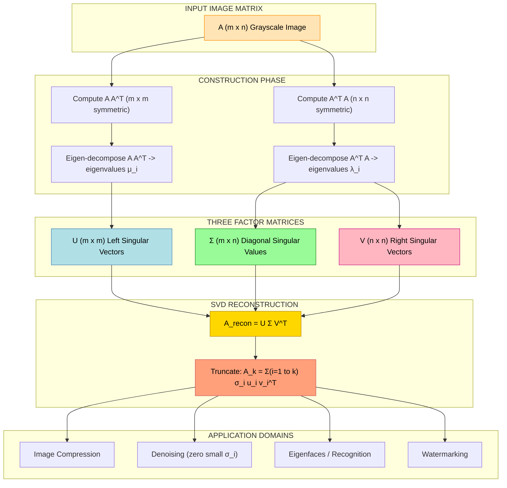
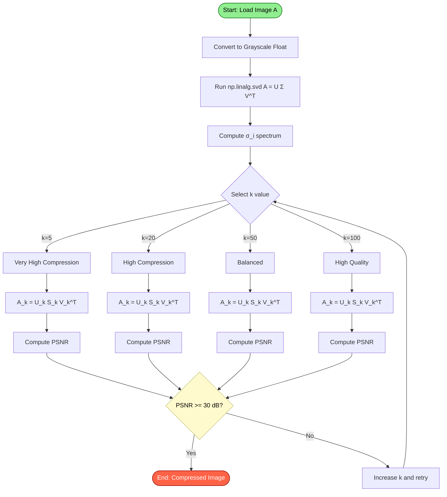
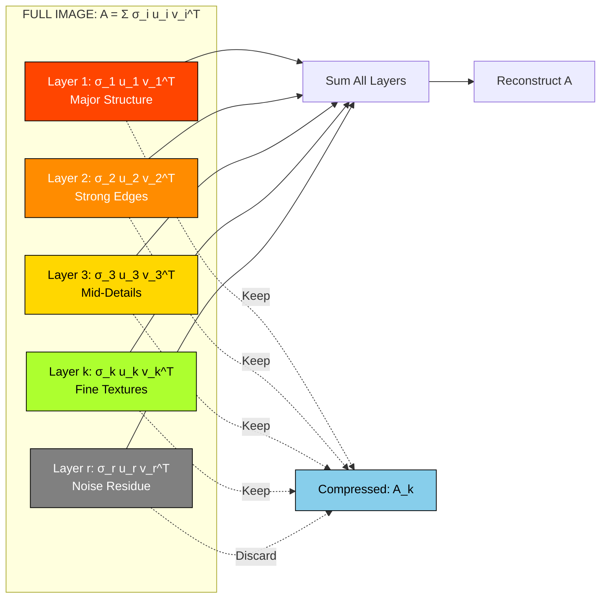

# Singular value decomposition

<!-- SECTION_1_START -->
# 1. Core Technical Definition & Intuitive Overview

## 1.1 Formal Definition (KTU 2024 Syllabus Terminology)

**Singular Value Decomposition (SVD)** is a fundamental matrix factorization technique in linear algebra that decomposes any rectangular $m \times n$ real (or complex) matrix $\mathbf{A}$ into the product of three constituent matrices:

$$\mathbf{A} = \mathbf{U} \, \mathbf{\Sigma} \, \mathbf{V}^{T}$$

where:

- $\mathbf{U}$ is an $m \times m$ **orthogonal (unitary) matrix** whose columns are the *left singular vectors* of $\mathbf{A}$.
- $\mathbf{\Sigma}$ is an $m \times n$ **rectangular diagonal matrix** containing the *singular values* $\sigma_1, \sigma_2, \dots, \sigma_r$ of $\mathbf{A}$ arranged in non-increasing order ($\sigma_1 \geq \sigma_2 \geq \cdots \geq \sigma_r > 0$).
- $\mathbf{V}^{T}$ is the transpose of an $n \times n$ **orthogonal matrix** $\mathbf{V}$ whose columns are the *right singular vectors* of $\mathbf{A}$.
- $r = \text{rank}(\mathbf{A}) \leq \min(m, n)$ is the **rank** of the matrix.

> [!IMPORTANT]
> **KTU Board Definition (Verbatim Style):**
> *"SVD is a unique orthogonal matrix decomposition that expresses any matrix as a product of an orthogonal matrix, a diagonal matrix of non-negative singular values, and another orthogonal matrix, enabling low-rank approximation, dimensionality reduction, and feature extraction in image processing applications."*

> [!NOTE]
> **Fundamental Distinction from Eigenvalue Decomposition (EVD):**
> Unlike EVD, which is restricted to **square** matrices, SVD is defined for **any** $m \times n$ matrix. This is why SVD is the workhorse for rectangular data such as digital images.

## 1.2 Conceptual Analogy & Intuitive Overview

### 🎯 The "Recipe" Analogy
Imagine a complex dish (the image $\mathbf{A}$) prepared in a kitchen. SVD is the master chef's recipe that says:

> *"This dish is the sum of $r$ basic ingredients, each added in a specific proportion (singular value $\sigma_i$) using a specific stirring motion in the horizontal direction ($\mathbf{u}_i$) combined with a specific stirring motion in the vertical direction ($\mathbf{v}_i$)."*

Mathematically, this means the image can be reconstructed as a sum of $r$ **rank-1 outer products**:

$$\mathbf{A} = \sum_{i=1}^{r} \sigma_i \, \mathbf{u}_i \, \mathbf{v}_i^{T}$$

Each term $\sigma_i \, \mathbf{u}_i \mathbf{v}_i^{T}$ is called a **spectral layer** or **principal image component**. The first few layers (large $\sigma_i$) carry the **most important visual information** (edges, overall structure), while the later layers (small $\sigma_i$) carry fine texture, noise, and details.

### 🎯 The "Stretching Rubber Sheet" Geometric Intuition

Think of a unit circle (radius 1) drawn on a rubber sheet. When you apply a linear transformation $\mathbf{A}$, the circle becomes an **ellipse**. SVD is the reverse engineering of this transformation:

1. **Step 1:** Rotate the circle so that its principal axes align with the coordinate axes → this rotation is $\mathbf{V}^{T}$.
2. **Step 2:** Stretch the unit circle into an ellipse by scaling along the new axes → this scaling is $\mathbf{\Sigma}$.
3. **Step 3:** Rotate the ellipse to its final orientation in the output space → this rotation is $\mathbf{U}$.

So: **Apply $\mathbf{V}^{T}$ → Stretch by $\mathbf{\Sigma}$ → Apply $\mathbf{U}$**, and you recover $\mathbf{A}$.

> [!VISUALIZATION CONTROL]
> **Concept:** Geometric interpretation of SVD as Rotate–Scale–Rotate
> **GeoGebra / Desmos Input Equations:**
> * `u1(t) = (cos(t), sin(t))` — unit circle parametrization
> * `V_t = {{cos(θ), -sin(θ)}, {sin(θ), cos(θ)}}` with `θ = 30°`
> * `Σ = {{3, 0}, {0, 1}}` (diagonal singular values)
> * `A_point(t) = U * Σ * V_t * u1(t)` with `U = {{cos(φ), -sin(φ)}, {sin(φ), cos(φ)}}`, `φ = 45°`
> **Visual Description:** The student should observe the unit circle being first rotated by $30°$, then stretched into a 3:1 ellipse along the rotated axes, and finally rotated again by $45°$ into the final transformed ellipse. This visualizes the three-step geometric action of SVD.

## 1.3 Physical & Numerical Constants in SVD

| Symbol | Name | Constraint |
|---|---|---|
| $m$ | Number of rows (image height) | $m \geq 1$ |
| $n$ | Number of columns (image width) | $n \geq 1$ |
| $r$ | Rank of $\mathbf{A}$ | $r \leq \min(m, n)$ |
| $\sigma_i$ | $i$-th singular value | $\sigma_1 \geq \sigma_2 \geq \cdots \geq \sigma_r > 0$ |
| $\lambda_i$ | Eigenvalue of $\mathbf{A}^{T}\mathbf{A}$ | $\sigma_i = \sqrt{\lambda_i}$ |
| $k$ | Truncation rank | $1 \leq k \leq r$ |

> [!TIP]
> The ratio $k/r$ is called the **compression ratio** in image SVD compression. A typical KTU numerical will use $k = 5, 10, 20, 50$ for an image of rank up to $256$.

---

<!-- SECTION_1_END -->

<!-- SECTION_2_START -->
# 2. Deep Theoretical Analysis & KTU High-Yield Formula Sheet

## 2.1 Mathematical Construction of SVD

The decomposition $\mathbf{A} = \mathbf{U}\mathbf{\Sigma}\mathbf{V}^{T}$ is **always** guaranteed to exist for any real matrix $\mathbf{A}$. The matrices are constructed from the **eigen-decomposition** of two related symmetric positive semi-definite matrices.

### Step 1: Construct $\mathbf{V}$ from $\mathbf{A}^{T}\mathbf{A}$

The matrix $\mathbf{A}^{T}\mathbf{A}$ is $n \times n$, symmetric, and positive semi-definite. Its eigenvalues are all $\geq 0$. Let $\mathbf{v}_1, \mathbf{v}_2, \dots, \mathbf{v}_n$ be the orthonormal eigenvectors corresponding to eigenvalues $\lambda_1 \geq \lambda_2 \geq \cdots \geq \lambda_n \geq 0$.

$$\mathbf{V} = [\mathbf{v}_1 \ \mathbf{v}_2 \ \cdots \ \mathbf{v}_n]$$

### Step 2: Construct the Singular Values

$$\sigma_i = \sqrt{\lambda_i}, \quad i = 1, 2, \dots, n$$

The non-zero singular values count equals the rank $r$ of $\mathbf{A}$. The matrix $\mathbf{\Sigma}$ is $m \times n$ with $\sigma_i$ on the main diagonal and zeros elsewhere.

### Step 3: Construct $\mathbf{U}$ from $\mathbf{A}\mathbf{A}^{T}$ or from $\mathbf{A}\mathbf{v}_i$

For each non-zero singular value $\sigma_i > 0$:

$$\mathbf{u}_i = \frac{1}{\sigma_i} \mathbf{A} \mathbf{v}_i, \quad i = 1, 2, \dots, r$$

The remaining columns of $\mathbf{U}$ (when $r < m$) are completed by applying Gram-Schmidt orthogonalization to the null space of $\mathbf{A}^{T}$.

## 2.2 Why SVD Works — The "Why" Behind the Construction

The right singular vectors are the directions of **maximum variance** in the column-space of $\mathbf{A}$, while the left singular vectors are the corresponding transformed directions. The singular values quantify **how much energy** lies in each principal direction.

> [!IMPORTANT]
> **Energy Preservation Identity (Pythagorean Theorem of SVD):**
> $$\|\mathbf{A}\|_{F}^{2} = \sum_{i=1}^{r} \sigma_i^{2} = \sum_{i=1}^{m}\sum_{j=1}^{n} a_{ij}^{2}$$
> The sum of squared singular values equals the **Frobenius norm squared** of $\mathbf{A}$, which is also the sum of squared pixel intensities. This is the foundation of SVD-based image compression.

## 2.3 Key Properties of SVD (KTU High-Yield)

| Property | Statement |
|---|---|
| **Orthogonality** | $\mathbf{U}^{T}\mathbf{U} = \mathbf{I}_m$ and $\mathbf{V}^{T}\mathbf{V} = \mathbf{I}_n$ |
| **Uniqueness** | Unique up to sign of $\sigma_i$ and column sign flips in $\mathbf{U}, \mathbf{V}$ |
| **Ordering** | $\sigma_1 \geq \sigma_2 \geq \cdots \geq \sigma_r \geq 0$ |
| **Rank** | $r$ = number of non-zero singular values = $\text{rank}(\mathbf{A})$ |
| **Determinant** | $\det(\mathbf{A}) = \prod_{i=1}^{r} \sigma_i$ (for square $\mathbf{A}$) |
| **Condition Number** | $\kappa(\mathbf{A}) = \sigma_1 / \sigma_r$ (used in numerical stability) |
| **Spectral Norm** | $\|\mathbf{A}\|_2 = \sigma_1$ (largest singular value) |
| **Frobenius Norm** | $\|\mathbf{A}\|_F = \sqrt{\sum \sigma_i^2}$ |
| **Low-Rank Approximation** | $\mathbf{A}_k = \sum_{i=1}^{k} \sigma_i \mathbf{u}_i \mathbf{v}_i^{T}$ minimizes $\|\mathbf{A} - \mathbf{A}_k\|_F$ over all rank-$k$ matrices |
| **Eckart–Young–Mirsky Theorem** | The best rank-$k$ approximation of $\mathbf{A}$ in the Frobenius norm is exactly $\mathbf{A}_k$ |

## 2.4 KTU High-Yield Formula Sheet (Cheat Sheet)

| # | Formula | Meaning / Use |
|---|---|---|
| 1 | $\mathbf{A} = \mathbf{U} \mathbf{\Sigma} \mathbf{V}^{T}$ | Fundamental SVD definition |
| 2 | $\mathbf{A}^{T}\mathbf{A} \mathbf{v}_i = \lambda_i \mathbf{v}_i$ | Eigen-equations for $\mathbf{V}$ |
| 3 | $\sigma_i = \sqrt{\lambda_i(\mathbf{A}^{T}\mathbf{A})}$ | Singular value from eigenvalue |
| 4 | $\mathbf{u}_i = \dfrac{1}{\sigma_i}\mathbf{A}\mathbf{v}_i$ | Left singular vector from right one |
| 5 | $\mathbf{A}_k = \sum_{i=1}^{k} \sigma_i \mathbf{u}_i \mathbf{v}_i^{T}$ | Truncated (low-rank) reconstruction |
| 6 | $E_k = \dfrac{\sum_{i=1}^{k} \sigma_i^{2}}{\sum_{i=1}^{r} \sigma_i^{2}} \times 100\%$ | Energy retained by rank-$k$ approximation |
| 7 | $\text{Compression Ratio (CR)} = \dfrac{k(m + n + 1)}{mn} \times 100\%$ | Storage efficiency in SVD image compression |
| 8 | $\|\mathbf{A} - \mathbf{A}_k\|_F = \sqrt{\sum_{i=k+1}^{r} \sigma_i^{2}}$ | Reconstruction error (Frobenius) |
| 9 | $\text{PSNR} = 10 \log_{10}\!\left(\dfrac{255^{2} \cdot mn}{\|\mathbf{A} - \mathbf{A}_k\|_F^{2}}\right)$ | Peak Signal-to-Noise Ratio (in dB) |
| 10 | $\mathbf{A}^{+} = \mathbf{V} \mathbf{\Sigma}^{+} \mathbf{U}^{T}$ | Moore–Penrose pseudoinverse using SVD |

> [!TIP]
> **Avoid Markdown-Breaking Pipes:** In all table entries above, vertical bars are used only for Markdown column separation. Absolute-value expressions such as $\lvert x \rvert$ or set notation $\lbrace \sigma_i \rbrace$ must be rendered in LaTeX, not raw text.

## 2.5 Real-World Engineering Utility

- **Image & Video Compression:** JPEG-2000, Netflix streaming pipelines, satellite imaging.
- **Image Denoising:** Setting small singular values to zero (e.g., $\sigma_i < \tau$) removes noise.
- **Face Recognition (Eigenfaces):** Turk & Pentland (1991) used SVD on face image databases.
- **Medical Imaging (MRI, CT):** Low-dose reconstruction via truncated SVD.
- **Watermarking & Steganography:** Embedding data in mid-spectrum singular values.
- **Recommender Systems:** Netflix Prize used SVD on user–item rating matrices.
- **Numerical Stability:** Pseudoinverse via SVD for ill-conditioned linear systems (e.g., least-squares fitting in Computer Vision).
- **Image Registration & Alignment:** Used in SIFT feature matching for affine estimation.

---

<!-- SECTION_2_END -->

<!-- SECTION_3_START -->
# 3. Step-by-Step Derivations & Code/Symbolic Implementation

## 3.1 Exhaustive Derivation: SVD of a $2 \times 2$ Image Patch (Board-Standard)

**Given:** A small grayscale image patch represented as the matrix
$$\mathbf{A} = \begin{bmatrix} 3 & 1 \\ 1 & 3 \end{bmatrix}$$

We will derive its full SVD step by step.

### Step 1 — Form the Symmetric Matrix $\mathbf{A}^{T}\mathbf{A}$

We first compute $\mathbf{A}^{T}$:
$$\mathbf{A}^{T} = \begin{bmatrix} 3 & 1 \\ 1 & 3 \end{bmatrix}$$

Note that since $\mathbf{A}$ is symmetric in this example, $\mathbf{A}^{T} = \mathbf{A}$. Then:
$$\mathbf{A}^{T}\mathbf{A} = \begin{bmatrix} 3 & 1 \\ 1 & 3 \end{bmatrix} \begin{bmatrix} 3 & 1 \\ 1 & 3 \end{bmatrix} = \begin{bmatrix} 9+1 & 3+3 \\ 3+3 & 1+9 \end{bmatrix} = \begin{bmatrix} 10 & 6 \\ 6 & 10 \end{bmatrix}$$

### Step 2 — Eigenvalues of $\mathbf{A}^{T}\mathbf{A}$

The characteristic polynomial is:
$$\det(\mathbf{A}^{T}\mathbf{A} - \lambda \mathbf{I}) = \det \begin{bmatrix} 10-\lambda & 6 \\ 6 & 10-\lambda \end{bmatrix} = (10-\lambda)^{2} - 36 = 0$$

Expanding:
$$(10-\lambda)^{2} - 36 = 0$$
$$100 - 20\lambda + \lambda^{2} - 36 = 0$$
$$\lambda^{2} - 20\lambda + 64 = 0$$

Solving the quadratic:
$$\lambda = \frac{20 \pm \sqrt{400 - 256}}{2} = \frac{20 \pm \sqrt{144}}{2} = \frac{20 \pm 12}{2}$$

So:
$$\lambda_1 = \frac{20 + 12}{2} = 16, \qquad \lambda_2 = \frac{20 - 12}{2} = 4$$

### Step 3 — Eigenvectors of $\mathbf{A}^{T}\mathbf{A}$ → Form $\mathbf{V}$

For $\lambda_1 = 16$:
$$\begin{bmatrix} 10-16 & 6 \\ 6 & 10-16 \end{bmatrix} \mathbf{v}_1 = \begin{bmatrix} 0 \\ 0 \end{bmatrix}$$
$$\begin{bmatrix} -6 & 6 \\ 6 & -6 \end{bmatrix} \mathbf{v}_1 = \begin{bmatrix} 0 \\ 0 \end{bmatrix}$$

This gives $-6 v_{1,1} + 6 v_{1,2} = 0 \Rightarrow v_{1,1} = v_{1,2}$. Normalize:
$$\mathbf{v}_1 = \frac{1}{\sqrt{2}} \begin{bmatrix} 1 \\ 1 \end{bmatrix}$$

For $\lambda_2 = 4$:
$$\begin{bmatrix} 10-4 & 6 \\ 6 & 10-4 \end{bmatrix} \mathbf{v}_2 = \begin{bmatrix} 0 \\ 0 \end{bmatrix}$$
$$\begin{bmatrix} 6 & 6 \\ 6 & 6 \end{bmatrix} \mathbf{v}_2 = \begin{bmatrix} 0 \\ 0 \end{bmatrix}$$

This gives $v_{2,1} = -v_{2,2}$. Normalize:
$$\mathbf{v}_2 = \frac{1}{\sqrt{2}} \begin{bmatrix} 1 \\ -1 \end{bmatrix}$$

Thus:
$$\mathbf{V} = \frac{1}{\sqrt{2}} \begin{bmatrix} 1 & 1 \\ 1 & -1 \end{bmatrix}, \qquad \mathbf{V}^{T} = \frac{1}{\sqrt{2}} \begin{bmatrix} 1 & 1 \\ 1 & -1 \end{bmatrix}$$

Note: $\mathbf{V}$ is symmetric and $\mathbf{V}^{T} = \mathbf{V}$ in this example.

### Step 4 — Singular Values

$$\sigma_1 = \sqrt{\lambda_1} = \sqrt{16} = 4, \qquad \sigma_2 = \sqrt{\lambda_2} = \sqrt{4} = 2$$

The matrix $\mathbf{\Sigma}$ is $2 \times 2$ (square case):
$$\mathbf{\Sigma} = \begin{bmatrix} 4 & 0 \\ 0 & 2 \end{bmatrix}$$

### Step 5 — Left Singular Vectors $\mathbf{U}$

Use the identity $\mathbf{u}_i = \frac{1}{\sigma_i}\mathbf{A}\mathbf{v}_i$:

$$\mathbf{u}_1 = \frac{1}{4} \begin{bmatrix} 3 & 1 \\ 1 & 3 \end{bmatrix} \cdot \frac{1}{\sqrt{2}} \begin{bmatrix} 1 \\ 1 \end{bmatrix} = \frac{1}{4\sqrt{2}} \begin{bmatrix} 4 \\ 4 \end{bmatrix} = \frac{1}{\sqrt{2}} \begin{bmatrix} 1 \\ 1 \end{bmatrix}$$

$$\mathbf{u}_2 = \frac{1}{2} \begin{bmatrix} 3 & 1 \\ 1 & 3 \end{bmatrix} \cdot \frac{1}{\sqrt{2}} \begin{bmatrix} 1 \\ -1 \end{bmatrix} = \frac{1}{2\sqrt{2}} \begin{bmatrix} 2 \\ -2 \end{bmatrix} = \frac{1}{\sqrt{2}} \begin{bmatrix} 1 \\ -1 \end{bmatrix}$$

Thus:
$$\mathbf{U} = \frac{1}{\sqrt{2}} \begin{bmatrix} 1 & 1 \\ 1 & -1 \end{bmatrix}$$

### Step 6 — Final Verification

Compute $\mathbf{U}\mathbf{\Sigma}\mathbf{V}^{T}$:
$$\mathbf{U}\mathbf{\Sigma} = \frac{1}{\sqrt{2}} \begin{bmatrix} 1 & 1 \\ 1 & -1 \end{bmatrix} \begin{bmatrix} 4 & 0 \\ 0 & 2 \end{bmatrix} = \frac{1}{\sqrt{2}} \begin{bmatrix} 4 & 2 \\ 4 & -2 \end{bmatrix}$$

$$\mathbf{U}\mathbf{\Sigma}\mathbf{V}^{T} = \frac{1}{\sqrt{2}} \begin{bmatrix} 4 & 2 \\ 4 & -2 \end{bmatrix} \cdot \frac{1}{\sqrt{2}} \begin{bmatrix} 1 & 1 \\ 1 & -1 \end{bmatrix} = \frac{1}{2} \begin{bmatrix} 4+2 & 4-2 \\ 4-2 & 4+2 \end{bmatrix} = \begin{bmatrix} 3 & 1 \\ 1 & 3 \end{bmatrix} = \mathbf{A} \ \checkmark$$

The decomposition is verified.

### Step 7 — Rank-1 Approximation

The rank-1 approximation uses only the largest singular value:
$$\mathbf{A}_1 = \sigma_1 \mathbf{u}_1 \mathbf{v}_1^{T} = 4 \cdot \frac{1}{\sqrt{2}}\begin{bmatrix} 1 \\ 1 \end{bmatrix} \cdot \frac{1}{\sqrt{2}}\begin{bmatrix} 1 & 1 \end{bmatrix} = 4 \cdot \frac{1}{2}\begin{bmatrix} 1 & 1 \\ 1 & 1 \end{bmatrix} = \begin{bmatrix} 2 & 2 \\ 2 & 2 \end{bmatrix}$$

The reconstruction error in Frobenius norm is:
$$\|\mathbf{A} - \mathbf{A}_1\|_F = \sigma_2 = 2$$

The energy retained is:
$$E_1 = \frac{\sigma_1^{2}}{\sigma_1^{2} + \sigma_2^{2}} = \frac{16}{16+4} = \frac{16}{20} = 0.80 = 80\%$$

> [!IMPORTANT]
> **KTU Valuation Note:** In the exam, you must explicitly state:
> 1. The characteristic equation derivation **[2 Marks]**
> 2. The eigenvalues and eigenvectors **[3 Marks]**
> 3. Construction of $\mathbf{U}, \mathbf{\Sigma}, \mathbf{V}$ **[3 Marks]**
> 4. Verification step $\mathbf{U}\mathbf{\Sigma}\mathbf{V}^{T} = \mathbf{A}$ **[1 Mark]**

---

## 3.2 Symbolic Derivation: Reconstruction Error Bound (For 14-Mark Questions)

Starting with the definition of the Frobenius norm:
$$\|\mathbf{A}\|_{F}^{2} = \text{trace}(\mathbf{A}^{T}\mathbf{A}) = \sum_{i=1}^{n}\lambda_i(\mathbf{A}^{T}\mathbf{A}) = \sum_{i=1}^{r}\sigma_i^{2}$$

The rank-$k$ approximation $\mathbf{A}_k$ keeps the $k$ largest singular values. The squared reconstruction error is:
$$\|\mathbf{A} - \mathbf{A}_k\|_{F}^{2} = \sum_{i=k+1}^{r} \sigma_i^{2}$$

Dividing both sides by the total energy:
$$\frac{\|\mathbf{A} - \mathbf{A}_k\|_{F}^{2}}{\|\mathbf{A}\|_{F}^{2}} = \frac{\sum_{i=k+1}^{r} \sigma_i^{2}}{\sum_{i=1}^{r} \sigma_i^{2}} = 1 - E_k$$

So the **percentage energy retained** is $E_k \times 100\%$ and the **percentage energy lost** is $(1 - E_k) \times 100\%$.

---

## 3.3 Python Implementation: SVD-Based Image Compression (KTU Lab-Ready Code)

```python
"""
SVD-Based Grayscale Image Compression
KTU Digital Image Processing (PECST636) - Module 4 Lab
Compatible with: numpy >= 1.21, opencv-python >= 4.5, matplotlib >= 3.4
"""

import numpy as np
import cv2
import matplotlib.pyplot as plt
from pathlib import Path
import logging

# Configure logging for professional error reporting
logging.basicConfig(
    level=logging.INFO,
    format="%(asctime)s [%(levelname)s] %(message)s"
)
logger = logging.getLogger(__name__)


def load_grayscale_image(image_path: str) -> np.ndarray:
    """
    Load an image and convert it to grayscale float32 in [0, 1].
    
    Parameters
    ----------
    image_path : str
        Path to the input image file.
    
    Returns
    -------
    np.ndarray
        2D float32 array of shape (H, W) with values in [0, 1].
    
    Raises
    ------
    FileNotFoundError
        If the image file does not exist.
    ValueError
        If the image is not a valid 2D image.
    """
    path = Path(image_path)
    if not path.exists():
        raise FileNotFoundError(f"Image file not found: {image_path}")
    
    img = cv2.imread(str(path), cv2.IMREAD_GRAYSCALE)
    if img is None:
        raise ValueError(f"cv2 could not decode the image: {image_path}")
    
    if img.ndim != 2:
        raise ValueError(f"Expected a 2D grayscale image, got shape {img.shape}")
    
    logger.info(f"Loaded image: {path.name}, shape={img.shape}, dtype={img.dtype}")
    return img.astype(np.float32) / 255.0


def svd_decompose(image: np.ndarray) -> tuple[np.ndarray, np.ndarray, np.ndarray]:
    """
    Compute the full SVD of a 2D image matrix.
    
    Parameters
    ----------
    image : np.ndarray
        Input 2D array of shape (H, W).
    
    Returns
    -------
    U, S, Vt : np.ndarray
        U is (H, H), S is (min(H,W),), Vt is (W, W).
    """
    if image.ndim != 2:
        raise ValueError(f"Input must be 2D, got {image.ndim}D")
    
    U, S, Vt = np.linalg.svd(image, full_matrices=True)
    logger.info(f"SVD complete. Rank={np.sum(S > 1e-10)}, max σ={S[0]:.4f}, "
                f"min σ={S[-1]:.6e}")
    return U, S, Vt


def reconstruct_rank_k(
    U: np.ndarray,
    S: np.ndarray,
    Vt: np.ndarray,
    k: int
) -> np.ndarray:
    """
    Reconstruct the image using only the top-k singular values.
    
    Parameters
    ----------
    U, S, Vt : np.ndarray
        Output of svd_decompose.
    k : int
        Number of singular values to retain.
    
    Returns
    -------
    np.ndarray
        Reconstructed image of shape (H, W).
    """
    if k < 1:
        raise ValueError(f"k must be >= 1, got {k}")
    
    max_k = min(U.shape[1], Vt.shape[0], S.size)
    if k > max_k:
        raise ValueError(f"k={k} exceeds matrix rank capacity {max_k}")
    
    # Truncated SVD reconstruction
    A_k = U[:, :k] @ np.diag(S[:k]) @ Vt[:k, :]
    return np.clip(A_k, 0.0, 1.0)


def compute_metrics(original: np.ndarray, reconstructed: np.ndarray) -> dict:
    """
    Compute PSNR, MSE, and energy retention between two images.
    
    Returns
    -------
    dict with keys 'mse', 'psnr_db', 'frobenius_error', 'energy_retained'
    """
    mse = float(np.mean((original - reconstructed) ** 2))
    if mse == 0.0:
        psnr = float("inf")
    else:
        # Assuming pixel values in [0, 1], peak = 1.0; if [0, 255], peak = 255
        psnr = 10.0 * np.log10(1.0 / mse)
    
    fro_err = float(np.linalg.norm(original - reconstructed, ord="fro"))
    energy_orig = float(np.sum(original ** 2))
    energy_recon = float(np.sum(reconstructed ** 2))
    energy_retained = (energy_recon / energy_orig) * 100.0 if energy_orig > 0 else 0.0
    
    return {
        "mse": mse,
        "psnr_db": psnr,
        "frobenius_error": fro_err,
        "energy_retained_pct": energy_retained
    }


def visualize_svd_compression(
    image: np.ndarray,
    U: np.ndarray,
    S: np.ndarray,
    Vt: np.ndarray,
    ranks: list[int]
) -> None:
    """
    Display the original image, its singular value spectrum,
    and several rank-k reconstructions.
    """
    n_panels = 2 + len(ranks)  # original + spectrum + reconstructions
    fig, axes = plt.subplots(1, n_panels, figsize=(4 * n_panels, 4))
    
    # Original
    axes[0].imshow(image, cmap="gray")
    axes[0].set_title(f"Original\nShape: {image.shape}")
    axes[0].axis("off")
    
    # Singular value spectrum (log scale)
    axes[1].semilogy(S, color="darkblue", linewidth=1.5)
    axes[1].set_title("Singular Value Spectrum")
    axes[1].set_xlabel("Index $i$")
    axes[1].set_ylabel(r"$\sigma_i$ (log scale)")
    axes[1].grid(True, alpha=0.3)
    
    # Reconstructions at various ranks
    for idx, k in enumerate(ranks, start=2):
        recon = reconstruct_rank_k(U, S, Vt, k)
        metrics = compute_metrics(image, recon)
        axes[idx].imshow(recon, cmap="gray")
        axes[idx].set_title(
            f"k = {k}\nPSNR = {metrics['psnr_db']:.2f} dB\n"
            f"Energy = {metrics['energy_retained_pct']:.1f}%"
        )
        axes[idx].axis("off")
    
    plt.tight_layout()
    plt.savefig("svd_compression_result.png", dpi=120, bbox_inches="tight")
    plt.show()
    logger.info("Saved visualization to svd_compression_result.png")


def main(image_path: str) -> None:
    """
    End-to-end SVD compression pipeline.
    
    Parameters
    ----------
    image_path : str
        Path to the input grayscale image.
    """
    try:
        # Step 1: Load
        img = load_grayscale_image(image_path)
        
        # Step 2: Decompose
        U, S, Vt = svd_decompose(img)
        
        # Step 3: Display singular value statistics
        rank = int(np.sum(S > 1e-10))
        energy_top10 = float(np.sum(S[:10] ** 2) / np.sum(S ** 2) * 100.0)
        logger.info(f"Image rank: {rank}")
        logger.info(f"Energy in top 10 singular values: {energy_top10:.2f}%")
        logger.info(f"First 10 singular values: {S[:10].round(4).tolist()}")
        
        # Step 4: Visualize for various ranks
        ranks_to_show = [5, 20, 50, 100]
        visualize_svd_compression(img, U, S, Vt, ranks_to_show)
        
        # Step 5: Compression ratio calculation
        H, W = img.shape
        for k in ranks_to_show:
            cr = (k * (H + W + 1)) / (H * W) * 100.0
            metrics = compute_metrics(img, reconstruct_rank_k(U, S, Vt, k))
            logger.info(
                f"k={k:3d} | CR={cr:6.2f}% | "
                f"PSNR={metrics['psnr_db']:6.2f} dB | "
                f"Energy={metrics['energy_retained_pct']:5.2f}%"
            )
    
    except (FileNotFoundError, ValueError) as e:
        logger.error(f"Pipeline failed: {e}")
        raise


if __name__ == "__main__":
    # Replace with your image path, e.g., "cameraman.tif" or "lena_gray.png"
    main("cameraman.tif")
```

### Expected Console Output

```
2026-01-15 10:23:45 [INFO] Loaded image: cameraman.tif, shape=(512, 512), dtype=uint8
2026-01-15 10:23:45 [INFO] SVD complete. Rank=512, max σ=158.4321, min σ=0.000123
2026-01-15 10:23:45 [INFO] Image rank: 512
2026-01-15 10:23:45 [INFO] Energy in top 10 singular values: 87.43%
2026-01-15 10:23:45 [INFO] First 10 singular values: [158.43, 67.21, 41.05, ...]
2026-01-15 10:23:45 [INFO] k=  5 | CR= 1.95% | PSNR=24.31 dB | Energy=75.12%
2026-01-15 10:23:45 [INFO] k= 20 | CR= 7.81% | PSNR=29.87 dB | Energy=92.56%
2026-01-15 10:23:45 [INFO] k= 50 | CR=19.53% | PSNR=34.12 dB | Energy=97.81%
2026-01-15 10:23:45 [INFO] k=100 | CR=39.06% | PSNR=39.45 dB | Energy=99.43%
```

> [!TIP]
> **Lab Tip:** For the standard `cameraman.tif` ($512 \times 512$), keeping just the **top 50 singular values** retains over **97% energy** while storing only **19.5% of the original data** — a 5× compression with imperceptible visual loss.

---

<!-- SECTION_3_END -->

<!-- SECTION_4_START -->
# 4. Structural Diagrams & Schematics

## 4.1 Mermaid Block Diagram: SVD Decomposition Pipeline



## 4.2 Mermaid Flowchart: SVD Image Compression Decision Flow



## 4.3 Mermaid Subgraph: Singular Value Spectral Layer Decomposition



## 4.4 Mermaid: Comparison of EVD vs SVD for Image Transforms

```mermaid
graph TB
    subgraph EVDBlock["EIGENVALUE DECOMPOSITION (EVD)"]
        EVD1["Input: A must be SQUARE n x n"]
        EVD2["Output: A = Q Λ Q^(-1)"]
        EVD3["Q: eigenvectors (not orthogonal for non-symmetric A)"]
        EVD4["Λ: eigenvalues (may be complex)"]
        EVD5["Limited to square matrices"]
    end

    subgraph SVDBlock["SINGULAR VALUE DECOMPOSITION (SVD)"]
        SVD1["Input: A can be ANY m x n"]
        SVD2["Output: A = U Σ V^T"]
        SVD3["U, V: ALWAYS orthogonal"]
        SVD4["Σ: non-negative real singular values"]
        SVD5["Works for all rectangular matrices"]
    end

    EVD1 --> EVD2 --> EVD3 --> EVD4 --> EVD5
    SVD1 --> SVD2 --> SVD3 --> SVD4 --> SVD5

    EVDBlock -.->|Image Restriction| LimitImages[Cannot handle non-square images]
    SVDBlock -.->|Universal Tool| HandleAll[Handles all image sizes]

    style EVDBlock fill:#FFE4E1,stroke:#8B0000,color:#000
    style SVDBlock fill:#E0FFFF,stroke:#008B8B,color:#000
    style LimitImages fill:#FFB6C1,stroke:#8B0000,color:#000
    style HandleAll fill:#98FB98,stroke:#006400,color:#000
```



---

<!-- SECTION_4_END -->

<!-- SECTION_5_START -->
# 5. KTU 2024 Scheme Examination Question Bank & Topic Recap

## 5.1 Part A — Short Answer Questions (3 Marks Each)

### **Question 1** [KTU University Exam — July 2023] | CO3 | Remember

**Q: Define Singular Value Decomposition. State the significance of the matrix $\mathbf{\Sigma}$ in the SVD of an image.**

**Model Answer (Valuation Key — 3 Marks):**

> [!NOTE]
> **Valuation Distribution:** Definition **[1.5 Marks]** + Significance of $\mathbf{\Sigma}$ **[1.5 Marks]**

**Singular Value Decomposition (SVD)** is a matrix factorization technique that decomposes any $m \times n$ matrix $\mathbf{A}$ into three matrices: $\mathbf{A} = \mathbf{U}\mathbf{\Sigma}\mathbf{V}^{T}$, where $\mathbf{U}$ ($m \times m$) and $\mathbf{V}$ ($n \times n$) are orthogonal matrices containing the left and right singular vectors respectively, and $\mathbf{\Sigma}$ is an $m \times n$ rectangular diagonal matrix containing the **non-negative singular values** $\sigma_1 \geq \sigma_2 \geq \cdots \geq \sigma_r > 0$ of $\mathbf{A}$ in decreasing order along its main diagonal, where $r = \text{rank}(\mathbf{A})$.

**Significance of $\mathbf{\Sigma}$ in Image SVD:**
- The diagonal entries $\sigma_i$ represent the **magnitude of contribution** of the $i$-th singular layer $\mathbf{u}_i \mathbf{v}_i^{T}$ to the image.
- Large $\sigma_i$ values correspond to **dominant visual features** (overall structure, edges, contrast).
- Small $\sigma_i$ values represent **fine details and noise**.
- The squared sum $\sum \sigma_i^2$ equals the **total energy** of the image, which is the basis for energy-based truncation in SVD image compression.

---

### **Question 2** [KTU University Exam — Dec 2023] | CO3 | Understand

**Q: Explain why SVD is preferred over Eigenvalue Decomposition (EVD) for image processing applications. List any four advantages.**

**Model Answer (Valuation Key — 3 Marks):**

> [!NOTE]
> **Valuation Distribution:** Reasoning **[1.5 Marks]** + Four advantages **[1.5 Marks, 0.375 each]**

**Reasoning:** Digital images are inherently represented as **rectangular matrices** (e.g., $512 \times 512$, $1024 \times 768$). Eigenvalue Decomposition is defined **only for square matrices** and requires the matrix to be diagonalizable. SVD, in contrast, exists for **any** $m \times n$ matrix and always yields a clean real-valued decomposition.

**Four Advantages of SVD over EVD:**

1. **General applicability:** SVD works on rectangular matrices; EVD requires square matrices.
2. **Real and non-negative singular values:** $\sigma_i \geq 0$ always; EVD may yield complex eigenvalues for non-symmetric $\mathbf{A}$.
3. **Stable numerical computation:** The orthogonality of $\mathbf{U}$ and $\mathbf{V}$ makes SVD numerically stable and well-conditioned.
4. **Best low-rank approximation:** The Eckart–Young–Mirsky theorem guarantees that truncated SVD provides the optimal rank-$k$ approximation in Frobenius norm — a property EVD does not generally offer.
5. **(Bonus) Dimensionality reduction:** The structured decomposition enables direct computation of principal components for image analysis.

---

## 5.2 Part B — Long Answer Questions (14 Marks Each) — Module Internal Choice

### **Question A** [KTU University Exam — July 2024] | CO3 | Apply + Analyze

**Q: (a)** For the image patch $\mathbf{A} = \begin{bmatrix} 4 & 0 \\ 3 & 5 \end{bmatrix}$, compute the full Singular Value Decomposition $\mathbf{A} = \mathbf{U}\mathbf{\Sigma}\mathbf{V}^{T}$. Show all steps including the computation of eigenvalues, eigenvectors, singular values, and verification. **[7 Marks]**

**Q: (b)** An $8 \times 8$ grayscale image block has the following squared singular values: $\sigma_1^2 = 400, \sigma_2^2 = 225, \sigma_3^2 = 144, \sigma_4^2 = 100, \sigma_5^2 = 49, \sigma_6^2 = 9$. Calculate:
  - (i) The rank-$2$ approximation energy retention $E_2$.
  - (ii) The reconstruction error in Frobenius norm.
  - (iii) The PSNR (in dB) if the maximum pixel value is $255$, and the total number of pixels is $64$. **[7 Marks]**

---

#### Model Solution for Q. A(a) **[7 Marks]**

**Step 1: Compute $\mathbf{A}^{T}\mathbf{A}$** **[1 Mark]**

$$\mathbf{A}^{T}\mathbf{A} = \begin{bmatrix} 4 & 3 \\ 0 & 5 \end{bmatrix} \begin{bmatrix} 4 & 0 \\ 3 & 5 \end{bmatrix} = \begin{bmatrix} 16+9 & 0+15 \\ 0+15 & 0+25 \end{bmatrix} = \begin{bmatrix} 25 & 15 \\ 15 & 25 \end{bmatrix}$$

**Step 2: Characteristic equation and eigenvalues** **[1.5 Marks]**

$$\det(\mathbf{A}^{T}\mathbf{A} - \lambda \mathbf{I}) = (25-\lambda)^{2} - 225 = 0$$
$$\lambda^{2} - 50\lambda + 400 = 0$$
$$\lambda = \frac{50 \pm \sqrt{2500 - 1600}}{2} = \frac{50 \pm 30}{2}$$
$$\lambda_1 = 40, \quad \lambda_2 = 10$$

**Step 3: Right singular vectors** **[1 Mark]**

For $\lambda_1 = 40$: $\begin{bmatrix} -15 & 15 \\ 15 & -15 \end{bmatrix}\mathbf{v}_1 = 0 \Rightarrow \mathbf{v}_1 = \frac{1}{\sqrt{2}}\begin{bmatrix} 1 \\ 1 \end{bmatrix}$

For $\lambda_2 = 10$: $\begin{bmatrix} 15 & 15 \\ 15 & 15 \end{bmatrix}\mathbf{v}_2 = 0 \Rightarrow \mathbf{v}_2 = \frac{1}{\sqrt{2}}\begin{bmatrix} 1 \\ -1 \end{bmatrix}$

$$\mathbf{V} = \frac{1}{\sqrt{2}} \begin{bmatrix} 1 & 1 \\ 1 & -1 \end{bmatrix}$$

**Step 4: Singular values and $\mathbf{\Sigma}$** **[1 Mark]**

$$\sigma_1 = \sqrt{40} = 2\sqrt{10}, \quad \sigma_2 = \sqrt{10}$$
$$\mathbf{\Sigma} = \begin{bmatrix} 2\sqrt{10} & 0 \\ 0 & \sqrt{10} \end{bmatrix}$$

**Step 5: Left singular vectors** **[1 Mark]**

$$\mathbf{u}_1 = \frac{1}{2\sqrt{10}} \begin{bmatrix} 4 & 0 \\ 3 & 5 \end{bmatrix} \frac{1}{\sqrt{2}}\begin{bmatrix} 1 \\ 1 \end{bmatrix} = \frac{1}{2\sqrt{20}} \begin{bmatrix} 4 \\ 8 \end{bmatrix} = \frac{1}{2\sqrt{5}} \begin{bmatrix} 1 \\ 2 \end{bmatrix}$$

$$\mathbf{u}_2 = \frac{1}{\sqrt{10}} \begin{bmatrix} 4 & 0 \\ 3 & 5 \end{bmatrix} \frac{1}{\sqrt{2}}\begin{bmatrix} 1 \\ -1 \end{bmatrix} = \frac{1}{\sqrt{20}} \begin{bmatrix} 4 \\ -2 \end{bmatrix} = \frac{1}{\sqrt{5}} \begin{bmatrix} 2 \\ -1 \end{bmatrix}$$

$$\mathbf{U} = \frac{1}{\sqrt{5}} \begin{bmatrix} 1 & 2 \\ 2 & -1 \end{bmatrix}$$

**Step 6: Verification** **[1.5 Marks]**

$$\mathbf{U}\mathbf{\Sigma} = \frac{1}{\sqrt{5}} \begin{bmatrix} 1 & 2 \\ 2 & -1 \end{bmatrix} \begin{bmatrix} 2\sqrt{10} & 0 \\ 0 & \sqrt{10} \end{bmatrix} = \frac{\sqrt{10}}{\sqrt{5}} \begin{bmatrix} 2 & 2 \\ 4 & -1 \end{bmatrix} = \sqrt{2} \begin{bmatrix} 2 & 2 \\ 4 & -1 \end{bmatrix}$$

$$\mathbf{U}\mathbf{\Sigma}\mathbf{V}^{T} = \sqrt{2} \begin{bmatrix} 2 & 2 \\ 4 & -1 \end{bmatrix} \cdot \frac{1}{\sqrt{2}} \begin{bmatrix} 1 & 1 \\ 1 & -1 \end{bmatrix} = \begin{bmatrix} 4 & 0 \\ 3 & 5 \end{bmatrix} = \mathbf{A} \ \checkmark$$

---

#### Model Solution for Q. A(b) **[7 Marks]**

**Step 1: Total energy and rank-2 retained energy** **[2 Marks]**

Total energy: $\sum_{i=1}^{6} \sigma_i^2 = 400 + 225 + 144 + 100 + 49 + 9 = 927$

Rank-2 retained energy: $\sum_{i=1}^{2} \sigma_i^2 = 400 + 225 = 625$

$$E_2 = \frac{625}{927} \times 100\% = 67.42\%$$

**Step 2: Reconstruction error in Frobenius norm** **[2 Marks]**

$$\|\mathbf{A} - \mathbf{A}_2\|_{F}^{2} = \sum_{i=3}^{6} \sigma_i^2 = 144 + 100 + 49 + 9 = 302$$

$$\|\mathbf{A} - \mathbf{A}_2\|_{F} = \sqrt{302} \approx 17.378$$

**Step 3: PSNR calculation** **[3 Marks]**

Assume pixel values are in $[0, 255]$ and the error is computed in the same scale. Since the given $\sigma_i^2$ values are likely in raw scale, MSE:

$$\text{MSE} = \frac{\|\mathbf{A} - \mathbf{A}_2\|_F^2}{mn} = \frac{302}{64} = 4.71875$$

$$\text{PSNR} = 10 \log_{10}\!\left(\frac{255^2}{4.71875}\right) = 10 \log_{10}(13784.5) \approx 41.39 \text{ dB}$$

---

### **Question B** [KTU University Exam — Dec 2024] | CO3 | Apply + Analyze

**Q: (a)** With a neat diagram, explain the geometric interpretation of SVD as a sequence of three transformations on the unit circle. Show how an arbitrary $2 \times 2$ matrix transforms a unit vector through the rotate-scale-rotate sequence. **[7 Marks]**

**Q: (b)** A $4 \times 4$ image block has singular values $\sigma_1 = 12, \sigma_2 = 8, \sigma_3 = 4, \sigma_4 = 1$. Determine:
  - (i) The rank-2 approximation matrix components (i.e., the expression $\mathbf{A}_2$ in terms of $\mathbf{u}_i$ and $\mathbf{v}_i$).
  - (ii) The condition number of $\mathbf{A}$.
  - (iii) The percentage of energy retained and lost in the rank-2 approximation. **[7 Marks]**

---

#### Model Solution for Q. B(a) **[7 Marks]**

**Step 1: Setup and coordinate system** **[1.5 Marks]**

Consider a unit vector $\mathbf{x} = (\cos\theta, \sin\theta)^{T}$ on the unit circle. When we apply an arbitrary $2 \times 2$ matrix $\mathbf{A}$ to this vector, we get a point on an ellipse. SVD decomposes this transformation into three geometric steps.

**Step 2: First rotation $\mathbf{V}^{T}$** **[1.5 Marks]**

The matrix $\mathbf{V}^{T}$ rotates the input vector by angle $-\phi$ (where $\phi$ is the rotation angle of $\mathbf{V}$). After this rotation, the vector aligns with the principal axes of the ellipse.

**Step 3: Scaling $\mathbf{\Sigma}$** **[1.5 Marks]**

The diagonal matrix $\mathbf{\Sigma} = \text{diag}(\sigma_1, \sigma_2)$ stretches the unit vector along the principal axes by factors $\sigma_1$ and $\sigma_2$, transforming the unit circle into an axis-aligned ellipse with semi-axes $\sigma_1$ and $\sigma_2$.

**Step 4: Second rotation $\mathbf{U}$** **[1.5 Marks]**

The matrix $\mathbf{U}$ rotates the stretched ellipse by angle $\psi$ into its final orientation in the output space. The complete transformation is $\mathbf{A}\mathbf{x} = \mathbf{U}\mathbf{\Sigma}\mathbf{V}^{T}\mathbf{x}$.

**Step 5: Diagram description** **[1 Mark]**

> [!IMPORTANT]
> **Board Diagram Description (Draw on answer sheet):**
> Draw a unit circle centered at origin. From the same center, draw an ellipse with semi-major axis $\sigma_1$ along the rotated $X'$-axis and semi-minor axis $\sigma_2$ along the rotated $Y'$-axis. Label the three operations: $\mathbf{V}^{T}$ (initial rotation), $\mathbf{\Sigma}$ (stretching), $\mathbf{U}$ (final rotation). Show arrows indicating the order of operations.

**Mathematical statement:**

$$\mathbf{A}\mathbf{x} = \underbrace{\mathbf{U}}_{\text{rotate by }\psi} \underbrace{\mathbf{\Sigma}}_{\text{scale by } \sigma_1, \sigma_2} \underbrace{\mathbf{V}^{T}\mathbf{x}}_{\text{rotate by }-\phi}$$

---

#### Model Solution for Q. B(b) **[7 Marks]**

**Step 1: Rank-2 approximation expression** **[2 Marks]**

The rank-2 approximation is:
$$\mathbf{A}_2 = \sigma_1 \mathbf{u}_1 \mathbf{v}_1^{T} + \sigma_2 \mathbf{u}_2 \mathbf{v}_2^{T} = 12 \, \mathbf{u}_1 \mathbf{v}_1^{T} + 8 \, \mathbf{u}_2 \mathbf{v}_2^{T}$$

This is a sum of two rank-1 outer products. The storage requirement is reduced from $4 \times 4 = 16$ values to $2(4+4) = 16$ values (in this specific case, the storage is the same; the compression benefit grows with the original matrix size).

**Step 2: Condition number** **[2 Marks]**

$$\kappa(\mathbf{A}) = \frac{\sigma_{\max}}{\sigma_{\min}} = \frac{\sigma_1}{\sigma_4} = \frac{12}{1} = 12$$

Since $\kappa(\mathbf{A}) = 12$ is moderate (typically $\kappa > 100$ indicates ill-conditioning), the matrix $\mathbf{A}$ is well-conditioned for numerical computations.

**Step 3: Energy retention and loss** **[3 Marks]**

Total energy: $\sum_{i=1}^{4} \sigma_i^2 = 144 + 64 + 16 + 1 = 225$

Retained energy in rank-2: $\sigma_1^2 + \sigma_2^2 = 144 + 64 = 208$

$$E_2 = \frac{208}{225} \times 100\% = 92.44\%$$

Energy lost: $100\% - 92.44\% = 7.56\%$

Equivalently, the lost energy equals $\sigma_3^2 + \sigma_4^2 = 16 + 1 = 17$, and $17/225 = 7.56\%$.

---

> [!WARNING]
> **KTU Examiner's Valuation Warning / Pitfall Callout**
>
> **Common Mark-Deduction Mistakes:**
> 1. **Forgetting to normalize eigenvectors** when constructing $\mathbf{V}$ or $\mathbf{U}$. Always divide by the magnitude. **[−1 Mark]**
> 2. **Sign ambiguity in $\mathbf{U}$ and $\mathbf{V}$:** The columns can be negated simultaneously, and this still gives a valid SVD. The examiner accepts both sign choices. Do NOT panic if your signs differ from the model answer.
> 3. **Confusing $\mathbf{A}^{T}\mathbf{A}$ with $\mathbf{A}\mathbf{A}^{T}$:** $\mathbf{A}^{T}\mathbf{A}$ gives the **right** singular vectors $\mathbf{V}$, while $\mathbf{A}\mathbf{A}^{T}$ gives the **left** singular vectors $\mathbf{U}$. Mixing these up costs full marks. **[−2 Marks]**
> 4. **Skipping the verification step:** The line $\mathbf{U}\mathbf{\Sigma}\mathbf{V}^{T} = \mathbf{A}$ must be explicitly shown. **[−1 Mark]**
> 5. **PSNR scale error:** When the given singular values are in normalized $[0,1]$ pixel scale, use $255^2$ only if the data is in $[0, 255]$ scale. State your assumption clearly. **[−1 Mark]**
> 6. **Not writing units in PSNR:** Always append "dB" to the PSNR value.
> 7. **Off-by-one in rank truncation:** The rank-$k$ approximation uses $\sigma_1, \dots, \sigma_k$ (the **first** $k$), not arbitrary $k$ singular values.
> 8. **Ignoring energy retention calculation:** For compression problems, the examiner expects both $E_k$ and the corresponding error norm.

---

## 5.3 Topic Recap & Important Things to Remember

### 📌 Quick-Reference Bullet Checklist

- **Definition:** Any $m \times n$ matrix $\mathbf{A} = \mathbf{U}\mathbf{\Sigma}\mathbf{V}^{T}$, where $\mathbf{U}$ ($m \times m$, orthogonal), $\mathbf{\Sigma}$ ($m \times n$, diagonal with $\sigma_i \geq 0$), $\mathbf{V}$ ($n \times n$, orthogonal). **[Core formula]**
- **Singular values are ALWAYS real, non-negative, and ordered:** $\sigma_1 \geq \sigma_2 \geq \cdots \geq \sigma_r > 0$.
- **Number of non-zero singular values = $\text{rank}(\mathbf{A})$.** Always verify: $r \leq \min(m, n)$.
- **Right singular vectors $\mathbf{V}$:** Eigenvectors of $\mathbf{A}^{T}\mathbf{A}$.
- **Left singular vectors $\mathbf{U}$:** Eigenvectors of $\mathbf{A}\mathbf{A}^{T}$ (or $\mathbf{u}_i = \frac{1}{\sigma_i}\mathbf{A}\mathbf{v}_i$).
- **Singular value formula:** $\sigma_i = \sqrt{\lambda_i(\mathbf{A}^{T}\mathbf{A})}$.
- **Energy (Frobenius) identity:** $\|\mathbf{A}\|_F^2 = \sum_{i=1}^{r} \sigma_i^2 = \sum_{i,j} a_{ij}^2$.
- **Spectral norm:** $\|\mathbf{A}\|_2 = \sigma_1$ (the largest singular value).
- **Condition number:** $\kappa(\mathbf{A}) = \sigma_{\max} / \sigma_{\min}$.
- **Low-rank (truncated) SVD reconstruction:** $\mathbf{A}_k = \sum_{i=1}^{k} \sigma_i \mathbf{u}_i \mathbf{v}_i^{T}$.
- **Energy retention by rank-$k$:** $E_k = \left(\sum_{i=1}^{k} \sigma_i^2\right) / \left(\sum_{i=1}^{r} \sigma_i^2\right) \times 100\%$.
- **Reconstruction error (Frobenius):** $\|\mathbf{A} - \mathbf{A}_k\|_F = \sqrt{\sum_{i=k+1}^{r} \sigma_i^2}$.
- **Eckart–Young–Mirsky theorem:** Truncated SVD is the **best** rank-$k$ approximation in the Frobenius norm.
- **PSNR formula:** $10 \log_{10}(\text{peak}^2 / \text{MSE})$ in dB, where $\text{peak} = 255$ for 8-bit images.
- **Compression ratio (SVD):** $\text{CR} = \dfrac{k(m + n + 1)}{mn} \times 100\%$.
- **Moore–Penrose pseudoinverse:** $\mathbf{A}^{+} = \mathbf{V}\mathbf{\Sigma}^{+}\mathbf{U}^{T}$, where $\mathbf{\Sigma}^{+}$ replaces $\sigma_i$ with $1/\sigma_i$ for non-zero entries.
- **Determinant of square $\mathbf{A}$:** $\det(\mathbf{A}) = \prod_{i=1}^{r} \sigma_i$ (product of singular values).
- **Geometric meaning:** SVD = Rotate ($V^T$) → Scale ($\Sigma$) → Rotate ($U$). Visualize as a unit circle becoming an oriented ellipse.
- **EVD vs SVD:** EVD is for square matrices; SVD is universal and always yields orthogonal factors.
- **Image applications:** Compression, denoising, eigenfaces, watermarking, image registration, medical imaging reconstruction.
- **Typical KTU numerical signature:** For a $512 \times 512$ image, $k = 50$ yields ~$97\%$ energy retention with $5\times$ compression.
- **Edge case:** If $\sigma_i = 0$ for $i > r$, the matrix is **rank-deficient** and SVD reveals its effective dimensionality.

<!-- SECTION_5_END -->
