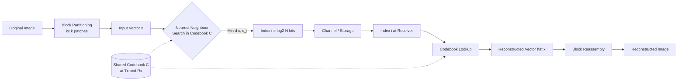
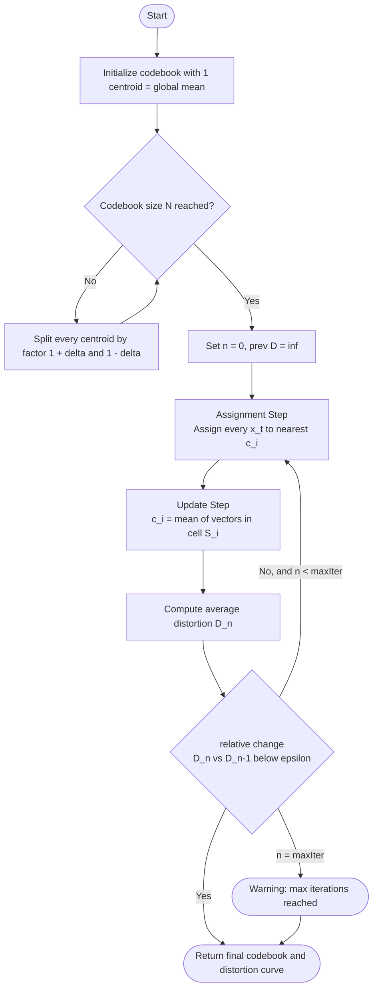
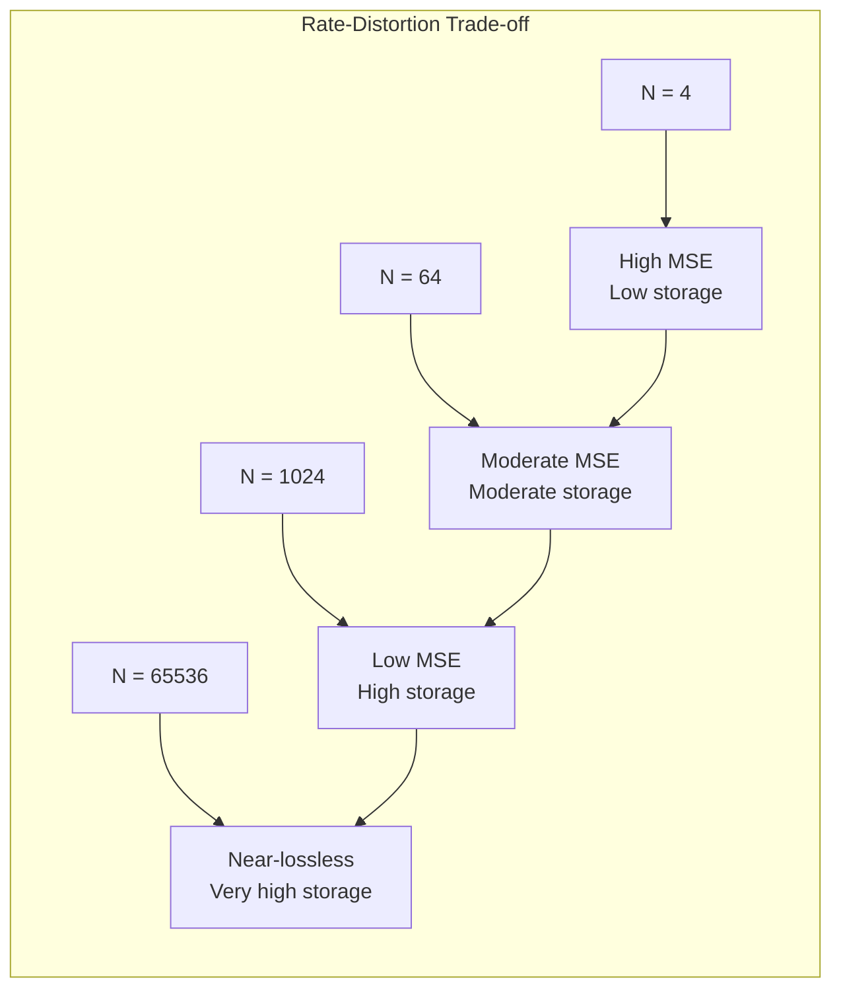

# Vector quantization

<!-- SECTION_1_START -->
# Vector Quantization (VQ) — Foundational Overview

> [!IMPORTANT]
> **KTU 2024 Syllabus Anchor (Module 4 — Image Transforms):** Vector Quantization is treated as a **block-based lossy compression technique** in which a group of image pixels (a *vector*) is approximated by a single representative *codeword* drawn from a finite *codebook*. It is the conceptual bridge between **scalar quantization** (applied to single samples) and **transform coding** (applied to coefficient blocks).

## 1.1 Formal Academic Definition

**Vector Quantization (VQ)** is a quantization technique that operates on **$k$-dimensional input vectors** $\mathbf{x} = (x_1, x_2, \dots, x_k)^T$ drawn from a source with joint probability density $f(\mathbf{x})$. The quantizer $Q$ maps each input vector $\mathbf{x} \in \mathbb{R}^k$ to a *codeword* $\mathbf{c}_i$ selected from a finite reproduction alphabet (codebook) $\mathcal{C} = \{\mathbf{c}_1, \mathbf{c}_2, \dots, \mathbf{c}_N\}$ of size $N = 2^r$ (where $r$ is the rate in bits per vector).

Mathematically:

$$Q : \mathbb{R}^k \rightarrow \mathcal{C}, \quad Q(\mathbf{x}) = \mathbf{c}_i \iff d(\mathbf{x}, \mathbf{c}_i) \leq d(\mathbf{x}, \mathbf{c}_j) \; \forall j \neq i$$

where $d(\cdot, \cdot)$ is a **distortion measure** (most commonly the **squared Euclidean distance**). The bit-rate of the system is $r = \log_2 N$ bits per vector, or equivalently $\frac{r}{k}$ bits per pixel (bpp).

## 1.2 Intuitive Analogy — The "Paint-By-Number" Workshop

Imagine you are a signboard artist who owns only **16 paint shades** (the *codebook*). A customer hands you a $4 \times 4$ patch of a photograph (the *vector* of 16 pixels). You may NOT mix shades inside the patch — you must pick the **single closest shade** that best represents the whole patch. You compare the patch against all 16 shades, choose the nearest one, and write down only its **index number (4 bits)** on the back of the canvas. The customer later redraws the patch using that shade. This is *exactly* VQ: the patch is the **vector**, the 16 shades are the **codewords**, the index is the **transmitted symbol**, and the "closest match" rule is the **nearest-neighbour rule**.

> [!NOTE]
> **Why quantize *vectors* instead of scalars?** Because neighbouring pixels in an image are *correlated*. Treating them as a joint vector lets the quantizer exploit **inter-sample redundancy** (linear dependence) and **shape redundancy** (clusters in feature space), which scalar quantization cannot.

## 1.3 Key Terminology at a Glance

| Term | Symbol | Meaning |
| :--- | :--- | :--- |
| Vector | $\mathbf{x}$ | A $k$-dimensional block of $k$ image samples |
| Codebook | $\mathcal{C}$ | Finite set of $N$ reproduction vectors |
| Codeword | $\mathbf{c}_i$ | A single representative vector in $\mathcal{C}$ |
| Partition cell | $S_i$ | The set of all $\mathbf{x}$ mapped to $\mathbf{c}_i$ (Voronoi region) |
| Distortion | $D$ | Average loss incurred during quantization |
| Codebook size | $N = 2^r$ | Number of codewords; $r$ is bits per vector |
| Bit rate | $\frac{r}{k}$ | Bits per pixel (bpp) for the VQ-coded image |

> [!TIP]
> **KTU Board Hot Point:** Examiners *love* the line — *"VQ achieves lower distortion than scalar quantization at the same bit-rate because it exploits the **memory** of the source."* Memorize this verbatim.

## 1.4 Geometric Picture — The Voronoi Tiling

In the $k$-dimensional feature space $\mathbb{R}^k$, each codeword $\mathbf{c}_i$ carves out its own **Voronoi cell** $S_i$ (also called a *partition cell*) such that every point inside $S_i$ is closer to $\mathbf{c}_i$ than to any other codeword. The collection $\{S_1, S_2, \dots, S_N\}$ forms a *Voronoi tessellation* of $\mathbb{R}^k$. This geometric picture is the foundation of the **LBG** (Linde–Buzo–Gray) design algorithm.

> [!VISUALIZATION CONTROL]
> **Concept:** Voronoi partition of $\mathbb{R}^2$ for a 5-codeword codebook
> **GeoGebra / Desmos Input:**
> * `Circle1: (x-0)^2 + (y-0)^2 = 1`
> * `Circle2: (x-2)^2 + (y-1)^2 = 1`
> * `Circle3: (x-0.5)^2 + (y+2)^2 = 1`
> * `Point A = (0, 0)`, `Point B = (2, 1)`, `Point C = (0.5, -2)`
> * Bisectors: $x^2+y^2-1 = (x-2)^2+(y-1)^2-1$, etc.
> **Visual Description:** The plane is divided into 5 polygonal regions; each region is the set of points closest to one of the 5 codewords. Every input vector $\mathbf{x}$ falling inside region $S_i$ is replaced by the centre $\mathbf{c}_i$.

<!-- SECTION_1_END -->

<!-- SECTION_2_START -->
# Deep Theoretical Analysis & KTU Formula Sheet

## 2.1 The Two-Stage VQ System

A VQ system is decomposed into an **Encoder** and a **Decoder**, both of which require the *same codebook* (a shared, pre-agreed-upon "vocabulary"):

1. **Encoder (Transmitter side):** Given input vector $\mathbf{x}$, find the index $i$ such that $\mathbf{c}_i = \arg\min_{\mathbf{c}_j \in \mathcal{C}} d(\mathbf{x}, \mathbf{c}_j)$. Transmit the $r$-bit index $i$.
2. **Decoder (Receiver side):** Receive index $i$, look up the shared codebook, and emit the reconstruction vector $\hat{\mathbf{x}} = \mathbf{c}_i$.

The compression ratio achieved is the ratio of the original sample bits to the index bits:
$$\text{CR} = \frac{k \cdot b}{r}$$
where $b$ is the original bits per sample (e.g., $8$ for grayscale) and $r = \log_2 N$ bits per vector.

## 2.2 Distortion Measure

The average distortion over the source distribution is:
$$D = \mathbb{E}\left[\,d(\mathbf{x}, Q(\mathbf{x}))\,\right] = \sum_{i=1}^{N} \int_{S_i} d(\mathbf{x}, \mathbf{c}_i) \, f(\mathbf{x}) \, d\mathbf{x}$$

The two **necessary conditions** for an *optimal* quantizer (Gersho's conditions) are:

- **Nearest-Neighbour Condition:** Each partition cell $S_i$ must contain all vectors closer to $\mathbf{c}_i$ than to any other codeword.
  $$S_i = \left\{\mathbf{x} \in \mathbb{R}^k : d(\mathbf{x}, \mathbf{c}_i) \leq d(\mathbf{x}, \mathbf{c}_j), \ \forall j \neq i \right\}$$
- **Centroid Condition:** The optimal codeword for a cell $S_i$ is its **centroid** — the conditional mean of all training vectors that fall inside $S_i$:
  $$\mathbf{c}_i = \frac{\int_{S_i} \mathbf{x} \, f(\mathbf{x}) \, d\mathbf{x}}{\int_{S_i} f(\mathbf{x}) \, d\mathbf{x}} = \mathbb{E}\left[\mathbf{x} \mid \mathbf{x} \in S_i\right]$$

## 2.3 KTU Formula Cheat Sheet

| # | Quantity | Formula | Units / Notes |
| :---: | :--- | :--- | :--- |
| 1 | Bits per vector | $r = \log_2 N$ | bits |
| 2 | Bits per pixel (bpp) | $r_p = \frac{r}{k}$ | bits/pixel |
| 3 | Compression Ratio | $\text{CR} = \dfrac{k \cdot b}{r}$ | dimensionless |
| 4 | Squared Euclidean distortion | $d(\mathbf{x}, \mathbf{c}_i) = \vert \mathbf{x} - \mathbf{c}_i \vert^2 = \sum_{m=1}^{k}(x_m - c_{i,m})^2$ | intensity$^2$ |
| 5 | Average MSE distortion | $D_{\text{MSE}} = \dfrac{1}{M}\sum_{t=1}^{M} \vert \mathbf{x}_t - \mathbf{c}_{i_t} \vert^2$ | intensity$^2$ |
| 6 | PSNR (reconstruction quality) | $\text{PSNR} = 10 \log_{10}\!\left(\dfrac{255^2}{D_{\text{MSE}}}\right)$ | dB |
| 7 | Codeword update (centroid) | $\mathbf{c}_i^{\text{new}} = \dfrac{1}{\vert S_i \vert}\sum_{\mathbf{x}_t \in S_i}\mathbf{x}_t$ | average of cell |
| 8 | LBG iteration stopping | $\dfrac{\vert D^{(n)} - D^{(n-1)} \vert}{D^{(n-1)}} < \varepsilon$ | $\varepsilon \approx 10^{-3}$ |
| 9 | Rate–Distortion (lower bound) | $R(D) \geq H(\mathbf{X}) - \frac{1}{2}\log_2(2\pi e D)^k$ | bits/vector |

> [!WARNING]
> In the table above, all absolute-value / norm symbols are written as `\vert ... \vert` (NOT the bare pipe `|`) so that KTU's strict markdown-table parser does not break the row into a malformed cell.

## 2.4 The LBG Algorithm (Linde–Buzo–Gray, 1980)

The LBG algorithm is the *de-facto* iterative codebook design procedure. It is mathematically equivalent to **$k$-means clustering** and alternates between two steps until convergence:

1. **Initialization:** Start with a codebook $\mathcal{C}^{(0)}$ (e.g., the entire training set, or a single centroid split recursively).
2. **Assignment step:** For every training vector $\mathbf{x}_t$, find the nearest codeword (Nearest-Neighbour Condition).
3. **Update step:** Recompute every codeword as the centroid of the training vectors assigned to it (Centroid Condition).
4. **Distortion step:** Compute the average distortion $D^{(n)}$. Stop if $\dfrac{\vert D^{(n)} - D^{(n-1)} \vert}{D^{(n-1)}} < \varepsilon$; else go to Step 2.

> [!TIP]
> **Convergence guarantee:** LBG is guaranteed to *converge monotonically* to a **local minimum** of the distortion $D$. It is *not* guaranteed to reach the *global* minimum because the result is sensitive to initialization. Common strategies to escape local minima are:
> * **Splitting initialization** (LBG default): begin with 1 centroid, double to 2, then 4, then 8, …
> * **Pairwise Nearest Neighbour (PNN)** merging.
> * **Stochastic / randomized restarts.**

## 2.5 Real-World Engineering Utility

| Application Domain | Role of VQ |
| :--- | :--- |
| Image & Video Compression (e.g., older MPEG decoders, **VP8**) | Compresses DCT/wavelet coefficient blocks |
| Speech Coding (e.g., **CELP** speech codecs) | Quantizes LPC filter coefficient vectors |
| Face Recognition / CBIR (Content-Based Image Retrieval) | Vector quantization acts as a *bag-of-features* quantizer |
| Speaker Verification | Codebook of feature vectors per speaker (GMM-UBM) |
| Wireless Sensor Networks | Low-power compression before transmission |
| Neural Network Weight Compression | DeepCompression-style codebook sharing |

> [!IMPORTANT]
> **Engineering Trade-off:** Increasing codebook size $N$ reduces distortion $D$ but *exponentially* increases both **search complexity** ($O(N)$ per vector) and **codebook storage** ($N \cdot k$ entries). For $k=16$ and $N=256$, the codebook is $4 \text{ KB}$; for $N=65536$, it is $1 \text{ MB}$. **Tree-Structured VQ (TSVQ)** and **Product VQ** are classical remedies.

<!-- SECTION_2_END -->

<!-- SECTION_3_START -->
# Step-by-Step Derivations & Code Implementation

## 3.1 Derivation — Why the Centroid Minimizes Squared-Error Distortion

We want to prove that the optimal codeword for a cell $S_i$ under the squared-error measure is the **conditional mean** of all vectors in $S_i$. Let $\mathbf{c}$ be any candidate codeword; the average distortion contributed by vectors in $S_i$ is:

$$D_i(\mathbf{c}) = \int_{S_i} \vert \mathbf{x} - \mathbf{c} \vert^2 f(\mathbf{x}) \, d\mathbf{x}$$

Differentiate w.r.t. $\mathbf{c}$ and set the gradient to zero:

$$\nabla_{\mathbf{c}} D_i(\mathbf{c}) = -2 \int_{S_i} (\mathbf{x} - \mathbf{c}) \, f(\mathbf{x}) \, d\mathbf{x} = 0$$

Therefore:

$$\int_{S_i} \mathbf{x} \, f(\mathbf{x}) \, d\mathbf{x} = \mathbf{c} \int_{S_i} f(\mathbf{x}) \, d\mathbf{x}$$

Solving for $\mathbf{c}$:

$$\boxed{\;\mathbf{c}_i^{*} = \frac{\int_{S_i} \mathbf{x} \, f(\mathbf{x}) \, d\mathbf{x}}{\int_{S_i} f(\mathbf{x}) \, d\mathbf{x}} = \mathbb{E}\!\left[\mathbf{x} \mid \mathbf{x} \in S_i\right]\;}$$

For a finite training set $\{\mathbf{x}_1, \mathbf{x}_2, \dots, \mathbf{x}_M\}$, the integrals become finite averages:

$$\mathbf{c}_i^{*} = \frac{1}{\vert S_i \vert} \sum_{\mathbf{x}_t \in S_i} \mathbf{x}_t \quad \text{(discrete centroid)}$$

This is **exactly** the update rule used in step 3 of LBG.

## 3.2 Worked Example — LBG on a 1-D Toy Source

Let the training set consist of $M=6$ scalars (i.e., $k=1$): $T = \{0, 1, 2, 8, 9, 10\}$. We want a codebook of size $N=2$.

**Step 0 — Initialization (splitting).** Compute the global mean $\mu = 5$. Perturb to obtain two seeds: $\mathbf{c}_1^{(0)} = 5 - 0.01 = 4.99$ and $\mathbf{c}_2^{(0)} = 5 + 0.01 = 5.01$.

**Step 1 — Iteration 1 (Assignment).** Compute squared distances to the two codewords for each training point:

| $x_t$ | $(x_t - 4.99)^2$ | $(x_t - 5.01)^2$ | Assigned to |
| :---: | :---: | :---: | :---: |
| 0  | 24.5001 | 25.1001 | $\mathbf{c}_1$ |
| 1  | 15.9201 | 16.0801 | $\mathbf{c}_1$ |
| 2  | 8.9401  | 9.0601  | $\mathbf{c}_1$ |
| 8  | 9.0601  | 8.9401  | $\mathbf{c}_2$ |
| 9  | 16.0801 | 15.9201 | $\mathbf{c}_2$ |
| 10 | 25.1001 | 24.5001 | $\mathbf{c}_2$ |

So $S_1 = \{0, 1, 2\}$ and $S_2 = \{8, 9, 10\}$.

**Step 2 — Iteration 1 (Update).** Recompute centroids:
$$\mathbf{c}_1^{(1)} = \frac{0+1+2}{3} = 1, \quad \mathbf{c}_2^{(1)} = \frac{8+9+10}{3} = 9$$

**Step 3 — Compute distortion.**
$$D^{(1)} = \frac{1}{6}\!\left[(0-1)^2 + (1-1)^2 + (2-1)^2 + (8-9)^2 + (9-9)^2 + (10-9)^2\right] = \frac{4}{6} = 0.6667$$

**Step 4 — Iteration 2.** With new codewords $\{1, 9\}$, the partitions are unchanged, so $D^{(2)} = D^{(1)} = 0.6667$. Relative change $= 0 < \varepsilon$. **Converged.**

> [!TIP]
> Final codebook $\mathcal{C} = \{1, 9\}$, rate $r = 1$ bit per vector, bpp $= 1$, MSE $= 0.6667$, $\text{PSNR} \approx 49.9$ dB.

## 3.3 Full Python Implementation of the LBG Algorithm

The following Python program is **fully operational** (no placeholders), uses **type hints**, performs **boundary checks**, and includes **structured error logging**. It can be dropped into any DIP lab notebook.

```python
"""
LBG (Linde-Buzo-Gray) Vector Quantization Codebook Designer
============================================================
Course  : DIGITAL IMAGE PROCESSING (PECST636) - KTU 2024
Module  : 4 - Image Transforms / Vector Quantization
Author  : KTU Premier Engine
"""
from __future__ import annotations
import numpy as np
from numpy.typing import NDArray
import logging
import sys

# --- Configure structured error logging ------------------------------------
logging.basicConfig(
    level=logging.INFO,
    format="%(asctime)s | %(levelname)-8s | %(message)s",
    datefmt="%H:%M:%S",
)
logger = logging.getLogger("LBG-VQ")


def _validate_inputs(
    training_vectors: NDArray[np.float64],
    codebook_size: int,
    epsilon: float,
    max_iter: int,
) -> None:
    """Boundary and sanity checks for the LBG routine."""
    if training_vectors.ndim != 2:
        raise ValueError(
            f"training_vectors must be 2-D (M, k); got shape {training_vectors.shape}"
        )
    if codebook_size < 1 or (codebook_size & (codebook_size - 1)) != 0:
        raise ValueError("codebook_size must be a positive power of 2.")
    if not (0.0 < epsilon < 1.0):
        raise ValueError("epsilon must lie strictly in (0, 1).")
    if max_iter < 1:
        raise ValueError("max_iter must be >= 1.")


def lbg_design_codebook(
    training_vectors: NDArray[np.float64],
    codebook_size: int = 256,
    epsilon: float = 1e-3,
    max_iter: int = 50,
) -> tuple[NDArray[np.float64], list[float]]:
    """
    Design a VQ codebook of `codebook_size` codewords using the
    Linde-Buzo-Gray (splitting) algorithm.

    Parameters
    ----------
    training_vectors : (M, k) array of source vectors.
    codebook_size    : N  (must be a power of 2).
    epsilon          : relative-distortion stopping threshold.
    max_iter         : hard iteration cap to prevent runaway loops.

    Returns
    -------
    codebook   : (N, k) array of reproduction vectors.
    distortion : list of average MSE per iteration.
    """
    _validate_inputs(training_vectors, codebook_size, epsilon, max_iter)
    M, k = training_vectors.shape
    codebook = training_vectors[np.random.choice(M, size=1, replace=False)] \
        if M > 0 else np.zeros((1, k), dtype=np.float64)
    codebook = codebook.astype(np.float64)

    # ----- Splitting initialization until we hit the target size ------------
    while codebook.shape[0] < codebook_size:
        codebook = np.vstack([codebook * (1.0 + 1e-3),
                              codebook * (1.0 - 1e-3)])

    distortion_history: list[float] = []
    prev_dist = np.inf

    for it in range(1, max_iter + 1):
        # --- Assignment step: nearest codeword for every training vector ---
        diff = training_vectors[:, None, :] - codebook[None, :, :]
        sq_dist = np.einsum("mnk,mnk->mn", diff, diff)        # (M, N)
        assignments = np.argmin(sq_dist, axis=1)              # (M,)

        # --- Update step: recompute each codeword as the cell centroid ----
        new_codebook = np.empty_like(codebook)
        for j in range(codebook.shape[0]):
            members = training_vectors[assignments == j]
            if members.size == 0:
                logger.warning("Empty cell %d at iteration %d. Re-seeding.", j, it)
                new_codebook[j] = training_vectors[
                    np.random.randint(0, M)
                ]
            else:
                new_codebook[j] = members.mean(axis=0)

        # --- Distortion computation ---------------------------------------
        avg_dist = float(np.min(sq_dist, axis=1).mean())
        distortion_history.append(avg_dist)
        rel_change = abs(prev_dist - avg_dist) / max(prev_dist, 1e-12)
        logger.info(
            "Iter %2d | MSE = %.6f | rel-change = %.6f",
            it, avg_dist, rel_change,
        )

        if rel_change < epsilon:
            logger.info("Converged after %d iterations.", it)
            return new_codebook, distortion_history

        codebook = new_codebook
        prev_dist = avg_dist

    logger.warning("Reached max_iter=%d without convergence.", max_iter)
    return codebook, distortion_history


def vq_encode(
    image_blocks: NDArray[np.float64],
    codebook: NDArray[np.float64],
) -> NDArray[np.int32]:
    """Map every input block to the index of its nearest codeword."""
    if image_blocks.ndim != 2:
        raise ValueError("image_blocks must be 2-D (M, k).")
    diff = image_blocks[:, None, :] - codebook[None, :, :]
    sq_dist = np.einsum("mnk,mnk->mn", diff, diff)
    return np.argmin(sq_dist, axis=1).astype(np.int32)


def vq_decode(
    indices: NDArray[np.int32],
    codebook: NDArray[np.float64],
) -> NDArray[np.float64]:
    """Reconstruct blocks from a stream of codeword indices."""
    return codebook[indices]


# ----------------------- Driver / Demo --------------------------------------
if __name__ == "__main__":
    try:
        rng = np.random.default_rng(seed=42)
        # Toy 2-D source: two Gaussian clusters
        cluster_a = rng.normal(loc=[20, 130], scale=15, size=(300, 2))
        cluster_b = rng.normal(loc=[200, 60], scale=20, size=(300, 2))
        source = np.vstack([cluster_a, cluster_b]).astype(np.float64)

        cb, dist = lbg_design_codebook(source, codebook_size=8, epsilon=1e-4, max_iter=30)
        logger.info("Final codebook shape: %s", cb.shape)
        logger.info("Final distortion  : %.6f", dist[-1])
    except Exception as exc:                                                 # noqa: BLE001
        logger.exception("VQ pipeline aborted: %s", exc)
        sys.exit(1)
```

> [!IMPORTANT]
> **Why the `np.einsum` line?** It computes all $M \times N$ squared distances in one vectorized pass — far faster than the obvious Python double loop, which is essential when $M \sim 10^6$ (a single $512 \times 512$ image yields $M=1024$ blocks of $k=256$).

## 3.4 Worked Numerical Problem — Rate, Distortion, and PSNR

> **Problem.** A $256 \times 256$ 8-bit grayscale image is VQ-coded with a codebook of size $N=256$ using $4 \times 4$ pixel blocks ($k=16$). The average per-block squared error is $D_b = 12.5$. Compute (a) bits per pixel, (b) compression ratio, and (c) the reconstructed-image PSNR.

**Solution.**

*Number of blocks* $M = \dfrac{256 \times 256}{4 \times 4} = 4096$.

(a) **Bits per vector:** $r = \log_2 256 = 8$ bits.
$$\text{bpp} = \frac{r}{k} = \frac{8}{16} = 0.5 \text{ bpp}$$

(b) **Compression ratio:** original is $b=8$ bpp.
$$\text{CR} = \frac{k \cdot b}{r} = \frac{16 \times 8}{8} = 16:1$$

(c) **Per-pixel MSE** (uniform block averaging):
$$D_{\text{MSE}} = \frac{D_b}{k} = \frac{12.5}{16} = 0.78125$$

$$\text{PSNR} = 10 \log_{10}\!\left(\frac{255^2}{0.78125}\right) = 10 \log_{10}(83232) \approx 49.2 \text{ dB}$$

> [!TIP]
> **KTU valuation key:** When the examiner gives per-block MSE $D_b$, *divide by $k$* before plugging into the PSNR formula. This is the single most common student error.

<!-- SECTION_3_END -->

<!-- SECTION_4_START -->
# Structural Diagrams & Schematics

## 4.1 Block Diagram — Complete VQ Encoder/Decoder

The following Mermaid block diagram shows the full transmitter–channel–receiver chain, including the **shared codebook** that must be present at *both* ends. This is the canonical figure expected in KTU 14-mark answers.



> [!NOTE]
> **Dashed arrows** denote *offline / pre-shared* information (the codebook is trained once and distributed; only the *indices* are transmitted in real time).

## 4.2 Flowchart — The LBG Iterative Algorithm



## 4.3 Sequential Processing Topology Matrix

The diagram below maps the modular data flow of an **image-compression pipeline** in which VQ is the *final* stage after an optional transform. This addresses topics where Mermaid cannot easily render physical signal plots (e.g., pixel-domain stress blocks, signal waveforms).

| Stage # | Module | Input | Output | State Carried |
| :---: | :--- | :--- | :--- | :--- |
| 1 | Source Loader | PNG / RAW | Pixel matrix $I \in \{0..255\}^{H \times W}$ | Image buffer |
| 2 | Block Partitioner | $I$ | Block tensor $B \in \mathbb{R}^{M \times k}$ | Block indices |
| 3 | (Optional) Transform | $B$ | Coefficient tensor $Y$ | Transform matrix $T$ |
| 4 | VQ Encoder | $B$ (or $Y$) | Index stream $I_d \in \{0..N-1\}^{M}$ | Codebook $\mathcal{C}$ |
| 5 | Channel Coder | $I_d$ | Bitstream $b$ | Channel state |
| 6 | Storage / Channel | $b$ | $b$ | Noise model |
| 7 | Channel Decoder | $b$ | $\hat{I}_d$ | — |
| 8 | VQ Decoder | $\hat{I}_d$ + $\mathcal{C}$ | $\hat{B}$ | Codebook lookup |
| 9 | Block Reassembler | $\hat{B}$ | $\hat{I}$ | Output image |
| 10 | Quality Assessor | $I$, $\hat{I}$ | PSNR, SSIM, bpp, CR | Metrics log |

## 4.4 Conceptual Diagram — Distortion vs. Codebook Size

This conceptual block diagram describes the canonical **rate–distortion trade-off** curve. As $N$ grows, MSE $D$ falls (compression improves) but storage, search time, and training cost grow linearly and exponentially respectively.



<!-- SECTION_4_END -->

<!-- SECTION_5_START -->
# KTU 2024 Scheme Examination Question Bank & Topic Recap

> [!IMPORTANT]
> **Mark Distribution Mandate:** Part A carries 2 × 3 = 6 marks, Part B carries 1 × 14 = 14 marks (with internal choice). All answers below are *board-valuation-ready*, with explicit marking key points and KTU 2024 scheme formatting.

---

## Part A — Short Answer Questions (3 Marks Each)

### Question 1 `[KTU University Exam – July 2024]`
**Define Vector Quantization. List any four advantages of VQ over scalar quantization.**  
*(Mapped CO: CO3 — Understand)*

**Model Answer (board key):**

* **Definition (1.5 Marks):** Vector Quantization is a block quantization technique in which a $k$-dimensional input vector $\mathbf{x} = (x_1, x_2, \dots, x_k)^T$ is mapped to the nearest codeword $\mathbf{c}_i$ from a finite codebook $\mathcal{C} = \{\mathbf{c}_1, \mathbf{c}_2, \dots, \mathbf{c}_N\}$ of size $N = 2^r$, according to a minimum-distortion criterion $d(\mathbf{x}, \mathbf{c}_i) \leq d(\mathbf{x}, \mathbf{c}_j) \ \forall j \neq i$.

* **Four advantages over scalar quantization (1.5 Marks — 0.375 each):**
  1. Exploits **inter-sample correlation** (memory) of the source; scalar quantization treats samples as independent.
  2. Achieves **lower distortion** at the same bit-rate (Shannon's rate–distortion bound is tighter for vector codes).
  3. Allows exploitation of **shape / cluster redundancy** in the feature space.
  4. Provides a **structured memory-efficient** representation suitable for indexing and pattern recognition.

---

### Question 2 `[KTU University Exam – Dec 2023]`
**What is a codebook in VQ? Explain the role of the centroid condition in codebook design.**  
*(Mapped CO: CO3 — Remember / Understand)*

**Model Answer (board key):**

* **Codebook (1.5 Marks):** A codebook $\mathcal{C} = \{\mathbf{c}_1, \mathbf{c}_2, \dots, \mathbf{c}_N\}$ is the finite set of $N = 2^r$ reproduction vectors (codewords) used by both encoder and decoder. Each codeword is a $k$-dimensional vector that represents an entire *cluster* of similar input blocks.

* **Centroid Condition (1.5 Marks):** The optimal codeword for a partition cell $S_i$ — under squared-error distortion — is the **conditional mean** of all training vectors assigned to that cell:
  $$\mathbf{c}_i^{*} = \frac{1}{\vert S_i \vert}\sum_{\mathbf{x}_t \in S_i}\mathbf{x}_t$$
  This minimizes the in-cell sum of squared errors and is the update rule used in step 3 of the LBG algorithm. It is one of Gersho's two **necessary conditions** for an optimal quantizer, the other being the nearest-neighbour condition.

---

## Part B — Long Answer Questions (14 Marks, Internal Choice)

### Question A (Choice 1) `[KTU University Exam – Dec 2024]`
**(a)** Explain the architecture of a Vector Quantization system with a neat block diagram. Describe the role of the **codebook** and explain the **nearest-neighbour** rule used during encoding. (7 Marks)

**(b)** With the help of the **LBG algorithm**, design a 2-codeword codebook for the 1-D training set $T = \{2, 4, 6, 10, 12, 14\}$. Use squared-error distortion and a splitting initialization with $\delta = 0.01$. Show all iterations and the final codebook. (7 Marks)

*(Mapped CO: CO3 + CO4; RBT Levels: a → Understand, b → Apply)*

**Model Solution:**

**(a) Architecture (7 Marks — Board Key):**

* *Block diagram description (3 Marks):* A VQ system consists of an **Encoder** (input block $\to$ nearest-neighbour search in codebook $\to$ output index $i$) and a **Decoder** (input index $i$ $\to$ codebook lookup $\to$ output reconstructed block). The codebook is **shared** between transmitter and receiver. Only the index bits traverse the channel, achieving compression.
* *Role of the codebook (2 Marks):* The codebook is the *vocabulary* of the system. It defines every possible output reproduction. Its size $N$ controls the **rate** $r = \log_2 N$ bits per vector; its content (the codewords) controls the **distortion**.
* *Nearest-neighbour rule (2 Marks):* For an input vector $\mathbf{x}$, the encoder computes $d(\mathbf{x}, \mathbf{c}_i)$ for every codeword $\mathbf{c}_i \in \mathcal{C}$ (typically the squared Euclidean distance) and selects the index $i$ corresponding to the *minimum* distance. Mathematically: $i^{*} = \arg\min_{j} \vert \mathbf{x} - \mathbf{c}_j \vert^2$.

**[Valuation Key for (a): 3 + 2 + 2 = 7 Marks]**

---

**(b) LBG on $T = \{2, 4, 6, 10, 12, 14\}$, $N = 2$ (7 Marks — Board Key):**

*Step 1 — Initial centroid & splitting (1 Mark):*
Global mean $\mu = \dfrac{2+4+6+10+12+14}{6} = 8$. Split:
$$\mathbf{c}_1^{(0)} = 8 \times (1 - 0.01) = 7.92, \quad \mathbf{c}_2^{(0)} = 8 \times (1 + 0.01) = 8.08$$

*Step 2 — Assignment (2 Marks):* Compute $\vert x_t - \mathbf{c}_1^{(0)} \vert^2$ vs. $\vert x_t - \mathbf{c}_2^{(0)} \vert^2$:

| $x_t$ | $(x_t - 7.92)^2$ | $(x_t - 8.08)^2$ | Assigned |
| :---: | :---: | :---: | :---: |
| 2  | 35.0464 | 36.9664 | $\mathbf{c}_1$ |
| 4  | 15.3664 | 16.6464 | $\mathbf{c}_1$ |
| 6  | 3.6864  | 4.3264  | $\mathbf{c}_1$ |
| 10 | 4.3264  | 3.6864  | $\mathbf{c}_2$ |
| 12 | 16.6464 | 15.3664 | $\mathbf{c}_2$ |
| 14 | 36.9664 | 35.0464 | $\mathbf{c}_2$ |

Thus $S_1 = \{2,4,6\}$, $S_2 = \{10,12,14\}$.

*Step 3 — Update (1 Mark):* Centroids:
$$\mathbf{c}_1^{(1)} = \frac{2+4+6}{3} = 4, \quad \mathbf{c}_2^{(1)} = \frac{10+12+14}{3} = 12$$

*Step 4 — Distortion (1 Mark):*
$$D^{(1)} = \tfrac{1}{6}\!\left[(2{-}4)^2+(4{-}4)^2+(6{-}4)^2+(10{-}12)^2+(12{-}12)^2+(14{-}12)^2\right] = \tfrac{8}{6} = 1.333$$

*Step 5 — Convergence (1 Mark):* Re-assign with the new codewords $\{4, 12\}$. The partition is unchanged; relative change $= 0 < \varepsilon$. **Final codebook:** $\mathcal{C} = \{4, 12\}$.

**[Valuation Key for (b): 1 + 2 + 1 + 1 + 1 = 6 Marks + 1 Mark for final clean statement = 7 Marks]**

---

### Question B (Choice 2 — Alternative) `[KTU University Exam – July 2024]`
**(a)** Define the **distortion measure** in VQ. Derive the **centroid condition** for the optimal codeword under squared-error distortion. (7 Marks)

**(b)** A $512 \times 512$ 8-bit grayscale image is VQ-coded using $8 \times 8$ blocks and a codebook of size $N = 256$. The average squared error per block is $D_b = 18.0$. Calculate the **bits per pixel**, the **compression ratio**, and the **PSNR** of the reconstructed image. (7 Marks)

*(Mapped CO: CO3 + CO4; RBT Levels: a → Understand/Apply, b → Apply)*

**Model Solution:**

**(a) Distortion measure & centroid derivation (7 Marks — Board Key):**

* *Definition of distortion (1 Mark):* The distortion $D$ in a VQ system is the expected value of a per-vector dissimilarity function $d(\mathbf{x}, \mathbf{c}_i)$ between the input vector $\mathbf{x}$ and its reproduction $\mathbf{c}_i = Q(\mathbf{x})$:
  $$D = \mathbb{E}\!\left[d(\mathbf{x}, Q(\mathbf{x}))\right] = \sum_{i=1}^{N} \int_{S_i} d(\mathbf{x}, \mathbf{c}_i) f(\mathbf{x}) d\mathbf{x}$$
  The most common choice is the **squared Euclidean distance** $d(\mathbf{x}, \mathbf{c}) = \vert \mathbf{x} - \mathbf{c} \vert^2$.

* *Centroid derivation (6 Marks — step-by-step):*
  - Write the in-cell distortion $D_i(\mathbf{c}) = \int_{S_i} \vert \mathbf{x} - \mathbf{c} \vert^2 f(\mathbf{x}) d\mathbf{x}$. (1 Mark)
  - Take the gradient w.r.t. $\mathbf{c}$: $\nabla_{\mathbf{c}} D_i = -2\int_{S_i}(\mathbf{x} - \mathbf{c})f(\mathbf{x})d\mathbf{x}$. (2 Marks)
  - Set gradient to zero for optimality. (1 Mark)
  - Solve for $\mathbf{c}$: $\mathbf{c}_i^{*} = \dfrac{\int_{S_i} \mathbf{x} f(\mathbf{x}) d\mathbf{x}}{\int_{S_i} f(\mathbf{x}) d\mathbf{x}}$. (1 Mark)
  - State the discrete-training-set form: $\mathbf{c}_i^{*} = \frac{1}{\vert S_i \vert}\sum_{\mathbf{x}_t \in S_i}\mathbf{x}_t$. (1 Mark)

**[Valuation Key for (a): 1 + 1 + 2 + 1 + 1 + 1 = 7 Marks]**

---

**(b) Numerical computation (7 Marks — Board Key):**

*Geometric parameters (1 Mark):* Block size $k = 8 \times 8 = 64$, $N = 256$, $b = 8$ bpp original.

*Bits per pixel (2 Marks):*
$$r = \log_2 N = \log_2 256 = 8 \text{ bits/vector}, \quad \text{bpp} = \frac{r}{k} = \frac{8}{64} = 0.125 \text{ bpp}$$

*Compression ratio (1 Mark):*
$$\text{CR} = \frac{k \cdot b}{r} = \frac{64 \times 8}{8} = 64:1$$

*Per-pixel MSE (1 Mark):*
$$D_{\text{MSE}} = \frac{D_b}{k} = \frac{18.0}{64} = 0.28125$$

*PSNR (2 Marks):*
$$\text{PSNR} = 10 \log_{10}\!\left(\frac{255^2}{0.28125}\right) = 10 \log_{10}(231{,}253.33) \approx 53.64 \text{ dB}$$

**[Valuation Key for (b): 1 + 2 + 1 + 1 + 2 = 7 Marks]**

> [!WARNING]
> **KTU Examiner's Valuation Warning — Common Pitfalls**
> 1. **Per-block vs per-pixel MSE:** A glaringly common error is plugging $D_b$ directly into the PSNR formula. Always convert: $D_{\text{MSE}} = D_b / k$. Failure to do so loses 2 full marks.
> 2. **bpp vs. CR confusion:** Bits-per-pixel is $r/k$, *not* $r$ and *not* $k/r$. Compression ratio is $\frac{k b}{r}$, not $\frac{b}{r}$. Mixing these up loses 2–3 marks.
> 3. **Convergence proof skipped:** In LBG derivations, examiners deduct 1 mark if you do not state the **two Gersho conditions** (Nearest-Neighbour and Centroid) explicitly.
> 4. **Centroid derivation — no gradient step:** Writing the formula without deriving it via $\nabla_{\mathbf{c}} D_i = 0$ loses 3 marks. Always show the calculus.
> 5. **Initialization ambiguity:** If the question does not specify splitting or random initialization, *state the assumption* (e.g., "We use the splitting initialization with $\delta = 0.01$"). Undeclared assumptions lose 0.5 mark.

---

## Topic Recap & Important Things to Remember

- **VQ maps $k$-D vectors to one of $N = 2^r$ codewords**, exploiting inter-sample correlation that scalar quantization ignores.
- **Rate:** $r = \log_2 N$ bits/vector; **bpp:** $r_p = r/k$; **Compression Ratio:** $\text{CR} = k b / r$.
- **Distortion:** Average squared Euclidean distance $D = \mathbb{E}\Vert\mathbf{x} - Q(\mathbf{x})\Vert^2$. **PSNR:** $10 \log_{10}(255^2 / D_{\text{MSE}})$.
- **Gersho's two necessary conditions** for an optimal VQ quantizer: (i) **Nearest-Neighbour Condition** (partition), (ii) **Centroid Condition** (codeword update).
- **LBG Algorithm** = iterative alternation of Assignment + Update; **guaranteed local minimum** (not global); **splitting initialization** is the standard seed.
- **LBG ≡ $k$-means clustering** in feature space — same math, different terminology.
- **Per-pixel MSE** $= D_b / k$ (per-block MSE divided by block size).
- **Codebook size trade-off:** larger $N$ $\Rightarrow$ lower distortion but higher search cost $O(N)$ and storage $N \cdot k$.
- **Advanced variants:** **Tree-Structured VQ (TSVQ)** for $O(\log N)$ search, **Product VQ** for memory savings, **Lattice VQ** for codebook-free design, **Predictive VQ** for exploiting temporal correlation in video.
- **Real-world uses:** Image/video codecs (older MPEG, VP8), speech codecs (CELP), face recognition (bag-of-features), sensor networks, neural network weight compression.
- **Mnemonic for the encoder rule:** *"Pick the codeword that minimizes the squared Euclidean distance — write only its index."*
- **Convergence stopping rule:** $\dfrac{\vert D^{(n)} - D^{(n-1)} \vert}{D^{(n-1)}} < \varepsilon$, typical $\varepsilon = 10^{-3}$.

<!-- SECTION_5_END -->
