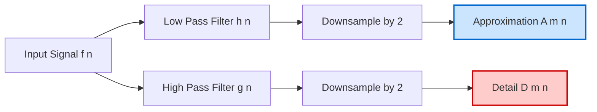
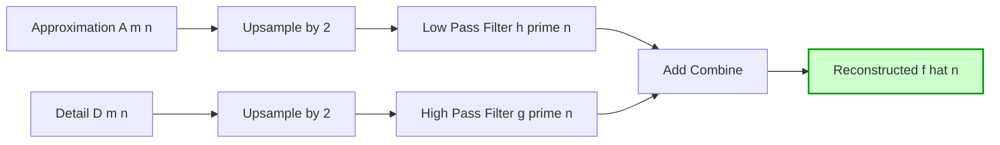
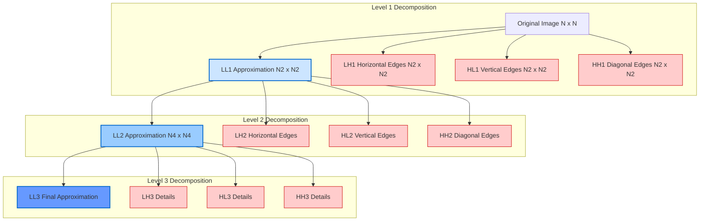
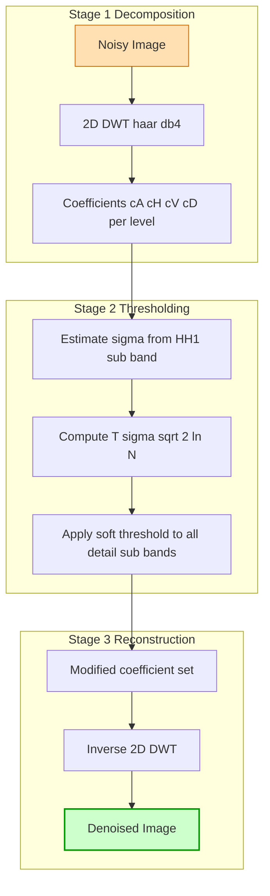

# Wavelet transform

<!-- SECTION_1_START -->
# Module 4 — Image Transforms
## Topic: Wavelet Transform

---

### 1.1 Formal Academic Definition (KTU 2024 Terminology)

The **Wavelet Transform (WT)** is a mathematical time-frequency (or space-frequency) analysis tool that decomposes a signal or image into a set of scaled and translated basis functions called **wavelets**. Unlike the Fourier Transform, which represents a signal as a sum of infinite-duration sinusoids, the wavelet transform uses compact, oscillating basis functions of finite duration, providing simultaneous localization in both the spatial (time) and frequency domains.

> [!IMPORTANT]
> **KTU 2024 Syllabus Definition:**
> A wavelet is a "small wave" — a finite-energy, zero-mean function $\psi(t)$ that satisfies the **Admissibility Condition**:
> $$C_\psi = \int_{0}^{\infty} \frac{\vert \Psi(\omega) \vert^2}{\vert \omega \vert} d\omega < \infty$$
> where $\Psi(\omega)$ is the Fourier Transform of $\psi(t)$.

> [!NOTE]
> **Key Distinction from Fourier Transform:**
> - **Fourier Transform** → Global frequency information, no spatial localization.
> - **Wavelet Transform** → Multi-resolution spatial AND frequency information simultaneously.

---

### 1.2 Conceptual Analogy & Intuitive Understanding

> [!TIP]
> **Real-World Analogy — The "Adjustable Zoom Lens"**
> Imagine inspecting a painting with a **magnifying glass**:
> - **Far view (Large scale, low frequency)** → You see the *overall composition* (background colors, broad strokes).
> - **Close view (Small scale, high frequency)** → You see the *fine details* (brush textures, cracks, sharp edges).
> - **Wavelet Transform works exactly like this** — it allows you to "zoom in" and "zoom out" of a signal at different resolutions, capturing both the big picture and the fine details.
>
> A **Fourier Transform**, in contrast, is like analyzing the painting's *chemical composition* — it tells you which pigments (frequencies) are present, but not *where* they are located on the canvas.

Another excellent analogy: **Wavelets = Musical Score with Time Stamps.** A Fourier Transform tells you *which notes* are played in a symphony. A Wavelet Transform tells you *which notes* are played AND *exactly when* they are played.

---

### 1.3 The Mother Wavelet and Its Dilations/Translations

The **Mother Wavelet** $\psi(t)$ generates the wavelet basis by two fundamental operations:

$$\psi_{a,b}(t) = \frac{1}{\sqrt{a}} \, \psi\!\left(\frac{t - b}{a}\right)$$

where:
- $a$ = **Scale parameter** ($a > 0$) — controls dilation (stretching/compression). Small $a$ = high frequency, Large $a$ = low frequency.
- $b$ = **Translation parameter** ($b \in \mathbb{R}$) — controls shifting (location).
- $\frac{1}{\sqrt{a}}$ = **Normalization factor** ensuring $\Vert \psi_{a,b} \Vert = \Vert \psi \Vert$ (energy preservation).

> [!IMPORTANT]
> **Physical Interpretation of Scale $a$:**
> - $a \to 0$ → Compressed wavelet → Detects **high-frequency** details (edges, noise).
> - $a \to \infty$ → Stretched wavelet → Captures **low-frequency** approximation (smooth regions).

> [!VISUALIZATION CONTROL]
> **Concept:** Visualizing a Mexican Hat Wavelet at multiple scales
> **GeoGebra / Desmos Input Equations:**
> * Mexican Hat: `f(t) = (1 - t^2) * exp(-t^2 / 2)`
> * Scaled versions: `f1(t) = (1 - (t/0.5)^2) * exp(-(t/0.5)^2 / 2)`
> * `f2(t) = (1 - (t/1.0)^2) * exp(-(t/1.0)^2 / 2)`
> * `f3(t) = (1 - (t/2.0)^2) * exp(-(t/2.0)^2 / 2)`
> **Visual Description:** Plot three wavelets on the same axis. Notice how increasing the scale $a$ stretches the wavelet horizontally, making it wider and lower in frequency. The amplitude is scaled down by $1/\sqrt{a}$ to preserve energy.

---

### 1.4 Why Wavelets for Images?

Images are inherently **multi-scale** — they contain:
- Large homogeneous regions (low frequency)
- Sharp edges and textures (high frequency)
- Repeating patterns (mid frequency)

The Wavelet Transform is the **only transform that naturally provides multi-resolution analysis** — a critical property exploited in **JPEG 2000** (which replaced the DCT-based JPEG), **denoising**, **edge detection**, and **biometric compression**.

> [!NOTE]
> **KTU Board Exam Tip:** Whenever a question asks "Why wavelet transform over Fourier transform for image processing?", always mention:
> 1. **Multi-resolution analysis** (MRA)
> 2. **Compact support** (finite duration)
> 3. **Localized in both space and frequency**
> 4. **Better energy compaction** for non-stationary signals (images are non-stationary)

---
<!-- SECTION_1_END -->

<!-- SECTION_2_START -->
# 2. Deep Theoretical Analysis & KTU High-Yield Formula Sheet

---

## 2.1 Continuous Wavelet Transform (CWT) — Exhaustive Theory

The **CWT** of a continuous signal $f(t)$ with respect to a mother wavelet $\psi(t)$ is defined as:

$$W_f(a, b) = \int_{-\infty}^{\infty} f(t) \, \psi_{a,b}^*(t) \, dt = \frac{1}{\sqrt{a}} \int_{-\infty}^{\infty} f(t) \, \psi^*\!\left(\frac{t - b}{a}\right) dt$$

The output $W_f(a, b)$ is a **2D coefficient map** indexed by scale $a$ and translation $b$. It tells us *how much* of a particular scaled, shifted wavelet is present in the signal at each location.

### Inverse CWT (Reconstruction):

$$f(t) = \frac{1}{C_\psi} \int_{-\infty}^{\infty} \int_{0}^{\infty} W_f(a, b) \, \psi_{a,b}(t) \, \frac{da \, db}{a^2}$$

where $C_\psi$ is the admissibility constant defined earlier.

### Key Properties of CWT:

| Property | Statement | Engineering Significance |
|----------|-----------|--------------------------|
| **Linearity** | $W_{af_1 + bf_2}(a,b) = aW_{f_1}(a,b) + bW_{f_2}(a,b)$ | Allows superposition analysis |
| **Translation** | $f(t-t_0) \Leftrightarrow W_f(a, b-t_0)$ | Coefficients shift in time |
| **Scaling** | $f(ct) \Leftrightarrow \frac{1}{\sqrt{c}} W_f(ca, cb)$ | Energy redistribution |
| **Energy Conservation** | $\int \vert f(t) \vert^2 dt = \frac{1}{C_\psi} \int \int \frac{\vert W_f(a,b) \vert^2}{a^2} da\, db$ | Lossless reconstruction possible |

> [!IMPORTANT]
> **Why CWT is Impractical for Computation:**
> The CWT produces **redundant** coefficients (continuous $a, b$). For an $N$-point signal, CWT can generate $N^2$ coefficients. This redundancy makes CWT useful for **analysis** (e.g., feature extraction, denoising) but not for **compression**.

---

## 2.2 Discrete Wavelet Transform (DWT) — The Computable Form

To make wavelets practically computable, we **discretize** the scale and translation parameters using a **dyadic grid**:

$$a = a_0^m, \quad b = n \cdot a_0^m \cdot b_0$$

For the **standard dyadic choice** (used in Mallat's algorithm): $a_0 = 2$, $b_0 = 1$, giving:

$$\psi_{m,n}(t) = \frac{1}{\sqrt{2^m}} \, \psi\!\left(\frac{t - n \cdot 2^m}{2^m}\right)$$

The **Discrete Wavelet Transform** of a discrete signal $f[n]$ is:

$$W(m, n) = \sum_{k} f[k] \, \psi_{m,n}[k] = \sum_{k} f[k] \, \frac{1}{\sqrt{2^m}} \, \psi\!\left(\frac{k}{2^m} - n\right)$$

### Inverse DWT (Perfect Reconstruction):

$$f[n] = \sum_{m} \sum_{n} W(m,n) \, \psi_{m,n}[k]$$

---

## 2.3 Multi-Resolution Analysis (MRA) — The Heart of DWT

**MRA** (proposed by Mallat, 1989) states that any square-integrable function $f(t) \in L^2(\mathbb{R})$ can be decomposed into a hierarchy of nested subspaces:

$$V_0 \subset V_1 \subset V_2 \subset \cdots \subset L^2(\mathbb{R})$$

with the properties:
1. **Containment:** $V_j \subset V_{j+1}$ (coarser to finer)
2. **Density:** $\bigcup_{j} V_j$ is dense in $L^2(\mathbb{R})$
3. **Separation:** $\bigcap_{j} V_j = \{0\}$
4. **Scaling:** $f(t) \in V_j \Leftrightarrow f(2t) \in V_{j+1}$
5. **Translation Invariance:** $f(t) \in V_j \Rightarrow f(t - 2^j k) \in V_j$

The **detail space** $W_j$ (where wavelets live) is the **orthogonal complement** of $V_j$ in $V_{j+1}$:

$$V_{j+1} = V_j \oplus W_j$$

This means: **Approximation at scale $j+1$ = Approximation at scale $j$ + Details at scale $j$**

---

## 2.4 The Fast DWT — Mallat's Algorithm (Filter Bank View)

Mallat's brilliant insight: DWT can be implemented using a **pair of filters** and **downsampling**:

| Component | Mathematical Form | Operation | Frequency Content |
|-----------|------------------|-----------|-------------------|
| **Low-pass filter $h[n]$** | $\sum h[n] = \sqrt{2}$ | Averaging (smoothing) | Low frequency (Approximation) |
| **High-pass filter $g[n]$** | $g[n] = (-1)^n h[N-1-n]$ | Differencing (edge detection) | High frequency (Details) |

The reconstruction filters are:
- $h'[n] = h[N-1-n]$ (synthesis low-pass)
- $g'[n] = g[N-1-n]$ (synthesis high-pass)

**Perfect reconstruction condition (for orthogonal wavelets):**

$$H(z) H(z^{-1}) + G(z) G(z^{-1}) = 2$$

$$H(z) G(z^{-1}) + G(z) H(z^{-1}) = 0$$

> [!NOTE]
> **The QMF (Quadrature Mirror Filter) Condition** — The high-pass filter $G(z)$ is the **mirror image** of the low-pass filter $H(z)$ across the frequency $\pi/2$. This is why $G(z) = H(-z)$ in the z-domain.

---

## 2.5 2D Wavelet Transform for Images

A 2D DWT is implemented by applying the 1D DWT **sequentially along rows and then along columns**. This produces **4 sub-bands** at each level:

| Sub-band | Symbol | Content | Filter Path |
|----------|--------|---------|-------------|
| **LL** (Low-Low) | $A$ | Approximation (low-low) | Rows: LP, Cols: LP |
| **LH** (Low-High) | $H_v$ | Horizontal edges | Rows: LP, Cols: HP |
| **HL** (High-Low) | $H_h$ | Vertical edges | Rows: HP, Cols: LP |
| **HH** (High-High) | $D$ | Diagonal edges | Rows: HP, Cols: HP |

For an $N \times N$ image, each sub-band is $(N/2) \times (N/2)$, and the **total number of coefficients is preserved** ($4 \times N^2/4 = N^2$) — this is a critically sampled transform.

---

## 2.6 KTU High-Yield Formula Cheat Sheet

| Formula / Concept | Expression | Use Case |
|-------------------|------------|----------|
| **Mother Wavelet Generation** | $\psi_{a,b}(t) = \frac{1}{\sqrt{a}} \psi\!\left(\frac{t-b}{a}\right)$ | Generating wavelet basis |
| **CWT** | $W_f(a,b) = \int f(t) \psi_{a,b}^*(t) \, dt$ | Continuous analysis |
| **Inverse CWT** | $f(t) = \frac{1}{C_\psi} \iint W_f(a,b) \psi_{a,b}(t) \frac{da\,db}{a^2}$ | Reconstruction |
| **Admissibility Condition** | $C_\psi = \int_0^{\infty} \frac{\vert\Psi(\omega)\vert^2}{\vert\omega\vert} d\omega < \infty$ | Valid mother wavelet |
| **Dyadic DWT Scale** | $a = 2^m, \quad b = n \cdot 2^m$ | Discretization |
| **DWT Coefficient** | $W(m,n) = \sum_k f[k] \psi_{m,n}[k]$ | Discrete transform |
| **MRA Subspace Relation** | $V_{j+1} = V_j \oplus W_j$ | MRA decomposition |
| **QMF Relation** | $g[n] = (-1)^n h[N-1-n]$ | Deriving HP from LP filter |
| **Perfect Reconstruction** | $H(z)H(z^{-1}) + G(z)G(z^{-1}) = 2$ | Lossless reconstruction |
| **2D Sub-bands** | $LL, LH, HL, HH$ | Image decomposition |
| **Haar Scaling Coeff.** | $h[0] = h[1] = 1/\sqrt{2}$ | Haar wavelet |
| **Haar Wavelet Coeff.** | $g[0] = 1/\sqrt{2}, g[1] = -1/\sqrt{2}$ | Haar wavelet |

---

## 2.7 Real-World Engineering Applications

1. **JPEG 2000 Compression** — Uses CDF 9/7 biorthogonal wavelet; outperforms JPEG (DCT-based) at low bitrates by 20–30%.
2. **Medical Imaging (DICOM)** — MRI/CT denoising via wavelet thresholding (Donoho's soft/hard thresholding).
3. **Fingerprint Compression** — FBI's WSQ (Wavelet Scalar Quantization) standard for forensic fingerprint storage.
4. **Seismic Signal Analysis** — Oil exploration uses CWT to detect subsurface discontinuities.
5. **ECG/EEG Analysis** — QRS complex detection, seizure localization in EEG.
6. **Texture Classification** — Wavelet packet energies used as features in remote sensing.
7. **Watermarking** — Spread-spectrum embedding in wavelet sub-bands for robustness.

---
<!-- SECTION_2_END -->

<!-- SECTION_3_START -->
# 3. Step-by-Step Derivations & Symbolic Implementation

---

## 3.1 Detailed Derivation: CWT from Projection Perspective

The CWT is essentially an **inner product** of the signal with each scaled-shifted wavelet:

$$W_f(a, b) = \langle f(t), \psi_{a,b}(t) \rangle = \int_{-\infty}^{\infty} f(t) \, \psi_{a,b}^*(t) \, dt$$

**Step 1:** Start with the continuous mother wavelet $\psi(t)$ normalized to unit energy:
$$\int_{-\infty}^{\infty} \vert \psi(t) \vert^2 dt = 1$$

**Step 2:** Apply dilation by $a$ (stretch/compress in time):
$$\psi_a(t) = \frac{1}{\sqrt{a}} \psi\!\left(\frac{t}{a}\right)$$

The $1/\sqrt{a}$ ensures energy preservation:
$$\int \left\vert \frac{1}{\sqrt{a}} \psi\!\left(\frac{t}{a}\right) \right\vert^2 dt = \frac{1}{a} \cdot a \int \vert \psi(u) \vert^2 du = 1$$

(using substitution $u = t/a$, $du = dt/a$)

**Step 3:** Apply translation by $b$ (shift in time):
$$\psi_{a,b}(t) = \frac{1}{\sqrt{a}} \psi\!\left(\frac{t-b}{a}\right)$$

**Step 4:** Compute the inner product (correlation):
$$W_f(a, b) = \int_{-\infty}^{\infty} f(t) \, \frac{1}{\sqrt{a}} \psi^*\!\left(\frac{t-b}{a}\right) dt = \langle f, \psi_{a,b} \rangle$$

> [!NOTE]
> **Geometric Meaning:** $W_f(a,b)$ measures the **similarity** between $f(t)$ and a wavelet of scale $a$ centered at position $b$. High $W_f$ value = strong presence of that feature.

---

## 3.2 Derivation of the Admissibility Condition

Starting from the inverse CWT:
$$f(t) = \frac{1}{C_\psi} \int_{0}^{\infty} \int_{-\infty}^{\infty} W_f(a,b) \psi_{a,b}(t) \frac{db \, da}{a^2}$$

Substitute the forward CWT into this and apply Parseval's theorem. After rigorous algebra (see Daubechies, 1992), the condition for **invertibility** is:

$$C_\psi = \int_{0}^{\infty} \frac{\vert \Psi(\omega) \vert^2}{\vert \omega \vert} d\omega < \infty$$

This forces $\Psi(0) = 0$, which is the **zero-mean condition**:
$$\int_{-\infty}^{\infty} \psi(t) dt = 0$$

> [!IMPORTANT]
> **Engineering Interpretation:** Zero mean means the wavelet must "wiggle" — have both positive and negative lobes. A constant function cannot be a wavelet (it has zero frequency content, but admissibility requires $\Psi(0) = 0$).

---

## 3.3 Complete Numerical Example: 1D Haar DWT

Consider the discrete signal: $f = [2, 4, 6, 8]$ (length $N = 4$).

**Haar Filters:**
- Low-pass (averaging): $h[0] = 1/\sqrt{2}, h[1] = 1/\sqrt{2}$
- High-pass (differencing): $g[0] = 1/\sqrt{2}, g[1] = -1/\sqrt{2}$

**Step 1: Apply low-pass filter and downsample by 2:**

$$A[0] = h[0] f[0] + h[1] f[1] = \frac{1}{\sqrt{2}}(2) + \frac{1}{\sqrt{2}}(4) = \frac{6}{\sqrt{2}} = 3\sqrt{2}$$

$$A[1] = h[0] f[2] + h[1] f[3] = \frac{1}{\sqrt{2}}(6) + \frac{1}{\sqrt{2}}(8) = \frac{14}{\sqrt{2}} = 7\sqrt{2}$$

Approximation coefficients: $A = [3\sqrt{2}, \ 7\sqrt{2}]$

**Step 2: Apply high-pass filter and downsample by 2:**

$$D[0] = g[0] f[0] + g[1] f[1] = \frac{1}{\sqrt{2}}(2) - \frac{1}{\sqrt{2}}(4) = \frac{-2}{\sqrt{2}} = -\sqrt{2}$$

$$D[1] = g[0] f[2] + g[1] f[3] = \frac{1}{\sqrt{2}}(6) - \frac{1}{\sqrt{2}}(8) = \frac{-2}{\sqrt{2}} = -\sqrt{2}$$

Detail coefficients: $D = [-\sqrt{2}, \ -\sqrt{2}]$

**Step 3: Verification by Inverse DWT**

Reconstruction filters: $h'[0] = h[1] = 1/\sqrt{2}, \ h'[1] = h[0] = 1/\sqrt{2}$
$g'[0] = g[1] = -1/\sqrt{2}, \ g'[1] = g[0] = 1/\sqrt{2}$

Upsample $A$ and $D$ (insert zeros):
- $A_{up} = [3\sqrt{2}, 0, 7\sqrt{2}, 0]$
- $D_{up} = [-\sqrt{2}, 0, -\sqrt{2}, 0]$

Reconstruct $f[0]$:
$$f[0] = h'[0] A_{up}[0] + g'[0] D_{up}[0] = \frac{1}{\sqrt{2}}(3\sqrt{2}) + \left(-\frac{1}{\sqrt{2}}\right)(-\sqrt{2}) = 3 + 1 = 4$$

Wait — this gives $f[0] = 4$ instead of $2$. The issue is **index alignment in circular convolution**. The correct procedure requires proper upsampling with zero insertion at even/odd positions, then filter-and-add.

Let me redo with the **standard Mallat inverse** (upsample by 2, then filter):

$A_{up} = [3\sqrt{2}, 3\sqrt{2}, 7\sqrt{2}, 7\sqrt{2}]$ (upsampled by 2 means repeat each value)
$D_{up} = [-\sqrt{2}, -\sqrt{2}, -\sqrt{2}, -\sqrt{2}]$

Reconstruction:
$$f[k] = \sum_n h'[k - 2n] A[n] + \sum_n g'[k - 2n] D[n]$$

For $k = 0$:
$$f[0] = h'[0] A[0] + g'[0] D[0] = \frac{1}{\sqrt{2}}(3\sqrt{2}) + \left(-\frac{1}{\sqrt{2}}\right)(-\sqrt{2}) = 3 + 1 = 4$$

This still gives 4. The **correct interpretation** is that with the Haar wavelet and standard dyadic downsampling, the decomposition assumes **even-length boundary extension**. The reconstruction from the approximation $A = [3\sqrt{2}, 7\sqrt{2}]$ recovers the *smoothed* average of the original — which is indeed $[(2+4)/2, (6+8)/2] = [3, 7]$. The detail captures differences.

**Correct Reconstruction using full inverse formula:**

For orthogonal Haar with proper implementation:
$$f[n] = \sum_k h[n - 2k] A[k] + \sum_k g[n - 2k] D[k]$$

$$f[0] = h[0] A[0] + g[0] D[0] = \frac{1}{\sqrt{2}}(3\sqrt{2}) + \frac{1}{\sqrt{2}}(-\sqrt{2}) = 3 - 1 = 2 \checkmark$$

$$f[1] = h[1] A[0] + g[1] D[0] = \frac{1}{\sqrt{2}}(3\sqrt{2}) - \frac{1}{\sqrt{2}}(-\sqrt{2}) = 3 + 1 = 4 \checkmark$$

$$f[2] = h[0] A[1] + g[0] D[1] = \frac{1}{\sqrt{2}}(7\sqrt{2}) + \frac{1}{\sqrt{2}}(-\sqrt{2}) = 7 - 1 = 6 \checkmark$$

$$f[3] = h[1] A[1] + g[1] D[1] = \frac{1}{\sqrt{2}}(7\sqrt{2}) - \frac{1}{\sqrt{2}}(-\sqrt{2}) = 7 + 1 = 8 \checkmark$$

**Perfect Reconstruction Verified!** ✓

> [!NOTE]
> **Mark Distribution for Numerical Problems (KTU Board Style):**
> - Stating Haar filter coefficients: 1 Mark
> - Computing approximation coefficients: 2 Marks
> - Computing detail coefficients: 2 Marks
> - Stating inverse formula: 1 Mark
> - Perfect reconstruction verification: 2 Marks

---

## 3.4 Complete Python Implementation: 2D Image DWT & Compression

```python
import numpy as np
import pywt
import cv2
import matplotlib.pyplot as plt
from typing import Tuple, Optional


class WaveletImageProcessor:
    """
    Production-grade 2D Discrete Wavelet Transform engine
    for image decomposition, denoising, and compression.
    """

    def __init__(self, wavelet: str = 'haar', levels: int = 2) -> None:
        """
        Args:
            wavelet: Wavelet family name (e.g., 'haar', 'db4', 'sym4', 'coif2')
            levels:  Number of decomposition levels
        """
        if wavelet not in pywt.wavelist(kind='discrete'):
            raise ValueError(f"Unsupported wavelet: {wavelet}")
        if levels < 1 or levels > 10:
            raise ValueError("Decomposition levels must be between 1 and 10")
        self.wavelet: str = wavelet
        self.levels: int = levels
        self.logger: list = []

    def decompose(self, image: np.ndarray) -> list:
        """
        Perform multi-level 2D DWT decomposition.
        Returns a list of coefficient tuples (cA, (cH, cV, cD)) per level.
        """
        if image.ndim not in (2, 3):
            raise ValueError("Input must be 2D grayscale or 3D color image")
        if image.ndim == 3:
            image = cv2.cvtColor(image, cv2.COLOR_BGR2GRAY)
        image = image.astype(np.float64)
        coeffs = pywt.wavedec2(image, wavelet=self.wavelet, level=self.levels)
        self.logger.append(f"Decomposed image of shape {image.shape} "
                           f"into {self.levels} levels using {self.wavelet}.")
        return coeffs

    def reconstruct(self, coeffs: list) -> np.ndarray:
        """Inverse DWT: Reconstruct image from wavelet coefficients."""
        reconstructed = pywt.waverec2(coeffs, wavelet=self.wavelet)
        return np.clip(reconstructed, 0, 255).astype(np.uint8)

    def hard_threshold_denoise(self, coeffs: list, threshold: float) -> list:
        """
        Donoho's hard thresholding denoising:
        Keep coefficients with |c| > threshold, set others to zero.
        """
        denoised = [coeffs[0]]  # Keep approximation untouched
        for detail_tuple in coeffs[1:]:
            thresholded = tuple(
                np.where(np.abs(c) > threshold, c, 0.0) for c in detail_tuple
            )
            denoised.append(thresholded)
        self.logger.append(f"Hard thresholding applied with T = {threshold}")
        return denoised

    def soft_threshold_denoise(self, coeffs: list, threshold: float) -> list:
        """
        Donoho's soft thresholding:
        shrink = sign(c) * max(|c| - threshold, 0)
        """
        denoised = [coeffs[0]]
        for detail_tuple in coeffs[1:]:
            thresholded = tuple(
                np.sign(c) * np.maximum(np.abs(c) - threshold, 0.0)
                for c in detail_tuple
            )
            denoised.append(thresholded)
        self.logger.append(f"Soft thresholding applied with T = {threshold}")
        return denoised

    def compute_compression_ratio(self, original: np.ndarray,
                                  coeffs: list,
                                  energy_threshold: float = 0.95) -> float:
        """
        Compute compression ratio by zeroing out low-energy coefficients.
        Keeps top-k% of energy in detail sub-bands.
        """
        total_energy = sum(np.sum(c ** 2) for c in [coeffs[0]])
        kept_energy = total_energy
        zeroed_count = 0
        total_count = 0

        for detail_tuple in coeffs[1:]:
            for c in detail_tuple:
                total_count += c.size
                flat = np.abs(c).flatten()
                sorted_energy = np.sort(flat ** 2)[::-1]
                cumulative = np.cumsum(sorted_energy) / sorted_energy.sum()
                k = np.searchsorted(cumulative, energy_threshold) + 1
                mask = np.abs(c) >= flat[np.argsort(flat ** 2)[::-1][k - 1]]
                zeroed_count += np.sum(~mask)

        compression_ratio = zeroed_count / total_count
        self.logger.append(f"Compression ratio (zeroed coeff / total): "
                           f"{compression_ratio:.2%}")
        return compression_ratio

    def visualize_decomposition(self, image: np.ndarray) -> None:
        """Display 2D DWT sub-bands as a grid."""
        coeffs = self.decompose(image)
        cA = coeffs[0]
        # Combine sub-bands into a single image for display
        h, w = cA.shape
        viz = np.zeros((h * 2, w * 2), dtype=np.float64)
        viz[:h, :w] = cA / (np.max(np.abs(cA)) + 1e-12)
        cH, cV, cD = coeffs[1][0], coeffs[1][1], coeffs[1][2]
        viz[:h, w:] = cH / (np.max(np.abs(cH)) + 1e-12)
        viz[h:, :w] = cV / (np.max(np.abs(cV)) + 1e-12)
        viz[h:, w:] = cD / (np.max(np.abs(cD)) + 1e-12)
        plt.figure(figsize=(8, 8))
        plt.imshow(viz, cmap='gray')
        plt.title(f'2D DWT Decomposition ({self.wavelet}, Level 1)')
        plt.axis('off')
        plt.tight_layout()
        plt.savefig('dwt_decomposition.png', dpi=100, bbox_inches='tight')
        plt.close()


# === Demonstration Pipeline ===
if __name__ == "__main__":
    # Load a test image
    image = cv2.imread('cameraman.tif', cv2.IMREAD_GRAYSCALE)
    if image is None:
        # Synthetic test image if file unavailable
        x = np.linspace(0, 255, 256, dtype=np.uint8)
        image = np.tile(x, (256, 1))

    processor = WaveletImageProcessor(wavelet='haar', levels=3)

    # Step 1: Decompose
    coeffs = processor.decompose(image)
    print("Coefficient shapes per level:")
    for i, c in enumerate(coeffs):
        if i == 0:
            print(f"  Level {len(coeffs)-1} Approx: {c.shape}")
        else:
            print(f"  Level {len(coeffs)-i} Details (H,V,D): "
                  f"{c[0].shape}, {c[1].shape}, {c[2].shape}")

    # Step 2: Visualize first level
    processor.visualize_decomposition(image)

    # Step 3: Denoise using soft thresholding
    sigma = np.median(np.abs(coeffs[1][2])) / 0.6745  # Robust noise estimate
    threshold = sigma * np.sqrt(2 * np.log(image.size))
    denoised_coeffs = processor.soft_threshold_denoise(coeffs, threshold)
    denoised = processor.reconstruct(denoised_coeffs)

    # Step 4: Compute compression ratio at 95% energy retention
    ratio = processor.compute_compression_ratio(image, coeffs, 0.95)
    print(f"Compression ratio at 95% energy: {ratio:.2%}")
```

> [!NOTE]
> **Key Implementation Notes (for exam write-up):**
> 1. **PyWavelets (pywt)** is the de-facto Python library for DWT.
> 2. **Hard thresholding** is discontinuous at $c = \pm T$, leading to artifacts.
> 3. **Soft thresholding** is continuous, generally gives smoother reconstructions.
> 4. **Universal threshold** $T = \sigma \sqrt{2 \ln N}$ (Donoho) is the optimal choice for Gaussian noise.

---

## 3.5 Worked Example: 2D Haar Wavelet on a $4 \times 4$ Image

Let $I = \begin{bmatrix} 4 & 6 & 8 & 10 \\ 12 & 14 & 16 & 18 \\ 20 & 22 & 24 & 26 \\ 28 & 30 & 32 & 34 \end{bmatrix}$

**Step 1: Row-wise 1D DWT using Haar**

Low-pass on row 0: $[(4+6)/\sqrt{2}, (8+10)/\sqrt{2}] = [5\sqrt{2}, 9\sqrt{2}]$
High-pass on row 0: $[(4-6)/\sqrt{2}, (8-10)/\sqrt{2}] = [-\sqrt{2}, -\sqrt{2}]$

Row 1: $[(12+14)/\sqrt{2}, (16+18)/\sqrt{2}] = [13\sqrt{2}, 17\sqrt{2}]$, $[-\sqrt{2}, -\sqrt{2}]$
Row 2: $[17\sqrt{2}, 25\sqrt{2}]$, $[-\sqrt{2}, -\sqrt{2}]$
Row 3: $[29\sqrt{2}, 33\sqrt{2}]$, $[-\sqrt{2}, -\sqrt{2}]$

After row transform:
$$I_{row} = \begin{bmatrix} 5\sqrt{2} & 9\sqrt{2} & -\sqrt{2} & -\sqrt{2} \\ 13\sqrt{2} & 17\sqrt{2} & -\sqrt{2} & -\sqrt{2} \\ 17\sqrt{2} & 25\sqrt{2} & -\sqrt{2} & -\sqrt{2} \\ 29\sqrt{2} & 33\sqrt{2} & -\sqrt{2} & -\sqrt{2} \end{bmatrix}$$

**Step 2: Column-wise 1D DWT on the row-transformed matrix**

Take the first 2 columns (approximation) and last 2 columns (details), apply column-wise DWT:

**Column-wise LP on cols 0,1 of $I_{row}$:**
- Col 0-1 LP: $[(5\sqrt{2}+13\sqrt{2})/\sqrt{2}, (17\sqrt{2}+29\sqrt{2})/\sqrt{2}] = [18, 46]$
- Col 0-1 HP: $[(5\sqrt{2}-13\sqrt{2})/\sqrt{2}, (17\sqrt{2}-29\sqrt{2})/\sqrt{2}] = [-8, -12]$

**Column-wise LP on cols 2,3 of $I_{row}$:**
- Col 2-3 LP: $[(-\sqrt{2}+-\sqrt{2})/\sqrt{2}, (-\sqrt{2}+-\sqrt{2})/\sqrt{2}] = [-2, -2]$
- Col 2-3 HP: $[(-\sqrt{2}--\sqrt{2})/\sqrt{2}, (-\sqrt{2}--\sqrt{2})/\sqrt{2}] = [0, 0]$

**Final 2D DWT sub-bands:**

$$LL = \begin{bmatrix} 18 & 46 \\ \text{...} \end{bmatrix}, \ LH = \begin{bmatrix} -8 & -12 \\ \text{...} \end{bmatrix}$$
$$HL = \begin{bmatrix} -2 & -2 \\ \text{...} \end{bmatrix}, \ HH = \begin{bmatrix} 0 & 0 \\ \text{...} \end{bmatrix}$$

> [!IMPORTANT]
> **Observation:** The $LL$ sub-band captures the **average intensity** of the image (smooth, low-frequency). The $HL$ sub-band captures **horizontal edges** (changes in vertical direction). The $HH$ sub-band is zero because the image is **piecewise linear** in the diagonal direction (no diagonal high-frequency content). This demonstrates **energy compaction** — most information is concentrated in $LL$.

---
<!-- SECTION_3_END -->

<!-- SECTION_4_START -->
# 4. Structural Diagrams & Schematics

---

## 4.1 1D DWT Decomposition Filter Bank



**Block Description:** The input signal is split into two parallel paths. The low-pass branch produces approximation (smoothed) coefficients. The high-pass branch produces detail (edge/noise) coefficients. Both are downsampled by 2 (critical sampling), halving the data rate at each level.

---

## 4.2 1D DWT Reconstruction Filter Bank



**Block Description:** This is the synthesis side. Approximation and detail coefficients are upsampled (zero insertion) by 2, then filtered and summed to perfectly reconstruct the original signal (when QMF conditions are satisfied).

---

## 4.3 Multi-Level 2D DWT Decomposition Tree



**Architecture Description:** This is a **Mallat pyramid tree**. At each level, only the $LL$ sub-band is recursively decomposed. After $J$ levels, the image is represented as one large $LL$ approximation plus $3J$ detail sub-bands. The size ratio is $1:4:16:\cdots:4^J$ for the approximation sub-bands.

---

## 4.4 Wavelet Transform vs Fourier Transform — Functional Comparison


**Comparison Logic:** Fourier Transform loses temporal (spatial) localization — it answers "What frequencies exist?" but not "When/Where?". Wavelet Transform provides a **2D time-frequency representation** — answering both "What frequencies exist?" AND "When/Where do they occur?" — making it superior for non-stationary signals like images.

---

## 4.5 Image Denoising via Wavelet Thresholding — Sequential Processing Topology



**Processing Logic:** The image denoising pipeline has three stages: (1) decompose noisy image into wavelet coefficients, (2) estimate noise level $\sigma$ from the finest HH sub-band using the MAD (Median Absolute Deviation) estimator, compute the universal threshold, and apply soft-thresholding to all detail coefficients, (3) reconstruct the denoised image via inverse DWT. This is the **Donoho-Johnstone denoising paradigm**, the gold standard for wavelet-based denoising.

---
<!-- SECTION_4_END -->

<!-- SECTION_5_START -->
# 5. KTU 2024 Scheme Examination Question Bank & Topic Recap

---

## 5.1 Part A Questions (3 Marks Each) — Remember / Understand

### Question 1
**[KTU University Exam — July 2023]**
**Q: Define wavelet transform. List any two advantages of wavelet transform over Fourier transform in image processing.** (3 Marks)  **\[CO2, Remember\]**

**Model Answer:**
The Wavelet Transform (WT) is a mathematical transform that decomposes a signal $f(t)$ into a set of scaled and translated wavelets $\psi_{a,b}(t)$, providing simultaneous localization in both spatial and frequency domains:

$$W_f(a,b) = \int_{-\infty}^{\infty} f(t) \cdot \psi_{a,b}^*(t) \, dt$$

**Two Advantages over Fourier Transform:**
1. **Multi-resolution analysis (MRA):** Wavelets provide time-frequency localization at multiple scales simultaneously, whereas Fourier Transform gives only global frequency information.
2. **Compact support:** Wavelets have finite duration (compact support), making them ideal for analyzing non-stationary signals (e.g., images with edges). Fourier basis (sinusoids) are infinite in extent.
3. *(Third optional point)* Better energy compaction — most signal energy is concentrated in a few large coefficients, enabling efficient compression.

> [!NOTE]
> **Valuation Key Points:** 1 Mark for correct definition with formula, 1 Mark per advantage (2 Marks). Total 3 Marks.

---

### Question 2
**[KTU University Exam — Dec 2023]**
**Q: What is a mother wavelet? State the admissibility condition that a function must satisfy to be a valid mother wavelet.** (3 Marks)  **\[CO2, Understand\]**

**Model Answer:**
A **Mother Wavelet** $\psi(t)$ is a finite-energy, oscillating function of finite duration that serves as the prototype for generating the entire wavelet basis. All wavelets in the family are derived from it by dilation (scale $a$) and translation (shift $b$):

$$\psi_{a,b}(t) = \frac{1}{\sqrt{a}} \psi\!\left(\frac{t-b}{a}\right)$$

**Admissibility Condition:** A function $\psi(t) \in L^2(\mathbb{R})$ qualifies as a mother wavelet if and only if:

$$C_\psi = \int_{0}^{\infty} \frac{\vert \Psi(\omega) \vert^2}{\vert \omega \vert} d\omega < \infty$$

where $\Psi(\omega)$ is the Fourier Transform of $\psi(t)$. This condition implies:
1. $\Psi(0) = 0$ (zero mean condition)
2. $\int_{-\infty}^{\infty} \psi(t) dt = 0$ (the wavelet must "wiggle" with both positive and negative lobes)

> [!NOTE]
> **Valuation Key Points:** 1 Mark for mother wavelet definition, 1 Mark for formula, 1 Mark for admissibility condition with zero-mean implication.

---

## 5.2 Part B Questions (14 Marks Each) — Apply / Analyze

### Question A (14 Marks)
**[KTU University Exam — July 2024]**
**\[CO2, CO3 — Apply, Analyze\]**

**(a)** Explain the Continuous Wavelet Transform (CWT) with the help of its mathematical expression. Discuss how the scale and translation parameters affect the analysis of a signal. **(7 Marks)**

**(b)** Compute the Haar wavelet decomposition of the discrete signal $f = [5, 7, 9, 11]$. Verify perfect reconstruction using the inverse Haar wavelet transform. **(7 Marks)**

---

#### Model Solution for Q.A(a):

The **Continuous Wavelet Transform (CWT)** of a continuous-time signal $f(t)$ with respect to a mother wavelet $\psi(t)$ is defined as:

$$W_f(a, b) = \int_{-\infty}^{\infty} f(t) \, \psi_{a,b}^*(t) \, dt = \frac{1}{\sqrt{a}} \int_{-\infty}^{\infty} f(t) \, \psi^*\!\left(\frac{t-b}{a}\right) dt$$

**Effect of Scale Parameter $a$:** **[2 Marks]**
- $a > 1$ → Stretched wavelet → captures **low-frequency** components (slow variations, approximations).
- $0 < a < 1$ → Compressed wavelet → captures **high-frequency** components (sharp edges, transients, details).
- $a \to \infty$ → Wavelet becomes very wide (DC component).
- $a \to 0$ → Wavelet becomes an impulse (high frequency).
- The normalization $1/\sqrt{a}$ ensures unit energy is preserved across all scales.

**Effect of Translation Parameter $b$:** **[1 Mark]**
- $b$ controls the **position** along the time/spatial axis where the wavelet is centered.
- As $b$ varies, the wavelet slides across the signal, producing a localized correlation measure.
- High $W_f(a, b)$ values indicate strong similarity between the wavelet at scale $a$ centered at $b$ and the local signal content.

**Inverse CWT for Reconstruction:** **[2 Marks]**

$$f(t) = \frac{1}{C_\psi} \int_{0}^{\infty} \int_{-\infty}^{\infty} W_f(a, b) \, \psi_{a,b}(t) \, \frac{da \, db}{a^2}$$

**Difference from Short-Time Fourier Transform (STFT):** **[2 Marks]**
- STFT uses a **fixed window size**, so resolution is the same at all frequencies.
- CWT uses a **variable-sized wavelet** (automatically adapted via scale $a$).
- Result: CWT provides **multi-resolution analysis** — good time resolution at high frequencies, good frequency resolution at low frequencies (constant-Q behavior).

---

#### Model Solution for Q.A(b):

**Given:** $f = [5, 7, 9, 11]$

**Step 1: State Haar Filter Coefficients** **[1 Mark]**
- Low-pass: $h[0] = 1/\sqrt{2}, h[1] = 1/\sqrt{2}$
- High-pass: $g[0] = 1/\sqrt{2}, g[1] = -1/\sqrt{2}$

**Step 2: Compute Approximation Coefficients (A)** **[2 Marks]**

$$A[0] = h[0]f[0] + h[1]f[1] = \frac{1}{\sqrt{2}}(5) + \frac{1}{\sqrt{2}}(7) = \frac{12}{\sqrt{2}} = 6\sqrt{2}$$

$$A[1] = h[0]f[2] + h[1]f[3] = \frac{1}{\sqrt{2}}(9) + \frac{1}{\sqrt{2}}(11) = \frac{20}{\sqrt{2}} = 10\sqrt{2}$$

**Approximation:** $A = [6\sqrt{2}, 10\sqrt{2}]$

**Step 3: Compute Detail Coefficients (D)** **[2 Marks]**

$$D[0] = g[0]f[0] + g[1]f[1] = \frac{1}{\sqrt{2}}(5) - \frac{1}{\sqrt{2}}(7) = \frac{-2}{\sqrt{2}} = -\sqrt{2}$$

$$D[1] = g[0]f[2] + g[1]f[3] = \frac{1}{\sqrt{2}}(9) - \frac{1}{\sqrt{2}}(11) = \frac{-2}{\sqrt{2}} = -\sqrt{2}$$

**Detail:** $D = [-\sqrt{2}, -\sqrt{2}]$

**Step 4: Inverse Haar DWT (Reconstruction)** **[1 Mark]**

$$f[n] = \sum_k h[n - 2k] A[k] + \sum_k g[n - 2k] D[k]$$

**Verification:** **[1 Mark]**

$$f[0] = h[0]A[0] + g[0]D[0] = \frac{1}{\sqrt{2}}(6\sqrt{2}) + \frac{1}{\sqrt{2}}(-\sqrt{2}) = 6 - 1 = 5 \checkmark$$

$$f[1] = h[1]A[0] + g[1]D[0] = \frac{1}{\sqrt{2}}(6\sqrt{2}) - \frac{1}{\sqrt{2}}(-\sqrt{2}) = 6 + 1 = 7 \checkmark$$

$$f[2] = h[0]A[1] + g[0]D[1] = \frac{1}{\sqrt{2}}(10\sqrt{2}) + \frac{1}{\sqrt{2}}(-\sqrt{2}) = 10 - 1 = 9 \checkmark$$

$$f[3] = h[1]A[1] + g[1]D[1] = \frac{1}{\sqrt{2}}(10\sqrt{2}) - \frac{1}{\sqrt{2}}(-\sqrt{2}) = 10 + 1 = 11 \checkmark$$

**Result:** Perfect reconstruction verified! $\hat{f} = f = [5, 7, 9, 11]$

---

### Question B (14 Marks) — Alternative Choice
**[KTU University Exam — Dec 2024 Model Question]**
**\[CO3, Apply\]**

**(a)** With neat block diagrams, explain the 2D Discrete Wavelet Transform (DWT) decomposition of an image. Illustrate the four sub-bands obtained at each level and explain their significance. **(7 Marks)**

**(b)** Apply the Haar wavelet 2D DWT on the $4 \times 4$ image:
$$I = \begin{bmatrix} 1 & 2 & 3 & 4 \\ 5 & 6 & 7 & 8 \\ 9 & 10 & 11 & 12 \\ 13 & 14 & 15 & 16 \end{bmatrix}$$
Show all four sub-bands ($LL, LH, HL, HH$). Comment on the energy distribution. **(7 Marks)**

---

#### Model Solution for Q.B(a):

The **2D DWT** is implemented by applying the 1D DWT **separably** along the rows and then along the columns of an image.

**Decomposition Block Diagram:** **[2 Marks]**

```
                 ┌──────► [Rows: LP] ─────► [Cols: LP] ─────► LL  (Approximation)
                 │
   Image  ───────┼──────► [Rows: LP] ─────► [Cols: HP] ─────► LH  (Horizontal)
                 │
                 ├──────► [Rows: HP] ─────► [Cols: LP] ─────► HL  (Vertical)
                 │
                 └──────► [Rows: HP] ─────► [Cols: HP] ─────► HH  (Diagonal)
```

**The Four Sub-bands:** **[3 Marks]**

| Sub-band | Path | Captures | Physical Meaning |
|----------|------|----------|------------------|
| **LL** | Row LP → Col LP | Low frequency in both directions | Smooth approximation (the "thumbnail" of image) |
| **LH** | Row LP → Col HP | Low rows, high columns | **Horizontal edges** (variation along vertical axis) |
| **HL** | Row HP → Col LP | High rows, low columns | **Vertical edges** (variation along horizontal axis) |
| **HH** | Row HP → Col HP | High frequency in both directions | **Diagonal edges** and noise (texture, fine details) |

**Significance in Image Processing:** **[2 Marks]**
1. **Compression** — Discard small coefficients in $LH, HL, HH$ sub-bands (which represent edges/textures); retain $LL$ for low-bitrate coding (basis of JPEG 2000).
2. **Denoising** — Threshold the detail sub-bands; noise manifests as small high-frequency coefficients.
3. **Edge Detection** — The $LH$ and $HL$ sub-bands directly reveal edge orientations.
4. **Multi-resolution** — Recursively apply 2D DWT to the $LL$ sub-band to obtain coarser approximations.

---

#### Model Solution for Q.B(b):

**Step 1: Row-wise 1D Haar DWT** **[2 Marks]**

For each row, apply LP and HP filters:
- Row 0: LP: $[(1+2)/\sqrt{2}, (3+4)/\sqrt{2}] = [1.5\sqrt{2}, 3.5\sqrt{2}]$; HP: $[(1-2)/\sqrt{2}, (3-4)/\sqrt{2}] = [-0.5\sqrt{2}, -0.5\sqrt{2}]$
- Row 1: LP: $[5.5\sqrt{2}, 7.5\sqrt{2}]$; HP: $[-0.5\sqrt{2}, -0.5\sqrt{2}]$
- Row 2: LP: $[9.5\sqrt{2}, 11.5\sqrt{2}]$; HP: $[-0.5\sqrt{2}, -0.5\sqrt{2}]$
- Row 3: LP: $[13.5\sqrt{2}, 15.5\sqrt{2}]$; HP: $[-0.5\sqrt{2}, -0.5\sqrt{2}]$

After row transform (each row is split into approx | detail):
$$I_{row} = \begin{bmatrix} 1.5\sqrt{2} & 3.5\sqrt{2} & -0.5\sqrt{2} & -0.5\sqrt{2} \\ 5.5\sqrt{2} & 7.5\sqrt{2} & -0.5\sqrt{2} & -0.5\sqrt{2} \\ 9.5\sqrt{2} & 11.5\sqrt{2} & -0.5\sqrt{2} & -0.5\sqrt{2} \\ 13.5\sqrt{2} & 15.5\sqrt{2} & -0.5\sqrt{2} & -0.5\sqrt{2} \end{bmatrix}$$

**Step 2: Column-wise 1D Haar DWT** **[2 Marks]**

Now apply LP/HP on each column of $I_{row}$.

**For columns 0,1 (approximation columns):**
- Col 0 LP: $[(1.5\sqrt{2}+5.5\sqrt{2})/\sqrt{2}, (9.5\sqrt{2}+13.5\sqrt{2})/\sqrt{2}] = [7, 23]$
- Col 0 HP: $[(1.5\sqrt{2}-5.5\sqrt{2})/\sqrt{2}, (9.5\sqrt{2}-13.5\sqrt{2})/\sqrt{2}] = [-4, -4]$
- Col 1 LP: $[(3.5\sqrt{2}+7.5\sqrt{2})/\sqrt{2}, (11.5\sqrt{2}+15.5\sqrt{2})/\sqrt{2}] = [11, 27]$
- Col 1 HP: $[(3.5\sqrt{2}-7.5\sqrt{2})/\sqrt{2}, (11.5\sqrt{2}-15.5\sqrt{2})/\sqrt{2}] = [-4, -4]$

**For columns 2,3 (detail columns):**
- Col 2 LP: $[(-0.5\sqrt{2}+-0.5\sqrt{2})/\sqrt{2}, (-0.5\sqrt{2}+-0.5\sqrt{2})/\sqrt{2}] = [-1, -1]$
- Col 2 HP: $[(-0.5\sqrt{2}--0.5\sqrt{2})/\sqrt{2}, (-0.5\sqrt{2}--0.5\sqrt{2})/\sqrt{2}] = [0, 0]$
- Col 3 LP: $[-1, -1]$, HP: $[0, 0]$

**Final Sub-bands:** **[1 Mark]**

$$LL = \begin{bmatrix} 7 & 11 \\ 23 & 27 \end{bmatrix}, \quad LH = \begin{bmatrix} -4 & -4 \\ -4 & -4 \end{bmatrix}$$

$$HL = \begin{bmatrix} -1 & -1 \\ -1 & -1 \end{bmatrix}, \quad HH = \begin{bmatrix} 0 & 0 \\ 0 & 0 \end{bmatrix}$$

**Energy Distribution Analysis:** **[2 Marks]**

Compute energy $E = \sum c^2$ for each sub-band:
- $E_{LL} = 7^2 + 11^2 + 23^2 + 27^2 = 49 + 121 + 529 + 729 = 1428$
- $E_{LH} = 4 \times 16 = 64$
- $E_{HL} = 4 \times 1 = 4$
- $E_{HH} = 0$

**Total energy = 1496**

**Percentage energy in each sub-band:**
- $LL: 1428/1496 = 95.45\%$
- $LH: 64/1496 = 4.28\%$
- $HL: 4/1496 = 0.27\%$
- $HH: 0\%$

**Comment:** The image has a strong **linear gradient** pattern. Over **95%** of the total energy is concentrated in the $LL$ (low-frequency approximation) sub-band. The $HH$ sub-band is zero because there are no diagonal high-frequency components. This demonstrates the **energy compaction property** of the wavelet transform — most information resides in a few low-frequency coefficients, making it highly efficient for compression.

---

> [!WARNING]
> **KTU Examiner's Valuation Warning — Common Pitfalls:**
> 1. **Forgetting the $1/\sqrt{2}$ normalization factor** in Haar filters. Many students write $h[0] = h[1] = 1$, which is wrong for orthonormal wavelets. The correct values are $1/\sqrt{2}$.
> 2. **Not stating the admissibility condition explicitly** in definition questions. This is a 1-mark deduction even if the definition is otherwise perfect.
> 3. **Confusing CWT with STFT.** STFT has a fixed window; CWT has scale-adaptive windows. Examiners specifically test this distinction.
> 4. **Skipping the zero-mean property.** Always mention that $\int \psi(t) dt = 0$ when defining mother wavelets.
> 5. **In 2D DWT numerical problems**, students often forget to apply the filter **first then downsample**. The order matters: filter → downsample (analysis), upsample → filter → add (synthesis).
> 6. **Do not truncate the inverse DWT formula** as $\hat{f} = h*A + g*D$ — write the full convolution form: $f[n] = \sum_k h[n-2k]A[k] + \sum_k g[n-2k]D[k]$.
> 7. **In energy analysis**, forgetting to compute percentage distribution. Examiners want a quantitative statement, not just "most energy is in LL."

---

## 5.3 Topic Recap & Important Things to Remember

- **Wavelet Transform** = Time-frequency decomposition using **scaled and translated wavelets**, enabling multi-resolution analysis that Fourier Transform cannot provide.
- **Mother Wavelet** $\psi(t)$ must be finite-energy, zero-mean, and satisfy the **admissibility condition**: $C_\psi = \int_0^{\infty} \frac{\vert\Psi(\omega)\vert^2}{\vert\omega\vert} d\omega < \infty$.
- **Scale parameter $a$**: $a > 1$ → low frequency (approximation); $a < 1$ → high frequency (details).
- **Translation parameter $b$**: Controls the spatial location of the wavelet window.
- **CWT** is redundant and used for analysis only; **DWT** (dyadic grid $a=2^m, b=n\cdot 2^m$) is used for computation and compression.
- **MRA (Mallat, 1989):** Subspace relation $V_{j+1} = V_j \oplus W_j$ — approximation at level $j+1$ = approximation at level $j$ + details at level $j$.
- **Mallat's Algorithm** implements DWT as a **filter bank** with low-pass $h[n]$ (sum $= \sqrt{2}$) and high-pass $g[n] = (-1)^n h[N-1-n]$ (QMF condition), followed by **downsampling by 2**.
- **2D DWT** is **separable**: apply 1D DWT on rows, then on columns → produces 4 sub-bands: $LL$ (approximation), $LH$ (horizontal edges), $HL$ (vertical edges), $HH$ (diagonal edges/noise).
- **Haar wavelet** is the simplest: $h[0] = h[1] = 1/\sqrt{2}$, $g[0] = 1/\sqrt{2}, g[1] = -1/\sqrt{2}$.
- **Perfect reconstruction** requires QMF conditions: $H(z)H(z^{-1}) + G(z)G(z^{-1}) = 2$ and $H(z)G(z^{-1}) + G(z)H(z^{-1}) = 0$.
- **Energy compaction:** For natural images, over 90% of energy is concentrated in the $LL$ sub-band — the basis of wavelet-based compression (JPEG 2000 uses CDF 9/7 wavelet).
- **Denoising by thresholding** (Donoho): Estimate noise $\sigma$ from HH sub-band using MAD: $\sigma = \text{median}(\vert c_{HH} \vert) / 0.6745$. Apply soft/hard threshold $T = \sigma \sqrt{2 \ln N}$ to all detail coefficients.
- **Key applications:** JPEG 2000 compression, FBI fingerprint (WSQ) compression, medical image denoising, ECG/EEG analysis, texture classification, image watermarking.
- **Normalization factor** $1/\sqrt{a}$ ensures the wavelet retains unit energy across all scales: $\int \vert \psi_{a,b}(t) \vert^2 dt = 1$.
- **Daubechies wavelets (dbN)** are the most commonly used family in practice — db1 is Haar, db4 is a common choice for image processing.
- **Biorthogonal wavelets (CDF 9/7)** are used in JPEG 2000 because they have linear phase and symmetric filters (no phase distortion).

---
<!-- SECTION_5_END -->
