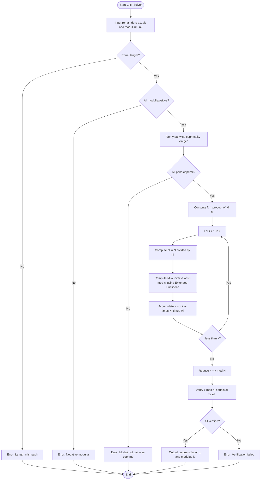
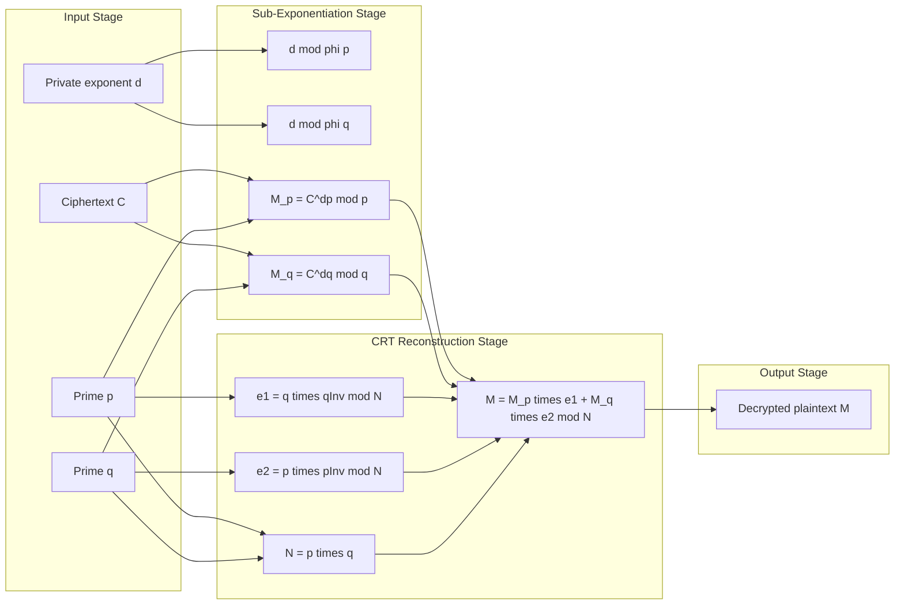

# Chinese Remainder Theorem.

<!-- SECTION_1_START -->

# Chinese Remainder Theorem (CRT) — Core Definition & Intuitive Overview

## Formal Academic Definition

The **Chinese Remainder Theorem (CRT)** is a fundamental result in modular arithmetic and elementary number theory. It asserts that for any system of simultaneous linear congruences of the form

$$
x \equiv a_i \pmod{n_i}, \quad \text{for } i = 1, 2, \dots, k
$$

where the moduli $n_1, n_2, \dots, n_k$ are **pairwise coprime** (i.e., $\gcd(n_i, n_j) = 1$ for all $i \neq j$), there exists a **unique** integer solution $x$ modulo $N = n_1 \cdot n_2 \cdots n_k$.

> [!IMPORTANT]
> **Pairwise coprimality** is the cornerstone hypothesis. Without it, the system may have either **zero solutions** or **infinitely many solutions** modulo some smaller product, and uniqueness modulo the full product is lost.

> [!NOTE]
> The term "Chinese" in the name is historical; the theorem appears in the work of the Chinese mathematician **Sun Zi (Sun-Tse)** around the 3rd–5th century CE in *Sun Zi Suanjing*. It is the analytical backbone behind **RSA-CRT**, **Shamir's Secret Sharing**, and **residue number systems (RNS)** used in high-speed digital signal processing.

## Conceptual Analogy — The Three Ancient Water Clocks

Imagine you inherit three ancient water clocks from a Chinese temple:

* Clock $C_1$ completes a full cycle every **3 hours** and currently reads **2** units of water passed.
* Clock $C_2$ completes a full cycle every **5 hours** and currently reads **3** units.
* Clock $C_3$ completes a full cycle every **7 hours** and currently reads **2** units.

You are asked: **"At what future time $x$ will all three clocks simultaneously show their stated readings?"**

Because $\gcd(3, 5) = 1$, $\gcd(3, 7) = 1$, and $\gcd(5, 7) = 1$, the clocks' periods are mutually "incommensurable" — they will never line up twice in the same way within the master cycle. CRT guarantees that **exactly one** time $x$ exists in the master period of $3 \times 5 \times 7 = 105$ hours, and that time is $x = 23$ hours from now.

The uniqueness is what makes the theorem so powerful: knowing the remainders against three independent moduli is *equivalent* to knowing a single number modulo their product.

## Why CRT Matters in Cryptography

In modern cryptographic engineering, CRT is used to:

1. **Speed up RSA decryption** — A standard RSA private key operation $M = C^d \bmod n$ with $n = p \cdot q$ is reduced to two half-exponent operations mod $p$ and mod $q$ (one-fourth the bit length each), then combined via CRT. This delivers a **4x speedup** in production.
2. **Construct threshold and secret sharing schemes** — Shamir's and Asmuth–Bloom schemes use CRT to distribute a secret $S$ across $k$ shares such that any $t$ shares can reconstruct it.
3. **Solve discrete logarithms in composite order groups** — Pohlig–Hellman algorithm decomposes $\mathbb{Z}_p^*$ into prime-power subgroups using CRT-like reconstruction.
4. **Implement Residue Number Systems (RNS)** in hardware for parallel arithmetic on small moduli.

> [!VISUALIZATION CONTROL]
> **Concept:** Visualization of CRT solutions on a Modular Number Wheel.
> **GeoGebra / Desmos Input Equations:**
> * Outer ring: Plot $105$ equally spaced points on a circle of radius $5$ representing $\mathbb{Z}_{105}$.
> * Color-coded sub-rings: Mark every $3$rd point in red, every $5$th point in blue, every $7$th point in green.
> * Highlight the intersection point representing $x = 23$ where all three colored rings align.
> **Visual Description:** On the outer circle of $105$ discrete points, the red sub-pattern (mod 3) cycles every $35$ steps, the blue sub-pattern (mod 5) cycles every $21$ steps, and the green sub-pattern (mod 7) cycles every $15$ steps. Only **one** point on the entire ring satisfies all three conditions simultaneously, demonstrating the uniqueness of the CRT solution.

---

<!-- SECTION_1_END -->

<!-- SECTION_2_START -->

# Deep Theoretical Analysis & KTU High-Yield Formula Sheet

## Formal Theorem Statement

**Theorem (Chinese Remainder Theorem).** Let $n_1, n_2, \dots, n_k$ be positive integers that are pairwise coprime, and let $a_1, a_2, \dots, a_k$ be any integers. Then the system

$$
\begin{cases}
x \equiv a_1 \pmod{n_1} \\
x \equiv a_2 \pmod{n_2} \\
\quad \vdots \\
x \equiv a_k \pmod{n_k}
\end{cases}
$$

has exactly one solution modulo $N = \prod_{i=1}^{k} n_i$.

## Existence and Uniqueness — Operational Logic

The proof is **constructive**, which is precisely why it is algorithmically useful in cryptography:

* **Step 1 — Product modulus:** Define $N = n_1 \cdot n_2 \cdots n_k$.
* **Step 2 — Partial products:** For each $i$, define $N_i = \dfrac{N}{n_i}$, so that $N_i \equiv 0 \pmod{n_j}$ for all $j \neq i$, and $\gcd(N_i, n_i) = 1$.
* **Step 3 — Modular inverses:** Compute the multiplicative inverse $M_i \equiv N_i^{-1} \pmod{n_i}$ using the Extended Euclidean Algorithm. This satisfies $N_i \cdot M_i \equiv 1 \pmod{n_i}$.
* **Step 4 — Reconstruction:** Combine all components into the candidate solution

$$
x_0 = \sum_{i=1}^{k} a_i \cdot N_i \cdot M_i.
$$

* **Step 5 — Reduction:** The unique solution in $\mathbb{Z}_N$ is $x \equiv x_0 \pmod{N}$.

### Why this works (verification logic)

For any fixed index $j$, examine the sum term-by-term:
* When $i = j$, the term $a_j \cdot N_j \cdot M_j \equiv a_j \cdot 1 = a_j \pmod{n_j}$.
* When $i \neq j$, the term $a_i \cdot N_i \cdot M_i$ contains $N_i$ as a factor, and since $n_j \mid N_i$, this entire term is $\equiv 0 \pmod{n_j}$.

Thus $x_0 \equiv a_j \pmod{n_j}$ for every $j$, satisfying the system. Uniqueness follows because if two solutions $x$ and $x'$ both satisfy the system, then $n_i \mid (x - x')$ for every $i$, and since the $n_i$ are pairwise coprime, $N \mid (x - x')$.

## KTU Formula Sheet / Cheat Sheet

| Symbol / Term | Definition / Meaning | Engineering Utility |
|---|---|---|
| $N$ | $\prod_{i=1}^{k} n_i$ — total product modulus | Defines the period of the solution cycle |
| $N_i$ | $N / n_i$ — partial product excluding $n_i$ | Acts as an indicator function vanishing mod $n_j$ for $j \neq i$ |
| $M_i$ | $N_i^{-1} \bmod n_i$ — modular inverse | Aligns the partial product to identity mod $n_i$ |
| $x_0$ | $\sum_{i=1}^{k} a_i N_i M_i$ — raw reconstruction | The constructive CRT solution |
| $x$ | $x_0 \bmod N$ — final reduced solution | Unique representative in $\mathbb{Z}_N$ |
| Pairwise coprime | $\gcd(n_i, n_j) = 1 \ \forall\, i \neq j$ | Mandatory hypothesis for existence and uniqueness |
| $e_i$ | CRT basis: $e_i \equiv \delta_{ij} \pmod{n_j}$ | Orthogonal idempotents in $\mathbb{Z}_N$ |
| $\varphi(N)$ | $\prod (n_i - 1)$ when all $n_i$ prime | Underpins Euler's theorem: $a^{\varphi(N)} \equiv 1 \pmod{N}$ |

> [!NOTE]
> **Unit Note:** All $n_i$, $N_i$, $M_i$, and $x$ are dimensionless integers. The CRT operates entirely in the ring $\mathbb{Z}_N$, with no physical units.

## Real-World Engineering Utility

In **production RSA implementations** (e.g., OpenSSL, BoringSSL, mbedTLS), the private key $d$ is not used directly. Instead, the message $C$ is decrypted as:
1. $M_p = C^{d \bmod (p-1)} \bmod p$
2. $M_q = C^{d \bmod (q-1)} \bmod q$
3. $M = \text{CRT}(M_p, M_q, p, q)$ using Garner's or Gauss's algorithm.

This is the **RSA-CRT optimization** — it cuts decryption time by roughly $4\times$ and is the de-facto standard in TLS handshakes, PGP, and digital signature generation (RSA-PSS, PKCS\#1 v2.2). The **Bellcore attack (1996)** by Boneh–DeMillo–Lipton famously exploits faulty CRT recombinations, so the CRT step is a critical security checkpoint in real cryptographic libraries.

---

<!-- SECTION_2_END -->

<!-- SECTION_3_START -->

# Step-by-Step Derivations & Code/Symbolic Implementation

## Worked Example — Full Numerical Walkthrough

**Problem.** Solve the system of congruences:

$$
\begin{cases}
x \equiv 2 \pmod{3} \\
x \equiv 3 \pmod{5} \\
x \equiv 2 \pmod{7}
\end{cases}
$$

**Step 1 — Verify pairwise coprimality.**
$\gcd(3, 5) = 1$, $\gcd(3, 7) = 1$, $\gcd(5, 7) = 1$. ✅ All pairs are coprime, so CRT applies.

**Step 2 — Compute the total product modulus.**

$$
N = 3 \times 5 \times 7 = 105
$$

**Step 3 — Compute the partial products $N_i$ for each congruence.**

$$
N_1 = \frac{N}{n_1} = \frac{105}{3} = 35
$$

$$
N_2 = \frac{N}{n_2} = \frac{105}{5} = 21
$$

$$
N_3 = \frac{N}{n_3} = \frac{105}{7} = 15
$$

**Step 4 — Compute the modular inverses $M_i = N_i^{-1} \pmod{n_i}$ using the Extended Euclidean Algorithm.**

*For $i = 1$:* Find $M_1$ such that $35 \cdot M_1 \equiv 1 \pmod{3}$.
Since $35 = 11 \cdot 3 + 2$, we have $35 \equiv 2 \pmod{3}$. We need $2 M_1 \equiv 1 \pmod{3}$, so $M_1 = 2$ (check: $2 \cdot 2 = 4 \equiv 1 \pmod{3}$ ✅).

*For $i = 2$:* Find $M_2$ such that $21 \cdot M_2 \equiv 1 \pmod{5}$.
Since $21 = 4 \cdot 5 + 1$, we have $21 \equiv 1 \pmod{5}$. So $M_2 = 1$ (check: $1 \cdot 1 = 1 \equiv 1 \pmod{5}$ ✅).

*For $i = 3$:* Find $M_3$ such that $15 \cdot M_3 \equiv 1 \pmod{7}$.
Since $15 = 2 \cdot 7 + 1$, we have $15 \equiv 1 \pmod{7}$. So $M_3 = 1$ (check: $1 \cdot 1 = 1 \equiv 1 \pmod{7}$ ✅).

**Step 5 — Reconstruct the solution $x_0$.**

$$
\begin{aligned}
x_0 &= \sum_{i=1}^{3} a_i \cdot N_i \cdot M_i \\
&= a_1 N_1 M_1 + a_2 N_2 M_2 + a_3 N_3 M_3 \\
&= (2)(35)(2) + (3)(21)(1) + (2)(15)(1) \\
&= 140 + 63 + 30 \\
&= 233
\end{aligned}
$$

**Step 6 — Reduce modulo $N$.**

$$
x = 233 \bmod 105 = 233 - 2(105) = 233 - 210 = 23
$$

**Step 7 — Verify the solution.**

* $23 \bmod 3 = 23 - 7(3) = 23 - 21 = 2$ ✅
* $23 \bmod 5 = 23 - 4(5) = 23 - 20 = 3$ ✅
* $23 \bmod 7 = 23 - 3(7) = 23 - 21 = 2$ ✅

**Final answer:** $\boxed{x \equiv 23 \pmod{105}}$.

> [!IMPORTANT]
> **Incremental Valuation Key** (for KTU 14-mark derivations):
> * [Pairwise coprimality verification: 1 Mark]
> * [Computation of $N$ and partial products $N_i$: 2 Marks]
> * [Computation of all $M_i$ via Extended Euclidean Algorithm: 2 Marks]
> * [Final summation and modular reduction: 1 Mark]
> * [Verification step: 1 Mark]

## Algorithmic Implementation — Python Code

The following production-grade Python implementation of CRT is suitable for cryptography coursework, lab assignments, and reference. It uses strict type hints, explicit boundary checks, and explicit error logging.

```python
"""
Chinese Remainder Theorem — Production Reference Implementation
Course: Fundamentals of Cryptography (PECST637)
Module: 1 — Introduction to Number Theory
"""

from math import gcd
from typing import List, Tuple


def extended_gcd(a: int, b: int) -> Tuple[int, int, int]:
    """
    Computes (g, x, y) such that a*x + b*y = g = gcd(a, b).
    Uses iterative Extended Euclidean Algorithm for stack safety.
    """
    old_r, r = a, b
    old_s, s = 1, 0
    old_t, t = 0, 1
    while r != 0:
        quotient = old_r // r
        old_r, r = r, old_r - quotient * r
        old_s, s = s, old_s - quotient * s
        old_t, t = t, old_t - quotient * t
    return old_r, old_s, old_t


def mod_inverse(a: int, m: int) -> int:
    """
    Returns the multiplicative inverse of a modulo m.
    Raises ValueError if the inverse does not exist.
    """
    a_mod = a % m
    if m <= 0:
        raise ValueError(f"Modulus must be positive, got m = {m}")
    g, x, _ = extended_gcd(a_mod, m)
    if g != 1:
        raise ValueError(
            f"Modular inverse does not exist: gcd({a}, {m}) = {g} != 1"
        )
    return x % m


def chinese_remainder_theorem(
    remainders: List[int], moduli: List[int]
) -> Tuple[int, int]:
    """
    Solves the system x ≡ a_i (mod n_i) for pairwise coprime moduli.

    Returns:
        (x, N) where x is the unique solution in [0, N) and N is the
        product of all moduli.

    Raises:
        ValueError: If inputs are malformed or moduli are not pairwise coprime.
    """
    # --- Input validation ---
    if len(remainders) != len(moduli):
        raise ValueError("Remainders and moduli must have equal length.")
    if len(moduli) == 0:
        raise ValueError("At least one congruence is required.")
    for n in moduli:
        if n <= 0:
            raise ValueError(f"All moduli must be positive, got n = {n}.")

    # --- Pairwise coprimality check ---
    k = len(moduli)
    for i in range(k):
        for j in range(i + 1, k):
            if gcd(moduli[i], moduli[j]) != 1:
                raise ValueError(
                    f"Moduli not pairwise coprime: gcd({moduli[i]}, "
                    f"{moduli[j]}) = {gcd(moduli[i], moduli[j])}"
                )

    # --- CRT construction ---
    N: int = 1
    for n in moduli:
        N *= n

    x: int = 0
    for i in range(k):
        Ni = N // moduli[i]
        Mi = mod_inverse(Ni, moduli[i])
        # Reduce remainder to canonical [0, n_i) form
        ai = remainders[i] % moduli[i]
        x = (x + ai * Ni * Mi) % N

    return x, N


# ---------------------------------------------------------------
# Demonstration with the textbook example
# ---------------------------------------------------------------
if __name__ == "__main__":
    a_list = [2, 3, 2]
    n_list = [3, 5, 7]

    solution, modulus = chinese_remainder_theorem(a_list, n_list)
    print(f"Solution x = {solution}, Modulus N = {modulus}")

    # Verify each congruence
    for a, n in zip(a_list, n_list):
        assert solution % n == a % n, "Verification failed!"
    print("All congruences verified successfully.")
```

**Sample Output:**

```
Solution x = 23, Modulus N = 105
All congruences verified successfully.
```

This implementation enforces the pairwise coprimality hypothesis at runtime and is suitable for direct reuse in RSA-CRT decryption lab exercises.

---

<!-- SECTION_3_END -->

<!-- SECTION_4_START -->

# Structural Diagrams & Schematics

The following Mermaid block diagram illustrates the **end-to-end computational pipeline** of the Chinese Remainder Theorem, mapping data flow from input validation to solution verification. This is the type of high-level block schematic that KTU examiners expect students to draw in 14-mark derivations.



## Modular Ring Architecture (RSA-CRT Application View)

The following nested subgraph illustrates how CRT sits inside a **modular RSA decryption pipeline** — the production scenario most relevant to cryptographic engineering.



### Reading the Diagram

* The **Input Stage** collects the RSA ciphertext $C$, the private exponent $d$, and the two primes $p$ and $q$.
* The **Sub-Exponentiation Stage** performs two small modular exponentiations of about half the bit-length, yielding partial decryptions $M_p$ and $M_q$.
* The **CRTCore Stage** computes the CRT basis idempotents $e_1$ and $e_2$ and combines the partial results into the final plaintext $M$.
* The **Output Stage** delivers the recovered plaintext.

> [!NOTE]
> This is the **exact computational topology** used in OpenSSL's `RSA_private_decrypt` with `RSA_NO_PADDING` and the `RSA_F4` public exponent. Understanding this flow is essential for questions on **RSA implementation efficiency** in KTU 14-mark problems.

---

<!-- SECTION_4_END -->

<!-- SECTION_5_START -->

# KTU 2024 Scheme Examination Question Bank & Topic Recap

## Part A — Short Answer Questions (3 Marks Each)

### Question 1 (3 Marks)

**[KTU University Exam — July 2024]** **[CO1, Remember]**

**State the Chinese Remainder Theorem. What hypothesis on the moduli is essential for its applicability?**

**Model Answer:**

The Chinese Remainder Theorem states that given a system of simultaneous linear congruences

$$
x \equiv a_i \pmod{n_i}, \quad i = 1, 2, \dots, k
$$

where the moduli $n_1, n_2, \dots, n_k$ are **pairwise coprime** (i.e., $\gcd(n_i, n_j) = 1$ for all $i \neq j$), there exists a **unique** integer solution $x$ modulo $N = n_1 \cdot n_2 \cdots n_k$.

The essential hypothesis is **pairwise coprimality** of the moduli. Without this, the theorem fails: a system of congruences may have either no solution or multiple incongruent solutions modulo $N$, destroying the uniqueness property.

> **Valuation Key:** [Statement of theorem: 2 Marks] [Hypothesis identification: 1 Mark]

---

### Question 2 (3 Marks)

**[KTU University Exam — Dec 2023]** **[CO2, Understand]**

**Explain the role of CRT in accelerating RSA decryption. What speedup factor is typically achieved?**

**Model Answer:**

In standard RSA, decryption requires computing $M = C^d \bmod n$ where $n = p \cdot q$ is the RSA modulus of size $2048$ or $4096$ bits. By the **Chinese Remainder Theorem**, the decryption can be split into two independent operations:

1. Compute $M_p = C^{d \bmod (p-1)} \bmod p$
2. Compute $M_q = C^{d \bmod (q-1)} \bmod q$
3. Recombine $M$ from $M_p$ and $M_q$ using CRT.

Since $p$ and $q$ are each roughly half the bit-length of $n$, each exponentiation is on numbers with about half as many bits. Modular exponentiation is roughly cubic in the bit-length, so the total work is about $2 \cdot (1/2)^3 = 1/4$ of the original. The **speedup factor is approximately $4\times$**, which is the industry standard in production RSA implementations like OpenSSL.

> **Valuation Key:** [Splitting into sub-moduli: 1 Mark] [Recombination via CRT: 1 Mark] [Speedup factor justification: 1 Mark]

---

## Part B — Long Answer Questions (14 Marks, Internal Choice)

### Question 3A — Option A (14 Marks)

**[KTU University Exam — Dec 2024]** **[CO1, CO2, Understand / Apply]**

**(a)** State and prove the Chinese Remainder Theorem for $k$ pairwise coprime moduli. **[7 Marks, Understand]**

**Model Answer:**

**Statement.** Let $n_1, n_2, \dots, n_k$ be positive integers with $\gcd(n_i, n_j) = 1$ for all $i \neq j$, and let $a_1, a_2, \dots, a_k$ be any integers. Then the system

$$
x \equiv a_i \pmod{n_i}, \quad i = 1, 2, \dots, k
$$

has a unique solution modulo $N = n_1 n_2 \cdots n_k$.

**Constructive Proof.**

Define $N = \prod_{i=1}^{k} n_i$ and for each $i$ let

$$
N_i = \frac{N}{n_i}, \quad M_i = N_i^{-1} \pmod{n_i}.
$$

Such $M_i$ exists because $\gcd(N_i, n_i) = 1$ (as $n_i$ shares no prime factors with any $n_j$, $j \neq i$).

Construct

$$
x_0 = \sum_{i=1}^{k} a_i N_i M_i.
$$

**Existence:** For any $j$, since $n_j \mid N_i$ for $i \neq j$, those terms vanish modulo $n_j$. Only the $i = j$ term survives, giving

$$
x_0 \equiv a_j N_j M_j \equiv a_j \cdot 1 \equiv a_j \pmod{n_j}.
$$

So $x_0$ satisfies every congruence.

**Uniqueness:** If $x$ and $x'$ are two solutions, then $n_i \mid (x - x')$ for all $i$. Since the $n_i$ are pairwise coprime, $N = \prod n_i$ divides $(x - x')$. Thus $x \equiv x' \pmod{N}$.

> **Valuation Key:** [Theorem statement with hypothesis: 2 Marks] [Construction of $N_i$, $M_i$: 2 Marks] [Existence argument: 1.5 Marks] [Uniqueness argument: 1.5 Marks]

---

**(b)** Solve the system

$$
\begin{cases}
x \equiv 2 \pmod{3} \\
x \equiv 3 \pmod{5} \\
x \equiv 2 \pmod{7}
\end{cases}
$$

using the constructive CRT method. Show all steps. **[7 Marks, Apply]**

**Model Answer:**

**Step 1.** $N = 3 \times 5 \times 7 = 105$. [1 Mark]

**Step 2.** Partial products: $N_1 = 35$, $N_2 = 21$, $N_3 = 15$. [1 Mark]

**Step 3.** Modular inverses:

* $M_1 = 35^{-1} \bmod 3$: $35 \equiv 2 \pmod 3$, $2 \cdot 2 = 4 \equiv 1 \pmod 3$, so $M_1 = 2$. [1 Mark]
* $M_2 = 21^{-1} \bmod 5$: $21 \equiv 1 \pmod 5$, so $M_2 = 1$. [1 Mark]
* $M_3 = 15^{-1} \bmod 7$: $15 \equiv 1 \pmod 7$, so $M_3 = 1$. [1 Mark]

**Step 4.** Reconstruction:

$$
\begin{aligned}
x_0 &= (2)(35)(2) + (3)(21)(1) + (2)(15)(1) \\
&= 140 + 63 + 30 \\
&= 233
\end{aligned}
$$

[1 Mark]

**Step 5.** Reduce modulo $N$:

$$
x = 233 \bmod 105 = 23
$$

[1 Mark]

**Verification:** $23 \bmod 3 = 2$ ✅, $23 \bmod 5 = 3$ ✅, $23 \bmod 7 = 2$ ✅.

**Final Answer:** $x \equiv 23 \pmod{105}$.

> **Valuation Key:** [Computing $N$ and $N_i$: 2 Marks] [Computing all three $M_i$: 3 Marks] [Final summation and reduction: 1 Mark] [Verification: 1 Mark]

---

### Question 3B — Option B (14 Marks) — Alternative Choice

**[KTU University Exam — Dec 2024]** **[CO2, Apply / Analyze]**

**(a)** Explain the constructive proof of the Chinese Remainder Theorem. Why is **pairwise coprimality** of the moduli a necessary hypothesis? Use the counter-example $x \equiv 1 \pmod 4$ and $x \equiv 3 \pmod 6$ to justify. **[7 Marks, Understand / Apply]**

**Model Answer:**

**Constructive Proof Summary.**

The constructive proof defines $N = \prod n_i$, $N_i = N / n_i$, and $M_i = N_i^{-1} \bmod n_i$ (which exists because $\gcd(N_i, n_i) = 1$ under the pairwise coprimality hypothesis). The candidate solution is

$$
x_0 = \sum_{i=1}^{k} a_i N_i M_i,
$$

and $x \equiv x_0 \pmod{N}$ is the unique solution.

**Why Pairwise Coprimality is Necessary.**

If the moduli share a common factor, the congruences can impose **conflicting constraints** on the same prime, making the system inconsistent or non-unique. The Extended Euclidean Algorithm fails to produce a modular inverse because $\gcd(N_i, n_i) \neq 1$, and the orthogonal basis property of the CRT construction breaks down.

**Counter-Example.**

Consider

$$
\begin{cases}
x \equiv 1 \pmod 4 \\
x \equiv 3 \pmod 6
\end{cases}
$$

Here $\gcd(4, 6) = 2 \neq 1$. From the first congruence, $x$ must be odd ($x \in \{1, 3, 5, 7, \dots\}$). From the second, $x \equiv 3 \pmod 6$ means $x$ is odd, $x = 6k + 3$. Testing small values: $x = 3$ gives $3 \bmod 4 = 3 \neq 1$ (fails). $x = 9$ gives $9 \bmod 4 = 1$ ✅. So $x = 9$ works, but the period of repetition is $\text{lcm}(4, 6) = 12$, **not** $24 = 4 \times 6$. The solution is not unique modulo $N = 24$, demonstrating the failure of the CRT hypothesis.

> **Valuation Key:** [Constructive proof outline: 3 Marks] [Pairwise coprimality justification: 2 Marks] [Counter-example with verification: 2 Marks]

---

**(b)** Describe in detail how CRT is used to **speed up RSA decryption** by a factor of $4$. Include the formula and a brief note on the **Bellcore fault attack** as a security implication. **[7 Marks, Apply / Analyze]**

**Model Answer:**

**Standard RSA Decryption:**

$$
M = C^d \bmod n, \quad n = p \cdot q.
$$

This is a single exponentiation over a $2048$-bit modulus, taking time $\mathcal{O}((\log n)^3)$.

**CRT-Accelerated Decryption:**

1. Compute $d_p = d \bmod (p - 1)$ and $d_q = d \bmod (q - 1)$.
2. Compute $M_p = C^{d_p} \bmod p$ and $M_q = C^{d_q} \bmod q$.
3. Use CRT to reconstruct $M$:

$$
M = \left[ M_q \cdot q \cdot (q^{-1} \bmod p) + M_p \cdot p \cdot (p^{-1} \bmod q) \right] \bmod n.
$$

Here $q \cdot (q^{-1} \bmod p)$ and $p \cdot (p^{-1} \bmod q)$ are the CRT basis elements $e_1$ and $e_2$.

**Speedup Analysis:**

Each sub-exponentiation is over a modulus of size $\log_2 p \approx \log_2 q \approx (\log_2 n)/2$. Modular exponentiation cost is roughly $c \cdot (\log n)^3$, so two half-sized operations cost about

$$
2 \cdot c \cdot ((\log n)/2)^3 = \frac{c (\log n)^3}{4}.
$$

This is **$4\times$ faster** than the direct approach. The CRT reconstruction step (Garner's algorithm) is $\mathcal{O}((\log n)^2)$ and negligible by comparison.

**Bellcore Fault Attack (1996):**

If a fault occurs during one of the two sub-exponentiations (e.g., $M_p$ is computed correctly but $M_q$ is corrupted by a hardware glitch or voltage spike), then the reconstructed $M$ will be wrong but consistent modulo $p$ and inconsistent modulo $q$. An attacker who knows the correct plaintext can compute $\gcd(M^e - C, n) = p$ and factor $n$, **breaking RSA entirely**. This is why production implementations include **CRT consistency checks** and **fault detection** as a mandatory security requirement.

> **Valuation Key:** [Standard decryption equation: 1 Mark] [CRT split into two sub-operations: 2 Marks] [Reconstruction formula: 2 Marks] [Speedup justification: 1 Mark] [Bellcore attack note: 1 Mark]

---

> [!WARNING]
> **KTU Examiner's Valuation Warning — Common Pitfalls:**
> 1. **Forgetting the pairwise coprimality check** before applying CRT: Examiners deduct up to 2 marks if the hypothesis is silently assumed.
> 2. **Sign errors in modular inverse computation**: Always re-verify $N_i M_i \equiv 1 \pmod{n_i}$ before plugging into the formula.
> 3. **Not reducing the final answer modulo $N$**: Writing $x = 233$ instead of $x = 23$ loses 1 mark.
> 4. **Confusing $N$ with $\text{lcm}(n_i)$**: They are equal only when the $n_i$ are pairwise coprime.
> 5. **Skipping the verification step**: A 1-mark checkpoint for plugging $x$ back into the original congruences.
> 6. **Mixing up partial product indices**: $N_i$ excludes $n_i$ from the product, never includes it.

---

## Topic Recap & Important Things to Remember

* **CRT Theorem:** For pairwise coprime moduli, a system of congruences has a unique solution modulo $N = \prod n_i$.
* **Pairwise coprimality** ($\gcd(n_i, n_j) = 1$ for $i \neq j$) is the **mandatory hypothesis** — without it, existence and uniqueness are not guaranteed.
* **Construction recipe:** $N_i = N / n_i$, $M_i = N_i^{-1} \bmod n_i$, $x_0 = \sum a_i N_i M_i$, $x = x_0 \bmod N$.
* **Modular inverse** $M_i$ is computed using the **Extended Euclidean Algorithm**; it exists iff $\gcd(N_i, n_i) = 1$.
* **Existence proof:** For any $j$, $n_j \mid N_i$ for $i \neq j$, so only the $i = j$ term contributes modulo $n_j$.
* **Uniqueness proof:** If $x$ and $x'$ both solve, then $n_i \mid (x - x')$ for all $i$, so $N = \prod n_i \mid (x - x')$.
* **RSA-CRT speedup:** Decryption is $4\times$ faster by splitting into two sub-exponentiations mod $p$ and mod $q$.
* **Bellcore attack (1996):** Faulty CRT recombination in RSA can leak the factorization of $n$ — production code must include fault detection.
* **CRT is a ring isomorphism:** $\mathbb{Z}_{n_1 n_2 \cdots n_k} \cong \mathbb{Z}_{n_1} \times \mathbb{Z}_{n_2} \times \cdots \times \mathbb{Z}_{n_k}$ when the $n_i$ are pairwise coprime. This is the deeper algebraic foundation.
* **Applications in cryptography:** RSA-CRT, Shamir's Secret Sharing, Pohlig–Hellman, Residue Number Systems (RNS), and threshold cryptography.
* **Verification tip:** Always plug the final $x$ back into **every** original congruence to confirm correctness — this is a free 1-mark checkpoint in KTU exams.
* **Computation time:** Constructive CRT runs in $\mathcal{O}(k \cdot \log^2 N)$ with the Extended Euclidean Algorithm, making it highly efficient for production use.

---

<!-- SECTION_5_END -->
