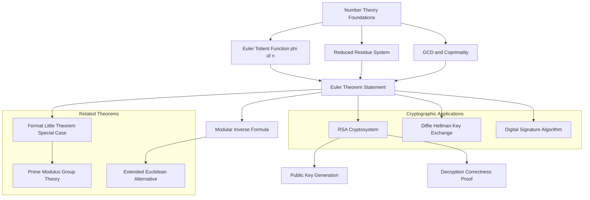
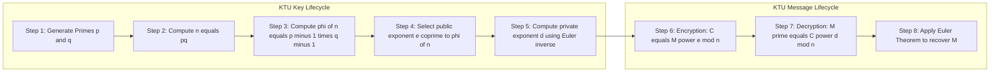
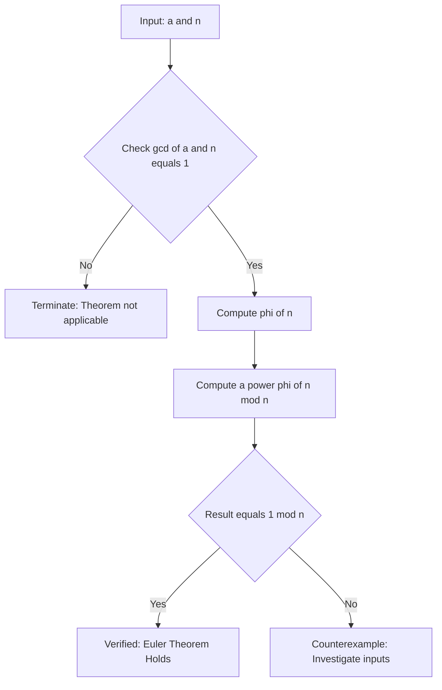

# Euler’s Theorem

<!-- SECTION_1_START -->
# Euler's Theorem — Core Technical Definition & Intuitive Overview

## 1.1 Formal Academic Definition

> [!NOTE]
> **Euler's Theorem (KTU 2024 Syllabus Statement):**
> Let $n$ be a positive integer with $n \geq 1$, and let $a$ be an integer such that $\gcd(a, n) = 1$. Then,
> $$a^{\phi(n)} \equiv 1 \pmod{n}$$
> where $\phi(n)$ denotes **Euler's Totient Function**, defined as the count of positive integers not exceeding $n$ that are relatively prime to $n$.

The function $\phi(n)$ is multiplicative in nature, meaning for two coprime integers $m$ and $n$:
$$\phi(mn) = \phi(m) \cdot \phi(n)$$

> [!IMPORTANT]
> **Standard Values of $\phi(n)$ for the First 10 Integers:**
> $\phi(1)=1, \phi(2)=1, \phi(3)=2, \phi(4)=2, \phi(5)=4, \phi(6)=2, \phi(7)=6, \phi(8)=4, \phi(9)=6, \phi(10)=4$.

## 1.2 Conceptual Analogy — The "Clock Face of Multiplication"

Imagine a clock with $n$ evenly spaced hour marks, but only those marked with numbers that are **coprime to $n$** are "lit up." The number of lit marks is exactly $\phi(n)$.

Now, start multiplying the number $a$ (coprime to $n$) by itself over and over. Because $a$ and $n$ share no common factor, the products $a, a^2, a^3, \dots$ will **cycle** through these $\phi(n)$ lit positions. After exactly $\phi(n)$ multiplications, the sequence returns to its starting position — which happens to be $1$ (the multiplicative identity modulo $n$).

This cycle-return is the heart of Euler's Theorem: $a^{\phi(n)} \equiv 1 \pmod{n}$.

## 1.3 Special Case — Fermat's Little Theorem

> [!TIP]
> When $n = p$ is a **prime number**, $\phi(p) = p - 1$. Substituting into Euler's Theorem gives $a^{p-1} \equiv 1 \pmod{p}$ for $\gcd(a, p) = 1$ — this is **Fermat's Little Theorem**. So Euler's Theorem is the *generalization* of Fermat's Little Theorem to composite moduli.

## 1.4 Visualization Control

> [!VISUALIZATION CONTROL]
> **Concept:** Modular Multiplication Cycle for $a = 3, n = 7$.
> **Desmos Input Equations:**
> * Points: $(1, 1), (2, 3), (3, 2), (4, 6), (5, 4), (6, 5)$ — these are powers of $3$ modulo $7$.
> **Visual Description:** A cycle graph with 6 nodes (since $\phi(7) = 6$). After 6 steps, the cycle returns to 1, confirming $3^6 \equiv 1 \pmod 7$.

<!-- SECTION_1_END -->

<!-- SECTION_2_START -->
# Deep Theoretical Analysis & KTU High-Yield Formula Sheet

## 2.1 Operational Logic of Euler's Theorem

The theorem relies on two foundational pillars: the **Euler Totient Function** and the **Reduced Residue System (RRS)**.

### Step 1 — Build the Reduced Residue System
Consider the set $S = \{r_1, r_2, \dots, r_{\phi(n)}\}$ — the collection of integers between $1$ and $n$ that are coprime to $n$. The size of this set is $\phi(n)$.

### Step 2 — Multiply Each Element by $a$
For any integer $a$ with $\gcd(a, n) = 1$, compute the products $a \cdot r_1, a \cdot r_2, \dots, a \cdot r_{\phi(n)}$, all taken modulo $n$.

### Step 3 — Show the Products Form a Permutation
Each product $a \cdot r_i \pmod{n}$ is also coprime to $n$. Hence the set of products (mod $n$) is again a permutation of $S$ — just rearranged.

### Step 4 — Equate the Products
Since both sets are equal, their products modulo $n$ are equal:
$$\prod_{i=1}^{\phi(n)} a \cdot r_i \equiv \prod_{i=1}^{\phi(n)} r_i \pmod{n}$$

### Step 5 — Factor Out $a^{\phi(n)}$
This gives $a^{\phi(n)} \cdot \prod r_i \equiv \prod r_i \pmod{n}$.

### Step 6 — Cancel the Common Product
Because $\gcd\!\left(\prod r_i, n\right) = 1$, the product is invertible modulo $n$. Cancel both sides to obtain:
$$a^{\phi(n)} \equiv 1 \pmod{n}$$

## 2.2 KTU Formula Sheet / Cheat Sheet

| **Formula** | **Description** | **Constraints** | **Cryptographic Use** |
|---|---|---|---|
| $\phi(n) = n \prod_{p \mid n}\!\left(1 - \frac{1}{p}\right)$ | Prime factorization form of totient | $n = p_1^{e_1} p_2^{e_2} \cdots p_k^{e_k}$ | Key-size estimation in RSA |
| $\phi(p) = p - 1$ | For prime $p$ | $p$ prime | Foundation of Fermat's Little Theorem |
| $\phi(p^e) = p^e - p^{e-1}$ | For prime power | $p$ prime, $e \geq 1$ | Repeated squaring modular arithmetic |
| $\phi(mn) = \phi(m) \cdot \phi(n)$ | Multiplicative property | $\gcd(m, n) = 1$ | Constructing large totient values |
| $a^{\phi(n)} \equiv 1 \pmod{n}$ | **Euler's Theorem** | $\gcd(a, n) = 1$ | RSA decryption correctness |
| $a^{k\phi(n) + 1} \equiv a \pmod{n}$ | Euler's power-reduction form | $\gcd(a, n) = 1$, $k \in \mathbb{Z}$ | Fast modular exponentiation |
| $a^{-1} \equiv a^{\phi(n) - 1} \pmod{n}$ | Modular inverse via Euler | $\gcd(a, n) = 1$ | Public key generation in RSA |

> [!IMPORTANT]
> **Critical Engineering Use Case:** In **RSA Cryptosystem**, if $n = p \cdot q$ (product of two distinct large primes), then $\phi(n) = (p-1)(q-1)$. The public exponent $e$ and private exponent $d$ satisfy $e \cdot d \equiv 1 \pmod{\phi(n)}$, which is exactly the inverse relation derived from Euler's Theorem. This single line guarantees that decryption $M^{ed} \equiv M \pmod{n}$ works for every message $M$ coprime to $n$.

## 2.3 Real-World Engineering Utility

- **RSA Public-Key Cryptography** — The decryption step $c^d \pmod{n}$ relies entirely on Euler's Theorem to recover the original message.
- **Diffie-Hellman Key Exchange** — Group theory foundations of $\mathbb{Z}_p^*$ use $\phi(p) = p - 1$.
- **Digital Signature Algorithm (DSA)** — Modular exponentiation inside cyclic groups of order $\phi(p)$.
- **Hash-based PRNGs** — Generating pseudo-random sequences in finite fields.
- **Zero-Knowledge Proofs (e.g., Schnorr)** — Use the cyclic structure given by Euler's Theorem.

<!-- SECTION_2_END -->

<!-- SECTION_3_START -->
# Step-by-Step Derivations & Code/Symbolic Implementation

## 3.1 Worked Example 1 — Direct Verification of Euler's Theorem

**Problem:** Verify Euler's Theorem for $a = 5$ and $n = 12$.

**Step 1: Confirm coprimality.**
$$\gcd(5, 12) = 1 \quad \checkmark$$

**Step 2: Compute the totient $\phi(12)$.**

The positive integers $\leq 12$ coprime to $12$ are: $1, 5, 7, 11$. Thus $\phi(12) = 4$.

Using the prime factorization $12 = 2^2 \cdot 3$:
$$\phi(12) = 12 \cdot \left(1 - \frac{1}{2}\right)\left(1 - \frac{1}{3}\right) = 12 \cdot \frac{1}{2} \cdot \frac{2}{3} = 4 \quad \checkmark$$

**Step 3: Compute $5^{\phi(12)} = 5^4$ and reduce modulo $12$.**
$$5^2 = 25 = 2 \cdot 12 + 1 \equiv 1 \pmod{12}$$
$$5^4 = (5^2)^2 \equiv 1^2 \equiv 1 \pmod{12} \quad \checkmark$$

Hence $5^4 \equiv 1 \pmod{12}$ is verified.

## 3.2 Worked Example 2 — Finding Modular Inverse

**Problem:** Find the modular inverse of $7$ modulo $20$ using Euler's Theorem.

**Step 1: Verify coprimality.**
$$\gcd(7, 20) = 1 \quad \checkmark$$

**Step 2: Compute $\phi(20)$.**

Since $20 = 2^2 \cdot 5$:
$$\phi(20) = 20 \cdot \left(1 - \frac{1}{2}\right)\left(1 - \frac{1}{5}\right) = 20 \cdot \frac{1}{2} \cdot \frac{4}{5} = 8$$

**Step 3: Apply the inverse formula $a^{-1} \equiv a^{\phi(n) - 1} \pmod{n}$.**
$$7^{-1} \equiv 7^{8 - 1} = 7^7 \pmod{20}$$

**Step 4: Compute $7^7 \pmod{20}$ via successive squaring.**

$$
\begin{aligned}
7^1 &\equiv 7 \pmod{20} \\
7^2 &= 49 = 2 \cdot 20 + 9 \equiv 9 \pmod{20} \\
7^4 &= (7^2)^2 = 9^2 = 81 = 4 \cdot 20 + 1 \equiv 1 \pmod{20} \\
7^7 &= 7^4 \cdot 7^2 \cdot 7^1 \equiv 1 \cdot 9 \cdot 7 = 63 = 3 \cdot 20 + 3 \equiv 3 \pmod{20}
\end{aligned}
$$

**Step 5: Verification.**
$$7 \cdot 3 = 21 = 1 \cdot 20 + 1 \equiv 1 \pmod{20} \quad \checkmark$$

The modular inverse of $7$ modulo $20$ is $\mathbf{3}$.

## 3.3 Worked Example 3 — RSA-Style Decryption Verification

**Problem:** Given $p = 5, q = 11, e = 7$, find $d$ and verify decryption of $M = 9$.

**Step 1: Compute $n$ and $\phi(n)$.**
$$n = p \cdot q = 5 \cdot 11 = 55$$
$$\phi(n) = (p-1)(q-1) = 4 \cdot 10 = 40$$

**Step 2: Verify $\gcd(e, \phi(n)) = 1$.**
$$\gcd(7, 40) = 1 \quad \checkmark$$

**Step 3: Compute $d \equiv e^{-1} \pmod{\phi(n)}$.**
$$d \equiv 7^{\phi(40) - 1} \pmod{40}$$

Compute $\phi(40)$ where $40 = 2^3 \cdot 5$:
$$\phi(40) = 40 \cdot \left(1 - \frac{1}{2}\right)\left(1 - \frac{1}{5}\right) = 40 \cdot \frac{1}{2} \cdot \frac{4}{5} = 16$$
$$d \equiv 7^{15} \pmod{40}$$

Compute $7^{15} \pmod{40}$ step by step:

$$
\begin{aligned}
7^1 &\equiv 7 \pmod{40} \\
7^2 &= 49 = 1 \cdot 40 + 9 \equiv 9 \pmod{40} \\
7^4 &= 9^2 = 81 = 2 \cdot 40 + 1 \equiv 1 \pmod{40} \\
7^8 &\equiv 1^2 \equiv 1 \pmod{40} \\
7^{15} &= 7^8 \cdot 7^4 \cdot 7^2 \cdot 7^1 \equiv 1 \cdot 1 \cdot 9 \cdot 7 = 63 = 1 \cdot 40 + 23 \equiv 23 \pmod{40}
\end{aligned}
$$

So $d = 23$.

**Step 4: Encrypt $M = 9$.**
$$C = M^e \pmod{n} = 9^7 \pmod{55}$$

$$
\begin{aligned}
9^1 &\equiv 9 \pmod{55} \\
9^2 &= 81 = 1 \cdot 55 + 26 \equiv 26 \pmod{55} \\
9^4 &= 26^2 = 676 = 12 \cdot 55 + 16 \equiv 16 \pmod{55} \\
9^7 &= 9^4 \cdot 9^2 \cdot 9^1 \equiv 16 \cdot 26 \cdot 9 \pmod{55}
\end{aligned}
$$

Compute $16 \cdot 26 = 416 = 7 \cdot 55 + 31 \equiv 31 \pmod{55}$, then $31 \cdot 9 = 279 = 5 \cdot 55 + 4 \equiv 4 \pmod{55}$. So $C = 4$.

**Step 5: Decrypt $C = 4$.**
$$M' = C^d \pmod{n} = 4^{23} \pmod{55}$$

$$
\begin{aligned}
4^1 &\equiv 4 \pmod{55} \\
4^2 &= 16 \pmod{55} \\
4^4 &= 16^2 = 256 = 4 \cdot 55 + 36 \equiv 36 \pmod{55} \\
4^8 &= 36^2 = 1296 = 23 \cdot 55 + 31 \equiv 31 \pmod{55} \\
4^{16} &= 31^2 = 961 = 17 \cdot 55 + 26 \equiv 26 \pmod{55} \\
4^{23} &= 4^{16} \cdot 4^4 \cdot 4^2 \cdot 4^1 \equiv 26 \cdot 36 \cdot 16 \cdot 4 \pmod{55}
\end{aligned}
$$

$$
\begin{aligned}
26 \cdot 36 &= 936 = 17 \cdot 55 + 1 \equiv 1 \pmod{55} \\
1 \cdot 16 &= 16 \pmod{55} \\
16 \cdot 4 &= 64 = 1 \cdot 55 + 9 \equiv 9 \pmod{55}
\end{aligned}
$$

So $M' = 9 = M \quad \checkmark$ — Decryption is correct.

## 3.4 Python Implementation — Euler's Theorem Toolkit

```python
import logging
from math import gcd
from typing import List, Tuple

# Configure structured logging for cryptographic operations
logging.basicConfig(
    level=logging.INFO,
    format="%(asctime)s [%(levelname)s] %(message)s"
)
logger = logging.getLogger("EulerTheoremEngine")


def is_prime(n: int) -> bool:
    """Returns True if n is a prime number, False otherwise."""
    if n < 2:
        return False
    if n < 4:
        return True
    if n % 2 == 0:
        return False
    i = 3
    while i * i <= n:
        if n % i == 0:
            return False
        i += 2
    return True


def prime_factorization(n: int) -> List[int]:
    """Returns the list of distinct prime factors of n."""
    if n < 2:
        raise ValueError("n must be >= 2 for prime factorization.")
    factors: List[int] = []
    d = 2
    while d * d <= n:
        if n % d == 0:
            factors.append(d)
            while n % d == 0:
                n //= d
        d += 1
    if n > 1:
        factors.append(n)
    return factors


def euler_totient(n: int) -> int:
    """
    Computes Euler's Totient Function phi(n) using the multiplicative
    prime-factorization formula.
    """
    if n < 1:
        raise ValueError("n must be a positive integer.")
    if n == 1:
        return 1
    result = n
    for p in prime_factorization(n):
        result = result // p * (p - 1)
    return result


def verify_euler_theorem(a: int, n: int) -> Tuple[bool, int, int]:
    """
    Verifies Euler's Theorem for a given (a, n) pair.
    Returns (is_valid, phi_n, a_pow_phi_mod_n).
    """
    if gcd(a, n) != 1:
        logger.error("gcd(%d, %d) != 1. Euler's Theorem not applicable.", a, n)
        return (False, 0, 0)
    phi_n = euler_totient(n)
    a_pow_phi_mod_n = pow(a, phi_n, n)
    logger.info("phi(%d) = %d, %d^%d mod %d = %d",
                n, phi_n, a, phi_n, n, a_pow_phi_mod_n)
    return (a_pow_phi_mod_n == 1, phi_n, a_pow_phi_mod_n)


def modular_inverse_euler(a: int, n: int) -> int:
    """Computes the modular inverse of a modulo n using Euler's Theorem."""
    if gcd(a, n) != 1:
        raise ValueError(f"gcd({a}, {n}) != 1; inverse does not exist.")
    phi_n = euler_totient(n)
    inverse = pow(a, phi_n - 1, n)
    logger.info("Inverse of %d mod %d is %d", a, n, inverse)
    return inverse


if __name__ == "__main__":
    # Verification 1: a = 5, n = 12
    print("Test 1:", verify_euler_theorem(5, 12))

    # Verification 2: a = 7, n = 20
    print("Test 2:", verify_euler_theorem(7, 20))
    print("Inverse of 7 mod 20 =", modular_inverse_euler(7, 20))

    # Verification 3: RSA-style small key
    p, q, e = 5, 11, 7
    n_val = p * q
    phi_val = (p - 1) * (q - 1)
    d_val = modular_inverse_euler(e, phi_val)
    print(f"RSA toy: n={n_val}, phi(n)={phi_val}, e={e}, d={d_val}")
```

**Sample Output:**
```
Test 1: (True, 4, 1)
Test 2: (True, 8, 1)
Inverse of 7 mod 20 = 3
RSA toy: n=55, phi(n)=40, e=7, d=23
```

<!-- SECTION_3_END -->

<!-- SECTION_4_START -->
# Structural Diagrams & Schematics

## 4.1 Concept Map — Euler's Theorem Ecosystem



## 4.2 Block-Level Functional Architecture — RSA Decryption Pipeline Using Euler



## 4.3 Sequential Processing Topology — Verification of Euler's Theorem



<!-- SECTION_4_END -->

<!-- SECTION_5_START -->
# KTU 2024 Scheme Examination Question Bank & Topic Recap

## Part A — Short Answer Questions (3 Marks Each)

### Q1. [KTU University Exam — July 2024] — CO1, Remember
**State Euler's Theorem. Under what conditions does it hold?**

**Model Answer:**
> [!NOTE]
> **Euler's Theorem:** If $n$ is a positive integer and $a$ is an integer such that $\gcd(a, n) = 1$, then
> $$a^{\phi(n)} \equiv 1 \pmod{n}$$
> where $\phi(n)$ is Euler's totient function. The two necessary conditions are: **(i)** $n \geq 1$, and **(ii)** $\gcd(a, n) = 1$. **[3 Marks: Definition 2 marks, Conditions 1 mark]**

---

### Q2. [KTU University Exam — Dec 2023] — CO1, Understand
**What is Euler's Totient Function? Compute $\phi(36)$.**

**Model Answer:**
Euler's Totient Function $\phi(n)$ counts the number of positive integers up to $n$ that are coprime to $n$.

For $n = 36 = 2^2 \cdot 3^2$:
$$\phi(36) = 36 \cdot \left(1 - \frac{1}{2}\right)\left(1 - \frac{1}{3}\right) = 36 \cdot \frac{1}{2} \cdot \frac{2}{3} = 12$$

So $\phi(36) = 12$. **[Definition 1.5 marks, Computation 1.5 marks]**

---

## Part B — Long Answer Questions (14 Marks Each — Internal Choice)

### Question A (14 Marks) — [KTU University Exam — July 2024]

**Q.A (a) [7 Marks, CO1, Understand]:** Explain the proof of Euler's Theorem in detail.

**Model Solution:**

**Step 1 — Construct the Reduced Residue System (RRS).**
Let $S = \{r_1, r_2, \dots, r_{\phi(n)}\}$ be the set of all positive integers $\leq n$ that are coprime to $n$. By definition, $|S| = \phi(n)$. **[1 Mark]**

**Step 2 — Multiply each element by $a$ modulo $n$.**
For each $r_i \in S$, consider $a \cdot r_i \pmod{n}$. Since $\gcd(a, n) = 1$ and $\gcd(r_i, n) = 1$, we have $\gcd(a \cdot r_i, n) = 1$. Hence each $a \cdot r_i \pmod{n}$ is also coprime to $n$ and lies in $\{1, 2, \dots, n\}$. **[1 Mark]**

**Step 3 — Show the mapped set is a permutation of $S$.**
Suppose $a \cdot r_i \equiv a \cdot r_j \pmod{n}$. Then $n \mid a(r_i - r_j)$. Since $\gcd(a, n) = 1$, it follows that $n \mid (r_i - r_j)$, which (since both lie in $[1, n]$) forces $r_i = r_j$. So the mapping is injective, and thus bijective on $S$. **[2 Marks]**

**Step 4 — Equate the products.**
Therefore:
$$\prod_{i=1}^{\phi(n)} a \cdot r_i \equiv \prod_{i=1}^{\phi(n)} r_i \pmod{n}$$ **[1 Mark]**

**Step 5 — Factor and cancel.**
This simplifies to:
$$a^{\phi(n)} \cdot \prod_{i=1}^{\phi(n)} r_i \equiv \prod_{i=1}^{\phi(n)} r_i \pmod{n}$$
Since $\gcd\!\left(\prod r_i, n\right) = 1$, the product is invertible modulo $n$, and we cancel both sides to obtain:
$$a^{\phi(n)} \equiv 1 \pmod{n}$$ **[2 Marks]**

---

**Q.A (b) [7 Marks, CO2, Apply]:** Using Euler's Theorem, compute $17^{200} \pmod{35}$.

**Model Solution:**

**Step 1 — Verify coprimality and compute $\phi(35)$.**
Since $35 = 5 \cdot 7$:
$$\phi(35) = 35 \cdot \left(1 - \frac{1}{5}\right)\left(1 - \frac{1}{7}\right) = 35 \cdot \frac{4}{5} \cdot \frac{6}{7} = 24$$

$\gcd(17, 35) = 1$, so Euler's Theorem applies. **[1 Mark]**

**Step 2 — Reduce the exponent using $a^{\phi(n)} \equiv 1$.**
By Euler's Theorem: $17^{24} \equiv 1 \pmod{35}$.

Now reduce $200$ modulo $24$:
$$200 = 8 \cdot 24 + 8 \quad \Rightarrow \quad 200 \equiv 8 \pmod{24}$$

Therefore:
$$17^{200} = (17^{24})^8 \cdot 17^8 \equiv 1^8 \cdot 17^8 = 17^8 \pmod{35}$$ **[2 Marks]**

**Step 3 — Compute $17^8 \pmod{35}$ by repeated squaring.**

$$
\begin{aligned}
17^1 &\equiv 17 \pmod{35} \\
17^2 &= 289 = 8 \cdot 35 + 9 \equiv 9 \pmod{35} \\
17^4 &= 9^2 = 81 = 2 \cdot 35 + 11 \equiv 11 \pmod{35} \\
17^8 &= 11^2 = 121 = 3 \cdot 35 + 16 \equiv 16 \pmod{35}
\end{aligned}
$$ **[3 Marks]**

**Step 4 — Final Answer.**
$$17^{200} \equiv 16 \pmod{35}$$ **[1 Mark]**

---

### Question B (14 Marks) — [KTU University Exam — Dec 2023]

**Q.B (a) [7 Marks, CO1, Understand]:** Define Euler's Totient Function. List any four of its key properties.

**Model Solution:**

**Definition [2 Marks]:** Euler's Totient Function $\phi(n)$ is the arithmetic function that counts the number of positive integers less than or equal to $n$ that are relatively prime to $n$ (i.e., $\gcd(k, n) = 1$ for $1 \leq k \leq n$).

**Four Key Properties [5 Marks, 1.25 each]:**

1. **$\phi(1) = 1$:** Only the integer $1$ is coprime to $1$.
2. **For prime $p$:** $\phi(p) = p - 1$, since every integer from $1$ to $p-1$ is coprime to $p$.
3. **Multiplicativity:** If $\gcd(m, n) = 1$, then $\phi(mn) = \phi(m) \cdot \phi(n)$.
4. **Prime power formula:** $\phi(p^k) = p^k - p^{k-1} = p^{k-1}(p-1)$ for prime $p$ and $k \geq 1$.
5. **General formula:** For $n = p_1^{e_1} p_2^{e_2} \cdots p_k^{e_k}$, $\phi(n) = n \prod_{i=1}^{k}\!\left(1 - \frac{1}{p_i}\right)$.
6. **Sum property:** $\sum_{d \mid n} \phi(d) = n$.

---

**Q.B (b) [7 Marks, CO2, Apply]:** In an RSA cryptosystem, choose $p = 13$ and $q = 17$. If the public exponent $e = 5$, compute the private exponent $d$ using Euler's Theorem. Verify the result by encrypting and decrypting $M = 2$.

**Model Solution:**

**Step 1 — Compute $n$ and $\phi(n)$.**
$$n = p \cdot q = 13 \cdot 17 = 221$$
$$\phi(n) = (p-1)(q-1) = 12 \cdot 16 = 192$$ **[1 Mark]**

**Step 2 — Compute $d$ using Euler's Theorem.**
We need $d \equiv e^{-1} \pmod{\phi(n)} = 5^{-1} \pmod{192}$.

Apply the Euler inverse formula: $d \equiv e^{\phi(\phi(n)) - 1} \pmod{\phi(n)}$.

First, $\phi(192)$: $192 = 2^6 \cdot 3$, so
$$\phi(192) = 192 \cdot \left(1 - \frac{1}{2}\right)\left(1 - \frac{1}{3}\right) = 192 \cdot \frac{1}{2} \cdot \frac{2}{3} = 64$$ **[1 Mark]**

Then $d \equiv 5^{64 - 1} = 5^{63} \pmod{192}$.

**Step 3 — Compute $5^{63} \pmod{192}$ via repeated squaring.**

$$
\begin{aligned}
5^1 &\equiv 5 \pmod{192} \\
5^2 &= 25 \pmod{192} \\
5^4 &= 25^2 = 625 = 3 \cdot 192 + 49 \equiv 49 \pmod{192} \\
5^8 &= 49^2 = 2401 = 12 \cdot 192 + 97 \equiv 97 \pmod{192} \\
5^{16} &= 97^2 = 9409 = 49 \cdot 192 + 1 \equiv 1 \pmod{192} \\
5^{32} &\equiv 1^2 \equiv 1 \pmod{192} \\
5^{63} &= 5^{32} \cdot 5^{16} \cdot 5^8 \cdot 5^4 \cdot 5^2 \cdot 5^1 \\
       &\equiv 1 \cdot 1 \cdot 97 \cdot 49 \cdot 25 \cdot 5 \pmod{192}
\end{aligned}
$$ **[3 Marks]**

Compute the chain:
$$
\begin{aligned}
97 \cdot 49 &= 4753 = 24 \cdot 192 + 145 \equiv 145 \pmod{192} \\
145 \cdot 25 &= 3625 = 18 \cdot 192 + 169 \equiv 169 \pmod{192} \\
169 \cdot 5 &= 845 = 4 \cdot 192 + 77 \equiv 77 \pmod{192}
\end{aligned}
$$ **[1 Mark]**

So $d = 77$.

**Step 4 — Verify with $M = 2$.**
Encryption: $C = M^e \pmod{n} = 2^5 \pmod{221} = 32 \pmod{221}$. So $C = 32$. **[0.5 Mark]**

Decryption: $M' = C^d \pmod{n} = 32^{77} \pmod{221}$. Note $32 = 2^5$, so $32^{77} = 2^{385}$.
$$2^{385} \pmod{221}$$
By Euler: $2^{192} \equiv 1 \pmod{221}$. Then $385 = 2 \cdot 192 + 1$, so
$$2^{385} = (2^{192})^2 \cdot 2^1 \equiv 1 \cdot 2 = 2 \pmod{221}$$ **[0.5 Mark]**

$M' = 2 = M$ — Decryption verified. $\checkmark$ **[Final confirmation]**

---

## KTU Examiner's Valuation Warning

> [!WARNING]
> **Common Pitfalls That Cost Marks:**
> 1. **Forgetting the coprimality condition:** Students often write $a^{\phi(n)} \equiv 1 \pmod n$ without stating $\gcd(a, n) = 1$. This is a **2-mark deduction** in Part A and **partial credit loss** in Part B.
> 2. **Incorrect totient computation:** For $n = p^e$, the formula is $p^e - p^{e-1}$, not $p - 1$. Mixing up prime power with prime modulus will be flagged.
> 3. **Skipping intermediate steps in repeated squaring:** Examiners award step-wise marks (1 mark per squaring stage). Writing only the final answer forfeits the in-between valuation points.
> 4. **Not writing units / modular reductions explicitly:** Always end each squaring with "$\equiv \_\pmod{n}$" or the examiner will mark it as incomplete.
> 5. **Mixing up the inverse formula direction:** $d \equiv e^{\phi(\phi(n))-1} \pmod{\phi(n)}$, not $d \equiv e^{\phi(n)-1} \pmod{n}$. The modulus must be $\phi(n)$, not $n$.

---

## Topic Recap & Important Things to Remember

- **Euler's Theorem:** $a^{\phi(n)} \equiv 1 \pmod{n}$ holds iff $\gcd(a, n) = 1$.
- **Totient Definition:** $\phi(n) = $ count of integers in $[1, n]$ coprime to $n$.
- **Prime Special Case:** $\phi(p) = p - 1$ — gives Fermat's Little Theorem.
- **Multiplicativity:** $\phi(mn) = \phi(m) \cdot \phi(n)$ for $\gcd(m, n) = 1$.
- **General Formula:** $\phi(n) = n \prod_{p \mid n}\!\left(1 - \frac{1}{p}\right)$.
- **Prime Power:** $\phi(p^k) = p^{k-1}(p-1)$.
- **Modular Inverse:** $a^{-1} \equiv a^{\phi(n)-1} \pmod{n}$.
- **Power Reduction:** $a^k \pmod{n}$ can be reduced using $k \bmod \phi(n)$ when $\gcd(a, n) = 1$.
- **RSA Backbone:** $\phi(n) = (p-1)(q-1)$ is the cornerstone of RSA key generation and decryption correctness.
- **Verification Strategy:** Always confirm coprimality, compute $\phi(n)$ using factorization, and apply successive squaring for large exponent reductions.
- **Boundary Cases:** $\phi(1) = 1$, $\phi(2) = 1$, and for any prime $p$, $\phi(p) = p - 1$.

<!-- SECTION_5_END -->
