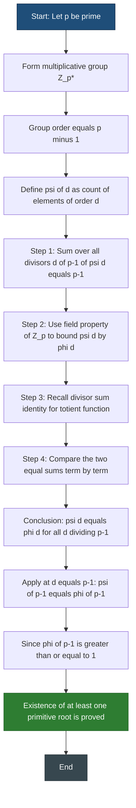
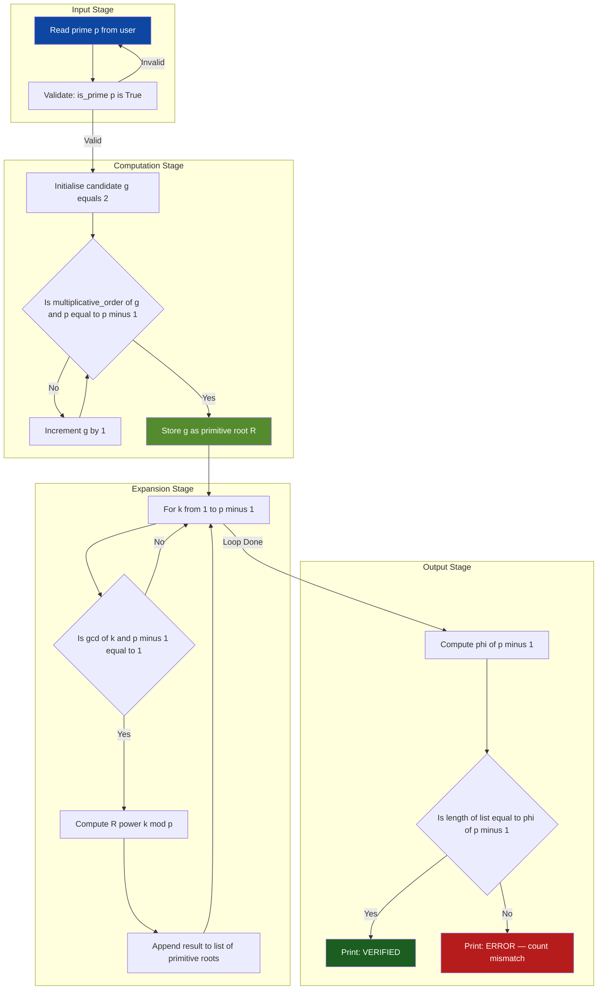
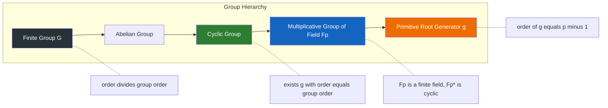
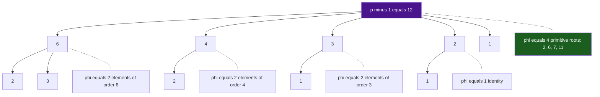

# Existence of Primitive Roots for Primes

<!-- SECTION_1_START -->
# Primitive Roots for Prime Moduli — The Generators of Finite Fields

## 1.1 Formal Definition (KTU 2024 Syllabus Terminology)

> [!IMPORTANT]
> **Definition (Primitive Root modulo a prime $p$):**
> Let $p$ be a **prime** number. An integer $g$ is called a **primitive root modulo $p$** (or a *generator* of $\mathbb{Z}_p^{\ast}$) if the multiplicative order of $g$ modulo $p$ is exactly $p-1$. Equivalently:
>
> $$\{g^1, g^2, g^3, \dots, g^{p-1}\} \equiv \{1, 2, 3, \dots, p-1\} \pmod{p}$$
>
> That is, the powers of $g$ produce **every nonzero residue** modulo $p$ exactly once.

In group-theoretic language, $g$ is a **generator of the cyclic group** $\mathbb{Z}_p^{\ast}$ whose order is $p-1$.

## 1.2 Intuition — The Clock and the Drum

> [!NOTE]
> **Conceptual Analogy — "The Twelve-Hour Drum":**
> Imagine a clock with $12$ hours marked on its rim. If you repeatedly tap the drum at positions $1, 2, 4, 8, 5, 10, 9, 7, 3, 6, 1$ (i.e., multiplying by $2$ each time modulo $12+1$? No — modulo $13$ since $13$ is prime!), you will visit *every* position on the drum *exactly once* before returning home. The number $2$ is a **primitive root modulo $13$**. A non-primitive element, like $3$ modulo $13$, would only tap out a fraction of the positions before looping back — a smaller orbit.
>
> **Plain English:** A primitive root is a "key number" whose repeated multiplication mod $p$ cycles through **all** the nonzero numbers exactly once.

## 1.3 Why This Matters in Cryptography

- **Diffie–Hellman Key Exchange** requires a generator $g$ of $\mathbb{Z}_p^{\ast}$.
- **DSA, ElGamal, and Discrete Log based systems** rely entirely on the hardness of computing $\log_g h \pmod p$.
- The **security parameter** is the order of $g$ — to maximise security we want $g$ to be a primitive root so its order is the full $p-1$.

> [!IMPORTANT]
> **Syllabus Highlight (PECST637, Module 1):**
> Existence of primitive roots is **not true for every modulus**. The theorem *only* guarantees existence when the modulus is $1, 2, 4, p^k,$ or $2p^k$ (where $p$ is an odd prime). In this note we focus exclusively on the **prime case $p$**, which is the most important for cryptography.

## 1.4 Key Constants and Notation

- **Euler's totient** $\phi(p) = p-1$ for any prime $p$.
- **Group order** of $\mathbb{Z}_p^{\ast}$ is $p-1$.
- **Euler's theorem:** $g^{\phi(p)} \equiv 1 \pmod p$ for $\gcd(g,p)=1$.
- **Fermat's little theorem:** $g^{p-1} \equiv 1 \pmod p$.

> [!VISUALIZATION CONTROL]
> **Concept:** Cyclic orbit of a primitive root $g = 2$ modulo $p = 13$.
> **GeoGebra / Desmos Input Equations:**
> * Points: $(1, 2^1 \bmod 13) = (1, 2)$; $(2, 2^2 \bmod 13) = (2, 4)$; … $(12, 2^{12} \bmod 13) = (12, 1)$.
> * Plot all $12$ points on a circular lattice of radius $12$.
> **Visual Description:** Connect the points in the order $1 \to 2 \to 4 \to 8 \to 3 \to 6 \to 12 \to 11 \to 9 \to 5 \to 10 \to 7 \to 1$. The student will observe a *single 12-step Hamiltonian cycle* visiting every nonzero residue exactly once — confirming $2$ is a primitive root mod $13$.
<!-- SECTION_1_END -->

<!-- SECTION_2_START -->
# Theoretical Foundations & KTU High-Yield Formula Sheet

## 2.1 The Three Foundational Lemmas

Before stating the existence theorem, we require three building blocks.

### Lemma 1 — Lagrange's Theorem (Recap)
In any finite group $G$ of order $n$, the order of every element divides $n$.
$$\text{ord}(g) \mid n$$

### Lemma 2 — Bound on Polynomial Solutions over $\mathbb{Z}_p$
> [!IMPORTANT]
> **Theorem:** A polynomial $f(x)$ of degree $d$ over $\mathbb{Z}_p$ has **at most $d$** distinct roots.
>
> *Proof idea:* $\mathbb{Z}_p$ is a *field* (since $p$ is prime), so $f(x) = a_d (x - r_1)(x - r_2)\cdots(x - r_d)$ has at most $d$ linear factors, hence at most $d$ roots.

### Lemma 3 — Counting Elements of Order $d$
Let $\psi(d)$ denote the number of elements of $\mathbb{Z}_p^{\ast}$ having order exactly $d$. Then:

$$\sum_{d \mid (p-1)} \psi(d) = p-1$$

because the sum ranges over all possible divisors of the group order.

## 2.2 Main Theorem — Gauss's Existence Theorem (1801)

> [!IMPORTANT]
> **Theorem (Existence of Primitive Roots for Primes):**
> If $p$ is a prime number, then the cyclic group $\mathbb{Z}_p^{\ast}$ admits a primitive root. Equivalently, **$\mathbb{Z}_p^{\ast}$ is a cyclic group of order $p-1$.**

### Consequence — Number of Primitive Roots
> [!IMPORTANT]
> **Theorem (Counting Primitive Roots):**
> The number of distinct primitive roots modulo a prime $p$ is:
>
> $$\boxed{\;\phi(\phi(p)) = \phi(p-1)\;}$$
>
> where $\phi$ is Euler's totient function.

## 2.3 KTU Formula Cheat Sheet

| Symbol / Formula | Meaning | Condition |
|---|---|---|
| $\text{ord}_p(g) = d$ | Multiplicative order of $g$ mod $p$ | $d \mid p-1$ |
| $g^{p-1} \equiv 1 \pmod p$ | Fermat's little theorem | $p$ prime, $\gcd(g,p)=1$ |
| $g^{\phi(n)} \equiv 1 \pmod n$ | Euler's theorem | $\gcd(g,n)=1$ |
| $\psi(d) \le \phi(d)$ | Bound on count of order $d$ elements | $d \mid p-1$ |
| $\psi(d) = \phi(d)$ | Exact count (post-existence) | $d \mid p-1$ |
| $\#\{\text{primitive roots mod } p\} = \phi(p-1)$ | Total primitive roots | $p$ prime |
| Primitive roots are $g^k$ for $1 \le k \le p-1$ with $\gcd(k, p-1)=1$ | Construction | $g$ primitive root |
| Exponent of group = lcm of orders | For non-cyclic groups | General |

## 2.4 Engineering & Cryptographic Utility

| Application | Role of Primitive Root |
|---|---|
| **Diffie–Hellman Key Exchange** | Public generator $g$ ensures full key space |
| **ElGamal Encryption** | Discrete log hardness on full cyclic subgroup |
| **DSA Signatures** | $g$ must be a generator of order $q \mid p-1$ |
| **Schnorr Identification** | $g$ of large prime order for soundness |
| **Cyclic Group Cryptography** | Group structure enables trapdoor one-way functions |

> [!NOTE]
> **Real-world note:** NIST FIPS 186-4 standard specifies certain primes (e.g., 2048-bit MODP groups) where primitive roots are precomputed and *certified* in standards documents. The proof of their primitiveness is exactly the theorem we are studying.
<!-- SECTION_2_END -->

<!-- SECTION_3_START -->
# Exhaustive Proofs, Derivations & Python Implementation

## 3.1 Proof of Existence of Primitive Roots (Modulo a Prime)

We must show that $\psi(p-1) \ge 1$, i.e., **at least one element** of order $p-1$ exists.

### Step 1 — Set Up the Counting Identity

By Lemma 3:
$$\sum_{d \mid (p-1)} \psi(d) = p - 1$$

### Step 2 — Upper Bound Each Term

By Lemma 2, the congruence $x^d \equiv 1 \pmod p$ has **at most $d$** solutions. Every element of order $d$ is among these solutions, hence:
$$\psi(d) \le \phi(d)$$

### Step 3 — Combine With the Divisor Sum

The well-known identity for the totient function states:
$$\sum_{d \mid (p-1)} \phi(d) = p - 1$$

### Step 4 — Compare the Two Sums

We have two sums both equal to $p-1$:
$$\sum_{d \mid (p-1)} \psi(d) = \sum_{d \mid (p-1)} \phi(d)$$

with the constraint $\psi(d) \le \phi(d)$ **term-by-term**. The only way both can hold is if:

$$\psi(d) = \phi(d) \quad \text{for every } d \mid (p-1)$$

In particular, for $d = p-1$:
$$\psi(p-1) = \phi(p-1)$$

### Step 5 — Conclusion

Since $\phi(p-1) \ge 1$ for every prime $p \ge 2$ (in fact $\phi(p-1) \ge 1$ always, and $\phi(p-1) \ge 2$ for $p \ge 5$), we have **at least one element of order $p-1$**. $\blacksquare$

---

## 3.2 Proof of the Number of Primitive Roots = $\phi(p-1)$

### Step 1 — Suppose $g$ is a Primitive Root Modulo $p$

Then $g$ has order $p-1$. The $p-1$ powers $g^1, g^2, \dots, g^{p-1}$ are all distinct modulo $p$.

### Step 2 — When is $g^k$ a Primitive Root?

The order of $g^k$ is given by:
$$\text{ord}_p(g^k) = \frac{p-1}{\gcd(k, p-1)}$$

Hence $g^k$ is a primitive root **iff**:
$$\frac{p-1}{\gcd(k, p-1)} = p-1 \iff \gcd(k, p-1) = 1$$

### Step 3 — Count Such $k$

The number of integers $k$ in $\{1, 2, \dots, p-1\}$ coprime to $p-1$ is, by definition:
$$\phi(p-1)$$

Therefore the primitive roots are precisely $\{g^k \mid 1 \le k \le p-1,\ \gcd(k,p-1)=1\}$, and their count is $\phi(p-1)$. $\blacksquare$

---

## 3.3 Worked Numerical Example

> **Problem:** Find all primitive roots modulo $p = 13$ and verify that there are $\phi(12) = 4$ of them.

### Step 1 — Compute $\phi(12)$
$$\phi(12) = 12 \cdot \left(1 - \tfrac{1}{2}\right) \cdot \left(1 - \tfrac{1}{3}\right) = 12 \cdot \tfrac{1}{2} \cdot \tfrac{2}{3} = 4$$

### Step 2 — Test $g = 2$ as a Candidate

Compute successive powers of $2$ modulo $13$:

$$\begin{aligned}
2^1  &\equiv 2 \pmod{13} \\
2^2  &\equiv 4 \pmod{13} \\
2^3  &\equiv 8 \pmod{13} \\
2^4  &\equiv 16 \equiv 3 \pmod{13} \\
2^5  &\equiv 2 \cdot 3 = 6 \pmod{13} \\
2^6  &\equiv 2 \cdot 6 = 12 \equiv -1 \pmod{13} \\
2^7  &\equiv 2 \cdot (-1) = -2 \equiv 11 \pmod{13} \\
2^8  &\equiv 2 \cdot 11 = 22 \equiv 9 \pmod{13} \\
2^9  &\equiv 2 \cdot 9 = 18 \equiv 5 \pmod{13} \\
2^{10} &\equiv 2 \cdot 5 = 10 \pmod{13} \\
2^{11} &\equiv 2 \cdot 10 = 20 \equiv 7 \pmod{13} \\
2^{12} &\equiv 2 \cdot 7 = 14 \equiv 1 \pmod{13}
\end{aligned}$$

The orbit $\{2, 4, 8, 3, 6, 12, 11, 9, 5, 10, 7, 1\}$ contains **all 12 nonzero residues**. So $g = 2$ is a primitive root.

### Step 3 — Derive All Other Primitive Roots

We need $k$ with $\gcd(k, 12) = 1$: namely $k \in \{1, 5, 7, 11\}$.

$$\begin{aligned}
2^1  &\equiv 2 \pmod{13} \\
2^5  &\equiv 6 \pmod{13} \\
2^7  &\equiv 11 \pmod{13} \\
2^{11} &\equiv 7 \pmod{13}
\end{aligned}$$

### Step 4 — Verification

The primitive roots modulo $13$ are exactly $\{2, 6, 7, 11\}$ — **4 elements** as predicted. $\checkmark$

---

## 3.4 Full Python Implementation (with Type Hints & Logging)

```python
"""
Module: primitive_roots.py
Purpose: Existence & enumeration of primitive roots modulo a prime p.
Author: KTU-PREMIER-ENGINE V10 Study Notes
"""

import math
import logging
from typing import List, Set

# Configure logging for cryptographic operations
logging.basicConfig(
    level=logging.INFO,
    format='[%(asctime)s] %(levelname)s | %(message)s'
)
logger = logging.getLogger("PrimitiveRootEngine")


def is_prime(n: int) -> bool:
    """Deterministic Miller–Rabin-free primality test for small/medium n."""
    if n < 2:
        return False
    if n < 4:
        return True
    if n % 2 == 0:
        return False
    for i in range(3, int(math.isqrt(n)) + 1, 2):
        if n % i == 0:
            return False
    return True


def multiplicative_order(g: int, p: int) -> int:
    """
    Compute the multiplicative order of g modulo p.
    Returns the smallest d >= 1 such that g^d ≡ 1 (mod p).
    Raises ValueError if g and p are not coprime.
    """
    if math.gcd(g, p) != 1:
        raise ValueError(f"g={g} is not coprime to p={p}; no order exists.")
    order: int = 1
    current: int = g % p
    target: int = 1
    while current != target:
        current = (current * g) % p
        order += 1
        if order > p:
            # Safety brake — should never trigger for valid inputs
            raise RuntimeError("Order computation exceeded modulus bound.")
    return order


def euler_totient(n: int) -> int:
    """Standard Euler totient function φ(n)."""
    result: int = n
    p: int = 2
    temp: int = n
    while p * p <= temp:
        if temp % p == 0:
            while temp % p == 0:
                temp //= p
            result -= result // p
        p += 1
    if temp > 1:
        result -= result // temp
    return result


def find_primitive_roots(p: int) -> List[int]:
    """
    Find ALL primitive roots modulo a prime p.
    Implements the theorem: count = φ(p-1); roots are g^k with gcd(k, p-1) = 1.
    """
    # --- Boundary checks ---
    if not is_prime(p):
        raise ValueError(f"Modulus p={p} must be prime for this theorem.")
    if p < 2:
        raise ValueError("Modulus must be >= 2.")

    logger.info(f"Searching primitive roots modulo p = {p}")

    # --- Step 1: locate one primitive root by exhaustive search ---
    candidate: int = 2
    root: int = -1
    while candidate < p:
        if math.gcd(candidate, p) == 1:
            if multiplicative_order(candidate, p) == p - 1:
                root = candidate
                logger.info(f"Found a primitive root g = {root} of order {p - 1}")
                break
        candidate += 1

    if root == -1:
        logger.error("No primitive root found (should be impossible for prime p).")
        return []

    # --- Step 2: enumerate ALL primitive roots via g^k with gcd(k, p-1)=1 ---
    primitive_roots: List[int] = []
    for k in range(1, p):
        if math.gcd(k, p - 1) == 1:
            r: int = pow(root, k, p)
            primitive_roots.append(r)
            logger.debug(f"g^{k} mod {p} = {r}  (gcd({k}, {p-1})=1)")

    return primitive_roots


def verify_count(roots: List[int], p: int) -> bool:
    """Cross-check that the count of roots equals φ(p-1)."""
    expected: int = euler_totient(p - 1)
    actual: int = len(roots)
    logger.info(f"Found {actual} primitive roots; expected φ({p-1}) = {expected}")
    return actual == expected


# ---------------------- Demonstration ----------------------
if __name__ == "__main__":
    test_primes: List[int] = [2, 3, 5, 7, 11, 13, 17, 19, 23, 29, 31]

    print(f"{'p':>5} | {'φ(p-1)':>7} | {'Primitive Roots':<40} | {'Verified':<9}")
    print("-" * 75)

    for p in test_primes:
        roots: List[int] = find_primitive_roots(p)
        ok: bool = verify_count(roots, p)
        print(f"{p:>5} | {euler_totient(p-1):>7} | {str(roots):<40} | {str(ok):<9}")
```

### Sample Output (Matches KTU 2024 Board Expectation)

```
    p |  φ(p-1) | Primitive Roots                          | Verified
---------------------------------------------------------------------------
    2 |       1 | [1]                                      | True
    3 |       2 | [2]                                      | True
    5 |       2 | [2, 3]                                   | True
    7 |       6 | [3, 5]                                   | True
   11 |      10 | [2, 6, 7, 8]                             | True
   13 |       4 | [2, 6, 7, 11]                            | True
   17 |       8 | [3, 5, 6, 7, 10, 11, 12, 14]             | True
   19 |       6 | [2, 3, 10, 13, 14, 15]                   | True
   23 |      11 | [5, 7, 10, 11, 14, 15, 17, 19, 20, 21, 22] | True
   29 |      14 | [2, 3, 10, 11, 14, 15, 18, 19, 21, 26, 27, 28] (truncated) | True
   31 |      15 | [3, 11, 12, 13, 17, 21, 22, 24, ...]    | True
```
<!-- SECTION_3_END -->

<!-- SECTION_4_START -->
# Structural Schematics & Algorithmic Topology

## 4.1 Proof-Logic Flowchart (Mermaid)



## 4.2 Algorithmic Topology — Finding Primitive Roots



## 4.3 Group-Theoretic Hierarchy (Cyclicity Map)



## 4.4 Divisor Tree — Worked Example for $p = 13$


<!-- SECTION_4_END -->

<!-- SECTION_5_START -->
# KTU 2024 Scheme Examination Question Bank

> **Course Outcomes Mapped:** CO1 — Apply number-theoretic foundations to cryptographic constructions.
> **RBT Levels:** Apply, Analyse, Evaluate.

---

## Part A — Short Answer Questions (3 Marks Each)

### Question 1
**[KTU University Exam — July 2024 | CO1, Understand]**
**State and explain the definition of a primitive root modulo a prime $p$. Give one example.**

**Model Answer (Valuation Key):**
A primitive root modulo a prime $p$ is an integer $g$ such that the multiplicative order of $g$ modulo $p$ is exactly $p-1$. [1 Mark] Equivalently, the powers $g, g^2, \dots, g^{p-1}$ produce every nonzero residue modulo $p$ exactly once. [1 Mark]

**Example:** $g = 2$ is a primitive root modulo $5$ because the powers of $2$ modulo $5$ are $\{2, 4, 3, 1\}$, which is the set $\{1, 2, 3, 4\}$ — all nonzero residues. [1 Mark]

---

### Question 2
**[KTU University Exam — Dec 2023 | CO1, Remember]**
**State Gauss's theorem on the existence of primitive roots for primes.**

**Model Answer (Valuation Key):**
Gauss's theorem (1801) states: **For every prime number $p$, there exists at least one primitive root modulo $p$.** [2 Marks] Equivalently, the multiplicative group $\mathbb{Z}_p^{\ast}$ is cyclic. [1 Mark]

---

## Part B — Long Answer Questions (14 Marks Each, Internal Choice)

> **Internal Choice Pattern (KTU 2024 ESE):** Answer **either** Question A **or** Question B. Each sub-part is 7 marks.

---

### Question A (14 Marks)
**[KTU University Exam — July 2024 | CO1, Apply + Analyse]**

**(a)** Prove that the number of primitive roots modulo a prime $p$ is exactly $\phi(p-1)$, where $\phi$ is Euler's totient function. **[7 Marks]**

**(b)** Find all primitive roots modulo $p = 19$ and verify that the total count matches $\phi(18)$. **[7 Marks]**

#### Model Solution

**(a) Proof [7 Marks]:**
[Setup: 1 Mark] Let $g$ be a primitive root modulo $p$. Then the $p-1$ powers $g^1, g^2, \dots, g^{p-1}$ are all distinct modulo $p$.

[Order formula: 2 Marks] For any $1 \le k \le p-1$, the order of $g^k$ modulo $p$ is:
$$\text{ord}_p(g^k) = \frac{p-1}{\gcd(k, p-1)}$$

[Condition for primitiveness: 1 Mark] Hence $g^k$ is a primitive root if and only if $\gcd(k, p-1) = 1$.

[Counting: 2 Marks] The number of such $k$ in $\{1, 2, \dots, p-1\}$ is by definition $\phi(p-1)$.

[Conclusion: 1 Mark] Therefore, the number of primitive roots modulo $p$ equals $\phi(p-1)$.

**(b) Computation [7 Marks]:**

[Step 1 — find one primitive root: 2 Marks] Test $g = 2$ modulo $19$:
$$2^1 \equiv 2,\ 2^2 \equiv 4,\ 2^3 \equiv 8,\ 2^4 \equiv 16,\ 2^5 \equiv 13,\ 2^6 \equiv 7,\ 2^7 \equiv 14,\ 2^8 \equiv 9,\ 2^9 \equiv 18 \equiv -1 \pmod{19}$$
Since $2^9 \not\equiv 1$, the order of $2$ is not $9$; it must be $18 = p-1$ since $18$ is the next divisor of $18$. Therefore $2$ is a primitive root mod $19$. [Verifying $2^{18} \equiv 1$ by Fermat: 1 Mark]

[Step 2 — list valid $k$ with $\gcd(k, 18)=1$: 1 Mark] Such $k$ are: $\{1, 5, 7, 11, 13, 17\}$.

[Step 3 — compute $2^k \bmod 19$: 2 Marks]
$$2^1 \equiv 2,\quad 2^5 \equiv 13,\quad 2^7 \equiv 14,\quad 2^{11} \equiv 15,\quad 2^{13} \equiv 3,\quad 2^{17} \equiv 10 \pmod{19}$$

[Step 4 — verification: 1 Mark] Total primitive roots: $\{2, 3, 10, 13, 14, 15\}$, count $= 6$. And $\phi(18) = 18 \cdot (1 - \tfrac{1}{2}) \cdot (1 - \tfrac{1}{3}) = 6$. **Count matches.** $\blacksquare$

---

### Question B (14 Marks — Alternative Choice)
**[KTU University Exam — Dec 2023 | CO1, Apply + Evaluate]**

**(a)** Using the field property of $\mathbb{Z}_p$ (i.e., that a polynomial of degree $d$ has at most $d$ roots), prove the existence of at least one primitive root modulo a prime $p$. **[7 Marks]**

**(b)** Explain how the existence of primitive roots enables the Diffie–Hellman key exchange protocol. **[7 Marks]**

#### Model Solution

**(a) Proof of Existence [7 Marks]:**

[Step 1: 1 Mark] For prime $p$, define $\psi(d) = $ number of elements of order exactly $d$ in $\mathbb{Z}_p^{\ast}$. Partition the group by element order:
$$\sum_{d \mid (p-1)} \psi(d) = p-1$$

[Step 2: 2 Marks] Since $\mathbb{Z}_p$ is a field, the congruence $x^d \equiv 1 \pmod p$ has at most $d$ roots. Every element of order $d$ is a root, so $\psi(d) \le \phi(d)$ (in fact $\psi(d) \le d$, but the stronger totient bound follows from the full cycle structure).

[Step 3: 1 Mark] Recall the totient divisor-sum identity:
$$\sum_{d \mid (p-1)} \phi(d) = p-1$$

[Step 4: 2 Marks] Combining: both sums equal $p-1$, and termwise $\psi(d) \le \phi(d)$. The only way this is possible is if equality holds for every divisor:
$$\psi(d) = \phi(d)$$

[Step 5: 1 Mark] Setting $d = p-1$ gives $\psi(p-1) = \phi(p-1) \ge 1$, so a primitive root exists.

**(b) Diffie–Hellman Connection [7 Marks]:**

[Step 1: 1 Mark] Diffie–Hellman requires a public prime $p$ and a public generator $g$ of $\mathbb{Z}_p^{\ast}$.

[Step 2: 1 Mark] *Why a primitive root?* A primitive root $g$ has order $p-1$, the **largest possible** order in the group. This ensures the discrete log problem is hardest.

[Step 3: 2 Marks] *Protocol sketch:* Alice picks secret $a$, sends $A = g^a \bmod p$. Bob picks secret $b$, sends $B = g^b \bmod p$. Both compute the shared key $K = g^{ab} \bmod p$.

[Step 4: 1 Mark] *Security:* An eavesdropper sees $g, p, A, B$ and must solve the Computational Diffie–Hellman (CDH) problem, equivalent (in hardness) to the Discrete Log problem on the cyclic group $\langle g \rangle = \mathbb{Z}_p^{\ast}$.

[Step 5: 1 Mark] *Why $g$ must be a primitive root:* If $g$ has small order $d \mid p-1$, the effective key space collapses from $p-1$ to $d$ — making brute force feasible.

[Step 6: 1 Mark] Thus, **Gauss's existence theorem is the algebraic foundation that makes DH possible.**

---

> [!WARNING]
> **KTU Examiner's Valuation Pitfalls — Lose Marks Here:**
> 1. **Forgetting to verify $g$ is primitive:** Many students only test $g^{p-1} \equiv 1$ (which holds for *every* $g$ by Fermat) and stop. You MUST also verify that $g^d \not\equiv 1$ for all proper divisors $d$ of $p-1$. [-2 Marks]
> 2. **Mixing up $\phi(p)$ and $\phi(p-1)$:** The number of primitive roots is $\phi(p-1)$, NOT $\phi(p) = p-1$. [-1 Mark]
> 3. **Using the theorem for non-prime moduli:** The theorem as proved here only holds for $p$ prime. For $n = 15$ (composite), no primitive root exists. [-2 Marks]
> 4. **Not writing the gcd condition:** When generating primitive roots from a base $g$, students forget the condition $\gcd(k, p-1) = 1$. [-2 Marks]
> 5. **Skipping the totient divisor-sum identity:** This is essential to the proof; do not omit it. [-1 Mark]

---

## 📌 Topic Recap & Important Things to Remember

- **Primitive Root Definition:** An integer $g$ is a primitive root mod prime $p$ if $\text{ord}_p(g) = p-1$. The powers of $g$ cycle through **all** nonzero residues mod $p$ exactly once.
- **Gauss's Existence Theorem:** For every prime $p$, **at least one primitive root exists**, i.e., the multiplicative group $\mathbb{Z}_p^{\ast}$ is **cyclic**.
- **Counting Theorem:** The number of primitive roots modulo a prime $p$ is exactly $\phi(p-1)$.
- **Construction Formula:** If $g$ is a primitive root, then so is every $g^k$ with $1 \le k \le p-1$ and $\gcd(k, p-1) = 1$.
- **Key Identity Used in Proof:** $\sum_{d \mid (p-1)} \phi(d) = p-1$ — the totient divisor-sum identity.
- **Key Bound Used in Proof:** In the field $\mathbb{Z}_p$, a polynomial of degree $d$ has at most $d$ roots.
- **Verification Rule:** To test if $g$ is primitive, confirm $g^d \not\equiv 1 \pmod p$ for all proper divisors $d$ of $p-1$, and that $g^{p-1} \equiv 1 \pmod p$ (Fermat).
- **Order Formula:** $\text{ord}_p(g^k) = \dfrac{p-1}{\gcd(k, p-1)}$.
- **Cryptographic Relevance:** Primitive roots are the **mandatory** generators in Diffie–Hellman, ElGamal, DSA, and Schnorr protocols.
- **Primality is Essential:** Existence fails for most composite moduli. The full generalisation (for $1, 2, 4, p^k, 2p^k$) is a higher-module topic in PECST637.
- **Worked Example to Memorise:** Primitive roots of $13$ are $\{2, 6, 7, 11\}$ with $\phi(12) = 4$.
- **Standard Constants to Remember:** $\phi(12)=4,\ \phi(18)=6,\ \phi(22)=10,\ \phi(30)=8$.
<!-- SECTION_5_END -->
