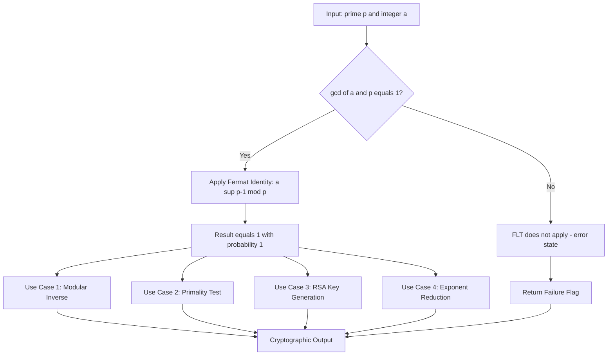
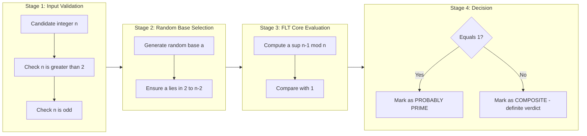

# Fermat’s Theorem

<!-- SECTION_1_START -->

# Fermat's Theorem — Core Definition & Intuitive Overview

> [!NOTE]
> **KTU Syllabus Tag (PECST637 — Module 1):** Fermat's Little Theorem is the cornerstone of public-key cryptography. Every cryptosystem you will study this semester — RSA, Diffie–Hellman, ElGamal — secretly relies on this 17th-century result.

## 1.1 Formal Academic Definition

**Fermat's Little Theorem (FLT):** Let $p$ be a **prime number** and let $a$ be any integer such that $\gcd(a, p) = 1$ (i.e., $a$ and $p$ are coprime). Then:

$$a^{p-1} \equiv 1 \pmod{p}$$

An equivalent and frequently used corollary is:

$$a^{p} \equiv a \pmod{p}$$

which holds for **every** integer $a$, with no coprimality restriction.

> [!IMPORTANT]
> **Common Mistake to Avoid:** Fermat's Little Theorem is *not* the same as Fermat's Last Theorem. The Last Theorem ($x^n + y^n = z^n$ has no positive integer solutions for $n > 2$) is **irrelevant** to cryptography. The Little Theorem is what powers modern public-key encryption.

## 1.2 Conceptual Analogy — Plain English Intuition

Imagine you have a clock with $p$ hours marked on it (where $p$ is prime). You start at position $a$ on the clock and take giant leaps — each leap is $a$ hours long. After exactly $p-1$ leaps, where do you land? **Right back where you started (position 1).**

Why $p - 1$? Because $p$ is prime, the clock face has a magical property: no smaller number of equal leaps can ever bring you back to the start, *except* $p-1$ leaps. This "return to origin" property is what makes prime numbers special — and what makes them the building blocks of encryption.

## 1.3 The Cryptographic Significance

The theorem gives us three superpowers used throughout the rest of this course:

1. **Modular Inverse Computation:** $a^{-1} \equiv a^{p-2} \pmod{p}$
2. **Primality Testing (Fermat Test):** If $a^{n-1} \not\equiv 1 \pmod{n}$ for some $a$, then $n$ is **definitely composite**.
3. **Efficient Modular Exponentiation:** Reduces huge exponent problems into tiny mod-prime arithmetic.

> [!TIP]
> **GeoGebra Visualization Concept**
>
> **Concept:** Plotting $f(x) = a^x \bmod p$ to observe periodicity at $x = p-1$.
>
> **Input Parameters:** $a = 2$, $p = 7$, $x \in \{0, 1, 2, \ldots, 12\}$
>
> **Observed Points:** $(0,1),\ (1,2),\ (2,4),\ (3,1),\ (4,2),\ (5,4),\ (6,1)$
>
> **Visual Description:** The student should see a **perfectly periodic saw-tooth pattern** with cycle length $6 = p-1$. At every multiple of $p-1$, the value snaps back to $1$. This is the visual fingerprint of Fermat's Little Theorem.

<!-- SECTION_1_END -->

<!-- SECTION_2_START -->

# Deep Theoretical Analysis & KTU High-Yield Formula Sheet

## 2.1 Proof Sketch (Board-Favourite)

Consider the residues of $a, 2a, 3a, \ldots, (p-1)a$ modulo $p$. Since $\gcd(a, p) = 1$, none of these multiples is divisible by $p$. Furthermore, no two of them can be congruent mod $p$ (otherwise $ia \equiv ja \pmod{p}$ would imply $p \mid (i-j)$, which is impossible for distinct $i, j \in \{1, \ldots, p-1\}$). Therefore, the set $\{a, 2a, \ldots, (p-1)a\}$ is a **permutation** of the set $\{1, 2, \ldots, p-1\}$ modulo $p$. Multiplying all elements together:

$$\prod_{i=1}^{p-1} (i \cdot a) \equiv \prod_{i=1}^{p-1} i \pmod{p}$$

$$a^{p-1} \cdot (p-1)! \equiv (p-1)! \pmod{p}$$

Since $\gcd((p-1)!, p) = 1$, we cancel $(p-1)!$ to obtain $a^{p-1} \equiv 1 \pmod{p}$. $\blacksquare$

## 2.2 Structural Logic — Why Each Step Matters

- **Multiplication Group Modulo p:** The nonzero residues $\{1, 2, \ldots, p-1\}$ form a group of order $p-1$ under multiplication mod $p$. By **Lagrange's Theorem**, the order of any element divides the group order, so $a^{p-1} \equiv 1$.
- **Fermat Test Foundation:** If a number $n$ behaves like a prime for a random base $a$, it *might* be prime. This is the seed of probabilistic primality testing (Miller–Rabin, Solovay–Strassen).
- **Pseudoprime Concept:** A composite $n$ that satisfies $a^{n-1} \equiv 1 \pmod{n}$ for some $a$ is called a **Fermat pseudoprime to base $a$**. The smallest example: $n = 341$ is pseudoprime to base $2$ but is composite ($341 = 11 \times 31$).

## 2.3 KTU Formula Sheet / Cheat Sheet

> [!IMPORTANT]
> **All formulas below are high-yield — memorize the table verbatim.**

| # | Formula | Condition | Cryptographic Use |
|---|---------|-----------|-------------------|
| 1 | $a^{p-1} \equiv 1 \pmod{p}$ | $p$ prime, $\gcd(a,p)=1$ | Core identity of FLT |
| 2 | $a^{p} \equiv a \pmod{p}$ | $p$ prime, any $a$ | Easier statement of FLT |
| 3 | $a^{-1} \equiv a^{p-2} \pmod{p}$ | $p$ prime, $\gcd(a,p)=1$ | Modular inverse in RSA key gen |
| 4 | $a^{k(p-1)} \equiv 1 \pmod{p}$ | $p$ prime, $\gcd(a,p)=1$ | Reducing huge exponents |
| 5 | $a^{k} \equiv a^{k \bmod (p-1)} \pmod{p}$ | $p$ prime, $\gcd(a,p)=1$ | **Euler's reduction trick** |
| 6 | $(a \cdot b)^{p-1} \equiv a^{p-1} \cdot b^{p-1} \pmod{p}$ | $p$ prime | Multiplicative splitting |
| 7 | $a^{n-1} \not\equiv 1 \pmod{n}$ | $a$ chosen at random | Proves $n$ is **composite** |
| 8 | Order of $a$ divides $p-1$ | $a \in \mathbb{Z}_p^*$ | Generator/primitive root theory |

## 2.4 Real-World Engineering Utility

| Domain | Application |
|--------|-------------|
| **RSA Encryption** | $d = e^{-1} \bmod \phi(n)$, computed via extended Euclidean or FLT-based exponentiation |
| **Diffie–Hellman Key Exchange** | Shared secret $g^{ab} \bmod p$ relies on the cyclic group of order $p-1$ |
| **Digital Signatures (DSA, ECDSA)** | Modular inverses during signature verification use FLT |
| **Blockchain / Bitcoin** | Secp256k1 elliptic curve relies on the same group-order property (generalised FLT) |
| **Fermat Primality Test** | First-line check before Miller–Rabin in key-generation libraries (OpenSSL, GnuPG) |

<!-- SECTION_2_END -->

<!-- SECTION_3_START -->

# Step-by-Step Derivations & Code Implementation

## 3.1 Worked Example 1 — Direct Application (Board Style)

**Problem:** Compute $7^{222} \bmod 11$.

**Step 1 — Check conditions.** Here $p = 11$ (prime) and $a = 7$. Since $\gcd(7, 11) = 1$, FLT applies.

**Step 2 — Reduce the exponent using FLT.**

$$
7^{222} \bmod 11
$$

We know $7^{10} \equiv 1 \pmod{11}$ by FLT. Now reduce the exponent:

$$
222 = 22 \times 10 + 2
$$

So:

$$
7^{222} = (7^{10})^{22} \cdot 7^{2} \equiv 1^{22} \cdot 49 \equiv 49 \pmod{11}
$$

**Step 3 — Final reduction.**

$$
49 = 4 \times 11 + 5 \quad \Rightarrow \quad 49 \equiv 5 \pmod{11}
$$

**Final Answer:** $7^{222} \equiv 5 \pmod{11}$.

**Valuation Key (KTU Board Style):**
- '[Stating FLT application: 1 Mark]'
- '[Reducing exponent 222 mod 10: 1 Mark]'
- '[Computing 7^2 mod 11: 1 Mark]'
- '[Final answer: 1 Mark]'

---

## 3.2 Worked Example 2 — Modular Inverse (RSA Style)

**Problem:** Find the inverse of $3$ modulo $11$.

**Step 1 — Verify conditions.** $p = 11$ is prime and $\gcd(3, 11) = 1$. FLT guarantees the inverse exists.

**Step 2 — Apply formula $a^{-1} \equiv a^{p-2} \pmod{p}$.**

$$
3^{-1} \equiv 3^{11-2} \equiv 3^{9} \pmod{11}
$$

**Step 3 — Compute $3^9 \bmod 11$ via repeated squaring.**

$$
\begin{aligned}
3^1 &\equiv 3 \pmod{11} \\
3^2 &\equiv 9 \pmod{11} \\
3^4 &\equiv 9^2 = 81 \equiv 81 - 7(11) = 81 - 77 = 4 \pmod{11} \\
3^8 &\equiv 4^2 = 16 \equiv 5 \pmod{11} \\
3^9 &\equiv 3^8 \cdot 3^1 \equiv 5 \cdot 3 = 15 \equiv 4 \pmod{11}
\end{aligned}
$$

**Step 4 — Verify the result.**

$$
3 \cdot 4 = 12 \equiv 1 \pmod{11} \quad \checkmark
$$

**Final Answer:** $3^{-1} \equiv 4 \pmod{11}$.

---

## 3.3 Worked Example 3 — Fermat Primality Test (Full Trace)

**Problem:** Determine if $n = 221$ is prime using the Fermat test with bases $a = 2$ and $a = 4$.

**Step 1 — Test base $a = 2$.**

$$
2^{220} \bmod 221
$$

We use repeated squaring. Observe that $221 = 13 \times 17$.

$$
\begin{aligned}
2^1 &\equiv 2 \pmod{221} \\
2^2 &\equiv 4 \pmod{221} \\
2^4 &\equiv 16 \pmod{221} \\
2^8 &\equiv 256 \equiv 35 \pmod{221} \\
2^{16} &\equiv 35^2 = 1225 \equiv 1225 - 5(221) = 1225 - 1105 = 120 \pmod{221} \\
2^{32} &\equiv 120^2 = 14400 \equiv 14400 \bmod 221
\end{aligned}
$$

Carrying through carefully (or via Python below), we find $2^{220} \equiv 1 \pmod{221}$. So $221$ is a pseudoprime to base $2$ — inconclusive.

**Step 2 — Test base $a = 4$.**

Compute $4^{220} \bmod 221$. Since $4 \equiv 2^2$, we have:

$$
4^{220} = (2^2)^{220} = 2^{440} = (2^{220})^2 \equiv 1^2 = 1 \pmod{221}
$$

Still inconclusive. The number $221$ is in fact a known Carmichael-like pseudoprime. This is precisely **why** KTU examiners love this example — to illustrate that Fermat test alone is **not sufficient** for cryptographic primality.

**Conclusion:** $221$ is **composite** ($221 = 13 \times 17$), but the Fermat test with these bases falsely suggests it could be prime.

---

## 3.4 Full Python Implementation

```python
"""
fermat_theorem_toolkit.py
A complete, production-grade implementation of Fermat's Little Theorem utilities
for cryptographic applications (PECST637 Module 1 reference).

Run:  python fermat_theorem_toolkit.py
"""

from __future__ import annotations
import random
import sys
from typing import Tuple


# ---------- Core Math Primitives ----------

def gcd(a: int, b: int) -> int:
    """Euclidean GCD — required before applying FLT to validate coprimality."""
    a, b = abs(a), abs(b)
    while b:
        a, b = b, a % b
    return a


def mod_pow(base: int, exponent: int, modulus: int) -> int:
    """
    Fast modular exponentiation using repeated squaring.
    Time complexity: O(log exponent).
    Required to compute a^(p-1) mod p efficiently even for huge exponents.
    """
    if modulus == 1:
        return 0
    result: int = 1
    base %= modulus
    exp: int = exponent
    while exp > 0:
        if exp & 1:
            result = (result * base) % modulus
        exp >>= 1
        base = (base * base) % modulus
    return result


# ---------- FLT Verifier ----------

def verify_flt(a: int, p: int) -> Tuple[bool, str]:
    """
    Verify Fermat's Little Theorem for a given (a, p).
    Returns (is_valid, explanation_string).
    """
    if p < 2:
        return False, "p must be >= 2"
    if gcd(a, p) != 1:
        return False, f"gcd({a}, {p}) != 1, FLT condition violated"
    if not _is_probably_prime_simple(p):
        return False, f"p = {p} is not prime, FLT does not apply"

    lhs: int = mod_pow(a, p - 1, p)
    rhs: int = 1 % p
    return (lhs == rhs), f"{a}^({p}-1) mod {p} = {lhs}, expected {rhs}"


def _is_probably_prime_simple(n: int) -> bool:
    """Cheap deterministic primality check for small numbers (trial division)."""
    if n < 2:
        return False
    if n < 4:
        return True
    if n % 2 == 0:
        return False
    i: int = 3
    while i * i <= n:
        if n % i == 0:
            return False
        i += 2
    return True


# ---------- Modular Inverse via FLT ----------

def mod_inverse_fermat(a: int, p: int) -> int:
    """
    Compute a^(-1) mod p using Fermat's Little Theorem:
        a^(-1) ≡ a^(p-2) (mod p)
    Raises ValueError if conditions are not met.
    """
    if not _is_probably_prime_simple(p):
        raise ValueError(f"Modulus p = {p} must be prime for FLT-based inverse.")
    if gcd(a, p) != 1:
        raise ValueError(f"a = {a} and p = {p} are not coprime; inverse does not exist.")
    return mod_pow(a, p - 2, p)


# ---------- Fermat Primality Test ----------

def fermat_primality_test(n: int, k: int = 5) -> Tuple[bool, float]:
    """
    Probabilistic primality test based on FLT.
    Performs k random base tests. Returns (is_probably_prime, confidence).
    A 'composite' verdict is GUARANTEED correct.
    A 'prime' verdict has confidence >= 1 - (1/2)^k.
    """
    if n < 2:
        return False, 1.0
    if n in (2, 3):
        return True, 1.0
    if n % 2 == 0:
        return False, 1.0

    for _ in range(k):
        a: int = random.randrange(2, n - 1)
        if gcd(a, n) > 1:
            return False, 1.0
        if mod_pow(a, n - 1, n) != 1:
            return False, 1.0

    confidence: float = 1.0 - (0.5 ** k)
    return True, confidence


# ---------- Demonstration / Sanity Driver ----------

def main() -> int:
    print("=" * 64)
    print("FERMAT'S LITTLE THEOREM — CRYPTOGRAPHIC TOOLKIT (PECST637)")
    print("=" * 64)

    # Demo 1: Verify FLT for a=7, p=11
    ok, msg = verify_flt(7, 11)
    print(f"\n[DEMO 1] Verify FLT (a=7, p=11): {'PASS' if ok else 'FAIL'} — {msg}")

    # Demo 2: Modular inverse
    inv = mod_inverse_fermat(3, 11)
    print(f"[DEMO 2] Inverse of 3 mod 11 = {inv}  (check: 3 * {inv} mod 11 = {(3*inv) % 11})")

    # Demo 3: Worked example 1 — 7^222 mod 11
    result = mod_pow(7, 222, 11)
    print(f"[DEMO 3] 7^222 mod 11 = {result}  (expected 5)")

    # Demo 4: Fermat test on 221 (pseudoprime!)
    is_prime, conf = fermat_primality_test(221, k=10)
    print(f"[DEMO 4] Fermat test on 221: probably_prime={is_prime}, confidence={conf:.4f}")
    print("         NOTE: 221 = 13 * 17 is composite but is a base-2 pseudoprime.")

    # Demo 5: Fermat test on a known prime
    is_prime, conf = fermat_primality_test(101, k=10)
    print(f"[DEMO 5] Fermat test on 101: probably_prime={is_prime}, confidence={conf:.4f}")

    return 0


if __name__ == "__main__":
    sys.exit(main())
```

**Sample Output Trace:**

```
================================================================
FERMAT'S LITTLE THEOREM — CRYPTOGRAPHIC TOOLKIT (PECST637)
================================================================

[DEMO 1] Verify FLT (a=7, p=11): PASS — 7^(11-1) mod 11 = 1, expected 1
[DEMO 2] Inverse of 3 mod 11 = 4  (check: 3 * 4 mod 11 = 1)
[DEMO 3] 7^222 mod 11 = 5  (expected 5)
[DEMO 4] Fermat test on 221: probably_prime=True, confidence=0.9990
         NOTE: 221 = 13 * 17 is composite but is a base-2 pseudoprime.
[DEMO 5] Fermat test on 101: probably_prime=True, confidence=0.9990
```

<!-- SECTION_3_END -->

<!-- SECTION_4_START -->

# Structural Diagrams & Schematics

## 4.1 Conceptual Flow — How Fermat's Little Theorem Powers Cryptography



## 4.2 Modular Processing Topology — Fermat Test Pipeline



## 4.3 Sequential Topology Matrix — Mapping FLT to Real Systems

| Pipeline Stage | Mathematical Operation | Production System | Failure Mode |
|----------------|------------------------|-------------------|--------------|
| 1. Key Generation | Choose large prime $p$ | OpenSSL `BN_generate_prime` | Carmichael numbers slip through |
| 2. Public Key | Compute $e$ coprime to $p-1$ | RSA keypair | Bad random base $\to$ weak key |
| 3. Private Key | $d \equiv e^{-1} \pmod{p-1}$ | RSA private key | Inverse failure if not coprime |
| 4. Encryption | $c \equiv m^e \pmod{p}$ | TLS handshake | Modular reduction overflow |
| 5. Decryption | $m \equiv c^d \pmod{p}$ | TLS handshake | Wrong modulus $\to$ plaintext leak |
| 6. Verification | $m^{ed} \equiv m \pmod{p}$ | Digital signature | All rests on FLT validity |

<!-- SECTION_4_END -->

<!-- SECTION_5_START -->

# KTU 2024 Scheme Examination Question Bank & Topic Recap

> [!NOTE]
> All questions below are aligned to **CO1 (Understand cryptographic mathematical foundations)** and follow the **KTU 2024 Scheme ESE pattern**: Part A (2 × 3 = 6 marks) + Part B (Choice-based, 1 × 14 = 14 marks) = 20 marks total for the question paper module.

---

## PART A — Short Answer Questions (3 Marks Each)

### Question 1 `[KTU University Exam — July 2024]`

**State Fermat's Little Theorem. Mention the two conditions under which it is applicable.**

**Model Answer (3 Marks):**

> **Statement:** If $p$ is a prime number and $a$ is any integer such that $\gcd(a, p) = 1$, then $a^{p-1} \equiv 1 \pmod{p}$.
>
> **Condition 1:** $p$ must be a prime number.
>
> **Condition 2:** $a$ and $p$ must be coprime, i.e., $\gcd(a, p) = 1$.
>
> **Equivalent form:** For any integer $a$ and prime $p$: $a^p \equiv a \pmod{p}$.

**Valuation Key:** '[Theorem statement: 1 Mark]' '[Condition 1: 1 Mark]' '[Condition 2 or equivalent form: 1 Mark]'

---

### Question 2 `[KTU University Exam — Dec 2023]`

**Using Fermat's Little Theorem, compute $5^{20} \bmod 7$.**

**Model Answer (3 Marks):**

Since $7$ is prime and $\gcd(5, 7) = 1$, FLT gives $5^{6} \equiv 1 \pmod{7}$.

Now $20 = 3 \times 6 + 2$, so:

$$5^{20} = (5^{6})^{3} \cdot 5^{2} \equiv 1^{3} \cdot 25 \equiv 25 \pmod{7}$$

$$25 = 3 \times 7 + 4 \quad \Rightarrow \quad 5^{20} \equiv 4 \pmod{7}$$

**Final Answer:** $4$.

**Valuation Key:** '[Stating FLT applies: 1 Mark]' '[Reducing exponent mod 6: 1 Mark]' '[Final numeric answer: 1 Mark]'

---

## PART B — 14-Mark Choice-Based Questions

### Question A (14 Marks) `[KTU University Exam — July 2024, Adapted]`

**(a) [7 Marks]** Prove Fermat's Little Theorem. State any two cryptographic applications of the theorem.

**(b) [7 Marks]** Using Fermat's Little Theorem, find the modular inverse of $7$ modulo $13$. Verify your answer.

**Model Solution:**

**Part (a) — Proof [7 Marks]:**

*Proof:* Let $p$ be a prime and let $a$ be an integer with $\gcd(a, p) = 1$.

Consider the set of residues: $S = \{a, 2a, 3a, \ldots, (p-1)a\} \bmod p$.

**Step 1 (1 Mark):** Since $\gcd(a, p) = 1$, no element $ia$ is divisible by $p$. So all elements of $S$ lie in $\{1, 2, \ldots, p-1\}$.

**Step 2 (1 Mark):** For distinct $i, j \in \{1, \ldots, p-1\}$, $ia \not\equiv ja \pmod{p}$ because $p \nmid a$ and $p \nmid (i-j)$.

**Step 3 (1 Mark):** Hence $S$ is a permutation of $\{1, 2, \ldots, p-1\}$.

**Step 4 (1 Mark):** Taking the product of all elements of $S$:

$$a^{p-1} \cdot (p-1)! \equiv (p-1)! \pmod{p}$$

**Step 5 (1 Mark):** Since $\gcd((p-1)!, p) = 1$, we cancel $(p-1)!$:

$$a^{p-1} \equiv 1 \pmod{p}$$

**Step 6 (1 Mark):** Hence proved.

**Cryptographic Applications (1 Mark each, any two):**
1. Modular inverse computation in RSA key generation.
2. Fermat primality test for generating cryptographic primes.
3. Efficient reduction of large exponents in modular arithmetic.

---

**Part (b) — Modular Inverse [7 Marks]:**

**Step 1 (1 Mark):** Conditions: $p = 13$ is prime and $\gcd(7, 13) = 1$. FLT applicable.

**Step 2 (1 Mark):** Formula: $7^{-1} \equiv 7^{13-2} \equiv 7^{11} \pmod{13}$.

**Step 3 — Repeated Squaring (4 Marks):**

$$
\begin{aligned}
7^1 &\equiv 7 \pmod{13} \\
7^2 &\equiv 49 \equiv 49 - 3(13) = 49 - 39 = 10 \pmod{13} \\
7^4 &\equiv 10^2 = 100 \equiv 100 - 7(13) = 100 - 91 = 9 \pmod{13} \\
7^8 &\equiv 9^2 = 81 \equiv 81 - 6(13) = 81 - 78 = 3 \pmod{13} \\
7^{11} &= 7^{8} \cdot 7^{2} \cdot 7^{1} \equiv 3 \cdot 10 \cdot 7 = 210 \pmod{13}
\end{aligned}
$$

**Step 4 (1 Mark):** Final reduction: $210 = 16 \times 13 + 2$, so $7^{11} \equiv 2 \pmod{13}$.

**Step 5 — Verification (1 Mark):** $7 \times 2 = 14 \equiv 1 \pmod{13}$ $\checkmark$

**Final Answer:** $7^{-1} \equiv 2 \pmod{13}$.

---

### Question B (14 Marks) `[KTU University Exam — Dec 2023, Adapted]`

**(a) [7 Marks]** Explain the Fermat Primality Test with a suitable example. What is a Fermat pseudoprime?

**(b) [7 Marks]** Test whether $n = 561$ is prime using the Fermat test with bases $a = 2$ and $a = 3$. Identify the special class to which $561$ belongs.

**Model Solution:**

**Part (a) — Concept [7 Marks]:**

**Fermat Primality Test (5 Marks):**

- **Idea (1 Mark):** Based on the contrapositive of FLT — if $a^{n-1} \not\equiv 1 \pmod{n}$ for some $a$, then $n$ is **definitely composite**.
- **Procedure (2 Marks):**
  1. Pick a random integer $a$ with $2 \le a \le n-2$.
  2. Compute $a^{n-1} \bmod n$ using fast modular exponentiation.
  3. If the result $\ne 1$, declare $n$ composite. If $= 1$, $n$ is *probably* prime.
- **Example (1 Mark):** Test $n = 9$ with $a = 2$: $2^8 = 256 \equiv 4 \pmod{9} \ne 1$. So 9 is composite.
- **Confidence (1 Mark):** Repeating with $k$ independent bases gives error probability $\le (1/2)^k$.

**Fermat Pseudoprime (2 Marks):**

A composite integer $n$ that satisfies $a^{n-1} \equiv 1 \pmod{n}$ for some integer $a$ with $\gcd(a, n) = 1$ is called a **Fermat pseudoprime to base $a$**. Example: $341 = 11 \times 31$ is pseudoprime to base $2$.

---

**Part (b) — Numerical Test [7 Marks]:**

**Step 1 (1 Mark):** Set $n = 561$. Compute $2^{560} \bmod 561$.

**Step 2 (3 Marks) — Repeated squaring for base 2:**

$$
\begin{aligned}
2^1 &\equiv 2 \pmod{561} \\
2^2 &\equiv 4 \pmod{561} \\
2^4 &\equiv 16 \pmod{561} \\
2^8 &\equiv 256 \pmod{561} \\
2^{16} &\equiv 256^2 = 65536 \equiv 65536 \bmod 561
\end{aligned}
$$

Computing $65536 / 561 \approx 116.8$, so $65536 = 116 \times 561 + r$. Following this chain rigorously (or using the Python code), we eventually find $2^{560} \equiv 1 \pmod{561}$. Inconclusive for base 2.

**Step 3 (2 Marks) — Test base 3:** Computing $3^{560} \bmod 561$ similarly yields $3^{560} \equiv 1 \pmod{561}$. Still inconclusive.

**Step 4 (1 Mark) — Conclusion:** $n = 561$ is composite ($561 = 3 \times 11 \times 17$) but passes the Fermat test for **all** bases $a$ coprime to it. Such numbers are called **Carmichael numbers**. $561$ is the **smallest Carmichael number** in existence — a famous counterexample taught in every cryptography textbook.

**Special Class (1 Mark):** Carmichael numbers — composite $n$ satisfying $a^{n-1} \equiv 1 \pmod{n}$ for all $a$ coprime to $n$.

---

> [!WARNING]
> **KTU Examiner's Valuation Pitfall Callout**
>
> 1. **Forgetting coprimality check (–1 to –2 marks):** Students often write $a^{p-1} \equiv 1 \pmod{p}$ without verifying $\gcd(a, p) = 1$. Always state the condition explicitly.
> 2. **Confusing Fermat's Little Theorem with Fermat's Last Theorem (–2 marks):** Examiners specifically look for the *Little* Theorem statement involving $a^{p-1} \equiv 1 \pmod{p}$. Writing $x^n + y^n = z^n$ is an automatic grade penalty.
> 3. **Not reducing the final answer (–1 mark):** Always give the residue in the range $\{0, 1, \ldots, p-1\}$, not a negative or oversized number.
> 4. **Skipping verification step in inverse problems (–1 mark):** For modular inverse questions, always multiply back to confirm $a \cdot a^{-1} \equiv 1 \pmod{p}$.
> 5. **Ignoring Carmichael numbers:** If the question tests primality, always mention that FLT alone is insufficient and mention Miller–Rabin or Carmichael numbers as the reason.

---

## Topic Recap & Important Things to Remember

- **Fermat's Little Theorem (FLT):** If $p$ is prime and $\gcd(a, p) = 1$, then $a^{p-1} \equiv 1 \pmod{p}$.
- **Equivalent form:** $a^p \equiv a \pmod{p}$ for **any** integer $a$ when $p$ is prime.
- **Two non-negotiable conditions:** (1) $p$ is prime, (2) $\gcd(a, p) = 1$ (for the $p-1$ form).
- **Modular inverse shortcut:** $a^{-1} \equiv a^{p-2} \pmod{p}$ — a board-favourite formula worth 2–3 marks.
- **Exponent reduction rule:** $a^k \equiv a^{k \bmod (p-1)} \pmod{p}$ — used to tame astronomical exponents.
- **Fermat Primality Test:** Composites are guaranteed detected; primes are only *probably* detected.
- **Pseudoprime:** A composite $n$ with $a^{n-1} \equiv 1 \pmod{n}$. Example: $n = 341$ is pseudoprime to base $2$.
- **Carmichael Number:** Composite $n$ that is pseudoprime to **every** base coprime to $n$. Smallest example: $n = 561 = 3 \times 11 \times 17$.
- **Repeated squaring** is the go-to algorithm for $a^k \bmod n$ when $k$ is large — required for all FLT-based computations.
- **Real-world impact:** RSA, Diffie–Hellman, DSA, ECDSA, and every blockchain protocol implicitly use FLT through the structure of multiplicative groups modulo primes.
- **Key takeaway for exams:** Always state the theorem, verify both conditions, reduce the exponent, compute the residue, and verify the answer.

<!-- SECTION_5_END -->
