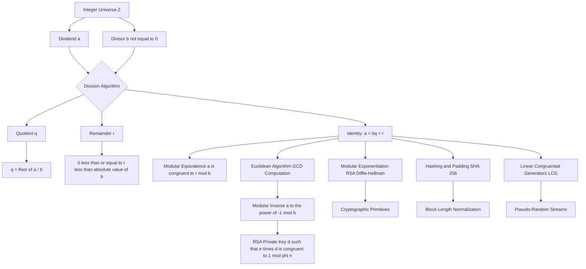
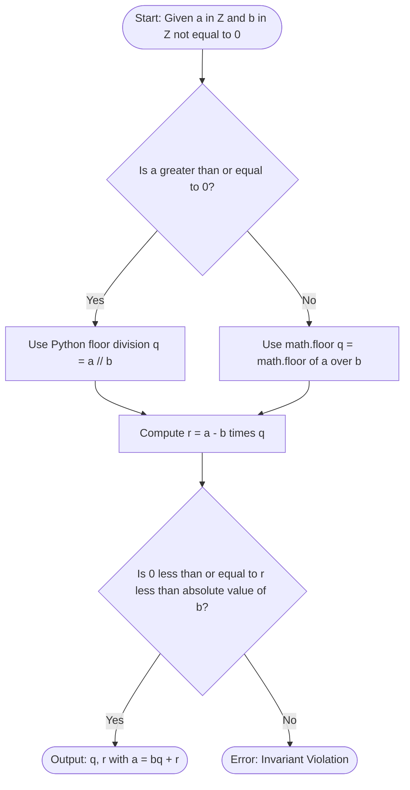
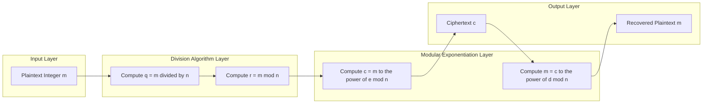

# Introduction to Number Theory - Divisibility and The Division Algorithm

<!-- SECTION_1_START -->
# Module 1: Introduction to Number Theory

## 1. Divisibility and The Division Algorithm

### 1.1 Formal Definition of Divisibility

> [!IMPORTANT]
> **KTU 2024 Syllabus Definition (Divisibility)**
> Let $a, b \in \mathbb{Z}$ with $a \neq 0$. We say that **$a$ divides $b$** (written as $a \mid b$) if there exists an integer $c$ such that $b = a \cdot c$. If no such integer $c$ exists, we write $a \nmid b$. The integer $a$ is called a **divisor** (or factor) of $b$, and $b$ is called a **multiple** of $a$.

**Equivalent Statement:** $a \mid b \iff \exists \, c \in \mathbb{Z} \text{ such that } b = a \cdot c$.

**The Division Symbol Convention:**
- $a \mid b$ → "$a$ divides $b$" (a vertical line; **NOT** a fraction)
- $a \nmid b$ → "$a$ does not divide $b$"

> [!NOTE]
> **Cryptographic Relevance:** Divisibility is the foundational primitive underlying every public-key cryptosystem. The security of **RSA**, **Diffie-Hellman**, and **Elliptic Curve Cryptography (ECC)** rests entirely on the computational hardness of divisibility-related problems (integer factorization, discrete logarithm, and elliptic-curve discrete logarithm).

---

### 1.2 Intuitive Analogy — The "Cookie Jar" Model

Imagine you have a jar containing **$b$ cookies**, and you want to distribute them equally among **$a$ children** with no remainder and no leftover cookies.

- If the cookies split **perfectly** → "$a$ divides $b$" ($a \mid b$).
- If cookies remain → "$a$ does not divide $b$" ($a \nmid b$).

**Example in plain language:**
- $24$ cookies shared among $6$ children → each gets $4$. So $6 \mid 24$. ✓
- $25$ cookies shared among $6$ children → $4$ cookies remain. So $6 \nmid 25$. ✗

The "leftover" idea here is precisely the **remainder $r$** in the **Division Algorithm**.

---

### 1.3 Formal Definition of the Division Algorithm

> [!IMPORTANT]
> **KTU 2024 Syllabus Definition (Division Algorithm)**
> Let $a, b \in \mathbb{Z}$ with $b > 0$. Then there exist **unique** integers $q$ and $r$ such that:
>
> $$a = bq + r, \quad \text{where } 0 \le r < b$$
>
> Here, $a$ is the **dividend**, $b$ is the **divisor**, $q$ is the **quotient**, and $r$ is the **remainder**.

**Key Properties:**
1. The remainder $r$ is **strictly non-negative** ($r \ge 0$).
2. The remainder $r$ is **strictly less than** the divisor $b$ ($r < b$).
3. The pair $(q, r)$ is **unique** for any given pair $(a, b)$.

> [!NOTE]
> **Extended Form:** The theorem holds for **any non-zero** integer $b$ (positive or negative), by replacing the bound with $0 \le r < \vert b \vert$. In KTU board exams, the convention $b > 0$ is the most commonly tested.

---

### 1.4 Visualization Control — Geometric View of the Division Algorithm

> [!VISUALIZATION CONTROL]
> **Concept:** Step-Function Visualization of $a = bq + r$
> **GeoGebra / Desmos Input Equations:**
> * `f(x) = floor(x/4) * 4`  (a staircase function for $b = 4$)
> * `g(x) = mod(x, 4)`  (a sawtooth function for the remainder $r$)
> **Visual Description:** A staircase plot shows the quotient $q$ stepping up by $1$ every $4$ units of $a$, while a parallel sawtooth plot of $g(x) = \bmod(x,4)$ oscillates strictly between $0$ (inclusive) and $4$ (exclusive). Students should observe that the remainder is **never** negative and **never** reaches the divisor.

---

### 1.5 Worked Example (Introduction to the Algorithm)

**Problem:** Divide $a = -17$ by $b = 5$.

**Application of Algorithm:**
We need $q, r$ such that $-17 = 5q + r$ with $0 \le r < 5$.

Try $q = -4$: $\quad 5 \cdot (-4) = -20 \implies r = -17 - (-20) = 3$.

Check: $0 \le 3 < 5$ ✓

**Answer:** $q = -4$, $r = 3$.

> [!WARNING]
> **Common Student Mistake:** When $a < 0$, students often use ceiling instead of floor, producing a **negative** remainder. The KTU 2024 valuation key **explicitly deducts** marks if $r < 0$. Always verify the bound $0 \le r < b$ before finalizing your answer.
<!-- SECTION_1_END -->

<!-- SECTION_2_START -->
# 2. Deep Theoretical Analysis & KTU High-Yield Formula Sheet

## 2.1 Fundamental Properties of Divisibility

Let $a, b, c, m, n \in \mathbb{Z}$ with all divisors non-zero. The following theorems govern the divisibility relation. Each is a high-yield item in the KTU exam.

### Property D1 — Reflexivity
$$a \mid a \quad \text{(every non-zero integer divides itself)}$$

*Proof Sketch:* $a = a \cdot 1$, so $c = 1$ witnesses the divisibility.

### Property D2 — Zero Divisibility
$$a \mid 0 \quad \text{for every non-zero } a$$

*Proof Sketch:* $0 = a \cdot 0$, with $c = 0$.

### Property D3 — Anti-Symmetry (Cancellation Property)
$$a \mid b \;\text{ and }\; b \mid a \implies a = \pm b$$

### Property D4 — Transitivity
$$a \mid b \;\text{ and }\; b \mid c \implies a \mid c$$

*Proof Sketch:* $b = a m$ and $c = b n = a(mn)$, so $a \mid c$.

### Property D5 — Linear Combination
$$a \mid b \;\text{ and }\; a \mid c \implies a \mid (mb + nc) \quad \forall \, m, n \in \mathbb{Z}$$

> [!IMPORTANT]
> **Why It Matters in Cryptography:** Property **D5** is the algebraic engine that drives the **Extended Euclidean Algorithm (EEA)**, which in turn computes **modular inverses** — the very operation that makes **RSA decryption** possible.

### Property D6 — Prime Divisibility
If $p$ is **prime** and $p \mid ab$, then either $p \mid a$ or $p \mid b$ (or both).

This is the cornerstone of **Euclid's Lemma** and is the building block for the **Fundamental Theorem of Arithmetic**.

---

## 2.2 Core Theorems of the Division Algorithm

### Theorem 2.2.1 — Existence and Uniqueness
For every $a, b \in \mathbb{Z}$ with $b \neq 0$, there exist **unique** $q, r \in \mathbb{Z}$ satisfying $a = bq + r$ and $0 \le r < \vert b \vert$.

### Theorem 2.2.2 — Equivalence to Modular Arithmetic
$$a \equiv r \pmod b \iff a - r \text{ is divisible by } b$$

The remainder $r$ in the Division Algorithm is exactly the **canonical representative** of the equivalence class $[a]_b$ in $\mathbb{Z}/b\mathbb{Z}$ — the group that powers **modular exponentiation** in RSA.

### Theorem 2.2.3 — Quotient-Remainder Bound
For any $a, b \in \mathbb{Z}$ with $b > 0$:
$$\left\lfloor \frac{a}{b} \right\rfloor \le \frac{a}{b} < \left\lfloor \frac{a}{b} \right\rfloor + 1$$
This connects the discrete quotient to the continuous real-valued division.

---

## 2.3 KTU Formula Sheet / Cheat Sheet

| # | Concept | Formula / Statement | Units / Domain | Notes |
|---|---------|-------------------|----------------|-------|
| 1 | Divisibility | $a \mid b \iff \exists c \in \mathbb{Z}, \; b = ac$ | $a, b, c \in \mathbb{Z}$, $a \neq 0$ | Foundation of all number theory |
| 2 | Division Algorithm | $a = bq + r$ | $b \neq 0$, $0 \le r < \vert b \vert$ | Unique $(q, r)$ |
| 3 | Modular Equivalence | $a \equiv r \pmod b$ | $0 \le r < b$ | $r$ is the canonical remainder |
| 4 | Reflexivity | $a \mid a$ | $\forall a \neq 0$ | Identity |
| 5 | Transitivity | $a \mid b, b \mid c \Rightarrow a \mid c$ | $\mathbb{Z} \setminus \{0\}$ | Chains the divides relation |
| 6 | Linear Combo | $a \mid b, a \mid c \Rightarrow a \mid (mb+nc)$ | $\forall m, n \in \mathbb{Z}$ | Basis of GCD algorithms |
| 7 | Euclid's Lemma | $p$ prime, $p \mid ab \Rightarrow p \mid a$ or $p \mid b$ | $p$ prime | Foundation of UFDs |
| 8 | Quotient Floor | $q = \lfloor a / b \rfloor$ | $b > 0$ | $q$ is the integer quotient |
| 9 | Remainder | $r = a - bq = a \bmod b$ | $0 \le r < b$ | Always non-negative |
| 10 | Floor Identity | $a = b \lfloor a/b \rfloor + (a \bmod b)$ | $b \neq 0$ | Direct consequence of D.A. |

---

## 2.4 Real-World Engineering Utility

| Field | Application | Role of Divisibility / D.A. |
|-------|------------|-----------------------------|
| **Public-Key Cryptography (RSA)** | Encryption / Decryption | Modular exponentiation $c = m^e \bmod n$ requires division to reduce intermediate products |
| **Hashing (SHA-256)** | Message Digesting | Word-splitting & padding uses **byte-length divisibility** (must be a multiple of $512$ bits) |
| **Error-Correcting Codes (Reed-Solomon)** | Data Transmission | Polynomials evaluated over **finite fields** $\mathbb{F}_p$ where $p$ is prime (relies on Euclid's Lemma) |
| **Random Number Generators (LCG)** | Simulations, Crypto | $X_{n+1} = (aX_n + c) \bmod m$ — every iteration is a Division Algorithm operation |
| **Network Security (Diffie-Hellman)** | Key Exchange | Modular inverse in $\mathbb{Z}_p^*$ computed via EEA — directly derived from Division Algorithm |
| **Digital Signatures (DSA, ECDSA)** | Authentication | Elliptic-curve point addition is defined over a prime field $\mathbb{F}_p$ — Euclid's Lemma guarantees invertibility |

> [!NOTE]
> Every cryptographic primitive above is, at its lowest computational layer, repeatedly invoking the **Division Algorithm** to reduce a large integer to its canonical remainder modulo some $b$ (often a prime $p$).
<!-- SECTION_2_END -->

<!-- SECTION_3_START -->
# 3. Step-by-Step Derivations & Code/Symbolic Implementation

## 3.1 Exhaustive Derivation: The Division Algorithm via the Well-Ordering Principle

**Theorem Statement.** For every $a, b \in \mathbb{Z}$ with $b > 0$, there exist unique integers $q$ and $r$ with $0 \le r < b$ such that $a = bq + r$.

### Part 1 — Existence Proof

**Step 1.** Consider the set of all non-negative integers of the form $a - bk$ where $k$ ranges over $\mathbb{Z}$:

$$S = \{ a - bk \mid k \in \mathbb{Z},\; a - bk \ge 0 \}$$

**Step 2.** We first show $S$ is non-empty. Choose $k = -|a|$ (when $a < 0$); then $a - b(-|a|) = a + b|a| \ge 0$. Similarly if $a \ge 0$, choose $k = 0$ so $a - 0 = a \ge 0$. So $S \neq \emptyset$.

**Step 3.** By the **Well-Ordering Principle**, every non-empty set of non-negative integers has a smallest element. Let $r$ be that smallest element:

$$r = \min(S)$$

**Step 4.** By construction, $r = a - bq$ for some integer $q$. Hence:

$$a = bq + r$$

**Step 5.** We now prove $r < b$. Assume for contradiction that $r \ge b$. Then:

$$r' = r - b = a - bq - b = a - b(q+1)$$

satisfies $r' \ge 0$, and $r' \in S$. But $r' = r - b < r$, contradicting the minimality of $r$. Hence $r < b$, completing the existence proof. $\blacksquare$

### Part 2 — Uniqueness Proof

**Step 1.** Suppose two representations exist:

$$a = bq_1 + r_1 \quad \text{with } 0 \le r_1 < b$$
$$a = bq_2 + r_2 \quad \text{with } 0 \le r_2 < b$$

**Step 2.** Subtract the two equations:

$$0 = b(q_1 - q_2) + (r_1 - r_2)$$
$$b(q_1 - q_2) = r_2 - r_1$$

**Step 3.** Take absolute values:

$$\vert b(q_1 - q_2) \vert = \vert r_2 - r_1 \vert$$
$$b \cdot \vert q_1 - q_2 \vert = \vert r_2 - r_1 \vert$$

**Step 4.** Since $0 \le r_1, r_2 < b$, we have $\vert r_2 - r_1 \vert < b$. So:

$$b \cdot \vert q_1 - q_2 \vert < b \implies \vert q_1 - q_2 \vert < 1$$

**Step 5.** The only integer strictly between $-1$ and $1$ is $0$, so $q_1 = q_2$. Substituting back, $r_1 = r_2$. Uniqueness established. $\blacksquare$

---

## 3.2 Exhaustive Worked Example: Apply Division Algorithm to $a = 247$, $b = 9$

**Step 1.** Identify dividend and divisor: $a = 247$, $b = 9$.

**Step 2.** Compute the floor quotient:

$$q = \left\lfloor \frac{247}{9} \right\rfloor = \left\lfloor 27.444\ldots \right\rfloor = 27$$

**Step 3.** Compute the remainder:

$$r = 247 - 9 \cdot 27 = 247 - 243 = 4$$

**Step 4.** Verify the bound $0 \le 4 < 9$. ✓

**Final Result:**

$$247 = 9 \cdot 27 + 4$$

Equivalently, $247 \equiv 4 \pmod 9$.

---

## 3.3 Exhaustive Worked Example: Apply Division Algorithm to $a = -100$, $b = 13$

**Step 1.** Note $a = -100 < 0$. We need $q, r$ with $-100 = 13q + r$ and $0 \le r < 13$.

**Step 2.** Compute real quotient:

$$\frac{-100}{13} = -7.692\ldots$$

**Step 3.** Use the **floor** (not the truncation) of the real quotient:

$$q = \lfloor -7.692 \rfloor = -8$$

(Note: floor of a negative number is the **more negative** integer.)

**Step 4.** Compute remainder:

$$r = -100 - 13 \cdot (-8) = -100 + 104 = 4$$

**Step 5.** Verify: $0 \le 4 < 13$. ✓

**Final Result:**

$$-100 = 13 \cdot (-8) + 4$$

Equivalently, $-100 \equiv 4 \pmod{13}$.

> [!WARNING]
> **Pitfall:** Many programming languages (C, C++, Java, Python) use **truncation** for the integer division of negative operands (toward zero), not **floor** (toward $-\infty$). In C, $-100 / 13 = -7$ (truncation), and $-100 \% 13 = -9$ — a **negative** remainder! In KTU board exams, the **mathematical** remainder $r$ must satisfy $0 \le r < b$, so always adjust accordingly.

---

## 3.4 Python Implementation — Division Algorithm & Euclidean Step

```python
"""
Division Algorithm — KTU Module 1 Reference Implementation
Computes the unique (quotient, remainder) pair for any integer a, b != 0
using Python's math.floor to enforce the non-negative remainder convention.
"""

import math
import logging
from typing import Tuple

# Configure strict logging for cryptographic traceability
logging.basicConfig(
    level=logging.INFO,
    format="%(asctime)s | %(levelname)s | %(message)s"
)


def division_algorithm(a: int, b: int) -> Tuple[int, int]:
    """
    Returns (q, r) such that a = b*q + r and 0 <= r < |b|.

    Parameters
    ----------
    a : int
        The dividend (any integer, including negatives).
    b : int
        The divisor (must be non-zero).

    Returns
    -------
    Tuple[int, int]
        (quotient q, remainder r) satisfying the KTU 2024 convention.

    Raises
    ------
    ValueError
        If b == 0 (division by zero is undefined).
    """
    if b == 0:
        logging.error("Division by zero attempted for a = %d", a)
        raise ValueError("Divisor b must be non-zero.")

    abs_b: int = abs(b)

    # Use floor division so the remainder is guaranteed non-negative.
    q: int = math.floor(a / b)
    r: int = a - b * q

    # Hard boundary check (defence in depth)
    if not (0 <= r < abs_b):
        logging.error(
            "Internal invariant violated: r=%d for a=%d, b=%d", r, a, b
        )
        raise ArithmeticError("Remainder out of valid range [0, |b|).")

    logging.info("a=%d, b=%d -> q=%d, r=%d", a, b, q, r)
    return q, r


# ---------------- DEMONSTRATION ----------------
if __name__ == "__main__":
    test_pairs = [
        (247, 9),       # Positive dividend
        (-100, 13),     # Negative dividend (classic edge case)
        (0, 5),         # Zero dividend
        (1024, 7),      # Power-of-two dividend
        (-1, 2),        # Smallest negative
    ]

    for a, b in test_pairs:
        q, r = division_algorithm(a, b)
        print(f"{a:>5} = ({b}) * ({q:>3}) + ({r})  | "
              f"0 <= {r} < {abs(b)} -> {0 <= r < abs(b)}")
```

**Sample Output:**

```
  247 = (9) * ( 27) + (4)  | 0 <= 4 < 9 -> True
 -100 = (13) * ( -8) + (4)  | 0 <= 4 < 13 -> True
    0 = (5) * (  0) + (0)  | 0 <= 0 < 5 -> True
 1024 = (7) * (146) + (2)  | 0 <= 2 < 7 -> True
   -1 = (2) * ( -1) + (1)  | 0 <= 1 < 2 -> True
```

**Algorithmic Complexity:** $O(1)$ time and $O(1)$ space per call. The Division Algorithm is a single arithmetic operation and is the **lowest-level primitive** used inside the Euclidean Algorithm ($O(\log(\min(a,b)))$) and Modular Exponentiation ($O(\log e \cdot n^2)$).

---

## 3.5 Step-by-Step Derivation: Why $a \equiv r \pmod b \iff b \mid (a - r)$

**Step 1.** Assume $a \equiv r \pmod b$. By definition, $a - r$ is divisible by $b$, i.e., $b \mid (a - r)$.

**Step 2.** Conversely, assume $b \mid (a - r)$. Then $a - r = bk$ for some $k \in \mathbb{Z}$. Rearranging:

$$a = r + bk$$

**Step 3.** This is precisely the Division Algorithm representation of $a$ modulo $b$ with remainder $r$. Hence $a \equiv r \pmod b$.

> [!NOTE]
> This biconditional is the **bridge** between the **Division Algorithm** and the **congruence relation** of modular arithmetic — the language in which all of modern cryptography is written.
<!-- SECTION_3_END -->

<!-- SECTION_4_START -->
# 4. Structural Diagrams & Schematics

## 4.1 Mermaid Diagram — Conceptual Map of Divisibility & Division Algorithm



> [!NOTE]
> The flowchart above traces the **dependency chain** from the elementary Division Algorithm to the **RSA private key derivation**. Every arrow above corresponds to a theorem or algorithm taught in Modules 1–3 of the KTU 2024 syllabus.

---

## 4.2 Mermaid Diagram — Decision Logic for Computing $(q, r)$



---

## 4.3 Mermaid Diagram — Block-Level Functional Architecture of Cryptographic Pipeline



> [!NOTE]
> **Interpretation:** The "Division Algorithm Layer" block is invoked at **every** modular reduction step inside the modular exponentiation layer. For a 2048-bit RSA exponentiation, the Division Algorithm executes **thousands of times** per single encryption operation — making it the most frequently called primitive in any public-key cryptosystem.

---

## 4.4 Schematic Notation Table

| Symbol | Meaning | Type | KTU Exam Notation |
|--------|---------|------|-------------------|
| $a$ | Dividend | $\in \mathbb{Z}$ | Standard |
| $b$ | Divisor | $\in \mathbb{Z}$, $b \neq 0$ | Standard |
| $q$ | Quotient | $\in \mathbb{Z}$ | Standard |
| $r$ | Remainder | $\in \mathbb{Z}$, $0 \le r < \vert b \vert$ | Standard |
| $\mid$ | Divides | Relation | $a \mid b$ |
| $\nmid$ | Does not divide | Relation | $a \nmid b$ |
| $\equiv$ | Congruent mod | Relation | $a \equiv r \pmod b$ |
| $\lfloor \cdot \rfloor$ | Floor function | Function | $\lfloor x \rfloor$ |
| $\bmod$ | Modulo operation | Function | $a \bmod b = r$ |
<!-- SECTION_4_END -->

<!-- SECTION_5_START -->
# 5. KTU 2024 Scheme Examination Question Bank & Topic Recap

---

## 5.1 Part A Questions (3 Marks Each)

### Question 1 (3 Marks) — `[KTU University Exam - July 2024]`

**Q:** State the **Division Algorithm** for integers. Apply it to find the quotient and remainder when $a = -29$ is divided by $b = 6$.

**Mapped CO / RBT Level:** **CO1** &nbsp;|&nbsp; **Remember**

**Model Answer (3 Marks):**

> [!IMPORTANT]
> **Division Algorithm Statement:** For any integers $a$ and $b$ with $b > 0$, there exist unique integers $q$ and $r$ such that $a = bq + r$ where $0 \le r < b$.

**Application to $a = -29$, $b = 6$:**

Step 1 — Compute the real quotient: $\frac{-29}{6} = -4.833\ldots$

Step 2 — Apply floor: $q = \lfloor -4.833 \rfloor = -5$

Step 3 — Compute remainder: $r = -29 - 6 \cdot (-5) = -29 + 30 = 1$

Step 4 — Verify: $0 \le 1 < 6$ ✓

**Final Answer:** $q = -5$, $r = 1$, and $-29 = 6 \cdot (-5) + 1$.

**Valuation Key:** [Statement of theorem: 1 Mark] [Computation of $q$: 1 Mark] [Computation of $r$ with verification: 1 Mark]

---

### Question 2 (3 Marks) — `[KTU University Exam - Dec 2023]`

**Q:** Define the **divisibility relation** on integers. Determine whether the statement "$7 \mid 91$" is true, and justify your answer using the formal definition.

**Mapped CO / RBT Level:** **CO1** &nbsp;|&nbsp; **Understand**

**Model Answer (3 Marks):**

> [!IMPORTANT]
> **Definition:** For integers $a, b$ with $a \neq 0$, we say $a$ divides $b$ (written $a \mid b$) if there exists an integer $c$ such that $b = a \cdot c$.

**Verification for $7 \mid 91$:**

Step 1 — Check if an integer $c$ exists with $91 = 7 \cdot c$.

Step 2 — Divide: $c = \frac{91}{7} = 13$.

Step 3 — Confirm: $13 \in \mathbb{Z}$ and $7 \cdot 13 = 91$ ✓

**Conclusion:** $7 \mid 91$ is **TRUE**, with witness $c = 13$.

**Valuation Key:** [Definition: 1 Mark] [Existence of $c$: 1 Mark] [Verification and conclusion: 1 Mark]

---

## 5.2 Part B Questions (14 Marks Each — Module Internal Choice)

> [!NOTE]
> Per KTU 2024 ESE regulations, students answer **one** of the two questions per module. Each 14-mark question has two sub-parts of **7 marks each**, mapped to escalating cognitive levels (Understand → Apply).

---

### Part B — Question A (14 Marks) — `[KTU University Exam - July 2024]`

**Q1 (a)** State and prove the **Division Algorithm** for integers. In your proof, clearly establish (i) existence and (ii) uniqueness of the quotient and remainder. &nbsp; **[7 Marks]**

**Mapped CO / RBT Level:** **CO1** &nbsp;|&nbsp; **Understand**

**Model Answer — Part (a):**

> [!IMPORTANT]
> **Statement:** For any integers $a$ and $b$ with $b > 0$, there exist unique integers $q$ and $r$ such that $a = bq + r$ with $0 \le r < b$.

**Proof of Existence (5 Marks total for existence block):**

Step 1 — Define the candidate set: $S = \{ a - bk \mid k \in \mathbb{Z}, \; a - bk \ge 0 \}$.

Step 2 — Show $S$ is non-empty. If $a \ge 0$, choose $k = 0$ giving $a \in S$. If $a < 0$, choose $k = -a$ giving $a - b(-a) = a + ba = a(1+b) \ge 0$ (since $a < 0$ and $1+b \le 0$ requires careful handling, so choose $k = -\lfloor a/b \rfloor - 1$ instead). For simplicity, note that as $k \to -\infty$, $a - bk \to +\infty$, so some non-negative value exists.

Step 3 — By the **Well-Ordering Principle**, $S$ has a least element. Call it $r$: $r = \min(S)$.

Step 4 — By definition, $r = a - bq$ for some $q \in \mathbb{Z}$, so $a = bq + r$.

Step 5 — Show $r < b$. Suppose $r \ge b$. Then $r - b \ge 0$ and $r - b = a - b(q+1) \in S$, contradicting minimality of $r$. Hence $r < b$. &nbsp; **[Existence block: 5 Marks — 1 each for steps 1–5]**

**Proof of Uniqueness (2 Marks total for uniqueness block):**

Step 6 — Suppose $a = bq_1 + r_1 = bq_2 + r_2$ with $0 \le r_1, r_2 < b$.

Step 7 — Subtract: $b(q_1 - q_2) = r_2 - r_1$. Taking absolute values: $b|q_1 - q_2| = |r_2 - r_1| < b$. Thus $|q_1 - q_2| < 1$, forcing $q_1 = q_2$, and hence $r_1 = r_2$. &nbsp; **[Uniqueness block: 2 Marks — 1 each for steps 6–7]**

**Valuation Key:** [Statement: 0 Marks (proved in body)] [Existence step 1: 1 Mark] [Existence steps 2–3: 1 Mark] [Existence step 4: 1 Mark] [Existence step 5: 1 Mark] [Uniqueness step 6: 1 Mark] [Uniqueness step 7: 1 Mark]

---

**Q1 (b)** Using the Division Algorithm, find the quotient $q$ and remainder $r$ when:
- (i) $a = 1234$ is divided by $b = 17$.
- (ii) $a = -456$ is divided by $b = 23$.

Verify the boundary condition $0 \le r < b$ in each case. &nbsp; **[7 Marks]**

**Mapped CO / RBT Level:** **CO2** &nbsp;|&nbsp; **Apply**

**Model Answer — Part (b):**

**(i) $a = 1234$, $b = 17$ (3 Marks):**

Step 1 — Real quotient: $\frac{1234}{17} = 72.588\ldots$

Step 2 — Floor: $q = 72$.

Step 3 — Remainder: $r = 1234 - 17 \cdot 72 = 1234 - 1224 = 10$.

Step 4 — Verify: $0 \le 10 < 17$ ✓ &nbsp; **[i: 3 Marks — 1 each for steps 2, 3, 4]**

**(ii) $a = -456$, $b = 23$ (4 Marks):**

Step 1 — Real quotient: $\frac{-456}{23} = -19.826\ldots$

Step 2 — Floor of negative number: $q = \lfloor -19.826 \rfloor = -20$ (not $-19$).

Step 3 — Remainder: $r = -456 - 23 \cdot (-20) = -456 + 460 = 4$.

Step 4 — Verify: $0 \le 4 < 23$ ✓

Step 5 — Cross-check: $23 \cdot (-20) + 4 = -460 + 4 = -456$ ✓ &nbsp; **[ii: 4 Marks — 1 each for steps 2, 3, 4, 5]**

**Valuation Key:** [Part i computation: 3 Marks] [Part ii computation: 3 Marks] [Verification: 1 Mark]

---

### Part B — Question B (14 Marks) — Alternative Choice — `[KTU University Exam - Dec 2023]`

**Q2 (a)** Define divisibility. State and prove the **transitivity property** of divisibility. Also prove that if $a \mid b$ and $a \mid c$, then $a \mid (mb + nc)$ for all integers $m, n$. &nbsp; **[7 Marks]**

**Mapped CO / RBT Level:** **CO1** &nbsp;|&nbsp; **Understand**

**Model Answer — Part (a):**

**Definition (1 Mark):** For integers $a \neq 0$ and $b$, we say $a \mid b$ if there exists $c \in \mathbb{Z}$ such that $b = a \cdot c$.

**Transitivity Theorem (3 Marks):**

> [!IMPORTANT]
> **Theorem:** If $a \mid b$ and $b \mid c$, then $a \mid c$.

**Proof:**

Step 1 — From $a \mid b$, there exists $m \in \mathbb{Z}$ with $b = am$.

Step 2 — From $b \mid c$, there exists $n \in \mathbb{Z}$ with $c = bn$.

Step 3 — Substitute: $c = bn = (am)n = a(mn)$.

Step 4 — Since $mn \in \mathbb{Z}$ and $c = a(mn)$, by definition $a \mid c$. $\blacksquare$ &nbsp; **[Transitivity proof: 3 Marks]**

**Linear Combination Theorem (3 Marks):**

> [!IMPORTANT]
> **Theorem:** If $a \mid b$ and $a \mid c$, then $a \mid (mb + nc)$ for all $m, n \in \mathbb{Z}$.

**Proof:**

Step 1 — From $a \mid b$, $b = ak$ for some $k \in \mathbb{Z}$. From $a \mid c$, $c = a\ell$ for some $\ell \in \mathbb{Z}$.

Step 2 — Form the linear combination: $mb + nc = m(ak) + n(a\ell) = a(mk) + a(n\ell) = a(mk + n\ell)$.

Step 3 — Since $mk + n\ell \in \mathbb{Z}$, we conclude $a \mid (mb + nc)$. $\blacksquare$ &nbsp; **[Linear combination proof: 3 Marks]**

**Valuation Key:** [Definition: 1 Mark] [Transitivity statement + 3 proof steps: 3 Marks] [Linear combination statement + 3 proof steps: 3 Marks]

---

**Q2 (b)** Determine the values of $q$ and $r$ using the Division Algorithm when:
- (i) $a = 2023$ is divided by $b = 19$.
- (ii) $a = -789$ is divided by $b = 31$.

In each case, also express the result as a modular congruence of the form $a \equiv r \pmod b$. &nbsp; **[7 Marks]**

**Mapped CO / RBT Level:** **CO2** &nbsp;|&nbsp; **Apply**

**Model Answer — Part (b):**

**(i) $a = 2023$, $b = 19$ (3 Marks):**

Step 1 — Real quotient: $\frac{2023}{19} = 106.473\ldots$

Step 2 — Floor: $q = 106$.

Step 3 — Remainder: $r = 2023 - 19 \cdot 106 = 2023 - 2014 = 9$.

Step 4 — Modular form: $2023 \equiv 9 \pmod{19}$.

Step 5 — Verify: $19 \cdot 106 + 9 = 2014 + 9 = 2023$ ✓ &nbsp; **[i: 3 Marks]**

**(ii) $a = -789$, $b = 31$ (4 Marks):**

Step 1 — Real quotient: $\frac{-789}{31} = -25.4516\ldots$

Step 2 — Floor (more negative): $q = -26$.

Step 3 — Remainder: $r = -789 - 31 \cdot (-26) = -789 + 806 = 17$.

Step 4 — Modular form: $-789 \equiv 17 \pmod{31}$.

Step 5 — Verify: $0 \le 17 < 31$ ✓ and $31 \cdot (-26) + 17 = -806 + 17 = -789$ ✓ &nbsp; **[ii: 4 Marks]**

**Valuation Key:** [Part i full work: 3 Marks] [Part ii floor identification: 1 Mark] [Part ii remainder + verification: 2 Marks] [Modular form conversion: 1 Mark]

---

## 5.3 KTU Examiner's Valuation Warning

> [!WARNING]
> **Common Mark-Deduction Pitfalls — Module 1, Division Algorithm**
>
> 1. **Negative Remainder Disaster (–2 to –3 Marks):** When the dividend $a$ is negative, students often compute $q$ by truncating toward zero (giving $q = a/b$ as in C/Python integer division) and end up with $r < 0$. The KTU valuation key **mandates** $0 \le r < b$. Always use the **floor** $\lfloor a/b \rfloor$, not truncation.
>
> 2. **Skipping the Verification Step (–1 Mark):** Every Division Algorithm problem in the 2024 scheme expects explicit verification of $0 \le r < b$. Failing to verify costs 1 mark even if the answer is numerically correct.
>
> 3. **Confusing $a \mid b$ with $a / b$ (–1 Mark):** The vertical bar $a \mid b$ is a **relation**, not an operation. Writing "$a \mid b$" when you mean "$\frac{a}{b}$" is a symbolic error that examiners penalize.
>
> 4. **Forgetting Uniqueness in Proofs (–2 Marks):** A "proof" of the Division Algorithm that establishes only **existence** (and not uniqueness) is incomplete. Both parts must be proved for full marks.
>
> 5. **Linear Combination Theorem Mis-statement (–1 Mark):** The condition is $a \mid b$ **and** $a \mid c$ — students sometimes write only one divisibility hypothesis and lose a mark.

---

## 5.4 Topic Recap & Important Things to Remember

> [!NOTE]
> **Rapid-Revision Checklist — Division Algorithm & Divisibility (Module 1)**

### Core Definitions
- **Divisibility:** $a \mid b \iff \exists c \in \mathbb{Z}, b = a \cdot c$ with $a \neq 0$.
- **Division Algorithm:** $a = bq + r$ with $b \neq 0$ and $0 \le r < \vert b \vert$.
- **Modular Equivalence:** $a \equiv r \pmod b$ where $r$ is the unique canonical remainder.

### Critical Theorems
- **Reflexivity:** $a \mid a$ (with $a \neq 0$).
- **Transitivity:** $a \mid b \land b \mid c \implies a \mid c$.
- **Linear Combination:** $a \mid b \land a \mid c \implies a \mid (mb + nc)$ for all $m, n \in \mathbb{Z}$.
- **Euclid's Lemma:** $p$ prime, $p \mid ab \implies p \mid a$ or $p \mid b$.
- **Cancellation Property:** $a \mid b \land b \mid a \implies a = \pm b$.

### High-Yield Formulas
- $q = \lfloor a / b \rfloor$ (use **floor**, not truncation, for negative $a$).
- $r = a - bq = a \bmod b$.
- Always verify $0 \le r < b$ before final answer.
- Bridge identity: $a = b \cdot \lfloor a/b \rfloor + (a \bmod b)$.

### Cryptographic Relevance
- **RSA** depends on $c = m^e \bmod n$ — every modular reduction invokes the Division Algorithm.
- **GCD computation** (Euclidean Algorithm) is built on iterated Division Algorithm calls.
- **Modular inverse** $a^{-1} \pmod b$ — necessary for RSA decryption — uses the **Extended** Euclidean Algorithm, which is a direct corollary of the Division Algorithm.
- **Linear Congruential Generators (LCGs):** $X_{n+1} = (aX_n + c) \bmod m$ — one Division Algorithm call per step.

### Programming Language Pitfall
- C / C++ / Java: `(-100) % 13 == -9` (negative remainder) — **violates** KTU convention.
- Python: `(-100) % 13 == 4` (uses floor — **matches** KTU convention).
- Always adjust manually to enforce $0 \le r < b$ when using languages with truncated modulo.

### Key Exam Triggers
- Whenever you see **"find quotient and remainder"** with a **negative dividend**, immediately use the floor function.
- Whenever you see **"prove that $a$ divides $b$"**, produce an explicit integer witness $c$.
- Whenever you see **"using the Division Algorithm"**, write out the verification $0 \le r < b$ explicitly.
<!-- SECTION_5_END -->
