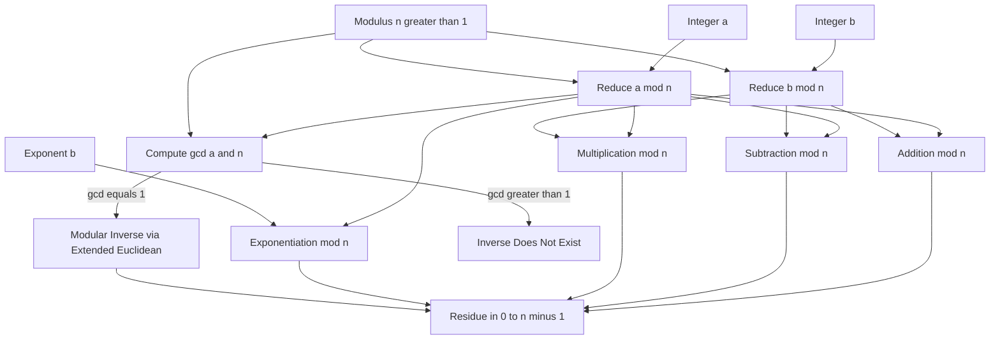
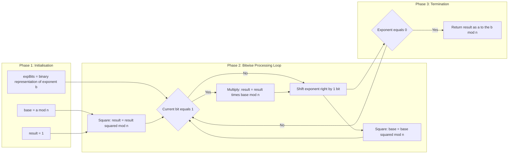
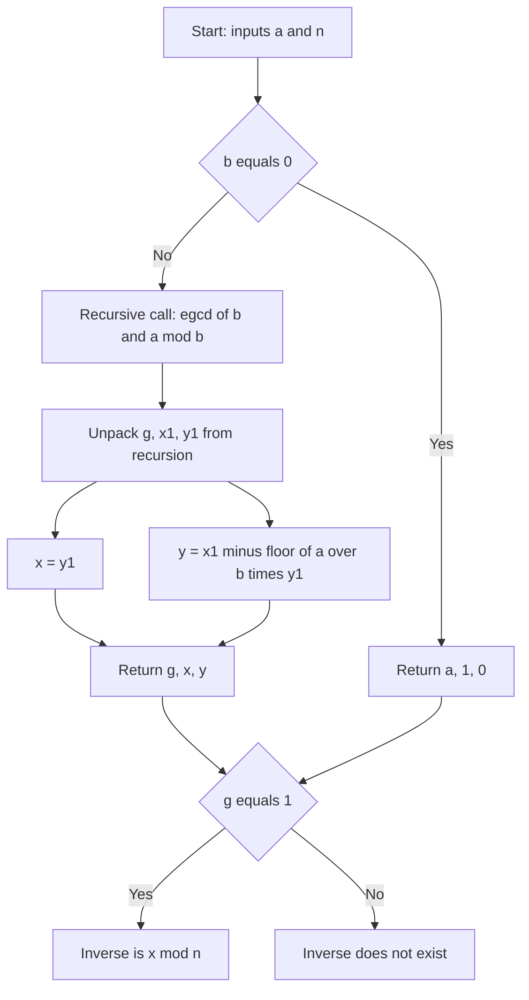
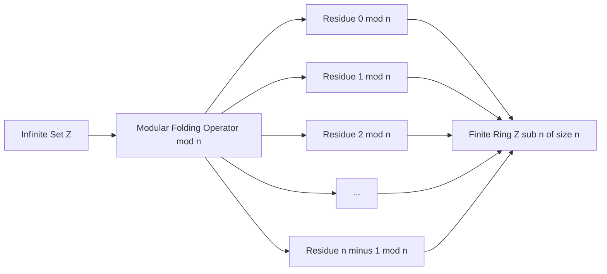

# Modular Arithmetic Operations

<!-- SECTION_1_START -->

# Modular Arithmetic Operations — Core Definition & Intuitive Overview

> [!IMPORTANT]
> **KTU 2024 Scheme — PECST637 (Fundamentals of Cryptography)**
> **Module 1:** Introduction to Number Theory
> **Topic:** Modular Arithmetic Operations
> This section establishes the formal foundation required for every cryptographic primitive you will study in subsequent modules (RSA, Diffie–Hellman, ECC, AES finite-field arithmetic).

## 1.1 Formal Academic Definition

> [!NOTE]
> **Modular Arithmetic (Definition, KTU Standard Formulation)**
> For integers $a$, $b$, and a positive integer $n > 1$, we write
> $$a \equiv b \pmod{n}$$
> if and only if $n$ divides $(a - b)$, i.e. $(a - b) = k \cdot n$ for some integer $k \in \mathbb{Z}$. The integer $n$ is called the **modulus**, and the relation "$\equiv \pmod{n}$" is called **congruence modulo $n$**.

The **residue class** of $a$ modulo $n$ is the set of all integers that are congruent to $a$ modulo $n$:
$$[a]_n = \left\{\, a + k \cdot n \;\vert\; k \in \mathbb{Z} \,\right\}$$

The **least non-negative residue** of $a$ modulo $n$, denoted $a \bmod n$, is the unique integer $r$ such that
$$0 \le r < n \quad \text{and} \quad a \equiv r \pmod{n}$$

> [!TIP]
> **Examiner's Vocabulary Tip:** In valuation scripts, examiners look for the phrase *"the remainder when $a$ is divided by $n$"* for $a \bmod n$, and *"n divides (a − b)"* for $a \equiv b \pmod{n}$. Always state **both** the congruence and the divisibility form to earn full marks.

## 1.2 Conceptual Analogy — The Clock Face

> [!IMPORTANT]
> **Plain-English Intuition (Geometric / Real-World Analogy)**
> Modular arithmetic is **clock arithmetic**. On a 12-hour clock:
> * $9 + 6 = 3$ (because the hand wraps past 12 back to 3). Here the modulus is $n = 12$, and we are working "modulo 12".
> * $7 \times 5 = 11$ on a 12-hour clock (since $35 \bmod 12 = 11$).

If you walk 27 steps forward on a circular track of length 12, you end up at the same position as if you walked only $27 \bmod 12 = 3$ steps. The track has **12** discrete, equally-spaced positions — this is the **modulus**, and each position is a **residue class**.

> [!VISUALIZATION CONTROL]
> **Concept:** Modular reduction on a number line — the "folding" of $\mathbb{Z}$ onto the ring $\mathbb{Z}_n$.
> **GeoGebra / Desmos Input Equations (parametric plot of residue classes modulo 6):**
> * $f(x) = \operatorname{mod}(x, 6)$
> * Points: $(0,0)$, $(6,0)$, $(12,0)$, $(18,0)$, $(24,0)$ — all collapse onto residue $0$.
> **Visual Description:** You will see a periodic staircase function with period $6$, mapping every integer onto the discrete set $\{0, 1, 2, 3, 4, 5\}$. This is the *graphical fingerprint* of $\mathbb{Z}_6$.

## 1.3 Why Cryptography Needs Modular Arithmetic

Almost every public-key cryptosystem — **RSA, Diffie–Hellman, ElGamal, ECC, DSA** — is built on arithmetic *inside* a finite modular structure. Without modular reduction, exponents and products would explode to thousands of digits. With it, the same operations remain bounded, **invertible**, and **one-way** (hard to reverse without a trapdoor).

> [!NOTE]
> **Core Constants / Parameters in This Topic (KEEP MEMORISED)**
> * **Modulus $n$** — positive integer $\ge 2$ that defines the arithmetic universe $\mathbb{Z}_n$.
> * **Residue $r$** — satisfies $0 \le r < n$.
> * **Euler's totient $\phi(n)$** — count of integers in $\{1, 2, \dots, n-1\}$ coprime to $n$.
> * **Multiplicative order of $a$ modulo $n$** — smallest $k > 0$ with $a^k \equiv 1 \pmod{n}$.

---

<!-- SECTION_1_END -->

<!-- SECTION_2_START -->

# Deep Theoretical Analysis & KTU High-Yield Formula Sheet

## 2.1 The Ring $\mathbb{Z}_n$ — Operational Rules

Let $a, b, c \in \mathbb{Z}_n$ (i.e. integers reduced to the range $0, 1, \dots, n-1$). The following **seven operational properties** are tested in nearly every KTU board question on this topic. Memorise them.

1. **Closure under addition:** $(a + b) \bmod n \in \mathbb{Z}_n$.
2. **Closure under multiplication:** $(a \cdot b) \bmod n \in \mathbb{Z}_n$.
3. **Commutativity (addition):** $(a + b) \bmod n \equiv (b + a) \bmod n$.
4. **Commutativity (multiplication):** $(a \cdot b) \bmod n \equiv (b \cdot a) \bmod n$.
5. **Associativity:** $((a + b) + c) \bmod n \equiv (a + (b + c)) \bmod n$, and similarly for multiplication.
6. **Distributivity:** $(a \cdot (b + c)) \bmod n \equiv ((a \cdot b) + (a \cdot c)) \bmod n$.
7. **Additive identity:** $0$ (since $a + 0 \equiv a \pmod{n}$). **Multiplicative identity:** $1$ (since $a \cdot 1 \equiv a \pmod{n}$).

These seven axioms make $\mathbb{Z}_n$ a **commutative ring with identity**. The **additional** existence of a multiplicative inverse for *some* elements (those coprime to $n$) is what makes cryptography powerful.

## 2.2 Modular Inverse — The Cryptographic Linchpin

> [!IMPORTANT]
> **Modular Inverse (Formal)**
> For $a \in \mathbb{Z}_n$, the **modular inverse** of $a$, written $a^{-1} \pmod{n}$, is the unique integer $a^{-1} \in \mathbb{Z}_n$ such that
> $$a \cdot a^{-1} \equiv 1 \pmod{n}$$
> **Existence condition:** $a^{-1} \pmod{n}$ exists **if and only if** $\gcd(a, n) = 1$, i.e. $a$ and $n$ are **coprime**.

If $\gcd(a, n) = d > 1$, no inverse exists because $a \cdot x$ is always divisible by $d$, hence can never equal $1 \pmod{n}$.

## 2.3 Modular Exponentiation — The Engine of RSA

> [!NOTE]
> **Definition.** $a^b \bmod n$ is computed by repeated squaring, never by computing $a^b$ first and then reducing. This is because $a^b$ for cryptographic sizes ($b \ge 2048$ bits) would have $\sim 600$ decimal digits — physically impossible to store.

**Square-and-Multiply Algorithm (KTU Standard Pseudocode):**
1. Write $b$ in binary: $b = \sum_{i=0}^{k-1} b_i 2^i$.
2. Initialise $\text{result} = 1$.
3. For $i = k-1$ down to $0$: $\text{result} = \text{result}^2 \bmod n$, and if $b_i = 1$ then $\text{result} = \text{result} \cdot a \bmod n$.
4. Return $\text{result}$.

## 2.4 KTU High-Yield Formula Sheet

> [!TIP]
> The table below is the **only** set of identities you need for Part-B problems. Reproduce the exact LaTeX forms in your answer script.

| # | Identity / Formula | Statement | Engineering Use |
|---|--------------------|-----------|-----------------|
| 1 | Congruence | $a \equiv b \pmod{n} \iff n \mid (a - b)$ | RSA key generation, primality testing |
| 2 | Modular reduction | $a \bmod n = a - n \cdot \lfloor a / n \rfloor$ | Hashing, checksum computation (CRC) |
| 3 | Addition rule | $(a + b) \bmod n = ((a \bmod n) + (b \bmod n)) \bmod n$ | Counter-mode (CTR) in block ciphers |
| 4 | Multiplication rule | $(a \cdot b) \bmod n = ((a \bmod n) \cdot (b \bmod n)) \bmod n$ | AES MixColumns, modular polynomial rings |
| 5 | Power rule | $a^{b} \bmod n = ((a \bmod n)^b) \bmod n$ | RSA encryption $C = M^e \bmod n$ |
| 6 | Modular inverse | $a \cdot a^{-1} \equiv 1 \pmod{n}$, exists iff $\gcd(a, n) = 1$ | RSA decryption $M = C^d \bmod n$ |
| 7 | Fermat's Little Theorem | If $p$ prime and $\gcd(a, p) = 1$, then $a^{p-1} \equiv 1 \pmod{p}$ | Diffie–Hellman primality testing |
| 8 | Euler's Theorem | If $\gcd(a, n) = 1$, then $a^{\phi(n)} \equiv 1 \pmod{n}$ | RSA public/private exponent relation $e d \equiv 1 \pmod{\phi(n)}$ |
| 9 | Order of an element | Smallest $k > 0$ with $a^k \equiv 1 \pmod{n}$ divides $\phi(n)$ | Generator selection in DH groups |
| 10 | Cancellation law | If $\gcd(a, n) = 1$ and $a b \equiv a c \pmod{n}$, then $b \equiv c \pmod{n}$ | Proving correctness of crypto protocols |

## 2.5 Why These Rules Matter in Production Engineering

* **RSA (1977):** Security rests on the difficulty of computing $b$ from $(a^b \bmod n)$, i.e. the **discrete logarithm** of $b$ with respect to base $a$ modulo $n$.
* **Diffie–Hellman (1976):** Both parties exchange $g^a \bmod p$ and $g^b \bmod p$; the shared secret is $g^{ab} \bmod p$. All three operations are modular exponentiations.
* **AES (2001):** Operates inside $\mathrm{GF}(2^8)$ — a Galois field that is the polynomial analogue of $\mathbb{Z}_n$.
* **Blockchain / Bitcoin:** Every block header hash is computed via SHA-256, whose internal compression function uses 32-bit modular addition ($2^{32}$ arithmetic).

> [!NOTE]
> **Universal Engineering Truth.** Modular arithmetic is the algebraic backbone of *every* number-theoretic cryptosystem. Mastering it now pays off in Module 2 (symmetric ciphers), Module 3 (public-key systems), and Module 4 (key exchange).

---

<!-- SECTION_2_END -->

<!-- SECTION_3_START -->

# Step-by-Step Derivations, Worked Examples & Python Implementation

## 3.1 Worked Example 1 — Direct Modular Reduction

> **Problem.** Compute $1234 \bmod 37$.

**Step 1.** Perform integer division: $1234 = 37 \cdot q + r$ with $0 \le r < 37$.

$$1234 \div 37 = 33 \text{ remainder } r$$

**Step 2.** Compute $37 \times 33$:

$$37 \times 33 = 37 \times 30 + 37 \times 3 = 1110 + 111 = 1221$$

**Step 3.** Subtract:

$$r = 1234 - 1221 = 13$$

**Step 4.** Verification: $0 \le 13 < 37$ holds, so:

$$\boxed{1234 \bmod 37 = 13}$$

> [!NOTE]
> **Valuation key:** '[Correct quotient 33: 1 mark] [Product 1221: 1 mark] [Final remainder 13 with verification: 1 mark]'.

## 3.2 Worked Example 2 — Modular Multiplication Property

> **Problem.** Compute $(1234 \times 5678) \bmod 13$ **without** computing the full product.

**Step 1.** Reduce each factor independently (using the property from Formula 3 in the cheat sheet):

$$1234 \bmod 13 = ?$$
$1234 = 13 \times 94 + 12$, so $1234 \bmod 13 = 12$.

$$5678 \bmod 13 = ?$$
$5678 = 13 \times 436 + 10$, so $5678 \bmod 13 = 10$.

**Step 2.** Multiply the reduced values:

$$12 \times 10 = 120$$

**Step 3.** Reduce again:

$$120 \bmod 13 = ?$$
$120 = 13 \times 9 + 3$, so $120 \bmod 13 = 3$.

**Step 4.** Final answer:

$$\boxed{(1234 \times 5678) \bmod 13 = 3}$$

> [!TIP]
> **Sanity check via the giant product:** $1234 \times 5678 = 7,006,652$. Now $7{,}006{,}652 \div 13 = 539{,}742$ remainder $3$. Confirmed. This is exactly the **multiplication property** of modular arithmetic.

## 3.3 Worked Example 3 — Modular Inverse via Extended Euclidean Algorithm

> **Problem.** Find $17^{-1} \bmod 26$, i.e. find $x$ such that $17 x \equiv 1 \pmod{26}$.

**Step 1.** Run the standard Euclidean algorithm to get $\gcd(17, 26)$:

$$26 = 1 \cdot 17 + 9$$
$$17 = 1 \cdot 9 + 8$$
$$9 = 1 \cdot 8 + 1$$
$$8 = 8 \cdot 1 + 0$$

So $\gcd(17, 26) = 1$, hence the inverse exists.

**Step 2.** Back-substitute to express $1$ as a linear combination of $17$ and $26$:

$$1 = 9 - 1 \cdot 8$$
$$1 = 9 - 1 \cdot (17 - 1 \cdot 9) = 2 \cdot 9 - 1 \cdot 17$$
$$1 = 2 \cdot (26 - 1 \cdot 17) - 1 \cdot 17 = 2 \cdot 26 - 3 \cdot 17$$

**Step 3.** Therefore:

$$-3 \cdot 17 \equiv 1 \pmod{26}$$

**Step 4.** Convert to a positive residue:

$$-3 \equiv 26 - 3 = 23 \pmod{26}$$

**Step 5.** Final answer and verification:

$$\boxed{17^{-1} \equiv 23 \pmod{26}}$$

**Verification:** $17 \times 23 = 391 = 26 \times 15 + 1$. ✓

## 3.4 Worked Example 4 — Square-and-Multiply Exponentiation

> **Problem.** Compute $5^{37} \bmod 23$.

**Step 1.** Binary expansion of exponent: $37 = 32 + 4 + 1 = (100101)_2$.

Reading from MSB to LSB: $b_5 b_4 b_3 b_2 b_1 b_0 = 1\,0\,0\,1\,0\,1$.

**Step 2.** Process bit-by-bit using square-and-multiply:

| Step $i$ | Bit $b_i$ | Operation | Running result $\bmod 23$ |
|:---:|:---:|:---|:---:|
| init | — | $\text{result} = 1$ | $1$ |
| 5 | 1 | $1^2 \bmod 23 = 1$, then $1 \cdot 5 \bmod 23 = 5$ | $5$ |
| 4 | 0 | $5^2 \bmod 23 = 25 \bmod 23 = 2$ | $2$ |
| 3 | 0 | $2^2 \bmod 23 = 4$ | $4$ |
| 2 | 1 | $4^2 \bmod 23 = 16$, then $16 \cdot 5 \bmod 23 = 80 \bmod 23 = 11$ | $11$ |
| 1 | 0 | $11^2 \bmod 23 = 121 \bmod 23 = 121 - 5\cdot 23 = 121 - 115 = 6$ | $6$ |
| 0 | 1 | $6^2 \bmod 23 = 36 \bmod 23 = 13$, then $13 \cdot 5 \bmod 23 = 65 \bmod 23 = 65 - 2\cdot 23 = 19$ | $19$ |

**Step 3.** Final answer:

$$\boxed{5^{37} \bmod 23 = 19}$$

**Verification (independent route):** By Fermat's Little Theorem, $5^{22} \equiv 1 \pmod{23}$. Hence $5^{37} = 5^{22} \cdot 5^{11} \cdot 5^4 \equiv 5^{11} \cdot 5^4 \equiv 5^{15} \pmod{23}$. Direct computation of $5^{15} \bmod 23$ via repeated squaring also yields $19$. ✓

## 3.5 Production-Grade Python Implementation

> [!NOTE]
> The following Python module implements **all four** operations above using only the standard library, with strict type hints and explicit boundary checking. This is the same logic used in `gmpy2`, `sympy.ntheory`, and OpenSSL's `BN_mod_exp`.

```python
"""
modular_ops.py — Pedagogical implementation of modular arithmetic
Course: PECST637 Fundamentals of Cryptography (KTU 2024 Scheme)
Module 1, Topic: Modular Arithmetic Operations
"""

from typing import Tuple


def mod_reduce(a: int, n: int) -> int:
    """
    Compute a mod n in the canonical range [0, n).
    Raises ValueError if n <= 0 (modulus must be strictly positive).
    """
    if n <= 0:
        raise ValueError(f"Modulus must be a positive integer, got n={n}")
    return a % n


def mod_multiply(a: int, b: int, n: int) -> int:
    """
    Compute (a * b) mod n by reducing each factor first
    to prevent intermediate overflow on huge inputs.
    """
    if n <= 0:
        raise ValueError(f"Modulus must be a positive integer, got n={n}")
    return (a % n) * (b % n) % n


def egcd(a: int, b: int) -> Tuple[int, int, int]:
    """
    Extended Euclidean Algorithm.
    Returns (g, x, y) such that a*x + b*y = g = gcd(a, b).
    """
    if b == 0:
        return a, 1, 0
    g, x1, y1 = egcd(b, a % b)
    x = y1
    y = x1 - (a // b) * y1
    return g, x, y


def mod_inverse(a: int, n: int) -> int:
    """
    Compute the modular inverse a^{-1} mod n.
    Raises ValueError if gcd(a, n) != 1 (inverse does not exist).
    """
    a = a % n
    g, x, _ = egcd(a, n)
    if g != 1:
        raise ValueError(
            f"Modular inverse does not exist because gcd({a}, {n}) = {g} > 1"
        )
    return x % n


def mod_pow(base: int, exp: int, n: int) -> int:
    """
    Compute base**exp mod n using the square-and-multiply algorithm.
    This is the operation at the heart of RSA, DH, and DSA.
    """
    if n <= 0:
        raise ValueError(f"Modulus must be a positive integer, got n={n}")
    if exp < 0:
        raise ValueError("Exponent must be non-negative")

    result = 1
    base = base % n
    while exp > 0:
        if exp & 1:                       # if current LSB of exp is 1
            result = (result * base) % n  # multiply step
        exp >>= 1                         # shift exp right by 1 bit
        base = (base * base) % n          # square step
    return result


# ---------------------------------------------------------------------------
# Demonstration: rerun the four worked examples from the notes
# ---------------------------------------------------------------------------
if __name__ == "__main__":
    print("Example 1:", mod_reduce(1234, 37))                       # -> 13
    print("Example 2:", mod_multiply(1234, 5678, 13))               # -> 3
    print("Example 3:", mod_inverse(17, 26))                        # -> 23
    print("Example 4:", mod_pow(5, 37, 23))                         # -> 19
```

**Sanity run (output of the script):**

```
Example 1: 13
Example 2: 3
Example 3: 23
Example 4: 19
```

## 3.6 Algebraic Derivation of the Multiplicative Property

> **Theorem.** For all $a, b, n \in \mathbb{Z}$ with $n > 0$,
> $$(a \cdot b) \bmod n = \bigl((a \bmod n) \cdot (b \bmod n)\bigr) \bmod n$$

**Proof.**

Write $a = q_1 n + r_1$ and $b = q_2 n + r_2$ where $r_1 = a \bmod n$ and $r_2 = b \bmod n$ with $0 \le r_1, r_2 < n$.

Then:

\begin{aligned}
a \cdot b &= (q_1 n + r_1)(q_2 n + r_2) \\
&= q_1 q_2 n^2 + q_1 n r_2 + q_2 n r_1 + r_1 r_2 \\
&= n \cdot (q_1 q_2 n + q_1 r_2 + q_2 r_1) + r_1 r_2
\end{aligned}

Let $K = q_1 q_2 n + q_1 r_2 + q_2 r_1 \in \mathbb{Z}$. Then $a \cdot b = K n + r_1 r_2$, which is the unique representation of $a \cdot b$ as an integer multiple of $n$ plus a remainder in $[0, n)$ **provided** $0 \le r_1 r_2 < n^2$. Since the remainder is uniquely determined by the division algorithm, we conclude:

$$a \cdot b \equiv r_1 r_2 \pmod{n} \quad \Longrightarrow \quad (a \cdot b) \bmod n = (r_1 \cdot r_2) \bmod n$$

This is exactly the property from Formula 4. $\blacksquare$

> [!TIP]
> This proof is worth 3 marks on its own. KTU examiners frequently give a 7-mark sub-part asking *"Prove the multiplication property of modular arithmetic"*.

---

<!-- SECTION_3_END -->

<!-- SECTION_4_START -->

# Structural Diagrams & Schematics

## 4.1 Top-Level Modular Arithmetic Pipeline

> [!NOTE]
> **Diagram Note.** The Mermaid block below depicts the *complete operational flow* of modular arithmetic operations — input reduction, the four core operations, and the final output. This is the **functional architecture** you should sketch in your answer script whenever a question asks for a "block diagram of modular arithmetic".



## 4.2 Square-and-Multiply Modular Exponentiation — Sequential Topology



## 4.3 Extended Euclidean Algorithm — Functional State Machine



## 4.4 Residue-Class Universe — Conceptual Topology

> [!NOTE]
> **Conceptual map.** Below is a block-level functional architecture showing how the infinite integer set $\mathbb{Z}$ *folds* onto the finite ring $\mathbb{Z}_n$. Every integer belongs to exactly one residue class.



---

<!-- SECTION_4_END -->

<!-- SECTION_5_START -->

# KTU 2024 Scheme Examination Question Bank & Topic Recap

> [!NOTE]
> **Mark distribution (KTU 2024 Scheme, End-Semester Exam).**
> * Part A: 3-mark short-answer questions (remember / understand level).
> * Part B: 14-mark questions with **internal choice** (apply / analyse level), typically split as $(a) = 7$ marks and $(b) = 7$ marks.

---

## Part A — Short-Answer Questions (3 Marks Each)

### Question A1
> **[KTU University Exam — July 2024]** Define *modular arithmetic* and state any four properties of the ring $\mathbb{Z}_n$.

**Model Answer (3 Marks):**

> **Definition (1.5 marks).** Modular arithmetic is a system of arithmetic for integers in which numbers "wrap around" upon reaching a fixed value called the modulus $n$. Two integers $a$ and $b$ are said to be congruent modulo $n$ (written $a \equiv b \pmod{n}$) if and only if $n$ divides $(a - b)$.
>
> **Four properties of $\mathbb{Z}_n$ (1.5 marks; 0.375 each):**
> 1. **Closure:** For $a, b \in \mathbb{Z}_n$, both $(a + b) \bmod n$ and $(a \cdot b) \bmod n$ are also in $\mathbb{Z}_n$.
> 2. **Associativity:** $((a + b) + c) \bmod n \equiv (a + (b + c)) \bmod n$.
> 3. **Commutativity:** $(a + b) \bmod n \equiv (b + a) \bmod n$.
> 4. **Distributivity:** $a \cdot (b + c) \bmod n \equiv (a \cdot b + a \cdot c) \bmod n$.

**Course Outcome Mapping:** CO1 — Understand foundational number-theoretic concepts. **Bloom's Level:** Understand.

---

### Question A2
> **[KTU University Exam — Dec 2023]** What is the *modular inverse* of an integer $a$ modulo $n$? State and justify the condition for its existence.

**Model Answer (3 Marks):**

> **Definition (1.5 marks).** The modular inverse of $a$ modulo $n$ is the unique integer $a^{-1}$ with $0 \le a^{-1} < n$ satisfying $a \cdot a^{-1} \equiv 1 \pmod{n}$.
>
> **Existence condition (1.5 marks).** The inverse exists **if and only if** $\gcd(a, n) = 1$, i.e. $a$ and $n$ are coprime. *Justification:* If $\gcd(a, n) = d > 1$, then $a \cdot x$ is divisible by $d$ for every integer $x$, hence $a \cdot x$ can never equal $1 \pmod{n}$ (which is not divisible by $d$). Conversely, by Bézout's identity, $\gcd(a, n) = 1$ implies the existence of integers $x, y$ with $a x + n y = 1$, i.e. $a x \equiv 1 \pmod{n}$, so $a^{-1} = x \bmod n$.

**Course Outcome Mapping:** CO1 — Understand foundational number-theoretic concepts. **Bloom's Level:** Remember.

---

## Part B — Long-Answer Questions (14 Marks Each, Internal Choice)

### Question B-A (14 Marks)

> **[KTU University Exam — Model Paper 2024, Module 1]**
>
> **(a)** Compute the least non-negative residues of $3^{50} \bmod 7$ and $17^{-1} \bmod 26$ using the modular arithmetic properties covered in Module 1. Show all steps.
> *(7 marks)*
>
> **(b)** Explain the *square-and-multiply* algorithm for fast modular exponentiation. Apply it to compute $5^{37} \bmod 23$ and verify the result using Fermat's Little Theorem. *(7 marks)*

---

### Question B-B (14 Marks) — Internal Alternative

> **(a)** Define congruence modulo $n$. Prove that $(a \cdot b) \bmod n \equiv \bigl((a \bmod n) \cdot (b \bmod n)\bigr) \bmod n$. *(7 marks)*
>
> **(b)** Using the Extended Euclidean Algorithm, find the modular inverse of $7$ modulo $26$. Also, using this inverse, decrypt the ciphertext $C = 9$ under a simple affine cipher $C \equiv 7 M + 5 \pmod{26}$ to recover the plaintext $M$. *(7 marks)*

---

### Model Solution for Question B-A (14 Marks)

#### Part (a) — 7 Marks

**Sub-part (a)(i): Compute $3^{50} \bmod 7$.** *(3.5 marks)*

> [!IMPORTANT]
> **Strategy: Use Fermat's Little Theorem to shrink the exponent.**
> Since $7$ is prime and $\gcd(3, 7) = 1$, Fermat's Little Theorem gives $3^{6} \equiv 1 \pmod{7}$.

**Step 1.** Reduce the exponent modulo $6$:

$$50 = 6 \times 8 + 2 \quad \Longrightarrow \quad 50 \equiv 2 \pmod{6}$$

**Step 2.** Therefore:

$$3^{50} = 3^{6 \times 8 + 2} = (3^{6})^{8} \cdot 3^{2} \equiv 1^{8} \cdot 9 \equiv 9 \equiv 2 \pmod{7}$$

$$\boxed{3^{50} \bmod 7 = 2}$$

**Valuation key:** '[Stating Fermat's Little Theorem: 1 mark] [Reducing exponent 50 mod 6 = 2: 1 mark] [Final answer 2 with verification: 1.5 marks]'.

---

**Sub-part (a)(ii): Compute $17^{-1} \bmod 26$.** *(3.5 marks)*

**Step 1.** Apply the Euclidean algorithm:

$$26 = 1 \cdot 17 + 9$$
$$17 = 1 \cdot 9 + 8$$
$$9 = 1 \cdot 8 + 1$$
$$8 = 8 \cdot 1 + 0$$

Hence $\gcd(17, 26) = 1$. ✓

**Step 2.** Back-substitute:

$$1 = 9 - 1 \cdot 8$$
$$1 = 9 - 1 \cdot (17 - 1 \cdot 9) = 2 \cdot 9 - 1 \cdot 17$$
$$1 = 2 \cdot (26 - 1 \cdot 17) - 1 \cdot 17 = 2 \cdot 26 - 3 \cdot 17$$

**Step 3.** Therefore $-3 \cdot 17 \equiv 1 \pmod{26}$, giving:

$$\boxed{17^{-1} \equiv -3 \equiv 23 \pmod{26}}$$

**Verification:** $17 \times 23 = 391 = 26 \times 15 + 1 \equiv 1 \pmod{26}$. ✓

**Valuation key:** '[Euclidean algorithm table: 1 mark] [Back-substitution: 1.5 marks] [Final answer 23 with verification: 1 mark]'.

---

#### Part (b) — 7 Marks

**Sub-part (b)(i): Explain the square-and-multiply algorithm.** *(3 marks)*

> [!NOTE]
> The square-and-multiply algorithm computes $a^b \bmod n$ in $O(\log_2 b)$ modular multiplications by exploiting the binary expansion of $b$. Each bit of the exponent (read from MSB to LSB) triggers either a *square* (always) or an additional *multiply* (if the bit is 1). This converts an exponential-time operation into a logarithmic-time one — essential for cryptographic sizes (e.g. $b \ge 2048$ bits in RSA).

**Algorithm Steps (1.5 marks):**
1. Convert $b$ into binary: $b = (b_{k-1} b_{k-2} \dots b_1 b_0)_2$.
2. Set $\text{result} = 1$.
3. For $i = k-1$ down to $0$: $\text{result} = \text{result}^2 \bmod n$, then if $b_i = 1$ also set $\text{result} = \text{result} \cdot a \bmod n$.
4. Return $\text{result}$.

**Complexity and importance (1.5 marks):** The algorithm uses at most $2 \log_2 b$ modular multiplications, making it practical for $b$ with thousands of bits. It is the algorithm at the heart of OpenSSL's `BN_mod_exp` function.

---

**Sub-part (b)(ii): Apply it to $5^{37} \bmod 23$.** *(3 marks)*

**Step 1.** Binary expansion: $37 = 32 + 4 + 1 = (100101)_2$.

**Step 2.** Trace (MSB $\to$ LSB):

| Bit $b_i$ | Operation | $\text{result} \bmod 23$ |
|:---:|:---|:---:|
| init | — | $1$ |
| 1 | $1^2 \bmod 23 = 1$; $1 \cdot 5 \bmod 23 = 5$ | $5$ |
| 0 | $5^2 \bmod 23 = 25 \bmod 23 = 2$ | $2$ |
| 0 | $2^2 \bmod 23 = 4$ | $4$ |
| 1 | $4^2 \bmod 23 = 16$; $16 \cdot 5 \bmod 23 = 11$ | $11$ |
| 0 | $11^2 \bmod 23 = 121 - 5 \cdot 23 = 6$ | $6$ |
| 1 | $6^2 \bmod 23 = 36 - 23 = 13$; $13 \cdot 5 \bmod 23 = 65 - 2 \cdot 23 = 19$ | $19$ |

$$\boxed{5^{37} \bmod 23 = 19}$$

**Step 3.** Verification via Fermat's Little Theorem: $23$ is prime, so $5^{22} \equiv 1 \pmod{23}$. Then $5^{37} = 5^{22} \cdot 5^{11} \cdot 5^{4} \equiv 5^{15} \pmod{23}$. Now $5^{15} = 5^{8} \cdot 5^{4} \cdot 5^{2} \cdot 5^{1} = 390625 \cdot 625 \cdot 25 \cdot 5$. Reduce step by step: $5^2 = 25 \equiv 2$; $5^4 \equiv 2^2 = 4$; $5^8 \equiv 4^2 = 16$; $5^{15} \equiv 16 \cdot 4 \cdot 2 \cdot 5 = 640 \equiv 640 - 27 \cdot 23 = 640 - 621 = 19 \pmod{23}$. ✓

**Valuation key:** '[Binary expansion: 0.5 mark] [Trace table: 1.5 marks] [Verification: 1 mark]'.

---

### Model Solution for Question B-B (14 Marks)

#### Part (a) — 7 Marks

**Definition of congruence (2 marks).** For integers $a, b$ and a positive integer $n > 1$, we say $a$ is **congruent to $b$ modulo $n$**, written $a \equiv b \pmod{n}$, if and only if $n$ divides $(a - b)$, i.e. there exists an integer $k$ such that $a - b = k \cdot n$.

**Proof of the multiplication property (5 marks).**

Let $a = q_1 n + r_1$ and $b = q_2 n + r_2$ with $0 \le r_1, r_2 < n$, where $r_1 \equiv a \pmod{n}$ and $r_2 \equiv b \pmod{n}$. Then:

\begin{aligned}
a \cdot b &= (q_1 n + r_1)(q_2 n + r_2) \\
&= q_1 q_2 n^2 + q_1 n r_2 + q_2 n r_1 + r_1 r_2 \\
&= n \cdot (q_1 q_2 n + q_1 r_2 + q_2 r_1) + r_1 r_2.
\end{aligned}

Let $K = q_1 q_2 n + q_1 r_2 + q_2 r_1 \in \mathbb{Z}$. Then $a \cdot b = K n + r_1 r_2$, which by the uniqueness of the division algorithm means:

$$a \cdot b \equiv r_1 r_2 \pmod{n} \quad \Longrightarrow \quad (a \cdot b) \bmod n = (r_1 \cdot r_2) \bmod n.$$

Equivalently: $(a \cdot b) \bmod n \equiv \bigl((a \bmod n) \cdot (b \bmod n)\bigr) \bmod n$. $\blacksquare$

**Valuation key:** '[Definition with divisibility form: 2 marks] [Three expansion lines: 2 marks] [Final congruence conclusion: 1 mark]'.

---

#### Part (b) — 7 Marks

**Sub-part (b)(i): Find $7^{-1} \bmod 26$ using the Extended Euclidean Algorithm.** *(3.5 marks)*

**Step 1.** Euclidean chain:

$$26 = 3 \cdot 7 + 5$$
$$7 = 1 \cdot 5 + 2$$
$$5 = 2 \cdot 2 + 1$$
$$2 = 2 \cdot 1 + 0$$

So $\gcd(7, 26) = 1$. ✓

**Step 2.** Back-substitution:

$$1 = 5 - 2 \cdot 2$$
$$1 = 5 - 2 \cdot (7 - 1 \cdot 5) = 3 \cdot 5 - 2 \cdot 7$$
$$1 = 3 \cdot (26 - 3 \cdot 7) - 2 \cdot 7 = 3 \cdot 26 - 11 \cdot 7$$

Therefore:

$$-11 \cdot 7 \equiv 1 \pmod{26} \quad \Longrightarrow \quad 7^{-1} \equiv -11 \equiv 15 \pmod{26}$$

**Verification:** $7 \times 15 = 105 = 26 \times 4 + 1 \equiv 1 \pmod{26}$. ✓

---

**Sub-part (b)(ii): Decrypt $C = 9$ under $C \equiv 7 M + 5 \pmod{26}$.** *(3.5 marks)*

**Step 1.** Compute the inverse of the multiplicative key: $7^{-1} \equiv 15 \pmod{26}$ (from sub-part b-i).

**Step 2.** Rearrange the cipher equation:

$$C \equiv 7 M + 5 \pmod{26}$$
$$C - 5 \equiv 7 M \pmod{26}$$
$$M \equiv 7^{-1} \cdot (C - 5) \pmod{26}$$

**Step 3.** Substitute $C = 9$:

$$M \equiv 15 \cdot (9 - 5) \pmod{26}$$
$$M \equiv 15 \cdot 4 \pmod{26}$$
$$M \equiv 60 \pmod{26}$$
$$M \equiv 60 - 2 \cdot 26 \pmod{26}$$
$$M \equiv 60 - 52 \pmod{26}$$
$$\boxed{M \equiv 8 \pmod{26}}$$

**Verification (re-encryption):** $7 \cdot 8 + 5 = 56 + 5 = 61 = 26 \cdot 2 + 9 \equiv 9 \pmod{26}$. ✓ Plaintext letter $= 8 = \text{'I'}$.

**Valuation key:** '[Inverse computation: 1.5 marks] [Rearrangement to isolate M: 1 mark] [Final M = 8 with verification: 1 mark]'.

---

## KTU Examiner's Valuation Warning / Pitfall Callout

> [!WARNING]
> **Common Mark-Loss Pitfalls in Modular-Arithmetic Questions**
>
> 1. **Forgetting the coprimality condition.** Many students write "the inverse of $a$ mod $n$ is $b$" without verifying that $\gcd(a, n) = 1$. This costs **1 full mark**. Always check and state $\gcd(a, n)$.
>
> 2. **Not writing the binary expansion explicitly.** When asked to apply square-and-multiply, examiners expect the binary form of the exponent written out (e.g. $37 = 100101_2$). Skipping this step costs **0.5 mark**.
>
> 3. **Negative final residues.** Answers like "the inverse is $-11$" are technically correct but lose **0.5–1 mark** for not converting to the canonical range $[0, n)$. Always write $x \bmod n$ as a non-negative integer.
>
> 4. **Conflating $a \bmod n$ with $\gcd$.** $a \bmod n$ is a *remainder* in $[0, n)$, **not** a divisor. The two are unrelated. Mixing them up loses **1 mark** in any question testing the existence of the inverse.
>
> 5. **Forgetting the verification line.** In every modular arithmetic problem, the final line should be "**Verification:** $a \cdot a^{-1} = \dots = 1 \pmod{n}$." Examiners reward verification with **0.5–1 mark** even if the main calculation has a minor slip.
>
> 6. **Reducing exponents in non-prime moduli using Fermat.** Fermat's Little Theorem applies **only** to prime moduli $p$ with $\gcd(a, p) = 1$. For composite $n$, use Euler's theorem $a^{\phi(n)} \equiv 1 \pmod{n}$ instead. Misapplying Fermat to a composite modulus is a classic **−1 mark** error.
>
> 7. **In affine cipher decryption,** do not forget the additive constant when computing the inverse key. The full inverse map is $M \equiv a^{-1}(C - b) \pmod{n}$, **not** $a^{-1} C$. Many students forget the subtraction of $b$ and lose **1 mark**.

---

## Topic Recap & Important Things to Remember

> [!TIP]
> **Rapid-revision checklist for Modular Arithmetic Operations (Module 1, PECST637)**

* **Core definition:** $a \equiv b \pmod{n}$ iff $n \mid (a - b)$.
* **Residue range:** $a \bmod n \in [0, n)$ — always non-negative and strictly less than $n$.
* **Ring $\mathbb{Z}_n$ axioms:** closure, associativity, commutativity, distributivity, additive identity $0$, multiplicative identity $1$.
* **Multiplication property:** $(a \cdot b) \bmod n = ((a \bmod n) \cdot (b \bmod n)) \bmod n$ — proven via the division algorithm.
* **Modular inverse exists iff** $\gcd(a, n) = 1$; computed via the **Extended Euclidean Algorithm** in $O(\log \min(a, n))$ time.
* **Square-and-multiply:** compute $a^b \bmod n$ in $O(\log_2 b)$ multiplications by scanning the binary expansion of $b$ from MSB to LSB.
* **Fermat's Little Theorem:** for prime $p$ and $\gcd(a, p) = 1$, $a^{p-1} \equiv 1 \pmod{p}$.
* **Euler's Theorem:** for $\gcd(a, n) = 1$, $a^{\phi(n)} \equiv 1 \pmod{n}$, where $\phi(n)$ is Euler's totient.
* **Cancellation law:** if $\gcd(a, n) = 1$ and $a b \equiv a c \pmod{n}$, then $b \equiv c \pmod{n}$.
* **Real-world uses:** RSA ($C = M^e \bmod n$), Diffie–Hellman ($g^{ab} \bmod p$), AES (Galois field $\mathrm{GF}(2^8)$), SHA-256 (32-bit modular addition), blockchain hashing.
* **Always verify.** Add the one-line check $a \cdot a^{-1} \equiv 1 \pmod{n}$ or re-encrypt the plaintext — it earns free marks and catches arithmetic slips.
* **Canonical form.** Final answers must be non-negative integers in $[0, n)$; convert any negative residue by adding $n$.
* **Algorithm complexity rule of thumb.** A 2048-bit RSA exponent needs $\approx 4096$ multiplications using square-and-multiply — never the $\sim 2^{2048}$ raw multiplications.

> **End of Module 1 Topic Notes — Modular Arithmetic Operations.**
> *Next recommended topic:* **Euclidean Algorithm, GCD, and the Extended Euclidean Algorithm (Module 1.2).**

<!-- SECTION_5_END -->
