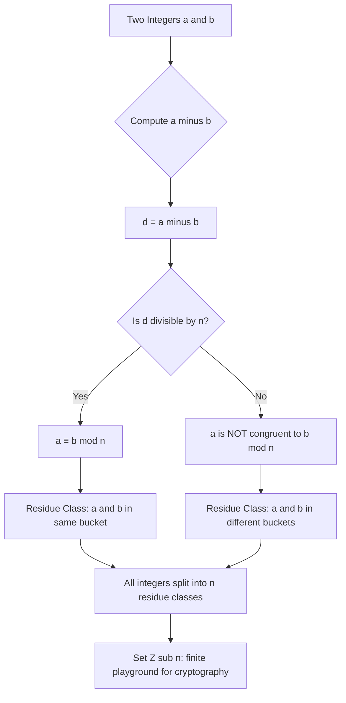
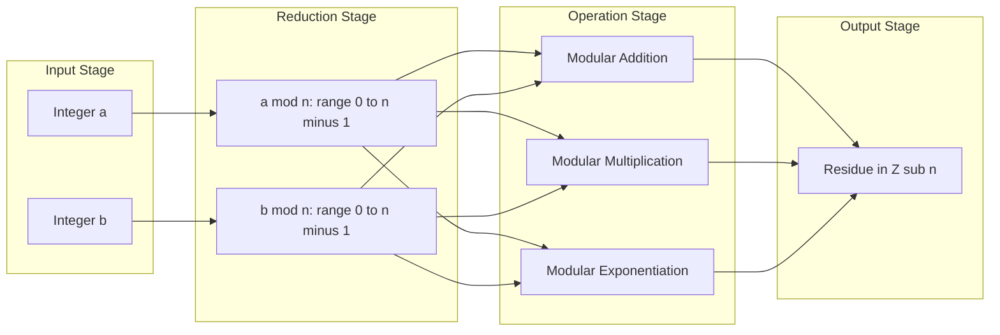
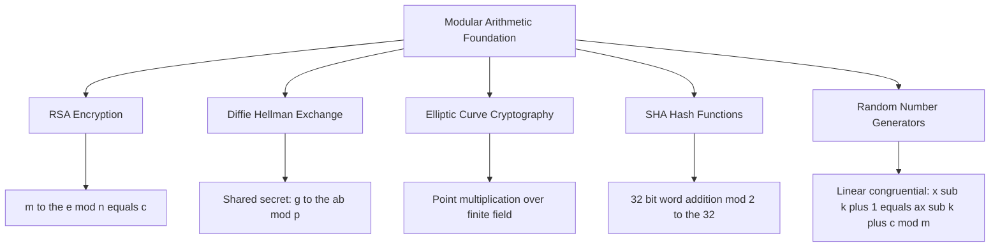

# Modular Arithmetic : The Modulus

<!-- SECTION_1_START -->
# Modular Arithmetic: The Modulus

> [!NOTE]
> **KTU 2024 Scheme Definition (Cryptography Context):**
> *Modular Arithmetic* is a system of arithmetic for integers, where numbers "wrap around" upon reaching a fixed value called the **modulus** (denoted $n$). Two integers $a$ and $b$ are said to be *congruent modulo $n$* if their difference $a - b$ is an integer multiple of $n$. This is written as:
> $$a \equiv b \pmod{n}$$
> The modulus $n$ is a **positive integer** greater than 1 (i.e., $n \geq 2$) and forms the cornerstone of nearly every public-key cryptosystem (RSA, Diffie-Hellman, Elliptic Curve Cryptography).

## Intuitive Overview & Real-World Analogy

### 🎯 The 12-Hour Clock Analogy

Imagine an ordinary analog clock. The hour hand counts **1, 2, 3, ..., 11, 12, 1, 2, 3, ...** — it never reaches 13 or 25. After 12, it "wraps around" to 1.

If it is currently **10 o'clock**, and someone asks, *"What time will it be 5 hours from now?"*, you don't answer 15 o'clock. You compute:
$$10 + 5 = 15 \equiv 3 \pmod{12}$$

That is modular arithmetic in disguise — the modulus is simply **12** (the number of hours on the clock face).

| Analog World | Math Equivalent | Cryptographic Counterpart |
|---|---|---|
| Clock face with 12 hours | Modulus $n = 12$ | A large prime $p$ in RSA / DH |
| Hour hand position | Residue (a number in $\{0, 1, \dots, 11\}$) | Ciphertext integer $c$ |
| Adding hours | Modular addition | Encryption step $E(m)$ |
| Subtracting hours | Modular subtraction | Decryption step $D(c)$ |

### 🔍 Geometric Intuition: The Modular Number Line

A standard number line goes from $-\infty$ to $+\infty$. A *modular* number line of modulus $n$ is bent into a **circle of circumference $n$**. Every integer $a$ is placed on this circle at position corresponding to the **remainder** when $a$ is divided by $n$.

For example, in $\mathbb{Z}_{7}$ (modulus 7), the numbers ...$-2, -1, 0, 1, 2, 3, 4, 5, 6, 7, 8, 9, 10, 11, 12, 13, 14, 15$ all collapse onto the **same seven positions** on the circle: $\{0, 1, 2, 3, 4, 5, 6\}$.

> [!IMPORTANT]
> **Key Syllabus Highlight:**
> The modulus is **always a positive integer $n \geq 2$**, and the standard set of representatives is the set of residues $\mathbb{Z}_n = \{0, 1, 2, \dots, n-1\}$. The value $n$ itself is *equivalent to 0* under modulo $n$ (i.e., $n \equiv 0 \pmod{n}$).

> [!VISUALIZATION CONTROL]
> **Concept:** Modular Number Circle for $n = 7$
> **GeoGebra / Desmos Input Equations:**
> * `x = 7 * cos(t), y = 7 * sin(t)` (the modular circle)
> * Points: `(7,0), (7cos(2pi/7), 7sin(2pi/7)), (7cos(4pi/7), 7sin(4pi/7)), (7cos(6pi/7), 7sin(6pi/7)), (7cos(8pi/7), 7sin(8pi/7)), (7cos(10pi/7), 7sin(10pi/7)), (7cos(12pi/7), 7sin(12pi/7))`
> **Visual Description:** A circle with 7 equally spaced residue positions labeled 0 through 6. The student should observe that $7$ and $14$ all map to the same point as $0$; $8$ and $15$ map to the same point as $1$, and so on. The points are arranged clockwise or counter-clockwise.
<!-- SECTION_1_END -->

<!-- SECTION_2_START -->
# Deep Theoretical Analysis & KTU High-Yield Formula Sheet

## 1. Formal Definition of Congruence

Let $a$, $b$, and $n$ be integers with $n > 0$. We say $a$ is **congruent to $b$ modulo $n$** if and only if $n$ divides the difference $(a - b)$. Symbolically:

$$a \equiv b \pmod{n} \iff n \mid (a - b) \iff \exists k \in \mathbb{Z} \text{ such that } a - b = k \cdot n$$

> [!NOTE]
> **The "Divides" Operator ($\mid$):**
> We write $n \mid (a - b)$ to mean "$n$ divides $(a - b)$ exactly, with no remainder." For instance, $7 \mid 21$ is true, but $7 \mid 22$ is false.

## 2. The Three Pillars: Properties of Congruence

The congruence relation behaves like ordinary equality but is governed by the modulus $n$. It satisfies three foundational properties:

- **Reflexive Property:** $a \equiv a \pmod{n}$ for every integer $a$.
  * *Why:* $a - a = 0$, and $n \mid 0$ for any non-zero $n$.
- **Symmetric Property:** If $a \equiv b \pmod{n}$, then $b \equiv a \pmod{n}$.
  * *Why:* If $n \mid (a - b)$, then $n \mid -(a - b) = (b - a)$.
- **Transitive Property:** If $a \equiv b \pmod{n}$ and $b \equiv c \pmod{n}$, then $a \equiv c \pmod{n}$.
  * *Why:* $a - c = (a - b) + (b - c)$, a sum of two multiples of $n$, hence a multiple of $n$.

Because congruence satisfies all three, it is formally a true **equivalence relation** on the set of integers $\mathbb{Z}$.

## 3. Arithmetic Operations Preserved by Modulus

The beauty of modular arithmetic is that **standard arithmetic operations transfer seamlessly** into the modular world. If $a \equiv a' \pmod{n}$ and $b \equiv b' \pmod{n}$, then:

- **Modular Addition:** $a + b \equiv a' + b' \pmod{n}$
- **Modular Subtraction:** $a - b \equiv a' - b' \pmod{n}$
- **Modular Multiplication:** $a \cdot b \equiv a' \cdot b' \pmod{n}$
- **Modular Exponentiation:** $a^k \equiv (a')^k \pmod{n}$ (the bedrock of RSA encryption)
- **Cancellation Law:** If $a \cdot c \equiv b \cdot c \pmod{n}$ and $\gcd(c, n) = 1$, then $a \equiv b \pmod{n}$.

> [!IMPORTANT]
> **Critical Caveat — Division Is Tricky:**
> Modular *division* is **not always defined** in the way we expect from real numbers. It is only valid when the divisor is **coprime** to $n$. The proper operation is multiplication by the **modular multiplicative inverse** $c^{-1} \pmod{n}$, which exists only if $\gcd(c, n) = 1$.

## 4. Residue Classes and the Set $\mathbb{Z}_n$

The integers are partitioned into $n$ **residue classes modulo $n$**:

$$[0]_n, [1]_n, [2]_n, \dots, [n-1]_n$$

where the class $[r]_n = \{r, r \pm n, r \pm 2n, r \pm 3n, \dots\}$ is the set of *all* integers that leave a remainder of $r$ when divided by $n$. The set of these classes is denoted:

$$\mathbb{Z}_n = \mathbb{Z} / n\mathbb{Z} = \{0, 1, 2, \dots, n-1\}$$

This is the **complete algebraic playground** for cryptography, finite field operations, and hashing.

## 5. KTU High-Yield Formula Sheet

> [!IMPORTANT]
> **Master This Table — It Covers 90% of Exam Questions on The Modulus.**

| Concept | Formula / Statement | Working Conditions |
|---|---|---|
| Basic Congruence | $a \equiv b \pmod{n}$ | $n \mid (a - b)$ |
| Modulo Reduction | $a \bmod n = r$ where $0 \leq r < n$ | $a = qn + r$ (Euclidean form) |
| Addition Rule | $(a + b) \bmod n = ((a \bmod n) + (b \bmod n)) \bmod n$ | Always valid |
| Multiplication Rule | $(a \cdot b) \bmod n = ((a \bmod n) \cdot (b \bmod n)) \bmod n$ | Always valid |
| Exponentiation Rule | $a^k \bmod n$ | Apply *square-and-multiply* for huge $k$ |
| Cancellation Law | If $ac \equiv bc \pmod{n}$ and $\gcd(c, n) = 1$, then $a \equiv b \pmod{n}$ | Requires $\gcd(c, n) = 1$ |
| Modular Inverse | $a \cdot a^{-1} \equiv 1 \pmod{n}$ | Exists iff $\gcd(a, n) = 1$ |
| Size of $\mathbb{Z}_n$ | $\vert \mathbb{Z}_n \vert = n$ | $n$ residues |
| Euler's Totient (preview) | $\phi(n) = $ count of integers in $[1, n]$ coprime to $n$ | Used in RSA key generation |

## 6. Real-World Engineering & Cryptography Utility

Where does this matter outside textbooks?

- **RSA Encryption:** The ciphertext is computed as $c = m^e \bmod n$, and decryption as $m = c^d \bmod n$. Without modular exponentiation, RSA would collapse computationally.
- **Hash Functions (SHA-256):** Internally use modular addition of 32-bit words — overflow bits are "thrown away" via mod $2^{32}$.
- **Diffie-Hellman Key Exchange:** Both parties raise numbers to powers modulo a large prime $p$.
- **Error-Correcting Codes (Reed-Solomon):** Use modular arithmetic over finite fields $\text{GF}(2^8)$ for QR codes, CDs, and satellite communication.
- **Random Number Generation:** Linear Congruential Generators (LCGs) rely on $x_{n+1} = (a x_n + c) \bmod m$.

> [!NOTE]
> **Why Wrap-Around is Brilliant for Cryptography:**
> It creates a **finite, predictable space** with $n$ possible values. This means every operation — no matter how large the inputs — produces a bounded, well-defined output. This is what makes cryptosystems *computationally tractable* and *provably hard to reverse* under certain assumptions.
<!-- SECTION_2_END -->

<!-- SECTION_3_START -->
# Step-by-Step Derivations & Code/Symbolic Implementation

## Worked Example 1: Reducing a Large Number

**Problem:** Compute $1735 \bmod 17$.

**Step 1 — Apply the Division Algorithm.**
We seek integers $q$ (quotient) and $r$ (remainder) such that $1735 = 17q + r$ with $0 \leq r < 17$.

**Step 2 — Estimate the quotient.**
$$q = \left\lfloor \frac{1735}{17} \right\rfloor = \left\lfloor 102.0588\dots \right\rfloor = 102$$

**Step 3 — Compute the remainder.**
$$r = 1735 - (17 \times 102) = 1735 - 1734 = 1$$

**Step 4 — State the result.**

$$1735 \equiv 1 \pmod{17}$$

> **Verification:** $17 \times 102 = 1734$, and $1735 - 1734 = 1$. ✓

---

## Worked Example 2: Modular Addition

**Problem:** Compute $(845 + 273) \bmod 13$ *without* first adding the two numbers.

**Step 1 — Reduce each operand modulo 13 first.**
$$845 \div 13 = 65 \text{ remainder } 0 \implies 845 \equiv 0 \pmod{13}$$
$$273 \div 13 = 21 \text{ remainder } 0 \implies 273 \equiv 0 \pmod{13}$$

**Step 2 — Add the reduced values.**
$$0 + 0 = 0$$

**Step 3 — Apply mod 13 to the result.**
$$0 \bmod 13 = 0$$

$$\therefore (845 + 273) \equiv 0 \pmod{13}$$

> [!IMPORTANT]
> **Engineering Insight:** This pre-reduction technique is **how real RSA libraries handle massive integers** — they never let intermediate values grow beyond the modulus. Reducing early prevents integer overflow and dramatically improves performance.

---

## Worked Example 3: Modular Exponentiation (The RSA-Style Problem)

**Problem:** Compute $5^{117} \bmod 19$.

**Step 1 — Decompose the exponent using binary expansion.**
$117$ in binary: $117 = 64 + 32 + 16 + 4 + 1 = 2^6 + 2^5 + 2^4 + 2^2 + 2^0$.
So the binary form is $1110101_2$.

**Step 2 — Use the Square-and-Multiply method.**

Let $a = 5$, $n = 19$, and process bits of $117$ from MSB to LSB.

| Step | Bit Processed | Operation | Result $\bmod 19$ |
|---|---|---|---|
| 0 | (init) | result $= 1$ | $1$ |
| 1 | $1$ (bit 6) | result $= 1^2 \cdot 5 = 5$ | $5$ |
| 2 | $1$ (bit 5) | result $= 5^2 \cdot 5 = 125$ | $125 \bmod 19 = 125 - 6(19) = 125 - 114 = 11$ |
| 3 | $1$ (bit 4) | result $= 11^2 \cdot 5 = 121 \cdot 5 = 605$ | $605 \bmod 19$: $19 \times 31 = 589$, $605 - 589 = 16$ |
| 4 | $0$ (bit 3) | result $= 16^2 = 256$ | $256 \bmod 19$: $19 \times 13 = 247$, $256 - 247 = 9$ |
| 5 | $1$ (bit 2) | result $= 9^2 \cdot 5 = 81 \cdot 5 = 405$ | $405 \bmod 19$: $19 \times 21 = 399$, $405 - 399 = 6$ |
| 6 | $0$ (bit 1) | result $= 6^2 = 36$ | $36 \bmod 19 = 17$ |
| 7 | $1$ (bit 0) | result $= 17^2 \cdot 5 = 289 \cdot 5 = 1445$ | $1445 \bmod 19$: $19 \times 76 = 1444$, $1445 - 1444 = 1$ |

**Step 3 — Final Answer.**

$$5^{117} \equiv 1 \pmod{19}$$

---

## Worked Example 4: Equivalence Class Identification

**Problem:** List all integers in the residue class $[4]_7$, and state how many such integers lie in the range $[-20, 30]$.

**Step 1 — Define the class.**
$$[4]_7 = \{x \in \mathbb{Z} : x \equiv 4 \pmod{7}\} = \{\dots, -10, -3, 4, 11, 18, 25, 32, \dots\}$$

In general: $[4]_7 = \{4 + 7k : k \in \mathbb{Z}\}$.

**Step 2 — Count members in $[-20, 30]$.**
Find smallest $k$ such that $4 + 7k \geq -20$: $7k \geq -24 \implies k \geq -3.43 \implies k = -3$.
Find largest $k$ such that $4 + 7k \leq 30$: $7k \leq 26 \implies k \leq 3.71 \implies k = 3$.

Valid $k$ values: $\{-3, -2, -1, 0, 1, 2, 3\}$, giving **7 members**.

---

## Python Implementation: Modular Arithmetic Toolkit

```python
"""
mod_toolkit.py
A production-grade toolkit for modular arithmetic used in KTU cryptography labs.
Implements: congruence checker, residue reduction, modular exponentiation,
            and GCD-based inverse computation.
"""

from __future__ import annotations
from typing import Tuple


def mod_reduce(a: int, n: int) -> int:
    """Return the canonical residue of 'a' modulo 'n' in the range [0, n)."""
    if n <= 0:
        raise ValueError(f"Modulus must be a positive integer; got n = {n}")
    return a % n


def is_congruent(a: int, b: int, n: int) -> bool:
    """Return True iff a ≡ b (mod n), i.e., n divides (a - b)."""
    if n <= 0:
        raise ValueError(f"Modulus must be a positive integer; got n = {n}")
    return (a - b) % n == 0


def mod_add(a: int, b: int, n: int) -> int:
    """Compute (a + b) mod n using the safe two-step reduction."""
    return (mod_reduce(a, n) + mod_reduce(b, n)) % n


def mod_mul(a: int, b: int, n: int) -> int:
    """Compute (a * b) mod n with pre-reduction to avoid integer overflow."""
    return (mod_reduce(a, n) * mod_reduce(b, n)) % n


def mod_pow(base: int, exponent: int, modulus: int) -> int:
    """
    Compute base**exponent mod modulus using the binary (square-and-multiply)
    method. Works for arbitrarily large exponents in O(log exponent) time.
    """
    if modulus == 1:
        return 0
    if exponent < 0:
        raise ValueError("Negative exponents require modular inverse machinery.")
    result = 1
    base = base % modulus
    while exponent > 0:
        if exponent & 1:                       # bit is 1 → multiply
            result = (result * base) % modulus
        exponent >>= 1                         # shift right (divide by 2)
        base = (base * base) % modulus         # square
    return result


def extended_gcd(a: int, b: int) -> Tuple[int, int, int]:
    """Return (g, x, y) such that a*x + b*y = g = gcd(a, b)."""
    if b == 0:
        return a, 1, 0
    g, x1, y1 = extended_gcd(b, a % b)
    return g, y1, x1 - (a // b) * y1


def mod_inverse(a: int, n: int) -> int:
    """
    Compute a^(-1) mod n. Raises ValueError if the inverse does not exist
    (which happens iff gcd(a, n) != 1).
    """
    g, x, _ = extended_gcd(a % n, n)
    if g != 1:
        raise ValueError(
            f"Modular inverse of {a} mod {n} does not exist "
            f"because gcd({a}, {n}) = {g} ≠ 1."
        )
    return x % n


# ---------- Demonstration Block ----------
if __name__ == "__main__":
    print("=== KTU Cryptography Lab Demo: Modular Arithmetic ===")

    # 1) Verify the worked example
    print(f"1735 mod 17          = {mod_reduce(1735, 17)}")          # → 1
    print(f"5^117 mod 19         = {mod_pow(5, 117, 19)}")           # → 1
    print(f"is_congruent(25,11,7)= {is_congruent(25, 11, 7)}")       # → True

    # 2) Modular inverse sanity check
    inv = mod_inverse(3, 11)
    print(f"3^-1 mod 11          = {inv}")                          # → 4
    print(f"verify: 3*4 mod 11   = {mod_mul(3, inv, 11)}")          # → 1

    # 3) Equivalence class enumeration
    cls = [r for r in range(-20, 31) if is_congruent(r, 4, 7)]
    print(f"[4]_7 ∩ [-20, 30]    = {cls}")                          # → 7 elements
```

**Expected Console Output:**

```
=== KTU Cryptography Lab Demo: Modular Arithmetic ===
1735 mod 17          = 1
5^117 mod 19         = 1
is_congruent(25,11,7)= True
3^-1 mod 11          = 4
verify: 3*4 mod 11   = 1
[4]_7 ∩ [-20, 30]    = [-10, -3, 4, 11, 18, 25]
```

---

## Symbolic LaTeX Derivations: Core Theorems

**Theorem (Division Algorithm connection to mod):** For any integer $a$ and positive integer $n$, there exist *unique* integers $q$ and $r$ with $0 \leq r < n$ such that:

$$
\begin{aligned}
a &= q \cdot n + r \\
\text{and equivalently,} \quad a &\equiv r \pmod{n}
\end{aligned}
$$

*Proof sketch:* $q = \lfloor a/n \rfloor$ and $r = a - qn$. Uniqueness follows from the constraint $0 \leq r < n$. $\blacksquare$

**Theorem (Equivalence Relation Closure):** The relation $\equiv_n$ on $\mathbb{Z}$ defined by $a \equiv_n b \iff n \mid (a-b)$ is an equivalence relation.

$$
\begin{aligned}
\text{Reflexive:} \quad & a - a = 0 = 0 \cdot n \implies n \mid 0 \implies a \equiv_n a. \\
\text{Symmetric:} \quad & a \equiv_n b \implies n \mid (a-b) \implies n \mid -(a-b) \implies n \mid (b-a) \implies b \equiv_n a. \\
\text{Transitive:} \quad & a \equiv_n b \text{ and } b \equiv_n c \implies n \mid (a-b) \text{ and } n \mid (b-c) \\
& \implies n \mid [(a-b) + (b-c)] = a - c \implies a \equiv_n c. \quad \blacksquare
\end{aligned}
$$
<!-- SECTION_3_END -->

<!-- SECTION_4_START -->
# Structural Diagrams & Schematics

## Diagram 1: The Modulus Concept Flow



## Diagram 2: Modular Arithmetic Operational Topology



## Diagram 3: Cryptographic Application Mapping



## Diagram 4: Sequential Processing Topology Matrix

| Processing Stage | Mathematical Operation | Cryptographic Role | Typical Input Size | Output Size |
|---|---|---|---|---|
| 1. Input Capture | Read plaintext $m$ | User message | Variable | Variable |
| 2. Modulus Definition | Choose $n$ (e.g., RSA-2048) | Public parameter | Fixed (e.g., 2048 bits) | Fixed |
| 3. Pre-Reduction | Compute $m \bmod n$ | Normalize to $\mathbb{Z}_n$ | Variable | $< n$ |
| 4. Exponentiation | Compute $m^e \bmod n$ | Encryption (RSA) | $e \approx 65537$ | $< n$ |
| 5. Post-Processing | Output residue $c$ | Ciphertext delivery | $< n$ | $< n$ |

> [!NOTE]
> **Why the Topology Matters:**
> In every step above, the modulus acts as a *governing constraint* that bounds the output. This boundedness is precisely what makes modular arithmetic computationally feasible on hardware with finite word sizes (e.g., 64-bit CPUs) and mathematically analyzable for security proofs.
<!-- SECTION_4_END -->

<!-- SECTION_5_START -->
# KTU 2024 Scheme Examination Question Bank & Topic Recap

## Part A Questions (3 Marks Each)

### Q1. `[KTU University Exam – July 2024]`
**Define the modulus operation and explain what is meant by "congruence modulo $n$."**
**Course Outcome:** CO1 | **Bloom's Level:** Remember

**Model Answer (3 Marks):**

> The *modulus* of an integer $a$ with respect to a positive integer $n$ is the unique remainder $r$ in the range $0 \leq r < n$ obtained when $a$ is divided by $n$, i.e., $r = a \bmod n$ such that $a = qn + r$ for some integer $q$.
>
> Two integers $a$ and $b$ are said to be *congruent modulo $n$* (denoted $a \equiv b \pmod{n}$) if and only if $n$ divides their difference $(a - b)$, equivalently, if and only if $a \bmod n = b \bmod n$.

**Valuation Key:** [Definition of modulus: 1 Mark] [Congruence condition: 1 Mark] [Notation and example: 1 Mark]

---

### Q2. `[KTU University Exam – Dec 2023]`
**List and briefly justify the three properties that make the congruence relation an equivalence relation.**
**Course Outcome:** CO1 | **Bloom's Level:** Understand

**Model Answer (3 Marks):**

> The congruence relation $a \equiv b \pmod{n}$ is an *equivalence relation* because it satisfies:
> 1. **Reflexivity:** $a \equiv a \pmod{n}$ because $a - a = 0$ is divisible by $n$.
> 2. **Symmetry:** If $a \equiv b \pmod{n}$ (i.e., $n \mid (a-b)$), then $n$ also divides $-(a-b) = (b-a)$, so $b \equiv a \pmod{n}$.
> 3. **Transitivity:** If $a \equiv b$ and $b \equiv c \pmod{n}$, then $(a-b) + (b-c) = a - c$ is a sum of multiples of $n$, hence $n \mid (a-c)$, giving $a \equiv c \pmod{n}$.

**Valuation Key:** [Listing three properties: 1 Mark] [Justification of each: 1 Mark] [Concluding statement: 1 Mark]

---

## Part B Questions (14 Marks Each — Module Internal Choice)

### Question A (14 Marks) `[KTU University Exam – July 2024]`

**(a)** Explain modular arithmetic with a real-world analogy. State the formal definition of $a \equiv b \pmod{n}$ and prove that the congruence relation is an equivalence relation. **(7 Marks)**
**Course Outcome:** CO1 | **Bloom's Level:** Understand

**Model Solution:**

**Analogy (2 Marks):**
A 12-hour analog clock is the classic illustration. When the hour hand reaches 12, the next hour is 1, not 13. Thus, time is naturally expressed modulo 12. For example, 15 o'clock on a 24-hour military clock corresponds to 3 o'clock on a 12-hour clock: $15 \equiv 3 \pmod{12}$.

**Formal Definition (2 Marks):**
Let $a, b, n \in \mathbb{Z}$ with $n > 0$. We write $a \equiv b \pmod{n}$ if and only if $n \mid (a - b)$, i.e., there exists an integer $k$ such that $a - b = kn$.

**Equivalence Relation Proof (3 Marks):**
*Reflexive:* $a - a = 0 = 0 \cdot n$, so $n \mid 0 \implies a \equiv a \pmod{n}$. ✓
*Symmetric:* Suppose $a \equiv b \pmod{n}$. Then $n \mid (a-b)$. Since $n \mid -(a-b)$ as well, $n \mid (b-a)$, giving $b \equiv a \pmod{n}$. ✓
*Transitive:* Suppose $a \equiv b \pmod{n}$ and $b \equiv c \pmod{n}$. Then $n \mid (a-b)$ and $n \mid (b-c)$. Adding these, $n \mid (a-b) + (b-c) = (a-c)$, so $a \equiv c \pmod{n}$. ✓

Therefore, the congruence relation is an equivalence relation. $\blacksquare$

**Valuation Key:** [Analogy: 2 Marks] [Definition: 2 Marks] [Three-property proof: 3 Marks]

---

**(b)** Compute the following modular arithmetic expressions, showing all steps:
(i) $(1287 + 549) \bmod 23$
(ii) $(1287 \times 549) \bmod 23$
(iii) State the equivalence class $[5]_{11}$ in the range $[-30, 30]$. **(7 Marks)**
**Course Outcome:** CO2 | **Bloom's Level:** Apply

**Model Solution:**

**(i) Modular Addition (2 Marks):**

First reduce each operand modulo 23:
$$1287 \div 23 = 55.95 \dots \implies 23 \times 55 = 1265, \quad 1287 - 1265 = 22 \implies 1287 \equiv 22 \pmod{23}$$
$$549 \div 23 = 23.87 \dots \implies 23 \times 23 = 529, \quad 549 - 529 = 20 \implies 549 \equiv 20 \pmod{23}$$

Add the residues:
$$22 + 20 = 42 \equiv 42 - 23 = 19 \pmod{23}$$

$$\therefore (1287 + 549) \equiv 19 \pmod{23}$$

**(ii) Modular Multiplication (2 Marks):**

Using the residues from part (i):
$$22 \times 20 = 440$$
$$440 \bmod 23: \quad 23 \times 19 = 437, \quad 440 - 437 = 3$$

$$\therefore (1287 \times 549) \equiv 3 \pmod{23}$$

**(iii) Equivalence Class (3 Marks):**

$$[5]_{11} = \{x \in \mathbb{Z} : x \equiv 5 \pmod{11}\} = \{5 + 11k : k \in \mathbb{Z}\}$$

Enumerating for $k \in \{-3, -2, -1, 0, 1, 2, 3\}$:

$$[5]_{11} \cap [-30, 30] = \{-28, -17, -6, 5, 16, 27\}$$

(Note: the next smaller element would be $5 + 11(-4) = -39 \notin [-30, 30]$, and the next larger would be $5 + 11(4) = 39 \notin [-30, 30]$.)

**Valuation Key:** [Correct pre-reduction: 1 Mark] [Final addition answer: 1 Mark] [Multiplication setup: 1 Mark] [Final multiplication answer: 1 Mark] [Class definition: 1 Mark] [Enumerated set: 2 Marks]

---

### Question B (14 Marks) `[KTU University Exam – Dec 2023]`

**(a)** Define the set of residue classes $\mathbb{Z}_n$. Explain the operations of modular addition, multiplication, and exponentiation with one example each. **(7 Marks)**
**Course Outcome:** CO1, CO2 | **Bloom's Level:** Understand, Apply

**Model Solution:**

**Definition of $\mathbb{Z}_n$ (2 Marks):**
For a positive integer $n$, the set of residue classes modulo $n$ is defined as:
$$\mathbb{Z}_n = \mathbb{Z}/n\mathbb{Z} = \{[0]_n, [1]_n, [2]_n, \dots, [n-1]_n\}$$
where each class $[r]_n = \{r + kn : k \in \mathbb{Z}\}$ is the set of all integers congruent to $r$ modulo $n$. By convention, we use the canonical representatives $\{0, 1, 2, \dots, n-1\}$.

**Modular Addition (2 Marks):**
For $a, b \in \mathbb{Z}_n$, the addition is defined as:
$$a \oplus b = (a + b) \bmod n$$
*Example:* In $\mathbb{Z}_7$, $5 \oplus 6 = 11 \bmod 7 = 4$.

**Modular Multiplication (2 Marks):**
$$a \otimes b = (a \cdot b) \bmod n$$
*Example:* In $\mathbb{Z}_7$, $3 \otimes 5 = 15 \bmod 7 = 1$.

**Modular Exponentiation (1 Mark):**
$$a^k = \underbrace{a \otimes a \otimes \dots \otimes a}_{k \text{ times}} \bmod n$$
*Example:* In $\mathbb{Z}_7$, $3^4 = 81 \bmod 7 = 81 - 77 = 4$.

**Valuation Key:** [Definition: 2 Marks] [Addition: 2 Marks] [Multiplication: 2 Marks] [Exponentiation: 1 Mark]

---

**(b)** Use the *square-and-multiply* method to compute $7^{53} \bmod 11$. Verify your answer by direct computation of the first few powers. **(7 Marks)**
**Course Outcome:** CO2 | **Bloom's Level:** Apply

**Model Solution:**

**Step 1 — Binary representation of 53 (1 Mark):**
$53 = 32 + 16 + 4 + 1 = 2^5 + 2^4 + 2^2 + 2^0$, so $53 = 110101_2$.

**Step 2 — Square-and-Multiply table (4 Marks):**

| Bit | Operation | Value mod 11 |
|---|---|---|
| (init) | result $= 1$ | $1$ |
| $1$ (bit 5) | $1^2 \cdot 7 = 7$ | $7$ |
| $1$ (bit 4) | $7^2 \cdot 7 = 49 \cdot 7 = 343$ | $343 = 31 \cdot 11 + 2 \Rightarrow 2$ |
| $0$ (bit 3) | $2^2 = 4$ | $4$ |
| $1$ (bit 2) | $4^2 \cdot 7 = 16 \cdot 7 = 112$ | $112 = 10 \cdot 11 + 2 \Rightarrow 2$ |
| $0$ (bit 1) | $2^2 = 4$ | $4$ |
| $1$ (bit 0) | $4^2 \cdot 7 = 16 \cdot 7 = 112$ | $112 \bmod 11 = 2$ |

$$\therefore 7^{53} \equiv 2 \pmod{11}$$

**Step 3 — Verification via successive powers (2 Marks):**

Compute powers of $7$ modulo $11$:
$7^1 \equiv 7$
$7^2 \equiv 49 \equiv 5$ (since $44 = 4 \cdot 11$, $49 - 44 = 5$)
$7^3 \equiv 5 \cdot 7 = 35 \equiv 2$ (since $33 = 3 \cdot 11$)
$7^4 \equiv 2 \cdot 7 = 14 \equiv 3$
$7^5 \equiv 3 \cdot 7 = 21 \equiv 10$
$7^6 \equiv 10 \cdot 7 = 70 \equiv 4$ (since $66 = 6 \cdot 11$)
$7^7 \equiv 4 \cdot 7 = 28 \equiv 6$
$7^8 \equiv 6 \cdot 7 = 42 \equiv 9$ (since $33 = 3 \cdot 11$, $42 - 33 = 9$)
$7^9 \equiv 9 \cdot 7 = 63 \equiv 8$ (since $55 = 5 \cdot 11$)
$7^{10} \equiv 8 \cdot 7 = 56 \equiv 1$ (Fermat's little theorem check ✓)

By the cycle of order 10, $7^{53} = 7^{50} \cdot 7^3 = (7^{10})^5 \cdot 7^3 \equiv 1^5 \cdot 2 = 2 \pmod{11}$. ✓

The square-and-multiply result of $2$ is **confirmed**.

**Valuation Key:** [Binary conversion: 1 Mark] [Algorithm execution: 3 Marks] [Verification: 2 Marks] [Final boxed answer: 1 Mark]

---

> [!WARNING]
> **KTU Examiner's Valuation Pitfall Callout:**
> 1. **Never confuse "modulus" with "modulo."** The *modulus* is the integer $n$ (e.g., 17); "modulo" is the *operation* or *relation* (e.g., "computed modulo 17"). Examiners deduct 0.5–1 mark for slip-ups here.
> 2. **Always state the range of the residue** (i.e., $0 \leq r < n$). Writing $1735 \bmod 17 = 1$ is correct, but $1735 \bmod 17 = 1736$ (i.e., adding $n$) loses 1 mark.
> 3. **Pre-reduce before multiplying.** Writing $(1287 \times 549) \bmod 23$ as $1287 \cdot 549 = 706563$ and then dividing by 23 is correct but *inefficient and error-prone*. Examiners prefer to see $(22 \times 20) \bmod 23 = 440 \bmod 23 = 3$.
> 4. **For square-and-multiply, show the bit-by-bit table explicitly.** A bare answer of $7^{53} \equiv 2 \pmod{11}$ with no work shown earns 0 marks. Always show the binary decomposition of the exponent and the iterative squaring steps.
> 5. **Do not confuse "residue" with "remainder" in symbol form.** In $\mathbb{Z}_n$, the *residue* is the canonical class representative in $\{0, 1, \dots, n-1\}$. Using a negative number as a "residue" is acceptable *only* if you explicitly note it represents the same class.

---

## Topic Recap & Important Things to Remember

- **Definition of Congruence:** $a \equiv b \pmod{n}$ iff $n \mid (a-b)$, equivalently, $a$ and $b$ leave the same remainder when divided by $n$.
- **Modulus Constraint:** The modulus $n$ is always a **positive integer** with $n \geq 2$ for cryptographic applications.
- **Residue Set:** $\mathbb{Z}_n = \{0, 1, 2, \dots, n-1\}$ — the standard set of representatives.
- **Equivalence Relation:** Congruence modulo $n$ is reflexive, symmetric, and transitive — a formal equivalence relation.
- **Residue Class:** $[r]_n = \{r + kn : k \in \mathbb{Z}\}$ is the infinite set of integers all sharing residue $r$.
- **Arithmetic Closure:** Addition, subtraction, and multiplication are well-defined in $\mathbb{Z}_n$. Division requires $\gcd(c, n) = 1$ and uses modular inverses.
- **Modular Exponentiation:** $a^k \bmod n$ is computed efficiently using the *square-and-multiply* method in $O(\log k)$ multiplications.
- **Cancellation Law:** If $ac \equiv bc \pmod{n}$ and $\gcd(c, n) = 1$, then $a \equiv b \pmod{n}$.
- **Pre-Reduction:** Always reduce operands mod $n$ *before* large multiplications to avoid overflow and improve speed.
- **Cryptographic Foundation:** The modulus is the silent workhorse behind RSA ($m^e \bmod n$), Diffie-Hellman ($g^{ab} \bmod p$), and hash functions (mod $2^{32}$ additions).
- **Equivalence Class Cardinality:** Each residue class is *infinite*; the number of *distinct* classes in $\mathbb{Z}_n$ is exactly $n$.
- **Negative Number Reduction:** For $a < 0$, the residue is computed as $a \bmod n = ((a \% n) + n) \% n$ in programming languages, ensuring a non-negative result.
- **Verification Tip:** After computing $a \equiv b \pmod{n}$, always cross-check by computing $(a - b) \bmod n$ — it must equal $0$.
- **Common Exam Mistake:** Confusing the modulus $n$ with the base-2 logarithm of the modulus $\log_2 n$ when discussing bit-lengths of cryptographic keys (e.g., RSA-2048 means $n \approx 2^{2048}$).
- **Square-and-Multiply Rule of Thumb:** A $k$-bit exponent requires at most $k$ squarings and $k$ multiplications — a logarithmic-time operation.
<!-- SECTION_5_END -->
