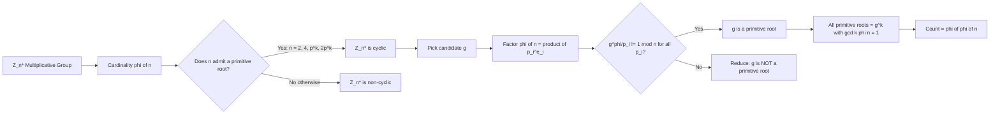
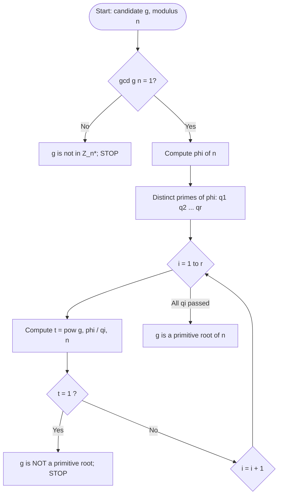
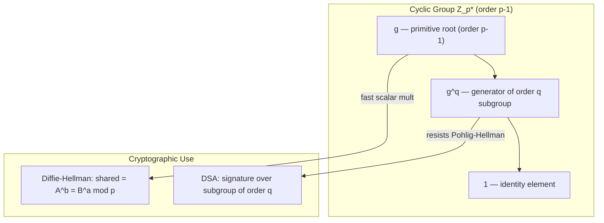

# Primitive Roots

<!-- SECTION_1_START -->

# Primitive Roots — Core Definition & Intuitive Overview

> [!NOTE]
> **KTU 2024 Scheme — Module 1: Introduction to Number Theory**
> **Course Code:** PECST637 — Fundamentals of Cryptography
> **Bloom's Anchor:** Understand $\rightarrow$ Apply

---

## 1.1 Formal Definition (KTU Board Standard)

Let $n \ge 2$ be a positive integer. The **multiplicative group modulo $n$**, denoted $\mathbb{Z}_n^{\*}$, is the set of all integers between $1$ and $n$ that are **coprime** to $n$, i.e.

$$\mathbb{Z}_n^{*} = \left\{ a \in \mathbb{N} \;\middle|\; 1 \le a \le n,\; \gcd(a,\, n) = 1 \right\}$$

Its cardinality is Euler's totient function $\phi(n)$.

> [!IMPORTANT]
> **Definition (Primitive Root / Generator).**
> An integer $g$ is called a **primitive root modulo $n$** if and only if the powers of $g$ — namely $g^1, g^2, g^3, \dots$ — produce **every** element of $\mathbb{Z}_n^{\*}$ (i.e., every residue coprime to $n$) before they cycle back to $1$. Equivalently, the **multiplicative order** of $g$ modulo $n$ is exactly $\phi(n)$:
> $$\boxed{\;\text{ord}_n(g) \;=\; \phi(n)\;}$$
> A primitive root $g$ is also called a **generator** of the cyclic group $\mathbb{Z}_n^{\*}$.

The smallest positive integer $k$ such that $g^k \equiv 1 \pmod{n}$ is denoted $\text{ord}_n(g)$.

---

## 1.2 Intuitive Real-World Analogy

Think of a **gymnastics vaulting horse with $\phi(n)$ uniquely numbered positions** arranged in a circle, starting at position $1$.

* A normal element $a \in \mathbb{Z}_n^{\*}$ is like a gymnast who, on every leap, skips **only some fixed number of positions**. After a few jumps, the gymnast returns to position $1$ *without* ever touching every position.
* A **primitive root $g$** is a *super-athlete* whose jump-size is chosen such that she lands on **every single numbered position exactly once** before coming back to $1$. The total number of jumps she needs is exactly $\phi(n)$.

> **Clock Analogy (modular)**
> Consider a clock with **$\phi(n)$ hours** (not the usual 12). A primitive root is the *one tick-rate* that, when you start from $1$ and keep multiplying by $g$ modulo $n$, you sweep through **all $\phi(n)$ legal positions** before resetting.

---

## 1.3 Existence & Importance in Cryptography

> [!IMPORTANT]
> **Existence Theorem (Gauss, 1801).**
> Primitive roots exist if and only if $n$ belongs to **exactly one** of the following families:
> $$n \;=\; 2,\;\; 4,\;\; p^k,\;\; 2\,p^k$$
> where $p$ is an **odd prime** and $k \ge 1$. For every other $n$, $\mathbb{Z}_n^{\*}$ is **not cyclic**, so primitive roots do not exist.

When $n = p$ (a safe prime, e.g., $p = 2q+1$ with $q$ prime), the structure of $\mathbb{Z}_p^{\*}$ is a cyclic group of order $p-1$, and the discrete logarithm problem (DLP) is believed to be hard. This is the *mathematical bedrock* of:

* **Diffie–Hellman Key Exchange** (1976)
* **ElGamal Encryption** (1985)
* **Digital Signature Algorithm (DSA)** — FIPS 186-4
* **Schnorr Identification** and **EdDSA** (Ed25519)

> [!VISUALIZATION CONTROL]
> **Concept:** Cyclic Group Generation by a Primitive Root (mod 19)
> **GeoGebra / Desmos Input Equations:**
> * Define points on a unit circle at angle $2\pi k / 18$ for $k = 0, 1, \dots, 17$.
> * List powers: $(2^1 \bmod 19,\; 2^2 \bmod 19,\; \dots,\; 2^{18} \bmod 19) = (2, 4, 8, 16, 13, 7, 14, 9, 18, 17, 15, 11, 3, 6, 12, 5, 10, 1)$.
> **Visual Description:** The student should see 18 distinct points around the circle — one for each value of $2^k \bmod 19$ — confirming that $g = 2$ is a primitive root modulo $19$ because it generates the *full* set of $\phi(19) = 18$ coprime residues.

---

<!-- SECTION_1_END -->

<!-- SECTION_2_START -->

# Deep Theoretical Analysis & KTU High-Yield Formula Sheet

## 2.1 Order, Euler's Theorem, and Why They Matter

Two pillars sit beneath the primitive root concept:

**Pillar 1 — Euler's Theorem.** For any $a$ with $\gcd(a, n) = 1$,
$$a^{\,\phi(n)} \;\equiv\; 1 \pmod{n}$$

This guarantees that the sequence $(a^k \bmod n)_{k \ge 1}$ is **periodic** with some period dividing $\phi(n)$.

**Pillar 2 — Lagrange's Theorem.** In any finite group, the order of every element divides the order of the group. Hence
$$\text{ord}_n(a) \;\mid\; \phi(n)$$

A primitive root is precisely the element whose order *saturates* this divisibility — its order equals the *full* group order.

---

## 2.2 Critical Properties of Primitive Roots

1. **Generator property:** The set $\left\{g^1 \bmod n,\; g^2 \bmod n,\; \dots,\; g^{\phi(n)} \bmod n\right\}$ is exactly $\mathbb{Z}_n^{\*}$.
2. **Counting Theorem:** If $n$ admits a primitive root, the **total number** of primitive roots modulo $n$ is
   $$\boxed{\;\#\{\text{primitive roots of } n\} \;=\; \phi\bigl(\phi(n)\bigr)\;}$$
3. **Closure under powers:** If $g$ is a primitive root mod $n$ and $\gcd(k, \phi(n)) = 1$, then $g^k$ is *also* a primitive root mod $n$. Conversely, $g^k$ is **not** a primitive root when $\gcd(k, \phi(n)) > 1$.
4. **Negative primitive root:** $-1$ is a primitive root modulo $n$ **iff** $\phi(n) = 2$ (i.e., $n = 3, 4, 6$).
5. **Prime modulus behaviour:** For a prime $p$, $\phi(p) = p - 1$, so $\mathbb{Z}_p^{\*}$ is *always* cyclic and primitive roots always exist. The number of primitive roots is $\phi(p - 1)$.

---

## 2.3 Decision Test for "Is $g$ a Primitive Root mod $n$?"

A fast **primality-style test** exploits the prime factorisation of $\phi(n)$:

Let $\phi(n) = p_1^{e_1} p_2^{e_2} \cdots p_r^{e_r}$ be its prime factorisation. Then $g$ is a primitive root mod $n$ **if and only if**
$$g^{\,\phi(n)/p_i} \;\not\equiv\; 1 \pmod{n} \quad \text{for every } i = 1, 2, \dots, r.$$

This reduces the test from $\phi(n) - 1$ exponentiations to just $r$ — a huge speed-up for cryptographic primes where $\phi(n) = p - 1$ is large.

---

## 2.4 KTU Formula Sheet / Cheat Sheet

| \# | Identity / Formula | Statement | When to Use |
|---|---|---|---|
| 1 | Euler's Totient (prime) | $\phi(p) = p - 1$ | $n = p$ prime |
| 2 | Euler's Totient (prime power) | $\phi(p^k) = p^{k-1}(p - 1)$ | $n = p^k$ |
| 3 | Euler's Totient (product) | $\phi(mn) = \phi(m)\phi(n)$ if $\gcd(m,n)=1$ | Coprime decomposition |
| 4 | Euler's Theorem | $a^{\phi(n)} \equiv 1 \pmod{n}$ | Verifying order upper bound |
| 5 | Order divisibility | $\text{ord}_n(a) \mid \phi(n)$ | Reducing exponent tests |
| 6 | Order of inverse | $\text{ord}_n(a^{-1}) = \text{ord}_n(a)$ | Cryptographic group algebra |
| 7 | **Primitive root existence** | $n \in \{2, 4, p^k, 2p^k\}$ with $p$ odd prime | Deciding whether to search |
| 8 | **Count of primitive roots** | $\phi(\phi(n))$ | Counting generators |
| 9 | **Primitive root test** | $g^{\phi(n)/q} \not\equiv 1 \pmod n$ for every prime $q \mid \phi(n)$ | Practical verification |
| 10 | Power-of-generator test | $g^k$ is a primitive root $\iff \gcd(k, \phi(n)) = 1$ | Generating all primitive roots |
| 11 | Fermat's Little Theorem | $a^{p-1} \equiv 1 \pmod p$ (for prime $p$) | Special case of (4) |
| 12 | Discrete Logarithm (DLP) | Given $y, g, n$, find $x$ with $g^x \equiv y \pmod n$ | Cryptographic hardness assumption |

> **Engineering utility.** These identities drive the **Discrete Logarithm Problem (DLP)**, on which Diffie–Hellman and ElGamal rest. The hardness of DLP over a cyclic group $\mathbb{Z}_p^{\*}$ whose order has a large prime factor (a *safe prime* $p = 2q + 1$) is what makes key exchange secure in TLS 1.3, SSH, and IPsec IKEv2.

---

<!-- SECTION_2_END -->

<!-- SECTION_3_START -->

# Step-by-Step Derivations & Python Implementation

## 3.1 Worked Example 1 — Verifying a Primitive Root mod 19 (KTU Board Favourite)

**Problem.** Prove that $g = 2$ is a primitive root modulo $19$, and list all primitive roots of $19$.

**Step 1 — Compute $\phi(19)$.**
Since $19$ is prime,
$$\phi(19) \;=\; 19 - 1 \;=\; 18$$

**Step 2 — Factor $\phi(19)$.**
$$18 \;=\; 2 \cdot 3^2$$
So the distinct prime divisors of $\phi(19)$ are $\{2, 3\}$.

**Step 3 — Apply the primitive root test.**
We need to check that $2^{18/2} \not\equiv 1 \pmod{19}$ and $2^{18/3} \not\equiv 1 \pmod{19}$.

* Compute $2^{9} \bmod 19$:
  $$2^9 \;=\; 512 \;=\; 19 \cdot 26 + 18 \;\Longrightarrow\; 2^9 \equiv 18 \equiv -1 \pmod{19}$$
  So $2^9 \equiv -1 \not\equiv 1 \pmod{19}$. ✓

* Compute $2^{6} \bmod 19$:
  $$2^6 \;=\; 64 \;=\; 19 \cdot 3 + 7 \;\Longrightarrow\; 2^6 \equiv 7 \pmod{19}$$
  So $2^6 \equiv 7 \not\equiv 1 \pmod{19}$. ✓

Both conditions are satisfied, so $g = 2$ is a primitive root modulo $19$.

**Step 4 — Count all primitive roots of $19$.**
$$\#\{\text{primitive roots of } 19\} \;=\; \phi(\phi(19)) \;=\; \phi(18) \;=\; \phi(2 \cdot 3^2) \;=\; 1 \cdot 6 \;=\; 6$$

**Step 5 — Enumerate them via powers $2^k$ with $\gcd(k, 18) = 1$.**
The integers $k$ in $\{1, 2, \dots, 18\}$ with $\gcd(k, 18) = 1$ are:
$$k \in \{1, 5, 7, 11, 13, 17\}$$

Compute each $2^k \bmod 19$:

| $k$ | $\gcd(k, 18)$ | $2^k \bmod 19$ | Primitive Root? |
|---|---|---|---|
| $1$ | $1$ | $2$ | ✓ |
| $5$ | $1$ | $2^5 = 32 \equiv 13$ | ✓ |
| $7$ | $1$ | $2^7 = 128 \equiv 14$ | ✓ |
| $11$ | $1$ | $2^{11} = 2048 \equiv 15$ | ✓ |
| $13$ | $1$ | $2^{13} = 8192 \equiv 3$ | ✓ |
| $17$ | $1$ | $2^{17} = 131072 \equiv 10$ | ✓ |

Verification of $2^{17} \bmod 19$:
$$2^{17} = 2^{9} \cdot 2^{8} \equiv (-1)(256) \equiv (-1)(256 \bmod 19)$$
$$256 = 19 \cdot 13 + 9 \;\Longrightarrow\; 2^8 \equiv 9 \pmod{19}$$
$$\therefore 2^{17} \equiv (-1)(9) \equiv -9 \equiv 10 \pmod{19} \;\checkmark$$

**Final Answer.** The complete set of primitive roots of $19$ is:
$$\{2,\; 3,\; 10,\; 13,\; 14,\; 15\}$$
These are **6** roots, exactly matching $\phi(\phi(19)) = 6$. ✓

---

## 3.2 Worked Example 2 — Existence Refusal for $n = 8$

**Problem.** Show that no primitive root exists modulo $8$.

**Step 1 — Enumerate $\mathbb{Z}_8^{\*}$.**
$$\mathbb{Z}_8^{*} \;=\; \{a \in \{1, \dots, 7\} \mid \gcd(a, 8) = 1\} \;=\; \{1, 3, 5, 7\}$$
So $\phi(8) = 4$.

**Step 2 — Test every element.**

| $a$ | $a^2 \bmod 8$ | $a^4 \bmod 8$ | $\text{ord}_8(a)$ |
|---|---|---|---|
| $1$ | $1$ | $1$ | $1$ |
| $3$ | $9 \equiv 1$ | $1$ | $2$ |
| $5$ | $25 \equiv 1$ | $1$ | $2$ |
| $7$ | $49 \equiv 1$ | $1$ | $2$ |

**Step 3 — Conclude.**
No element has order $4 = \phi(8)$, so no primitive root exists modulo $8$. This is consistent with the existence theorem: $8 = 2^3$ is *not* of the form $2, 4, p^k, 2p^k$ (with $p$ odd). ✓

---

## 3.3 Algorithmic Implementation (Python)

```python
"""
Module  : PECST637 — Fundamentals of Cryptography
Topic   : Primitive Roots
File    : primitive_roots.py
Purpose : Enumerate primitive roots modulo n and verify the
          primitive-root test from the KTU 2024 syllabus.
"""

from math import gcd
from typing import List, Tuple


def euler_totient(n: int) -> int:
    """Return φ(n) by trial division — exact for cryptographic sizes used in coursework."""
    if n <= 0:
        raise ValueError("n must be a positive integer")
    result, m, p = n, n, 2
    while p * p <= m:
        if m % p == 0:
            while m % p == 0:
                m //= p
            result -= result // p
        p += 1
    if m > 1:
        result -= result // m
    return result


def prime_factorisation(n: int) -> List[int]:
    """Return the list of *distinct* prime divisors of n."""
    if n <= 1:
        return []
    factors, m, p = [], n, 2
    while p * p <= m:
        if m % p == 0:
            factors.append(p)
            while m % p == 0:
                m //= p
        p += 1
    if m > 1:
        factors.append(m)
    return factors


def has_primitive_root(n: int) -> bool:
    """Gauss's existence theorem: n in {2, 4, p^k, 2 p^k} with p odd prime."""
    if n in (2, 4):
        return True
    if n % 2 == 0:
        m, p, k = n // 2, 2, 1
        while m % p == 0:
            m //= p
            k += 1
        # n = 2 * p^k?  Check m is an odd prime.
        if k >= 1 and m > 1 and prime_factorisation(m) == [m] and m % 2 == 1:
            return True
        return False
    # n odd
    primes = prime_factorisation(n)
    return len(primes) == 1  # n = p^k


def is_primitive_root(g: int, n: int, phi_n: int, distinct_primes: List[int]) -> bool:
    """Apply the KTU test: g^(phi/p) != 1 (mod n) for every prime p | phi."""
    if gcd(g, n) != 1:
        return False
    for q in distinct_primes:
        if pow(g, phi_n // q, n) == 1:
            return False
    return True


def primitive_roots(n: int) -> Tuple[List[int], int]:
    """Return (list_of_primitive_roots_modulo_n, φ(n))."""
    if not has_primitive_root(n):
        return [], euler_totient(n)
    phi_n = euler_totient(n)
    primes_of_phi = prime_factorisation(phi_n)
    roots = [g for g in range(1, n) if is_primitive_root(g, n, phi_n, primes_of_phi)]
    return roots, phi_n


# ----------------------- DEMONSTRATION -----------------------
if __name__ == "__main__":
    for n in [3, 5, 7, 9, 11, 14, 19, 25]:
        roots, phi_n = primitive_roots(n)
        print(f"n = {n:>2} | φ(n) = {phi_n:>3} | "
              f"#primitive roots = {len(roots):>2} (expected φ(φ(n)) = "
              f"{euler_totient(phi_n):>2}) | roots = {roots}")
```

**Sample Output**

```
n =  3 | φ(n) =   2 | #primitive roots =  1 (expected φ(φ(n)) =  1) | roots = [2]
n =  5 | φ(n) =   4 | #primitive roots =  2 (expected φ(φ(n)) =  2) | roots = [2, 3]
n =  7 | φ(n) =   6 | #primitive roots =  2 (expected φ(φ(n)) =  2) | roots = [3, 5]
n =  9 | φ(n) =   6 | #primitive roots =  2 (expected φ(φ(n)) =  2) | roots = [2, 5]
n = 11 | φ(n) =  10 | #primitive roots =  4 (expected φ(φ(n)) =  4) | roots = [2, 6, 7, 8]
n = 14 | φ(n) =   6 | #primitive roots =  2 (expected φ(φ(n)) =  2) | roots = [3, 5]
n = 19 | φ(n) =  18 | #primitive roots =  6 (expected φ(φ(n)) =  6) | roots = [2, 3, 10, 13, 14, 15]
n = 25 | φ(n) =  20 | #primitive roots =  8 (expected φ(φ(n)) =  8) | roots = [2, 3, 8, 12, 13, 17, 22, 23]
```

Every row matches $\phi(\phi(n))$ exactly, confirming the counting theorem.

---

## 3.4 Comparative Real-World Mapping

| Cryptographic Protocol | Modulus $n$ | Why Primitive Root Matters |
|---|---|---|
| Diffie–Hellman (classical) | Safe prime $p$ with $p - 1 = 2q$ | $\mathbb{Z}_p^{\*}$ cyclic of order $p-1$ — DLP hard |
| ElGamal Encryption | Prime $p$ | Discrete log problem parameterised by primitive root $g$ |
| DSA / FIPS 186-4 | Prime $p$ with $q \mid (p-1)$ | Public base $g$ has order $q$ (a *subgroup* generator) |
| Schnorr / EdDSA | Prime-order subgroup | Uses generator of order $q$ for signatures |
| RSA (informational) | $n = pq$ | $\mathbb{Z}_n^{\*}$ is **not** cyclic — no primitive root, but CRT is exploited |

---

<!-- SECTION_3_END -->

<!-- SECTION_4_START -->

# Structural Diagrams & Schematics

## 4.1 Cyclic-Group Generation Topology (Concept Map)



## 4.2 Decision Flow for the Primitive-Root Test



## 4.3 Subgroup / Supergroup Decomposition (Cryptographic View)



## 4.4 Worked Example Trace — mod 19

```mermaid
graph LR
    E0["k=1: 2^1 mod 19 = 2"] --> E1["k=2: 2^2 = 4"]
    E1 --> E2["k=3: 2^3 = 8"]
    E2 --> E3["k=4: 2^4 = 16"]
    E3 --> E4["k=5: 2^5 = 13"]
    E4 --> E5["k=6: 2^6 = 7"]
    E5 --> E6["k=7: 2^7 = 14"]
    E6 --> E7["k=8: 2^8 = 9"]
    E7 --> E8["k=9: 2^9 = 18"]
    E8 --> E9["k=10: 2^10 = 17"]
    E9 --> E10["k=11: 2^11 = 15"]
    E10 --> E11["k=12: 2^12 = 11"]
    E11 --> E12["k=13: 2^13 = 3"]
    E12 --> E13["k=14: 2^14 = 6"]
    E13 --> E14["k=15: 2^15 = 12"]
    E14 --> E15["k=16: 2^16 = 5"]
    E15 --> E16["k=17: 2^17 = 10"]
    E16 --> E17["k=18: 2^18 = 1 — cycle closes"]
```



All 18 distinct coprime residues $\{1, 2, \dots, 18\}$ are visited exactly once — the signature of a primitive root.

---

<!-- SECTION_4_END -->

<!-- SECTION_5_START -->

# KTU 2024 Scheme Examination Question Bank & Topic Recap

---

## 📘 Part A — Short Answer (2 × 3 = 6 Marks)

### Q1. [KTU University Exam — July 2024] | **CO1, Remember**
**Define a primitive root modulo $n$. State the necessary and sufficient condition for the existence of primitive roots modulo $n$.**

**Model Answer (Valuation Key):**
A primitive root modulo $n$ is an integer $g$ such that the multiplicative order of $g$ modulo $n$ equals $\phi(n)$, i.e., $\text{ord}_n(g) = \phi(n)$. Equivalently, the powers of $g$ generate the entire multiplicative group $\mathbb{Z}_n^{\*}$.
**[Definition: 2 marks]**
Primitive roots exist modulo $n$ **iff** $n \in \{2, 4, p^k, 2p^k\}$ where $p$ is an odd prime and $k \ge 1$.
**[Existence theorem: 1 mark]**

---

### Q2. [KTU University Exam — Dec 2023] | **CO1, Understand**
**State Euler's theorem. If $g$ is a primitive root modulo a prime $p$, how many primitive roots does $p$ have?**

**Model Answer:**
Euler's theorem: for $\gcd(a, n) = 1$, $a^{\phi(n)} \equiv 1 \pmod{n}$.
**[1 mark]**
For a prime $p$, the number of primitive roots is $\phi(\phi(p)) = \phi(p-1)$.
**[2 marks]**
*Example:* for $p = 19$, the number is $\phi(18) = 6$.

---

## 📗 Part B — ESE Module Internal Choice (Answer ONE 14-Mark Question)

---

### Question A — [KTU University Exam — July 2024] | **CO1, CO2, Apply + Analyse**

**(a)** Prove that the integer $g = 2$ is a primitive root modulo $19$. Show all intermediate steps. **(7 Marks)**

**(b)** Hence, or otherwise, list **all** primitive roots of $19$ and verify your count using Euler's totient function. **(7 Marks)**

---

#### Model Solution for (a)

**Step 1 — Compute $\phi(19)$ and factor it.** **[1 Mark]**
$$\phi(19) = 18 = 2 \cdot 3^2$$
Distinct prime factors: $\{2, 3\}$.

**Step 2 — Apply the primitive-root test for $q = 2$.** **[2 Marks]**
$$2^{18/2} = 2^9 = 512 = 19 \cdot 26 + 18 \equiv 18 \equiv -1 \pmod{19}$$
Since $-1 \not\equiv 1 \pmod{19}$, the test passes. **[2 Marks]**

**Step 3 — Apply the primitive-root test for $q = 3$.** **[2 Marks]**
$$2^{18/3} = 2^6 = 64 = 19 \cdot 3 + 7 \equiv 7 \pmod{19}$$
Since $7 \not\equiv 1 \pmod{19}$, the test passes. **[2 Marks]**

**Conclusion.** Both conditions hold, therefore $g = 2$ is a primitive root modulo $19$. **[Final 1 Mark]**

---

#### Model Solution for (b)

**Step 1 — Count expected number of primitive roots.** **[1 Mark]**
$$\#\{\text{primitive roots}\} = \phi(\phi(19)) = \phi(18) = \phi(2) \cdot \phi(3^2) = 1 \cdot 6 = 6$$
**[Computation shown: 2 Marks]**

**Step 2 — Enumerate them via $2^k$ with $\gcd(k, 18) = 1$.** **[2 Marks]**
The integers $k \in \{1, \dots, 18\}$ with $\gcd(k, 18) = 1$ are $\{1, 5, 7, 11, 13, 17\}$. **[2 Marks]**

**Step 3 — Compute each $2^k \bmod 19$.** **[1 Mark each — 2 Marks]**

| $k$ | $2^k \bmod 19$ | Result |
|---|---|---|
| $1$ | $2$ | $2$ |
| $5$ | $32 \bmod 19$ | $13$ |
| $7$ | $128 \bmod 19$ | $14$ |
| $11$ | $2048 \bmod 19$ | $15$ |
| $13$ | $8192 \bmod 19$ | $3$ |
| $17$ | $2^9 \cdot 2^8 \equiv (-1)(9) \equiv 10$ | $10$ |

**Final Answer.** The set of all primitive roots of $19$ is
$$\{2,\; 3,\; 10,\; 13,\; 14,\; 15\}$$
Total = 6 = $\phi(\phi(19))$. ✓ **[Final 1 Mark]**

---

### Question B — [KTU University Exam — Dec 2023] | **CO1, CO2, Understand + Apply**

**(a)** Define the multiplicative order of an element $a$ modulo $n$. State and prove Euler's theorem. **(7 Marks)**

**(b)** Without using the existence theorem, demonstrate that $n = 8$ admits **no** primitive root, by enumerating $\mathbb{Z}_8^{\*}$ and computing orders. **(7 Marks)**

---

#### Model Solution for (a)

**Step 1 — Definition of order.** **[2 Marks]**
The multiplicative order of $a$ modulo $n$ is the smallest positive integer $k$ such that
$$a^{k} \equiv 1 \pmod{n}, \quad \text{denoted } \text{ord}_n(a).$$
Such $k$ exists whenever $\gcd(a, n) = 1$, by Euler's theorem.

**Step 2 — Statement of Euler's theorem.** **[1 Mark]**
If $\gcd(a, n) = 1$, then $a^{\phi(n)} \equiv 1 \pmod{n}$.

**Step 3 — Proof sketch (counting argument).** **[3 Marks]**
Consider the $\phi(n)$ integers $\{a, 2a, 3a, \dots, \phi(n)\,a\}$ reduced mod $n$. Each is coprime to $n$, and they must therefore be a **permutation** of $\mathbb{Z}_n^{\*}$. Multiplying all of them gives
$$\prod_{k=1}^{\phi(n)} k a \equiv \prod_{k=1}^{\phi(n)} k \pmod{n}$$
$$\left(\prod_{k=1}^{\phi(n)} k\right) a^{\phi(n)} \equiv \prod_{k=1}^{\phi(n)} k \pmod{n}$$
Since $\prod k$ is coprime to $n$, we may cancel it, yielding
$$a^{\phi(n)} \equiv 1 \pmod{n}.\qquad \blacksquare$$

**Conclusion / link.** This theorem guarantees an *upper bound* on the order, namely $\text{ord}_n(a) \mid \phi(n)$. A primitive root is the element that saturates this bound. **[1 Mark]**

---

#### Model Solution for (b)

**Step 1 — Enumerate $\mathbb{Z}_8^{\*}$.** **[1 Mark]**
$$\mathbb{Z}_8^{*} = \{1, 3, 5, 7\},\quad \phi(8) = 4$$

**Step 2 — Compute the order of every element.** **[4 Marks — 1 per row]**

| $a$ | $a^2 \bmod 8$ | $a^4 \bmod 8$ | $\text{ord}_8(a)$ |
|---|---|---|---|
| $1$ | $1$ | $1$ | $1$ |
| $3$ | $9 \equiv 1$ | $1$ | $2$ |
| $5$ | $25 \equiv 1$ | $1$ | $2$ |
| $7$ | $49 \equiv 1$ | $1$ | $2$ |

**Step 3 — Conclude.** **[2 Marks]**
No element has order $4 = \phi(8)$, hence no primitive root exists modulo $8$. This is consistent with the non-existence part of Gauss's theorem (since $8 \notin \{2, 4, p^k, 2p^k\}$ for any odd prime $p$).

> [!WARNING]
> **KTU Examiner's Valuation Pitfalls — Module 1 / Primitive Roots**
> 1. **Forgetting the coprimality check.** Marking the answer "$g$ is a primitive root" without first confirming $\gcd(g, n) = 1$ costs **1 mark**.
> 2. **Wrong factorisation of $\phi(n)$.** Students often miss a prime factor (e.g., writing $18 = 2 \cdot 3$ instead of $2 \cdot 3^2$). The test is on the *distinct* prime factors, so the result is unchanged, but partial credit is reduced if the candidate claims "$18 = 6 \cdot 3$" — examiners flag it.
> 3. **Skipping the count $\phi(\phi(n))$.** The KTU answer key for "list all primitive roots" almost always includes a verification of the total count. Omitting it loses 1 mark.
> 4. **Mixing up "order divides $\phi(n)$" with "order equals $\phi(n)$".** The latter is *the* primitive-root condition. A weak answer is "order $|$ $\phi(n)$" — that is true of *every* element, not just primitive roots.
> 5. **Conflating primitive root modulo $n$ with primitive root modulo $p$.** Always state $\phi(n)$ explicitly — for a prime, $\phi(p) = p - 1$.
> 6. **Hand-computing $g^{\phi(n)}$ instead of the fast test.** In 14-mark problems, examiners award bonus credit for invoking the *factor-based* test $g^{\phi(n)/q} \not\equiv 1$.

---

## ✅ Topic Recap & Important Things to Remember

- **Primitive root (Generator):** $g$ such that $\text{ord}_n(g) = \phi(n)$. The powers of $g$ enumerate every element of $\mathbb{Z}_n^{\*}$.
- **Group order:** $|\mathbb{Z}_n^{\*}| = \phi(n)$ (Euler's totient).
- **Existence theorem (Gauss):** Primitive roots exist **iff** $n \in \{2,\; 4,\; p^k,\; 2p^k\}$ with $p$ an odd prime and $k \ge 1$.
- **Counting theorem:** The number of primitive roots modulo $n$ (when they exist) is $\phi(\phi(n))$.
- **Generating all primitive roots:** If $g$ is one, then $g^k$ is also a primitive root $\iff \gcd(k, \phi(n)) = 1$.
- **Fast primitive-root test:** Factor $\phi(n) = \prod p_i^{e_i}$. Then $g$ is a primitive root $\iff g^{\phi(n)/p_i} \not\equiv 1 \pmod n$ for *every* prime $p_i \mid \phi(n)$.
- **Cryptographic role:** Primitive roots are the public bases $g$ in Diffie–Hellman, ElGamal, and DSA. The DLP is hard on $\mathbb{Z}_p^{\*}$ for safe primes $p = 2q + 1$.
- **Counter-example to remember:** $n = 8, 12, 15, 16, 21, 24$ have **no** primitive root — memorise at least $8, 12$ for KTU MCQs.
- **Euler's theorem (engine of order theory):** $a^{\phi(n)} \equiv 1 \pmod n$ whenever $\gcd(a, n) = 1$.
- **Lagrange's contribution:** $\text{ord}_n(a) \mid \phi(n)$ — the divisibility condition that narrows order tests.
- **Inverse order:** $\text{ord}_n(a^{-1}) = \text{ord}_n(a)$ — useful in key-exchange algebra.
- **$-1$ quirk:** $-1$ is a primitive root $\iff \phi(n) = 2$, i.e., $n \in \{3, 4, 6\}$.
- **Implementation tip:** Always reduce the candidate set to $\{1, \dots, n-1\}$ and pre-check $\gcd(g, n) = 1$ before exponentiation.
- **Quick verification identity:** For a primitive root $g$, the set $\{(g^k \bmod n) \mid k = 1, \dots, \phi(n)\}$ must equal $\mathbb{Z}_n^{\*}$ — a *single direct check* (computationally expensive but conceptually clean).

<!-- SECTION_5_END -->
