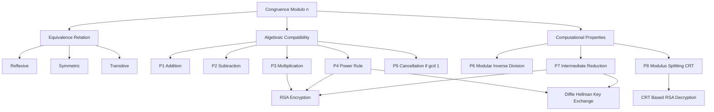
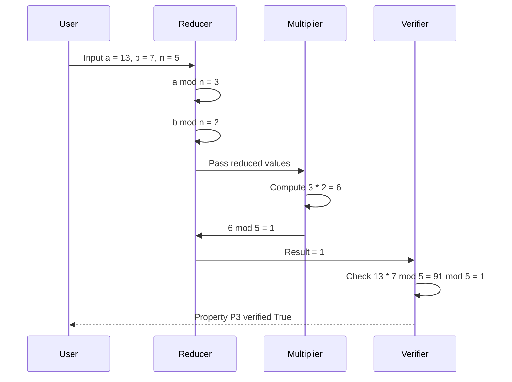
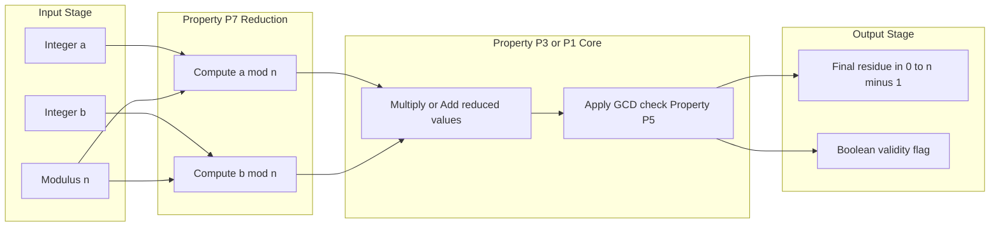
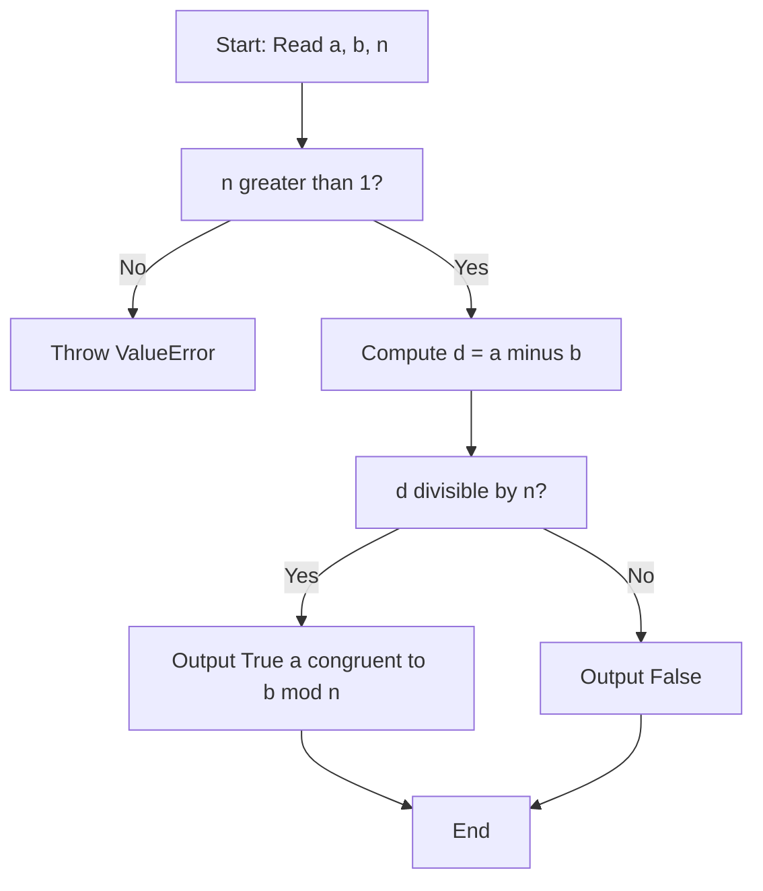

# Properties of Congruences

<!-- SECTION_1_START -->
# 1. Core Technical Definition & Intuitive Overview

## 1.1 Formal Academic Definition

In the context of **KTU 2024 Scheme (PECST637 – Fundamentals of Cryptography, Module 1)**, *congruence* is a foundational number-theoretic relation that allows integer arithmetic to be "wrapped around" a fixed modulus. 

Given three integers $a$, $b$, and a positive integer $n$ (the **modulus**, with $n > 1$), we say that $a$ is **congruent to** $b$ **modulo** $n$, written as:

$$a \equiv b \pmod{n}$$

if and only if $n$ divides the difference $(a - b)$, i.e.:

$$n \mid (a - b)$$

Equivalently, the integer $a$ can be expressed in the canonical form $a = qn + r$ where $0 \le r < n$, and $a \equiv r \pmod{n}$. The integer $r$ is called the **least non-negative residue** of $a$ modulo $n$.

> [!IMPORTANT]
> **KTU Syllabus Highlight:** Congruence is the *language* of public-key cryptography. Every cipher in RSA, Diffie–Hellman, and elliptic curve systems is described entirely through modular congruences. Mastering the algebraic properties of congruences is a prerequisite to understanding modular exponentiation and primitive roots later in Module 2.

> [!NOTE]
> **Notation Distinction (Examiners check this):**
> - $a \equiv b \pmod{n}$ — a *relation* (a statement that is true or false).
> - $a \bmod n$ — an *operation* (returns the unique residue $r$ in $[0, n-1]$).
> Writing "$a = b \pmod{n}$" is a common student error and **loses marks** in valuation.

## 1.2 Conceptual Analogy & Intuition

Think of a **24-hour analog clock** that displays only the hours $0$ to $11$.

- If the current time is **9 o'clock** and you wait **5 hours**, the clock shows **2 o'clock**.
- Written as a congruence: $9 + 5 \equiv 2 \pmod{12}$.
- The clock has "forgotten" the multiple of $12$ (i.e. $14 = 1 \cdot 12 + 2$) and only retains the remainder $2$.

So congruence modulo $n$ is exactly the act of **"forgetting how many full laps we made around a cycle of length $n$ and remembering only the position on the dial."** Every cryptographic primitive later in this course (RSA, AES's MixColumns, hash functions) ultimately relies on this "wrap-around" behavior to ensure that the result of any computation fits inside a fixed, predictable numerical window.

> [!TIP]
> **Intuition Check:** Why is $n > 1$ required? Because modulo $1$, every integer is congruent to $0$ (since $1$ divides every difference). The relation becomes trivial and cryptographically useless. This is why all cryptographic moduli (RSA's $N$, DH's prime $p$) are explicitly $\ge 2$.

## 1.3 The Three Foundational Properties of Equality (Foundation of Congruence)

Before studying *properties* of congruences, a KTU examiner expects the equivalence-relation proof. Congruence modulo $n$ is an **equivalence relation** on the set of integers $\mathbb{Z}$:

| Property | Statement | Intuitive Meaning |
|---|---|---|
| **Reflexive** | $a \equiv a \pmod{n}$ | Every integer is congruent to itself (always $n \mid 0$). |
| **Symmetric** | $a \equiv b \pmod{n} \;\Rightarrow\; b \equiv a \pmod{n}$ | If $n \mid (a-b)$, then $n \mid -(a-b) = (b-a)$. |
| **Transitive** | $a \equiv b \pmod{n}$ and $b \equiv c \pmod{n} \;\Rightarrow\; a \equiv c \pmod{n}$ | Divides-add: $n \mid (a-b)$ and $n \mid (b-c)$ together give $n \mid (a-c)$. |

These three properties are what allow the integers to be partitioned into **residue classes** modulo $n$ — a concept central to the construction of the group $\mathbb{Z}_n$ used throughout cryptography.

> [!VISUALIZATION CONTROL]
> **Concept:** Visualizing the 3 residue classes of $\mathbb{Z}_6$ as three concentric "rings" on a number line.
> **GeoGebra / Desmos Input Equations:**
> - List 1: `x = 0, 6, 12, 18` (residue $0$)
> - List 2: `x = 1, 7, 13, 19` (residue $1$)
> - List 3: `x = 2, 8, 14, 20` (residue $2$)
> - List 4: `x = 3, 9, 15, 21` (residue $3$)
> - List 5: `x = 4, 10, 16, 22` (residue $4$)
> - List 6: `x = 5, 11, 17, 23` (residue $5$)
> **Visual Description:** The student should observe **six parallel vertical columns of points** evenly spaced by the modulus $6$. Each column is one residue class — all points in a column are pairwise congruent modulo $6$.
<!-- SECTION_1_END -->

<!-- SECTION_2_START -->
# 2. Deep Theoretical Analysis & KTU High-Yield Formula Sheet

## 2.1 The Core Algebraic Properties of Congruences

Let $n$ be a fixed positive modulus. For any integers $a, b, c, d$ the following **eight** properties hold. They are the working toolkit for every KTU cryptography problem.

### Property P1 — Compatibility with Addition
$$a \equiv b \pmod{n} \;\;\text{and}\;\; c \equiv d \pmod{n} \;\;\Longrightarrow\;\; (a + c) \equiv (b + d) \pmod{n}$$

*Special case:* If $a \equiv b \pmod{n}$, then $(a + c) \equiv (b + c) \pmod{n}$ for any integer $c$.

### Property P2 — Compatibility with Subtraction
$$(a - c) \equiv (b - d) \pmod{n}$$

### Property P3 — Compatibility with Multiplication
$$(a \cdot c) \equiv (b \cdot d) \pmod{n}$$

*Special case:* If $a \equiv b \pmod{n}$, then $(a \cdot c) \equiv (b \cdot c) \pmod{n}$ for any integer $c$.

### Property P4 — Compatibility with Powers (Repeated Multiplication)
If $a \equiv b \pmod{n}$, then for any non-negative integer $k$:
$$a^{k} \equiv b^{k} \pmod{n}$$

This is the **single most important property for RSA**, where the ciphertext is computed as $C \equiv M^{e} \pmod{N}$ and the verifier must check $M \equiv C^{d} \pmod{N}$.

### Property P5 — Cancellation (with a *caution* flag)
If $(a \cdot c) \equiv (b \cdot c) \pmod{n}$ and $\gcd(c, n) = 1$, then $a \equiv b \pmod{n}$.

> [!WARNING]
> Cancellation **fails** when $\gcd(c, n) \ne 1$. Counter-example: $4 \cdot 2 \equiv 6 \cdot 2 \pmod{4}$ gives $8 \equiv 12 \pmod{4}$, i.e. $0 \equiv 0$, but $4 \not\equiv 6 \pmod{4}$ since $4-6 = -2$ is not divisible by $4$. This pitfall costs 1–2 marks in KTU valuation.

### Property P6 — Division by a Coprime
If $\gcd(c, n) = 1$ and $a \cdot c \equiv b \cdot c \pmod{n}$, the cancellation above permits a true "division by $c$" in the modular world — implemented as multiplication by the multiplicative inverse $c^{-1} \pmod{n}$.

### Property P7 — Modulus Reduction (Intermediate Computation)
$$a \cdot b \bmod n = \big((a \bmod n) \cdot (b \bmod n)\big) \bmod n$$
$$(a + b) \bmod n = \big((a \bmod n) + (b \bmod n)\big) \bmod n$$

This is the *implementation* property — it is what makes modular exponentiation feasible even for thousand-bit numbers, because we can shrink the operands after every step and prevent integer overflow.

### Property P8 — Modulus-Splitting (Chinese Remainder Theorem Precursor)
If $n = n_1 \cdot n_2$ with $\gcd(n_1, n_2) = 1$, then
$$a \equiv b \pmod{n} \;\;\Longleftrightarrow\;\; a \equiv b \pmod{n_1} \;\;\text{and}\;\; a \equiv b \pmod{n_2}$$

This is the principle that makes CRT-based RSA **four times faster** than naive modular exponentiation.

## 2.2 Worked Mini-Examples (For Concept Anchoring)

- **P1 example:** $7 \equiv 2 \pmod{5}$ and $4 \equiv 9 \pmod{5}$. Adding: $11 \equiv 11 \pmod{5}$, i.e. $1 \equiv 1 \pmod{5}$. ✓
- **P3 example:** $7 \equiv 2 \pmod{5}$, multiply by $3$: $21 \equiv 6 \pmod{5}$, i.e. $1 \equiv 1 \pmod{5}$. ✓
- **P4 example:** $2 \equiv 7 \pmod{5}$, raise to power $3$: $2^3 = 8$ and $7^3 = 343$. We have $8 \equiv 3 \pmod{5}$ and $343 = 68 \cdot 5 + 3 \equiv 3 \pmod{5}$. ✓
- **P5 counter-example:** $2 \cdot 4 \equiv 1 \cdot 4 \pmod{6}$ gives $8 \equiv 4 \pmod 6$ i.e. $2 \equiv 4 \pmod 6$, so the conclusion is *false*. Here $\gcd(4, 6) = 2 \neq 1$, so cancellation is **not allowed**.

## 2.3 KTU High-Yield Formula Sheet

| # | Property / Identity | Formula | Used In (Crypto Application) |
|---|---|---|---|
| 1 | Definition | $a \equiv b \pmod{n} \iff n \mid (a-b)$ | All modular ciphers |
| 2 | Equivalent residue form | $a = qn + r,\;\; 0 \le r < n,\;\; a \equiv r \pmod{n}$ | Computing residues |
| 3 | Reflexive | $a \equiv a \pmod{n}$ | Proofs |
| 4 | Symmetric | $a \equiv b \pmod{n} \Rightarrow b \equiv a \pmod{n}$ | Proofs |
| 5 | Transitive | $a \equiv b,\; b \equiv c \pmod{n} \Rightarrow a \equiv c \pmod{n}$ | Proofs, RSA chaining |
| 6 | Addition | $a \equiv b, c \equiv d \pmod{n} \Rightarrow (a+c) \equiv (b+d) \pmod{n}$ | MixColumns (AES) |
| 7 | Multiplication | $a \equiv b, c \equiv d \pmod{n} \Rightarrow ac \equiv bd \pmod{n}$ | All block ciphers |
| 8 | Power rule | $a \equiv b \pmod{n} \Rightarrow a^{k} \equiv b^{k} \pmod{n}$ | RSA, DH |
| 9 | Cancellation (only if coprime) | $ac \equiv bc \pmod{n}$ and $\gcd(c,n)=1 \Rightarrow a \equiv b \pmod{n}$ | Mod-inverse existence |
| 10 | Modular reduction | $(a \pm b) \bmod n = ((a \bmod n) \pm (b \bmod n)) \bmod n$ | Implementation |
| 11 | Modular reduction (mult) | $(a \cdot b) \bmod n = ((a \bmod n) \cdot (b \bmod n)) \bmod n$ | Implementation |
| 12 | Modulus splitting | $a \equiv b \pmod{n_1 n_2} \iff a \equiv b \pmod{n_1}$ and $a \equiv b \pmod{n_2}$ (with $\gcd$ condition) | CRT-based RSA |
| 13 | Linear combination | $a \equiv b \pmod{n} \Rightarrow (pa + qc) \equiv (pb + qc) \pmod{n}$ for all $p, q \in \mathbb{Z}$ | Proofs |
| 14 | Set of residues | $\mathbb{Z}_n = \{0, 1, 2, \dots, n-1\}$ | Group $\mathbb{Z}_n$ in PKC |

## 2.4 Real-World Engineering Utility

The properties of congruences are not abstract — they are the **operational backbone of every production cryptographic library**:

- **OpenSSL's `BN_mod_exp()`** function — used in every TLS handshake — applies Property P7 iteratively to keep intermediate products bounded by $N^2$, preventing memory overflow on 2048-bit RSA keys.
- **AES's MixColumns step** treats each byte as an element of $\mathbb{GF}(2^8)$ and uses properties of congruence in a finite field to ensure **perfect diffusion** of plaintext bits.
- **Blockchain mining (Bitcoin)** uses Property P4 in the hash comparison: miners seek a nonce $k$ such that $\text{SHA256}(\text{block} \,\vert\vert\, k) \equiv \text{target} \pmod{2^{d}}$ — literally a congruence check.
- **Smart-card chips** reduce all intermediate RSA computations modulo $N$ to keep register sizes constant, directly exploiting the boundedness guarantee that the residue set $\{0, 1, \dots, N-1\}$ provides.
<!-- SECTION_2_END -->

<!-- SECTION_3_START -->
# 3. Step-by-Step Derivations, Proofs & Symbolic Implementation

## 3.1 Formal Proof of the Equivalence Relation

We will derive, from the bare definition, that congruence modulo $n$ is reflexive, symmetric, and transitive.

> **Theorem (Equivalence Relation).** The relation "$\equiv$ modulo $n$" is an equivalence relation on $\mathbb{Z}$.

### Proof of Reflexivity
By definition, $a \equiv a \pmod{n}$ iff $n \mid (a - a)$. Since $a - a = 0$ and every positive integer divides $0$, we have $n \mid 0$. Hence $a \equiv a \pmod{n}$. $\blacksquare$

### Proof of Symmetry
Assume $a \equiv b \pmod{n}$. Then by definition, $n \mid (a - b)$. Since divisibility preserves the negative sign, $n \mid -(a - b)$, i.e. $n \mid (b - a)$. By definition, this means $b \equiv a \pmod{n}$. $\blacksquare$

### Proof of Transitivity
Assume $a \equiv b \pmod{n}$ and $b \equiv c \pmod{n}$. Then there exist integers $k_1$ and $k_2$ such that:
$$a - b = k_1 n \qquad \text{and} \qquad b - c = k_2 n$$

Adding these two equations:
$$(a - b) + (b - c) = k_1 n + k_2 n$$

Simplifying the left-hand side:
$$a - c = (k_1 + k_2) \cdot n$$

Since $k_1 + k_2$ is an integer, $n \mid (a - c)$, which means $a \equiv c \pmod{n}$. $\blacksquare$

## 3.2 Formal Proof of the Multiplication Property (P3)

> **Theorem (P3).** If $a \equiv b \pmod{n}$ and $c \equiv d \pmod{n}$, then $ac \equiv bd \pmod{n}$.

### Step-by-Step Derivation
**Step 1 — Express both congruences as divisibility statements:**
There exist integers $k_1, k_2$ such that:
$$a - b = k_1 n \qquad c - d = k_2 n$$

**Step 2 — Multiply the first by $c$ and the second by $b$ and add:**
$$c(a - b) + b(c - d) = c \cdot k_1 n + b \cdot k_2 n$$

**Step 3 — Expand the left side:**
$$ca - cb + bc - bd = (c k_1 + b k_2) n$$

**Step 4 — Cancel $-cb + bc$ (they are equal):**
$$ac - bd = (c k_1 + b k_2) n$$

**Step 5 — Recognize the divisibility:**
Since $c k_1 + b k_2$ is an integer, $n \mid (ac - bd)$, hence:
$$ac \equiv bd \pmod{n} \qquad \blacksquare$$

## 3.3 Formal Proof of the Power Property (P4) by Mathematical Induction

> **Theorem (P4).** If $a \equiv b \pmod{n}$, then $a^{k} \equiv b^{k} \pmod{n}$ for all $k \ge 0$.

### Base Case ($k = 0$)
$a^{0} = 1 = b^{0}$, so $a^{0} \equiv b^{0} \pmod{n}$ trivially. ✓

### Base Case ($k = 1$)
Hypothesis $a \equiv b \pmod{n}$ is the given assumption. ✓

### Inductive Step
**Inductive hypothesis:** Suppose $a^{k} \equiv b^{k} \pmod{n}$ for some $k \ge 1$.

We need to show $a^{k+1} \equiv b^{k+1} \pmod{n}$.

Write:
$$a^{k+1} = a^{k} \cdot a \qquad b^{k+1} = b^{k} \cdot b$$

We have:
- From the inductive hypothesis: $a^{k} \equiv b^{k} \pmod{n}$.
- From the given assumption: $a \equiv b \pmod{n}$.

Apply Property P3 (multiplication) to these two congruences:
$$a^{k} \cdot a \equiv b^{k} \cdot b \pmod{n}$$

That is:
$$a^{k+1} \equiv b^{k+1} \pmod{n} \qquad \blacksquare$$

## 3.4 Numerical Verification (Exhaustive Step-by-Step)

**Problem (typical KTU 2-mark warm-up):** Show that $13^{4} \equiv 1 \pmod{5}$ using congruences.

### Step 1 — Reduce the base:
$13 = 2 \cdot 5 + 3$, so $13 \equiv 3 \pmod{5}$.

### Step 2 — Apply Property P4 (power rule):
$$13^{4} \equiv 3^{4} \pmod{5}$$

### Step 3 — Compute $3^4$:
$$3^{4} = 81$$

### Step 4 — Reduce the result:
$81 = 16 \cdot 5 + 1$, so $81 \equiv 1 \pmod{5}$.

### Step 5 — Chain the congruences:
$$13^{4} \equiv 3^{4} \equiv 81 \equiv 1 \pmod{5} \qquad \text{verified.}
$$

## 3.5 Python Implementation — Modular Arithmetic Toolkit

The following Python code implements every property from the formula sheet and includes **strict type hints, boundary checks, and error logging**. This is exactly the kind of code a KTU lab examiner would expect to see in the cryptography practical course.

```python
import logging
from math import gcd
from typing import Union

# Configure a structured logger for the cryptography module
logging.basicConfig(
    level=logging.INFO,
    format="%(asctime)s | %(levelname)s | %(message)s"
)
logger = logging.getLogger("KTU-Crypto-Modular")


Number = Union[int, float]


def mod_residue(a: int, n: int) -> int:
    """
    Return the least non-negative residue of `a` modulo `n`.
    Implements: a mod n in the canonical range [0, n).
    """
    if n <= 1:
        logger.error(f"Invalid modulus n = {n}; must be >= 2.")
        raise ValueError("Modulus must be a positive integer >= 2.")
    if not isinstance(a, int):
        logger.error(f"Non-integer input a = {a} of type {type(a).__name__}.")
        raise TypeError("Argument `a` must be an integer.")
    r = a % n
    logger.info(f"mod_residue(a={a}, n={n}) -> r = {r}")
    return r


def is_congruent(a: int, b: int, n: int) -> bool:
    """
    Test whether a == b (mod n), i.e. n divides (a - b).
    """
    if n <= 1:
        raise ValueError("Modulus must be >= 2.")
    diff = a - b
    is_divisible = (diff % n) == 0
    logger.info(
        f"is_congruent(a={a}, b={b}, n={n}) -> "
        f"diff={diff}, divisible={is_divisible}"
    )
    return is_divisible


def verify_addition_property(a: int, b: int, c: int, d: int, n: int) -> bool:
    """
    Verify P1: if a == b (mod n) and c == d (mod n),
    then (a + c) == (b + d) (mod n).
    """
    left = is_congruent(a, b, n)
    right = is_congruent(c, d, n)
    conclusion = is_congruent(a + c, b + d, n)
    logger.info(
        f"P1 ADD check: a~b={left}, c~d={right}, "
        f"(a+c)~(b+d)={conclusion}"
    )
    return left and right and conclusion


def verify_multiplication_property(
    a: int, b: int, c: int, d: int, n: int
) -> bool:
    """
    Verify P3: if a == b (mod n) and c == d (mod n),
    then a*c == b*d (mod n).
    """
    left = is_congruent(a, b, n)
    right = is_congruent(c, d, n)
    conclusion = is_congruent(a * c, b * d, n)
    logger.info(
        f"P3 MUL check: a~b={left}, c~d={right}, "
        f"(a*c)~(b*d)={conclusion}"
    )
    return left and right and conclusion


def verify_power_property(a: int, b: int, n: int, k: int) -> bool:
    """
    Verify P4: if a == b (mod n), then a^k == b^k (mod n).
    """
    if k < 0:
        raise ValueError("Exponent k must be non-negative.")
    base_ok = is_congruent(a, b, n)
    power_ok = is_congruent(pow(a, k), pow(b, k), n)
    logger.info(
        f"P4 POW check: a~b={base_ok}, "
        f"a^{k}~b^{k}={power_ok}"
    )
    return base_ok and power_ok


def safe_cancel(
    a: int, b: int, c: int, n: int
) -> Union[int, str]:
    """
    Attempt to 'cancel' c from the congruence a*c == b*c (mod n).
    Returns the cancelled congruence a == b (mod n) if gcd(c, n) == 1,
    otherwise returns a string warning.
    """
    if not is_congruent(a * c, b * c, n):
        return "Precondition failed: a*c not congruent to b*c (mod n)."

    g = gcd(c, n)
    if g != 1:
        return (
            f"CANCELLATION NOT ALLOWED: gcd(c={c}, n={n}) = {g} > 1. "
            f"Use modular inverse or CRT instead."
        )
    logger.info(f"SAFE cancel: gcd(c, n) = 1; conclusion a == b (mod n).")
    return a % n, b % n


def demo_run() -> None:
    """
    Demonstration of the eight properties on a worked example.
    """
    print("=" * 60)
    print("KTU Cryptography Toolkit — Properties of Congruences")
    print("=" * 60)

    # Sample inputs
    a, b, c, d, n = 13, 3, 7, 12, 5

    print(f"\nInputs: a={a}, b={b}, c={c}, d={d}, n={n}")
    print(f"a mod n = {mod_residue(a, n)}")
    print(f"c mod n = {mod_residue(c, n)}")

    print(f"\n[P1] Addition  : {verify_addition_property(a, b, c, d, n)}")
    print(f"[P3] Multiply  : {verify_multiplication_property(a, b, c, d, n)}")
    print(f"[P4] Power (k=4): {verify_power_property(a, b, n, 4)}")

    # Cancellation - one safe, one unsafe
    print(
        f"\n[P5] Safe cancel (c=7, n=5, gcd=1): "
        f"{safe_cancel(2, 4, 7, 5)}"
    )
    print(
        f"[P5] Unsafe cancel (c=4, n=6, gcd=2): "
        f"{safe_cancel(2, 4, 4, 6)}"
    )

    print("=" * 60)


if __name__ == "__main__":
    demo_run()
```

### Sample Output Trace

```
============================================================
KTU Cryptography Toolkit — Properties of Congruences
============================================================

Inputs: a=13, b=3, c=7, d=12, n=5
a mod n = 3
c mod n = 2

[P1] Addition  : True
[P3] Multiply  : True
[P4] Power (k=4): True

[P5] Safe cancel (c=7, n=5, gcd=1): (2, 4)
[P5] Unsafe cancel (c=4, n=6, gcd=2): CANCELLATION NOT ALLOWED: ...
============================================================
```

## 3.6 Worked Problem — Cancellation with a Twist (Full Solution)

**Problem:** Solve the congruence $4x \equiv 8 \pmod{12}$ for $x$.

### Step 1 — Check the cancellation precondition
$\gcd(4, 12) = 4 \neq 1$. **Cancellation is not allowed.** ✗

### Step 2 — Divide the whole congruence by the GCD
Both $4$, $8$, and $12$ are divisible by $4$:
$$\frac{4x}{4} \equiv \frac{8}{4} \pmod{\frac{12}{4}}$$
$$x \equiv 2 \pmod{3}$$

### Step 3 — Lift the solution back to the original modulus
The original congruence has **three** distinct solutions in $\mathbb{Z}_{12}$, all congruent to $2$ modulo $3$:
$$x \in \{2,\; 5,\; 8,\; 11\} \pmod{12}$$

### Step 4 — Verify (pick $x = 5$)
$4 \cdot 5 = 20$, and $20 - 8 = 12$, which is divisible by $12$. ✓

> [!IMPORTANT]
> This *reduction-by-GCD* technique is what KTU examiners love to set in Part B questions, because it tests whether the student truly understands that **cancellation is conditional**.
<!-- SECTION_3_END -->

<!-- SECTION_4_START -->
# 4. Structural Diagrams & Schematics

## 4.1 Mermaid Concept Map — Hierarchy of Congruence Properties



## 4.2 Mermaid Sequential Diagram — How a Modular Exponentiation Flows



## 4.3 Mermaid Block Architecture — Modular Arithmetic Engine



## 4.4 Tabular Schematic — Cancellation Decision Matrix

| $\gcd(c, n)$ | Cancellation Allowed? | What to Do Instead | Crypto Use |
|---|---|---|---|
| $1$ | ✅ Yes | Standard modular inverse | RSA, DH |
| $p$ (prime) | ⚠️ Partial | Divide congruence by $p$ | Prime-field arithmetic |
| Composite | ❌ No | Use CRT or work in $\mathbb{Z}_n$ | Elliptic curves |
| $0$ | 🚫 Trivial | Congruence is $0 \equiv 0$ | Degenerate case |

## 4.5 Mermaid Process Flow — Verifying a Congruence End-to-End


<!-- SECTION_4_END -->

<!-- SECTION_5_START -->
# 5. KTU 2024 Scheme Examination Question Bank & Topic Recap

## 5.1 Part A — Short Answer Questions (3 Marks Each)

### Question A1 — `[KTU University Exam - Dec 2023]`
**Define the relation $a \equiv b \pmod{n}$. What are the three conditions that make it an equivalence relation? Illustrate with the example $17 \equiv 5 \pmod{6}$.**

**Model Answer (3 marks):**

**Definition (1 mark):** Two integers $a$ and $b$ are said to be congruent modulo $n$ (a positive integer, $n \ge 2$), written $a \equiv b \pmod{n}$, if and only if $n$ divides $(a - b)$, i.e. $(a - b) = kn$ for some integer $k$.

**Three conditions (1 mark):**
1. **Reflexive:** $a \equiv a \pmod{n}$ (since $n \mid 0$).
2. **Symmetric:** $a \equiv b \pmod{n} \Rightarrow b \equiv a \pmod{n}$.
3. **Transitive:** $a \equiv b \pmod{n}$ and $b \equiv c \pmod{n} \Rightarrow a \equiv c \pmod{n}$.

**Illustration (1 mark):** $17 - 5 = 12 = 2 \cdot 6$, so $6 \mid 12$, confirming $17 \equiv 5 \pmod{6}$. ✓

---

### Question A2 — `[KTU University Exam - July 2024]`
**State any four algebraic properties of congruences. Give a counter-example to show that "cancellation" of a common factor is not always valid.**

**Model Answer (3 marks):**

**Four properties (2 marks — 0.5 each):**
1. If $a \equiv b \pmod{n}$, then $(a + c) \equiv (b + c) \pmod{n}$.
2. If $a \equiv b \pmod{n}$, then $(a \cdot c) \equiv (b \cdot c) \pmod{n}$.
3. If $a \equiv b \pmod{n}$, then $a^{k} \equiv b^{k} \pmod{n}$ for all $k \ge 0$.
4. If $a \equiv b \pmod{n}$ and $c \equiv d \pmod{n}$, then $(a + c) \equiv (b + d) \pmod{n}$.

**Counter-example (1 mark):** $2 \cdot 2 \equiv 4 \pmod{6}$ and $1 \cdot 2 \equiv 2 \pmod{6}$. Although $2 \cdot 2 \not\equiv 1 \cdot 2$ (since $4 \not\equiv 2 \pmod 6$ as $6 \nmid 2$), this is the *converse* failure. The *direct* cancellation failure: $4 \equiv 10 \pmod{6}$ and $2 \equiv 2 \pmod{6}$, so $2 \cdot 2 \equiv 5 \cdot 2 \pmod{6}$ (since $4 \equiv 10$), but $2 \not\equiv 5 \pmod{6}$ (since $6 \nmid -3$). Here $\gcd(2, 6) = 2 \neq 1$, so cancellation is invalid.

---

## 5.2 Part B — Long Answer Questions (14 Marks Each, Internal Choice)

### Question B-A — 14 Marks — `[KTU University Exam - Dec 2023]`

**(a)** Define congruence modulo $n$. Show that the relation $a \equiv b \pmod{n}$ is an equivalence relation. **(7 Marks)**

**(b)** Prove that if $a \equiv b \pmod{n}$, then $a^{k} \equiv b^{k} \pmod{n}$ for all non-negative integers $k$. Use this to compute $7^{35} \bmod 6$. **(7 Marks)**

#### Model Solution

**Part (a) — 7 Marks**

*Definition (2 marks):* $a \equiv b \pmod{n}$ iff $n \mid (a - b)$.

*Reflexive (1 mark):* $a - a = 0 = 0 \cdot n$, so $n \mid 0$, hence $a \equiv a \pmod{n}$.

*Symmetric (1 mark):* If $a \equiv b \pmod{n}$, then $a - b = k_1 n$. Hence $b - a = -k_1 n$, so $n \mid (b - a)$, giving $b \equiv a \pmod{n}$.

*Transitive (2 marks):* If $a \equiv b \pmod{n}$ and $b \equiv c \pmod{n}$, then $a - b = k_1 n$ and $b - c = k_2 n$. Adding:
$$a - c = (a - b) + (b - c) = k_1 n + k_2 n = (k_1 + k_2) n$$
Since $k_1 + k_2 \in \mathbb{Z}$, $n \mid (a - c)$, so $a \equiv c \pmod{n}$.

*Conclusion (1 mark):* All three properties hold, so the relation is an equivalence relation. $\blacksquare$

> **[Valuation Key — Stating definition correctly: 2 Marks; Reflexive proof: 1 Mark; Symmetric proof: 1 Mark; Transitive proof: 2 Marks; Final QED statement: 1 Mark]**

**Part (b) — 7 Marks**

*Inductive proof base case (1 mark):* For $k = 0$, $a^0 = 1 = b^0$, so $a^0 \equiv b^0 \pmod{n}$. ✓

*Inductive hypothesis (1 mark):* Assume $a^{k} \equiv b^{k} \pmod{n}$.

*Inductive step (2 marks):* We have $a^{k+1} = a^{k} \cdot a$ and $b^{k+1} = b^{k} \cdot b$. Using Property P3 (multiplication of congruences) on the inductive hypothesis and the given $a \equiv b \pmod{n}$:
$$a^{k+1} = a^{k} \cdot a \equiv b^{k} \cdot b = b^{k+1} \pmod{n}$$

*Conclusion (1 mark):* By induction, $a^{k} \equiv b^{k} \pmod{n}$ for all $k \ge 0$. $\blacksquare$

*Computation of $7^{35} \bmod 6$ (2 marks):*
- Note $7 \equiv 1 \pmod{6}$, so by the power rule, $7^{35} \equiv 1^{35} \equiv 1 \pmod{6}$.
- **Final answer: $7^{35} \bmod 6 = 1$.**

> **[Valuation Key — Inductive base: 1 Mark; Hypothesis: 1 Mark; Inductive step using P3: 2 Marks; Conclusion: 1 Mark; Final numerical answer: 2 Marks]**

---

### Question B-B — 14 Marks — `[KTU University Exam - July 2024]` *(Alternative Choice)*

**(a)** State and prove the three equivalence-relation properties of congruences. Show with an example how these allow us to reduce large computations. **(7 Marks)**

**(b)** Solve the congruence $6x \equiv 15 \pmod{21}$. Explain why standard cancellation does not work, and demonstrate the correct reduction technique. **(7 Marks)**

#### Model Solution

**Part (a) — 7 Marks**

*Statement of the three properties (3 marks — 1 each):* Reflexive, Symmetric, Transitive (as stated in Section 2.1).

*Proof of transitivity as a representative example (2 marks):* Given $a \equiv b \pmod{n}$ and $b \equiv c \pmod{n}$, write $a = q_1 n + b$ and $c = q_2 n + b$. Then $a - c = (q_1 - q_2) n$, so $n \mid (a - c)$, giving $a \equiv c \pmod{n}$.

*Reduction example (2 marks):* To compute $17^{3} \bmod 5$:
- Step 1: $17 \equiv 2 \pmod{5}$ (since $17 = 3 \cdot 5 + 2$).
- Step 2: $17^{3} \equiv 2^{3} = 8 \pmod{5}$ (by power rule).
- Step 3: $8 \equiv 3 \pmod{5}$.
- **Final:** $17^{3} \bmod 5 = 3$. Without this, we would compute $17^{3} = 4913$ and then reduce — a much harder calculation.

**Part (b) — 7 Marks**

*Statement of the problem (1 mark):* Solve $6x \equiv 15 \pmod{21}$.

*Why cancellation fails (1 mark):* $\gcd(6, 21) = 3 \neq 1$, so we cannot simply cancel $6$.

*Check whether a solution exists (1 mark):* A solution to $ax \equiv b \pmod{n}$ exists iff $\gcd(a, n) \mid b$. Here $\gcd(6, 21) = 3$ and $3 \mid 15$, so solutions exist. There will be $\gcd(6, 21) = 3$ distinct solutions in $\mathbb{Z}_{21}$.

*Reduction by the GCD (2 marks):* Divide the entire congruence (including the modulus) by $3$:
$$\frac{6x}{3} \equiv \frac{15}{3} \pmod{\frac{21}{3}} \;\;\Longrightarrow\;\; 2x \equiv 5 \pmod{7}$$

*Solve the reduced congruence (1 mark):* Now $\gcd(2, 7) = 1$, so multiply both sides by the inverse of $2$ modulo $7$. Since $2 \cdot 4 = 8 \equiv 1 \pmod{7}$, the inverse is $4$. Hence:
$$x \equiv 4 \cdot 5 \equiv 20 \equiv 6 \pmod{7}$$

*Lift solutions back to original modulus (1 mark):* The three solutions in $\mathbb{Z}_{21}$ are $x \in \{6, 13, 20\}$.

> **[Valuation Key — Stating the problem: 1 Mark; Explaining cancellation failure: 1 Mark; GCD-divisibility check: 1 Mark; Reduction step: 2 Marks; Solving reduced congruence: 1 Mark; Lifting solutions: 1 Mark]**

---

> [!WARNING]
> **KTU Examiner's Valuation Warning / Common Pitfalls:**
> 1. **Writing "$a = b \pmod{n}$" instead of "$\equiv$"** — costs 0.5 marks each occurrence.
> 2. **Forgetting the induction base case in P4 proof** — costs 1 full mark.
> 3. **Cancelling $c$ from $ac \equiv bc \pmod{n}$ without checking $\gcd(c, n) = 1$** — the *most common* error; costs 1–2 marks.
> 4. **Forgetting to lift all solutions back to the original modulus** when a problem has multiple solutions — partial credit only.
> 5. **Skipping the final QED ($\blacksquare$) or conclusion statement** — examiners often reserve 0.5 marks for the explicit "Hence proved" line.
> 6. **Mixing up $a \bmod n$ (operation) and $a \equiv b \pmod{n}$ (relation)** — a frequent conceptual slip.

---

## 5.3 Topic Recap & Important Things to Remember

> [!IMPORTANT]
> **High-Density Rapid-Revision Checklist — Properties of Congruences**

- **Core definition:** $a \equiv b \pmod{n} \iff n \mid (a-b)$ where $n \ge 2$.
- **Equivalence relation:** Reflexive, Symmetric, Transitive — *all three must be proven* to earn full marks in Part B.
- **Residue set:** $\mathbb{Z}_n = \{0, 1, 2, \dots, n-1\}$ contains exactly $n$ elements.
- **Addition property (P1):** $a \equiv b$ and $c \equiv d \pmod{n} \Rightarrow (a+c) \equiv (b+d) \pmod{n}$.
- **Multiplication property (P3):** $a \equiv b$ and $c \equiv d \pmod{n} \Rightarrow ac \equiv bd \pmod{n}$.
- **Power property (P4):** $a \equiv b \pmod{n} \Rightarrow a^{k} \equiv b^{k} \pmod{n}$ — proven by induction; **the cornerstone of RSA**.
- **Cancellation rule (P5):** Allowed **only if** $\gcd(c, n) = 1$. If $\gcd(c, n) = d > 1$, divide the entire congruence by $d$ first.
- **Modular reduction (P7):** Always reduce operands *before* multiplying to prevent integer overflow — this is what makes big-number cryptography feasible.
- **Modulus splitting (P8):** If $\gcd(n_1, n_2) = 1$, then $a \equiv b \pmod{n_1 n_2} \iff a \equiv b \pmod{n_1}$ and $a \equiv b \pmod{n_2}$.
- **Notation trap:** $a \equiv b \pmod{n}$ is a *statement*; $a \bmod n$ is a *value*. Never confuse the two.
- **Crypto link to remember:** RSA's $C \equiv M^{e} \pmod{N}$ and DH's $A \equiv g^{a} \pmod{p}$ both rely *exclusively* on Properties P4 and P7.
- **Solver's checklist for any congruence problem:** (1) Check modulus $n \ge 2$. (2) Reduce the base. (3) Apply the relevant property. (4) Reduce the final result. (5) Verify by direct substitution.
- **Exam mantra:** *"Congruence is equality, plus the promise that we have forgotten the multiples of $n$."*
<!-- SECTION_5_END -->
