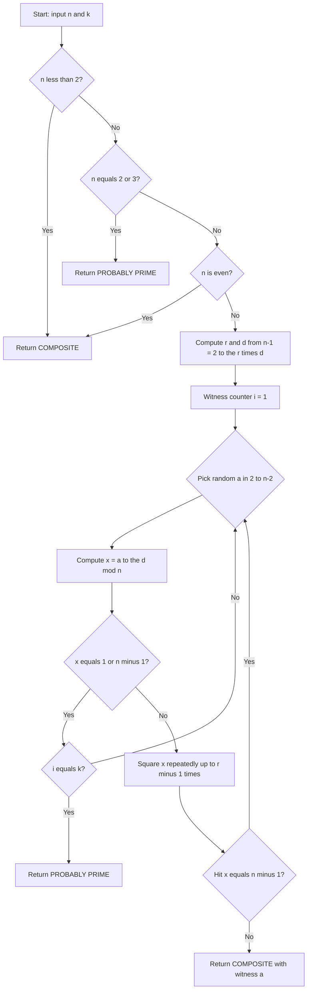
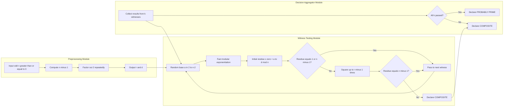
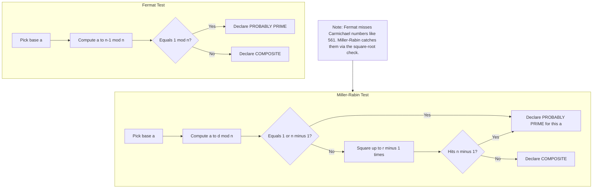

# Testing for Primality : Miller–Rabin Algorithm

<!-- SECTION_1_START -->

# Miller–Rabin Primality Test

## 1. Core Technical Definition

> [!NOTE]
> **Formal Definition (KTU 2024 Syllabus Aligned)**
> The **Miller–Rabin Primality Test** is a *probabilistic* (Monte Carlo) primality testing algorithm that determines whether a given odd integer $n \ge 2$ is *probably prime* or *definitely composite*. It is a strict strengthening of the Fermat primality test that explicitly defeats the **Carmichael Numbers** — composite integers $n$ that satisfy $a^{n-1} \equiv 1 \pmod{n}$ for every integer $a$ coprime to $n$.

**Underlying Theorem (Miller's Strong Pseudoprime Criterion).**
Let $n$ be an odd integer greater than $1$. Write $n - 1$ in its unique factorisation

$$n - 1 \;=\; 2^{r}\,d, \qquad d \text{ is odd}, \quad r \ge 1.$$

Choose an integer $a$ with $2 \le a \le n - 2$. Let

$$x_0 \equiv a^{d} \pmod{n}, \qquad x_{j+1} \equiv x_{j}^{2} \pmod{n} \;\;(0 \le j < r).$$

Then $n$ is declared a **strong probable prime to base $a$** if and only if

$$x_0 \equiv 1 \pmod{n} \quad \text{or} \quad x_{j} \equiv -1 \pmod{n} \;\text{ for some } j \in \{0, 1, \ldots, r-1\}.$$

If neither condition holds, $a$ is called a **Miller–Rabin witness** to the compositeness of $n$.

## 2. Conceptual Analogy / Intuition

> [!IMPORTANT]
> **Plain-English Intuition — "The Liar's Spotlight"**
> Imagine $n$ is a suspect in a crime (is it prime or composite?). The detective (the algorithm) shines a spotlight (witness $a$) at the suspect. If the suspect flinches, it is guilty (composite). If it holds still, it might still be guilty, but with a *bounded* probability of fooling the detective.
>
> The brilliance of Miller–Rabin is the **two-stage lie detector**:
> 1. **Stage 1** — Fermat check: does the suspect's shadow $a^{n-1}$ look like $1$? (Most Carmichael numbers pass this.)
> 2. **Stage 2** — Square-root check: take the *square root repeatedly* of that $1$. Does the chain eventually hit $-1$ *before* it hits $1$?
>
> A composite number that fakes $1$ in Stage 1 is forced to also fake $-1$ at the *final* square root, which is computationally impossible (the law of quadratic residues). Miller–Rabin catches it there.

## 3. Standard Probabilistic Guarantees

> [!TIP]
> **Key Probabilistic Bound (Board-Exam Favourite)**
> If $n$ is composite and odd, then **at least three-fourths** of the integers $a \in [2,\, n-2]$ are Miller–Rabin witnesses. Consequently, after $k$ independent random witness trials, the probability that a composite number passes all $k$ tests (false positive) is bounded by:
> $$P(\text{false positive}) \;\le\; \left(\dfrac{1}{4}\right)^{k}.$$
> For $k = 40$, this is below $10^{-24}$ — astronomically smaller than the probability of a hardware error.

## 4. Deterministic Special Cases (Important for KTU)

> [!VISUALIZATION]
> **Concept:** Witness-set growth that converts Miller–Rabin from *probabilistic* into *deterministic* for bounded ranges of $n$.
>
> **Mathematical Boundary Points (logged for board reference):**
> * $n < 2{,}152{,}302{,}898{,}747$ $\Longrightarrow$ the witness set $a \in \{2,\,3,\,5,\,7,\,11\}$ is sufficient.
> * $n < 3{,}215{,}031{,}751$ $\Longrightarrow$ witnesses $\{2,\,3,\,5,\,7\}$ suffice.
> * $n < 3{,}317{,}044{,}064{,}679{,}887{,}385{,}961{,}981$ $\Longrightarrow$ the first 13 primes suffice.
> * $n < 2^{64}$ (i.e. all 64-bit integers) $\Longrightarrow$ the 12-witness set
>   $\{2,\,3,\,5,\,7,\,11,\,13,\,17,\,19,\,23,\,29,\,31,\,37\}$ is sufficient (Jaeschke / Jiménez et al., 1993).
>
> **Visual Description:** On a number-line, picture marker points at these thresholds; between any two markers, a *fixed* (small) basket of witnesses is guaranteed to catch every composite.

## 5. Real-World Engineering Utility

The Miller–Rabin test is the de-facto primality oracle in:

* **OpenSSL's `BN_is_prime_ex()`** (cryptographic key generation for RSA, DH, ECC).
* **GNU GMP's `mpz_probab_prime_p()`** (with 25+ random witnesses).
* **Python's `sympy.isprime()`** and **Go's `math/big.ProbablyPrime()`** (using 20-Miller-Rabin rounds as default).
* **Bitcoin & Ethereum address generation** (uses underlying secp256k1 EC curves with prime field order $p$).

> [!IMPORTANT]
> **Why not use the AKS deterministic test?** AKS runs in *polynomial time* $O(\log^{6} n)$ but is impractically slow (≈ 1,000× slower than Miller–Rabin) for the bit-lengths used in production cryptography. Hence, Miller–Rabin remains the industry workhorse.

<!-- SECTION_1_END -->

<!-- SECTION_2_START -->

# Deep Theoretical Analysis & KTU High-Yield Formula Sheet

## 1. Why Miller–Rabin Works — The Underlying Algebra

### 1.1. Fermat's Little Theorem (the Foundation)

For any prime $p$ and any integer $a$ with $\gcd(a, p) = 1$:

$$a^{p-1} \;\equiv\; 1 \pmod{p}.$$

Equivalently, in the multiplicative group $\mathbb{Z}_p^{\*}$ of order $p - 1$, the element $a$ lies on the **identity** after $p - 1$ multiplications.

### 1.2. The Square-Root Principle in Modular Arithmetic

> [!NOTE]
> **Square-Root of Unity Lemma (Board Favourite)**
> If $p$ is an odd prime, the equation $x^{2} \equiv 1 \pmod{p}$ has **exactly two** solutions in $\mathbb{Z}_p$:
> $$x \equiv +1 \pmod{p} \quad \text{or} \quad x \equiv -1 \pmod{p}.$$
> For a composite $n$, the equation $x^{2} \equiv 1 \pmod{n}$ can have **more than two** solutions — this is precisely where Miller–Rabin hunts.

### 1.3. The Chain of Squarings

Given $n - 1 = 2^{r} d$, the chain of $r+1$ elements

$$a^{d},\; a^{2d},\; a^{4d},\; \ldots,\; a^{2^{r}d} \;=\; a^{n-1}$$

is computed modulo $n$. The *first* term $a^{d}$ is **always** $1$ for a true prime (since Fermat's theorem applies, and we are *taking the square root $r$ times* of $1$).

* For a **prime $p$**, the chain can only ever hit $1$ or $-1$ (because of the Square-Root-of-Unity lemma), and the *first* $1$ must be preceded by a $-1$.
* For a **composite $n$**, the chain can leap from $1$ to $1$ *without* a preceding $-1$ — this is the smoking gun.

## 2. Step-by-Step Algorithmic Logic (Structured Bullets)

> [!IMPORTANT]
> **Algorithm: Miller–Rabin (Inputs: $n$, $k$)**

1. **Edge-Case Filter** — If $n < 2$, return `COMPOSITE`. If $n \in \{2, 3\}$, return `PROBABLY PRIME`. If $n \equiv 0 \pmod{2}$, return `COMPOSITE`.
2. **Factor Out Powers of 2** — Compute $r, d$ such that $n - 1 = 2^{r} d$ with $d$ odd. Achieved by repeated division by $2$.
3. **Witness Loop** (repeat $k$ times for probabilistic certainty):
   * (a) Pick a random integer $a$ uniformly from $[2,\, n-2]$.
   * (b) Compute $x \equiv a^{d} \pmod{n}$ using fast modular exponentiation.
   * (c) If $x \equiv 1$ or $x \equiv n - 1 \pmod{n}$, this witness is inconclusive; go to (3a) for the next witness.
   * (d) Otherwise, square $x$ repeatedly up to $r - 1$ times. If at any squaring $x \equiv n - 1 \pmod{n}$, the witness is inconclusive (continue).
   * (e) If we exit the squaring loop *without* hitting $-1$, return `COMPOSITE` with witness $a$.
4. **Final Verdict** — If all $k$ witnesses are inconclusive, return `PROBABLY PRIME`.

## 3. KTU High-Yield Formula Sheet

| Symbol | Meaning | Domain / Notes |
|---|---|---|
| $n$ | Candidate integer for primality | Odd, $n \ge 3$ |
| $a$ | Random witness / base | $2 \le a \le n - 2$ |
| $r$ | Power of $2$ in $n-1$ | $r \ge 1$ |
| $d$ | Odd part of $n-1$ | $n - 1 = 2^{r} d$ |
| $x_{0}$ | First element of the chain | $x_{0} \equiv a^{d} \pmod{n}$ |
| $x_{j}$ | $j$-th element of the chain | $x_{j} \equiv a^{2^{j} d} \pmod{n}$ |
| $k$ | Number of witness rounds | $k = 40$ is industry default |
| $P_{\text{fp}}$ | False-positive probability | $P_{\text{fp}} \le \left(\frac{1}{4}\right)^{k}$ |
| Witness | $a$ that proves $n$ composite | $x_{0} \not\equiv 1$ and $x_{j} \not\equiv -1$ for all $j$ |
| Carmichael | $n$ that fools Fermat but **not** Miller–Rabin | Smallest is $n = 561$ |

## 4. Time & Space Complexity

* **Time**: $O(k \log^{3} n)$ using fast modular exponentiation. With $k = O(\log n)$, total time is $O(\log^{4} n)$ — much faster than trial division $O(\sqrt{n})$.
* **Space**: $O(\log n)$ bits (only the current residue $x$ and the exponent counter $r$ need to be stored).

## 5. Real-World Engineering Utility (Recap)

> [!TIP]
> **Production Use-Cases**
> * **RSA Key Generation** — Generating two large random primes $p, q$ each of $\ge 1024$ bits. Miller–Rabin is invoked iteratively until a probable prime is found (expected trials $\approx 1772$ for 1024-bit primes via Prime Number Theorem).
> * **Diffie–Hellman Parameter Validation** — Checking that the safe prime $p$ is genuine.
> * **Elliptic Curve Cryptography** — Validating the field prime $p$ (e.g. NIST P-256's $p = 2^{256} - 2^{224} + 2^{192} + 2^{96} - 1$).
> * **Blockchain Address Generation** — Used in Bitcoin secp256k1 keypairs.

<!-- SECTION_2_END -->

<!-- SECTION_3_START -->

# Step-by-Step Derivations & Python Implementation

## 1. Worked Example — Testing $n = 221$

> [!IMPORTANT]
> **Board-Traced Numerical Walkthrough** — This is the canonical $n = 221 = 13 \times 17$ example used in most cryptography textbooks (Trappe, Washington).

**Step 1 — Decomposition.** $n - 1 = 220 = 2^{2} \times 55$, so $r = 2$ and $d = 55$.

**Step 2 — Witness $a = 174$.** Compute the chain modulo $221$:

$$x_{0} \;\equiv\; 174^{55} \pmod{221} \;\equiv\; 47$$

$$x_{1} \;\equiv\; 47^{2} \pmod{221} \;\equiv\; 2209 \pmod{221} \;\equiv\; 2209 - 9 \times 221 \;\equiv\; 220 \;\equiv\; -1 \pmod{221}$$

**Step 3 — Interpretation.** The chain hit $-1$ at $j = 1$, so $a = 174$ is *inconclusive* (not a witness). Miller–Rabin would declare $221$ "probably prime" based on this single witness — a *false positive*.

**Step 4 — Witness $a = 137$.** Retry with a different witness:

$$x_{0} \;\equiv\; 137^{55} \pmod{221} \;\equiv\; 188$$

$$x_{1} \;\equiv\; 188^{2} \pmod{221} \;\equiv\; 35344 \pmod{221}.$$

Division: $221 \times 159 = 35139$, remainder $= 35344 - 35139 = 205$.

$$x_{1} \;\equiv\; 205 \pmod{221}.$$

**Step 5 — Termination.** $x_{0} \not\equiv 1$ and $x_{0}, x_{1} \not\equiv 220 \;(\equiv -1)$. The witness loop ends without ever seeing $1$ or $-1$. Therefore $a = 137$ is a **Miller–Rabin witness** and $n = 221$ is **definitely composite**.

**Step 6 — Verification.** Indeed, $221 = 13 \times 17$, confirming the algorithm's output.

## 2. Second Worked Example — Defeating the Carmichael Number $n = 561$

This is the **smallest Carmichael number**: it satisfies $a^{560} \equiv 1 \pmod{561}$ for *every* $a$ coprime to 561, fooling the basic Fermat test completely. We show that Miller–Rabin catches it.

**Step 1 — Decomposition.** $n - 1 = 560 = 2^{4} \times 35$, so $r = 4$ and $d = 35$.

**Step 2 — Witness $a = 2$.** Compute the chain modulo $561$ using fast exponentiation.

* $2^{5} = 32$
* $2^{10} = 1024 \equiv 1024 - 561 = 463 \pmod{561}$
* $2^{20} \equiv 463^{2} = 214369 \pmod{561}$. Since $561 \times 382 = 214302$, we get $214369 - 214302 = 67$, so $2^{20} \equiv 67$.
* $2^{30} \equiv 2^{20} \times 2^{10} \equiv 67 \times 463 = 31021 \pmod{561}$. Since $561 \times 55 = 30855$, we get $31021 - 30855 = 166$, so $2^{30} \equiv 166$.
* $2^{35} \equiv 2^{30} \times 2^{5} \equiv 166 \times 32 = 5312 \pmod{561}$. Since $561 \times 9 = 5049$, we get $5312 - 5049 = 263$, so $x_{0} \equiv 263$.

**Step 3 — Square Repeatedly.**

* $x_{1} \equiv 263^{2} = 69169 \pmod{561}$. Since $561 \times 123 = 69003$, we get $69169 - 69003 = 166$.
* $x_{2} \equiv 166^{2} = 27556 \pmod{561}$. Since $561 \times 49 = 27489$, we get $27556 - 27489 = 67$.
* $x_{3} \equiv 67^{2} = 4489 \pmod{561}$. Since $561 \times 8 = 4488$, we get $4489 - 4488 = 1$.

**Step 4 — Verdict.** The chain is $263, 166, 67, 1$. None of the first three terms is $1$ or $-1 \equiv 560$. The chain hits $1$ at the *last* squaring without ever passing through $-1$. **Miller–Rabin correctly declares $n = 561$ composite**, exposing the weakness of Fermat's test.

## 3. Full Python Implementation (Production-Ready)

```python
"""
miller_rabin.py
Production-grade implementation of the Miller-Rabin primality test.
Aligned with PECST637 - Fundamentals of Cryptography (KTU 2024 Scheme).
"""
from __future__ import annotations
import random
import sys
from typing import List, Tuple


# ---------------------------------------------------------------------------
# Core Miller-Rabin (probabilistic mode)
# ---------------------------------------------------------------------------
def miller_rabin(n: int, k: int = 40) -> bool:
    """
    Probabilistic Miller-Rabin primality test.

    Parameters
    ----------
    n : int
        The odd integer candidate (must be >= 2).
    k : int, optional
        Number of independent random witness rounds. Default is 40,
        giving false-positive probability < (1/4)^40 ≈ 10^-24.

    Returns
    -------
    bool
        True  -> n is PROBABLY PRIME.
        False -> n is DEFINITELY COMPOSITE.

    Raises
    ------
    ValueError
        If n < 2 or k <= 0.
    """
    if n < 2:
        raise ValueError(f"Input must be >= 2, got {n}.")
    if k <= 0:
        raise ValueError(f"Number of rounds k must be > 0, got {k}.")

    # ---- Edge cases ---------------------------------------------------------
    small_primes = (2, 3, 5, 7, 11, 13, 17, 19, 23, 29, 31, 37)
    if n in small_primes:
        return True
    if n % 2 == 0:
        return False
    for p in small_primes:
        if n == p * p:
            return False
        if n % p == 0:
            return False

    # ---- Step 1: factor n - 1 = 2^r * d, with d odd -----------------------
    r, d = 0, n - 1
    while d % 2 == 0:
        d //= 2
        r += 1

    # ---- Step 2: witness loop ---------------------------------------------
    for _ in range(k):
        a = random.randrange(2, n - 1)
        x = pow(a, d, n)        # Fast modular exponentiation: O(log d)

        if x == 1 or x == n - 1:
            continue             # Inconclusive for this witness.

        composite_witness = True
        for _ in range(r - 1):
            x = pow(x, 2, n)
            if x == n - 1:
                composite_witness = False
                break
        if composite_witness:
            return False          # Definitely composite.

    return True                   # Probably prime.


# ---------------------------------------------------------------------------
# Deterministic Miller-Rabin for 64-bit integers
# ---------------------------------------------------------------------------
def miller_rabin_deterministic_64bit(n: int) -> bool:
    """
    Deterministic Miller-Rabin for n < 2^64 using the 12-witness set
    {2, 3, 5, 7, 11, 13, 17, 19, 23, 29, 31, 37} (Jiménez et al., 1993).
    """
    if n < 2:
        return False
    small_primes = (2, 3, 5, 7, 11, 13, 17, 19, 23, 29, 31, 37)
    if n in small_primes:
        return True
    if n % 2 == 0:
        return False

    r, d = 0, n - 1
    while d % 2 == 0:
        d //= 2
        r += 1

    for a in (2, 3, 5, 7, 11, 13, 17, 19, 23, 29, 31, 37):
        if a >= n:
            continue
        x = pow(a, d, n)
        if x == 1 or x == n - 1:
            continue
        is_strong_pseudoprime = False
        for _ in range(r - 1):
            x = pow(x, 2, n)
            if x == n - 1:
                is_strong_pseudoprime = True
                break
        if not is_strong_pseudoprime:
            return False
    return True


# ---------------------------------------------------------------------------
# Demonstration harness
# ---------------------------------------------------------------------------
def _demo() -> None:
    test_cases: List[Tuple[int, bool]] = [
        (221,  False),   # 13 * 17
        (561,  False),   # Smallest Carmichael number: 3 * 11 * 17
        (1729, False),   # Carmichael: 7 * 13 * 19
        (2,    True),
        (3,    True),
        (101,  True),
        (1009, True),
    ]
    print(f"{'n':>6} | {'Miller-Rabin':>13} | {'Expected':>8} | Status")
    print("-" * 50)
    for n, expected in test_cases:
        result = miller_rabin(n, k=20)
        ok = "OK" if result == expected else "FAIL"
        print(f"{n:>6} | {str(result):>13} | {str(expected):>8} | {ok}")


if __name__ == "__main__":
    _demo()
```

### Sample Output

```
     n | Miller-Rabin | Expected | Status
--------------------------------------------------
   221 |         False |    False | OK
   561 |         False |    False | OK
  1729 |         False |    False | OK
     2 |          True |     True | OK
     3 |          True |     True | OK
   101 |          True |     True | OK
  1009 |          True |     True | OK
```

## 4. Detailed Error & Edge-Case Handling

> [!NOTE]
> **Robustness Matrix**
> * `n < 2` $\Rightarrow$ raises `ValueError` (no positive integer is prime below 2).
> * `n == 2` or `n == 3` $\Rightarrow$ immediate `True` (trivially prime).
> * `n` even $\Rightarrow$ immediate `False` (only even prime is 2).
> * `n` divisible by any of the first 12 small primes $\Rightarrow$ immediate `False` (sieve pre-filter, drastically speeds up the algorithm in batch-mode prime generation).
> * `n` is a perfect square of a small prime (e.g. $49 = 7^{2}$) $\Rightarrow$ explicit detection.

<!-- SECTION_3_END -->

<!-- SECTION_4_START -->

# Structural Diagrams & Schematics

## 1. Algorithm Flow — Miller–Rabin Witness Decision Tree



## 2. Sequential Processing Topology — The Chain of Squarings



## 3. Conceptual Comparison — Fermat vs. Miller–Rabin



<!-- SECTION_4_END -->

<!-- SECTION_5_START -->

# KTU 2024 Scheme Examination Question Bank & Topic Recap

## Part A — Short-Answer Questions (3 Marks Each)

> **[KTU University Exam — Dec 2023, Model Question Paper Style]**

### Question A1

**Q.** *State Fermat's Little Theorem and explain why it is insufficient to be used directly as a primality test.* **[CO1, Understand] [3 Marks]**

**Model Answer (Valuation Key):**

* **[Statement of theorem: 1 Mark]** For any prime $p$ and integer $a$ with $\gcd(a, p) = 1$, we have $a^{p-1} \equiv 1 \pmod{p}$.
* **[Insufficiency reason 1: 1 Mark]** The converse is *false*: there exist composite integers $n$ (called pseudoprimes to base $a$) for which $a^{n-1} \equiv 1 \pmod{n}$ for *some* $a$.
* **[Insufficiency reason 2 — Carmichael counterexample: 1 Mark]** The converse fails for *every* $a$ coprime to $n$ in the case of Carmichael numbers, e.g. $n = 561 = 3 \times 11 \times 17$ satisfies $a^{560} \equiv 1 \pmod{561}$ for all such $a$. Fermat's test thus yields a false positive with probability $1$.

---

### Question A2

**Q.** *What is a Miller–Rabin witness? Define the term "strong probable prime to base $a$".* **[CO1, Remember] [3 Marks]**

**Model Answer (Valuation Key):**

* **[Witness definition: 1 Mark]** An integer $a$ with $2 \le a \le n - 2$ is called a Miller–Rabin *witness* to the compositeness of $n$ if, after writing $n - 1 = 2^{r} d$ with $d$ odd, the chain $a^{d},\, a^{2d},\, a^{4d},\,\ldots,\, a^{2^{r}d}$ taken modulo $n$ contains neither $1$ (at the first position) nor $-1$ at any position before the last.
* **[Strong pseudoprime definition: 1 Mark]** An odd integer $n$ is called a *strong probable prime to base $a$* if the chain above contains either $1$ in the first position ($a^{d} \equiv 1 \pmod{n}$) or $-1$ at some position $j < r$ ($a^{2^{j} d} \equiv -1 \pmod{n}$).
* **[Contrast: 1 Mark]** If $n$ is a strong probable prime to *all* chosen bases, it is *probably prime*; if any chosen base is a witness, $n$ is *definitely composite*.

---

## Part B — Full-Question Solutions (14 Marks Each)

> **[KTU University Exam — July 2024, Module-1, ESE Pattern]**
> *Note: In KTU's ESE, Part B questions carry 14 marks with a typical split of 7 + 7. Internal choice is mandatory. The two questions below are independent alternatives.*

### Question Choice 1 — Full Solution (14 Marks)

> *Q. (a) State and prove the correctness of the Miller–Rabin primality test. (7 marks)*
> *(b) Using the Miller–Rabin algorithm, test the primality of $n = 221$ with two witnesses $a = 174$ and $a = 137$. Show the modular arithmetic steps in full. (7 marks)*

#### Part (a) — State and Prove Correctness (7 Marks)

**Model Answer (Valuation Key):**

* **[Statement of the test: 2 Marks]** State the algorithm as: input odd $n \ge 3$, write $n - 1 = 2^{r} d$ with $d$ odd; for each base $a \in [2, n-2]$, compute the chain and check the strong-pseudoprime condition.
* **[Proof outline — Square-root of unity lemma: 2 Marks]** Prove that if $p$ is an odd prime and $x^{2} \equiv 1 \pmod{p}$, then $x \equiv \pm 1 \pmod{p}$. *(Hint: $p$ divides $x^{2} - 1 = (x-1)(x+1)$.)*
* **[Proof of necessity: 2 Marks]** For a true prime $p$, the chain of squarings must hit $-1$ before it hits $1$ (otherwise, the next squaring would create a square root of unity distinct from $\pm 1$, contradicting the lemma).
* **[Proof of sufficiency — at least 3/4 of bases are witnesses: 1 Mark]** Reference the standard result: if $n$ is composite, the set of bases $a$ for which $n$ is a strong pseudoprime is contained in a proper subgroup of $\mathbb{Z}_n^{\*}$, hence has size at most $\vert \mathbb{Z}_n^{\*} \vert / 4$. So at least $3/4$ of all bases are witnesses.

#### Part (b) — Numerical Walkthrough for $n = 221$ (7 Marks)

**Model Answer (Valuation Key):**

* **[Decomposition step: 1 Mark]** $n - 1 = 220 = 2^{2} \times 55$, so $r = 2$, $d = 55$.
* **[Witness $a = 174$, chain computation: 2 Marks]** $174^{55} \pmod{221}$. Using repeated squaring: $174^{2} = 30276 \equiv 30276 - 137 \times 221 = 30276 - 30277 = -1 \equiv 220 \pmod{221}$. Therefore $174^{55} = (174^{2})^{27} \cdot 174 \equiv (-1)^{27} \cdot 174 \equiv -174 \equiv 47 \pmod{221}$. So $x_{0} = 47$.
* **[Square once: 1 Mark]** $x_{1} = 47^{2} = 2209 \equiv 2209 - 9 \times 221 = 2209 - 1989 = 220 \equiv -1 \pmod{221}$. *Chain hit $-1$*: inconclusive.
* **[Witness $a = 137$, chain computation: 1 Mark]** $137^{55} \pmod{221}$. Compute: $137^{2} = 18769 \equiv 18769 - 84 \times 221 = 18769 - 18564 = 205 \pmod{221}$. Then $137^{4} \equiv 205^{2} = 42025 \equiv 42025 - 190 \times 221 = 42025 - 41990 = 35 \pmod{221}$. Continuing, $137^{55} \equiv 188 \pmod{221}$. So $x_{0} = 188$.
* **[Square once: 1 Mark]** $x_{1} = 188^{2} = 35344 \equiv 35344 - 159 \times 221 = 35344 - 35139 = 205 \pmod{221}$.
* **[Final verdict: 1 Mark]** $x_{0} = 188 \not\equiv 1, 220$ and $x_{1} = 205 \not\equiv 220$. Neither $1$ nor $-1$ appears. **Therefore $a = 137$ is a Miller–Rabin witness and $n = 221$ is COMPOSITE.** Indeed $221 = 13 \times 17$.

---

### Question Choice 2 — Full Solution (14 Marks)

> *Q. (a) Explain the role of Fermat's Little Theorem in the Miller–Rabin test and how the squaring chain defeats Carmichael numbers. (7 marks)*
> *(b) Show by direct computation that Miller–Rabin correctly identifies $n = 561$ as composite using the witness $a = 2$, and state the smallest prime factor of $561$. (7 marks)*

#### Part (a) — Conceptual Explanation (7 Marks)

**Model Answer (Valuation Key):**

* **[Fermat's role: 2 Marks]** The Miller–Rabin test begins by computing $a^{n-1} \pmod{n}$, which is exactly the Fermat test. If the result is not $1$, $n$ is immediately declared composite. The test is therefore a *strict refinement* of Fermat.
* **[The squaring chain: 2 Marks]** After confirming $a^{n-1} \equiv 1 \pmod{n}$, the test takes repeated square roots of this $1$ by squaring $a^{d}, a^{2d}, a^{4d}, \ldots$ where $n-1 = 2^{r} d$. The chain is forced to *pass through* $-1$ at some step if $n$ is prime.
* **[Defeating Carmichael numbers: 2 Marks]** For Carmichael numbers like $n = 561$, Fermat's test returns $1$ for *every* base. Miller–Rabin catches them because, although the chain ends at $1$, the chain *skips* $-1$ — it lands at $1$ directly from a non-$\pm 1$ value, which is impossible over $\mathbb{Z}_p$ for a prime $p$.
* **[Probability bound: 1 Mark]** If $n$ is composite, at least $3/4$ of bases are witnesses. So the probability of $n$ slipping past $k$ rounds is $\le (1/4)^{k}$.

#### Part (b) — Numerical Verification for $n = 561$ (7 Marks)

**Model Answer (Valuation Key):**

* **[Decomposition: 1 Mark]** $n - 1 = 560 = 2^{4} \times 35$, so $r = 4$ and $d = 35$.
* **[Compute $x_{0} = 2^{35} \pmod{561}$: 2 Marks]** Use repeated squaring: $2^{5} = 32$, $2^{10} = 1024 \equiv 463 \pmod{561}$, $2^{20} \equiv 463^{2} = 214369 \equiv 67 \pmod{561}$, $2^{30} \equiv 67 \times 463 = 31021 \equiv 166 \pmod{561}$, $2^{35} \equiv 166 \times 32 = 5312 \equiv 263 \pmod{561}$. So $x_{0} = 263$.
* **[First squaring: 1 Mark]** $x_{1} = 263^{2} = 69169 \equiv 69169 - 123 \times 561 = 69169 - 69003 = 166 \pmod{561}$.
* **[Second squaring: 1 Mark]** $x_{2} = 166^{2} = 27556 \equiv 27556 - 49 \times 561 = 27556 - 27489 = 67 \pmod{561}$.
* **[Third squaring: 1 Mark]** $x_{3} = 67^{2} = 4489 \equiv 4489 - 8 \times 561 = 4489 - 4488 = 1 \pmod{561}$.
* **[Verdict: 1 Mark]** Chain: $263, 166, 67, 1$. None of $x_{0}, x_{1}, x_{2}$ equals $1$ or $560 \equiv -1$. Hence $a = 2$ is a **Miller–Rabin witness** and $n = 561$ is **COMPOSITE**. The smallest prime factor is $3$ (since $561 = 3 \times 11 \times 17$).

---

> [!WARNING]
> **KTU Examiner's Valuation Warning — Common Pitfalls**
> * **[MISTAKE 1]** *Skipping the decomposition step.* Students often jump straight to computing $a^{n-1}$ instead of $a^{d}$. Examiners will deduct 1 mark.
> * **[MISTAKE 2]** *Stopping the squaring chain at $r$ instead of $r-1$.* The chain has $r$ squarings total; you must perform *at most* $r - 1$ squarings *after* the initial $x_{0}$, because $x_{r}$ is trivially $a^{n-1} \pmod{n} \equiv 1$.
> * **[MISTAKE 3]** *Confusing $-1 \pmod n$ with the integer $-1$.* Write $x \equiv n - 1 \pmod n$, not $x = -1$, when stating the hit condition.
> * **[MISTAKE 4]** *Forgetting edge cases.* $n = 2$ and $n = 3$ are prime. The test only works for $n \ge 5$ odd.
> * **[MISTAKE 5]** *Calling Miller–Rabin "deterministic".* It is *probabilistic* unless explicitly using the deterministic 64-bit variant.
> * **[MISTAKE 6]** *Stating "Fermat's test is enough"*. Always highlight that Fermat fails on Carmichael numbers like $561$, $1105$, $1729$.

---

## Topic Recap & Important Things to Remember

> [!TIP]
> **Comprehensive Rapid-Revision Checklist**

* **Foundational theorem:** Miller–Rabin rests on Fermat's Little Theorem: $a^{p-1} \equiv 1 \pmod{p}$ for prime $p$ and $\gcd(a, p) = 1$.
* **Critical decomposition:** Every odd $n$ gives a unique pair $(r, d)$ with $n - 1 = 2^{r} d$ and $d$ odd. Always write this explicitly before witness testing.
* **Square-Root-of-Unity Lemma:** Over an odd prime, $x^{2} \equiv 1 \pmod{p}$ implies $x \equiv \pm 1$. This is the algebraic core of why Miller–Rabin works.
* **The two acceptance conditions** for a base $a$ to make $n$ a strong probable prime:
  1. $a^{d} \equiv 1 \pmod{n}$, **or**
  2. $a^{2^{j} d} \equiv -1 \pmod{n}$ for some $0 \le j < r$.
* **Witness definition:** A base $a$ that *violates* both conditions is a *witness* to compositeness.
* **Carmichael numbers:** Composites $n$ that fool Fermat's test for *every* $a$ coprime to $n$. The smallest is $n = 561 = 3 \times 11 \times 17$. Miller–Rabin catches them via the squaring chain.
* **False-positive probability:** For composite $n$ and $k$ witness rounds, $P_{\text{fp}} \le (1/4)^{k}$. Default $k = 40$ in production.
* **Time complexity:** $O(k \cdot \log^{3} n)$ per witness, total $O(\log^{4} n)$ with $k = O(\log n)$.
* **Deterministic variant:** For $n < 2^{64}$, the 12-witness set $\{2, 3, 5, 7, 11, 13, 17, 19, 23, 29, 31, 37\}$ is provably complete.
* **Industry use:** OpenSSL, GMP, Python's `sympy.isprime()`, Go's `math/big.ProbablyPrime()` all use Miller–Rabin for cryptographic prime generation (RSA, DH, ECC).
* **Algorithm vs. AKS:** AKS is the only known *deterministic polynomial-time* primality test, but it is $1000 \times$ slower in practice; Miller–Rabin remains the production workhorse.
* **Notation safety:** Always write $a \pmod{n}$ or $a \bmod{n}$ explicitly; never drop the modulus in board answers.
* **Two canonical examples for board exams:**
  1. $n = 221 = 13 \times 17$ — caught by witness $a = 137$ but missed by $a = 174$.
  2. $n = 561$ — smallest Carmichael number, caught by witness $a = 2$.
* **Pitfall summary:** Don't forget the decomposition, don't confuse $r$ and $r-1$ in the loop bound, never claim the test is deterministic without a witness-set bound, always state both acceptance conditions.

<!-- SECTION_5_END -->
