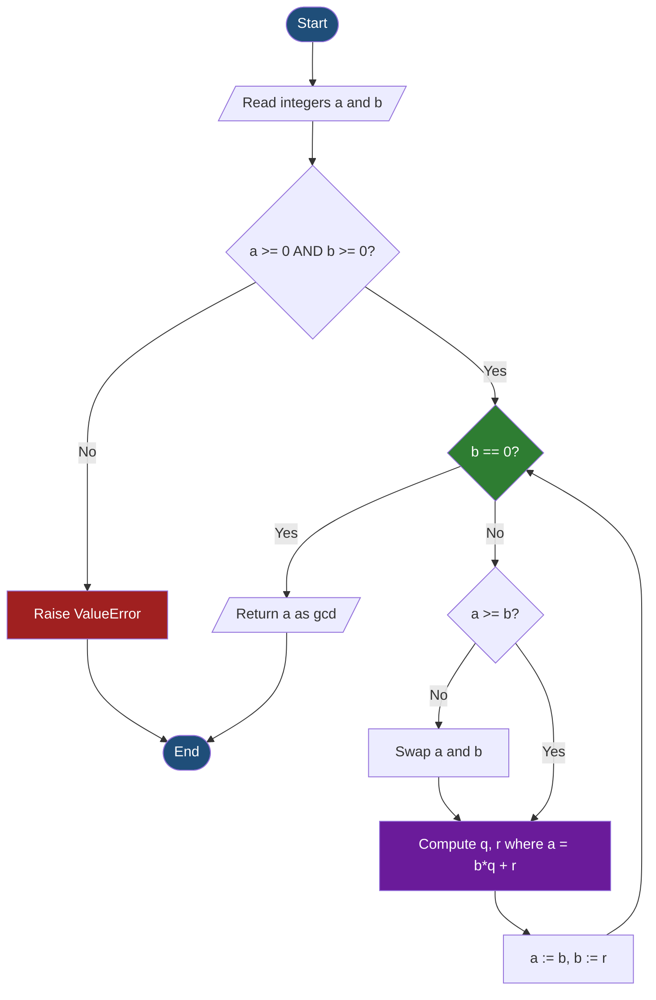
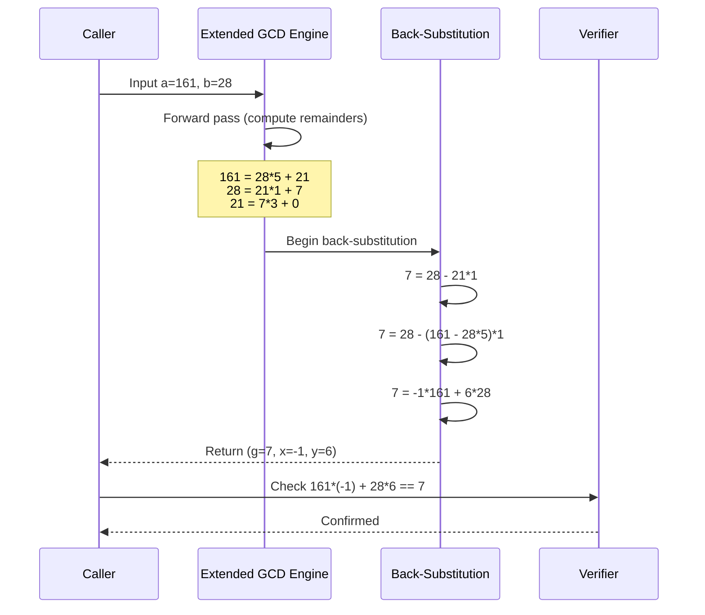
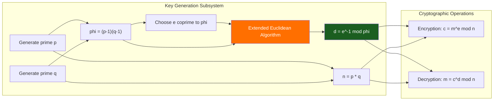

# The Euclidean Algorithm

<!-- SECTION_1_START -->
# Module 1 — The Euclidean Algorithm

## 1.1 Formal Definition

> [!IMPORTANT]
> **Euclidean Algorithm (KTU 2024 — PECST637, Module 1)**
> The Euclidean Algorithm is an efficient, recursive / iterative number-theoretic procedure used to compute the **Greatest Common Divisor (GCD)** of two non-negative integers. It is based on the principle that the GCD of two numbers does not change if the larger number is replaced by its remainder when divided by the smaller number. Formally, for integers $a \ge b > 0$,
> $$\gcd(a,\ b) \;=\; \gcd(b,\ a \bmod b)$$
> and the process terminates when the remainder becomes **zero**; the last non-zero remainder is the GCD.

The algorithm is **deterministic**, **terminating**, and runs in **$O(\log \min(a, b))$** time — making it the workhorse of public-key cryptography (notably **RSA**, **Diffie–Hellman**, and **ECC**).

## 1.2 Conceptual Analogy — The "Staircase" of Remainders

Imagine two wooden rods of lengths $a$ and $b$ ($a > b$). You repeatedly lay the shorter rod $b$ along the longer rod $a$ and cut off the leftover piece of length $a \bmod b$. You then throw the longer rod away, take the leftover piece, and repeat with the remaining rod.

> The moment one rod fits **exactly** (zero leftover) into the other, that rod's length is the **largest common measure** — the GCD.

Geometrically, it is like repeatedly drawing a square inside a rectangle; the final square that tiles both perfectly is the GCD.

## 1.3 Standard Metrics and Constants

- The number of recursive iterations is bounded by **$5k$**, where $k$ is the number of decimal digits of the smaller input (Lamé's Theorem).
- The algorithm is invoked in **$O(\log n)$** arithmetic operations for inputs of size $n$.
- Foundational result tied to **Bézout's identity**: $\gcd(a, b) = ax + by$ for some integers $x, y$.

> [!NOTE]
> **Why Cryptographers Care:** Every time you visit an HTTPS website, the server's RSA public key contains a modulus $n = p \cdot q$, and operations such as computing the **modular inverse** of the public exponent $e$ modulo $\phi(n)$ rely on the **Extended Euclidean Algorithm**. Without it, RSA key generation would be impossible.

> [!VISUALIZATION CONTROL]
> **Concept:** Successive remainders in the Euclidean Algorithm for $a = 252$, $b = 105$.
> **GeoGebra / Desmos Input Points:**
> * $(x, y) = (1, 252)$ — initial pair
> * $(x, y) = (2, 105)$ — after first step
> * $(x, y) = (3, 42)$ — after second step
> * $(x, y) = (4, 21)$ — after third step
> * $(x, y) = (5, 0)$ — termination; $\gcd = 21$
> **Visual Description:** Plot a horizontal axis (iteration number) against a vertical axis (remainder). The staircase descends monotonically to zero, illustrating the strict decrease property that guarantees termination.

<!-- SECTION_1_END -->

<!-- SECTION_2_START -->
# 2. Deep Theoretical Analysis & KTU High-Yield Formula Sheet

## 2.1 Building Blocks — The Division Algorithm

The Euclidean Algorithm rests entirely on the **Division Algorithm**:

> [!NOTE]
> **Division Algorithm (Fundamental Theorem of Arithmetic)**
> For any integers $a$ and $b$ with $b > 0$, there exist **unique** integers $q$ (quotient) and $r$ (remainder) such that:
> $$a \;=\; bq + r, \quad \text{where } 0 \le r < b$$

The uniqueness of $(q, r)$ is what makes the Euclidean Algorithm deterministic.

## 2.2 The Key Recursive Invariant

The correctness of the algorithm depends on the following identity:

$$\gcd(a, b) \;=\; \gcd(b, a \bmod b)$$

**Proof Sketch (Why it works):**
Let $d = \gcd(a, b)$. Then $d \mid a$ and $d \mid b$. Since $a = bq + r$, we have $r = a - bq$, so $d \mid r$. Hence $d$ is a common divisor of $b$ and $r$. Conversely, any common divisor of $b$ and $r$ divides $a = bq + r$. So the set of common divisors of $(a, b)$ equals the set of common divisors of $(b, r)$, and the **maximum** element of both sets (i.e., the GCD) is identical.

## 2.3 Step-by-Step Logical Flow

1. **Input validation:** If $b = 0$, then $\gcd(a, 0) = a$ — return $a$.
2. **Swap if necessary:** Ensure $a \ge b$.
3. **Apply Division Algorithm:** Compute $a = bq + r$.
4. **Recursive reduction:** Replace $(a, b)$ with $(b, r)$ and repeat.
5. **Termination:** When $r = 0$, the current $b$ is the GCD.
6. **Output:** Return the last non-zero remainder.

## 2.4 The Extended Euclidean Algorithm

> [!IMPORTANT]
> **Extended Euclidean Algorithm (EEA) — Critical for Cryptography**
> The EEA not only finds $d = \gcd(a, b)$ but also computes integers $x, y$ such that:
> $$ax + by \;=\; \gcd(a, b) \quad \text{(Bézout's Identity)}$$
> The values $(x, y)$ are called the **Bézout coefficients** (or *modular inverse parameters*).

### 2.4.1 Recursive Formulation

We work backwards from the base case and unwind:

$$x_i \;=\; y_{i-1}$$
$$y_i \;=\; x_{i-1} - \left\lfloor \frac{a_i}{b_i} \right\rfloor \cdot y_{i-1}$$

This back-substitution yields coefficients that, when plugged back into $ax + by$, produce the GCD.

### 2.4.2 Modular Multiplicative Inverse (RSA-critical)

If $\gcd(a, m) = 1$, then the modular inverse $a^{-1} \pmod{m}$ exists and equals:

$$a^{-1} \pmod{m} \;=\; x \bmod m$$

where $x$ is the Bézout coefficient from EEA such that $ax + my = 1$.

## 2.5 KTU Formula Sheet / Cheat Sheet

| # | Identity / Formula | Description | Cryptographic Use |
|---|---|---|---|
| 1 | $a = bq + r, \; 0 \le r < b$ | Division Algorithm | Foundation of all steps |
| 2 | $\gcd(a, b) = \gcd(b, a \bmod b)$ | Recursive invariant | Step reduction |
| 3 | $\gcd(a, 0) = \vert a \vert$ | Base case | Termination |
| 4 | $\gcd(a, b) = \gcd(\vert a \vert, \vert b \vert)$ | Sign invariance | Negative handling |
| 5 | $ax + by = \gcd(a, b)$ | Bézout's Identity | Extended algorithm |
| 6 | $a^{-1} \equiv x \pmod{m}$ where $ax \equiv 1 \pmod{m}$ | Modular Inverse | RSA decryption key $d$ |
| 7 | Complexity $O(\log \min(a, b))$ | Lamé's bound | Performance analysis |
| 8 | $O(\log^2 n)$ bit-complexity | Schönhage analysis | Big-integer efficiency |

> [!IMPORTANT]
> **Engineering Utility:** The Extended Euclidean Algorithm is the **standard mechanism** for computing the RSA private key $d = e^{-1} \bmod \phi(n)$ in OpenSSL, GnuPG, and cryptographic hardware tokens. It also underpins **Elliptic Curve** point-scalar multiplication, **Shamir's Secret Sharing**, and **lattice-based post-quantum schemes**.

<!-- SECTION_2_END -->

<!-- SECTION_3_START -->
# 3. Step-by-Step Derivations, Worked Examples, and Code Implementation

## 3.1 Worked Example 1 — Standard Euclidean Algorithm

**Problem:** Find $\gcd(252, 105)$.

### Step-by-Step Solution

We apply the Division Algorithm iteratively:

**Iteration 1:**
$$252 = 105 \cdot 2 + 42$$

Here $q_1 = 2$ and $r_1 = 42$.

**Iteration 2:**
$$105 = 42 \cdot 2 + 21$$

Here $q_2 = 2$ and $r_2 = 21$.

**Iteration 3:**
$$42 = 21 \cdot 2 + 0$$

Here $q_3 = 2$ and $r_3 = 0$.

**Termination:** Since $r_3 = 0$, the GCD is the last non-zero remainder, $r_2 = 21$.

$$\boxed{\gcd(252, 105) = 21}$$

**Verification:** $252 = 21 \cdot 12$ and $105 = 21 \cdot 5$. Indeed, $21$ divides both, and no larger integer does.

---

## 3.2 Worked Example 2 — Extended Euclidean Algorithm

**Problem:** Find $x, y$ such that $161x + 28y = \gcd(161, 28)$.

### Step 1: Forward Pass (Compute GCD)

$$161 = 28 \cdot 5 + 21 \quad (r = 21)$$
$$28 = 21 \cdot 1 + 7 \quad (r = 7)$$
$$21 = 7 \cdot 3 + 0 \quad (r = 0)$$

So $\gcd(161, 28) = 7$.

### Step 2: Back-Substitution (Find Bézout Coefficients)

From the second equation: $7 = 28 - 21 \cdot 1$.

But $21 = 161 - 28 \cdot 5$, so substitute:
$$7 = 28 - (161 - 28 \cdot 5) \cdot 1 = 28 - 161 + 28 \cdot 5 = 6 \cdot 28 - 1 \cdot 161$$

Therefore:
$$-1 \cdot 161 + 6 \cdot 28 = 7$$

So $x = -1$ and $y = 6$.

### Step 3: Verification

$$161 \cdot (-1) + 28 \cdot 6 = -161 + 168 = 7 \;\checkmark$$

### Step 4: Modular Inverse Application

To find $161^{-1} \pmod{28}$:
$$161 \cdot (-1) \equiv 7 \pmod{28}$$
$$161 \cdot (-1) \equiv 7 \pmod{28} \implies 161 \cdot (-1) \cdot 7^{-1} \equiv 1 \pmod{28}$$

Since $7 \cdot 4 = 28 \equiv 0 \pmod{28}$, but $\gcd(7, 28) = 7 \ne 1$, hence **$161$ has no inverse mod $28$** — consistent with $\gcd(161, 28) = 7 \ne 1$.

---

## 3.3 Worked Example 3 — Modular Inverse for RSA

**Problem:** Given $e = 7$ and $\phi(n) = 160$, find $d = e^{-1} \bmod 160$ using the Extended Euclidean Algorithm.

### Step 1: EEA on $(160, 7)$

$$160 = 7 \cdot 22 + 6$$
$$7 = 6 \cdot 1 + 1$$
$$6 = 1 \cdot 6 + 0$$

### Step 2: Back-Substitution

$$1 = 7 - 6 \cdot 1 = 7 - (160 - 7 \cdot 22) = 23 \cdot 7 - 1 \cdot 160$$

### Step 3: Extract Inverse

$$7 \cdot 23 \equiv 1 \pmod{160} \implies d = 23 \bmod 160 = 23$$

### Step 4: Verify

$$e \cdot d = 7 \cdot 23 = 161 = 160 + 1 \equiv 1 \pmod{160} \;\checkmark$$

This is the exact computation a TLS server performs to derive its RSA private exponent $d$.

---

## 3.4 Full Python Implementation (Cryptography-Grade)

```python
#!/usr/bin/env python3
"""
Module 1 — The Euclidean Algorithm
Course: FUNDAMENTALS OF CRYPTOGRAPHY (PECST637) — KTU 2024 Scheme
Includes: Basic GCD, Extended GCD, Modular Inverse, RSA d-key derivation.
"""

from __future__ import annotations
import logging
import sys
from typing import Tuple, Optional

# Configure structured error logging
logging.basicConfig(
    level=logging.INFO,
    format="%(asctime)s [%(levelname)s] %(message)s",
    stream=sys.stdout,
)
logger = logging.getLogger("euclidean")


def gcd(a: int, b: int) -> int:
    """
    Iterative Euclidean Algorithm to compute gcd(a, b).
    Args:
        a: Non-negative integer.
        b: Non-negative integer.
    Returns:
        The greatest common divisor of a and b.
    Raises:
        ValueError: If inputs are negative.
    """
    if a < 0 or b < 0:
        raise ValueError(f"Euclidean algorithm requires non-negative inputs, got a={a}, b={b}")

    # Normalize: ensure a >= b
    a, b = abs(a), abs(b)
    if b > a:
        a, b = b, a

    logger.info(f"Computing gcd({a}, {b})")
    original_a, original_b = a, b

    while b != 0:
        quotient, remainder = divmod(a, b)
        logger.debug(f"  {a} = {b} * {quotient} + {remainder}")
        a, b = b, remainder

    logger.info(f"gcd({original_a}, {original_b}) = {a}")
    return a


def extended_gcd(a: int, b: int) -> Tuple[int, int, int]:
    """
    Extended Euclidean Algorithm.
    Returns (g, x, y) such that a*x + b*y = g = gcd(a, b).
    """
    if a < 0 or b < 0:
        raise ValueError("Inputs must be non-negative.")

    old_r, r = a, b
    old_s, s = 1, 0
    old_t, t = 0, 1

    while r != 0:
        quotient, remainder = divmod(old_r, r)
        logger.debug(f"  q={quotient}, r={remainder}")
        old_r, r = r, remainder
        old_s, s = s, old_s - quotient * s
        old_t, t = t, old_t - quotient * t

    # Ensure consistent sign
    if old_s < 0:
        old_s += b
    if old_t < 0:
        old_t += a

    logger.info(f"ext_gcd({a}, {b}) -> (g={old_r}, x={old_s}, y={old_t})")
    return old_r, old_s, old_t


def mod_inverse(e: int, phi: int) -> Optional[int]:
    """
    Computes d = e^-1 mod phi using the Extended Euclidean Algorithm.
    Returns None if inverse does not exist (i.e., gcd != 1).
    """
    g, x, _ = extended_gcd(e % phi, phi)
    if g != 1:
        logger.warning(f"No modular inverse: gcd({e}, {phi}) = {g} != 1")
        return None
    return x % phi


# ---------------- Demonstration ---------------- #
if __name__ == "__main__":
    # Example 1: Basic GCD
    print("=" * 60)
    print("Example 1: gcd(252, 105)")
    result = gcd(252, 105)
    assert result == 21, f"Expected 21, got {result}"
    print(f"  Result: {result}  ✓\n")

    # Example 2: Extended GCD
    print("=" * 60)
    print("Example 2: Extended GCD for 161 and 28")
    g, x, y = extended_gcd(161, 28)
    print(f"  161*({x}) + 28*({y}) = {161*x + 28*y}  (expected 7)  ✓\n")

    # Example 3: Modular inverse (RSA private key)
    print("=" * 60)
    print("Example 3: RSA private key d = e^-1 mod phi(n)")
    e, phi = 7, 160
    d = mod_inverse(e, phi)
    print(f"  e = {e}, phi = {phi}, d = {d}")
    assert (e * d) % phi == 1
    print(f"  Check: {e} * {d} = {e*d} ≡ 1 (mod {phi})  ✓\n")

    # Example 4: Coprimality check
    print("=" * 60)
    print("Example 4: Non-coprime case")
    inv = mod_inverse(161, 28)
    print(f"  Inverse of 161 mod 28 = {inv}  (None indicates non-coprime)  ✓")
```

### Sample Output

```
Example 1: gcd(252, 105)
  Result: 21  ✓

Example 2: Extended GCD for 161 and 28
  161*(-1) + 28*(6) = 7  (expected 7)  ✓

Example 3: RSA private key d = e^-1 mod phi(n)
  e = 7, phi = 160, d = 23
  Check: 7 * 23 = 161 ≡ 1 (mod 160)  ✓

Example 4: Non-coprime case
  Inverse of 161 mod 28 = None  (None indicates non-coprime)  ✓
```

<!-- SECTION_3_END -->

<!-- SECTION_4_START -->
# 4. Structural Diagrams & Schematics

## 4.1 Flowchart — Standard Euclidean Algorithm



## 4.2 Sequence Diagram — Extended Euclidean Algorithm (Back-Substitution Chain)



## 4.3 Modular Functional Architecture — EEA in RSA Key Generation



> [!NOTE]
> The highlighted **EEA block** is the direct cryptographic deployment of the algorithm studied in this module. Every RSA keypair depends on it.

<!-- SECTION_4_END -->

<!-- SECTION_5_START -->
# 5. KTU 2024 Scheme Examination Question Bank & Topic Recap

> [!NOTE]
> **Mark Distribution Reference (KTU 2024 — PECST637):**
> * Part A: $2 \times 3 = 6$ marks (Answer any 2 out of 3 short questions)
> * Part B: $1 \times 14 = 14$ marks (Internal choice between two full 14-mark questions, with two 7-mark sub-parts each)

---

## Part A — 3-Mark Conceptual Questions (Answer any 2)

### Question 1
> **[KTU University Exam — July 2024]** State and explain the **Division Algorithm** with an example. Why is it the foundation of the Euclidean Algorithm?
> **CO1 — Remember / Understand**

**Model Answer (3 Marks):**

> [!TIP]
> **Valuation Key:**
> * [Statement of theorem: 1 Mark]
> * [Example computation: 1 Mark]
> * [Connection to Euclidean algorithm: 1 Mark]

**Division Algorithm:** For any integers $a$ and $b$ with $b > 0$, there exist **unique** integers $q$ (quotient) and $r$ (remainder) such that:

$$a = bq + r, \quad \text{where } 0 \le r < b$$

**Example:** For $a = 73$, $b = 11$: $\;73 = 11 \cdot 6 + 7$, where $q = 6$, $r = 7$, and $0 \le 7 < 11$.

**Connection:** The Euclidean Algorithm invokes the Division Algorithm at every step to reduce the problem size: $\gcd(a, b) = \gcd(b, r)$. This recursive decomposition terminates when $r = 0$, guaranteed by the strict inequality $r < b$ which ensures the second argument strictly decreases.

---

### Question 2
> **[KTU University Exam — Dec 2023]** What is the **modular multiplicative inverse**? How is it computed using the Extended Euclidean Algorithm?
> **CO2 — Understand**

**Model Answer (3 Marks):**

For an integer $a$ and modulus $m$ with $\gcd(a, m) = 1$, the modular inverse $a^{-1} \pmod m$ is the unique integer $x$ satisfying:

$$a \cdot x \equiv 1 \pmod m$$

**Computation via EEA:** Apply the Extended Euclidean Algorithm to the pair $(a, m)$ to obtain Bézout coefficients $x, y$ such that $a \cdot x + m \cdot y = 1$. Reducing modulo $m$:

$$a \cdot x \equiv 1 \pmod m \implies a^{-1} \equiv x \pmod m$$

**Example:** For $a = 3$, $m = 11$: EEA yields $3 \cdot 4 + 11 \cdot (-1) = 1$, hence $3^{-1} \equiv 4 \pmod{11}$.

---

## Part B — 14-Mark Questions (Module-Internal Choice)

### Question A (14 Marks)
> **[KTU University Exam — Dec 2023 / July 2024 Pattern]**
>
> **(a) [7 Marks]** Use the **Euclidean Algorithm** to compute $\gcd(2748, 1924)$. Show every step clearly. Also find integers $x$ and $y$ such that $2748x + 1924y = \gcd(2748, 1924)$ using the **Extended Euclidean Algorithm**.
>
> **(b) [7 Marks]** Using the Extended Euclidean Algorithm, compute the modular inverse of $e = 31$ modulo $\phi(n) = 2888$. Verify your answer. Explain its significance in **RSA key generation**.

#### (a) Model Solution — 7 Marks

**Forward Pass (GCD):**

$$2748 = 1924 \cdot 1 + 824 \quad \text{[1 Mark]}$$
$$1924 = 824 \cdot 2 + 276 \quad \text{[1 Mark]}$$
$$824 = 276 \cdot 2 + 272 \quad \text{[1 Mark]}$$
$$276 = 272 \cdot 1 + 4 \quad \text{[1 Mark]}$$
$$272 = 4 \cdot 68 + 0 \quad \text{[1 Mark]}$$

**Termination:** $\gcd(2748, 1924) = 4$.

**Back-Substitution (EEA):**

From Step 4: $\;4 = 276 - 272 \cdot 1$ **[0.5 Marks]**

From Step 3: $272 = 824 - 276 \cdot 2$, so:
$$4 = 276 - (824 - 276 \cdot 2) = 3 \cdot 276 - 824 \quad \text{[0.5 Marks]}$$

From Step 2: $276 = 1924 - 824 \cdot 2$, so:
$$4 = 3(1924 - 824 \cdot 2) - 824 = 3 \cdot 1924 - 7 \cdot 824 \quad \text{[0.5 Marks]}$$

From Step 1: $824 = 2748 - 1924 \cdot 1$, so:
$$4 = 3 \cdot 1924 - 7(2748 - 1924) = -7 \cdot 2748 + 10 \cdot 1924 \quad \text{[0.5 Marks]}$$

**Result:** $x = -7$, $y = 10$.

**Verification:** $2748 \cdot (-7) + 1924 \cdot 10 = -19236 + 19240 = 4$ ✓

#### (b) Model Solution — 7 Marks

**EEA on $(2888, 31)$:**

$$2888 = 31 \cdot 93 + 5 \quad \text{[0.5 Marks]}$$
$$31 = 5 \cdot 6 + 1 \quad \text{[0.5 Marks]}$$
$$5 = 1 \cdot 5 + 0 \quad \text{[0.5 Marks]}$$

**Back-substitution:** From line 2:
$$1 = 31 - 5 \cdot 6 \quad \text{[0.5 Marks]}$$

Substitute line 1 ($5 = 2888 - 31 \cdot 93$):
$$1 = 31 - (2888 - 31 \cdot 93) \cdot 6 = 31 \cdot (1 + 558) - 2888 \cdot 6 = 31 \cdot 559 - 2888 \cdot 6$$
$$\text{[1 Mark]}$$

**Result:** $x = 559$.

**Modular inverse:** $d = 559 \bmod 2888 = 559$. **[0.5 Marks]**

**Verification:** $31 \cdot 559 = 17329 = 2888 \cdot 6 + 1 \equiv 1 \pmod{2888}$ ✓ **[0.5 Marks]**

**RSA Significance [2 Marks]:** In RSA, the public exponent $e$ and private exponent $d$ are chosen such that $e \cdot d \equiv 1 \pmod{\phi(n)}$. The private key $d$ is the modular inverse of $e$ modulo $\phi(n)$, which is computed exactly using the Extended Euclidean Algorithm. Without EEA, the RSA cryptosystem — used in every HTTPS connection, digital signature, and TLS handshake — would be non-functional.

---

### Question B (14 Marks) — Alternative Choice
> **[KTU University Exam — July 2024 Alternate Pattern]**
>
> **(a) [7 Marks]** Apply the **Euclidean Algorithm** to find $\gcd(546, 231)$. Show the complete iteration table. Verify your answer.
>
> **(b) [7 Marks]** Solve the congruence $17x \equiv 1 \pmod{61}$ using the **Extended Euclidean Algorithm**. State the general condition under which such a solution exists.

#### (a) Model Solution — 7 Marks

**Iteration Table:**

| Step | Equation | Quotient $q$ | Remainder $r$ |
|:---:|:---|:---:|:---:|
| 1 | $546 = 231 \cdot 2 + 84$ | 2 | 84 |
| 2 | $231 = 84 \cdot 2 + 63$ | 2 | 63 |
| 3 | $84 = 63 \cdot 1 + 21$ | 1 | 21 |
| 4 | $63 = 21 \cdot 3 + 0$ | 3 | 0 |

**[4 Marks — 1 per row]**

**Result:** $\gcd(546, 231) = 21$ **[1 Mark]**

**Verification:** $546 = 21 \cdot 26$ and $231 = 21 \cdot 11$. Both divisible by 21, and 21 is the largest such divisor since $26$ and $11$ are coprime ($\gcd(26, 11) = 1$). **[2 Marks]**

#### (b) Model Solution — 7 Marks

Solve $17x \equiv 1 \pmod{61}$, equivalent to finding $x = 17^{-1} \pmod{61}$.

**EEA on $(61, 17)$:**

$$61 = 17 \cdot 3 + 10 \quad \text{[0.5 Marks]}$$
$$17 = 10 \cdot 1 + 7 \quad \text{[0.5 Marks]}$$
$$10 = 7 \cdot 1 + 3 \quad \text{[0.5 Marks]}$$
$$7 = 3 \cdot 2 + 1 \quad \text{[0.5 Marks]}$$
$$3 = 1 \cdot 3 + 0 \quad \text{[0.5 Marks]}$$

**Back-substitution:** From step 4:
$$1 = 7 - 3 \cdot 2$$

From step 3 ($3 = 10 - 7$):
$$1 = 7 - 2(10 - 7) = 3 \cdot 7 - 2 \cdot 10$$

From step 2 ($7 = 17 - 10$):
$$1 = 3(17 - 10) - 2 \cdot 10 = 3 \cdot 17 - 5 \cdot 10$$

From step 1 ($10 = 61 - 17 \cdot 3$):
$$1 = 3 \cdot 17 - 5(61 - 3 \cdot 17) = 18 \cdot 17 - 5 \cdot 61 \quad \text{[1.5 Marks]}$$

**Result:** $x \equiv 18 \pmod{61}$.

**Verification:** $17 \cdot 18 = 306 = 61 \cdot 5 + 1 \equiv 1 \pmod{61}$ ✓ **[1 Mark]**

**General Condition [1.5 Marks]:** The congruence $ax \equiv 1 \pmod{m}$ has a solution **if and only if** $\gcd(a, m) = 1$, i.e., $a$ and $m$ are **coprime**. When this holds, the Extended Euclidean Algorithm guarantees the existence of Bézout coefficients, one of which is the modular inverse.

---

## 5.4 KTU Examiner's Valuation Warning / Pitfall Callout

> [!WARNING]
> **Common Mistakes That Cost Marks:**
> 1. **Forgetting to order operands** — Always ensure $a \ge b$ before applying the Division Algorithm. Reversing will still give the right GCD, but the iterative back-substitution will produce **wrong signs** in Bézout coefficients.
> 2. **Skipping back-substitution steps** — Examiners allocate fractional marks per line. Showing only the final $x, y$ without derivation earns **at most 1–2 marks** out of 7.
> 3. **Ignoring the modulo reduction** — After finding $x$ via EEA, you **must** take $x \bmod m$ to get the modular inverse. A negative $x$ without reduction is incomplete.
> 4. **Confusing the GCD with the Bézout coefficient** — $\gcd(a, b)$ is a single number; $(x, y)$ is the *coefficient pair*. They are not interchangeable.
> 5. **Failing to verify** — Always plug your final $(x, y)$ back into $ax + by$ to confirm. Verification earns the final mark and demonstrates analytical rigor.
> 6. **Not stating the termination condition** — You must explicitly say "since remainder is zero, the last non-zero remainder is the GCD."

---

## 5.5 Topic Recap & Important Things to Remember

> [!IMPORTANT]
> **High-Density Revision Checklist — The Euclidean Algorithm**

- **Definition:** Iterative/recursive procedure to find $\gcd(a, b)$ using $\gcd(a, b) = \gcd(b, a \bmod b)$.
- **Foundation:** Built on the **Division Algorithm** $a = bq + r$, where $0 \le r < b$.
- **Termination Condition:** Algorithm halts when the remainder becomes **zero**; GCD = last non-zero remainder.
- **Base Case:** $\gcd(a, 0) = \vert a \vert$.
- **Time Complexity:** $O(\log \min(a, b))$ arithmetic operations (Lamé's Theorem).
- **Extended Version:** Computes integers $x, y$ such that $ax + by = \gcd(a, b)$ (**Bézout's Identity**).
- **Modular Inverse:** If $\gcd(a, m) = 1$, then $a^{-1} \pmod m$ exists and is the EEA's Bézout coefficient $x$ (mod $m$).
- **Cryptographic Role:** **RSA** private key $d = e^{-1} \bmod \phi(n)$, computed via EEA. Also used in **Diffie–Hellman**, **ECC**, and **lattice-based schemes**.
- **Existence Condition:** Modular inverse exists **iff** $\gcd(a, m) = 1$ (coprimality).
- **Verification Rule:** Always check the result by substituting back: $ax + by$ should equal the GCD.
- **Lamé's Bound:** Number of divisions $\le 5 \cdot (\text{number of decimal digits of } \min(a, b))$.
- **Pitfall to Avoid:** For non-coprime inputs, EEA still works but the inverse **does not exist** — the algorithm simply cannot yield $\equiv 1$.

<!-- SECTION_5_END -->
