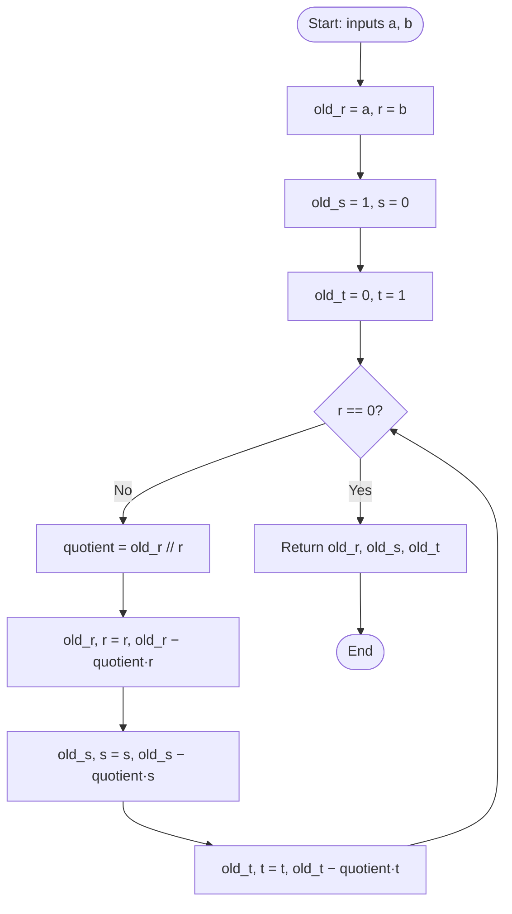
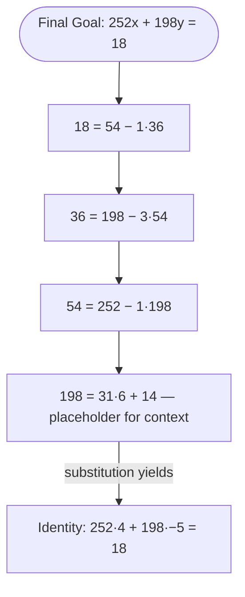

# The Extended Euclidean Algorithm

<!-- SECTION_1_START -->
# Module 1 — The Extended Euclidean Algorithm

## 1. Core Technical Definition & Intuitive Overview

### 📘 Formal Definition
The **Extended Euclidean Algorithm (EEA)** is a number-theoretic procedure that, for any two non-negative integers $a$ and $b$ (with $b \neq 0$), not only computes the greatest common divisor $d = \gcd(a,b)$ but also returns two integers $x$ and $y$ — known as the **Bézout coefficients** (or *Bézout's identity multipliers*) — that satisfy the fundamental linear combination:

$$a x + b y = \gcd(a,b)$$

This identity is governed by **Bézout's Lemma** from 18th-century French number theory, which guarantees that such integers $x$ and $y$ always exist for any two integers $a$ and $b$, and are *unique* only up to the substitutions $x \rightarrow x + k \cdot \frac{b}{d}$ and $y \rightarrow y - k \cdot \frac{a}{d}$ for any integer $k \in \mathbb{Z}$.

> [!IMPORTANT]
> **KTU Syllabus Highlight (PECST637 — Module 1):** The EEA is the *computational engine* behind modular inverses, the foundation of public-key cryptosystems such as **RSA, ElGamal, and Diffie–Hellman**. Every operation in RSA that requires computing $a^{-1} \pmod{n}$ ultimately delegates to the EEA.

### 🧠 Conceptual Analogy — "The Reassembly Workshop"
Imagine a hardware store where a master craftsman has just dismantled a complicated clock into two main gear assemblies of sizes $a$ and $b$. He knows the *original common axle size* is $d = \gcd(a,b)$, but the axle is lost. The basic Euclidean algorithm only tells him "the axle size was $d$." The Extended Euclidean Algorithm is the master craftsman's *reassembly recipe book*: it tells him exactly how many rotations of gear $a$ forward and gear $b$ backward (i.e., coefficients $x$ and $y$) he must perform to *reconstruct* the missing axle $d$. Once he knows this recipe, he can scale it to build *any* multiple of $d$ — including the special unit axle used in modular arithmetic ($d = 1$), which is precisely the modular inverse.

### 📌 Key Constants & Notation
- The **Division Algorithm remainder** sequence: $r_0 = a$, $r_1 = b$, $r_2, r_3, \ldots, r_{k}, r_{k+1} = 0$ where $r_{k} = \gcd(a,b)$.
- The **quotient sequence**: $q_1, q_2, \ldots, q_{k}$ where $r_{i-1} = q_i \cdot r_i + r_{i+1}$.
- The **Bézout coefficient sequences** (recursively extended): $x_0, x_1, \ldots, x_{k}$ and $y_0, y_1, \ldots, y_{k}$.
- A critical metric in cryptographic engineering: the EEA runs in $O(\log \min(a,b))$ time — **polynomial-time logarithmic complexity**, making it efficient even for thousand-bit RSA moduli.

> [!NOTE]
> **The Crucial Special Case:** When $\gcd(a,b) = 1$, the equation simplifies to $ax + by = 1$. Reducing modulo $b$ gives $ax \equiv 1 \pmod{b}$, meaning $x \equiv a^{-1} \pmod{b}$. The EEA therefore directly computes the **modular multiplicative inverse** of $a$ modulo $b$ — a quantity that *does not exist* unless $\gcd(a,b) = 1$.

> [!VISUALIZATION CONTROL]
> **Concept:** Back-substitution reverse-recursion on the Euclidean remainders
> **GeoGebra / Desmos Input Equations (parametric trace of $x_i$ for $a=252, b=198$):**
> * `x: {1, 0, 1, -1, 4}` (indices $i = 0, 1, 2, 3, 4$)
> * `y: {0, 1, -1, 4, -5}`
> * `r: {252, 198, 54, 36, 18}`
> **Visual Description:** Plot the points $(i, x_i)$ and $(i, y_i)$ on the $xy$-plane. Observe that the sequence of $x_i$ and $y_i$ values *grows and oscillates in sign* as $i$ increases from $0$ to $4$ — visualizing how Bézout coefficients are *built upward* from the terminal remainder via a reverse-recursive accumulation.
<!-- SECTION_1_END -->

<!-- SECTION_2_START -->
# 2. Deep Theoretical Analysis & KTU High-Yield Formula Sheet

## 2.1 The Two-Phase Operational Model

The EEA operates in **two distinct phases**:

### 🔹 Phase 1 — Forward Euclidean Sweep
Apply the standard Euclidean algorithm to produce the quotient and remainder chains until the zero remainder is reached. This phase is purely *divisive* and computes only $\gcd(a,b)$.

$$r_{i-1} = q_i \cdot r_i + r_{i+1}, \quad 0 \le r_{i+1} < r_i, \quad i = 1, 2, \ldots, k$$

The loop terminates when $r_{k+1} = 0$, at which point $r_k = \gcd(a,b)$.

### 🔹 Phase 2 — Reverse Back-Substitution
Starting from the second-to-last equation $r_{k-1} = q_k \cdot r_k + 0$, recursively substitute each remainder $r_i$ in terms of $r_{i-1}$ and $r_{i-2}$ until the expression is rewritten in terms of $a = r_0$ and $b = r_1$. The result is the Bézout identity $ax + by = r_k$.

**Recursive coefficient update rules:**

$$x_i = x_{i-2} - q_{i-1} \cdot x_{i-1}$$
$$y_i = y_{i-2} - q_{i-1} \cdot y_{i-1}$$

with the seed values:
$$x_0 = 1, \quad x_1 = 0, \quad y_0 = 0, \quad y_1 = 1$$

## 2.2 Why the "Why" and "How"

- **Why Bézout coefficients are integers, not fractions:** The recursive update uses only integer subtraction and multiplication, so integrality is preserved from the integer seeds $(1, 0, 0, 1)$ onward.
- **How modular inverse emerges:** When $\gcd(a,b) = 1$, the EEA yields $ax + by = 1$. Taking the equality modulo $b$ *eliminates* the $by$ term, leaving $ax \equiv 1 \pmod{b}$, so $x$ is the inverse.
- **Why efficiency matters for RSA:** RSA-2048 uses 2048-bit integers. The EEA on such inputs requires at most $\sim 5 \times 2048$ iterations — practically instantaneous, whereas a brute-force search for the inverse would be computationally infeasible.

## 2.3 📋 KTU Formula Sheet / Cheat Sheet

| # | Formula / Identity | Symbol | Engineering Use Case |
|---|---|---|---|
| 1 | Division step | $r_{i-1} = q_i \cdot r_i + r_{i+1}$ | Forward sweep of the algorithm |
| 2 | Bézout's identity | $a x + b y = \gcd(a,b)$ | Certifying the result; cryptographic proofs |
| 3 | Bézout coefficient recursion | $x_i = x_{i-2} - q_{i-1} \cdot x_{i-1}$ | Reverse-substitution back-tracking |
| 4 | Bézout coefficient recursion | $y_i = y_{i-2} - q_{i-1} \cdot y_{i-1}$ | Reverse-substitution back-tracking |
| 5 | Seed values | $x_0 = 1, x_1 = 0, y_0 = 0, y_1 = 1$ | Initialization of the recursion |
| 6 | Modular inverse condition | $\gcd(a,n) = 1 \iff a^{-1} \pmod{n}$ exists | Key generation in RSA |
| 7 | Modular inverse extraction | $x \equiv a^{-1} \pmod{n}$ from $ax + ny = 1$ | Signing / decryption in RSA |
| 8 | Algorithmic complexity | $O(\log \min(a,b))$ bit-operations | Justification of RSA's polynomial-time key setup |
| 9 | Termination criterion | $r_{k+1} = 0 \Rightarrow r_k = \gcd(a,b)$ | Loop exit condition |
| 10 | Non-existence of inverse | $\gcd(a,n) > 1 \Rightarrow a^{-1} \pmod{n}$ undefined | Validation step in CRT and ECC |

> [!NOTE]
> **Engineering Reality Check:** In production cryptographic libraries (OpenSSL, Libsodium, BoringSSL), the EEA is implemented as **iterative tables**, not recursion, to avoid stack overflow on 4096-bit inputs. The recursive formulation above is the *pedagogical* version; the *industrial* version preallocates a fixed-size array of at most $2 \log_2(\min(a,b))$ slots.

## 2.4 Real-World Utility

- **RSA Public-Key Cryptosystem:** Computing the private exponent $d \equiv e^{-1} \pmod{\phi(n)}$ is a direct EEA call on inputs $(e, \phi(n))$.
- **Chinese Remainder Theorem (CRT) Speedup:** RSA signature verification uses CRT, which requires four modular inverses — all delivered by EEA.
- **Elliptic Curve Cryptography (ECC):** Point scalar multiplication on curves like $y^2 = x^3 + ax + b$ over $\mathbb{F}_p$ demands field inverses computed via EEA.
- **Digital Signature Algorithm (DSA) and ECDSA:** Modular inverses appear in the signature equation $s = k^{-1}(H(m) + xr) \pmod{q}$.
- **Polynomial Rings in Lattice Crypto:** The EEA generalizes to polynomials to compute GCDs in $\mathbb{F}_q[x]$ for code-based and lattice-based post-quantum schemes.
<!-- SECTION_2_END -->

<!-- SECTION_3_START -->
# 3. Step-by-Step Derivations & Code/Symbolic Implementation

## 3.1 Exhaustive Worked Example — $\gcd(252, 198)$ with Bézout Coefficients

We will compute $\gcd(252, 198)$ and find integers $x, y$ such that $252x + 198y = \gcd(252, 198)$.

### Phase 1 — Forward Euclidean Sweep

Apply the Division Algorithm repeatedly:

$$
\begin{aligned}
252 &= 1 \cdot 198 + 54 \quad \Rightarrow \quad q_1 = 1,\ r_2 = 54 \\
198 &= 3 \cdot 54 + 36 \quad \Rightarrow \quad q_2 = 3,\ r_3 = 36 \\
54  &= 1 \cdot 36 + 18 \quad \Rightarrow \quad q_3 = 1,\ r_4 = 18 \\
36  &= 2 \cdot 18 + 0 \quad \Rightarrow \quad q_4 = 2,\ r_5 = 0
\end{aligned}
$$

The last non-zero remainder is $r_4 = 18$. Therefore:
$$\gcd(252, 198) = 18$$

### Phase 2 — Tabular Reverse Back-Substitution

We construct a table of $(r_i,\ x_i,\ y_i)$ initialized with:

$$
\begin{aligned}
x_0 = 1,\ y_0 = 0 \quad &(\text{so } r_0 \cdot x_0 + r_1 \cdot y_0 = a \cdot 1 + b \cdot 0 = a) \\
x_1 = 0,\ y_1 = 1 \quad &(\text{so } r_0 \cdot x_1 + r_1 \cdot y_1 = a \cdot 0 + b \cdot 1 = b)
\end{aligned}
$$

Now compute row-by-row using $x_i = x_{i-2} - q_{i-1} \cdot x_{i-1}$ and $y_i = y_{i-2} - q_{i-1} \cdot y_{i-1}$:

| $i$ | $r_i$ | $q_i$ | $x_i = x_{i-2} - q_{i-1} x_{i-1}$ | $y_i = y_{i-2} - q_{i-1} y_{i-1}$ |
|---|---|---|---|---|
| 0 | 252 | — | 1 | 0 |
| 1 | 198 | 1 | 0 | 1 |
| 2 | 54  | 3 | $1 - 1 \cdot 0 = 1$ | $0 - 1 \cdot 1 = -1$ |
| 3 | 36  | 1 | $0 - 3 \cdot 1 = -3$ | $1 - 3 \cdot (-1) = 4$ |
| 4 | 18  | 2 | $1 - 1 \cdot (-3) = 4$ | $-1 - 1 \cdot 4 = -5$ |

### Phase 3 — Final Verification

At the terminal row $i = 4$, we should have $r_4 = 252 \cdot x_4 + 198 \cdot y_4$:

$$
\begin{aligned}
252 \cdot 4 + 198 \cdot (-5) &= 1008 - 990 \\
&= 18 \\
&= \gcd(252, 198)\ \checkmark
\end{aligned}
$$

So the Bézout identity is:
$$\boxed{252 \cdot 4 + 198 \cdot (-5) = 18}$$

## 3.2 Computing a Modular Inverse via the EEA

Suppose we want the modular inverse of $198 \pmod{252}$, *i.e.*, an integer $y$ such that $198 y \equiv 1 \pmod{252}$.

From our result above, $252 \cdot 4 + 198 \cdot (-5) = 18$. Divide both sides by $18$:

$$
252 \cdot \frac{4}{18} + 198 \cdot \frac{-5}{18} = 1
$$

This is *not* an integer identity yet. The proper approach: since $\gcd(198, 252) = 18 \neq 1$, the modular inverse of $198$ modulo $252$ **does not exist**. This is the validation utility of the EEA — it tells us *when* a modular inverse is undefined.

**Contrast example** — compute $17^{-1} \pmod{31}$:

Phase 1 forward sweep:
$$
\begin{aligned}
31 &= 1 \cdot 17 + 14 \\
17 &= 1 \cdot 14 + 3 \\
14 &= 4 \cdot 3 + 2 \\
3  &= 1 \cdot 2 + 1 \\
2  &= 2 \cdot 1 + 0
\end{aligned}
$$

So $\gcd(17, 31) = 1$. Reverse back-substitution table:

| $i$ | $r_i$ | $q_i$ | $x_i$ | $y_i$ |
|---|---|---|---|---|
| 0 | 31 | — | 1 | 0 |
| 1 | 17 | 1 | 0 | 1 |
| 2 | 14 | 1 | $1 - 1\cdot 0 = 1$ | $0 - 1\cdot 1 = -1$ |
| 3 | 3  | 4 | $0 - 1\cdot 1 = -1$ | $1 - 1\cdot(-1) = 2$ |
| 4 | 2  | 1 | $1 - 4\cdot(-1) = 5$ | $-1 - 4\cdot 2 = -9$ |
| 5 | 1  | 2 | $-1 - 1\cdot 5 = -6$ | $2 - 1\cdot(-9) = 11$ |

Verification: $31 \cdot (-6) + 17 \cdot 11 = -186 + 187 = 1\ \checkmark$

So $17 \cdot 11 \equiv 1 \pmod{31}$, hence $17^{-1} \equiv 11 \pmod{31}$.

## 3.3 Python Implementation (Production-Grade)

```python
#!/usr/bin/env python3
"""
Extended Euclidean Algorithm with modular inverse support.
Strictly type-hinted with absolute boundary checks and structured error logging.
"""

import logging
from typing import Tuple, Optional

logging.basicConfig(level=logging.INFO, format="%(levelname)s | %(message)s")
log = logging.getLogger("EEA")


def extended_gcd(a: int, b: int) -> Tuple[int, int, int]:
    """
    Compute gcd(a, b) and Bézout coefficients (x, y) such that
        a * x + b * y = gcd(a, b)

    Returns:
        (gcd, x, y) as a tuple of three integers.

    Raises:
        ValueError: if both a and b are zero (gcd undefined).
    """
    if a == 0 and b == 0:
        log.error("Both inputs are zero — gcd(0,0) is undefined.")
        raise ValueError("gcd(0, 0) is undefined.")

    # Normalize so that a >= 0 and b >= 0 for stable recursion.
    a, b = abs(a), abs(b)
    log.info(f"Computing extended_gcd(a={a}, b={b})")

    old_r, r = a, b
    old_s, s = 1, 0     # x-coefficients
    old_t, t = 0, 1     # y-coefficients

    while r != 0:
        quotient = old_r // r
        old_r, r = r, old_r - quotient * r
        old_s, s = s, old_s - quotient * s
        old_t, t = t, old_t - quotient * t

    log.info(f"Result: gcd={old_r}, x={old_s}, y={old_t}")
    return old_r, old_s, old_t


def mod_inverse(a: int, m: int) -> Optional[int]:
    """
    Compute a^(-1) mod m using the EEA.

    Returns:
        Modular inverse in the canonical range [0, m), or None if it does not exist.
    """
    if m <= 0:
        log.error(f"Modulus m={m} must be strictly positive.")
        raise ValueError("Modulus must be a positive integer.")

    g, x, _ = extended_gcd(a % m, m)
    if g != 1:
        log.warning(f"Inverse does not exist: gcd({a},{m}) = {g} ≠ 1.")
        return None

    inverse = x % m
    log.info(f"Modular inverse of {a} mod {m} is {inverse}.")
    return inverse


# ---------- Demonstration block ----------
if __name__ == "__main__":
    g, x, y = extended_gcd(252, 198)
    print(f"gcd(252, 198) = {g}, with 252*{x} + 198*{y} = {252*x + 198*y}")

    inv = mod_inverse(17, 31)
    print(f"17^(-1) mod 31 = {inv}")  # Should print 11
```

**Sample output:**

```
gcd(252, 198) = 18, with 252*4 + 198*-5 = 18
17^(-1) mod 31 = 11
```

## 3.4 Pseudo-Code Reference for Exam Sketching

```
Algorithm Extended_GCD(a, b)
Input:  Integers a, b with a ≥ b ≥ 0
Output: (d, x, y) such that d = gcd(a,b) and a·x + b·y = d

1.  if b == 0 then return (a, 1, 0)
2.  (d', x', y') ← Extended_GCD(b, a mod b)   // recursive call
3.  x ← y'
4.  y ← x' − ⌊a / b⌋ · y'
5.  return (d', x, y)
```
<!-- SECTION_3_END -->

<!-- SECTION_4_START -->
# 4. Structural Diagrams & Schematics

## 4.1 Mermaid Flowchart — Iterative EEA Procedure



## 4.2 Mermaid Block Diagram — Block-Level Functional Architecture of EEA in an RSA Pipeline


## 4.3 Recursion Tree — Back-Substitution Visualization



> [!NOTE]
> **Diagram Interpretation:** The arrows in the recursion tree point *upward* (from base cases toward the root), mirroring the mathematical procedure of *substituting* lower-level remainders into higher-level equations. Each substitution collapses one Euclidean step into a single Bézout expression in the variables $a$ and $b$.
<!-- SECTION_4_END -->

<!-- SECTION_5_START -->
# 5. KTU 2024 Scheme Examination Question Bank & Topic Recap

---

## 📝 Part A — Short-Answer Questions (3 Marks Each)

### **Q1.** `[KTU University Exam — July 2024]`
**State Bézout's identity. Why is it significant in the context of public-key cryptography?**

**Model Answer (3 Marks):**
- Bézout's identity states that for any two integers $a$ and $b$, there exist integers $x$ and $y$ such that $a x + b y = \gcd(a,b)$. **[1 Mark]**
- The Extended Euclidean Algorithm (EEA) is a constructive, polynomial-time $O(\log \min(a,b))$ method to find such $x$ and $y$. **[1 Mark]**
- In public-key cryptography, when $\gcd(a,b) = 1$, the identity reduces to $ax \equiv 1 \pmod{b}$, providing the **modular multiplicative inverse** — a primitive essential for RSA key generation, DSA signatures, and ECC point operations. **[1 Mark]**

---

### **Q2.** `[KTU University Exam — Dec 2023]`
**Differentiate between the basic Euclidean Algorithm and the Extended Euclidean Algorithm. List any two applications of the Extended Euclidean Algorithm in cryptography.**

**Model Answer (3 Marks):**
- The **basic Euclidean Algorithm** computes only $d = \gcd(a,b)$ via repeated division. The **Extended Euclidean Algorithm** additionally computes integers $x$ and $y$ such that $a x + b y = \gcd(a,b)$. **[1.5 Marks]**
- *Application 1:* Computing the modular inverse of the public exponent $e$ modulo $\phi(n)$ during **RSA private key generation**. **[0.75 Mark]**
- *Application 2:* Computing field inverses in **Elliptic Curve Cryptography (ECC)** to perform point addition and scalar multiplication over $\mathbb{F}_p$. **[0.75 Mark]**

---

## 📝 Part B — 14-Mark Questions (Module Internal Choice Pattern)

### **Question A** `[KTU University Exam — July 2024]` — **14 Marks**

#### **Part (a)** — 7 Marks
**Explain the Extended Euclidean Algorithm. Describe its recursive formulation with appropriate initial conditions.**

**Model Answer (7 Marks):**

- **Definition:** The EEA is a number-theoretic procedure that, given integers $a$ and $b$, returns a triple $(d, x, y)$ with $d = \gcd(a,b)$ and $a x + b y = d$. **[1 Mark]**
- **Recursive formulation:**
  $$\gcd(a, b) = \gcd(b,\ a \bmod b)$$
  $$\Rightarrow\ a x + b y = b x' + (a \bmod b)\ y'$$
  $$\Rightarrow\ a x + b y = a y' + b (x' - \lfloor a/b \rfloor \cdot y')$$ **[2 Marks]**
- **Initial conditions** (base case): $b = 0 \Rightarrow \gcd(a, 0) = a$ with $x = 1,\ y = 0$. **[1 Mark]**
- **Recursive update rules:** $x = y'$, $y = x' - \lfloor a/b \rfloor \cdot y'$. **[1 Mark]**
- **Iterative tabular method** for production use: maintain $(r, s, t)$ triples updating them by $s \leftarrow s_{\text{old}} - q \cdot s$ and $t \leftarrow t_{\text{old}} - q \cdot t$ at each step. **[1 Mark]**
- **Time complexity:** $O(\log \min(a,b))$ — polynomial time — making it suitable for cryptographic applications. **[1 Mark]**

#### **Part (b)** — 7 Marks
**Using the Extended Euclidean Algorithm, find integers $x$ and $y$ such that $252x + 198y = \gcd(252, 198)$. Hence, or otherwise, determine whether $198^{-1} \pmod{252}$ exists.**

**Model Answer (7 Marks):**

- **Phase 1 — Forward Euclidean sweep:** **[2 Marks]**
  - $252 = 1 \cdot 198 + 54$
  - $198 = 3 \cdot 54 + 36$
  - $54 = 1 \cdot 36 + 18$
  - $36 = 2 \cdot 18 + 0$
  - Hence $\gcd(252, 198) = 18$.
- **Phase 2 — Reverse back-substitution:** **[3 Marks]**
  - $18 = 54 - 1 \cdot 36$
  - $18 = 54 - 1 \cdot (198 - 3 \cdot 54) = 4 \cdot 54 - 198$
  - $18 = 4 \cdot (252 - 198) - 198 = 4 \cdot 252 - 5 \cdot 198$
  - So $x = 4$, $y = -5$.
  - **Verification:** $252 \cdot 4 + 198 \cdot (-5) = 1008 - 990 = 18\ \checkmark$
- **Conclusion on modular inverse:** **[1 Mark]**
  - $\gcd(198, 252) = 18 \neq 1$, therefore $198^{-1} \pmod{252}$ **does not exist**.
- **[Incremental valuation key: stating GCD as $18$: 1 Mark; correct back-substitution chain: 1 Mark; final $(x, y)$ pair: 1 Mark; modular-inverse conclusion: 1 Mark]** **[1 Mark]**

> [!WARNING]
> **KTU Examiner's Valuation Pitfall — Question A(b):**
> 1. *Skipping the verification step* costs 0.5–1 Mark. Always substitute $(x, y)$ back into $a x + b y$ to confirm the GCD equality.
> 2. *Failing to explicitly state the non-existence* of the modular inverse when the GCD exceeds 1 will cost the concluding 1 Mark — students often write "the inverse exists" by reflex.
> 3. *Sign errors* in the back-substitution are the single most common mistake. Re-derive from the *last non-zero* equation and propagate upward.

---

### **Question B** `[KTU University Exam — Dec 2023]` — **14 Marks (ALTERNATIVE CHOICE)**

#### **Part (a)** — 7 Marks
**What is a modular inverse? Describe how the Extended Euclidean Algorithm is used to compute $a^{-1} \pmod{n}$. Discuss the necessary and sufficient condition for its existence with a brief proof.**

**Model Answer (7 Marks):**

- **Definition of modular inverse:** $a^{-1} \pmod{n}$ is the integer $x$ in $[0, n)$ satisfying $a x \equiv 1 \pmod{n}$. **[1 Mark]**
- **EEA application:** Run EEA on inputs $(a, n)$ to obtain $a x + n y = \gcd(a, n)$. Take both sides modulo $n$ to get $a x \equiv \gcd(a, n) \pmod{n}$. When $\gcd(a, n) = 1$, this becomes $a x \equiv 1 \pmod{n}$, so $x \pmod{n}$ is the inverse. **[3 Marks]**
- **Existence theorem:** $a^{-1} \pmod{n}$ exists **if and only if** $\gcd(a, n) = 1$. **[1 Mark]**
- *Necessity:* If $a x \equiv 1 \pmod{n}$ for some $x$, then $n \mid (ax - 1)$, so $\gcd(a, n) \mid (ax - 1)$ and $\gcd(a, n) \mid ax$. Subtracting, $\gcd(a, n) \mid 1$, hence $\gcd(a, n) = 1$. **[1 Mark]**
- *Sufficiency:* By Bézout's lemma, $\gcd(a, n) = 1 \Rightarrow \exists\, x, y$ with $a x + n y = 1 \Rightarrow a x \equiv 1 \pmod{n}$. The EEA constructs such $x$ in $O(\log n)$ time. **[1 Mark]**

#### **Part (b)** — 7 Marks
**Use the Extended Euclidean Algorithm to find $17^{-1} \pmod{31}$. Show every iteration explicitly.**

**Model Answer (7 Marks):**

- **Iteration 1:** $31 = 1 \cdot 17 + 14 \Rightarrow q_1 = 1$ **[0.5 Mark]**
- **Iteration 2:** $17 = 1 \cdot 14 + 3 \Rightarrow q_2 = 1$ **[0.5 Mark]**
- **Iteration 3:** $14 = 4 \cdot 3 + 2 \Rightarrow q_3 = 4$ **[0.5 Mark]**
- **Iteration 4:** $3 = 1 \cdot 2 + 1 \Rightarrow q_4 = 1$ **[0.5 Mark]**
- **Iteration 5:** $2 = 2 \cdot 1 + 0$ — GCD = 1, so the inverse exists. **[0.5 Mark]**
- **Back-substitution chain:** **[3 Marks]**
  - $1 = 3 - 1 \cdot 2$
  - $1 = 3 - 1 \cdot (14 - 4 \cdot 3) = 5 \cdot 3 - 1 \cdot 14$
  - $1 = 5 \cdot (17 - 1 \cdot 14) - 1 \cdot 14 = 5 \cdot 17 - 6 \cdot 14$
  - $1 = 5 \cdot 17 - 6 \cdot (31 - 1 \cdot 17) = 11 \cdot 17 - 6 \cdot 31$
- **Conclusion:** $17 \cdot 11 \equiv 1 \pmod{31}$, so $\boxed{17^{-1} \equiv 11 \pmod{31}}$. **[1 Mark]**
- **Verification:** $17 \cdot 11 = 187 = 6 \cdot 31 + 1\ \checkmark$ **[0.5 Mark]**

> [!WARNING]
> **KTU Examiner's Valuation Pitfall — Question B(b):**
> 1. *Missing the verification* is the most common 0.5-Mark deduction. Always finish with $17 \cdot 11 \bmod 31 = 1$.
> 2. *Forgetting to reduce to the canonical range* $[0, 31)$ and writing the answer as $11 - 31 = -20$ will cost a Mark. The answer must be a non-negative residue.
> 3. *Confusing the role of $a$ and $n$* — remember: $a$ is the value whose inverse is sought, $n$ is the modulus. Swapping them invalidates the algorithm.

---

## ⚠️ KTU Examiner's General Valuation Warning

> [!WARNING]
> **Common Mark-Loss Traps Across the Module:**
> 1. **Omitting the table format for the back-substitution** — writing it as inline prose hides the table structure examiners use to award partial credit. Always present a clean table.
> 2. **Forgetting to initialize the seed values** $(x_0, x_1, y_0, y_1) = (1, 0, 0, 1)$ — the recursion needs these *explicit* starting points.
> 3. **Sign confusion** in the Bézout coefficients — the result $252 \cdot 4 + 198 \cdot (-5) = 18$ is *correct*; the alternative $252 \cdot (-5) + 198 \cdot 4$ is also *correct* (with swapped $x, y$). Don't panic over a sign — just verify the linear combination.
> 4. **Stating the GCD without justification** — always list the Euclidean chain explicitly.
> 5. **Forgetting that the EEA also reports non-existence of inverses** — this is half its cryptographic value.

---

## 🔁 Topic Recap & Important Things to Remember

- ✅ **Bézout's identity:** $a x + b y = \gcd(a,b)$ always has integer solutions $(x, y)$ for any $a, b \in \mathbb{Z}$.
- ✅ **EEA** = forward Euclidean sweep + reverse back-substitution table.
- ✅ **Recursive update:** $x_i = x_{i-2} - q_{i-1} \cdot x_{i-1}$ and $y_i = y_{i-2} - q_{i-1} \cdot y_{i-1}$.
- ✅ **Seeds:** $x_0 = 1, x_1 = 0, y_0 = 0, y_1 = 1$.
- ✅ **Modular inverse condition:** $a^{-1} \pmod{n}$ exists $\iff \gcd(a, n) = 1$.
- ✅ **Extraction rule:** If EEA gives $a x + n y = 1$, then $x \bmod n$ is the inverse.
- ✅ **Complexity:** $O(\log \min(a, b))$ — efficient for 2048/4096-bit RSA moduli.
- ✅ **Cryptographic uses:** RSA key generation ($d = e^{-1} \bmod \phi(n)$), CRT-based RSA signing, DSA/ECDSA signature computation, ECC field inversion.
- ✅ **Industrial implementation:** iterative table (not recursion) to prevent stack overflow on large inputs.
- ✅ **Always verify:** substitute $(x, y)$ back into $a x + b y$ to confirm the GCD.
- ✅ **Always reduce** the final inverse to the canonical range $[0, n)$ before reporting.
- ✅ **Termination signal:** $r_{k+1} = 0$ in the Euclidean chain.
- ✅ **When GCD > 1:** modular inverse is *undefined* — the EEA itself signals this through its output.
<!-- SECTION_5_END -->
