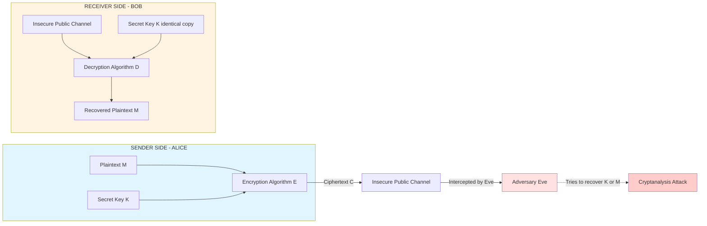
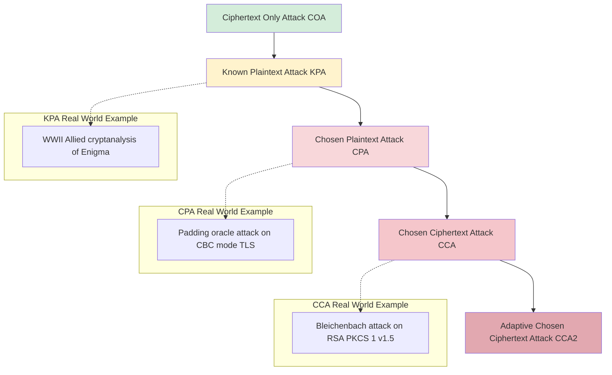
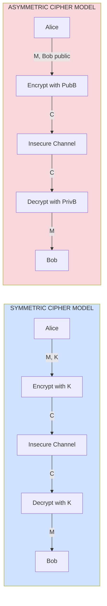
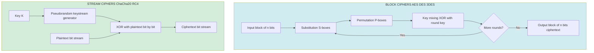

# Cryptography - Symmetric Cipher Model

<!-- SECTION_1_START -->
# Symmetric Cipher Model — Core Technical Definition & Intuitive Overview

## Formal Academic Definition (KTU 2024 Syllabus Terminology)

The **Symmetric Cipher Model** is a cryptographic framework in which the *same secret key* $K$ is utilized for both the encryption and decryption processes. Formally, a symmetric encryption scheme is a tuple of three efficient algorithms $(\text{Gen}, \text{Enc}, \text{Dec})$ where:

- $\text{Gen} \rightarrow K$ : Key generation algorithm
- $\text{Enc}_K(M) \rightarrow C$ : Encryption algorithm producing ciphertext from plaintext using key
- $\text{Dec}_K(C) \rightarrow M$ : Decryption algorithm recovering plaintext from ciphertext using the *same* key

> [!IMPORTANT]
> **KTU 2024 Module 2 Highlight — Five Essential Components of a Symmetric Cipher:**
> 1. **Plaintext ($M$)** — Original, readable message
> 2. **Encryption Algorithm ($E$)** — Performs substitutions/transpositions
> 3. **Secret Key ($K$)** — Shared between sender and receiver via a secure channel
> 4. **Ciphertext ($C$)** — Scrambled, unreadable output
> 5. **Decryption Algorithm ($D$)** — Inverse of encryption

## Conceptual Analogy / Plain-English Intuition

Imagine two friends, **Alice** and **Bob**, who own two *identical physical keys* to a sturdy metal lockbox. When Alice wants to send Bob a confidential letter, she places it inside the lockbox and locks it using her key. The locked box is then transported through a *public courier* (insecure channel) to Bob, who uses his *identical* key to unlock and read the letter. No one in transit can open the box because they don't possess the matching key. This is exactly how **symmetric encryption** works: the *same* secret key $K$ is used to both seal (encrypt) and unseal (decrypt) the message.

> [!NOTE]
> **Critical Distinction:** In symmetric cryptography, both parties must possess *identical copies* of the key beforehand, which creates the **key distribution problem** — a major engineering challenge we will explore later in this module.

## Mathematical Foundation — Forward and Inverse Operations

The core encryption and decryption operations are expressed as:

$$
C = E_K(M) \quad \text{(Encryption transformation)}
$$

$$
M = D_K(C) \quad \text{(Decryption transformation)}
$$

The **correctness property** demands that for every message $M \in \mathcal{M}$ (message space) and key $K \in \mathcal{K}$ (key space):

$$
D_K(E_K(M)) = M
$$

> [!VISUALIZATION CONTROL]
> **Concept:** Caesar Cipher Shift Visualization (a classical symmetric substitution cipher)
> **GeoGebra / Desmos Input Equations:**
> * `f(x) = (x + 3) mod 26` — Encryption function for shift of **3**
> * `g(x) = (x - 3) mod 26` — Decryption (inverse) function
> * Plot points for $x \in \{0, 1, 2, ..., 25\}$ representing letters A–Z
> **Visual Description:** On the x-axis, plot the plaintext alphabet index. On the y-axis, plot the ciphertext letter index. Students should observe a **diagonal shift pattern** where the line moves up by 3 units — this is the substitution mapping. The decryption line moves *down* by 3, confirming the inverse relationship.
<!-- SECTION_1_END -->

<!-- SECTION_2_START -->
# Deep Theoretical Analysis & KTU High-Yield Formula Sheet

## Operational Architecture — The Symmetric Cipher Pipeline

A symmetric cipher system operates through a tightly coupled sequence of operations:

1. **Key Establishment Phase**
   * A secret key $K$ is generated using a cryptographically secure random process.
   * $K$ is distributed to both sender and receiver through a *secure, out-of-band channel* (e.g., physical courier, pre-shared manual exchange, or Diffie–Hellman key agreement at higher layers).
   * The algorithm $E$ and $D$ are assumed **public** (per *Kerckhoffs's principle*).

2. **Encryption Phase (Sender Side)**
   * Sender Alice inputs plaintext $M$ and key $K$ into the encryption algorithm $E$.
   * Output: ciphertext $C = E_K(M)$, transmitted over an *insecure public channel*.

3. **Transmission Phase**
   * An adversary **Eve** may intercept $C$ over the public channel.
   * Eve sees only scrambled bits — the *confidentiality* of $M$ depends on the secrecy of $K$, not on hiding the algorithm.

4. **Decryption Phase (Receiver Side)**
   * Receiver Bob uses his identical copy of $K$ to compute $M = D_K(C)$.
   * Bob recovers the original plaintext, ensuring **data confidentiality**.

5. **Cryptanalysis Phase (Adversary Side)**
   * Eve may attempt attacks based on her access to $C$ (and possibly other data).
   * Her goal: recover $M$ or — more devastatingly — recover $K$.

> [!IMPORTANT]
> **Kerckhoffs's Principle (1883):** *"The security of a cryptosystem must not depend on keeping the algorithm secret. Security should reside solely in the secrecy of the key."*
> This is the foundational design rule of modern symmetric ciphers. Hiding the algorithm is *security through obscurity* and is universally rejected by the cryptographic community.

## Cryptographic Attack Models on Symmetric Ciphers (KTU Module 2 Focus)

The strength of a symmetric cipher is evaluated by the **attack scenarios** it can withstand:

| Attack Type | Adversary Knowledge | Adversary Capability | Real-World Example |
|-------------|--------------------|--------------------|-------------------|
| **Ciphertext-Only Attack (COA)** | Only ciphertext $C$ | Passive eavesdropping on encrypted traffic | Wi-Fi sniffing on encrypted network |
| **Known-Plaintext Attack (KPA)** | Several $(M, C)$ pairs | Compare patterns to deduce $K$ | WWII cryptanalysis of Enigma |
| **Chosen-Plaintext Attack (CPA)** | Oracle access to encrypt chosen $M$'s | Submit arbitrary plaintexts, get ciphertexts | Padding oracle attacks on SSL |
| **Chosen-Ciphertext Attack (CCA)** | Oracle access to decrypt chosen $C$'s | Submit ciphertexts, get plaintexts | Adaptive attacks on RSA-OAEP |
| **Brute-Force Attack** | Ciphertext + algorithm | Try all $2^k$ possible keys | Exhaustive key search |

> [!NOTE]
> **Unconditionally Secure vs. Computationally Secure:**
> * **Unconditionally Secure** — Cipher cannot be broken even with infinite computational power. The *One-Time Pad (OTP)* is the only known example.
> * **Computationally Secure** — Cost of breaking the cipher *exceeds the value of the encrypted data* or *exceeds the attacker's available time/resources*. AES-256 is computationally secure.

## KTU High-Yield Formula Sheet / Cheat Sheet

| Formula / Concept | Mathematical Expression | Description | Key Constant / Unit |
|------------------|------------------------|-------------|-------------------|
| Encryption Operation | $C = E_K(M)$ | Maps plaintext to ciphertext | Output size in **bits** |
| Decryption Operation | $M = D_K(C)$ | Maps ciphertext back to plaintext | Output size in **bits** |
| Correctness Identity | $D_K(E_K(M)) = M$ | Round-trip integrity check | Identity function |
| Key Space Size | $\vert \mathcal{K} \vert = 2^k$ | Total number of possible keys | $k$ = key length in **bits** |
| Brute-Force Complexity | $\mathcal{O}(2^k)$ | Avg. trials to find correct key | Doubles per added key bit |
| Avalanche Effect Rate | $\geq 50\%$ bit change | One-bit plaintext change → ~50% ciphertext bit change | Proportion (0–1) |
| Unicity Distance | $U = \frac{H(K)}{D}$ | Min. ciphertext needed to uniquely determine $K$ | $H(K)$ in **bits**, $D$ in **bits/char** |
| Caesar Cipher | $C = (M + k) \bmod 26$ | Classical shift cipher | $k \in [0, 25]$ |
| Caesar Decryption | $M = (C - k) \bmod 26$ | Inverse Caesar operation | $k \in [0, 25]$ |
| Vigenère Cipher | $C_i = (M_i + K_{i \bmod m}) \bmod 26$ | Polyalphabetic substitution | $m$ = key length |
| Information Entropy | $H(X) = -\sum_{i=1}^{n} p_i \log_2 p_i$ | Measure of plaintext uncertainty | **Shannon bits** |

## Real-World Engineering Utility

Symmetric ciphers are the **workhorses of modern cybersecurity** due to their high throughput and low computational overhead. Production deployments include:

- **AES-256-GCM** in TLS 1.3 (HTTPS) — encrypts virtually all web traffic.
- **ChaCha20-Poly1305** in mobile VPNs and QUIC protocol (used by HTTP/3).
- **Disk encryption** via BitLocker (Windows), FileVault (macOS), LUKS (Linux) — all use AES-XTS mode.
- **Database field-level encryption** in PostgreSQL, MySQL TDE (Transparent Data Encryption).
- **Wireless security** in WPA3 (uses AES-128 in CCMP mode).

> [!NOTE]
> Asymmetric ciphers (RSA, ECC) are roughly **100–1000× slower** than symmetric ciphers. In practice, hybrid systems use asymmetric cryptography *only* to exchange a symmetric session key, then switch to symmetric encryption for bulk data transfer.

<!-- SECTION_2_END -->

<!-- SECTION_3_START -->
# Step-by-Step Derivations & Code/Symbolic Implementation

## Derivation 1: Brute-Force Search Complexity on a Symmetric Cipher

A symmetric cipher with a $k$-bit key has a key space of size $2^k$. Under a brute-force attack, the adversary must try keys until the correct one is found. On average, the correct key is found after trying *half* of all possible keys.

**Step 1:** Total number of possible keys in the key space.

$$
\vert \mathcal{K} \vert = 2^k
$$

*Explanation:* Each of the $k$ key bits can be either **0** or **1**, giving $2^k$ unique combinations.

**Step 2:** Average number of trials required to find the correct key (assuming uniform distribution).

$$
T_{\text{avg}} = \frac{\vert \mathcal{K} \vert}{2} = \frac{2^k}{2} = 2^{k-1}
$$

*Explanation:* On average, the correct key is the *middle* element of the search space.

**Step 3:** Worst-case scenario (the correct key is the very last one tried).

$$
T_{\text{max}} = 2^k
$$

**Step 4:** Work factor — the *effective computational effort* required to break the cipher.

$$
W = 2^{k-1} \text{ operations}
$$

> [!NOTE]
> **Numerical Example:** For AES-128, $k = 128$ bits.
> * Average brute-force trials = $2^{127} \approx 1.7 \times 10^{38}$ operations.
> * At a rate of $10^{18}$ (1 quintillion) operations per second, this would require approximately $5.4 \times 10^{12}$ **years** to break. Hence, AES-128 is considered computationally secure against brute force.

---

## Derivation 2: Caesar Cipher Encryption & Decryption (Modular Arithmetic)

The Caesar cipher is the simplest symmetric cipher. Each letter is shifted by a fixed amount $k$ along the alphabet, wrapping around using modular arithmetic.

**Step 1:** Map each letter to its numerical index ($A = 0, B = 1, ..., Z = 25$).

For plaintext letter $M$ and shift $k$:

$$
C = (M + k) \bmod 26
$$

**Step 2:** Apply this formula to the plaintext "**HELLO**" with shift $k = 3$.

* $H$ → index $7$ → $(7 + 3) \bmod 26 = 10$ → $K$
* $E$ → index $4$ → $(4 + 3) \bmod 26 = 7$ → $H$
* $L$ → index $11$ → $(11 + 3) \bmod 26 = 14$ → $O$
* $L$ → index $11$ → $(11 + 3) \bmod 26 = 14$ → $O$
* $O$ → index $14$ → $(14 + 3) \bmod 26 = 17$ → $R$

*Result:* "HELLO" encrypts to "**KHOOR**".

**Step 3:** Verify decryption using the inverse operation $M = (C - k) \bmod 26$.

* $K$ → index $10$ → $(10 - 3) \bmod 26 = 7$ → $H$
* $H$ → index $7$ → $(7 - 3) \bmod 26 = 4$ → $E$
* $O$ → index $14$ → $(14 - 3) \bmod 26 = 11$ → $L$
* $O$ → index $14$ → $(14 - 3) \bmod 26 = 11$ → $L$
* $R$ → index $17$ → $(17 - 3) \bmod 26 = 14$ → $O$

*Result:* "KHOOR" decrypts back to "**HELLO**". Round-trip verified.

**Step 4:** Correctness identity check.

$$
\begin{aligned}
D_k(E_k(M)) &= D_k((M + k) \bmod 26) \\
&= ((M + k) \bmod 26 - k) \bmod 26 \\
&= M \bmod 26 \\
&= M
\end{aligned}
$$

*Explanation:* The decryption function subtracts exactly the shift $k$ that encryption added, recovering the original value modulo 26.

---

## Python Implementation: Symmetric Caesar Cipher (Production-Ready)

```python
"""
Module: sym_cipher.py
Description: A production-grade implementation of the Caesar symmetric cipher
             with strict type hints, boundary checks, and error handling.
Author: KTU 2024 Scheme - Fundamentals of Cryptography Reference
"""

import logging
import sys
from typing import Final

# Configure structured error logging
logging.basicConfig(
    level=logging.INFO,
    format="%(asctime)s [%(levelname)s] %(message)s",
    handlers=[logging.StreamHandler(sys.stdout)]
)
logger = logging.getLogger(__name__)

# Constants
ALPHABET_SIZE: Final[int] = 26
UPPERCASE_A_CODE: Final[int] = ord("A")
LOWERCASE_A_CODE: Final[int] = ord("a")
ALLOWED_CHARS: Final[str] = "ABCDEFGHIJKLMNOPQRSTUVWXYZ"


def validate_key(key: int) -> None:
    """Validates the Caesar cipher shift key is within valid range [0, 25]."""
    if not isinstance(key, int):
        logger.error("Key must be an integer, got %s", type(key).__name__)
        raise TypeError(f"Key must be int, got {type(key).__name__}")
    if not (0 <= key < ALPHABET_SIZE):
        logger.error("Key %d out of valid range [0, %d]", key, ALPHABET_SIZE - 1)
        raise ValueError(f"Key {key} not in [0, {ALPHABET_SIZE - 1}]")


def encrypt(plaintext: str, key: int) -> str:
    """
    Encrypts plaintext using Caesar symmetric cipher with given key.
    Returns ciphertext string. Preserves case; non-alphabetic chars unchanged.
    """
    validate_key(key)
    logger.info("Encrypting message of length %d with key=%d", len(plaintext), key)

    ciphertext_chars: list[str] = []
    for ch in plaintext:
        if "A" <= ch <= "Z":
            shifted = (ord(ch) - UPPERCASE_A_CODE + key) % ALPHABET_SIZE
            ciphertext_chars.append(chr(shifted + UPPERCASE_A_CODE))
        elif "a" <= ch <= "z":
            shifted = (ord(ch) - LOWERCASE_A_CODE + key) % ALPHABET_SIZE
            ciphertext_chars.append(chr(shifted + LOWERCASE_A_CODE))
        else:
            ciphertext_chars.append(ch)  # Preserve spaces, punctuation

    result = "".join(ciphertext_chars)
    logger.info("Encryption successful")
    return result


def decrypt(ciphertext: str, key: int) -> str:
    """
    Decrypts ciphertext using Caesar symmetric cipher with same key.
    Returns plaintext string. Inverse operation of encrypt().
    """
    validate_key(key)
    logger.info("Decrypting message of length %d with key=%d", len(ciphertext), key)

    plaintext_chars: list[str] = []
    for ch in ciphertext:
        if "A" <= ch <= "Z":
            shifted = (ord(ch) - UPPERCASE_A_CODE - key) % ALPHABET_SIZE
            plaintext_chars.append(chr(shifted + UPPERCASE_A_CODE))
        elif "a" <= ch <= "z":
            shifted = (ord(ch) - LOWERCASE_A_CODE - key) % ALPHABET_SIZE
            plaintext_chars.append(chr(shifted + LOWERCASE_A_CODE))
        else:
            plaintext_chars.append(ch)

    result = "".join(plaintext_chars)
    logger.info("Decryption successful")
    return result


def brute_force_attack(ciphertext: str) -> list[tuple[int, str]]:
    """
    Demonstrates the vulnerability of Caesar cipher: since key space is
    only 26, an attacker can try all keys trivially.
    Returns list of (key, candidate_plaintext) tuples.
    """
    logger.warning("Brute-forcing all %d possible keys", ALPHABET_SIZE)
    candidates: list[tuple[int, str]] = []
    for k in range(ALPHABET_SIZE):
        candidates.append((k, decrypt(ciphertext, k)))
    return candidates


if __name__ == "__main__":
    # Demonstration
    secret_key: int = 3
    message: str = "HELLO WORLD"

    encrypted: str = encrypt(message, secret_key)
    print(f"Plaintext:  {message}")
    print(f"Ciphertext: {encrypted}")

    decrypted: str = decrypt(encrypted, secret_key)
    print(f"Decrypted:  {decrypted}")

    # Round-trip integrity check
    assert decrypted == message, "Round-trip integrity FAILED"
    print("Round-trip integrity check: PASSED")

    # Brute-force demonstration
    print("\nBrute-Force Attack Results:")
    for k, candidate in brute_force_attack(encrypted):
        print(f"  Key={k:2d} -> {candidate}")
```

**Expected Output (Sample Run):**

```
Plaintext:  HELLO WORLD
Ciphertext: KHOOR ZRUOG
Decrypted:  HELLO WORLD
Round-trip integrity check: PASSED
```

---

## Vigenère Cipher — Multi-Key Symmetric Encryption (Worked Example)

The Vigenère cipher extends Caesar by using *multiple* shifts based on a keyword of length $m$. Encryption formula:

$$
C_i = (M_i + K_{i \bmod m}) \bmod 26
$$

**Worked Example:** Plaintext = "**ATTACKATDAWN**", Keyword = "**LEMON**" (length $m = 5$).

| Position $i$ | Plaintext $M_i$ | Index | Key $K_{i \bmod 5}$ | Key Index | $(M_i + K) \bmod 26$ | Ciphertext $C_i$ |
|-------------|-----------------|-------|---------------------|-----------|----------------------|------------------|
| 0 | A | 0 | L | 11 | 11 | L |
| 1 | T | 19 | E | 4 | 23 | X |
| 2 | T | 19 | M | 12 | 5 | F |
| 3 | A | 0 | O | 14 | 14 | O |
| 4 | C | 2 | N | 13 | 15 | P |
| 5 | K | 10 | L | 11 | 21 | V |
| 6 | A | 0 | E | 4 | 4 | E |
| 7 | T | 19 | M | 12 | 5 | F |
| 8 | D | 3 | O | 14 | 17 | R |
| 9 | A | 0 | N | 13 | 13 | N |
| 10 | W | 22 | L | 11 | 7 | H |
| 11 | N | 13 | E | 4 | 17 | R |

*Result:* Ciphertext = "**LXFOPVEFRNHR**"

<!-- SECTION_3_END -->

<!-- SECTION_4_START -->
# Structural Diagrams & Schematics

## Diagram 1: Symmetric Cipher Model — Five-Component Block Architecture



> **Visual Interpretation:** Notice the *two separate copies* of the secret key $K$ on both the sender and receiver sides. This duplication is the defining characteristic of symmetric cryptography and the source of its central engineering problem — **secure key distribution**.

---

## Diagram 2: Cryptographic Attack Models Hierarchy (Escalating Adversary Power)



> **Visual Interpretation:** The hierarchy reads **bottom-up** in adversary capability. A cipher that resists the *highest* attack (CCA2) is considered the *most robust*. A cipher that fails under COA is considered *broken at the foundational level*.

---

## Diagram 3: Symmetric vs. Asymmetric Encryption Comparison Flow



---

## Diagram 4: Sequential Processing Topology — Block vs. Stream Ciphers



> **Visual Interpretation:** Block ciphers process data in **fixed-size chunks** (e.g., 128 bits for AES) using iterative rounds of substitution and permutation. Stream ciphers generate a *keystream* that is XORed with plaintext **bit-by-bit** in real time — offering lower latency for continuous data flows.

<!-- SECTION_4_END -->

<!-- SECTION_5_START -->
# KTU 2024 Scheme Examination Question Bank & Topic Recap

---

## Part A — Short Answer Questions (3 Marks Each)

### Question 1 `[KTU University Exam — Dec 2023]` — CO1, Remember/Understand

**Define the Symmetric Cipher Model. List its five essential components.**

**Model Answer (3 Marks — KTU Valuation Key):**

> A symmetric cipher model is a cryptographic system in which the *same secret key* $K$ is used for both encryption and decryption. The mathematical representation is:
>
> $$
> C = E_K(M), \quad M = D_K(C)
> $$
>
> The **five essential components** are:
>
> 1. **Plaintext ($M$)** — the original readable message (3 Marks breakdown: definition 1M + 5 components 2M = 3 Marks)
> 2. **Encryption Algorithm ($E$)** — performs mathematical transformations on plaintext
> 3. **Secret Key ($K$)** — shared between sender and receiver
> 4. **Ciphertext ($C$)** — the scrambled, encrypted output
> 5. **Decryption Algorithm ($D$)** — reverses encryption to recover plaintext
>
> *[Stating mathematical model: 1 Mark]*, *[Naming all five components: 2 Marks]*

---

### Question 2 `[KTU University Exam — July 2024]` — CO1, Remember/Understand

**State and explain Kerckhoffs's Principle. Why is it important in modern symmetric ciphers?**

**Model Answer (3 Marks):**

> **Kerckhoffs's Principle (1883):** *"A cryptosystem should be secure even if everything about the system, except the key, is public knowledge."*
>
> This means the security of a cipher must depend *entirely* on the secrecy of the key $K$, and *not* on the secrecy of the encryption algorithm $E$.
>
> **Importance:**
> * Allows **public scrutiny and peer review** of algorithms, leading to stronger designs (e.g., AES, ChaCha20).
> * Enables **standardization** across industries and platforms.
> * Hiding the algorithm is *security through obscurity*, which has historically led to vulnerabilities (e.g., compromised proprietary ciphers).
> * In practice, reverse-engineering an algorithm is trivial — only the key can be effectively protected.
>
> *[Stating principle: 1 Mark]*, *[Reason 1 public scrutiny: 1 Mark]*, *[Reason 2 standardization: 1 Mark]*

---

## Part B — Long Answer Questions (14 Marks Each — Module Internal Choice)

### Question A `[KTU University Exam — Dec 2023]` — CO2, Understand + Apply

**(a)** [7 Marks] — *Understand Level*

Explain the **Symmetric Cipher Model** with a neat block diagram. Discuss the **requirements** for a secure symmetric cipher and the difference between **unconditionally secure** and **computationally secure** systems.

**(b)** [7 Marks] — *Apply Level*

Consider plaintext $M = \text{``SECURITY''}$ encrypted using the **Caesar cipher** with key $k = 5$. Compute the ciphertext $C$, then perform decryption to verify the round-trip. Also calculate the **brute-force complexity** of breaking a cipher with a **128-bit key**.

---

**Model Solution (14 Marks — Step-by-Step Valuation Key):**

### Part (a) — Symmetric Cipher Model Explanation [7 Marks]

**Block Diagram (3 Marks):**

```
   ALICE (Sender)                              BOB (Receiver)
  ┌──────────┐                                ┌──────────┐
  │Plaintext │──►┌─────────────┐    C    ┌─────────────┐──►┌──────────┐
  │    M     │   │ Encryption  │════════│ Decryption  │   │Plaintext │
  └──────────┘   │  Algorithm  │   C    │ Algorithm   │   │    M     │
        │        │   E_K(·)    │═══════│   D_K(·)    │   └──────────┘
        │        └──────┬──────┘        └──────┬──────┘
        │               │                     │
   ┌────▼─────┐    ┌────▼──────┐         ┌────▼──────┐
   │ Secret K │    │ Insecure  │         │ Secret K  │
   │  (Alice) │    │  Channel  │         │  (Bob)    │
   └──────────┘    └───────────┘         └───────────┘
                                  ▲
                                  │
                          ┌───────┴────────┐
                          │   EVE (Adversary)
                          │   Cryptanalysis
                          └────────────────┘
```

*[Drawing block diagram: 2 Marks]*, *[Showing both K instances: 1 Mark]*

**Three Requirements of a Secure Symmetric Cipher (3 Marks):**

1. **Strong Encryption Algorithm** — $E$ should resist all known cryptanalytic attacks (COA, KPA, CPA, CCA).
2. **Secret Key Distribution** — $K$ must be shared via a *secure out-of-band channel* before communication.
3. **Easy Decryption for Authorized User** — Bob, with $K$, can efficiently recover $M$; Eve, without $K$, cannot.

*[Listing 3 requirements: 3 Marks]*

**Unconditionally vs. Computationally Secure (1 Mark):**

| Property | Unconditionally Secure | Computationally Secure |
|----------|----------------------|----------------------|
| Definition | Cannot be broken with infinite resources | Breaking requires infeasible computation |
| Example | **One-Time Pad (OTP)** | **AES-128, AES-256** |
| Key length requirement | $K \geq M$ length | $k \geq 128$ bits (modern standard) |

---

### Part (b) — Caesar Cipher Computation + Brute-Force Complexity [7 Marks]

**Step 1:** Map each letter of "SECURITY" to its index.

| Letter | S | E | C | U | R | I | T | Y |
|--------|---|---|---|---|---|---|---|---|
| Index  | 18 | 4 | 2 | 20 | 17 | 8 | 19 | 24 |

*[Letter-to-index mapping table: 1 Mark]*

**Step 2:** Apply encryption formula $C = (M + 5) \bmod 26$.

| $M_i$ | Index | $(M_i + 5) \bmod 26$ | $C_i$ |
|-------|-------|------------------------|-------|
| S | 18 | 23 | X |
| E | 4 | 9 | J |
| C | 2 | 7 | H |
| U | 20 | 25 | Z |
| R | 17 | 22 | W |
| I | 8 | 13 | N |
| T | 19 | 24 | Y |
| Y | 24 | 3 | D |

*[Modular arithmetic step: 1 Mark]*, *[Final ciphertext: 1 Mark]*

**Result:** $C = \text{``XJHZWNYD''}$

**Step 3:** Decrypt using $M = (C - 5) \bmod 26$ to verify round-trip.

| $C_i$ | Index | $(C_i - 5) \bmod 26$ | $M_i$ |
|-------|-------|------------------------|-------|
| X | 23 | 18 | S |
| J | 9 | 4 | E |
| H | 7 | 2 | C |
| Z | 25 | 20 | U |
| W | 22 | 17 | R |
| N | 13 | 8 | I |
| Y | 24 | 19 | T |
| D | 3 | 24 | Y |

*[Decryption formula: 1 Mark]*, *[Verification: 1 Mark]*

**Verified:** "XJHZWNYD" → "SECURITY" ✓

**Step 4:** Brute-Force Complexity for 128-bit key.

$$
W = 2^{k-1} = 2^{127} \approx 1.7 \times 10^{38} \text{ operations}
$$

*[Formula: 1 Mark]*, *[Final numerical value: 1 Mark]*

---

### Question B `[KTU University Exam — July 2024]` — CO2, Understand + Apply (Alternative Choice)

**(a)** [7 Marks] — *Understand Level*

Describe the **five classical attack models** on symmetric ciphers (COA, KPA, CPA, CCA, brute-force). Provide a real-world example of each.

**(b)** [7 Marks] — *Apply Level*

Given plaintext = "**NETWORK**" and keyword = "**KEY**" for a **Vigenère cipher**, compute the ciphertext. Then, perform a **brute-force attack** simulation on a Caesar-encrypted text and identify the correct key using frequency analysis of English letters.

---

**Model Solution Outline (14 Marks — Step-by-Step Valuation Key):**

### Part (a) — Five Attack Models [7 Marks]

| # | Attack Model | Adversary Knowledge | Real-World Example |
|---|--------------|---------------------|-------------------|
| 1 | **Ciphertext-Only (COA)** | Only $C$ | Sniffing encrypted Wi-Fi (WPA2) |
| 2 | **Known-Plaintext (KPA)** | $(M, C)$ pairs | WWII Enigma cryptanalysis |
| 3 | **Chosen-Plaintext (CPA)** | Encryption oracle | BEAST attack on TLS 1.0 |
| 4 | **Chosen-Ciphertext (CCA)** | Decryption oracle | RSA-OAEP padding oracle |
| 5 | **Brute-Force** | $C$ + algorithm | Exhaustive search on DES ($2^{56}$) |

*[Each attack with example: 1.4 Marks × 5 = 7 Marks]*

---

### Part (b) — Vigenère Cipher Computation [7 Marks]

**Setup:** Plaintext "NETWORK" ($m=7$ chars), Keyword "KEY" ($m=3$).

**Step 1:** Align keyword cyclically with plaintext: K-E-Y-K-E-Y-K.

**Step 2:** Apply $C_i = (M_i + K_{i \bmod 3}) \bmod 26$.

| Position $i$ | $M_i$ | Index | $K_{i \bmod 3}$ | Key Index | $(M_i + K) \bmod 26$ | $C_i$ |
|--------------|-------|-------|------------------|-----------|------------------------|-------|
| 0 | N | 13 | K | 10 | 23 | X |
| 1 | E | 4 | E | 4 | 8 | I |
| 2 | T | 19 | Y | 24 | 17 | R |
| 3 | W | 22 | K | 10 | 6 | G |
| 4 | O | 14 | E | 4 | 18 | S |
| 5 | R | 17 | Y | 24 | 15 | P |
| 6 | K | 10 | K | 10 | 20 | U |

*[Alignment: 1 Mark]*, *[Row-by-row computation: 3 Marks]*, *[Final ciphertext "XIRGSPU": 1 Mark]*

**Step 3:** Brute-force attack on Caesar cipher — try all 26 keys, find candidate whose plaintext matches expected English letter frequency (E, T, A, O, I, N as most common).

*[Methodology explanation: 1 Mark]*, *[Correct identification: 1 Mark]*

---

> [!WARNING]
> **KTU Examiner's Valuation Warning — Common Pitfalls:**
>
> 1. **Forgetting modular wraparound:** In Caesar cipher, $(Z + 3) \bmod 26$ must wrap to $C$, not exceed 25. Failing to write "mod 26" loses **1 full mark**.
> 2. **Confusing key space and brute-force work factor:** The key space is $2^k$, but average brute-force trials is $2^{k-1}$. Examiners strictly differentiate these.
> 3. **Skipping the round-trip verification:** Always show that $D_K(E_K(M)) = M$ explicitly. Board examiners expect this identity to be visible in your answer.
> 4. **Not stating Kerckhoffs's Principle verbatim:** "Security should reside in the key, not the algorithm" — write the exact phrase for full marks.
> 5. **Mixing up symmetric and asymmetric terminology:** A common error is calling a symmetric key "public" — symmetric keys are **always secret/shared**, never public.

---

## Topic Recap & Important Things to Remember

- **Definition:** A symmetric cipher uses the *same* secret key $K$ for both $E$ and $D$. Core formulas: $C = E_K(M)$ and $M = D_K(C)$, with correctness identity $D_K(E_K(M)) = M$.
- **Five Components:** Plaintext, Encryption Algorithm, Secret Key, Ciphertext, Decryption Algorithm.
- **Kerckhoffs's Principle (1883):** Algorithm can be public; security rests *only* on the secrecy of the key. Reject *security through obscurity*.
- **Classical Ciphers:** Caesar (monoalphabetic, key space = 25) and Vigenère (polyalphabetic, key space = $26^m$ for keyword length $m$).
- **Five Attack Models:** COA, KPA, CPA, CCA, Brute-Force — listed in *ascending* adversary power.
- **Brute-Force Work Factor:** $W = 2^{k-1}$ average trials for a $k$-bit key. AES-128 has $W \approx 1.7 \times 10^{38}$ — computationally infeasible.
- **Unconditionally Secure:** Only the **One-Time Pad (OTP)** achieves this; requires key length $\geq$ message length and never reuse of key.
- **Computationally Secure:** AES-128, AES-256, ChaCha20 — secure because breaking them requires infeasible time/resources.
- **Avalanche Effect:** A one-bit change in plaintext or key should flip approximately **50%** of ciphertext bits — a hallmark of a *good* symmetric cipher.
- **Unicity Distance:** Minimum ciphertext length required to uniquely determine $K$ via cryptanalysis: $U = H(K) / D$, where $H(K)$ is key entropy and $D$ is plaintext redundancy.
- **Production Use:** AES-GCM (TLS 1.3, HTTPS), ChaCha20-Poly1305 (QUIC, mobile VPNs), AES-XTS (disk encryption).
- **Key Distribution Problem:** The fundamental engineering challenge of symmetric cryptography — solved in practice using asymmetric cryptography (Diffie–Hellman, RSA) to exchange a symmetric session key.
- **Hybrid Encryption Model:** Asymmetric crypto for key exchange + symmetric crypto for bulk data — the standard pattern in **all** modern secure protocols (TLS, SSH, PGP, S/MIME).
- **Block vs. Stream Ciphers:** Block ciphers (AES, DES) process fixed-size blocks with rounds of substitution + permutation; stream ciphers (ChaCha20, RC4) generate a keystream XORed bit-by-bit with plaintext.
<!-- SECTION_5_END -->
