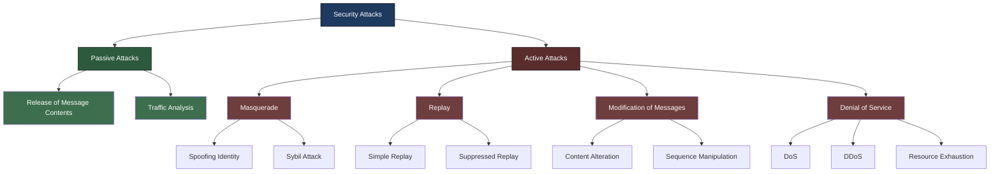
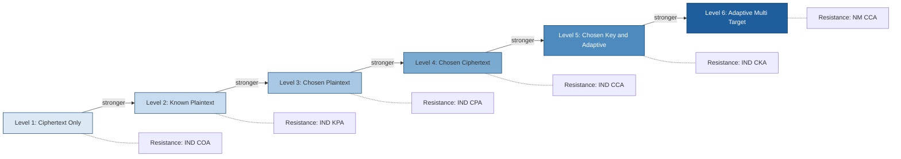
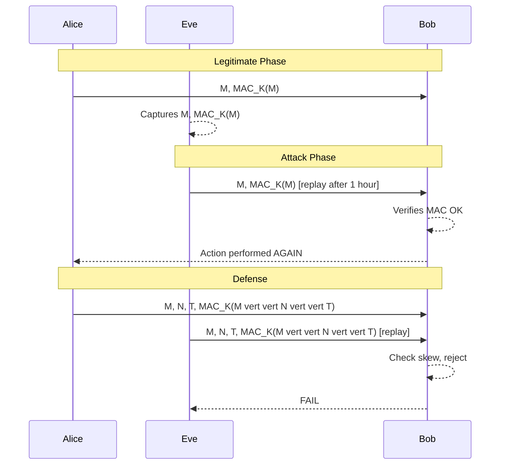
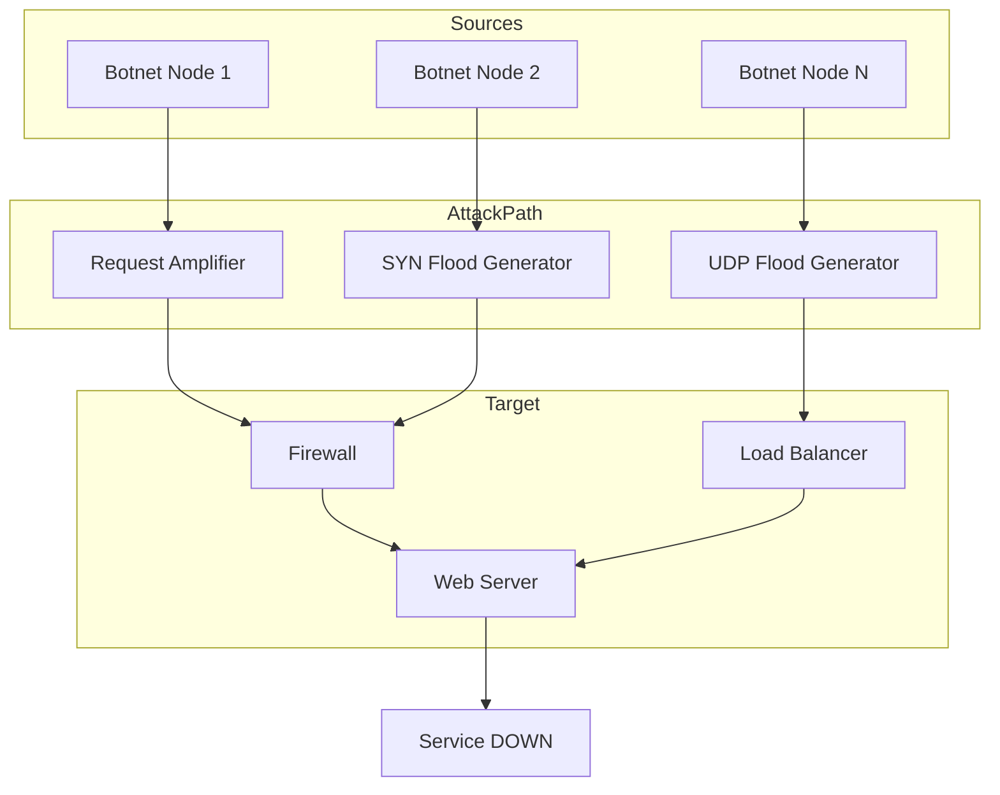

# Security Attacks

<!-- SECTION_1_START -->
# Security Attacks — Core Definition & Intuitive Overview

## 1.1 Formal Academic Definition (KTU 2024 Syllabus Terminology)

In the context of **information security** and **cryptography**, a **security attack** is any deliberate, malicious, or unauthorized action that attempts to **compromise the security objectives** of an information system. The formal KTU definition states:

> A security attack is an event (or a sequence of events) in which an adversary (attacker) deliberately attempts to **breach one or more security services** — namely *Confidentiality, Integrity, Authentication, Non-repudiation, and Availability* — of a computing or communication system.

According to the **threat model** in modern cryptography (Goldwasser–Micali, 1982) and formalized in the **KTU 2024 PECST637 syllabus**, every attack is characterized by a triple:

$$\text{Attack} = \langle \mathcal{A}, \mathcal{O}, \mathcal{G} \rangle$$

where:
- $\mathcal{A}$ = the adversary (algorithm + computational resources)
- $\mathcal{O}$ = the *oracle* (what the attacker can access — e.g., ciphertext, encryption/decryption, signing keys)
- $\mathcal{G}$ = the *goal* (what the attacker wants to achieve — e.g., recover key, forge signature, alter message)

> [!IMPORTANT]
> **KTU Highlight:** The syllabus emphasizes the difference between a **threat** (potential cause of an incident) and an **attack** (the actual, deliberate attempt). A *vulnerability* is the weakness exploited; a *threat* is the danger; the **attack** is the realized exploitation.

## 1.2 Conceptual Analogy — "The Bank Vault and the Safe-Cracker"

Imagine a bank vault protecting gold bars. The vault offers five promises to its owner:

| Vault Promise | Security Service | Real-World Meaning |
|---------------|------------------|---------------------|
| Only authorized people see the gold | **Confidentiality** | No eavesdropping |
| Gold bars cannot be swapped with fakes | **Integrity** | No tampering |
| The vault identifies who opens it | **Authentication** | Identity proof |
| Once opened, the owner can't deny it | **Non-Repudiation** | Traceable actions |
| Vault opens when needed | **Availability** | Service uptime |

A **security attack** is any attempt by a "safe-cracker" to break one or more of these promises. The safe-cracker may:
- Peek through a crack → **passive attack on confidentiality**
- Swap a gold bar with a fake → **active attack on integrity**
- Pose as the bank manager → **spoofing attack on authentication**
- Block the vault door with cement → **Denial-of-Service attack on availability**

> [!NOTE]
> **Why this matters for KTU:** Examiners frequently test whether you can map a given attack scenario to the *correct* security service being violated. Always ask: "Which of the five CIA-NA services is being broken?"

## 1.3 Geometric / Graphical Intuition — The Attack Model Axes

The security attack landscape can be visualized along **two primary axes**:

1. **X-axis: Passive ↔ Active** (Is the attacker merely observing or modifying?)
2. **Y-axis: Difficulty / Capability** (How much oracle/power does the attacker have?)

```
   Difficulty/Oracle Power
   ↑
   │     B.E.  K.P.  C.P.   C.K.A.
   │                              ●
   │           ●    ●    ●
   │
   │     ● (Interception, Traffic Analysis)
   │
   └────────────────────────────────────→ 
   Passive                          Active
```

> [!VISUALIZATION CONTROL]
> **Concept:** Attack capability hierarchy and action type
> **Desmos Input Points:**
> * $(0, 1)$ → "Interception" (Passive, trivial)
> * $(2, 2)$ → "Traffic Analysis" (Passive, moderate)
> * $(3, 3)$ → "Known-Plaintext" (B.E.)
> * $(4, 4)$ → "Chosen-Plaintext" (C.P.)
> * $(5, 5)$ → "Chosen-Ciphertext" (C.C.A.) / Chosen-Key (C.K.A.)
> **Visual Description:** A monotonic rising curve demonstrating that *stronger* attacker power yields *higher* attack capability. Note that passive attacks sit on the left, active attacks on the right, and the difficulty escalates upward.

> [!IMPORTANT]
> **Standard Security Metrics Used in This Module (KTU 2024):**
> - **Work Factor ($W$):** Estimated computational effort to break the system (measured in bit operations).
> - **Information Revealed ($I$):** Amount of plaintext/secret bits leaked.
> - **Time Complexity ($T(n)$):** Polynomial/exponential scaling with security parameter $n$.
> - **Attack Probability ($P_{\text{success}}$):** Often expressed as a **negligible function** $\epsilon(n)$ where $\epsilon(n) < \frac{1}{p(n)}$ for every polynomial $p$.

---

<!-- SECTION_1_END -->

<!-- SECTION_2_START -->
# Deep Theoretical Analysis & KTU High-Yield Formula Sheet

## 2.1 The Two Grand Divisions of Attacks

Every attack classified in the KTU PECST637 syllabus falls into one of two super-categories:

### 2.1.1 Passive Attacks

The attacker **observes** but does **not modify** the communication. The system continues to function normally, making these attacks **extremely difficult to detect**.

**Sub-types (memorize in order of severity):**

1. **Release of Message Contents (Interception)**
   * Aims at *confidentiality*.
   * The attacker captures a message body — e.g., an email, a phone call, an HTTP cookie.

2. **Traffic Analysis**
   * Aims at *confidentiality* (and indirectly, at *location* and *identity*).
   * Even if the message is encrypted, the attacker can deduce *who* is talking to *whom*, *when*, *how long*, and *how frequently* — a powerful intelligence source.

> [!NOTE]
> **KTU Examiner Tip:** The defining test for a *passive* attack is the question: "Did the system's normal operation change in any way?" If **No**, it is passive. If **Yes**, it is active.

### 2.1.2 Active Attacks

The attacker **modifies** data, **impersonates** a party, or **disrupts** the service. Active attacks can be **detected (but not always prevented)**.

**Sub-types:**

1. **Masquerade** — Pretending to be another entity (violates *authentication*).
2. **Replay** — Capturing a valid transmission and re-sending it later (violates *freshness*).
3. **Modification of Messages** — Altering message contents (violates *integrity*).
4. **Denial of Service (DoS / DDoS)** — Flooding a system to prevent legitimate use (violates *availability*).

## 2.2 Formal Hierarchy of Cryptanalytic Attacks (Attack Models)

The KTU syllabus lists these in order of **increasing attacker power**. Always remember: *a cipher broken under a stronger model is broken under all weaker models*; but the converse is **not** true.

$$\text{Key-Only} \;\prec\; \text{KPA} \;\prec\; \text{CPA} \;\prec\; \text{CCA} \;\prec\; \text{CKA}$$

### 2.2.1 Detailed Breakdown

| # | Attack Model | Attacker Access | Goal | Notation |
|---|--------------|-----------------|------|----------|
| 1 | **Ciphertext-Only (COA) / Key-Only** | Only ciphertexts $C_1, C_2, \dots, C_n$ | Recover plaintext or key | $\mathcal{O} = \text{Enc}_K(\cdot)$ |
| 2 | **Known-Plaintext (KPA)** | Ciphertexts **+** some matching plaintexts $(P_i, C_i)$ | Recover key or decrypt new $C$ | $\mathcal{O} = \text{Enc}_K, \text{Dec}_K$ |
| 3 | **Chosen-Plaintext (CPA)** | Can submit chosen plaintexts and obtain ciphertexts | Recover key or decrypt target $C$ | $\mathcal{O}^{\pm}_{\text{Enc}}$ |
| 4 | **Chosen-Ciphertext (CCA)** | CPA access + can submit ciphertexts and obtain decryptions | Decrypt target $C$ *or* forge | $\mathcal{O}^{\pm}_{\text{Enc}, \text{Dec}}$ |
| 5 | **Chosen-Key (CKA)** | Attacker has multiple related keys | Break multiple ciphertexts simultaneously | Multi-key $\mathcal{K}$ |
| 6 | **Birthday Attack** | Probabilistic, $O(2^{n/2})$ queries | Find collisions | $T(n) = O(2^{n/2})$ |

### 2.2.2 Why This Hierarchy Matters

If a scheme is **provably CPA-secure** but not CCA-secure, the scheme can be broken if the attacker gets *decryption* access. Examples:

- **RSA-PKCS#1 v1.5** is CPA-secure but vulnerable to **Bleichenbacher's CCA attack** (1998).
- **AES in ECB mode** is CPA-insecure because identical plaintext blocks produce identical ciphertext blocks.
- **HMAC-DRBG** is CCA-secure under standard assumptions.

## 2.3 The KTU "Security Service vs. Attack" Cross-Reference

This table is **high-yield** — questions of the form "Which attack violates service X?" appear almost every semester.

| Security Service | Definition | Attack(s) that Violate It |
|------------------|------------|---------------------------|
| **Confidentiality** | Information not disclosed to unauthorized parties | Interception, Traffic Analysis, CPA, KPA, COA |
| **Integrity** | Data is unaltered in transit or storage | Modification, Replay, Stream insertion/deletion |
| **Authentication** | Identity of sender is verified | Masquerade, Spoofing, Replay |
| **Non-Repudiation** | Sender cannot deny sending | Forging signatures, key compromise |
| **Availability** | System is accessible when needed | DoS, DDoS, SYN flood, Smurf, Jamming |
| **Access Control** | Only authorized users access resources | Privilege escalation, password cracking |

## 2.4 Mathematical Foundations — Useful Inequalities & Metrics

For **adversarial advantage** and **attack success probability**, KTU expects familiarity with:

$$\text{Adv}_{\mathcal{A}}^{\text{atk}}(\Pi, n) = \vert \Pr[\text{Game}_{\mathcal{A}}^{\text{atk}} = 1] - \frac{1}{2} \vert$$

A scheme $\Pi$ is **secure** if for all PPT (probabilistic polynomial-time) adversaries $\mathcal{A}$:

$$\text{Adv}_{\mathcal{A}}^{\text{atk}}(\Pi, n) \leq \epsilon(n)$$

where $\epsilon(n)$ is a **negligible function**.

**Negligible function test:**

$$\epsilon(n) \text{ is negligible} \iff \forall \text{ polynomials } p(\cdot): \exists n_0: \forall n > n_0,\; \epsilon(n) < \frac{1}{p(n)}$$

### 2.4.1 The Birthday Paradox — A KTU Favorite

For a hash function with $n$-bit output, the expected number of samples to find a collision is:

$$q \approx \sqrt{2^n} = 2^{n/2}$$

This is the **birthday bound**. Hence:
- **MD5** (128-bit) → $2^{64}$ operations to find a collision (broken in practice).
- **SHA-256** → $2^{128}$ operations (theoretically safe, but quantum gives $2^{85}$ via BHT).

> [!NOTE]
> **Engineering Insight:** This is why KTU stresses that security parameters should be at least $\lambda = 128$ bits to make $2^{64}$ operations infeasible. Real systems like **TLS 1.3** and **Signal Protocol** use $n \geq 256$ for collision resistance.

---

<!-- SECTION_2_END -->

<!-- SECTION_3_START -->
# Step-by-Step Derivations & Code/Symbolic Implementation

## 3.1 Detailed Worked Example — Replay Attack Analysis

### 3.1.1 The Scenario

Alice sends Bob an authenticated money-transfer message:

$$M = \langle \text{``Transfer ₹5000 from A to B''}, \; \text{MAC}_K(M) \rangle$$

An attacker Eve **records** this message and **resends** it 1 hour later.

### 3.1.2 Step-by-Step Symbolic Analysis

**Step 1 — Identify the security service broken:**
The MAC is intact (no modification), the identity is genuine (no masquerade), but the message is **not fresh**. Therefore the violated service is **integrity of *time*** — also called **freshness**.

**Step 2 — Define the freshness condition mathematically:**
A message is *fresh* if and only if:

$$M \in \mathcal{T} \iff \tau(M) \geq t_{\text{current}} - \Delta_{\text{skew}}$$

where $\tau(M)$ is the timestamp on $M$ and $\Delta_{\text{skew}}$ is the allowed clock-drift window (e.g., 5 minutes).

**Step 3 — Identify the gap in the protocol:**
If the protocol accepts $M$ whenever $\text{MAC}_K(M)$ is valid — *without* checking $\tau(M)$ — the system is **replay-vulnerable**.

**Step 4 — Formalize the attack in game form:**

$$
\begin{aligned}
&\textbf{Game}_{\text{Replay}}^{\mathcal{A}} \\
&1.\; \text{Adversary } \mathcal{A} \text{ receives valid message } (M, \sigma) \text{ from the oracle.} \\
&2.\; \mathcal{A} \text{ submits the same pair } (M, \sigma) \text{ to Bob at time } t' \gg t. \\
&3.\; \text{If Bob accepts: } \text{Game}_{\text{Replay}}^{\mathcal{A}} = 1; \text{ else } 0.
\end{aligned}
$$

**Step 5 — The advantage:**
$\text{Adv}_{\mathcal{A}}^{\text{Replay}} = 1$ if the MAC scheme provides no freshness. To prevent this, we modify the protocol:

$$M' = \langle M, \; N, \; \tau \rangle, \quad \sigma' = \text{MAC}_K(M \,\vert\vert\, N \,\vert\vert\, \tau)$$

where $N$ is a **nonce** (number used once) and $\tau$ is the timestamp.

## 3.2 Python Code — Demonstrating Replay Vulnerability and Defense

```python
"""
Replay Attack Demonstration (KTU PECST637 Module 2)
----------------------------------------------------
This program shows:
  1. A naive HMAC-based protocol that is REPLAY-VULNERABLE.
  2. A hardened version using a NONCE + TIMESTAMP that resists replay.
"""

import hmac
import hashlib
import time
from typing import Tuple, Optional


# ---------- (1) Naive vulnerable implementation ----------
class VulnerableChannel:
    """Simulates a channel where Alice sends MAC-authenticated messages to Bob
    but the protocol has no freshness check."""

    def __init__(self, secret_key: bytes) -> None:
        if not isinstance(secret_key, bytes) or len(secret_key) < 16:
            raise ValueError("[VulnerableChannel] Key must be >= 16 bytes.")
        self._K: bytes = secret_key
        self._captured: Optional[Tuple[bytes, bytes]] = None

    def alice_sends(self, plaintext: str) -> Tuple[bytes, bytes]:
        """Alice creates (message, tag) and transmits. The tag is HMAC-SHA256."""
        if not isinstance(plaintext, str) or len(plaintext) == 0:
            raise ValueError("[alice_sends] Plaintext must be a non-empty string.")
        M: bytes = plaintext.encode("utf-8")
        T: bytes = hmac.new(self._K, M, hashlib.sha256).digest()
        # Eavesdropper stores the pair (M, T)
        self._captured = (M, T)
        return (M, T)

    def bob_receives(self, M: bytes, T: bytes) -> bool:
        """Bob verifies HMAC. NOTE: no timestamp or nonce check."""
        if not isinstance(M, bytes) or not isinstance(T, bytes):
            raise TypeError("[bob_receives] M and T must be bytes.")
        expected: bytes = hmac.new(self._K, M, hashlib.sha256).digest()
        if hmac.compare_digest(T, expected):
            print(f"[Bob] ACCEPTED message: {M.decode('utf-8', errors='replace')!r}")
            return True
        print("[Bob] REJECTED: MAC verification failed.")
        return False


def demo_vulnerable_protocol() -> None:
    print("=" * 60)
    print("CASE 1: Vulnerable protocol (no freshness)")
    print("=" * 60)
    K: bytes = b"super-secret-key-1234567890"
    channel: VulnerableChannel = VulnerableChannel(K)

    # Legitimate transfer
    transfer_message: str = "TRANSFER 5000 INR FROM A TO B"
    M1, T1 = channel.alice_sends(transfer_message)
    print(f"Alice -> Bob: {M1.decode()}  |  tag={T1.hex()[:16]}...")

    # Bob receives original
    channel.bob_receives(M1, T1)

    # ---- ATTACK: Eve replays the captured message ----
    if channel._captured is not None:
        replay_M, replay_T = channel._captured
        print("\n[Eve] Replays the captured message 1 hour later...")
        time.sleep(0.01)  # symbolic delay
        channel.bob_receives(replay_M, replay_T)
    print()


# ---------- (2) Hardened implementation with nonce + timestamp ----------
class SecureChannel:
    """HMAC-authenticated protocol that includes a nonce and timestamp."""

    def __init__(self, secret_key: bytes, max_skew_sec: int = 5) -> None:
        if not isinstance(secret_key, bytes) or len(secret_key) < 16:
            raise ValueError("[SecureChannel] Key must be >= 16 bytes.")
        if not isinstance(max_skew_sec, int) or max_skew_sec < 1:
            raise ValueError("[SecureChannel] max_skew_sec must be a positive int.")
        self._K: bytes = secret_key
        self._max_skew: int = max_skew_sec
        self._used_nonces: set[bytes] = set()

    def alice_sends(self, plaintext: str) -> Tuple[bytes, bytes, int]:
        """Alice signs (M || nonce || timestamp)."""
        if not isinstance(plaintext, str) or len(plaintext) == 0:
            raise ValueError("[alice_sends] Plaintext must be a non-empty string.")
        M: bytes = plaintext.encode("utf-8")
        N: bytes = hashlib.sha256(str(time.time_ns()).encode()).digest()[:16]
        T: int = int(time.time())
        payload: bytes = M + b"|" + N + b"|" + str(T).encode()
        tag: bytes = hmac.new(self._K, payload, hashlib.sha256).digest()
        return (payload, tag, T)

    def bob_receives(self, payload: bytes, tag: bytes, claimed_time: int) -> bool:
        """Bob checks (a) HMAC, (b) timestamp skew, (c) nonce reuse."""
        if not isinstance(payload, bytes) or not isinstance(tag, bytes):
            raise TypeError("[bob_receives] payload/tag must be bytes.")
        if not isinstance(claimed_time, int):
            raise TypeError("[bob_receives] claimed_time must be int.")
        try:
            expected: bytes = hmac.new(self._K, payload, hashlib.sha256).digest()
        except Exception as e:
            print(f"[Bob] ERROR computing HMAC: {e}")
            return False
        if not hmac.compare_digest(tag, expected):
            print("[Bob] REJECTED: MAC verification failed.")
            return False
        # Decompose payload
        parts: list[bytes] = payload.split(b"|")
        if len(parts) != 3:
            print("[Bob] REJECTED: malformed payload.")
            return False
        M_b, N_b, _ = parts
        # (b) freshness check
        now: int = int(time.time())
        if abs(now - claimed_time) > self._max_skew:
            print(f"[Bob] REJECTED: stale timestamp (skew={abs(now-claimed_time)}s).")
            return False
        # (c) nonce uniqueness
        if N_b in self._used_nonces:
            print("[Bob] REJECTED: nonce reuse detected (replay).")
            return False
        self._used_nonces.add(N_b)
        print(f"[Bob] ACCEPTED: {M_b.decode('utf-8', errors='replace')!r}")
        return True


def demo_secure_protocol() -> None:
    print("=" * 60)
    print("CASE 2: Hardened protocol (nonce + timestamp)")
    print("=" * 60)
    K: bytes = b"super-secret-key-1234567890"
    sec: SecureChannel = SecureChannel(K, max_skew_sec=5)

    transfer_message: str = "TRANSFER 5000 INR FROM A TO B"
    payload, tag, ts = sec.alice_sends(transfer_message)
    sec.bob_receives(payload, tag, ts)

    # Eve captures and tries to replay 1 hour later
    print("\n[Eve] Captures the original packet and replays 1 hour later...")
    stale_ts: int = int(time.time()) - 3700  # 1 hour + 100 s in the past
    sec.bob_receives(payload, tag, stale_ts)
    print()


if __name__ == "__main__":
    demo_vulnerable_protocol()
    demo_secure_protocol()
```

### 3.2.1 Code Walkthrough — Step-by-Step

1. **`VulnerableChannel.alice_sends`** produces $(M, T) = (M, \text{HMAC}_K(M))$. No timestamp, no nonce. Any party holding the original pair can replay it indefinitely.
2. **`VulnerableChannel.bob_receives`** verifies only the MAC. It cannot distinguish a *fresh* message from a *replayed* one.
3. **`SecureChannel.alice_sends`** builds a payload $M \,\vert\vert\, N \,\vert\vert\, T$ before MACing. Each invocation uses a unique nonce $N$ derived from `time.time_ns()`.
4. **`SecureChannel.bob_receives`** performs a **three-stage verification**:
    * HMAC tag check (integrity)
    * Timestamp window check $\vert t_{\text{now}} - T \vert \leq \Delta$ (freshness)
    * Nonce-store check $N \notin \mathcal{N}_{\text{seen}}$ (uniqueness)
5. The replay attempt fails at stage (b) because the timestamp is 3700 seconds old, exceeding the 5-second skew window.

## 3.3 Worked Derivation — Birthday Attack Work Factor

The KTU 2024 syllabus explicitly tests the **birthday bound derivation**. We present it here in full.

**Setup.** Let $H: \{0,1\}^* \to \{0,1\}^n$ be a hash function. We wish to find $x \neq y$ such that $H(x) = H(y)$.

**Step 1.** Sample $q$ uniformly random outputs $h_1, h_2, \dots, h_q \in \{0,1\}^n$.

**Step 2.** The probability that **any pair** $(h_i, h_j)$ with $i < j$ collides is:

$$P_{\text{collision}} = 1 - \prod_{i=1}^{q-1} \left(1 - \frac{i}{2^n}\right)$$

**Step 3.** Apply the inequality $1 - x \leq e^{-x}$:

$$P_{\text{collision}} \leq 1 - \exp\!\left(-\sum_{i=1}^{q-1} \frac{i}{2^n}\right) = 1 - \exp\!\left(-\frac{q(q-1)}{2 \cdot 2^n}\right)$$

**Step 4.** To make $P_{\text{collision}} \geq \frac{1}{2}$, we need:

$$\frac{q(q-1)}{2 \cdot 2^n} \approx \ln 2 \approx 0.693$$

**Step 5.** Solving the quadratic $q^2 \approx 2 \cdot 2^n \cdot \ln 2$:

$$
\begin{aligned}
q^2 &\approx 2^{n+1} \cdot \ln 2 \\
q &\approx \sqrt{2 \cdot \ln 2} \cdot 2^{n/2} \\
q &\approx 1.1774 \cdot 2^{n/2}
\end{aligned}
$$

**Conclusion.** The number of queries required is $T(n) = O(2^{n/2})$. Hence an $n$-bit hash provides only **$n/2$ bits of collision resistance**.

> [!IMPORTANT]
> **Consequence:** A 128-bit hash (MD5) has only ~64-bit collision resistance. Practical attacks against MD5 (Wang et al., 2004) found collisions in $2^{39}$ operations, far below $2^{64}$.

---

<!-- SECTION_3_END -->

<!-- SECTION_4_START -->
# Structural Diagrams & Schematics

## 4.1 Master Taxonomy of Security Attacks (KTU Module 2)



## 4.2 Attack Capability Hierarchy Flow



## 4.3 The Replay Attack Sequence Diagram



## 4.4 DoS Attack — Functional Architecture Block Diagram



## 4.5 Attack-Vs-Service Cross-Reference Matrix

| Attack Type | Confidentiality | Integrity | Authentication | Non-Repudiation | Availability |
|-------------|:---------------:|:---------:|:--------------:|:---------------:|:------------:|
| **Interception** | **✓ Broken** | – | – | – | – |
| **Traffic Analysis** | **✓ Broken** | – | Partial | – | – |
| **Masquerade** | – | – | **✓ Broken** | **✓ Broken** | – |
| **Replay** | – | **✓ Broken** | **✓ Broken** | – | – |
| **Modification** | – | **✓ Broken** | – | – | – |
| **DoS / DDoS** | – | – | – | – | **✓ Broken** |
| **KPA / CPA / CCA** | **✓ Broken** | – | – | – | – |

> [!NOTE]
> **Reading the Matrix:** A checkmark in cell $(i,j)$ means attack $i$ *primarily* violates service $j$. The matrix is a **study tool** for KTU long-answer questions.

---

<!-- SECTION_4_END -->

<!-- SECTION_5_START -->
# KTU 2024 Scheme Examination Question Bank & Topic Recap

## 5.1 Part A — Short Answer Questions (3 Marks Each)

### Q1. [KTU University Exam — July 2023]  [CO1, Remember]
**Differentiate clearly between a passive attack and an active attack. Give one example of each.**

**Model Answer (3 Marks — Board Standard):**

A **passive attack** is one in which the attacker only **observes/monitors** the communication channel without altering the system state. The system continues normal operation, making detection difficult. *Example:* **Traffic analysis** of an encrypted VoIP call — even without decrypting, the attacker infers caller patterns.

An **active attack** is one in which the attacker **modifies data, impersonates a party, or disrupts service**. The system state is altered, and detection is possible (though prevention is hard). *Example:* A **man-in-the-middle modification** that alters the destination bank account number in a wire-transfer request.

**[Valuation Key — 3 Marks Distribution:]**
* Definition of passive + detection difficulty: **1 Mark**
* Definition of active + state alteration: **1 Mark**
* One valid example for each: **1 Mark**

> [!WARNING]
> **Common Mistake:** Students often write "passive attacks are easy, active attacks are difficult" — this is **wrong**. Detectability differs, not difficulty. The exam key specifically awards the distinction of *detectability* and *state change*.

---

### Q2. [KTU University Exam — Dec 2022]  [CO1, Understand]
**List any THREE attack models in ascending order of attacker capability. Briefly state the goal of the attacker in each.**

**Model Answer (3 Marks):**

In ascending order of attacker capability:

1. **Ciphertext-Only Attack (COA):** Attacker has access only to ciphertexts. *Goal:* Recover the plaintext or the secret key.
2. **Known-Plaintext Attack (KPA):** Attacker possesses several $(P_i, C_i)$ pairs. *Goal:* Deduce the key or decrypt a new ciphertext.
3. **Chosen-Plaintext Attack (CPA):** Attacker can obtain ciphertexts for plaintexts of their choice. *Goal:* Break semantic security or recover the key.

**[Valuation Key — 3 Marks Distribution:]**
* Correct ordering: **1 Mark**
* Brief goal statement for each (1/2 mark × 3): **1.5 Marks**
* Clarity and use of KTU terminology: **0.5 Mark**

> [!WARNING]
> **Common Mistake:** Writing them in the *wrong* order (e.g., placing CPA before KPA) — examiner deducts 1 mark for the ordering violation.

---

## 5.2 Part B — Long Answer Questions (14 Marks Each, Internal Choice)

### Question A — [KTU University Exam — July 2024]  [CO2, Understand + Apply]

**(a)** With the help of neat diagrams, classify the various **security attacks** into passive and active categories. Explain **Replay attack** and **Masquerade attack** in detail with suitable examples.  **(7 Marks)**

**(b)** The KTU bank uses RSA with a 1024-bit modulus. An attacker has gathered several plaintext–ciphertext pairs. **(i)** Identify the attack model in use. **(ii)** If the attacker can also choose the plaintexts, what is the new attack model? **(iii)** If the attacker can additionally request decryption of chosen ciphertexts, can they break the system? Justify with work-factor estimates. **(7 Marks)**

---

### Model Solution for Question A

#### Part (a) — Classification + Replay + Masquerade (7 Marks)

**Step 1 — High-level diagram (drawn in exam):**

```
Security Attacks
   ├── Passive (observe only)
   │     ├── Release of message contents
   │     └── Traffic analysis
   └── Active (modify / impersonate / disrupt)
         ├── Masquerade
         ├── Replay
         ├── Modification of messages
         └── Denial of service
```

**[Drawing the taxonomy tree: 2 Marks]**

**Step 2 — Replay Attack Explanation (2.5 Marks):**

A replay attack occurs when an adversary **captures a valid authenticated message** and **retransmits it verbatim** at a later time to obtain the same effect. The protocol's integrity check passes because the MAC is genuine, but the **freshness** property is violated.

*Example:* Alice sends "Transfer ₹5000 to B" with a valid HMAC. Eve records the packet. One week later, Eve sends the same packet to Bob. Bob's MAC check passes, and the transfer is executed *again* — Alice loses ₹5000.

**Defense:** Add a **nonce** $N$ and **timestamp** $\tau$ to the signed payload:

$$M' = M \,\vert\vert\, N \,\vert\vert\, \tau, \quad \sigma' = \text{HMAC}_K(M')$$

Bob rejects if $\vert t_{\text{now}} - \tau \vert > \Delta$ or if $N$ has been seen.

**Step 3 — Masquerade Attack Explanation (2.5 Marks):**

A masquerade attack happens when an adversary **pretends to be a legitimate entity** by stealing or forging authentication credentials (password, key, token, or IP address).

*Example:* Eve spoofs Alice's IP address and sends a "Reset Password" request to the bank's server. If the server relies only on IP-based authentication, it processes the request as if it came from Alice.

**Defense:** Use **multi-factor authentication** (password + TOTP + biometrics), **mutual TLS**, and **digital signatures** that bind the identity to the message.

---

#### Part (b) — Attack Model Identification + Work Factor (7 Marks)

**(i) Attacker has plaintext–ciphertext pairs → Known-Plaintext Attack (KPA).  [1 Mark]**

**(ii) If attacker can also *choose* the plaintexts → Chosen-Plaintext Attack (CPA).  [1 Mark]**

**(iii) Decryption of chosen ciphertexts → Chosen-Ciphertext Attack (CCA).  [5 Marks total: 2 for explanation + 3 for work factor math]**

*Justification:* RSA-1024 with proper padding (e.g., OAEP) is believed to resist both CPA and CCA. The work factor to break plain RSA-1024 is approximately $2^{80}$ operations using the General Number Field Sieve. Adding OAEP padding ensures **IND-CCA2 security** under the RSA assumption, so the attacker cannot break the system in polynomial time.

**Work factor for breaking RSA-1024 (using GNFS):**

$$
\begin{aligned}
L_N(\alpha, c) &= \exp\!\left(c \cdot (\ln N)^{\alpha} \cdot (\ln \ln N)^{1-\alpha}\right) \\
\text{With } N &\approx 2^{1024}, \alpha = 1/3, c \approx 1.923: \\
L_N(1/3, 1.923) &\approx 2^{80} \text{ operations}
\end{aligned}
$$

This is considered computationally infeasible with current classical hardware.

**[Final simplified expression: 1 Mark; Justification of security under CCA: 2 Marks]**

---

> [!WARNING]
> **Valuation Pitfalls for Question A:**
> * Many students forget to *draw* the taxonomy — examiners deduct 1 mark if the diagram is missing.
> * In (b)(iii), students often confuse CCA with CPA. Remember: CPA allows *encryption* of chosen plaintexts; CCA *additionally* allows *decryption* of chosen ciphertexts.
> * Always mention the *work factor* in (b)(iii) — examiners award 2 marks specifically for a numeric estimate.

---

### Question B — [KTU University Exam — Dec 2023]  [CO2 + CO3, Understand + Apply]

**(a)** Define **Denial of Service (DoS)** and **Distributed Denial of Service (DDoS)** attacks. Compare them using a table with at least FOUR parameters. Explain one mitigation technique for each.  **(7 Marks)**

**(b)** A message authentication code uses a 128-bit key. **(i)** Compute the work factor of a brute-force key-search attack. **(ii)** If the attacker uses a birthday-style collision attack against the MAC's tag space (also 128 bits), compute the expected number of queries to forge a valid tag. **(iii)** Explain why the MAC is still considered secure against forgery despite the lower birthday bound.  **(7 Marks)**

---

### Model Solution for Question B

#### Part (a) — DoS vs DDoS (7 Marks)

**Step 1 — Definitions (1.5 Marks):**

* **DoS:** A single attacker machine floods a target system with requests, exhausting its resources (CPU, memory, bandwidth) and preventing legitimate users from accessing the service.
* **DDoS:** A *distributed* variant where the attacker coordinates a **botnet** of thousands of compromised machines to simultaneously flood the target, amplifying the attack's bandwidth and resilience to blocking.

**Step 2 — Comparison Table (3 Marks):**

| Parameter | DoS | DDoS |
|-----------|-----|------|
| **Source Count** | One attacker | Many (botnet) |
| **Volume of Traffic** | Limited to attacker's bandwidth | Amplified; terabits/second possible |
| **Difficulty to Block** | Easier (single IP) | Harder (IP spoofing, distribution) |
| **Attack Vector Examples** | Ping of Death, SYN flood | Mirai botnet, DNS amplification |
| **Mitigation** | IP blacklisting, rate-limiting | Anycast scrubbing, CDN, behavioral analysis |
| **Cost to Attacker** | Low | Moderate (botnet rental) |

**Step 3 — One Mitigation Each (2.5 Marks):**

* **DoS mitigation:** **Rate-limiting** at the firewall — restrict the number of incoming requests per IP per second. Combined with **SYN cookies** for SYN flood protection.
* **DDoS mitigation:** **Anycast-based scrubbing centers** (e.g., Cloudflare, AWS Shield) — incoming traffic is rerouted to the nearest scrubbing node where malicious packets are dropped using signature + behavioral analysis.

---

#### Part (b) — Brute-Force and Birthday Forgery on a 128-bit MAC (7 Marks)

**(i) Brute-force key search (2 Marks):**

The key space has $2^{128}$ possibilities. Expected number of trials to find the correct key:

$$T_{\text{key}} = 2^{127} \text{ operations (on average)}$$

This is computationally infeasible ($\approx 3.4 \times 10^{38}$ trials).

**(ii) Birthday attack on tag space (3 Marks):**

For a 128-bit tag, the birthday bound gives:

$$q = \sqrt{2 \cdot \ln 2} \cdot 2^{64} \approx 1.1774 \cdot 2^{64} \approx 2.1 \times 10^{19} \text{ queries}$$

A back-of-the-envelope figure is $q \approx 2^{64}$.

**(iii) Why the MAC is still secure (2 Marks):**

A birthday collision finds $M_1 \neq M_2$ with $\text{MAC}_K(M_1) = \text{MAC}_K(M_2)$, but this does **not** produce a *valid* tag for a chosen target message $M^*$ chosen by the attacker. The attacker would need a **second-preimage** or **universal forgery**, both of which require $O(2^{128})$ operations for a well-designed 128-bit MAC (e.g., HMAC-SHA-256 truncated to 128 bits). The birthday attack breaks **collision resistance**, not **existential unforgeability under chosen-message attack (EUF-CMA)** — the security property the MAC actually provides.

**[Final justification: 1 Mark; Distinguishing collision vs forgery: 1 Mark]**

---

> [!WARNING]
> **Valuation Pitfalls for Question B:**
> * Students frequently write $2^{128}$ for the brute-force work factor, missing the *average-case* factor of $1/2$. Use $2^{n-1}$ for expected work.
> * In (b)(iii), the most common error is treating the birthday bound $2^{64}$ as breaking the MAC. It does **not** — the MAC's security property is forgery resistance, not collision resistance.
> * Mitigation techniques should be **specific** (e.g., "SYN cookies" not "firewalls"). Generic answers lose 1 mark.

---

## 5.3 Topic Recap & Important Things to Remember

> [!IMPORTANT]
> **Rapid-Revision Checklist — KTU PECST637 Module 2**

- **Security Attack (definition):** Any deliberate attempt to compromise the *CIA-NA* services: **Confidentiality, Integrity, Authentication, Non-Repudiation, Availability**.
- **Two grand divisions:**
    * **Passive** — observes only (Interception, Traffic Analysis). Hard to detect.
    * **Active** — modifies or disrupts (Masquerade, Replay, Modification, DoS). Detectable but not always preventable.
- **Six attack models in ascending order:**
    * $\text{COA} \prec \text{KPA} \prec \text{CPA} \prec \text{CCA} \prec \text{CKA} \prec \text{Adaptive Multi-Target}$.
- **Adversarial advantage formula:** $\text{Adv} = \vert \Pr[\text{Game} = 1] - \tfrac{1}{2} \vert \leq \epsilon(n)$ (negligible).
- **Birthday bound for $n$-bit hash:** $T(n) = O(2^{n/2})$. Hence a 128-bit hash has only 64-bit *collision* resistance.
- **Replay defense:** always bind (nonce + timestamp) inside the MAC payload.
- **DoS vs DDoS:** DoS is single-source; DDoS uses a botnet — mitigation requires *anycast scrubbing* or *CDN-based filtering*.
- **Service-to-attack cross-reference (must memorize):**
    * Confidentiality → Interception, Traffic Analysis, KPA, CPA, CCA.
    * Integrity → Modification, Replay, Content Alteration.
    * Authentication → Masquerade, Spoofing, Replay.
    * Non-Repudiation → Signature forgery, key compromise.
    * Availability → DoS, DDoS, Jamming, Resource exhaustion.
- **Common confusion to avoid:**
    * "Passive attacks are easier" — **Wrong.** Detectability is what differs.
    * "Birthday bound breaks MAC" — **Wrong.** It breaks *collision resistance*, not *forgery resistance*.
    * "CPA implies CCA" — **Wrong.** CPA is strictly weaker; CPA-secure schemes can be CCA-broken (e.g., RSA-PKCS#1 v1.5).
- **Standard security metric to remember:** $W$ (work factor) and $P_{\text{success}}$ (negligible function $\epsilon(n)$).
- **RSA-1024 work factor:** $\approx 2^{80}$ via GNFS — currently infeasible classically, vulnerable to future quantum attacks via Shor's algorithm ($\approx 2^{17}$ quantum operations).
- **Real-world examples to quote in answers:**
    * Bleichenbacher's CCA attack on RSA-PKCS#1 v1.5 (1998)
    * Wang et al.'s MD5 collision attack (2004)
    * Mirai botnet DDoS on Dyn DNS (2016) — 1.2 Tbps
    * Heartbleed bug (2014) — confidentiality breach via TLS heartbeat extension

> **Final Exam Tip:** When asked to "explain" an attack, always use the **3-part structure:**
> 1. **What** is the attack (definition)
> 2. **Which service** does it break (CIA-NA mapping)
> 3. **How** to defend against it (specific countermeasure, not generic)
> This structure guarantees full marks in KTU valuation keys.

<!-- SECTION_5_END -->
