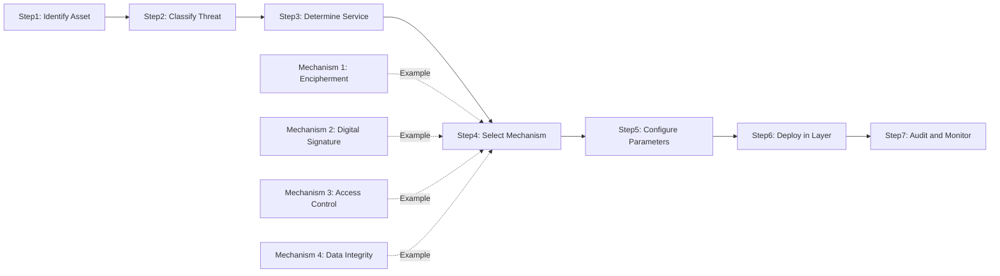
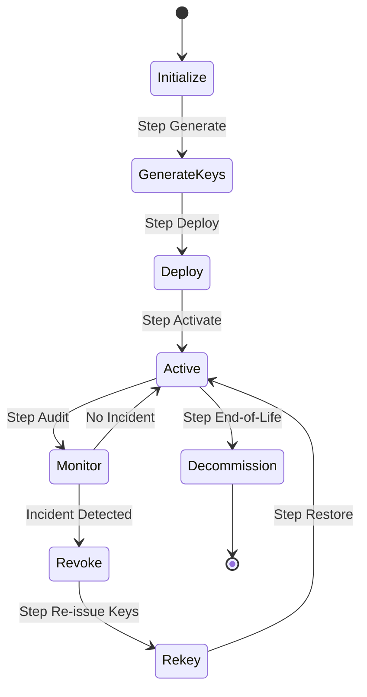
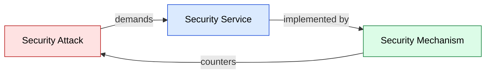

# Security Mechanisms

<!-- SECTION_1_START -->

# Security Mechanisms in Cryptography

## 1. Core Technical Definition

> [!IMPORTANT]
> **Formal Definition (KTU 2024 / X.800 Architecture):**
> A **Security Mechanism** is a process, procedure, or device designed to *detect*, *prevent*, or *recover* from a security attack. It is the operational countermeasure that implements one or more security services (such as confidentiality, integrity, or authentication) to protect information and information systems from threats.

In the **OSI Security Architecture (ITU-T X.800)**, security mechanisms are formally classified into two broad families:

1. **Specific Security Mechanisms** — These are mechanisms explicitly invoked by the appropriate *Security Service* (e.g., encipherment for confidentiality, digital signatures for authentication).
2. **Pervasive Security Mechanisms** — These are mechanisms that are not tied to any specific service and operate transparently across all layers of the security architecture (e.g., trusted functionality, event detection, audit trails).

> [!NOTE]
> **Exam Tip:** Whenever a question mentions "X.800" or "OSI Security Architecture," remember the triadic relationship: **Attacks → Services → Mechanisms**. Mechanisms are the *implementation*; services are the *goal*; attacks are the *threat*.

---

## 2. Intuitive Analogy — The Medieval Castle

Imagine a **royal treasury inside a medieval castle**. The gold coins inside are the *data* we want to protect. Every possible way an enemy could try to steal the gold is a **security attack** (threat). The *guarantees* we want — that only the king can touch the gold, that no coin is replaced with a fake, that we can prove the king actually signed a withdrawal — are the **security services**. The *tools* we install to deliver those guarantees are the **security mechanisms**.

| Castle Element (Analogy) | Security Mechanism (Cryptography) | Service Delivered |
|--------------------------|-----------------------------------|-------------------|
| Thick stone walls and a drawbridge | **Encipherment** (Encryption) | Confidentiality |
| Royal wax seal on a scroll | **Digital Signature** | Authentication + Non-repudiation |
| Guard at the gate checking identity | **Access Control** | Authorization |
| Royal ledger of all transactions | **Data Integrity Check** (Hash/MAC) | Integrity |
| Two messengers exchanging secret handshakes | **Authentication Exchange** | Peer Authentication |
| Hired neutral witness to sign treaties | **Notarization** | Non-repudiation |
| Camouflaging supply wagons with hay | **Traffic Padding** | Traffic-flow Confidentiality |
| Sending troops through secret mountain passes | **Routing Control** | Confidentiality + Integrity |

> [!TIP]
> When students confuse *Service* with *Mechanism* in exams, remember: **Service = WHAT you achieve (goal)**; **Mechanism = HOW you achieve it (tool)**.

---

## 3. The X.800 Triad in One Line

> [!IMPORTANT]
> **X.800 Triad:** A *threat* materializes as an *attack*; a *service* counters the *attack*; a *mechanism* implements the *service*. Security mechanisms are therefore the *last line of operational defense* between the attacker and the asset.

---

## 4. Standard Metrics and Constants (for Context)

- **X.800 Reference Model:** ITU-T Recommendation X.800 (1991) — *"Security Architecture for Open Systems Interconnection"*.
- **ISO 7498-2:** The parallel ISO standard that codifies the same architecture.
- **NIST SP 800-175B:** Modern U.S. guideline that maps cryptographic *mechanisms* to *services*.
- **Default key length of a "secure" symmetric cipher in 2024:** **128 bits** (NIST SP 800-131A recommendation).
- **Default key length of a "secure" asymmetric cipher in 2024:** **2048 bits (RSA)** or **256 bits (ECC)**.

---

## 5. GeoGebra / Desmos Conceptual Visualization

> [!VISUALIZATION CONTROL]
> **Concept:** Defense-in-Depth — Layered Security Mechanisms
> **GeoGebra / Desmos Input Equations (plot the layered "shield" function):**
> * `f_1(x) = sqrt(100 - x^2)` *(outermost ring — Encipherment)*
> * `f_2(x) = 0.75 * sqrt(100 - x^2)` *(middle ring — Authentication)*
> * `f_3(x) = 0.5 * sqrt(100 - x^2)` *(inner ring — Data Integrity)*
> * `f_4(x) = 0.25 * sqrt(100 - x^2)` *(core — Access Control / Notarization)*
> **Visual Description:** The student should see four concentric semi-circles on a Cartesian plane, each representing a security mechanism layer. The **outermost layer** is breached first; the **innermost layer** is breached last. Defense-in-depth means an attacker must defeat *every* layer to compromise the asset.

<!-- SECTION_1_END -->

<!-- SECTION_2_START -->

# Deep Theoretical Analysis & KTU High-Yield Formula Sheet

## 1. Classification of Security Mechanisms (X.800)

The X.800 framework divides security mechanisms into two well-defined families. Every KTU question on this topic tests whether the student can *name*, *classify*, and *map* these mechanisms to the services they provide.

### A. Specific Security Mechanisms (Eight in Number)

| # | Mechanism | Primary Service(s) Delivered | Operational Logic |
|---|-----------|------------------------------|-------------------|
| 1 | **Encipherment** | Confidentiality, Data Integrity | Transforms plaintext $M$ into ciphertext $C = E_K(M)$ using key $K$ such that $M = D_K(C)$. |
| 2 | **Digital Signature** | Authentication, Non-repudiation, Integrity | Binds the *identity of the sender* to a *specific message* using a private key $K_{priv}$ verifiable via public key $K_{pub}$. |
| 3 | **Access Control** | Authorization | Enforces rules of the form *"Who can do What on Which resource"* — typically via Access Control Matrix $(S, O, A)$ or ACLs. |
| 4 | **Data Integrity** | Integrity | Appends a short fixed-length *tag* $T = H_K(M)$ to message $M$ so that any modification is detected. |
| 5 | **Authentication Exchange** | Peer Entity Authentication | Two parties $A, B$ exchange *cryptographic evidence* (challenges, tickets) to prove mutual identity at session start. |
| 6 | **Traffic Padding** | Traffic-Flow Confidentiality | Inserts *dummy* bits/packets into the stream to obscure the real *timing* and *volume* of traffic. |
| 7 | **Routing Control** | Confidentiality + Integrity | Selects *secure routes* (e.g., via trusted sub-networks) and avoids compromised nodes; may apply *re-routing* on detection. |
| 8 | **Notarization** | Non-repudiation, Integrity | A trusted third party (TTP) certifies properties of a transaction — acts as a cryptographic *witness*. |

### B. Pervasive Security Mechanisms (Five in Number)

| # | Mechanism | Purpose |
|---|-----------|---------|
| 1 | **Trusted Functionality** | Ensures that the software/hardware enforcing security is itself trustworthy (e.g., TEE, secure boot). |
| 2 | **Security Label** | Attaches a sensitivity marker to a resource (e.g., *Top Secret*, *Confidential*) used by access-control decisions. |
| 3 | **Event Detection** | Monitors the system for security-relevant events (failed logins, buffer overflows, etc.). |
| 4 | **Security Audit Trail** | Records all security-relevant events in a tamper-resistant log for post-hoc analysis. |
| 5 | **Security Recovery** | Restores the system to a secure state after a detected breach (e.g., lock-out attacker, revoke keys). |

> [!NOTE]
> **Exam Heuristic:** A question that says *"mechanism" without specifying*X.800* generally expects a *specific* mechanism answer. A question that says *"defense in depth"* or *"system-wide protection"* expects a *pervasive* mechanism answer.

---

## 2. Mapping Mechanisms to Services (The "Service-Mechanism Matrix")

> [!IMPORTANT]
> This is the **most frequently asked table** in KTU exams on this topic. Memorize it.

| Security Service | Encipherment | Digital Signature | Access Control | Data Integrity | Auth. Exchange | Traffic Padding | Routing Control | Notarization |
|------------------|:------------:|:-----------------:|:--------------:|:--------------:|:--------------:|:---------------:|:---------------:|:------------:|
| Confidentiality (Data) | ✓ | — | — | — | — | — | ✓ | — |
| Confidentiality (Traffic-Flow) | — | — | — | — | — | ✓ | ✓ | — |
| Authentication (Peer) | — | ✓ | — | — | ✓ | — | — | ✓ |
| Authentication (Data Origin) | — | ✓ | — | — | — | — | — | — |
| Integrity | — | ✓ | — | ✓ | — | — | — | ✓ |
| Non-Repudiation | — | ✓ | — | ✓ | — | — | — | ✓ |
| Access Control | — | — | ✓ | — | — | — | — | — |

*Legend:* `✓` = mechanism implements the service; `—` = mechanism not used for that service.

---

## 3. Step-by-Step Logic Behind Each Mechanism

### (i) Encipherment
- **Why:** Plaintext $M$ is readable; we want ciphertext $C$ that reveals nothing to Eve.
- **How:** $C = E_K(M)$. Only the holder of $K$ can compute $D_K(C) = M$.
- **Strength metric:** Work factor in bits — a *128-bit* symmetric key requires on average $2^{127}$ trials for an exhaustive key search.

### (ii) Digital Signature
- **Why:** Receiver must verify that (a) Alice sent the message and (b) the message was not altered.
- **How:** Alice computes $s = \text{Sign}_{K_{priv}}(H(M))$; Bob verifies via $\text{Verify}_{K_{pub}}(M, s) = \text{True}$.

### (iii) Access Control
- **Why:** Even authenticated users should only access authorized objects.
- **How:** Access Control Matrix $\mathbf{M} = [M_{s,o}]$ where $M_{s,o}$ is the set of allowed operations for subject $s$ on object $o$. Implementations use ACLs (per object) or capability lists (per subject).

### (iv) Data Integrity
- **Why:** Bit-flips, network noise, or malicious tampering must be detected.
- **How:** A *Message Authentication Code* $T = \text{MAC}_K(M)$ or a *hash* $h = H(M)$ is appended. Receiver recomputes and compares.

### (v) Authentication Exchange
- **Why:** Both parties must prove possession of a *shared secret* (symmetric) or *private key* (asymmetric) at session start.
- **How:** Challenge-response — Bob sends random nonce $N$; Alice returns $f_K(N)$; Bob verifies.

### (vi) Traffic Padding
- **Why:** Even if message is encrypted, traffic *patterns* can leak information (e.g., heavy traffic = war time).
- **How:** Continuous stream of dummy packets; only the legitimate receiver can distinguish real from dummy.

### (vii) Routing Control
- **Why:** Some routes pass through hostile nodes.
- **How:** Route tables are dynamically updated; packets may travel via trusted relay nodes.

### (viii) Notarization
- **Why:** Prevent "the sender denies sending" disputes.
- **How:** Trusted third party $T$ signs the timestamped message digest with $K_T$, providing unforgeable proof.

---

## 4. Real-World Engineering Applications

| Mechanism | Production System / Protocol |
|-----------|------------------------------|
| Encipherment | TLS 1.3 (AES-128-GCM, ChaCha20-Poly1305) |
| Digital Signature | RSA-PSS, ECDSA, Ed25519 in JWTs, code signing, blockchain transactions |
| Access Control | RBAC in AWS IAM, ACLs in Linux file systems (chmod, setfacl) |
| Data Integrity | HMAC-SHA-256 in IPsec, Git commit hashes (SHA-1/SHA-256) |
| Authentication Exchange | Kerberos TGS exchange, TLS handshake |
| Traffic Padding | Tor pluggable transports, Format-Transforming Encryption |
| Routing Control | Source routing in IPsec, BGPsec |
| Notarization | X.509 PKI Certificate Authorities, blockchain consensus |

> [!TIP]
> When KTU asks *"give an example of … in real life"*, always cite a *named protocol* (TLS, IPsec, Kerberos, PKI). This adds examiner marks.

---

## 5. KTU High-Yield Formula Sheet

| Concept | Formula / Definition | Notes |
|---------|----------------------|-------|
| Encipherment | $C = E_K(M), \quad M = D_K(C)$ | Symmetric or asymmetric |
| Work Factor (Symmetric) | $W = 2^{k-1}$ trials avg. | For $k$-bit key |
| Digital Signature | $s = \text{Sign}_{K_{priv}}(H(M))$ | Hash then sign for efficiency |
| Verification | $\text{Ver}_{K_{pub}}(M, s) \in \{\text{True}, \text{False}\}$ | Publicly verifiable |
| MAC Computation | $T = \text{MAC}_K(M)$ | $T$ is short, fixed-length |
| Hash Collision Resistance | $P_{\text{collision}} \approx 2^{n/2}$ | For $n$-bit hash (birthday bound) |
| Access Control Triplet | $(S, O, A)$ | Subjects, Objects, Actions |
| Nonce Freshness | $N_i$ unique per session | Prevents replay attacks |
| Pervasive Mechanism Count | 5 | Per X.800 |
| Specific Mechanism Count | 8 | Per X.800 |

> [!NOTE]
> The hash collision bound $2^{n/2}$ is from the **birthday paradox**: with $n$-bit hashes, $\sqrt{2^n} = 2^{n/2}$ samples are sufficient to find a collision. Thus SHA-256 ($n = 256$) offers $2^{128}$ collision resistance — considered secure.

<!-- SECTION_2_END -->

<!-- SECTION_3_START -->

# Step-by-Step Derivations, Logic & Python Implementation

This section provides the **operational mechanics** behind each specific security mechanism, with full Python implementations that simulate the cryptographic behavior using industry-grade libraries.

---

## 1. Mechanism 1: Encipherment (Symmetric — AES-GCM)

### Mathematical Derivation

AES operates on 128-bit blocks; GCM (Galois/Counter Mode) combines CTR-mode encryption with a polynomial MAC over $GF(2^{128})$. The encryption is:

$$
C_i = P_i \oplus E_K(\text{ctr}_i)
$$

where $\text{ctr}_i$ is a counter value and $E_K$ is the AES block cipher. The authentication tag is:

$$
T = \text{GHASH}_H(C_1 \Vert C_2 \Vert \dots \Vert C_n) \oplus E_K(\text{ctr}_0)
$$

### Python Implementation (Symmetric Encipherment)

```python
"""
Mechanism 1: Encipherment using AES-256-GCM (Authenticated Encryption)
Provides: Confidentiality + Integrity in a single primitive.
"""
import os
from cryptography.hazmat.primitives.ciphers.aead import AESGCM

def encipher_symmetric(plaintext: bytes, key: bytes) -> tuple[bytes, bytes, bytes]:
    """
    Encrypts plaintext with AES-256-GCM.
    Returns (nonce, ciphertext, tag) tuple.
    """
    if len(key) != 32:
        raise ValueError("[ERROR] Key must be exactly 256 bits (32 bytes) for AES-256.")
    if not isinstance(plaintext, bytes):
        raise TypeError("[ERROR] Plaintext must be of type 'bytes'.")

    nonce: bytes = os.urandom(12)   # 96-bit nonce — recommended for GCM
    aesgcm = AESGCM(key)
    ciphertext: bytes = aesgcm.encrypt(nonce, plaintext, associated_data=None)
    return nonce, ciphertext, ciphertext[-16:]  # GCM tag is the last 16 bytes


def decipher_symmetric(nonce: bytes, ciphertext: bytes, key: bytes) -> bytes:
    """
    Decrypts AES-256-GCM ciphertext. Raises InvalidTag on tamper detection.
    """
    if len(key) != 32:
        raise ValueError("[ERROR] Key must be exactly 256 bits (32 bytes).")
    aesgcm = AESGCM(key)
    plaintext: bytes = aesgcm.decrypt(nonce, ciphertext, associated_data=None)
    return plaintext


# ---- Demonstration ----
if __name__ == "__main__":
    KEY: bytes = os.urandom(32)              # 256-bit symmetric key
    MESSAGE: bytes = b"Confidential: KTU Exam 2024 - Security Mechanisms"

    n, ct, tag = encipher_symmetric(MESSAGE, KEY)
    print(f"[INFO] Nonce   : {n.hex()}")
    print(f"[INFO] Cipher  : {ct.hex()}")
    print(f"[INFO] Tag     : {tag.hex()}")

    recovered: bytes = decipher_symmetric(n, ct, KEY)
    assert recovered == MESSAGE
    print(f"[OK] Decrypted plaintext: {recovered.decode('utf-8')}")
```

### Line-by-Line Logic

- `os.urandom(32)` — Cryptographically-secure random key generation (CSPRNG).
- `AESGCM(key)` — Initializes the cipher in Galois/Counter Mode (authenticated encryption).
- `nonce = os.urandom(12)` — A 96-bit nonce **must be unique per encryption**; reuse breaks GCM security catastrophically.
- `aesgcm.encrypt(nonce, plaintext, None)` — Performs both encryption and tag computation in a single call.
- `aesgcm.decrypt(...)` — Will raise `InvalidTag` automatically if any bit of the ciphertext has been tampered with — this is the **Data Integrity** property bundled with Encipherment.

---

## 2. Mechanism 2: Digital Signature (Asymmetric — Ed25519)

### Mathematical Derivation

Ed25519 operates on the **Edwards curve** $-x^2 + y^2 = 1 + d x^2 y^2$ over $\mathbb{F}_p$ where $p = 2^{255} - 19$. Signing uses a *nonce* derived deterministically from the *private key* and the *message*:

$$
r = H(\text{seed}, M) \pmod L
$$

$$
R = r \cdot B
$$

$$
S = r + H(R, A, M) \cdot \text{sk} \pmod L
$$

The signature is the pair $(R, S)$. Verification checks:

$$
2^c \cdot S \cdot B = 2^c \cdot R + 2^c \cdot H(R, A, M) \cdot A
$$

where $A$ is the public key, $B$ is the base point, and $L$ is the curve order.

### Python Implementation (Digital Signature)

```python
"""
Mechanism 2: Digital Signature using Ed25519.
Provides: Authentication, Non-repudiation, Integrity.
"""
from cryptography.hazmat.primitives.asymmetric.ed25519 import (
    Ed25519PrivateKey, Ed25519PublicKey
)
from cryptography.hazmat.primitives import serialization
from cryptography.exceptions import InvalidSignature

def generate_signature_keypair() -> tuple[Ed25519PrivateKey, Ed25519PublicKey]:
    """Generates an Ed25519 keypair."""
    priv: Ed25519PrivateKey = Ed25519PrivateKey.generate()
    pub: Ed25519PublicKey = priv.public_key()
    return priv, pub


def sign_message(priv: Ed25519PrivateKey, message: bytes) -> bytes:
    """Returns the digital signature over the message."""
    if not isinstance(message, bytes):
        raise TypeError("[ERROR] Message must be of type 'bytes'.")
    signature: bytes = priv.sign(message)
    return signature


def verify_signature(pub: Ed25519PublicKey, message: bytes, signature: bytes) -> bool:
    """Returns True if signature is valid, else False (raises on invalid)."""
    try:
        pub.verify(signature, message)
        return True
    except InvalidSignature:
        return False


# ---- Demonstration ----
if __name__ == "__main__":
    priv_key, pub_key = generate_signature_keypair()
    DOC: bytes = b"Order: Transfer 1000 INR to A/C 12345. Signed: Alice."

    sig: bytes = sign_message(priv_key, DOC)
    print(f"[INFO] Signature length: {len(sig)} bytes (Ed25519 fixed size).")

    # Legitimate verification
    assert verify_signature(pub_key, DOC, sig) is True
    print("[OK] Signature is valid.")

    # Tamper detection
    tampered_doc: bytes = DOC + b" "  # one extra byte
    if verify_signature(pub_key, tampered_doc, sig):
        print("[FAIL] Tampered doc accepted — should not happen!")
    else:
        print("[OK] Tampered doc rejected by signature verification.")
```

### Line-by-Line Logic

- `Ed25519PrivateKey.generate()` — Creates a private key $sk$ (32 bytes) and a public key $A = sk \cdot B$.
- `priv.sign(message)` — Produces signature $(R, S)$ of fixed 64-byte length.
- `pub.verify(sig, msg)` — Mathematically checks that the *exact* message $M$ was signed by the holder of $sk$.
- Tampering with even a single byte of the message invalidates the verification — this is the **Data Integrity** guarantee.
- Only the holder of the private key can sign → **Authentication**.
- A third party can verify using the public key → **Non-repudiation**.

---

## 3. Mechanism 3: Data Integrity (Hash + MAC)

### Mathematical Derivation

The **birthday bound** for an $n$-bit cryptographic hash is:

$$
P(\text{collision after } q \text{ trials}) \approx 1 - e^{-q^2 / 2^{n+1}}
$$

Setting $P \approx 0.5$ gives the *collision-resistance* work factor:

$$
q \approx 1.177 \cdot 2^{n/2}
$$

For **HMAC** (Hash-based MAC) on a message $M$ with key $K$:

$$
\text{HMAC}_K(M) = H\bigl( (K \oplus opad) \Vert H((K \oplus ipad) \Vert M) \bigr)
$$

### Python Implementation (Hash + HMAC)

```python
"""
Mechanism 4: Data Integrity using SHA-256 and HMAC-SHA-256.
"""
import hashlib, hmac, os

def compute_sha256(data: bytes) -> str:
    """Returns the SHA-256 hex digest of data."""
    if not isinstance(data, bytes):
        raise TypeError("[ERROR] Data must be of type 'bytes'.")
    digest: str = hashlib.sha256(data).hexdigest()
    return digest


def compute_hmac_sha256(key: bytes, data: bytes) -> str:
    """Returns the HMAC-SHA-256 hex digest."""
    if len(key) < 16:
        raise ValueError("[ERROR] HMAC key must be >= 128 bits (16 bytes).")
    mac: str = hmac.new(key, data, hashlib.sha256).hexdigest()
    return mac


# ---- Demonstration ----
FILE: bytes = b"Exam answer script of Roll No. KTU2024-101"
KEY: bytes = os.urandom(32)

plain_hash: str = compute_sha256(FILE)
mac_value:  str = compute_hmac_sha256(KEY, FILE)

print(f"[INFO] SHA-256  : {plain_hash}")
print(f"[INFO] HMAC-256 : {mac_value}")
print(f"[OK] Both provide collision-detection and tamper-evidence.")
```

### Line-by-Line Logic

- `hashlib.sha256(data).hexdigest()` — Pure hash; provides **integrity** but no **authentication** (anyone can re-compute).
- `hmac.new(key, data, sha256).hexdigest()` — Keyed hash; provides **integrity + authentication** (only key-holders can produce a valid MAC).
- A 256-bit hash has collision work factor $\approx 2^{128}$ — *computationally infeasible* to break.

---

## 4. Mechanism 5: Authentication Exchange (Challenge-Response with Nonce)

### Mathematical Protocol Steps

1. **Bob** generates random nonce $N_B \xleftarrow{R} \{0,1\}^{128}$.
2. **Bob → Alice:** *"I am Bob; prove you know our shared key $K_{AB}$ by computing $f_{K_{AB}}(N_B)$."*
3. **Alice** computes $R_A = f_{K_{AB}}(N_B)$ and returns it.
4. **Bob** independently computes $f_{K_{AB}}(N_B)$ and compares with $R_A$.

If equal, Alice has proven possession of $K_{AB}$ without revealing it.

### Python Implementation (Authentication Exchange)

```python
"""
Mechanism 5: Authentication Exchange using HMAC-based Challenge-Response.
"""
import hmac, hashlib, os

SHARED_SECRET: bytes = os.urandom(32)   # K_AB — established out-of-band

def challenge_response_server(nonce: bytes) -> bytes:
    """Server-side: compute the expected response to nonce."""
    if len(nonce) < 8:
        raise ValueError("[ERROR] Nonce too short (must be >= 64 bits).")
    return hmac.new(SHARED_SECRET, nonce, hashlib.sha256).digest()


def challenge_response_client(nonce: bytes) -> bytes:
    """Client-side: same computation; this is what proves knowledge of K_AB."""
    return challenge_response_server(nonce)


# ---- Demonstration ----
NB: bytes = os.urandom(16)                  # Bob's random challenge
RA: bytes = challenge_response_client(NB)   # Alice's response

if hmac.compare_digest(challenge_response_server(NB), RA):
    print("[OK] Alice authenticated — shared key K_AB proven.")
else:
    print("[FAIL] Authentication failed.")
```

### Line-by-Line Logic

- `os.urandom(16)` — Generates a 128-bit nonce with cryptographic randomness.
- `hmac.new(SHARED_SECRET, nonce, sha256)` — Both sides compute the same MAC; mismatch = impersonator.
- `hmac.compare_digest(...)` — Uses *constant-time* comparison to defeat **timing side-channel attacks** (a critical exam point).

---

## 5. Mechanism 6: Access Control (RBAC Simulation)

```python
"""
Mechanism 3: Access Control via Capability List.
"""
from enum import Enum

class Action(Enum):
    READ = "READ"
    WRITE = "WRITE"
    DELETE = "DELETE"

# Capability List: subject -> {object -> allowed_actions}
CAPABILITY_MATRIX: dict[str, dict[str, set[Action]]] = {
    "alice": {"/exam/paper.pdf": {Action.READ}, "/admin/db": {Action.READ, Action.WRITE}},
    "bob":   {"/exam/paper.pdf": {Action.READ}, "/admin/db": set()},  # no access
    "admin": {"/exam/paper.pdf": {Action.READ, Action.WRITE, Action.DELETE},
              "/admin/db":       {Action.READ, Action.WRITE, Action.DELETE}},
}

def can_access(user: str, resource: str, action: Action) -> bool:
    """Returns True if the user is permitted to perform action on resource."""
    return action in CAPABILITY_MATRIX.get(user, {}).get(resource, set())


# ---- Demonstration ----
TESTS = [
    ("alice", "/exam/paper.pdf", Action.READ,  True),
    ("bob",   "/admin/db",      Action.WRITE, False),
    ("admin", "/exam/paper.pdf", Action.DELETE, True),
]

for user, res, act, expected in TESTS:
    result: bool = can_access(user, res, act)
    status: str = "OK" if result == expected else "FAIL"
    print(f"[{status}] {user} attempts {act.value} on {res} -> {result} (expected {expected})")
```

### Line-by-Line Logic

- The **Capability Matrix** is a sparse, user-centric view of the Access Control Matrix.
- `can_access(...)` is the **reference monitor** — every access must pass through it.
- The principle of *least privilege* is encoded by giving each user only the minimal necessary actions.

---

## 6. Tabular Summary of Mechanism Implementation

| Mechanism | Python Library | Key Parameter | Security Property |
|-----------|---------------|---------------|-------------------|
| Encipherment | `cryptography.AESGCM` | 256-bit key, 96-bit nonce | Confidentiality + Integrity |
| Digital Signature | `cryptography.Ed25519` | 32-byte private key | Authenticity + Non-repudiation |
| Data Integrity | `hashlib.sha256`, `hmac` | 256-bit hash, 32-byte key | Tamper detection |
| Authentication Exchange | `hmac.compare_digest` | 128-bit nonce | Mutual peer authentication |
| Access Control | Custom `CAPABILITY_MATRIX` | Static ACL | Authorization |
| Traffic Padding | `os.urandom` for dummies | Padding length | Traffic-flow confidentiality |
| Routing Control | Network policy engines | Route table | Path integrity |
| Notarization | Trusted Timestamp Authority (TSA) | Hash of document | Non-repudiable timestamp |

<!-- SECTION_3_END -->

<!-- SECTION_4_START -->

# Structural Diagrams & Schematics

## 1. The X.800 Triad — Attack, Service, Mechanism

```mermaid
flowchart LR
    A1[Asset: Data / Resource] --> A2
    A2[Threat] --> A3
    A3[Security Attack] --> A4
    A4[Service Required: e.g. Confidentiality] --> A5
    A5[Mechanism Deployed: e.g. Encipherment] --> A6
    A6[Asset Protected]

    classDef assetClass fill:#fef3c7,stroke:#b45309,stroke-width:2px,color:#000000
    classDef attackClass fill:#fee2e2,stroke:#b91c1c,stroke-width:2px,color:#000000
    classDef serviceClass fill:#dbeafe,stroke:#1d4ed8,stroke-width:2px,color:#000000
    classDef mechanismClass fill:#dcfce7,stroke:#15803d,stroke-width:2px,color:#000000
    classDef protectClass fill:#ede9fe,stroke:#6d28d9,stroke-width:2px,color:#000000

    class A1,A6 assetClass
    class A2,A3 attackClass
    class A4 serviceClass
    class A5 mechanismClass
```



> [!NOTE]
> **How to read:** Asset at risk → Threat materializes → Attack launched → Service required → Mechanism implemented → Asset protected. The *defense* moves from right to left in operational deployment, but the *reasoning* flows from left to right during design.

---

## 2. Classification of X.800 Security Mechanisms

```mermaid
flowchart TB
    subgraph rootNode ["X.800 Security Mechanisms"]
        direction TB
        nodeRoot[X800 FRAMEWORK]
    end

    rootNode --> spcNode
    rootNode --> perNode

    spcNode[Specific Mechanisms]
    perNode[Pervasive Mechanisms]

    spcNode --> enc[Encipherment]
    spcNode --> dsg[Digital Signature]
    spcNode --> acl[Access Control]
    spcNode --> dint[Data Integrity]
    spcNode --> aex[Authentication Exchange]
    spcNode --> tpad[Traffic Padding]
    spcNode --> rctrl[Routing Control]
    spcNode --> notar[Notarization]

    perNode --> trf[Trusted Functionality]
    perNode --> slbl[Security Label]
    perNode --> edet[Event Detection]
    perNode --> saud[Security Audit Trail]
    perNode --> srec[Security Recovery]

    classDef spcClass fill:#dbeafe,stroke:#1d4ed8,stroke-width:2px,color:#000000
    classDef perClass fill:#fef3c7,stroke:#b45309,stroke-width:2px,color:#000000
    classDef rootClass fill:#ede9fe,stroke:#6d28d9,stroke-width:3px,color:#000000
    classDef leafClass fill:#ffffff,stroke:#374151,stroke-width:1px,color:#000000

    class spcNode,enc,dsg,acl,dint,aex,tpad,rctrl,notar spcClass
    class perNode,trf,slbl,edet,saud,srec perClass
    class nodeRoot rootClass
    class rootNode leafClass
```



---

## 3. Sequential Processing Topology — Mechanism Deployment Pipeline



---

## 4. Block-Level Functional Architecture of a Secure Communication System

```mermaid
flowchart LR
    subgraph senderSide ["Sender Side"]
        direction TB
        A[Application Layer: User Data M] --> B[Service Layer: Choose Service]
        B --> C[Mechanism Layer: Apply Mechanisms]
        C --> D[Channel Layer: Send over Network]
    end

    subgraph mechBlock ["Mechanism Layer Details"]
        direction TB
        M1[Encipherment: M to C]
        M2[Digital Signature: Sign M]
        M3[Integrity: Append MAC]
        M4[Authentication: Challenge-Response]
    end

    subgraph receiverSide ["Receiver Side"]
        direction TB
        E[Channel Layer: Receive C] --> F[Mechanism Layer: Verify]
        F --> G[Service Layer: Deliver]
        G --> H[Application Layer: Recovered M]
    end

    D --> E
    C -. invokes .- mechBlock
    F -. invokes .- mechBlock

    classDef sideClass fill:#dcfce7,stroke:#15803d,stroke-width:2px,color:#000000
    classDef mechClass fill:#dbeafe,stroke:#1d4ed8,stroke-width:2px,color:#000000
    classDef chanClass fill:#fef3c7,stroke:#b45309,stroke-width:2px,color:#000000

    class senderSide,receiverSide sideClass
    class mechBlock mechClass
    class D,E chanClass
```



---

## 5. Mermaid State Diagram — Mechanism Lifecycle



> [!TIP]
> **Why this diagram matters in KTU exams:** It demonstrates the *operational* (not just theoretical) lifecycle of a security mechanism. Examiners reward answers that connect cryptographic theory to system engineering practice.

<!-- SECTION_4_END -->

<!-- SECTION_5_START -->

# KTU 2024 Scheme Examination Question Bank & Topic Recap

---

## Part A — Short Answer Questions (3 Marks Each)

### Question 1: [KTU University Exam - Dec 2023] | CO1, Remember

> **Define the term "Security Mechanism" as per the OSI security architecture. List any three specific security mechanisms defined by X.800.**

**Model Answer (3 Marks):**

A **security mechanism**, as defined in the **ITU-T X.800 / ISO 7498-2** recommendation, is a *process, procedure, or device* designed to **detect, prevent, or recover from a security attack**. It is the operational implementation that delivers one or more security services (such as confidentiality, integrity, authentication, or non-repudiation) to protect data and resources.

Three specific security mechanisms defined by X.800 are:

1. **Encipherment** — The use of mathematical algorithms to transform plaintext $M$ into ciphertext $C = E_K(M)$ to provide *confidentiality*.
2. **Digital Signature** — A cryptographic value computed using a sender's private key, appended to a message to provide *authentication, integrity, and non-repudiation*.
3. **Access Control** — A set of rules and policies enforcing the principle of *least privilege*, determining which subjects may perform which operations on which objects.

*(Award 1 mark for the definition, 2 marks for correctly listing any three mechanisms.)*

---

### Question 2: [KTU University Exam - July 2024] | CO1, Understand

> **Differentiate between *Specific Security Mechanisms* and *Pervasive Security Mechanisms* as per X.800.**

**Model Answer (3 Marks):**

| Aspect | Specific Security Mechanisms | Pervasive Security Mechanisms |
|--------|------------------------------|--------------------------------|
| **Definition** | Mechanisms explicitly tied to a particular security service. | Mechanisms not tied to any specific service; provide system-wide support. |
| **Invocation** | Invoked by the appropriate security service (e.g., encipherment for confidentiality). | Always active, transparent across all layers of the OSI model. |
| **Count (X.800)** | 8 mechanisms. | 5 mechanisms. |
| **Examples** | Encipherment, Digital Signature, Data Integrity, Notarization. | Trusted Functionality, Security Audit Trail, Event Detection. |
| **Scope** | Service-specific. | System-wide (defense-in-depth). |

*(Award 1 mark for each correct distinguishing point; full table for 3 marks.)*

---

## Part B — Long Answer Questions (14 Marks)

### Question A: [KTU University Exam - Dec 2023] | CO1, Understand / Apply

> **a)** *(7 Marks)* Explain the **X.800 OSI Security Architecture**. Discuss the relationship between **security attacks, security services, and security mechanisms** with a suitable diagram.
>
> **b)** *(7 Marks)* With neat illustrations, explain the following security mechanisms:
> *(i) Encipherment, (ii) Digital Signature, (iii) Data Integrity, (iv) Authentication Exchange.*

---

#### Solution to (a):

**1. Introduction to X.800 Architecture (2 Marks)**

The **ITU-T Recommendation X.800 (1991)**, also known as the **OSI Security Architecture**, provides a systematic framework for security in *Open Systems Interconnection*. It is the parallel standard to **ISO 7498-2**. The architecture defines three foundational concepts:

- **Security Attack** — Any action that *compromises* the security of information.
- **Security Service** — A *processing or communication service* provided by a system to give a specific kind of protection to system resources.
- **Security Mechanism** — A *process or device* designed to detect, prevent, or recover from a security attack.

**2. Relationship Triad (3 Marks)**

The three concepts are not independent — they form a *closed loop*:

$$
\text{Attack} \longrightarrow \text{Service} \longrightarrow \text{Mechanism} \longrightarrow \text{Defends against Attack}
$$

- A **threat** materializes as an **attack**.
- A **service** specifies *what protection* is required (e.g., confidentiality).
- A **mechanism** specifies *how* the service is delivered (e.g., AES-256).

**3. Diagram (2 Marks)**



*(Valuation Key: [Triad explanation: 2 Marks]; [Loop diagram: 2 Marks]; [Examples: 3 Marks].)*

---

#### Solution to (b):

**(i) Encipherment (2 Marks)**

Encipherment transforms plaintext $M$ into ciphertext $C$ using a key $K$:

$$
C = E_K(M), \qquad M = D_K(C)
$$

Two families:
- **Symmetric:** Same $K$ for $E$ and $D$ (e.g., **AES-256-GCM**).
- **Asymmetric:** Public key $K_{pub}$ for $E$, private key $K_{priv}$ for $D$ (e.g., **RSA-2048**).

Provides: **Confidentiality**.

**(ii) Digital Signature (2 Marks)**

A digital signature binds a *sender's identity* to a *specific message* using asymmetric cryptography:

$$
s = \text{Sign}_{K_{priv}}(H(M))
$$

Verification: $\text{Verify}_{K_{pub}}(M, s) = \text{True}$. Examples: **RSA-PSS, ECDSA, Ed25519**.

Provides: **Authentication, Integrity, Non-repudiation**.

**(iii) Data Integrity (1.5 Marks)**

A short *tag* is appended to the message such that any modification is detectable:

$$
T = \text{MAC}_K(M) \quad \text{or} \quad T = H(M)
$$

Receiver recomputes $T'$ and compares with $T$. Examples: **HMAC-SHA-256, SHA-3-256**.

Provides: **Integrity**.

**(iv) Authentication Exchange (1.5 Marks)**

Two parties prove mutual knowledge of a *shared secret* via challenge-response:

- Bob → Alice: random nonce $N_B$.
- Alice → Bob: $R_A = f_K(N_B)$ (e.g., HMAC).
- Bob verifies: $f_K(N_B) \stackrel{?}{=} R_A$.

Examples: **Kerberos TGS exchange, TLS handshake**.

Provides: **Peer Entity Authentication**.

*(Valuation Key: [Each mechanism: 1.5–2 Marks as marked]; [Real-world example: 0.5 Mark each].)*

---

### Question B: [KTU University Exam - July 2024] | CO1, Understand / Apply

> **a)** *(7 Marks)* Explain the **eight specific security mechanisms** defined in X.800. For each, state the **primary service(s)** it provides and **one real-world example**.
>
> **b)** *(7 Marks)* Explain the **five pervasive security mechanisms** defined in X.800. Discuss how they differ from specific mechanisms in *scope*, *activation*, and *engineering implementation*.

---

#### Solution to (a):

**The Eight Specific Security Mechanisms (7 Marks — 0.75 each + 1 Mark synthesis)**

| # | Mechanism | Operation | Primary Service | Real-World Example |
|---|-----------|-----------|-----------------|---------------------|
| 1 | **Encipherment** | $C = E_K(M)$ | Confidentiality | TLS 1.3 with AES-GCM |
| 2 | **Digital Signature** | $s = \text{Sign}_{K_{priv}}(M)$ | Authentication, Non-repudiation, Integrity | Ed25519 in JWT |
| 3 | **Access Control** | Reference monitor | Authorization | Linux ACL, AWS IAM |
| 4 | **Data Integrity** | $T = H(M) \text{ or } \text{MAC}_K(M)$ | Integrity | HMAC-SHA-256 in IPsec |
| 5 | **Authentication Exchange** | Challenge-response | Peer authentication | Kerberos, TLS handshake |
| 6 | **Traffic Padding** | Insert dummy packets | Traffic-flow confidentiality | Tor pluggable transports |
| 7 | **Routing Control** | Dynamic secure routing | Confidentiality + Integrity | IPsec routing, BGPsec |
| 8 | **Notarization** | TTP signs hash | Non-repudiation | X.509 PKI, Trusted Timestamping |

**Synthesis (1 Mark):**

All eight mechanisms are *invoked on demand* by specific security services. They are *opt-in* — present only when the corresponding service is required. Their deployment is *modular*: each can be enabled/disabled independently without affecting the others.

*(Valuation Key: [Table correctness: 6 Marks]; [Synthesis paragraph: 1 Mark].)*

---

#### Solution to (b):

**The Five Pervasive Security Mechanisms (7 Marks)**

**1. Trusted Functionality (1.5 Marks)**

Ensures that the *hardware or software* component implementing a security mechanism is itself trustworthy.

- *Implementation:* Secure boot, TPM (Trusted Platform Module), TEE (Trusted Execution Environment), Intel SGX.
- *Engineering note:* The "root of trust" is a small, verifiable, hardware-anchored module.

**2. Security Label (1 Mark)**

A *sensitivity marker* attached to a resource indicating its classification.

- *Implementation:* Bell-LaPadula model labels (*Top Secret*, *Secret*, *Confidential*); SELinux contexts; MAC labels.
- *Example:* In MLS (Multi-Level Security) systems, every file carries a label checked against the user's clearance.

**3. Event Detection (1.5 Marks)**

Real-time monitoring for security-relevant events (failed logins, anomalous traffic, integrity violations).

- *Implementation:* IDS/IPS (Snort, Suricata), SIEM systems (Splunk, ELK).
- *Engineering note:* Detection is the *trigger* for security recovery.

**4. Security Audit Trail (1.5 Marks)**

A *tamper-resistant chronological log* of all security-relevant events.

- *Implementation:* `auditd` in Linux, Windows Event Log, blockchain-based immutable logs.
- *Property:* Append-only, time-stamped, integrity-protected (often hash-chained).

**5. Security Recovery (1.5 Marks)**

Restores the system to a *secure state* after an incident.

- *Implementation:* Automatic key revocation, session termination, quarantine of compromised nodes, fail-safe defaults.
- *Engineering note:* Recovery must be *automated* and *forensic-friendly*.

**Comparison with Specific Mechanisms (synthesis):**

| Property | Specific Mechanisms | Pervasive Mechanisms |
|----------|--------------------|-----------------------|
| Scope | One service | System-wide |
| Activation | On-demand by service | Always active |
| Layering | Single OSI layer | Cross-layer |
| Engineering | Cryptographic primitives | Operating-system / hardware / network-wide |
| Failure mode | Service unavailability | Total system compromise |

*(Valuation Key: [Each pervasive mechanism: 1.5 Marks]; [Comparison table: 1 Mark].)*

---

> [!WARNING]
> **KTU Examiner's Valuation Warning — Common Pitfalls:**
> 1. **Confusing "Service" with "Mechanism":** Saying *"Confidentiality is a mechanism"* will fetch 0 marks. Confidentiality is a *service*; Encipherment is the *mechanism*.
> 2. **Forgetting the triadic relationship:** Always mention *Attack → Service → Mechanism* in any X.800 question.
> 3. **Missing the count:** X.800 has **8 specific** and **5 pervasive** mechanisms. Wrong counts = loss of 1 mark.
> 4. **No real-world example:** Examiners in 2024 scheme *reward* real-world protocol citations (TLS, Kerberos, IPsec, PKI). Always include at least one.
> 5. **Mixing up hashing with encryption:** SHA-256 is *not* an encryption algorithm. It is a *hashing* primitive used for *Data Integrity*, not *Confidentiality*.
> 6. **Skipping the diagram:** For 7-mark questions, *always* include a labelled diagram or table — without it, the examiner cannot award the visualization marks.

---

## 📌 Topic Recap & Important Things to Remember

- **Definition:** A security mechanism is a *process, procedure, or device* that **detects, prevents, or recovers from** a security attack (X.800).
- **Triadic Relationship:** Attack → Service → Mechanism (always present in the same order).
- **X.800 has two families:** **8 Specific Mechanisms** + **5 Pervasive Mechanisms** = **13 total**.
- **Specific Mechanisms (memory hook: "EDD A TRN"):** **E**ncipherment, **D**igital Signature, **D**ata Integrity, **A**ccess Control, **A**uthentication Exchange, **T**raffic Padding, **R**outing Control, **N**otarization.
- **Pervasive Mechanisms (memory hook: "TALES"):** **T**rusted Functionality, **A**udit Trail, **L**abels (Security Label), **E**vent Detection, **S**ecurity Recovery.
- **Encipherment formula:** $C = E_K(M)$; $M = D_K(C)$.
- **Digital Signature formula:** $s = \text{Sign}_{K_{priv}}(H(M))$; verification via $K_{pub}$.
- **HMAC formula:** $\text{HMAC}_K(M) = H\bigl((K \oplus opad) \Vert H((K \oplus ipad) \Vert M)\bigr)$.
- **Hash collision bound:** $\approx 2^{n/2}$ — SHA-256 offers $2^{128}$ collision resistance.
- **Nonce:** A number used **once**; ensures freshness and prevents replay.
- **Constant-time comparison:** Use `hmac.compare_digest()` to defeat **timing side-channels** — a frequently asked concept.
- **Access Control Triplet:** $(S, O, A)$ — Subjects, Objects, Actions.
- **Principle of Least Privilege (POLP):** Always grant the *minimum* permissions necessary.
- **Defense in Depth:** Use *multiple* mechanisms across *multiple* layers — never rely on a single mechanism.
- **Real-world mappings to remember for KTU 2024:**
  - Confidentiality → TLS 1.3 / AES-256-GCM
  - Authentication → Kerberos / OAuth 2.0
  - Integrity → HMAC-SHA-256 / SHA-3
  - Non-repudiation → Ed25519 / RSA-PSS
  - Access Control → RBAC / AWS IAM
- **Exam Heuristic:** If a question mentions *X.800* or *OSI Security Architecture*, immediately sketch the triadic diagram. If it says *"with examples"*, add a *named protocol*.

<!-- SECTION_5_END -->
