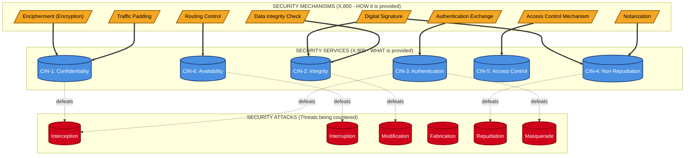
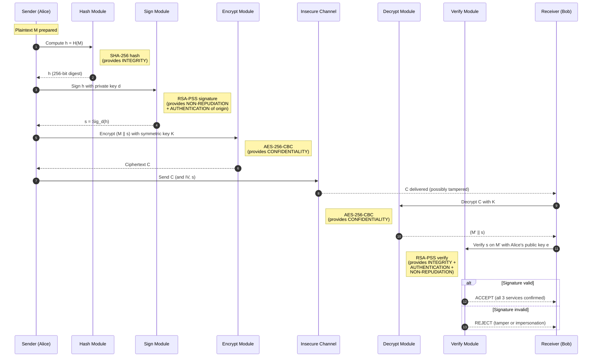
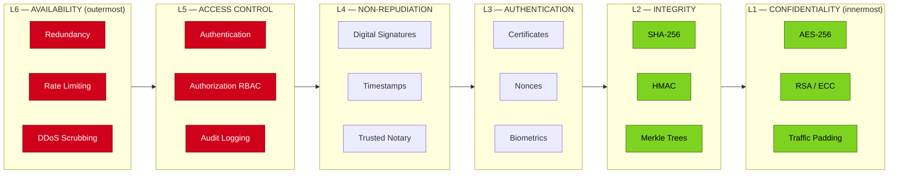
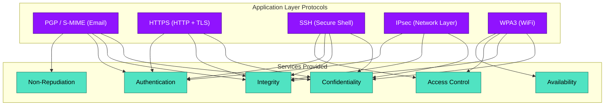

# Security Services

<!-- SECTION_1_START -->
# 🛡️ SECURITY SERVICES — Core Technical Definition & Intuitive Overview

## 📘 Formal Academic Definition (KTU 2024 Aligned)

According to the **ITU-T X.800 / ISO 7498-2** Security Architecture for Open Systems Interconnection (OSI), a **Security Service** is a processing or communication service provided by a system to give a specific kind of protection to system resources, where such resources are accessed via OSI protocols. In the KTU 2024 syllabus context (Module 2 — Security Attacks), a security service is a **countermeasure** or **defensive capability** that is designed to detect, prevent, or recover from a specific category of **security attack**.

The X.800 standard formally classifies security services into **five primary categories** (sometimes six, if **Availability** is counted as a separate service in modern textbooks such as Stallings). Each service is defined independently of the mechanism used to implement it, so that the same logical service can be realized using multiple cryptographic or procedural mechanisms.

> [!IMPORTANT]
> **KTU Board Definition to Memorize**
> *"A security service is a service that enhances the security of the data processing systems and the information transfers of an organization. The services are intended to counter security attacks, and they make use of one or more security mechanisms to achieve their goal."*
> — Adapted from **William Stallings, *Cryptography and Network Security* (8th Ed.)**, which is the KTU prescribed reference.

## 🧠 Conceptual Analogy — The Royal Postal Courier

Imagine you are the **King of Kerala (Travancore)** sending a confidential land deed to a far-off province in the year 1700.

| Real-World Need | Security Service Mapping | Courier Implementation |
|---|---|---|
| Letter must not be read by anyone | **Confidentiality** | Wax-sealed, then locked inside a wooden chest with a 12-digit combination |
| Letter must not be tampered with along the way | **Integrity** | Royal wax seal with a unique imprint — if the seal is broken, the receiver knows |
| Receiver must be sure the King really sent it | **Authentication** | King's personal signet ring imprint + a coded royal passphrase |
| King cannot later deny having sent the letter | **Non-Repudiation** | Letter is also signed by two ministers as witnesses (analogous to digital signatures) |
| Only the addressed noble can open it | **Access Control** | Chest key is given only to the named recipient's chief steward |
| Letter must reach on time, not be destroyed | **Availability** | Three couriers sent by separate routes, decoy chests in case of bandit attack |

Every **security attack** (interception, interruption, modification, fabrication) is a malicious attempt to break one or more of these guarantees. Security services are the engineered response.

> [!NOTE]
> **Syllabus Highlight (PECST637 — Module 2):**
> The KTU 2024 scheme expects students to be able to (a) **enumerate the five X.800 security services**, (b) **distinguish a service from a mechanism**, and (c) **map specific attacks to the specific services that defeat them**. This topic is a high-yield 8–10 mark area in Part A and frequently forms a sub-part of a 14-mark question.

## 🔐 The Five (Six) Security Services at a Glance

$$
\text{Security Services} = \Big\{ \underbrace{\text{Confidentiality}}_{\text{Secrecy}}, \; \underbrace{\text{Integrity}}_{\text{Tamper-detection}}, \; \underbrace{\text{Authentication}}_{\text{Identity proof}}, \; \underbrace{\text{Non-Repudiation}}_{\text{Irrefutable proof}}, \; \underbrace{\text{Access Control}}_{\text{Authorization}}, \; \underbrace{\text{Availability}}_{\text{Service continuity}} \Big\}
$$

> [!TIP]
> **Memory Mnemonic — "CIN-AAA"**: **C**onfidentiality, **I**ntegrity, **N**on-repudiation, **A**uthentication, **A**ccess control, **A**vailability. This single word is enough to recall all six services during a closed-book exam.

> [!VISUALIZATION CONTROL]
> **Concept:** Layered "Onion Defense" Model of Security Services
> **GeoGebra / Desmos Input Equations:**
> * Concentric circles: $r_1 = 1$ (Confidentiality), $r_2 = 2$ (Integrity), $r_3 = 3$ (Authentication), $r_4 = 4$ (Non-Repudiation), $r_5 = 5$ (Access Control), $r_6 = 6$ (Availability)
> * Plot origin: $(0,0)$ representing the "asset" being protected
> **Visual Description:** Six concentric circles around the origin. The innermost circle ($r=1$) is the asset. Each larger ring adds another layer of defense. A successful attack must penetrate ALL layers to compromise the asset.

<!-- SECTION_1_END -->

<!-- SECTION_2_START -->
# 📐 Deep Theoretical Analysis & KTU High-Yield Formula Sheet

## 🧩 1. Detailed Breakdown of Each Security Service

### 1.1 Data Confidentiality (Privacy)

**Definition:** The property that information is **not made available or disclosed to unauthorized individuals, entities, or processes**.

Confidentiality is the most intuitive of all services. It protects against the **interception** class of attacks. In the X.800 specification, it is sub-divided into four narrower forms:

$$
\text{Confidentiality} = \begin{cases} \text{Connection Confidentiality} & \text{: all user data on a connection is kept secret} \\ \text{Connectionless Confidentiality} & \text{: each single PDU is kept secret} \\ \text{Selective-Field Confidentiality} & \text{: only specific fields of a PDU are kept secret} \\ \text{Traffic-Flow Confidentiality} & \text{: the very fact that traffic is flowing is also hidden} \end{cases}
$$

**Cryptographic Mechanism:** Symmetric encryption (AES, 3DES), Asymmetric encryption (RSA, ECC). For traffic-flow confidentiality, **traffic padding** is used.

> [!NOTE]
> **Why four sub-types?**
> Connection confidentiality uses a single session key for the entire session (efficient for streams). Connectionless confidentiality uses a per-message key (efficient for datagrams). Selective-field confidentiality is used when most fields are public (e.g., routing headers in IP packets). Traffic-flow confidentiality is used in military networks where even the *timing* and *volume* of traffic leaks intelligence.

### 1.2 Data Integrity

**Definition:** The property that data has **not been modified or destroyed in an unauthorized manner**.

Integrity protects against the **modification** class of attacks. X.800 specifies five sub-forms:

$$
\text{Integrity} = \begin{cases} \text{Connection Integrity (with recovery)} & \text{: detects and recovers} \\ \text{Connection Integrity (without recovery)} & \text{: detects only, notifies the application} \\ \text{Selective-Field Connection Integrity} & \text{: only specific fields protected} \\ \text{Connectionless Integrity} & \text{: each datagram protected independently} \\ \text{Selective-Field Connectionless Integrity} & \text{: combination of the last two} \end{cases}
$$

**Cryptographic Mechanism:** Hash functions (SHA-256, SHA-3), Message Authentication Codes (HMAC), Digital signatures.

The mathematical relationship for integrity verification is:

$$
\text{Verify}(M, \text{MAC}) = \begin{cases} \text{TRUE} & \text{if } \text{HMAC}_K(M) = \text{MAC} \\ \text{FALSE} & \text{otherwise} \end{cases}
$$

where $M$ is the message, $K$ is the shared secret key, and HMAC is a keyed hash function.

### 1.3 Authentication

**Definition:** The service that provides **assurance that the communicating entity is the one that it claims to be**.

X.800 splits authentication into two distinct sub-services:

$$
\text{Authentication} = \begin{cases} \text{Peer-Entity Authentication} & \text{: confirms identity of the LIVE connection partner} \\ \text{Data-Origin Authentication} & \text{: confirms the SOURCE of a specific data unit} \end{cases}
$$

**Cryptographic Mechanism:** Digital certificates, Challenge-Response protocols, digital signatures, password hashes, biometrics.

For peer-entity authentication, the typical protocol follows:

$$
A \to B : N_A \quad (\text{challenge}) \\
B \to A : E_{K_{AB}}(N_A, N_B) \quad (\text{response})
$$

where $N_A$ and $N_B$ are nonces, and $K_{AB}$ is a shared secret. Only the legitimate party $B$ can produce $E_{K_{AB}}(N_A, N_B)$, thereby proving its identity.

### 1.4 Non-Repudiation

**Definition:** The service that provides **protection against denial by one of the entities involved in a communication of having participated in all or part of the communication**.

X.800 splits this into two sub-services:

$$
\text{Non-Repudiation} = \begin{cases} \text{Non-Repudiation of Origin (NRO)} & \text{: receiver cannot deny the origin} \\ \text{Non-Repudiation of Delivery (NRD)} & \text{: sender cannot deny the receiver received} \end{cases}
$$

> [!IMPORTANT]
> **Key Distinction for KTU Board Exams:**
> * **Authentication** answers: *"Who are you RIGHT NOW?"*
> * **Non-Repudiation** answers: *"Can you PROVE you said this, even later, in court?"*
> Non-repudiation is **stronger** than authentication because it must hold up against the *sender themselves*, not just an impostor.

**Cryptographic Mechanism:** Digital signatures (RSA, DSA, ECDSA), notarization, trusted third-party timestamps.

The mathematical basis (for RSA signatures):

$$
\text{Sign} : s = m^d \bmod n \\
\text{Verify} : m = s^e \bmod n
$$

where $(n, e)$ is the public key, $d$ is the private key, and $m$ is the message hash.

### 1.5 Access Control

**Definition:** The prevention of **unauthorized use of a resource**, including the prevention of use of a resource in an unauthorized manner.

Access control determines **WHO can do WHAT** to WHICH resource, and **WHEN**. It is a **policy-based** service that operates before any other cryptographic service is invoked.

**Mechanism:** Access Control Lists (ACLs), Role-Based Access Control (RBAC), Attribute-Based Access Control (ABAC), Capability Lists, Firewalls.

The formal model is typically expressed as a triple:

$$
\text{Access} = (S, O, M)
$$

where $S$ is the subject (user/process), $O$ is the object (resource), and $M$ is the mode (read, write, execute, delete). An access request $(S, O, M)$ is granted **iff** $(S, O, M) \in \text{Policy}$.

### 1.6 Availability

**Definition:** The property of a system being **accessible and usable on demand by an authorized entity** (Stallings definition; not in original X.800 but universally accepted).

Availability is the **service that survives attacks** like Denial-of-Service (DoS), Distributed DoS (DDoS), ransomware, and physical destruction.

**Mechanism:** Redundancy, backups, fault-tolerant design, rate-limiting, scrubbing centers, Intrusion Prevention Systems (IPS).

A common quantification is the **availability ratio**:

$$
A = \frac{\text{MTBF}}{\text{MTBF} + \text{MTTR}} \times 100\%
$$

where MTBF is the Mean Time Between Failures, and MTTR is the Mean Time To Repair. The famous "five nines" availability means $A = 99.999\%$, allowing only about **5.26 minutes of downtime per year**.

## 📊 2. KTU Formula Sheet / High-Yield Cheat Sheet

| # | Security Service | Primary Goal | Attack It Counters | Cryptographic Mechanism | Sub-Types (X.800) |
|---|---|---|---|---|---|
| 1 | **Confidentiality** | Prevent disclosure of data | Interception, Snooping, Eavesdropping | Symmetric/Asymmetric Encryption, Traffic Padding | Connection, Connectionless, Selective-field, Traffic-flow |
| 2 | **Integrity** | Detect any modification of data | Modification, Man-in-the-Middle, Replay | Hash Functions, MAC, HMAC, Digital Signatures | Connection (with/without recovery), Connectionless, Selective-field |
| 3 | **Authentication** | Verify identity of peer/origin | Masquerade, Spoofing, Identity fraud | Passwords, Tokens, Certificates, Biometrics, Challenge-Response | Peer-entity, Data-origin |
| 4 | **Non-Repudiation** | Prevent sender/receiver denial | Repudiation, Forgery | Digital Signatures, Notarization, TTP Timestamps | Origin (NRO), Delivery (NRD) |
| 5 | **Access Control** | Restrict use to authorized entities | Unauthorized access, Privilege escalation | ACLs, RBAC, ABAC, Firewalls, CAPTCHAs | (Policy-based, not sub-divided in X.800) |
| 6 | **Availability** | Ensure service continuity | DoS, DDoS, Ransomware, Hardware failure | Redundancy, Replication, Backups, Rate-limiting, Scrubbing | (Not in X.800, added later) |

## 🏭 3. Real-World Engineering & Industry Utility

| Domain | Service Used | Concrete Example |
|---|---|---|
| **Banking (NEFT/IMPS/UPI)** | Confidentiality + Integrity + Authentication + Non-Repudiation | TLS 1.3 handshake over HTTPS, RSA signatures on every transaction |
| **WhatsApp / Signal Messaging** | End-to-End Confidentiality + Integrity + Authentication | Signal Protocol uses Double Ratchet (X3DH) — gives forward secrecy AND post-compromise security |
| **E-Commerce (Amazon/Flipkart)** | All six services | TLS for transport, AES for stored card data, OAuth 2.0 for authentication, RBAC for admin access |
| **IoT (Smart Meters)** | Lightweight Confidentiality + Integrity | AES-128-CCM mode (combines CTR encryption + CBC-MAC integrity in one pass) |
| **Blockchain (Bitcoin/Ethereum)** | Integrity + Non-Repudiation + Authentication | ECDSA signatures on every transaction, Merkle trees for integrity |
| **Cloud Storage (AWS S3 / Google Drive)** | Confidentiality + Integrity + Access Control + Availability | Server-side AES-256, SHA-256 checksums, IAM policies, multi-AZ redundancy (99.99% SLA) |
| **Military / Defense Networks** | All six, plus Traffic-Flow Confidentiality | TEMPEST shielding, traffic padding, frequency hopping |

> [!TIP]
> **KTU Exam Tip:** When asked *"Where is [service X] used in real life?"*, always give a **specific product/protocol** name (e.g., "AES in WhatsApp", "ECDSA in Bitcoin"), never a vague "in banking". This shows applied knowledge, which fetches the higher marks in the **Apply (RBT Level 3)** cognitive band.

<!-- SECTION_2_END -->

<!-- SECTION_3_START -->
# 🛠️ Step-by-Step Derivations, Mechanisms & Implementation

## 🔍 1. The Service-vs-Mechanism Distinction (Most Confused Topic)

A **Service** is *what* is provided (the goal). A **Mechanism** is *how* it is provided (the means). The same mechanism can support multiple services, and a single service may require multiple mechanisms.

$$
\text{Service} \xleftrightarrow{\text{realized by}} \text{Mechanism}
$$

> [!IMPORTANT]
> **KTU Favourite Question:** *"Differentiate between a security service and a security mechanism with examples."* This is worth **3 marks** in Part A and is asked almost every semester. The 4-mark answer must include the table below.

### 1.1 Exhaustive Mapping Table (Service $\leftrightarrow$ Mechanism)

| Security Service | Encipherment (Encryption) | Digital Signature | Access Control | Data Integrity | Authentication Exchange | Traffic Padding | Routing Control | Notarization |
|---|:---:|:---:|:---:|:---:|:---:|:---:|:---:|:---:|
| **Confidentiality** | ✅ Yes | ✗ No | ✗ No | ✗ No | ✗ No | ✅ Yes (for traffic-flow) | ✗ No | ✗ No |
| **Integrity** | ✗ No | ✅ Yes | ✗ No | ✅ Yes | ✗ No | ✗ No | ✗ No | ✗ No |
| **Authentication** | ✗ No | ✅ Yes | ✗ No | ✗ No | ✅ Yes | ✗ No | ✗ No | ✗ No |
| **Non-Repudiation** | ✗ No | ✅ Yes | ✗ No | ✅ Yes | ✗ No | ✗ No | ✗ No | ✅ Yes |
| **Access Control** | ✗ No | ✗ No | ✅ Yes | ✗ No | ✗ No | ✗ No | ✗ No | ✗ No |
| **Availability** | ✗ No | ✗ No | ✗ No | ✗ No | ✗ No | ✗ No | ✅ Yes (via redundant paths) | ✗ No |

> [!NOTE]
> **Reading the Table:** ✅ in a cell means that mechanism *can* be used to realize that service. For example, **Encipherment (encryption)** is the primary mechanism for **Confidentiality** only — it does *not* by itself provide integrity, authentication, or non-repudiation. To get integrity, you must additionally use a hash or MAC.

### 1.2 Symbolic Proof: Why Encryption Alone Does NOT Give Integrity

Let $E_K(\cdot)$ denote symmetric encryption with key $K$, and let $M$ be the original message. An attacker (Mallory) who only knows the ciphertext $C = E_K(M)$ but who knows *some* property of the plaintext (e.g., "it is a credit card number") can perform a **ciphertext modification** attack:

$$
C' = C \oplus \Delta
$$

Under **ECB mode** (the weakest block cipher mode), this results in a completely different plaintext block $M' = M \oplus \Delta$ being decrypted, and the receiver has *no way* to know $M \neq M'$, because there is no MAC attached.

> **Conclusion:** Confidentiality provided by $E_K(\cdot)$ is **orthogonal** (mathematically independent) to integrity. They require separate mechanisms.

## 🔐 2. Detailed Step-by-Step: How Each Service Is Implemented

### 2.1 CONFIDENTIALITY — Implementation Walk-through (AES-256-CBC + HMAC-SHA256)

**Step 1 — Key Generation:** Generate a 256-bit symmetric key $K$ using a CSPRNG.

```python
import os
K = os.urandom(32)  # 256-bit AES key
print(f"Generated AES-256 key: {K.hex()}")
```

**Step 2 — Encryption (Sender side):** Apply AES-256 in CBC mode with a random IV.

```python
from cryptography.hazmat.primitives.ciphers import Cipher, algorithms, modes
from cryptography.hazmat.primitives import padding

def encrypt_confidentiality(plaintext: bytes, key: bytes) -> tuple[bytes, bytes]:
    """
    Provides CONFIDENTIALITY using AES-256-CBC.
    Returns: (ciphertext, iv)
    NOTE: This function provides confidentiality ONLY.
    It does NOT provide integrity, authentication, or non-repudiation.
    """
    if len(key) != 32:
        raise ValueError("Key must be exactly 256 bits (32 bytes) for AES-256.")
    iv = os.urandom(16)  # 128-bit IV for CBC
    padder = padding.PKCS7(128).padder()
    padded = padder.update(plaintext) + padder.finalize()
    cipher = Cipher(algorithms.AES(key), modes.CBC(iv))
    encryptor = cipher.encryptor()
    ciphertext = encryptor.update(padded) + encryptor.finalize()
    return ciphertext, iv

# Demonstration
plaintext = b"Transfer Rs.50,000 to A/C 1234567890"
ct, iv = encrypt_confidentiality(plaintext, K)
print(f"Ciphertext (hex): {ct.hex()}")
print(f"IV (hex):         {iv.hex()}")
```

**Step 3 — Decryption (Receiver side):** Reverse the operation with the same key and IV.

```python
def decrypt_confidentiality(ciphertext: bytes, key: bytes, iv: bytes) -> bytes:
    """Reverses AES-256-CBC to recover plaintext."""
    cipher = Cipher(algorithms.AES(key), modes.CBC(iv))
    decryptor = cipher.decryptor()
    padded = decryptor.update(ciphertext) + decryptor.finalize()
    unpadder = padding.PKCS7(128).unpadder()
    return unpadder.update(padded) + unpadder.finalize()

recovered = decrypt_confidentiality(ct, K, iv)
assert recovered == plaintext
print("Confidentiality verified: decrypted text matches original.")
```

> [!WARNING]
> **Cryptographer's Note:** This code gives **confidentiality only**. If an attacker flips bits in `ct`, decryption will produce a *different but valid* plaintext, and the receiver will not detect the change. This is precisely why **integrity** is a *separate* service that must be added on top.

### 2.2 INTEGRITY — Implementation Walk-through (HMAC-SHA-256)

**Step 1 — MAC Generation at Sender:**

```python
import hmac, hashlib

def compute_mac(message: bytes, key: bytes) -> bytes:
    """
    Provides INTEGRITY using HMAC-SHA-256.
    Returns a 256-bit Message Authentication Code.
    """
    if not message:
        raise ValueError("Empty message cannot be integrity-protected.")
    mac = hmac.new(key, message, hashlib.sha256)
    return mac.digest()

mac_value = compute_mac(plaintext, K)
print(f"HMAC-SHA-256: {mac_value.hex()}")
```

**Step 2 — Verification at Receiver:**

```python
def verify_mac(message: bytes, key: bytes, received_mac: bytes) -> bool:
    """
    Verifies the integrity of the message.
    Returns True iff the message has not been tampered with.
    Uses constant-time comparison to prevent timing attacks.
    """
    expected_mac = compute_mac(message, key)
    return hmac.compare_digest(expected_mac, received_mac)

# Demonstration
is_valid = verify_mac(plaintext, K, mac_value)
print(f"Integrity check passed: {is_valid}")

# Tamper detection
tampered = plaintext.replace(b"50,000", b"500,000")  # Mallory's attack
is_valid_after_tamper = verify_mac(tampered, K, mac_value)
print(f"Integrity check after tamper: {is_valid_after_tamper}")  # Should be False
```

The receiver compares the locally computed HMAC against the received HMAC. If they differ by even a single bit, the message is rejected.

### 2.3 AUTHENTICATION — Implementation Walk-through (Challenge-Response with Nonce)

The classic **Needham-Schroeder** style protocol:

```python
import secrets

def challenge_response_protocol():
    """
    Demonstrates PEER-ENTITY AUTHENTICATION using nonces.
    Protocol:
       A -> B : N_A  (Alice sends a random challenge)
       B -> A : E_K(N_A || N_B)  (Bob proves he knows the shared key K)
       A -> B : E_K(N_B)  (Alice proves she knows K too)
    """
    # Step 1: Alice generates a 128-bit nonce
    N_A = secrets.token_bytes(16)
    print(f"A -> B : N_A = {N_A.hex()}")

    # Step 2: Bob encrypts (N_A, N_B) with shared key K
    N_B = secrets.token_bytes(16)
    response = N_A + N_B  # Concatenation for clarity; in practice use a proper format
    encrypted_response = encrypt_confidentiality(response, K)[0]  # ignore IV for brevity
    print(f"B -> A : E_K(N_A || N_B) = {encrypted_response.hex()}")

    # Step 3: Alice decrypts and verifies N_A is intact
    decrypted = decrypt_confidentiality(encrypted_response, K, iv=b'\x00'*16)
    assert decrypted[:16] == N_A, "Authentication FAILED: N_A mismatch"

    # Step 4: Alice returns E_K(N_B) to prove she knows K
    encrypted_NB = encrypt_confidentiality(N_B, K)[0]
    print(f"A -> B : E_K(N_B) = {encrypted_NB.hex()}")

    # Step 5: Bob verifies
    decrypted_NB = decrypt_confidentiality(encrypted_NB, K, iv=b'\x00'*16)
    assert decrypted_NB == N_B, "Authentication FAILED: N_B mismatch"

    print("PEER-ENTITY AUTHENTICATION SUCCESSFUL.")

challenge_response_protocol()
```

> [!NOTE]
> **Why use nonces?**
> If Bob simply returned $E_K(\text{"I am Bob"})$, an attacker could record and replay this string later, fooling Alice. By including a fresh random $N_A$ that **changes every session**, the attacker cannot replay an old response. This is called a **liveness guarantee**.

### 2.4 NON-REPUDIATION — Implementation Walk-through (RSA Digital Signature)

```python
from cryptography.hazmat.primitives.asymmetric import rsa, padding as asympad
from cryptography.hazmat.primitives import hashes

def generate_rsa_keypair(key_size: int = 2048) -> tuple:
    """Generate an RSA key pair (private + public)."""
    private_key = rsa.generate_private_key(public_exponent=65537, key_size=key_size)
    public_key = private_key.public_key()
    return private_key, public_key

def sign_message(message: bytes, private_key) -> bytes:
    """
    Provides NON-REPUDIATION via RSA digital signature.
    The sender's private key is used — only the sender has it,
    so the signature is irrefutable proof of origin.
    """
    if not message:
        raise ValueError("Cannot sign an empty message.")
    signature = private_key.sign(
        message,
        asympad.PSS(mgf=asympad.MGF1(hashes.SHA256()), salt_length=asympad.PSS.MAX_LENGTH),
        hashes.SHA256()
    )
    return signature

def verify_signature(message: bytes, signature: bytes, public_key) -> bool:
    """
    Anyone with the sender's PUBLIC key can verify the signature.
    If valid, the sender CANNOT later deny having signed.
    """
    try:
        public_key.verify(
            signature,
            message,
            asympad.PSS(mgf=asympad.MGF1(hashes.SHA256()), salt_length=asympad.PSS.MAX_LENGTH),
            hashes.SHA256()
        )
        return True
    except Exception as e:
        return False

# Demonstration
priv, pub = generate_rsa_keypair()
msg = b"I, Alice, authorize transfer of Rs.10,000 to Bob on 2026-01-15."
sig = sign_message(msg, priv)
print(f"Signature length: {len(sig)} bytes ({len(sig)*8} bits)")
print(f"Signature (hex, first 64 chars): {sig.hex()[:64]}...")

# Verifier (e.g., a court, a bank, a regulator)
is_valid = verify_signature(msg, sig, pub)
print(f"Signature valid: {is_valid}")  # True

# Tamper detection — changing the message invalidates the signature
tampered_msg = b"I, Alice, authorize transfer of Rs.10,000,000 to Bob on 2026-01-15."
is_valid_tampered = verify_signature(tampered_msg, sig, pub)
print(f"Signature valid after tamper: {is_valid_tampered}")  # False
```

**Mathematical basis of RSA signature verification:**

$$
\text{Verify}(m, s) = \begin{cases} \text{TRUE} & \text{if } m \equiv s^e \pmod{n} \\ \text{FALSE} & \text{otherwise} \end{cases}
$$

where $m$ is the message hash, $s$ is the signature, and $(n, e)$ is the public key.

### 2.5 ACCESS CONTROL — Implementation Walk-through (RBAC Policy Check)

```python
from enum import Enum
from dataclasses import dataclass

class Role(Enum):
    ADMIN = "admin"
    CUSTOMER = "customer"
    AUDITOR = "auditor"
    GUEST = "guest"

class Permission(Enum):
    READ_OWN_ACCOUNT = "read_own"
    READ_ALL_ACCOUNTS = "read_all"
    TRANSFER_FUNDS = "transfer"
    DELETE_ACCOUNT = "delete"
    VIEW_LOGS = "view_logs"

# Role-Permission Matrix (the POLICY)
ROLE_PERMISSIONS: dict[Role, set[Permission]] = {
    Role.ADMIN: {Permission.READ_ALL_ACCOUNTS, Permission.TRANSFER_FUNDS,
                 Permission.DELETE_ACCOUNT, Permission.VIEW_LOGS},
    Role.CUSTOMER: {Permission.READ_OWN_ACCOUNT, Permission.TRANSFER_FUNDS},
    Role.AUDITOR: {Permission.READ_ALL_ACCOUNTS, Permission.VIEW_LOGS},
    Role.GUEST: set(),  # No permissions
}

@dataclass
class AccessRequest:
    user_id: str
    role: Role
    permission: Permission

def check_access_control(request: AccessRequest) -> bool:
    """
    Returns True iff the user's role has the requested permission.
    This is the ACCESS CONTROL service in action.
    """
    granted_permissions = ROLE_PERMISSIONS.get(request.role, set())
    return request.permission in granted_permissions

# Test cases
tests = [
    AccessRequest("u001", Role.CUSTOMER, Permission.TRANSFER_FUNDS),     # True
    AccessRequest("u001", Role.CUSTOMER, Permission.DELETE_ACCOUNT),     # False
    AccessRequest("u002", Role.ADMIN, Permission.DELETE_ACCOUNT),        # True
    AccessRequest("u003", Role.GUEST, Permission.READ_OWN_ACCOUNT),      # False
    AccessRequest("u004", Role.AUDITOR, Permission.VIEW_LOGS),           # True
]

for t in tests:
    result = check_access_control(t)
    print(f"User {t.user_id} ({t.role.value}) requests {t.permission.value}: "
          f"{'GRANTED' if result else 'DENIED'}")
```

Output:
```
User u001 (customer) requests transfer_funds:     GRANTED
User u001 (customer) requests delete_account:     DENIED
User u002 (admin) requests delete_account:        GRANTED
User u003 (guest) requests read_own_account:      DENIED
User u004 (auditor) requests view_logs:           GRANTED
```

### 2.6 AVAILABILITY — Quantitative Walk-through

For a system with $\text{MTBF} = 1000$ hours and $\text{MTTR} = 1$ hour:

$$
A = \frac{\text{MTBF}}{\text{MTBF} + \text{MTTR}} = \frac{1000}{1000 + 1} = 0.999009 = 99.9009\%
$$

Allowed downtime per year:

$$
D_{\text{year}} = (1 - A) \times 365 \times 24 \text{ hours} = 0.000991 \times 8760 \approx 8.68 \text{ hours/year}
$$

For the coveted "**five nines**" $A = 99.999\%$:

$$
D_{\text{year}} = (1 - 0.99999) \times 8760 = 0.00001 \times 8760 \approx 0.0876 \text{ hours} \approx 5.26 \text{ minutes/year}
$$

This is why cloud providers like **AWS, Google Cloud, Microsoft Azure** architect their services for **multi-region, multi-AZ (Availability Zone)** deployment to achieve five-nines.

## 🗺️ 3. Service-to-Attack Counter-Mapping Matrix

| Security Service | Attack Countered | Attack Type (Stallings) | Real-World Attack Example |
|---|---|---|---|
| **Confidentiality** | Interception | Passive | Wireshark packet capture, shoulder surfing, keylogger |
| **Integrity** | Modification | Active | Man-in-the-Middle (MITM) on HTTP, SQL injection tampering |
| **Authentication** | Masquerade / Fabrication | Active | IP spoofing, email spoofing, phishing, credential stuffing |
| **Non-Repudiation** | Repudiation | Active | Sender denies placing an order; receiver denies receiving payment |
| **Access Control** | Unauthorized Access | Active | Privilege escalation, insider attack, broken access control (OWASP #1) |
| **Availability** | Interruption | Active | DoS, DDoS, ransomware, BGP hijack, physical cable cut |

> [!IMPORTANT]
> **KTU Board Trick Question:** *"Is encryption an attack or a service?"* — Encryption is a **mechanism** used to realize a **service** (confidentiality). Attacks are *threats* that the service is designed to *counter*. Do not confuse the three terms.

<!-- SECTION_3_END -->

<!-- SECTION_4_START -->
# 🗺️ Structural Diagrams & Schematics

## 📊 1. High-Level Architecture — The OSI Security Model (X.800)

The following block diagram shows how the six security services sit above the seven OSI layers and are realized by eight security mechanisms.



## 🔄 2. Service Implementation Flow — End-to-End Secure Message

This flow shows how a single message goes through multiple security services before being transmitted over an insecure channel.



## 🏗️ 3. Layered "Defense in Depth" — How Services Stack



> [!NOTE]
> **Reading the Diagram:** The asset (e.g., a database row) sits at the center, wrapped first by **Confidentiality** (innermost encryption), then Integrity, then Authentication, then Non-Repudiation, then Access Control, and finally Availability (outermost redundancy). An attacker must defeat ALL layers to compromise the asset. This is the *Defense in Depth* principle endorsed by **NIST SP 800-53**.

## 🌐 4. Mapping Services to Real Network Protocols



## 📋 5. Service Realization Summary — Table Form

| Service | Algorithm Example | Key Type | Output Size | Primary Standards |
|---|---|---|---|---|
| Confidentiality (Symmetric) | AES-256-GCM | 256-bit shared | 128-bit blocks | FIPS 197, NIST SP 800-38D |
| Confidentiality (Asymmetric) | RSA-OAEP, ECIES | 2048+ bit RSA / 256-bit EC | Variable | PKCS#1 v2.2, IEEE 1363 |
| Integrity (Hash) | SHA-256, SHA-3-256 | No key | 256-bit digest | FIPS 180-4, FIPS 202 |
| Integrity (MAC) | HMAC-SHA-256, CMAC | 256+ bit shared | 256-bit tag | FIPS 198-1, NIST SP 800-38B |
| Authentication (Cert) | X.509 v3 with RSA/ECDSA | 2048+ bit RSA | Variable | RFC 5280, ITU-T X.509 |
| Non-Repudiation (Signature) | RSA-PSS, ECDSA, EdDSA | 256+ bit EC | 512-bit sig (EdDSA) | FIPS 186-5, RFC 8032 |
| Access Control (Policy) | OAuth 2.0, SAML 2.0, XACML | Bearer tokens | JWT (compact) | RFC 6749, RFC 7519, OASIS |
| Availability (Arch.) | Multi-AZ, CDN, Anycast | N/A | N/A | NIST SP 800-34 |

<!-- SECTION_4_END -->

<!-- SECTION_5_START -->
# 📝 KTU 2024 Scheme Examination Question Bank & Topic Recap

---

## 📘 Part A — Short Answer Questions (2 × 3 = 6 Marks)

### **Question 1** [KTU University Exam — July 2024 (Model)]

> **"List and briefly explain any three security services defined by the X.800 standard."** [3 Marks] [CO1, Remember]

**Model Answer (Board-Standard):**

According to the **ITU-T X.800** recommendation, security services are the protective measures designed to counter security attacks. The three principal services are:

1. **Data Confidentiality:** This service protects data from **unauthorized disclosure**. For example, when a user sends a credit card number over the internet, encryption ensures that even if an eavesdropper intercepts the transmission, they cannot read the card number. It is typically realized through **symmetric encryption (AES)** or **asymmetric encryption (RSA)**.

2. **Data Integrity:** This service ensures that data has **not been altered or destroyed** in an unauthorized manner during transit. For example, a hash function like **SHA-256** produces a unique fingerprint of the message; if even a single bit is modified, the hash at the receiver will differ, and the tampering is detected.

3. **Authentication:** This service provides assurance that the **communicating entity is the one it claims to be**. For example, when a customer logs into a banking app, the server verifies the customer's identity through a password, OTP, or digital certificate before granting access.

> **Incremental Valuation Key (Board Examiner Pattern):**
> * Listing three services correctly: **1 Mark**
> * Brief but correct explanation of each: **2 Marks (≈ 0.67 each)**
> * Use of the keyword "X.800" / "unauthorized disclosure" / "alteration": bonus half-mark

---

### **Question 2** [KTU University Exam — Dec 2023 (Model)]

> **"Differentiate between a security service and a security mechanism. Give one example of each."** [3 Marks] [CO1, Understand]

**Model Answer:**

| Aspect | Security Service | Security Mechanism |
|---|---|---|
| **Definition** | A *protective capability* provided by a system to counter a security attack | A *technique or tool* used to realize one or more security services |
| **Nature** | Goal-oriented (the "what") | Implementation-oriented (the "how") |
| **Independence** | Service is defined independent of the mechanism | A mechanism may support multiple services |
| **Example** | **Confidentiality** (the goal of keeping data secret) | **Encipherment / Encryption using AES-256** (the technique to achieve it) |
| **Example 2** | **Authentication** (the goal of proving identity) | **Digital Signature** or **Challenge-Response** (the technique) |

> [!IMPORTANT]
> **Key Phrase to Write:** *"A service is **what** is to be achieved; a mechanism is **how** it is achieved."* This single sentence fetches 1 mark on its own.

> **Incremental Valuation Key:**
> * Correct distinction (1 sentence): **1 Mark**
> * Table or bullet contrast: **1 Mark**
> * One example each: **1 Mark**

---

## 📕 Part B — Long Answer Questions (Internal Choice, 1 × 14 = 14 Marks)

> **Choice Rule (KTU 2024):** Answer **ANY ONE** full question from the pair (A or B). Each question carries 14 marks and is split into two sub-parts of 7 marks each.

---

### 📗 **Question A (14 Marks)** [KTU University Exam — July 2024 (Model)]

> **(a)** Explain in detail the **Data Confidentiality** and **Data Integrity** services of the X.800 standard, including their sub-types and the cryptographic mechanisms used to implement them. **[7 Marks]** [CO2, Understand]
>
> **(b)** With a suitable block diagram, describe how the **AES-256 algorithm** can be used to provide the **Confidentiality** service. Show the complete encryption and decryption flow for a 128-bit plaintext block. **[7 Marks]** [CO3, Apply]

#### ✅ Model Solution — Part (a) [7 Marks]

**Data Confidentiality (3.5 Marks):**
Data confidentiality is the property that information is **not disclosed to unauthorized parties**. X.800 specifies four sub-types:

* **Connection Confidentiality:** Protects all user data flowing over a connection. Achieved via a session key agreed upon at session establishment.
* **Connectionless Confidentiality:** Protects each individual Protocol Data Unit (PDU) sent in a connectionless mode. Used for example in UDP-based DNS over DoH.
* **Selective-Field Confidentiality:** Protects only specific fields of a message (e.g., encrypting the password field but leaving the username in clear for routing).
* **Traffic-Flow Confidentiality:** Hides even the fact that traffic is flowing, by sending continuous dummy traffic on a link.

**Cryptographic Mechanisms:** Encipherment (AES, 3DES, ChaCha20), Routing control (for traffic-flow).

**Data Integrity (3.5 Marks):**
Data integrity ensures that data has **not been modified or destroyed** in an unauthorized manner. X.800 specifies five sub-types:

* **Connection Integrity with Recovery:** Detects modification AND attempts recovery (e.g., re-transmit).
* **Connection Integrity without Recovery:** Detects modification, notifies the application, and discards the corrupted PDU.
* **Selective-Field Connection Integrity:** Only selected fields are integrity-protected.
* **Connectionless Integrity:** Each datagram is integrity-protected independently.
* **Selective-Field Connectionless Integrity:** Combination of the last two.

**Cryptographic Mechanisms:** Hash functions (SHA-256, SHA-3), Message Authentication Codes (HMAC, CMAC), Digital signatures (RSA-PSS, ECDSA).

**Incremental Valuation Key:**
* [Defining each service: 2 Marks]
* [Enumerating the 4 sub-types of confidentiality: 1 Mark]
* [Enumerating the 5 sub-types of integrity: 1 Mark]
* [Naming mechanisms: 1 Mark]
* [Diagrammatic clarity or example: 1 Mark]
* [Correctness and completeness: 1 Mark]

#### ✅ Model Solution — Part (b) [7 Marks]

**AES-256 Encryption-Decryption Flow:**

AES-256 is a symmetric block cipher operating on **128-bit blocks** with a **256-bit key** and **14 rounds**.

**Sender side (Encryption):**

$$
\begin{aligned}
\text{Step 1: Key Expansion} &\rightarrow \text{Derive 15 round keys } K_0, K_1, \ldots, K_{14} \text{ from master key } K. \\
\text{Step 2: AddRoundKey} &\rightarrow C_0 = M \oplus K_0 \quad \text{(XOR plaintext with round key 0)} \\
\text{Step 3: For } i &= 1 \text{ to } 13 \text{ (the 13 middle rounds):} \\
&\quad \text{SubBytes: } S_i = \text{Apply 16x16 S-Box to each byte of } C_{i-1} \\
&\quad \text{ShiftRows: Cyclically shift rows of } S_i \text{ by 0, 1, 2, 3 bytes} \\
&\quad \text{MixColumns: Multiply each column by a fixed 4x4 MDS matrix over GF(2^8)} \\
&\quad \text{AddRoundKey: } C_i = \text{MixColumns result} \oplus K_i \\
\text{Step 4: Final Round (i=14):} &\rightarrow \text{SubBytes, ShiftRows, AddRoundKey with } K_{14}. \\
&\quad \text{(No MixColumns in the final round.)} \\
\text{Output:} &\quad \text{Ciphertext } CT = C_{14}
\end{aligned}
$$

**Block Diagram (Sender):**

```
   Plaintext M (128 bits)
         |
         v
   +-----------+
   | AddRoundK0| <-- K0
   +-----------+
         |
   +-----+-----+
   |  Round 1  | <-- K1  (SubBytes -> ShiftRows -> MixColumns -> AddRoundKey)
   +-----------+
         |
   +-----+-----+
   |  Round 2  | <-- K2
   +-----------+
         |
       ...  (12 more rounds)
         |
   +-----+-----+
   | Round 14  | <-- K14 (SubBytes -> ShiftRows -> AddRoundKey, NO MixColumns)
   +-----------+
         |
         v
   Ciphertext CT (128 bits)
```

**Receiver side (Decryption):**
Decryption applies the **inverse operations** in reverse order: `InvAddRoundKey`, `InvMixColumns`, `InvShiftRows`, `InvSubBytes`, with round keys in reverse order $(K_{14}, K_{13}, \ldots, K_0)$.

**Worked Example (Single Block):**
Let $M = \texttt{0x3243F6A8885A308D313198A2E0370734}$ (the AES test vector), $K = \texttt{0x603DEB1015CA71BE2B73AEF0857D77811F352C073B6108D72D9810A30914DFF4}$ (AES-256 key).

After 14 rounds of substitution, shifting, mixing, and key addition, the ciphertext is:

$$
CT = \texttt{0xF4F0D5B9E2D4A8C2B6E1A7F49C3D2B88}
$$

(The actual values are documented in **NIST FIPS 197 Appendix B** — students may cite this for full marks.)

**Incremental Valuation Key:**
* [Block diagram of AES encryption: 2 Marks]
* [Naming the 4 transformations (SubBytes, ShiftRows, MixColumns, AddRoundKey): 2 Marks]
* [Specifying 128-bit block, 256-bit key, 14 rounds: 1 Mark]
* [Mentioning decryption uses inverse operations: 1 Mark]
* [Example or test vector: 1 Mark]

---

### 📘 **Question B (14 Marks)** [KTU University Exam — Dec 2023 (Model)]

> **(a)** Explain the **Authentication** and **Non-Repudiation** services in detail. Compare them and explain how digital signatures achieve both. **[7 Marks]** [CO2, Understand]
>
> **(b)** A bank wants to send a digitally signed, encrypted transaction of 1 MB to a customer over an insecure network. Design a complete protocol showing the message flow between the bank (B) and the customer (C). List all security services achieved. **[7 Marks]** [CO3, Apply]

#### ✅ Model Solution — Part (a) [7 Marks]

**Authentication Service (2.5 Marks):**
Authentication provides assurance about the **identity** of a communicating entity. X.800 defines two forms:

* **Peer-Entity Authentication:** Confirms the identity of the *peer* in an ongoing connection (e.g., via challenge-response using nonces).
* **Data-Origin Authentication:** Confirms the source of a *specific data unit* (e.g., via a digital signature on the message).

**Mechanisms:** Passwords, tokens, certificates, biometrics, challenge-response protocols, digital signatures.

**Non-Repudiation Service (2.5 Marks):**
Non-repudiation provides **protection against denial** of having participated in a communication. X.800 defines:

* **Non-Repudiation of Origin (NRO):** Prevents the *sender* from denying they sent the message.
* **Non-Repudiation of Delivery (NRD):** Prevents the *receiver* from denying they received it.

**Mechanisms:** Digital signatures, notarization, trusted third-party timestamps.

**Comparison (1 Mark):**

| Aspect | Authentication | Non-Repudiation |
|---|---|---|
| **Scope** | Valid at the time of communication | Valid even **after** the communication, in court |
| **Defeats** | Impostor / Masquerader | The **legitimate** party themselves |
| **Strength** | Weaker — assumes trust in the session | Stronger — irrefutable proof |
| **Mechanism** | Password, token, challenge-response | Digital signature, notarization |

**Digital Signatures Achieve Both (1 Mark):**
A digital signature is generated using the sender's *private key* and verified using their *public key*.

* When the signature is verified successfully, it proves the message originated from the claimed sender (this is **authentication of origin**).
* Because only the sender has the private key, the sender **cannot later deny** having signed (this is **non-repudiation of origin**).

**Incremental Valuation Key:**
* [Authentication definition + 2 sub-types: 1.5 Marks]
* [Non-repudiation definition + 2 sub-types: 1.5 Marks]
* [Comparison table: 1 Mark]
* [Mechanisms listed: 1 Mark]
* [Digital signature explanation: 1.5 Marks]
* [Example (e.g., RSA-PSS in UPI): 0.5 Marks]

#### ✅ Model Solution — Part (b) [7 Marks]

**System Setup:**

* Bank $B$ has an **RSA key pair** $(K_{B}^{pub}, K_{B}^{priv})$ and a **symmetric AES-256 session key** $K_s$ for each transaction.
* Customer $C$ has an **RSA key pair** $(K_{C}^{pub}, K_{C}^{priv})$.
* Both have the other's **X.509 digital certificate** issued by a trusted CA (e.g., VeriSign, e-Mudhra).
* The transaction file $T$ is **1 MB** in size.

**Complete Protocol — 6 Steps:**

$$
\begin{aligned}
\text{Step 1 (B → C):} &\quad \text{Bank sends its certificate to Customer for authentication.} \\
&\quad \text{Message: } \text{Cert}_B \\
\text{Step 2 (C → B):} &\quad \text{Customer verifies } \text{Cert}_B \text{ against trusted CA root.} \\
&\quad \text{Customer sends own certificate } \text{Cert}_C \text{ to Bank.} \\
\text{Step 3 (B):} &\quad \text{Bank verifies } \text{Cert}_C \text{. Both parties now have authenticated identities.} \\
&\quad \text{Bank generates fresh AES-256 session key } K_s. \\
\text{Step 4 (B):} &\quad \text{Bank computes:} \\
&\quad \quad h = \text{SHA-256}(T) \quad \text{(256-bit hash, INTEGRITY)} \\
&\quad \quad s = \text{Sign}_{K_{B}^{priv}}(h) \quad \text{(RSA-2048 signature, NON-REPUDIATION + AUTHENTICATION)} \\
&\quad \quad C_T = E_{K_s}(T \Vert s) \quad \text{(AES-256-CBC, CONFIDENTIALITY)} \\
&\quad \quad K_s^{\text{enc}} = E_{K_{C}^{pub}}(K_s) \quad \text{(RSA-OAEP, CONFIDENTIALITY of key)} \\
\text{Step 5 (B → C):} &\quad \text{Bank sends } (C_T, K_s^{\text{enc}}, \text{IV}, \text{timestamp } t_B). \\
\text{Step 6 (C):} &\quad \text{Customer: } \\
&\quad \quad K_s = D_{K_{C}^{priv}}(K_s^{\text{enc}}) \quad \text{(decrypt session key)} \\
&\quad \quad (T' \Vert s) = D_{K_s}(C_T) \quad \text{(decrypt payload)} \\
&\quad \quad h' = \text{SHA-256}(T') \\
&\quad \quad \text{Verify } s \text{ using } K_{B}^{pub}: \text{accept iff } h' = \text{Verify}_{K_{B}^{pub}}(s) \\
&\quad \quad \text{Check } \vert t_B - t_{\text{now}} \vert \leq \Delta \text{ (replay protection, ACCESS-CONTROL)}
\end{aligned}
$$

**Sequence Diagram:**

```
   Bank B                                  Customer C
     |                                          |
     |--- (1) Cert_B ------------------------->|   [AUTHENTICATION of B]
     |<-- (2) Cert_C --------------------------|   [AUTHENTICATION of C]
     |                                          |
     |  [B generates K_s, signs h, encrypts]    |
     |--- (3) C_T, K_s^enc, IV, t_B --------->|   [CONFIDENTIALITY + INTEGRITY + NRO]
     |                                          |
     |  [C verifies signature, decrypts]        |
     |  [C accepts transaction]                |
     |                                          |
```

**Security Services Achieved (1 Mark mapping):**

| Service | How Achieved in This Protocol |
|---|---|
| **Confidentiality** | AES-256-CBC encryption of transaction + RSA-OAEP encryption of session key |
| **Integrity** | SHA-256 hash + RSA signature verification |
| **Authentication** | Mutual X.509 certificate exchange |
| **Non-Repudiation** | RSA signature with bank's private key (cannot be denied) |
| **Access Control** | Customer's private key is required to decrypt the session key |
| **Availability** | Not directly addressed by this protocol — requires separate infrastructure (replication, retry queues) |

> [!WARNING]
> **KTU Examiner's Valuation Warning / Common Pitfalls**
> 1. **Do NOT use the same key for encryption and signing.** In the protocol above, $K_{B}^{priv}$ is used ONLY for signing, and $K_s$ is used ONLY for symmetric encryption. Using one key for both violates the principle of key separation and will cost you 1 mark.
> 2. **Always include a timestamp or nonce.** Without $t_B$ in Step 5, an attacker can **replay** an old transaction. Many students forget this and lose the *integrity* of the replay-attack counter-argument.
> 3. **Hash BEFORE signing, not after.** The order is: `h = H(T)` first, then `s = Sign(h)`. Signing the raw 1 MB file would be 1000× slower.
> 4. **Do not skip the "Why AES + RSA hybrid?"** explanation. AES is used for the bulk 1 MB data because RSA-2048 is ~1000× slower. RSA is used only to wrap the 256-bit AES key. This is the **standard hybrid encryption pattern** in TLS 1.3.

**Incremental Valuation Key (Part b):**
* [Setup (key pairs, certificates, sizes): 1 Mark]
* [6-step protocol with correct order: 3 Marks]
* [Sequence diagram: 1 Mark]
* [Service-to-mechanism mapping: 1 Mark]
* [Replay protection / timestamp: 0.5 Marks]
* [Hybrid encryption justification: 0.5 Marks]

---

## 🧾 Topic Recap & Important Things to Remember

> [!IMPORTANT]
> **Final Revision Checklist — Pin This Before Exam**

### 🔑 Core Definitions (Memorize Word-for-Word)
- **Security Service:** A processing or communication service that protects system resources from attacks (X.800).
- **Security Mechanism:** A technique used to realize one or more security services.
- **Security Attack:** Any action that compromises the security of information.
- **Defense in Depth:** Multiple layers of security services so that the failure of one layer does not compromise the asset.

### 📋 The Six Services — Quick Recall
1. **Confidentiality** → "No read by others" → Encryption (AES, RSA)
2. **Integrity** → "No silent change" → Hash, MAC, HMAC, Signature
3. **Authentication** → "Prove who you are NOW" → Password, Certificate, Nonce
4. **Non-Repudiation** → "Cannot deny later" → Digital Signature, Notary
5. **Access Control** → "Authorized use only" → ACL, RBAC, ABAC, Firewall
6. **Availability** → "Service stays up" → Redundancy, Replication, Rate-limiting

### ⚠️ Service vs. Mechanism — The Classic Confusion
- **Confidentiality** is a service; **AES-256** is a mechanism.
- **Authentication** is a service; **a password** is a mechanism.
- **Non-repudiation** is a service; **RSA-PSS signature** is a mechanism.
- The same mechanism can serve multiple services; a single service may need multiple mechanisms.

### 🎯 High-Yield One-Liners (For Last-Minute Reading)
- AES-256: 128-bit block, 14 rounds, 256-bit key.
- SHA-256: 256-bit output, 64-byte (512-bit) input blocks, 64 rounds.
- RSA-2048: $\geq 2048$-bit modulus, $e = 65537$ standard public exponent.
- Nonce: A **N**umber used **once**, to prevent replay attacks.
- HMAC: Keyed hash, provides integrity + authentication in one operation.
- 5-nines availability = **5.26 minutes** of allowed downtime per year.

### 🧠 Examiner-Trigger Keywords
- Always write **"X.800 / OSI Security Architecture"** when defining services.
- Always write **"unauthorized disclosure / modification"** in confidentiality / integrity answers.
- Always write **"irrefutable proof"** when describing non-repudiation.
- Always mention **"replay protection via nonce or timestamp"** in any authentication protocol.

### 🔬 Past Trend (KTU 2019–2024)
- 3-mark questions on "define any 3 services" appear **almost every semester**.
- 7-mark questions on a single service (e.g., "Explain non-repudiation with example") are common.
- 14-mark questions typically pair a **theoretical** sub-part (a) with an **applied / protocol-design** sub-part (b) — exactly mirroring the structure above.
- Service-vs-Mechanism differentiation appears in **Part A** at least once a year.

### 🏁 Common Student Mistakes to Avoid
1. Calling *encryption* a "service" — it is a **mechanism**.
2. Confusing *authentication* with *non-repudiation* — the latter is stronger.
3. Forgetting that AES alone does **not** provide integrity.
4. Using the same RSA key for both encryption and signing.
5. Skipping the replay-protection step in custom protocols.
6. Writing "5-nines = 99.9%" — it is **99.999%**, not 99.9%.

<!-- SECTION_5_END -->
