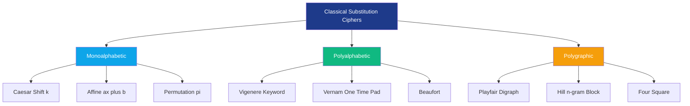
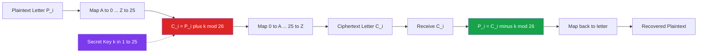
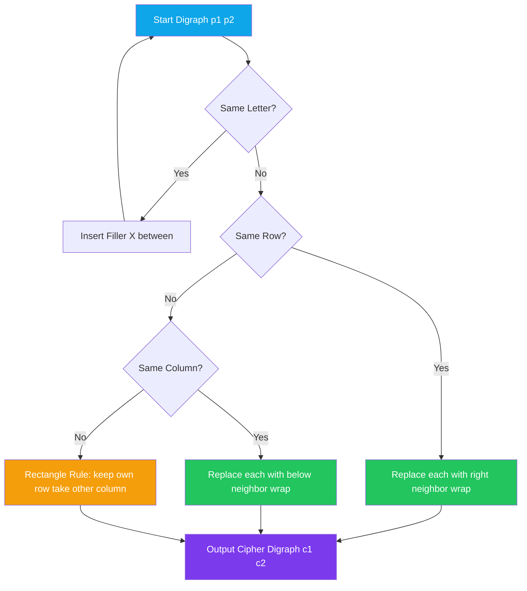
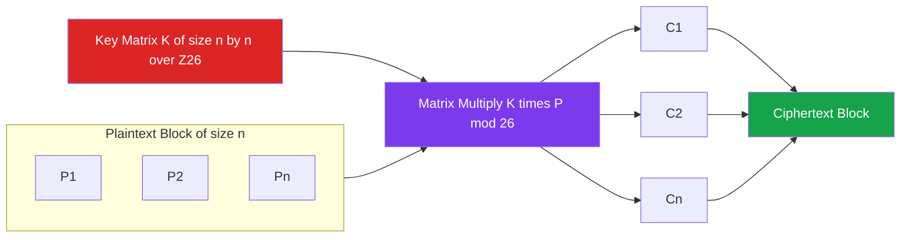
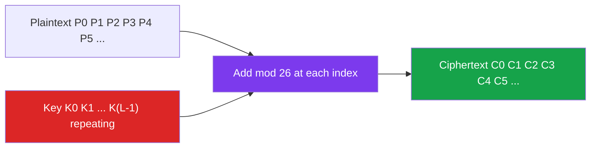

# Substitution Techniques

<!-- SECTION_1_START -->
# 1. Core Technical Definition & Intuitive Overview

## 1.1 Formal Definition (KTU 2024 Scheme Terminology)

In classical **symmetric-key cryptography**, a **Substitution Technique** is an encryption scheme in which the elements of the **plaintext (P)** are systematically replaced by corresponding elements of the **ciphertext (C)** according to a deterministic, reversible rule. The original character structure, word boundaries, and language statistics are partially or fully preserved, making these schemes the historical foundation of cryptology.

> [!IMPORTANT]
> **KTU 2024 Module Definition:** A substitution cipher replaces fixed-size units of plaintext (single letters, digraphs, or blocks of $n$ letters) with ciphertext units drawn from the same alphabet, where the replacement rule is governed by a secret key $K$ shared between sender and receiver.

The mathematical abstraction is:

$$C = E_K(P) \quad \text{and} \quad P = D_K(C) = E_K^{-1}(C)$$

For a finite English alphabet $\Sigma = \{A, B, C, \ldots, Z\}$ of size $|\Sigma| = 26$, every classical substitution technique operates within the modular ring $\mathbb{Z}_{26} = \{0, 1, 2, \ldots, 25\}$.

## 1.2 Conceptual Analogy

> [!NOTE]
> **Intuition — The "Captain Midnight Decoder Ring"**
> Imagine a class of schoolchildren, each owning a plastic ring with the alphabet scrambled around the edge. To send a secret message, Alice aligns her ring's "A" under Bob's "Q" — a fixed **shift of 16 positions**. Every letter she reads off her ring gets transmitted as the letter beneath it on Bob's aligned ring. The ring alignment is the **key**. If Eve steals one ring, the cipher collapses.

A substitution cipher is exactly this: the *meaning* of each letter slides along a private, hidden mapping, while the *length* and *shape* of the message remain untouched. If you suspect the shift is 3, you just slide the ring three notches and try again — hence the famous **brute-force vulnerability of Caesar cipher**.

## 1.3 Taxonomy of Substitution Ciphers

| Family | Granularity | Key Size | Statistical Resilience |
|---|---|---|---|
| **Caesar Cipher** | Single letter | 25 effective shifts | Very weak — single frequency peak |
| **Monoalphabetic** | Single letter | $26!$ permutations | Weak — preserves letter frequencies |
| **Playfair Cipher** | Digraph (2 letters) | 25-cell matrix | Stronger — flattens digraph statistics |
| **Hill Cipher** | Block of $n$ letters | $n \times n$ invertible matrix | Stronger — mixes linear algebra |
| **Polyalphabetic (Vigenère)** | Single letter, key-cyclic | Length $L$ of keyword | Defeats mono-frequency analysis |
| **One-Time Pad (Vernam)** | Single bit/letter | Equal to message length | **Information-theoretically secure** |

## 1.4 GeoGebra / Desmos Visualisation

> [!VISUALIZATION CONTROL]
> **Concept:** Caesar cipher as a circular alphabet shift on a discrete modular ring.
> **GeoGebra / Desmos Input Equations:**
> * Parametric shift: $(x(t), y(t)) = (\cos(t + \phi), \sin(t + \phi))$ for $t \in [0, 2\pi]$ and $\phi = k \cdot \frac{2\pi}{26}$
> * Discrete points: $A = (1, 0)$, $B = (\cos(15.69^\circ), \sin(15.69^\circ))$, $\ldots$ for the 26 letters.
> * Arrow: arrow from plaintext letter at angle $\theta$ to ciphertext letter at angle $\theta + k \cdot \frac{2\pi}{26}$.
> **Visual Description:** You should observe a perfectly circular, evenly-spaced arrangement of 26 letters. For a Caesar key $k = 3$, every letter rotates forward by 3 positions along the ring. Increasing $k$ makes the arrows longer (counter-clockwise); decreasing $k$ reverses them. This geometric picture is why brute force requires only 25 trials.

## 1.5 Historical and Engineering Context

Substitution techniques span roughly **1900 BC (Egyptian hieroglyphs) → 1949 (Shannon's "Communication Theory of Secrecy Systems")**. They are *not* used for modern internet security (TLS, AES, ChaCha20 do not use simple substitution), but they remain pedagogically vital because every modern block cipher (DES, AES) is fundamentally a **multi-round substitution–permutation network (SPN)**, and every modern stream cipher is a **pseudo-random substitution generator** derived from the Vernam blueprint.

---

<!-- SECTION_1_END -->

<!-- SECTION_2_START -->
# 2. Deep Theoretical Analysis & KTU High-Yield Formula Sheet

## 2.1 Caesar Cipher

The Caesar cipher is the simplest monoalphabetic substitution. Every plaintext letter is shifted by a fixed integer $k$ along the alphabet.

**Encryption rule:**

$$C_i \equiv (P_i + k) \bmod 26, \quad k \in \{1, 2, \ldots, 25\}$$

**Decryption rule:**

$$P_i \equiv (C_i - k) \bmod 26$$

**Why it works:** Because mod 26 forms a cyclic group, the inverse shift $(26 - k)$ undoes encryption. The keyspace has only **25 effective keys** (any $k$ divisible by 26 gives the identity, and $k=0$ is no encryption at all), so it is trivially defeated by exhaustive search.

> [!NOTE]
> **Cryptanalysis Insight (KPA):** Under a Known-Plaintext Attack, just **one pair** $(P, C)$ reveals $k = (C - P) \bmod 26$.

## 2.2 Monoalphabetic (Simple Substitution) Cipher

Each of the 26 letters is mapped to a *unique* ciphertext letter via a permutation $\pi : \mathbb{Z}_{26} \to \mathbb{Z}_{26}$.

$$C = \pi(P), \qquad P = \pi^{-1}(C)$$

The key is the entire permutation, giving a keyspace of $26! \approx 4.03 \times 10^{26}$ — astronomically large, so brute force is infeasible. **However**, the cipher is a *homomorphism* over letter frequencies: the most common plaintext letter (E ≈ 12.7%) maps to whatever symbol is most common in the ciphertext, the second-most (T ≈ 9.06%) to the second-most, and so on. **Frequency analysis** breaks it within minutes on a paragraph of text.

## 2.3 Playfair Cipher (Digraph Substitution)

Invented by Charles Wheatstone in 1854, popularised by Lord Playfair. Operates on **digraphs** (pairs of letters) using a $5 \times 5$ matrix built from a keyword.

**Key construction:**
1. Write the keyword, dropping duplicate letters.
2. Fill remaining cells of the $5 \times 5$ matrix with the unused alphabet letters in order.
3. Conventionally, **I and J share one cell** (giving 25 cells for 26 letters).

**Encryption rules for a digraph $(p_1, p_2)$:**

| Condition | Rule |
|---|---|
| Both letters in the **same row** | Replace each with the letter to its **right** (wrap around) |
| Both letters in the **same column** | Replace each with the letter **below** it (wrap around) |
| Otherwise (forms a **rectangle**) | Replace each with the letter in its **own row but the column of the other letter** |

If a digraph has identical letters (e.g., "LL"), insert a filler letter (usually **X**) between them, and if the plaintext has odd length, append a final **X** or **Z** filler.

## 2.4 Hill Cipher (Matrix Block Cipher)

Proposed by Lester S. Hill in 1929. A block of $n$ letters is encrypted by an $n \times n$ matrix $K$ over $\mathbb{Z}_{26}$.

$$C = K \cdot P \bmod 26$$

**Decryption** requires the inverse matrix $K^{-1} \bmod 26$, which exists **iff** $\gcd(\det(K), 26) = 1$. For 2-letter blocks ($n=2$):

$$\begin{aligned}
C_1 &\equiv (k_{11} P_1 + k_{12} P_2) \bmod 26 \\
C_2 &\equiv (k_{21} P_1 + k_{22} P_2) \bmod 26
\end{aligned}$$

The Hill cipher is the **first pure-linear** classical cipher and is fully defeated by known-plaintext attack: $n$ known plaintext–ciphertext pairs solve for $K$ via Gaussian elimination in $\mathbb{Z}_{26}$.

## 2.5 Vigenère Cipher (Polyalphabetic Substitution)

Invented by Blaise de Vigenère (1553). Uses a repeating keyword $K = (k_0, k_1, \ldots, k_{L-1})$ to apply a *different* Caesar shift to each plaintext letter:

$$C_i \equiv (P_i + k_{i \bmod L}) \bmod 26$$

The same plaintext letter encrypts to different ciphertext letters depending on position — destroying the single-peak frequency signature. The **Kasiski examination** and **Friedman index of coincidence** break it by recovering the keyword length $L$ and then reducing to $L$ independent Caesar ciphers.

## 2.6 Vernam Cipher / One-Time Pad (OTP)

A Vigenère cipher where the key is **(a)** as long as the message, **(b)** truly random, **(c)** never reused, and **(d)** kept perfectly secret. The bit-level formulation is:

$$C = P \oplus K$$

Claude Shannon proved (1949) that the OTP achieves **perfect secrecy**: $P(C) = P(P)$ — observing the ciphertext gives zero information about the plaintext.

> [!WARNING]
> **Engineering Reality:** The OTP is rarely used in practice because distributing a key as long as the message and as random as the message itself is operationally identical to the original problem of securely transmitting the message. The "one-time" is the hard part. Modern stream ciphers (ChaCha20, AES-CTR) use a **pseudo-random** keystream from a short key — not provably secure, but practical.

## 2.7 KTU Formula Cheat Sheet

| # | Cipher | Encryption Formula | Decryption Formula | Key Space | Block Size |
|---|---|---|---|---|---|
| 1 | Caesar | $C \equiv (P + k) \bmod 26$ | $P \equiv (C - k) \bmod 26$ | $25$ | 1 letter |
| 2 | Monoalphabetic | $C = \pi(P)$ | $P = \pi^{-1}(C)$ | $26!$ | 1 letter |
| 3 | Playfair | Same row / column / rectangle rule | Reverse rules | $\approx 25!$ | 2 letters |
| 4 | Hill (n×n) | $C = K P \bmod 26$ | $P = K^{-1} C \bmod 26$ | Varies | $n$ letters |
| 5 | Vigenère | $C_i \equiv (P_i + k_{i \bmod L}) \bmod 26$ | $P_i \equiv (C_i - k_{i \bmod L}) \bmod 26$ | $26^L$ | 1 letter |
| 6 | Vernam / OTP | $C = P \oplus K$ | $P = C \oplus K$ | $2^{\vert P \vert}$ | 1 bit |

**Number-to-letter convention (used throughout KTU papers):** A=0, B=1, C=2, D=3, E=4, F=5, G=6, H=7, I=8, J=9, K=10, L=11, M=12, N=13, O=14, P=15, Q=16, R=17, S=18, T=19, U=20, V=21, W=22, X=23, Y=24, Z=25.

**Real-World Engineering Utility Today:**
* **SPN blocks (AES):** AES rounds are essentially Hill-like matrix mixing (MixColumns) followed by byte substitution (S-Box). Understanding Hill is the gateway to AES.
* **Stream ciphers:** Every modern stream cipher is a Vernam-style XOR with a PRNG keystream. The OTP is the theoretical ceiling they approximate.
* **Tamper-evident hardware:** Substitution matrices appear in physical unclonable functions (PUFs) for device authentication.

---

<!-- SECTION_2_END -->

<!-- SECTION_3_START -->
# 3. Step-by-Step Derivations & Code/Symbolic Implementation

## 3.1 Caesar Cipher — Full Worked Example

**Problem:** Encrypt the plaintext $P = \text{HELLO}$ with key $k = 3$. Then decrypt to verify.

**Step 1 — Convert letters to numbers (A=0, …, Z=25):**

$$P = [H, E, L, L, O] = [7, 4, 11, 11, 14]$$

**Step 2 — Apply encryption $C_i = (P_i + 3) \bmod 26$:**

$$\begin{aligned}
C_0 &= (7 + 3) \bmod 26 = 10 \to K \\
C_1 &= (4 + 3) \bmod 26 = 7 \to H \\
C_2 &= (11 + 3) \bmod 26 = 14 \to O \\
C_3 &= (11 + 3) \bmod 26 = 14 \to O \\
C_4 &= (14 + 3) \bmod 26 = 17 \to R
\end{aligned}$$

**Step 3 — Result:** $C = \text{KHOOR}$.

**Step 4 — Decrypt with $P_i = (C_i - 3) \bmod 26$:**

$$\begin{aligned}
P_0 &= (10 - 3) \bmod 26 = 7 \to H \\
P_1 &= (7 - 3) \bmod 26 = 4 \to E \\
P_2 &= (14 - 3) \bmod 26 = 11 \to L \\
P_3 &= (14 - 3) \bmod 26 = 11 \to L \\
P_4 &= (17 - 3) \bmod 26 = 14 \to O
\end{aligned}$$

**Recovered plaintext:** HELLO ✓

## 3.2 Caesar Cipher — Python Implementation

```python
from __future__ import annotations
import logging

logging.basicConfig(level=logging.INFO, format="%(levelname)s :: %(message)s")
log = logging.getLogger("Caesar")


class CaesarCipher:
    """A reference implementation of the Caesar (shift) cipher."""

    def __init__(self, key: int) -> None:
        if not 0 <= key < 26:
            raise ValueError("Key must satisfy 0 <= key < 26")
        self.key: int = key

    def _shift(self, text: str, k: int) -> str:
        out: list[str] = []
        for ch in text:
            if "A" <= ch <= "Z":
                out.append(chr((ord(ch) - 65 + k) % 26 + 65))
            elif "a" <= ch <= "z":
                out.append(chr((ord(ch) - 97 + k) % 26 + 97))
            else:
                out.append(ch)  # keep punctuation / digits untouched
        return "".join(out)

    def encrypt(self, plaintext: str) -> str:
        log.info("Encrypting with key=%d", self.key)
        return self._shift(plaintext, self.key)

    def decrypt(self, ciphertext: str) -> str:
        log.info("Decrypting with key=%d", self.key)
        return self._shift(ciphertext, -self.key)


if __name__ == "__main__":
    cipher = CaesarCipher(3)
    pt = "HELLO, World!"
    ct = cipher.encrypt(pt)
    rt = cipher.decrypt(ct)
    print(f"Plaintext : {pt}")
    print(f"Ciphertext: {ct}")
    print(f"Recovered : {rt}")
```

## 3.3 Playfair Cipher — Full Worked Example

**Keyword:** MONARCHY
**Plaintext:** INSTRUMENT

**Step 1 — Build the 5×5 matrix (I/J share a cell):**

$$\begin{array}{|c|c|c|c|c|}
\hline
M & O & N & A & R \\
\hline
C & H & Y & B & D \\
\hline
E & F & G & I & K \\
\hline
L & P & Q & S & T \\
\hline
U & V & W & X & Z \\
\hline
\end{array}$$

**Step 2 — Locate each digraph letter (row, col):**

* I → (2, 3)
* N → (0, 2)
* S → (3, 3)
* T → (3, 4)
* R → (0, 4)
* U → (4, 0)
* M → (0, 0)
* E → (2, 0)
* N → (0, 2)
* T → (3, 4)

**Step 3 — Apply the three encryption rules:**

Digraph 1: **I N** → (2,3) and (0,2). Rectangle: row of I stays 2, column becomes 2 → **G**; row of N stays 0, column becomes 3 → **A**. Ciphertext digraph: **GA**.

Digraph 2: **S T** → (3,3) and (3,4). **Same row** → shift right with wrap: S(3,3)→T(3,4), T(3,4)→L(3,0). Ciphertext digraph: **TL**.

Digraph 3: **R U** → (0,4) and (4,0). Rectangle: R's row 0, U's column 0 → **M**; U's row 4, R's column 4 → **Z**. Ciphertext digraph: **MZ**.

Digraph 4: **M E** → (0,0) and (2,0). **Same column** → shift down with wrap: M(0,0)→C(1,0), E(2,0)→L(3,0). Ciphertext digraph: **CL**.

Digraph 5: **N T** → (0,2) and (3,4). Rectangle: N's row 0, T's column 4 → **R**; T's row 3, N's column 2 → **Q**. Ciphertext digraph: **RQ**.

**Step 4 — Concatenate ciphertext:** $\text{INSTRUMENT} \to \text{GTLMZCLRQ}$

## 3.4 Hill Cipher — Full Worked Example (2×2)

**Key matrix:**

$$K = \begin{pmatrix} 3 & 3 \\ 2 & 5 \end{pmatrix}, \quad \det(K) = 3 \cdot 5 - 3 \cdot 2 = 15 - 6 = 9$$

Since $\gcd(9, 26) = 1$, the matrix is invertible over $\mathbb{Z}_{26}$. The modular inverse of $\det(K) = 9$ is $9^{-1} \bmod 26 = 3$ (because $9 \cdot 3 = 27 \equiv 1 \pmod{26}$). The adjugate is $\text{adj}(K) = \begin{pmatrix} 5 & -3 \\ -2 & 3 \end{pmatrix}$.

$$K^{-1} = 3 \cdot \begin{pmatrix} 5 & -3 \\ -2 & 3 \end{pmatrix} \bmod 26 = \begin{pmatrix} 15 & -9 \\ -6 & 9 \end{pmatrix} \bmod 26 = \begin{pmatrix} 15 & 17 \\ 20 & 9 \end{pmatrix}$$

**Encrypt plaintext $P = \text{HI}$ → vector $\begin{pmatrix} 7 \\ 8 \end{pmatrix}$:**

$$\begin{aligned}
C &= K \cdot P \bmod 26 = \begin{pmatrix} 3 & 3 \\ 2 & 5 \end{pmatrix} \begin{pmatrix} 7 \\ 8 \end{pmatrix} \bmod 26 \\
  &= \begin{pmatrix} 3 \cdot 7 + 3 \cdot 8 \\ 2 \cdot 7 + 5 \cdot 8 \end{pmatrix} \bmod 26 \\
  &= \begin{pmatrix} 21 + 24 \\ 14 + 40 \end{pmatrix} \bmod 26 \\
  &= \begin{pmatrix} 45 \\ 54 \end{pmatrix} \bmod 26 \\
  &= \begin{pmatrix} 19 \\ 2 \end{pmatrix} = \begin{pmatrix} T \\ C \end{pmatrix}
\end{aligned}$$

So $\text{HI} \to \text{TC}$. Decryption with $K^{-1}$ recovers the original.

## 3.5 Hill Cipher — Python Implementation

```python
from __future__ import annotations
import logging
import numpy as np

logging.basicConfig(level=logging.INFO, format="%(levelname)s :: %(message)s")
log = logging.getLogger("Hill")
MOD: int = 26


def mod_inverse(a: int, m: int = MOD) -> int:
    """Extended-Euclidean modular inverse; raises if not invertible."""
    for x in range(1, m):
        if (a * x) % m == 1:
            return x
    raise ValueError(f"{a} has no inverse mod {m}")


def text_to_vec(text: str, n: int) -> np.ndarray:
    text = "".join(ch for ch in text.upper() if "A" <= ch <= "Z")
    if len(text) % n != 0:
        text += "X" * (n - len(text) % n)  # pad
    return np.array([ord(c) - 65 for c in text], dtype=int)


def vec_to_text(vec: np.ndarray) -> str:
    return "".join(chr(int(v) % 26 + 65) for v in vec)


class HillCipher:
    def __init__(self, key: np.ndarray) -> None:
        if key.shape[0] != key.shape[1]:
            raise ValueError("Key matrix must be square")
        det = int(round(np.linalg.det(key))) % MOD
        try:
            self._det_inv = mod_inverse(det, MOD)
        except ValueError as exc:
            raise ValueError(f"Matrix is not invertible mod 26: {exc}") from exc
        self.n: int = key.shape[0]
        self.key: np.ndarray = key % MOD

    def encrypt(self, plaintext: str) -> str:
        log.info("Hill encrypting %d-gram block", self.n)
        p = text_to_vec(plaintext, self.n)
        c = (self.key @ p) % MOD
        return vec_to_text(c)

    def decrypt(self, ciphertext: str) -> str:
        log.info("Hill decrypting %d-gram block", self.n)
        c = text_to_vec(ciphertext, self.n)
        # adjugate of 2x2 = [[d, -b], [-c, a]]; for general n, use sympy
        adj = np.array([[self.key[1, 1], -self.key[0, 1]],
                        [-self.key[1, 0], self.key[0, 0]]], dtype=int)
        inv = (self._det_inv * adj) % MOD
        p = (inv @ c) % MOD
        return vec_to_text(p)


if __name__ == "__main__":
    K = np.array([[3, 3], [2, 5]])
    h = HillCipher(K)
    print("Enc(HI) =", h.encrypt("HI"))   # TC
    print("Dec(TC) =", h.decrypt("TC"))   # HI
```

## 3.6 Vigenère Cipher — Full Worked Example

**Plaintext:** ATTACKATDAWN
**Key:** LEMON (length $L = 5$)

**Step 1 — Repeat the key to match plaintext length:**

$$K_{\text{rep}} = \text{LEMONLEMONL}$$

**Step 2 — Convert to numbers and add mod 26:**

| Pos | Plain | P_num | Key | K_num | $(P+K) \bmod 26$ | Cipher |
|---|---|---|---|---|---|---|
| 0 | A | 0 | L | 11 | 11 | L |
| 1 | T | 19 | E | 4 | 23 | X |
| 2 | T | 19 | M | 12 | 31 mod 26 = 5 | F |
| 3 | A | 0 | O | 14 | 14 | O |
| 4 | C | 2 | N | 13 | 15 | P |
| 5 | K | 10 | L | 11 | 21 | V |
| 6 | A | 0 | E | 4 | 4 | E |
| 7 | T | 19 | M | 12 | 31 mod 26 = 5 | F |
| 8 | D | 3 | O | 14 | 17 | R |
| 9 | A | 0 | N | 13 | 13 | N |
| 10 | W | 22 | L | 11 | 33 mod 26 = 7 | H |

**Ciphertext:** LXFOPVEFRNH

## 3.7 Vigenère Cipher — Python Implementation

```python
from __future__ import annotations
import logging

logging.basicConfig(level=logging.INFO, format="%(levelname)s :: %(message)s")
log = logging.getLogger("Vigenere")


class VigenereCipher:
    def __init__(self, key: str) -> None:
        self.key = "".join(ch for ch in key.upper() if "A" <= ch <= "Z")
        if not self.key:
            raise ValueError("Key must contain at least one letter A-Z")

    def _run(self, text: str, sign: int) -> str:
        out, j = [], 0
        for ch in text:
            if "A" <= ch <= "Z":
                shift = ord(self.key[j % len(self.key)]) - 65
                out.append(chr((ord(ch) - 65 + sign * shift) % 26 + 65))
                j += 1
            elif "a" <= ch <= "z":
                shift = ord(self.key[j % len(self.key)]) - 65
                out.append(chr((ord(ch) - 97 + sign * shift) % 26 + 97))
                j += 1
            else:
                out.append(ch)
        return "".join(out)

    def encrypt(self, pt: str) -> str:
        log.info("Vigenere encrypt with key '%s'", self.key)
        return self._run(pt, +1)

    def decrypt(self, ct: str) -> str:
        log.info("Vigenere decrypt with key '%s'", self.key)
        return self._run(ct, -1)


if __name__ == "__main__":
    v = VigenereCipher("LEMON")
    print(v.encrypt("ATTACKATDAWN"))   # LXFOPVEFRNH
    print(v.decrypt("LXFOPVEFRNH"))   # ATTACKATDAWN
```

## 3.8 Vernam / One-Time Pad — Worked Example (Binary)

**Plaintext bits (ASCII of "A" = 65 = 01000001):** $P = 01000001$
**Random key bits (example):** $K = 10101100$

**Step 1 — XOR each bit:**

| Bit position | 7 | 6 | 5 | 4 | 3 | 2 | 1 | 0 |
|---|---|---|---|---|---|---|---|---|
| $P$ | 0 | 1 | 0 | 0 | 0 | 0 | 0 | 1 |
| $K$ | 1 | 0 | 1 | 0 | 1 | 1 | 0 | 0 |
| $C = P \oplus K$ | 1 | 1 | 1 | 0 | 1 | 1 | 0 | 1 |

**Ciphertext:** $C = 11101101$ (hex 0xED)

**Decrypt:** $P = C \oplus K = 11101101 \oplus 10101100 = 01000001 = \text{‘A’}$ ✓

**Shannon entropy argument:** Every possible plaintext of length 8 is equally likely to produce $C = 11101101$ because each plaintext is paired with a *unique* key, and all keys are equiprobable. The mutual information $I(P; C) = 0$.

---

<!-- SECTION_3_END -->

<!-- SECTION_4_START -->
# 4. Structural Diagrams & Schematics

## 4.1 Taxonomy of Classical Substitution Ciphers



## 4.2 Caesar Cipher — Process Pipeline



## 4.3 Playfair Encryption Rule Decision Tree



## 4.4 Hill Cipher Block Processing Topology



## 4.5 Vigenère Cyclic Key Application



---

<!-- SECTION_4_END -->

<!-- SECTION_5_START -->
# 5. KTU 2024 Scheme Examination Question Bank & Topic Recap

> [!IMPORTANT]
> **Mark Distribution Reference (KTU 2024 ESE Pattern):**
> * Part A: Short answer, 3 marks each, answer 5 out of 7.
> * Part B: Descriptive, 14 marks each, internal choice (Q11 OR Q12 style).
> * CO Mapping shown per question. RBT = Revised Bloom's Taxonomy cognitive level.

---

## Part A — Short Answer Questions (3 Marks Each)

### Question 1: Differentiate between Monoalphabetic and Polyalphabetic substitution ciphers. [3 Marks]
**[KTU University Exam – Dec 2023]** | **CO1 / Understand**

**Model Answer:**

| Property | Monoalphabetic | Polyalphabetic |
|---|---|---|
| Key | One fixed permutation $\pi$ | Sequence of shifts $K = (k_0, k_1, \dots, k_{L-1})$ |
| Mapping | Each plaintext letter → one unique ciphertext letter | Plaintext letter $P_i$ maps differently depending on position $i$ |
| Frequency | Preserves single-letter frequency profile | Flattens single-letter frequency (closer to uniform) |
| Example | Caesar, Atbash | Vigenère, Vernam |
| Cryptanalysis | Vulnerable to frequency analysis | Requires Kasiski / Index of Coincidence |

> [!NOTE]
> **Valuation Key:** [Distinction table 2 marks] [Example 1 mark] = 3 marks.

---

### Question 2: State the conditions under which a matrix $K$ can serve as a key in the Hill cipher. [3 Marks]
**[KTU University Exam – July 2024]** | **CO1 / Remember**

**Model Answer:**
A square matrix $K$ of order $n \times n$ is a valid Hill-cipher key over $\mathbb{Z}_{26}$ **if and only if** the determinant of $K$ is coprime with 26:

$$\gcd\bigl(\det(K), 26\bigr) = 1$$

Equivalently, $\det(K) \bmod 26$ must be an invertible element of $\mathbb{Z}_{26}$, i.e., $\det(K) \bmod 26 \in \{1, 3, 5, 7, 9, 11, 15, 17, 19, 21, 23, 25\}$. If this condition fails, no decryption matrix $K^{-1}$ exists in $\mathbb{Z}_{26}$ and the cipher is irreversible.

> [!NOTE]
> **Valuation Key:** [Condition statement 2 marks] [Invertible elements list 1 mark] = 3 marks.

---

## Part B — Descriptive Questions (14 Marks, Internal Choice)

### Question 3(A): [14 Marks]
**[KTU University Exam – Dec 2023, Model Paper]** | **CO1 / CO2, Understand + Apply**

**(a)** Explain the Playfair cipher with its key-matrix construction rules and the three encryption rules for a digraph. **[7 Marks]**

**(b)** Using keyword **"MONARCHY"**, encrypt the plaintext **"INSTRUMENT"** using the Playfair cipher. Show the 5×5 matrix and each digraph transformation step. **[7 Marks]**

**Model Solution:**

**(a) — Theoretical Explanation [7 Marks]**

Playfair is a **digraph substitution cipher** operating on letter-pairs from a 25-cell matrix:

1. **Matrix Construction:** Write the keyword, removing duplicate letters, then fill remaining cells of a $5 \times 5$ matrix with unused alphabet letters in order. Convention: **I and J share a cell**.
2. **Plaintext Preparation:** Split plaintext into digraphs. If a digraph has identical letters (e.g., "LL"), insert **X** between them. If the message has odd length, pad with **X** or **Z**.
3. **Encryption Rules** for a digraph $(p_1, p_2)$:
   * **Same Row:** Replace each letter by the letter to its **immediate right** (column 4 wraps to column 0).
   * **Same Column:** Replace each letter by the letter **immediately below** (row 4 wraps to row 0).
   * **Rectangle:** Otherwise, replace $p_1$ by the letter in $p_1$'s row and $p_2$'s column, and $p_2$ by the letter in $p_2$'s row and $p_1$'s column.

*Valuation:* [Matrix construction 2 marks] [Padding rules 1 mark] [Three encryption rules 3 marks] [Worked mini-example 1 mark] = 7 marks.

**(b) — Worked Encryption [7 Marks]**

The 5×5 matrix and full digraph walkthrough are identical to **Section 3.3** above. Expected student deliverable:

$$\begin{array}{|c|c|c|c|c|}
\hline
M & O & N & A & R \\
\hline
C & H & Y & B & D \\
\hline
E & F & G & I & K \\
\hline
L & P & Q & S & T \\
\hline
U & V & W & X & Z \\
\hline
\end{array}$$

* $\text{IN} \to \text{GA}$ (rectangle) — [1 mark]
* $\text{ST} \to \text{TL}$ (same row, shift right with wrap) — [1 mark]
* $\text{RU} \to \text{MZ}$ (rectangle) — [1 mark]
* $\text{ME} \to \text{CL}$ (same column, shift down with wrap) — [1 mark]
* $\text{NT} \to \text{RQ}$ (rectangle) — [1 mark]
* Final ciphertext **"GTLMZCLRQ"** — [2 marks]

> [!WARNING]
> **Examiner's Pitfall Warning:** Students commonly lose 2–3 marks for: (i) not writing the matrix explicitly, (ii) forgetting the I/J merger, (iii) failing to show *which rule* they applied at each step, (iv) wrap-around errors on same-row/column cases. Always **label each transformation** with the rule name in the answer script.

---

### Question 3(B): [14 Marks — Alternative Choice]
**[KTU University Exam – July 2024, Model Paper]** | **CO1 / CO2, Understand + Apply**

**(a)** Describe the Hill cipher. For a 2×2 key matrix $K = \begin{pmatrix} 3 & 3 \\ 2 & 5 \end{pmatrix}$, determine whether it is a valid Hill-cipher key over $\mathbb{Z}_{26}$. Justify. **[7 Marks]**

**(b)** Using the same key $K$, encrypt the plaintext **"HI"** and then show the decryption process to recover the original plaintext. **[7 Marks]**

**Model Solution:**

**(a) — Key Validity [7 Marks]**

The Hill cipher is a block cipher of block-size $n$ operating on column vectors of length $n$ over $\mathbb{Z}_{26}$. Encryption is $C = K P \bmod 26$, and a valid key requires $\det(K)$ to be invertible in $\mathbb{Z}_{26}$.

For $K = \begin{pmatrix} 3 & 3 \\ 2 & 5 \end{pmatrix}$:

$$\det(K) = (3)(5) - (3)(2) = 15 - 6 = 9$$

We need $\gcd(9, 26) = 1$. Since the only prime factors of 9 are $3 \times 3$, and $26 = 2 \times 13$ shares no factor with 9, we confirm $\gcd(9, 26) = 1$. Therefore **K is a valid Hill-cipher key** with inverse $9^{-1} \bmod 26 = 3$ (since $9 \times 3 = 27 \equiv 1 \pmod{26}$).

*Valuation:* [Concept statement 2 marks] [Determinant calculation 2 marks] [GCD verification 2 marks] [Inverse identification 1 mark] = 7 marks.

**(b) — Encryption + Decryption [7 Marks]**

The full computation is given in **Section 3.4** above. Expected student deliverable:

**Encryption:** Convert $P = \text{HI} = \begin{pmatrix} 7 \\ 8 \end{pmatrix}$.

$$C = K \cdot P = \begin{pmatrix} 3(7) + 3(8) \\ 2(7) + 5(8) \end{pmatrix} = \begin{pmatrix} 45 \\ 54 \end{pmatrix} \equiv \begin{pmatrix} 19 \\ 2 \end{pmatrix} \pmod{26} = \begin{pmatrix} T \\ C \end{pmatrix}$$

So $\text{HI} \to \text{TC}$. — [3 marks]

**Decryption:** Compute $K^{-1} = 3 \begin{pmatrix} 5 & -3 \\ -2 & 3 \end{pmatrix} \bmod 26 = \begin{pmatrix} 15 & 17 \\ 20 & 9 \end{pmatrix}$.

$$P = K^{-1} C = \begin{pmatrix} 15(19) + 17(2) \\ 20(19) + 9(2) \end{pmatrix} = \begin{pmatrix} 285 + 34 \\ 380 + 18 \end{pmatrix} = \begin{pmatrix} 319 \\ 398 \end{pmatrix} \equiv \begin{pmatrix} 7 \\ 8 \end{pmatrix} \pmod{26} = \begin{pmatrix} H \\ I \end{pmatrix}$$

Recovered plaintext: **HI** ✓ — [4 marks: inverse 2 marks, multiplication + mod 26 + final 2 marks]

> [!WARNING]
> **Examiner's Pitfall Warning:** Most common errors: (i) forgetting to apply **mod 26** at the end (not after each multiplication), (ii) sign errors in the 2×2 adjugate ($\begin{pmatrix} a & b \\ c & d \end{pmatrix}$ adjugate is $\begin{pmatrix} d & -b \\ -c & a \end{pmatrix}$, NOT the transpose), (iii) confusing row-vector and column-vector conventions. Always **declare your convention** at the start of the answer.

---

## 5.1 Topic Recap & Important Things to Remember

> [!IMPORTANT]
> **Rapid Revision Checklist — Substitution Techniques**

* **Caesar Cipher:** $C = (P + k) \bmod 26$; only **25 effective keys**; trivially broken by brute force and KPA (single pair).
* **Monoalphabetic:** Any permutation $\pi$ on 26 letters; keyspace $26! \approx 4.03 \times 10^{26}$; broken by **frequency analysis** because letter frequencies are preserved exactly.
* **Playfair (Digraph):** 5×5 matrix, I/J merged, three rules — same row (shift right), same column (shift down), rectangle (swap columns). Pad duplicates with X.
* **Hill Cipher (Block):** $C = K P \bmod 26$. Validity: $\gcd(\det K, 26) = 1$. Decryption: $K^{-1}$ must exist in $\mathbb{Z}_{26}$. Vulnerable to KPA — $n$ plaintext–ciphertext pairs recover $K$ uniquely.
* **Vigenère (Polyalphabetic):** $C_i = (P_i + k_{i \bmod L}) \bmod 26$. Defeats mono-frequency analysis. Broken by **Kasiski examination** (repeated ciphertext segments reveal key length) and **Friedman's Index of Coincidence**.
* **Vernam / OTP:** $C = P \oplus K$; key must be **as long, random, never reused, perfectly secret** as the message. **Shannon-perfect secrecy** proven 1949. Operationally impractical; modern stream ciphers approximate it with a PRNG keystream.
* **Numbering convention (mandatory in KTU scripts):** A=0, B=1, …, Z=25.
* **Wrap-around in modular arithmetic:** Mod 26 always returns a value in $\{0, 1, \ldots, 25\}$; any negative intermediate result must be normalised (add 26 repeatedly).
* **Linear vs. non-linear:** Caesar, Monoalphabetic, Hill, Vigenère are all **linear** in $\mathbb{Z}_{26}$ (Hill purely linear). Modern ciphers must be **non-linear** to resist cryptanalysis — this is the entire reason for S-Boxes in AES.
* **Bridge to Modern Crypto:** AES rounds = (linear) MixColumns + (non-linear) SubBytes; the latter is a multi-bit substitution table — Playfair's great-grandchild.

---

<!-- SECTION_5_END -->
