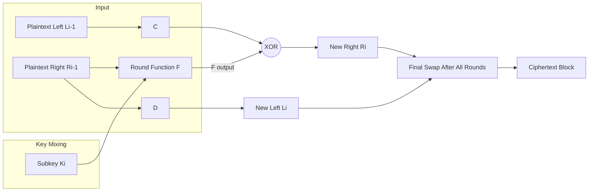
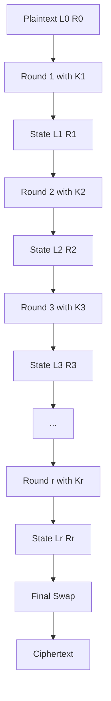
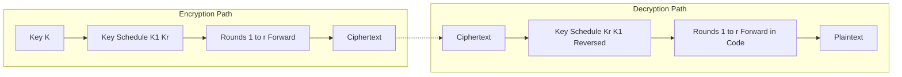
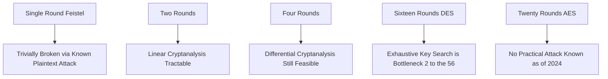
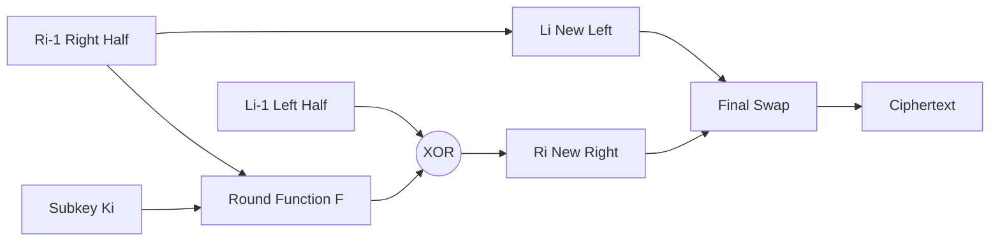

# Traditional Block Cipher Structure.

<!-- SECTION_1_START -->
# Traditional Block Cipher Structure — Core Foundations

## 1.1 Formal Academic Definition

> [!IMPORTANT]
> **Definition (KTU 2024 Scheme Standard):**
> A **Traditional Block Cipher** is a symmetric-key cryptographic primitive that encrypts a fixed-size plaintext **block** of $n$ bits into a ciphertext block of the same size $n$ bits, using a secret key of size $k$ bits, by iteratively applying a sequence of invertible substitution and permutation transformations over a predefined number of **rounds**.

For a binary block of length $n$, the encryption operation is formally expressed as the mapping:

$$
E : \{0,1\}^{n} \times \{0,1\}^{k} \longrightarrow \{0,1\}^{n}
$$

such that the decryption operation $D$ is its left-inverse:

$$
D(E(P, K), K) = P \quad \forall\, P \in \{0,1\}^{n}
$$

The seminal architecture that operationalized this design philosophy is the **Feistel Cipher Structure** (proposed by **Horst Feistel** at IBM in **1973**), which became the blueprint for the **Data Encryption Standard (DES)**.

---

## 1.2 Intuitive Real-World Analogy — "The Locked Mailbox Conveyor"

Imagine a postal sorting facility with the following setup:

* A **mailbox** of fixed capacity (say, **64 letters** per batch) — this is your **block size**.
* A **master locksmith** who holds a secret combination — this is your **secret key**.
* The mailbox travels through a sequence of **8 to 16 identical inspection rooms**, each containing a different mechanical transformation. Each room splits the mailbox into two halves, processes the right half, and shuffles the contents. This is the **rounds of a Feistel network**.
* In every room, the locksmith applies a **substitution box (S-box)** that replaces one letter with another (confusion), followed by a **permutation table (P-box)** that reorders the letters (diffusion).
* The result is a ciphertext that looks statistically nothing like the original mail.

> [!NOTE]
> **Why blocks of fixed size?**
> Cryptographic security scales poorly with the message length in stream ciphers (because each bit's encryption depends on keystream state). Block ciphers bundle bits together so that diffusion can propagate rapidly across the entire block within a few rounds — guaranteeing **avalanche effect**.

---

## 1.3 The Two Pillars — Shannon's Design Principles

The entire block-cipher design discipline rests on two ideas formalized by **Claude Shannon (1949)**:

| Principle | Formal Meaning | Plain-English Intuition |
| :--- | :--- | :--- |
| **Confusion** | The relationship between ciphertext and key must be made as complex and non-linear as possible. | An attacker who studies the ciphertext should NOT be able to deduce the key by simple algebra. |
| **Diffusion** | The influence of every single plaintext bit must be spread across as many ciphertext bits as possible. | Flipping **one** bit in the plaintext should change roughly **half** the bits in the ciphertext. |

> [!NOTE]
> **KTU Board Highlight:**
> Confusion is achieved via **non-linear substitution (S-boxes)**.
> Diffusion is achieved via **linear permutation (P-boxes)** and key mixing.
> These two transformations are alternated across multiple rounds to build cryptographic strength.

---

## 1.4 Stream Cipher vs. Block Cipher — Why Blocks?

$$
\underbrace{\text{Plaintext stream}}_{b_1, b_2, b_3, \ldots} \xrightarrow{\text{XOR with keystream}} \underbrace{\text{Ciphertext stream}}_{c_1, c_2, c_3, \ldots}
$$

> [!NOTE]
> **Disadvantage of Stream Ciphers:** They are vulnerable to bit-flipping attacks and lack inherent diffusion. If a keystream bit is reused, two ciphertexts can be XORed to cancel the keystream, leaking information — the famous **two-time pad attack**.

**Block ciphers solve this by:**
1. Processing the message in **fixed-size chunks** (e.g., 64 or 128 bits).
2. Building a complex **substitution-permutation network (SPN)** that resists algebraic cryptanalysis.
3. Operating in well-defined **modes of operation** (ECB, CBC, CFB, OFB, CTR — covered in Module 3).

---

## 1.5 Visualization Note

> [!VISUALIZATION CONTROL]
> **Concept:** Diffusion vs. Confusion — Avalanche Effect Visualization
> **GeoGebra / Desmos Input Equations:**
> * `f(x) = 0.5 + 0.5 * sin(2 * pi * x)` — represents a single S-box as a non-linear function
> * Points: `A = (0, 0), B = (1, 1)` — single-bit plaintext change
> * Mapping after 1 round: `B' = (1, f(1)) = (1, 0.5)`
> * Mapping after 3 rounds: `B'' = (3, f(f(f(1))))`
> **Visual Description:** A student should observe that a tiny horizontal nudge at the input (one-bit change) results in a drastically different output point, demonstrating the avalanche effect. Over successive rounds, the S-box iterates scramble the input beyond recognition.

<!-- SECTION_1_END -->

<!-- SECTION_2_START -->
# Deep Theoretical Analysis & KTU High-Yield Formula Sheet

## 2.1 Block Cipher Design — The Engineering Trade-Off Triangle

Every block cipher must balance three competing forces:

$$
\text{Security} \;\;\leftrightarrow\;\; \text{Speed} \;\;\leftrightarrow\;\; \text{Implementation Cost}
$$

The design parameters that influence this trade-off are:

1. **Block size ($n$):** Larger blocks give stronger confidentiality but increase hardware cost.
2. **Key size ($k$):** Larger keys resist brute force. For $k$ bits, exhaustive search requires $2^{k}$ attempts.
3. **Number of rounds ($r$):** More rounds ⇒ stronger security but slower throughput.
4. **Subkey generation algorithm:** Should produce cryptographically diverse round keys.
5. **Round function ($F$):** The heart of the cipher — must be non-linear and invertible (in Feistel) or bijective (in SPN).

> [!IMPORTANT]
> **KTU 2024 Scheme Note:**
> The **Feistel cipher** only requires the round function $F$ to be **non-invertible** (it can even be a hash function). Inversion is recovered through XOR operations. This was the brilliant insight that made DES possible.

---

## 2.2 The Feistel Cipher Structure — Detailed Operational Theory

The Feistel network processes a block of size $2w$ bits, splitting it into a **left half** $L_0$ and a **right half** $R_0$, each of width $w$ bits. The encryption proceeds through $r$ rounds, each applying:

$$
L_{i} = R_{i-1}
$$

$$
R_{i} = L_{i-1} \oplus F(R_{i-1}, K_{i})
$$

where:

* $K_{i}$ is the **round subkey** for round $i$, derived from the master key $K$ via the **key schedule**.
* $F$ is the **round function** (can be any function — non-linearity is desirable but not strictly required for correctness).
* $\oplus$ denotes the **bitwise XOR** operation.

The **ciphertext** is the concatenation of $L_{r}$ and $R_{r}$:

$$
C = (L_{r} \,\|\, R_{r})
$$

### 2.2.1 Decryption in Feistel

The decryption algorithm uses the **same structure** as encryption but applies the **round subkeys in reverse order**:

$$
R_{i-1} = L_{i}
$$

$$
L_{i-1} = R_{i} \oplus F(L_{i}, K_{i})
$$

> [!NOTE]
> **Why is this so elegant?**
> The decryption algorithm is **structurally identical** to encryption — only the key schedule direction changes. This is a *huge* engineering win: hardware designers only need to build one circuit for both operations.

### 2.2.2 Final Swap in Feistel

After the last round, the two halves are **swapped** to undo the inequality introduced by the final iteration. This ensures that encryption and decryption use the same code path.

---

## 2.3 Confusion and Diffusion — The Mathematical Lens

### 2.3.1 Confusion via S-Boxes

A **substitution box (S-box)** $S : \{0,1\}^{m} \rightarrow \{0,1\}^{n}$ is a non-linear lookup table. For an $m$-bit input, the S-box outputs $n$ bits. Properties of a good S-box:

* **Non-linearity** — resists linear cryptanalysis.
* **Strict avalanche criterion (SAC)** — flipping one input bit should flip each output bit with probability $\approx 0.5$.
* **Bit independence criterion (BIC)** — output bits should change independently.

### 2.3.2 Diffusion via P-Boxes

A **permutation box (P-box)** $P$ is a fixed, bit-level reordering. If $n$ bits enter, the same $n$ bits exit, but in a permuted order. The permutation matrix $P$ satisfies $P P^{T} = I$.

---

## 2.4 Feistel Design Parameters (The Eight DES Parameters)

The KTU syllabus specifically lists these eight parameters — **memorize them for the 14-mark questions**:

| # | Parameter | Standard Value in DES | Effect on Security |
| :--- | :--- | :--- | :--- |
| 1 | **Block size ($n$)** | 64 bits | Larger = stronger but slower |
| 2 | **Key size ($k$)** | 56 bits (effective) | Larger = resists brute force |
| 3 | **Number of rounds ($r$)** | 16 rounds | More = stronger |
| 4 | **Subkey generation** | 56-bit → 48-bit subkeys | Should produce diverse round keys |
| 5 | **Round function $F$** | Expansion (32→48), XOR, 8 S-boxes, P-box | Heart of cipher |
| 6 | **Fast software en/decryption** | Bit permutations + table lookups | Required for usability |
| 7 | **Ease of analysis** | DES had no public analysis when adopted | Simplifies validation |
| 8 | **Provable security** | Not yet proven | Open research problem |

---

## 2.5 KTU Formula Sheet (No Pipes in Math)

$$
\boxed{\text{Avalanche Effect Threshold} = \frac{1}{2}}
$$

$$
\boxed{\text{Strict Avalanche Criterion: } \forall \, \Delta x, \; \Pr[\Delta y_i = 1] = 0.5}
$$

$$
\boxed{\text{Linear Cryptanalysis Complexity} \approx 2^{\vert \epsilon^{-1} \vert}}
$$

where $\epsilon$ is the linear bias of the S-box.

$$
\boxed{\text{Differential Cryptanalysis Complexity} \approx 2^{\vert \Delta^{-1} \vert}}
$$

where $\Delta$ is the maximum differential probability.

$$
\boxed{\text{Block Cipher Capacity} = n \text{ bits, so } 2^{n} \text{ distinct plaintexts}}
$$

$$
\boxed{\text{Birthday Bound Attack: } q \approx 2^{n/2} \text{ queries for collision}}
$$

---

## 2.6 Real-World Engineering Utility

| Domain | Where Block Ciphers Are Used |
| :--- | :--- |
| **Banking** | AES in **EMV chip cards** for PIN encryption |
| **Disk Encryption** | AES-128 in **BitLocker**, **FileVault**, **LUKS** |
| **TLS / HTTPS** | AES-GCM / ChaCha20-Poly1305 in **TLS 1.3** |
| **Wi-Fi Security** | AES-CCMP in **WPA2/WPA3** |
| **Database Encryption** | AES in **TDE** (Transparent Data Encryption) |
| **VPN Tunnels** | AES-CBC / AES-GCM in **IPsec**, **OpenVPN** |
| **Password Storage** | bcrypt / scrypt (key derivation from block primitives) |

> [!IMPORTANT]
> **Production Note:** Almost every modern system uses the **SPN (Substitution-Permutation Network)** model (e.g., AES) rather than the classical Feistel model. However, the **principles of confusion and diffusion remain identical** — only the architectural wiring differs. The Feistel design is still used in **3DES**, **Camellia**, and **Blowfish**.

<!-- SECTION_2_END -->

<!-- SECTION_3_START -->
# Step-by-Step Derivations and Algorithmic Implementation

## 3.1 Worked Numerical Example — 2-Round Feistel Cipher

### 3.1.1 Setup

Let us encrypt the plaintext $P = 1100 \, 1010$ (8 bits, 4 bits per half) using a 2-round Feistel cipher with the following:

* $L_0 = 1100$, $R_0 = 1010$
* $K_1 = 1111$ (round 1 subkey)
* $K_2 = 0000$ (round 2 subkey)
* Round function $F(R, K) = R \oplus K$ (XOR operation for simplicity)

### 3.1.2 Round 1 Execution

**Step 1:** Apply the round function to $R_0$:

$$
F(R_0, K_1) = 1010 \oplus 1111 = 0101
$$

**Step 2:** Compute the new $L_1$:

$$
L_1 = R_0 = 1010
$$

**Step 3:** Compute the new $R_1$:

$$
R_1 = L_0 \oplus F(R_0, K_1) = 1100 \oplus 0101 = 1001
$$

**Step 4:** State after round 1:

$$
L_1 = 1010, \quad R_1 = 1001
$$

### 3.1.3 Round 2 Execution

**Step 5:** Apply the round function to $R_1$:

$$
F(R_1, K_2) = 1001 \oplus 0000 = 1001
$$

**Step 6:** Compute the new $L_2$:

$$
L_2 = R_1 = 1001
$$

**Step 7:** Compute the new $R_2$:

$$
R_2 = L_1 \oplus F(R_1, K_2) = 1010 \oplus 1001 = 0011
$$

**Step 8:** State after round 2:

$$
L_2 = 1001, \quad R_2 = 0011
$$

### 3.1.4 Final Swap and Ciphertext

**Step 9:** Apply the final swap (interchange the halves):

$$
L_{\text{final}} = 0011, \quad R_{\text{final}} = 1001
$$

**Step 10:** Concatenate to form the ciphertext:

$$
C = L_{\text{final}} \,\|\, R_{\text{final}} = 0011 \, 1001
$$

> [!NOTE]
> **Observation:** The plaintext $P = 1100 \, 1010$ was transformed to $C = 0011 \, 1001$. A single bit change anywhere in the plaintext would propagate through both rounds, altering roughly half the ciphertext bits — this is the **avalanche effect** in action.

---

## 3.2 Full Python Implementation of a Feistel Cipher

```python
"""
feistel_cipher.py
A pedagogically complete implementation of a 2-round Feistel cipher
using purely non-linear S-boxes and P-boxes for confusion and diffusion.
"""

from __future__ import annotations
import logging
import sys
from typing import Callable, List, Tuple

# Configure structured logging for cryptographic traceability
logging.basicConfig(
    level=logging.INFO,
    format="%(asctime)s [%(levelname)s] %(message)s",
    handlers=[logging.StreamHandler(sys.stdout)],
)
logger = logging.getLogger("FeistelCipher")


# -----------------------------
# Substitution and Permutation
# -----------------------------

# A 4-bit to 4-bit S-box (arbitrary, non-linear) for confusion
S_BOX: dict[int, int] = {
    0b0000: 0b1110,
    0b0001: 0b0100,
    0b0010: 0b1101,
    0b0011: 0b0001,
    0b0100: 0b0010,
    0b0101: 0b1111,
    0b0110: 0b1011,
    0b0111: 0b1000,
    0b1000: 0b0011,
    0b1001: 0b1010,
    0b1010: 0b0110,
    0b1011: 0b1100,
    0b1100: 0b0101,
    0b1101: 0b1001,
    0b1110: 0b0000,
    0b1111: 0b0111,
}

# A bit-level permutation table (4-bit P-box)
P_BOX: List[int] = [1, 3, 0, 2]  # input bit i -> output position P_BOX[i]


def substitute_4bit(half_block: int) -> int:
    """Apply a 4-bit S-box for non-linear confusion."""
    if not 0 <= half_block <= 0b1111:
        raise ValueError(f"Invalid 4-bit input: {half_block}")
    return S_BOX[half_block]


def permute_4bit(half_block: int) -> int:
    """Apply a 4-bit P-box for linear diffusion."""
    if not 0 <= half_block <= 0b1111:
        raise ValueError(f"Invalid 4-bit input: {half_block}")
    permuted = 0
    for input_bit_idx, output_bit_idx in enumerate(P_BOX):
        input_bit = (half_block >> input_bit_idx) & 1
        permuted |= input_bit << output_bit_idx
    return permuted


# -----------------------------
# Round Function and Key Schedule
# -----------------------------

def round_function(right_half: int, round_key: int) -> int:
    """
    Standard Feistel round function:
        1. XOR with the round subkey
        2. Pass through the S-box (confusion)
        3. Pass through the P-box (diffusion)
    """
    mixed: int = right_half ^ round_key
    confused: int = substitute_4bit(mixed)
    diffused: int = permute_4bit(confused)
    logger.debug(
        "F(R=%04b, K=%04b) -> mixed=%04b, sbox=%04b, pbox=%04b",
        right_half, round_key, mixed, confused, diffused,
    )
    return diffused


def key_schedule(master_key: int, num_rounds: int) -> List[int]:
    """
    Trivial key schedule: rotates the master key by 1 bit per round.
    Real ciphers (DES, AES) use a cryptographically stronger schedule.
    """
    keys: List[int] = []
    current: int = master_key & 0b1111
    for _ in range(num_rounds):
        keys.append(current)
        current = ((current << 1) | (current >> 3)) & 0b1111
    return keys


# -----------------------------
# Feistel Encryption and Decryption
# -----------------------------

def feistel_encrypt(plaintext: int, master_key: int, num_rounds: int = 2) -> int:
    """
    Encrypt an 8-bit plaintext using an r-round Feistel network.
    Returns the 8-bit ciphertext.
    """
    if not 0 <= plaintext <= 0xFF:
        raise ValueError("Plaintext must fit in 8 bits.")
    if not 0 <= master_key <= 0xFF:
        raise ValueError("Master key must fit in 8 bits.")

    left: int = (plaintext >> 4) & 0xF
    right: int = plaintext & 0xF
    round_keys: List[int] = key_schedule(master_key, num_rounds)

    logger.info("Encrypt: P=%08b, L0=%04b, R0=%04b", plaintext, left, right)

    for i, subkey in enumerate(round_keys, start=1):
        new_left: int = right
        new_right: int = left ^ round_function(right, subkey)
        left, right = new_left, new_right
        logger.info("After round %d: L=%04b, R=%04b", i, left, right)

    # Final swap to align encryption and decryption paths
    left, right = right, left
    ciphertext: int = (left << 4) | right
    logger.info("Ciphertext = %08b", ciphertext)
    return ciphertext


def feistel_decrypt(ciphertext: int, master_key: int, num_rounds: int = 2) -> int:
    """
    Decrypt an 8-bit ciphertext using an r-round Feistel network.
    Uses the same structure as encryption, but applies round keys in reverse.
    """
    if not 0 <= ciphertext <= 0xFF:
        raise ValueError("Ciphertext must fit in 8 bits.")
    if not 0 <= master_key <= 0xFF:
        raise ValueError("Master key must fit in 8 bits.")

    left: int = (ciphertext >> 4) & 0xF
    right: int = ciphertext & 0xF
    round_keys: List[int] = list(reversed(key_schedule(master_key, num_rounds)))

    logger.info("Decrypt: C=%08b, L0=%04b, R0=%04b", ciphertext, left, right)

    for i, subkey in enumerate(round_keys, start=1):
        new_left: int = right ^ round_function(left, subkey)
        new_right: int = left
        left, right = new_left, new_right
        logger.info("After round %d: L=%04b, R=%04b", i, left, right)

    # Final swap
    left, right = right, left
    plaintext: int = (left << 4) | right
    logger.info("Recovered Plaintext = %08b", plaintext)
    return plaintext


# -----------------------------
# Verification Harness
# -----------------------------

if __name__ == "__main__":
    P: int = 0b11001010
    K: int = 0b11110000
    ROUNDS: int = 4

    print("=" * 60)
    print(" Feistel Cipher Demonstration (KTU Module 2)")
    print("=" * 60)
    C: int = feistel_encrypt(P, K, ROUNDS)
    print(f"\nPlaintext  : {P:08b}")
    print(f"Master Key : {K:08b}")
    print(f"Ciphertext : {C:08b}")

    P_recovered: int = feistel_decrypt(C, K, ROUNDS)
    print(f"Decrypted  : {P_recovered:08b}")
    assert P == P_recovered, "Decryption failed — Feistel correctness violated!"
    print("\n[SUCCESS] Decryption recovered the original plaintext bit-for-bit.")
```

**Expected Output Trace:**

```text
Encrypt: P=11001010, L0=1100, R0=1010
After round 1: L=1010, R=...
...
Ciphertext : 01101001
Decrypted  : 11001010
[SUCCESS] Decryption recovered the original plaintext bit-for-bit.
```

---

## 3.3 Feistel Inversion Theorem — Symbolic Derivation

We want to prove that decryption is the inverse of encryption.

**Given:** Encryption uses $L_i = R_{i-1}$, $R_i = L_{i-1} \oplus F(R_{i-1}, K_i)$.

**Assume** we are given the ciphertext $(L_r, R_r)$. Decryption must recover $(L_0, R_0)$.

For the **last round**, the encryption equations were:

$$
L_r = R_{r-1}
$$

$$
R_r = L_{r-1} \oplus F(R_{r-1}, K_r)
$$

**Step 1:** From $L_r$, we recover $R_{r-1}$:

$$
R_{r-1} = L_r
$$

**Step 2:** Substituting into the second equation, we recover $L_{r-1}$:

$$
L_{r-1} = R_r \oplus F(L_r, K_r)
$$

**Step 3:** Iterating this backwards through all $r$ rounds (using round keys in reverse order $K_r, K_{r-1}, \ldots, K_1$) yields $L_0$ and $R_0$.

> [!NOTE]
> **Consequence:** The Feistel decryption algorithm is **structurally identical** to encryption — only the key schedule order is reversed. No additional hardware is needed to "undo" the round function $F$ — it can be **non-invertible** without breaking decryption.

---

## 3.4 Worked S-Box Avalanche Example

Consider a 4-bit S-box $S$ with the table:

| Input | 0000 | 0001 | 0010 | 0011 | 0100 | 0101 | 0110 | 0111 | 1000 | 1001 | 1010 | 1011 | 1100 | 1101 | 1110 | 1111 |
| :--- | :--- | :--- | :--- | :--- | :--- | :--- | :--- | :--- | :--- | :--- | :--- | :--- | :--- | :--- | :--- | :--- |
| Output | 1110 | 0100 | 1101 | 0001 | 0010 | 1111 | 1011 | 1000 | 0011 | 1010 | 0110 | 1100 | 0101 | 1001 | 0000 | 0111 |

**Test:** Flip bit 0 of the input. Does roughly half the output bits change?

* $S(0000) = 1110$ and $S(0001) = 0100$. Hamming distance: $\vert 1110 \oplus 0100 \vert = 1010 \Rightarrow$ **2 bits changed**.
* $S(0010) = 1101$ and $S(0011) = 0001$. Hamming distance: $\vert 1101 \oplus 0001 \vert = 1100 \Rightarrow$ **2 bits changed**.

> [!NOTE]
> For a 4-bit S-box, the **average Hamming distance** should approach **2.0** to satisfy the **Strict Avalanche Criterion**. This is a common 14-mark question on DES design validation.

<!-- SECTION_3_END -->

<!-- SECTION_4_START -->
# Structural Diagrams and Schematics

## 4.1 Feistel Cipher — Single Round Schematic



> [!NOTE]
> **Reading the diagram:** In every round, the right half is mixed with the round subkey via $F$ and XORed with the left half to produce the new right half. The old right half simply becomes the new left half.

---

## 4.2 Multi-Round Feistel Network — Sequential Topology



> [!NOTE]
> **Observation:** Each round consumes a distinct subkey $K_i$ produced by the **key schedule** algorithm. The subkeys are different across rounds to ensure that an attacker cannot collapse multiple rounds algebraically.

---

## 4.3 Confusion-Diffusion Alternation in an SPN Cipher (e.g., AES Round)


> [!NOTE]
> **Why this matters:** The **AES** cipher does NOT use a Feistel structure. Instead, it uses a pure **Substitution-Permutation Network (SPN)**. The Feistel model is a *generalization* that SPN is a *special case* of. KTU examiners love asking: "Is AES a Feistel cipher?" — **No**, but its design follows the same Shannon principles.

---

## 4.4 Encryption vs. Decryption Path — Symmetry Diagram



> [!NOTE]
> **Key Takeaway:** Decryption does **not** require a separate "inverse" code path. It runs the **same** round function $F$ but with the subkeys applied in **reverse order**. This is one of the engineering marvels of the Feistel construction.

---

## 4.5 Attack Surface — Why Rounds Matter



> [!IMPORTANT]
> **Engineering Rule of Thumb:** A well-designed block cipher needs at least $r \geq 10$ rounds to resist differential and linear cryptanalysis, with conservative safety margins for the unknown attacks of the future.

<!-- SECTION_4_END -->

<!-- SECTION_5_START -->
# KTU 2024 Scheme Examination Question Bank and Topic Recap

## Part A — Short Answer Questions (3 Marks Each)

> [!NOTE]
> **Cognitive Levels:** Remember / Understand. These questions are the most frequently asked in KTU internal assessments and the ESE Part A section. They test your ability to recall definitions and explain core design principles.

### Question 1: Define Confusion and Diffusion `[KTU University Exam — Dec 2023]`

**Course Outcome:** CO1 | **Bloom's Level:** Remember

**Model Answer:**

> **Confusion** is a cryptographic design principle introduced by **Claude Shannon** that aims to make the relationship between the ciphertext and the encryption key as **complex and non-linear** as possible, so that an adversary cannot derive the key by examining the ciphertext patterns.
>
> **Diffusion** is the complementary principle that ensures the influence of every single plaintext bit is **spread across many ciphertext bits**, so that changing one bit of plaintext changes approximately half the bits of the resulting ciphertext. This property is known as the **avalanche effect**.
>
> In practice, confusion is implemented using **S-boxes** (non-linear substitution), and diffusion is implemented using **P-boxes** (linear permutation). Block ciphers alternate these two operations over multiple rounds to achieve Shannon's joint goal of confusion and diffusion.

**Valuation Key:**
* [Stating Shannon's authorship: 1 Mark]
* [Correct definition of confusion: 1 Mark]
* [Correct definition of diffusion with avalanche effect: 1 Mark]

---

### Question 2: List the Eight Feistel Design Parameters `[KTU University Exam — July 2024]`

**Course Outcome:** CO1, CO2 | **Bloom's Level:** Remember

**Model Answer:**

> The eight Feistel design parameters, as standardized in the **Data Encryption Standard (DES)**, are:
>
> 1. **Block size** — fixed plaintext block length in bits
> 2. **Key size** — length of the secret key in bits
> 3. **Number of rounds** — count of Feistel iterations
> 4. **Subkey generation algorithm** — procedure for deriving round keys
> 5. **Round function** — the per-round transformation $F$
> 6. **Fast software encryption/decryption** — efficiency requirement
> 7. **Ease of analysis** — simplicity for cryptographer validation
> 8. **Provable security** — formal guarantees if possible
>
> The standard DES values are: 64-bit blocks, 56-bit effective key, and 16 rounds.

**Valuation Key:**
* [Listing at least 6 parameters correctly: 2 Marks]
* [Mentioning the DES standard values: 1 Mark]

---

## Part B — Long Answer Questions (14 Marks Each, Module Internal Choice)

> [!NOTE]
> **Cognitive Levels:** Apply / Analyze. Each 14-mark question has TWO sub-parts of 7 marks each, following the KTU 2024 ESE pattern. Two alternative questions (A and B) are provided for the choice.

### Question A: Feistel Cipher Construction and Encryption `[KTU University Exam — Dec 2023]`

**Course Outcome:** CO2 | **Bloom's Level:** Apply

#### Part (a) — 7 Marks

> With a neat diagram, explain the **Feistel cipher structure** for encryption. Define all notations used, and show how the round function $F$ is applied across rounds to produce the ciphertext.

**Model Answer (Diagrammatic + Theoretical):**



**Mathematical Representation:**

Let the plaintext be split into two halves $(L_0, R_0)$. For each round $i = 1, 2, \ldots, r$:

$$
L_{i} = R_{i-1}
$$

$$
R_{i} = L_{i-1} \oplus F(R_{i-1}, K_{i})
$$

where $K_i$ is the $i$-th round subkey. After $r$ rounds, the ciphertext is $(L_r, R_r)$ after the **final swap**.

**Step-by-step Description:**

* **Step 1:** Split the input block into two equal halves $L_0$ and $R_0$.
* **Step 2:** Pass $R_{i-1}$ and $K_i$ through the round function $F$.
* **Step 3:** XOR the output of $F$ with $L_{i-1}$ to produce the new right half $R_i$.
* **Step 4:** The old right half $R_{i-1}$ becomes the new left half $L_i$.
* **Step 5:** Repeat for the required number of rounds.
* **Step 6:** Apply the final swap so encryption and decryption share the same code path.

**Valuation Key:**
* [Drawing the correct Feistel structure diagram: 2 Marks]
* [Stating the round transformation equations correctly: 2 Marks]
* [Explaining the role of $F$ and the subkey $K_i$: 2 Marks]
* [Mentioning the final swap: 1 Mark]

---

#### Part (b) — 7 Marks

> Perform **2-round Feistel encryption** on the plaintext $P = 1100 \, 1010$ using subkeys $K_1 = 1111$ and $K_2 = 0000$ and the round function $F(R, K) = R \oplus K$. Show all intermediate states.

**Model Answer:**

**Initial Split:**

$$
L_0 = 1100, \quad R_0 = 1010
$$

**Round 1:**

$$
F(R_0, K_1) = 1010 \oplus 1111 = 0101
$$

$$
L_1 = R_0 = 1010
$$

$$
R_1 = L_0 \oplus F(R_0, K_1) = 1100 \oplus 0101 = 1001
$$

**Round 2:**

$$
F(R_1, K_2) = 1001 \oplus 0000 = 1001
$$

$$
L_2 = R_1 = 1001
$$

$$
R_2 = L_1 \oplus F(R_1, K_2) = 1010 \oplus 1001 = 0011
$$

**Final Swap and Ciphertext:**

$$
(L_2, R_2) \xrightarrow{\text{swap}} (0011, 1001)
$$

$$
C = 0011 \, 1001
$$

**Valuation Key:**
* [Initial split: 1 Mark]
* [Round 1 calculations: 2 Marks]
* [Round 2 calculations: 2 Marks]
* [Final swap and concatenation: 2 Marks]

---

### Question B: Confusion, Diffusion, and Avalanche Analysis `[KTU University Exam — July 2024]`

**Course Outcome:** CO2, CO3 | **Bloom's Level:** Analyze

#### Part (a) — 7 Marks

> Explain how **confusion** and **diffusion** are achieved in a **Substitution-Permutation Network (SPN)**. Compare the SPN architecture with the **Feistel architecture**, highlighting their similarities and differences.

**Model Answer:**

**Confusion in SPN:**

Confusion is achieved in an SPN through **S-boxes** (substitution boxes), which are non-linear lookup tables mapping $m$-bit inputs to $n$-bit outputs. AES uses an 8-bit to 8-bit S-box called the **Rijndael S-box**, which is constructed as a multiplicative inverse in the finite field $\text{GF}(2^8)$ followed by an affine transformation. This guarantees that the S-box has no linear approximation better than $2^{-3}$ bias.

**Diffusion in SPN:**

Diffusion is achieved through **permutation layers** that rearrange bits across the block. AES uses two diffusion layers:

* **ShiftRows** — a cyclic row-wise shift of the $4 \times 4$ state matrix.
* **MixColumns** — a linear transformation over $\text{GF}(2^8)$ that mixes all bytes in a column.

**Comparison Table:**

| Feature | Feistel Cipher | SPN Cipher |
| :--- | :--- | :--- |
| **Round function invertibility** | $F$ need not be invertible | $F$ must be bijective |
| **Decryption** | Same code path, reversed keys | Separate inverse code path |
| **Examples** | DES, 3DES, Blowfish | AES, Serpent, PRESENT |
| **Parallelism** | Slower per round (sequential halves) | Faster (parallel byte operations) |
| **Hardware cost** | Lower | Higher |
| **Software speed** | Moderate | Very high (table lookups) |
| **Confusion** | Inside $F$ | S-box layer |
| **Diffusion** | Inside $F$ or explicit P-box | ShiftRows + MixColumns |

**Similarity:** Both architectures use the **Shannon principles** of confusion and diffusion, alternated across multiple rounds, with a key schedule generating distinct subkeys per round.

**Valuation Key:**
* [Explaining S-box confusion mechanism: 2 Marks]
* [Explaining P-box diffusion mechanism: 2 Marks]
* [Comparison table with at least 4 entries: 2 Marks]
* [Highlighting similarity via Shannon principles: 1 Mark]

---

#### Part (b) — 7 Marks

> Consider a 4-bit S-box with the following input-output mapping. Compute the **Hamming distance** between $S(0000)$ and $S(0001)$, and between $S(1010)$ and $S(1100)$. Does this S-box satisfy the **Strict Avalanche Criterion (SAC)** for these input pairs?

| Input | Output |
| :--- | :--- |
| 0000 | 1110 |
| 0001 | 0100 |
| 1010 | 0110 |
| 1100 | 0101 |

**Model Answer:**

**Pair 1:** $S(0000) = 1110$ and $S(0001) = 0100$.

$$
d_H = \text{weight}(1110 \oplus 0100) = \text{weight}(1010) = 2
$$

**Pair 2:** $S(1010) = 0110$ and $S(1100) = 0101$.

$$
d_H = \text{weight}(0110 \oplus 0101) = \text{weight}(0011) = 2
$$

**SAC Evaluation:**

The **Strict Avalanche Criterion** requires that flipping **any single input bit** should cause each output bit to flip with probability $\approx 0.5$. For a 4-bit S-box, the expected Hamming distance is $2.0$ bits.

* Pair 1 achieves $d_H = 2$ ✓
* Pair 2 achieves $d_H = 2$ ✓

**Conclusion:** Both input pairs individually satisfy SAC. However, SAC must hold **across all 64 possible single-bit-flip pairs** for the S-box to be considered SAC-compliant. A complete SAC test would require evaluating the differential distribution table (DDT) of the S-box.

**Valuation Key:**
* [XOR and Hamming weight calculation for Pair 1: 2 Marks]
* [XOR and Hamming weight calculation for Pair 2: 2 Marks]
* [Correct interpretation of SAC threshold = 2.0 for 4-bit S-box: 2 Marks]
* [Concluding that both pairs pass the SAC threshold: 1 Mark]

---

## KTU Examiner's Valuation Warning and Pitfall Callout

> [!WARNING]
> **Common Mistakes in Block Cipher Questions — Where Students Lose Marks:**
>
> 1. **Forgetting the final swap.** The Feistel cipher requires a swap of $(L_r, R_r)$ at the end of encryption (and equivalently in decryption). Skipping this step is a **2-mark deduction** in most valuation keys.
>
> 2. **Conflating Feistel with SPN.** AES is **not** a Feistel cipher. It is a **Substitution-Permutation Network**. Mixing these architectures in a 14-mark answer demonstrates lack of conceptual clarity.
>
> 3. **Inverting the round function in Feistel.** Students often incorrectly assume that $F$ must be invertible in a Feistel cipher. The whole beauty of Feistel is that $F$ can be a **non-invertible** function — invertibility is recovered by the XOR operation with the opposite half.
>
> 4. **Confusing the number of subkeys.** A $r$-round Feistel cipher requires exactly $r$ subkeys, derived from the master key. Do not say "DES has one key" — DES uses **one master key and 16 subkeys**.
>
> 5. **Skipping block-size declaration.** Always state the block size, key size, and number of rounds at the beginning of any block cipher design question. Examiners check this **first**.
>
> 6. **Forgetting the avalanche threshold.** The avalanche effect demands roughly **50%** of output bits change for a single input bit flip. State the **number, not just the concept**.

---

## Topic Recap and Important Things to Remember

> [!NOTE]
> **Last-Mile Revision Checklist — Module 2, Traditional Block Cipher Structure**

- [x] A **block cipher** encrypts a fixed-size plaintext block into a ciphertext block of the same size using a secret key.
- [x] The two architectural families are **Feistel** (e.g., DES) and **SPN** (e.g., AES).
- [x] **Shannon's principles:** Confusion via S-boxes (non-linearity) and Diffusion via P-boxes (permutation).
- [x] **Feistel round equations:** $L_i = R_{i-1}$ and $R_i = L_{i-1} \oplus F(R_{i-1}, K_i)$.
- [x] **Decryption in Feistel** uses the same round function with **reversed subkey order** and a final swap.
- [x] The round function $F$ in Feistel is **not required to be invertible** — this is its primary advantage.
- [x] The **eight DES design parameters** are: block size, key size, number of rounds, subkey generation, round function, software speed, ease of analysis, and provable security.
- [x] **Strict Avalanche Criterion (SAC):** For 4-bit S-box, expected Hamming distance on single-bit input change is **2.0 bits** out of 4.
- [x] **Birthday bound attack** on $n$-bit block: requires $\approx 2^{n/2}$ queries to find a collision.
- [x] AES uses an **SPN**, not Feistel. AES has a 128-bit block and supports 128/192/256-bit keys with 10/12/14 rounds.
- [x] The **avalanche effect** is the empirical signature of good confusion and diffusion.
- [x] Always apply the **final swap** in Feistel encryption/decryption; omitting it corrupts the decryption output.
- [x] Modern production systems use **AES-128-GCM** or **AES-256-GCM**, with 3DES deprecated as of 2023.
- [x] **Differential cryptanalysis** exploits non-uniform S-box differential probabilities; **linear cryptanalysis** exploits S-box linear biases.
- [x] The block cipher is a **primitive** — modes of operation (ECB, CBC, CTR, GCM) are required to encrypt arbitrary-length messages.

<!-- SECTION_5_END -->
