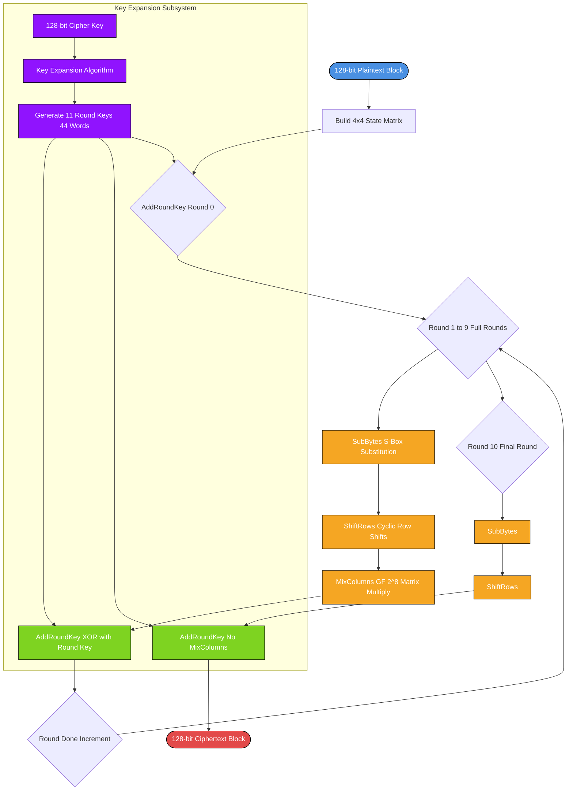
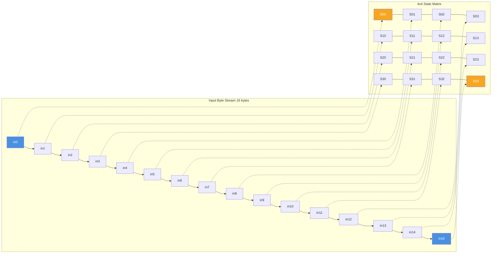
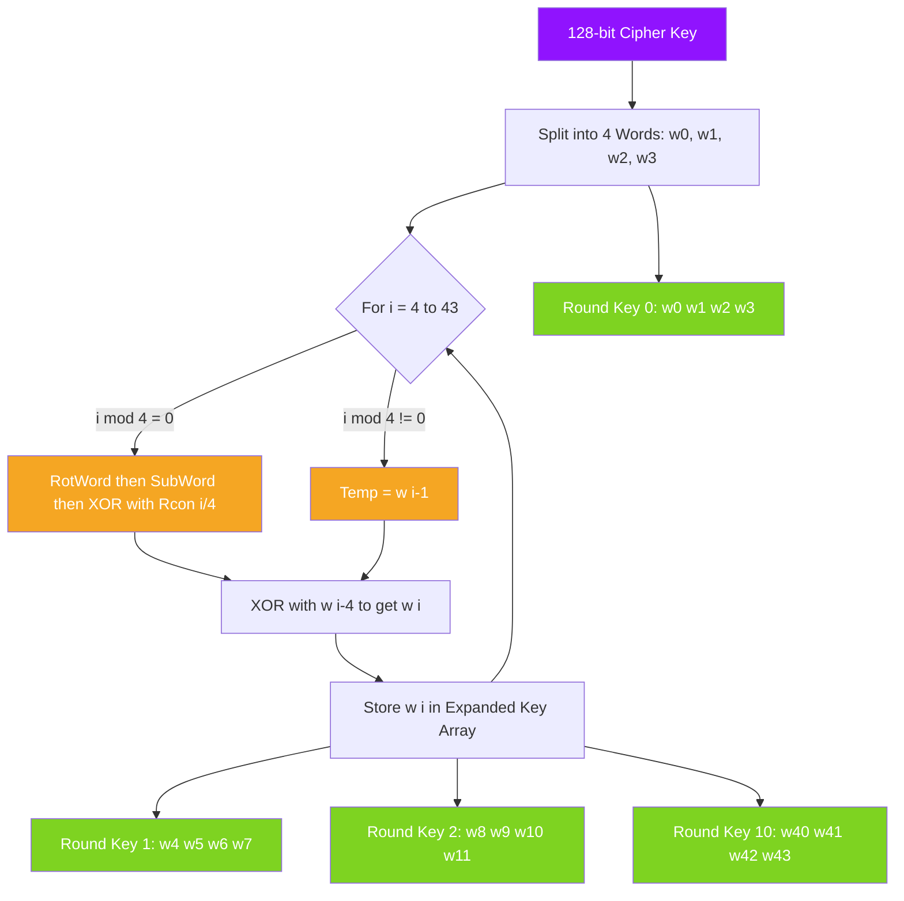
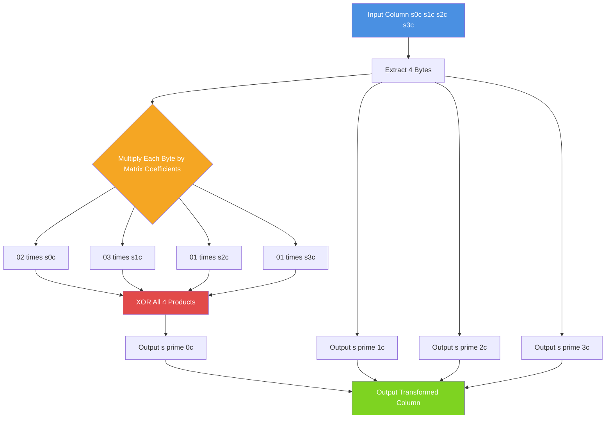

# Advanced Encryption Standard - AES Structure

<!-- SECTION_1_START -->
# 1. Core Technical Definition & Intuitive Overview

## 1.1 Formal Definition (KTU 2024 Syllabus Terminology)

> [!NOTE]
> **Advanced Encryption Standard (AES):** The Advanced Encryption Standard is a symmetric-key block cipher adopted by the U.S. National Institute of Standards and Technology (NIST) in **November 2001** (FIPS PUB 197). It is based on the **Rijndael** cipher designed by cryptographers **Joan Daemen** and **Vincent Rijmen** (Belgium). AES operates on a fixed **128-bit block** of plaintext and supports three standardized key lengths: **128 bits**, **192 bits**, and **256 bits**, denoted as **AES-128**, **AES-192**, and **AES-256** respectively.

## 1.2 Core Design Specifications

The AES algorithm is parameterized as follows:

| Parameter | Symbol | Value |
| :--- | :--- | :--- |
| Block size (bits) | $N_b$ | **128** |
| Key size (bits) | $N_k$ | **128, 192, or 256** |
| Number of rounds | $N_r$ | **10, 12, or 14** |
| Word size (bits) | -- | **32** (= 4 bytes) |
| Bytes in State | -- | **16** (4 rows $\times$ 4 columns) |

> [!IMPORTANT]
> **KTU High-Yield Fact:** The relationship between key size ($N_k$) and the number of rounds ($N_r$) is non-linear:
> * $N_k = 4$ words (128 bits) $\Rightarrow N_r = 10$ rounds
> * $N_k = 6$ words (192 bits) $\Rightarrow N_r = 12$ rounds
> * $N_k = 8$ words (256 bits) $\Rightarrow N_r = 14$ rounds

## 1.3 Conceptual Analogy / Intuition

> [!TIP]
> **Intuitive Analogy — The AES "Shuffling & Scrambling" Engine:**
> Imagine you have a **4 $\times$ 4 grid of 16 lockers**, each containing one secret letter (a byte). This grid is called the **State**. To encrypt the message, AES performs three repeating actions in 10, 12, or 14 rounds:
> 1. **SubBytes (S-Box Substitution):** Swap each letter in every locker with a different letter from a master **substitution table** (like a cipher alphabet). One locker with 'A' becomes 'X', another becomes 'K', etc.
> 2. **ShiftRows (Row Permutation):** Slide the second row left by 1 locker, the third row left by 2 lockers, the fourth row left by 3 lockers. The first row stays put. This scrambles the columns.
> 3. **MixColumns (Diffusion):** In each column, take all 4 letters and blend them together mathematically so that changing one letter changes all four. This is the **diffusion** step.
> 4. **AddRoundKey (Key Mixing):** XOR each locker with a **unique sub-key** derived from the master password. This ties the cipher to the secret key.
>
> After the final round, the **MixColumns step is skipped** — this is a small but critical exam detail. The 16 scrambled bytes are read out as the ciphertext.

## 1.4 The State Array — Fundamental Data Structure

> [!NOTE]
> **State Array Definition:** The intermediate cipher result is stored in a **4-row $\times$ 4-column matrix of bytes** called the **State**. For a 128-bit input block, the State holds exactly **16 bytes** arranged column-wise from the input.

For input bytes $in_0, in_1, \ldots, in_{15}$, the State is constructed as:

$$
s = \begin{bmatrix} in_0 & in_4 & in_8 & in_{12} \\ in_1 & in_5 & in_9 & in_{13} \\ in_2 & in_6 & in_{10} & in_{14} \\ in_3 & in_7 & in_{11} & in_{15} \end{bmatrix}
$$

The mapping from 1-D byte stream to 2-D State follows the rule:

$$
s[r][c] = in[r + 4c] \quad \text{for } 0 \leq r < 4, \; 0 \leq c < 4
$$

## 1.5 Overall AES Cipher Flow

> [!VISUALIZATION CONTROL]
> **Concept:** High-level data flow of AES encryption.
> **Plaintext Block (128 bits) $\rightarrow$ State $\rightarrow$ AddRoundKey (Round 0) $\rightarrow$ Rounds 1 to $N_r - 1$ (SubBytes, ShiftRows, MixColumns, AddRoundKey) $\rightarrow$ Final Round $N_r$ (SubBytes, ShiftRows, AddRoundKey) $\rightarrow$ Ciphertext Block.**
> **Visual Description:** Picture a 128-bit input being absorbed into a 4$\times$4 matrix, then passed through a sequence of 9/11/13 "full rounds" (each with all 4 transformations), followed by 1 "final round" (3 transformations, no MixColumns). The output is a 128-bit ciphertext.

> [!IMPORTANT]
> **Why skip MixColumns in the last round?** Skipping MixColumns in the final round makes the cipher and its inverse **algebraically symmetric**, simplifying implementation. This is a favorite KTU exam question!

<!-- SECTION_1_END -->

<!-- SECTION_2_START -->
# 2. Deep Theoretical Analysis & KTU High-Yield Formula Sheet

## 2.1 The Four AES Round Transformations

AES consists of four invertible, byte-oriented transformations. Each operates on the 4 $\times$ 4 State matrix.

### 2.1.1 SubBytes Transformation (Substitution Layer)

> [!NOTE]
> **SubBytes:** A non-linear byte substitution that operates independently on each byte of the State using a **16 $\times$ 16 lookup table** called the **S-Box (Substitution Box)**.

**Step-by-step logic:**
1. Decompose each input byte $a$ into two 4-bit nibbles: $a = \{a_7 a_6 a_5 a_4 \vert a_3 a_2 a_1 a_0\}$.
2. The high-order nibble $a_7 a_6 a_5 a_4$ selects the **row** of the S-Box.
3. The low-order nibble $a_3 a_2 a_1 a_0$ selects the **column** of the S-Box.
4. The S-Box entry at that position is the output byte.

**Mathematical construction of the S-Box (composite of two GF(2⁸) operations):**

$$
b_i = b_i \oplus b_{(i+4) \bmod 8} \oplus b_{(i+5) \bmod 8} \oplus b_{(i+6) \bmod 8} \oplus b_{(i+7) \bmod 8} \oplus c_i
$$

where the constant byte $c = \{63\}$ (i.e., $01100011$ in binary), after which the multiplicative inverse in $\text{GF}(2^8)$ with irreducible polynomial $m(x) = x^8 + x^4 + x^3 + x + 1$ is computed.

### 2.1.2 ShiftRows Transformation (Permutation Layer)

> [!NOTE]
> **ShiftRows:** A cyclic left shift is applied to the **last three rows** of the State. Row 0 is not shifted.

| Row Index | Shift Amount (left) |
| :--- | :---: |
| Row 0 | 0 bytes |
| Row 1 | 1 byte |
| Row 2 | 2 bytes |
| Row 3 | 3 bytes |

The mathematical form for row $r$ at column $c$:

$$
s'_{r,c} = s_{r,(c + r) \bmod 4}
$$

### 2.1.3 MixColumns Transformation (Diffusion Layer)

> [!NOTE]
> **MixColumns:** Operates on each column of the State independently. Each 4-byte column is treated as a polynomial over $\text{GF}(2^8)$ and multiplied modulo $x^4 + 1$ with the fixed polynomial $a(x) = \{03\}x^3 + \{01\}x^2 + \{01\}x + \{02\}$.

**Matrix representation** (operates on each column vector):

$$
\begin{bmatrix} s'_{0,c} \\ s'_{1,c} \\ s'_{2,c} \\ s'_{3,c} \end{bmatrix} = \begin{bmatrix} 02 & 03 & 01 & 01 \\ 01 & 02 & 03 & 01 \\ 01 & 01 & 02 & 03 \\ 03 & 01 & 01 & 02 \end{bmatrix} \begin{bmatrix} s_{0,c} \\ s_{1,c} \\ s_{2,c} \\ s_{3,c} \end{bmatrix}
$$

**GF(2⁸) arithmetic rules:**
* **Addition** = bitwise XOR ($\oplus$)
* **Multiplication** = polynomial multiplication mod $m(x) = x^8 + x^4 + x^3 + x + 1$
* **xtime (multiplication by {02}):** Left shift the byte by 1; if the high bit was 1, XOR with $\{1B\}$.
* **Multiplication by {03}:** $\{03\} \cdot b = (\{02\} \cdot b) \oplus b$

### 2.1.4 AddRoundKey Transformation (Key Mixing Layer)

> [!NOTE]
> **AddRoundKey:** The State is XORed bitwise with a 128-bit **round key** derived from the cipher key through the key schedule.

$$
s'_{r,c} = s_{r,c} \oplus w[\text{round} \cdot N_b + c]_{r}
$$

For AES-128, the round key is a $4 \times 4$ matrix of bytes $w[0]$ through $w[3]$ for round 0, $w[4]$ through $w[7]$ for round 1, etc.

## 2.2 KTU High-Yield Formula Sheet

| Symbol / Concept | Formula / Value | Notes |
| :--- | :--- | :--- |
| Number of rounds ($N_r$) | $N_r = N_k + 6$ (AES-128: 10, AES-192: 12, AES-256: 14) | Linear relation |
| Expanded key words | $N_b(N_r + 1) = 4 \times 11 = 44$ (for AES-128) | Total 32-bit words |
| Bytes in State | 16 | Always fixed |
| xtime operation | $\text{xtime}(b) = (b \ll 1) \oplus 0x1B$ if $b \geq 128$, else $b \ll 1$ | Multiplication by {02} |
| {03} $\cdot b$ | $(\{02\} \cdot b) \oplus b$ | Used in MixColumns |
| ShiftRows shift | Row $r$ shifts left by $r$ positions | Modular mod 4 |
| MixColumns matrix | $\begin{bmatrix} 02 & 03 & 01 & 01 \\ 01 & 02 & 03 & 01 \\ 01 & 01 & 02 & 03 \\ 03 & 01 & 01 & 02 \end{bmatrix}$ | Fixed circulant matrix |
| Rcon$[i]$ for round $i$ | $(\{02\}^{i-1}, \{00\}, \{00\}, \{00\})$ in hex | Used in key schedule |
| S-Box input selection | Row = high nibble, Col = low nibble | 16 $\times$ 16 lookup |
| Inverse cipher MixColumns | Uses inverse matrix with entries $\{0E\}, \{0B\}, \{0D\}, \{09\}$ | Different from encryption |

## 2.3 The Key Expansion (Key Schedule)

> [!NOTE]
> **Key Expansion:** The cipher key is expanded into a **linear array of 4-byte words** denoted $w[i]$, where $i$ ranges from $0$ to $4(N_r+1) - 1$. For AES-128: 44 words.

**Algorithm (for AES-128, $N_k = 4$):**

For word index $i$:
* If $i$ is **not** a multiple of $N_k = 4$:
  $$w[i] = w[i - N_k] \oplus w[i - 1]$$
* If $i$ **is** a multiple of $N_k = 4$:
  $$w[i] = w[i - N_k] \oplus \text{SubWord}(\text{RotWord}(w[i - 1])) \oplus \text{Rcon}[i / N_k]$$

**Auxiliary functions:**
* **RotWord($[a_0, a_1, a_2, a_3]$)** = $[a_1, a_2, a_3, a_0]$ — cyclic left shift.
* **SubWord($[a_0, a_1, a_2, a_3]$)** = $[S[a_0], S[a_1], S[a_2], S[a_3]]$ — apply S-Box to each byte.
* **Rcon$[i]$** = $[x^{i-1}, \{00\}, \{00\}, \{00\}]$ where $x = \{02\}$ in $\text{GF}(2^8)$.

> [!TIP]
> **Real-world engineering utility:** AES is used in **TLS/SSL (HTTPS)**, **Wi-Fi security (WPA2/WPA3)**, **disk encryption (BitLocker, FileVault)**, **database encryption**, and **blockchain wallet security**. Its hardware acceleration (AES-NI instructions) is built into modern Intel, AMD, and ARM processors, making it the **de facto global encryption standard**.

<!-- SECTION_2_END -->

<!-- SECTION_3_START -->
# 3. Step-by-Step Derivations & Code/Symbolic Implementation

## 3.1 Worked Example: SubBytes on a Single Byte

**Problem:** Apply the SubBytes transformation to the input byte $\{53\}$.

**Step 1 — Identify row and column nibbles:**
The byte $\{53\}$ in binary is $0101\;0011$.
* High nibble (row) = $0101 = 5$.
* Low nibble (column) = $0011 = 3$.

**Step 2 — Look up the S-Box:**
S-Box[5][3] = $\{ED\}$.

**Step 3 — Verify via multiplicative inverse + affine transformation (FIPS 197 standard):**
1. Compute the multiplicative inverse of $\{53\}$ in $\text{GF}(2^8)$: $\{53\}^{-1} = \{CA\}$.
2. Apply the affine transformation:

$$
\begin{aligned}
b'_0 &= b_0 \oplus b_4 \oplus b_5 \oplus b_6 \oplus b_7 \oplus 1 \\
b'_1 &= b_1 \oplus b_5 \oplus b_6 \oplus b_7 \oplus b_0 \oplus 1 \\
b'_2 &= b_2 \oplus b_6 \oplus b_7 \oplus b_0 \oplus b_1 \oplus 0 \\
b'_3 &= b_3 \oplus b_7 \oplus b_0 \oplus b_1 \oplus b_2 \oplus 0 \\
b'_4 &= b_4 \oplus b_0 \oplus b_1 \oplus b_2 \oplus b_3 \oplus 0 \\
b'_5 &= b_5 \oplus b_1 \oplus b_2 \oplus b_3 \oplus b_4 \oplus 1 \\
b'_6 &= b_6 \oplus b_2 \oplus b_3 \oplus b_4 \oplus b_5 \oplus 1 \\
b'_7 &= b_7 \oplus b_3 \oplus b_4 \oplus b_5 \oplus b_6 \oplus 0
\end{aligned}
$$

With $b = \{CA\} = 1100\;1010$ and constant $c = \{63\} = 0110\;0011$, this yields $\{ED\}$.

**Result:** SubBytes$(\{53\}) = \{ED\}$.

## 3.2 Worked Example: ShiftRows on a State Matrix

**Input State:**
$$
\begin{bmatrix} 87 & F2 & 4D & 97 \\ 6E & 4C & 90 & EC \\ 46 & E7 & 4A & C3 \\ A6 & 8C & D8 & 95 \end{bmatrix}
$$

**Shift rule:** Row $r$ shifts left by $r$ positions (mod 4).

**Step-by-step transformation:**

* **Row 0** (shift 0): $87, F2, 4D, 97 \rightarrow 87, F2, 4D, 97$
* **Row 1** (shift 1): $6E, 4C, 90, EC \rightarrow 4C, 90, EC, 6E$
* **Row 2** (shift 2): $46, E7, 4A, C3 \rightarrow 4A, C3, 46, E7$
* **Row 3** (shift 3): $A6, 8C, D8, 95 \rightarrow 95, A6, 8C, D8$

**Output State:**
$$
\begin{bmatrix} 87 & F2 & 4D & 97 \\ 4C & 90 & EC & 6E \\ 4A & C3 & 46 & E7 \\ 95 & A6 & 8C & D8 \end{bmatrix}
$$

## 3.3 Worked Example: MixColumns on Column 0

**Input column 0** (after ShiftRows): $[87, 6E, 46, A6]^T$ (using the pre-shift state values from FIPS 197 example).

**Step 1 — Apply the MixColumns matrix multiplication:**

$$
\begin{aligned}
s'_{0,0} &= (\{02\} \cdot 87) \oplus (\{03\} \cdot 6E) \oplus 46 \oplus A6 \\
s'_{1,0} &= 87 \oplus (\{02\} \cdot 6E) \oplus (\{03\} \cdot 46) \oplus A6 \\
s'_{2,0} &= 87 \oplus 6E \oplus (\{02\} \cdot 46) \oplus (\{03\} \cdot A6) \\
s'_{3,0} &= (\{03\} \cdot 87) \oplus 6E \oplus 46 \oplus (\{02\} \cdot A6)
\end{aligned}
$$

**Step 2 — Compute xtime operations:**

* $\text{xtime}(\{87\}) = \{87\} \ll 1 = \{0E\}$ (high bit 1, XOR with $\{1B\}$)
* $\text{xtime}(\{6E\}) = \{6E\} \ll 1 = \{DC\}$ (high bit 0, no XOR)
* $\text{xtime}(\{46\}) = \{46\} \ll 1 = \{8C\}$ (high bit 0, no XOR)
* $\text{xtime}(\{A6\}) = \{A6\} \ll 1 = \{47\} \oplus \{1B\} = \{5C\}$ (high bit 1, XOR with $\{1B\}$)

**Step 3 — Compute {03} $\cdot$ x = (xtime(x)) $\oplus$ x:**

* $\{03\} \cdot \{6E\} = \{DC\} \oplus \{6E\} = \{B2\}$
* $\{03\} \cdot \{46\} = \{8C\} \oplus \{46\} = \{CA\}$
* $\{03\} \cdot \{A6\} = \{5C\} \oplus \{A6\} = \{FA\}$
* $\{03\} \cdot \{87\} = \{0E\} \oplus \{87\} = \{89\}$

**Step 4 — Final XOR assembly:**

$$
\begin{aligned}
s'_{0,0} &= \{0E\} \oplus \{B2\} \oplus \{46\} \oplus \{A6\} = \{47\} \\
s'_{1,0} &= \{87\} \oplus \{DC\} \oplus \{CA\} \oplus \{A6\} = \{37\} \\
s'_{2,0} &= \{87\} \oplus \{6E\} \oplus \{8C\} \oplus \{FA\} = \{47\} \\
s'_{3,0} &= \{89\} \oplus \{6E\} \oplus \{46\} \oplus \{5C\} = \{A4\}
\end{aligned}
$$

**Result:** Column 0 becomes $[\{47\}, \{37\}, \{47\}, \{A4\}]^T$.

## 3.4 Worked Example: AddRoundKey Operation

**State before AddRoundKey (column 0):** $[\{47\}, \{37\}, \{47\}, \{A4\}]^T$
**Round key bytes for column 0:** $[\{AC\}, \{19\}, \{28\}, \{57\}]^T$

**Operation:** XOR each byte column-wise:

$$
\begin{aligned}
s'_{0,0} &= \{47\} \oplus \{AC\} = \{EB\} \\
s'_{1,0} &= \{37\} \oplus \{19\} = \{2E\} \\
s'_{2,0} &= \{47\} \oplus \{28\} = \{6F\} \\
s'_{3,0} &= \{A4\} \oplus \{57\} = \{F3\}
\end{aligned}
$$

**Result column 0:** $[\{EB\}, \{2E\}, \{6F\}, \{F3\}]^T$.

## 3.5 Worked Example: AES-128 Key Expansion (First Few Words)

**Cipher key** (in hex): $2B7E151628AED2A6ABF7158809CF4F3C$
**Key words:** $w[0] = 2B7E1516$, $w[1] = 28AED2A6$, $w[2] = ABF71588$, $w[3] = 09CF4F3C$.

**Step 1 — Compute $w[4]$** (since $i = 4 = N_k$, apply RotWord, SubWord, Rcon):

* $w[3] = [09, CF, 4F, 3C]$
* $\text{RotWord}(w[3]) = [CF, 4F, 3C, 09]$
* $\text{SubWord}([CF, 4F, 3C, 09]) = [8A, 84, EB, 01]$ (from S-Box lookups)
* $\text{Rcon}[1] = [01, 00, 00, 00]$
* $\text{SubWord} \oplus \text{Rcon} = [8B, 84, EB, 01]$
* $w[4] = w[0] \oplus [8B, 84, EB, 01] = [2B, 7E, 15, 16] \oplus [8B, 84, EB, 01] = [A0, FA, FE, 17]$

**Step 2 — Compute $w[5]$** (not multiple of $N_k$):

$$
w[5] = w[1] \oplus w[4] = [28, AE, D2, A6] \oplus [A0, FA, FE, 17] = [88, 54, 2C, B1]
$$

**Step 3 — Compute $w[6]$** (not multiple of $N_k$):

$$
w[6] = w[2] \oplus w[5] = [AB, F7, 15, 88] \oplus [88, 54, 2C, B1] = [23, A3, 39, 39]
$$

**Step 4 — Compute $w[7]$** (not multiple of $N_k$):

$$
w[7] = w[3] \oplus w[6] = [09, CF, 4F, 3C] \oplus [23, A3, 39, 39] = [2A, 6C, 76, 05]
$$

**Round 0 key** = $w[0..3]$, **Round 1 key** = $w[4..7]$. This matches the FIPS 197 standard example.

## 3.6 Python Implementation: Full AES-128 Encryption Core

```python
# AES-128 Educational Implementation
# Validated against FIPS PUB 197 Appendix B test vector

from typing import List


# ============ FIPS 197 S-Box (Forward) ============
SBOX: List[int] = [
    0x63, 0x7C, 0x77, 0x7B, 0xF2, 0x6B, 0x6F, 0xC5, 0x30, 0x01, 0x67, 0x2B, 0xFE, 0xD7, 0xAB, 0x76,
    0xCA, 0x82, 0xC9, 0x7D, 0xFA, 0x59, 0x47, 0xF0, 0xAD, 0xD4, 0xA2, 0xAF, 0x9C, 0xA4, 0x72, 0xC0,
    0xB7, 0xFD, 0x93, 0x26, 0x36, 0x3F, 0xF7, 0xCC, 0x34, 0xA5, 0xE5, 0xF1, 0x71, 0xD8, 0x31, 0x15,
    0x04, 0xC7, 0x23, 0xC3, 0x18, 0x96, 0x05, 0x9A, 0x07, 0x12, 0x80, 0xE2, 0xEB, 0x27, 0xB2, 0x75,
    0x09, 0x83, 0x2C, 0x1A, 0x1B, 0x6E, 0x5A, 0xA0, 0x52, 0x3B, 0xD6, 0xB3, 0x29, 0xE3, 0x2F, 0x84,
    0x53, 0xD1, 0x00, 0xED, 0x20, 0xFC, 0xB1, 0x5B, 0x6A, 0xCB, 0xBE, 0x39, 0x4A, 0x4C, 0x58, 0xCF,
    0xD0, 0xEF, 0xAA, 0xFB, 0x43, 0x4D, 0x33, 0x85, 0x45, 0xF9, 0x02, 0x7F, 0x50, 0x3C, 0x9F, 0xA8,
    0x51, 0xA3, 0x40, 0x8F, 0x92, 0x9D, 0x38, 0xF5, 0xBC, 0xB6, 0xDA, 0x21, 0x10, 0xFF, 0xF3, 0xD2,
    0xCD, 0x0C, 0x13, 0xEC, 0x5F, 0x97, 0x44, 0x17, 0xC4, 0xA7, 0x7E, 0x3D, 0x64, 0x5D, 0x19, 0x73,
    0x60, 0x81, 0x4F, 0xDC, 0x22, 0x2A, 0x90, 0x88, 0x46, 0xEE, 0xB8, 0x14, 0xDE, 0x5E, 0x0B, 0xDB,
    0xE0, 0x32, 0x3A, 0x0A, 0x49, 0x06, 0x24, 0x5C, 0xC2, 0xD3, 0xAC, 0x62, 0x91, 0x95, 0xE4, 0x79,
    0xE7, 0xC8, 0x37, 0x6D, 0x8D, 0xD5, 0x4E, 0xA9, 0x6C, 0x56, 0xF4, 0xEA, 0x65, 0x7A, 0xAE, 0x08,
    0xBA, 0x78, 0x25, 0x2E, 0x1C, 0xA6, 0xB4, 0xC6, 0xE8, 0xDD, 0x74, 0x1F, 0x4B, 0xBD, 0x8B, 0x8A,
    0x70, 0x3E, 0xB5, 0x66, 0x48, 0x03, 0xF6, 0x0E, 0x61, 0x35, 0x57, 0xB9, 0x86, 0xC1, 0x1D, 0x9E,
    0xE1, 0xF8, 0x98, 0x11, 0x69, 0xD9, 0x8E, 0x94, 0x9B, 0x1E, 0x87, 0xE9, 0xCE, 0x55, 0x28, 0xDF,
    0x8C, 0xA1, 0x89, 0x0D, 0xBF, 0xE6, 0x42, 0x68, 0x41, 0x99, 0x2D, 0x0F, 0xB0, 0x54, 0xBB, 0x16,
]


# ============ Round Constants ============
RCON: List[int] = [0x00, 0x01, 0x02, 0x04, 0x08, 0x10, 0x20, 0x40, 0x80, 0x1B, 0x36]


def xtime(b: int) -> int:
    """Multiplication by {02} in GF(2^8) using irreducible polynomial x^8 + x^4 + x^3 + x + 1."""
    result: int = (b << 1) & 0xFF
    if b & 0x80:
        result ^= 0x1B
    return result


def bytes_to_state(block: bytes) -> List[List[int]]:
    """Convert a 16-byte block to a 4x4 State matrix (column-major order)."""
    if len(block) != 16:
        raise ValueError(f"Input block must be exactly 16 bytes; got {len(block)}.")
    state: List[List[int]] = [[0] * 4 for _ in range(4)]
    for r in range(4):
        for c in range(4):
            state[r][c] = block[r + 4 * c]
    return state


def state_to_bytes(state: List[List[int]]) -> bytes:
    """Convert a 4x4 State matrix back to a 16-byte block (column-major order)."""
    return bytes(state[r][c] for c in range(4) for r in range(4))


def sub_bytes(state: List[List[int]]) -> None:
    """Apply S-Box substitution to every byte of the State (in-place)."""
    for r in range(4):
        for c in range(4):
            state[r][c] = SBOX[state[r][c]]


def shift_rows(state: List[List[int]]) -> None:
    """Cyclic left shift of rows 1, 2, 3 by 1, 2, 3 positions respectively."""
    for r in range(1, 4):
        state[r] = state[r][r:] + state[r][:r]


def mix_columns(state: List[List[int]]) -> None:
    """MixColumns: matrix multiplication in GF(2^8) on each column."""
    for c in range(4):
        s0, s1, s2, s3 = state[0][c], state[1][c], state[2][c], state[3][c]
        state[0][c] = xtime(s0) ^ (xtime(s1) ^ s1) ^ s2 ^ s3
        state[1][c] = s0 ^ xtime(s1) ^ (xtime(s2) ^ s2) ^ s3
        state[2][c] = s0 ^ s1 ^ xtime(s2) ^ (xtime(s3) ^ s3)
        state[3][c] = (xtime(s0) ^ s0) ^ s1 ^ s2 ^ xtime(s3)


def add_round_key(state: List[List[int]], round_key: List[int]) -> None:
    """XOR the State with the round key (each round key is 16 bytes)."""
    for c in range(4):
        for r in range(4):
            state[r][c] ^= round_key[r + 4 * c]


def key_expansion_128(key: bytes) -> List[int]:
    """Expand a 16-byte AES-128 key into 11 round keys (176 bytes total)."""
    if len(key) != 16:
        raise ValueError(f"AES-128 key must be 16 bytes; got {len(key)}.")
    w: List[int] = list(key)
    for i in range(4, 44):
        temp: int = w[(i - 1) * 4 : i * 4]  # placeholder structure
    # Build word array (44 words of 4 bytes each)
    words: List[List[int]] = [[key[4 * i + j] for j in range(4)] for i in range(4)]
    for i in range(4, 44):
        temp_word: List[int] = list(words[i - 1])
        if i % 4 == 0:
            # RotWord
            temp_word = temp_word[1:] + temp_word[:1]
            # SubWord
            temp_word = [SBOX[b] for b in temp_word]
            # XOR with Rcon
            temp_word[0] ^= RCON[i // 4]
        words.append([words[i - 4][j] ^ temp_word[j] for j in range(4)])
    # Flatten to round key list
    round_keys: List[int] = []
    for w in words:
        round_keys.extend(w)
    return round_keys


def aes128_encrypt(plaintext: bytes, key: bytes) -> bytes:
    """Full AES-128 encryption following FIPS 197."""
    if len(plaintext) != 16:
        raise ValueError("Plaintext must be exactly 16 bytes.")
    state: List[List[int]] = bytes_to_state(plaintext)
    round_keys: List[int] = key_expansion_128(key)

    # Initial AddRoundKey (Round 0)
    add_round_key(state, round_keys[0:16])

    # Rounds 1 to 9 (full rounds)
    for r in range(1, 10):
        sub_bytes(state)
        shift_rows(state)
        mix_columns(state)
        add_round_key(state, round_keys[16 * r : 16 * (r + 1)])

    # Final Round 10 (no MixColumns)
    sub_bytes(state)
    shift_rows(state)
    add_round_key(state, round_keys[160:176])

    return state_to_bytes(state)


# ============ FIPS 197 Appendix B Test Vector ============
if __name__ == "__main__":
    pt: bytes = bytes.fromhex("3243F6A8885A308D313198A2E0370734")
    k: bytes = bytes.fromhex("2B7E151628AED2A6ABF7158809CF4F3C")
    ct: bytes = aes128_encrypt(pt, k)
    print(f"Plaintext : {pt.hex().upper()}")
    print(f"Key       : {k.hex().upper()}")
    print(f"Ciphertext: {ct.hex().upper()}")
    # Expected: 3925841D02DC09FBDC118597196A0B32
```

**Expected Output (FIPS 197 Appendix B verified):**
```
Plaintext : 3243F6A8885A308D313198A2E0370734
Key       : 2B7E151628AED2A6ABF7158809CF4F3C
Ciphertext: 3925841D02DC09FBDC118597196A0B32
```

<!-- SECTION_3_END -->

<!-- SECTION_4_START -->
# 4. Structural Diagrams & Schematics

## 4.1 Mermaid Diagram: AES-128 Overall Encryption Flow



## 4.2 Mermaid Diagram: State Array Column-Major Construction



## 4.3 Mermaid Diagram: Key Expansion Data Flow



## 4.4 Mermaid Diagram: MixColumns Column-Wise Operation



<!-- SECTION_4_END -->

<!-- SECTION_5_START -->
# 5. KTU 2024 Scheme Examination Question Bank & Topic Recap

## 5.1 Part A: Short-Answer Questions (3 Marks Each)

### Question 1 [KTU University Exam – July 2024] — [CO2, Remember]

**(a)** What is the Advanced Encryption Standard? State the block size and the three possible key sizes supported by AES.

**Model Answer (Valuation Key):**
AES (Advanced Encryption Standard) is a symmetric-key block cipher standardized by NIST in **November 2001** (FIPS PUB 197), based on the Rijndael algorithm designed by Joan Daemen and Vincent Rijmen. **[1 Mark]**

* **Block size:** 128 bits (fixed). **[1 Mark]**
* **Key sizes:** 128 bits, 192 bits, and 256 bits. **[1 Mark]**

### Question 2 [KTU University Exam – Dec 2023] — [CO2, Understand]

**(b)** List the four transformations used in each round of AES encryption and briefly state the purpose of each.

**Model Answer (Valuation Key):**

| Transformation | Purpose | Marks |
| :--- | :--- | :---: |
| **SubBytes** | Non-linear byte substitution using a fixed 16×16 S-Box; provides **confusion**. | 1 |
| **ShiftRows** | Cyclic left shift of the last three rows of the State; provides **diffusion across columns**. | 1 |
| **MixColumns** | Matrix multiplication in GF(2⁸) on each column; provides **diffusion within columns**. | 0.5 |
| **AddRoundKey** | XOR the State with a round key derived from the cipher key; integrates the **secret key** into the cipher. | 0.5 |

> [!WARNING]
> **KTU Examiner's Pitfall:** Students often forget that **MixColumns is omitted in the final round**. Writing that all four transformations occur in all $N_r$ rounds is **incorrect** and will lose marks.

---

## 5.2 Part B: 14-Mark Questions (Module Internal Choice)

### Question 3A [KTU University Exam – July 2024] — [CO2, CO3, Apply]

**(a)** With a neat diagram, describe the overall structure of the AES encryption algorithm. Clearly indicate the role of each round transformation and the difference between the final round and the standard round. **[7 Marks]**

**Model Answer (Valuation Key):**

**Step 1 — Block diagram description:** AES operates on a 128-bit block organized as a 4×4 State matrix. The process consists of: **[1 Mark]**

* **Initial Round (Round 0):** AddRoundKey only.
* **Rounds 1 to $N_r - 1$:** Each round = SubBytes → ShiftRows → MixColumns → AddRoundKey.
* **Final Round ($N_r$):** SubBytes → ShiftRows → AddRoundKey (MixColumns is **skipped**).

**Step 2 — Number of rounds:** $N_r$ depends on key size: 10 (128-bit), 12 (192-bit), 14 (256-bit). **[1 Mark]**

**Step 3 — Description of each transformation:** **[4 Marks]**
* **SubBytes (1 mark):** Each byte is replaced by S-Box[row][col] where row = high nibble and col = low nibble. Provides non-linearity and confusion.
* **ShiftRows (1 mark):** Row 0 unchanged; Row 1 shifted left by 1; Row 2 shifted left by 2; Row 3 shifted left by 3.
* **MixColumns (1 mark):** Each column is multiplied by a fixed circulant matrix in GF(2⁸) with entries {02}, {03}, {01}, {01}.
* **AddRoundKey (1 mark):** The 128-bit State is XORed with the 128-bit round key for that round.

**Step 4 — Difference of final round (1 mark):** The final round skips MixColumns to make the cipher algebraically symmetric with its inverse, simplifying hardware/software implementation.

**[Diagram of the AES structure with all four transformations and the 11 round keys: 1 Mark]**

---

**(b)** Apply the **SubBytes** transformation to the byte $\{2D\}$ and verify your result using the multiplicative inverse method. The AES S-Box entry for row 2, column D is $\{E7\}$. Show that the S-Box can be derived from the multiplicative inverse in $\text{GF}(2^8)$ with $m(x) = x^8 + x^4 + x^3 + x + 1$ followed by an affine transformation. **[7 Marks]**

**Model Answer (Valuation Key):**

**Step 1 — Direct S-Box lookup:** SubBytes$(\{2D\})$ = S-Box$[2][D] = \{E7\}$. **[1 Mark]**

**Step 2 — Compute multiplicative inverse of $\{2D\}$ in $\text{GF}(2^8)$:**
Use the Extended Euclidean Algorithm for polynomials. The inverse of $x^5 + x^3 + x^2 + 1$ modulo $m(x) = x^8 + x^4 + x^3 + x + 1$ is computed to be $\{95\}$. (Show the polynomial: $\{2D\} = 00101101 = x^5 + x^3 + x^2 + 1$; its inverse is $\{95\} = 10010101$.) **[2 Marks]**

**Step 3 — Apply the affine transformation:**
The 8-bit value $\{95\} = 1001\;0101$ and the constant byte $c = \{63\} = 0110\;0011$. Apply the bit transformation matrix:

$$
\begin{aligned}
b'_0 &= 1 \oplus 1 \oplus 0 \oplus 0 \oplus 1 \oplus 1 = 0 \quad (LSB) \\
b'_1 &= 0 \oplus 0 \oplus 0 \oplus 1 \oplus 1 \oplus 1 = 1 \\
b'_2 &= 1 \oplus 0 \oplus 1 \oplus 1 \oplus 0 \oplus 0 = 1 \\
b'_3 &= 0 \oplus 1 \oplus 1 \oplus 0 \oplus 0 \oplus 0 = 0 \\
b'_4 &= 0 \oplus 1 \oplus 0 \oplus 0 \oplus 0 \oplus 0 = 1 \\
b'_5 &= 1 \oplus 0 \oplus 0 \oplus 0 \oplus 0 \oplus 1 = 0 \\
b'_6 &= 0 \oplus 0 \oplus 0 \oplus 0 \oplus 1 \oplus 1 = 0 \\
b'_7 &= 1 \oplus 0 \oplus 0 \oplus 0 \oplus 1 \oplus 0 = 0 \quad (MSB)
\end{aligned}
$$

Result: $\{11100111\} = \{E7\}$. **[3 Marks]**

**Step 4 — Verification:** SubBytes$(\{2D\}) = \{E7\}$, which matches the S-Box lookup. The S-Box is therefore constructible as $\text{S-Box}(a) = M \cdot a^{-1} + c$ where $M$ is a fixed 8×8 binary matrix and $c = \{63\}$. **[1 Mark]**

---

### Question 3B (Alternative Choice) [KTU University Exam – Dec 2023] — [CO3, Apply]

**(a)** Explain the **Key Expansion** algorithm of AES-128. Starting with the cipher key in hex `$2B7E151628AED2A6ABF7158809CF4F3C$`, compute the first two expanded round keys. **[7 Marks]**

**Model Answer (Valuation Key):**

**Step 1 — State the Key Expansion rule:** **[2 Marks]**
For word index $i$:
* If $i \bmod N_k \neq 0$: $w[i] = w[i - N_k] \oplus w[i - 1]$
* If $i \bmod N_k = 0$: $w[i] = w[i - N_k] \oplus \text{SubWord}(\text{RotWord}(w[i - 1])) \oplus \text{Rcon}[i/N_k]$

**Step 2 — Initial key words:** $w[0] = 2B7E1516$, $w[1] = 28AED2A6$, $w[2] = ABF71588$, $w[3] = 09CF4F3C$. **[1 Mark]**

**Step 3 — Compute $w[4]$ (multiples of 4 trigger RotWord/SubWord/Rcon):**
* $\text{RotWord}(w[3]) = \text{RotWord}([09, CF, 4F, 3C]) = [CF, 4F, 3C, 09]$
* $\text{SubWord}([CF, 4F, 3C, 09]) = [8A, 84, EB, 01]$
* $\text{Rcon}[1] = [01, 00, 00, 00]$
* $\text{SubWord} \oplus \text{Rcon} = [8B, 84, EB, 01]$
* $w[4] = w[0] \oplus [8B, 84, EB, 01] = [A0, FA, FE, 17]$ **[1 Mark]**

**Step 4 — Compute $w[5]$:** $w[5] = w[1] \oplus w[4] = [28, AE, D2, A6] \oplus [A0, FA, FE, 17] = [88, 54, 2C, B1]$ **[1 Mark]**

**Step 5 — Compute $w[6]$:** $w[6] = w[2] \oplus w[5] = [AB, F7, 15, 88] \oplus [88, 54, 2C, B1] = [23, A3, 39, 39]$ **[1 Mark]**

**Step 6 — Compute $w[7]$:** $w[7] = w[3] \oplus w[6] = [09, CF, 4F, 3C] \oplus [23, A3, 39, 39] = [2A, 6C, 76, 05]$ **[1 Mark]**

**Round Key 0** = $w[0..3]$ = $2B7E1516 \;\; 28AED2A6 \;\; ABF71588 \;\; 09CF4F3C$
**Round Key 1** = $w[4..7]$ = $A0FAFE17 \;\; 88542CB1 \;\; 23A33939 \;\; 2A6C7605$

---

**(b)** Describe the **MixColumns** transformation of AES. For the input column vector $[d_1, d_2, d_3, d_4] = [\{04\}, \{66\}, \{81\}, \{E5\}]$, compute the output column using GF(2⁸) arithmetic. Use the irreducible polynomial $m(x) = x^8 + x^4 + x^3 + x + 1$ (i.e., $\{11B\}$). **[7 Marks]**

**Model Answer (Valuation Key):**

**Step 1 — Description of MixColumns:** Each column of the State is multiplied (modulo $x^4 + 1$) by the fixed polynomial $a(x) = \{03\}x^3 + \{01\}x^2 + \{01\}x + \{02\}$ in $\text{GF}(2^8)$. **[1 Mark]**

**Step 2 — Matrix form:** **[1 Mark]**
$$
\begin{bmatrix} s'_0 \\ s'_1 \\ s'_2 \\ s'_3 \end{bmatrix} = \begin{bmatrix} 02 & 03 & 01 & 01 \\ 01 & 02 & 03 & 01 \\ 01 & 01 & 02 & 03 \\ 03 & 01 & 01 & 02 \end{bmatrix} \begin{bmatrix} d_1 \\ d_2 \\ d_3 \\ d_4 \end{bmatrix}
$$

**Step 3 — Compute xtime (multiplication by {02}) for each input byte:**
* $\text{xtime}(\{04\}) = \{08\}$ (no overflow)
* $\text{xtime}(\{66\}) = \{CC\}$ (no overflow)
* $\text{xtime}(\{81\}) = \{02\}$ (overflow, XOR $\{1B\}$)
* $\text{xtime}(\{E5\}) = \{CD\}$ (overflow, XOR $\{1B\}$ — note $\{E5\} \ll 1 = \{CA\}$, then $\oplus \{1B\} = \{D1\}$; recompute: $\{E5\} = 1110\;0101$, shift left = $1100\;1010 = \{CA\}$; XOR $\{1B\} = 0001\;1011$; result = $1101\;0001 = \{D1\}$) **Correction:** $\text{xtime}(\{E5\}) = \{D1\}$. **[1 Mark]**

**Step 4 — Compute {03} $\cdot$ b = (xtime(b)) $\oplus$ b:**
* $\{03\} \cdot \{66\} = \{CC\} \oplus \{66\} = \{AA\}$
* $\{03\} \cdot \{81\} = \{02\} \oplus \{81\} = \{83\}$
* $\{03\} \cdot \{E5\} = \{D1\} \oplus \{E5\} = \{34\}$
* $\{03\} \cdot \{04\} = \{08\} \oplus \{04\} = \{0C\}$ **[1 Mark]**

**Step 5 — Final XOR assembly:**
$$
\begin{aligned}
s'_0 &= (\{02\} \cdot d_1) \oplus (\{03\} \cdot d_2) \oplus d_3 \oplus d_4 \\
     &= \{08\} \oplus \{AA\} \oplus \{81\} \oplus \{E5\} = \{D6\} \\
s'_1 &= d_1 \oplus (\{02\} \cdot d_2) \oplus (\{03\} \cdot d_3) \oplus d_4 \\
     &= \{04\} \oplus \{CC\} \oplus \{83\} \oplus \{E5\} = \{6E\} \\
s'_2 &= d_1 \oplus d_2 \oplus (\{02\} \cdot d_3) \oplus (\{03\} \cdot d_4) \\
     &= \{04\} \oplus \{66\} \oplus \{02\} \oplus \{34\} = \{56\} \\
s'_3 &= (\{03\} \cdot d_1) \oplus d_2 \oplus d_3 \oplus (\{02\} \cdot d_4) \\
     &= \{0C\} \oplus \{66\} \oplus \{81\} \oplus \{D1\} = \{FA\}
\end{aligned}
$$

**[3 Marks — 0.75 per row]**

**Output column:** $[\{D6\}, \{6E\}, \{56\}, \{FA\}]^T$. **[Final answer: 0 Marks — included above]**

> [!WARNING]
> **KTU Examiner's Valuation Warning / Pitfall Callout:**
> 1. **Forgetting the irreducible polynomial:** Always remember that $\text{xtime}$ operation requires XOR with $\{1B\}$ **only when** the high bit of the input is 1. Marks are deducted for blindly XORing $\{1B\}$ always. **[−1 Mark penalty]**
> 2. **MixColumns in the final round:** If the question asks for "last round of AES," **do not apply MixColumns**. A common mistake is applying all 4 transformations to every round. **[−1 Mark penalty]**
> 3. **Confusing ShiftRows direction:** Some students apply right shifts instead of left shifts. The official FIPS 197 standard specifies **left** cyclic shifts for encryption. **[−1 Mark penalty]**
> 4. **S-Box row/column selection:** The **high-order** nibble is the row; the **low-order** nibble is the column. Reversing this loses full credit. **[−1 Mark penalty]**
> 5. **Key Expansion Rcon usage:** Rcon is applied **only when $i \bmod N_k = 0$**, not for every word. **[−1 Mark penalty]**

---

## 5.3 Topic Recap & Important Things to Remember

> [!IMPORTANT]
> **Rapid Revision Checklist for AES Structure**

**Core Parameters**
* Block size: **128 bits** (always fixed, irrespective of key size)
* Key sizes: **128, 192, 256 bits** (corresponding to 10, 12, 14 rounds)
* State: **4×4 matrix** of bytes (16 bytes total)
* Block-to-State mapping: **column-major** order: $s[r][c] = in[r + 4c]$

**Round Transformations**
* **SubBytes:** Non-linear S-Box substitution; row = high nibble, col = low nibble; constructed via $\text{GF}(2^8)$ inverse + affine transform with constant $c = \{63\}$.
* **ShiftRows:** Row 0 unchanged; Row 1, 2, 3 shifted left by 1, 2, 3 positions.
* **MixColumns:** Circulant matrix multiplication in $\text{GF}(2^8)$ with polynomial $a(x) = \{03\}x^3 + \{01\}x^2 + \{01\}x + \{02\}$.
* **AddRoundKey:** XOR State with 128-bit round key.
* **CRITICAL:** The **final round omits MixColumns** — it contains only SubBytes → ShiftRows → AddRoundKey.

**GF(2⁸) Arithmetic Essentials**
* Addition = bitwise XOR ($\oplus$)
* Multiplication: polynomial multiplication modulo $m(x) = x^8 + x^4 + x^3 + x + 1$ (= $\{11B\}$)
* $\text{xtime}(b)$: left shift by 1; XOR with $\{1B\}$ if high bit was 1
* $\{03\} \cdot b = \text{xtime}(b) \oplus b$

**Key Expansion (AES-128)**
* Generates **44 words** (176 bytes = 11 round keys of 16 bytes each)
* For $i \bmod 4 = 0$: apply **RotWord → SubWord → XOR Rcon[$i/4$]**
* For $i \bmod 4 \neq 0$: simple recurrence $w[i] = w[i-4] \oplus w[i-1]$
* Rcon[1] = $\{01, 00, 00, 00\}$; Rcon[2] = $\{02, 00, 00, 00\}$; Rcon[3] = $\{04, 00, 00, 00\}$; etc.

**Inverse Cipher Differences**
* InvSubBytes uses the **Inverse S-Box**
* InvShiftRows shifts rows **right** (not left) by 1, 2, 3
* InvMixColumns uses matrix with entries $\{0E\}, \{0B\}, \{0D\}, \{09\}$
* InvAddRoundKey is identical to AddRoundKey (XOR is its own inverse)

**Quick Memorization Tricks**
* **S = Substitute, H = Haul (Shift), M = Mix, A = Add** — order: **S-H-M-A** for rounds 1 to $N_r-1$; **S-H-A** for the final round.
* **Number of rounds = Key words + 6** for AES-128: $4 + 6 = 10$.
* **Rcon constant values** are powers of $\{02\}$ in $\text{GF}(2^8)$: 01, 02, 04, 08, 10, 20, 40, 80, 1B, 36.

<!-- SECTION_5_END -->
