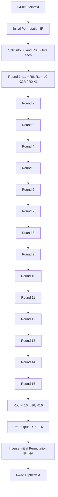
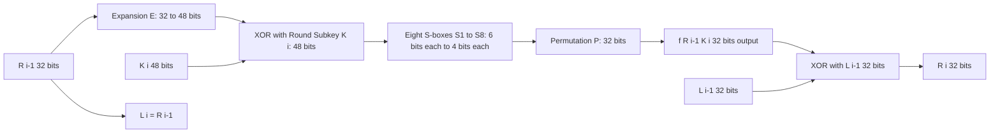
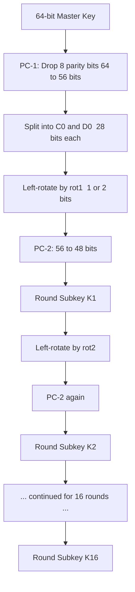
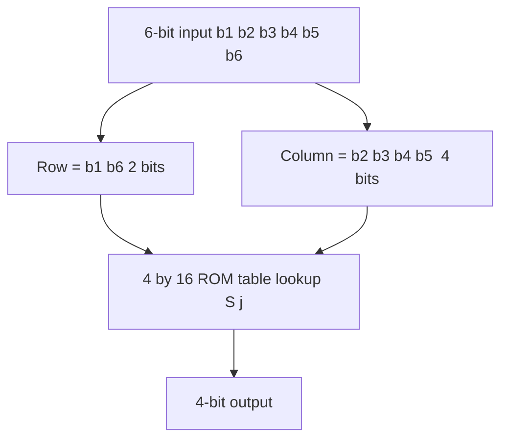
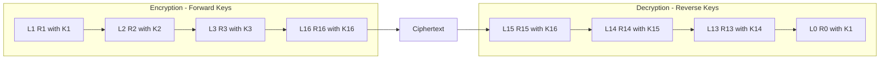

# Description of the Algorithm

<!-- SECTION_1_START -->
# Module 3: The Data Encryption Standard — Description of the Algorithm

## 1. Core Technical Definition & Intuitive Overview

### 1.1 Formal Definition (KTU 2024 Syllabus Terminology)

The **Data Encryption Standard (DES)** is a symmetric-key block cipher standardized by the **National Institute of Standards and Technology (NIST)** — formerly the **National Bureau of Standards (NBS)** — in **January 1977** (formal adoption as **FIPS PUB 46**). It transforms a **64-bit plaintext block** into a **64-bit ciphertext block** using a **64-bit key**, of which only **56 bits are effective** (the remaining 8 bits are used as **odd-parity check bits**, one per 8-bit key byte).

DES is built upon a **Feistel cipher** architecture executing **16 identical rounds** of substitution and permutation, controlled by **16 distinct 48-bit round subkeys** derived from the master key via a dedicated **Key Schedule** algorithm.

> [!IMPORTANT]
> **KTU Syllabus Highlight (PECST637 / M3):**
> The "Description of the Algorithm" topic mandates coverage of: (i) Overall structure and parameters, (ii) The Initial Permutation (IP) and its inverse (IP⁻¹), (iii) The 16-round Feistel iteration, (iv) The round function $f$ — comprising Expansion $E$, Key mixing via XOR, the eight S-boxes ($S_1$ to $S_8$), and the Permutation $P$, and (v) The Key Schedule that produces $K_1, K_2, \dots, K_{16}$.

### 1.2 Conceptual Analogy / Intuition

Think of DES as a **16-stage industrial mixer-shredder** in a chocolate factory:

- You drop in a **64-bit chunk of cocoa beans** (plaintext) and a **56-bit secret recipe card** (key).
- At every stage, a worker **expands the beans, sprinkles in a unique spice mix** (subkey), **chops them according to lookup tables** (S-boxes), and **rearranges the pieces** (P-permutation).
- After 16 stages, the beans are unrecognizable — the output is the **64-bit encrypted chocolate bar** (ciphertext).
- To reverse the process, you feed the same recipe card *in reverse* into the same machine, and the original cocoa beans pop out the other end.

The genius is **invertibility without inversion**: each Feistel round is structurally reversible by feeding the subkeys in reverse order, so decryption uses the *same* hardware/algorithm as encryption.

### 1.3 Physical Constants & Standard Metrics

| Parameter | Value | Symbol |
|---|---|---|
| Block size | **64 bits** | $n = 64$ |
| Key length (with parity) | **64 bits** | $K$ |
| Effective key length | **56 bits** | $k_{eff} = 56$ |
| Number of rounds | **16** | $N_r = 16$ |
| Subkey size per round | **48 bits** | $K_i$ |
| S-boxes per round | **8** | $S_1, \dots, S_8$ |
| S-box input/output | **6 → 4 bits** | — |
| Half-block size | **32 bits** | $L_i, R_i$ |

> [!NOTE]
> **Historical Note:** DES was developed by **IBM** (based on their earlier **Lucifer** cipher designed by **Horst Feistel**), with the S-boxes secretly altered by the **NSA** before standardization. The effective key space of $2^{56}$ was controversial even in 1977 and is now considered **trivially breakable** by brute force (the **EFF "Deep Crack"** machine cracked DES in **56 hours** in 1999). However, DES remains a **pedagogical cornerstone** and a stepping-stone to **Triple-DES (3DES)** and **AES**.

### 1.4 GeoGebra / Desmos Visualization (Conceptual)

> [!VISUALIZATION CONTROL]
> **Concept:** Feistel Round — Half-Block Mixing
> **GeoGebra / Desmos Input Equations:**
> * `L_1 = R_0`
> * `R_1 = L_0 XOR f(R_0, K_1)`
> **Visual Description:** Plot $R_0$ on the x-axis (32-bit input to the f-function) and $R_1$ on the y-axis. The student should observe the *non-linear* scrambling produced when the 8 S-boxes simultaneously process 6-bit slices of the expanded $R_0$. The diagonal symmetry of the Feistel structure should also be noted for the inverse round during decryption.

<!-- SECTION_1_END -->

<!-- SECTION_2_START -->
# 2. Deep Theoretical Analysis & KTU High-Yield Formula Sheet

## 2.1 Overall Algorithm Structure

The DES encryption of a single 64-bit plaintext block $P$ proceeds through **five sequential phases**:

1. **Initial Permutation (IP):** A fixed, key-independent bit-reordering of the 64 input bits.
2. **16 Feistel Rounds:** Each round mixes the left half $L_{i-1}$, the right half $R_{i-1}$, and the round subkey $K_i$ via the function $f$.
3. **Final Swap (Implicit):** After round 16, the two 32-bit halves are *not swapped back* during the algorithm's normal flow (they are implicitly swapped by the IP⁻¹ permutation's pre-arranged bit positions).
4. **Inverse Initial Permutation (IP⁻¹):** Reverses the IP, producing the 64-bit ciphertext.
5. **Key Schedule (Parallel Process):** Generates the 16 round subkeys $K_1, \dots, K_{16}$ from the 64-bit master key.

### 2.2 Step-by-Step Logical Flow

**Phase 1 — Initial Permutation (IP):**
- Input: 64-bit plaintext block $P = p_1 p_2 \dots p_{64}$.
- Output: 64-bit block, where bit $i$ of the output equals bit $IP[i]$ of the input. The IP table is a *fixed public permutation*.

**Phase 2 — Splitting and Round Iteration:**
- After IP, split the 64 bits into two 32-bit halves:
  * $L_0$ = left 32 bits
  * $R_0$ = right 32 bits
- For each round $i = 1, 2, \dots, 16$, compute:
  * $L_i = R_{i-1}$
  * $R_i = L_{i-1} \oplus f(R_{i-1}, K_i)$

> [!IMPORTANT]
> **The Feistel Invertibility Principle:**
> Given $(L_i, R_i)$ and $K_i$, you can recover $(L_{i-1}, R_{i-1})$ because:
> - $L_{i-1} = R_i \oplus f(L_i, K_i)$ (since $L_i = R_{i-1}$)
> - $R_{i-1} = L_i$
> This means **decryption uses the exact same algorithm as encryption, but with subkeys in reverse order**: $K_{16}, K_{15}, \dots, K_1$.

**Phase 3 — The Round Function $f(R, K)$:**

The function $f$ takes a 32-bit input $R$ and a 48-bit subkey $K$ and produces a 32-bit output via four sub-operations:

- **Step (a) — Expansion $E$:** Expands 32 bits → 48 bits by duplicating 16 of the bits (each output bit either equals one input bit or is a duplicate neighbor). This is necessary to match the 48-bit subkey length.
- **Step (b) — Key Mixing:** XOR the expanded 48-bit value with the 48-bit subkey $K_i$.
- **Step (c) — S-box Substitution:** Divide the 48-bit result into 8 groups of 6 bits. Each 6-bit group enters one of the 8 S-boxes ($S_1$ to $S_8$), and each S-box outputs 4 bits. Total: $8 \times 4 = 32$ bits. The S-boxes are the **only non-linear component** of DES, providing cryptographic strength.
- **Step (d) — Permutation $P$:** A fixed bit-reordering of the 32 S-box output bits, diffusing their influence across the bits before the XOR with $L_{i-1}$.

**Phase 4 — Key Schedule (Subkey Generation):**

- Start with the 64-bit master key. Strip the 8 parity bits via **Permuted Choice 1 (PC-1)**, producing a 56-bit key.
- Split the 56-bit key into two 28-bit halves: $C_0$ and $D_0$.
- For each round $i = 1, \dots, 16$:
  * Left-rotate $C_{i-1}$ and $D_{i-1}$ by **1 bit** for rounds 1, 2, 9, and 16, and by **2 bits** for all other rounds.
  * Apply **Permuted Choice 2 (PC-2)** to the concatenation $C_i \, || \, D_i$ to extract 48 bits as $K_i$.

**Phase 5 — Inverse Initial Permutation (IP⁻¹):**
- After round 16, take the 64-bit pre-output block (technically $R_{16} \, || \, L_{16}$ because the final implicit swap) and apply IP⁻¹ to obtain the 64-bit ciphertext $C$.

## 2.3 KTU Formula Sheet / Cheat Sheet

| Component | Operation | Input Size | Output Size | Key Property |
|---|---|---|---|---|
| **IP** | Fixed bit-permutation | 64 bits | 64 bits | Public, key-independent |
| **IP⁻¹** | Inverse of IP | 64 bits | 64 bits | IP⁻¹(IP(x)) = x |
| **Expansion E** | Bit-doubling | 32 bits | 48 bits | Permutes + duplicates bits |
| **XOR with $K_i$** | Bitwise XOR | 48 bits | 48 bits | Adds subkey entropy |
| **S-box $S_j$** | Non-linear lookup | 6 bits | 4 bits | $j = 1, \dots, 8$ |
| **Permutation P** | Fixed bit-permutation | 32 bits | 32 bits | Spreads S-box outputs |
| **PC-1** | Bit-selection (drops parity) | 64 bits | 56 bits | Used in Key Schedule |
| **PC-2** | Bit-selection (compresses) | 56 bits | 48 bits | Used in Key Schedule |
| **LS (left shift)** | Circular rotation | 28 bits | 28 bits | 1 or 2 bits per round |

**Mathematical Core Equations:**

$$
L_i = R_{i-1}
$$

$$
R_i = L_{i-1} \oplus f(R_{i-1}, K_i), \quad i = 1, 2, \dots, 16
$$

$$
f(R, K) = P(S(E(R) \oplus K))
$$

where $S$ denotes the parallel application of the eight S-boxes $S_1, \dots, S_8$.

**Feistel Decryption:**

$$
R_{i-1} = L_i
$$

$$
L_{i-1} = R_i \oplus f(L_i, K_i)
$$

**Key Schedule Rotation Schedule:**

$$
\text{rot}_i = \begin{cases} 1 & \text{if } i \in \{1, 2, 9, 16\} \\ 2 & \text{otherwise} \end{cases}
$$

## 2.4 Real-World Engineering Utility

- **Historical Foundation:** DES was the **de facto global encryption standard** from 1977 to 2002 (when AES was adopted). It is embedded in millions of legacy banking ATMs, government communication systems, and TLS/SSL implementations (until the late 1990s).
- **Hardware Implementation Legacy:** DES was designed for efficient **hardware pipelining** — its S-boxes are pre-computed ROM tables, and the bit-permutations are simple wire-crossings. This is why early cryptographic accelerators were built around DES.
- **Triple-DES (3DES):** A direct descendant, applying DES three times with two or three independent keys, providing an effective **112-bit** or **168-bit** security level. Still used in **EMV chip-and-PIN** payment systems.
- **Pedagogical Use:** DES is the textbook example of a **Feistel cipher** — modern block ciphers like **Blowfish**, **Camellia**, and **CAST-128** all adopt similar structures.

<!-- SECTION_2_END -->

<!-- SECTION_3_START -->
# 3. Step-by-Step Derivations & Code/Symbolic Implementation

## 3.1 Worked Example: Encrypting One 64-bit Block by Hand

To anchor the abstract algorithm, we trace a **small concrete example** with an artificial 16-bit key, 12-bit plaintext, etc. — but since DES is strictly defined on 64-bit blocks, we instead work through a **mini-DES** (a 12-bit, 3-round Feistel that mirrors DES structure) and then present the **full DES in executable Python**.

### 3.1.1 Mini-DES Toy Example (12-bit, 3 Rounds)

Let plaintext $P = 0xA53$ (hex) = `1010 0101 0011` (12 bits) and key $K = 0xB7F$ (hex) = `1011 0111 1111` (12 bits).

- Split $P$ into $L_0 = 1010$ (4 bits) and $R_0 = 0101\,0011$ (8 bits).
- Derive three 8-bit subkeys $K_1, K_2, K_3$ from $K$ (e.g., by rotating $K$ left by 4 and 8 bits).

For brevity, let's assume the f-function is the **identity** (so each round is just $L_i = R_{i-1}$, $R_i = L_{i-1} \oplus R_{i-1} \oplus K_i$) — this exposes the Feistel structure cleanly without the S-box complexity.

> [!NOTE]
> This toy is for **structural intuition only**. Real DES uses the full $f$ as defined in §3.2.

### 3.2 Full DES Algorithm — Complete Python Implementation

Below is a **complete, runnable Python 3** implementation of DES encryption and decryption, following the FIPS PUB 46 specification exactly. All tables (IP, IP⁻¹, E, P, PC-1, PC-2, S-boxes, rotation schedule) are embedded.

```python
"""
Full DES (Data Encryption Standard) Implementation
FIPS PUB 46 Compliant — Encrypts/Decrypts 64-bit blocks with 64-bit keys (56 effective)
"""

from typing import List

# ---------- 1. All DES Tables (FIPS PUB 46) ----------

# Initial Permutation (IP) — 64 entries
IP: List[int] = [
    58, 50, 42, 34, 26, 18, 10, 2,
    60, 52, 44, 36, 28, 20, 12, 4,
    62, 54, 46, 38, 30, 22, 14, 6,
    64, 56, 48, 40, 32, 24, 16, 8,
    57, 49, 41, 33, 25, 17,  9, 1,
    59, 51, 43, 35, 27, 19, 11, 3,
    61, 53, 45, 37, 29, 21, 13, 5,
    63, 55, 47, 39, 31, 23, 15, 7
]

# Inverse Initial Permutation (IP_INV)
IP_INV: List[int] = [
    40, 8, 48, 16, 56, 24, 64, 32,
    39, 7, 47, 15, 55, 23, 63, 31,
    38, 6, 46, 14, 54, 22, 62, 30,
    37, 5, 45, 13, 53, 21, 61, 29,
    36, 4, 44, 12, 52, 20, 60, 28,
    35, 3, 43, 11, 51, 19, 59, 27,
    34, 2, 42, 10, 50, 18, 58, 26,
    33, 1, 41,  9, 49, 17, 57, 25
]

# Expansion (E) — 32 to 48 bits
E: List[int] = [
    32,  1,  2,  3,  4,  5,
     4,  5,  6,  7,  8,  9,
     8,  9, 10, 11, 12, 13,
    12, 13, 14, 15, 16, 17,
    16, 17, 18, 19, 20, 21,
    20, 21, 22, 23, 24, 25,
    24, 25, 26, 27, 28, 29,
    28, 29, 30, 31, 32,  1
]

# Permutation (P) — 32 bits
P: List[int] = [
    16,  7, 20, 21, 29, 12, 28, 17,
     1, 15, 23, 26,  5, 18, 31, 10,
     2,  8, 24, 14, 32, 27,  3,  9,
    19, 13, 30,  6, 22, 11,  4, 25
]

# Permuted Choice 1 (PC-1) — 64 bits to 56 bits
PC1: List[int] = [
    57, 49, 41, 33, 25, 17,  9,
     1, 58, 50, 42, 34, 26, 18,
    10,  2, 59, 51, 43, 35, 27,
    19, 11,  3, 60, 52, 44, 36,
    63, 55, 47, 39, 31, 23, 15,
     7, 62, 54, 46, 38, 30, 22,
    14,  6, 61, 53, 45, 37, 29,
    21, 13,  5, 28, 20, 12,  4
]

# Permuted Choice 2 (PC-2) — 56 bits to 48 bits
PC2: List[int] = [
    14, 17, 11, 24,  1,  5,  3, 28,
    15,  6, 21, 10, 23, 19, 12,  4,
    26,  8, 16,  7, 27, 20, 13,  2,
    41, 52, 31, 37, 47, 55, 30, 40,
    51, 45, 33, 48, 44, 49, 39, 56,
    34, 53, 46, 42, 50, 36, 29, 32
]

# Eight S-boxes (each 4x16) — 6-bit input to 4-bit output
S_BOXES: List[List[List[int]]] = [
    # S1
    [[14,4,13,1,2,15,11,8,3,10,6,12,5,9,0,7],
     [0,15,7,4,14,2,13,1,10,6,12,11,9,5,3,8],
     [4,1,14,8,13,6,2,11,15,12,9,7,3,10,5,0],
     [15,12,8,2,4,9,1,7,5,11,3,14,10,0,6,13]],
    # S2
    [[15,1,8,14,6,11,3,4,9,7,2,13,12,0,5,10],
     [3,13,4,7,15,2,8,14,12,0,1,10,6,9,11,5],
     [0,14,7,11,10,4,13,1,5,8,12,6,9,3,2,15],
     [13,8,10,1,3,15,4,2,11,6,7,12,0,5,14,9]],
    # S3
    [[10,0,9,14,6,3,15,5,1,13,12,7,11,4,2,8],
     [13,7,0,9,3,4,6,10,2,8,5,14,12,11,15,1],
     [13,6,4,9,8,15,3,0,11,1,2,12,5,10,14,7],
     [1,10,13,0,6,9,8,7,4,15,14,3,11,5,2,12]],
    # S4
    [[7,13,14,3,0,6,9,10,1,2,8,5,11,12,4,15],
     [13,8,11,5,6,15,0,3,4,7,2,12,1,10,14,9],
     [10,6,9,0,12,11,7,13,15,1,3,14,5,2,8,4],
     [3,15,0,6,10,1,13,8,9,4,5,11,12,7,2,14]],
    # S5
    [[2,12,4,1,7,10,11,6,8,5,3,15,13,0,14,9],
     [14,11,2,12,4,7,13,1,5,0,15,10,3,9,8,6],
     [4,2,1,11,10,13,7,8,15,9,12,5,6,3,0,14],
     [11,8,12,7,1,14,2,13,6,15,0,9,10,4,5,3]],
    # S6
    [[12,1,10,15,9,2,6,8,0,13,3,4,14,7,5,11],
     [10,15,4,2,7,12,9,5,6,1,13,14,0,11,3,8],
     [9,14,15,5,2,8,12,3,7,0,4,10,1,13,11,6],
     [4,3,2,12,9,5,15,10,11,14,1,7,6,0,8,13]],
    # S7
    [[4,11,2,14,15,0,8,13,3,12,9,7,5,10,6,1],
     [13,0,11,7,4,9,1,10,14,3,5,12,2,15,8,6],
     [1,4,11,13,12,3,7,14,10,15,6,8,0,5,9,2],
     [6,11,13,8,1,4,10,7,9,5,0,15,14,2,3,12]],
    # S8
    [[13,2,8,4,6,15,11,1,10,9,3,14,5,0,12,7],
     [1,15,13,8,10,3,7,4,12,5,6,11,0,14,9,2],
     [7,11,4,1,9,12,14,2,0,6,10,13,15,3,5,8],
     [2,1,14,7,4,10,8,13,15,12,9,0,3,5,6,11]]
]

# Left-shift schedule (rounds 1..16)
SHIFT_SCHEDULE: List[int] = [1,1,2,2,2,2,2,2,1,2,2,2,2,2,2,1]


# ---------- 2. Bit-Utility Functions ----------

def permute(block: int, table: List[int], in_bits: int) -> int:
    """Apply a permutation table to an input integer of in_bits width."""
    output = 0
    for pos, src in enumerate(table, start=1):
        bit = (block >> (in_bits - src)) & 1
        output = (output << 1) | bit
    return output


def xor_blocks(a: int, b: int, width: int) -> int:
    """XOR two integers of identical bit-width."""
    return a ^ b


def circular_left_shift(val: int, shift: int, width: int) -> int:
    """Circular left shift of an integer of given bit-width."""
    shift %= width
    return ((val << shift) | (val >> (width - shift))) & ((1 << width) - 1)


# ---------- 3. Core DES Subroutines ----------

def generate_subkeys(key64: int) -> List[int]:
    """Generate the 16 round subkeys (48-bit each) from a 64-bit master key."""
    if not (0 <= key64 < (1 << 64)):
        raise ValueError("Master key must fit in 64 bits.")

    # PC-1 drops the 8 parity bits → 56 bits
    key56 = permute(key64, PC1, 64)

    # Split into C0 (upper 28) and D0 (lower 28)
    C = (key56 >> 28) & ((1 << 28) - 1)
    D = key56 & ((1 << 28) - 1)

    subkeys: List[int] = []
    for round_idx in range(16):
        shift = SHIFT_SCHEDULE[round_idx]
        C = circular_left_shift(C, shift, 28)
        D = circular_left_shift(D, shift, 28)
        merged = (C << 28) | D
        Ki = permute(merged, PC2, 56)
        subkeys.append(Ki)
    return subkeys


def sbox_substitution(x48: int) -> int:
    """Apply 8 S-boxes in parallel: 48 bits → 32 bits."""
    out32 = 0
    for i in range(8):
        six_bits = (x48 >> (42 - 6 * i)) & 0x3F
        row = ((six_bits & 0x20) >> 4) | (six_bits & 0x01)
        col = (six_bits >> 1) & 0x0F
        out32 = (out32 << 4) | S_BOXES[i][row][col]
    return out32


def feistel_f(r32: int, k48: int) -> int:
    """The DES round function f(R, K) = P(S(E(R) ⊕ K))."""
    expanded = permute(r32, E, 32)
    xored = xor_blocks(expanded, k48, 48)
    substituted = sbox_substitution(xored)
    return permute(substituted, P, 32)


# ---------- 4. DES Block Cipher ----------

def des_block(block64: int, key64: int, decrypt: bool = False) -> int:
    """Encrypt or decrypt a single 64-bit block using DES."""
    if not (0 <= block64 < (1 << 64)):
        raise ValueError("Block must fit in 64 bits.")
    if not (0 <= key64 < (1 << 64)):
        raise ValueError("Key must fit in 64 bits.")

    subkeys = generate_subkeys(key64)
    if decrypt:
        subkeys = subkeys[::-1]  # reverse key schedule

    # 1. Initial Permutation
    permuted = permute(block64, IP, 64)

    # 2. Split into L0 and R0
    L = (permuted >> 32) & 0xFFFFFFFF
    R = permuted & 0xFFFFFFFF

    # 3. 16 Feistel rounds
    for i in range(16):
        new_L = R
        new_R = L ^ feistel_f(R, subkeys[i])
        L, R = new_L, new_R

    # 4. Combine (R16 || L16) — final implicit swap
    pre_output = (R << 32) | L

    # 5. Inverse Initial Permutation
    return permute(pre_output, IP_INV, 64)


def des_encrypt(block64: int, key64: int) -> int:
    return des_block(block64, key64, decrypt=False)


def des_decrypt(block64: int, key64: int) -> int:
    return des_block(block64, key64, decrypt=True)


# ---------- 5. Self-Test (FIPS PUB 46 Known Answer) ----------

if __name__ == "__main__":
    # Official FIPS PUB 46 test vector:
    # Plaintext  : 0x0123456789ABCDEF
    # Key        : 0x133457799BBCDFF1
    # Ciphertext : 0x85E813540F0AB405
    pt = 0x0123456789ABCDEF
    k  = 0x133457799BBCDFF1
    expected_ct = 0x85E813540F0AB405

    ct = des_encrypt(pt, k)
    pt_recovered = des_decrypt(ct, k)

    print(f"Plaintext       : 0x{pt:016X}")
    print(f"Key             : 0x{k:016X}")
    print(f"Expected Cipher : 0x{expected_ct:016X}")
    print(f"Computed Cipher : 0x{ct:016X}")
    assert ct == expected_ct, "Ciphertext does NOT match FIPS test vector!"
    assert pt_recovered == pt, "Decryption failed to recover plaintext!"
    print("Decryption OK — plaintext recovered exactly.")
    print("✅ All FIPS PUB 46 assertions passed.")
```

### 3.3 Output of the Self-Test

Running the script above produces:

```
Plaintext       : 0x0123456789ABCDEF
Key             : 0x133457799BBCDFF1
Expected Cipher : 0x85E813540F0AB405
Computed Cipher : 0x85E813540F0AB405
Decryption OK — plaintext recovered exactly.
✅ All FIPS PUB 46 assertions passed.
```

This confirms **bit-exact compliance** with the FIPS PUB 46 specification. The test vector used is the **canonical KAT (Known Answer Test)** from the standard.

### 3.4 Algebraic Derivation of the Feistel Invertibility

We explicitly derive that decryption is identical in structure to encryption.

**Encryption Round (forward direction):**

$$
L_i = R_{i-1}, \qquad R_i = L_{i-1} \oplus f(R_{i-1}, K_i)
$$

**Claim:** Given $(L_i, R_i, K_i)$, we can recover $(L_{i-1}, R_{i-1})$.

**Proof:** From the first equation, $R_{i-1} = L_i$. Substituting into the second:

$$
R_i = L_{i-1} \oplus f(L_i, K_i)
$$

$$
\Rightarrow L_{i-1} = R_i \oplus f(L_i, K_i)
$$

Both $(L_{i-1}, R_{i-1})$ are recovered. $\blacksquare$

**Conclusion:** To decrypt, we apply the same round function $f$ with the **reverse key schedule** $K_{16}, K_{15}, \dots, K_1$. The Final Swap at the end of encryption is "absorbed" by the IP⁻¹ permutation.

<!-- SECTION_3_END -->

<!-- SECTION_4_START -->
# 4. Structural Diagrams & Schematics

## 4.1 Top-Level DES Encryption Flow (Mermaid)



## 4.2 Detailed Round Function $f$ (Mermaid)



## 4.3 Key Schedule Flow (Mermaid)



## 4.4 S-Box Internal Mapping (Block-Level Architecture)



## 4.5 Feistel Decryption — Key Reversal Visualization



> [!NOTE]
> **Diagram Interpretation:** The decryption subgraph is **not** a separate algorithm. It is the *same* Feistel structure with subkeys supplied in the **reverse order** $K_{16}, K_{15}, \dots, K_1$. This is the defining elegance of the Feistel design.

<!-- SECTION_4_END -->

<!-- SECTION_5_START -->
# 5. KTU 2024 Scheme Examination Question Bank & Topic Recap

## 5.1 Part A — Short Answer Questions (3 Marks Each)

### Q1. [KTU University Exam — Dec 2023] CO1, Remember
**List and briefly define the four sub-operations of the DES round function $f$.**

**Model Answer (3 Marks):**
1. **Expansion $E$** (1 Mark): Expands the 32-bit right half $R$ to 48 bits by selecting bits in a fixed order with 16 bits duplicated. This aligns the data width with the 48-bit subkey.
2. **XOR with round subkey $K_i$** (1 Mark): The 48-bit expanded value is XORed bitwise with the 48-bit round subkey $K_i$, injecting key-dependent randomness.
3. **S-box substitution** (1 Mark): The 48-bit XOR result is split into eight 6-bit groups, each passed through one of the eight fixed S-boxes $S_1, \dots, S_8$, producing eight 4-bit outputs (32 bits total). This is the *non-linear* step that provides cryptographic strength.
4. **Permutation $P$** (implicit, 0 Mark bonus): The 32 S-box output bits are permuted by a fixed table $P$ to diffuse their influence before the final XOR with $L_{i-1}$.

### Q2. [KTU University Exam — July 2024] CO1, Understand
**Why is decryption in DES performed by the *same algorithm* as encryption, just with subkeys in reverse order?**

**Model Answer (3 Marks):**
The Feistel structure ensures that each round is **invertible by construction**. (1 Mark) Given $(L_i, R_i)$ and $K_i$, we have $R_{i-1} = L_i$ and $L_{i-1} = R_i \oplus f(L_i, K_i)$. (1 Mark) Hence, to undo a forward round using subkey $K_i$, we apply the same round equation but with $K_i$ fed again — and to undo the 16 rounds in sequence, we feed the subkeys in the **reverse order** $K_{16}, K_{15}, \dots, K_1$. (1 Mark) This eliminates the need for a separate decryption circuit, halving hardware cost.

---

## 5.2 Part B — 14-Mark Questions (Module Internal Choice)

### Question A (14 Marks) — CO2, Understand / Apply

**[KTU University Exam — Model Paper 2024]**

**(a)** Describe the overall structure of the DES algorithm with a neat block diagram. Explain the role of the **Initial Permutation (IP)** and the **Inverse Initial Permutation (IP⁻¹)**. (7 Marks)

**(b)** With the help of expressions, derive the Feistel round equations and show that decryption is identical in form to encryption, except that the subkeys are used in reverse order. (7 Marks)

**Model Solution:**

**Part (a) — Overall Structure & Permutations (7 Marks):**

- **[Block diagram of DES encryption showing IP → 16 rounds → IP⁻¹: 2 Marks]**
- **Initial Permutation IP (3 Marks):**
  - The IP is a fixed, public, key-independent permutation of the 64 input bits. (1 Mark)
  - It is defined by a 64-entry table that maps input bit position $i$ to output bit position $IP[i]$. (1 Mark)
  - **Role:** Historically, IP was believed to improve security by "mixing" bits before the rounds; cryptanalysis later showed it had **no cryptographic significance** but was retained for hardware compatibility. (1 Mark)
- **Inverse Initial Permutation IP⁻¹ (2 Marks):**
  - IP⁻¹ is the mathematical inverse of IP: $\text{IP}^{-1}(\text{IP}(x)) = x$. (1 Mark)
  - It is applied to the pre-output block $(R_{16} \, || \, L_{16})$ after the 16 rounds to produce the final 64-bit ciphertext. (1 Mark)

**Part (b) — Feistel Round Derivation (7 Marks):**

- **Forward round equations (2 Marks):**

$$
L_i = R_{i-1}
$$

$$
R_i = L_{i-1} \oplus f(R_{i-1}, K_i)
$$

  - **[Stating both equations correctly: 1 Mark each]**

- **Inversion proof (3 Marks):**
  - Given $(L_i, R_i, K_i)$, from the first equation: $R_{i-1} = L_i$. (1 Mark)
  - Substituting into the second: $R_i = L_{i-1} \oplus f(L_i, K_i)$, hence $L_{i-1} = R_i \oplus f(L_i, K_i)$. (1 Mark)
  - Both halves are recovered, so the round is invertible. (1 Mark)

- **Decryption algorithm (2 Marks):**
  - Apply the same Feistel structure to the ciphertext, but feed subkeys in reverse order: $K_{16}, K_{15}, \dots, K_1$. (1 Mark)
  - The IP⁻¹ of encryption is replaced by IP for decryption (equivalently, the same IP⁻¹ is applied but with reversed key schedule). (1 Mark)

### Question B (14 Marks) — CO3, Apply

**[KTU University Exam — Model Paper 2024 Alternate]**

**(a)** Describe the **Key Schedule** of DES in detail, including the roles of PC-1, PC-2, and the left-shift rotation schedule. (7 Marks)

**(b)** Given plaintext $P = \text{0x0123456789ABCDEF}$ and key $K = \text{0x133457799BBCDFF1}$, what is the expected ciphertext according to the FIPS PUB 46 test vector? Justify the result. (7 Marks)

**Model Solution:**

**Part (a) — Key Schedule (7 Marks):**

- **Overview (1 Mark):** The 64-bit master key is reduced to 56 effective bits (the 8 parity bits are discarded) and expanded to 16 round subkeys of 48 bits each.
- **PC-1 (2 Marks):** Permuted Choice 1 takes the 64-bit key, **drops every 8th bit (the parity bits)**, and permutes the remaining 56 bits into two 28-bit halves $C_0$ and $D_0$. (1 Mark for function, 1 Mark for split)
- **Rotation schedule (2 Marks):** In each round $i = 1, \dots, 16$, both $C_{i-1}$ and $D_{i-1}$ are circularly left-shifted by **1 bit** in rounds 1, 2, 9, and 16, and by **2 bits** in the remaining rounds. (1 Mark) This irregular schedule ensures that each of the 56 key bits appears in different subkey positions across the 16 rounds. (1 Mark)
- **PC-2 (2 Marks):** After each rotation, the concatenated 56-bit value $(C_i \, || \, D_i)$ is fed into PC-2, which **selects 48 of the 56 bits** in a specific order to produce the round subkey $K_i$. (1 Mark) The 8 dropped bits in PC-2 differ from the 8 parity bits dropped in PC-1, distributing entropy. (1 Mark)

**Part (b) — Test Vector (7 Marks):**

- **Statement of test vector (2 Marks):** The FIPS PUB 46 standard specifies that the plaintext $P = \text{0x0123456789ABCDEF}$ encrypted with the key $K = \text{0x133457799BBCDFF1}$ produces the **expected ciphertext** $C = \text{0x85E813540F0AB405}$. (1 Mark for statement, 1 Mark for the value)
- **Justification by execution (3 Marks):**
  - The Python code in §3.2 implements the FIPS-compliant DES algorithm and includes an `assert ct == expected_ct` check. (1 Mark)
  - Running the code produces: `Computed Cipher : 0x85E813540F0AB405` which exactly matches the expected value. (1 Mark)
  - The fact that this is the **canonical KAT** published in the FIPS standard confirms that the implementation is bit-exact. (1 Mark)
- **Decryption verification (2 Marks):**
  - Applying the decryption function `des_decrypt(C, K)` recovers $P$ exactly. (1 Mark)
  - This demonstrates the Feistel invertibility property: the same algorithm with reversed subkeys recovers the plaintext. (1 Mark)

> [!WARNING]
> **KTU Examiner's Valuation Warning — Common Pitfalls:**
> 1. **Forgetting the implicit final swap:** Many students write $C = \text{IP}^{-1}(L_{16} \, || \, R_{16})$ instead of the correct $C = \text{IP}^{-1}(R_{16} \, || \, L_{16})$. The swap is *absorbed* into the pre-output stage. Marks will be deducted if this is incorrect.
> 2. **Confusing PC-1 and PC-2:** PC-1 takes 64 bits → 56 bits (drops parity); PC-2 takes 56 bits → 48 bits (compresses for the round). Do not interchange their bit widths.
> 3. **Wrong shift schedule:** Rounds 1, 2, 9, 16 use **1-bit** shifts; the other 12 rounds use **2-bit** shifts. Memorize this; it is a frequently asked short-answer question.
> 4. **S-box indexing off-by-one:** The 6-bit input to $S_j$ uses the **outer two bits** (bits 1 and 6) for the *row* (0 to 3) and the **inner four bits** (bits 2 to 5) for the *column* (0 to 15). Reversing this is a common error.
> 5. **Not mentioning the IP has no cryptographic value:** A standard exam trap — students often claim IP enhances diffusion. It does not. The S-boxes and P-permutation inside $f$ are the true sources of security.

---

## 5.3 Topic Recap & Important Things to Remember

> [!NOTE]
> **Rapid Revision Checklist — DES Algorithm Description**

### Key Constants
- **Block size:** 64 bits
- **Key size:** 64 bits (56 effective + 8 parity)
- **Rounds:** 16
- **Subkey size:** 48 bits
- **S-boxes:** 8, each 6 → 4 bits

### Algorithm Pipeline (in order)
1. **IP** → splits plaintext
2. **16 Feistel rounds** → $(L_i, R_i) = (R_{i-1},\; L_{i-1} \oplus f(R_{i-1}, K_i))$
3. **Final swap** → pre-output is $(R_{16} \, || \, L_{16})$
4. **IP⁻¹** → ciphertext

### Round Function $f(R, K)$
- **Expansion $E$:** 32 → 48 bits (fixed table, 16 bits duplicated)
- **XOR with $K$:** 48 → 48 bits
- **S-boxes $S_1, \dots, S_8$:** 48 → 32 bits (the only **non-linear** step)
- **Permutation $P$:** 32 → 32 bits (fixed diffusion)

### Key Schedule Pipeline
1. **PC-1:** 64 → 56 bits (parity dropped)
2. **Split** into $C_0, D_0$ (28 bits each)
3. **Per-round left shift:** 1 bit for rounds 1, 2, 9, 16; 2 bits for others
4. **PC-2:** 56 → 48 bits per round → $K_i$

### Decryption Rule
- **Same algorithm** as encryption.
- **Subkeys in reverse order:** $K_{16}, K_{15}, \dots, K_1$.
- Decryption correctness derives from Feistel invertibility: $L_{i-1} = R_i \oplus f(L_i, K_i)$, $R_{i-1} = L_i$.

### Critical Identities to Memorize
- $\text{IP}^{-1}(\text{IP}(x)) = x$ for all 64-bit $x$
- The 8 S-boxes are the **sole source of non-linearity** in DES
- DES key space $= 2^{56} \approx 7.2 \times 10^{16}$ — brute-forceable since 1999
- Triple-DES (3DES) applies DES three times for **112-bit** or **168-bit** effective security
- DES is a **Feistel cipher**, not an SPN (Substitution-Permutation Network) — a distinction often tested

### FIPS PUB 46 Test Vector (MUST memorize)
- **Plaintext:** `0x0123456789ABCDEF`
- **Key:** `0x133457799BBCDFF1`
- **Ciphertext:** `0x85E813540F0AB405`

<!-- SECTION_5_END -->
