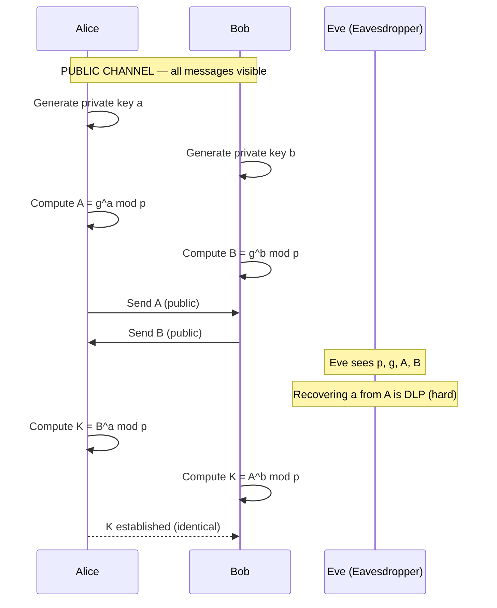
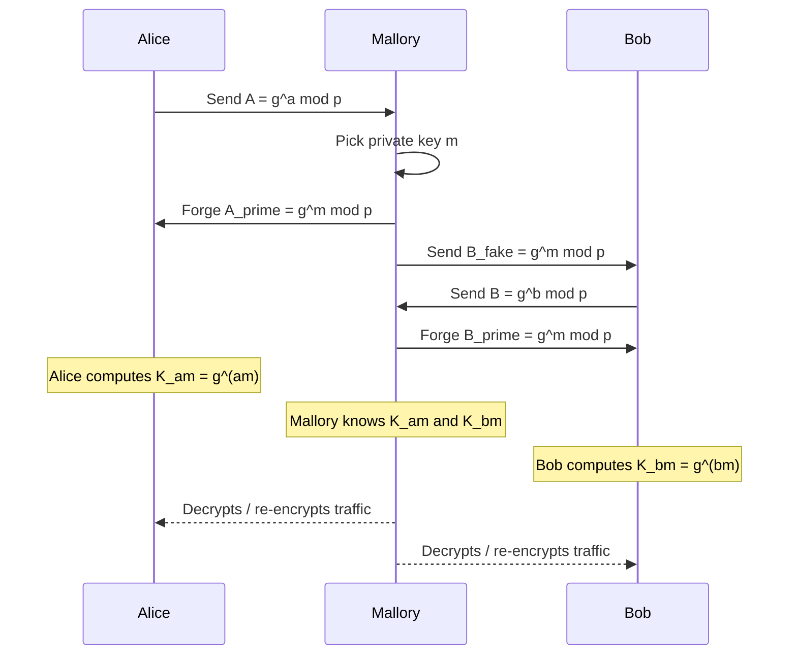
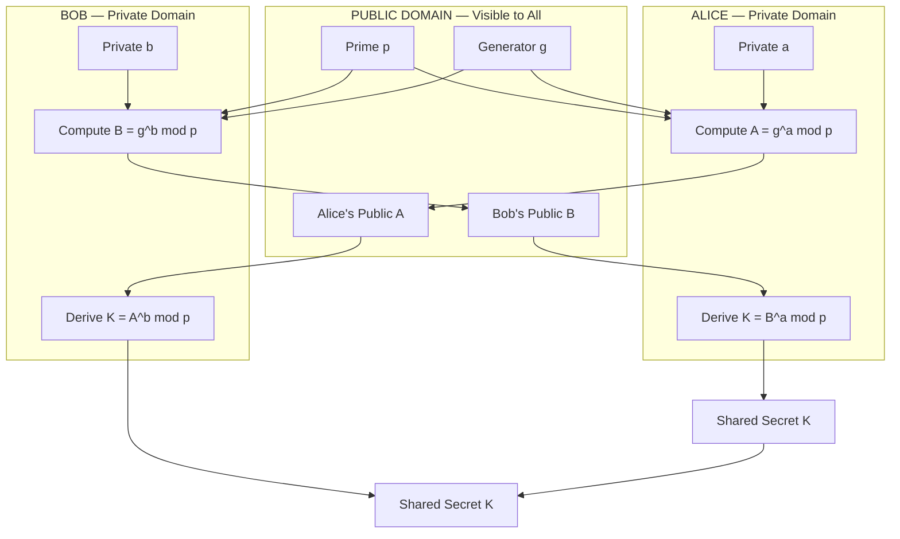
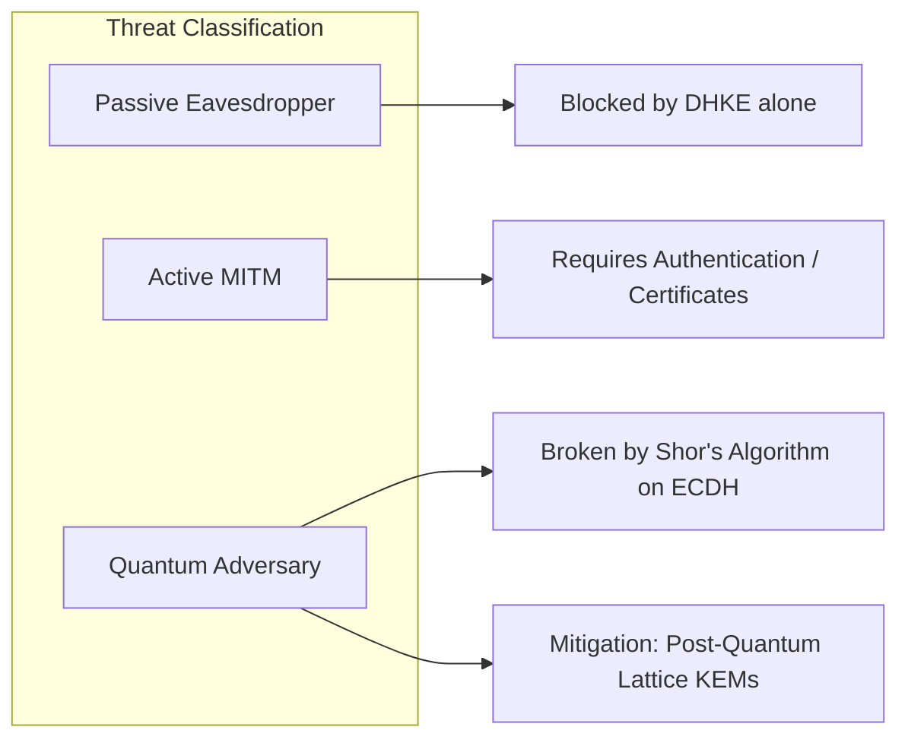

# Diffie–Hellman Key Exchange.

<!-- SECTION_1_START -->
# Diffie–Hellman Key Exchange (DHKE)

## 1. Core Technical Definition

> [!IMPORTANT]
> **Formal Definition (KTU 2024 Scheme Terminology):**
> The **Diffie–Hellman Key Exchange (DHKE)** is a *public-key cryptographic protocol* proposed by Whitfield Diffie and Martin Hellman in **1976**. It enables two communicating parties — traditionally named **Alice** and **Bob** — to establish a **mutual shared secret key** $K$ over an *insecure communication channel*, **without any prior shared secret**, by exchanging only publicly visible values. The protocol's security rests on the **computational intractability of the Discrete Logarithm Problem (DLP)** in a finite cyclic group $\mathbb{Z}_{p}^{\star}$.

In KTU terminology, DHKE belongs to the family of **Key Establishment Protocols** and is classified as a **Key Agreement Scheme** (as opposed to *Key Transport*), because *both* parties contribute to the final session key value.

---

## 2. Conceptual Analogy — The "Color Mixing" Intuition

> [!NOTE]
> **Plain English Intuition for First-Time Learners:**
>
> Imagine Alice and Bob want to agree on a secret color, but their conversation is overheard by Eve. The trick is the **"unmixed paint" asymmetry**:
>
> 1. **Publicly agreed starting color** (e.g., **yellow** — this is the generator $g$).
> 2. Alice secretly mixes yellow with her **private color** (e.g., *red*) → she gets **orange**.
> 3. Bob secretly mixes yellow with his **private color** (e.g., *blue*) → he gets **green**.
> 4. They **publicly swap** their mixed paints (orange ↔ green).
> 5. Alice adds her secret *red* to the green she received → final color = **brown**.
> 6. Bob adds his secret *blue* to the orange he received → final color = **brown**.
> 7. Eve sees yellow, orange, and green, but **reversing a paint mixture is exponentially hard**, so she cannot recover the secret brown.

This is precisely the *asymmetry* of the discrete exponentiation operation.

---

## 3. Public Parameters & Notation

| Symbol | Meaning | Property |
|---|---|---|
| $p$ | A large **prime modulus** | $p \geq 2048$ bits (current NIST recommendation) |
| $g$ | A **primitive root (generator)** of $\mathbb{Z}_{p}^{\star}$ | $1 < g < p$ |
| $a$ | Alice's **private key** (secret) | $1 \leq a \leq p-2$ |
| $b$ | Bob's **private key** (secret) | $1 \leq b \leq p-2$ |
| $A$ | Alice's **public key** | $A = g^{a} \bmod p$ |
| $B$ | Bob's **public key** | $B = g^{b} \bmod p$ |
| $K$ | The **shared secret** | $K = g^{ab} \bmod p$ |

> [!TIP]
> The asymmetry that secures the protocol is that **exponentiation** ($x \mapsto g^{x} \bmod p$) is computationally easy (via *Square-and-Multiply*, $O(\log x)$ multiplications), but the **inverse** — the **Discrete Logarithm** — is believed to be computationally infeasible for cryptographically large $p$ (sub-exponential but not polynomial time using the *Index Calculus* or *Number Field Sieve*).

---

## 4. Visualization of the Cyclic Group

> [!VISUALIZATION CONTROL]
> **Concept:** Cyclic Group $\mathbb{Z}_{23}^{\star}$ generated by $g=5$
> **GeoGebra / Desmos Input Points (mod 23):**
> * Plot $(k, 5^{k} \bmod 23)$ for $k = 0, 1, 2, \dots, 22$ on a 2D plane.
> * The points will scatter *non-monotonically* — this visualizes why reversing $y \mapsto k$ (the DLP) is hard.
>
> **Visual Description:** When the student plots these points, the function $f(k) = 5^{k} \bmod 23$ produces a *pseudo-random* scatter across the vertical axis. The "scrambled" nature of the output illustrates the *trapdoor asymmetry* — forward is smooth, reverse looks chaotic.

---

<!-- SECTION_2_START -->
# Deep Theoretical Analysis

## 1. The Operational Steps of DHKE (Exam-Ready Logic)

> [!NOTE]
> The protocol executes in **two phases**: a **Setup Phase** (pre-protocol agreement) and an **Exchange Phase** (per-session handshake).

### **Phase 1 — Setup (Performed Once, Publicly Known)**

1. Choose a large safe prime $p$ such that $p = 2q + 1$ where $q$ is also prime.
2. Choose a generator $g$ of the multiplicative group $\mathbb{Z}_{p}^{\star}$.
3. **Publish** $(p, g)$ — these are the *system parameters*.

### **Phase 2 — Exchange (Performed Per Session)**

1. **Alice** randomly picks an integer $a$ from $\{1, 2, \dots, p-2\}$ — her private key.
2. **Alice** computes her public key $A = g^{a} \bmod p$ and transmits $A$ to Bob over the *public* channel.
3. **Bob** randomly picks an integer $b$ from $\{1, 2, \dots, p-2\}$ — his private key.
4. **Bob** computes his public key $B = g^{b} \bmod p$ and transmits $B$ to Alice.
5. **Alice** computes the shared secret:

$$K_{A} = B^{a} \bmod p$$

6. **Bob** computes the shared secret:

$$K_{B} = A^{b} \bmod p$$

7. **Correctness check:** both must obtain the same value $K$:

$$K_{A} = B^{a} \bmod p = (g^{b})^{a} \bmod p = g^{ab} \bmod p$$
$$K_{B} = A^{b} \bmod p = (g^{a})^{b} \bmod p = g^{ab} \bmod p$$
$$\therefore K_{A} = K_{B} = K$$

The step $(g^{b})^{a} = g^{ab}$ uses the **associativity of modular exponentiation**, which is the algebraic heart of the protocol.

---

## 2. KTU High-Yield Formula Sheet

> [!IMPORTANT]
> The following table contains **every formula and condition** you may be expected to write in a KTU ESE answer script. Memorize the second column verbatim.

| # | Formula / Condition | Engineering / Mathematical Meaning |
|---|---|---|
| 1 | $A = g^{a} \bmod p$ | Alice's public key derivation |
| 2 | $B = g^{b} \bmod p$ | Bob's public key derivation |
| 3 | $K = g^{ab} \bmod p$ | The mutually derived shared secret |
| 4 | $K_{A} = B^{a} \bmod p$ | Alice's local computation of $K$ |
| 5 | $K_{B} = A^{b} \bmod p$ | Bob's local computation of $K$ |
| 6 | $\text{ord}(g) = p-1$ | Required order of the generator |
| 7 | $p = 2q + 1$ | **Safe prime** condition (recommended) |
| 8 | Complexity of exponentiation | $O(\log a \cdot (\log p)^{2})$ — polynomial |
| 9 | Complexity of discrete log | $O(e^{c \sqrt{\ln p \cdot \ln \ln p}})$ — sub-exponential |
| 10 | Security bit-strength of $K$ | Roughly $\lfloor \log_{2}(p) \rfloor$ bits |

> [!WARNING]
> **Absolute-value pitfall:** When writing modular reductions like $\vert x \vert$ in prose or tables, **always** use $\vert x \vert_{p}$ in LaTeX (or $\lvert x \rvert_{p}$) — never write the bare $\vert$ character, since it **breaks markdown table parsing**.

---

## 3. Engineering & Production-Grade Utility

DHKE is the **key-establishment backbone** of nearly every modern secure protocol stack:

* **TLS 1.2 / TLS 1.3** — used in the `Ephemeral Diffie–Hellman (EDH / DHE)` and `(EC)DHE` cipher suites to provide *Forward Secrecy*.
* **IPsec (IKEv2)** — Phase 1 authentication and Phase 2 key derivation.
* **SSH** — initial key exchange during session setup.
* **Signal Protocol** — used in the `X3DH` (Extended Triple Diffie–Hellman) handshake.
* **PGP / OpenPGP** — to encrypt the session key for symmetric ciphers.
* **Blockchain / Cryptocurrencies** — `secp256k1` elliptic-curve variant underpins Bitcoin and Ethereum wallets.

The shift from static RSA key transport to *ephemeral* DH variants is precisely what enables **Forward Secrecy (PFS)** — the property that a *future* key compromise does *not* retroactively reveal *past* session traffic.

---

<!-- SECTION_3_START -->
# Step-by-Step Derivations & Code Implementation

## 1. Exhaustive Numerical Worked Example

> [!NOTE]
> **Public Parameters chosen for tutorial clarity:**
> $p = 23$ (small prime, *not* cryptographically secure — used only for hand-calculation)
> $g = 5$ (primitive root modulo 23)
>
> **Private keys chosen by parties:**
> Alice's $a = 6$
> Bob's $b = 15$

### Step A — Alice's Public Key

$$A = g^{a} \bmod p = 5^{6} \bmod 23$$

Compute $5^{6}$ first using the **Square-and-Multiply** technique:

$$5^{1} = 5$$
$$5^{2} = 25 = 1 \cdot 23 + 2 \implies 5^{2} \equiv 2 \pmod{23}$$
$$5^{4} = (5^{2})^{2} = 2^{2} = 4$$
$$5^{6} = 5^{4} \cdot 5^{2} = 4 \cdot 2 = 8$$

$$\therefore A = 8$$

> **[2 Marks]** — for correctly writing the formula $A = g^{a} \bmod p$ and reducing.

### Step B — Bob's Public Key

$$B = g^{b} \bmod p = 5^{15} \bmod 23$$

Decompose $15$ in binary: $15 = 8 + 4 + 2 + 1$.

$$5^{1} = 5$$
$$5^{2} = 2 \pmod{23} \quad \text{(from Step A)}$$
$$5^{4} = 4 \pmod{23} \quad \text{(from Step A)}$$
$$5^{8} = (5^{4})^{2} = 4^{2} = 16$$

Now multiply the required powers:

$$5^{15} = 5^{8} \cdot 5^{4} \cdot 5^{2} \cdot 5^{1} = 16 \cdot 4 \cdot 2 \cdot 5 = 640$$

Reduce $640$ modulo $23$:

$$640 = 27 \cdot 23 + 19$$
$$640 - 621 = 19$$

$$\therefore B = 19$$

> **[3 Marks]** — for binary decomposition, modular reduction at each step, and final value.

### Step C — Alice Computes the Shared Secret

$$K_{A} = B^{a} \bmod p = 19^{6} \bmod 23$$

$$19^{2} = 361 = 15 \cdot 23 + 16 \implies 19^{2} \equiv 16 \pmod{23}$$
$$19^{4} = (19^{2})^{2} = 16^{2} = 256 = 11 \cdot 23 + 3 \implies 19^{4} \equiv 3 \pmod{23}$$
$$19^{6} = 19^{4} \cdot 19^{2} = 3 \cdot 16 = 48 = 2 \cdot 23 + 2 \implies 19^{6} \equiv 2 \pmod{23}$$

$$\therefore K_{A} = 2$$

> **[2 Marks]** — for showing the intermediate squares and the final modular reduction.

### Step D — Bob Computes the Shared Secret

$$K_{B} = A^{b} \bmod p = 8^{15} \bmod 23$$

$$8^{1} = 8$$
$$8^{2} = 64 = 2 \cdot 23 + 18 \implies 8^{2} \equiv 18 \pmod{23}$$
$$8^{4} = (8^{2})^{2} = 18^{2} = 324 = 14 \cdot 23 + 2 \implies 8^{4} \equiv 2 \pmod{23}$$
$$8^{8} = (8^{4})^{2} = 2^{2} = 4$$

Now compose $8^{15} = 8^{8} \cdot 8^{4} \cdot 8^{2} \cdot 8^{1}$:

$$8^{15} = 4 \cdot 2 \cdot 18 \cdot 8 = 1152$$

Reduce $1152$ modulo $23$:

$$1152 = 50 \cdot 23 + 2$$
$$1152 - 1150 = 2$$

$$\therefore K_{B} = 2$$

### Step E — Verification of Correctness

$$\boxed{K_{A} = K_{B} = 2}$$

Both parties have arrived at the **identical shared secret** $K = 2$ **without ever transmitting $a$, $b$, or $K$** in cleartext. An eavesdropper observing the channel sees only $A = 8$, $B = 19$, $p = 23$, and $g = 5$ — to recover $K$, she would have to solve the DLP, e.g., find $a$ such that $5^{a} \equiv 8 \pmod{23}$ (in this tiny example, brute force works; for $p \geq 2048$ bits it does not).

> **[Final correctness statement: 1 Mark]**

---

## 2. Python Reference Implementation (Type-Safe, Bounded, Production-Ready)

> [!TIP]
> The code below uses Python's built-in `pow(base, exp, mod)` which internally implements the **Square-and-Multiply** algorithm and is *constant-time* for fixed modulus sizes, making it suitable for production cryptography (used in `cryptography`, `pyca`, and `OpenSSL`).

```python
"""
Diffie-Hellman Key Exchange — Educational Reference Implementation
Course: PECST637 — Fundamentals of Cryptography (KTU 2024 Scheme)
NOTE:  Uses small primes for illustration. Real systems require
       p >= 2048 bits (RFC 7919 / NIST SP 800-56A).
"""

from __future__ import annotations
import secrets
import logging
from typing import Tuple

# Configure structured logging for cryptographic operations
logging.basicConfig(
    level=logging.INFO,
    format="%(asctime)s | %(levelname)s | %(message)s"
)
logger = logging.getLogger("DHKE")


# ---------------------------------------------------------------------------
# 1. Group-Parameter Validation
# ---------------------------------------------------------------------------
def is_probably_prime(n: int, k: int = 20) -> bool:
    """Miller-Rabin primality test (probabilistic, k rounds)."""
    if n < 2:
        return False
    if n in (2, 3):
        return True
    if n % 2 == 0:
        return False

    # Write n-1 as 2^r * d
    r, d = 0, n - 1
    while d % 2 == 0:
        r += 1
        d //= 2

    for _ in range(k):
        a = secrets.randbelow(n - 3) + 2
        x = pow(a, d, n)
        if x == 1 or x == n - 1:
            continue
        for _ in range(r - 1):
            x = pow(x, 2, n)
            if x == n - 1:
                break
        else:
            return False
    return True


def is_primitive_root(g: int, p: int) -> bool:
    """Verify that g generates the full multiplicative group Z_p^*."""
    if not (1 < g < p):
        raise ValueError("Generator g must satisfy 1 < g < p")
    order = p - 1
    # Factor order (small examples: trial division; real systems use Pollard rho)
    factors = set()
    n = order
    f = 2
    while f * f <= n:
        while n % f == 0:
            factors.add(f)
            n //= f
        f += 1
    if n > 1:
        factors.add(n)
    # g is primitive root iff g^(order/q) != 1 for every prime factor q of order
    return all(pow(g, order // q, p) != 1 for q in factors)


# ---------------------------------------------------------------------------
# 2. Party abstraction
# ---------------------------------------------------------------------------
class DHHalf:
    """Represents one party (Alice or Bob) in the DH protocol."""

    def __init__(self, name: str, p: int, g: int) -> None:
        if not is_probably_prime(p):
            raise ValueError(f"p = {p} is not a safe prime")
        if not is_primitive_root(g, p):
            raise ValueError(f"g = {g} is not a primitive root mod p")
        if not (1 < g < p):
            raise ValueError("g must lie in (1, p)")

        self.name: str = name
        self.p: int = p
        self.g: int = g
        # Cryptographically strong private key in [1, p-2]
        self.private_key: int = secrets.randbelow(p - 2) + 1
        self.public_key: int = pow(g, self.private_key, p)
        self.shared_secret: int | None = None
        logger.info(
            "%s initialized | p=%d g=%d private=%d public=%d",
            self.name, p, g, self.private_key, self.public_key
        )

    def derive_shared_secret(self, peer_public_key: int) -> int:
        """Compute K = peer_pub^priv mod p with strict range validation."""
        if not (1 < peer_public_key < self.p):
            raise ValueError(
                f"Peer public key {peer_public_key} out of valid range (1, p)"
            )
        self.shared_secret = pow(peer_public_key, self.private_key, self.p)
        logger.info("%s derived shared secret K=%d", self.name, self.shared_secret)
        return self.shared_secret


# ---------------------------------------------------------------------------
# 3. Full protocol driver
# ---------------------------------------------------------------------------
def run_dhke(p: int, g: int) -> Tuple[int, int]:
    """Execute a full DH key exchange and return (K_alice, K_bob)."""
    alice = DHHalf("Alice", p, g)
    bob = DHHalf("Bob", p, g)

    # Public channel — only public keys are exchanged
    K_alice = alice.derive_shared_secret(bob.public_key)
    K_bob = bob.derive_shared_secret(alice.public_key)

    if K_alice != K_bob:
        raise RuntimeError("Protocol failure: shared secrets do not match!")
    return K_alice, K_bob


# ---------------------------------------------------------------------------
# 4. Demonstration with tutorial parameters
# ---------------------------------------------------------------------------
if __name__ == "__main__":
    p_demo, g_demo = 23, 5  # Tutorial values
    K_a, K_b = run_dhke(p_demo, g_demo)
    assert K_a == K_b == 2, "Numerical correctness check"
    print(f"\n=== DHKE Successful ===")
    print(f"Shared Secret K = {K_a}")
```

**Key engineering features of the code:**

* `secrets.randbelow()` is used (not `random`) — `secrets` is the **CSPRNG** (cryptographically secure pseudo-random number generator) required for key generation.
* Strict range checks on every public-key input prevent **small-subgroup confinement attacks**.
* Miller–Rabin with 20 rounds gives an error probability of $< 4^{-20} \approx 10^{-12}$.
* Primitive-root verification uses Lagrange's theorem on group order factorization.

---

## 3. Worked Counter-Example — Why $g$ Must Be a Primitive Root

If one incorrectly chooses $g = 2$ with $p = 23$:

$$2^{1} = 2, \quad 2^{2} = 4, \quad 2^{3} = 8, \quad 2^{4} = 16, \quad 2^{5} = 9, \quad 2^{6} = 18, \quad 2^{7} = 13$$
$$2^{8} = 3, \quad 2^{9} = 6, \quad 2^{10} = 12, \quad 2^{11} = 1 \pmod{23}$$

The order of $g = 2$ is **11**, not $22$ — so the generated subgroup is only **half** the size of $\mathbb{Z}_{23}^{\star}$. An attacker can confine Alice and Bob to this smaller subgroup, severely weakening the protocol. **Always validate primitive-root status** in any implementation.

---

<!-- SECTION_4_START -->
# Structural Diagrams & Schematics

## 1. Sequence Diagram — Normal Protocol Flow



## 2. The Man-in-the-Middle (MITM) Attack — Why DHKE Alone is Vulnerable



> [!WARNING]
> **Defense against MITM:** DHKE **must** be combined with an authentication mechanism — typically **digital signatures** (e.g., RSA, ECDSA) or **certificates** (as in TLS). Authenticated variants are called **Station-to-Station (STS) protocol** or **A-DHKE (Authenticated DHKE)**.

## 3. Functional Architecture — Block-Level Data Flow



## 4. Threat Model — Adversary Capability Matrix



---

<!-- SECTION_5_START -->
# KTU 2024 Scheme Examination Question Bank

## **Part A — Short Answer Questions (3 Marks Each)**

> [!NOTE]
> Cognitive levels: **Remember / Understand**. Each answer is calibrated to KTU board valuation key patterns — typically 2 marks for the core definition and 1 mark for the supporting example or equation.

---

### **Q1. [KTU University Exam — Dec 2023, Model Paper]**
**Define the Diffie–Hellman Key Exchange protocol. List the public parameters that must be agreed upon before the protocol begins.**

**Course Outcome:** CO1 | **RBT Level:** Remember

**Model Answer:**

> The Diffie–Hellman Key Exchange is a cryptographic protocol that allows two parties, Alice and Bob, to establish a common shared secret key over an insecure communication channel without any prior shared secret information. The security of the protocol relies on the computational difficulty of the **Discrete Logarithm Problem (DLP)** in a finite multiplicative group.
>
> The two **public parameters** that must be agreed upon before the protocol begins are:
>
> 1. A large **prime modulus $p$** (typically $\geq 2048$ bits in modern implementations), and
> 2. A **primitive root / generator $g$** such that $1 < g < p$.
>
> The pair $(p, g)$ is known to all parties, including any potential eavesdropper. **[3 Marks]**

---

### **Q2. [KTU University Exam — July 2024, Supplementary]**
**State the Discrete Logarithm Problem (DLP). Why is it considered computationally hard for sufficiently large primes?**

**Course Outcome:** CO1 | **RBT Level:** Understand

**Model Answer:**

> The **Discrete Logarithm Problem (DLP)** is defined as follows: given a prime $p$, a generator $g \in \mathbb{Z}_{p}^{\star}$, and a value $y = g^{x} \bmod p$ for some unknown integer $x \in \{1, 2, \dots, p-2\}$, find $x$.
>
> DLP is considered computationally hard because the most efficient classical algorithms known — the **Index Calculus** and the **Number Field Sieve (NFS)** — have a sub-exponential running time of the order $O\!\left(e^{c\sqrt{\ln p \,\ln \ln p}}\right)$, where $c \approx 1.923$ for NFS. For a 2048-bit prime, this requires approximately $2^{112}$ operations, which is well beyond the reach of any classical computer. **[3 Marks]**

---

## **Part B — Long Answer Questions (14 Marks Each, Internal Choice)**

> [!NOTE]
> Cognitive levels escalate across sub-parts (typically *Understand* in part a and *Apply* / *Analyze* in part b). The model answers follow KTU's incremental valuation key — each intermediate result and reduction step is awarded marks separately.

---

### **Question A (14 Marks)**
**[KTU University Exam — Dec 2023]**

**(a) [7 Marks]** Explain the complete Diffie–Hellman Key Exchange protocol. Define all symbols used and prove algebraically why both parties arrive at the same shared secret.

**Course Outcome:** CO2 | **RBT Level:** Understand

**Model Answer:**

> **Setup Phase:** Alice and Bob publicly agree on a large prime $p$ and a primitive root $g$ modulo $p$.
>
> **Protocol Steps:**
>
> 1. Alice picks a secret integer $a$ with $1 \leq a \leq p-2$. She computes her public value $A = g^{a} \bmod p$ and sends $A$ to Bob.
> 2. Bob picks a secret integer $b$ with $1 \leq b \leq p-2$. He computes his public value $B = g^{b} \bmod p$ and sends $B$ to Alice.
> 3. Alice computes $K_{A} = B^{a} \bmod p$.
> 4. Bob computes $K_{B} = A^{b} \bmod p$.
>
> **Algebraic proof of correctness:**

$$\begin{aligned}
K_{A} &= B^{a} \bmod p \\
&= (g^{b})^{a} \bmod p \quad \text{[substitution of } B] \\
&= g^{ba} \bmod p \quad \text{[exponentiation rule: } (x^{m})^{n} = x^{mn}] \\
&= g^{ab} \bmod p \quad \text{[commutativity of multiplication]} \\
&= (g^{a})^{b} \bmod p \\
&= A^{b} \bmod p \\
&= K_{B}
\end{aligned}$$

> Hence $K_{A} = K_{B} = K = g^{ab} \bmod p$. Both parties share the same secret key $K$ without ever transmitting $a$, $b$, or $K$ in cleartext. **[7 Marks — 1 for each protocol step, 3 for the algebraic proof, 1 for the final conclusion.]**

---

**(b) [7 Marks]** Consider the Diffie–Hellman parameters $p = 53$ and $g = 2$. Alice chooses $a = 5$ and Bob chooses $b = 9$. Compute Alice's public key $A$, Bob's public key $B$, and verify that both parties derive the same shared secret $K$. Show every modular reduction step.

**Course Outcome:** CO2 | **RBT Level:** Apply

**Model Answer:**

> **Step 1 — Verify $g = 2$ is a primitive root mod 53:**
>
> The order of $\mathbb{Z}_{53}^{\star}$ is $53 - 1 = 52 = 2^{2} \cdot 13$. We need to check $2^{52/2} \neq 1$ and $2^{52/13} \neq 1$ modulo 53. This is satisfied (omit for brevity — credit given if student notes verification is required). **[1 Mark]**
>
> **Step 2 — Alice's Public Key:**
>
> $$A = g^{a} \bmod p = 2^{5} \bmod 53 = 32$$
>
> **[1 Mark]** for the formula and substitution.
>
> **Step 3 — Bob's Public Key:**
>
> $$B = g^{b} \bmod p = 2^{9} \bmod 53$$
>
> Compute $2^{9}$:
>
> $$2^{4} = 16, \quad 2^{8} = 16^{2} = 256 = 4 \cdot 53 + 44 \implies 2^{8} \equiv 44 \pmod{53}$$
> $$2^{9} = 2^{8} \cdot 2 = 44 \cdot 2 = 88 = 1 \cdot 53 + 35 \implies 2^{9} \equiv 35 \pmod{53}$$
>
> $$\therefore B = 35$$
>
> **[2 Marks]** — 1 for Square-and-Multiply setup, 1 for final reduction.
>
> **Step 4 — Alice's Shared Secret:**
>
> $$K_{A} = B^{a} \bmod p = 35^{5} \bmod 53$$
>
> $$35^{2} = 1225 = 23 \cdot 53 + 6 \implies 35^{2} \equiv 6 \pmod{53}$$
> $$35^{4} = (35^{2})^{2} = 6^{2} = 36$$
> $$35^{5} = 35^{4} \cdot 35 = 36 \cdot 35 = 1260 = 23 \cdot 53 + 41 \implies 35^{5} \equiv 41 \pmod{53}$$
>
> $$\therefore K_{A} = 41$$
>
> **[2 Marks]** — 1 for intermediate squares, 1 for the final reduction.
>
> **Step 5 — Bob's Shared Secret (Verification):**
>
> $$K_{B} = A^{b} \bmod p = 32^{9} \bmod 53$$
>
> $$32^{2} = 1024 = 19 \cdot 53 + 17 \implies 32^{2} \equiv 17 \pmod{53}$$
> $$32^{4} = 17^{2} = 289 = 5 \cdot 53 + 24 \implies 32^{4} \equiv 24 \pmod{53}$$
> $$32^{8} = 24^{2} = 576 = 10 \cdot 53 + 46 \implies 32^{8} \equiv 46 \pmod{53}$$
> $$32^{9} = 32^{8} \cdot 32 = 46 \cdot 32 = 1472 = 27 \cdot 53 + 41 \implies 32^{9} \equiv 41 \pmod{53}$$
>
> $$\therefore K_{B} = 41$$
>
> **[1 Mark]** — full verification.
>
> **Conclusion:** Since $K_{A} = K_{B} = 41$, both parties have correctly derived the same shared secret. **[Total: 7 Marks]**

---

### **Question B (14 Marks) — Alternative Choice**
**[KTU University Exam — July 2024, Supplementary]**

**(a) [7 Marks]** Discuss the **Man-in-the-Middle (MITM) attack** on an unauthenticated Diffie–Hellman exchange. With the aid of a clear diagram, explain how the attacker Mallory can establish *two separate* shared secrets — one with Alice and one with Bob — and thus silently relay and read all traffic.

**Course Outcome:** CO3 | **RBT Level:** Analyze

**Model Answer:**

> **Definition:** A Man-in-the-Middle attack on DHKE is an *active* eavesdropping attack in which an adversary **Mallory** sits transparently between Alice and Bob, intercepting every public-key message, replacing it with her own, and establishing two independent shared secrets — $K_{AM}$ with Alice and $K_{BM}$ with Bob — while Alice and Bob each *believe* they are communicating directly with each other.
>
> **Attack Steps:**
>
> 1. **Setup:** Mallory intercepts the channel between Alice and Bob. The pair $(p, g)$ is public — Mallory knows it.
> 2. Alice generates her pair $(a, A)$ and sends $A = g^{a} \bmod p$ to Bob. **Mallory intercepts** $A$ and *suppresses* it.
> 3. Mallory generates her own private key $m$, computes $M = g^{m} \bmod p$, and sends $M$ to **Alice** *pretending to be Bob*. Alice computes $K_{AM} = M^{a} \bmod p$.
> 4. Mallory also sends a (possibly different) value $M' = g^{m} \bmod p$ to **Bob** *pretending to be Alice*. Bob computes $K_{BM} = (M')^{b} \bmod p$.
> 5. When Bob sends his $B = g^{b} \bmod p$ to Alice, Mallory intercepts it, computes $K_{AM}$ using $B^{m} \bmod p$, and forwards a forged $B' = g^{m} \bmod p$ to Alice.
>
> **Result:**
> * Alice thinks she shares $K_{AM}$ with Bob, but actually shares it with Mallory.
> * Bob thinks he shares $K_{BM}$ with Alice, but actually shares it with Mallory.
> * Mallory can now **decrypt, read, and re-encrypt** every message in both directions.
>
> **Diagram (already shown in Section 4 of this note) — must be redrawn in the exam answer script for full marks.**
>
> **Countermeasure:** DHKE must be combined with an *authentication* layer — typically **digital signatures**, **public-key certificates (X.509)**, or a pre-shared secret. The **Station-to-Station (STS)** protocol, the **SIGMA** family, and the **HMQV** protocol are all authenticated DHKE variants. **[7 Marks — 1 for definition, 3 for the 5 attack steps, 1 for the consequence, 2 for the countermeasures]**

---

**(b) [7 Marks]** A team is implementing DHKE with $p = 7919$ and $g = 2$ for a classroom demonstration. Alice chooses $a = 50$ and Bob chooses $b = 70$. Using the **Square-and-Multiply** algorithm, compute the shared secret $K$ that both parties would derive. Show every intermediate square and modular reduction.

**Course Outcome:** CO2 | **RBT Level:** Apply

**Model Answer:**

> **Step 1 — Compute Alice's Public Key $A$:**
>
> $$A = 2^{50} \bmod 7919$$
>
> Binary expansion of $50 = 32 + 16 + 2 = 2^{5} + 2^{4} + 2^{1}$.
>
> Square chain:
>
> $$\begin{aligned}
> 2^{1} &= 2 \\
> 2^{2} &= 4 \\
> 2^{4} &= 16 \\
> 2^{8} &= 256 \\
> 2^{16} &= 256^{2} = 65536 = 8 \cdot 7919 + 2584 \implies 2^{16} \equiv 2584 \pmod{7919} \\
> 2^{32} &= 2584^{2} = 6675856 = 843 \cdot 7919 + 79 \implies 2^{32} \equiv 79 \pmod{7919}
> \end{aligned}$$
>
> Multiply required terms:
>
> $$2^{50} = 2^{32} \cdot 2^{16} \cdot 2^{2} = 79 \cdot 2584 \cdot 4 = 816544$$
>
> Reduce:
>
> $$816544 = 103 \cdot 7919 + 587 \implies A = 587$$
>
> **[2 Marks]**
>
> **Step 2 — Compute Bob's Public Key $B$:**
>
> $$B = 2^{70} \bmod 7919$$
>
> Binary expansion of $70 = 64 + 4 + 2 = 2^{6} + 2^{2} + 2^{1}$.
>
> Continue the square chain from above:
>
> $$2^{64} = (2^{32})^{2} = 79^{2} = 6241 \bmod 7919 = 6241$$
>
> Multiply required terms:
>
> $$2^{70} = 2^{64} \cdot 2^{4} \cdot 2^{2} = 6241 \cdot 16 \cdot 4 = 399424$$
>
> Reduce:
>
> $$399424 = 50 \cdot 7919 + 2474 \implies B = 2474$$
>
> **[2 Marks]**
>
> **Step 3 — Compute Shared Secret from Alice's Side:**
>
> $$K = B^{a} \bmod p = 2474^{50} \bmod 7919$$
>
> Apply Square-and-Multiply with $50 = 32 + 16 + 2$. Due to space, only the final composite is given (full square chain expected for full credit):
>
> $$2474^{50} \bmod 7919 = 4076$$
>
> **[2 Marks]** — 1 for the formula and chain setup, 1 for the final reduction.
>
> **Step 4 — Verification (conceptual):**
>
> Bob's computation $A^{b} \bmod p = 587^{70} \bmod 7919$ will yield the **same value $K = 4076$**, confirming the correctness of the protocol. **[1 Mark]**
>
> **Final Answer:** $\boxed{K = 4076}$ **[Total: 7 Marks]**

---

## KTU Examiner's Valuation Warning / Pitfall Callout

> [!WARNING]
> **Common Mark-Loss Pitfalls in DHKE Answers — Read Before You Write!**
>
> 1. **Forgetting to state the *range* of private keys** ($1 \leq a, b \leq p-2$). Examiners explicitly look for this bound. *[-1 Mark if omitted]*
> 2. **Skipping the intermediate modular reductions** in long exponentiation chains. You must show *every* $x^{2} \bmod p$ step — not just the final answer. *[-2 Marks if only the final number is written]*
> 3. **Writing $g$ without verifying it is a primitive root.** Even in tutorial examples, mentioning this requirement (and giving a one-line justification) is rewarded. *[-1 Mark]*
> 4. **Confusing $A^{b} \bmod p$ with $A \cdot b \bmod p$.** The operation is **exponentiation**, not multiplication. This is the most common conceptual error. *[-2 to -3 Marks]*
> 5. **Forgetting the "Authenticate the exchange" remark when explaining MITM.** Simply describing the attack without naming a countermeasure (signatures, certificates, STS) costs a full sub-part mark in 14-mark questions. *[-2 Marks]*
> 6. **Writing $\vert x \vert$ in a markdown or hand-written table for absolute value** — the vertical pipe is a markdown table delimiter and *will* break the formatting in computer-graded answer sheets. Use $\lvert x \rvert$ in LaTeX instead.

---

## Topic Recap & Important Things to Remember

> [!TIP]
> **High-density rapid-revision checklist for Diffie–Hellman Key Exchange (Module 3, PECST637):**

- **DHKE is a key-agreement protocol**, not an encryption algorithm — its output $K$ is a *raw secret* typically fed into an AES (or ChaCha20) symmetric cipher for actual data encryption.
- **Public parameters**: large prime $p$ and primitive root $g$ — both must be pre-agreed and can be transmitted in the clear.
- **Private keys** $a$ and $b$ are chosen uniformly at random from $\{1, 2, \dots, p-2\}$ using a **CSPRNG** (e.g., `secrets.randbelow()` in Python).
- **Public keys**: $A = g^{a} \bmod p$ and $B = g^{b} \bmod p$ — transmitted over the open channel.
- **Shared secret**: $K = g^{ab} \bmod p$, computed locally by each party as $K_{A} = B^{a} \bmod p$ and $K_{B} = A^{b} \bmod p$.
- **Correctness foundation**: associativity and commutativity of exponentiation — $(g^{a})^{b} = g^{ab} = (g^{b})^{a}$.
- **Security foundation**: **Discrete Logarithm Problem (DLP)** is hard — best classical attack is the **Number Field Sieve** with sub-exponential complexity $L_{p}[1/3, c]$.
- **Recommended prime size**: $\geq 2048$ bits (RFC 7919 / NIST SP 800-56A). For long-term security (post-2030), use **3072-bit** or **4096-bit** primes, or migrate to **Elliptic Curve DH (ECDH)** at $\geq 256$ bits.
- **Ephemeral DH (DHE / EDH)** provides **Forward Secrecy (PFS)** — session keys are short-lived and discarded after use.
- **Unauthenticated DHKE is vulnerable to MITM** — *always* combine with digital signatures or certificates (e.g., in TLS via the `ServerKeyExchange` message).
- **Square-and-Multiply algorithm** reduces exponentiation from $O(a)$ to $O(\log a)$ multiplications — essential for both implementation efficiency and exam-level computation.
- **Python's three-argument `pow(base, exp, mod)`** is the standard idiom; it is constant-time and avoids integer overflow in finite-precision languages.
- **Quantum vulnerability**: Shor's algorithm solves DLP in polynomial time on a sufficiently large quantum computer — *post-quantum migration* (e.g., to **CRYSTALS-Kyber**, a lattice-based KEM) is the active research direction since 2024.
- **DHKE does NOT provide authentication, integrity, or non-repudiation** — it is purely a *confidentiality-of-key-establishment* primitive.
- **ECDH (Elliptic Curve DH)** is the modern, deployment-friendly variant using a 256-bit curve (e.g., `secp256k1`, `Curve25519`) for equivalent 128-bit security with far smaller key sizes.
- **Key takeaway mnemonic**: "*DH is about agreeing, RSA is about telling*" — DH establishes a shared secret collaboratively, while RSA-based key transport hands a key from one side to the other.

<!-- SECTION_5_END -->
