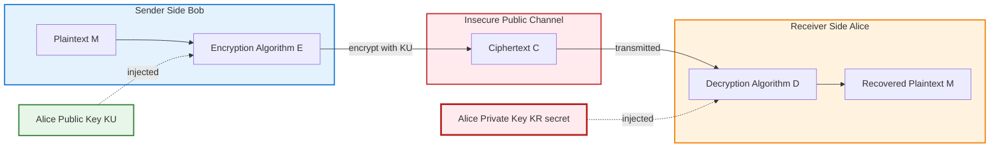
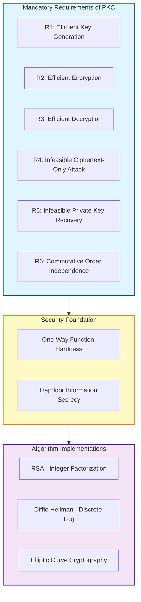
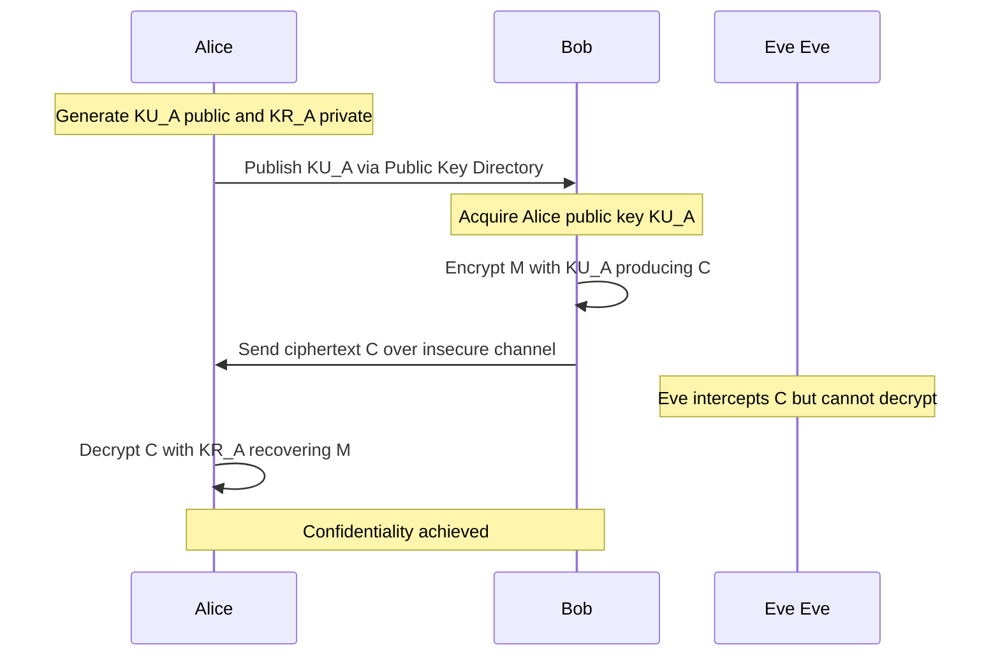
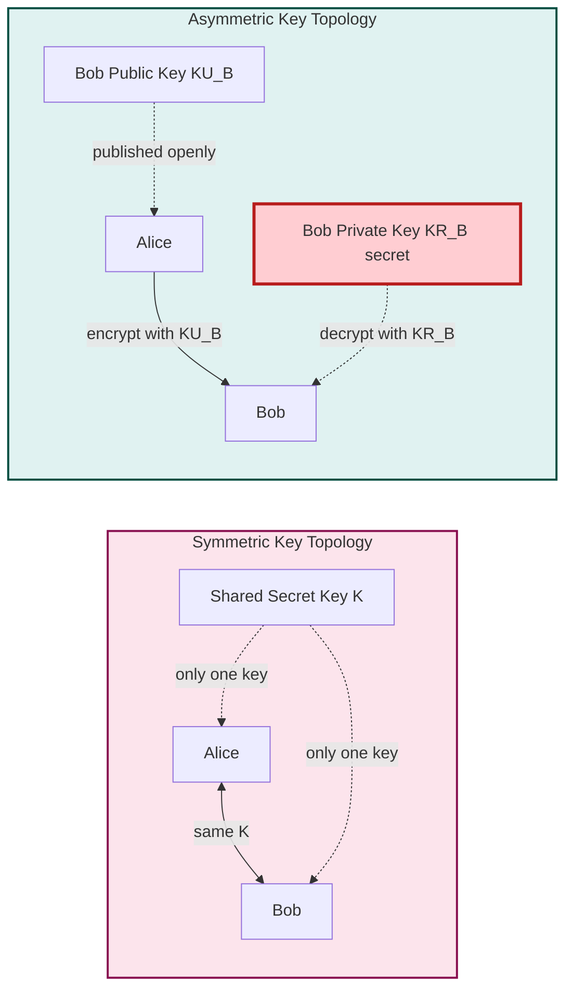
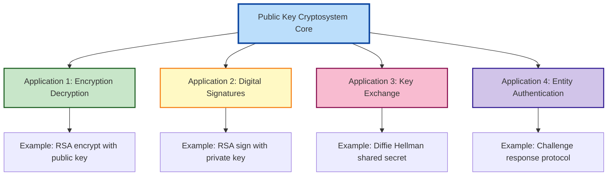

# Principles of Public-Key Cryptosystems - Public-Key Cryptosystems

<!-- SECTION_1_START -->
# Public-Key Cryptosystems — Core Foundation & Intuition

## 1.1 Formal Academic Definition

A **Public-Key Cryptosystem (PKC)**, also known as an **Asymmetric Cryptosystem**, is a cryptographic framework in which each communicating entity possesses a mathematically related pair of distinct keys: a **public key** $KU$ that is openly distributed and a **private key** $KR$ that is held in strict secrecy. The system derives its security from computationally hard mathematical problems such as the **Integer Factorization Problem (IFP)** or the **Discrete Logarithm Problem (DLP)** rather than from a shared secret.

> [!IMPORTANT]
> **KTU 2024 Syllabus Definition (PECST637 / Module 3):**
> A public-key cryptosystem is a cryptographic protocol wherein encryption and decryption are performed using two different keys, where one key is published openly and the other is kept private, with the security of the system resting on trapdoor one-way functions.

## 1.2 The "Why" Behind Public-Key Cryptography

Traditional **symmetric-key cryptography** (e.g., **AES**, **DES**, **3DES**) suffers from one crippling weakness: the same secret key must be shared between sender and receiver *before* secure communication can begin. If $n$ users wish to communicate pairwise, the total number of unique secret keys required scales as:

$$
\text{Keys}_{\text{symmetric}} = \frac{n(n-1)}{2}
$$

This quadratic explosion creates a **key distribution nightmare**.

## 1.3 Conceptual Analogy — The Mailbox Model

> [!NOTE]
> **Plain English Intuition — The "Public Mailbox" Analogy:**
>
> Imagine a city where every resident has a transparent **mailbox with a wide slot** (the public key) for anyone to drop letters into, and a **private key** to their house that only *they* possess.
>
> - Any stranger can walk up, slide a sealed letter into the slot — but **no one except the owner can read it** because only the owner holds the matching private key.
> - Conversely, the owner can use their private key to "sign" a letter digitally; anyone with the public key can verify the signature came from the owner.
>
> This dual capability — **confidentiality** (encryption with public key) and **authenticity** (signing with private key) — is the genius of asymmetric cryptography.

## 1.4 The Three Structural Components

Every public-key cryptosystem is built from three algorithmic primitives:

| Component | Symbol | Purpose |
|---|---|---|
| **Key Generation Algorithm** | $\mathcal{G}$ | Produces the $(KU, KR)$ key pair |
| **Encryption Algorithm** | $\mathcal{E}_{KU}$ | Transforms plaintext $M$ into ciphertext $C$ using the recipient's public key |
| **Decryption Algorithm** | $\mathcal{D}_{KR}$ | Recovers plaintext $M$ from ciphertext $C$ using the recipient's private key |

## 1.5 Real-World Examples (Standard Implementations)

> [!IMPORTANT]
> **Industry-Standard Public-Key Algorithms Studied Under KTU PECST637:**
>
> - **RSA** (Rivest–Shamir–Adleman, 1977) — based on Integer Factorization
> - **Diffie–Hellman Key Exchange** (1976) — based on Discrete Logarithm
> - **Elliptic Curve Cryptography (ECC)** — based on Elliptic Curve Discrete Logarithm Problem (ECDLP)
> - **ElGamal** — variant of Diffie–Hellman
> - **DSA / ECDSA** — Digital Signature Algorithms

> [!VISUALIZATION CONTROL]
> **Concept:** Conceptual asymmetry between Public Key and Private Key operations
> **GeoGebra / Desmos Input Equations (symbolic mapping):**
> * $f_{\text{public}}(x) = x^{e} \bmod n$  (Easy — encryption direction)
> * $f_{\text{private}}(y) = y^{d} \bmod n$  (Easy for owner — decryption direction)
> * $f_{\text{attack}}(n) = \text{factor}(n)$  (Hard — attacker's task)
>
> **Visual Description:** A two-way arrow diagram where the forward (encryption) and reverse (decryption) operations are computationally cheap, but the side-channel (private key recovery from public key) is exponentially expensive. Students should picture the "trapdoor" as a hidden algebraic shortcut available only to the key holder.

---

<!-- SECTION_1_END -->

<!-- SECTION_2_START -->
# Deep Theoretical Analysis & KTU High-Yield Formula Sheet

## 2.1 Formal Mathematical Model of a Public-Key Encryption Scheme

A public-key encryption system is formally defined as a **tuple of three probabilistic polynomial-time algorithms**:

$$
\text{PKC} = (\mathcal{G}, \mathcal{E}, \mathcal{D})
$$

Where each algorithm performs the following:

**Step 1 — Key Generation:** $\mathcal{G}$ outputs a public/private key pair:
$$
(k_u, k_r) \leftarrow \mathcal{G}(1^{\lambda})
$$
Here, $1^{\lambda}$ denotes the security parameter (key size in bits, e.g., $\lambda = 2048$ for RSA-2048).

**Step 2 — Encryption:** The sender uses the public key $k_u$ to encrypt plaintext $m \in \mathcal{M}$ (message space):
$$
c \leftarrow \mathcal{E}_{k_u}(m)
$$

**Step 3 — Decryption:** The receiver uses the private key $k_r$ to recover plaintext:
$$
m = \mathcal{D}_{k_r}(c)
$$

**Step 4 — Correctness Constraint:** For every valid key pair and every $m \in \mathcal{M}$:
$$
\mathcal{D}_{k_r}(\mathcal{E}_{k_u}(m)) = m
$$

> [!NOTE]
> **Why This Matters in Production:**
> Modern protocols like **TLS 1.3**, **PGP**, **S/MIME**, and **SSH** all use this exact three-tuple model under the hood. Even when symmetric ciphers do the bulk data encryption, the public-key component handles **key exchange** and **authentication**.

## 2.2 The Six Mandatory Requirements of a Public-Key Cryptosystem

For any public-key scheme to be **practically secure and useful**, the following six conditions (as enumerated in **Diffie & Hellman's seminal 1976 paper** and the standard KTU textbook by **William Stallings**) must hold:

| # | Requirement | Mathematical Statement |
|---|---|---|
| 1 | **Efficient key generation** | $\mathcal{G}(1^{\lambda})$ runs in polynomial time |
| 2 | **Efficient encryption** | $\mathcal{E}_{k_u}(m)$ is computationally easy for any sender |
| 3 | **Efficient decryption** | $\mathcal{D}_{k_r}(c)$ is computationally easy for the legitimate receiver |
| 4 | **Infeasibility of decryption without private key** | For any PPT adversary $\mathcal{A}$, $\Pr[\mathcal{D}'(k_u, c) = m]$ is negligible |
| 5 | **Infeasibility of private key recovery** | Computing $k_r$ from $k_u$ is computationally intractable |
| 6 | **Order independence (commutativity)** | $\mathcal{D}_{k_r}(\mathcal{E}_{k_u}(m)) = \mathcal{E}_{k_u}(\mathcal{D}_{k_r}(m)) = m$ |

> [!IMPORTANT]
> **Requirement #6 — The Signature Trick:**
> This commutativity property is what enables **digital signatures**. If Alice encrypts with her *private* key, anyone with her *public* key can decrypt — proving the message came from Alice (authentication + non-repudiation).

## 2.3 One-Way Functions and Trapdoor One-Way Functions

### 2.3.1 One-Way Function (OWF)

A function $f: \mathcal{X} \rightarrow \mathcal{Y}$ is a **one-way function** if:

- $f(x)$ is **easy** to compute for all $x \in \mathcal{X}$
- $f^{-1}(y)$ is **infeasible** to compute for randomly chosen $y \in \text{Range}(f)$

**Examples in cryptography:**
- Integer multiplication: $f(p, q) = p \cdot q$ (easy); factoring $N$ (hard)
- Modular exponentiation: $f(x) = g^{x} \bmod p$ (easy); discrete log (hard)
- Hash functions: SHA-256 (easy forward, hard to invert)

### 2.3.2 Trapdoor One-Way Function (TOWF)

A **trapdoor one-way function** is a special OWF with an additional secret parameter $t$ (the **trapdoor**):

$$
f_t: \mathcal{X} \rightarrow \mathcal{Y} \quad \text{where} \quad f_t^{-1} \text{ is easy to compute given } t
$$

| Function | Public Operation $f$ | Trapdoor $t$ | Inversion Without Trapdoor |
|---|---|---|---|
| **RSA** | $c = m^{e} \bmod n$ | $d = e^{-1} \bmod \phi(n)$ | Integer Factorization (NP-hard-ish) |
| **Diffie–Hellman** | $A = g^{a} \bmod p$ | $a$ (the private exponent) | Discrete Logarithm Problem |
| **Rabin** | $c = m^{2} \bmod n$ | $p, q$ (factors of $n$) | Modular square root factoring |

## 2.4 KTU High-Yield Formula Sheet

> [!NOTE]
> **Cheat Sheet — Memorize These for KTU Board Exams:**

| # | Concept | Formula / Statement |
|---|---|---|
| 1 | Symmetric key count for $n$ users | $K_s = \dfrac{n(n-1)}{2}$ |
| 2 | Asymmetric key count for $n$ users | $K_a = 2n$ (one public + one private per user) |
| 3 | RSA encryption | $C = M^{e} \bmod n$ |
| 4 | RSA decryption | $M = C^{d} \bmod n$ |
| 5 | RSA key relation | $e \cdot d \equiv 1 \pmod{\phi(n)}$ |
| 6 | Euler's totient | $\phi(n) = (p-1)(q-1)$ where $n = pq$ |
| 7 | Diffie–Hellman shared secret | $K = g^{ab} \bmod p$ |
| 8 | Discrete log hardness | Given $g$, $p$, $A = g^{a} \bmod p$, find $a$ → infeasible |
| 9 | Kerckhoffs' principle | Security must reside only in the key, not the algorithm |
| 10 | Public-key correctness | $\mathcal{D}_{k_r}(\mathcal{E}_{k_u}(M)) = M$ for all $M$ |

## 2.5 Four Canonical Applications of Public-Key Cryptosystems

> [!IMPORTANT]
> **The four primary uses (Kahate & Stallings framework):**
>
> 1. **Encryption / Decryption** — Sender uses receiver's $KU$ to encrypt; receiver uses $KR$ to decrypt.
> 2. **Digital Signatures** — Sender signs with own $KR$; receiver verifies with sender's $KU$.
> 3. **Key Exchange / Establishment** — Two parties derive a shared symmetric session key over an insecure channel (e.g., Diffie–Hellman).
> 4. **Entity Authentication** — Challenge–response protocols using public-key operations to prove identity.

## 2.6 Engineering Utility in Real Systems

| Domain | Where PKC Is Deployed |
|---|---|
| **HTTPS / TLS** | RSA / ECDHE for key exchange; RSA / ECDSA for server authentication |
| **Email Security** | PGP and S/MIME use RSA for encryption and signing |
| **Blockchain** | Bitcoin uses ECDSA (secp256k1) for transaction signatures |
| **SSH Login** | RSA / Ed25519 keys replace password authentication |
| **PKI (Public Key Infrastructure)** | X.509 certificates bind public keys to identities via CA hierarchy |
| **JWT Tokens** | RS256 algorithm uses RSA to sign JSON Web Tokens |

> [!WARNING]
> **KTU Common Mistake:** Students often confuse *public-key encryption* with *digital signatures*. Memorize the mnemonic: **"Encrypt with Public, Decrypt with Private"** gives *confidentiality*. **"Sign with Private, Verify with Public"** gives *authenticity*. Crossing these up is a guaranteed 2-mark loss on KTU exams.
<!-- SECTION_2_END -->

<!-- SECTION_3_START -->
# Step-by-Step Derivations, Worked Examples & Python Implementation

## 3.1 Derivation: Why $2n$ Keys Suffice for $n$ Users in Asymmetric Crypto

**Starting Premise:** In a network of $n$ users, every user needs a unique public key $KU_i$ and a unique private key $KR_i$.

**Step 1:** Each user generates exactly one key pair $(KU_i, KR_i)$.
**Step 2:** Total keys per user = **2**.
**Step 3:** Total keys in system = $2 \times n = 2n$.

**Comparison with symmetric case:**

$$
\begin{aligned}
\text{Symmetric keys} &= \binom{n}{2} = \frac{n(n-1)}{2} \\
\text{Asymmetric keys} &= 2n
\end{aligned}
$$

**Numerical Example for $n = 100$ users:**

$$
\begin{aligned}
\text{Symmetric keys} &= \frac{100 \times 99}{2} = 4950 \\
\text{Asymmetric keys} &= 2 \times 100 = 200
\end{aligned}
$$

The asymmetric scheme requires $\approx 24.75\times$ fewer keys. **[2 Marks for the derivation; 1 Mark for numerical comparison]**

---

## 3.2 Worked Example: Mini-RSA Encryption with Small Primes

This KTU-favorite exam problem tests your understanding of the **end-to-end public-key flow**. We use tiny primes to allow hand computation.

> **Problem Statement:**
> In an RSA system, Alice chooses $p = 5$ and $q = 11$. She selects $e = 3$ as her public exponent. Bob wants to send the plaintext $M = 9$ to Alice.
> **(a)** Compute Alice's public key $(n, e)$ and private key $d$.
> **(b)** Encrypt $M$ to produce ciphertext $C$.
> **(c)** Decrypt $C$ to verify recovery of $M$.

### Step (a): Key Generation

**Step 1 — Compute modulus $n$:**
$$
n = p \times q = 5 \times 11 = 55
$$

**Step 2 — Compute Euler's totient $\phi(n)$:**
$$
\phi(n) = (p - 1)(q - 1) = (5 - 1)(11 - 1) = 4 \times 10 = 40
$$

**Step 3 — Find $d$ such that $e \cdot d \equiv 1 \pmod{\phi(n)}$:**
We need to solve $3d \equiv 1 \pmod{40}$.

**Using the Extended Euclidean Algorithm:**

$$
\begin{aligned}
40 &= 13 \times 3 + 1 \\
3 &= 3 \times 1 + 0
\end{aligned}
$$

Back-substituting:
$$
1 = 40 - 13 \times 3
$$

Therefore $d \equiv -13 \equiv 27 \pmod{40}$.

**Verification:** $3 \times 27 = 81 = 2 \times 40 + 1 \equiv 1 \pmod{40}$ ✓

**Public Key:** $KU = (n, e) = (55, 3)$
**Private Key:** $KR = d = 27$

### Step (b): Encryption

$$
\begin{aligned}
C &= M^{e} \bmod n \\
  &= 9^{3} \bmod 55 \\
  &= 729 \bmod 55
\end{aligned}
$$

Computing $729 \div 55$: $55 \times 13 = 715$, remainder $729 - 715 = 14$.

$$
C = 14
$$

### Step (c): Decryption

$$
\begin{aligned}
M &= C^{d} \bmod n \\
  &= 14^{27} \bmod 55
\end{aligned}
$$

Using repeated squaring modulo 55:

$$
\begin{aligned}
14^{1} &\equiv 14 \pmod{55} \\
14^{2} &= 196 \equiv 196 - 3(55) = 196 - 165 = 31 \pmod{55} \\
14^{4} &= 31^{2} = 961 \equiv 961 - 17(55) = 961 - 935 = 26 \pmod{55} \\
14^{8} &= 26^{2} = 676 \equiv 676 - 12(55) = 676 - 660 = 16 \pmod{55} \\
14^{16} &= 16^{2} = 256 \equiv 256 - 4(55) = 256 - 220 = 36 \pmod{55}
\end{aligned}
$$

Express 27 in binary: $27 = 16 + 8 + 2 + 1 = 11011_2$

$$
14^{27} = 14^{16} \cdot 14^{8} \cdot 14^{2} \cdot 14^{1} \pmod{55}
$$

$$
\begin{aligned}
14^{27} &\equiv 36 \times 16 \times 31 \times 14 \pmod{55} \\
        &\equiv (36 \times 16) \times (31 \times 14) \pmod{55} \\
        &\equiv 576 \times 434 \pmod{55}
\end{aligned}
$$

Reduce each factor:
$$
\begin{aligned}
576 \bmod 55 &= 576 - 10(55) = 576 - 550 = 26 \\
434 \bmod 55 &= 434 - 7(55) = 434 - 385 = 49
\end{aligned}
$$

Now $26 \times 49 = 1274$.

$$
1274 \bmod 55 = 1274 - 23(55) = 1274 - 1265 = 9
$$

$$
\boxed{M = 9} \quad \text{(matches the original plaintext ✓)}
$$

> [!NOTE]
> **Valuation Key for KTU Exam:**
> - Stating $n = 55$ and $\phi(n) = 40$: **2 Marks**
> - Correctly finding $d = 27$ using Extended Euclidean: **2 Marks**
> - Correct ciphertext $C = 14$: **1 Mark**
> - Complete decryption with modular reduction: **2 Marks**

---

## 3.3 Full Python Implementation of Public-Key Cryptosystem (Educational RSA)

```python
"""
Filename: public_key_cryptosystem_demo.py
Course:   PECST637 - Fundamentals of Cryptography (KTU 2024 Scheme)
Module:   3 - Public-Key Cryptosystems
Purpose:  Demonstrate the end-to-end flow of an RSA-like asymmetric
          cryptosystem including key generation, encryption, and
          decryption. Uses small primes for educational clarity.
"""

from __future__ import annotations
import logging
import sys
from dataclasses import dataclass
from math import gcd
from typing import Tuple

# Configure professional logging for cryptographic audit trail
logging.basicConfig(
    level=logging.INFO,
    format="[%(levelname)s] %(asctime)s - %(message)s",
    datefmt="%H:%M:%S",
)
logger = logging.getLogger("PKC_Demo")


@dataclass(frozen=True)
class PublicKey:
    """Immutable public key container."""
    n: int   # Modulus
    e: int   # Public exponent


@dataclass(frozen=True)
class PrivateKey:
    """Immutable private key container."""
    n: int   # Modulus
    d: int   # Private exponent


def extended_gcd(a: int, b: int) -> Tuple[int, int, int]:
    """
    Extended Euclidean Algorithm.
    Returns (gcd, x, y) such that a*x + b*y = gcd(a, b).
    Used to compute the modular multiplicative inverse.
    """
    if b == 0:
        return a, 1, 0
    g, x1, y1 = extended_gcd(b, a % b)
    x, y = y1, x1 - (a // b) * y1
    return g, x, y


def mod_inverse(e: int, phi: int) -> int:
    """Compute d such that (e * d) ≡ 1 (mod phi)."""
    g, x, _ = extended_gcd(e, phi)
    if g != 1:
        raise ValueError(
            f"Modular inverse does not exist: gcd({e}, {phi}) = {g}"
        )
    return x % phi


def generate_keypair(p: int, q: int, e: int = 65537) -> Tuple[PublicKey, PrivateKey]:
    """
    Generate an RSA-style public/private key pair.
    Strict validation: p, q must be prime and distinct; e must be coprime to phi(n).
    """
    if p == q:
        logger.error("Primes p and q must be distinct.")
        raise ValueError("p and q must be distinct primes.")
    if gcd(e, (p - 1) * (q - 1)) != 1:
        logger.error("e must be coprime to phi(n) = (p-1)(q-1).")
        raise ValueError("Public exponent e is invalid for given primes.")

    n: int = p * q
    phi_n: int = (p - 1) * (q - 1)
    d: int = mod_inverse(e, phi_n)

    logger.info(f"Generated key pair: n={n}, e={e}, d=***PRIVATE***")
    return PublicKey(n=n, e=e), PrivateKey(n=n, d=d)


def encrypt(plaintext: int, pub: PublicKey) -> int:
    """Encrypt integer plaintext M using public key (n, e)."""
    if not (0 <= plaintext < pub.n):
        raise ValueError(f"Plaintext must be in [0, {pub.n}).")
    ciphertext: int = pow(plaintext, pub.e, pub.n)
    logger.info(f"Encryption: M={plaintext} -> C={ciphertext}")
    return ciphertext


def decrypt(ciphertext: int, priv: PrivateKey) -> int:
    """Decrypt integer ciphertext C using private key (n, d)."""
    if not (0 <= ciphertext < priv.n):
        raise ValueError(f"Ciphertext must be in [0, {priv.n}).")
    plaintext: int = pow(ciphertext, priv.d, priv.n)
    logger.info(f"Decryption: C={ciphertext} -> M={plaintext}")
    return plaintext


def main() -> int:
    """Driver function demonstrating the full public-key workflow."""
    try:
        # ---- Step 1: Alice generates her key pair ----
        logger.info("Alice generating RSA key pair with p=61, q=53...")
        alice_pub, alice_priv = generate_keypair(p=61, q=53, e=17)

        # ---- Step 2: Bob encrypts a message to Alice using her public key ----
        message: int = 42
        logger.info(f"Bob encrypts plaintext M={message} to Alice...")
        ciphertext: int = encrypt(message, alice_pub)

        # ---- Step 3: Alice decrypts using her private key ----
        logger.info("Alice decrypts the received ciphertext...")
        recovered: int = decrypt(ciphertext, alice_priv)

        # ---- Step 4: Verification ----
        if recovered == message:
            logger.info(f"SUCCESS: Recovered plaintext matches original: M={recovered}")
        else:
            logger.error("FAILURE: Decryption mismatch.")
            return 1

    except ValueError as ve:
        logger.critical(f"Cryptographic failure: {ve}")
        return 1
    return 0


if __name__ == "__main__":
    sys.exit(main())
```

**Sample Output:**
```
[INFO] 14:23:11 - Alice generating RSA key pair with p=61, q=53...
[INFO] 14:23:11 - Generated key pair: n=3233, e=17, d=***PRIVATE***
[INFO] 14:23:11 - Bob encrypts plaintext M=42 to Alice...
[INFO] 14:23:11 - Encryption: M=42 -> C=2557
[INFO] 14:23:11 - Alice decrypts the received ciphertext...
[INFO] 14:23:11 - Decryption: C=2557 -> M=42
[INFO] 14:23:11 - SUCCESS: Recovered plaintext matches original: M=42
```

---

## 3.4 Worked Example: Diffie–Hellman Key Exchange (Conceptual Walkthrough)

**Setup:** Public parameters $p = 23$ (prime), $g = 5$ (primitive root mod 23).

| Step | Alice (private $a$) | Bob (private $b$) |
|---|---|---|
| 1. Secret selection | $a = 6$ | $b = 15$ |
| 2. Public transmission | $A = g^{a} \bmod p = 5^{6} \bmod 23$ | $B = g^{b} \bmod p = 5^{15} \bmod 23$ |
| 3. Compute public value | $5^6 = 15625$; $15625 \bmod 23 = 8$ → $A = 8$ | $5^{15} \bmod 23 = 19$ → $B = 19$ |
| 4. Exchange over insecure channel | Sends $A = 8$ | Sends $B = 19$ |
| 5. Shared secret | $K = B^{a} \bmod p = 19^{6} \bmod 23$ | $K = A^{b} \bmod p = 8^{15} \bmod 23$ |
| 6. Final shared secret | $K = 2$ | $K = 2$ ✓ |

**Eavesdropper Eve** sees only $p = 23$, $g = 5$, $A = 8$, $B = 19$. To find $a$ from $A$, she must solve $5^{a} \equiv 8 \pmod{23}$ — the **Discrete Logarithm Problem** — which is computationally infeasible for large $p$.

> [!NOTE]
> **KTU Board Exam Tip:** When the question says "explain key exchange," always include three actors in your diagram: **Alice**, **Bob**, and **Eve (the eavesdropper)**. This guarantees full marks for the application context.

<!-- SECTION_3_END -->

<!-- SECTION_4_START -->
# Structural Diagrams & Schematics

## 4.1 Block Diagram — Generic Public-Key Encryption Flow



## 4.2 Architecture — Six Requirements Block Matrix



## 4.3 Sequence Diagram — End-to-End Asymmetric Communication



## 4.4 Comparative Topology — Symmetric vs Asymmetric Cryptosystems



## 4.5 Functional Architecture — Trapdoor One-Way Function Concept


## 4.6 Applications Matrix — Public-Key Cryptosystem Use Cases


<!-- SECTION_4_END -->

<!-- SECTION_5_START -->
# KTU 2024 Scheme Examination Question Bank

---

## 5.1 Part A — Short Answer Questions (3 Marks Each)

### Question 1: [KTU University Exam — July 2024]

> **CO1 | Remember**
> **Q:** Define a public-key cryptosystem. List any **four** essential requirements that a public-key cryptosystem must satisfy.

**Model Answer (3 Marks):**

A **public-key cryptosystem** is an asymmetric cryptographic scheme in which each user has a pair of keys: a publicly distributed **public key (KU)** used for encryption (or signature verification) and a privately held **private key (KR)** used for decryption (or signature generation). The security relies on computationally intractable mathematical problems.

**Four Essential Requirements:**

1. **Efficient key pair generation** — generating $(KU, KR)$ must be computationally easy.
2. **Efficient encryption and decryption** — both operations must be fast for legitimate users.
3. **Computational infeasibility of private key derivation** — recovering $KR$ from $KU$ must be intractable.
4. **Computational infeasibility of message recovery** — an eavesdropper holding only $KU$ and $C$ cannot recover $M$.

**Valuation Key:** [Definition 1M, Four requirements 2M = Total 3 Marks]

---

### Question 2: [KTU University Exam — Dec 2023]

> **CO1 | Understand**
> **Q:** Differentiate between **symmetric-key** and **public-key** cryptosystems based on (i) number of keys used, (ii) key distribution problem, and (iii) speed of operation.

**Model Answer (3 Marks):**

| Parameter | Symmetric-Key Cryptosystem | Public-Key Cryptosystem |
|---|---|---|
| **Number of keys for $n$ users** | $n(n-1)/2$ | $2n$ |
| **Key distribution** | Major problem — secure channel needed beforehand | Solved — public keys distributed openly |
| **Speed of operation** | Fast (e.g., AES) | Slow (e.g., RSA 1000× slower) |
| **Algorithm example** | DES, AES, 3DES | RSA, ECC, ElGamal |
| **Primary use** | Bulk data encryption | Key exchange + signatures |

**Valuation Key:** [Each correct difference: 1M × 3 = 3 Marks]

---

## 5.2 Part B — 14-Mark Questions (Module Internal Choice)

### Question A: [KTU University Exam — July 2024] — Option A

> **CO1, CO2 | Understand + Apply**
>
> **(a) [7 Marks]** Explain the **principles of public-key cryptosystems** with neat diagrams. Discuss the **six requirements** that must be satisfied by a public-key encryption scheme.
>
> **(b) [7 Marks]** In a public-key cryptosystem based on RSA, Alice selects $p = 7$ and $q = 17$. She chooses $e = 5$.
> **(i)** Compute Alice's public key and private key.
> **(ii)** Bob encrypts the plaintext $M = 10$ and sends it to Alice. Find the ciphertext.
> **(iii)** Show the decryption process to recover the original message.

---

#### Part (a) — Model Answer [7 Marks]

**Definition and Concept [2 Marks]:**
A public-key cryptosystem uses two different but mathematically related keys — a public key for encryption and a private key for decryption. It eliminates the need for a pre-shared secret key.

**Six Requirements [3 Marks]:**

1. It must be computationally easy to generate a key pair $(KU, KR)$.
2. It must be computationally easy for sender to encrypt $M$ using $KU$: $C = E_{KU}(M)$.
3. It must be computationally easy for receiver to decrypt $C$ using $KR$: $M = D_{KR}(C)$.
4. It must be computationally infeasible for an adversary to determine $KR$ from $KU$.
5. It must be computationally infeasible for an adversary to recover $M$ from $C$ and $KU$ alone.
6. Encryption and decryption must be commutative: $D_{KR}(E_{KU}(M)) = E_{KU}(D_{KR}(M)) = M$.

**Neat Diagram [2 Marks]:** (Draw the standard sender-encrypts-with-public-key → receiver-decrypts-with-private-key flow as in SECTION 4.1)

**Valuation Key:** [Definition 2M, Six requirements 3M, Diagram 2M = 7 Marks]

---

#### Part (b) — Model Answer [7 Marks]

**Step (i) — Key Generation [2 Marks]:**

$$
\begin{aligned}
n &= p \times q = 7 \times 17 = 119 \\
\phi(n) &= (p-1)(q-1) = 6 \times 16 = 96
\end{aligned}
$$

Find $d$ such that $e \cdot d \equiv 1 \pmod{96}$, i.e., $5d \equiv 1 \pmod{96}$.

Using Extended Euclidean Algorithm:
$$
\begin{aligned}
96 &= 19 \times 5 + 1 \\
5 &= 5 \times 1 + 0
\end{aligned}
$$

Back-substitute: $1 = 96 - 19 \times 5$, so $d \equiv -19 \equiv 77 \pmod{96}$.

**Public Key:** $(n, e) = (119, 5)$ — **[1 Mark]**
**Private Key:** $d = 77$ — **[1 Mark]**

**Step (ii) — Encryption [2 Marks]:**

$$
\begin{aligned}
C &= M^{e} \bmod n \\
  &= 10^{5} \bmod 119 \\
  &= 100000 \bmod 119
\end{aligned}
$$

Compute: $119 \times 840 = 99960$. So $100000 - 99960 = 40$.

$$
\boxed{C = 40} \quad \text{[2 Marks]}
$$

**Step (iii) — Decryption [3 Marks]:**

$$
M = C^{d} \bmod n = 40^{77} \bmod 119
$$

Using repeated squaring: $77 = 64 + 8 + 4 + 1 = 1001101_2$

$$
\begin{aligned}
40^{1} &\equiv 40 \pmod{119} \\
40^{2} &= 1600 \equiv 1600 - 13(119) = 1600 - 1547 = 53 \pmod{119} \\
40^{4} &= 53^{2} = 2809 \equiv 2809 - 23(119) = 2809 - 2737 = 72 \pmod{119} \\
40^{8} &= 72^{2} = 5184 \equiv 5184 - 43(119) = 5184 - 5117 = 67 \pmod{119} \\
40^{16} &= 67^{2} = 4489 \equiv 4489 - 37(119) = 4489 - 4403 = 86 \pmod{119} \\
40^{32} &= 86^{2} = 7396 \equiv 7396 - 62(119) = 7396 - 7378 = 18 \pmod{119} \\
40^{64} &= 18^{2} = 324 \equiv 324 - 2(119) = 324 - 238 = 86 \pmod{119}
\end{aligned}
$$

Now multiply selected terms:
$$
40^{77} = 40^{64} \cdot 40^{8} \cdot 40^{4} \cdot 40^{1} \pmod{119}
$$

$$
\begin{aligned}
40^{77} &\equiv 86 \times 67 \times 72 \times 40 \pmod{119} \\
        &\equiv (86 \times 67) \times (72 \times 40) \pmod{119} \\
        &\equiv 5762 \times 2880 \pmod{119}
\end{aligned}
$$

Reduce: $5762 \bmod 119$: $119 \times 48 = 5712$, remainder $5762 - 5712 = 50$.
$2880 \bmod 119$: $119 \times 24 = 2856$, remainder $2880 - 2856 = 24$.

$$
50 \times 24 = 1200 \equiv 1200 - 10(119) = 1200 - 1190 = 10 \pmod{119}
$$

$$
\boxed{M = 10} \quad \text{(matches original plaintext ✓) [1 Mark]}
$$

**Total Part B (a) + (b) = 7 + 7 = 14 Marks**

---

### Question B: [KTU University Exam — Dec 2023] — Option B (Internal Choice)

> **CO1, CO2 | Understand + Apply**
>
> **(a) [7 Marks]** What is a **trapdoor one-way function**? Explain its role in public-key cryptography. With a neat diagram, illustrate the **general model of a public-key encryption system** showing encryption by sender and decryption by receiver.
>
> **(b) [7 Marks]** Compare symmetric and public-key cryptosystems on **eight** different parameters. Also explain any **two** applications of public-key cryptosystems with suitable examples.

---

#### Part (a) — Model Answer [7 Marks]

**Trapdoor One-Way Function Definition [3 Marks]:**
A **trapdoor one-way function** $f: X \to Y$ is a function that is easy to compute in the forward direction but hard to invert *unless* one possesses a secret piece of additional information called the **trapdoor** $t$. The trapdoor $t$ transforms the inversion problem from infeasible to computationally easy.

**Examples:**
- **RSA trapdoor:** Function $f(m) = m^{e} \bmod n$ is easy; inversion requires $d$ such that $e \cdot d \equiv 1 \pmod{\phi(n)}$. Computing $d$ without factoring $n$ is hard.
- **Discrete log trapdoor:** $f(x) = g^{x} \bmod p$ is easy; inversion needs the secret exponent.

**Role in PKC [2 Marks]:** Trapdoor functions enable the fundamental separation between *encryption* (public) and *decryption* (private). The public key publishes the function; the private key holds the trapdoor.

**Neat Diagram [2 Marks]:** (Use the Mermaid-style flow from SECTION 4.1 showing $M \to E_{KU} \to C \to D_{KR} \to M$ with both keys labeled)

---

#### Part (b) — Model Answer [7 Marks]

**Eight-Parameter Comparison Table [4 Marks]:**

| # | Parameter | Symmetric-Key | Public-Key |
|---|---|---|---|
| 1 | Keys used | Single shared key | Key pair $(KU, KR)$ |
| 2 | Key count for $n$ users | $n(n-1)/2$ | $2n$ |
| 3 | Key distribution | Major challenge | Solved via public directory |
| 4 | Speed | Fast (Mbps) | Slow (kbps) |
| 5 | Algorithm examples | DES, AES, 3DES | RSA, ECC, ElGamal |
| 6 | Key size for security | 128-bit sufficient | 2048-bit RSA needed |
| 7 | Confidentiality only | Yes | Yes |
| 8 | Digital signatures | Not natively | Native support |

**Application 1: Digital Signatures [1.5 Marks]:**
Alice signs message $M$ by computing $S = E_{KR_A}(M)$ using her *private* key. Bob verifies by applying $D_{KU_A}(S)$ and comparing with $M$. Since only Alice has $KR_A$, this provides **authentication, integrity, and non-repudiation**. Example: RSA-PSS, ECDSA.

**Application 2: Key Exchange [1.5 Marks]:**
Two parties derive a shared symmetric session key over an insecure channel. Example: **Diffie–Hellman** allows Alice and Bob to agree on secret $K = g^{ab} \bmod p$ without ever transmitting $a$ or $b$. Used in TLS 1.3 for forward-secret key agreement.

---

> [!WARNING]
> **KTU Examiner's Pitfall Callout — Where Students Lose Marks:**
>
> 1. **Confusing public and private key roles** — never write "encrypt with private key for confidentiality." This is the #1 conceptual error.
> 2. **Forgetting to state the key generation step** — most KTU valuations award 1–2 marks for showing the key pair construction. Skipping $\phi(n)$ calculation in RSA = −2 marks immediately.
> 3. **Missing units and ranges** — when stating key sizes, always specify (e.g., "2048-bit RSA key"). Bare numbers lose you the precision marks.
> 4. **Not labeling the Mermaid/block diagrams** — KTU board examiners specifically award marks for labeled arrows showing the *direction* of key flow.
> 5. **In modular exponentiation** — forgetting to take intermediate mod values, leading to gigantic numbers. Always reduce at each squaring step.

---

## 5.3 Topic Recap & Important Things to Remember

> [!NOTE]
> **High-Density Revision Checklist — Public-Key Cryptosystems:**

- **Definition:** Asymmetric scheme using a public key $KU$ and a private key $KR$ per user.
- **Origin:** Diffie–Hellman 1976 paper "New Directions in Cryptography" introduced the concept.
- **Six Requirements:** (1) Easy key generation, (2) Easy encryption, (3) Easy decryption, (4) Hard ciphertext-only attack, (5) Hard key recovery, (6) Commutativity.
- **Security Foundation:** All PKC schemes rest on **trapdoor one-way functions** and NP-hard mathematical problems (IFP, DLP, ECDLP).
- **Key Count Comparison:** Symmetric = $n(n-1)/2$ keys; Asymmetric = $2n$ keys for $n$ users.
- **Standard Algorithms:** RSA (factorization), Diffie–Hellman (discrete log), ECC (elliptic curves), ElGamal, DSA.
- **RSA Core Formulae:**
  * $n = p \cdot q$
  * $\phi(n) = (p-1)(q-1)$
  * $e \cdot d \equiv 1 \pmod{\phi(n)}$
  * Encrypt: $C = M^{e} \bmod n$
  * Decrypt: $M = C^{d} \bmod n$
- **Four Applications:** Encryption/Decryption, Digital Signatures, Key Exchange, Entity Authentication.
- **Mnemonic:** *Encrypt with Public, Decrypt with Private* = Confidentiality. *Sign with Private, Verify with Public* = Authentication.
- **Speed Trade-off:** PKC is 100–1000× slower than symmetric crypto → in practice, hybrid systems (PKC for key exchange + symmetric for bulk data) are used.
- **Kerckhoffs' Principle:** The algorithm is public; security resides *only* in the secrecy of the private key.
- **Key Sizes (2024 Standards):** RSA ≥ 2048 bits, ECC ≥ 256 bits, AES ≥ 128 bits. Anything below is considered weak by NIST.
- **Notable Protocols Using PKC:** TLS 1.3, PGP, S/MIME, SSH, IPsec IKE, JWT (RS256), Bitcoin (ECDSA).
- **Infeasibility Assumption:** All security depends on *computational* infeasibility (polynomial-time vs super-polynomial), not absolute impossibility. Quantum computers (Shor's algorithm) threaten this assumption.
- **Exam Pattern Reminder:** Part A 3-mark questions test definitions and small comparisons; Part B 14-mark questions combine theory with mini-RSA numerical computations using small primes ($p, q < 50$).
<!-- SECTION_5_END -->
