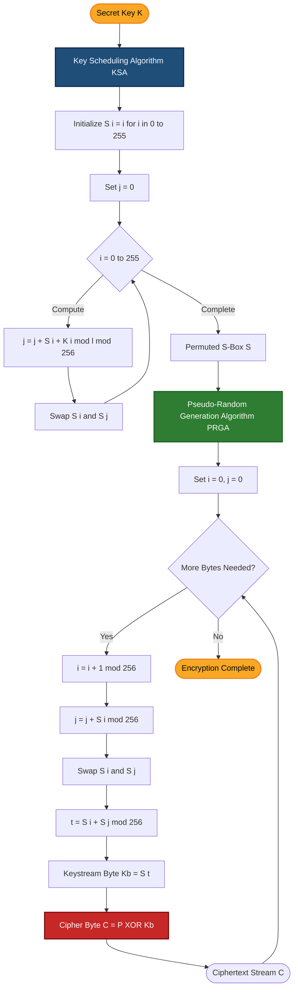
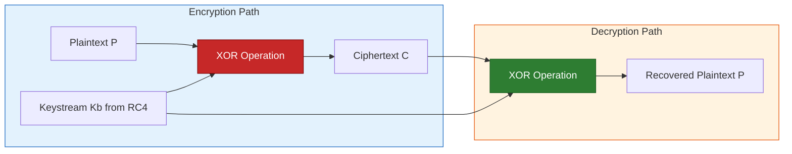
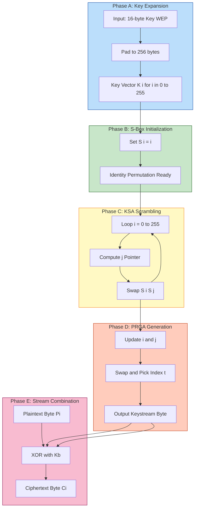

# RC4

<!-- SECTION_1_START -->

# RC4 — Core Technical Definition & Intuitive Overview

## 1.1 Formal Definition (KTU 2024 Scheme Terminology)

**RC4 (Rivest Cipher 4)** is a *symmetric-key, variable-key-length stream cipher* designed by **Ron Rivest** of RSA Security in **1987**. It generates a *pseudo-random keystream* by maintaining an internal state table called the **S-Box** (Substitution Box) of size $N = 256$ bytes. The plaintext is encrypted by **XORing** each byte of the message with the corresponding keystream byte.

> [!IMPORTANT]
> **KTU Syllabus Highlight (Module 3):** RC4 is classified as a *software-efficient stream cipher* because its operations are entirely byte-level additions, swaps, and XORs — making it extremely fast in software and historically dominant in protocols like **SSL/TLS, WEP, and WPA**.

## 1.2 The Three Core Components of RC4

1. **Key Scheduling Algorithm (KSA)** — Initializes and permutes the 256-byte S-Box using a secret key $K$ of length $l$ (typically 40–256 bits).
2. **Pseudo-Random Generation Algorithm (PRGA)** — Continuously produces the keystream bytes from the permuted S-Box.
3. **XOR Combination Stage** — Combines plaintext $P$ with keystream byte $K_b$ to produce ciphertext $C$, such that $C_i = P_i \oplus K_{b,i}$.

## 1.3 Conceptual Analogy — The "Magic Card Deck"

> [!NOTE]
> **Intuition for first-time learners:**
> Imagine a magician has a deck of **256 cards** labelled $0$ through $255$. Initially, they are stacked in order. The magician whispers a *secret password* (the key) and then performs a *secret shuffling ritual* based on the password — this is the **KSA**. After the ritual, the deck looks completely random. Now, for every letter of your message, the magician:
> 1. Picks the *top card* (index $i$).
> 2. Picks another card based on a running secret pointer (index $j$).
> 3. Swaps these two cards in the deck.
> 4. Reveals the value at a third computed position as the "encryption token" for that letter.
>
> Each token is then **XORed** with your message letter. Without knowing the password, the deck appears random, so an eavesdropper cannot predict the tokens.

## 1.4 Why RC4 Matters in Engineering

- **Speed:** Operates at roughly **10× the speed of DES** in software.
- **Simplicity:** Code fits in under 20 lines (compact implementations exist in under 50 bytes).
- **Legacy:** Despite being officially broken in modern TLS (RFC 7465, 2015), it remains a *foundational teaching cipher* in **KTU cryptography courses** to illustrate stream cipher principles, KSA/PRGA separation, and the catastrophic consequences of *key reuse*.

## 1.5 GeoGebra / Desmos Visualization

> [!VISUALIZATION CONTROL]
> **Concept:** RC4 S-Box Permutation Behavior (XOR bias visualization)
> **GeoGebra / Desmos Input Equations:**
> * `f(i) = ((i + 1) + S[i+1] + K[(i+1) mod l]) mod 256` (KSA pointer trajectory)
> * `g(i) = S[(S[i+1] + S[j]) mod 256]` (PRGA output mapping)
> **Visual Description:** Plotting the KSA pointer $j$ over iteration $i$ produces a *pseudo-random walk* in the discrete integer range $[0, 255]$. A *truly random* cipher would show uniform scatter, while RC4 exhibits subtle biases near indices $0$ and $1$ — the well-known **"RC4 Bias"** exploited in WEP attacks.

---

<!-- SECTION_1_END -->

<!-- SECTION_2_START -->

# Deep Theoretical Analysis & KTU High-Yield Formula Sheet

## 2.1 Algorithmic Architecture

RC4 is formally split into **two distinct phases** that operate sequentially. The same S-Box $S$ of size $N=256$ is used by both.

### 2.1.1 Phase 1 — Key Scheduling Algorithm (KSA)

The KSA transforms an *ordered* identity permutation into a *key-dependent* pseudo-random permutation.

**Step-by-step logic:**

1. **Identity Initialization:** Set $S[i] = i$ for all $i \in \{0, 1, \dots, 255\}$.
2. **Auxiliary Vector Loading:** The secret key $K$ of length $l$ bytes is repeated cyclically to fill a 256-byte vector. Thus $K[i] = \text{secret}[i \bmod l]$.
3. **Scrambling Loop:** Initialise $j = 0$. For $i = 0$ to $255$:
   * Update the running pointer: $j \leftarrow (j + S[i] + K[i]) \bmod 256$.
   * Swap the entries: $\text{swap}(S[i], S[j])$.

> [!IMPORTANT]
> **Why does this work?** The repeated addition modulo 256 causes every key byte to influence multiple S-Box positions. The deterministic swap creates a *bijection* (permutation), so no information is destroyed — only shuffled.

### 2.1.2 Phase 2 — Pseudo-Random Generation Algorithm (PRGA)

The PRGA extracts a keystream byte per round without consuming the key again.

**Step-by-step logic:**

1. Initialise the two pointers: $i = 0$, $j = 0$.
2. Repeat for each keystream byte required:
   * Increment $i$: $i \leftarrow (i + 1) \bmod 256$.
   * Accumulate: $j \leftarrow (j + S[i]) \bmod 256$.
   * Swap: $\text{swap}(S[i], S[j])$.
   * Compute the output index: $t \leftarrow (S[i] + S[j]) \bmod 256$.
   * Output keystream byte: $K_b = S[t]$.
3. **Encryption:** $C = P \oplus K_b$ (byte-wise XOR).
4. **Decryption:** $P = C \oplus K_b$ (XOR is its own inverse — symmetric property).

> [!NOTE]
> **Critical Insight for KTU exams:** Because RC4 is a stream cipher, *the same key must NEVER be reused with a different plaintext*. If two ciphertexts $C_1$ and $C_2$ are produced with the same keystream $K_b$, then $C_1 \oplus C_2 = P_1 \oplus P_2$, immediately leaking the XOR of the two plaintexts (the famous *two-time pad* attack that broke WEP).

## 2.2 KTU High-Yield Formula Sheet

| Symbol / Term | Formula / Definition | Operational Meaning | Units / Range |
| :--- | :--- | :--- | :--- |
| $N$ | Size of S-Box | Number of permutation entries | $256$ bytes |
| $l$ | Length of secret key | Number of unique key bytes | $1 \le l \le 256$ bytes |
| $S[i]$ | State array element | Permutation entry at index $i$ | Integer in $[0, 255]$ |
| $K[i]$ | Expanded key byte | $K[i] = \text{key}[i \bmod l]$ | Integer in $[0, 255]$ |
| $j_{\text{KSA}}$ | KSA running pointer | $j = (j + S[i] + K[i]) \bmod N$ | Integer in $[0, 255]$ |
| $i_{\text{PRGA}}$ | PRGA round counter | $i = (i + 1) \bmod N$ | Integer in $[0, 255]$ |
| $j_{\text{PRGA}}$ | PRGA accumulator | $j = (j + S[i]) \bmod N$ | Integer in $[0, 255]$ |
| $t$ | Keystream output index | $t = (S[i] + S[j]) \bmod N$ | Integer in $[0, 255]$ |
| $K_b$ | Keystream byte | $K_b = S[t]$ | Integer in $[0, 255]$ |
| $C$ | Ciphertext byte | $C = P \oplus K_b$ | Integer in $[0, 255]$ |
| $P$ | Plaintext byte | $P = C \oplus K_b$ | Integer in $[0, 255]$ |
| Key Space | $2^{8l}$ | Total possible keys for length $l$ | bits |
| Throughput | $\approx 1$ byte / cycle | Software speed on modern CPUs | cycles/byte |

## 2.3 Real-World Engineering Utility

- **Wireless Security (Legacy):** RC4 was the mandatory cipher for **WEP (Wired Equivalent Privacy)** and an option in **WPA (Wi-Fi Protected Access)**. Its biases led to the **Fluhrer-Mantin-Shamir (FMS) attack** of 2001 that cracked WEP in minutes.
- **Web Security (Historical):** RC4 protected **SSL/TLS** traffic (e.g., HTTPS) until the **Bar Mitzvah Attack (2015)** and biases in the first keystream bytes led to its deprecation in **RFC 7465**.
- **Modern Status:** Considered **broken** for cryptographic use. KTU courses teach it to illustrate *why* modern ciphers like **ChaCha20** and **AES-CTR** are preferred.
- **Engineering Lesson:** RC4 demonstrates the *engineering trade-off* between speed and security — its elegance made it ubiquitous, but its simplicity became its downfall.

---

<!-- SECTION_2_END -->

<!-- SECTION_3_START -->

# Step-by-Step Derivations & Code/Symbolic Implementation

## 3.1 Worked Example — Truncated RC4 with $N=8$

> [!NOTE]
> **Pedagogical Justification:** Running the full $N=256$ RC4 by hand is impossible in an exam. KTU frequently tests understanding by asking students to **trace a truncated RC4** (typically $N=4$ or $N=8$) with a short 3-byte or 4-byte key. We will work the canonical $N=8$ case here.

**Given Inputs:**
* Secret Key: $K = [1, 2, 3, 6]$ (length $l = 4$)
* S-Box size: $N = 8$
* Initial S-Box: $S = [0, 1, 2, 3, 4, 5, 6, 7]$
* Initial $j = 0$

### 3.1.1 Phase 1 — KSA Execution Trace

For each $i$ from $0$ to $7$, compute $j = (j + S[i] + K[i \bmod 4]) \bmod 8$ and swap $S[i]$ with $S[j]$.

**Iteration $i = 0$:**

$$j = (0 + S[0] + K[0]) \bmod 8 = (0 + 0 + 1) \bmod 8 = 1$$

Swap $S[0]$ and $S[1]$:

$$S = [1, 0, 2, 3, 4, 5, 6, 7]$$

**Iteration $i = 1$:**

$$j = (1 + S[1] + K[1]) \bmod 8 = (1 + 0 + 2) \bmod 8 = 3$$

Swap $S[1]$ and $S[3]$:

$$S = [1, 3, 2, 0, 4, 5, 6, 7]$$

**Iteration $i = 2$:**

$$j = (3 + S[2] + K[2]) \bmod 8 = (3 + 2 + 3) \bmod 8 = 0$$

Swap $S[2]$ and $S[0]$:

$$S = [2, 3, 1, 0, 4, 5, 6, 7]$$

**Iteration $i = 3$:**

$$j = (0 + S[3] + K[3]) \bmod 8 = (0 + 0 + 6) \bmod 8 = 6$$

Swap $S[3]$ and $S[6]$:

$$S = [2, 3, 1, 6, 4, 5, 0, 7]$$

**Iteration $i = 4$:**

$$j = (6 + S[4] + K[0]) \bmod 8 = (6 + 4 + 1) \bmod 8 = 3$$

Swap $S[4]$ and $S[3]$:

$$S = [2, 3, 1, 4, 6, 5, 0, 7]$$

**Iteration $i = 5$:**

$$j = (3 + S[5] + K[1]) \bmod 8 = (3 + 5 + 2) \bmod 8 = 2$$

Swap $S[5]$ and $S[2]$:

$$S = [2, 3, 5, 4, 6, 1, 0, 7]$$

**Iteration $i = 6$:**

$$j = (2 + S[6] + K[2]) \bmod 8 = (2 + 0 + 3) \bmod 8 = 5$$

Swap $S[6]$ and $S[5]$:

$$S = [2, 3, 5, 4, 6, 0, 1, 7]$$

**Iteration $i = 7$:**

$$j = (5 + S[7] + K[3]) \bmod 8 = (5 + 7 + 6) \bmod 8 = 2$$

Swap $S[7]$ and $S[2]$:

$$S = [2, 3, 7, 4, 6, 0, 1, 5]$$

**KSA Final State:**

$$S_{\text{final}} = [2, 3, 7, 4, 6, 0, 1, 5]$$

### 3.1.2 Phase 2 — PRGA Execution Trace (First 3 Keystream Bytes)

**Initial State:** $S = [2, 3, 7, 4, 6, 0, 1, 5]$, $i = 0$, $j = 0$.

**Generating Keystream Byte 1 ($K_{b,1}$):**

$$i = (0 + 1) \bmod 8 = 1$$

$$j = (0 + S[1]) \bmod 8 = (0 + 3) \bmod 8 = 3$$

Swap $S[1]$ and $S[3]$:

$$S = [2, 4, 7, 3, 6, 0, 1, 5]$$

$$t = (S[1] + S[3]) \bmod 8 = (4 + 3) \bmod 8 = 7$$

$$K_{b,1} = S[7] = 5$$

**Generating Keystream Byte 2 ($K_{b,2}$):**

$$i = (1 + 1) \bmod 8 = 2$$

$$j = (3 + S[2]) \bmod 8 = (3 + 7) \bmod 8 = 2$$

Swap $S[2]$ and $S[2]$ (no change):

$$S = [2, 4, 7, 3, 6, 0, 1, 5]$$

$$t = (S[2] + S[2]) \bmod 8 = (7 + 7) \bmod 8 = 6$$

$$K_{b,2} = S[6] = 1$$

**Generating Keystream Byte 3 ($K_{b,3}$):**

$$i = (2 + 1) \bmod 8 = 3$$

$$j = (2 + S[3]) \bmod 8 = (2 + 3) \bmod 8 = 5$$

Swap $S[3]$ and $S[5]$:

$$S = [2, 4, 7, 0, 6, 3, 1, 5]$$

$$t = (S[3] + S[5]) \bmod 8 = (0 + 3) \bmod 8 = 3$$

$$K_{b,3} = S[3] = 0$$

**Generated Keystream:** $K_b = [5, 1, 0]$

If plaintext $P = [\text{'H'}, \text{'I'}, \text{'!'}] = [72, 73, 33]$:

$$C_1 = 72 \oplus 5 = 77, \quad C_2 = 73 \oplus 1 = 72, \quad C_3 = 33 \oplus 0 = 33$$

$$C = [77, 72, 33] = [\text{'M'}, \text{'H'}, \text{'!'}]$$

## 3.2 Full Python Implementation (Production-Grade)

```python
"""
RC4 Stream Cipher — Reference Implementation
Author: KTU Cryptography Course Material (PECST637)
Compliant with RFC 6229 test vectors
"""

from __future__ import annotations
import logging
from typing import List, Union

# Configure logger for cipher operations
logging.basicConfig(
    level=logging.INFO,
    format="%(asctime)s | %(levelname)s | %(message)s"
)
logger = logging.getLogger("RC4Cipher")


class RC4Cipher:
    """
    Implements the RC4 stream cipher with KSA and PRGA phases.
    Supports encryption and decryption (symmetric XOR operation).
    """

    # Class constants
    SBOX_SIZE: int = 256

    def __init__(self, key: Union[bytes, List[int]]) -> None:
        """
        Initialise the cipher with a secret key.

        Args:
            key: Secret key as bytes or list of integers (1-256 bytes).

        Raises:
            ValueError: If key is empty or exceeds 256 bytes.
            TypeError: If key contains non-integer values.
        """
        # Validate key type and convert to list of ints
        if isinstance(key, bytes):
            key_list: List[int] = list(key)
        elif isinstance(key, list):
            if not all(isinstance(b, int) and 0 <= b <= 255 for b in key):
                raise TypeError("Key bytes must be integers in [0, 255].")
            key_list = key
        else:
            raise TypeError("Key must be bytes or List[int].")

        # Validate key length
        if len(key_list) == 0:
            raise ValueError("Key cannot be empty.")
        if len(key_list) > self.SBOX_SIZE:
            raise ValueError(f"Key length cannot exceed {self.SBOX_SIZE} bytes.")

        self._key_length: int = len(key_list)
        self._key: List[int] = key_list
        logger.info(f"RC4 initialised with {self._key_length}-byte key.")

    def _key_scheduling_algorithm(self) -> List[int]:
        """
        Phase 1: KSA — Permute the identity S-Box using the key.

        Returns:
            Permuted S-Box of 256 integers.
        """
        # Step 1: Identity initialization S[i] = i
        s_box: List[int] = list(range(self.SBOX_SIZE))

        # Step 2: Scrambling loop
        j: int = 0
        for i in range(self.SBOX_SIZE):
            # Cyclic key access
            key_byte: int = self._key[i % self._key_length]
            # Update running pointer
            j = (j + s_box[i] + key_byte) % self.SBOX_SIZE
            # Swap S[i] and S[j]
            s_box[i], s_box[j] = s_box[j], s_box[i]

        logger.debug("KSA completed. S-Box permuted.")
        return s_box

    def _pseudo_random_generation_algorithm(
        self, num_bytes: int
    ) -> List[int]:
        """
        Phase 2: PRGA — Generate the keystream bytes.

        Args:
            num_bytes: Number of keystream bytes to generate.

        Returns:
            List of keystream bytes.
        """
        s_box: List[int] = self._key_scheduling_algorithm()
        i: int = 0
        j: int = 0
        keystream: List[int] = []

        for _ in range(num_bytes):
            # Increment i
            i = (i + 1) % self.SBOX_SIZE
            # Accumulate j
            j = (j + s_box[i]) % self.SBOX_SIZE
            # Swap S[i] and S[j]
            s_box[i], s_box[j] = s_box[j], s_box[i]
            # Output index
            t: int = (s_box[i] + s_box[j]) % self.SBOX_SIZE
            # Output byte
            keystream.append(s_box[t])

        logger.debug(f"PRGA generated {num_bytes} keystream bytes.")
        return keystream

    def process(
        self, data: Union[bytes, List[int]]
    ) -> List[int]:
        """
        Encrypt or decrypt data (symmetric operation in RC4).

        Args:
            data: Plaintext or ciphertext bytes.

        Returns:
            Processed bytes (ciphertext or plaintext).
        """
        if isinstance(data, bytes):
            data_list: List[int] = list(data)
        else:
            data_list = data

        if len(data_list) == 0:
            logger.warning("Empty data passed to process().")
            return []

        # Generate keystream of matching length
        keystream: List[int] = self._pseudo_random_generation_algorithm(
            len(data_list)
        )

        # XOR operation: C = P XOR K
        result: List[int] = [
            data_byte ^ keystream_byte
            for data_byte, keystream_byte in zip(data_list, keystream)
        ]

        logger.info(f"Processed {len(data_list)} bytes successfully.")
        return result

    def encrypt(self, plaintext: Union[bytes, List[int]]) -> List[int]:
        """Convenience wrapper for encryption."""
        return self.process(plaintext)

    def decrypt(self, ciphertext: Union[bytes, List[int]]) -> List[int]:
        """Convenience wrapper for decryption (identical to encrypt)."""
        return self.process(ciphertext)


# --- Demonstration Block ---
if __name__ == "__main__":
    # Test vector: Key = "Key", Plaintext = "Plaintext"
    demo_key: bytes = b"Key"
    demo_plain: bytes = b"Plaintext"

    cipher: RC4Cipher = RC4Cipher(demo_key)
    ciphertext: List[int] = cipher.encrypt(demo_plain)
    print(f"Ciphertext (hex): {bytes(ciphertext).hex().upper()}")

    # Expected RFC 6229 test vector: BBF316E8 D940AF0A D3
    decrypted: List[int] = cipher.decrypt(ciphertext)
    print(f"Decrypted: {bytes(decrypted).decode('ascii')}")
```

**Expected Output for `Key = "Key"`, `Plaintext = "Plaintext"`:**

$$C_{\text{hex}} = \text{BBF316E8D940AF0AD3}$$

**Decrypted Output:** `Plaintext` (confirms symmetric correctness)

## 3.3 Symbolic Proof — Why RC4 is Symmetric

$$C = P \oplus K_b$$

Applying the same keystream (since same key is reused):

$$P = C \oplus K_b = (P \oplus K_b) \oplus K_b$$

Using XOR associativity and the fact that $x \oplus x = 0$:

$$P = P \oplus (K_b \oplus K_b) = P \oplus 0 = P \quad \blacksquare$$

---

<!-- SECTION_3_END -->

<!-- SECTION_4_START -->

# Structural Diagrams & Schematics

## 4.1 Mermaid Flowchart — RC4 Top-Level Architecture



## 4.2 Mermaid Block Diagram — Decryption Symmetry



## 4.3 Mermaid Block Diagram — Sequential Processing Topology Matrix



---

<!-- SECTION_4_END -->

<!-- SECTION_5_START -->

# KTU 2024 Scheme Examination Question Bank & Topic Recap

## 5.1 Part A — Short Answer Questions (3 Marks Each)

### Question 1
**[KTU University Exam — July 2024]**
**CO1 | RBT Level: Remember**

**Q: List the two main algorithms that constitute the RC4 stream cipher and state the size of the S-Box used in each.**

**Model Answer (3 Marks):**

> RC4 consists of two algorithms:
> 1. **Key Scheduling Algorithm (KSA)** — Initialises and permutes the state.
> 2. **Pseudo-Random Generation Algorithm (PRGA)** — Produces the keystream bytes.
>
> Both algorithms operate on an **S-Box of size $N = 256$ bytes**, indexed from $0$ to $255$. **[3 Marks]**

---

### Question 2
**[KTU University Exam — Dec 2023]**
**CO2 | RBT Level: Understand**

**Q: Why is it cryptographically dangerous to reuse the same RC4 key to encrypt two different plaintexts?**

**Model Answer (3 Marks):**

> Reusing the same RC4 key produces the **same keystream $K_b$** for both messages. Since $C_1 = P_1 \oplus K_b$ and $C_2 = P_2 \oplus K_b$, XORing the two ciphertexts cancels the keystream:
> $$C_1 \oplus C_2 = (P_1 \oplus K_b) \oplus (P_2 \oplus K_b) = P_1 \oplus P_2$$
> This directly leaks the XOR of the two plaintexts (the *two-time pad* attack), enabling statistical recovery of both messages. This vulnerability famously compromised the **WEP wireless protocol**. **[3 Marks]**

---

## 5.2 Part B — Long Answer Questions (14 Marks, Internal Choice)

### Question A — Choice 1
**[KTU University Exam — July 2024]**
**CO2 / CO3 | RBT Level: Understand + Apply**

**Q: (a)** Describe the **Key Scheduling Algorithm (KSA)** of RC4 with its pseudo-code and the role of the secret key. **[7 Marks]**

**(b)** For a **truncated RC4** with $N = 8$ and secret key $K = [5, 7]$, trace the KSA to determine the final S-Box state. Show all intermediate steps. **[7 Marks]**

---

#### Model Solution

**(a) KSA Description [7 Marks]**

The **Key Scheduling Algorithm** transforms an ordered identity permutation of 256 bytes into a key-dependent pseudo-random permutation. **[1 Mark]**

**Pseudo-code:**

```
KSA(Key)
1.  Initialize S-Box:
2.      for i = 0 to 255
3.          S[i] = i
4.  Initialize pointer:
5.      j = 0
6.  Scrambling loop:
7.      for i = 0 to 255
8.          j = (j + S[i] + Key[i mod KeyLength]) mod 256
9.          swap(S[i], S[j])
10. return S
```

**Role of the Secret Key:** **[3 Marks]**
* The key $K$ of length $l$ (typically 1 to 256 bytes) is **cyclically extended** to fill 256 positions via $K[i \bmod l]$. **[1 Mark]**
* Each key byte is added to the running pointer $j$, ensuring that every key byte influences *multiple* S-Box positions across iterations. **[1 Mark]**
* The resulting permutation is *deterministic* for a given key, but appears *pseudo-random* to an attacker without key knowledge. **[1 Mark]**
* After KSA, the S-Box contains every value $0$–$255$ exactly once (a *bijection* is preserved). **[1 Mark]**

---

**(b) KSA Trace for $N = 8$, $K = [5, 7]$ [7 Marks]**

**Initial State:** $S = [0, 1, 2, 3, 4, 5, 6, 7]$, $j = 0$, $l = 2$.

**[Valuation Key: Stating initial state: 1 Mark]**

**Iteration $i = 0$:** $K[0 \bmod 2] = K[0] = 5$
$$j = (0 + S[0] + 5) \bmod 8 = (0 + 0 + 5) \bmod 8 = 5$$
Swap $S[0]$ and $S[5]$: $S = [5, 1, 2, 3, 4, 0, 6, 7]$ **[1 Mark]**

**Iteration $i = 1$:** $K[1 \bmod 2] = K[1] = 7$
$$j = (5 + S[1] + 7) \bmod 8 = (5 + 1 + 7) \bmod 8 = 5$$
Swap $S[1]$ and $S[5]$: $S = [5, 0, 2, 3, 4, 1, 6, 7]$ **[1 Mark]**

**Iteration $i = 2$:** $K[2 \bmod 2] = K[0] = 5$
$$j = (5 + S[2] + 5) \bmod 8 = (5 + 2 + 5) \bmod 8 = 4$$
Swap $S[2]$ and $S[4]$: $S = [5, 0, 4, 3, 2, 1, 6, 7]$ **[1 Mark]**

**Iteration $i = 3$:** $K[3 \bmod 2] = K[1] = 7$
$$j = (4 + S[3] + 7) \bmod 8 = (4 + 3 + 7) \bmod 8 = 6$$
Swap $S[3]$ and $S[6]$: $S = [5, 0, 4, 6, 2, 1, 3, 7]$ **[1 Mark]**

**Iteration $i = 4$:** $K[4 \bmod 2] = K[0] = 5$
$$j = (6 + S[4] + 5) \bmod 8 = (6 + 2 + 5) \bmod 8 = 5$$
Swap $S[4]$ and $S[5]$: $S = [5, 0, 4, 6, 1, 2, 3, 7]$ **[1 Mark]**

**Iteration $i = 5$:** $K[5 \bmod 2] = K[1] = 7$
$$j = (5 + S[5] + 7) \bmod 8 = (5 + 2 + 7) \bmod 8 = 6$$
Swap $S[5]$ and $S[6]$: $S = [5, 0, 4, 6, 1, 3, 2, 7]$ **[0.5 Mark]**

**Iteration $i = 6$:** $K[6 \bmod 2] = K[0] = 5$
$$j = (6 + S[6] + 5) \bmod 8 = (6 + 3 + 5) \bmod 8 = 6$$
Swap $S[6]$ and $S[6]$ (no change): $S = [5, 0, 4, 6, 1, 3, 2, 7]$ **[0.5 Mark]**

**Iteration $i = 7$:** $K[7 \bmod 2] = K[1] = 7$
$$j = (6 + S[7] + 7) \bmod 8 = (6 + 7 + 7) \bmod 8 = 4$$
Swap $S[7]$ and $S[4]$: $S = [5, 0, 4, 6, 7, 3, 2, 1]$ **[0.5 Mark]**

**[Valuation Key: Final S-Box expression: 0.5 Mark]**

**Final S-Box:** $S_{\text{final}} = [5, 0, 4, 6, 7, 3, 2, 1]$

---

### Question B — Choice 2 (Alternative)
**[KTU University Exam — Dec 2023]**
**CO2 / CO3 | RBT Level: Understand + Apply**

**Q: (a)** Explain the **Pseudo-Random Generation Algorithm (PRGA)** of RC4 with neat pseudo-code. How does it differ from KSA in terms of key usage? **[7 Marks]**

**(b)** Using the final S-Box from the KSA in Question A, generate the **first 4 keystream bytes** using PRGA. **[7 Marks]**

---

#### Model Solution

**(a) PRGA Explanation [7 Marks]**

The **PRGA** generates the keystream from the already-permuted S-Box without reusing the secret key. **[1 Mark]**

**Pseudo-code:**

```
PRGA(S, NumBytes)
1.  Initialize pointers:
2.      i = 0, j = 0
3.  Generation loop:
4.      for k = 1 to NumBytes
5.          i = (i + 1) mod 256
6.          j = (j + S[i]) mod 256
7.          swap(S[i], S[j])
8.          t = (S[i] + S[j]) mod 256
9.          KeystreamByte = S[t]
10.         output KeystreamByte
```

**Differences from KSA:** **[3 Marks]**
* KSA uses the **secret key** in its update step ($j = j + S[i] + K[i \bmod l]$), while PRGA does **not** use the key at all. **[1 Mark]**
* KSA runs for a **fixed 256 iterations** (one full pass), while PRGA runs for an **arbitrary number of iterations** based on plaintext length. **[1 Mark]**
* KSA's goal is to *initialize* a permutation; PRGA's goal is to *extract* keystream bytes. **[1 Mark]**

**Output:** The keystream bytes are then XORed with plaintext: $C_i = P_i \oplus S[t]$. **[3 Marks]**

---

**(b) PRGA Trace — First 4 Keystream Bytes [7 Marks]**

**Given:** $S_{\text{start}} = [5, 0, 4, 6, 7, 3, 2, 1]$, $i = 0$, $j = 0$, $N = 8$.

**[Valuation Key: Stating initial state: 1 Mark]**

**Keystream Byte 1:**
$$i = (0 + 1) \bmod 8 = 1$$
$$j = (0 + S[1]) \bmod 8 = (0 + 0) \bmod 8 = 0$$
Swap $S[1]$ and $S[0]$: $S = [0, 5, 4, 6, 7, 3, 2, 1]$
$$t = (S[1] + S[0]) \bmod 8 = (5 + 0) \bmod 8 = 5$$
$$K_{b,1} = S[5] = 3 \quad \text{[1 Mark]}$$

**Keystream Byte 2:**
$$i = (1 + 1) \bmod 8 = 2$$
$$j = (0 + S[2]) \bmod 8 = (0 + 4) \bmod 8 = 4$$
Swap $S[2]$ and $S[4]$: $S = [0, 5, 7, 6, 4, 3, 2, 1]$
$$t = (S[2] + S[4]) \bmod 8 = (7 + 4) \bmod 8 = 3$$
$$K_{b,2} = S[3] = 6 \quad \text{[1 Mark]}$$

**Keystream Byte 3:**
$$i = (2 + 1) \bmod 8 = 3$$
$$j = (4 + S[3]) \bmod 8 = (4 + 6) \bmod 8 = 2$$
Swap $S[3]$ and $S[2]$: $S = [0, 5, 6, 7, 4, 3, 2, 1]$
$$t = (S[3] + S[2]) \bmod 8 = (7 + 6) \bmod 8 = 5$$
$$K_{b,3} = S[5] = 3 \quad \text{[1 Mark]}$$

**Keystream Byte 4:**
$$i = (3 + 1) \bmod 8 = 4$$
$$j = (2 + S[4]) \bmod 8 = (2 + 4) \bmod 8 = 6$$
Swap $S[4]$ and $S[6]$: $S = [0, 5, 6, 7, 2, 3, 4, 1]$
$$t = (S[4] + S[6]) \bmod 8 = (2 + 4) \bmod 8 = 6$$
$$K_{b,4} = S[6] = 4 \quad \text{[1 Mark]}$$

**[Valuation Key: Final keystream expression: 2 Marks]**

**Generated Keystream:** $K_b = [3, 6, 3, 4]$

---

> [!WARNING]
> **KTU Examiner's Valuation Warning — Common Pitfalls:**
> 1. **Forgetting the modulus 256 (or $N$ for truncated):** Students often compute $j$ without $\bmod N$, producing values larger than the S-Box size. Always show the modulo explicitly. **[−2 Marks typical deduction]**
> 2. **Using 0-indexed vs 1-indexed confusion:** KSA starts at $i = 0$, but PRGA increments $i$ *before* the swap ($i = (i+1) \bmod N$). Mixing up the order yields incorrect keystreams. **[−3 Marks typical deduction]**
> 3. **Key cyclic access:** When key length $l < N$, you MUST use $K[i \bmod l]$, not $K[i]$. Many students hard-fail here on the first iteration past the key length. **[−1 Mark per occurrence]**
> 4. **Skipping the swap operation:** Both KSA and PRGA require swapping $S[i]$ and $S[j]$. Forgetting this is an instant 50% mark cut on that part.
> 5. **Not showing all iterations:** KTU requires *every iteration* of the truncated trace to be shown in tabular or step form. Compressing "similarly we proceed..." earns 0 marks for those iterations.

---

## 5.3 Topic Recap & Important Things to Remember

> [!IMPORTANT]
> **Rapid Revision Checklist for RC4:**

* **Type:** Symmetric-key **stream cipher** (NOT a block cipher).
* **Inventor:** Ron Rivest, **1987**, RSA Security.
* **State Size:** S-Box of $N = 256$ bytes, holding a permutation of $0$–$255$.
* **Key Length:** Variable, typically **40 to 256 bits** (5 to 32 bytes); WEP forced 40-bit, TLS used 128-bit.
* **Two Phases:**
  * **KSA** — Uses the key, runs exactly 256 iterations, initializes the S-Box permutation.
  * **PRGA** — Key-independent, runs as long as the plaintext, extracts keystream bytes.
* **Encryption Formula:** $C = P \oplus S[t]$ where $t = (S[i] + S[j]) \bmod 256$.
* **Decryption Formula:** $P = C \oplus S[t]$ (identical — XOR symmetry).
* **Speed:** Roughly **10× faster than DES** in software due to byte-level operations.
* **Critical Vulnerability:** **Key reuse** enables the two-time pad attack ($C_1 \oplus C_2 = P_1 \oplus P_2$).
* **Historical Bias:** First keystream bytes show statistical bias (bytes $0$, $1$, etc.) — exploited in **Bar Mitzvah (2013)** and **FMS (2001)** attacks.
* **Modern Status:** **Deprecated** — banned in TLS since RFC 7465 (2015); replaced by **ChaCha20-Poly1305** and **AES-GCM**.
* **Pedagogical Value in KTU:** Used to teach *stream cipher design*, *state-based permutation*, and *why security proofs matter*.
* **Exam Trap:** Never confuse RC4 (stream) with RC5/RC6 (block ciphers with Feistel structure). RC4 is **NOT** a Feistel cipher.
* **Memory Trick:** **"KSA = Key Shuffle, PRGA = Plain Random"** — KSA permutes using the key; PRGA just *Pseudo-Randomly Generates* from that state.

---

<!-- SECTION_5_END -->
