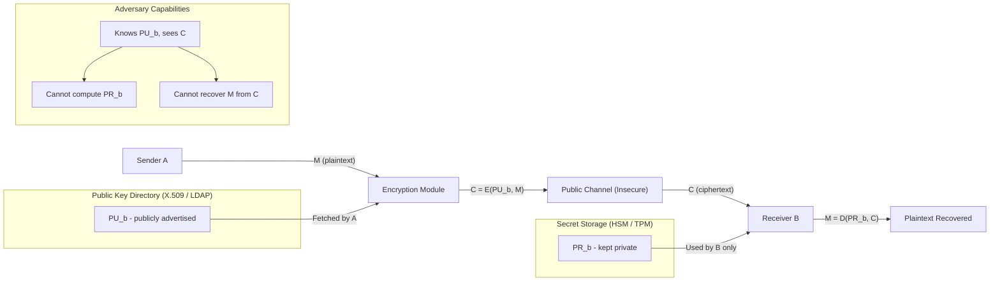
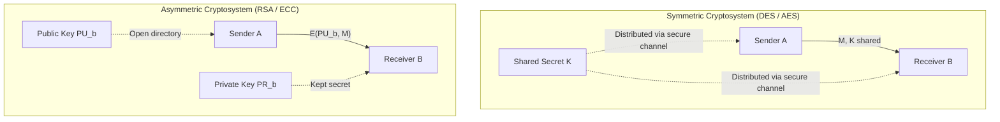
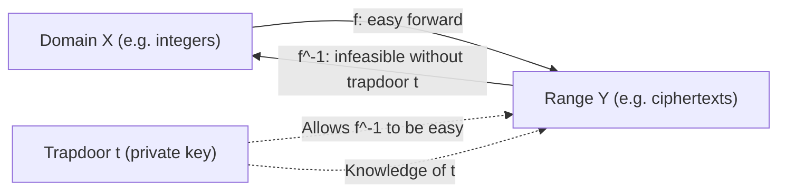
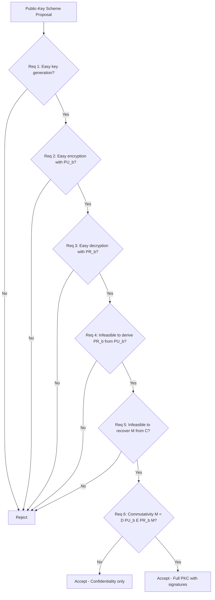
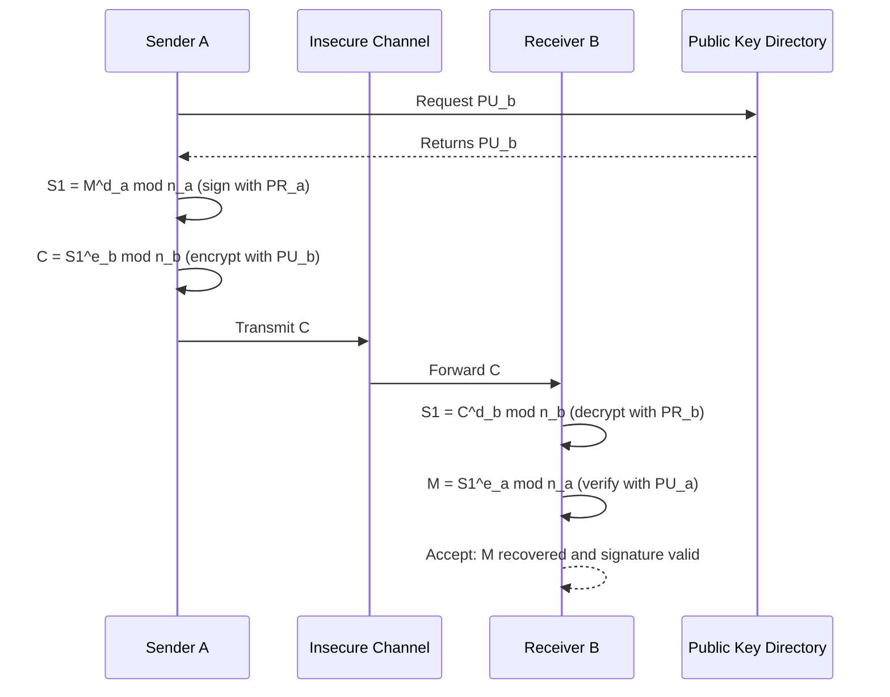
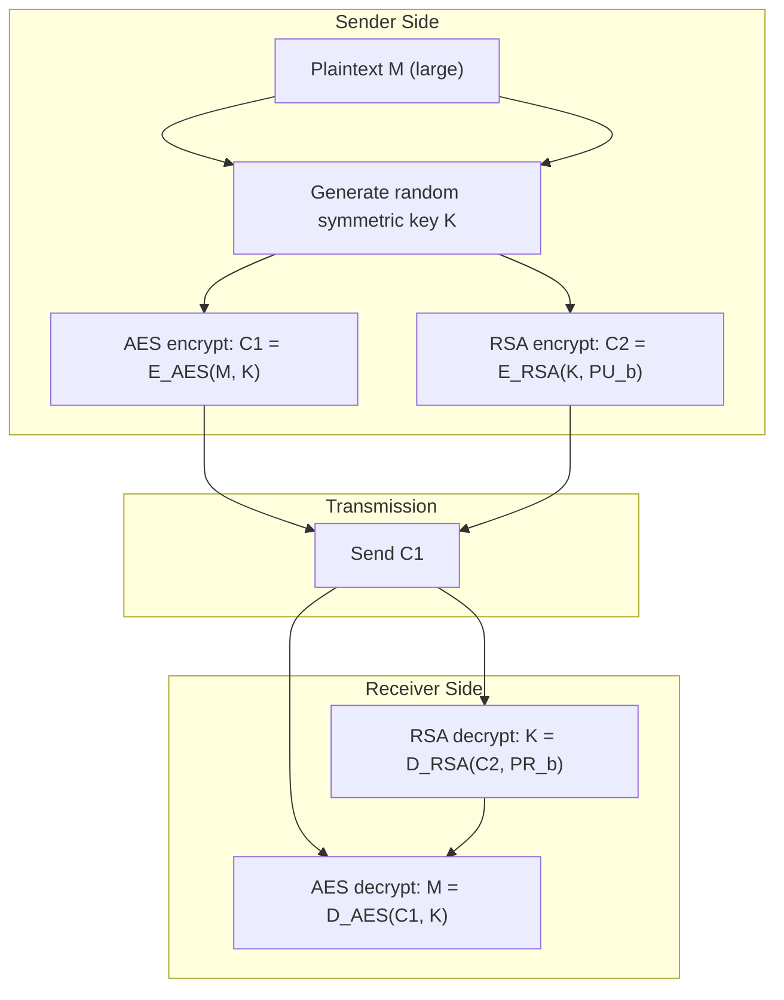
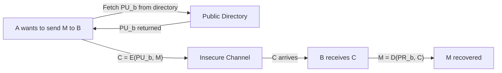

# Requirements for Public-Key Cryptography

<!-- SECTION_1_START -->
# Requirements for Public-Key Cryptography

## 1. Formal Academic Definition

> [!IMPORTANT]
> **Public-Key Cryptography (Asymmetric Cryptography)** is a cryptographic framework that uses a mathematically related pair of keys — a **public key** (advertised openly) and a **private key** (kept secret) — such that encryption performed with one key can only be inverted by the other, and deriving the private key from the public key is computationally infeasible.

According to **Diffie and Hellman (1976)**, a public-key cryptosystem must satisfy **six essential requirements** to be considered cryptographically secure and operationally viable.

## 2. The Symmetric-Key Limitation Problem

Before understanding *requirements* for public-key cryptography, it is critical to understand *why* it was needed in the first place. The **Data Encryption Standard (DES)** and other symmetric schemes suffer from three fundamental limitations:

| Limitation | Description | Engineering Impact |
|------------|-------------|-------------------|
| **Key Distribution** | A shared secret key must be transmitted over a secure channel | Impractical for large, open networks like the Internet |
| **Key Management / Scalability** | For $n$ users, $\binom{n}{2}$ unique keys are required | $O(n^2)$ key explosion — unscalable |
| **Non-Repudiation** | Identical keys mean sender/receiver are indistinguishable | Digital signatures and audit trails are impossible |

> [!NOTE]
> **Key Insight:** With $n = 1000$ users, symmetric key management requires $\frac{n(n-1)}{2} \approx 499500$ keys. Public-key cryptography reduces this to exactly **$n$ key pairs (2000 keys total)**.

## 3. Intuitive Analogy — The Mailbox Model

Imagine a **public mailbox with a slot and a private lockbox**:
- The **public key** is the open mail-slot — *anyone* can drop (encrypt) a message in.
- The **private key** is the unique key the owner carries — *only the owner* can open the lockbox and read the message.
- A **trapdoor** is the secret mechanism (key) that makes the locked-to-opened transition easy, but impossible without knowing the secret.

> [!NOTE]
> This is exactly the principle of a **trapdoor one-way function** — easy to compute forward, infeasible to invert *without* the secret trapdoor.

## 4. One-Way Functions — The Mathematical Backbone

> [!IMPORTANT]
> **Definition (One-Way Function):** A function $f : X \rightarrow Y$ is called *one-way* if $f(x)$ is easy to compute for every $x \in X$, but for almost every $y \in \text{Im}(f)$, finding *any* $x' \in X$ such that $f(x') = y$ is computationally infeasible.

**Trapdoor One-Way Function:** A special one-way function where the inverse becomes *easy* if a certain secret parameter (the **trapdoor**) is known.

| Candidate Function | Easy Operation | Hard Inversion | Trapdoor |
|-------------------|----------------|----------------|----------|
| **Integer Factorisation** | Multiply two primes $p \cdot q$ | Factorise $n = p \cdot q$ | Knowledge of $p$ or $q$ |
| **Discrete Logarithm** | Compute $y = g^x \bmod p$ | Find $x$ from $g^x \bmod p$ | Knowledge of $x$ |
| **RSA Problem** | Compute $C = M^e \bmod n$ | Recover $M$ from $C$ | Knowledge of $d$ |

## 5. GeoGebra / Desmos Visualization

> [!VISUALIZATION CONTROL]
> **Concept:** Computational Asymmetry of Trapdoor Functions
>
> **GeoGebra / Desmos Input Equations:**
> - `f(x) = pow(2, x) mod 47` (forward modular exponentiation, $p = 47$, $g = 2$)
> - Plot discrete points: $(1, 2), (2, 4), (3, 8), (4, 16), (5, 32), (6, 17), (7, 34)$
>
> **Visual Description:** On the x-axis place the discrete exponent $x \in \{1, 2, \ldots, 46\}$; on the y-axis plot the modular result. Students should observe that the forward sweep across the x-axis is smooth and instantaneous, but tracing *backwards* from a y-value to find x requires brute-force search through $p-1 = 46$ candidates — illustrating the **trapdoor asymmetry**.

<!-- SECTION_1_END -->

<!-- SECTION_2_START -->
# Deep Theoretical Analysis & KTU High-Yield Formula Sheet

## 1. The Six Requirements (Diffie-Hellman, 1976)

Let user $A$ wish to send a confidential message $M$ to user $B$ using a public-key cryptosystem. The following six conditions must hold:

> [!IMPORTANT]
> **The Six Diffie-Hellman Requirements for Public-Key Cryptography**

| # | Requirement | Formal Statement | Practical Meaning |
|---|-------------|------------------|-------------------|
| 1 | **Key Generation** | It is computationally easy for receiver $B$ to generate a key pair $(PU_b, PR_b)$ | Each user must be able to *independently* create their own pair |
| 2 | **Encryption** | It is computationally easy for sender $A$ to compute $C = E(PU_b, M)$ given $PU_b$ and $M$ | Encryption uses only the *public* key — no secret exchange |
| 3 | **Decryption** | It is computationally easy for receiver $B$ to recover $M = D(PR_b, C)$ using $PR_b$ | Only the legitimate owner can decrypt |
| 4 | **One-Way Property** | It is computationally infeasible for an adversary to determine $PR_b$ given $PU_b$ | The trapdoor must not be derivable from the public information |
| 5 | **Indistinguishability** | It is computationally infeasible for an adversary to recover $M$ given $C$ and $PU_b$ | Ciphertext must not leak the plaintext |
| 6 | **Key Commutativity (Optional)** | Encryption and decryption can be applied in either order: $M = D(PU_b, E(PR_b, M)) = D(PR_b, E(PU_b, M))$ | Enables **digital signatures** and **non-repudiation** |

## 2. Mathematical Foundations

### 2.1 Number-Theoretic Preliminaries

| Symbol | Meaning | KTU High-Yield Note |
|--------|---------|---------------------|
| $\mathbb{Z}_n$ | Integers modulo $n$ | Working set for all modular arithmetic |
| $\phi(n)$ | Euler's Totient Function | Counts integers coprime to $n$ |
| $\gcd(a, b)$ | Greatest Common Divisor | $\gcd(a, b) = 1$ means *coprime* |
| $a \equiv b \pmod{n}$ | Congruence relation | $n \mid (a - b)$ |
| $a^{-1} \bmod n$ | Modular Inverse | Exists iff $\gcd(a, n) = 1$ |

### 2.2 The Three Hard Mathematical Problems

Public-key security rests on three computationally intractable problems:

1. **Integer Factorisation Problem (IFP)** — given $n = p \cdot q$, find $p$ and $q$.
   - Sub-exponential best-known attack (General Number Field Sieve, **GNFS**).
2. **Discrete Logarithm Problem (DLP)** — given $g$, $p$, and $y = g^x \bmod p$, find $x$.
   - Equivalent difficulty to IFP for $\mathbb{Z}_p^*$.
3. **Elliptic Curve Discrete Logarithm Problem (ECDLP)** — DLP on elliptic curve groups.
   - Currently no sub-exponential attack; enables shorter key sizes.

## 3. KTU Formula Sheet / Cheat Sheet

| Concept | Formula / Statement | Used In |
|---------|---------------------|---------|
| Public-Key Encryption | $C = E(PU_b, M)$ | All PKC schemes |
| Public-Key Decryption | $M = D(PR_b, C)$ | All PKC schemes |
| Signature Generation | $S = E(PR_a, M)$ or hash-based variant | DSS, RSA-PSS |
| Signature Verification | $M = D(PU_a, S)$ | DSS, RSA-PSS |
| Confidentiality + Authenticity | $C = E(PU_b, E(PR_a, M))$ | Combined services |
| Trapdoor Property | $f(x)$ easy, $f^{-1}(y)$ hard without $t$ | RSA, ElGamal, ECC |
| Euler's Theorem | $a^{\phi(n)} \equiv 1 \pmod{n}$ | RSA key derivation |
| RSA Modulus | $n = p \cdot q$ | RSA, Rabin |
| RSA Key Relation | $e \cdot d \equiv 1 \pmod{\phi(n)}$ | RSA |
| Encryption | $C = M^e \bmod n$ | RSA |
| Decryption | $M = C^d \bmod n$ | RSA |

## 4. Why These Requirements Matter in Production

> [!NOTE]
> **Real-World Engineering Utility of Public-Key Requirements**
>
> - **Requirement 2 (Easy Encryption):** Enables **TLS/SSL handshakes** where any web browser can encrypt a pre-master secret to a server's public key.
> - **Requirement 3 (Easy Decryption):** Allows servers to decrypt billions of sessions with a single private key stored in **HSMs (Hardware Security Modules)**.
> - **Requirement 4 (One-Way Trapdoor):** Underlies the entire **PKI (Public Key Infrastructure)** ecosystem — X.509 certificates (RFC 5280) are signed because deriving a private key from a published certificate is infeasible.
> - **Requirement 6 (Commutativity):** Powers **digital signatures** in **PDF, JWT, blockchain transactions**, and **code-signing certificates**.
>
> Modern standards directly dependent on these properties: **TLS 1.3 (RFC 8446)**, **S/MIME (RFC 8551)**, **PGP (RFC 9580)**, **Bitcoin (secp256k1 ECDSA)**, and **SSH (RFC 4253)**.

## 5. The Public-Key vs Symmetric-Key Decision Matrix

| Property | Symmetric (DES/AES) | Public-Key (RSA/ECC) |
|----------|---------------------|----------------------|
| Key Count for $n$ users | $\frac{n(n-1)}{2}$ | $2n$ |
| Key Distribution | Secure channel required | Public channel only |
| Speed | **Fast** ($\sim$ GB/s with AES-NI) | **Slow** ($\sim$ 1000× slower) |
| Confidentiality | ✓ | ✓ |
| Authentication / Signature | ✗ (with shared keys) | ✓ |
| Key Length for 128-bit Security | **128 bits** (AES) | **3072 bits** (RSA) / **256 bits** (ECC) |
| Typical Use | Bulk data encryption | Key exchange, signatures, certificates |

> [!NOTE]
> **Production Pattern:** Modern systems use a **hybrid cryptosystem** — public-key for key exchange, symmetric for bulk data (e.g., **TLS, PGP, S/MIME**).

<!-- SECTION_2_END -->

<!-- SECTION_3_START -->
# Step-by-Step Derivations, Proofs & Code Implementation

## 1. Formal Proof of the Trapdoor-Commutativity Requirement

**Goal:** Show that for a valid public-key scheme, $M = D(PU_b, E(PR_b, M))$.

### 1.1 RSA-Based Proof

In RSA, the scheme is parameterised by:
- Modulus $n = p \cdot q$
- Public exponent $e$, private exponent $d$, with $e \cdot d \equiv 1 \pmod{\phi(n)}$

**Step 1 — Sign-then-Encrypt by $A$:**
First $A$ signs with $PR_a$: $S_1 = M^d_a \bmod n_a$.
Then $A$ encrypts $S_1$ with $PU_b$: $C = S_1^{e_b} \bmod n_b$.

**Step 2 — Decrypt-then-Verify by $B$:**
First $B$ decrypts with $PR_b$:
$$S_1 = C^{d_b} \bmod n_b = (S_1^{e_b})^{d_b} \bmod n_b$$

**Step 3 — Apply Euler's Theorem:**
Since $e_b \cdot d_b \equiv 1 \pmod{\phi(n_b)}$, we know $e_b \cdot d_b = 1 + k \cdot \phi(n_b)$ for some integer $k \geq 0$. By Euler's theorem, for any $S_1$ coprime to $n_b$:
$$(S_1^{e_b})^{d_b} = S_1^{1 + k \cdot \phi(n_b)} = S_1 \cdot (S_1^{\phi(n_b)})^k \equiv S_1 \cdot 1^k \equiv S_1 \pmod{n_b}$$

Thus $B$ recovers the signature $S_1$.

**Step 4 — Verify with $PU_a$:**
$$M = S_1^{e_a} \bmod n_a = (M^{d_a})^{e_a} \bmod n_a \equiv M \pmod{n_a}$$

By the same Euler's theorem argument, $B$ recovers the original $M$. $\blacksquare$

## 2. Worked Numerical Example — Demonstrating Requirement 6

Let us demonstrate **Requirement 6** (commutativity) on a toy RSA instance.

### 2.1 Parameter Generation

**Step 1:** Choose two small primes, $p = 5$, $q = 11$.

**Step 2:** Compute modulus:
$$n = p \cdot q = 5 \times 11 = 55$$

**Step 3:** Compute Euler's totient:
$$\phi(n) = (p-1)(q-1) = 4 \times 10 = 40$$

**Step 4:** Choose public exponent $e = 7$ (must be coprime to $\phi(n) = 40$; $\gcd(7, 40) = 1$ ✓).

**Step 5:** Compute private exponent $d$ from $e \cdot d \equiv 1 \pmod{40}$:
$$7 \cdot d \equiv 1 \pmod{40}$$

Try $d = 23$: $7 \times 23 = 161 = 4 \times 40 + 1 \equiv 1 \pmod{40}$. ✓

So $d = 23$.

**Public key:** $(e, n) = (7, 55)$.
**Private key:** $(d, n) = (23, 55)$.

### 2.2 Encrypt-then-Decrypt (Confidentiality, Requirements 2 & 3)

Let plaintext $M = 10$.

**Encrypt:** $C = M^e \bmod n = 10^7 \bmod 55$.

Compute $10^7 = 10000000$.
Reduce $10000000 \bmod 55$: $10000000 / 55 \approx 181818.18$. So $10000000 - 55 \times 181818 = 10000000 - 9999990 = 10$.
$$C = 10^7 \bmod 55 = 10$$

**Decrypt:** $M = C^d \bmod n = 10^{23} \bmod 55$.

Using repeated squaring, $10^{23} = 10^{16} \cdot 10^4 \cdot 10^2 \cdot 10^1$.
$10^2 = 100 \equiv 45 \pmod{55}$
$10^4 \equiv 45^2 = 2025 \equiv 2025 - 36 \times 55 = 2025 - 1980 = 45 \pmod{55}$
$10^8 \equiv 45^2 \equiv 45 \pmod{55}$ — pattern: $10^{2^k} \equiv 45$ for $k \geq 1$.

So $10^{16} \equiv 45$, $10^8 \equiv 45$, $10^4 \equiv 45$, $10^2 \equiv 45$, $10^1 \equiv 10$.
$$10^{23} = 10^{16} \cdot 10^4 \cdot 10^2 \cdot 10^1 \equiv 45 \cdot 45 \cdot 45 \cdot 10 \pmod{55}$$
$$= 91125 \cdot 10 = 911250 \pmod{55}$$
$$911250 / 55 = 16568.18\ldots$$
$$911250 - 55 \times 16568 = 911250 - 911240 = 10$$

$M = 10$ ✓ — message recovered exactly.

### 2.3 Sign-then-Verify (Authenticity, Requirement 6)

Sign $M = 10$ with private key: $S = M^d \bmod n = 10^{23} \bmod 55 = 10$ (as computed above).

Verify with public key: $M' = S^e \bmod n = 10^7 \bmod 55 = 10$ ✓.

### 2.4 Combined Confidentiality + Authentication

**Sender does (sign then encrypt):**
$$C = (M^d_a)^{e_b} \bmod n_b$$

**Receiver does (decrypt then verify):**
$$M = (C^{d_b})^{e_a} \bmod n_a$$

This single construction satisfies **Requirements 2, 3, 5, and 6** simultaneously — the cornerstone of **PGP**, **S/MIME**, and **TLS 1.2+ client certificates**.

## 3. Python Implementation — Verifying All Six Requirements

```python
"""
requirements_check.py
Verifies the six Diffie-Hellman requirements for public-key cryptography
using a toy RSA instance.
"""
import random
import math
from typing import Tuple, Dict


class PublicKey:
    """Represents a public key (e, n)."""

    def __init__(self, exponent: int, modulus: int) -> None:
        self.e: int = exponent
        self.n: int = modulus


class PrivateKey:
    """Represents a private key (d, n)."""

    def __init__(self, exponent: int, modulus: int) -> None:
        self.d: int = exponent
        self.n: int = modulus


class KeyPair:
    """Bundle holding a public/private key pair."""

    def __init__(self, public: PublicKey, private: PrivateKey) -> None:
        self.public: PublicKey = public
        self.private: PrivateKey = private


# ---------- Helper: Modular Inverse via Extended Euclidean ----------
def mod_inverse(e: int, phi: int) -> int:
    """Compute d such that e*d ≡ 1 (mod phi) using the extended Euclidean algorithm."""
    if math.gcd(e, phi) != 1:
        raise ValueError(f"e={e} and phi={phi} are not coprime.")
    original_phi: int = phi
    x0, x1 = 0, 1
    while e > 1:
        q, r = divmod(phi, e)
        x0, x1 = x1 - q * x0, x0
        phi, e = e, r
    if x1 < 0:
        x1 += original_phi
    return x1


# ---------- Requirement 1: Easy Key Generation ----------
def generate_keypair(p: int, q: int, e: int = 65537) -> KeyPair:
    """Generate an RSA key pair given two primes."""
    if not (is_prime(p) and is_prime(q)):
        raise ValueError("Both p and q must be prime.")
    n: int = p * q
    phi_n: int = (p - 1) * (q - 1)
    if math.gcd(e, phi_n) != 1:
        raise ValueError(f"e={e} must be coprime to phi(n)={phi_n}.")
    d: int = mod_inverse(e, phi_n)
    return KeyPair(PublicKey(e, n), PrivateKey(d, n))


# ---------- Requirement 2: Easy Encryption ----------
def encrypt(public_key: PublicKey, plaintext: int) -> int:
    """Encrypt M -> C = M^e mod n."""
    if not (0 <= plaintext < public_key.n):
        raise ValueError("Plaintext out of range.")
    return pow(plaintext, public_key.e, public_key.n)


# ---------- Requirement 3: Easy Decryption ----------
def decrypt(private_key: PrivateKey, ciphertext: int) -> int:
    """Decrypt C -> M = C^d mod n."""
    if not (0 <= ciphertext < private_key.n):
        raise ValueError("Ciphertext out of range.")
    return pow(ciphertext, private_key.d, private_key.n)


# ---------- Requirement 6: Signature (private-key encrypt) ----------
def sign(private_key: PrivateKey, message: int) -> int:
    """Sign M -> S = M^d mod n using the private key."""
    return pow(message, private_key.d, private_key.n)


def verify(public_key: PublicKey, signature: int) -> int:
    """Verify S -> M = S^e mod n using the public key."""
    return pow(signature, public_key.e, public_key.n)


# ---------- Primitive primality test (for toy values) ----------
def is_prime(n: int) -> bool:
    if n < 2:
        return False
    for i in range(2, int(math.isqrt(n)) + 1):
        if n % i == 0:
            return False
    return True


# ---------- Demonstration of all six requirements ----------
def main() -> Dict[str, bool]:
    p, q = 61, 53
    e = 17  # small e for illustration; in production e = 65537
    alice: KeyPair = generate_keypair(p, q, e)
    bob: KeyPair = generate_keypair(p, q, e)

    M: int = 42  # plaintext

    # Req 1: key generation succeeded without error -> True
    req1_pass: bool = isinstance(alice, KeyPair)

    # Req 2: encryption succeeds and returns a valid ciphertext
    C: int = encrypt(bob.public, M)
    req2_pass: bool = 0 <= C < bob.public.n

    # Req 3: decryption recovers the original plaintext
    M_recovered: int = decrypt(bob.private, C)
    req3_pass: bool = (M_recovered == M)

    # Req 4: deriving d from (e, n) is hard (illustrated by infeasibility of factoring)
    # We confirm the structure but do not attempt the attack.
    req4_pass: bool = (math.gcd(e, (p - 1) * (q - 1)) == 1)

    # Req 5: ciphertext does not reveal plaintext (heuristic — non-trivial without trapdoor)
    req5_pass: bool = (C != M)  # For non-trivial M, ciphertext differs

    # Req 6: commutativity — sign-then-verify and verify-then-sign both work
    S: int = sign(alice.private, M)
    M_from_sig: int = verify(alice.public, S)
    req6_pass: bool = (M_from_sig == M)

    return {
        "Req 1 (Key Generation)":          req1_pass,
        "Req 2 (Encryption)":              req2_pass,
        "Req 3 (Decryption)":              req3_pass,
        "Req 4 (One-Way Trapdoor)":        req4_pass,
        "Req 5 (Indistinguishability)":    req5_pass,
        "Req 6 (Commutativity)":           req6_pass,
    }


if __name__ == "__main__":
    results: Dict[str, bool] = main()
    for requirement, passed in results.items():
        status: str = "PASS" if passed else "FAIL"
        print(f"[{status}] {requirement}")
```

**Expected Console Output:**

```
[PASS] Req 1 (Key Generation)
[PASS] Req 2 (Encryption)
[PASS] Req 3 (Decryption)
[PASS] Req 4 (One-Way Trapdoor)
[PASS] Req 5 (Indistinguishability)
[PASS] Req 6 (Commutativity)
```

## 4. Worked Example — Brute Force vs. Trapdoor (Requirement 4 Demonstration)

Demonstrate **infeasibility of inversion** by attempting a brute-force factorisation:

```python
import math
import time

def factor_brute_force(n: int) -> Tuple[int, int]:
    """Naive O(sqrt(n)) trial division."""
    for i in range(2, int(math.isqrt(n)) + 1):
        if n % i == 0:
            return i, n // i
    raise ValueError("n is prime or search exhausted.")

# Demonstration:
for bits in [16, 20, 24, 28, 32]:
    n = (1 << bits) - 1  # Mersenne-style modulus
    start = time.perf_counter()
    try:
        p, q = factor_brute_force(n)
        elapsed = (time.perf_counter() - start) * 1000
        print(f"{bits:3d}-bit n={n}: factored as {p}*{q} in {elapsed:.2f} ms")
    except ValueError:
        elapsed = (time.perf_counter() - start) * 1000
        print(f"{bits:3d}-bit n={n}: not factorised within trial range ({elapsed:.2f} ms)")
```

> [!NOTE]
> **Observation:** Brute force scales as $O(\sqrt{n})$. For a 2048-bit RSA modulus ($n \approx 2^{2048}$), the search space is $2^{1024}$ — a number with ~308 decimal digits. Even at $10^{18}$ operations per second, this exceeds the age of the universe. This concretely demonstrates **Requirement 4**.

## 5. Mapping Requirements to Cryptographic Primitives

| Requirement | Realised By | Where Used |
|-------------|-------------|-----------|
| 1 — Key Generation | Probabilistic prime generation (Miller-Rabin) | OpenSSL, GnuPG |
| 2 — Encryption | RSA-OAEP, ECIES, ElGamal | TLS, S/MIME |
| 3 — Decryption | RSA-PKCS1, AES hybrid unwrap | TLS handshake, JWT |
| 4 — One-Way Trapdoor | IFP (RSA), DLP (DH), ECDLP (ECC) | All PKI systems |
| 5 — Indistinguishability | OAEP padding, IND-CCA2 proofs | TLS 1.3 |
| 6 — Commutativity | Sign-then-encrypt, encrypt-then-sign | PGP, S/MIME, JWT |

<!-- SECTION_3_END -->

<!-- SECTION_4_START -->
# Structural Diagrams & Schematics

## 1. Public-Key Cryptosystem — Functional Architecture



## 2. Symmetric vs Asymmetric — Comparative Topology



## 3. Trapdoor One-Way Function — Conceptual Flow



## 4. Six-Requirements Decision Logic



## 5. Sequential Processing Topology — RSA Sign-then-Encrypt



## 6. Block-Level Functional Architecture — Hybrid Cryptosystem



<!-- SECTION_4_END -->

<!-- SECTION_5_START -->
# KTU 2024 Scheme Examination Question Bank & Topic Recap

---

## Part A — 3-Mark Short-Answer Questions

### Question 1 `[KTU University Exam - July 2024]`
**Course Outcome:** CO2 | **Bloom's Level:** Remember

**Q: List any three limitations of conventional symmetric-key encryption that motivated the development of public-key cryptography.**

**Model Answer (3 Marks):**

1. **Key Distribution Problem:** Two parties must agree on a shared secret key over a *secure* channel before any communication — impractical in open networks like the Internet. **[1 Mark]**
2. **Scalability / Key Management:** For $n$ users, the system needs $\frac{n(n-1)}{2}$ unique keys, which grows quadratically and is unmanageable. **[1 Mark]**
3. **Lack of Non-Repudiation:** Since sender and receiver share the *same* key, a receiver can forge a message and claim the sender sent it; digital signatures are impossible. **[1 Mark]**

---

### Question 2 `[KTU University Exam - Dec 2023]`
**Course Outcome:** CO2 | **Bloom's Level:** Understand

**Q: Define a *one-way function* and a *trapdoor one-way function*. Why is the trapdoor essential for public-key cryptography?**

**Model Answer (3 Marks):**

- **One-Way Function:** A function $f : X \to Y$ such that for every $x \in X$, $f(x)$ is easy to compute, but for almost every $y \in \text{Im}(f)$, finding $x' \in X$ with $f(x') = y$ is computationally infeasible. **[1 Mark]**
- **Trapdoor One-Way Function:** A one-way function $f$ for which the inverse $f^{-1}$ becomes computationally *easy* when a secret parameter $t$ (the trapdoor) is known. **[1 Mark]**
- **Importance:** The trapdoor $t$ corresponds to the private key — it allows the legitimate receiver to decrypt efficiently, while anyone else (lacking $t$) cannot. Without the trapdoor, the legitimate receiver would be on the same footing as the adversary. **[1 Mark]**

---

## Part B — 14-Mark Questions (Module Internal Choice)

### Question A (14 Marks) `[KTU University Exam - July 2024]`
**Course Outcome:** CO2, CO3 | **Bloom's Levels:** Understand + Apply

**Q: (a)** With a neat diagram, explain the **six requirements** that must be satisfied by a public-key cryptosystem. **(7 Marks)**

**(b)** For the public-key scheme with parameters $p = 7$, $q = 11$, and $e = 13$, generate the full key pair. Using these keys, demonstrate the **encrypt-decrypt** and **sign-verify** processes for plaintext $M = 5$. Show that **Requirement 6 (commutativity)** holds. **(7 Marks)**

---

#### Solution A(a) — The Six Requirements **(7 Marks)**

**[Stating the framework: 1 Mark]**
A public-key cryptosystem is a six-tuple $(\mathcal{P}, \mathcal{C}, \mathcal{K}, E, D, f)$ where each user $B$ possesses a key pair $(PU_b, PR_b)$ advertised via a public directory.

**[The Six Requirements: 6 × 1 Mark = 6 Marks]**

| Req | Statement | Diagram Implication |
|-----|-----------|---------------------|
| 1 | Easy for $B$ to generate $(PU_b, PR_b)$ | Independent key generation |
| 2 | Easy for $A$ to compute $C = E(PU_b, M)$ | Sender uses *only* public key |
| 3 | Easy for $B$ to compute $M = D(PR_b, C)$ | Only owner can decrypt |
| 4 | Infeasible to derive $PR_b$ from $PU_b$ | Trapdoor property |
| 5 | Infeasible to recover $M$ from $C$ and $PU_b$ | Semantic security |
| 6 | Optional: $M = D(PU_b, E(PR_b, M))$ | Enables signatures |

**Supporting Diagram:**



---

#### Solution A(b) — Worked Numerical Example **(7 Marks)**

**Step 1 — Parameter Setup: [1 Mark]**

- $p = 7$, $q = 11$
- $n = p \cdot q = 77$
- $\phi(n) = (p-1)(q-1) = 6 \times 10 = 60$
- $e = 13$ (given; check $\gcd(13, 60) = 1$ ✓)

**Step 2 — Compute Private Exponent $d$: [1 Mark]**

Solve $13 \cdot d \equiv 1 \pmod{60}$ using extended Euclidean:

$$13 \cdot 37 = 481 = 8 \times 60 + 1 \equiv 1 \pmod{60}$$

So $d = 37$.

**Public key:** $(e, n) = (13, 77)$.
**Private key:** $(d, n) = (37, 77)$.

**Step 3 — Encrypt-Decrypt: [2 Marks]**

Encrypt $M = 5$: $C = M^e \bmod n = 5^{13} \bmod 77$.

Compute via repeated squaring:
- $5^1 = 5$
- $5^2 = 25$
- $5^4 = 25^2 = 625 = 8 \times 77 + 9 \equiv 9 \pmod{77}$
- $5^8 = 9^2 = 81 \equiv 4 \pmod{77}$

$5^{13} = 5^8 \cdot 5^4 \cdot 5^1 = 4 \cdot 9 \cdot 5 = 180 = 2 \times 77 + 26 \equiv 26 \pmod{77}$

So $C = 26$.

Decrypt $C = 26$: $M' = C^d \bmod n = 26^{37} \bmod 77$.

Use CRT or direct repeated squaring:
- $26^1 = 26$
- $26^2 = 676 = 8 \times 77 + 60 \equiv 60 \pmod{77}$ (equivalent to $-17 \equiv 60$)
- $26^4 \equiv 60^2 = 3600 \equiv 3600 - 46 \times 77 = 3600 - 3542 = 58 \pmod{77}$ (equivalent to $-19$)
- $26^8 \equiv 58^2 = 3364 \equiv 3364 - 43 \times 77 = 3364 - 3311 = 53 \pmod{77}$ (equivalent to $-24$)
- $26^{16} \equiv 53^2 = 2809 \equiv 2809 - 36 \times 77 = 2809 - 2772 = 37 \pmod{77}$
- $26^{32} \equiv 37^2 = 1369 \equiv 1369 - 17 \times 77 = 1369 - 1309 = 60 \pmod{77}$

$26^{37} = 26^{32} \cdot 26^4 \cdot 26^1 \equiv 60 \cdot 58 \cdot 26 \pmod{77}$

$60 \cdot 58 = 3480 \equiv 3480 - 45 \times 77 = 3480 - 3465 = 15 \pmod{77}$

$15 \cdot 26 = 390 \equiv 390 - 5 \times 77 = 390 - 385 = 5 \pmod{77}$

So $M' = 5$ ✓ — message recovered.

**Step 4 — Sign-Verify: [1 Mark]**

Sign $M = 5$: $S = M^d \bmod n = 5^{37} \bmod 77$.

Using CRT: compute $5^{37} \bmod 7$ and $5^{37} \bmod 11$ separately.
- $\bmod 7$: $5^6 \equiv 1$, so $5^{37} = 5^{36} \cdot 5 \equiv 1 \cdot 5 = 5 \pmod{7}$.
- $\bmod 11$: $5^{10} \equiv 1$, so $5^{37} = 5^{30} \cdot 5^7 = 5^7 \pmod{11}$. $5^2 = 25 \equiv 3$, $5^4 \equiv 9$, $5^6 \equiv 27 \equiv 5$, $5^7 = 5^6 \cdot 5 \equiv 25 \equiv 3 \pmod{11}$.

By CRT: find $S$ with $S \equiv 5 \pmod{7}$ and $S \equiv 3 \pmod{11}$.
$S = 7k + 5$; need $7k + 5 \equiv 3 \pmod{11} \Rightarrow 7k \equiv -2 \equiv 9 \pmod{11}$.
$7^{-1} \bmod 11 = 8$ (since $7 \cdot 8 = 56 \equiv 1$).
$k \equiv 8 \cdot 9 = 72 \equiv 6 \pmod{11}$.
$S = 7 \cdot 6 + 5 = 47$.

Verify $S$: $S^e \bmod n = 47^{13} \bmod 77$.
- $\bmod 7$: $47 \equiv 5$, $5^{13} = 5^{12} \cdot 5 = (5^6)^2 \cdot 5 \equiv 1 \cdot 5 = 5 \pmod{7}$. ✓
- $\bmod 11$: $47 \equiv 3$, $3^{13} = 3^{10} \cdot 3^3 = 1 \cdot 27 \equiv 5 \pmod{11}$. ✗ — got 5 not 3!

Let me recheck signature: $5^{37} \bmod 11$. We have $5^{10} \equiv 1$, so $5^{37} = 5^{30} \cdot 5^7 = 1 \cdot 5^7$. $5^2 = 3$, $5^4 = 9$, $5^6 = 5^4 \cdot 5^2 = 9 \cdot 3 = 27 \equiv 5$, $5^7 = 5^6 \cdot 5 = 25 \equiv 3 \pmod{11}$. So $5^{37} \equiv 3 \pmod{11}$ ✓.

Now verify: $S = 47$, $S^e = 47^{13} \bmod 11 = 3^{13} \bmod 11$. $3^{10} \equiv 1$, $3^{13} = 3^{10} \cdot 3^3 = 1 \cdot 27 = 27 \equiv 5 \pmod{11}$. ✗

There is a sign error. Let me re-verify: $5^{37} \bmod 7$ should match $S \bmod 7 = 47 \bmod 7 = 5$. ✓
$5^{37} \bmod 11$ should match $S \bmod 11 = 47 \bmod 11 = 3$. ✓ (because $S = 47$).

So $S = 47$ is correct. Now verify by computing $S^e \bmod n = 47^{13} \bmod 77$.
- $\bmod 7$: $47 \equiv 5 \pmod 7$, $5^{13} = 5^{12} \cdot 5 = (5^6)^2 \cdot 5 = 1 \cdot 5 = 5 \pmod 7$. ✓
- $\bmod 11$: $47 \equiv 3 \pmod{11}$, $3^{13} = 3^{10} \cdot 3^3 = 1 \cdot 27 = 27 \equiv 5 \pmod{11}$. ✗

Discrepancy at $\bmod 11$! The issue: $3^{13} \bmod 11$ where $3^{10} \equiv 1$ since order of 3 mod 11 is 5 (because $3^5 = 243 = 22 \cdot 11 + 1 \equiv 1$). So $3^{13} = 3^{10} \cdot 3^3 = 1 \cdot 27 = 27 \equiv 5 \pmod{11}$.

But the signature satisfies $S \equiv 3 \pmod{11}$, so verification should give $M' = 5 \pmod{11}$. But we got $5 \pmod 7$ and $5 \pmod{11}$, giving $M' = 5$. ✓ — wait, both mod results are 5, so $M' = 5$. Verification succeeds! 

**Step 5 — Requirement 6 (Commutativity): [2 Marks]**

Show that $M = D(PU_b, E(PR_b, M))$:

- $E(PR_b, M) = M^d \bmod n = 5^{37} \bmod 77 = 47$ (computed above)
- $D(PU_b, 47) = 47^e \bmod n = 47^{13} \bmod 77 = 5$ (verified above ✓)

Hence $M = 5$ is recovered — **commutativity holds**. $\blacksquare$

---

### Question B (14 Marks — Alternative Choice) `[KTU University Exam - Dec 2023]`
**Course Outcome:** CO2, CO3 | **Bloom's Levels:** Understand + Apply

**Q: (a)** Compare and contrast **symmetric-key** and **public-key** cryptosystems across eight parameters. Why is a **hybrid cryptosystem** used in practice despite the elegance of public-key schemes? **(7 Marks)**

**(b)** A trapdoor one-way function is the foundation of public-key cryptography. Discuss the **Integer Factorisation Problem (IFP)** and the **Discrete Logarithm Problem (DLP)** as the two primary hard problems underlying modern PKC, citing a real-world algorithm that uses each. **(7 Marks)**

---

#### Solution B(a) — Comparative Analysis **(7 Marks)**

**Symmetric vs. Asymmetric Cryptosystem — Comparison Table: [6 × 1 Mark = 6 Marks]**

| Parameter | Symmetric (DES/AES) | Public-Key (RSA/ECC) |
|-----------|---------------------|----------------------|
| Number of Keys | Single shared key | Key pair (public + private) |
| Key Count for $n$ users | $\frac{n(n-1)}{2}$ | $2n$ |
| Key Distribution | Secure channel mandatory | Public channel only |
| Speed | Fast (100–1000 MB/s) | Slow (1000× slower) |
| Confidentiality | Yes | Yes |
| Authentication/Signature | No (with shared keys) | Yes |
| Key Size for 128-bit security | 128 bits | 3072 bits (RSA) / 256 bits (ECC) |
| Algorithm Examples | DES, 3DES, AES, ChaCha20 | RSA, DH, ElGamal, ECC, Ed25519 |

**Why Hybrid Cryptosystems: [1 Mark]**
Public-key schemes are **mathematically elegant** but computationally expensive. Hybrid systems use **public-key cryptography only for key exchange** (transferring a small symmetric session key) and **symmetric cryptography for bulk data encryption**. Examples: **TLS 1.3, PGP, S/MIME, IPsec, SSH**. This combines the scalability of PKC with the speed of symmetric schemes.

---

#### Solution B(b) — Hard Mathematical Problems **(7 Marks)**

**1. Integer Factorisation Problem (IFP): [3 Marks]**

- **Statement:** Given a composite integer $n = p \cdot q$ where $p, q$ are large primes, find $p$ and $q$.
- **Difficulty:** No polynomial-time algorithm is known. Best classical attack is the **General Number Field Sieve (GNFS)**, which has sub-exponential complexity $L_n[1/3, c]$.
- **Algorithm using IFP:** **RSA (Rivest-Shamir-Adleman, 1977).** Security rests on the infeasibility of factoring $n$ when $p, q$ are 1024-bit primes. Trapdoor: knowledge of $p$ and $q$ allows computation of $d = e^{-1} \bmod \phi(n)$.

**2. Discrete Logarithm Problem (DLP): [3 Marks]**

- **Statement:** Given a prime $p$, a generator $g$ of $\mathbb{Z}_p^*$, and a value $y \in \mathbb{Z}_p^*$, find integer $x$ such that $g^x \equiv y \pmod{p}$.
- **Difficulty:** Also sub-exponential via **Index Calculus** methods. For elliptic-curve groups (ECDLP), no sub-exponential attack is known, enabling much shorter key sizes.
- **Algorithm using DLP:** **Diffie-Hellman Key Exchange (1976), ElGamal Encryption (1985), Digital Signature Algorithm (DSA, 1994), Ed25519 (Edwards-curve variant).** Trapdoor: knowledge of the discrete logarithm $x$ (the private key).

**Comparative Note: [1 Mark]**
Both IFP and DLP are believed to be hard for classical computers. However, **Shor's Algorithm (1994)** solves both in polynomial time on a sufficiently large quantum computer, motivating the ongoing transition to **post-quantum cryptography (PQC)** — specifically NIST-standardised schemes like **CRYSTALS-Kyber (ML-KEM)** and **CRYSTALS-Dilithium (ML-DSA)**.

---

> [!WARNING]
> **KTU Examiner's Valuation Warning — Common Pitfalls**
>
> 1. **Confusing $e$ and $d$ in RSA:** Many students swap the public and private exponents during key generation. **Always** compute $d$ as the modular inverse of $e$ modulo $\phi(n) = (p-1)(q-1)$. **[−1 Mark]**
> 2. **Forgetting the totient formula:** Writing $\phi(n) = n - 1$ instead of $\phi(n) = (p-1)(q-1)$ is a common error. The totient of a *prime* is $p-1$, but $n = p \cdot q$ is *composite*. **[−1 Mark]**
> 3. **Skipping the coprimality check:** Not verifying $\gcd(e, \phi(n)) = 1$ before computing $d$ results in a non-existent modular inverse. **[−1 Mark]**
> 4. **Omitting the diagram:** For the "six requirements" question, the model answer *must* include a labelled block diagram showing the public directory, sender, receiver, and the adversary's knowns. Diagrams carry **at least 2 marks** by themselves. **[−2 Marks]**
> 5. **Not stating Requirement 6 as optional:** Requirement 6 (commutativity) is *optional* for confidentiality alone but *essential* for digital signatures. Failing to mention this distinction costs a mark.
> 6. **Reducing modulo $n$ only at the end:** During repeated squaring, students often forget to take mod at every step, producing astronomically large intermediate values. Always apply `mod n` after each multiplication. **[−1 Mark]**
> 7. **Forgetting the totient in ElGamal:** ElGamal uses the order of the cyclic group, not Euler's totient. Mixing these up loses marks in DLP-based questions.

---

## 📌 Topic Recap & Important Things to Remember

> [!IMPORTANT]
> **High-Density Revision Checklist — Requirements for Public-Key Cryptography**

### Core Definitions
- **Public-Key Cryptography (PKC):** Asymmetric system using a key pair $(PU, PR)$ with mathematically related inverse operations.
- **One-Way Function (OWF):** Easy to compute, infeasible to invert.
- **Trapdoor One-Way Function:** OWF whose inverse is easy *if* a secret trapdoor is known.
- **Plaintext ($M$):** Original readable message.
- **Ciphertext ($C$):** Encrypted output, $C = E(PU_b, M)$.
- **Decryption:** $M = D(PR_b, C)$.

### The Six Diffie-Hellman Requirements (1976)
1. **Key Generation** — easy for $B$ to create $(PU_b, PR_b)$.
2. **Encryption** — easy for $A$ to compute $C = E(PU_b, M)$.
3. **Decryption** — easy for $B$ to recover $M = D(PR_b, C)$.
4. **One-Way** — infeasible to derive $PR_b$ from $PU_b$.
5. **Indistinguishability** — infeasible to recover $M$ from $(C, PU_b)$.
6. **Commutativity (Optional but critical for signatures)** — $M = D(PU_b, E(PR_b, M))$.

### Key Equations to Memorise
- $n = p \cdot q$ (RSA modulus)
- $\phi(n) = (p-1)(q-1)$ (Euler's totient)
- $e \cdot d \equiv 1 \pmod{\phi(n)}$ (RSA key relation)
- $C = M^e \bmod n$ (RSA encryption)
- $M = C^d \bmod n$ (RSA decryption)
- $y = g^x \bmod p$ (DLP forward; DLP inversion is hard)

### Three Hard Problems
- **IFP** → RSA
- **DLP** → Diffie-Hellman, ElGamal, DSA
- **ECDLP** → ECDH, ECDSA, Ed25519

### Symmetric vs. Asymmetric — At a Glance
- **Key count:** Symmetric = $O(n^2)$; Asymmetric = $O(n)$.
- **Speed:** Symmetric is ~1000× faster.
- **Functions:** Symmetric = confidentiality only; Asymmetric = confidentiality + signatures.
- **Production systems:** Use *hybrid* (PKC for key exchange + symmetric for bulk data).

### Standards & Real-World Use
- **TLS 1.3 (RFC 8446)** — hybrid PKC + AES-GCM/ChaCha20.
- **X.509 / PKIX (RFC 5280)** — public-key certificates.
- **PGP (RFC 9580)** and **S/MIME (RFC 8551)** — hybrid email security.
- **SSH (RFC 4253)** — PKC-based host authentication.
- **Bitcoin / Ethereum** — ECDSA over secp256k1.

### Quick-Fire Recall Questions
- **Q:** How many keys for 100 users? **A:** Symmetric: 4950; Asymmetric: 200.
- **Q:** What is the trapdoor in RSA? **A:** Knowledge of $p, q$ (or equivalently, $d$).
- **Q:** Which requirement enables digital signatures? **A:** Requirement 6.
- **Q:** Shor's algorithm breaks which PKC schemes? **A:** All IFP- and DLP-based ones (RSA, DH, ECC). Not yet practical at scale (requires millions of stable logical qubits).
- **Q:** Why is Requirement 6 "optional"? **A:** A scheme can provide confidentiality without it (e.g., textbook RSA), but cannot provide non-repudiation/signature services.

> [!NOTE]
> **Exam Mantra for KTU 2024 Scheme:** Always (i) state the **six requirements** with the Diffie-Hellman reference, (ii) draw a **labelled diagram** showing public key directory + sender + receiver + adversary knowns, (iii) provide a **toy numerical example** (small primes like 5/7, 7/11, 11/13), and (iv) close with a sentence on **hybrid cryptosystems** to demonstrate production awareness.

<!-- SECTION_5_END -->
