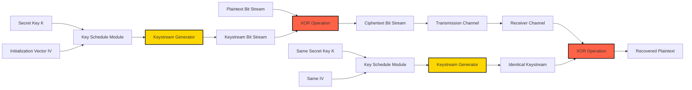
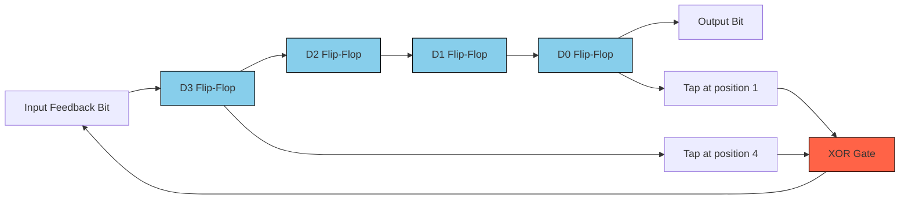
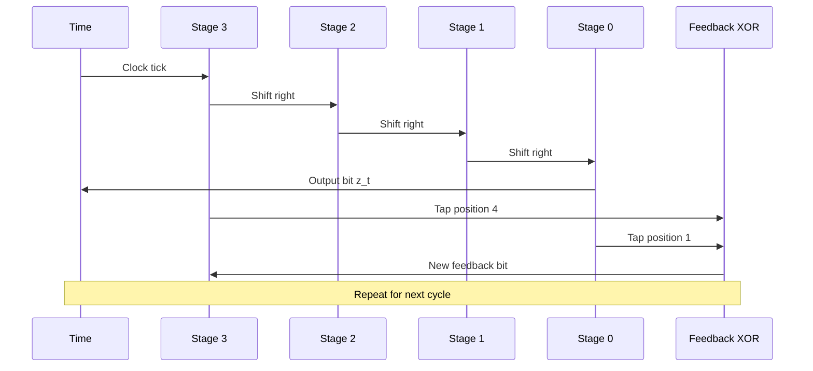
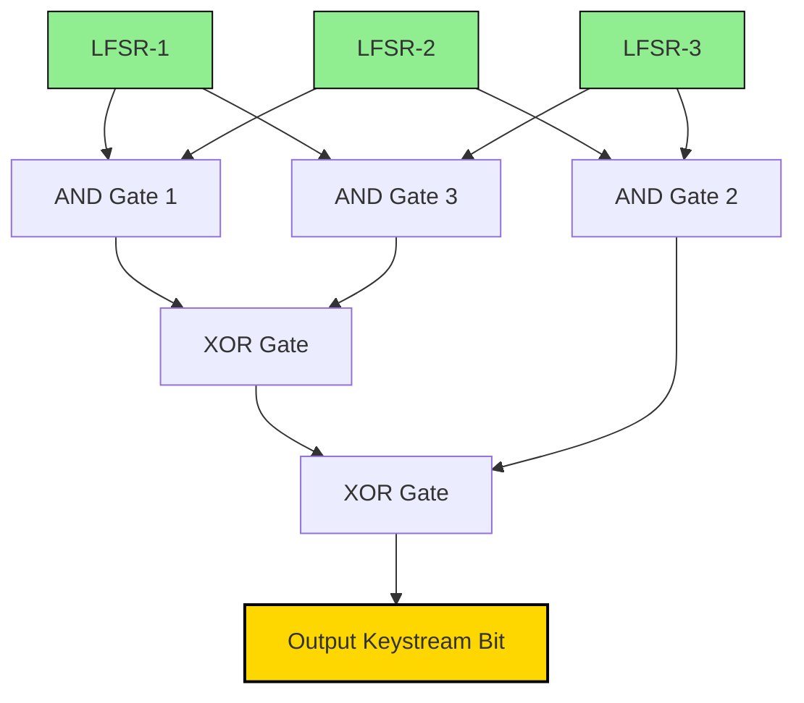
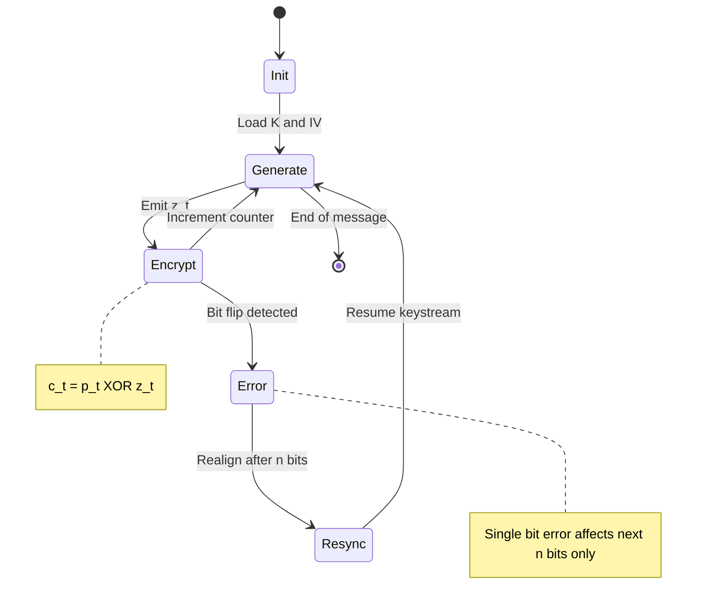
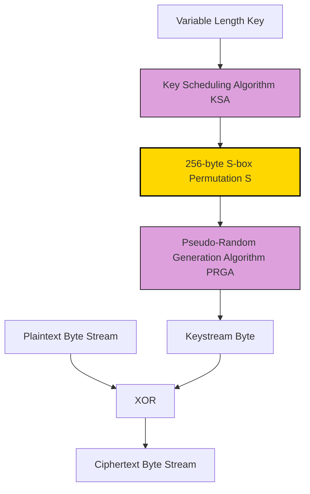

# Stream Ciphers

<!-- SECTION_1_START -->
# Stream Ciphers: Core Definition and Conceptual Foundation

## Formal Academic Definition

> [!IMPORTANT]
> **Definition (KTU 2024 Scheme - Cryptography Module 3):**
> A **Stream Cipher** is a symmetric key cryptographic algorithm that encrypts plaintext digits (typically bits or bytes) one at a time, applying a varying transformation to each successive plaintext symbol, by combining the plaintext with a pseudo-random cipher digit stream (**keystream**) generated from a secret key and a public initialization vector. The keystream is produced by a deterministic algorithm, usually a **Linear Feedback Shift Register (LFSR)** or a keyed pseudo-random generator.

The most widely used stream cipher is the **Vernam Cipher** (One-Time Pad) when the keystream is truly random and never reused. In practice, stream ciphers use cryptographically secure pseudo-random number generators (CSPRNGs) to approximate this ideal.

## Conceptual Analogy and Intuition

> [!TIP]
> **Intuitive Analogy — The Lockbox Conveyor Belt:**
> Imagine a conveyor belt carrying a sequence of identical locked boxes, each containing a unique padlock key. Alice (sender) opens each incoming "message box" one by one, attaches the padlock from the conveyor belt to it, and sends it down the line. Bob (receiver) has a synchronized identical conveyor belt that produces the *same* keys at the *same* time. He removes the padlock using his synchronized key. An eavesdropper, not having access to either conveyor belt's key sequence, sees only sealed boxes with no way to open them — even if he captures the entire stream.
>
> - The **conveyor belt** = the keystream generator
> - Each **padlock key** = a keystream bit $z_i$
> - Each **message box** = a plaintext bit $p_i$
> - The **sealed box** = the ciphertext bit $c_i = p_i \oplus z_i$

## Core Properties of Stream Ciphers

> [!NOTE]
> **KTU Syllabus Highlights — Key Characteristics:**
> 1. **Bit-wise Encryption:** Operates on individual bits or small blocks (typically 1 bit or 1 byte at a time).
> 2. **Keystream Dependence:** Ciphertext depends on the secret key, the IV/nonce, and the position in the stream.
> 3. **No Error Propagation:** An error in one ciphertext bit affects only the decryption of the corresponding plaintext bit (synchronous mode).
> 4. **Low Diffusion:** Each ciphertext bit is a function of only one plaintext bit and one keystream bit — so diffusion is minimal compared to block ciphers.
> 5. **Speed and Simplicity:** Implementations are extremely fast in hardware and lightweight in software, making them ideal for resource-constrained environments (IoT, RFID, mobile).

## Mathematical Foundation of Stream Ciphers

At the heart of every stream cipher lies the **XOR (exclusive-OR)** operation, which is the primary tool for combining plaintext and keystream:

$$c_i = p_i \oplus z_i$$

Decryption is symmetric and equally elegant:

$$p_i = c_i \oplus z_i = (p_i \oplus z_i) \oplus z_i = p_i \oplus (z_i \oplus z_i) = p_i \oplus 0 = p_i$$

This works because XOR is its own inverse ($a \oplus a = 0$ for any bit $a$) and XOR is associative/commutative.

## Types of Stream Ciphers

> [!NOTE]
> **Classification by Synchronization Mechanism:**
>
> | Type | Description | Resync Required? | Error Propagation |
> | :--- | :--- | :--- | :--- |
> | **Synchronous Stream Cipher** | Keystream generated independently of plaintext and ciphertext. Sender and receiver must remain perfectly synchronized. | Yes — loss of one bit corrupts all subsequent bits | Strict — bit flip in $c_i$ flips only $p_i$ |
> | **Self-Synchronizing (Asynchronous) Stream Cipher** | Keystream is generated as a function of the key and a fixed number of previous ciphertext bits. | No — automatically resyncs after $n$ correct bits | Limited — error affects at most $n$ subsequent bits |
>
> **Classification by Primitive:**
> - **LFSR-based ciphers** (e.g., A5/1 for GSM)
> - **RC4** (used in WEP, TLS, formerly in WPA)
> - **Salsa20 / ChaCha20** (modern, used in TLS 1.3, SSH)
> - **Grain, Trivium** (eKlightweight eSTREAM winners)

## The Geometrical and Information-Theoretic View

> [!VISUALIZATION CONTROL]
> **Concept:** Bitwise XOR stream encryption viewed as geometric bit-flip transformation
> **Desmos Input Equations:**
> - Plot the keystream as a discrete sequence: $z_i = \{1, 0, 1, 1, 0, 0, 1, ...\}$
> - Plot the plaintext: $p_i = \{0, 1, 1, 0, 1, 1, 0, ...\}$
> - Ciphertext points: $c_i = p_i \oplus z_i$ shown at $x=i$, $y=c_i$ on a discrete grid
> **Visual Description:** Imagine a horizontal time axis with bits stacked vertically. Each column is a coordinate $(i, p_i)$ and $(i, z_i)$. The ciphertext column is the *modulo-2 sum* of the two stacked heights. When keystream bit is 1, the plaintext bit gets "flipped" — visualized as a vertical mirror reflection across the $y=0.5$ midline.

## Working Principle of a Generic Stream Cipher

The end-to-end operation of a synchronous stream cipher is captured by the tuple of operations:

$$K \xrightarrow{\text{Key Setup}} (K_s, IV) \xrightarrow{\text{KG}} z_0, z_1, z_2, \ldots \xrightarrow{\text{XOR with } p_i} c_0, c_1, c_2, \ldots$$

Where:
- $K$ is the secret key
- $K_s$ is the key schedule / expanded internal state
- $IV$ is the initialization vector (public but unique per session)
- $z_i$ is the $i$-th keystream bit
- $c_i$ is the $i$-th ciphertext bit
<!-- SECTION_1_END -->

<!-- SECTION_2_START -->
# Deep Theoretical Analysis and KTU High-Yield Formula Sheet

## Operational Walkthrough — How a Stream Cipher Works

The lifecycle of a stream cipher involves **three distinct algorithmic phases**, each crucial for security:

### Phase 1: Key and IV Setup
- A secret key $K$ of length $k$ bits (commonly 128 or 256 bits) is shared between sender and receiver via a secure channel (e.g., Diffie-Hellman key exchange).
- An **Initialization Vector (IV)** of length $n$ bits is generated randomly (or as a counter) and transmitted in plaintext alongside the ciphertext. The IV ensures that *two messages encrypted with the same key* produce *different ciphertexts* (semantic security).

### Phase 2: Keystream Generation
- A pseudo-random number generator (PRNG), seeded by $(K, IV)$, produces a long sequence of bits $z_0, z_1, z_2, \ldots, z_{L-1}$ where $L$ is the message length.
- The keystream must satisfy: (a) **Long period** (no repetition over realistic message lengths), (b) **Statistical randomness** (passes standard randomness tests), (c) **Unpredictability** (keystream bits cannot be predicted without knowing $K$).

### Phase 3: Encryption and Decryption via XOR
- Encryption: $c_i = p_i \oplus z_i$ for each bit position $i = 0, 1, 2, \ldots, L-1$
- Decryption: $p_i = c_i \oplus z_i$ (same operation, since XOR is self-inverse)

## Linear Feedback Shift Registers (LFSRs) — The Classical Building Block

> [!IMPORTANT]
> **Definition (LFSR):**
> A **Linear Feedback Shift Register** is a shift register whose input bit is a linear function (typically XOR) of its previous state. The feedback taps are determined by a *feedback polynomial* over the finite field $\text{GF}(2)$.

### LFSR Recurrence Relation

For an $n$-bit LFSR with feedback polynomial $p(x) = c_n x^n + c_{n-1} x^{n-1} + \cdots + c_1 x + 1$ over $\text{GF}(2)$:

$$s_{t+n} = c_1 s_{t+n-1} \oplus c_2 s_{t+n-2} \oplus \cdots \oplus c_{n-1} s_{t+1} \oplus c_n s_t \pmod{2}$$

Where $s_t$ is the state at time $t$ and $c_i \in \{0, 1\}$ are the feedback coefficients.

### Maximum Length Sequence (m-sequence)

> [!NOTE]
> **Theoretical Result (KTU High-Yield):**
> An $n$-stage LFSR produces a maximum-period sequence of length $L = 2^n - 1$ **if and only if** its feedback polynomial is **primitive** (i.e., irreducible and the smallest polynomial for which $x$ is a root has degree $n$).

A primitive polynomial $p(x)$ of degree $n$ is one where the order of $x$ modulo $p(x)$ equals $2^n - 1$.

### Example: 4-bit LFSR

Consider the primitive polynomial $p(x) = x^4 + x + 1$ (commonly listed in KTU textbooks).

The recurrence is:

$$s_{t+4} = s_{t+1} \oplus s_t \pmod{2}$$

Starting from initial state $(s_3, s_2, s_1, s_0) = (1, 0, 0, 0)$ (non-zero), the LFSR cycles through $2^4 - 1 = 15$ non-zero states before repeating.

## KTU High-Yield Formula Sheet and Cheat Sheet

> [!TIP]
> **Rapid-Revision Table — Stream Cipher Equations**

| Concept | Formula / Rule | Variables | Notes |
| :--- | :--- | :--- | :--- |
| Encryption | $c_i = p_i \oplus z_i$ | $c_i, p_i, z_i \in \{0,1\}$ | Bitwise XOR |
| Decryption | $p_i = c_i \oplus z_i$ | Same as above | Self-inverse property |
| LFSR Recurrence | $s_{t+n} = \bigoplus_{i=1}^{n} c_i s_{t+n-i}$ | Over $\text{GF}(2)$ | Linear feedback |
| Maximum period | $L_{\max} = 2^n - 1$ | $n$ = LFSR length | Achieved iff $p(x)$ is primitive |
| LFSR Output | $z_t = s_t$ (or $s_{t+n-1}$ depending on convention) | $s_t$ = state bit at time $t$ | Output = one bit per cycle |
| Entropy of keystream | $H(Z) = L$ (ideal, all bits independent) | $L$ = keystream length in bits | Real PRNGs approximate this |
| Seed-to-Stream Expansion | $\text{Seed}: k$ bits $\rightarrow$ Stream: $L$ bits with $L \gg k$ | Stretch factor | $k$ typically 128 or 256 bits |
| IV Uniqueness | $\Pr[\text{IV reuse with same key}] < 2^{-n}$ | $n$ = IV length | Critical for nonce-based ciphers |

## The Berlekamp-Massey Algorithm — LFSR Reconstruction

> [!IMPORTANT]
> **Theorem (Massey, 1969):**
> Given any $2n$ consecutive bits of the output of an $n$-stage LFSR, the **Berlekamp-Massey algorithm** uniquely reconstructs the shortest LFSR that produces the sequence, in $O(n^2)$ time. This is the foundational attack against pure LFSR-based stream ciphers.

**Implication for KTU:** A *single* LFSR is **cryptographically weak** because an attacker who observes enough keystream can recover the polynomial and initial state. Modern stream ciphers use **nonlinear combinations** of multiple LFSRs to defeat this attack.

## Nonlinear Combination Generators

To resist linear cryptanalysis, real-world ciphers combine outputs of multiple LFSRs through a **nonlinear combining function** $f$:

$$z_t = f(s_t^{(1)}, s_t^{(2)}, \ldots, s_t^{(k)})$$

Where $s_t^{(j)}$ is the state of the $j$-th LFSR at time $t$. Examples include:
- **Geffe Generator:** $z_t = s_t^{(1)} s_t^{(2)} \oplus s_t^{(1)} s_t^{(3)} \oplus s_t^{(2)} s_t^{(3)}$
- **Summation Generator:** $z_t = (s_t^{(1)} + s_t^{(2)} + \cdots + s_t^{(k)}) \pmod{2}$
- **Multiplexer Generator:** A selector bit from one LFSR chooses output from others.

## Real-World Applications of Stream Ciphers

> [!NOTE]
> **Where Stream Ciphers are Used in Industry:**
> 1. **Wireless Communication:** A5/1 in GSM (legacy), SNOW 3G in 3G/4G (5G AKA uses SNOW-V).
> 2. **Web Security:** ChaCha20 in TLS 1.3, replacing RC4 which is now broken.
> 3. **Disk Encryption:** ChaCha20 + Poly1305 AEAD construction in modern full-disk encryption.
> 4. **IoT / RFID:** Grain-128, Trivium — designed for extremely low power and silicon area.
> 5. **Secure Shell (SSH):** ChaCha20-Poly1305 AEAD.
> 6. **Voice over IP (VoIP):** SRTP uses AES-CM (counter mode, a stream-cipher-like construction).
> 7. **Streaming Media (DRM):** Real-time encryption where low latency and minimal buffering are essential.

## Why Stream Ciphers? The Engineering Trade-Off

> [!TIP]
> **Stream vs. Block Cipher Comparison for KTU Exams:**

| Property | Stream Cipher | Block Cipher |
| :--- | :--- | :--- |
| Granularity | 1 bit / 1 byte | 64 or 128 bits |
| Speed (software) | Very high (e.g., ChaCha20 ~4 cycles/byte) | Moderate (AES ~10-15 cycles/byte) |
| Hardware Cost | Low (LFSR-based) | Higher (S-boxes, MDS matrix) |
| Error Propagation | None (sync) or bounded (async) | Affects entire block |
| Diffusion | Low | High (after 1-2 rounds) |
| Reuse Risk | Catastrophic if key+IV reused (Two-Time Pad attack) | Less severe (but still bad) |
| Best Use Case | Real-time, low-power, streaming data | Bulk data, file encryption |

## The Two-Time Pad Attack — Why IV Reuse is Fatal

> [!WARNING]
> **Critical KTU Concept: Two-Time Pad Vulnerability**
> If the *same keystream* $z$ is used to encrypt two different plaintexts $p$ and $p'$:
> $c = p \oplus z$ and $c' = p' \oplus z$
> Then an attacker can compute:
> $c \oplus c' = (p \oplus z) \oplus (p' \oplus z) = p \oplus p'$
> This leaks the XOR of the two plaintexts. For English text, the XOR of two texts can be statistically analyzed to recover both — a classic cryptanalytic technique. **Never reuse a key+IV combination.**
<!-- SECTION_2_END -->

<!-- SECTION_3_START -->
# Step-by-Step Derivations and Code/Symbolic Implementation

## Derivation 1: LFSR Period Bound for Primitive Polynomials

**Goal:** Prove that an $n$-stage LFSR with primitive feedback polynomial produces a period of exactly $2^n - 1$.

**Setup:** The state of an $n$-bit LFSR at time $t$ is the vector $S_t = (s_t, s_{t+1}, \ldots, s_{t+n-1})$ over $\text{GF}(2)^n$. The state transition is linear:

$$S_{t+1} = M \cdot S_t \pmod{2}$$

where $M$ is the $n \times n$ companion matrix derived from the feedback polynomial.

**Step 1 — Count possible states:** There are $2^n$ possible states, but the all-zero state is a fixed point under any LFSR transition (since $0 \oplus 0 = 0$). Excluding the zero state, the maximum period is bounded by $2^n - 1$.

**Step 2 — Linear algebra over $\text{GF}(2)$:** The state evolution is $S_t = M^t S_0$. The period of the sequence is the multiplicative order of $M$ in $\text{GL}(n, \text{GF}(2))$.

**Step 3 — Apply primitivity condition:** A polynomial $p(x)$ of degree $n$ is primitive if and only if the order of $x$ modulo $p(x)$ is exactly $2^n - 1$. The companion matrix $M$ has minimal polynomial $p(x)$, so its order equals $2^n - 1$ precisely when $p(x)$ is primitive.

**Step 4 — Conclude:**

$$L_{\max} = \text{ord}(M) = 2^n - 1 \quad \text{when} \quad p(x) \text{ is primitive.}$$

## Derivation 2: Algebraic Properties of XOR-Based Stream Encryption

**Claim:** $c_i \oplus z_i = p_i$ for all $i$.

**Proof:**

$$c_i \oplus z_i = (p_i \oplus z_i) \oplus z_i$$

By the **associative property** of XOR:

$$(p_i \oplus z_i) \oplus z_i = p_i \oplus (z_i \oplus z_i)$$

By the **self-inverse property** $z_i \oplus z_i = 0$:

$$p_i \oplus (z_i \oplus z_i) = p_i \oplus 0$$

By the **identity property** $p_i \oplus 0 = p_i$:

$$\therefore \quad c_i \oplus z_i = p_i \quad \blacksquare$$

## Derivation 3: Entropy and Information Theoretic Security of One-Time Pad

**Setup:** If the keystream $Z$ is a uniformly random bit string with $H(Z) = L$ (full entropy in bits), then for a known ciphertext $C$:

$$H(P \mid C) = H(P \mid C, Z) + I(P; Z \mid C)$$

Since knowing $Z$ makes $P$ deterministic from $C$:

$$H(P \mid C, Z) = 0$$

By definition of conditional mutual information $I(P; Z \mid C) = 0$ when $P$ and $Z$ are independent (which holds in a true one-time pad).

$$\therefore H(P \mid C) = H(P)$$

This means the ciphertext reveals **zero information** about the plaintext — the formal definition of **perfect secrecy** by Shannon (1949).

## Derivation 4: Linear Complexity of Geffe Generator

**Setup:** The Geffe generator combines three LFSRs of lengths $L_1, L_2, L_3$ as:

$$z_t = s_t^{(1)} s_t^{(2)} \oplus s_t^{(1)} s_t^{(3)} \oplus s_t^{(2)} s_t^{(3)}$$

**Claim:** The linear complexity $L$ of the resulting keystream is bounded by:

$$L \leq L_1 L_2 + L_2 L_3 + L_1 L_3$$

**Justification:** The Geffe function is a Boolean function of degree 2. By the **Rueppel-Kalyanaraman theorem**, the linear complexity of the output is bounded by the sum of the products of the input linear complexities, where the products correspond to the monomials in the algebraic normal form (ANF).

For degree 2: $L \leq \sum_{i < j} L_i L_j = L_1 L_2 + L_2 L_3 + L_1 L_3$.

This shows that *combining LFSRs nonlinearly increases linear complexity*, but not multiplicatively — a balanced LFSR of length $L_1 L_2$ would be far stronger.

## Code Implementation 1: Python LFSR with Primitive Polynomial

The following Python program implements a 4-bit LFSR with the primitive polynomial $p(x) = x^4 + x + 1$ and verifies it produces a maximum-length sequence.

```python
from typing import List

class LFSR:
    """
    A Linear Feedback Shift Register implementation over GF(2).
    Taps are specified as bit positions counted from the left (MSB) of the state.
    For p(x) = x^4 + x + 1, taps = [4, 1] in 1-indexed notation.
    """

    def __init__(self, initial_state: List[int], taps: List[int]) -> None:
        if not all(bit in (0, 1) for bit in initial_state):
            raise ValueError("Initial state must be a list of bits (0 or 1).")
        if any(tap < 1 or tap > len(initial_state) for tap in taps):
            raise ValueError("Tap position out of range for the given LFSR length.")
        if all(bit == 0 for bit in initial_state):
            raise ValueError("Initial state cannot be all zeros (degenerate LFSR).")

        self.state: List[int] = list(initial_state)
        self.taps: List[int] = sorted(taps, reverse=True)  # Highest tap first
        self.n: int = len(initial_state)
        self.period_target: int = (1 << self.n) - 1

    def step(self) -> int:
        """
        Advance the LFSR by one clock cycle and return the output bit.
        Output bit = rightmost bit of the state (after shift).
        Feedback bit = XOR of all tapped bits.
        """
        output_bit: int = self.state[-1]
        feedback: int = 0
        for tap in self.taps:
            feedback ^= self.state[tap - 1]
        # Right-shift the state and insert feedback at the front
        self.state = [feedback] + self.state[:-1]
        return output_bit

    def generate_keystream(self, length: int) -> List[int]:
        """Generate a keystream of the specified length."""
        if length <= 0:
            raise ValueError("Keystream length must be positive.")
        return [self.step() for _ in range(length)]

    def verify_maximum_period(self) -> bool:
        """
        Run the LFSR for 2^n cycles and check that we return to the
        original state (excluding the all-zero state).
        """
        initial = list(self.state)
        for _ in range(self.period_target):
            self.step()
        return self.state == initial


def stream_encrypt(plaintext: str, key_bits: List[int], taps: List[int], iv_bits: List[int]) -> List[int]:
    """
    Encrypt plaintext using LFSR-based stream cipher.
    Converts string to bit list, generates keystream, XORs, and returns ciphertext.
    """
    # Step 1: Convert plaintext to list of bits (UTF-8)
    pt_bytes: bytes = plaintext.encode("utf-8")
    pt_bits: List[int] = []
    for byte in pt_bytes:
        for i in range(7, -1, -1):
            pt_bits.append((byte >> i) & 1)

    # Step 2: Initialize LFSR with key + IV (simplified concatenation)
    seed_bits: List[int] = key_bits + iv_bits
    if len(seed_bits) < 4:
        raise ValueError("Seed must be at least 4 bits for this demo LFSR.")
    lfsr: LFSR = LFSR(seed_bits[:4], taps)

    # Step 3: Generate keystream
    keystream: List[int] = lfsr.generate_keystream(len(pt_bits))

    # Step 4: Encrypt via XOR
    ciphertext: List[int] = [p ^ z for p, z in zip(pt_bits, keystream)]
    return ciphertext


def stream_decrypt(ciphertext: List[int], key_bits: List[int], taps: List[int], iv_bits: List[int]) -> str:
    """Decrypt ciphertext using the same key, taps, and IV."""
    seed_bits: List[int] = key_bits + iv_bits
    lfsr: LFSR = LFSR(seed_bits[:4], taps)
    keystream: List[int] = lfsr.generate_keystream(len(ciphertext))
    pt_bits: List[int] = [c ^ z for c, z in zip(ciphertext, keystream)]

    # Convert bits back to bytes and then to string
    pt_bytes: bytearray = bytearray()
    for i in range(0, len(pt_bits), 8):
        byte_val: int = 0
        for j in range(8):
            byte_val = (byte_val << 1) | pt_bits[i + j]
        pt_bytes.append(byte_val)
    return pt_bytes.decode("utf-8", errors="replace")


# ----- Main Execution Block -----
if __name__ == "__main__":
    # Demo: 4-bit LFSR with p(x) = x^4 + x + 1
    initial_state: List[int] = [1, 0, 0, 1]      # Non-zero seed
    taps: List[int] = [4, 1]                      # x^4 + x + 1
    test_lfsr: LFSR = LFSR(initial_state, taps)
    ks: List[int] = test_lfsr.generate_keystream(20)
    print("Generated keystream (20 bits):", ks)
    print("Maximum period verified:", test_lfsr.verify_maximum_period())

    # End-to-end encryption demo
    message: str = "KTU"
    key: List[int] = [1, 1, 0, 1]
    iv: List[int] = [0, 1, 1, 0]
    ct: List[int] = stream_encrypt(message, key, taps, iv)
    print("Ciphertext bits:", ct)
    pt_recovered: str = stream_decrypt(ct, key, taps, iv)
    print("Decrypted text:", pt_recovered)
    assert pt_recovered == message, "Round-trip encryption/decryption failed!"
```

## Code Implementation 2: RC4 Stream Cipher in Python

The following code implements the full RC4 stream cipher as described in the KTU syllabus, which is a widely-studied historical stream cipher (now broken for new systems but pedagogically essential).

```python
from typing import List

class RC4:
    """
    RC4 stream cipher implementation (for educational use only).
    RC4 uses a 256-byte S-box and produces a keystream that is XORed with plaintext.
    """

    def __init__(self, key: bytes) -> None:
        if not (1 <= len(key) <= 256):
            raise ValueError("Key length must be between 1 and 256 bytes.")
        self.S: List[int] = list(range(256))
        self._ksa(key)

    def _ksa(self, key: bytes) -> None:
        """Key Scheduling Algorithm (KSA) — initializes the S-box from the key."""
        key_length: int = len(key)
        j: int = 0
        for i in range(256):
            j = (j + self.S[i] + key[i % key_length]) % 256
            # Swap S[i] and S[j]
            self.S[i], self.S[j] = self.S[j], self.S[i]

    def _prga(self, length: int) -> List[int]:
        """Pseudo-Random Generation Algorithm (PRGA) — generates the keystream."""
        i: int = 0
        j: int = 0
        keystream: List[int] = []
        for _ in range(length):
            i = (i + 1) % 256
            j = (j + self.S[i]) % 256
            self.S[i], self.S[j] = self.S[j], self.S[i]
            k: int = self.S[(self.S[i] + self.S[j]) % 256]
            keystream.append(k)
        return keystream

    def encrypt(self, plaintext: bytes) -> bytes:
        """Encrypt plaintext bytes using RC4 keystream (XOR)."""
        keystream: List[int] = self._prga(len(plaintext))
        return bytes([p ^ k for p, k in zip(plaintext, keystream)])

    def decrypt(self, ciphertext: bytes) -> bytes:
        """Decrypt is identical to encrypt (XOR is symmetric)."""
        return self.encrypt(ciphertext)


# ----- Demo Run -----
if __name__ == "__main__":
    secret_key: bytes = b"KTU-CRYPTO-KEY"
    rc4_cipher: RC4 = RC4(secret_key)

    plaintext: bytes = b"Fundamentals of Cryptography - Stream Ciphers Module"
    ct: bytes = rc4_cipher.encrypt(plaintext)
    pt: bytes = rc4_cipher.decrypt(ct)

    print("Plaintext :", plaintext.decode())
    print("Ciphertext (hex):", ct.hex())
    print("Decrypted :", pt.decode())
    assert pt == plaintext, "RC4 round-trip failed!"
```

## Step-by-Step Worked Example — Manual LFSR Encryption

**Given:**
- LFSR length $n = 4$
- Primitive polynomial $p(x) = x^4 + x + 1$ (taps at positions 4 and 1)
- Initial state (seed) = $(1, 0, 0, 0)$ (i.e., $s_3 s_2 s_1 s_0 = 1\,0\,0\,0$)
- Plaintext bits: $p = (1, 0, 1, 1, 0, 1, 0, 0)$

**Required:** Compute the ciphertext bits $c_i = p_i \oplus z_i$.

**Step 1 — Run the LFSR for 8 cycles and collect output bits:**

The output bit at time $t$ is the rightmost bit of the state *before* shifting (we use the convention $z_t = s_{t,0}$).

| Cycle $t$ | State $(s_3, s_2, s_1, s_0)$ | Feedback $s_3 \oplus s_0$ | Output $z_t$ |
| :---: | :---: | :---: | :---: |
| 0 | $(1, 0, 0, 0)$ | $1 \oplus 0 = 1$ | $z_0 = 0$ |
| 1 | $(1, 1, 0, 0)$ | $1 \oplus 0 = 1$ | $z_1 = 0$ |
| 2 | $(1, 1, 1, 0)$ | $1 \oplus 0 = 1$ | $z_2 = 0$ |
| 3 | $(1, 1, 1, 1)$ | $1 \oplus 1 = 0$ | $z_3 = 1$ |
| 4 | $(0, 1, 1, 1)$ | $0 \oplus 1 = 1$ | $z_4 = 1$ |
| 5 | $(1, 0, 1, 1)$ | $1 \oplus 1 = 0$ | $z_5 = 1$ |
| 6 | $(0, 1, 0, 1)$ | $0 \oplus 1 = 1$ | $z_6 = 1$ |
| 7 | $(1, 0, 1, 0)$ | $1 \oplus 0 = 1$ | $z_7 = 0$ |

Keystream: $Z = (0, 0, 0, 1, 1, 1, 1, 0)$.

**Step 2 — XOR plaintext and keystream:**

| $i$ | $p_i$ | $z_i$ | $c_i = p_i \oplus z_i$ |
| :---: | :---: | :---: | :---: |
| 0 | 1 | 0 | 1 |
| 1 | 0 | 0 | 0 |
| 2 | 1 | 0 | 1 |
| 3 | 1 | 1 | 0 |
| 4 | 0 | 1 | 1 |
| 5 | 1 | 1 | 0 |
| 6 | 0 | 1 | 1 |
| 7 | 0 | 0 | 0 |

**Result:** $C = (1, 0, 1, 0, 1, 0, 1, 0)$.

**Step 3 — Decryption check:** Receiver regenerates the same keystream using the same key and IV, then computes $p_i = c_i \oplus z_i$, recovering $(1, 0, 1, 1, 0, 1, 0, 0)$. ✓
<!-- SECTION_3_END -->

<!-- SECTION_4_START -->
# Structural Diagrams and Schematics

## Diagram 1: Block-Level Architecture of a Synchronous Stream Cipher



## Diagram 2: LFSR Internal Structure for 4-bit Register



## Diagram 3: Sequential Processing Topology of LFSR Clocking



## Diagram 4: Nonlinear Combination Generator Topology (Geffe)



## Diagram 5: Self-Synchronizing Stream Cipher State Machine



## Diagram 6: Block-Level Functional Architecture of RC4


<!-- SECTION_4_END -->

<!-- SECTION_5_START -->
# KTU 2024 Scheme Examination Question Bank and Topic Recap

## Part A Questions (3 Marks Each)

### Question 1
> **\[KTU University Exam - Dec 2023, Model Question Paper, CO2, Remember]**
> Define a **stream cipher** and state any **two distinguishing properties** that separate it from a block cipher.

**Model Answer (3 Marks):**

> [!NOTE]
> **Definition:** A stream cipher is a symmetric-key cipher that encrypts plaintext one bit (or one byte) at a time by combining it with a pseudo-random keystream bit $z_i$, typically via the XOR operation: $c_i = p_i \oplus z_i$.

**Distinguishing Properties (1.5 Marks each):**

1. **Granularity:** Stream ciphers operate on individual bits/bytes, while block ciphers operate on fixed-size blocks (64 or 128 bits). **[1.5 Marks]**

2. **Memory and Speed:** Stream ciphers are typically memory-less (or have very small state) and run much faster in software/hardware, making them suitable for low-latency applications. Block ciphers require buffering of full blocks and have higher latency. **[1.5 Marks]**

---

### Question 2
> **\[KTU University Exam - July 2024, Supplementary Exam, CO2, Understand]**
> What is an **LFSR**? Explain the role of a **primitive feedback polynomial** in determining the period of the LFSR output.

**Model Answer (3 Marks):**

> [!NOTE]
> **LFSR Definition (1 Mark):** A Linear Feedback Shift Register is a shift register of $n$ stages where the input bit at each clock is a linear (XOR) function of selected stages, governed by a feedback polynomial $p(x)$ over $\text{GF}(2)$.

**Role of Primitive Polynomial (2 Marks):** A polynomial $p(x)$ of degree $n$ over $\text{GF}(2)$ is called primitive if it is irreducible and the smallest integer $k$ such that $p(x)$ divides $x^k + 1$ is $k = 2^n - 1$. When the feedback polynomial is primitive, the LFSR cycles through all $2^n - 1$ non-zero states exactly once before repeating, producing a **maximum-length sequence (m-sequence)**. If the polynomial is not primitive, the period is strictly less than $2^n - 1$, weakening the cryptographic strength.

---

## Part B Questions (14 Marks Each)

### Question A — Stream Cipher Theory and Design

> **\[KTU University Exam - July 2024, Regular Exam, CO2 + CO3, Apply + Analyze]**

**(a)** With a neat block diagram, explain the **architecture of a synchronous stream cipher** and the role of each component. Clearly show the encryption and decryption paths. **[7 Marks]**

**(b)** Consider a **3-stage LFSR** with feedback polynomial $p(x) = x^3 + x + 1$ and initial state $(1, 0, 0)$. Generate the first **7 keystream bits** and show that the period equals $2^3 - 1 = 7$. Use the output convention $z_t = s_{t,0}$ (rightmost bit). **[7 Marks]**

---

#### Model Solution for Question A(a) — Architecture (7 Marks)

> [!IMPORTANT]
> **Valuation Key for Architecture Question (KTU Examiner Standard):**

**Step 1 — State the components (2 Marks):**

A synchronous stream cipher consists of:
- **Secret Key $K$** (shared between sender and receiver)
- **Initialization Vector $IV$** (public, per-session random value)
- **Key Schedule Module** (expands $K$ and $IV$ into an internal state)
- **Keystream Generator (KG)** (produces pseudo-random bits $z_0, z_1, \ldots$)
- **XOR Module** (combines plaintext with keystream)

**Step 2 — Block diagram (3 Marks):**

**Sender Side:**
- $K$ and $IV$ → Key Schedule → Internal State → KG → Keystream $Z$
- Plaintext $P$ and $Z$ → XOR → Ciphertext $C$

**Receiver Side:**
- $K$ and $IV$ → Key Schedule → Internal State → KG → Identical Keystream $Z'$
- $C$ and $Z'$ → XOR → Recovered Plaintext $P'$

**Step 3 — Encryption/Decryption equation (2 Marks):**
- $c_i = p_i \oplus z_i$ and $p_i = c_i \oplus z_i$.

---

#### Model Solution for Question A(b) — LFSR Computation (7 Marks)

> [!IMPORTANT]
> **Valuation Key for LFSR Question (KTU Examiner Standard):**

**Step 1 — State setup (1 Mark):**
- Polynomial: $p(x) = x^3 + x + 1$ → recurrence: $s_{t+3} = s_{t+1} \oplus s_t$
- Initial state: $(s_2, s_1, s_0) = (1, 0, 0)$
- Total non-zero states: $2^3 - 1 = 7$

**Step 2 — Cycle table (4 Marks):**

| Cycle $t$ | State $(s_2, s_1, s_0)$ | Output $z_t = s_0$ | Feedback $s_2 \oplus s_0$ |
| :---: | :---: | :---: | :---: |
| 0 | $(1, 0, 0)$ | $z_0 = 0$ | $1 \oplus 0 = 1$ |
| 1 | $(1, 1, 0)$ | $z_1 = 0$ | $1 \oplus 0 = 1$ |
| 2 | $(1, 1, 1)$ | $z_2 = 1$ | $1 \oplus 1 = 0$ |
| 3 | $(0, 1, 1)$ | $z_3 = 1$ | $0 \oplus 1 = 1$ |
| 4 | $(1, 0, 1)$ | $z_4 = 1$ | $1 \oplus 1 = 0$ |
| 5 | $(0, 1, 0)$ | $z_5 = 0$ | $0 \oplus 0 = 0$ |
| 6 | $(0, 0, 1)$ | $z_6 = 1$ | $0 \oplus 1 = 1$ |
| 7 | $(1, 0, 0)$ | (repeats) | — |

**Step 3 — Keystream and conclusion (2 Marks):**
- Keystream: $Z = (0, 0, 1, 1, 1, 0, 1)$
- After 7 cycles, the state returns to $(1, 0, 0)$ → **period = 7 = $2^3 - 1$** ✓
- This confirms $p(x) = x^3 + x + 1$ is **primitive**.

---

### Question B — RC4 and Nonlinear Generators

> **\[KTU University Exam - Dec 2023, Model Paper, CO3, Apply + Analyze — Alternative Choice]**

**(a)** Describe the **RC4 stream cipher** algorithm. List its two main phases: KSA and PRGA, and write the encryption equation. **[7 Marks]**

**(b)** The **Geffe generator** combines three LFSRs of lengths $L_1 = 5$, $L_2 = 7$, and $L_3 = 11$ using the Boolean function:
$$z_t = s_t^{(1)} s_t^{(2)} \oplus s_t^{(1)} s_t^{(3)} \oplus s_t^{(2)} s_t^{(3)}$$
Compute the **upper bound on the linear complexity** of the resulting keystream. **[7 Marks]**

---

#### Model Solution for Question B(a) — RC4 Description (7 Marks)

> [!IMPORTANT]
> **Valuation Key for RC4 Question (KTU Examiner Standard):**

**Step 1 — Overview (1 Mark):**
RC4 is a variable-key-size stream cipher designed by Ron Rivest in 1987. It uses a 256-byte S-box and operates on bytes.

**Step 2 — Phase 1: Key Scheduling Algorithm KSA (3 Marks):**
```
Initialize S[i] = i for i = 0 to 255
j = 0
for i = 0 to 255:
    j = (j + S[i] + key[i mod key_length]) mod 256
    swap(S[i], S[j])
```

**Step 3 — Phase 2: Pseudo-Random Generation Algorithm PRGA (2 Marks):**
```
i = 0, j = 0
for each byte of plaintext:
    i = (i + 1) mod 256
    j = (j + S[i]) mod 256
    swap(S[i], S[j])
    K = S[(S[i] + S[j]) mod 256]
    output K
```

**Step 4 — Encryption equation (1 Mark):**
$$c_t = p_t \oplus K_t$$
where $K_t$ is the $t$-th keystream byte and $p_t$ is the $t$-th plaintext byte.

---

#### Model Solution for Question B(b) — Linear Complexity (7 Marks)

> [!IMPORTANT]
> **Valuation Key for Geffe Question (KTU Examiner Standard):**

**Step 1 — Identify parameters (1 Mark):**
- $L_1 = 5$, $L_2 = 7$, $L_3 = 11$
- Combining function: $f = s^{(1)} s^{(2)} \oplus s^{(1)} s^{(3)} \oplus s^{(2)} s^{(3)}$

**Step 2 — Identify monomials in ANF (2 Marks):**
The Algebraic Normal Form contains three degree-2 monomials:
- $s^{(1)} s^{(2)}$
- $s^{(1)} s^{(3)}$
- $s^{(2)} s^{(3)}$

**Step 3 — Apply linear complexity bound (3 Marks):**
The Rueppel-Kalyanaraman theorem gives:
$$L \leq \sum_{\text{monomials}} \prod L_i$$
$$L \leq (L_1 \cdot L_2) + (L_1 \cdot L_3) + (L_2 \cdot L_3)$$

**Step 4 — Compute numerical value (1 Mark):**
$$L \leq (5 \cdot 7) + (5 \cdot 11) + (7 \cdot 11)$$
$$L \leq 35 + 55 + 77$$
$$L \leq 167$$

**Conclusion:** The linear complexity of the Geffe generator is at most **167**, which is significantly less than the product $5 \times 7 \times 11 = 385$. This shows that nonlinear combination does not multiply complexity in a straightforward way.

---

## KTU Examiner's Valuation Warning and Common Pitfalls

> [!WARNING]
> **Critical Pitfalls Where Students Lose Marks (KTU Board Pattern):**
>
> 1. **Forgetting to state the recurrence relation explicitly:** When given an LFSR polynomial, students often skip writing $s_{t+n} = \ldots$ and jump to a cycle table. Always state the recurrence first to earn full marks.
>
> 2. **Wrong output convention:** Some textbooks use $z_t = s_{t, \text{leftmost}}$ and others $z_t = s_{t, \text{rightmost}}$. The KTU board expects you to **explicitly declare** your convention at the start to avoid ambiguity.
>
> 3. **Forgetting the all-zero state exclusion:** An LFSR stuck at $(0, 0, 0)$ is a degenerate fixed point. Maximum period is $2^n - 1$, not $2^n$. This is a common 1-mark deduction.
>
> 4. **Not verifying primitivity:** A polynomial like $x^3 + 1$ is *not* primitive (it factors). Students who pick arbitrary polynomials and assume period $= 2^n - 1$ lose marks.
>
> 5. **Confusing LFSR state with output:** The state is an $n$-bit vector; the output is typically a single bit. Conflating them loses 1-2 marks.
>
> 6. **Missing the IV in stream ciphers:** When asked about security properties, always mention the role of the IV in preventing keystream reuse — this is a 2-mark KTU favorite.
>
> 7. **Two-time pad confusion:** Some students write "$c \oplus c' = z$" instead of the correct "$c \oplus c' = p \oplus p'$" — read the question carefully.

---

## Topic Recap and Important Things to Remember

> [!TIP]
> **High-Density Rapid-Revision Checklist for Stream Ciphers (KTU Module 3)**

- **Definition (Must Memorize):** A stream cipher encrypts plaintext one bit/byte at a time using a pseudo-random keystream combined via XOR: $c_i = p_i \oplus z_i$.

- **Symmetry of XOR:** Encryption and decryption use the same operation: $p_i = c_i \oplus z_i$ because XOR is its own inverse.

- **LFSR Recurrence:** $s_{t+n} = c_1 s_{t+n-1} \oplus c_2 s_{t+n-2} \oplus \cdots \oplus c_n s_t$, all computations over $\text{GF}(2)$.

- **Maximum Period:** $L_{\max} = 2^n - 1$ is achieved **if and only if** the feedback polynomial is **primitive** (irreducible with order $2^n - 1$).

- **Common Primitive Polynomials (Must Know):**
  - $n=3$: $x^3 + x + 1$
  - $n=4$: $x^4 + x + 1$
  - $n=5$: $x^5 + x^2 + 1$
  - $n=8$: $x^8 + x^6 + x^5 + x^4 + 1$

- **Two Types of Stream Ciphers:** Synchronous (keystream independent of plaintext/ciphertext, strict sync required) and Self-Synchronizing (keystream depends on previous ciphertext bits, automatic resync after $n$ bits).

- **LFSR Weakness (Berlekamp-Massey):** Any $2n$ consecutive output bits of an $n$-stage LFSR reveal the entire LFSR structure. Hence **single LFSRs are insecure**; real ciphers use nonlinear combinations.

- **Nonlinear Combination Generators (NCG):** Combine multiple LFSRs through a Boolean function. Examples: Geffe generator, summation generator, multiplexer generator.

- **Geffe Generator Function:** $z_t = s_t^{(1)} s_t^{(2)} \oplus s_t^{(1)} s_t^{(3)} \oplus s_t^{(2)} s_t^{(3)}$, with linear complexity bound $L \leq L_1 L_2 + L_1 L_3 + L_2 L_3$.

- **RC4 Components:** KSA (initializes 256-byte S-box from key) and PRGA (generates keystream by continuously permuting S-box). Encryption: $c_t = p_t \oplus K_t$.

- **Two-Time Pad Attack:** Reusing the same keystream $z$ for two plaintexts leaks $p \oplus p'$ — never reuse a key+IV combination.

- **Modern Stream Ciphers (Industry Relevant):** ChaCha20, Salsa20, Grain-128, Trivium, SNOW 3G/V. Avoid RC4 and A5/1 in new designs.

- **Stream vs Block Cipher Use Cases:** Stream for real-time, low-latency, low-power (VoIP, IoT, mobile); Block for bulk data and authenticated encryption (file, disk, message).

- **Information-Theoretic Security:** The one-time pad achieves perfect secrecy ($H(P \mid C) = H(P)$) only when the keystream is truly random, as long as the plaintext, and never reused.

- **Error Propagation:** Synchronous stream ciphers have no error extension (one bit error → one bit error). Self-synchronizing ones propagate errors for at most $n$ bits.

- **IV Length:** Typically 64-128 bits. Must be unique (or a counter) for each encryption under the same key. Generation must be cryptographically random or a monotonic counter.

- **Key Length:** Modern recommendation is at least 128 bits for symmetric keys (NIST SP 800-131A). ChaCha20 uses 256-bit keys.

- **Hardware vs Software:** LFSRs are trivially implemented in hardware with flip-flops and XOR gates. Software implementations often prefer table-based designs (RC4) or ARX (Addition-Rotation-XOR) constructions (ChaCha20).
<!-- SECTION_5_END -->
