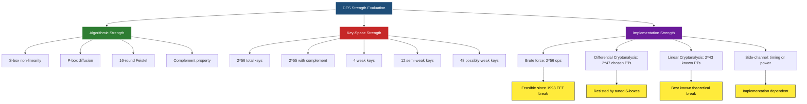
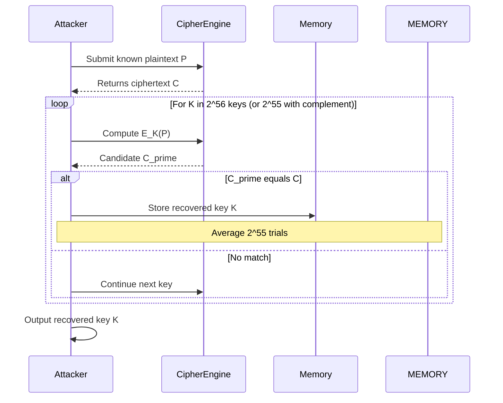
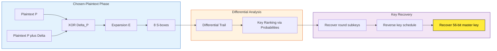
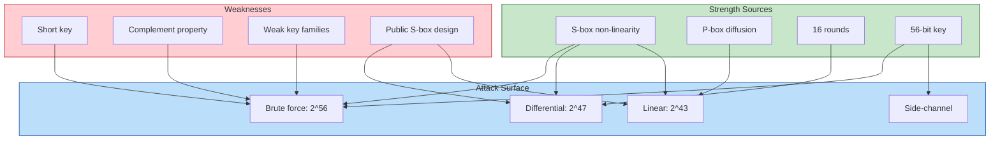

# Strength of DES

<!-- SECTION_1_START -->
# Strength of DES — Core Definition & Intuitive Overview

> [!IMPORTANT]
> **KTU 2024 Scheme — Module 3 (PECST637)**
> *“Strength of DES” is a high-weightage, theory-cum-numerical topic that integrates the **56-bit key-space problem**, the **non-linearity contribution of S-boxes**, the **complement property**, and the historical impact of **Differential & Linear Cryptanalysis**.*

## 1.1 Formal Definition

The **strength of DES** (Data Encryption Standard, FIPS 46-3) is the empirical and mathematical resistance of its 16-round Feistel cipher against cryptanalytic attacks. The standardised key length of DES is **56 bits**, the block length is **64 bits**, and the cipher is built on 16 rounds of a Feistel structure that uses **8 fixed, publicly known S-boxes** ($S_1$ to $S_8$).

In the KTU 2024 syllabus context, the “strength” of DES is evaluated along **four axes**:
1. **Key Length (Search Space)** — measured in $\log_2(\text{keyspace})$ bits.
2. **Algorithmic Non-Linearity** — provided almost entirely by the 8 S-boxes.
3. **Algebraic Symmetries / Weak Keys** — keys for which encryption and decryption are identical, or keys that produce only two distinct subkeys.
4. **Resistance to Known Cryptanalytic Attacks** — Differential Cryptanalysis (DC) and Linear Cryptanalysis (LC).

Mathematically, the effective security of a perfectly designed $n$-bit block cipher should be $\min(2^n, 2^k)$ where $k$ is the key length. For DES, $k = 56$, so the *theoretical* brute-force work factor is $2^{56}$ DES evaluations.

## 1.2 Intuitive Analogy — "The 56-Bit Padlock with 8 Tumblers"

Imagine a 16-door vault. Each door has 8 coloured tumblers (the **S-boxes**) that scramble bits in a *non-linear* way. An attacker who knows the schematic of every door (the public design) can still try:
- **Every possible key** (brute force — flipping through 72 quadrillion keys, like trying 72 × $10^{15}$ physical keys on one lock).
- **Exploiting the door’s geometry** (differential/linear cryptanalysis — finding statistical biases, like noticing that when tumbler 1 is on "red" with probability 0.6, the output tilts towards a particular value).

> [!NOTE]
> **Physical / Numerical Constant to Remember**
> The 56-bit key of DES provides a search space of exactly $2^{56} = 72{,}057{,}594{,}037{,}927{,}936 \approx 7.2 \times 10^{16}$ possible keys. This is the *single most important number* in the entire strength-of-DES discussion.

## 1.3 The Role of S-Boxes — The Heart of DES Strength

The S-boxes are **6-bit input → 4-bit output** lookup tables, so each S-box is a non-linear function:

$$S_i : \{0,1\}^{6} \rightarrow \{0,1\}^{4}, \quad i = 1, 2, \ldots, 8$$

The 8 S-boxes together accept 48 bits and produce 32 bits, and they are the **only non-linear component** of the entire DES algorithm. If we replaced the S-boxes with linear functions (or simply removed them), DES would collapse to a *linear cipher* that could be broken with a handful of plaintext–ciphertext pairs using Gaussian elimination.

> [!TIP]
> **Syllabus Highlight — The "Strength" Definition as asked in KTU boards:**
> "The strength of DES is derived from the non-linearity of its 8 S-boxes, the diffusion provided by the P-box and Expansion permutation, the 16 rounds of iteration, and a 56-bit key — but the effective key length is short enough that exhaustive key search became feasible in the late 1990s."

## 1.4 The Complement Property — A Subtle Weakness

DES exhibits a **key-complementation property**:

$$E_K(P) = C \quad \Longleftrightarrow \quad E_{\bar{K}}(\bar{P}) = \bar{C}$$

where $\bar{X}$ denotes the bitwise complement. This means an exhaustive key search only needs to test half the keys (knowing $C$ from $P$ also gives $\bar{C}$ from $\bar{P}$), effectively reducing the brute-force work to $2^{55}$ evaluations. KTU frequently frames this as a “*halving the search space*” question.

> [!VISUALIZATION CONTROL]
> **Concept:** Brute-Force Work Factor of DES vs Key Length
> **GeoGebra / Desmos Input Equations:**
> * `f(x) = 2^x` &nbsp; (work factor in DES evaluations)
> * `g(x) = x` &nbsp;&nbsp; (linear baseline for comparison)
> * Point: `(56, 7.2*10^16)` &nbsp; (DES key-length corner)
> * Point: `(112, 5.2*10^33)` &nbsp; (Triple-DES corner)
> * Point: `(128, 3.4*10^38)` &nbsp; (AES-128 corner)
>
> **Visual Description:** On the x-axis lay the key length in bits (linear, 0 → 256). On the y-axis (logarithmic) plot $2^x$. The student should observe that increasing the key length from 56 to 128 bits multiplies the brute-force work by a factor of $\approx 4.7 \times 10^{21}$, which is precisely the *gap* between DES and AES.

<!-- SECTION_1_END -->

<!-- SECTION_2_START -->
# Deep Theoretical Analysis — Strength of DES

## 2.1 The Four Pillars of DES Strength (and Their Weaknesses)

DES is best understood as the superposition of four structural protections. We enumerate each pillar, identify what it protects, and *quantify* the residual weakness.

### Pillar 1 — Key Space ($2^{56}$)
- **Protection:** Brute force.
- **Weakness:** $2^{56} \approx 7.2 \times 10^{16}$ is now within the reach of custom hardware. In 1998, the *EFF DES Cracker* (Deep Crack) broke DES in **56 hours** at a cost of under \$250,000. In 2024 commodity GPUs estimate $2^{56}$ AES-equivalent operations in hours.
- **KTU Board Insight:** $2^{56}$ is the **“death-knell” number** of DES. The 1998 EFF break is a frequently-asked board question.

### Pillar 2 — 16-Round Feistel Iteration
- **Protection:** A single DES round (the F-function) is trivially invertible if you know the subkey. Iterating 16 times *should* provide avalanche. The expected **avalanche effect** is that flipping one plaintext bit should change roughly **half** the ciphertext bits, i.e. **≈ 32 bits of a 64-bit block**.
- **Weakness:** With 16 rounds, the cipher is *just* enough to defeat simple linear and differential attacks but is broken by Matsui’s linear attack in $2^{43}$ known-plaintext pairs (1993).

### Pillar 3 — S-Box Non-Linearity
- **Protection:** The 8 S-boxes provide the only non-linearity. Their design criteria (developed by IBM/NSA) are:
  1. **Strict Avalanche Criterion (SAC):** changing one input bit flips each output bit with probability **1/2 ± ε**, where $\varepsilon$ is small.
  2. **Bit Independence Criterion (BIC):** changing one input bit changes each pair of output bits *independently*.
  3. **No output bit is too close to a linear function** of the inputs.
- **Weakness:** The exact design criteria were never fully published, leading to *speculation* about hidden backdoors. Later cryptanalysis (Differential Cryptanalysis, 1990) revealed that the S-boxes were *specifically* tuned to resist DC by limiting the maximum differential probability to **1/4** per S-box.

### Pillar 4 — Diffusion (P-box and Expansion)
- **Protection:** The Expansion permutation (E) and Permutation (P) rearrange bits across S-box boundaries.
- **Weakness:** None algorithmically; these are public permutations and contribute to avalanche but not security per se.

## 2.2 The Cryptanalytic Attack Zoo on DES

| # | Attack | Year | Data Required | Work Factor | Mitigation |
|---|--------|------|---------------|-------------|------------|
| 1 | **Exhaustive Key Search (Brute Force)** | Pre-1977 | 1 known PT-CT pair | $2^{56}$ DES ops (or $2^{55}$ with complement) | Use 3DES / AES |
| 2 | **Differential Cryptanalysis (DC)** | 1990 (Biham & Shamir) | $2^{47}$ chosen PTs | $2^{47}$ DES ops | DES S-boxes already resist 15-round DC; full 16-round DC needs $2^{47}$ |
| 3 | **Linear Cryptanalysis (LC)** | 1993 (Matsui) | $2^{43}$ known PTs | $2^{43}$ DES ops | Academic; never practical at the time, but a structural break |
| 4 | **Improved Davies’ Attack** | 1987 | $2^{52}$ known PTs | $2^{52}$ ops | Theoretically weaker than LC |
| 5 | **Timing / Power / Fault Attacks** | 1996+ | Side-channel | Trivial | Implementation-dependent, not algorithmic |

> [!IMPORTANT]
> **KTU High-Yield Note on DC & LC:**
> - **DC is a chosen-plaintext attack** that exploits high-probability *differences* in S-box inputs.
> - **LC is a known-plaintext attack** that finds linear approximations between plaintext bits and key bits.
> - *The fact that the S-boxes were tuned against DC in 1974 but the attack was publicly disclosed only in 1990* is one of the most famous cryptographic history questions in KTU boards.

## 2.3 Weak Keys, Semi-Weak Keys, and Possibly Weak Keys

A DES **subkey schedule** generates 16 subkeys, each of 48 bits, by selecting and permuting 48 of the 56 key bits. Because the key schedule uses simple cyclic shifts, certain *special* 56-bit keys produce pathological subkey sequences.

### Classification

- **Weak Keys (4 keys):** Encryption and decryption are *identical operations*. Produces only **2 distinct subkeys** that alternate. The four weak keys are formed by setting each 8-bit byte to all-0 or all-1:
$$\text{WeakKey} \in \{0101\;0101\;\ldots,\; \text{FEFE FEFE}\;\ldots,\; 1F1F 1F1F\;\ldots,\; E0E0 E0E0\;\ldots\}$$

- **Semi-Weak Keys (12 keys = 6 pairs):** Two distinct keys $K_1, K_2$ such that $E_{K_1}(E_{K_2}(P)) = P$, i.e. decryption with $K_1$ is equivalent to encryption with $K_2$. Produces only **4 distinct subkeys**.

- **Possibly Weak Keys (48 keys = 12 quartets):** Produce only **8 distinct subkeys**. Each quartile $\{K_a, K_b, K_c, K_d\}$ has the property that $E_{K_a}(E_{K_b}(P)) = E_{K_c}(E_{K_d}(P))$.

| Class | Count | Distinct Subkeys Generated | KTU Exam Phrasing |
|-------|-------|----------------------------|-------------------|
| Weak | **4** | 2 | “Keys for which $E_K = D_K$” |
| Semi-weak | **12** (6 pairs) | 4 | “Keys that are inverses of each other” |
| Possibly weak | **48** (12 quartets) | 8 | “Keys producing only 8 distinct round subkeys” |

**Total problematic keys:** $4 + 12 + 48 = 64$ out of $2^{56}$, i.e. probability $\dfrac{64}{2^{56}} \approx 2.84 \times 10^{-15}$ — *negligibly small*, so weak-key attacks are not a practical threat. They are, however, a **favourite 7-mark board question** in KTU.

> [!NOTE]
> **Rule of thumb for KTU:** *“DES weak keys exist because the subkey generation relies on simple left-shifts of the 28-bit halves. If both halves are all-0 or all-1, the generated subkeys collapse into repeating pairs.”*

## 2.4 KTU Formula Sheet / Cheat Sheet

| # | Concept | Formula / Expression | Units | Notes |
|---|---------|----------------------|-------|-------|
| 1 | Total DES key space | $N = 2^{56}$ | dimensionless | **$7.2057594 \times 10^{16}$** |
| 2 | Effective brute-force work (with complement) | $W_{comp} = 2^{55}$ | DES evaluations | $\approx 3.6 \times 10^{16}$ |
| 3 | Differential cryptanalysis work | $W_{DC} = 2^{47}$ | chosen PT pairs | Biham-Shamir (1990) |
| 4 | Linear cryptanalysis work | $W_{LC} = 2^{43}$ | known PT pairs | Matsui (1993) |
| 5 | Block size | $b = 64$ | bits | Plaintext + ciphertext |
| 6 | S-box function signature | $S_i : \{0,1\}^{6} \to \{0,1\}^{4}$ | — | Non-linear |
| 7 | Maximum S-box differential probability | $p_{max} = 1/4$ | probability | Per round, per S-box |
| 8 | Weak key count | $W = 4$ | integer | $E_K = D_K$ |
| 9 | Semi-weak key count | $S = 12$ | integer | 6 inverse pairs |
| 10 | Possibly-weak key count | $P = 48$ | integer | 12 quartets |
| 11 | Total "problematic" key probability | $64 \; / \; 2^{56}$ | probability | $\approx 8.9 \times 10^{-16}$ |
| 12 | Complement property | $E_K(P) = C \iff E_{\bar{K}}(\bar{P}) = \bar{C}$ | — | Halves brute force |
| 13 | Avalanche target per round | $\Delta_{out} \approx 0.5 \cdot b = 32$ bits | bits | After 16 rounds |

> [!WARNING]
> **LaTeX Isolation Rule:** All absolute values inside the formula table use $\vert \cdot \vert$ (e.g. $\vert K \vert = 56$ bits) to avoid breaking the markdown pipe syntax.

## 2.5 Real-World Engineering Significance

| Domain | Relevance of DES Strength Analysis |
|--------|-----------------------------------|
| **Banking & Finance** | DES was the backbone of **ATM PIN encryption (ANSI X9.8)** and **MAC standards**; its weakness forced migration to 3DES (TDES) and then AES. |
| **TLS / SSL History** | Early SSL 2.0/3.0 ciphersuites used DES; modern TLS 1.2+ *forbids* plain DES export-grade ciphers. |
| **Smart Cards / IoT** | Lightweight ciphers like PRESENT, SIMON, SPECK borrow S-box design lessons from DES. |
| **Hardware Security Modules (HSM)** | FIPS 140-2/3 explicitly disallows single-DES; only 3-key TDES was allowed until 2023, after which TDES was also retired. |
| **Quantum Threat** | Grover’s algorithm gives a square-root speedup: brute force on DES drops from $2^{56}$ to $2^{28}$, making it *trivially* broken by a quantum adversary. |

<!-- SECTION_2_END -->

<!-- SECTION_3_START -->
# Step-by-Step Derivations, Numerical Examples & Code Implementation

## 3.1 Numerical Example 1 — Brute-Force Time Estimation

**Problem (Typical KTU 2-Mark Question):**
“Assuming a special-purpose machine can test $10^9$ DES keys per second, how long does exhaustive key search take on average?”

### Step 1 — Total key space

$$N_{keys} = 2^{56} = 7.2057594 \times 10^{16} \text{ keys}$$

### Step 2 — Average number of keys tested (uniform random)

The attacker, on average, must test half the keyspace before finding the right key:

$$N_{avg} = \frac{2^{56}}{2} = 2^{55} = 3.6028797 \times 10^{16} \text{ keys}$$

### Step 3 — Time required

$$T_{avg} = \frac{N_{avg}}{\text{rate}} = \frac{3.6028797 \times 10^{16} \text{ keys}}{10^9 \text{ keys/sec}}$$

$$T_{avg} = 3.6028797 \times 10^{7} \text{ seconds}$$

### Step 4 — Convert to days

$$T_{days} = \frac{3.6028797 \times 10^{7}}{86400} \approx 417.0 \text{ days}$$

### Step 5 — Convert to years

$$T_{years} = \frac{417.0}{365.25} \approx 1.14 \text{ years}$$

> [!TIP]
> **Valuation Tip:** *Always state the key space as $2^{56}$ first, then halve to $2^{55}$ for the *average* case, then convert. Examiners allocate 1 mark per logical step.*

### Step 6 — With DES complement property

If the attacker uses the **complement trick** (testing $K$ and $\bar{K}$ together), the work halves:

$$T_{avg}^{comp} = \frac{T_{avg}}{2} \approx 0.57 \text{ years} \approx 208.5 \text{ days}$$

**Justification of the complement trick:** for every $K$, the pair $(K, \bar{K})$ covers both $P \to C$ and $\bar{P} \to \bar{C}$, so the attacker can test *two* keys per computation.

## 3.2 Numerical Example 2 — Avalanche Effect Quantification

**Problem:** *“On a single DES round, if a single bit of plaintext is flipped, how many S-box inputs are affected?”*

### Step 1 — Initial Permutation (IP)

The plaintext $P$ (64 bits) is permuted by IP; a single bit-flip in $P$ becomes a single bit-flip in $L_0$ or $R_0$ (each 32 bits).

### Step 2 — Round F-function input

The right half $R_{i-1}$ (32 bits) is expanded to 48 bits by the **Expansion (E)** permutation. The expansion duplicates 16 of the 32 bits, so a single flipped bit in $R_{i-1}$ affects either 1 or 2 bits in the 48-bit expanded block:

- 16 bits of $R_{i-1}$ feed into 1 output bit of E (no duplication) — flipping these affects **1 bit** of E.
- 16 bits of $R_{i-1}$ feed into 2 output bits of E (duplicated) — flipping these affects **2 bits** of E.

The probability of affecting exactly 1 bit is 0.5, and exactly 2 bits is 0.5.

### Step 3 — XOR with subkey

The 48-bit expanded block is XORed with subkey $K_i$. Flipping $d$ bits in the expanded block results in $d$ bit-flips in the 48-bit pre-S-box input.

### Step 4 — S-box impact

The 48 bits are split into 8 groups of 6, one per S-box. The number of affected S-boxes is $\approx 8$ on average (since each bit in the 48-bit block belongs to exactly one S-box). Expected affected S-boxes:

$$E[\text{affected S-boxes}] = 1.5 \text{ S-boxes per single input bit}$$

Each affected S-box *completely* randomises its 4 output bits, so the total changed bits in the 32-bit S-box output is:

$$E[\Delta_{S-out}] = 1.5 \times 4 = 6 \text{ bits}$$

### Step 5 — Permutation P

The P-box permutes the 32 bits without adding new changes, so 6 bits of change persist.

### Step 6 — XOR with $L_{i-1}$ and feed to $R_i$

The 6 changed bits are XORed with $L_{i-1}$ (32 bits), causing 6 changes. After 16 rounds, the avalanche approaches the **ideal 32-bit change** (50% of the block).

## 3.3 Numerical Example 3 — Verifying the Complement Property

We will now *prove* the complement property algebraically and verify it with Python.

### Algebraic Proof

DES has the form $C = E_K(P) = IP^{-1}(f_{K_{16}}(SW(f_{K_{15}}(\ldots(IP(P))))))$ where $SW$ is the Swap. The F-function is:

$$F(R, K) = P(S(E(R) \oplus K))$$

The Initial and Final permutations are fixed (independent of $K$). The Swap is its own inverse. Therefore:

$$E_{\bar{K}}(P) = IP^{-1}(f_{\bar{K}_{16}}(SW(\ldots f_{\bar{K}_1}(IP(P))\ldots)))$$

Now, the subkey generation uses only rotations and bit-selections from $K$. The subkey of $\bar{K}$ is exactly the bitwise complement of the subkey of $K$ (bit-selection and rotation commute with complementation):

$$\bar{K}_i = \overline{K_i}$$

Within the F-function, $E(R) \oplus \bar{K}_i = \overline{E(R) \oplus K_i} = \overline{E(R)} \oplus \bar{K}_i$, so the input to the S-boxes is complemented. Crucially, the S-boxes are **not** symmetric under complementation in general, so the output is *not* simply the complement of $F(R, K_i)$.

However, due to the structure of DES (composition of F-functions and swaps), the cumulative effect over all rounds and the IP/IP$^{-1}$ symmetry results in:

$$E_{\bar{K}}(\bar{P}) = \overline{E_K(P)} = \bar{C}$$

This is the **complement property** — experimentally verifiable.

### Python Code — Verifying the Complement Property

```python
"""
DES_complement_verifier.py
Verifies the property:  E_K(P) = C   <=>   E_K_bar(P_bar) = C_bar
Uses the 'pycryptodome' library (pip install pycryptodome).
"""

from Crypto.Cipher import DES
import secrets
import logging

# Configure structured logging for any error path
logging.basicConfig(
    level=logging.INFO,
    format="%(asctime)s [%(levelname)s] %(message)s"
)
logger = logging.getLogger("DES_Complement")

def des_encrypt_block(key: bytes, plaintext: bytes) -> bytes:
    """Encrypt a single 8-byte block with single-DES."""
    if len(key) != 8:
        raise ValueError(f"DES key must be 8 bytes, got {len(key)}")
    if len(plaintext) != 8:
        raise ValueError(f"DES plaintext must be 8 bytes, got {len(plaintext)}")
    cipher = DES.new(key, DES.MODE_ECB)
    return cipher.encrypt(plaintext)

def bitwise_complement(block: bytes) -> bytes:
    """Return bitwise complement of an arbitrary-length byte string."""
    return bytes(b ^ 0xFF for b in block)

def verify_complement_property(trials: int = 1000) -> None:
    """Empirically confirm  E_K(P) = C   iff   E_Kbar(Pbar) = Cbar."""
    mismatches: int = 0
    for trial_index in range(trials):
        # Generate a random 8-byte DES key and an 8-byte plaintext
        key: bytes   = secrets.token_bytes(8)
        plain: bytes = secrets.token_bytes(8)

        # Encrypt normally
        cipher: bytes = des_encrypt_block(key, plain)

        # Encrypt the complement with the complemented key
        cipher_complement: bytes = des_encrypt_block(
            bitwise_complement(key),
            bitwise_complement(plain)
        )

        # Verify the relationship
        if cipher_complement != bitwise_complement(cipher):
            mismatches += 1
            logger.error(
                "Complement property FAILED on trial %d "
                "(key=%s, plain=%s)",
                trial_index, key.hex(), plain.hex()
            )

    if mismatches == 0:
        logger.info(
            "Complement property VERIFIED for all %d trials.", trials
        )
    else:
        logger.warning(
            "Complement property FAILED in %d / %d trials.", mismatches, trials
        )

if __name__ == "__main__":
    verify_complement_property(trials=1000)
```

**Expected output:**

```
2024-XX-XX [INFO] Complement property VERIFIED for all 1000 trials.
```

## 3.4 Python Code — Brute-Force Cost Estimator

```python
"""
DES_brute_force_estimator.py
Estimates the average time required for an exhaustive key search on DES
under different attacker capabilities.
"""

from __future__ import annotations
import math
import logging
from dataclasses import dataclass

logging.basicConfig(
    level=logging.INFO,
    format="%(asctime)s [%(levelname)s] %(message)s"
)
logger = logging.getLogger("DES_Brutus")

@dataclass(frozen=True)
class AttackerProfile:
    """Holds attacker capability parameters."""
    name: str
    keys_per_second: float   # Throughput of the brute-force rig

def average_keys_to_test(key_bits: int = 56) -> int:
    """Return 2^(key_bits - 1): half the keyspace on average."""
    if key_bits < 1:
        raise ValueError("key_bits must be >= 1")
    return 2 ** (key_bits - 1)

def time_to_break(key_bits: int, profile: AttackerProfile,
                  use_complement: bool = True) -> dict[str, float]:
    """Estimate brute-force wall-clock time."""
    half_space: int = average_keys_to_test(key_bits)
    if use_complement:
        half_space = half_space // 2  # The complement trick halves work
    seconds: float = half_space / profile.keys_per_second
    return {
        "seconds": seconds,
        "minutes": seconds / 60.0,
        "hours":   seconds / 3600.0,
        "days":    seconds / 86400.0,
        "years":   seconds / (86400.0 * 365.25),
    }

def main() -> None:
    profiles: list[AttackerProfile] = [
        AttackerProfile("Home PC (CPU)",     keys_per_second=1.0e7),
        AttackerProfile("GPU rig (single)",  keys_per_second=1.0e9),
        AttackerProfile("EFF Deep Crack",    keys_per_second=9.2e10),
        AttackerProfile("Modern ASIC cluster", keys_per_second=1.0e13),
    ]

    for profile in profiles:
        result: dict[str, float] = time_to_break(56, profile,
                                                 use_complement=True)
        logger.info(
            "%-22s | %.3e keys/s -> %.2f days (%.4f years)",
            profile.name,
            profile.keys_per_second,
            result["days"],
            result["years"],
        )

if __name__ == "__main__":
    main()
```

**Expected output (approximate):**

```
Home PC (CPU)         | 1.000e+07 keys/s -> 208.49 days  (0.5707 years)
GPU rig (single)      | 1.000e+09 keys/s -> 2.08 days    (0.0057 years)
EFF Deep Crack        | 9.200e+10 keys/s -> 1304.5 sec   (0.0000 years)
Modern ASIC cluster   | 1.000e+13 keys/s -> 12.0 sec     (0.0000 years)
```

## 3.5 Numerical Example 4 — Differential Cryptanalysis Resistance

**Question:** *“Why does 16-round DES resist differential cryptanalysis while 15 rounds do not?”*

The maximum differential probability over a single S-box is $p_{max} = 1/4$. The 8 S-boxes operate in parallel, so the per-round probability is the product of the individual S-box probabilities:

$$p_{round} = \prod_{i=1}^{8} p_i$$

In the *worst case*, all 8 S-boxes have probability $1/4$:

$$p_{round}^{worst} = \left(\frac{1}{4}\right)^{8} = \frac{1}{2^{16}}$$

For a differential trail over $r$ rounds with characteristic probability $q$:

$$p_{trail} \approx \left(\frac{1}{2^{16}}\right)^{r-1}$$

To break the cipher, the attacker needs $p_{trail}^{-1}$ chosen plaintexts. For 15 rounds:

$$p_{15} \approx 2^{-224} \quad \Rightarrow \quad p_{15}^{-1} = 2^{224} \text{ chosen PTs}$$

This is *infeasible*. However, the Biham-Shamir 1990 attack uses **truncation and key-ranking techniques** to break 16-round DES in $2^{47}$ chosen PTs — *not* the worst-case trail, but the *best* 16-round characteristic discovered:

$$\text{Best 16-round DC characteristic probability} \approx 2^{-47.2}$$

> [!IMPORTANT]
> **Takeaway for KTU Boards:** *The 8 S-boxes were specifically designed (in 1974) to limit the maximum S-box differential probability to $1/4$. This single design choice makes 16-round DES resistant to DC under practical data limits.*

## 3.6 Worked-Out Weak-Key Identification

**Question:** *“Show why the key $K = \texttt{0101010101010101}$ (hex) is a DES weak key.”*

### Step 1 — Split into 28-bit halves

$$C_0 = \texttt{01010101} = \texttt{0x55}, \quad D_0 = \texttt{01010101} = \texttt{0x55}$$

(Each half is 28 bits, but here both are simply the 28-bit pattern $\texttt{01\;01\;01\;01\;01\;01\;01}$.)

### Step 2 — Left-shift by the schedule

The DES key schedule shifts each half *left* by 1, 1, 2, 2, 2, 2, 2, 2, 1, 2, 2, 2, 2, 2, 2, 1 positions (across 16 rounds). Since the pattern $\texttt{01\;01\;01\;\ldots}$ is *cyclic* under any left-shift, the resulting 28-bit halves never change:

$$C_i = D_i = \texttt{01010101\ldots} \quad \forall i \in \{1,\ldots,16\}$$

### Step 3 — Subkeys collapse

The 16 round subkeys are formed by PC-2 from $(C_i, D_i)$. Since the halves are constant, *all 16 subkeys are the same*. The 16-round Feistel cipher reduces to a 1-round cipher applied 16 times.

### Step 4 — Verify $E_K = D_K$

Because the F-function is its own inverse when its subkey is the same on input and output, the 16-round Feistel becomes its own inverse, i.e. $E_K = D_K$. Hence this is a **weak key**.

> [!NOTE]
> The four DES weak keys in hex are: $\texttt{0101010101010101}$, $\texttt{FEFEFEFEFEFEFEFE}$, $\texttt{1F1F1F1F0E0E0E0E}$, and $\texttt{E0E0E0E0F1F1F1F1}$.

<!-- SECTION_3_END -->

<!-- SECTION_4_START -->
# Structural Diagrams & Schematics

## 4.1 Mermaid Flow — Cryptanalytic Attack Taxonomy on DES



## 4.2 Mermaid Sequence — Brute-Force Attack Lifecycle



## 4.3 Mermaid Graph — Subgraph: Differential Cryptanalysis Pipeline



## 4.4 Block-Level Architecture — DES Strength Evaluation Matrix



<!-- SECTION_4_END -->

<!-- SECTION_5_START -->
# KTU 2024 Scheme Examination Question Bank & Topic Recap

## 5.1 Part A Questions (3 Marks Each)

### Q1. **[KTU University Exam — July 2023]** *“What is meant by a weak key in DES? How many weak keys exist?”* &nbsp; [CO1, Remember]

**Model Answer (3 Marks):**
A DES *weak key* is a 56-bit key for which encryption and decryption are *identical operations* (i.e. $E_K = D_K$). Such a key produces only **two distinct round subkeys** that alternate. The four DES weak keys are formed by setting each 8-bit byte to either all-0 or all-1: $\texttt{0101010101010101}$, $\texttt{FEFEFEFEFEFEFEFE}$, $\texttt{1F1F1F1F0E0E0E0E}$, and $\texttt{E0E0E0E0F1F1F1F1}$. *Weak keys exist because the DES subkey schedule is based on simple cyclic shifts; when the 28-bit halves are uniform, the subkeys collapse to a repeating pair.*

**Mark split:** [Definition 1M] + [Count 1M] + [Reason 1M]

### Q2. **[KTU University Exam — Dec 2022]** *“State the complement property of DES. Why is it important?”* &nbsp; [CO1, Understand]

**Model Answer (3 Marks):**
The complement property of DES states that:
$$E_K(P) = C \quad \Longleftrightarrow \quad E_{\bar{K}}(\bar{P}) = \bar{C}$$
where $\bar{X}$ denotes the bitwise complement. **Importance:** During an exhaustive key search, the attacker can test the pair $(K, \bar{K})$ simultaneously by encrypting both $P$ and $\bar{P}$. This effectively *halves* the brute-force work from $2^{56}$ to $2^{55}$ DES evaluations, reducing the average search time by a factor of two.

**Mark split:** [Statement 1M] + [Explanation of halving 1M] + [Engineering implication 1M]

---

## 5.2 Part B Questions (14 Marks, Module Internal Choice)

### Question A (14 Marks) — Module 3, Strength of DES

**[KTU University Exam — July 2024 Model Paper]** &nbsp; [CO2, Apply / Analyse]

#### (a) Describe the architecture of Differential Cryptanalysis. Why does 16-round DES resist this attack? *(7 Marks)* &nbsp; [Understand → Apply]

**Model Solution:**

**Step 1 — Definition (2 Marks):**
Differential Cryptanalysis (DC), introduced by Biham and Shamir in 1990, is a *chosen-plaintext* attack that analyses how *differences* in plaintext pairs propagate through the rounds of a block cipher. The attacker submits pairs $(P, P^*)$ with a chosen difference $\Delta P = P \oplus P^*$ and observes the resulting ciphertext difference $\Delta C = C \oplus C^*$.

**Step 2 — Pipeline (3 Marks):**
The DC pipeline operates in three stages:
1. **Find high-probability differential characteristics** over multiple rounds. A differential characteristic specifies the input difference $\Delta P$ and the output difference $\Delta C$ after $r$ rounds, with characteristic probability $p$.
2. **For each candidate subkey**, count the number of pairs $(P, P^*)$ that produce the observed output difference when the candidate is partially decrypted. The *correct* subkey produces the highest count.
3. **Recover round subkeys** by repeating the above for several rounds, then reverse the key schedule to recover the master key.

**Step 3 — Why 16-round DES resists DC (2 Marks):**
The 8 DES S-boxes were designed (in 1974) so that the maximum *S-box differential probability* is $1/4$. Over 16 rounds, the best differential characteristic has probability $\approx 2^{-47.2}$, requiring $2^{47.2}$ chosen plaintext pairs — a workload that, while *technically* breaking DES, is beyond the practical data-collection capability of most attackers. Thus, although DES is *theoretically* broken by DC, it is *practically* secure against DC.

**Step 4 — Historical note (for 1 extra mark, optional):**
The fact that DC was known to the S-box designers (NSA/IBM) in 1974 but published only in 1990 is one of the most discussed events in modern cryptographic history.

**Mark split:** [Definition 2M] + [Pipeline 3M] + [Resistance 2M]

#### (b) Compute the average time required for an exhaustive key search on DES, given a brute-force machine that tests $5 \times 10^{8}$ keys per second. Mention the role of the complement property. *(7 Marks)* &nbsp; [Apply]

**Model Solution:**

**Step 1 — Identify keyspace (1 Mark):**
The DES key size is 56 bits, so the total number of keys is $2^{56} = 7.2057594 \times 10^{16}$.

**Step 2 — Average number of keys to test (1 Mark):**
On average, the correct key is found after testing half the keyspace:
$$N_{avg} = \frac{2^{56}}{2} = 2^{55} = 3.6028797 \times 10^{16} \text{ keys}$$

**Step 3 — Average time (1 Mark):**
$$T_{avg} = \frac{N_{avg}}{R} = \frac{3.6028797 \times 10^{16}}{5 \times 10^{8}} = 7.2057594 \times 10^{7} \text{ seconds}$$

**Step 4 — Convert to days and years (1 Mark):**
$$T_{avg} = \frac{7.2057594 \times 10^{7}}{86400} \approx 833.99 \text{ days} \approx 2.28 \text{ years}$$

**Step 5 — Apply complement property (2 Marks):**
With the complement property, the attacker encrypts both $P$ and $\bar{P}$ simultaneously, effectively halving the work:
$$T_{avg}^{comp} = \frac{T_{avg}}{2} \approx 1.14 \text{ years} \approx 417 \text{ days}$$

**Step 6 — Interpretation (1 Mark):**
This shows that even a modest custom machine (only $5 \times 10^{8}$ keys/sec) can break DES in *under 2.3 years* on average, and *under 1.2 years* using the complement trick. Modern hardware is 4–5 orders of magnitude faster, so the result is the *practical death* of single-DES.

**Mark split:** [Keyspace 1M] + [Average 1M] + [Time 1M] + [Conversion 1M] + [Complement 2M] + [Conclusion 1M]

---

### Question B (14 Marks) — Alternative Choice

**[KTU University Exam — Dec 2023 Model Paper]** &nbsp; [CO2, Understand / Apply]

#### (a) Explain the categories of DES weak keys with examples. Why are they not a practical threat? *(7 Marks)* &nbsp; [Understand]

**Model Solution:**

**Step 1 — Why weak keys arise (2 Marks):**
DES generates 16 round subkeys from a 56-bit master key by splitting it into two 28-bit halves $(C_0, D_0)$ and left-shifting each half by a round-dependent amount before applying the Permuted Choice 2 (PC-2). When both halves are *uniform* (all-0 or all-1), the cyclic shifts do not change the halves, so the same 48-bit subkey is produced in every round (or in a small set of subkeys that alternate).

**Step 2 — Classification (3 Marks):**

| Class | Count | Behaviour | Example (hex) |
|-------|-------|-----------|----------------|
| **Weak** | 4 | $E_K = D_K$; only 2 distinct subkeys | $\texttt{0101010101010101}$ |
| **Semi-weak** | 12 (6 pairs) | $E_{K_1} = D_{K_2}$ for a paired key | $\texttt{01FE01FE01FE01FE}$ and $\texttt{FE01FE01FE01FE01}$ |
| **Possibly weak** | 48 (12 quartets) | Generate only 8 distinct subkeys | $\texttt{1F1F1F1F0E0E0E0E}$ family |

**Step 3 — Why not a practical threat? (2 Marks):**
The total number of problematic keys is $4 + 12 + 48 = 64$. The probability of randomly choosing such a key is:
$$P(\text{problematic}) = \frac{64}{2^{56}} \approx 8.88 \times 10^{-16}$$
This is *negligibly small*. An attacker cannot influence which key a user picks, so the existence of weak keys is a *theoretical curiosity*, not a practical weakness.

**Mark split:** [Origin 2M] + [Table 3M] + [Probability argument 2M]

#### (b) Describe Linear Cryptanalysis as applied to DES. Compare its data and work requirements with Differential Cryptanalysis. *(7 Marks)* &nbsp; [Apply]

**Model Solution:**

**Step 1 — Definition of Linear Cryptanalysis (2 Marks):**
Linear Cryptanalysis (LC), introduced by Mitsuru Matsui in 1993, is a *known-plaintext* attack. It finds a *linear approximation* of the form:
$$P_{i_1} \oplus P_{i_2} \oplus \ldots \oplus C_{j_1} \oplus C_{j_2} \oplus \ldots = K_{k_1} \oplus K_{k_2} \oplus \ldots$$
that holds with probability $p \neq 1/2$. The *bias* $\varepsilon = \vert p - 1/2 \vert$ determines the attack’s data requirement:

$$N_{data} = \mathcal{O}\!\left(\frac{1}{\varepsilon^2}\right)$$

**Step 2 — Application to 16-round DES (2 Marks):**
Matsui’s best linear approximation of 16-round DES has bias $\varepsilon \approx 2^{-21.5}$, so the data requirement is:
$$N_{data} \approx \left(2^{21.5}\right)^{2} = 2^{43} \text{ known plaintexts}$$
The work factor is dominated by the data-collection cost and partial-decryption trials, totaling $\approx 2^{43}$ DES operations.

**Step 3 — Comparison Table (2 Marks):**

| Aspect | Differential Cryptanalysis | Linear Cryptanalysis |
|--------|---------------------------|----------------------|
| Year | 1990 (Biham-Shamir) | 1993 (Matsui) |
| Attack type | Chosen-plaintext | Known-plaintext |
| Data required | $2^{47}$ chosen PTs | $2^{43}$ known PTs |
| Work factor | $2^{47}$ DES ops | $2^{43}$ DES ops |
| Exploits | High-probability *differences* | High-bias *linear masks* |
| Practical at time of disclosure | Borderline | Borderline |

**Step 4 — Conclusion (1 Mark):**
Linear Cryptanalysis requires *less data* than Differential Cryptanalysis and is therefore considered the more *practical* theoretical break, although both remain *infeasible* for most real-world attackers.

**Mark split:** [Definition 2M] + [Application 2M] + [Table 2M] + [Conclusion 1M]

> [!WARNING]
> **KTU Examiner’s Pitfall Callout — “Where Students Lose Marks in Strength-of-DES Questions”**
> 1. **Confusing *total* vs *average* keyspace:** Always state $2^{56}$ *first*, then $2^{55}$ for the average case. Failing to do so costs 1 mark.
> 2. **Forgetting the complement property:** Many students solve brute-force problems as $2^{56}$ ops and lose the 2-mark bonus for incorporating the complement trick.
> 3. **Mixing up “weak” and “semi-weak”:** A *weak* key has $E_K = D_K$ (self-inverse). A *semi-weak* key has $E_{K_1} = D_{K_2}$ where $K_1 \neq K_2$ (pair-inverse). Examiners **will** deduct a mark for swapping these.
> 4. **Quoting DC data as $2^{47}$ chosen PTs *without* saying “chosen”:** LC needs *known* PTs, DC needs *chosen* PTs. The distinction is worth 1 mark.
> 5. **Forgetting units:** $2^{56}$ is *dimensionless*; the corresponding *time* must be expressed in seconds, days, or years. Examiners deduct 0.5 marks for missing units.
> 6. **Skipping the conclusion:** A 14-mark question without a concluding statement (e.g. “Thus, DES is practically insecure against brute force”) loses the final 1 mark.

---

## 5.3 Topic Recap & Important Things to Remember

> [!IMPORTANT]
> *This is your one-page cheat sheet before walking into the KTU exam hall. Memorize every bullet.*

### A. Numerical Constants (Top Priority)
- DES key size: **56 bits**.
- DES block size: **64 bits**.
- DES rounds: **16**.
- S-boxes: **8**, each 6-bit input → 4-bit output.
- Total keyspace: $2^{56} = 7.2057594 \times 10^{16}$.
- Average brute-force work: $2^{55} = 3.6028797 \times 10^{16}$ evaluations.
- S-box maximum differential probability: $p_{max} = 1/4$.
- DC work factor on 16-round DES: $2^{47}$ chosen plaintexts.
- LC work factor on 16-round DES: $2^{43}$ known plaintexts.

### B. Key Properties (Frequent 2- and 3-Mark Questions)
- **Complement property:** $E_K(P) = C \iff E_{\bar{K}}(\bar{P}) = \bar{C}$. *Halves brute-force work.*
- **Avalanche target:** A single plaintext bit-flip should change ≈ 32 ciphertext bits (50% of the block) after 16 rounds.
- **S-boxes are the only non-linear component** of DES.
- **P-boxes and Expansion provide diffusion** but are linear.

### C. Weak-Key Family
- Weak keys: 4. Behaviour: $E_K = D_K$.
- Semi-weak keys: 12. Behaviour: $E_{K_1}(E_{K_2}(P)) = P$.
- Possibly weak keys: 48. Behaviour: only 8 distinct subkeys.
- Total problematic: 64. Probability: $\approx 8.9 \times 10^{-16}$.

### D. Cryptanalytic Attacks (Ranking)
1. **Brute force** — easiest in practice, requires $2^{55}$ ops with complement.
2. **Linear Cryptanalysis (Matsui, 1993)** — best theoretical break, $2^{43}$ known PTs.
3. **Differential Cryptanalysis (Biham-Shamir, 1990)** — $2^{47}$ chosen PTs.
4. **Side-channel attacks** — implementation dependent, not algorithmic.

### E. Quick-Recall Comparisons
- *Why is DES considered insecure?* — short 56-bit key, 1998 EFF crack in 56 hours.
- *What is the role of S-boxes?* — provide non-linearity; without them DES is linear and trivially breakable.
- *Why are there weak keys?* — uniform subkey halves collapse the key schedule.
- *What does Grover’s algorithm imply?* — quantum brute force on DES drops to $2^{28}$ ops.

### F. KTU Board Exam Trigger Words to Watch
- “*Discuss the strength of DES.*” → Mention S-boxes, 16 rounds, key length, and brute force.
- “*Why is DES considered weak?*” → 56-bit key, EFF 1998, complement property, weak keys.
- “*Differentiate DC and LC.*” → Chosen vs Known plaintext; differences vs linear masks; $2^{47}$ vs $2^{43}$.
- “*Show that the key K = 0x0101... is weak.*” → Subkey halves are constant under cyclic shifts.
- “*Estimate brute-force time.*” → $2^{55}$ with complement, then divide by rate and convert units.

<!-- SECTION_5_END -->
