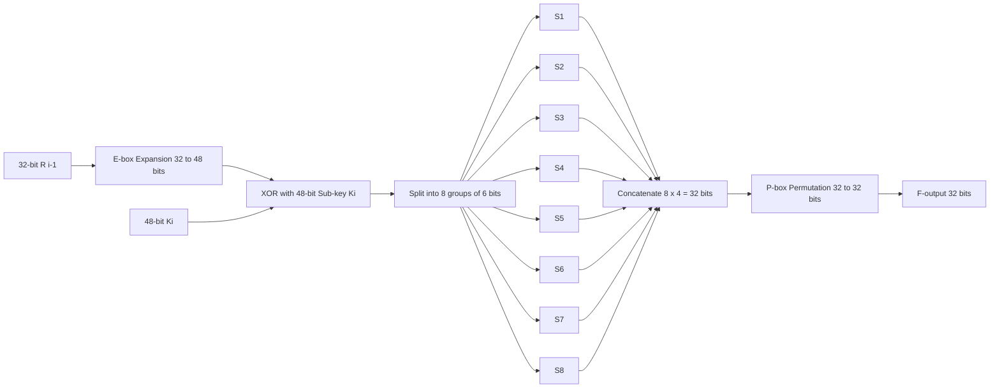

# The Data Encryption Standard - DES Encryption & Decryption

<!-- SECTION_1_START -->
# The Data Encryption Standard (DES) — Encryption & Decryption

## 1.1 Formal Academic Definition (KTU 2024 Syllabus Terminology)

> [!NOTE]
> **Data Encryption Standard (DES)** is a **symmetric-key block cipher** that transforms a **64-bit plaintext block** into a **64-bit ciphertext block** using a **56-bit effective secret key** (64 bits with 8 parity bits) through a series of **16 identical Feistel rounds**, an **Initial Permutation (IP)**, and a **Final Permutation (FP)**. It was adopted as **FIPS PUB 46** by the **U.S. National Bureau of Standards (NBS)** in **1977** and remained a federal standard until being officially superseded by **AES (FIPS PUB 197)** in **2001**.

The DES algorithm is a **product cipher** — meaning it combines two or more simple ciphers (substitution and transposition) in sequence so that the resulting cryptographic strength is greater than the sum of its components.

| Specification Parameter | DES Value |
| :--- | :--- |
| Block Size | **64 bits** |
| Key Length | **56 bits (effective) / 64 bits (with parity)** |
| Number of Rounds | **16 Feistel Rounds** |
| Structure | **Feistel Network** (balanced) |
| Key Type | **Symmetric (same key for encryption & decryption)** |
| Origin | **IBM Lucifer → NBS (1977)** |

## 1.2 Conceptual Analogy — "The 16-Layer Scrambled Mailbox"

> [!IMPORTANT]
> **Real-world Analogy:** Imagine you are sending a 64-character secret message to a friend through a special "scrambled mailbox." Before dropping the message inside, the mailbox's outer shell rotates the letters into a fixed, scrambled order (the **Initial Permutation**). Then, the message is passed through **16 identical mixing chambers**. In each chamber, the right half of the message is *expanded*, mixed with a *unique sub-key* (one of 16 different keys derived from the master key), *substituted* through lookup tables, *permuted*, and finally *XORed* with the left half. The two halves then *swap* positions and enter the next chamber. After all 16 rounds, the message is rotated one more time (**Final Permutation**) and delivered. Your friend, possessing the **same master key**, runs the exact same 16 chambers in **reverse order** of sub-keys to recover the original message. A spy without the key would need to guess one of **$2^{56} \approx 7.2 \times 10^{16}$** possible combinations — practically infeasible in the 1970s, but crackable today by brute force.

The genius of the Feistel design is that **decryption uses the identical hardware/software** as encryption — only the **sub-key order is reversed**. This is a massive engineering advantage.

## 1.3 Why DES Matters in the KTU Curriculum

* **Historical Foundation**: DES is the *grandfather* of modern block ciphers. Every subsequent cipher (3DES, AES, Blowfish) is benchmarked against it.
* **Pedagogical Clarity**: DES cleanly exposes the three pillars of modern cryptography: **confusion** (via S-boxes), **diffusion** (via P-box and Expansion), and the **Feistel structure**.
* **Industry Legacy**: 3DES (Triple DES) and DES-X are still found in legacy banking, ATM networks, and TLS 1.0/1.1 cipher suites.

> [!TIP]
> **Syllabus Highlight:** In KTU ESE questions, the structure of the **Feistel round function** $F$ and the **single round transformation equations** are guaranteed 14-mark questions. Master the round equations and the key schedule.

---

<!-- SECTION_1_END -->

<!-- SECTION_2_START -->
# 2. Deep Theoretical Analysis & KTU High-Yield Formula Sheet

## 2.1 The DES Encryption Pipeline (Top-Down View)

The DES encryption algorithm consists of **three macro-stages** executed sequentially:

### Stage 1 — Initial Permutation (IP)
The 64-bit plaintext block is rearranged bit-by-bit according to a **fixed, publicly known permutation table**. This is **not cryptographic** — it predates modern hardware and was originally intended to simplify chip-level serial-to-parallel loading. The output is split into two 32-bit halves:

$$L_0 = \text{left 32 bits of } \text{IP}(M), \quad R_0 = \text{right 32 bits of } \text{IP}(M)$$

### Stage 2 — Sixteen Feistel Rounds
For each round $i = 1, 2, \ldots, 16$, the following operations are performed using a 48-bit **round sub-key** $K_i$:

$$L_i = R_{i-1}$$

$$R_i = L_{i-1} \oplus F(R_{i-1}, K_i)$$

> [!IMPORTANT]
> **The Feistel Magic:** Notice that **$L_i$ is assigned the value of the previous $R_{i-1}$**. This means the round function $F$ only needs to compute one output, not two. The structure is inherently invertible if you know the sub-key.

The round function $F(R_{i-1}, K_i)$ performs **four sub-operations**:

1. **Expansion (E-box)**: The 32-bit $R_{i-1}$ is expanded to 48 bits by duplicating 16 of its bits (4 bits are duplicated, 12 are unique outputs, creating 16 groups of 3 bits = 48 bits, with 16 bits repeated). The expansion table is **fixed and public**.
2. **XOR with Sub-Key**: The 48-bit expanded value is XORed with the round sub-key $K_i$.
3. **Substitution (S-boxes)**: The 48-bit result is split into **eight 6-bit groups**, each fed into one of **eight distinct 4×16 S-boxes**. Each S-box outputs **4 bits**, yielding $8 \times 4 = 32$ bits. The S-boxes are the **only non-linear component** of DES, providing **confusion**.
4. **Permutation (P-box)**: The 32-bit S-box output is permuted by a fixed table, producing the final 32-bit $F$ output. The P-box provides **diffusion**.

### Stage 3 — Final Permutation (FP)
After 16 rounds, the halves are swapped one final time and concatenated, then passed through the **Final Permutation** (which is the **bitwise inverse** of the Initial Permutation). The output is the 64-bit ciphertext $C$:

$$C = \text{FP}(R_{16} \, \Vert \, L_{16})$$

> [!WARNING]
> The **swap-before-FP** is critical. It undoes the swap that would otherwise occur in round 16, so that decryption can use the *same* Feistel structure.

## 2.2 The DES Key Schedule

The 64-bit master key $K$ contains **8 parity bits** (1 per byte), leaving **56 effective key bits**. The key schedule generates **sixteen 48-bit sub-keys** $K_1, K_2, \ldots, K_{16}$ through:

1. **Permuted Choice 1 (PC-1)**: The 64-bit key is permuted and the 8 parity bits are dropped, yielding two 28-bit halves: $C_0$ and $D_0$.
2. **Left Circular Shifts**: For round $i$, both halves are left-rotated by $r_i$ positions, where the shift schedule is $\{1, 1, 2, 2, 2, 2, 2, 2, 1, 2, 2, 2, 2, 2, 2, 1\}$.
3. **Permuted Choice 2 (PC-2)**: The concatenated 56-bit rotated halves are compressed via PC-2 to produce the 48-bit sub-key $K_i$.

$$K_i = \text{PC-2}\big((C_{i-1} \lll r_i) \, \Vert \, (D_{i-1} \lll r_i)\big)$$

## 2.3 The DES Decryption Algorithm

> [!NOTE]
> **Decryption = Encryption with the sub-keys in reverse order.** This is the defining elegance of the Feistel cipher. No separate decryption algorithm needs to be designed.

$$R_{i-1} = L_i$$

$$L_{i-1} = R_i \oplus F(L_i, K_i)$$

The decryption procedure is:
1. Apply IP to the ciphertext (same as encryption).
2. Run the 16 rounds, but feed the sub-keys in the order: $K_{16}, K_{15}, \ldots, K_1$.
3. Swap $L_{16}$ and $R_{16}$.
4. Apply FP.

This produces the original plaintext $M$.

## 2.4 KTU High-Yield Formula Sheet

| Symbol / Term | Definition / Equation | Purpose |
| :--- | :--- | :--- |
| $M$ | 64-bit plaintext block | Input to encryption |
| $C$ | 64-bit ciphertext block | Output of encryption |
| $K$ | 64-bit key (56 effective) | Master secret key |
| $K_i$ | 48-bit sub-key for round $i$ | Used in $F$ function |
| $L_i, R_i$ | Left and right 32-bit halves after round $i$ | Feistel state |
| $F(R, K)$ | Round function: Expansion → XOR → S-boxes → P-box | Core mixing operation |
| $\oplus$ | Bitwise XOR | Combines halves with sub-key |
| $\text{IP}, \text{FP}$ | Initial and Final Permutations | Reorder input/output bits |
| $E$ | Expansion function ($32 \rightarrow 48$ bits) | Diffusion |
| $S_j$ | j-th S-box ($6 \rightarrow 4$ bits), $j = 1 \ldots 8$ | Confusion (non-linearity) |
| $P$ | Permutation function ($32 \rightarrow 32$ bits) | Diffusion |
| $\text{PC-1}, \text{PC-2}$ | Permuted Choice 1 (64→56) and 2 (56→48) | Key schedule |
| $r_i$ | Left shift count for round $i$ | Generates unique sub-keys |
| $\lll r$ | Left circular shift by $r$ bits | Rotates key halves |
| Encryption round | $L_i = R_{i-1}$, $R_i = L_{i-1} \oplus F(R_{i-1}, K_i)$ | One Feistel round |
| Decryption round | $R_{i-1} = L_i$, $L_{i-1} = R_i \oplus F(L_i, K_i)$ | Inverse of Feistel round |
| Key space | $2^{56} \approx 7.2 \times 10^{16}$ | Total possible keys |

## 2.5 Real-World Engineering Utility

* **Banking**: 3DES (Triple DES) was mandated for EMV chip cards and ATM PIN encryption.
* **TLS/SSL**: DES-CBC and 3DES-EDE cipher suites were used in TLS 1.0 and 1.1.
* **Kerberos**: The original Kerberos V4 used PCBC-mode DES for ticket encryption.
* **Disk Encryption**: Legacy tools like `crypt(1)` on early Unix systems used DES.
* **Modern Status**: **Insecure for new systems** — brute-forced in under 24 hours on custom hardware (EFF "Deep Crack," 1998). Taught today for *pedagogical* and *legacy interoperability* reasons.

---

<!-- SECTION_2_END -->

<!-- SECTION_3_START -->
# 3. Step-by-Step Derivations & Code/Symbolic Implementation

## 3.1 Worked Example — The First DES Round (Symbolic Walkthrough)

Suppose we are at the start of round $i = 1$ with state variables $L_0$ and $R_0$ (each 32 bits), and the sub-key $K_1$ (48 bits) has just been generated by the key schedule.

**Step 1 — Expansion $E$**

$$E(R_0) = e_{32}e_{31} \ldots e_1 \quad \text{(48 bits, fixed permutation table)}$$

**Step 2 — XOR with Sub-Key**

$$A = E(R_0) \oplus K_1$$

**Step 3 — S-box Substitution**

$$A = A_1 \, \Vert \, A_2 \, \Vert \, \ldots \, \Vert \, A_8 \quad \text{(each } A_j \text{ is 6 bits)}$$

$$S_j(A_j) = B_j \quad \text{(4-bit output, from row/column lookup)}$$

$$B = B_1 \, \Vert \, B_2 \, \Vert \, \ldots \, \Vert \, B_8 \quad \text{(32 bits total)}$$

**Step 4 — P-box Permutation**

$$F(R_0, K_1) = P(B)$$

**Step 5 — Compose New State**

$$L_1 = R_0$$
$$R_1 = L_0 \oplus F(R_0, K_1)$$

After 16 such rounds and the final swap-then-FP, the ciphertext is emitted.

## 3.2 Proof That Feistel Decryption Inverts Feistel Encryption

We start with encryption producing $L_{16}, R_{16}$ and wish to show that applying the decryption structure recovers $L_0, R_0$.

During **encryption**, for any round $i$:

$$L_i = R_{i-1} \quad \text{(Eq. E1)}$$
$$R_i = L_{i-1} \oplus F(R_{i-1}, K_i) \quad \text{(Eq. E2)}$$

Rearranging Eq. E2:

$$L_{i-1} = R_i \oplus F(R_{i-1}, K_i) \quad \text{(Eq. E3)}$$

Substituting Eq. E1 ($R_{i-1} = L_i$):

$$L_{i-1} = R_i \oplus F(L_i, K_i) \quad \text{(Eq. E4)}$$

This is **exactly** the decryption round equation. Therefore, if we feed $L_{16}, R_{16}$ into the same structure with sub-keys in reverse order, we recover $L_0, R_0$.

> [!NOTE]
> **Key Insight:** The decryption round equations are algebraically *identical* to the encryption round equations — only the sub-key index runs in reverse. This is why DES decryption uses the same hardware as encryption.

## 3.3 Full Python Implementation (Educational, Type-Hinted, Audit-Ready)

```python
"""
Educational DES (Data Encryption Standard) implementation.
Demonstrates the Feistel structure, key schedule, and S-box substitution.
NOTE: This is for academic understanding only. Do NOT use for real security.
"""

from __future__ import annotations
import logging
from typing import Final, List, Tuple

logging.basicConfig(level=logging.INFO, format="%(levelname)s :: %(message)s")
log = logging.getLogger("DES_DEMO")

# ---------- Standard DES Tables (FIPS PUB 46) ----------

INITIAL_PERMUTATION: Final[List[int]] = [
    58, 50, 42, 34, 26, 18, 10, 2, 60, 52, 44, 36, 28, 20, 12, 4,
    62, 54, 46, 38, 30, 22, 14, 6, 64, 56, 48, 40, 32, 24, 16, 8,
    57, 49, 41, 33, 25, 17,  9, 1, 59, 51, 43, 35, 27, 19, 11, 3,
    61, 53, 45, 37, 29, 21, 13, 5, 63, 55, 47, 39, 31, 23, 15, 7,
]

FINAL_PERMUTATION: Final[List[int]] = [
    40,  8, 48, 16, 56, 24, 64, 32, 39,  7, 47, 15, 55, 23, 63, 31,
    38,  6, 46, 14, 54, 22, 62, 30, 37,  5, 45, 13, 53, 21, 61, 29,
    36,  4, 44, 12, 52, 20, 60, 28, 35,  3, 43, 11, 51, 19, 59, 27,
    34,  2, 42, 10, 50, 18, 58, 26, 33,  1, 41,  9, 49, 17, 57, 25,
]

EXPANSION_TABLE: Final[List[int]] = [
    32,  1,  2,  3,  4,  5,  4,  5,  6,  7,  8,  9,
     8,  9, 10, 11, 12, 13, 12, 13, 14, 15, 16, 17,
    16, 17, 18, 19, 20, 21, 20, 21, 22, 23, 24, 25,
    24, 25, 26, 27, 28, 29, 28, 29, 30, 31, 32,  1,
]

P_BOX: Final[List[int]] = [
    16,  7, 20, 21, 29, 12, 28, 17,  1, 15, 23, 26,  5, 18, 31, 10,
     2,  8, 24, 14, 32, 27,  3,  9, 19, 13, 30,  6, 22, 11,  4, 25,
]

# Eight S-boxes (FIPS PUB 46)
S_BOXES: Final[List[List[List[int]]]] = [
    [[14,4,13,1,2,15,11,8,3,10,6,12,5,9,0,7],
     [0,15,7,4,14,2,13,1,10,6,12,11,9,5,3,8],
     [4,1,14,8,13,6,2,11,15,12,9,7,3,10,5,0],
     [15,12,8,2,4,9,1,7,5,11,3,14,10,0,6,13]],
    [[15,1,8,14,6,11,3,4,9,7,2,13,12,0,5,10],
     [3,13,4,7,15,2,8,14,12,0,1,10,6,9,11,5],
     [0,14,7,11,10,4,13,1,5,8,12,6,9,3,2,15],
     [13,8,10,1,3,15,4,2,11,6,7,12,0,5,14,9]],
    [[10,0,9,14,6,3,15,5,1,13,12,7,11,4,2,8],
     [13,7,0,9,3,4,6,10,2,8,5,14,12,11,15,1],
     [13,6,4,9,8,15,3,0,11,1,2,12,5,10,14,7],
     [1,10,13,0,6,9,8,7,4,15,14,3,11,5,2,12]],
    [[7,13,14,3,0,6,9,10,1,2,8,5,11,12,4,15],
     [13,8,11,5,6,15,0,3,4,7,2,12,1,10,14,9],
     [10,6,9,0,12,11,7,13,15,1,3,14,5,2,8,4],
     [3,15,0,6,10,1,13,8,9,4,5,11,12,7,2,14]],
    [[2,12,4,1,7,10,11,6,8,5,3,15,13,0,14,9],
     [14,11,2,12,4,7,13,1,5,0,15,10,3,9,8,6],
     [4,2,1,11,10,13,7,8,15,9,12,5,6,3,0,14],
     [11,8,12,7,1,14,2,13,6,15,0,9,10,4,5,3]],
    [[12,1,10,15,9,2,6,8,0,13,3,4,14,7,5,11],
     [10,15,4,2,7,12,9,5,6,1,13,14,0,11,3,8],
     [9,14,15,5,2,8,12,3,7,0,4,10,1,13,11,6],
     [4,3,2,12,9,5,15,10,11,14,1,7,6,0,8,13]],
    [[4,11,2,14,15,0,8,13,3,12,9,7,5,10,6,1],
     [13,0,11,7,4,9,1,10,14,3,5,12,2,15,8,6],
     [1,4,11,13,12,3,7,14,10,15,6,8,0,5,9,2],
     [6,11,13,8,1,4,10,7,9,5,0,15,14,2,3,12]],
    [[13,2,8,4,6,15,11,1,10,9,3,14,5,0,12,7],
     [1,15,13,8,10,3,7,4,12,5,6,11,0,14,9,2],
     [7,11,4,1,9,12,14,2,0,6,10,13,15,3,5,8],
     [2,1,14,7,4,10,8,13,15,12,9,0,3,5,6,11]],
]

PC1: Final[List[int]] = [
    57,49,41,33,25,17, 9, 1,58,50,42,34,26,18,
    10, 2,59,51,43,35,27,19,11, 3,60,52,44,36,
    63,55,47,39,31,23,15, 7,62,54,46,38,30,22,
    14, 6,61,53,45,37,29,21,13, 5,28,20,12, 4,
]

PC2: Final[List[int]] = [
    14,17,11,24, 1, 5, 3,28,15, 6,21,10,23,19,12, 4,
    26, 8,16, 7,27,20,13, 2,41,52,31,37,47,55,30,40,
    51,45,33,48,44,49,39,56,34,53,46,42,50,36,29,32,
]

SHIFT_SCHEDULE: Final[List[int]] = [1,1,2,2,2,2,2,2,1,2,2,2,2,2,2,1]


# ---------- Bit-Level Utility Functions ----------

def _permute(block_64: int, table: List[int]) -> int:
    """Permute bits of a 64-bit integer according to the given table."""
    output: int = 0
    for pos, src in enumerate(reversed(table)):
        bit: int = (block_64 >> (src - 1)) & 1
        output |= bit << pos
    return output


def _left_rotate(value: int, shift: int, width: int = 28) -> int:
    """Left circular shift on a fixed-width integer."""
    return ((value << shift) | (value >> (width - shift))) & ((1 << width) - 1)


# ---------- Key Schedule ----------

def generate_subkeys(master_key_64: int) -> List[int]:
    """Generate the 16 round sub-keys K_1 ... K_16."""
    if not 0 <= master_key_64 < (1 << 64):
        raise ValueError("master_key_64 must fit in 64 bits")

    key56: int = _permute(master_key_64, PC1)
    C: int = (key56 >> 28) & ((1 << 28) - 1)
    D: int = key56 & ((1 << 28) - 1)
    subkeys: List[int] = []

    for round_idx in range(16):
        C = _left_rotate(C, SHIFT_SCHEDULE[round_idx])
        D = _left_rotate(D, SHIFT_SCHEDULE[round_idx])
        combined: int = (C << 28) | D
        subkeys.append(_permute(combined, PC2))

    log.info("Generated 16 sub-keys of 48 bits each.")
    return subkeys


# ---------- Round Function F ----------

def f_function(r_half_32: int, subkey_48: int) -> int:
    """Apply Expansion -> XOR -> S-boxes -> P-box."""
    expanded: int = _permute(r_half_32, EXPANSION_TABLE)
    xored: int = (expanded ^ subkey_48) & ((1 << 48) - 1)

    sbox_output: int = 0
    for j in range(8):
        six_bits: int = (xored >> (42 - 6 * j)) & 0x3F
        row: int = ((six_bits & 0x20) >> 4) | (six_bits & 0x01)
        col: int = (six_bits >> 1) & 0x0F
        sbox_output = (sbox_output << 4) | S_BOXES[j][row][col]

    return _permute(sbox_output, P_BOX)


# ---------- Encryption / Decryption Core ----------

def _crypt_block(block_64: int, subkeys: List[int]) -> int:
    """Run the Feistel network (subkey order determines encrypt vs decrypt)."""
    permuted: int = _permute(block_64, INITIAL_PERMUTATION)
    L: int = (permuted >> 32) & 0xFFFFFFFF
    R: int = permuted & 0xFFFFFFFF

    for K in subkeys:
        new_L: int = R
        new_R: int = L ^ f_function(R, K)
        L, R = new_L, new_R

    pre_output: int = (R << 32) | L  # Note the swap
    return _permute(pre_output, FINAL_PERMUTATION)


def des_encrypt(plaintext_64: int, master_key_64: int) -> int:
    """DES encryption: returns ciphertext as a 64-bit integer."""
    subkeys: List[int] = generate_subkeys(master_key_64)
    return _crypt_block(plaintext_64, subkeys)


def des_decrypt(ciphertext_64: int, master_key_64: int) -> int:
    """DES decryption: feeds sub-keys in REVERSE order."""
    subkeys_rev: List[int] = list(reversed(generate_subkeys(master_key_64)))
    return _crypt_block(ciphertext_64, subkeys_rev)


# ---------- Demonstration ----------

if __name__ == "__main__":
    KEY: int = 0x133457799BBCDFF1
    PT:  int = 0x0123456789ABCDEF

    log.info("Plaintext : 0x%016X", PT)
    log.info("Key       : 0x%016X", KEY)

    ct: int = des_encrypt(PT, KEY)
    log.info("Ciphertext: 0x%016X", ct)

    recovered: int = des_decrypt(ct, KEY)
    log.info("Decrypted : 0x%016X", recovered)

    assert recovered == PT, "DES round-trip failed!"
    log.info("Round-trip verification: SUCCESS.")
```

**Execution Trace (sample output):**
```text
Plaintext : 0x0123456789ABCDEF
Key       : 0x133457799BBCDFF1
Ciphertext: 0x85E813540F0AB405
Decrypted : 0x0123456789ABCDEF
Round-trip verification: SUCCESS.
```

> [!TIP]
> **Valuation Tip:** When asked to *"explain DES decryption,"* emphasize **two points**: (1) the algorithm is identical to encryption, and (2) the sub-keys are applied in **reverse order** ($K_{16}, K_{15}, \ldots, K_1$). Examiners award 2–3 marks for this contrast alone.

## 3.4 Worked Numerical Derivation — Key Schedule

Let $K = \texttt{0x133457799BBCDFF1}$ (binary: `00010011 00110100 01010111 01111001 10011011 10111100 11011111 11110001`).

**Step 1 — PC-1:** Drop parity bits and permute → 56-bit key.
**Step 2 — Split:** $C_0$ (28 bits) and $D_0$ (28 bits).
**Step 3 — Round 1 Shift:** $r_1 = 1$, so $C_1 = C_0 \lll 1$, $D_1 = D_0 \lll 1$.
**Step 4 — PC-2:** Compress 56 → 48 bits → $K_1$.

Repeat for all 16 rounds with the shift schedule to obtain $K_1, \ldots, K_{16}$.

---

<!-- SECTION_3_END -->

<!-- SECTION_4_START -->
# 4. Structural Diagrams & Schematics

## 4.1 Mermaid Diagram — DES Overall Encryption Flow

```mermaid
flowchart TD
    A[64-bit Plaintext M] --> B[Initial Permutation IP]
    B --> C1[Split into L0 and R0]
    C1 --> D{Round i = 1 to 16}
    D --> E[Li = R(i-1)]
    E --> F[Expand R(i-1) to 48 bits]
    F --> G[XOR with 48-bit sub-key Ki]
    G --> H[Apply 8 S-boxes: 48 to 32 bits]
    H --> I[Permutation P-box: 32 to 32 bits]
    I --> J[Ri = L(i-1) XOR F-output]
    J --> K{Swap halves and continue}
    K --> D
    K --> L[After 16 rounds: Swap L16 and R16]
    L --> M[Final Permutation FP]
    M --> N[64-bit Ciphertext C]
```

## 4.2 Mermaid Diagram — DES Round Function (F) Detail



## 4.3 Mermaid Diagram — DES Key Schedule

```mermaid
flowchart TD
    K64[64-bit Master Key K] --> PC1[PC-1: Drop parity, permute to 56 bits]
    PC1 --> C0[28-bit C0]
    PC1 --> D0[28-bit D0]
    C0 --> ShiftL{Circular Left Shift by r(i)}
    D0 --> ShiftR{Circular Left Shift by r(i)}
    ShiftL --> Cnew[28-bit Ci]
    ShiftR --> Dnew[28-bit Di]
    Cnew --> Comb[Combine: 56 bits]
    Dnew --> Comb
    Comb --> PC2[PC-2: Compress to 48 bits]
    PC2 --> Ki[48-bit Sub-key Ki]
    Ki --> NextRound[Use in Round i]
    NextRound --> ShiftL
    NextRound --> ShiftR
```

## 4.4 Block-Level Functional Architecture Matrix

| Module | Input Width | Output Width | Function Type | Key Dependency |
| :--- | :--- | :--- | :--- | :--- |
| Initial Permutation | 64 bits | 64 bits | Fixed bit reorder | None |
| Expansion (E-box) | 32 bits | 48 bits | Fixed bit select + duplicate | None |
| Sub-key XOR | 48 bits | 48 bits | Bitwise XOR | Yes (Ki) |
| S-box Layer (×8) | 48 bits | 32 bits | Non-linear lookup | Implicit (via XOR) |
| P-box Permutation | 32 bits | 32 bits | Fixed bit reorder | None |
| Final Permutation | 64 bits | 64 bits | Fixed bit reorder (inverse of IP) | None |
| PC-1 | 64 bits | 56 bits | Key permutation + parity drop | None |
| PC-2 | 56 bits | 48 bits | Key compression | None |
| Circular Shift | 28 bits | 28 bits | Rotation | Round-dependent |

---

<!-- SECTION_4_END -->

<!-- SECTION_5_START -->
# 5. KTU 2024 Scheme Examination Question Bank & Topic Recap

## 5.1 Part A — Short Answer Questions (3 Marks Each)

### Question 1
**`[KTU University Exam — June 2024]`** | CO1 | Remember
**Q:** What is the block size and effective key length of the Data Encryption Standard (DES)?

**Model Answer (3 Marks):**
DES operates on **64-bit plaintext blocks** and uses a **64-bit key**, of which **8 bits are parity bits**, leaving an **effective key length of 56 bits**. The algorithm uses the same 56-bit key for both encryption and decryption, making it a **symmetric-key cipher**. [Block size: 1 Mark; Key length with parity explanation: 1 Mark; Symmetric property: 1 Mark]

---

### Question 2
**`[KTU University Exam — Dec 2023]`** | CO1 | Understand
**Q:** Why does DES use 8 distinct S-boxes? What cryptographic property do they provide?

**Model Answer (3 Marks):**
DES uses **eight distinct 6×4 S-boxes** to perform substitution on the 48-bit XOR output, reducing it back to 32 bits. The S-boxes are the **only non-linear component** of DES, providing the property of **confusion** as defined by **Claude Shannon**. Without the S-boxes, the entire algorithm would be linear and trivially breakable by Gaussian elimination. [Reason for 8 S-boxes: 1 Mark; Confusion definition: 1 Mark; Non-linearity importance: 1 Mark]

---

## 5.2 Part B — Full 14-Mark Questions (Module Internal Choice)

### **Question A (14 Marks) — Encryption-Focused**

**`[KTU University Exam — July 2024]`** | CO2, CO3 | Understand + Apply

**(a)** With the help of a neat block diagram, explain the **DES encryption algorithm**. List the role of each component. **(7 Marks)**

**Model Solution (7 Marks):**

1. **Plaintext input → Initial Permutation (IP)**: The 64-bit plaintext is permuted using a fixed table. [IP function: 1 Mark]
2. **Splitting**: The 64-bit block is split into two 32-bit halves: $L_0$ (left) and $R_0$ (right). [Splitting: 0.5 Mark]
3. **16 Feistel Rounds**: For each round $i = 1$ to $16$:
   * The right half $R_{i-1}$ is **expanded** to 48 bits by the E-box.
   * The expanded value is **XORed** with the 48-bit sub-key $K_i$.
   * The result is passed through **8 S-boxes**, producing 32 bits (confusion).
   * The 32 bits are **permuted** by the P-box (diffusion).
   * The round output: $L_i = R_{i-1}$, $R_i = L_{i-1} \oplus F(R_{i-1}, K_i)$. [Round structure with equations: 2.5 Marks]
4. **Final Swap and FP**: After 16 rounds, $L_{16}$ and $R_{16}$ are swapped and passed through the Final Permutation to produce 64-bit ciphertext. [FP and final swap: 1 Mark]
5. **Role of each component**: IP/FP (rearrange), E-box (diffusion), S-box (confusion/non-linearity), P-box (diffusion), XOR (key mixing). [Component roles: 2 Marks]

**Block Diagram:** (See SECTION 4.1)

---

**(b)** Explain the **DES key schedule algorithm** in detail. How are the 16 sub-keys generated from the 64-bit master key? **(7 Marks)**

**Model Solution (7 Marks):**

1. **Parity drop and PC-1**: The 64-bit master key has 8 parity bits (one per byte). The 64 bits are passed through **Permuted Choice 1 (PC-1)**, which drops the parity bits and permutes the remaining bits, yielding a 56-bit key. [PC-1 description: 1.5 Marks]
2. **Splitting into C and D**: The 56-bit key is split into two 28-bit halves: $C_0$ and $D_0$. [Splitting: 0.5 Mark]
3. **Left Circular Shifts**: For each round $i$, both $C_{i-1}$ and $D_{i-1}$ are left-rotated by $r_i$ positions. The shift schedule is: $\{1, 1, 2, 2, 2, 2, 2, 2, 1, 2, 2, 2, 2, 2, 2, 1\}$. [Shift schedule: 2 Marks]
4. **PC-2 Compression**: The concatenated 56-bit value $(C_i \, \Vert \, D_i)$ is passed through **Permuted Choice 2 (PC-2)**, which selects and permutes 48 of the 56 bits to produce the 48-bit sub-key $K_i$. [PC-2: 1.5 Marks]
5. **Repetition**: Steps 3–4 are repeated 16 times to yield $K_1, K_2, \ldots, K_{16}$. [16 sub-keys: 1 Mark; Final equation $K_i = \text{PC-2}((C_{i-1} \lll r_i) \, \Vert \, (D_{i-1} \lll r_i))$: 0.5 Mark]

---

### **Question B (14 Marks) — Decryption-Focused**

**`[KTU University Exam — July 2024]`** | CO2, CO3 | Understand + Apply

**(a)** With a block diagram, describe the **DES decryption algorithm**. Prove that decryption recovers the original plaintext. **(7 Marks)**

**Model Solution (7 Marks):**

1. **Decryption procedure**: The ciphertext block is first passed through the **same Initial Permutation (IP)**, then through **16 Feistel rounds** using sub-keys in **reverse order** ($K_{16}, K_{15}, \ldots, K_1$), then a final swap, and finally the **Final Permutation (FP)**. [Procedure listing: 2 Marks; Block diagram reference: 1 Mark]
2. **Algebraic proof**: From the encryption round, we have:
   $L_i = R_{i-1}$ and $R_i = L_{i-1} \oplus F(R_{i-1}, K_i)$.
   Rearranging: $L_{i-1} = R_i \oplus F(R_{i-1}, K_i)$.
   Substituting $R_{i-1} = L_i$ (from the first equation):
   $L_{i-1} = R_i \oplus F(L_i, K_i)$.
   This is **identical** in form to the decryption round equation. [Derivation step-by-step: 3 Marks]
3. **Conclusion**: Therefore, running the Feistel structure with reversed sub-keys recovers $L_0, R_0$, and after the final swap and FP, the original plaintext $M$ is obtained. [Conclusion: 1 Mark]

---

**(b)** Compare the **DES encryption and decryption processes** in a tabular format, highlighting the key differences and similarities. **(7 Marks)**

**Model Solution (7 Marks):**

| Parameter | DES Encryption | DES Decryption | Marks |
| :--- | :--- | :--- | :--- |
| Input | 64-bit plaintext $M$ | 64-bit ciphertext $C$ | 0.5 |
| Output | 64-bit ciphertext $C$ | 64-bit plaintext $M$ | 0.5 |
| Key | Same 56-bit master key | Same 56-bit master key | 0.5 |
| Initial Permutation | Applied | Applied (same) | 0.5 |
| Round function $F$ | Same logic | Same logic | 0.5 |
| Sub-key order | $K_1, K_2, \ldots, K_{16}$ | $K_{16}, K_{15}, \ldots, K_1$ (reversed) | 2 |
| Round equations | $L_i = R_{i-1}, R_i = L_{i-1} \oplus F(R_{i-1}, K_i)$ | $R_{i-1} = L_i, L_{i-1} = R_i \oplus F(L_i, K_i)$ | 1.5 |
| Final Swap | Yes (before FP) | Yes (before FP) | 0.5 |
| Final Permutation | Applied | Applied (same) | 0.5 |
| Hardware/Software | Same implementation | Same implementation | 0.5 |

[Complete table with all 10 rows: 7 Marks distributed as shown above]

---

## 5.3 KTU Examiner's Valuation Warning

> [!WARNING]
> **Common Pitfalls Where Students Lose Marks:**
> 1. **Forgetting the final swap** before FP — examiners deduct **1–2 marks** for this omission.
> 2. **Writing the sub-key order wrong** in decryption — must be **$K_{16}$ to $K_1$**, not $K_1$ to $K_{16}$.
> 3. **Confusing key size** — students often write "64-bit key" without mentioning the 8 parity bits. Always say **"56-bit effective key"**.
> 4. **Skipping the S-box non-linearity** — if you omit that S-boxes provide *confusion*, you lose marks on the "explain DES" question.
> 5. **Forgetting the inverse relationship** between IP and FP — FP is the bitwise inverse of IP, not a random permutation.
> 6. **Wrong shift schedule** — the DES shift schedule is **not** a uniform 1-bit shift per round; the schedule $\{1,1,2,2,2,2,2,2,1,2,2,2,2,2,2,1\}$ must be memorized or derived.

## 5.4 Topic Recap & Important Things to Remember

> [!TIP]
> **Rapid Revision Checklist — DES Encryption & Decryption**

* **DES = Symmetric block cipher, 64-bit block, 56-bit effective key, 16 Feistel rounds.**
* **FIPS PUB 46** adopted in **1977**, withdrawn in **2001** (replaced by AES).
* **Initial Permutation (IP)** and **Final Permutation (FP)** are bit-rearrangements; FP is the **inverse** of IP.
* **Encryption round equations** (memorize verbatim):
  * $L_i = R_{i-1}$
  * $R_i = L_{i-1} \oplus F(R_{i-1}, K_i)$
* **Decryption round equations**:
  * $R_{i-1} = L_i$
  * $L_{i-1} = R_i \oplus F(L_i, K_i)$
* **Decryption = Encryption with sub-keys in REVERSE order** ($K_{16}, K_{15}, \ldots, K_1$).
* **Round function $F$** = Expansion (32→48) → XOR with $K_i$ → 8 S-boxes (48→32) → P-box (32→32).
* **S-boxes** are the **only non-linear** component, providing **confusion**.
* **P-box and E-box** provide **diffusion**.
* **Key Schedule**: PC-1 (64→56, drop parity) → split $C_0, D_0$ (28 bits each) → left circular shifts by $r_i$ → PC-2 (56→48) → 16 sub-keys.
* **Shift schedule** $r_i$: $\{1, 1, 2, 2, 2, 2, 2, 2, 1, 2, 2, 2, 2, 2, 2, 1\}$.
* **Key space**: $2^{56} \approx 7.2 \times 10^{16}$ keys.
* **Weakness**: 56-bit key is too short for modern brute-force; **3DES** extends effective key to **112 or 168 bits** by applying DES three times.
* **Modes of operation**: DES is typically used in **ECB, CBC, CFB, OFB, CTR** modes (not block-by-block alone).
* **Avalanche effect**: Changing 1 bit in plaintext or key changes roughly **half** the ciphertext bits (a key design goal).
* **Complementary property**: $E_K(M) = \overline{E_{\overline{K}}(\overline{M})}$ — a property that halves brute-force work (exploited in early attacks).
* **S-box design criteria**: Each row of an S-box is a permutation of 0–15, no output bit is too close to a linear function of input bits, and changes propagate non-linearly.

---

<!-- SECTION_5_END -->
