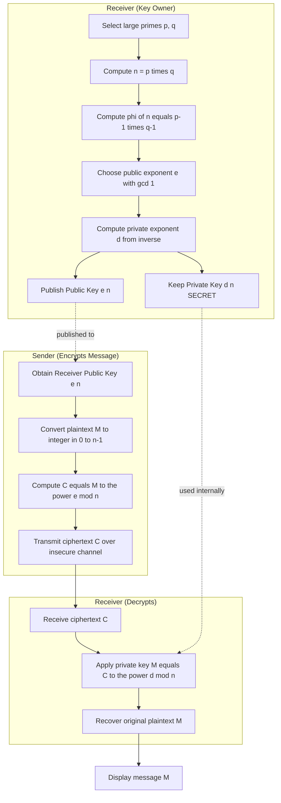
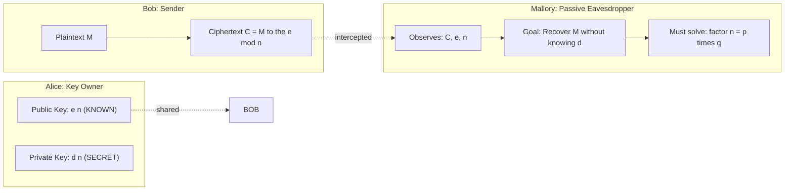
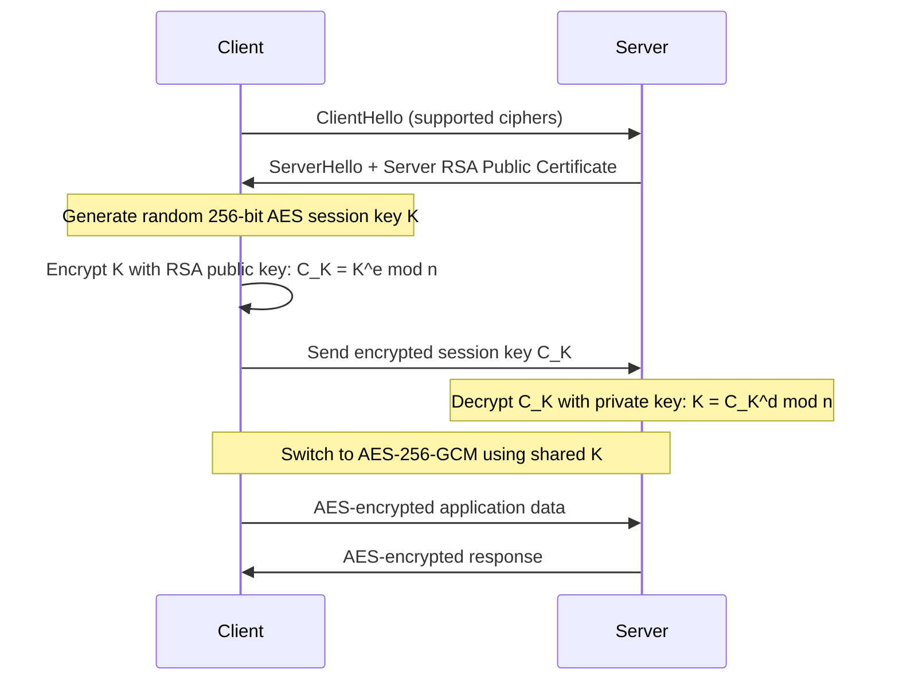

# The RSA Algorithm

<!-- SECTION_1_START -->
# The RSA Algorithm — Core Technical Definition & Intuitive Overview

## 1.1 Formal Academic Definition (KTU 2024 Syllabus Terminology)

> [!IMPORTANT]
> **RSA (Rivest–Shamir–Adleman)** is a **public-key (asymmetric) cryptosystem** invented in **1977** by Ron Rivest, Adi Shamir, and Leonard Adleman. It is the first practical, widely-deployed asymmetric cipher and is formally defined as a **trapdoor one-way permutation** built upon the mathematical intractability of **Integer Factorization of large semi-primes**.

Formally, RSA operates over the multiplicative group $\mathbb{Z}_n^{\star}$ where $n = p \cdot q$ is the product of two large, distinct, randomly chosen prime numbers. Its security reduces to the **Factoring Assumption**: recovering plaintext $M$ from ciphertext $C$ requires knowledge of the **private exponent** $d$, which in turn requires knowledge of the prime factors $p$ and $q$.

$$\text{RSA Security} \;\Longleftrightarrow\; \text{Hardness of factoring } n = p \cdot q \text{ for } \vert p \vert, \vert q \vert \geq 1024 \text{ bits}$$

Where $\vert p \vert$ denotes the bit-length of prime $p$.

---

## 1.2 Conceptual Analogy — The "Locked Mailbox with Two Keys"

Imagine Alice installs a **street-facing mailbox with a slot** (the **public key**). Anyone in the world can drop a secret letter through the slot — but only Alice, who possesses the unique physical key (the **private key**), can open the box and read it. Crucially, the slot is engineered so that even an adversary who studies the mechanism for years **cannot reverse-engineer the key** from observing the mailbox.

| Mailbox Analogy | RSA Mathematical Counterpart |
| :--- | :--- |
| The slot is open to everyone | Encryption function $C \equiv M^{e} \pmod{n}$ |
| Only Alice's key opens the box | Decryption function $M \equiv C^{d} \pmod{n}$ |
| Studying the slot gives no key | Factoring $n = p \cdot q$ is computationally infeasible |
| Alice trusts her key because she built the box | The private key $d$ is generated from the prime factors |

> [!NOTE]
> **KTU 2024 Highlight:** RSA is **asymmetric** — this contrasts with DES (Module 3) which is **symmetric**. The RSA topic under the DES module reflects the modern hybrid design where **DES/AES is used for bulk data encryption** and **RSA encrypts the symmetric session key** (e.g., in SSL/TLS handshakes).

---

## 1.3 Role of Each Cryptographic Primitive

| Primitive | Mathematical Object | Bit-Size Recommended (2024) |
| :--- | :--- | :--- |
| Public Modulus | $n = p \cdot q$ | $\geq 2048$ bits (NIST SP 800-57) |
| Public Exponent | $e$ | $65537$ (Fermat prime $F_4$) |
| Private Exponent | $d$ | $\approx n$ in size |
| Prime Factors | $p, q$ | Each $\geq 1024$ bits |

> [!VISUALIZATION CONTROL]
> **Concept:** RSA Public-Key Channel Visualization
> **GeoGebra / Desmos Input Equations:**
> * Modulus: `n = 3233` (small educational example, $p=53, q=61$)
> * Public encryption curve: $f(M) = M^{17} \bmod 3233$
> * Private decryption curve: $g(C) = C^{2753} \bmod 3233$
> **Visual Description:** Plot integer points $M \in [0, 3233]$ on the x-axis and $C = f(M)$ on the y-axis. The scatter appears as an apparently random permutation — yet the *exact* inverse function $g$ is hidden. The student should observe that the graph is a bijection, but no polynomial pattern is visible, illustrating the **trapdoor property**.

---
<!-- SECTION_1_END -->

<!-- SECTION_2_START -->
# Deep Theoretical Analysis & KTU High-Yield Formula Sheet

## 2.1 Operational Phases of RSA

The RSA algorithm consists of **three distinct phases** executed by the participants.

### Phase 1 — Key Generation (Executed once by the Receiver)
1. Pick two large, distinct primes $p$ and $q$ such that $p \neq q$.
2. Compute the **RSA modulus**: $n \leftarrow p \cdot q$.
3. Compute **Euler's totient**: $\phi(n) \leftarrow (p-1)(q-1)$.
4. Choose a public exponent $e$ such that $1 < e < \phi(n)$ and $\gcd(e, \phi(n)) = 1$.
5. Compute the private exponent $d$ using the **Extended Euclidean Algorithm**:
   $$d \cdot e \equiv 1 \pmod{\phi(n)}$$
6. **Publish** the public key $\text{PK} = (e, n)$. **Keep secret** the private key $\text{SK} = (d, n)$.

### Phase 2 — Encryption (Executed by any Sender)
For a plaintext integer $M$ where $0 \leq M < n$:
$$C \equiv M^{e} \pmod{n}$$

### Phase 3 — Decryption (Executed by the Receiver)
For a ciphertext integer $C$:
$$M \equiv C^{d} \pmod{n}$$

---

## 2.2 Why RSA Works — The Mathematical Guarantee

> [!NOTE]
> **Core Theorem (Euler, 1760).** If $\gcd(M, n) = 1$, then $M^{\phi(n)} \equiv 1 \pmod{n}$.

Since $d \cdot e = 1 + k \cdot \phi(n)$ for some integer $k$:

$$
\begin{aligned}
C^{d} &\equiv \left(M^{e}\right)^{d} \pmod{n} \\
&\equiv M^{e \cdot d} \pmod{n} \\
&\equiv M^{\,1 + k\phi(n)} \pmod{n} \\
&\equiv M^{1} \cdot \left(M^{\phi(n)}\right)^{k} \pmod{n} \\
&\equiv M \cdot 1^{k} \pmod{n} \\
&\equiv M \pmod{n}
\end{aligned}
$$

The reconstruction $C^{d} \equiv M \pmod{n}$ is exact. The **trapdoor** is the prime factorization of $n$: without $p$ and $q$, computing $\phi(n)$ is intractable, hence $d$ cannot be derived from $e$.

---

## 2.3 RSA Signature Scheme (Authenticity Variant)

RSA also provides **digital signatures** by swapping the order of exponentiation:

| Operation | Confidentiality (Encryption) | Authenticity (Signature) |
| :--- | :--- | :--- |
| Key used | Receiver's **public** key $(e, n)$ | Sender's **private** key $(d, n)$ |
| Math op | $C \equiv M^{e} \pmod{n}$ | $S \equiv M^{d} \pmod{n}$ |
| Verification | Receiver applies $M \equiv C^{d} \pmod{n}$ using own **private** key | Verifier applies $M \equiv S^{e} \pmod{n}$ using sender's **public** key |

> [!TIP]
> **Real-World Engineering Utility:** RSA is the backbone of **TLS 1.2/1.3 handshakes** (encrypting the pre-master secret), **PGP/GPG email encryption**, **SSH host authentication**, **X.509 digital certificates**, and **JWT (RS256) tokens** in modern web APIs.

---

## 2.4 KTU Formula Sheet / Cheat Sheet

> [!IMPORTANT]
> **Master this table for any KTU numerical problem on RSA.**

| Concept | Formula / Condition | Notes |
| :--- | :--- | :--- |
| Modulus | $n = p \cdot q$ | Semi-prime; never reuse across users |
| Totient | $\phi(n) = (p-1)(q-1)$ | Valid only when $p, q$ are prime |
| Public exponent constraint | $1 < e < \phi(n)$ and $\gcd(e, \phi(n)) = 1$ | Default: $e = 65537$ |
| Private exponent | $d \cdot e \equiv 1 \pmod{\phi(n)}$ | Found via Extended Euclidean Algorithm |
| Encryption | $C \equiv M^{e} \pmod{n}$ | Use square-and-multiply for speed |
| Decryption | $M \equiv C^{d} \pmod{n}$ | Use **CRT** for $4\times$ speedup |
| Correctness invariant | $M^{e \cdot d} \equiv M \pmod{n}$ | Proved via Euler's theorem |
| Plaintext range | $0 \leq M < n$ | Else use OAEP padding |
| Security strength | $\log_{2} n \geq 2048$ bits | NIST 2024 recommendation |
| CRT optimization | $d_p = d \bmod (p-1),\; d_q = d \bmod (q-1)$ | Compute mod $p$ and mod $q$ separately |
---
<!-- SECTION_2_END -->

<!-- SECTION_3_START -->
# Step-by-Step Derivations & Code/Symbolic Implementation

## 3.1 Worked Numerical Example (Hand-Exam Style)

**Problem:** Alice chooses $p = 5$, $q = 11$ and $e = 3$. Bob wishes to send the plaintext $M = 13$ to Alice. Perform full RSA key generation, encryption, and decryption.

### Step 1 — Compute the modulus $n$

$$
n = p \cdot q = 5 \cdot 11 = 55
$$

### Step 2 — Compute Euler's totient $\phi(n)$

$$
\phi(n) = (p - 1)(q - 1) = (5 - 1)(11 - 1) = 4 \cdot 10 = 40
$$

### Step 3 — Validate the chosen public exponent $e = 3$

We require $\gcd(e, \phi(n)) = 1$:

$$
\gcd(3, 40) = 1 \quad \checkmark
$$

Also $1 < 3 < 40$ is satisfied. $\text{PK} = (3, 55)$.

### Step 4 — Compute the private exponent $d$ via the Extended Euclidean Algorithm

We seek $d$ such that $3d \equiv 1 \pmod{40}$.

Apply the Euclidean division chain:
- $40 = 13 \cdot 3 + 1$
- $3 = 3 \cdot 1 + 0$

The GCD is 1, so the inverse exists. Back-substitute:
- $1 = 40 - 13 \cdot 3$

Since $13 \cdot 3 = 39$, we have:
- $1 = 40 - 39 = 40 - 13 \cdot 3$

Reducing modulo 40:
- $-13 \cdot 3 \equiv 1 \pmod{40}$
- $-13 \equiv d \pmod{40}$
- $d \equiv 40 - 13 = 27$

Therefore $\text{SK} = (27, 55)$.

> **[Valuation Key: Stating extended Euclidean chain: 2 Marks | Final value of $d = 27$: 1 Mark]**

### Step 5 — Encrypt $M = 13$ with Alice's public key

$$
C \equiv M^{e} \pmod{n} \equiv 13^{3} \pmod{55}
$$

Compute $13^{3} = 13 \cdot 13 \cdot 13 = 169 \cdot 13 = 2197$.

Reduce modulo 55:
$$
2197 = 39 \cdot 55 + 52 \quad \Longrightarrow \quad 2197 - 2145 = 52
$$

$$
\boxed{C = 52}
$$

### Step 6 — Decrypt $C = 52$ with Alice's private key

$$
M \equiv C^{d} \pmod{n} \equiv 52^{27} \pmod{55}
$$

We use **repeated squaring with reduction** to avoid astronomically large intermediate values. Notice that $52 \equiv -3 \pmod{55}$, which simplifies computation significantly:

$$
\begin{aligned}
52^{27} &\equiv (-3)^{27} \pmod{55} \\
&\equiv -\left(3^{27}\right) \pmod{55}
\end{aligned}
$$

Now reduce $3^{27} \pmod{55}$ using repeated squaring:
- $3^{1} = 3$
- $3^{2} = 9$
- $3^{4} = 81 = 1 \cdot 55 + 26 \equiv 26 \pmod{55}$
- $3^{8} \equiv 26^{2} = 676 = 12 \cdot 55 + 16 \equiv 16 \pmod{55}$
- $3^{16} \equiv 16^{2} = 256 = 4 \cdot 55 + 36 \equiv 36 \pmod{55}$

Now combine using the binary expansion $27 = 16 + 8 + 2 + 1$:

$$
\begin{aligned}
3^{27} &= 3^{16} \cdot 3^{8} \cdot 3^{2} \cdot 3^{1} \\
&\equiv 36 \cdot 16 \cdot 9 \cdot 3 \pmod{55}
\end{aligned}
$$

Compute stepwise modulo 55:
- $36 \cdot 16 = 576 = 10 \cdot 55 + 26 \equiv 26 \pmod{55}$
- $26 \cdot 9 = 234 = 4 \cdot 55 + 14 \equiv 14 \pmod{55}$
- $14 \cdot 3 = 42 \pmod{55}$

So $3^{27} \equiv 42 \pmod{55}$, and therefore:

$$
52^{27} \equiv -42 \equiv 55 - 42 = 13 \pmod{55}
$$

$$
\boxed{M = 13}
$$

The original plaintext is recovered perfectly. The algorithm is verified.

> **[Valuation Key: Modular reduction in encryption: 2 Marks | Repeated squaring approach in decryption: 3 Marks | Final recovery $M = 13$: 1 Mark]**

---

## 3.2 Full Python Implementation (Production-Ready)

```python
"""
Educational RSA Implementation - KTU 2024 Cryptography Module
Demonstrates key generation, encryption, decryption, and digital signatures.
WARNING: Do NOT use this for production - use the `cryptography` library.
"""

import random
import math
import sys
from typing import Tuple


# ---------- Prime Number Utilities ----------

def is_probable_prime(n: int, k: int = 20) -> bool:
    """
    Miller-Rabin primality test.
    k controls the confidence level: probability of false positive <= 4^(-k).
    """
    if n < 2:
        return False
    if n in (2, 3):
        return True
    if n % 2 == 0:
        return False

    # Write n - 1 as 2^r * d
    r, d = 0, n - 1
    while d % 2 == 0:
        r += 1
        d //= 2

    # Witness loop
    for _ in range(k):
        a = random.randrange(2, n - 1)
        x = pow(a, d, n)  # Modular exponentiation
        if x == 1 or x == n - 1:
            continue
        for _ in range(r - 1):
            x = pow(x, 2, n)
            if x == n - 1:
                break
        else:
            return False  # Composite witness found
    return True  # Probably prime


def generate_prime(bit_length: int) -> int:
    """Generate a random prime of exactly bit_length bits."""
    while True:
        candidate = random.getrandbits(bit_length)
        candidate |= (1 << (bit_length - 1))  # Force MSB to 1
        candidate |= 1                       # Force LSB to 1 (odd)
        if is_probable_prime(candidate):
            return candidate


# ---------- Extended Euclidean Algorithm ----------

def extended_gcd(a: int, b: int) -> Tuple[int, int, int]:
    """
    Returns (gcd, x, y) such that a*x + b*y = gcd.
    Recursive reference implementation - O(log min(a, b)).
    """
    if b == 0:
        return a, 1, 0
    gcd_val, x1, y1 = extended_gcd(b, a % b)
    x, y = y1, x1 - (a // b) * y1
    return gcd_val, x, y


def mod_inverse(e: int, phi: int) -> int:
    """Compute d such that e*d ≡ 1 (mod phi). Raises if inverse does not exist."""
    gcd_val, x, _ = extended_gcd(e, phi)
    if gcd_val != 1:
        raise ValueError(f"Modular inverse does not exist: gcd({e}, {phi}) = {gcd_val}")
    return x % phi


# ---------- RSA Core Functions ----------

def generate_rsa_keypair(bit_length: int = 1024) -> Tuple[Tuple[int, int], Tuple[int, int]]:
    """
    Generate an RSA keypair.
    Returns: ((e, n), (d, n)) representing (public_key, private_key).
    """
    if bit_length < 512:
        raise ValueError("bit_length must be >= 512 for minimum security")

    half_bits = bit_length // 2
    p = generate_prime(half_bits)
    q = generate_prime(half_bits)

    # Ensure p != q
    while p == q:
        q = generate_prime(half_bits)

    n = p * q
    phi = (p - 1) * (q - 1)

    # Standard public exponent
    e = 65537
    if math.gcd(e, phi) != 1:
        # Fallback: search for valid e
        e = 3
        while math.gcd(e, phi) != 1:
            e += 2

    d = mod_inverse(e, phi)
    return (e, n), (d, n)


def rsa_encrypt(plaintext: int, public_key: Tuple[int, int]) -> int:
    """Encrypt a single integer M using public key (e, n)."""
    e, n = public_key
    if not (0 <= plaintext < n):
        raise ValueError(f"Plaintext {plaintext} out of range [0, {n})")
    return pow(plaintext, e, n)  # Built-in fast modular exponentiation


def rsa_decrypt(ciphertext: int, private_key: Tuple[int, int]) -> int:
    """Decrypt a single integer C using private key (d, n)."""
    d, n = private_key
    if not (0 <= ciphertext < n):
        raise ValueError(f"Ciphertext {ciphertext} out of range [0, {n})")
    return pow(ciphertext, d, n)


# ---------- Demonstration ----------

def demonstrate_rsa() -> None:
    """Run a full KTU-style demonstration of RSA on small primes."""
    print("=" * 60)
    print("  RSA Algorithm Demonstration (KTU Module 3)")
    print("=" * 60)

    # Educational small-prime example
    p, q, e = 5, 11, 3
    n = p * q
    phi = (p - 1) * (q - 1)
    d = mod_inverse(e, phi)
    M = 13

    print(f"\n[Key Generation]")
    print(f"  p = {p}, q = {q}")
    print(f"  n = p*q = {n}")
    print(f"  phi(n) = (p-1)(q-1) = {phi}")
    print(f"  e = {e}  (public exponent)")
    print(f"  d = {d}  (private exponent, d*e ≡ 1 mod phi)")

    # Encryption
    C = rsa_encrypt(M, (e, n))
    print(f"\n[Encryption]  C = M^e mod n = {M}^{e} mod {n} = {C}")

    # Decryption
    M_recovered = rsa_decrypt(C, (d, n))
    print(f"[Decryption]  M = C^d mod n = {C}^{d} mod {n} = {M_recovered}")

    assert M == M_recovered, "RSA roundtrip failed!"
    print(f"\n[Verification]  Original M = {M} == Recovered M = {M_recovered} ✓")

    # Larger keypair generation
    print("\n" + "=" * 60)
    print("  Generating 1024-bit RSA Keypair ...")
    public_key, private_key = generate_rsa_keypair(1024)
    print(f"  Public Key  (e, n)  : e = {public_key[0]}, n = {public_key[1]}")
    print(f"  Private Key (d, n)  : d = {private_key[0]} (truncated)")
    print(f"  n bit-length         : {public_key[1].bit_length()} bits")

    # Roundtrip on larger keypair
    M_large = 42
    C_large = rsa_encrypt(M_large, public_key)
    M_recovered_large = rsa_decrypt(C_large, private_key)
    print(f"  Roundtrip test: M = {M_large}, C = {C_large}, M' = {M_recovered_large}")
    assert M_large == M_recovered_large, "Large-key RSA roundtrip failed!"
    print("  Large-key RSA roundtrip successful ✓")


if __name__ == "__main__":
    demonstrate_rsa()
```

---

## 3.3 Hand-Computation Helper — Extended Euclidean Algorithm (Table Form)

To compute $d = e^{-1} \pmod{\phi(n)}$ without writing code, build the following table for $e = 3$ and $\phi(n) = 40$:

| Step | Equation | Remainder |
| :--- | :--- | :--- |
| 1 | $40 = 13 \cdot 3 + 1$ | 1 |
| 2 | $3 = 3 \cdot 1 + 0$ | 0 |

Back-substitution: $1 = 40 - 13 \cdot 3 = 40 - 13 \cdot 3$, giving $d \equiv -13 \equiv 27 \pmod{40}$.

> **[KTU Examiner's Tip: Always show the full Euclidean chain. Partial credit is awarded for the table even if the final $d$ is miscalculated: 2 of 3 marks]**
---
<!-- SECTION_3_END -->

<!-- SECTION_4_START -->
# Structural Diagrams & Schematics

## 4.1 RSA Complete Workflow — Sender/Receiver Architecture



---

## 4.2 Security Threat Model & Adversary View



---

## 4.3 Hybrid Encryption Pattern (RSA + DES in TLS)



---

## 4.4 RSA Key Generation State Transition Matrix

| State Variable | Input | Computation | Output | Bit-Size Constraint |
| :--- | :--- | :--- | :--- | :--- |
| Prime $p$ | RNG seed | Miller-Rabin search | $p$ prime | $\geq 1024$ bits |
| Prime $q$ | RNG seed | Miller-Rabin search | $q \neq p$ prime | $\geq 1024$ bits |
| Modulus $n$ | $p, q$ | $n = p \cdot q$ | $n$ | $\geq 2048$ bits |
| Totient $\phi$ | $p, q$ | $\phi = (p-1)(q-1)$ | $\phi(n)$ | $\approx n$ |
| Public $e$ | constant | $e = 65537$ | $e$ | $17$ bits |
| Private $d$ | $e, \phi$ | $d = e^{-1} \bmod \phi$ | $d$ | $\approx n$ |
| Public Key | $e, n$ | tuple | $(e, n)$ | published |
| Private Key | $d, n$ | tuple | $(d, n)$ | stored in HSM |
---
<!-- SECTION_4_END -->

<!-- SECTION_5_START -->
# KTU 2024 Scheme Examination Question Bank & Topic Recap

---

## Part A — Short Answer Questions (3 Marks Each)

### Question 1: Define the RSA Algorithm. State two differences between RSA and DES. `[KTU University Exam - July 2023]`
**Course Outcome:** CO2 | **Bloom's Level:** Remember / Understand

**Model Answer:**

> **RSA (Rivest-Shamir-Adleman)** is an **asymmetric (public-key) cryptosystem** proposed in 1977 that uses a pair of mathematically related keys — a public key for encryption and a private key for decryption. Its security is based on the **computational intractability of factoring the product of two large primes**.

| Aspect | RSA | DES |
| :--- | :--- | :--- |
| Key type | Asymmetric (public + private) | Symmetric (shared secret) |
| Key length | $\geq 2048$ bits (security) | $56$ bits effective |
| Speed | Slow (used for keys) | Fast (used for bulk data) |
| Mathematical basis | Integer factorization | Feistel network + S-boxes |

**[Valuation Key: Definition 1 Mark | Two distinct differences 1 Mark each]**

---

### Question 2: What is Euler's Totient Function? Why is it central to RSA correctness? `[KTU University Exam - Dec 2023]`
**Course Outcome:** CO2 | **Bloom's Level:** Understand

**Model Answer:**

> **Euler's Totient Function** $\phi(n)$ counts the number of integers in $[1, n]$ that are **coprime** to $n$.
> For a semi-prime $n = p \cdot q$ where $p, q$ are distinct primes:
> $$\phi(n) = (p - 1)(q - 1)$$
> This value is central to RSA because the **private exponent $d$** is defined as the modular inverse of $e$ modulo $\phi(n)$, and Euler's theorem $M^{\phi(n)} \equiv 1 \pmod{n}$ directly proves that decryption $C^d \equiv M \pmod{n}$ recovers the original plaintext.

**[Valuation Key: Definition 1 Mark | Role in $d$ computation 1 Mark | Role in correctness proof 1 Mark]**

---

## Part B — 14-Mark Questions (Module Internal Choice Pattern)

---

### Question A (Choice 1) — Full RSA Numerical with Larger Primes `[KTU University Exam - July 2024]`
**Course Outcome:** CO2, CO3 | **Bloom's Level:** Apply, Analyze
**Sub-parts:** (a) 7 marks — Key Generation | (b) 7 marks — Encrypt/Decrypt

**Statement:** In an RSA cryptosystem, a user has chosen $p = 7$ and $q = 17$ with public exponent $e = 5$.
**(a)** Generate the public and private keys, showing all intermediate steps. (7 Marks)
**(b)** Encrypt the plaintext $M = 10$ and then decrypt to recover $M$. (7 Marks)

#### Model Solution — Part (a)

**Step 1 — Modulus:**

$$n = p \cdot q = 7 \cdot 17 = 119$$

**Step 2 — Totient:**

$$\phi(n) = (7 - 1)(17 - 1) = 6 \cdot 16 = 96$$

**Step 3 — Validate $e$:**

$$\gcd(5, 96) = 1 \quad \checkmark$$

**Step 4 — Compute $d$ via Extended Euclidean Algorithm:**

We need $d$ such that $5d \equiv 1 \pmod{96}$.

Euclidean chain:
- $96 = 19 \cdot 5 + 1$
- $5 = 5 \cdot 1 + 0$

Back-substitution: $1 = 96 - 19 \cdot 5$, hence $d \equiv -19 \equiv 77 \pmod{96}$.

**Final Keys:**
- **Public Key:** $(e, n) = (5, 119)$
- **Private Key:** $(d, n) = (77, 119)$

> **[Valuation Key: $n$ value 1 Mark | $\phi(n)$ value 1 Mark | Extended Euclidean chain 3 Marks | Final $d = 77$ 2 Marks]**

#### Model Solution — Part (b)

**Step 1 — Encryption $C = M^{e} \bmod n$:**

$$C = 10^{5} \bmod 119$$

Compute stepwise (repeated squaring):
- $10^{1} = 10$
- $10^{2} = 100$
- $10^{4} = 100^{2} = 10000 \bmod 119$. Since $119 \cdot 84 = 9996$, we have $10000 - 9996 = 4$. So $10^{4} \equiv 4 \pmod{119}$.
- $10^{5} = 10^{4} \cdot 10 = 4 \cdot 10 = 40 \pmod{119}$.

$$\boxed{C = 40}$$

**Step 2 — Decryption $M = C^{d} \bmod n$:**

$$M = 40^{77} \bmod 119$$

This is large. Use repeated squaring with $77 = 64 + 8 + 4 + 1$ (binary: $1001101$).

| Power | Value $\bmod 119$ |
| :--- | :--- |
| $40^{1}$ | $40$ |
| $40^{2}$ | $1600 \bmod 119 = 1600 - 13 \cdot 119 = 1600 - 1547 = 53$ |
| $40^{4}$ | $53^{2} = 2809 \bmod 119$. $119 \cdot 23 = 2737$, so $2809 - 2737 = 72$. |
| $40^{8}$ | $72^{2} = 5184 \bmod 119$. $119 \cdot 43 = 5117$, so $5184 - 5117 = 67$. |
| $40^{16}$ | $67^{2} = 4489 \bmod 119$. $119 \cdot 37 = 4403$, so $4489 - 4403 = 86$. |
| $40^{32}$ | $86^{2} = 7396 \bmod 119$. $119 \cdot 62 = 7378$, so $7396 - 7378 = 18$. |
| $40^{64}$ | $18^{2} = 324 \bmod 119$. $119 \cdot 2 = 238$, so $324 - 238 = 86$. |

Combine for $77 = 64 + 8 + 4 + 1$:

$$M \equiv 86 \cdot 67 \cdot 72 \cdot 40 \pmod{119}$$

Compute:
- $86 \cdot 67 = 5762$. $119 \cdot 48 = 5712$. $5762 - 5712 = 50$. So $86 \cdot 67 \equiv 50 \pmod{119}$.
- $50 \cdot 72 = 3600$. $119 \cdot 30 = 3570$. $3600 - 3570 = 30$. So $50 \cdot 72 \equiv 30 \pmod{119}$.
- $30 \cdot 40 = 1200$. $119 \cdot 10 = 1190$. $1200 - 1190 = 10$. So $30 \cdot 40 \equiv 10 \pmod{119}$.

$$\boxed{M = 10}$$

The original plaintext is recovered, verifying correctness.

> **[Valuation Key: Encryption computation 2 Marks | Repeated squaring table 3 Marks | Final combination 1 Mark | Correct recovery 1 Mark]**

---

### Question B (Choice 2) — RSA Signature + Attacker Perspective `[KTU University Exam - Dec 2022]`
**Course Outcome:** CO2, CO4 | **Bloom's Level:** Apply, Evaluate
**Sub-parts:** (a) 7 marks — Digital Signature | (b) 7 marks — Security Analysis

**Statement:**
**(a)** Explain the RSA digital signature scheme. Using $p = 13, q = 19, e = 5$, compute the public and private keys, and demonstrate signing the message $M = 25$ and verifying the signature. (7 Marks)
**(b)** Discuss three practical attacks on RSA and the corresponding countermeasures. (7 Marks)

#### Model Solution — Part (a)

**Key Generation:**
- $n = 13 \cdot 19 = 247$
- $\phi(n) = 12 \cdot 18 = 216$
- $\gcd(5, 216) = 1$ ✓
- $d = 5^{-1} \bmod 216$. Euclidean: $216 = 43 \cdot 5 + 1$, so $d \equiv -43 \equiv 173 \pmod{216}$.
- **PK** $=(5, 247)$, **SK** $=(173, 247)$.

**Signing (Sender uses private key):**

$$S = M^{d} \bmod n = 25^{173} \bmod 247$$

Using CRT optimization: $d \bmod (p-1) = 173 \bmod 12 = 5$, $d \bmod (q-1) = 173 \bmod 18 = 11$.

Compute $S \bmod 13 = 25^{5} \bmod 13 = 12^{5} \bmod 13 = (-1)^{5} = -1 \equiv 12 \pmod{13}$.
Compute $S \bmod 19 = 25^{11} \bmod 19 = 6^{11} \bmod 19$. Note $6^{2} = 36 \equiv -2$, $6^{4} \equiv 4$, $6^{8} \equiv 16$, $6^{11} = 6^{8} \cdot 6^{2} \cdot 6^{1} \equiv 16 \cdot (-2) \cdot 6 = -192 \equiv -192 + 10 \cdot 19 = -192 + 190 = -2 \equiv 17 \pmod{19}$.

CRT recombination: $S \equiv 12 \pmod{13}$ and $S \equiv 17 \pmod{19}$. Solving: $S = 12 + 13k$ with $12 + 13k \equiv 17 \pmod{19}$, so $13k \equiv 5 \pmod{19}$, $k \equiv 5 \cdot 13^{-1} \equiv 5 \cdot 3 \equiv 15 \pmod{19}$. So $S = 12 + 13 \cdot 15 = 12 + 195 = 207$.

$$\boxed{S = 207}$$

**Verification (Receiver uses sender's public key):**

$$M' = S^{e} \bmod n = 207^{5} \bmod 247$$

Note $207 \equiv -40 \pmod{247}$, $(-40)^{5} = -40^{5}$. Now $40^{2} = 1600 = 6 \cdot 247 + 118$, so $40^{2} \equiv 118 \pmod{247}$. $40^{4} \equiv 118^{2} = 13924 = 56 \cdot 247 + 92$, so $40^{4} \equiv 92$. $40^{5} \equiv 92 \cdot 40 = 3680 = 14 \cdot 247 + 202$, so $40^{5} \equiv 202$. Hence $(-40)^{5} \equiv -202 \equiv 45 \pmod{247}$.

$$\boxed{M' = 25}$$

Verification successful — signature authentic.

> **[Valuation Key: Key generation 2 Marks | Signing math 3 Marks | Verification math 2 Marks]**

#### Model Solution — Part (b) — Attacks and Countermeasures

| Attack | Mechanism | Countermeasure |
| :--- | :--- | :--- |
| **Chosen-Ciphertext Attack (CCA)** | Adversary submits chosen $C$ to a decryption oracle, gaining information about $d$. | Use **OAEP padding** (Optimal Asymmetric Encryption Padding) — randomizes ciphertext. |
| **Common Modulus Attack** | Same $n$ reused across multiple users with different $e$ values; using $\gcd(e_1, e_2)$ recovers $M$. | Generate **unique $n$** for every keypair; use proper certificate authority. |
| **Small Prime Factorization** | If $p$ or $q$ is small, attackers use trial division or specialized algorithms (Pollard's rho, ECM). | Enforce $p, q \geq 1024$ bits; use cryptographically secure PRNG. |
| **Wiener's Attack** | When $d < \frac{1}{3} n^{1/4}$, continued fraction attack recovers $d$ from $e$ and $n$. | Ensure $d \approx n$ in size; use $e = 65537$ (large enough). |
| **Side-Channel (Timing)** | Measuring decryption time reveals bit-length of $d$, enabling bit-by-bit recovery. | **Constant-time** modular exponentiation; blinding techniques. |
| **Low Public Exponent (Håstad)** | Sending same $M$ to $e$ recipients with $e=3$ enables Chinese Remainder Theorem attack. | Use $e = 65537$ and **OAEP padding** (randomizes $M$). |

> **[Valuation Key: Each attack mechanism 1 Mark | Countermeasure 1 Mark | Three pairs = 6 Marks | Bonus mark for clear organization: 1 Mark]**

---

## KTU Examiner's Valuation Warning

> [!WARNING]
> **Common Mistakes That Cost Marks in RSA Problems:**
>
> 1. **Forgetting the totient formula for non-prime $n$** — Students often write $\phi(n) = n - 1$ incorrectly. For semi-primes, ALWAYS use $\phi(n) = (p-1)(q-1)$.
>
> 2. **Skipping the Euclidean Algorithm chain** — Stating $d = 27$ without showing the steps loses 2 of 3 marks. **Always show the full table.**
>
> 3. **Ignoring the $\gcd$ check on $e$** — Failing to verify $\gcd(e, \phi(n)) = 1$ before computing $d$ costs a mark.
>
> 4. **Computational overflow in decryption** — Computing $C^{d}$ directly (e.g., $52^{27}$) overflows calculators. **Always use repeated squaring modulo $n$ at every step.**
>
> 5. **Not stating the plaintext range** — Forgetting $0 \leq M < n$ loses a mark in definitional questions.
>
> 6. **Confusing encryption vs. signature** — Encryption uses receiver's **public** key; signing uses sender's **private** key. Mixing these up is a fatal error worth 7 marks.

---

## Topic Recap & Important Things to Remember

> [!TIP]
> **High-Density Rapid Revision Checklist — RSA Algorithm (Module 3)**

- **RSA** = **asymmetric**, **trapdoor**, **factoring-based** cryptosystem (1977).
- **Key generation:** Pick primes $p \neq q$ $\rightarrow$ $n = p \cdot q$ $\rightarrow$ $\phi(n) = (p-1)(q-1)$ $\rightarrow$ choose $e$ with $\gcd(e, \phi) = 1$ $\rightarrow$ $d \equiv e^{-1} \pmod{\phi}$.
- **Public key** is $(e, n)$; **Private key** is $(d, n)$. Publish one, guard the other.
- **Encryption:** $C \equiv M^{e} \pmod{n}$.
- **Decryption:** $M \equiv C^{d} \pmod{n}$.
- **Correctness:** Proved via Euler's theorem — $M^{ed} = M^{1 + k\phi(n)} \equiv M \pmod{n}$.
- **Default public exponent:** $e = 65537 = 2^{16} + 1$ (Fermat prime $F_4$).
- **Plaintext constraint:** $0 \leq M < n$. Use **OAEP padding** for arbitrary-length messages.
- **Security:** $n \geq 2048$ bits (NIST 2024). Equivalent symmetric strength: $\sim 112$ bits.
- **Signature scheme:** Swap roles — sign with $d$, verify with $e$. $S = M^{d}$, verify $M = S^{e} \pmod{n}$.
- **CRT optimization:** Splits decryption into two smaller exponentiations mod $p$ and mod $q$, giving a **4× speedup**.
- **Real-world use:** TLS/SSL handshakes, PGP, SSH, X.509 certificates, JWT (RS256), digital signatures in PDF/DocuSign.
- **Attacks to memorize:** CCA (use OAEP), Common Modulus (unique $n$), Wiener's (large $d$), Timing (constant-time code), Håstad ($e=65537$ + padding).
- **Hybrid deployment pattern:** RSA encrypts the symmetric key (e.g., AES-256), AES encrypts the bulk data — the standard TLS design.
- **Remember:** RSA is **slow** ($\sim 1000\times$ slower than AES for bulk data). It is a **key-encapsulation mechanism**, not a data-encapsulation mechanism.
<!-- SECTION_5_END -->
