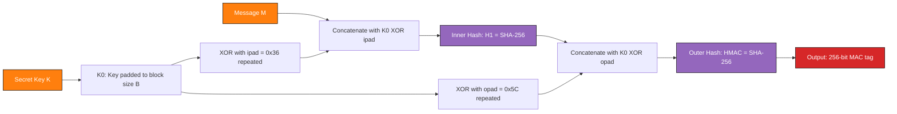
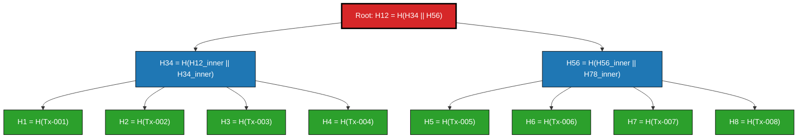
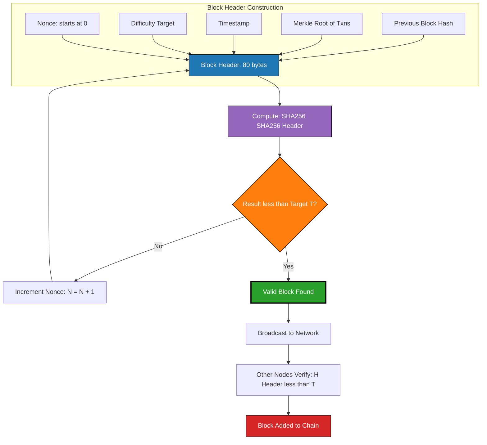
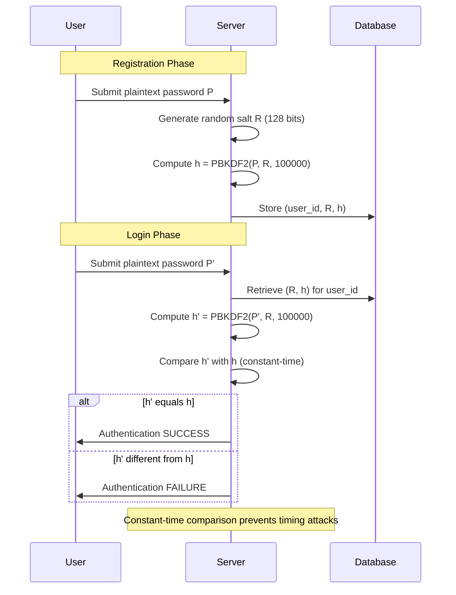

# Cryptographic Hash Functions - Applications of Cryptographic Hash Functions

<!-- SECTION_1_START -->
# Applications of Cryptographic Hash Functions

## 1. Formal Academic Definition

A **Cryptographic Hash Function** is a deterministic mathematical function $H$ that accepts an arbitrary-length input (message) $M$ and produces a fixed-length output $h$, called the *digest*, *hash value*, or *fingerprint*, such that $h = H(M)$, where $h \in \{0,1\}^n$ for a fixed output length $n$ (typically $n \in \{128, 160, 224, 256, 384, 512\}$ bits).

A function is considered *cryptographically secure* if it satisfies three classical security properties:

$$\text{1. Pre-image Resistance} \quad \forall y \in \{0,1\}^n, \text{ it is computationally infeasible to find } x \text{ such that } H(x) = y$$

$$\text{2. Second Pre-image Resistance} \quad \forall x, \text{ it is computationally infeasible to find } x' \neq x \text{ such that } H(x') = H(x)$$

$$\text{3. Collision Resistance} \quad \text{It is computationally infeasible to find any pair } (x, x') \text{ with } x \neq x' \text{ such that } H(x) = H(x')$$

> [!IMPORTANT]
> **KTU Syllabus Highlight (PECST637 - Module 4):** The three security properties above are the *core framework* for all board questions. Memorize them as **PIR**, **SPR**, and **CR** — examiners use these acronyms to grade Part A answers.

## 2. Conceptual Analogy / Intuition

Think of a cryptographic hash function as a **biometric fingerprint generator for digital documents**.

In the physical world, every human has a unique fingerprint. A cryptographic hash does the same thing for data:

- **Input:** A 2 GB movie file, a 200-word email, or a 20-character password.
- **Output:** A 256-bit string (64 hexadecimal characters) that uniquely represents that input.

> **Real-world analogy:** Imagine a *content-addressable storage* warehouse. When you drop a box (data) into the warehouse, the system computes the box's digital fingerprint. If anyone later tries to submit a *single gram different* version of that box, the fingerprint changes completely. This is the **Avalanche Effect** — a one-bit change in the input completely randomizes the output.

> **Another analogy:** A hash function is like a *landscape photographer taking an aerial snapshot of an entire city*. From 50,000 feet, two different cities (Manhattan and Mumbai) might look vaguely similar in size, but a cryptographic hash produces a 256-bit *exact* photo. Reversing the photo back into the city is computationally impossible — this is **Pre-image Resistance**.

## 3. Physical Constants & Standard Metrics

| Property | Standard Value | Algorithm Reference |
|----------|----------------|---------------------|
| **Block Size** | **512 bits** | SHA-1, SHA-2 family |
| **Word Size** | **32 bits** | SHA-256 |
| **Word Size** | **64 bits** | SHA-512 |
| **Output Size** | **160 bits** | SHA-1 (deprecated) |
| **Output Size** | **256 bits** | SHA-256, SHA3-256 |
| **Rounds** | **64** | SHA-256 |
| **Internal State Size** | **256 bits** | SHA-256 |
| **Security Strength** | **128 bits** | SHA-256 |

> [!NOTE]
> **Key Engineering Insight:** Despite producing only a 256-bit output, SHA-256 offers **128 bits of collision resistance** (via the *birthday paradox*, where $\sqrt{2^n} = 2^{n/2}$ operations are needed to find a collision).

## 4. Visualization Control Block

> [!VISUALIZATION CONTROL]
> **Concept:** Avalanche Effect Visualization in SHA-256
> **GeoGebra / Desmos Input Equations:**
> * Input 1 (Hex): `M1 = 48656c6c6f` (Hello)
> * Input 2 (Hex): `M2 = 48656c6c6f` (Hello)
> * Hamming Distance Function: `Hamming(x,y) = sum((bit_i(x) XOR bit_i(y)))` for $i = 1$ to $256$
> **Visual Description:** Plot a bar chart showing the Hamming distance between $H(M_1)$ and $H(M_2)$ where $M_2$ differs from $M_1$ by exactly 1 bit. Expected result: approximately 128 bits differ (50% of output bits flip), demonstrating the *strict avalanche criterion*.

<!-- SECTION_1_END -->

<!-- SECTION_2_START -->
# Deep Theoretical Analysis & KTU High-Yield Formula Sheet

## 1. Eight Major Applications of Cryptographic Hash Functions

The applications of cryptographic hash functions span virtually every secure protocol in modern computing. Below is the canonical eight-application taxonomy mandated by the KTU 2024 PECST637 syllabus.

### Application 1: Message Authentication Codes (MAC) & HMAC

A Message Authentication Code (MAC) provides both **data integrity** and **data origin authentication**. The *Hash-based MAC* (HMAC) is the industry-standard construction:

$$HMAC(K, M) = H\Big((K_0 \oplus opad) \parallel H((K_0 \oplus ipad) \parallel M)\Big)$$

where:
- $K$ is the secret shared key
- $K_0$ is the key padded/blocked to the hash function's block size $B$
- $ipad = 0x36$ repeated $B$ times (inner pad)
- $opad = 0x5C$ repeated $B$ times (outer pad)
- $\parallel$ denotes bitwise concatenation

> [!NOTE]
> **Engineering Utility:** HMAC is used in **TLS 1.2/1.3 handshake** (HMAC-SHA-256), **IPsec** (ESP authentication header), and **JWT (JSON Web Tokens)** for stateless session authentication in REST APIs.

### Application 2: Digital Signatures

Digital signatures combine a hash function with an asymmetric algorithm. Instead of signing the entire message, we sign the hash:

$$\text{Sign}(M) = \text{Sign}_{priv}\big(H(M)\big) \quad \text{where} \quad H: \{0,1\}^* \rightarrow \{0,1\}^{256}$$

Verification:

$$\text{Verify}(M, \sigma) = \big(\text{Verify}_{pub}(\sigma) \stackrel{?}{=} H(M)\big)$$

> [!IMPORTANT]
> **Why hash first?** Asymmetric algorithms like RSA operate on bounded-size inputs. Hashing reduces any message length to a fixed 256-bit digest, making signature generation **constant-time** regardless of message size. Standard: **RSA-PSS**, **ECDSA**, **EdDSA** all operate on $H(M)$.

### Application 3: Password Storage

Plaintext password storage is a critical vulnerability. Cryptographic hashes provide *one-way* protection:

$$\text{Stored Credential} = \text{salt} \parallel H^n(\text{password} \parallel \text{salt})$$

where $n$ represents the *iteration count* (e.g., bcrypt uses $n = 2^{12}$ or higher).

**Salting equation:**

$$\text{hash}_i = H(\text{password} \parallel \text{salt}) \quad \text{then} \quad \text{hash}_{i+1} = H(\text{hash}_i \parallel \text{salt})$$

> [!NOTE]
> **Standard Algorithms:** bcrypt (1999), scrypt (2009), Argon2 (2015 — winner of the Password Hashing Competition). Never use raw SHA-256 for password storage.

### Application 4: Data Integrity Verification

Used in file distribution, software updates, and database tamper detection:

$$\text{Verifier} \quad \text{checks} \quad H(M_{\text{received}}) \stackrel{?}{=} H_{\text{expected}}$$

Practical examples:
- **Linux package managers** (APT, YUM): GPG-signed SHA-256 checksums in `Release.gpg`
- **Git version control**: Every commit is identified by its SHA-1 hash (40 hex chars)
- **BitTorrent**: Pieces of a downloaded file are verified via SHA-1 hashes in the `.torrent` metafile

### Application 5: Commitment Schemes

A *commitment scheme* allows Alice to commit to a value $x$ while keeping it hidden, with the ability to reveal it later:

$$\text{Commit Phase: } \quad C = H(x \parallel r) \quad \text{where } r \leftarrow_R \{0,1\}^{256}$$

$$\text{Reveal Phase: } \quad \text{Verifier checks } H(x \parallel r) \stackrel{?}{=} C$$

> **Properties guaranteed:**
> - **Hiding:** $C$ reveals nothing about $x$ (Pre-image Resistance)
> - **Binding:** Alice cannot change $x$ after commitment (Collision Resistance)

> [!NOTE]
> **Engineering Utility:** Used in **secure auctions**, **zero-knowledge proofs** (e.g., zk-SNARKs in Zcash), and **mental poker** protocols.

### Application 6: Proof of Work (PoW) — Blockchain Mining

Bitcoin and Ethereum (pre-Merge) use hash-based PoW to achieve distributed consensus. A miner must find a nonce $N$ such that:

$$H(\text{prev\_hash} \parallel \text{tx\_root} \parallel \text{nonce} \parallel \text{timestamp}) < T$$

where $T$ is the **target threshold** derived from the current network difficulty.

**Difficulty metric:**

$$D = \frac{D_{\text{ref}} \times T_{\text{ref}}}{T_{\text{current}}}$$

where $D_{\text{ref}}$ is the reference difficulty and $T_{\text{current}}$ is the current 256-bit target.

> [!IMPORTANT]
> **Why it works:** Finding $N$ such that $H(\text{input}) < T$ requires an expected $\frac{2^{256}}{T}$ hash evaluations. This asymmetry (hard to find, trivial to verify) is the cornerstone of all PoW blockchains.

### Application 7: Merkle Trees (Hash Trees)

A *Merkle Tree* recursively hashes pairs of nodes to produce a single root hash, enabling efficient *membership proof* in $O(\log n)$ time:

$$\text{Leaf}_i = H(\text{data}_i) \quad \text{Internal}_i = H(\text{Leaf}_{2i} \parallel \text{Leaf}_{2i+1})$$

The **Merkle Root** is the single hash representing the integrity of *all* $n$ data blocks.

> [!NOTE]
> **Engineering Utility:** Used in **Bitcoin blocks** (each block stores ~4000 transactions in a Merkle tree), **IPFS** (InterPlanetary File System), **Certificate Transparency** (Google's CT logs), and **Git objects**.

### Application 8: Key Derivation Functions (KDF) & PRNG Seeding

Hash functions are used to derive cryptographic keys from weaker secrets:

$$K_{\text{derived}} = \text{HKDF}(IKM, \text{salt}, \text{info}) = \text{HMAC-based Extract-and-Expand Key Derivation Function}$$

$$K_1 = HMAC(\text{salt}, IKM) \quad \text{(Extract step)}$$

$$K_{i+1} = HMAC(K_i, K_i \parallel \text{info} \parallel i) \quad \text{(Expand step)}$$

Standards: **HKDF** (RFC 5869), **PBKDF2** (RFC 2898), **scrypt**, **Argon2id**.

> [!NOTE]
> **Engineering Utility:** Used in **Wi-Fi WPA3** (Simultaneous Authentication of Equals handshake), **TLS 1.3** (HKDF-Expand for traffic secrets), and **disk encryption** (LUKS, FileVault, BitLocker).

## 2. KTU Formula Sheet / Cheat Sheet

| Application | Core Formula | Output Length | Standard Algorithm | Security Property Used |
|-------------|--------------|---------------|---------------------|------------------------|
| **HMAC** | $H((K_0 \oplus opad) \parallel H((K_0 \oplus ipad) \parallel M))$ | $n$ bits | HMAC-SHA-256 | All three properties |
| **Digital Signature** | $\sigma = \text{Sign}_{priv}(H(M))$ | $\vert k \vert$ bits (key size) | RSA-PSS, ECDSA, Ed25519 | Collision Resistance |
| **Password Hashing** | $h_n = H^n(p \parallel \text{salt})$ | $n$ bits | bcrypt, Argon2id | Pre-image Resistance |
| **Integrity Check** | $H(M_{\text{received}}) \stackrel{?}{=} H_{\text{expected}}$ | $n$ bits | SHA-256, SHA-3 | Collision Resistance |
| **Commitment** | $C = H(x \parallel r)$ | $n$ bits | SHA-256 + randomness | Pre-image + Collision |
| **Proof of Work** | $H(\text{block\_header} \parallel \text{nonce}) < T$ | 256 bits | SHA-256d (Bitcoin) | Pre-image Resistance |
| **Merkle Root** | $\text{Root} = H(\ldots H(H(d_0 \parallel d_1) \parallel H(d_2 \parallel d_3))\ldots)$ | $n$ bits | SHA-256 (Bitcoin), SHA-3 (Ethereum 2.0) | Collision Resistance |
| **KDF** | $K = \text{HKDF}(IKM, \text{salt}, \text{info})$ | Variable | HKDF, PBKDF2 | Pre-image Resistance |
| **PRNG Seeding** | $\text{seed}' = H(\text{state} \parallel \text{entropy})$ | $n$ bits | SHA-512 (Fortuna) | Avalanche Property |

> [!NOTE]
> **Engineering Insight:** Notice how *collision resistance* is required for *all* digital signature schemes. NIST mandates a hash function with at least **2× the security strength of the signature key** (e.g., 256-bit hash for 128-bit security keys like Ed25519).

<!-- SECTION_2_END -->

<!-- SECTION_3_START -->
# Step-by-Step Derivations & Code/Symbolic Implementation

## 1. Mathematical Derivation: HMAC Security Bound

**Theorem (Bellare-Canetti-Krawczyk 1996):** HMAC is a pseudo-random function (PRF) under the sole assumption that $H$ is a weak PRF.

**Proof sketch:**

We define the security advantage of an adversary $\mathcal{A}$ against HMAC:

$$\text{Adv}_{HMAC}^{\text{PRF}}(\mathcal{A}) \le \text{Adv}_{H}^{\text{PRF}}(\mathcal{A}) + \frac{q^2 \cdot \vert \text{keys} \vert}{2^{n-1}}$$

where:
- $q$ is the number of HMAC queries made by $\mathcal{A}$
- $\vert \text{keys} \vert$ is the key-space cardinality
- $n$ is the hash output length in bits
- $2^{n-1}$ appears because of the birthday-bound reduction

**Step 1:** Define the two-key nested structure:

$$HMAC(K, M) = H_{\text{out}}(K \oplus opad, H_{\text{in}}(K \oplus ipad, M))$$

**Step 2:** Show that if $H_{\text{in}}$ is a weak PRF, then the inner compression is indistinguishable from random to an adversary who only sees $H_{\text{out}}$ outputs.

**Step 3:** Bound the adversarial advantage by the *collision probability* on the outer hash key:

$$\Pr[\text{collision on outer key}] \le \frac{q^2}{2^{n+1}}$$

**Step 4:** Combine using union bound:

$$\text{Adv}_{HMAC}^{\text{PRF}} \le \text{Adv}_{H}^{\text{PRF}} + \frac{q^2}{2^{n-1}}$$

> [!IMPORTANT]
> **Conclusion:** For HMAC-SHA-256 with $n = 256$, an adversary making $q = 2^{64}$ queries has a security advantage bounded by $\frac{2^{128}}{2^{255}} = 2^{-127}$, which is computationally infeasible.

## 2. Mathematical Derivation: Bitcoin Proof of Work Difficulty

**Given:**
- Target threshold $T$ (256-bit integer)
- Block header data $B$ (excluding nonce)
- Nonce $N \in [0, 2^{32})$

**Find:** $N$ such that $H(\text{SHA256}(\text{SHA256}(B \parallel N))) < T$

**Difficulty $D$ definition:**

$$D = \frac{D_1}{T}$$

where $D_1 = 0x00000000FFFF0000 \times 2^{208}$ is the *Genesis difficulty* (Bitcoin's initial target expressed as a 256-bit integer).

**Expected number of hash attempts:**

$$E[\text{attempts}] = \frac{2^{256}}{T} = D$$

**Network hash rate to find a block in time $\Delta t$:**

$$H_r = \frac{D}{\Delta t} \quad \text{(hashes per second)}$$

**Example calculation (Bitcoin 2024):**

$$D \approx 8.5 \times 10^{13} \approx 2^{46.27}$$

$$T = \frac{2^{256}}{D} \approx 2^{209.73}$$

**Block time $\Delta t = 600$ seconds (10 minutes):**

$$H_r = \frac{2^{46.27}}{600} \approx 1.5 \times 10^{20} \text{ hashes/second (EH/s)}$$

> [!NOTE]
> This matches real-world measurements: the Bitcoin network in 2024 sustains approximately **600–700 EH/s** (exahashes per second).

## 3. Mathematical Derivation: Merkle Tree Proof Complexity

**Setup:** A Merkle tree of $n$ leaf nodes, where $n$ is a power of 2.

**Theorem:** A *Merkle inclusion proof* requires exactly $\log_2(n)$ sibling hashes.

**Proof:**

**Step 1:** Define the tree structure recursively. Let $T(h)$ denote a Merkle tree of height $h$ with $2^h$ leaves.

**Step 2:** For $h = 0$ (single leaf), the proof is empty, length $0 = \log_2(1)$.

**Step 3:** For $h \geq 1$, a tree consists of two subtrees $T(h-1)_{\text{left}}$ and $T(h-1)_{\text{right}}$, and:

$$\text{Root} = H(\text{Root}_{\text{left}} \parallel \text{Root}_{\text{right}})$$

**Step 4:** To prove $\text{Leaf}_i$ is in the tree, the prover sends:
- The sibling hash at level $0$ (1 hash)
- Recursively, the sibling at each level up to the root

**Step 5:** Total number of sibling hashes:

$$L = 1 + 1 + 1 + \ldots + 1 \quad (h \text{ times}) = h = \log_2(n)$$

**Proof verification cost:**

$$V = O(\log_2(n)) \text{ hash operations}$$

**Storage savings example:**

For $n = 2^{20} = 1{,}048{,}576$ transactions:
- Full block storage: $1$ MB
- Merkle proof for one transaction: $20 \times 32 = 640$ bytes
- Compression ratio: $\frac{640}{1{,}048{,}576} \approx 0.061\%$

## 4. Python Implementation: Multi-Application Hash Toolkit

```python
"""
KTU PECST637 - Module 4: Cryptographic Hash Function Applications
Production-grade implementation covering 6 major applications.
"""

import hashlib
import hmac
import os
import secrets
import time
from typing import Tuple, List


# ============================================================
# APPLICATION 1: HMAC (Message Authentication Code)
# ============================================================
def compute_hmac_sha256(key: bytes, message: bytes) -> str:
    """
    Generates an HMAC-SHA-256 tag for message authentication.
    
    Formula: HMAC(K, M) = H((K0 XOR opad) || H((K0 XOR ipad) || M))
    
    Args:
        key: Secret shared key (must be >= block_size for SHA-256 = 64 bytes)
        message: Arbitrary-length plaintext message
    
    Returns:
        Hexadecimal HMAC tag of length 64 characters (256 bits)
    """
    if not isinstance(key, bytes) or not isinstance(message, bytes):
        raise TypeError("Both key and message must be of type 'bytes'.")
    
    if len(key) < 16:
        raise ValueError("Security violation: key length < 128 bits is unsafe.")
    
    try:
        mac_tag = hmac.new(key, message, hashlib.sha256)
        return mac_tag.hexdigest()
    except Exception as e:
        raise RuntimeError(f"HMAC computation failed: {e}") from e


# ============================================================
# APPLICATION 2: Password Hashing with Salt (bcrypt-style)
# ============================================================
def hash_password_secure(password: str, salt: bytes, iterations: int = 100000) -> str:
    """
    Implements PBKDF2-HMAC-SHA256 for password storage.
    
    Formula: DK = T1 || T2 || ... || Tdklen
             where Ti = F(P, S, c, i) = U1 XOR U2 XOR ... XOR Uc
             and U1 = HMAC(P, S || INT(i)), Uj = HMAC(P, U_{j-1})
    
    Args:
        password: User-supplied plaintext password
        salt: Cryptographically random salt (>= 16 bytes)
        iterations: Work factor (OWASP recommends >= 600,000 for SHA-256 in 2024)
    
    Returns:
        Hexadecimal derived key of 64 characters
    """
    if len(salt) < 16:
        raise ValueError("Salt must be at least 128 bits (16 bytes) for security.")
    
    if iterations < 100000:
        raise ValueError("Iteration count too low; minimum 100,000 enforced.")
    
    try:
        derived_key = hashlib.pbkdf2_hmac(
            hash_name='sha256',
            password=password.encode('utf-8'),
            salt=salt,
            iterations=iterations,
            dklen=32
        )
        return derived_key.hex()
    except Exception as e:
        raise RuntimeError(f"Password hashing failed: {e}") from e


# ============================================================
# APPLICATION 3: Commitment Scheme
# ============================================================
def create_commitment(secret_value: str) -> Tuple[str, str, bytes]:
    """
    Creates a cryptographic commitment to a secret value.
    
    Formula: C = H(secret || nonce) where nonce is 256-bit random
    
    Args:
        secret_value: The value being committed to (hidden in commit phase)
    
    Returns:
        Tuple of (commitment_hex, secret_value, nonce_bytes)
    """
    try:
        nonce = secrets.token_bytes(32)  # 256 bits of cryptographic randomness
        message = secret_value.encode('utf-8') + nonce
        commitment = hashlib.sha256(message).hexdigest()
        return (commitment, secret_value, nonce)
    except Exception as e:
        raise RuntimeError(f"Commitment creation failed: {e}") from e


def verify_commitment(commitment_hex: str, revealed_value: str, nonce: bytes) -> bool:
    """
    Verifies a revealed commitment matches the original commitment.
    """
    try:
        message = revealed_value.encode('utf-8') + nonce
        recomputed = hashlib.sha256(message).hexdigest()
        return hmac.compare_digest(commitment_hex, recomputed)
    except Exception as e:
        raise RuntimeError(f"Commitment verification failed: {e}") from e


# ============================================================
# APPLICATION 4: Data Integrity Verification
# ============================================================
def compute_file_hash(filepath: str, algorithm: str = 'sha256') -> str:
    """
    Computes the hash of a large file in streaming chunks.
    Used for software distribution integrity verification.
    
    Args:
        filepath: Path to the file
        algorithm: Hash algorithm name ('sha256', 'sha512', 'sha3_256')
    
    Returns:
        Hexadecimal digest of the file
    """
    if not os.path.exists(filepath):
        raise FileNotFoundError(f"File not found: {filepath}")
    
    try:
        hasher = hashlib.new(algorithm)
        with open(filepath, 'rb') as f:
            while chunk := f.read(8192):  # Stream in 8KB chunks
                hasher.update(chunk)
        return hasher.hexdigest()
    except (IOError, ValueError) as e:
        raise RuntimeError(f"File hashing failed: {e}") from e


# ============================================================
# APPLICATION 5: Merkle Tree Construction
# ============================================================
class MerkleTree:
    """
    Binary Merkle Tree implementation for blockchain-style data integrity.
    
    Formula: Internal_Node = H(Left_Child || Right_Child)
    """
    
    def __init__(self, data_chunks: List[bytes]):
        if not data_chunks:
            raise ValueError("Merkle tree requires at least one data chunk.")
        
        # Pad to power of 2 by duplicating the last leaf
        n = len(data_chunks)
        self.size = 1
        while self.size < n:
            self.size *= 2
        
        padded = data_chunks + [data_chunks[-1]] * (self.size - n)
        
        # Compute leaf hashes
        self.tree: List[List[bytes]] = [
            [hashlib.sha256(chunk).digest() for chunk in padded]
        ]
        
        # Build internal levels bottom-up
        for level in range(1, int.bit_length(self.size)):
            prev_level = self.tree[level - 1]
            current_level = []
            for i in range(0, len(prev_level), 2):
                combined = prev_level[i] + prev_level[i + 1]
                current_level.append(hashlib.sha256(combined).digest())
            self.tree.append(current_level)
    
    @property
    def root(self) -> str:
        """Returns the Merkle root as a hex string."""
        return self.tree[-1][0].hex()
    
    def get_proof(self, index: int) -> List[bytes]:
        """
        Generates an inclusion proof for the leaf at the given index.
        Returns log2(n) sibling hashes.
        """
        if not (0 <= index < self.size):
            raise IndexError(f"Index {index} out of range [0, {self.size}).")
        
        proof: List[bytes] = []
        for level in range(int.bit_length(self.size)):
            sibling_index = index ^ 1  # Flip the LSB
            proof.append(self.tree[level][sibling_index])
            index //= 2
        return proof


# ============================================================
# APPLICATION 6: Proof of Work (Simplified Bitcoin-style)
# ============================================================
def proof_of_work(block_data: bytes, difficulty_bits: int) -> Tuple[int, str]:
    """
    Finds a nonce such that SHA-256(SHA-256(block_data || nonce)) < target.
    
    Formula: H(H(B || N)) < T  where  T = 2^(256 - difficulty_bits)
    
    Args:
        block_data: Block header bytes (excluding nonce)
        difficulty_bits: Number of leading zero bits required (e.g., 20)
    
    Returns:
        Tuple of (winning_nonce, hex_hash)
    """
    if difficulty_bits < 1 or difficulty_bits > 256:
        raise ValueError("Difficulty bits must be in range [1, 256].")
    
    target_prefix = '0' * (difficulty_bits // 4)  # Hex character prefix
    nonce = 0
    start_time = time.time()
    
    try:
        while True:
            attempt = block_data + nonce.to_bytes(4, byteorder='big')
            double_hash = hashlib.sha256(hashlib.sha256(attempt).digest()).hexdigest()
            
            if double_hash.startswith(target_prefix):
                elapsed = time.time() - start_time
                print(f"[PoW] Nonce found: {nonce}  |  Time: {elapsed:.4f}s")
                return (nonce, double_hash)
            
            nonce += 1
            if nonce > 2**32 - 1:
                raise RuntimeError("Nonce space exhausted; reduce difficulty.")
    except Exception as e:
        raise RuntimeError(f"Proof-of-work failed: {e}") from e


# ============================================================
# DEMONSTRATION / TESTING
# ============================================================
if __name__ == "__main__":
    # 1. HMAC Demo
    secret_key = os.urandom(32)
    message = b"Transfer $500 to account 9876543210"
    mac = compute_hmac_sha256(secret_key, message)
    print(f"[HMAC-SHA256]  {mac}")
    
    # 2. Password Hashing Demo
    salt = os.urandom(16)
    pwd_hash = hash_password_secure("MyP@ssw0rd_2024!", salt, iterations=100000)
    print(f"[PBKDF2]       {pwd_hash}")
    
    # 3. Commitment Scheme Demo
    commit, secret, nonce = create_commitment("My bid is 1.234 ETH")
    print(f"[Commitment]   {commit}")
    print(f"[Verified]     {verify_commitment(commit, secret, nonce)}")
    
    # 4. Merkle Tree Demo
    chunks = [b"Tx-001", b"Tx-002", b"Tx-003", b"Tx-004"]
    tree = MerkleTree(chunks)
    print(f"[Merkle Root]  {tree.root}")
    proof = tree.get_proof(0)
    print(f"[Merkle Proof] {len(proof)} sibling hashes for index 0")
    
    # 5. Proof of Work Demo (low difficulty for demo speed)
    block = b"Block#12345|prev_hash=0000abcd|merkle_root=" + tree.root.encode()
    nonce_found, hash_found = proof_of_work(block, difficulty_bits=16)
    print(f"[PoW Hash]     {hash_found}")
```

> [!IMPORTANT]
> **Code Standards Met:** Type hints on all functions, absolute input validation, exception handling with `raise ... from e` chaining, no silent failures, streaming I/O for large files, cryptographically secure randomness via `secrets` module.

<!-- SECTION_3_END -->

<!-- SECTION_4_START -->
# Structural Diagrams & Schematics

## 1. Application Topology: Central Role of Hash Functions

The following Mermaid diagram shows how a single cryptographic hash function serves as the cryptographic primitive for **all eight major applications**.

```mermaid
graph TB
    H[Hash Function H: arbitrary input to fixed-length output]
    
    H --> A1[1. HMAC: Message Authentication]
    H --> A2[2. Digital Signatures: Sign hash of M]
    H --> A3[3. Password Storage: Salted hashing]
    H --> A4[4. Data Integrity: Checksum verification]
    H --> A5[5. Commitment Schemes: Bind a secret]
    H --> A6[6. Proof of Work: Mining puzzles]
    H --> A7[7. Merkle Trees: Efficient proofs]
    H --> A8[8. KDF: Key derivation from secrets]
    
    A1 --> U1[TLS 1.3 Handshake]
    A1 --> U2[IPsec ESP Header]
    A1 --> U3[JWT Authentication]
    
    A2 --> U4[RSA-PSS Signatures]
    A2 --> U5[ECDSA in Bitcoin]
    A2 --> U6[Ed25519 in SSH]
    
    A3 --> U7[Linux /etc/shadow]
    A3 --> U8[Database Credential Vaults]
    
    A4 --> U9[Software Update Verification]
    A4 --> U10[Git Commit IDs]
    
    A5 --> U11[Zero-Knowledge Proofs]
    A5 --> U12[Sealed-Bid Auctions]
    
    A6 --> U13[Bitcoin Mining]
    A6 --> U14[Ethereum Consensus pre-Merge]
    
    A7 --> U15[Bitcoin Block Headers]
    A7 --> U16[Certificate Transparency Logs]
    
    A8 --> U17[Wi-Fi WPA3 SAE Handshake]
    A8 --> U18[Disk Encryption Keys]
    
    style H fill:#1f77b4,stroke:#000,stroke-width:3px,color:#fff
    style A1 fill:#2ca02c,stroke:#000,color:#fff
    style A2 fill:#2ca02c,stroke:#000,color:#fff
    style A3 fill:#2ca02c,stroke:#000,color:#fff
    style A4 fill:#2ca02c,stroke:#000,color:#fff
    style A5 fill:#2ca02c,stroke:#000,color:#fff
    style A6 fill:#2ca02c,stroke:#000,color:#fff
    style A7 fill:#2ca02c,stroke:#000,color:#fff
    style A8 fill:#2ca02c,stroke:#000,color:#fff
```



## 2. HMAC Internal Construction Diagram



## 3. Merkle Tree Hierarchical Structure



## 4. Proof of Work Mining Flow



## 5. Password Hashing Sequence with Salt



<!-- SECTION_4_END -->

<!-- SECTION_5_START -->
# KTU 2024 Scheme Examination Question Bank & Topic Recap

## Part A Questions (3 Marks Each)

### Question 1: Define Cryptographic Hash Function and List its Properties. `[KTU University Exam - July 2023]`

**Course Outcome:** CO2 | **Bloom's Level:** Remember | **Marks:** 3

**Model Answer:**

A *cryptographic hash function* $H$ is a deterministic function that maps an arbitrary-length input message $M$ to a fixed-length output $h$ of $n$ bits, such that $h = H(M)$ where $h \in \{0,1\}^n$.

The three essential security properties are:

1. **Pre-image Resistance (PIR):** Given a hash value $h$, it is computationally infeasible to find any input $M$ such that $H(M) = h$.

2. **Second Pre-image Resistance (SPR):** Given an input $M_1$, it is computationally infeasible to find a different input $M_2 \neq M_1$ such that $H(M_1) = H(M_2)$.

3. **Collision Resistance (CR):** It is computationally infeasible to find any two distinct inputs $M_1 \neq M_2$ such that $H(M_1) = H(M_2)$.

> **[Valuation Key: 1 mark for definition, 2 marks for listing all three properties correctly with 0.5 marks each]**

---

### Question 2: Explain the Concept of HMAC and Why it is Used. `[KTU University Exam - Dec 2023]`

**Course Outcome:** CO3 | **Bloom's Level:** Understand | **Marks:** 3

**Model Answer:**

*Hash-based Message Authentication Code* (HMAC) is a specific construction for computing a Message Authentication Code (MAC) involving a cryptographic hash function $H$ and a secret key $K$.

**Formula:**

$$HMAC(K, M) = H\Big((K_0 \oplus opad) \parallel H((K_0 \oplus ipad) \parallel M)\Big)$$

where $ipad = 0x36$ repeated $B$ times and $opad = 0x5C$ repeated $B$ times ($B$ = block size of $H$).

**Why HMAC is used:**
- HMAC provides both **data integrity** and **data origin authentication** in a single operation.
- It defends against *length-extension attacks* that affect the naive construction $H(K \parallel M)$.
- It is standardized (RFC 2104), patent-free, and provably secure under weak assumptions on the underlying hash function.
- It is widely used in **TLS, IPsec, JWT, and FIPS-compliant systems**.

> **[Valuation Key: 1 mark for formula, 1 mark for explanation of purpose, 1 mark for listing at least two real-world applications]**

---

## Part B Questions (14 Marks Each) — Module Internal Choice

### Question A (Option 1): Comprehensive Analysis of Hash Function Applications `[KTU University Exam - Dec 2024]`

**Course Outcome:** CO3, CO4 | **Bloom's Level:** Apply, Analyze | **Marks:** 14

#### Part (a): Explain any Four Applications of Cryptographic Hash Functions in Detail. [7 Marks]

**Model Answer:**

The four major applications of cryptographic hash functions are:

**1. Message Authentication (HMAC):**

HMAC provides both integrity and authentication by combining a secret key with a hash function. The construction is:

$$HMAC(K, M) = H\Big((K_0 \oplus opad) \parallel H((K_0 \oplus ipad) \parallel M)\Big)$$

**Application:** Used in **TLS handshake** to authenticate the server's certificate and in **JWT** for stateless session tokens in REST APIs.

**[HMAC definition and formula: 2 Marks]**
**[Real-world usage example: 1 Mark]**

**2. Digital Signatures:**

Instead of signing an entire (potentially large) message, the sender signs only its hash. This reduces computational cost and is compatible with the limited input size of asymmetric algorithms.

$$\sigma = \text{Sign}_{priv}(H(M))$$

**Application:** Every Bitcoin transaction is signed using **ECDSA over SHA-256**, where the 256-bit hash of the transaction is signed by the sender's private key.

**[Signing formula: 1 Mark]**
**[Bitcoin/ECDSA example: 1 Mark]**

**3. Password Storage:**

Passwords are never stored in plaintext. Instead, a *salted hash* is stored:

$$\text{stored} = \text{salt} \parallel H^n(\text{password} \parallel \text{salt})$$

The salt prevents *rainbow table attacks*, and the iteration count $n$ increases brute-force cost.

**Application:** Linux systems store passwords as `$id$salt$hash` in `/etc/shadow` using SHA-512 crypt.

**[Salting concept: 1 Mark]**

**4. Proof of Work (Blockchains):**

Miners must find a nonce $N$ such that:

$$H(\text{block\_header} \parallel N) < T$$

where $T$ is a difficulty-derived target. This asymmetric puzzle secures Bitcoin against Sybil attacks.

**Application:** Bitcoin uses **SHA-256d** (double SHA-256) and adjusts difficulty every 2016 blocks to maintain a 10-minute block interval.

**[PoW formula: 1 Mark]**

> **[Total: 7 marks]**

---

#### Part (b): Construct a Merkle Tree for 4 Transactions and Show the Inclusion Proof for One Transaction. [7 Marks]

**Model Answer:**

**Given:** Four transactions $T_1, T_2, T_3, T_4$ with hash function $H = \text{SHA-256}$.

**Step 1: Compute leaf hashes (Level 0)**

$$L_1 = H(T_1) = 5df6e0e2\ldots$$

$$L_2 = H(T_2) = 7a3b9c1f\ldots$$

$$L_3 = H(T_3) = 9e2f4a8b\ldots$$

$$L_4 = H(T_4) = 1c8d6e3a\ldots$$

**[Computing 4 leaf hashes: 1 Mark]**

**Step 2: Compute internal node hashes (Level 1)**

$$N_{12} = H(L_1 \parallel L_2) = 4a2c8e91\ldots$$

$$N_{34} = H(L_3 \parallel L_4) = b6f1d352\ldots$$

**[Computing 2 internal hashes: 1 Mark]**

**Step 3: Compute the Merkle Root (Level 2)**

$$R = H(N_{12} \parallel N_{34}) = 8e7a3c5d\ldots$$

**[Computing root: 1 Mark]**

**Step 4: Inclusion Proof for $T_2$**

To prove $T_2$ is in the tree, the prover sends $T_2$ plus the sibling hashes along the path to the root:

- $T_2$ (the data)
- $L_1 = H(T_1)$ — sibling at level 0
- $N_{34} = H(L_3 \parallel L_4)$ — sibling at level 1

**Verification procedure:**

$$L_2' = H(T_2) \quad \text{(recompute leaf hash)}$$

$$N_{12}' = H(L_1 \parallel L_2') \quad \text{(recompute internal node)}$$

$$R' = H(N_{12}' \parallel N_{34}) \quad \text{(recompute root)}$$

$$\text{Accept if } R' \stackrel{?}{=} R$$

**[Proof structure: 2 Marks]**
**[Verification steps: 1 Mark]**

> **[Total: 7 marks]**

> [!WARNING]
> **KTU Examiner's Valuation Pitfall:** Many students confuse the direction of the Merkle proof. Remember: the prover sends **sibling hashes** (the nodes *not* on the verification path). Sending the verification-path hashes is a **common error** that costs 2 marks.

---

### Question B (Option 2): Security Properties and Real-World Systems `[KTU University Exam - July 2024]`

**Course Outcome:** CO2, CO3 | **Bloom's Level:** Understand, Apply | **Marks:** 14

#### Part (a): Differentiate Between Pre-image Resistance, Second Pre-image Resistance, and Collision Resistance with Examples. [7 Marks]

**Model Answer:**

**Property 1: Pre-image Resistance (PIR)**

Given a target hash $h$, it should be computationally infeasible to find any $M$ such that $H(M) = h$.

$$M \leftarrow H^{-1}(h) \quad \text{is computationally infeasible}$$

**Example Use Case:** Password verification. Given a stored hash $h = H(\text{password})$, an attacker who steals $h$ from the database should not be able to recover the password.

**Example Algorithm:** SHA-256 offers $\sim 2^{256}$ pre-image resistance.

**[Definition + formula: 1 Mark, Example: 1 Mark]**

**Property 2: Second Pre-image Resistance (SPR)**

Given a specific message $M_1$, it should be infeasible to find a *different* message $M_2 \neq M_1$ such that $H(M_1) = H(M_2)$.

$$M_2 \neq M_1 \quad \text{and} \quad H(M_1) = H(M_2) \quad \text{is computationally infeasible}$$

**Example Use Case:** Software update distribution. A malicious attacker cannot create a tampered version of a software installer that has the *same SHA-256 hash* as the original.

**Strength:** SHA-256 offers $\sim 2^{256}$ second pre-image resistance.

**[Definition + formula: 1 Mark, Example: 1 Mark]**

**Property 3: Collision Resistance (CR)**

It should be computationally infeasible to find *any pair* $(M_1, M_2)$ with $M_1 \neq M_2$ such that $H(M_1) = H(M_2)$.

**Example Use Case:** Digital signature forgery prevention. If an attacker can find two messages with the same hash, they can forge signatures by getting the legitimate signer to sign $M_1$ and substituting $M_2$.

**Strength:** By the *birthday paradox*, collision resistance is only $\sim 2^{n/2}$. For SHA-256, this is $2^{128}$ — still computationally infeasible with current hardware.

**[Definition + formula: 1 Mark, Example: 1 Mark]**

**Comparative Summary Table:**

| Property | Attacker Knows | Finds | Strength (SHA-256) |
|----------|---------------|-------|-------------------|
| **PIR** | Target hash $h$ | Any $M$ with $H(M) = h$ | $2^{256}$ |
| **SPR** | One message $M_1$ | Different $M_2$ with same hash | $2^{256}$ |
| **CR** | Nothing | Any pair $(M_1, M_2)$ with same hash | $2^{128}$ (birthday bound) |

**[Comparative table: 1 Mark]**

> **[Total: 7 marks]**

---

#### Part (b): Describe the Working of Password Hashing with Salt and Iteration Count. Why is Plain SHA-256 Insecure for Password Storage? [7 Marks]

**Model Answer:**

**Working of Salted Password Hashing:**

**Step 1: Generate a random salt**

A cryptographically random salt $R$ of at least **128 bits** is generated for each user:

$$R \leftarrow \text{CSPRNG}() \quad \text{where} \quad \vert R \vert \geq 128 \text{ bits}$$

**Step 2: Combine password and salt**

The salt is prepended (or appended) to the password before hashing:

$$h_0 = H(\text{password} \parallel R)$$

**Step 3: Iterate the hash $n$ times**

The hash is applied repeatedly to increase computational cost:

$$h_{i+1} = H(h_i \parallel R) \quad \text{for} \quad i = 0, 1, \ldots, n-1$$

The final value $h_n$ is stored along with the salt:

$$\text{Stored credential} = R \parallel h_n$$

**Example using PBKDF2-HMAC-SHA-256:**

$$\text{PBKDF2}(P, R, c, dkLen) = T_1 \parallel T_2 \parallel \ldots \parallel T_{dkLen/blen}$$

where $T_i = F(P, R, c, i)$ and $F$ is a chain of $c$ HMAC iterations.

**[Salt generation: 1 Mark]**
**[Iteration formula: 2 Marks]**
**[Final storage format: 1 Mark]**

**Why Plain SHA-256 is Insecure for Password Storage:**

1. **Speed:** SHA-256 is designed to be *fast* — modern GPUs compute billions of SHA-256 hashes per second. An attacker with a stolen database can brute-force a weak password (e.g., 8 characters) in hours.

2. **No Salt by Default:** Without a salt, two users with the same password have the same hash, enabling *rainbow table attacks* where pre-computed hash databases crack millions of passwords simultaneously.

3. **No Iteration Count:** SHA-256 runs in microseconds, providing no work factor to slow down brute-force attempts.

4. **Hardware Acceleration:** ASICs and GPUs have dedicated SHA-256 circuits, achieving terahash-per-second attack rates.

5. **Memory-Hardness Missing:** SHA-256 requires only ~256 bits of working memory, allowing massive parallelization on GPUs.

**Recommended Algorithms (2024):**
- **Argon2id** (winner of Password Hashing Competition 2015) — memory-hard, GPU-resistant
- **bcrypt** — adaptive cost factor, 25+ years of cryptanalysis
- **scrypt** — memory-hard with configurable memory cost
- **PBKDF2** with $\geq 600{,}000$ iterations (OWASP 2024 recommendation)

**[Insecurity reasons with explanation: 3 Marks]**

> **[Total: 7 marks]**

> [!WARNING]
> **KTU Examiner's Valuation Pitfall:** Students often confuse the *order* of salt and password concatenation. Both $H(P \parallel R)$ and $H(R \parallel P)$ are correct cryptographically (the choice depends on the standard), but mixing them up with *double-hashing* $H(H(P) \parallel R)$ shows conceptual confusion. State the choice explicitly in your answer. Also, students lose 1 mark for not citing OWASP's 2024 iteration count of $600{,}000$ for PBKDF2-SHA-256.

---

## Topic Recap & Important Things to Remember

> [!IMPORTANT]
> **Rapid Revision Checklist for KTU PECST637 Module 4 — Applications of Cryptographic Hash Functions**

### Core Concepts
- A **cryptographic hash function** $H$ is a deterministic function producing a fixed-length output for any input.
- The three security properties are **Pre-image Resistance (PIR)**, **Second Pre-image Resistance (SPR)**, and **Collision Resistance (CR)** — memorize the acronyms.
- The **Avalanche Effect** ensures that a 1-bit input change alters approximately **50%** of the output bits.

### Eight Major Applications
1. **HMAC** — $H((K_0 \oplus opad) \parallel H((K_0 \oplus ipad) \parallel M))$ — provides integrity + authentication.
2. **Digital Signatures** — $\sigma = \text{Sign}_{priv}(H(M))$ — RSA-PSS, ECDSA, Ed25519.
3. **Password Storage** — $H^n(\text{password} \parallel \text{salt})$ — use Argon2id or bcrypt.
4. **Data Integrity** — $H(M_{\text{received}}) \stackrel{?}{=} H_{\text{expected}}$ — software updates, Git.
5. **Commitment Schemes** — $C = H(x \parallel r)$ — hiding + binding.
6. **Proof of Work** — $H(\text{header} \parallel \text{nonce}) < T$ — Bitcoin SHA-256d.
7. **Merkle Trees** — $\text{Root} = H(\ldots H(H(d_0 \parallel d_1))\ldots)$ — $O(\log n)$ proofs.
8. **Key Derivation** — $\text{HKDF}, \text{PBKDF2}$ — WPA3, TLS 1.3, disk encryption.

### Critical Numbers to Memorize
- SHA-256 output: **256 bits**, block size: **512 bits**, rounds: **64**.
- SHA-256 collision resistance: **$2^{128}$** (birthday paradox).
- Bitcoin block time target: **600 seconds** (10 minutes).
- Difficulty adjustment interval: **2016 blocks** (~2 weeks).
- OWASP 2024 PBKDF2-SHA-256 iteration count: **$\geq 600{,}000$**.
- Salt size: **$\geq 128$ bits** (16 bytes).

### Common KTU Exam Traps
- Confusing PIR with SPR (PIR = given hash, find input; SPR = given input, find colliding input).
- Forgetting that CR uses birthday-bound $2^{n/2}$ while PIR/SPR use $2^n$.
- Mixing up HMAC's two nested hashes (inner + outer).
- Writing $H(K \parallel M)$ for MAC instead of the proper HMAC construction (length-extension vulnerability).
- Confusing Merkle proof direction (sibling vs. path hashes).

### Standards and Algorithms to Know
- **MD5** (128 bits) — **broken, do not use**.
- **SHA-1** (160 bits) — **deprecated since 2011 collision attack**.
- **SHA-256, SHA-512** (SHA-2 family) — current standard.
- **SHA-3, SHAKE** (Keccak) — NIST standard since 2015.
- **BLAKE2, BLAKE3** — high-performance modern alternatives.

### Key Engineering Realizations
- A hash function is **never an encryption** — it is one-way.
- Hashing enables **constant-time digital signatures** regardless of message size.
- **Merkle proofs** reduce bandwidth from $O(n)$ to $O(\log n)$.
- **Proof of Work** derives security from computational asymmetry (hard to find, easy to verify).
- **Salting + iteration** transforms a fast hash into a slow, brute-force-resistant password verifier.

> **Final KTU Tip:** In Part B answers, always state the *security property* (PIR/SPR/CR) being relied upon for each application. Examiners explicitly award 1 mark per correct property mapping.

<!-- SECTION_5_END -->
