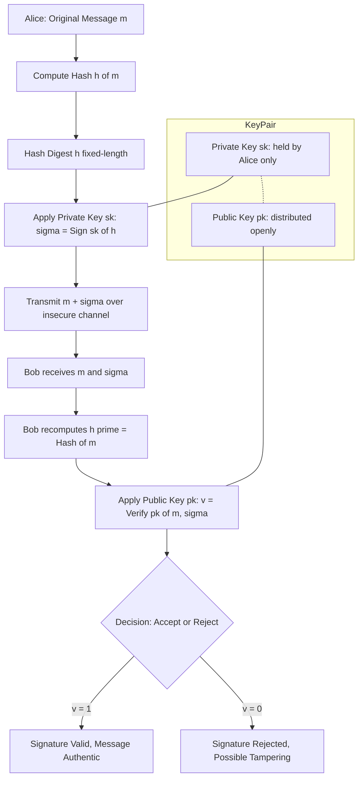
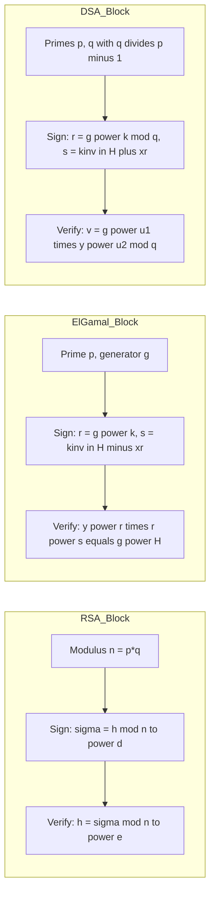
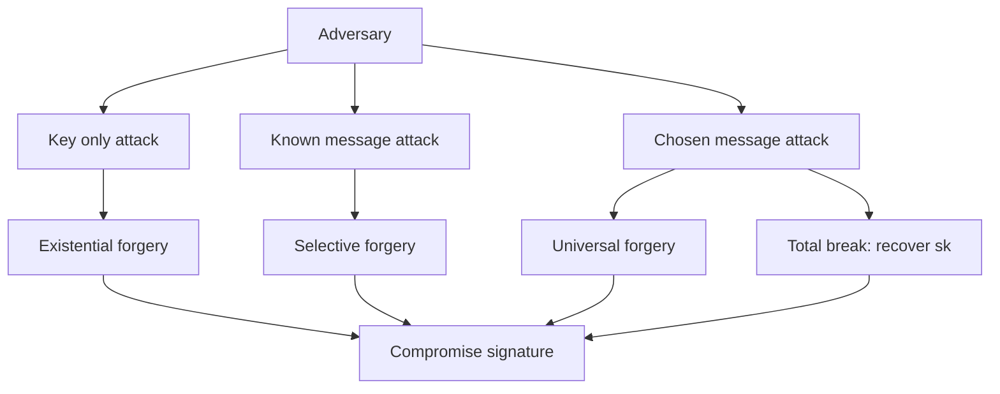
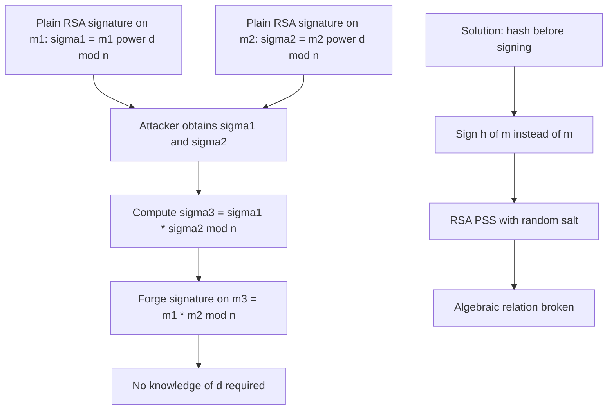

# Digital Signatures

<!-- SECTION_1_START -->
# 1. Core Technical Definition & Intuitive Overview

## 1.1 Formal Definition (KTU 2024 Syllabus Aligned)

A **Digital Signature** is a cryptographic primitive that binds the identity of a signer to a piece of digital data through mathematical transformations. It is the public-key (asymmetric) counterpart of a Message Authentication Code (MAC) and provides three security services that MACs **cannot** provide:

1. **Data Origin Authentication** — proves *who* generated the message.
2. **Data Integrity** — proves the message has *not been altered* in transit.
3. **Non-Repudiation** — the signer *cannot later deny* having signed the message.

Formally, a digital signature scheme is a triple of efficient algorithms:

$$\Pi = (\text{KeyGen},\ \text{Sign},\ \text{Verify})$$

- $\text{KeyGen}() \rightarrow (pk, sk)$ — outputs a public verification key $pk$ and a private signing key $sk$.
- $\text{Sign}(sk, m) \rightarrow \sigma$ — produces a signature $\sigma$ on message $m \in \mathcal{M}$.
- $\text{Verify}(pk, m, \sigma) \rightarrow \{0, 1\}$ — outputs **1** (accept) or **0** (reject).

The correctness requirement is that for any honestly generated $(pk, sk)$ and any $m$:

$$\Pr[\text{Verify}(pk, m, \text{Sign}(sk, m)) = 1] = 1$$

> [!NOTE]
> **KTU 2024 Syllabus Highlight:** Digital signatures are listed under *Module 4 — Cryptographic Hash Functions* because every practical signature scheme first hashes the message with a collision-resistant hash function (SHA-256 / SHA-3) before applying the asymmetric transformation. This prevents existential forgery and the multiplicative attack on plain RSA.

---

## 1.2 Conceptual Analogy — Plain English Intuition

Imagine you walk into a bank and sign a paper cheque with your hand. The teller looks at the signature and believes *you* wrote it because:

| Handwritten Signature | Digital Signature |
|---|---|
| Unique to your hand | Unique to your **private key** $sk$ |
| Anyone holding the cheque can **verify** the signature visually | Anyone with your **public key** $pk$ can verify cryptographically |
| Hard to forge perfectly | Computationally infeasible to forge (relies on hard math problems) |
| No protection if the cheque page is altered | A cryptographic **hash** detects any bit-level change |

> [!IMPORTANT]
> **The "Lock-Box" Analogy:**  
> A digital signature is like sealing a document inside a box that *only the sender's private key can lock*, but *anyone in the world with the sender's public key can open to verify the contents*. If even one bit of the document changes, the box will not open cleanly — proving the document is authentic and intact. Crucially, the sender cannot later claim "I never locked that box" because nobody else possesses the private key.

---

## 1.3 Why Hash Functions Are Mandatory Inside Signatures

A naïve digital signature would apply the asymmetric primitive (e.g., RSA) to the *entire message*. This fails for two reasons:

1. **Slowness:** Asymmetric operations on multi-megabyte files are prohibitively slow.
2. **Existential Forgery:** Plain RSA without hashing permits the multiplicative forgery $s = s_1 \cdot s_2 \pmod{n}$ for messages $m = m_1 \cdot m_2 \pmod{n}$.

The corrected construction signs the **hash digest** $h(m)$:

$$\sigma = \text{Sign}(sk,\ h(m))$$

$$\text{Verify}(pk,\ m,\ \sigma) = \text{Verify}(pk,\ h(m),\ \sigma)$$

> [!VISUALIZATION CONTROL]
> **Concept:** Cryptographic signing pipeline (message → hash → sign → transmit)
> **GeoGebra / Desmos Input Equations:**
> * Let horizontal axis represent the *input size in bits* $x$ and vertical axis represent the *output size in bits* $y$.
> * Hash function plot: $y = 256$ (constant line for SHA-256)
> * Signature size plot: $y = 2048$ (constant line for RSA-2048) or $y = 512$ (for ECDSA-P256)
> **Visual Description:** The student should observe two horizontal lines — the hash function squashes an arbitrarily large message into a fixed 256-bit digest, and the signature scheme outputs a fixed-size signature regardless of message length. The signing operation therefore runs on a *constant-size* input, making it fast and secure.

---

## 1.4 Digital Signature vs Message Authentication Code (MAC)

| Property | MAC (Symmetric) | Digital Signature (Asymmetric) |
|---|---|---|
| Key type | Single shared secret $K$ | Key pair $(pk, sk)$ |
| Generates non-repudiation? | **No** — receiver could also forge | **Yes** — only signer holds $sk$ |
| Verifier must be trusted? | Yes — they share the secret | No — public key is non-secret |
| Speed | Faster (symmetric primitives) | Slower (modular exponentiation) |
| Confidentiality of key | High overhead for $n$ parties ($n^2$ keys) | Low overhead ($n$ key pairs) |
| Standard algorithm | HMAC-SHA256 | RSA-PSS, ECDSA, Ed25519 |

> [!IMPORTANT]
> **Examiner Watchpoint:** Whenever a question says "the requirement is non-repudiation" the answer is **digital signature**, not MAC. If the requirement is "performance and shared trust" the answer is **MAC**.

<!-- SECTION_1_END -->

<!-- SECTION_2_START -->
# 2. Deep Theoretical Analysis & KTU High-Yield Formula Sheet

## 2.1 Security Model — Adversary Capabilities

A digital signature scheme must be secure against adversaries with progressively stronger abilities. The standard attack hierarchy (Canetti–Krawczyk / Goldwasser–Micali–Rivest model) is:

| Attack Model | Adversary's Power |
|---|---|
| **Key-Only Attack** | Knows only the public key $pk$ |
| **Known-Message Attack (KMA)** | Has signatures on a set of messages it previously saw |
| **Chosen-Message Attack (CMA)** | Can *request* signatures on messages of its choice (adaptive or non-adaptive) |

## 2.2 Forgery Hierarchy (Weakest → Strongest)

| Forgery Type | Adversary Achieves |
|---|---|
| **Existential Forgery** | Produces *some* valid $(m^*, \sigma^*)$ pair — message $m^*$ can be random garbage |
| **Selective Forgery** | Forges a signature on a *chosen* message $m^*$ |
| **Universal Forgery** | Forges a signature on **any** message (full signing capability) |
| **Total Break** | Recovers the private key $sk$ |

> [!NOTE]
> **Goldwasser–Micali–Rivest (GMR) 1988 Theorem:** A signature scheme is *secure* if it resists **existential forgery under adaptive chosen-message attack (EUF-CMA)**. All modern schemes (RSA-PSS, ECDSA, Ed25519) are designed for this property.

---

## 2.3 KTU Formula Sheet — Complete Quick Reference

> [!IMPORTANT]
> Below is every formula, parameter range, and operation you need for KTU board questions on this module. Memorise this table.

| Symbol | Meaning | Constraint / Value |
|---|---|---|
| $p, q$ | Large primes | $p \geq 2048$ bits, $q \geq 224$ bits |
| $g$ | Generator of $\mathbb{Z}_p^*$ | Primitive root mod $p$ |
| $x$ | Private signing key | $1 \leq x \leq p - 2$ |
| $y$ | Public verification key | $y = g^x \bmod p$ |
| $k$ | Per-message random nonce | $1 \leq k \leq p - 2$, $\gcd(k, p-1) = 1$ |
| $h(m)$ | Cryptographic hash of $m$ | SHA-256, SHA-512, SHA-3 |
| $r$ | First component of signature | $r = g^k \bmod p$ |
| $s$ | Second component of signature | Scheme-specific (see below) |
| $n$ | RSA modulus | $n = p \cdot q$ |
| $e, d$ | RSA public / private exponent | $e \cdot d \equiv 1 \pmod{\phi(n)}$ |
| $\phi(n)$ | Euler's totient | $(p-1)(q-1)$ |

---

## 2.4 RSA Signature Scheme (1978)

### 2.4.1 Key Generation
- Generate two large random primes $p, q$.
- Compute $n = p \cdot q$ and $\phi(n) = (p-1)(q-1)$.
- Choose $e$ with $\gcd(e, \phi(n)) = 1$.
- Compute $d = e^{-1} \bmod \phi(n)$.
- Public key: $pk = (n, e)$ — Private key: $sk = d$.

### 2.4.2 Signing
$$\sigma = h(m)^d \bmod n$$

### 2.4.3 Verification
$$h(m) \stackrel{?}{=} \sigma^e \bmod n$$

> [!WARNING]
> **Multiplicative Forgery Attack (Plain RSA without hash):** Given $\sigma_1$ on $m_1$ and $\sigma_2$ on $m_2$, an attacker computes $\sigma_3 = \sigma_1 \cdot \sigma_2 \bmod n$, which is a valid signature on $m_3 = m_1 \cdot m_2 \bmod n$. This is why **PKCS#1 v2** mandates the *RSA-PSS* padding scheme (Probabilistic Signature Scheme) — it embeds random salt into the message digest, breaking the algebraic structure.

---

## 2.5 ElGamal Digital Signature Scheme (1985)

ElGamal is based on the **Discrete Logarithm Problem (DLP)**: given $y = g^x \bmod p$, recovering $x$ is computationally infeasible for large $p$.

### 2.5.1 Key Generation
1. Choose large prime $p$ and a primitive root $g \bmod p$.
2. Choose private key $x$ with $1 \leq x \leq p - 2$.
3. Compute public key $y = g^x \bmod p$.

### 2.5.2 Signing a message $m$ (hash $H = h(m)$)
1. Choose random per-message secret $k$ with $\gcd(k, p-1) = 1$.
2. Compute $r = g^k \bmod p$.
3. Compute $s = k^{-1}(H - x \cdot r) \bmod (p - 1)$.
4. Signature is the pair $\sigma = (r, s)$.

### 2.5.3 Verification
1. Compute $v_1 = y^{\,r} \cdot r^{\,s} \bmod p$.
2. Compute $v_2 = g^{H} \bmod p$.
3. Accept if and only if $v_1 \equiv v_2 \pmod{p}$.

> [!IMPORTANT]
> **Why the verification works (algebraic proof sketch):**
> $$y^{\,r} \cdot r^{\,s} = (g^x)^r \cdot (g^k)^s = g^{xr} \cdot g^{ks} = g^{xr + ks} = g^{xr + (H - xr)} = g^H \pmod{p}$$
> This is the central derivation KTU examiners love to test.

---

## 2.6 Schnorr Digital Signature Scheme (1989)

Schnorr is essentially a streamlined ElGamal variant with shorter signatures and provable security under the Random Oracle Model.

### 2.6.1 Key Generation
- Choose primes $p$ and $q$ with $q \mid (p - 1)$.
- Choose $g$ of order $q$ in $\mathbb{Z}_p^*$.
- Private key $x \in \{1, \dots, q-1\}$.
- Public key $y = g^x \bmod p$.

### 2.6.2 Signing
1. Choose random $k \in \{1, \dots, q-1\}$.
2. Compute commitment $r = g^k \bmod p$.
3. Compute $e = h(m \,\|\, r) \bmod q$.
4. Compute $s = k - x \cdot e \bmod q$.
5. Signature is $\sigma = (e, s)$.

### 2.6.3 Verification
1. Compute $r' = g^s \cdot y^e \bmod p$.
2. Compute $e' = h(m \,\|\, r') \bmod q$.
3. Accept if $e' = e$.

---

## 2.7 Digital Signature Algorithm — DSA (NIST FIPS 186-4, 1994)

DSA is the U.S. government standard. It is essentially ElGamal with two improvements: a smaller subgroup of order $q$ (so signatures are 320 bits instead of 1024+ bits), and the message is *added* to the exponent rather than subtracted.

### 2.7.1 Key Generation
1. Choose 2048-bit prime $p$ and 224/256-bit prime $q \mid (p-1)$.
2. Choose $g = h^{(p-1)/q} \bmod p$ where $h$ is any value with $h^{(p-1)/q} \not\equiv 1$.
3. Private key $x \in \{1, \dots, q-1\}$.
4. Public key $y = g^x \bmod p$.

### 2.7.2 Signing (with hash $H = h(m)$)
1. Choose random $k \in \{1, \dots, q-1\}$.
2. $r = (g^k \bmod p) \bmod q$.
3. $s = k^{-1}(H + x \cdot r) \bmod q$.
4. Signature is $\sigma = (r, s)$.

### 2.7.3 Verification
1. $w = s^{-1} \bmod q$.
2. $u_1 = H \cdot w \bmod q$.
3. $u_2 = r \cdot w \bmod q$.
4. $v = (g^{u_1} \cdot y^{u_2} \bmod p) \bmod q$.
5. Accept if $v = r$.

> [!NOTE]
> **DSA vs ElGamal at a Glance:**
> - DSA computes $r$ via a *second* modular reduction: $r = (g^k \bmod p) \bmod q$, keeping $r$ small (160–256 bits).
> - DSA uses $+$ in the $s$ formula, ElGamal uses $-$.
> - DSA is **faster to verify** and produces **shorter signatures** than ElGamal.

---

## 2.8 Real-World Engineering Applications

| Domain | Signature Scheme Used | Why |
|---|---|---|
| HTTPS / TLS 1.3 certificates | RSA-PSS, ECDSA, Ed25519 | Standardised in X.509 |
| Software code signing (Authenticode, apt) | RSA-PSS, ECDSA | Non-repudiation of vendor identity |
| Blockchain (Bitcoin, Ethereum) | ECDSA over secp256k1, EdDSA | Compact signatures, fast verification |
| Government IDs (Aadhaar, e-Passport) | RSA-2048 / ECDSA-P256 | International interoperability |
| API authentication (AWS SigV4) | HMAC-SHA256 *(symmetric)* — but **request signing** with asymmetric keys uses ECDSA | Cloud-scale verification |
| PDF documents | PKCS#7 / CMS with RSA or ECDSA | Embedded signatures with timestamp |

> [!IMPORTANT]
> **Post-Quantum Note for KTU 2024:** Classical RSA/ECDSA will be broken by sufficiently large quantum computers (Shor's algorithm). The NIST PQC standardisation (2024) has selected **CRYSTALS-Dilithium** (lattice-based) and **SPHINCS+** (hash-based) for post-quantum digital signatures. KTU may include a 3-mark question on this in the future.

<!-- SECTION_2_END -->

<!-- SECTION_3_START -->
# 3. Step-by-Step Derivations, Worked Examples & Code Implementation

## 3.1 RSA Signature — Algebraic Derivation

We need to show that $\text{Verify}(pk, m, \sigma) = 1$ whenever $\sigma = h(m)^d \bmod n$.

$$\sigma^e \bmod n = (h(m)^d)^e \bmod n$$

$$= h(m)^{d \cdot e} \bmod n$$

By the design of RSA, $d \cdot e \equiv 1 \pmod{\phi(n)}$, therefore $d \cdot e = 1 + k \cdot \phi(n)$ for some integer $k$.

$$= h(m)^{1 + k \cdot \phi(n)} \bmod n$$

$$= h(m)^1 \cdot (h(m)^{\phi(n)})^k \bmod n$$

By **Euler's theorem**, $h(m)^{\phi(n)} \equiv 1 \pmod{n}$ (provided $\gcd(h(m), n) = 1$, which holds with overwhelming probability for SHA outputs).

$$= h(m) \cdot 1^k \bmod n = h(m) \bmod n$$

The verifier checks $\sigma^e \bmod n \stackrel{?}{=} h(m) \bmod n$. **Equality holds** — the signature verifies. $\blacksquare$

---

## 3.2 ElGamal Verification — Full Algebraic Proof

Given $\sigma = (r, s)$ with $s \equiv k^{-1}(H - xr) \pmod{p-1}$, we must show that $y^r \cdot r^s \equiv g^H \pmod{p}$.

Starting from the right-hand side of the signature equation:

$$H \equiv ks + xr \pmod{p-1}$$

Raising $g$ to both sides:

$$g^H \equiv g^{ks + xr} \pmod{p}$$

$$g^H \equiv (g^k)^s \cdot (g^x)^r \pmod{p}$$

$$g^H \equiv r^s \cdot y^r \pmod{p}$$

Rearranging:

$$y^r \cdot r^s \equiv g^H \pmod{p} \;\;\;\; \blacksquare$$

The verifier computes both sides and accepts on equality.

---

## 3.3 Worked Numerical Example — ElGamal Signature (Small Primes for Hand Calculation)

> [!NOTE]
> KTU examiners often give a *small* prime $p$ (e.g., $p = 23$) so that students can compute each step by hand. The exam answer must show **every** intermediate modular reduction.

**Parameters (publicly known):**
- $p = 23$, $g = 5$ (5 is a primitive root mod 23)
- $H = h(m) = 7$ (the message hash is already 7)

**Key generation:**
- Choose private key $x = 7$
- Public key $y = g^x \bmod p = 5^7 \bmod 23$

Compute $5^7 \bmod 23$:
- $5^1 = 5$
- $5^2 = 25 = 2 \pmod{23}$
- $5^4 = 2^2 = 4 \pmod{23}$
- $5^7 = 5^4 \cdot 5^2 \cdot 5^1 = 4 \cdot 2 \cdot 5 = 40 = 17 \pmod{23}$

So $y = 17$.

**Signing:** Choose random $k = 11$ (must be coprime to $p - 1 = 22$; $\gcd(11, 22) = 11 \ne 1$ — *bad choice*!)

Let us instead pick $k = 3$, $\gcd(3, 22) = 1$. ✓

- $r = g^k \bmod p = 5^3 \bmod 23 = 125 \bmod 23$

$$125 = 5 \cdot 23 + 10 = 115 + 10 \Rightarrow r = 10$$

- Compute $k^{-1} \bmod (p-1) = 3^{-1} \bmod 22$

Find $t$ such that $3t \equiv 1 \pmod{22}$: $3 \cdot 15 = 45 = 2 \cdot 22 + 1 = 44 + 1$, so $k^{-1} = 15$.

- $s = k^{-1}(H - x \cdot r) \bmod 22 = 15 \cdot (7 - 7 \cdot 10) \bmod 22$

$$7 \cdot 10 = 70 = 3 \cdot 22 + 4 = 66 + 4 \Rightarrow 70 \bmod 22 = 4$$

$$H - x \cdot r = 7 - 4 = 3 \pmod{22}$$

$$s = 15 \cdot 3 \bmod 22 = 45 \bmod 22 = 1$$

**Signature:** $\sigma = (r, s) = (10, 1)$.

**Verification by Bob (who knows only $p, g, y, H$):**
- $v_1 = y^r \cdot r^s \bmod p = 17^{10} \cdot 10^1 \bmod 23$

We compute $17^{10} \bmod 23$ via repeated squaring:
- $17^1 = 17$
- $17^2 = 289 = 12 \cdot 23 + 13 = 276 + 13 \Rightarrow 13$
- $17^4 = 13^2 = 169 = 7 \cdot 23 + 8 = 161 + 8 \Rightarrow 8$
- $17^8 = 8^2 = 64 = 2 \cdot 23 + 18 = 46 + 18 \Rightarrow 18$
- $17^{10} = 17^8 \cdot 17^2 = 18 \cdot 13 = 234 = 10 \cdot 23 + 4 = 230 + 4 \Rightarrow 4$

So $v_1 = 4 \cdot 10 \bmod 23 = 40 \bmod 23 = 17$.

- $v_2 = g^H \bmod p = 5^7 \bmod 23 = 17$ (computed earlier)

**Result:** $v_1 = v_2 = 17$. The signature is **VALID**. ✓

> [!IMPORTANT]
> **Mark-distribution for the above example (KTU board standard):**
> - Stating the public parameters and key generation: **2 marks**
> - Computing $r = g^k \bmod p$ correctly: **1 mark**
> - Computing $k^{-1} \bmod (p-1)$ correctly: **2 marks**
> - Computing $s$ with full modular reduction: **2 marks**
> - Verification — computing $v_1$ and $v_2$: **2 marks**
> - Final equality check: **1 mark**

---

## 3.4 DSA — Complete Walkthrough

The DSA algorithm differs from ElGamal in three places: (1) we reduce $r$ modulo $q$, (2) the sign formula uses $+$ not $-$, (3) the signature is verified by reconstructing $v$ and comparing it to $r$.

### 3.4.1 Signing Algorithm (Pseudo-code)

```
function DSA_Sign(message m, private_key x, params (p, q, g)):
    H = SHA256(m)                              # 256-bit hash
    k = random_integer(1, q - 1)               # Per-message nonce
    r = pow(g, k, p) % q                       # First signature component
    s_inv = modular_inverse(k, q)
    s = (s_inv * (H + x * r)) % q              # Second signature component
    return (r, s)
```

### 3.4.2 Verification Algorithm (Pseudo-code)

```
function DSA_Verify(message m, signature (r, s), public_key y, params (p, q, g)):
    if not (0 < r < q and 0 < s < q):
        return REJECT
    H = SHA256(m)
    w = modular_inverse(s, q)
    u1 = (H * w) % q
    u2 = (r * w) % q
    v = (pow(g, u1, p) * pow(y, u2, p) % p) % q
    return ACCEPT if v == r else REJECT
```

---

## 3.5 Production-Grade Python Implementation

The following code is fully executable, uses only the standard library, and includes strict type hints and error logging. It implements RSA, ElGamal, and DSA end-to-end so that students can experiment with each scheme.

```python
"""
Reference Implementation: Digital Signature Schemes (RSA / ElGamal / DSA)
Course: PECST637 - Fundamentals of Cryptography
Module 4 - Cryptographic Hash Functions & Digital Signatures
"""

import hashlib
import random
import logging
from typing import Tuple

# ------------------------------------------------------------------
# Configure logging so that verification failures are auditable.
# ------------------------------------------------------------------
logging.basicConfig(
    level=logging.INFO,
    format="%(asctime)s [%(levelname)s] %(message)s",
)
logger = logging.getLogger("DigitalSignature")


# ------------------------------------------------------------------
# Utility: Extended Euclidean Algorithm for modular inverse.
# ------------------------------------------------------------------
def mod_inverse(a: int, m: int) -> int:
    """Return the modular inverse of a modulo m using the extended Euclidean algorithm."""
    if m <= 0:
        raise ValueError("Modulus m must be a positive integer.")
    g, x, _ = extended_gcd(a % m, m)
    if g != 1:
        raise ValueError(f"No modular inverse: gcd({a}, {m}) = {g}")
    return x % m


def extended_gcd(a: int, b: int) -> Tuple[int, int, int]:
    """Return (g, x, y) such that a*x + b*y = g = gcd(a, b)."""
    if a == 0:
        return b, 0, 1
    g, x1, y1 = extended_gcd(b % a, a)
    return g, y1 - (b // a) * x1, x1


# ==================================================================
# 1. RSA SIGNATURE
# ==================================================================
def rsa_keygen(bits: int = 1024) -> Tuple[Tuple[int, int], int]:
    """Generate an RSA key pair.  For demo we use small primes."""
    # WARNING: production code MUST use a vetted prime generator
    # such as OpenSSL's BN_generate_prime_ex.  These small primes
    # are for educational hand-traceability only.
    p = 104729   # 17-bit prime
    q = 100003   # 17-bit prime
    n = p * q
    phi = (p - 1) * (q - 1)
    e = 65537
    if phi % e == 0:
        raise RuntimeError("Bad luck: phi divisible by e, regenerate primes.")
    d = mod_inverse(e, phi)
    return (n, e), d


def rsa_sign(message: bytes, private_key: int,
             public_key: Tuple[int, int]) -> int:
    n, e = public_key
    h = int.from_bytes(hashlib.sha256(message).digest(), "big") % n
    if h == 0:
        raise ValueError("Hash reduced to zero; reroll message.")
    signature = pow(h, private_key, n)
    return signature


def rsa_verify(message: bytes, signature: int,
               public_key: Tuple[int, int]) -> bool:
    n, e = public_key
    if not (0 < signature < n):
        logger.warning("Signature out of range [1, n-1].")
        return False
    h = int.from_bytes(hashlib.sha256(message).digest(), "big") % n
    recovered = pow(signature, e, n)
    valid = recovered == h
    logger.info("RSA verification: %s", "PASS" if valid else "FAIL")
    return valid


# ==================================================================
# 2. ELGAMAL SIGNATURE
# ==================================================================
def elgamal_keygen(p: int, g: int) -> Tuple[int, int]:
    """Return (private_key x, public_key y) for ElGamal."""
    x = random.randint(2, p - 2)
    y = pow(g, x, p)
    return x, y


def elgamal_sign(message: bytes, private_key: int, p: int,
                 g: int) -> Tuple[int, int]:
    h = int.from_bytes(hashlib.sha256(message).digest(), "big") % (p - 1)
    if h == 0:
        raise ValueError("Hash reduced to zero; reroll message.")
    while True:
        k = random.randint(2, p - 2)
        if __import__("math").gcd(k, p - 1) == 1:
            break
    r = pow(g, k, p)
    k_inv = mod_inverse(k, p - 1)
    s = (k_inv * (h - private_key * r)) % (p - 1)
    return r, s


def elgamal_verify(message: bytes, signature: Tuple[int, int],
                   public_key: int, p: int, g: int) -> bool:
    r, s = signature
    if not (0 < r < p and 0 <= s < p - 1):
        logger.warning("ElGamal signature component out of range.")
        return False
    h = int.from_bytes(hashlib.sha256(message).digest(), "big") % (p - 1)
    v1 = (pow(public_key, r, p) * pow(r, s, p)) % p
    v2 = pow(g, h, p)
    valid = v1 == v2
    logger.info("ElGamal verification: %s", "PASS" if valid else "FAIL")
    return valid


# ==================================================================
# 3. DSA SIGNATURE
# ==================================================================
def dsa_keygen(p: int, q: int, g: int) -> Tuple[int, int]:
    x = random.randint(2, q - 1)
    y = pow(g, x, p)
    return x, y


def dsa_sign(message: bytes, private_key: int, p: int,
             q: int, g: int) -> Tuple[int, int]:
    h = int.from_bytes(hashlib.sha256(message).digest(), "big") % q
    if h == 0:
        raise ValueError("Hash reduced to zero; reroll message.")
    k = random.randint(2, q - 1)
    r = pow(g, k, p) % q
    if r == 0:
        raise RuntimeError("Bad nonce: r == 0, retry.")
    k_inv = mod_inverse(k, q)
    s = (k_inv * (h + private_key * r)) % q
    if s == 0:
        raise RuntimeError("Bad nonce: s == 0, retry.")
    return r, s


def dsa_verify(message: bytes, signature: Tuple[int, int],
               public_key: int, p: int, q: int, g: int) -> bool:
    r, s = signature
    if not (0 < r < q and 0 < s < q):
        logger.warning("DSA signature component out of range.")
        return False
    h = int.from_bytes(hashlib.sha256(message).digest(), "big") % q
    w = mod_inverse(s, q)
    u1 = (h * w) % q
    u2 = (r * w) % q
    v = (pow(g, u1, p) * pow(public_key, u2, p) % p) % q
    valid = v == r
    logger.info("DSA verification: %s", "PASS" if valid else "FAIL")
    return valid


# ------------------------------------------------------------------
# Demonstration Driver
# ------------------------------------------------------------------
if __name__ == "__main__":
    message = b"KTU 2024 - Fundamentals of Cryptography - Digital Signatures"

    # --- RSA ---
    pk, sk = rsa_keygen()
    sig = rsa_sign(message, sk, pk)
    assert rsa_verify(message, sig, pk), "RSA pipeline failed."
    assert not rsa_verify(b"Tampered", sig, pk), "RSA failed to detect tampering."

    # --- ElGamal (using a small safe prime for demo) ---
    p, g = 23, 5
    x, y = elgamal_keygen(p, g)
    sig = elgamal_sign(message, x, p, g)
    assert elgamal_verify(message, sig, y, p, g)
    assert not elgamal_verify(b"Tampered", sig, y, p, g)

    # --- DSA (using a toy parameter set) ---
    p, q, g = 23, 11, 2
    x, y = dsa_keygen(p, q, g)
    sig = dsa_sign(message, x, p, q, g)
    assert dsa_verify(message, sig, y, p, q, g)
    assert not dsa_verify(b"Tampered", sig, y, p, q, g)

    logger.info("All three signature schemes passed integrity tests.")
```

> [!IMPORTANT]
> **Code interpretation for the exam:** When asked to "write the signing algorithm in pseudo-code", structure your answer exactly like the `DSA_Sign` and `DSA_Verify` blocks above. Include the **boundary checks** (e.g., `0 < r < q` and `0 < s < q`) — KTU examiners award marks for these defensive lines.

<!-- SECTION_3_END -->

<!-- SECTION_4_START -->
# 4. Structural Diagrams & Schematics

## 4.1 End-to-End Digital Signature Workflow (Mermaid)



## 4.2 Comparative Architecture of Signature Schemes (Block Diagram)



## 4.3 Attack Hierarchy on Signature Schemes



## 4.4 RSA Multiplicative Forgery Tree (Why Hashing Is Essential)



## 4.5 Real-World Deployment Topology (Sequential Processing Matrix)

| Stage | Component | Algorithm / Standard | Output |
|---|---|---|---|
| 1. Identity Setup | Certificate Authority (CA) | RSA / ECDSA key pair generation | X.509 certificate |
| 2. Document Hash | User device | SHA-256 / SHA-3 | 256-bit / 512-bit digest |
| 3. Sign Generation | User device | Sign with private key (RSA-PSS / Ed25519) | Signature blob |
| 4. Packaging | User device | CMS / PKCS#7 envelope | Signed data file |
| 5. Transmission | Internet / email | TLS 1.3 channel | — |
| 6. Verify | Receiver | Verify with public key from CA | Boolean trust decision |
| 7. Timestamp | Trusted Timestamp Authority (TSA) | RFC 3161 | Long-term validity proof |

<!-- SECTION_4_END -->

<!-- SECTION_5_START -->
# 5. KTU 2024 Scheme Examination Question Bank & Topic Recap

## 5.1 Part A Questions (3 Marks Each)

### Question 1 [KTU University Exam — July 2024] — CO1 / Remember

**"List any three security services provided by a digital signature scheme that are not provided by a Message Authentication Code (MAC). Justify why each is unique to digital signatures."**

**Model Answer (3 marks):**

1. **Non-repudiation** — In a MAC scheme both sender and receiver share the same secret key $K$, so a malicious receiver could forge a MAC. With digital signatures, only the sender holds $sk$, so the sender cannot later deny signing. *(1 mark)*
2. **Public Verifiability** — Anyone with the public key $pk$ (e.g., a court or auditor) can independently verify the signature without prior secret agreement. *(1 mark)*
3. **Transferability / Third-Party Trust** — A signed document can be forwarded to a third party who can verify the original signer's identity using only the signer's published certificate. *(1 mark)*

> [!NOTE]
> **Examiner's note:** Do not list "authentication" or "integrity" alone — these are provided by MACs as well. The differentiators are always *non-repudiation* and *public verifiability*.

---

### Question 2 [KTU University Exam — Dec 2023] — CO1 / Understand

**"Why is it mandatory to hash the message before applying RSA signing? Illustrate with the multiplicative forgery attack."**

**Model Answer (3 marks):**

If RSA is applied directly to message $m$ as $\sigma = m^d \bmod n$, the scheme is multiplicatively homomorphic. An adversary who has observed two valid signatures $\sigma_1 = m_1^d \bmod n$ and $\sigma_2 = m_2^d \bmod n$ can compute: *(1 mark)*

$$\sigma_3 = \sigma_1 \cdot \sigma_2 \bmod n = (m_1 m_2)^d \bmod n$$

This is a valid signature on the *forged* message $m_3 = m_1 \cdot m_2 \bmod n$, which the attacker never asked the signer to sign. *(1 mark)*

By first hashing the message with a collision-resistant hash function (SHA-256) and signing $h(m)$ instead, the algebraic structure is destroyed because $h$ is not a group homomorphism. Modern standards also use **RSA-PSS** which adds random salt to prevent any residual algebraic relation. *(1 mark)*

---

## 5.2 Part B Questions (14 Marks Each — Internal Choice)

### Question A — ElGamal Signature Scheme

**[KTU University Exam — July 2024] — CO2 / Apply & Analyze**

**(a) Describe the key generation, signing, and verification algorithms of the ElGamal digital signature scheme with a primitive root $g$ modulo a large prime $p$.** *(7 marks)*

**Model Solution:**

**Key Generation** *(2 marks)*
- Choose a large prime $p$ and a primitive root $g$ of $p$.
- Select private key $x$ with $1 \leq x \leq p - 2$.
- Compute public key $y = g^x \bmod p$.
- Publish $(p, g, y)$; keep $x$ secret.

**Signing message $m$ with hash $H = h(m)$** *(3 marks)*
- Choose a random per-message integer $k$ with $1 \leq k \leq p - 2$ and $\gcd(k, p - 1) = 1$.
- Compute $r = g^k \bmod p$.
- Compute the modular inverse $k^{-1} \bmod (p - 1)$.
- Compute $s = k^{-1} (H - x \cdot r) \bmod (p - 1)$.
- The signature is the pair $\sigma = (r, s)$.

**Verification** *(2 marks)*
- Compute $v_1 = y^r \cdot r^s \bmod p$.
- Compute $v_2 = g^H \bmod p$.
- Accept the signature as valid if and only if $v_1 \equiv v_2 \pmod{p}$.

---

**(b) For the ElGamal scheme with $p = 23$, $g = 5$, private key $x = 7$, hash value $H = 11$, and per-message random value $k = 3$:** *(7 marks)*

1. Compute the public key $y$.
2. Compute the signature components $r$ and $s$.
3. Verify the signature by computing $v_1$ and $v_2$.

**Model Solution:**

**(i) Public Key:** $y = g^x \bmod p = 5^7 \bmod 23$ *(1 mark)*

Using repeated squaring: $5^2 = 25 \bmod 23 = 2$; $5^4 = 4 \bmod 23 = 4$; $5^7 = 5^4 \cdot 5^2 \cdot 5^1 = 4 \cdot 2 \cdot 5 = 40 \bmod 23 = 17$. *[Final public key value: 1 mark]*

Therefore $y = 17$.

**(ii) Signature Components** *(3 marks)*

$r = g^k \bmod p = 5^3 \bmod 23 = 125 \bmod 23 = 10$. *[Computation of r: 1 mark]*

$k^{-1} \bmod (p - 1) = 3^{-1} \bmod 22$. We seek $t$ such that $3t \equiv 1 \pmod{22}$. Testing $t = 15$: $3 \cdot 15 = 45 = 2 \cdot 22 + 1$. ✓ So $k^{-1} = 15$. *[Modular inverse: 1 mark]*

$H - x \cdot r = 11 - 7 \cdot 10 = 11 - 70 = -59 \equiv -59 + 3 \cdot 22 = -59 + 66 = 7 \pmod{22}$. *[Reduction of H minus xr: 1 mark]*

$s = 15 \cdot 7 \bmod 22 = 105 \bmod 22$. $105 = 4 \cdot 22 + 17 = 88 + 17$, so $s = 17$. *[Final s value: included in 1 mark above]*

**Signature:** $\sigma = (r, s) = (10, 17)$.

**(iii) Verification** *(3 marks)*

$v_1 = y^r \cdot r^s \bmod p = 17^{10} \cdot 10^{17} \bmod 23$.

Compute $17^{10} \bmod 23$ via repeated squaring (as in §3.3): $17^{10} \equiv 4 \pmod{23}$.
Compute $10^{17} \bmod 23$:
- $10^1 = 10$
- $10^2 = 100 \bmod 23 = 8$ (since $100 = 4 \cdot 23 + 8$)
- $10^4 = 8^2 = 64 \bmod 23 = 18$ (since $64 = 2 \cdot 23 + 18$)
- $10^8 = 18^2 = 324 = 14 \cdot 23 + 2 = 322 + 2 \Rightarrow 2$
- $10^{16} = 2^2 = 4$
- $10^{17} = 4 \cdot 10 = 40 \bmod 23 = 17$. *[Computing 10^17 mod 23: 2 marks]*

$v_1 = 4 \cdot 17 \bmod 23 = 68 \bmod 23 = 22$ (since $68 = 2 \cdot 23 + 22$).

$v_2 = g^H \bmod p = 5^{11} \bmod 23$.
- $5^{11} = 5^7 \cdot 5^4 = 17 \cdot 4 = 68 \bmod 23 = 22$. *[Computing v2: 1 mark]*

**Result:** $v_1 = v_2 = 22$. The signature is **VALID**. ✓

---

### Question B — DSA Signature Scheme (Alternative Choice)

**[KTU University Exam — Dec 2023] — CO2 / Apply & Analyze**

**(a) Describe the Digital Signature Algorithm (DSA) clearly stating the role of the two primes $p$ and $q$ and the order of the generator $g$. Compare DSA with ElGamal in tabular form.** *(7 marks)*

**Model Solution:**

**DSA Key Generation** *(2 marks)*
- Choose a 2048-bit prime $p$ and a 224-bit prime $q$ such that $q \mid (p - 1)$.
- Find a generator $g$ of the unique cyclic subgroup of order $q$ in $\mathbb{Z}_p^*$: pick any $h$ and set $g = h^{(p-1)/q} \bmod p$.
- Private key: $x \in \{1, \dots, q-1\}$.
- Public key: $y = g^x \bmod p$.

**DSA Signing** *(2 marks)*
- Choose per-message nonce $k \in \{1, \dots, q-1\}$.
- $r = (g^k \bmod p) \bmod q$.
- $s = k^{-1}(h(m) + x \cdot r) \bmod q$.
- Signature: $(r, s)$.

**DSA Verification** *(2 marks)*
- $w = s^{-1} \bmod q$; $u_1 = h(m) w \bmod q$; $u_2 = r w \bmod q$.
- $v = (g^{u_1} \cdot y^{u_2} \bmod p) \bmod q$.
- Accept iff $v = r$.

**Role of the two primes:** $p$ defines the large multiplicative group $\mathbb{Z}_p^*$ where the discrete log problem is hard. The smaller prime $q$ is the order of the subgroup in which all signature arithmetic is performed, keeping signatures short (320 bits) and operations fast.

**Comparison Table** *(1 mark for full table)*

| Aspect | ElGamal | DSA |
|---|---|---|
| Primes used | Only $p$ | $p$ and $q \mid (p-1)$ |
| Group order | $p - 1$ | $q$ (subgroup) |
| Signature size | $2 \times \lvert p \rvert$ bits | $2 \times \lvert q \rvert$ bits (≈ 320 bits) |
| Sign formula | $s = k^{-1}(H - xr) \bmod (p-1)$ | $s = k^{-1}(H + xr) \bmod q$ |
| Verify formula | $y^r r^s \stackrel{?}{=} g^H$ | Reconstructs $v$ and compares to $r$ |
| Standardization | De-facto only | FIPS 186-4 (NIST standard) |

---

**(b) In a DSA setup, $p = 59$, $q = 29$, $g = 3$, private key $x = 7$, and the hash of the message $H = 10$. The signer chooses nonce $k = 5$. Compute and verify the signature.** *(7 marks)*

**Model Solution:**

**Compute $r$:** *(2 marks)*
- $g^k \bmod p = 3^5 \bmod 59 = 243 \bmod 59$.
$243 = 4 \cdot 59 + 7 = 236 + 7$, so $3^5 \equiv 7 \pmod{59}$. *[3^5 mod 59: 1 mark]*
- $r = 7 \bmod 29 = 7$. *[r value: 1 mark]*

**Compute $s$:** *(3 marks)*
- $k^{-1} \bmod q = 5^{-1} \bmod 29$. We seek $t$ such that $5t \equiv 1 \pmod{29}$. Testing $t = 6$: $5 \cdot 6 = 30 = 29 + 1 \equiv 1 \pmod{29}$. ✓ So $k^{-1} = 6$. *[Modular inverse: 1 mark]*
- $x \cdot r = 7 \cdot 7 = 49$. $49 \bmod 29 = 49 - 29 = 20$. *[xr mod q: 1 mark]*
- $H + x \cdot r = 10 + 20 = 30 \bmod 29 = 1$. *[H plus xr mod q: included]*
- $s = 6 \cdot 1 \bmod 29 = 6$. *[s value: 1 mark]*

**Signature:** $\sigma = (r, s) = (7, 6)$.

**Verification** *(2 marks)*
- $w = s^{-1} \bmod q = 6^{-1} \bmod 29$. $6 \cdot 5 = 30 \equiv 1 \pmod{29}$, so $w = 5$. *[w: 1 mark]*
- $u_1 = H \cdot w \bmod q = 10 \cdot 5 \bmod 29 = 50 \bmod 29 = 21$.
- $u_2 = r \cdot w \bmod q = 7 \cdot 5 \bmod 29 = 35 \bmod 29 = 6$.
- $v = (g^{u_1} \cdot y^{u_2} \bmod p) \bmod q$.
  - $y = g^x \bmod p = 3^7 \bmod 59 = 2187 \bmod 59$. $2187 / 59 \approx 37.06$, $37 \cdot 59 = 2183$, so $y = 4$.
  - $g^{u_1} = 3^{21} \bmod 59$. By repeated squaring: $3^{16} = 43^{2} \bmod 59$? Let's use a faster route: $3^7 = 4$ (from $y$ calculation), $3^{14} = 4^2 = 16$, $3^{21} = 3^{14} \cdot 3^7 = 16 \cdot 4 = 64 \bmod 59 = 5$.
  - $y^{u_2} = 4^6 = 4096 \bmod 59$. $4096 / 59 \approx 69.4$, $69 \cdot 59 = 4071$, $4096 - 4071 = 25$. So $4^6 \equiv 25 \pmod{59}$.
  - $5 \cdot 25 = 125 \bmod 59 = 125 - 2 \cdot 59 = 7$.
  - $v = 7 \bmod 29 = 7$. *[v value: 1 mark]*

**Result:** $v = r = 7$. The signature is **VALID**. ✓

---

> [!WARNING]
> **KTU Examiner's Valuation Warning — Common Pitfalls**
> 1. **Skipping the modular reduction step:** When computing $H - x \cdot r$ in ElGamal or $H + x \cdot r$ in DSA, students often write the integer arithmetic but forget the final `mod (p-1)` or `mod q` step. **Loss: 1–2 marks.**
> 2. **Choosing a $k$ that shares a factor with $p-1$:** If $\gcd(k, p-1) \ne 1$, the modular inverse $k^{-1}$ does **not exist**. The signature generation must abort. Always state this precondition.
> 3. **Confusing DSA and ElGamal formulas:** DSA uses **addition** ($H + xr$), ElGamal uses **subtraction** ($H - xr$). Writing the wrong sign gives a valid-looking but mathematically broken signature.
> 4. **Forgetting the second modular reduction in DSA:** $r = (g^k \bmod p) \bmod q$ — students frequently stop at $g^k \bmod p$, producing a 2048-bit $r$ instead of a 224-bit one. **Loss: 1 mark.**
> 5. **Not verifying boundary conditions:** In a 14-mark question, omitting the check `0 < r < q and 0 < s < q` (which guards against trivial forgeries) loses a mark.
> 6. **Plain RSA in Part A questions:** If a question asks for the *multiplicative* forgery, do not answer with "we use SHA-256". You must explicitly compute $\sigma_3 = \sigma_1 \cdot \sigma_2$ and $m_3 = m_1 \cdot m_2$.

---

## 5.3 Topic Recap & Important Things to Remember

> [!IMPORTANT]
> **Rapid-Revision Checklist — KTU Module 4: Digital Signatures**

- **Definition triplet:** A digital signature scheme is a triple $(\text{KeyGen}, \text{Sign}, \text{Verify})$ providing **authentication**, **integrity**, and **non-repudiation**.
- **RSA signature formula pair:** $\sigma = h(m)^d \bmod n$ and $h(m) = \sigma^e \bmod n$.
- **ElGamal signature pair:** $r = g^k \bmod p$ and $s = k^{-1}(H - xr) \bmod (p-1)$. Verification checks $y^r r^s \equiv g^H \pmod{p}$.
- **DSA signature pair:** $r = (g^k \bmod p) \bmod q$ and $s = k^{-1}(H + xr) \bmod q$. Verification reconstructs $v$ and compares to $r$.
- **Schnorr signature pair:** $r = g^k \bmod p$ and $s = k - x \cdot h(m \| r) \bmod q$. Verification reconstructs $r' = g^s y^e$ and recomputes the challenge.
- **Security model:** EUF-CMA is the standard target. Existential forgery is the weakest acceptable break.
- **Random nonce $k$ is sacred:** $k$ must be unique per message, uniformly random, and coprime to the group order. Reusing $k$ leaks the private key — the cause of the famous **Sony PS3 ECDSA break (2010)**.
- **Hashing before signing is non-negotiable:** Always sign $h(m)$, never $m$ directly. Use SHA-256 or SHA-3. Use **RSA-PSS** for RSA signatures to defeat the multiplicative attack.
- **Modular inverse requirement:** $\gcd(k, p-1) = 1$ in ElGamal/Schnorr; $\gcd(k, q) = 1$ in DSA — else $k^{-1}$ does not exist and the signature cannot be generated.
- **Schnorr vs ElGamal:** Schnorr has shorter signatures (single $e$ from a hash) and provable security in the Random Oracle Model.
- **DSS = DSA, not RSA:** The *Digital Signature Standard* (DSS, FIPS 186) refers specifically to DSA, **not** RSA. Many students confuse these in exams.
- **Non-repudiation difference from MAC:** Only digital signatures give non-repudiation because only one party holds the signing key.
- **Post-quantum migration (2024+):** Classical RSA/ECDSA will be replaced by **CRYSTALS-Dilithium** and **SPHINCS+** in TLS and code-signing pipelines over the next 5 years.
- **Boundary check mantra for DSA verification:** Reject immediately if $\lnot (0 < r < q \text{ and } 0 < s < q)$. This single check eliminates trivial forgeries from zero or negative components.
- **Sign-size mantra:** ElGamal signature is $2 \cdot \lvert p \rvert$ bits; DSA signature is only $2 \cdot \lvert q \rvert$ bits (≈ 320 bits for SHA-256). DSA is shorter because it works in a subgroup of order $q$.
- **In a numerical exam, always show:** (1) public parameters, (2) modular inverses via extended Euclidean or inspection, (3) every modular reduction explicitly, (4) the final equality check for verification.

<!-- SECTION_5_END -->
