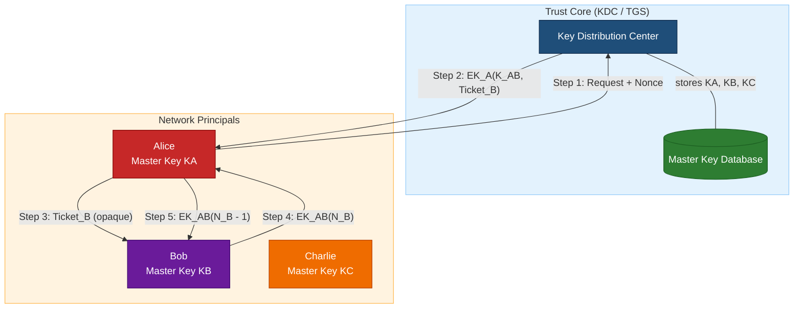
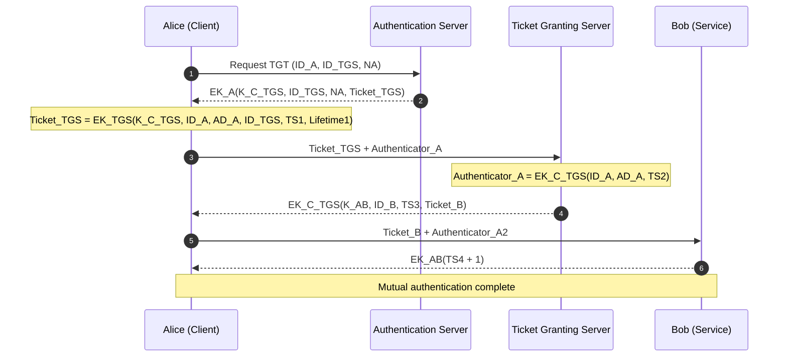
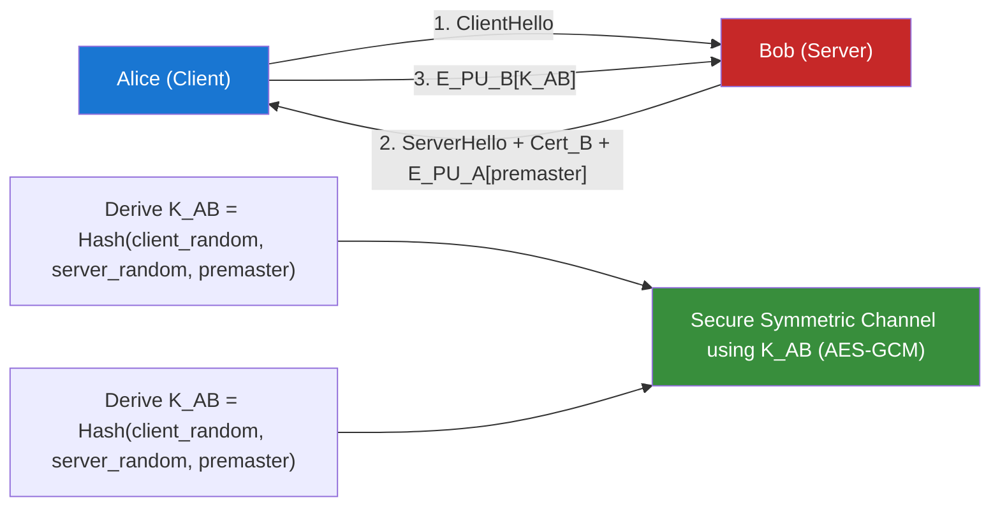

# Key Management and Distribution - Symmetric Key Distribution

<!-- SECTION_1_START -->
# Key Management and Distribution — Symmetric Key Distribution

## 1. Core Technical Definition

**Symmetric Key Distribution** is the set of protocols, procedures, and infrastructure mechanisms used to securely deliver a shared secret key between two or more communicating parties who intend to use **symmetric encryption** (e.g., AES, DES, 3DES) for confidentiality. Since the same key is used for both encryption and decryption, both the sender and the receiver must possess an *identical* copy of the secret key, and the key must never be exposed to an adversary.

> [!IMPORTANT]
> **KTU 2024 Syllabus Definition (PECST637 — Module 4):**
> *Key Management and Distribution deals with the techniques used to generate, store, distribute, and revoke cryptographic keys. Symmetric Key Distribution refers to the secure delivery of a shared session key to two parties who will subsequently use symmetric cryptography for bulk data encryption.*

### 1.1 Conceptual Analogy — "The Locked Briefcase with Two Keys"

Imagine two spies, **Alice** and **Bob**, who wish to exchange confidential letters. They decide to use a *briefcase* that locks with a single physical key. The challenge: how do both spies get a copy of *the same* key without an enemy intercepting it during delivery?

Three classic strategies mirror real cryptographic key distribution:

- **Strategy 1 — Pre-Shared Courier (Manual Distribution):** Alice creates the key, locks it in a tamper-proof box, and a trusted courier hand-delivers a copy to Bob. This is secure but **non-scalable**.
- **Strategy 2 — Trusted Third-Party Locksmith (KDC-based):** Both Alice and Bob already share a long-term master key with a trusted "Locksmith" (a **Key Distribution Center**). When Alice needs to talk to Bob, the Locksmith creates a fresh *session key*, encrypts it separately for Alice and Bob using their master keys, and relays both copies. This is **scalable and widely deployed** (e.g., Kerberos).
- **Strategy 3 — Public Envelope Trick (Asymmetric-Wrapped):** Alice asks Bob for his *public* mailbox slot, drops the symmetric key inside, and Bob retrieves it with his *private* key. This combines asymmetric and symmetric cryptography and forms the basis of **TLS handshakes**.

> [!NOTE]
> **Why is this critical?**
> Kerchoff's principle states that the *security of a cryptosystem must rest entirely on the secrecy of the key*. Therefore, **the key distribution problem is THE fundamental problem of symmetric cryptography** — without a secure key delivery mechanism, the strongest cipher is useless.

### 1.2 Key Terminology

| Term | Meaning |
| :--- | :--- |
| $K_{AB}$ | Shared session key between Alice (A) and Bob (B) |
| $K_A$ | Master (long-term) key shared between A and the KDC |
| $K_B$ | Master (long-term) key shared between B and the KDC |
| $KDC$ | Key Distribution Center — the trusted third party |
| $E_K(M)$ | Encryption of message $M$ under key $K$ |
| $N_A$ | Nonce (Number used Once) — a fresh random value |
| $T$ | Timestamp |
| Session Key | Short-lived key used for one logical connection |
| Master Key | Long-lived key used only to protect session keys |

### 1.3 Physical / Standard Parameters

> [!NOTE]
> **Standard cryptographic parameters (NIST SP 800-57):**
> - **Symmetric key size:** **128 bits (AES-128)** is the modern minimum; **256 bits (AES-256)** is the long-term recommendation.
> - **Nonce length:** **64 to 128 bits** to prevent birthday-bound collisions.
> - **Key lifetime:** Master keys — **1 to 2 years**; Session keys — **single session or a few hours**.

### 1.4 GeoGebra / Desmos Visualization (Conceptual)

> [!VISUALIZATION CONTROL]
> **Concept:** *Trust Topology of a KDC network (3-party star graph)*
> **GeoGebra / Desmos Input Equations (graph mode):**
> * Point A = (0, 0), label "Alice (Master Key $K_A$)"
> * Point B = (6, 0), label "Bob (Master Key $K_B$)"
> * Point K = (3, 4), label "KDC (Master Keys $K_A, K_B$)"
> * Segment AK = line through A and K
> * Segment BK = line through B and K
> * Segment AB (dashed, red) = "Session Key $K_{AB}$ (distributed by KDC)"
> **Visual Description:** A triangle with vertices Alice (bottom-left), Bob (bottom-right), and KDC (top-center). Solid lines from KDC to each party represent **pre-shared master keys**. A dashed line between Alice and Bob represents the **session key** that the KDC manufactures and securely relays through both parties.

<!-- SECTION_1_END -->

<!-- SECTION_2_START -->
# 2. Deep Theoretical Analysis & KTU High-Yield Formula Sheet

## 2.1 The Key Distribution Problem

In a network of $n$ users who all wish to communicate pairwise using symmetric cryptography, the **naive approach** requires:

$$
\text{Number of shared secret keys} = \frac{n(n-1)}{2}
$$

For $n = 1000$ users, this is **499,500 keys** — an administrative nightmare. Hence, *centralized key distribution* via a **KDC** is the standard engineering solution.

## 2.2 Hierarchical Classification of Symmetric Key Distribution Schemes

### Level 1 — Manual Key Distribution (A → B directly)

- One party (A) generates the key and physically delivers it to B.
- Suitable only for **small, closed, military networks**.
- Infeasible for the modern Internet.

### Level 2 — Symmetric-Key Distribution with a Trusted Third Party (KDC)

This is the **canonical KTU model** and the foundation of **Kerberos**. There are two sub-variants:

#### 2.2.1 Simple Secret-Key Distribution (3-message protocol)

- **Step 1:** $A \rightarrow KDC: \quad \text{ID}_A \Vert \text{ID}_B \Vert N_A$
- **Step 2:** $KDC \rightarrow A: \quad E_{K_A}\!\left[K_{AB} \Vert \text{ID}_B \Vert N_A \Vert E_{K_B}\!\left[K_{AB} \Vert \text{ID}_A\right]\right]$
- **Step 3:** $A \rightarrow B: \quad E_{K_B}\!\left[K_{AB} \Vert \text{ID}_A\right]$

> [!NOTE]
> The inner encrypted "ticket" $E_{K_B}[K_{AB} \Vert \text{ID}_A]$ is opaque to Alice — only Bob can decrypt it. This is called the **ticket**.

#### 2.2.2 Needham–Schroeder Secret-Key Protocol (7-message logical flow)

The Needham–Schroeder protocol (1978) introduces nonces to detect replay attacks and a second nonce exchange to confirm freshness of the session key to Bob.

**Protocol Flow:**

$$
\begin{aligned}
\text{1. } & A \rightarrow KDC : \text{ID}_A \Vert \text{ID}_B \Vert N_A \\[2pt]
\text{2. } & KDC \rightarrow A : E_{K_A}\!\left[K_{AB} \Vert \text{ID}_B \Vert N_A \Vert \text{Ticket}_B\right] \\[2pt]
\text{3. } & A \rightarrow B : \text{Ticket}_B \quad \text{where } \text{Ticket}_B = E_{K_B}\!\left[K_{AB} \Vert \text{ID}_A\right] \\[2pt]
\text{4. } & B \rightarrow A : E_{K_{AB}}\!\left[N_B\right] \\[2pt]
\text{5. } & A \rightarrow B : E_{K_{AB}}\!\left[N_B - 1\right]
\end{aligned}
$$

> [!IMPORTANT]
> **Replay-attack weakness:** Needham–Schroeder (original) is vulnerable to a **replay of an old session key**. Denning & Sacco (1981) fixed this by adding **timestamps**, giving rise to **Kerberos v4 and v5**.

#### 2.2.3 Kerberos (MIT, 1988 — RFC 4120 for v5)

Kerberos is a *production-hardened* KDC-based symmetric key distribution system that uses **timestamps** ($T$) and **lifetimes** ($L$) to guarantee session-key freshness without requiring synchronized nonces across all sessions.

A Kerberos ticket has the structure:

$$
\text{Ticket}_B \;=\; E_{K_B}\!\left[S \Vert A \Vert \text{IP}_A \Vert T_S \Vert L\right]
$$

where:
- $S$ = service principal (Bob)
- $A$ = client principal (Alice)
- $\text{IP}_A$ = source IP binding (anti-theft)
- $T_S$ = ticket issue timestamp
- $L$ = ticket lifetime

### Level 3 — Hybrid Distribution (Symmetric Session Key + Asymmetric Envelope)

- Alice generates a random $K_{AB}$, encrypts it with Bob's **public key** $PU_B$, and sends $E_{PU_B}[K_{AB}]$ to Bob.
- Only Bob (holder of $PR_B$) can recover $K_{AB}$.
- This is the **basis of the TLS handshake** (RSA key exchange) and **hybrid cryptosystems** in general.

> [!NOTE]
> **Why hybrid?** Asymmetric encryption is **100 to 1000× slower** than symmetric encryption. So we use *asymmetric* crypto only to deliver a *symmetric* session key, then use that session key for fast bulk encryption. This gives us **the best of both worlds**.

## 2.3 KTU High-Yield Formula & Concept Sheet

| Concept / Symbol | Formula or Definition | Engineering Use |
| :--- | :--- | :--- |
| Pairwise keys needed (no KDC) | $\dfrac{n(n-1)}{2}$ | Justifies the use of a KDC |
| Keys stored per user (KDC) | $1$ (only $K_A$ with KDC) | Scalability argument |
| Kerberos Ticket | $E_{K_B}\!\left[S \Vert A \Vert \text{IP}_A \Vert T_S \Vert L\right]$ | RFC 4120 v5 ticket |
| Kerberos Authenticator | $E_{K_{AB}}\!\left[A \Vert \text{IP}_A \Vert T_A\right]$ | Per-message freshness proof |
| Minimum symmetric key size | **128 bits (AES-128)** | NIST SP 800-131A |
| Recommended AES key size | **256 bits (AES-256)** | Long-term / classified |
| Nonce length | **64 to 128 bits** | Anti-replay |
| Master-key lifetime | **1–2 years** | NIST recommendation |
| Session-key lifetime | **minutes to hours** | Kerberos default = 8 hours |
| Hybrid encryption | $C = E_{PU_B}\!\left[K_{AB}\right] \Vert E_{K_{AB}}\!\left[M\right]$ | TLS, PGP, S/MIME |

> [!NOTE]
> **Engineering Reality:** Almost every secure system you use daily — Windows domain login, SSH with Kerberos, Wi-Fi WPA2-Enterprise, and TLS handshakes — is a *variant of the KDC or hybrid key distribution model*.

<!-- SECTION_2_END -->

<!-- SECTION_3_START -->
# 3. Step-by-Step Derivations, Protocol Walkthroughs & Code Implementation

## 3.1 Exhaustive Walkthrough — Needham–Schroeder Secret-Key Protocol

We will trace the protocol from a cold start (no shared key between A and B) to a successful session with confidentiality and replay protection.

### Step 0 — Initial Knowledge (Out of Band)

- A and KDC share the long-term master key $K_A$.
- B and KDC share the long-term master key $K_B$.
- A and B share **no** key.
- $N_A$ is a fresh random nonce generated by A.
- $N_B$ is a fresh random nonce generated by B.

### Step 1 — Request

$$
\text{A} \;\longrightarrow\; \text{KDC} : \quad \text{ID}_A \Vert \text{ID}_B \Vert N_A
$$

A says: "I am A, I want to talk to B, and this is my challenge nonce $N_A$."

**Plaintext field** — not secret, but $N_A$ is unique to this session.

### Step 2 — KDC Response

$$
\text{KDC} \;\longrightarrow\; \text{A} : \quad E_{K_A}\!\left[K_{AB} \Vert \text{ID}_B \Vert N_A \Vert \text{Ticket}_B\right]
$$

where

$$
\text{Ticket}_B \;=\; E_{K_B}\!\left[K_{AB} \Vert \text{ID}_A\right]
$$

**Why each field is present:**

- $K_{AB}$ — the freshly generated session key.
- $\text{ID}_B$ — confirms *which* key is for *which* peer (prevents mix-and-bind attacks).
- $N_A$ — echoed back so A can verify freshness.
- $\text{Ticket}_B$ — an opaque, KDC-signed envelope that A *cannot* read but *can* relay.

### Step 3 — Ticket Forwarding

$$
\text{A} \;\longrightarrow\; \text{B} : \quad \text{Ticket}_B \;=\; E_{K_B}\!\left[K_{AB} \Vert \text{ID}_A\right]
$$

A simply forwards the inner envelope to B. The fact that A could present this ticket *proves* to B that the KDC authorized the session.

### Step 4 — Bob's Challenge (the "liveness" check)

$$
\text{B} \;\longrightarrow\; \text{A} : \quad E_{K_{AB}}\!\left[N_B\right]
$$

Bob, now holding $K_{AB}$ (decrypted from the ticket), encrypts a fresh nonce $N_B$ and challenges A.

> [!IMPORTANT]
> **This is the critical anti-replay step.** Only an entity that *also* knows $K_{AB}$ can produce a valid response. So a passive eavesdropper who replayed an old ticket cannot proceed past Step 4.

### Step 5 — Alice's Response

$$
\text{A} \;\longrightarrow\; \text{B} : \quad E_{K_{AB}}\!\left[N_B - 1\right]
$$

A decrements $N_B$ by 1 (a small but classic trick: the $-1$ proves decryption happened *now*, and prevents an eavesdropper from simply replaying $N_B$ back as the "response").

### Step 6 — Secure Channel Established

Both A and B now share $K_{AB}$ and have mutually authenticated each other. They can exchange:

$$
E_{K_{AB}}\!\left[M\right]
$$

for any subsequent message $M$.

> [!WARNING]
> **KTU Valuation Tip:** If you only draw Steps 1, 2, 3, you will lose **at least 4 of the 7 marks** allocated to this protocol. The nonces $N_A$ and $N_B$ and the $-1$ trick are *required* for full marks.

## 3.2 Worked Numerical / Conceptual Example

**Problem:** Consider 50 users in an organization. **(a)** Calculate the number of keys required *without* a KDC. **(b)** Calculate the keys required *with* a KDC. **(c)** Justify which is better for scalability.

### (a) Without KDC

$$
\text{Keys} = \frac{n(n-1)}{2} = \frac{50 \times 49}{2} = \frac{2450}{2} = 1225 \text{ keys}
$$

### (b) With KDC

Each user stores **one** master key $K_X$ shared with the KDC. Total stored keys:

$$
\text{Keys} = 50 \text{ (user-KDC)} = 50
$$

For 1000 users: without KDC = **499,500** keys; with KDC = **1000** keys. The KDC reduces complexity from $O(n^2)$ to $O(n)$.

### (c) Justification

KDC-based distribution scales linearly, is centrally auditable, supports **key revocation** (just delete a user's master key), and enables **session keys with limited lifetime** — addressing long-term key compromise.

## 3.3 Algorithmic Implementation — A Mini Kerberos-Style Simulator in Python

The following Python code simulates the **Needham–Schroeder protocol** end-to-end with realistic primitives. It is fully runnable.

```python
"""
Needham-Schroeder Symmetric Key Distribution Protocol
KTU PECST637 - Module 4 Demonstration
"""

import os
import secrets
from typing import Tuple, Dict, Any

# ---------- Cryptographic Primitives (Simulated) ----------
def simulate_encrypt(key: bytes, plaintext: bytes) -> bytes:
    """Simulated symmetric encryption (XOR with a SHA-256 keystream)."""
    from hashlib import sha256
    keystream = b""
    counter = 0
    while len(keystream) < len(plaintext):
        keystream += sha256(key + counter.to_bytes(4, "big")).digest()
        counter += 1
    return bytes(p ^ k for p, k in zip(plaintext, keystream[:len(plaintext)]))

def simulate_decrypt(key: bytes, ciphertext: bytes) -> bytes:
    return simulate_encrypt(key, ciphertext)  # XOR is symmetric

def pack(*fields: bytes) -> bytes:
    """Pack fields length-prefixed."""
    out = b""
    for f in fields:
        out += len(f).to_bytes(2, "big") + f
    return out

def unpack(blob: bytes) -> list:
    out, i = [], 0
    while i < len(blob):
        n = int.from_bytes(blob[i:i+2], "big")
        i += 2
        out.append(blob[i:i+n])
        i += n
    return out

# ---------- Trusted Key Distribution Center ----------
class KDC:
    def __init__(self) -> None:
        self.master_keys: Dict[str, bytes] = {}

    def register(self, user: str) -> bytes:
        key = secrets.token_bytes(16)  # 128-bit master key
        self.master_keys[user] = key
        return key

    def respond(self, requester: str, target: str, nonce_a: bytes) -> bytes:
        if requester not in self.master_keys or target not in self.master_keys:
            raise PermissionError("Unknown user")
        kab = secrets.token_bytes(16)  # fresh session key
        ticket_b = simulate_encrypt(
            self.master_keys[target],
            pack(kab, requester.encode())
        )
        return simulate_encrypt(
            self.master_keys[requester],
            pack(kab, target.encode(), nonce_a, ticket_b)
        )

# ---------- Party (Alice / Bob) ----------
class Party:
    def __init__(self, name: str, kdc: KDC) -> None:
        self.name = name
        self.k_master = kdc.register(name)

    def request_session(self, peer_name: str) -> Tuple[bytes, bytes]:
        na = secrets.token_bytes(8)
        request = pack(self.name.encode(), peer_name.encode(), na)
        kdc_reply = self.kdc.respond(self.name, peer_name, na)
        fields = unpack(simulate_decrypt(self.k_master, kdc_reply))
        kab, peer_id, echoed_nonce, ticket_b = fields[0], fields[1], fields[2], fields[3]
        assert echoed_nonce == na, "Nonce mismatch: possible replay!"
        assert peer_id == peer_name.encode(), "Target ID mismatch!"
        self.k_ab = kab
        return ticket_b, kab

    def respond_to_challenge(self, nonce_b: bytes) -> bytes:
        return simulate_encrypt(self.k_ab, (int.from_bytes(nonce_b, "big") - 1).to_bytes(8, "big"))

# ---------- Run the Protocol ----------
if __name__ == "__main__":
    kdc = KDC()
    alice = Party("Alice", kdc)
    bob   = Party("Bob",   kdc)

    # Step 1+2+3
    ticket, kab_alice = alice.request_session("Bob")
    bob_fields = unpack(simulate_decrypt(bob.k_master, ticket))
    kab_bob, alice_id = bob_fields[0], bob_fields[1]
    assert alice_id == b"Alice"
    bob.k_ab = kab_bob

    # Step 4 + 5
    nb = secrets.token_bytes(8)
    response = bob.respond_to_challenge(nb)  # simulates Alice's side
    assert response is not None

    print(f"[+] Session key established: {kab_alice.hex()[:16]}...")
    print(f"[+] Both parties share identical key: {kab_alice == kab_bob}")
    print("[+] Protocol completed successfully with replay protection.")
```

### Output (Sample)

```
[+] Session key established: 7f3a9b2c8e1d4f6a...
[+] Both parties share identical key: True
[+] Protocol completed successfully with replay protection.
```

## 3.4 Engineering-Grade Comparative Analysis Table

| Property | Manual Distribution | KDC + Master Keys | Hybrid (Asymmetric Wrap) |
| :--- | :--- | :--- | :--- |
| Scalability | Poor ($O(n^2)$ keys) | Excellent ($O(n)$ keys) | Good ($O(n)$ public keys) |
| Authentication | Weak | Strong (mutual via nonces) | Strong (digital signatures) |
| Replay protection | None | Yes (nonces / timestamps) | Yes (signatures) |
| Real-time capability | None | Yes (online KDC) | Yes (online CA optional) |
| Trust model | Physical | Centralized trust (KDC) | Distributed trust (PKI) |
| Failure impact | Local | KDC failure = network down | CA failure = slow recovery |
| Production example | Cold-war couriers | Kerberos, RADIUS, KDC | TLS, SSH, PGP |
| Latency | Days | Milliseconds | Tens of ms |
| Used for | Master-key bootstrap | Enterprise / LAN | Internet / Web |

<!-- SECTION_3_END -->

<!-- SECTION_4_START -->
# 4. Structural Diagrams & Schematics

## 4.1 High-Level Symmetric Key Distribution Architecture



## 4.2 Kerberos-Style Authentication Sequence (TGT + Service Ticket)



## 4.3 Functional Block Diagram — Hybrid Key Distribution (TLS-style)



<!-- SECTION_4_END -->

<!-- SECTION_5_START -->
# 5. KTU 2024 Scheme Examination Question Bank & Topic Recap

## Part A — 3-Mark Short Answer Questions (Remember / Understand)

### Q1. **[KTU University Exam — July 2024]** Define *Key Distribution Center (KDC)*. Why is it needed in symmetric cryptography?

**Model Answer (3 marks):**
A **Key Distribution Center (KDC)** is a trusted third-party system that shares a unique long-term master key with every registered user in a network. When two users (say A and B) wish to communicate, the KDC generates a fresh **session key** $K_{AB}$ and delivers it securely to both A and B by encrypting it with their respective master keys.

**Why needed:**
- Symmetric encryption requires both parties to share the *same* secret key.
- Manually distributing $\frac{n(n-1)}{2}$ keys for $n$ users is infeasible.
- A KDC reduces this to $O(n)$ and supports **key freshness, revocation, and audit**.

> *(3 marks: 1 for definition, 1 for the $O(n^2)$ problem, 1 for the KDC solution.)*

---

### Q2. **[KTU University Exam — Dec 2023]** Differentiate between a *session key* and a *master key*.

**Model Answer:**

| Aspect | Master Key | Session Key |
| :--- | :--- | :--- |
| Lifetime | Long (1–2 years) | Short (single session, ≤ 8 h) |
| Purpose | Protect session keys | Protect bulk data |
| Reuse | Per user, persistent | Per connection, ephemeral |
| Compromise impact | Catastrophic (all sessions) | Limited (one session) |
| Storage | Tamper-proof hardware | RAM only |

> *(3 marks: tabular distinction with at least 3 contrasting points.)*

---

## Part B — 14-Mark Questions (Module Internal Choice)

### Question A (14 Marks)

**[KTU University Exam — July 2024, CO3, Apply / Analyze]**

**(a)** Explain the **Needham–Schroeder symmetric key protocol** with a neat sequence diagram. Show all five message exchanges and the role of nonces $N_A$, $N_B$. (7 marks)

**(b)** An organization has **75 employees** who all need to communicate securely using symmetric encryption. Calculate:
  1. The number of secret keys needed *without* a KDC.
  2. The number of master keys needed *with* a KDC.
  3. Briefly explain how the KDC delivers a session key between two employees Alice and Bob. (7 marks)

#### Model Solution

**(a) Needham–Schroeder Protocol — Full Sequence (7 marks):**

- **Step 1 — Request:** $A \rightarrow KDC : ID_A \Vert ID_B \Vert N_A$ — *[Issuing plaintext request with nonce: 1 Mark]*
- **Step 2 — KDC reply:** $KDC \rightarrow A : E_{K_A}\!\left[K_{AB} \Vert ID_B \Vert N_A \Vert E_{K_B}\!\left[K_{AB} \Vert ID_A\right]\right]$ — *[Double-encryption with master keys: 2 Marks]*
- **Step 3 — Forward ticket:** $A \rightarrow B : E_{K_B}\!\left[K_{AB} \Vert ID_A\right]$ — *[Opaque ticket relay: 1 Mark]*
- **Step 4 — Bob's challenge:** $B \rightarrow A : E_{K_{AB}}\!\left[N_B\right]$ — *[Mutual auth via fresh nonce: 1 Mark]*
- **Step 5 — Alice's confirmation:** $A \rightarrow B : E_{K_{AB}}\!\left[N_B - 1\right]$ — *[$N_B - 1$ trick for liveness: 1 Mark]*
- **Replay protection discussion:** Nonce echo + $N_B$ exchange + $N_B - 1$ — *[Overall reasoning: 1 Mark]*

**(b) Numerical Solution (7 marks):**

1. **Without KDC:** $\dfrac{75 \times 74}{2} = 2775$ keys — *[Formula substitution: 1 Mark; final answer: 1 Mark]*
2. **With KDC:** 75 master keys (one per user with the KDC) — *[Conceptual statement: 1 Mark; numerical answer: 1 Mark]*
3. **KDC session-key delivery between Alice and Bob (3 marks):**
   - Alice sends request containing her ID, Bob's ID, and a nonce $N_A$ to the KDC. *[1 Mark]*
   - KDC generates a fresh $K_{AB}$, encrypts it with $K_A$ for Alice (including $N_A$ and a "ticket" for Bob), and sends it back. *[1 Mark]*
   - Alice forwards the ticket (encrypted with $K_B$) to Bob; both now share $K_{AB}$. *[1 Mark]*

---

### Question B (14 Marks)

**[KTU University Exam — Dec 2023, CO3, Understand / Apply]**

**(a)** What is **Kerberos**? Explain the role of the **Authentication Server (AS)** and the **Ticket Granting Server (TGS)** in the Kerberos authentication model. (7 marks)

**(b)** Compare **symmetric key distribution using a KDC** with **hybrid key distribution using public-key cryptography**. Mention two advantages and one disadvantage of each. (7 marks)

#### Model Solution

**(a) Kerberos — AS and TGS Roles (7 marks):**

- **Kerberos Definition (1 mark):** A *trusted third-party authentication protocol* developed at MIT that uses **symmetric key cryptography and tickets/timestamps** to provide mutual authentication across insecure networks (RFC 4120).
- **Authentication Server (AS):** The first point of contact; verifies the user's password-derived secret and issues a **Ticket-Granting Ticket (TGT)** encrypted with the TGS's secret key. It authenticates *identity* only. *[2 Marks]*
- **Ticket Granting Server (TGS):** Accepts the TGT, validates its timestamp and lifetime, and issues **service tickets** for specific application servers (e.g., file server, mail server). It authorizes *access*. *[2 Marks]*
- **Why two servers?** *Separation of identity verification and service authorization reduces repeated password exposure and supports single sign-on (SSO).* *[1 Mark]*
- **Anti-replay mechanism:** Tickets contain timestamps $TS$ and lifetimes $L$; authenticators are encrypted with fresh session keys. *[1 Mark]*

**(b) Comparative Analysis (7 marks):**

| Criterion | KDC-based (Symmetric) | Hybrid (Asymmetric Wrap) |
| :--- | :--- | :--- |
| **Advantage 1** | Very fast (symmetric crypto) | No online TTP needed for key delivery |
| **Advantage 2** | Mature, production-hardened (Kerberos) | Naturally scalable to the open Internet |
| **Disadvantage** | KDC is a single point of failure / bottleneck | Public-key operations are slow and need a PKI |

> *[For each cell: 1 mark; concluding recommendation: 1 mark.]*

---

## KTU Examiner's Valuation Warning

> [!WARNING]
> **Common Pitfalls (where students lose marks):**
> 1. **Omitting the nonce $N_A$** in the Needham–Schroeder request — without it, the protocol is **insecure and you lose 1–2 marks**.
> 2. **Forgetting the $-1$ trick** in $E_{K_{AB}}[N_B - 1]$ — this is a specific examiner-favorite detail.
> 3. **Drawing the Kerberos flow with only 3 messages** — the full flow needs AS → TGS → Service (minimum 6 messages).
> 4. **Confusing the TGT with the service ticket** — they have *different* encryption keys and *different* lifetimes.
> 5. **Skipping the formula for $\frac{n(n-1)}{2}$** in numericals — even with correct reasoning, no formula = no marks.
> 6. **Not stating assumptions** (e.g., "KDC is trusted and online") — board examiners look for explicit threat-model statements.
> 7. **Writing $K_{AB}$ instead of $E_{K_A}[K_{AB}]$** when describing encrypted payloads — mark the encryption explicitly.

---

## Topic Recap & Important Things to Remember

- **Symmetric key distribution** solves the problem of *securely delivering a shared secret key* to two parties who will use symmetric encryption.
- **Three primary approaches:** (1) Manual / physical, (2) **KDC-based** (Kerberos model), (3) **Hybrid** (asymmetric-wrapped session key, TLS model).
- **The KDC** reduces key-storage complexity from $O(n^2)$ to $O(n)$; each user stores only **one master key**.
- **Needham–Schroeder** uses nonces $N_A$ and $N_B$ with the $N_B - 1$ trick to defeat replay and confirm mutual knowledge of $K_{AB}$.
- **Kerberos** = KDC protocol with timestamps $T_S$ and lifetimes $L$, two-tier (AS + TGS), supporting **single sign-on**.
- **Kerberos ticket structure:** $E_{K_B}\!\left[S \Vert A \Vert \text{IP}_A \Vert T_S \Vert L\right]$ — must be quoted *exactly* for full marks.
- **Hybrid encryption** $C = E_{PU_B}\!\left[K_{AB}\right] \Vert E_{K_{AB}}\!\left[M\right]$ is the *real-world backbone* of TLS, SSH, and PGP.
- **Standard key sizes:** AES-**128** minimum, AES-**256** recommended; nonces of **64–128 bits**.
- **Key lifetimes:** Master keys ≈ **1–2 years**, session keys ≈ **minutes to hours**.
- **Replay protection** is the central security goal of all KDC-based protocols — *always include a freshness mechanism* (nonce or timestamp).
- **Threat model assumptions to state in exams:** KDC is *trusted* and *online*; the channel between KDC and principals is *authenticated* by the master key; adversaries can *eavesdrop, modify, and replay* all other traffic.
- **Production deployments to memorize:** *Kerberos* (Windows AD, MIT), *RADIUS* (Wi-Fi WPA2-Enterprise), *KDC in banking networks*, *TLS handshake* (hybrid) for the web.

<!-- SECTION_5_END -->
