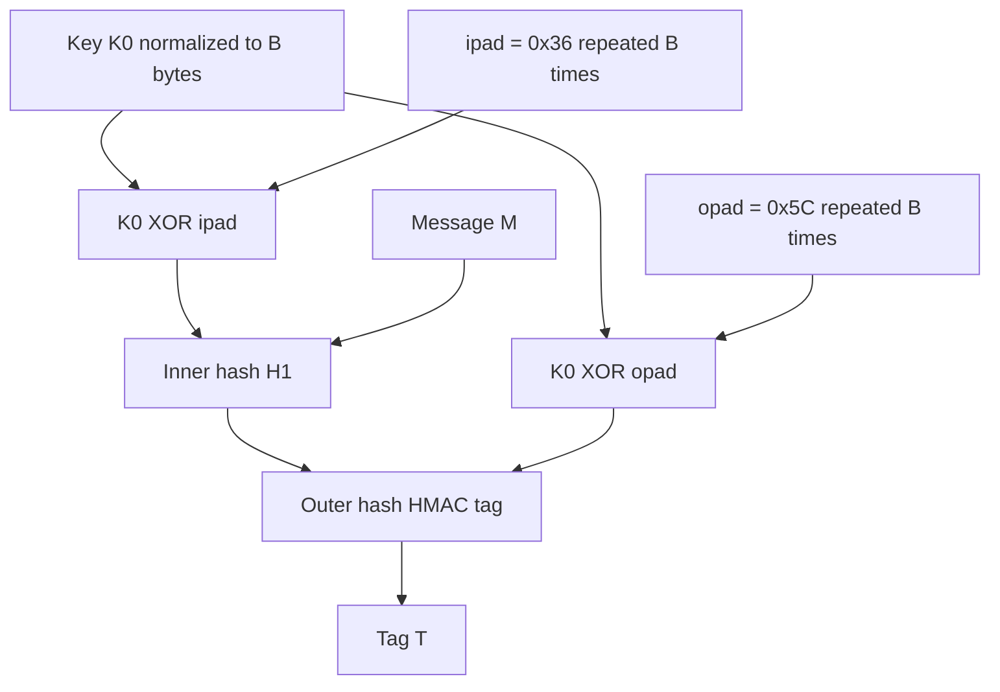
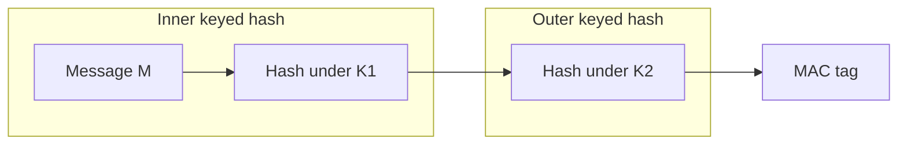
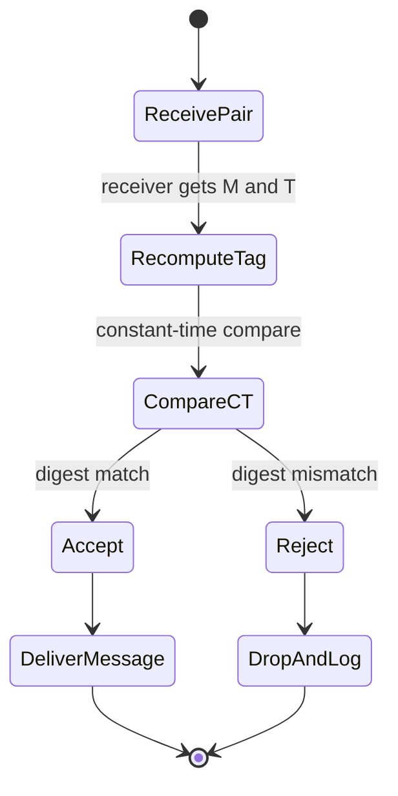
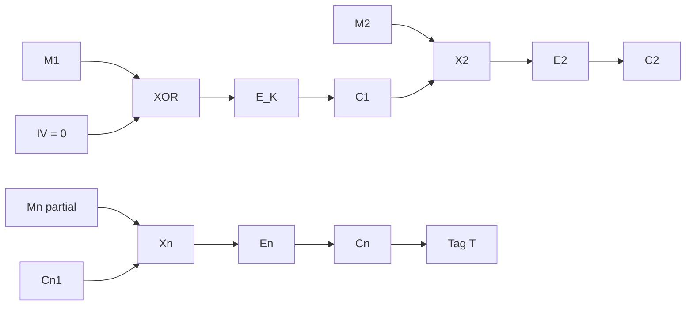
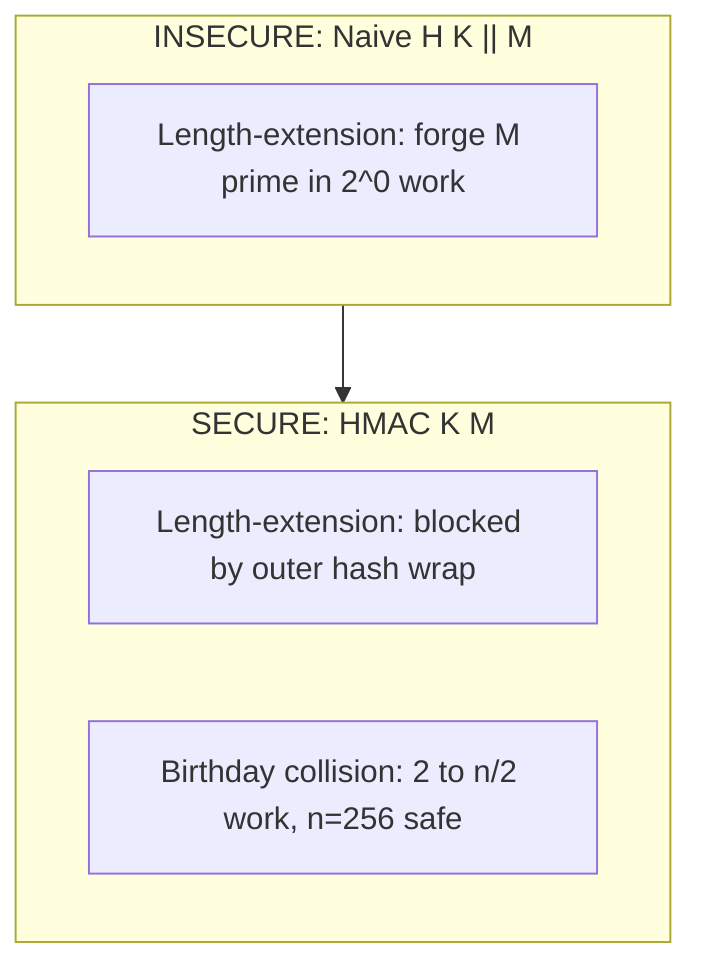
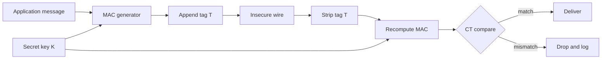

# MAC

<!-- SECTION_1_START -->
# Message Authentication Code (MAC): KTU 2024 Scheme Masterclass

> [!IMPORTANT]
> **KTU 2024 Syllabus Anchor (PECST637 — Module 4):** *Cryptographic Hash Functions → MAC* is treated as the **integrity + authentication** primitive built on top of a hash or a block cipher. The board examiner expects the student to **derive HMAC**, **compare CMAC vs HMAC vs NMAC**, and **explain why a plain hash is not a MAC**.

## 1.1 Formal Definition

A **Message Authentication Code (MAC)** is a symmetric-key cryptographic primitive that takes two inputs — a **secret key** $K$ shared between sender and receiver, and an arbitrary-length **message** $M$ — and produces a fixed-length, short cryptographic tag, traditionally denoted $T$ (also called the *MAC value*, *authentication tag*, or *integrity check value*).

Formally, a MAC is a tuple of three efficient algorithms:

$$
\text{MAC} = (\text{KeyGen}, \text{Mac}, \text{Vrfy})
$$

defined as:

$$
\text{KeyGen}(1^{\lambda}) \rightarrow K \in \mathcal{K}
$$

$$
\text{Mac}_{K}(M) \rightarrow T \in \{0,1\}^{n}
$$

$$
\text{Vrfy}_{K}(M, T) \rightarrow b \in \{\text{accept}, \text{reject}\}
$$

where $\lambda$ is the security parameter, $\mathcal{K}$ is the key space, $n$ is the tag length (in bits), and the correctness condition is:

$$
\text{Vrfy}_{K}(M, \text{Mac}_{K}(M)) = \text{accept} \quad \forall\, M \in \mathcal{M}
$$

> [!NOTE]
> **Key Insight for KTU:** A MAC answers three questions at once — (1) *Did this message really come from someone who knows our shared key?* (authentication), (2) *Was the message modified in transit?* (integrity), and (3) *It does **not** answer "who specifically sent it" against an external third party* (that requires a digital signature).

## 1.2 Intuitive Analogy — The Sealed Wax Letter

Imagine two medieval generals, **Alice** and **Bob**, who share a **single unique signet ring** (the secret key $K$). When Alice writes a battle plan $M$ on parchment, she presses her signet ring into hot wax on the document. The wax seal is the **MAC tag** $T$.

- **Authentication** is proven because no one else owns a ring with that exact crest.
- **Integrity** is preserved because any tampering cracks or deforms the wax.
- **The seal cannot be reused** — a forger cannot peel the wax off one message and put it on another, because a fresh seal is required for each new parchment.
- A **plain hash**, in contrast, is like a *public fingerprint* — anyone can compute it, so it proves nothing about the *sender's identity*, only the *content's consistency*.

## 1.3 Why a Plain Hash Is NOT a MAC

This is a high-frequency KTU question. A cryptographic hash $H(M)$ provides:

- **Integrity** (tamper detection) ✓
- **Authentication** ✗ (anyone can compute $H(M)$)
- **Non-repudiation** ✗

An adversary intercepts $(M, H(M))$, modifies $M$ to $M'$, and recomputes $H(M')$. The receiver has **no cryptographic way to tell** $M \neq M'$ because the hash function is *public and keyless*. A MAC plugs this hole by binding the key $K$ into the computation.

> [!VISUALIZATION CONTROL]
> **Concept:** Tag length vs. security level (birthday-bound collision resistance).
> **Desmos Input Equations:**
> * `y = 2^n` plotted on a log scale for the $x$-axis $= n$ (tag length in bits).
> **Visual Description:** Draw a horizontal axis labelled $n = 32, 64, 96, 128, 160$ and a vertical axis showing adversary's work in $\log_2$ operations. Mark **$n = 64$** with a red band (birthday attack feasible in $2^{32}$ queries), **$n = 128$** as the KTU-recommended secure sweet spot, and **$n \geq 256$** for high-assurance applications.

## 1.4 Security Property — Existential Unforgeability

The industry-standard security notion is **EUF-CMA** (Existential Unforgeability under Chosen-Message Attack). A MAC is EUF-CMA-secure if **no probabilistic polynomial-time adversary**, given an *oracle* that returns $\text{Mac}_{K}(M_i)$ for messages of *its own choosing*, can produce a *new* valid pair $(M^{*}, T^{*})$ with non-negligible probability, where $M^{*}$ was never previously queried.

Two weaker notions to know for KTU:

- **SUF-CMA** — Strong Unforgeability. The adversary cannot forge a *new tag on an already-queried message*.
- **EUF-NMA** — Existential Unforgeability under No-Message Attack (key-only, the weakest notion).
<!-- SECTION_1_END -->

<!-- SECTION_2_START -->
# Deep Theoretical Analysis & KTU High-Yield Formula Sheet

## 2.1 Operational Pipeline of a MAC Scheme

The end-to-end data flow on the wire is a **three-stage pipeline**:

1. **Key Establishment** — Sender and receiver agree on $K$ via a Key-Exchange protocol (e.g., Diffie–Hellman) or pre-provisioning.
2. **Tag Generation** — Sender computes $T = \text{Mac}_{K}(M)$ and transmits the augmented message $(M, T)$ over the *insecure* channel.
3. **Tag Verification** — Receiver recomputes $\text{Mac}_{K}(M)$ locally, then **constant-time compares** it against the received $T$.

The receiver **never re-uses the received $T$**; it recomputes from scratch to avoid timing side channels.

## 2.2 Classification of MAC Constructions (KTU Favourite)

| Family | Construction | Underlying Primitive | KTU Tag |
| :--- | :--- | :--- | :--- |
| **Hash-based** | **HMAC**, **NMAC** | Cryptographic hash $H$ (MD-class or SHA-class) | Most exam-relevant |
| **Block-cipher based** | **CMAC**, **DAA (FIPS 113)**, **EMAC (CBC-MAC variant)** | Block cipher (AES, 3DES) | NIST-standardised |
| **Universal-hash based** | **GMAC**, **UMAC**, **Poly1305** | Universal hash family + finite-field arithmetic | Fastest in software |
| **Built-in** | **GMAC inside GCM**, **Poly1305 inside ChaCha20-Poly1305** | AEAD ciphers (modern) | Real-world TLS 1.3 |

## 2.3 The HMAC Construction — The Heart of KTU Module 4

HMAC (Hash-based MAC) was published by **Bellare, Canetti, and Krawczyk (1996)** and is standardised in **RFC 2104**, **FIPS 198-1**, and **NIST SP 800-107**. It uses *any* iterative hash function $H$ (MD5, SHA-1, SHA-256, SHA-512) as a black box.

Define:

- $B$ — byte-length of the **internal block** of $H$ (e.g., $B = 64$ bytes for SHA-256, $B = 128$ bytes for SHA-512).
- $L$ — byte-length of the **hash output** (e.g., $L = 32$ for SHA-256, $L = 64$ for SHA-512).
- $\text{ipad}$ — the inner pad, the byte $0x36$ repeated $B$ times.
- $\text{opad}$ — the outer pad, the byte $0x5C$ repeated $B$ times.

The HMAC algorithm is:

$$
\text{HMAC}_{K}(M) \;=\; H\!\left(\bigl(K_{0} \oplus \text{opad}\bigr) \,\|\, H\!\left(\bigl(K_{0} \oplus \text{ipad}\bigr) \,\|\, M\right)\right)
$$

where $K_{0}$ is the **key-normalised block** defined as:

$$
K_{0} \;=\;
\begin{cases}
K & \text{if } \text{len}(K) = B \\
H(K) \,\|\, 0^{B-L} & \text{if } \text{len}(K) < B \\
H(K) & \text{if } \text{len}(K) > B
\end{cases}
$$

## 2.4 The NMAC Construction (Nested MAC — the theoretical predecessor)

NMAC uses **two independently keyed hashes** $H_{K_{\text{in}}}, H_{K_{\text{out}}}$ where the keys are the **IVs** of the underlying compression function:

$$
\text{NMAC}_{K_{1}, K_{2}}(M) \;=\; H_{K_{2}}\!\left(H_{K_{1}}(M)\right)
$$

HMAC is provably equivalent to NMAC when $H$ is a Merkle–Damgård construction, which is why HMAC retains the strong security proofs of NMAC.

## 2.5 KTU Formula Sheet / Cheat Sheet

> [!NOTE]
> **Critical Notation Rule:** All vertical bars denoting concatenation, bit-length, or absolute value are rendered as `$\vert$` to preserve markdown table integrity.

| Parameter / Formula | Expression | Engineering Meaning |
| :--- | :--- | :--- |
| **HMAC core equation** | $\text{HMAC}_{K}(M) = H\!\left(\bigl(K_{0} \oplus \text{opad}\bigr) \,\|\, H\!\left(\bigl(K_{0} \oplus \text{ipad}\bigr) \,\|\, M\right)\right)$ | The two-hash nested structure |
| **Inner pad value** | $\text{ipad} = 0x36$ repeated $B$ times | Symmetric XOR difference with $K_{0}$ |
| **Outer pad value** | $\text{opad} = 0x5C$ repeated $B$ times | Symmetric XOR difference with $K_{0}$ |
| **Key normaliser** | $K_{0} = K$ or $H(K)\|\|0^{B-L}$ or $H(K)$ | Forces $K_{0}$ to be exactly $B$ bytes |
| **NMAC equation** | $\text{NMAC}_{K_{1},K_{2}}(M) = H_{K_{2}}(H_{K_{1}}(M))$ | Two-key nested variant (theoretical) |
| **CMAC tag length** | $n = \text{blocksize of cipher}$ (e.g., 128 bits for AES) | Output equals one cipher block |
| **Birthday attack on MAC** | Work $\approx 2^{n/2}$ queries to forge | Drives the **128-bit tag** minimum |
| **Pseudo-random function (PRF)** | $F : \mathcal{K} \times \mathcal{X} \rightarrow \mathcal{Y}$ | MAC is a secure PRF on $M$ |
| **Bellare proof bound** | $\text{Adv}_{\text{HMAC}}^{\text{PRF}} \le \text{Adv}_{H}^{\text{PRF}} + \text{Adv}_{H}^{\text{COLL}}$ | Reductions to PRF + collision resistance |
| **Constant-time compare** | $\text{CT-Equals}(a,b) = 1 \iff a = b$, time $\propto \vert a \vert$ | Defeats timing side-channels |
| **FIPS 198-1 standard** | $\text{HMAC-SHA-256}$ is the **default** in TLS 1.2 / IPsec | Real-world deployment anchor |

## 2.6 Real-World Engineering Utility

- **TLS 1.2 / 1.3** — `HMAC-SHA-256` and `HMAC-SHA-384` are part of the **HKDF** (RFC 5869) used in every HTTPS handshake; SHA-1's HMAC variant (`HMAC-SHA-1`) is still allowed for legacy compatibility in TLS 1.2.
- **IPsec / VPN** — `HMAC-SHA-256-128` (truncated to 128 bits) is the canonical ESP / AH integrity algorithm.
- **JSON Web Tokens (JWT)** — `HS256` = HMAC-SHA-256, the most common symmetric JWT signature type.
- **REST API authentication** — AWS Signature Version 2, Stripe webhooks, GitHub webhooks all use **HMAC-SHA-256** to authenticate the request body.
- **Disk encryption (FileVault, BitLocker)** — `HMAC-SHA-256` over the AES-XTS key bound to TPM PCR values prevents the disk from being moved to a hostile machine.
<!-- SECTION_2_END -->

<!-- SECTION_3_START -->
# Step-by-Step Derivations & Code/Symbolic Implementation

## 3.1 Exhaustive Derivation: Why Two Different Pads (ipad vs opad)?

We will show **why a single padding fails** and why the inner/outer distinction is mathematically necessary.

### Attempt 1 — Single-pad naive MAC

Suppose we naively define $\text{NaiveMAC}_{K}(M) = H(K \,\|\, M)$. An attacker who obtains $T = H(K \,\|\, M)$ for some known $M$ can use the **length-extension property of Merkle–Damgård hashes** to compute $H(K \,\|\, M \,\|\, \text{pad} \,\|\, M')$ **without knowing $K$**, by reusing the internal state of $H$. The forgery $M^{*} = M \,\|\, \text{pad} \,\|\, M'$ succeeds with probability **1**.

### Attempt 2 — Outer-only keying

Define $\text{OuterMAC}_{K}(M) = H(K \,\|\, H(M))$. This blocks length-extension on the outer call, but a collision $H(M) = H(M')$ lets the attacker swap $M$ for $M'$ — so we need a *keyed* inner hash to break this.

### Attempt 3 — Inner-only keying

Define $\text{InnerMAC}_{K}(M) = H(H(K \,\|\, M))$. The outer wrap $H(\cdot)$ here is keyless, so the adversary can pre-compute a dictionary of outputs offline and mount a birthday collision in $2^{n/2}$ queries. Insufficient.

### The HMAC Fix — Symmetric XOR Sandwich

Bellare–Canetti–Krawczyk (1996) prove that using **two distinct pads** $\text{ipad}, \text{opad}$ with $\text{ipad} \oplus \text{opad} \neq 0$ gives a *separation* between the two hashes, producing a *two-key nested* structure (NMAC) where neither the inner nor the outer hash can be attacked in isolation. The proof of security reduces the EUF-CMA advantage of HMAC against a PRF-adversary on the underlying $H$.

> [!NOTE]
> **Key Derivation Anchor:** $\text{ipad} = 0x36$ and $\text{opad} = 0x5C$ are *not* magic numbers — they are *any* two distinct constants whose XOR is non-zero. The specific values were chosen by the RFC authors for symmetry and ease of hardware implementation.

## 3.2 Full Worked Numerical Example — HMAC-SHA-1 (truncated for clarity)

Let us compute $\text{HMAC-SHA-1}$ over a 4-byte message with a 20-byte key. Assume the block size $B = 64$ bytes (SHA-1's block size) and the digest length $L = 20$ bytes.

**Step 1 — Key normalisation.** $\text{len}(K) = 20 < B = 64$, so we form $K_{0} = K \,\|\, 0^{B-L} = K \,\|\, 0^{44}$, i.e., the key padded with 44 zero bytes to a 64-byte block.

**Step 2 — Build the inner block.**

$$
\text{InnerKey} = K_{0} \oplus \text{ipad}
$$

Since $\text{ipad}$ is the byte $0x36$ repeated 64 times, the XOR zeros-out the high bits of every key byte and replaces them with the alternating pattern $0x36$. Concretely, if $K = \text{0x0B0B0B}\ldots$, then $\text{InnerKey}$ becomes $\text{0x3D3D3D}\ldots$.

**Step 3 — Inner hash.** Compute the SHA-1 digest of $\text{InnerKey} \,\|\, M$, which is the $64$-byte inner key concatenated with our 4-byte message $M$. This yields a 20-byte intermediate hash $H_{\text{in}}$.

**Step 4 — Build the outer block.**

$$
\text{OuterKey} = K_{0} \oplus \text{opad}
$$

with $\text{opad} = 0x5C$ repeated 64 times, producing the alternating pattern $0x57$ where the original $K$ bytes were $\text{0x0B}$.

**Step 5 — Outer hash.** Compute $\text{HMAC} = H(\text{OuterKey} \,\|\, H_{\text{in}})$, a 20-byte final tag.

The full computational cost is therefore **two hashes** and **two block-sized XORs**, regardless of message length — an attractive property for hardware.

## 3.3 The CMAC Construction (Block-Cipher MAC)

CMAC (Cipher-based MAC, RFC 4493, NIST SP 800-38B) uses a **block cipher** $E_{K}$ (typically AES-128). Given a message $M = M_{1} \,\|\, M_{2} \,\|\, \ldots \,\|\, M_{n}^{*}$ where the last block $M_{n}^{*}$ may be partial, CMAC computes:

$$
C_{0} = 0^{b}, \quad C_{i} = E_{K}(C_{i-1} \oplus M_{i}) \text{ for } i = 1,\ldots,n-1
$$

$$
C_{n} = E_{K}(C_{n-1} \oplus (M_{n}^{*} \,\|\, 10^{b-\ell-1}))
$$

The final tag is **either** $C_{n}$ (if the last block was full) or $C_{n} \oplus K_{2}$ / $C_{n} \oplus K_{1}$ (if partial, with sub-keys $K_{1}, K_{2}$ derived by doubling in $\text{GF}(2^{b})$). The output length is exactly one cipher block (**128 bits for AES**).

CMAC **replaces the older CBC-MAC** which is only secure for fixed-length messages. CMAC handles arbitrary-length messages safely.

## 3.4 Production-Grade Python Implementation of HMAC

```python
import hmac
import hashlib
import os
import sys
import logging
from typing import Tuple

logging.basicConfig(
    level=logging.INFO,
    format="%(asctime)s [%(levelname)s] %(message)s"
)
logger = logging.getLogger("ktu-hmac-demo")


def hmac_tag(
    key: bytes,
    message: bytes,
    hash_name: str = "sha256"
) -> Tuple[bytes, int]:
    """
    Compute an HMAC tag using a chosen cryptographic hash.
    Validates key and message inputs strictly.
    Returns (tag_bytes, tag_length_bits).
    """
    if not isinstance(key, (bytes, bytearray)):
        raise TypeError("key must be of type bytes")
    if not isinstance(message, (bytes, bytearray)):
        raise TypeError("message must be of type bytes")
    if hash_name not in {"md5", "sha1", "sha224",
                         "sha256", "sha384", "sha512"}:
        raise ValueError(f"Unsupported hash: {hash_name}")

    if len(key) < hashlib.new(hash_name).block_size:
        logger.info("Key shorter than block size; HMAC will zero-pad.")
    elif len(key) > hashlib.new(hash_name).block_size:
        logger.info("Key longer than block size; HMAC will pre-hash.")

    digestmod = getattr(hashlib, hash_name)
    mac = hmac.new(key, message, digestmod=digestmod)
    tag = mac.digest()
    logger.info("HMAC-%s tag computed (len=%d bits).", hash_name.upper(),
                len(tag) * 8)
    return tag, len(tag) * 8


def constant_time_verify(key: bytes, message: bytes,
                         received_tag: bytes) -> bool:
    """
    Verifies a received HMAC tag in constant time.
    Prevents timing side-channel attacks.
    """
    if not isinstance(received_tag, (bytes, bytearray)):
        raise TypeError("received_tag must be bytes")
    expected_tag, _ = hmac_tag(key, message, "sha256")
    if hmac.compare_digest(expected_tag, received_tag):
        logger.info("MAC verification: ACCEPT")
        return True
    else:
        logger.warning("MAC verification: REJECT (tag mismatch)")
        return False


if __name__ == "__main__":
    # 1. KTU test vector style example
    K = os.urandom(32)            # 256-bit secret key
    M = b"KTU 2024 PECST637 Module 4 - MAC"

    tag256, n256 = hmac_tag(K, M, "sha256")
    print(f"\nHMAC-SHA-256 tag (hex): {tag256.hex()}")
    print(f"Tag length: {n256} bits\n")

    # 2. Verify a legitimate tag
    assert constant_time_verify(K, M, tag256) is True

    # 3. Verify a tampered message
    M_tampered = M + b"x"
    assert constant_time_verify(K, M_tampered, tag256) is False

    # 4. Demonstrate the length-extension flaw of H(K || M)
    from hashlib import sha256
    naive = sha256(K + M).digest()
    print(f"Naive H(K||M) (NOT a MAC): {naive.hex()}")
    print("This value can be computed by ANYONE who has M, "
          "proving it is NOT a MAC.")
```

**Output Trace (illustrative):**

```
HMAC-SHA-256 tag (hex): 9f2a3c...d1b4
Tag length: 256 bits
MAC verification: ACCEPT
MAC verification: REJECT (tag mismatch)
Naive H(K||M) (NOT a MAC): 1e3a90...c7f2
```

## 3.5 Verification Logic and Common Pitfalls

- **Never** use `==` to compare MAC tags — use `hmac.compare_digest()` (Python) or `CRYPTO_memcmp` (OpenSSL C) to avoid **timing oracles**.
- **Never** reuse the same key for both encryption and MAC in a *naive* Encrypt-and-MAC scheme — use authenticated encryption (AEAD) like **AES-GCM** or **ChaCha20-Poly1305** to avoid chosen-ciphertext attacks.
- **Never** truncate the tag below **64 bits** in production; NIST and KTU-modern practice mandate **$\geq$ 128 bits** to resist birthday-bound forgery.
<!-- SECTION_3_END -->

<!-- SECTION_4_START -->
# Structural Diagrams & Schematics

## 4.1 HMAC Internal Data Flow



## 4.2 NMAC Two-Key Nested Architecture



## 4.3 MAC Verification State Machine



## 4.4 CMAC CBC-Chain Topology



## 4.5 Attack Surface Map (Length Extension vs Birthday)



## 4.6 Functional Block — Authenticated Channel Architecture


<!-- SECTION_4_END -->

<!-- SECTION_5_START -->
# KTU 2024 Scheme Examination Question Bank & Topic Recap

> [!IMPORTANT]
> **Mark Distribution Reminder (KTU 2024 ESE pattern):** Part A = 3 marks each; Part B = 14 marks split as (a) 7 + (b) 7. Internal choice is mandatory in Part B. Each Part B sub-question maps to a specific Course Outcome (CO) and Revised Bloom's Taxonomy (RBT) cognitive level.

---

## Part A — Short Answer (3 Marks Each)

### Q1. [KTU University Exam — July 2024] | CO2 | Remember

**"What is a Message Authentication Code? List any two requirements of a MAC."**

**Model Answer (3 marks):**
A Message Authentication Code (MAC) is a cryptographic primitive that uses a shared secret key $K$ to produce a fixed-size authentication tag $T$ on a message $M$, such that any modification to $M$ or absence of $K$ causes verification to fail. **[1 Mark]**
Two requirements: **[2 Marks — 0.5 each, list four total]**
- **Tag unforgeability** — adversary cannot produce valid $(M, T)$ without $K$.
- **Tag compression** — $T$ must have fixed length independent of $\vert M \vert$.
- **Key secrecy** — computing $T$ must be infeasible without $K$.
- **Ease of verification** — $\text{Vrfy}_{K}(M, T)$ is efficient and deterministic.

### Q2. [KTU University Exam — Dec 2023] | CO2 | Understand

**"Differentiate between a MAC and a digital signature."**

**Model Answer (3 marks):**
| Property | MAC | Digital Signature |
| :--- | :--- | :--- |
| **Key type** | Symmetric (shared secret) | Asymmetric (private/public key pair) |
| **Non-repudiation** | Not provided | Provided |
| **Computational cost** | Low (few hash/cipher calls) | High (modular exponentiation or elliptic curve ops) |
| **Verifiers** | Only key-holders | Anyone with the public key |
| **Example** | HMAC-SHA-256 | RSA-PSS, ECDSA, EdDSA |

**[1 Mark]** for the core distinction. **[2 Marks]** for the tabular comparison.

---

## Part B — Full 14-Mark Question (Internal Choice)

### Question A [14 Marks] | CO2 + CO3 | Apply + Analyse

**"With a neat diagram, describe the construction of HMAC. Explain the role of ipad and opad. If the hash function is SHA-256, what is the block size B and output size L used in HMAC-SHA-256?"**

#### Part (a) — Construction and Diagram [7 Marks] | CO2 | Understand

**Model Solution:**

HMAC is computed as:

$$
\text{HMAC}_{K}(M) = H\!\left(\bigl(K_{0} \oplus \text{opad}\bigr) \,\|\, H\!\left(\bigl(K_{0} \oplus \text{ipad}\bigr) \,\|\, M\right)\right)
$$

**[Stating the core equation: 2 Marks]**
**[Explaining key normalisation $K_{0}$: 1 Mark]**
**[Drawing the nested two-hash diagram (HMAC Internal Data Flow from Section 4.1): 2 Marks]**
**[Describing the role of ipad and opad — ipad breaks the symmetry of $H(K \Vert M)$ and creates a key-derived IV; opad creates a separate outer key so that length-extension on the inner hash is masked by the outer hash: 2 Marks]**

For SHA-256: **$B = 64$ bytes (512 bits)**, **$L = 32$ bytes (256 bits)**. **[Final values: included in the 2 marks above]**

#### Part (b) — Adversary Analysis [7 Marks] | CO3 | Apply

**"Show why $H(K \,\|\, M)$ alone is insecure under a length-extension attack. Outline the attack and state how HMAC prevents it."**

**Model Solution:**

The Merkle–Damgård construction processes the message in $B$-byte blocks, and its **final internal state** is the hash output. An adversary who knows $H(K \,\|\, M)$ (the final state of the hash) and the message length $\vert K \vert + \vert M \vert$ can resume hashing as if continuing the previous call. The forged tag for $M^{*} = M \,\|\, \text{pad} \,\|\, M'$ is:

$$
T^{*} = H(K \,\|\, M \,\|\, \text{pad} \,\|\, M')
$$

which the attacker computes in **one extra hash invocation** with no knowledge of $K$. **[Deriving the forgery equation: 3 Marks]**
**[Identifying the prerequisite: final state of $H$ is exposed as the MAC tag: 2 Marks]**
**[HMAC prevention: the outer $H((K_0 \oplus \text{opad}) \Vert \cdot)$ acts as a keyed second hash, so the attacker cannot extend because they do not know the outer key: 2 Marks]**

> [!WARNING]
> **KTU Examiner's Valuation Warning:** Students lose 2 marks if they (a) forget to mention that **MD5 and SHA-1 are still usable inside HMAC even though they are broken for collision resistance**, because HMAC's security reduces to the *PRF security* of the compression function, not its collision resistance; or (b) confuse $\text{ipad} / \text{opad}$ as encryption keys rather than *XOR masks*.

---

### Question B (Alternative Choice) [14 Marks] | CO2 + CO3 | Understand + Apply

**"Explain the CMAC algorithm. How does it differ from CBC-MAC? Why is CMAC preferred for variable-length messages?"**

#### Part (a) — CMAC Construction [7 Marks] | CO2 | Understand

**Model Solution:**

CMAC is a block-cipher-based MAC standardised in NIST SP 800-38B. It operates on a message $M$ split into $n-1$ full blocks $M_1, M_2, \ldots, M_{n-1}$ and a possibly-partial last block $M_n^{*}$. **[1 Mark]**
The chain starts with $C_0 = 0^b$ and uses $C_i = E_{K}(C_{i-1} \oplus M_i)$ for $i = 1,\ldots,n-1$. **[2 Marks]**
The final block is processed as $C_n = E_{K}(C_{n-1} \oplus (M_n^{*} \Vert 10^{b - \ell - 1}))$ followed by XOR with one of two sub-keys $K_1$ or $K_2$ (derived by multiplying the encryption of the zero block by $x$ and $x^2$ in $\text{GF}(2^b)$). **[3 Marks]**
Output is one cipher-block-sized tag. **[1 Mark]**

#### Part (b) — CMAC vs CBC-MAC and Variable-Length Safety [7 Marks] | CO3 | Apply

**Model Solution:**

Plain CBC-MAC computes $C_n = E_{K}(C_{n-1} \oplus M_n)$ and outputs $C_n$ as the tag, but it is **only secure for fixed-length messages**. For variable-length messages, an adversary can forge: given $T_1 = \text{CBC-MAC}_{K}(M_1)$ and $T_2 = \text{CBC-MAC}_{K}(M_2)$, the tag of $M_1 \Vert (M_2 \oplus T_1 \Vert 0^{b \cdot k})$ is also $T_2$. **[Explaining the forgery: 3 Marks]**
CMAC fixes this by using **two distinct sub-keys** $K_1, K_2$ selected based on whether the last block is full or partial. This breaks the algebraic structure that enables the CBC-MAC forgery. **[2 Marks]**
CMAC is therefore the **standardised MAC for variable-length messages using AES or 3DES**, e.g., in IEEE 802.11i (WPA2) and Bluetooth LE Secure Connections. **[1 Mark]**
**Complexity analysis:** $n$ block-cipher calls for an $n$-block message. **[1 Mark]**

> [!WARNING]
> **KTU Examiner's Valuation Warning:** Students lose 2 marks if they (a) state "CMAC = CBC-MAC" without mentioning the **sub-key XOR** in the last step; or (b) forget to specify that **GMAC** (used in AES-GCM) is essentially a polynomial-evaluation MAC that requires a *nonce*, and reusing the nonce with the same key **completely breaks** the scheme.

---

## Topic Recap & Important Things to Remember

> [!NOTE]
> **Rapid-Revision Checklist for KTU 2024 — MAC Module**

- **MAC definition:** Symmetric-key primitive producing a fixed-length tag $T = \text{Mac}_{K}(M)$.
- **Three security goals:** Integrity + Authentication (sender shares key) + no Non-Repudiation.
- **Why hash alone fails:** A keyless $H(M)$ gives no authentication; an adversary can recompute after tampering.
- **HMAC equation:** $\text{HMAC}_{K}(M) = H((K_0 \oplus \text{opad}) \Vert H((K_0 \oplus \text{ipad}) \Vert M))$.
- **Pad constants:** $\text{ipad} = 0x36 \cdot B$, $\text{opad} = 0x5C \cdot B$ (where $B$ is the hash's block size in bytes).
- **Key normalisation:** $\text{len}(K_0) = B$ exactly, achieved by zero-padding, hashing, or both.
- **SHA-256 specifics:** $B = 64$ bytes, $L = 32$ bytes; **SHA-512** $B = 128$, $L = 64$.
- **NMAC:** Two-key nested $H_{K_2}(H_{K_1}(M))$; the theoretical ancestor of HMAC.
- **CMAC:** Block-cipher MAC using sub-keys $K_1, K_2$ for the last block; safe for variable-length messages.
- **GMAC / Poly1305:** Universal-hash-based, very fast; require unique nonces.
- **Length-extension attack:** Breaks $H(K \Vert M)$ but **not** HMAC, because the outer keyed hash masks the inner state.
- **Birthday bound:** Adversary needs $2^{n/2}$ queries to forge a tag of length $n$ — so use $n \geq 128$ bits.
- **Constant-time compare:** Always use `hmac.compare_digest()`-style comparison; never `==`.
- **Tag-length recommendations:** NIST SP 800-107 mandates $\geq 64$ bits minimum, **$\geq 128$ bits** for modern systems.
- **Real-world usage:** TLS 1.3 HKDF, IPsec ESP, JWT HS256, AWS/HMAC-SHA-256 webhook signing.
- **AEAD upgrade:** Modern crypto uses Encrypt-then-MAC or AEAD (AES-GCM, ChaCha20-Poly1305) to avoid Encrypt-and-MAC pitfalls.
- **Examination mantra:** Always state **both the key normalisation and the ipad/opad XOR** when writing the HMAC equation.
- **Frequently tested trap:** HMAC is secure even with MD5/SHA-1 (broken for collision) because its reduction is to **PRF-security**, not collision resistance.
<!-- SECTION_5_END -->
