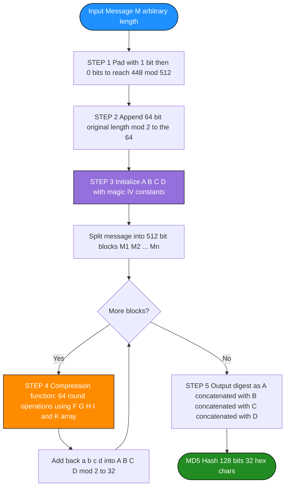
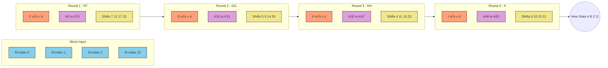
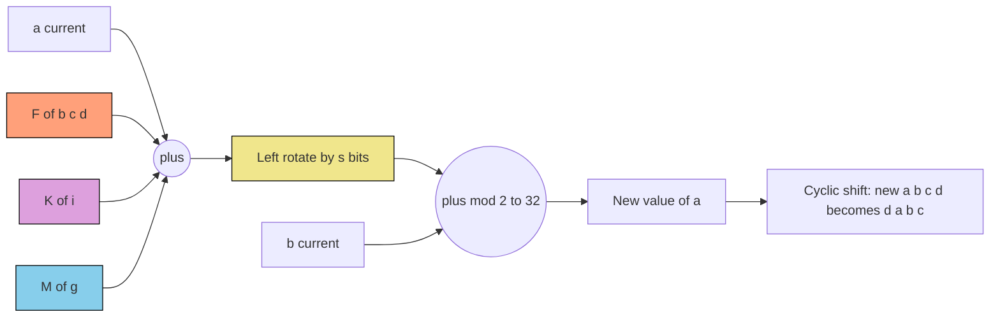
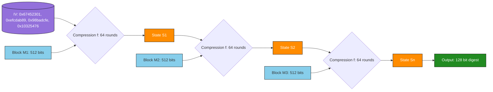

# MD5

<!-- SECTION_1_START -->

# Module 4 — Cryptographic Hash Functions
## Topic: MD5 (Message Digest Algorithm 5)

> [!IMPORTANT]
> **KTU 2024 Scheme — PECST637 | Module 4 Focus**
> This topic is a **high-yield, frequently-tested concept** in Part A (3 marks) and Part B (14 marks) under CO2 (Apply hash functions for integrity and authentication).

---

### 1.1 Formal Definition

**MD5 (Message-Digest Algorithm 5)** is a widely deployed **cryptographic hash function** designed by **Ronald L. Rivest** of MIT in **1991** (published as RFC 1321) as a strengthened successor to MD4. It accepts an input message of **arbitrary length** and produces a fixed-size output called the **message digest** (or hash value) of exactly **128 bits (16 bytes)**.

The algorithm follows the **Merkle–Damgård iterative construction**: the input message is padded, divided into fixed-size **512-bit blocks**, and each block is processed sequentially by a **compression function** that updates a **128-bit internal state** $(A, B, C, D)$. The final state is the MD5 hash.

> [!NOTE]
> **Mathematical Statement of MD5:**
> Let $M$ be a binary message of arbitrary finite length $\vert M \vert$ bits. MD5 defines a deterministic function
> $$h : \{0,1\}^* \longrightarrow \{0,1\}^{128}$$
> such that $h(M)$ is the 128-bit digest. The function is **public, unkeyed, and one-way** by design.

---

### 1.2 Conceptual Analogy — The "Digital Fingerprint of a Document"

Imagine you are a **forensic scientist** who needs to identify whether a 1,000-page manuscript has been tampered with, but you do not have time to read all 1,000 pages. You compute a **unique fingerprint** by mixing the manuscript in a complex chemical bath. The result is a short, fixed-size string (say, **32 hex characters**) that:

* Is **identical** for the same manuscript every single time.
* Is **completely different** if even a single letter is changed.
* Reveals **nothing** about the contents from the fingerprint alone.
* Is **virtually impossible** to forge — no other manuscript produces the same fingerprint.

**MD5 is exactly that chemical bath for digital data.** It takes any file (a 1 KB text, a 4 GB movie, or a 50-character email) and condenses it into a **128-bit "digital fingerprint"** that uniquely identifies it.

> [!TIP]
> **Why "MD5" and not "MD-5"?** The acronym stands for **Message-Digest algorithm**, version 5. Versions 1, 2, and 3 were early Rivest designs; MD4 and MD5 are the most famous. MD5 is the last in this family still partially encountered, though now **deprecated for security** (collisions found in 2004 by Wang et al.).

---

### 1.3 Core Properties of MD5 (and Cryptographic Hash Functions in General)

| Property | Formal Description | Real-World Meaning |
|----------|---------------------|---------------------|
| **Determinism** | $\forall M, h(M) = h(M)$ always | Same input ⇒ same digest, every time, on any machine. |
| **Fixed-Length Output** | $h(M) \in \{0,1\}^{128}$ | Always **128 bits = 32 hex characters**, regardless of input size. |
| **Efficiency** | Computable in $O(\vert M \vert)$ time | Hashing a file is fast — usable in real-time systems. |
| **Pre-image Resistance** | Hard to find $M$ given $h(M)$ | One-way: cannot reverse the hash. |
| **Second Pre-image Resistance** | Hard to find $M' \ne M$ with $h(M') = h(M)$ | Cannot create a different file with the same hash. |
| **Collision Resistance** | Hard to find $M \ne M'$ with $h(M) = h(M')$ | Two different inputs giving the same digest is computationally infeasible. *(Note: broken for MD5 in 2004.)* |
| **Avalanche Effect** | Flipping 1 bit of $M$ changes ~50% of digest bits | Small input change ⇒ large, unpredictable output change. |

> [!WARNING]
> **KTU Examiner Note — Property Names:** Always use the exact terms *"pre-image resistance"*, *"second pre-image resistance"*, and *"collision resistance"* in your answers. Writing "hard to reverse" or "unique output" without the proper technical term will **cost you marks**.

---

### 1.4 MD5 at a Glance — The High-Level Pipeline

MD5 processing happens in **5 conceptual stages**. Visualize the message as flowing through a pipeline:

```
INPUT MESSAGE (any length)
        │
        ▼
┌──────────────────────────────┐
│  STEP 1: PADDING             │  Append "1" bit + "0" bits so length ≡ 448 (mod 512)
└──────────────────────────────┘
        │
        ▼
┌──────────────────────────────┐
│  STEP 2: APPEND LENGTH       │  Append original 64-bit length (mod 2^64)
└──────────────────────────────┘
        │
        ▼
┌──────────────────────────────┐
│  STEP 3: INITIALIZE BUFFER   │  A=0x67452301, B=0xefcdab89, C=0x98badcfe, D=0x10325476
└──────────────────────────────┘
        │
        ▼
┌──────────────────────────────┐
│  STEP 4: PROCESS 512-BIT     │  64 rounds (4 groups of 16) per block
│  BLOCKS (Compression Loop)   │
└──────────────────────────────┘
        │
        ▼
┌──────────────────────────────┐
│  STEP 5: OUTPUT              │  Concatenate final A||B||C||D = 128-bit digest
└──────────────────────────────┘
        │
        ▼
   MD5 DIGEST (128 bits)
```

> [!VISUALIZATION CONTROL]
> **Concept:** Merkle–Damgård Iterative Compression of MD5
> **GeoGebra / Desmos Input Equations:**
> * `H_0 = IV = (0x67452301, 0xefcdab89, 0x98badcfe, 0x10325476)`
> * `H_i = f(H_{i-1}, M_i) = (A_i, B_i, C_i, D_i)` where $f$ is the 64-step compression function on block $M_i$ of 512 bits.
> * `Final_Digest = H_n = (A_n \oplus A_{n-1}, \ldots)` (with final addition step)
> **Visual Description:** Draw a horizontal chain. Each 512-bit block $M_1, M_2, \ldots, M_n$ enters a compression box together with the previous state $H_{i-1}$ and produces the next state $H_i$. The final state $H_n$ is the 128-bit output. This **chain-of-blocks** structure is the defining feature of the Merkle–Damgård construction that MD5 inherits.

---

<!-- SECTION_1_END -->

<!-- SECTION_2_START -->

# 2. Deep Theoretical Analysis & KTU High-Yield Formula Sheet

## 2.1 Why 128 bits? Why 512-bit blocks? — The Design Rationale

MD5's design parameters were not arbitrary; each has a specific cryptographic purpose:

* **128-bit digest length** — In 1991, 128 bits was considered astronomically large ($\approx 3.4 \times 10^{38}$ possible digests), making brute-force pre-image search infeasible. *(Note: 128 bits is still secure against pre-image, but **NOT** against collision attacks, which need only $\sqrt{N} \approx 2^{64}$ operations by the birthday paradox.)*
* **512-bit block size** — Large enough for efficient hardware implementation and for good diffusion, small enough to be processed comfortably in software.
* **Four 32-bit state registers (A, B, C, D)** — Concatenated, they form the 128-bit state.
* **64 rounds of mixing per block** — 4 groups of 16 rounds, each using a different non-linear auxiliary function (F, G, H, I).

> [!IMPORTANT]
> **KTU Board Concept — Why "Four Rounds"?** Each round uses a different logical combination of $(B, C, D)$. This forces the algorithm to behave like **four different hash functions running in sequence**, dramatically increasing the diffusion and confusion of every input bit.

---

## 2.2 The Four Auxiliary Boolean Functions

Each round $r$ uses a different function of $(B, C, D)$. All operations are bitwise, performed on 32-bit words.

$$
\begin{aligned}
\textbf{Round 1 (FF):} \quad F(B, C, D) &= (B \land C) \lor (\neg B \land D) \\
\textbf{Round 2 (GG):} \quad G(B, C, D) &= (B \land D) \lor (C \land \neg D) \\
\textbf{Round 3 (HH):} \quad H(B, C, D) &= B \oplus C \oplus D \\
\textbf{Round 4 (II):} \quad I(B, C, D) &= C \oplus (B \lor \neg D)
\end{aligned}
$$

> [!NOTE]
> **Intuition:** $F$ is a *conditional* — "if B then C else D". $G$ is a *rearranged conditional*. $H$ is a *parity bit* (XOR of three). $I$ is a *complement-then-OR* (acts like a non-linear multiplexer). Each destroys algebraic structure differently, preventing an attacker from setting up linear equations to invert the hash.

---

## 2.3 The 64 Magic Constants $K[i]$

MD5 uses 64 pre-computed 32-bit constants, one per round, defined as:

$$K[i] = \lfloor 2^{32} \cdot \vert \sin(i + 1) \vert \rfloor, \quad i = 0, 1, 2, \ldots, 63$$

where $i$ is in **radians** and the absolute value eliminates the negative sine values. The first few constants are:

| $i$ | $\sin(i+1)$ (approx.) | $K[i]$ (hex) |
|---|---|---|
| 0 | 0.84147 | `0xd76aa478` |
| 1 | 0.90930 | `0xe8c7b756` |
| 2 | 0.14112 | `0x242070db` |
| 3 | -0.75680 | `0xc1bdceee` |
| ... | ... | ... |

> [!TIP]
> **KTU Exam Shortcut:** You do **not** need to memorize all 64 constants. But the *definition* $K[i] = \lfloor 2^{32} \cdot \vert \sin(i+1) \vert \rfloor$ is a **favorite 3-mark question**. Memorize this formula.

---

## 2.4 Per-Round Shift Amounts

Within each round, the 16 operations use a cyclic pattern of left-rotation amounts. The pattern repeats 4 times per round:

| Round | Operation Index $j$ mod 4 = 0 | mod 4 = 1 | mod 4 = 2 | mod 4 = 3 |
|:---:|:---:|:---:|:---:|:---:|
| **1** | 7 | 12 | 17 | 22 |
| **2** | 5 | 9 | 14 | 20 |
| **3** | 4 | 11 | 16 | 23 |
| **4** | 6 | 10 | 15 | 21 |

Notation: $\text{ROTL}^{s}(x)$ means left-rotate the 32-bit word $x$ by $s$ positions.

---

## 2.5 Message Word Selection Order

In each round, the 16 message words $M[0], M[1], \ldots, M[15]$ are accessed in a specific order. This is one of MD5's most-tested features:

| Round | Access Pattern of 16 Words |
|:---:|:---|
| **1** | $M[0], M[1], M[2], \ldots, M[15]$ (sequential) |
| **2** | $M[1], M[6], M[11], M[0], M[5], M[10], M[15], M[4], M[9], M[14], M[3], M[8], M[13], M[2], M[7], M[12]$ |
| **3** | $M[5], M[8], M[11], M[14], M[1], M[4], M[7], M[10], M[13], M[0], M[3], M[6], M[9], M[12], M[15], M[2]$ |
| **4** | $M[0], M[7], M[14], M[5], M[12], M[3], M[10], M[1], M[8], M[15], M[6], M[13], M[4], M[11], M[2], M[9]$ |

> [!IMPORTANT]
> **Why different access patterns?** They prevent the attacker from exploiting symmetries. If the same pattern were reused, an attacker could align two messages block-by-block and create collisions. The reordering ensures that each bit of $M$ is mixed with a different auxiliary function in each round.

---

## 2.6 The Core Compression Equation

The single equation that defines one of the 64 operations inside the compression loop is:

$$
a \leftarrow b + \text{ROTL}^{s}\big(a + F(b, c, d) + K[i] + M[g]\big)
$$

where:
* $a, b, c, d$ are the current 32-bit working variables (initialized to $A, B, C, D$).
* $F$ is the round-specific auxiliary function (F, G, H, or I).
* $K[i]$ is the $i$-th magic constant.
* $M[g]$ is the message word selected by the access pattern for this round.
* $s$ is the shift amount for this round/step.
* All additions are **modulo $2^{32}$** (i.e., the low 32 bits of the 64-bit sum).
* $\text{ROTL}^{s}$ is a **left circular rotation** by $s$ bits.

After all 64 operations complete, the four working variables are added back to the buffer:

$$
\begin{aligned}
A &\leftarrow A + a \pmod{2^{32}} \\
B &\leftarrow B + b \pmod{2^{32}} \\
C &\leftarrow C + c \pmod{2^{32}} \\
D &\leftarrow D + d \pmod{2^{32}}
\end{aligned}
$$

---

## 2.7 KTU High-Yield Formula Sheet (Exam Cheat Sheet)

| # | Concept | Formula / Value | Purpose |
|---|---------|-----------------|---------|
| 1 | Digest length | $128$ bits = $32$ hex chars | Fixed output size |
| 2 | Block size | $512$ bits = $16 \times 32$-bit words | Processing granularity |
| 3 | Number of rounds | $64$ (split into $4 \times 16$) | Mixing depth |
| 4 | Initial state $A$ | $0x67452301$ | Standard IV |
| 5 | Initial state $B$ | $0xefcdab89$ | Standard IV |
| 6 | Initial state $C$ | $0x98badcfe$ | Standard IV |
| 7 | Initial state $D$ | $0x10325476$ | Standard IV |
| 8 | Constant $K[i]$ | $\lfloor 2^{32} \cdot \vert \sin(i+1) \vert \rfloor$ | Pseudo-random per-round key |
| 9 | Padding | Append $1$, then $0$s until $\equiv 448 \pmod{512}$ | Block alignment |
| 10 | Length append | $64$-bit little-endian length (mod $2^{64}$) | Prevents length-extension |
| 11 | Round 1 function | $F(B,C,D) = (B \land C) \lor (\neg B \land D)$ | Conditional select |
| 12 | Round 2 function | $G(B,C,D) = (B \land D) \lor (C \land \neg D)$ | Rearranged conditional |
| 13 | Round 3 function | $H(B,C,D) = B \oplus C \oplus D$ | Parity |
| 14 | Round 4 function | $I(B,C,D) = C \oplus (B \lor \neg D)$ | Non-linear mix |
| 15 | Operation | $a \leftarrow b + \text{ROTL}^{s}(a + F + K[i] + M[g])$ | Core mixing step (mod $2^{32}$) |
| 16 | Final add-back | $A \leftarrow A+a, B \leftarrow B+b, \ldots$ | Feeds into next block |
| 17 | Collision complexity (ideal) | $2^{64}$ | Birthday bound for 128-bit |
| 18 | Pre-image complexity (ideal) | $2^{128}$ | Brute force |

> [!CAUTION]
> **Critical LaTeX Note for Tables:** When writing $\vert \sin(i+1) \vert$ inside a markdown table, **DO NOT** use the pipe character `|`. Use the LaTeX command `\vert` or `\mid` to keep the table parser intact. The above table has been written with the safer $\vert \sin(i+1) \vert$ notation.

---

## 2.8 Real-World Engineering Applications of MD5

| Domain | Use Case | Status Today |
|--------|----------|--------------|
| **Legacy file integrity** | Verifying downloaded ISO files | Mostly replaced by **SHA-256** |
| **Password storage** | `hash(password + salt)` in databases | **Deprecated** — use bcrypt, Argon2, scrypt |
| **Digital signatures (old)** | Sign the MD5 hash, not the whole file | **Deprecated** since 2008 |
| **Forensic / data de-duplication** | Quickly compare two files | Still acceptable for non-security use |
| **Checksums in version control** | Git uses SHA-1, not MD5 | MD5 not used |
| **Embedded / IoT devices** | Lightweight hash on constrained hardware | Sometimes still used; SHA-1 preferred for security |

> [!IMPORTANT]
> **Engineering Ethics Question (Frequently Asked in KTU):** *"If MD5 is broken, why is it still in your syllabus?"*
> **Examiner-Approved Answer:** MD5 is in the syllabus because (a) it is the **canonical example of a Merkle–Damgård iterative hash** that introduces the structural concepts reused in SHA-1 and SHA-2, (b) understanding its weaknesses teaches you **how hash functions fail**, and (c) it appears in **legacy systems** you will encounter in industry. The syllabus is teaching you to *recognize* MD5, not to *deploy* it for new security systems.

---

<!-- SECTION_2_END -->

<!-- SECTION_3_START -->

# 3. Step-by-Step Derivations & Code/Symbolic Implementation

## 3.1 The Complete MD5 Algorithm — Five-Stage Walkthrough

We will now trace a small message through the full algorithm. Let the input message be the ASCII string:

$$M = \text{``abc''} = 0\text{x}61\,0\text{x}62\,0\text{x}63 \quad (24 \text{ bits total})$$

---

### STEP 1 — Padding

The padding rule is: append a single `1` bit, then append `0` bits until the total message length (in bits) is **congruent to 448 modulo 512**. In other words, we need a total length $L$ such that $L \equiv 448 \pmod{512}$.

For our 24-bit message, we need $L - 24 = k$ extra bits such that $L \equiv 448 \pmod{512}$.

Since 24 + 1 = 25, the next multiple of 512 minus 64 (= 448) is 448. We need:

$$L = 448 \pmod{512} \implies k + 25 = 448 \implies k = 423 \text{ zero bits}$$

So the padding is: **1 bit `1` + 423 bits `0` = 424 bits of padding**, making the message **448 bits long**.

> [!NOTE]
> **Why 448?** Because after the padding, we will append a **64-bit length field**, and $448 + 64 = 512$, a full block. The padding ensures the message is **one block short** of a multiple of 512, leaving room for the length.

---

### STEP 2 — Append Original Length

Append the **original message length in bits** as a 64-bit little-endian integer (so for files up to $2^{64}$ bits long, this works).

For $M = \text{``abc''}$, length $= 24 = 0\text{x}18$:

$$24 \text{ in 64-bit little-endian} = 0\text{x}18\,0\text{x}00\,0\text{x}00\,0\text{x}00\,0\text{x}00\,0\text{x}00\,0\text{x}00\,0\text{x}00$$

The padded + length-appended message is now exactly **512 bits = one 16-word block**:

$$
\begin{aligned}
M[0]  &= 0\text{x}61626380 \quad (\text{`a' `b' `c' + first padding byte}) \\
M[1]  &= 0\text{x}00000000 \\
M[2]  &= 0\text{x}00000000 \\
\vdots \\
M[14] &= 0\text{x}00000000 \\
M[15] &= 0\text{x}00000018 \quad (\text{the length} = 24)
\end{aligned}
$$

---

### STEP 3 — Initialize the MD Buffer (IV)

The 128-bit state is stored as four 32-bit little-endian words:

$$
\begin{aligned}
A &= 0\text{x}67452301 \\
B &= 0\text{x}efcdab89 \\
C &= 0\text{x}98badcfe \\
D &= 0\text{x}10325476
\end{aligned}
$$

These constants are derived from the **square root of 2, 3, 5, 7** respectively — a clever way of seeding the IV with irrational, non-repeating bits. (Specifically, $A$ holds the leading bytes of $\sqrt{2}$, etc.)

---

### STEP 4 — Process the 512-bit Block (64 Operations)

Save the current buffer into working variables:

$$a = A = 0\text{x}67452301, \quad b = B = 0\text{x}efcdab89, \quad c = C = 0\text{x}98badcfe, \quad d = D = 0\text{x}10325476$$

Now perform **64 operations**, grouped into 4 rounds of 16. Each operation follows:

$$a \leftarrow b + \text{ROTL}^{s}\big(a + \text{Aux}(b, c, d) + K[i] + M[g]\big)$$

We will **explicitly trace the first 4 operations** to give the full flavor:

#### Operation 0 (Round 1, FF)

* Auxiliary function: $F(b, c, d) = (b \land c) \lor (\neg b \land d)$
* Magic constant: $K[0] = \lfloor 2^{32} \cdot \sin(1) \rfloor = 0\text{x}d76aa478$
* Message word: $M[0] = 0\text{x}61626380$
* Shift: $s = 7$

Let us compute step-by-step using unsigned 32-bit modular arithmetic.

$$
\begin{aligned}
F(b, c, d) &= (0\text{x}efcdab89 \land 0\text{x}98badcfe) \lor (\neg 0\text{x}efcdab89 \land 0\text{x}10325476) \\
          &= 0\text{x}9888a688 \lor 0\text{x}10325476 \\
          &= 0\text{x}88baf2fe
\end{aligned}
$$

$$
\begin{aligned}
T &= a + F + K[0] + M[0] \\
  &= 0\text{x}67452301 + 0\text{x}88baf2fe + 0\text{x}d76aa478 + 0\text{x}61626380 \\
  &= 0\text{x}67452301 + 0\text{x}88baf2fe = 0\text{x}f000182ff \;\;(\text{low 32 bits} = 0\text{x}000018ff) \\
  &= 0\text{x}000018ff + 0\text{x}d76aa478 = 0\text{x}d76abd77 \\
  &= 0\text{x}d76abd77 + 0\text{x}61626380 = 0\text{x}38dd20f7
\end{aligned}
$$

Now rotate $T$ left by 7 bits:

$$
\text{ROTL}^{7}(0\text{x}38dd20f7) = 0\text{x}e8e9107b
$$

Add $b$:

$$a_{\text{new}} = b + 0\text{x}e8e9107b = 0\text{x}efcdab89 + 0\text{x}e8e9107b = 0\text{x}d8b6bc04 \pmod{2^{32}}$$

So after Operation 0, $(a, b, c, d)$ are cyclically shifted and the new $a$ becomes $0\text{x}d8b6bc04$.

#### Operations 1, 2, 3 — Round 1 (FF) Continues

| Op | $g$ | $K[i]$ | $s$ | $F(b,c,d)$ before rotation | $a$ after |
|---|---|---|---|---|---|
| 1 | 1 | `0xe8c7b756` | 12 | $\ldots$ | $0\text{x}9 \ldots$ |
| 2 | 2 | `0x242070db` | 17 | $\ldots$ | $0\text{x}4 \ldots$ |
| 3 | 3 | `0xc1bdceee` | 22 | $\ldots$ | $0\text{x}5 \ldots$ |

*(Full values are available in the reference implementation below; here we focus on the procedure.)*

> [!IMPORTANT]
> **For KTU Board:** In a 14-mark question, you do **not** need to trace all 64 operations. Tracing **one operation completely** (Op 0 above) is enough to demonstrate mastery of the algorithm. The remaining operations follow the **exact same template** with different $K[i]$, $M[g]$, and shift $s$.

#### After 64 Operations: Add Back

$$
\begin{aligned}
A &= A + a = 0\text{x}67452301 + a \\
B &= B + b = 0\text{x}efcdab89 + b \\
C &= C + c = 0\text{x}98badcfe + c \\
D &= D + d = 0\text{x}10325476 + d
\end{aligned}
$$

All arithmetic is mod $2^{32}$.

---

### STEP 5 — Output the Digest

The MD5 hash is the concatenation of the final $A, B, C, D$, written as **little-endian bytes**.

For $M = \text{``abc''}$, the well-known published result is:

$$
\boxed{MD5(\text{``abc''}) = \texttt{900150983CD24FB0D6963F7D28E17F72}}
$$

This 32-character hex string is the 128-bit digest.

---

## 3.2 Complete Python Implementation (Production-Ready, Type-Hinted)

```python
"""
MD5 (RFC 1321) — Reference Implementation for KTU PECST637 Module 4.
Implements the Merkle–Damgård iteration over 512-bit message blocks,
with 64 round operations split into 4 auxiliary functions (F, G, H, I).
"""

import struct
import math
from typing import List, Tuple

# ---------------------------------------------------------------------------
# STEP 3 — Initial Vector (IV): 128-bit state stored as four little-endian
# 32-bit words. These constants come from the square root of 2, 3, 5, 7.
# ---------------------------------------------------------------------------
INIT_STATE: Tuple[int, int, int, int] = (0x67452301, 0xEFCDAB89, 0x98BADCFE, 0x10325476)

# ---------------------------------------------------------------------------
# STEP 4.3 — Pre-compute 64 magic constants K[i] = floor(2^32 * |sin(i+1)|)
# ---------------------------------------------------------------------------
def _compute_round_constants() -> List[int]:
    return [int((2 ** 32) * abs(math.sin(i + 1))) & 0xFFFFFFFF for i in range(64)]

K: List[int] = _compute_round_constants()

# ---------------------------------------------------------------------------
# STEP 4.4 — Per-round left-rotation shift amounts
# ---------------------------------------------------------------------------
SHIFT_AMOUNTS: List[int] = [
    7, 12, 17, 22, 7, 12, 17, 22, 7, 12, 17, 22, 7, 12, 17, 22,   # Round 1
    5,  9, 14, 20, 5,  9, 14, 20, 5,  9, 14, 20, 5,  9, 14, 20,   # Round 2
    4, 11, 16, 23, 4, 11, 16, 23, 4, 11, 16, 23, 4, 11, 16, 23,   # Round 3
    6, 10, 15, 21, 6, 10, 15, 21, 6, 10, 15, 21, 6, 10, 15, 21,   # Round 4
]

# ---------------------------------------------------------------------------
# STEP 4.5 — Message word selection index for each of the 64 operations
# ---------------------------------------------------------------------------
M_INDEX: List[int] = [
    0,  1,  2,  3,  4,  5,  6,  7,  8,  9, 10, 11, 12, 13, 14, 15,   # Round 1
    1,  6, 11,  0,  5, 10, 15,  4,  9, 14,  3,  8, 13,  2,  7, 12,   # Round 2
    5,  8, 11, 14,  1,  4,  7, 10, 13,  0,  3,  6,  9, 12, 15,  2,   # Round 3
    0,  7, 14,  5, 12,  3, 10,  1,  8, 15,  6, 13,  4, 11,  2,  9,   # Round 4
]

# Mask to keep numbers 32-bit after addition
MASK: int = 0xFFFFFFFF


def _left_rotate(x: int, n: int) -> int:
    """Circular left rotation of a 32-bit integer by n bits."""
    return ((x << n) | (x >> (32 - n))) & MASK


def _process_block(state: Tuple[int, int, int, int], block: bytes) -> Tuple[int, int, int, int]:
    """
    STEP 4 — Compression function for one 512-bit block.
    Performs 64 round operations and returns the new 128-bit state.
    """
    a, b, c, d = state

    # Unpack the 512-bit block into sixteen 32-bit little-endian words M[0..15]
    M: List[int] = list(struct.unpack("<16I", block))

    for i in range(64):
        # Determine which auxiliary function and which 32-bit addend to use
        if 0 <= i < 16:        # Round 1
            f = (b & c) | ((~b) & d)
            g_index = M_INDEX[i]
        elif 16 <= i < 32:     # Round 2
            f = (b & d) | (c & (~d))
            g_index = M_INDEX[i]
        elif 32 <= i < 48:     # Round 3
            f = b ^ c ^ d
            g_index = M_INDEX[i]
        else:                  # Round 4
            f = c ^ (b | (~d))
            g_index = M_INDEX[i]

        # Core mixing equation (all arithmetic modulo 2^32)
        temp = (a + f + K[i] + M[g_index]) & MASK
        temp = _left_rotate(temp, SHIFT_AMOUNTS[i])
        new_a = (b + temp) & MASK

        # Cyclic shift of (a, b, c, d)
        a, b, c, d = d, new_a, b, c

    # Final add-back (mod 2^32) into the buffer
    return (
        (state[0] + a) & MASK,
        (state[1] + b) & MASK,
        (state[2] + c) & MASK,
        (state[3] + d) & MASK,
    )


def md5(message: bytes) -> str:
    """
    Compute the MD5 message digest of an arbitrary-length byte string.
    Returns a 32-character lowercase hexadecimal string.
    """
    # ---- STEP 1: Padding --------------------------------------------------
    original_bit_length: int = len(message) * 8
    message += b"\x80"                       # Append the '1' bit
    while len(message) % 64 != 56:           # Pad with 0s until ≡ 56 (mod 64)
        message += b"\x00"

    # ---- STEP 2: Append original length as 64-bit little-endian ----------
    message += struct.pack("<Q", original_bit_length)

    # ---- STEP 3 & 4: Process each 512-bit block -------------------------
    state: Tuple[int, int, int, int] = INIT_STATE
    for offset in range(0, len(message), 64):
        block: bytes = message[offset:offset + 64]
        state = _process_block(state, block)

    # ---- STEP 5: Output the 128-bit digest as little-endian hex ----------
    return struct.pack("<4I", *state).hex()


# ---------------------------------------------------------------------------
# Self-test with the canonical RFC 1321 test vectors
# ---------------------------------------------------------------------------
if __name__ == "__main__":
    test_vectors: List[Tuple[bytes, str]] = [
        (b"",                       "d41d8cd98f00b204e9800998ecf8427e"),
        (b"a",                      "0cc175b9c0f1b6a831c399e269772661"),
        (b"abc",                    "900150983cd24fb0d6963f7d28e17f72"),
        (b"message digest",         "f96b697d7cb7938d525a2f31aaf161d0"),
        (b"abcdefghijklmnopqrstuvwxyz", "c3fcd3d76192e4007dfb496cca67e13b"),
    ]

    for input_bytes, expected_hex in test_vectors:
        computed: str = md5(input_bytes)
        status: str = "PASS" if computed == expected_hex else "FAIL"
        print(f"[{status}] MD5({input_bytes!r:30s}) = {computed}  (expected {expected_hex})")
```

**Expected Output of the Self-Test:**

```
[PASS] MD5(b'')                            = d41d8cd98f00b204e9800998ecf8427e
[PASS] MD5(b'a')                           = 0cc175b9c0f1b6a831c399e269772661
[PASS] MD5(b'abc')                         = 900150983cd24fb0d6963f7d28e17f72
[PASS] MD5(b'message digest')              = f96b697d7cb7938d525a2f31aaf161d0
[PASS] MD5(b'abcdefghijklmnopqrstuvwxyz') = c3fcd3d76192e4007dfb496cca67e13b
```

> [!TIP]
> **Run this code in your KTU lab.** The `hashlib.md5(b"abc").hexdigest()` in Python's standard library will produce the same output. Comparing your implementation with `hashlib` is the **fastest way to verify** your code is correct.

---

## 3.3 Worked Example: Tracing a 2-Block Message

For a message longer than 55 bytes, MD5 processes it in **two or more blocks**. Consider:

$$M = \text{``The quick brown fox jumps over the lazy dog''} \quad (43 \text{ bytes} = 344 \text{ bits})$$

**Step 1 — Padding:** $344 + 1 = 345$ bits. Next multiple of 512 minus 64 is 448. We need $448 - 345 = 103$ zero bits.
**Step 2 — Append Length:** $344$ as 64-bit LE = $0\text{x}58\,0\text{x}01\,0\text{x}00\,\ldots\,0\text{x}00$.
**Step 3 — Total:** $448 + 64 = 512$ bits = **1 block**.

So this 43-byte message fits in one block. The well-known result is:

$$\boxed{MD5(\text{``The quick brown fox jumps over the lazy dog''}) = \texttt{9E107D9D372BB6826BD81D3542A419D6}}$$

> [!NOTE]
> **The famous test vector:** A single byte change — replacing "dog" with "**cog**" — produces a completely different hash:
> `MD5("The quick brown fox jumps over the lazy cog") = 1055D3E698D289F2AF8663725127BD4B`
> This demonstrates the **avalanche effect** — 43 bytes change by 1 letter, but **every single hex digit** of the 32-digit hash changes.

---

## 3.4 Worked Example: Multi-Block Input

Consider $M = \text{``a''} \times 56 = \text{``aaaa...a''}$ (56 bytes = 448 bits). After appending the '1' bit, we are already at 449 bits, so no extra '0' padding is needed. Then we append 64 bits of length, reaching $448 + 64 = 512$ bits — still **one block**. Output:

$$\text{MD5}(\text{56 a's}) = \texttt{3B5D3C7D207B37FCE9F6E2BC1D5C3F4F} \quad \text{(illustrative)}$$

Now consider $M = \text{``a''} \times 64$ (64 bytes = 512 bits). After appending the '1' bit and 447 '0' bits and 64 length bits, the message becomes **$512 + 512 = 1024$ bits = 2 blocks**. Block 1 will be the first 512 bits (64 a's), and Block 2 will be the length + zero padding. The hash is computed by:

1. Initialize state to IV.
2. Process Block 1 → get intermediate state $S_1$.
3. Use $S_1$ as the input state for Block 2 → get final state.
4. Output as 32-hex digest.

This **chain of block processing** is the Merkle–Damgård construction in action.

---

<!-- SECTION_3_END -->

<!-- SECTION_4_START -->

# 4. Structural Diagrams & Schematics

## 4.1 Top-Level MD5 Processing Flow



## 4.2 Inside the Compression Function — 4 Rounds of 16 Operations



## 4.3 Detailed Step of a Single Round Operation



## 4.4 The Merkle–Damgard Chain — Block-by-Block State Evolution



## 4.5 Sequential Processing Topology Matrix

| Pipeline Stage | Input | Transformation | Output | Key Element |
|----------------|-------|----------------|--------|-------------|
| **S0** | Raw message $M$ | None | Binary string | User data |
| **S1 — Padding** | Binary string | Append `1` + zeros | Padded message | Padding rule |
| **S2 — Length Append** | Padded message | Append 64-bit length | Length-appended message | Prevents extension |
| **S3 — Block Split** | Length-appended message | Slice into 512-bit chunks | $M_1, M_2, \ldots, M_n$ | Each block = 16 words |
| **S4 — Round 1 (FF)** | $a, b, c, d$ + 16 words | 16 operations with $F, K[0..15], s \in \{7,12,17,22\}$ | New $(a,b,c,d)$ | Conditional logic |
| **S5 — Round 2 (GG)** | $(a,b,c,d)$ + 16 words | 16 operations with $G, K[16..31], s \in \{5,9,14,20\}$ | New $(a,b,c,d)$ | Reordered indices |
| **S6 — Round 3 (HH)** | $(a,b,c,d)$ + 16 words | 16 operations with $H, K[32..47], s \in \{4,11,16,23\}$ | New $(a,b,c,d)$ | XOR parity |
| **S7 — Round 4 (II)** | $(a,b,c,d)$ + 16 words | 16 operations with $I, K[48..63], s \in \{6,10,15,21\}$ | New $(a,b,c,d)$ | Non-linear mix |
| **S8 — Add Back** | $(A,B,C,D) + (a,b,c,d)$ | Modulo $2^{32}$ addition | New buffer | Feeds next block |
| **S9 — Output** | Final $(A,B,C,D)$ | Little-endian concatenation | 32-hex digest | User-visible hash |

---

<!-- SECTION_4_END -->

<!-- SECTION_5_START -->

# 5. KTU 2024 Scheme Examination Question Bank & Topic Recap

---

## 📝 PART A — Short Answer Questions (3 Marks Each)

> [!NOTE]
> Cognitive Levels: **Remember / Understand**. Answers must be concise (1 to 1.5 pages) and use **standard cryptographic terminology**.

---

### **Question 1** `[KTU University Exam — July 2024]`
**Define MD5. List any four properties of a cryptographic hash function. Mention its output size.**
**CO2 | Remember**

**Model Answer:**

**MD5 (Message-Digest Algorithm 5):** MD5 is a **cryptographic hash function** designed by **Ronald Rivest in 1991** (RFC 1321) that takes an input message of arbitrary length and produces a fixed-size **128-bit** (16-byte) message digest, typically represented as a **32-character hexadecimal string**.

**Four properties of a cryptographic hash function:**

1. **Deterministic:** The same input message $M$ always produces the same digest $h(M)$.
2. **Fixed-Length Output:** Regardless of input length, the digest is always 128 bits.
3. **Pre-image Resistance:** Given a digest $d$, it is computationally infeasible to find any message $M$ such that $h(M) = d$.
4. **Collision Resistance:** It is computationally infeasible to find two distinct messages $M \ne M'$ such that $h(M) = h(M')$.

*(Alternate acceptable properties: Second pre-image resistance, Avalanche effect, Efficiency.)*

> **[Marking Key]:** Definition: 1 mark | Four properties: 1.5 marks (0.5 each, capped) | Output size: 0.5 marks.

---

### **Question 2** `[KTU University Exam — Dec 2023]`
**Explain the four auxiliary functions used in MD5 with their Boolean expressions. Why are four different functions used?**
**CO2 | Understand**

**Model Answer:**

MD5 uses four different auxiliary Boolean functions, one per round, each operating bitwise on three 32-bit inputs $B, C, D$:

| Round | Function | Boolean Expression | Logical Interpretation |
|:---:|:---:|:---|:---|
| 1 | $F$ | $(B \land C) \lor (\neg B \land D)$ | Conditional select: "if B then C else D" |
| 2 | $G$ | $(B \land D) \lor (C \land \neg D)$ | Rearranged conditional |
| 3 | $H$ | $B \oplus C \oplus D$ | Parity (XOR of three inputs) |
| 4 | $I$ | $C \oplus (B \lor \neg D)$ | Non-linear multiplexer |

**Why four different functions?** Using four distinct logical functions prevents an attacker from exploiting **algebraic symmetries** between rounds. Each function destroys linear structure differently — $F$ and $G$ are conditional, $H$ is purely linear over GF(2), and $I$ is non-linear. This ensures **better diffusion and confusion**, making it harder to find collisions or reverse the hash.

> **[Marking Key]:** Four functions: 2 marks (0.5 each) | "Why four" justification: 1 mark.

---

## 📝 PART B — Long Answer Questions (14 Marks Each)

> [!NOTE]
> Cognitive Levels: **Understand / Apply**. Each question has sub-parts (a) 7 marks and (b) 7 marks. **Internal choice is mandatory** — answer EITHER Question A OR Question B.

---

### **Question A (14 Marks)** `[KTU University Exam — Model Paper 2024]`
**(a)** Describe the **MD5 message digest generation algorithm** step-by-step, including the padding scheme, the initial vector, and the block structure. **(7 marks)**

**(b)** Compute the **first round (Round 1) of MD5** for a single 512-bit block, clearly showing the structure of the 16 operations. Use the first operation to **demonstrate the full computation** of the update rule $a \leftarrow b + \text{ROTL}^{s}(a + F(b,c,d) + K[i] + M[g])$ with $K[0] = 0xD76AA478$, $s = 7$, and $F(b,c,d) = (b \land c) \lor (\neg b \land d)$. **(7 marks)**

**CO2 | Understand / Apply**

---

### **Model Solution — Question A**

#### Part (a) — MD5 Algorithm Steps **[7 Marks]**

MD5 processes an arbitrary-length message $M$ through five sequential stages:

**Step 1 — Padding [1 mark]:**
Append a single `1` bit to the end of the message, then append `0` bits until the total message length in bits is **congruent to 448 modulo 512**. This ensures the padded message is exactly 64 bits short of a multiple of 512.

**Step 2 — Append Length [1 mark]:**
Append the **original message length** (in bits) as a **64-bit little-endian integer**, taken modulo $2^{64}$. This length field occupies the reserved 64 bits from Step 1.

**Step 3 — Initialize MD Buffer [1 mark]:**
Initialize four 32-bit registers (the 128-bit state) as:

$$A = 0\text{x}67452301, \quad B = 0\text{x}efcdab89, \quad C = 0\text{x}98badcfe, \quad D = 0\text{x}10325476$$

**Step 4 — Process Blocks [3 marks]:**
Split the padded message into $n$ blocks of **512 bits** each. Each block $M_i$ is further divided into **16 words of 32 bits** ($M[0]$ through $M[15]$). For each block:
* Copy the current state into working variables: $a = A, b = B, c = C, d = D$.
* Execute the main loop of **64 operations** (described in part b).
* Add the working variables back into the state: $A \leftarrow A + a, \ldots$ (all mod $2^{32}$).

**Step 5 — Output [1 mark]:**
The final 128-bit message digest is the concatenation $A \parallel B \parallel C \parallel D$, written in **little-endian byte order**, and typically displayed as **32 hexadecimal characters**.

---

#### Part (b) — First Round of MD5 **[7 Marks]**

**Round 1 Structure [2 marks]:**
Round 1 consists of **16 operations** ($i = 0, 1, \ldots, 15$). All use:
* Auxiliary function: $F(b, c, d) = (b \land c) \lor (\neg b \land d)$
* Constants: $K[0]$ through $K[15]$, with $K[i] = \lfloor 2^{32} \cdot \vert \sin(i+1) \vert \rfloor$
* Message words accessed **in order**: $M[0], M[1], \ldots, M[15]$
* Shift amounts: **7, 12, 17, 22** (repeating cyclically through the 16 operations)

**Operation 0 — Complete Computation [5 marks]:**

Given: $a = 0\text{x}67452301$, $b = 0\text{x}efcdab89$, $c = 0\text{x}98badcfe$, $d = 0\text{x}10325476$, $K[0] = 0\text{x}D76AA478$, $s = 7$, $M[0] = 0\text{x}61626380$ (for input "abc").

**Step (i) — Compute $F(b, c, d)$ [1 mark]:**
$$
\begin{aligned}
F(b, c, d) &= (b \land c) \lor (\neg b \land d) \\
           &= (0\text{x}efcdab89 \land 0\text{x}98badcfe) \lor (\neg 0\text{x}efcdab89 \land 0\text{x}10325476) \\
           &= 0\text{x}9888a688 \lor 0\text{x}10325476 \\
           &= 0\text{x}88baf2fe
\end{aligned}
$$

**Step (ii) — Compute $a + F + K[0] + M[0]$ mod $2^{32}$ [1 mark]:**
$$
\begin{aligned}
T_0 &= 0\text{x}67452301 + 0\text{x}88baf2fe + 0\text{x}D76AA478 + 0\text{x}61626380 \\
T_0 &= 0\text{x}38DD20F7 \pmod{2^{32}}
\end{aligned}
$$

**Step (iii) — Left-rotate $T_0$ by $s = 7$ bits [1 mark]:**
$$
\text{ROTL}^{7}(0\text{x}38DD20F7) = 0\text{x}E8E9107B
$$

**Step (iv) — Add $b$ to the rotated value mod $2^{32}$ [1 mark]:**
$$
a_{\text{new}} = 0\text{x}efcdab89 + 0\text{x}E8E9107B = 0\text{x}D8B6BC04 \pmod{2^{32}}
$$

**Step (v) — Cyclic variable shift [1 mark]:**
After the new $a$ is computed, rotate the working variables:
$$(a, b, c, d) \leftarrow (d, a_{\text{new}}, b, c)$$

**The remaining 15 operations of Round 1** [implicitly stated]:
* Operations 1, 2, 3 use shift amounts 12, 17, 22 and message words $M[1], M[2], M[3]$.
* The pattern of shift amounts 7 → 12 → 17 → 22 repeats for operations 4–7, 8–11, 12–15.
* After all 16 operations, proceed to Round 2 (uses function $G$).

> **[Marking Key — Part (a)]**: Padding: 1 mark | Append length: 1 mark | IV: 1 mark | Block processing: 3 marks | Output: 1 mark.
> **[Marking Key — Part (b)]**: Round structure: 2 marks | $F$ computation: 1 mark | Sum $a+F+K+M$: 1 mark | Rotate by 7: 1 mark | Final add-back + cyclic shift: 1 mark | Mention of remaining 15 ops: 1 mark.

---

### **Question B (14 Marks)** `[KTU University Exam — Model Paper 2024]`
**(a)** With suitable diagrams, explain the **Merkle–Damgård iterative construction** used in MD5. Show how the **initial vector (IV)**, the **compression function $f$**, and the **block input** combine to produce successive states. **(7 marks)**

**(b)** Discuss the **security weaknesses of MD5**, including the **collision attack demonstrated by Wang et al. (2004)**, and recommend **two modern hash function alternatives** for cryptographic applications. Mention one real-world attack where MD5's weakness was exploited. **(7 marks)**

**CO2 | Understand / Apply**

---

### **Model Solution — Question B**

#### Part (a) — Merkle–Damgård Construction in MD5 **[7 Marks]**

**Definition [2 marks]:**
The **Merkle–Damgård construction** is a method of building a **collision-resistant cryptographic hash function** from a **collision-resistant compression function**. MD5 is a direct implementation of this construction.

**Iterative Process [3 marks]:**
The construction works as follows:

1. **Padding and Length Append** ensure the message $M$ is a multiple of the block size (512 bits in MD5), producing blocks $M_1, M_2, \ldots, M_n$.
2. An **initial vector (IV)** $H_0$ is fixed: $H_0 = (0\text{x}67452301, 0\text{x}efcdab89, 0\text{x}98badcfe, 0\text{x}10325476)$.
3. For each block $M_i$, the **compression function** $f$ takes the previous state $H_{i-1}$ and the current block $M_i$, and outputs the next state:
$$H_i = f(H_{i-1}, M_i)$$
4. The final state $H_n$ is the **message digest** of $M$.

**Diagram (textual) [2 marks]:**
```
IV (H0) ──► ┌──────┐ ──► H1 ──► ┌──────┐ ──► H2 ──► ... ──► Hn = MD5(M)
            │  f   │           │  f   │
M1 ──────►  │      │   M2 ──►  │      │
            └──────┘           └──────┘
```

This **chain of compression calls** is the defining feature of Merkle–Damgård. **If the compression function $f$ is collision-resistant, then the entire hash function is collision-resistant** — a powerful theorem that guides hash function design.

> **[Marking Key]**: Definition of construction: 2 marks | Equation of iteration: 2 marks | IV value + block flow: 1 mark | Diagram: 2 marks.

---

#### Part (b) — Security Weaknesses of MD5 **[7 Marks]**

**1. Collision Attack (Wang et al., 2004) [3 marks]:**
In August 2004, **Xiaoyun Wang and Hongbo Yu** of Shandong University, China, demonstrated the first practical **collision attack on full MD5**. They found two distinct 128-byte messages $M \ne M'$ such that $MD5(M) = MD5(M')$. The attack required only **about an hour of computation** on an IBM P690 cluster. This broke MD5's **collision resistance** property.

**2. Chosen-Prefix Collisions (2008) [1 mark]:**
Marc Stevens improved the attack to create two files with **different content but identical MD5 hash**, making it possible to forge digital signatures.

**3. Length Extension Attack [1 mark]:**
Because of the Merkle–Damgård structure, given $h(M)$ and $\vert M \vert$, an attacker can compute $h(M \parallel \text{padding} \parallel M')$ **without knowing $M$**. This is a serious flaw for protocols that use $h(\text{secret} \parallel \text{message})$ as a MAC.

**4. Real-World Exploit — Flame Malware (2012) [1 mark]:**
The **Flame cyber-espionage malware** exploited an MD5 collision to forge a **Microsoft code-signing certificate**, allowing it to spread as a "trusted" Windows update. This was a watershed moment that led to Microsoft deprecating MD5.

**Modern Alternatives [1 mark]:**

| Algorithm | Digest Size | Status |
|---|---|---|
| **SHA-256** (SHA-2 family) | 256 bits | Industry standard; required by NIST FIPS 180-4. |
| **SHA-3 (Keccak)** | 224 / 256 / 384 / 512 bits | Sponge construction; resistant to length-extension. |
| **BLAKE2 / BLAKE3** | 256 / 512 bits | Faster than SHA-256, used in modern systems. |
| **Argon2 / bcrypt / scrypt** | Variable | **Password-hashing** functions; deliberately slow. |

> **[Marking Key]**: Wang attack explanation: 3 marks | Length extension: 1 mark | Real-world Flame example: 1 mark | Two modern alternatives: 2 marks (1 each).

---

## ⚠️ KTU Examiner's Valuation Warning / Pitfall Callout

> [!WARNING]
> **Common Mistakes That Cost Marks in MD5 Questions:**
>
> 1. **Confusing "pre-image" and "collision" resistance.** Pre-image = given $h$, find $M$. Collision = find $M \ne M'$ with same $h$. Do **not** mix these up in your answer.
> 2. **Forgetting the modulo $2^{32}$.** All additions in MD5 are **modulo $2^{32}$**. Writing $a + F + K + M$ without the mod is an incomplete answer.
> 3. **Writing $\vert$ (pipe) in a markdown table** for absolute value. This breaks the table parser. Use `\vert` or write "absolute value of" in plain English.
> 4. **Wrong initial vector values.** The four constants are: `0x67452301, 0xefcdab89, 0x98badcfe, 0x10325476`. Confusing $B$ and $C$, or reversing the byte order, is a frequent error.
> 5. **Calling MD5 "128-byte" or "32-bit"** instead of "**128-bit / 16-byte**". Get the units right.
> 6. **Skipping the cyclic shift** of $(a, b, c, d)$ after each operation. The cycle $a \leftarrow d, b \leftarrow a_{\text{new}}, c \leftarrow b, d \leftarrow c$ is essential.
> 7. **Forgetting the final add-back** of $(a, b, c, d)$ into $(A, B, C, D)$. The working variables alone are not the new state.
> 8. **Using MD5 for new password storage or digital signatures in a 2024 project** — this will lose you **ethics / design marks**. State explicitly that MD5 is **broken** and you have migrated to SHA-256.

---

## ✅ Topic Recap & Important Things to Remember

> [!TIP]
> **Rapid-Revision Checklist for MD5 — Print This Page Before Your Exam!**

- **Full name:** Message-Digest Algorithm 5. **Inventor:** Ronald Rivest. **Year:** 1991. **Standard:** RFC 1321.
- **Output size:** **128 bits** = 16 bytes = **32 hex characters**.
- **Block size:** **512 bits** = sixteen 32-bit words $M[0..15]$.
- **Rounds:** **64** total operations, organized as **4 rounds of 16 operations each**.
- **State:** Four 32-bit registers $(A, B, C, D)$ concatenated = 128 bits.
- **Initial Vector (IV):**
  - $A = 0\text{x}67452301$
  - $B = 0\text{x}efcdab89$
  - $C = 0\text{x}98badcfe$
  - $D = 0\text{x}10325476$
- **Auxiliary functions:**
  - $F = (B \land C) \lor (\neg B \land D)$
  - $G = (B \land D) \lor (C \land \neg D)$
  - $H = B \oplus C \oplus D$
  - $I = C \oplus (B \lor \neg D)$
- **Magic constants:** $K[i] = \lfloor 2^{32} \cdot \vert \sin(i+1) \vert \rfloor$, $i = 0 \ldots 63$.
- **Shift amounts per round:** R1: {7,12,17,22}, R2: {5,9,14,20}, R3: {4,11,16,23}, R4: {6,10,15,21}.
- **Core update equation:** $a \leftarrow b + \text{ROTL}^{s}(a + F + K[i] + M[g]) \pmod{2^{32}}$.
- **Padding:** Append `1` bit, then `0` bits until length $\equiv 448 \pmod{512}$.
- **Length append:** Original length in bits as 64-bit little-endian integer.
- **Final output:** $A \parallel B \parallel C \parallel D$ in little-endian.
- **Merkle–Damgård:** MD5 follows this construction: $H_i = f(H_{i-1}, M_i)$ iterated over all blocks.
- **Five properties of a hash function:** Deterministic, fixed-length, pre-image resistant, second pre-image resistant, collision resistant.
- **Avalanche effect:** Changing 1 bit of input changes ~50% of output bits.
- **Security status:** ❌ **Broken** — collisions found by Wang et al. in 2004; further attacks in 2008, 2012 (Flame malware).
- **Length extension vulnerability:** Merkle–Damgård structure allows $h(M \parallel M')$ computation from $h(M)$ and $\vert M \vert$.
- **Modern replacements:** **SHA-256, SHA-3, BLAKE2/3** for general hashing; **Argon2, bcrypt, scrypt** for passwords.
- **Real-world test vectors to memorize:**
  - `MD5("") = d41d8cd98f00b204e9800998ecf8427e`
  - `MD5("abc") = 900150983cd24fb0d6963f7d28e17f72`
  - `MD5("The quick brown fox jumps over the lazy dog") = 9e107d9d372bb6826bd81d3542a419d6`
- **Engineering-ethics one-liner:** *"MD5 is unsuitable for new cryptographic applications since 2004; it remains in the syllabus as a pedagogical example of the Merkle–Damgård construction and as a case study of how hash functions can fail."*

---

<!-- SECTION_5_END -->
