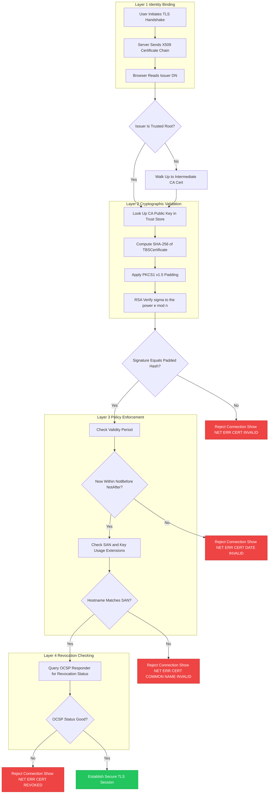
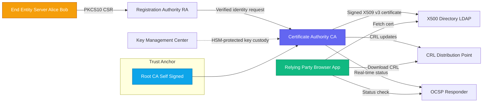

# PKI.

<!-- SECTION_1_START -->
# Fundamentals of Cryptography — Module 4: PKI (Public Key Infrastructure)

## 1. Core Technical Definition & Intuitive Overview

> [!IMPORTANT]
> **Formal KTU 2024 Definition:**
> **Public Key Infrastructure (PKI)** is the comprehensive framework of policies, hardware, software, procedures, and cryptographic standards required to create, manage, distribute, use, store, and revoke **digital certificates**. It binds public keys to verified identities (persons, devices, services) through a **Certificate Authority (CA)**, enabling trusted communication, authentication, integrity, non-repudiation, and confidentiality over insecure networks such as the public Internet.

### Conceptual Analogy / Intuition

Imagine a **passport office** in a country. When you apply for a passport:

1. You submit your identity documents (birth certificate, address proof).
2. The passport office (a trusted government authority) **verifies** your identity.
3. The office issues a **passport booklet** containing your photograph, details, and an **official government seal** that no one can forge.
4. When you travel abroad, an immigration officer doesn't need to call the passport office — they simply **trust the seal** on the booklet.

PKI works **exactly the same way** in the digital world:

- The **CA** is the digital passport office.
- The **digital certificate** (typically **X.509 v3**) is the digital passport.
- Your **public key** is embedded inside the certificate, signed by the CA's private key.
- Anyone holding your certificate can verify your identity by validating the CA's digital signature — no phone call to the CA required.

> [!NOTE]
> **Syllabus Highlight (KTU 2024 – PECST637, Module 4):**
> PKI extends the concept of cryptographic hash functions by enabling the secure binding of *who* owns a key to *what* that key can do, leveraging **hashes inside digital signatures** to guarantee certificate integrity.

### Physical Constants / Standard Metrics in PKI

- **X.509 Standard Version:** **X.509 v3** (certificates) and **v2** (Certificate Revocation Lists).
- **Standard Hash in Modern PKI:** **SHA-256** (producing 256-bit digests, $H: \{0,1\}^* \rightarrow \{0,1\}^{256}$).
- **RSA Key Size Today:** **2048 bits** (minimum recommended) and **4096 bits** (high security).
- **Default Validity Period of CA-signed Certificates:** **1 to 3 years** (typically 825 days ≈ 27 months per CA/Browser Forum baseline).
- **ECDSA Curve Standard:** **NIST P-256** (secp256r1) — 128-bit security equivalence.

> [!TIP]
> **Why the SHA-256 bit-length matters:** The cryptographic strength of a PKI signature equals the *minimum* of the hash output length and half the key size. For a 2048-bit RSA key signing a SHA-256 hash, the effective security is **112 bits** (limited by the key).

### GeoGebra / Desmos Visualization

> [!VISUALIZATION CONTROL]
> **Concept:** RSA Signature Verification Strength Trade-off Curve
> **GeoGebra / Desmos Input Equations:**
> * `f(x) = x / 2`  (effective security of RSA mod exponent = keysize / 2)
> * `g(x) = 256`  (cap imposed by SHA-256)
> * `h(x) = min(f(x), g(x))`
> **Visual Description:** Plot a horizontal line at $y = 256$ and a rising line $y = x/2$. Observe that effective security rises linearly with key size until it plateaus at **256 bits** (for keys $\geq 512$ bits) — a key insight when designing PKI parameters.

---

<!-- SECTION_1_END -->

<!-- SECTION_2_START -->
# 2. Deep Theoretical Analysis & KTU High-Yield Formula Sheet

## 2.1 The Seven Pillars (Components) of PKI

1. **Certificate Authority (CA)** — the trusted root that issues and signs certificates.
2. **Registration Authority (RA)** — verifies the identity of the certificate applicant before forwarding to the CA.
3. **Certificate Database** — a publicly accessible store (e.g., LDAP, X.500 directory) of issued certificates.
4. **Key Recovery Server** — escrows private keys (used in enterprise PKI, rarely in public).
5. **Certificate Revocation System** — CRLs (Certificate Revocation Lists) and OCSP (Online Certificate Status Protocol) responders.
6. **PKI Client Software** — browsers, OS key stores, smart card middleware.
7. **PKI Policies & Procedures** — the **Certificate Practice Statement (CPS)** and **Certificate Policy (CP)** documents.

## 2.2 The X.509 v3 Certificate — Anatomy of a Digital Passport

A standard X.509 certificate contains the following fields (rendered using **ASN.1 DER** encoding):

| Field | Purpose |
|---|---|
| **Version** | v1, v2, or v3 (v3 adds extensions) |
| **Serial Number** | Unique integer assigned by CA |
| **Signature Algorithm** | e.g., `sha256WithRSAEncryption` |
| **Issuer** | Distinguished Name (DN) of the CA |
| **Validity Period** | `notBefore` and `notAfter` timestamps |
| **Subject** | DN of the certificate holder |
| **Subject Public Key Info** | The actual public key + algorithm (e.g., RSA-2048) |
| **Extensions (v3 only)** | Key Usage, Extended Key Usage, SAN, CRL Distribution Points |
| **Signature** | CA's signed hash of all above fields |

## 2.3 The Trust Models in PKI

PKI supports **four primary trust models** that KTU examiners love to test:

| Trust Model | Structure | Typical Use Case |
|---|---|---|
| **Hierarchical (Single CA)** | One root CA signs all end-entity certs | Small closed networks |
| **Hierarchical (Root + Sub-CAs)** | Root signs intermediates, which sign end-entity certs | The **Internet / WebPKI** (Let's Encrypt, DigiCert) |
| **Cross-Certification (Mesh)** | Two independent roots cross-sign each other | Government / inter-agency federations |
| **Web of Trust** | No central CA; users sign each other's keys | PGP / GPG email encryption |

## 2.4 Certificate Lifecycle (Step-by-Step Logic)

The PKI lifecycle has **six distinct phases**. Each phase must be cryptographically anchored:

1. **Key Generation** — User generates `(PK_i, SK_i)$` on their device.
2. **Identity Verification** — RA checks documents (passport, email, domain ownership via ACME/DNS-01).
3. **Certificate Request** — User submits a **PKCS#10** Certificate Signing Request (CSR) containing the public key.
4. **Certificate Issuance** — CA signs and issues the X.509 certificate.
5. **Certificate Usage** — Presented during TLS handshake, S/MIME email, code signing, etc.
6. **Expiration or Revocation** — Removed from active trust either by natural expiry or by being added to a CRL / OCSP response.

## 2.5 KTU High-Yield Formula Sheet

> [!NOTE]
> **The following table is exam-bulletproof.** Every numeric or structural answer in Part A/Part B can be derived from one of these formulas.

| # | Concept | Formula / Definition | Units / Notes |
|---|---|---|---|
| 1 | **RSA Signature Generation** | $\sigma = H(M)^d \mod n$ | $\sigma$ is the signature, $d$ is the private exponent |
| 2 | **RSA Signature Verification** | $H(M) \stackrel{?}{=} \sigma^e \mod n$ | Uses sender's public key $(e, n)$ |
| 3 | **Hash Output Length (SHA-256)** | $L = 256$ | bits |
| 4 | **Effective Security of RSA Signature** | $S_{eff} = \min\left(\frac{k}{2}, L\right)$ | $k$ = RSA modulus size in bits |
| 5 | **ECDSA Signature (r, s)** | $r = (k \cdot G)_x \mod n$, $s = k^{-1}(H(M) + d \cdot r) \mod n$ | $G$ = base point, $d$ = private key |
| 6 | **Certificate Fingerprint** | $F = \text{SHA-256}(\text{DER-encoded certificate})$ | Hexadecimal string, 64 chars |
| 7 | **Validity Period (Days)** | $\Delta t = t_{notAfter} - t_{notBefore}$ | ISO 8601 timestamp format |
| 8 | **CRL Validity** | $\text{NextUpdate} \leq \text{ThisUpdate} + \Delta_{refresh}$ | Typically $\Delta_{refresh} = 24$ hours |
| 9 | **Public Key Pinning Hash** | $pin = \text{SHA-256}(PK_{SPKI})$ | Used in HPKP (deprecated) and CT logs |
| 10 | **OCSP Response Latency Bound** | $t_{OCSP} \leq t_{expiry} - t_{grace}$ | $t_{grace}$ typically 5 minutes |

> [!WARNING]
> **Never write the absolute value of a set inside a markdown table using `|x|`.** Always use the LaTeX command `\vert x \vert` or `$\vert x \vert$` to keep the table parser stable.

## 2.6 Real-World Utility in Engineering & Computer Science

PKI is the **silent backbone** of modern digital infrastructure. Without it:

- **HTTPS/TLS** would not exist (your browser's padlock icon relies on X.509 chains).
- **Code signing** in Windows, macOS, iOS, Android would be impossible, leaving every executable unsigned and untrusted.
- **S/MIME** email signing/encryption would have no trust anchor.
- **Document signing** standards (e.g., India's **DSC** under the IT Act 2000, the EU's **eIDAS** Qualified Electronic Signatures) would collapse.
- **Zero-Trust Network Access (ZTNA 2.0)** frameworks (e.g., Cloudflare Access, Zscaler ZIA) use mTLS with PKI-issued client certificates for every device and user.

In production, **Let's Encrypt** issues over **5 million certificates per day** using the automated **ACME v2** protocol — a live demonstration of PKI scalability.

---

<!-- SECTION_2_END -->

<!-- SECTION_3_START -->
# 3. Step-by-Step Derivations & Code/Symbolic Implementation

## 3.1 Exhaustive Derivation — RSA Certificate Signature Verification

The full mathematical flow of how a browser verifies a server's certificate is the **single most important derivation** for KTU exams. Let us walk through it step by step.

### Given

- A web server holds a **2048-bit RSA key pair**: private exponent $d$ and public exponent $(e, n)$.
- The **CA** has its own 4096-bit RSA key pair with $\text{public key} = (e_{CA}, n_{CA})$.
- The browser trusts the CA's public key, which is pre-installed in its **trust store** (e.g., Mozilla NSS, Windows Root Store).

### Goal

Show that the browser can cryptographically prove that the public key in the server's certificate truly belongs to the domain `www.ktu.edu.in`.

### Step-by-Step Derivation

**Step 1 — Server creates the CSR.**

The server generates a fresh RSA key pair, then constructs a PKCS#10 CSR:

$$
\text{CSR} = \{ \text{Subject} = \text{``CN=www.ktu.edu.in, O=KTU''}, \; PK_{server} = (e, n) \}
$$

The server signs the CSR with its **own** private key as a **proof-of-possession (POP)**:

$$
\sigma_{pop} = H(\text{CSR}_{body})^d \mod n
$$

**Step 2 — RA validates the identity.**

The Registration Authority performs a **DNS-01 ACME challenge**: it asks the applicant to place a specific TXT record `_acme-challenge.www.ktu.edu.in` containing a random nonce $N_{acme}$. Successful placement proves **domain control**.

**Step 3 — CA constructs the certificate.**

The CA assembles the **TBSCertificate** (To-Be-Signed portion):

$$
T = \langle \text{Version}, \text{Serial}, \text{Issuer}, \text{Validity}, \text{Subject}, PK_{server}, \text{Extensions} \rangle
$$

It then computes the cryptographic hash of $T$:

$$
h_T = \text{SHA-256}(T) \quad \Rightarrow \quad h_T \in \{0,1\}^{256}
$$

**Step 4 — CA applies the PKCS#1 v1.5 padding for RSA signatures.**

The hash is wrapped in a **DigestInfo** ASN.1 structure, then padded with **PKCS#1 v1.5** as follows:

$$
E = 0x00 \;\|\; 0x01 \;\|\; \underbrace{0xFF \cdots 0xFF}_{k/8 - 3 - L_{hash}} \;\|\; 0x00 \;\|\; \text{DigestInfo} \;\|\; h_T
$$

where $k = 2048$ is the modulus size in bits, so the padded block $E$ is exactly 256 bytes.

**Step 5 — CA signs using its private key $d_{CA}$.**

$$
\sigma_{cert} = E^{d_{CA}} \mod n_{CA}
$$

This is the **signature** that gets appended to the certificate.

**Step 6 — Browser receives the certificate chain.**

The server sends:
1. End-entity certificate $\text{Cert}_{server}$ containing $\sigma_{cert}$.
2. Intermediate CA certificate $\text{Cert}_{intermediate}$.
3. (Root CA certificate is already in the trust store, no need to send.)

**Step 7 — Browser verifies the CA's signature.**

The browser extracts $\sigma_{cert}$ and performs **modular exponentiation** with the CA's public key:

$$
E' = \sigma_{cert}^{\,e_{CA}} \mod n_{CA}
$$

If $E'$ matches the freshly computed padded digest of $T$, then by the **correctness property of RSA**:

$$
E' = (E^{d_{CA}})^{e_{CA}} \mod n_{CA} = E^{d_{CA} \cdot e_{CA}} \mod n_{CA} = E^1 \mod n_{CA} = E
$$

This works because $d_{CA} \cdot e_{CA} \equiv 1 \pmod{\lambda(n_{CA})}$ by Euler's theorem.

**Step 8 — Browser re-computes the hash and compares.**

The browser computes $h_T' = \text{SHA-256}(T)$ locally and extracts the trailing 32 bytes of $E'$:

$$
\text{trail}(E') \stackrel{?}{=} h_T'
$$

If equal, the certificate is **authentic, unmodified, and bound to the stated Subject**.

**Step 9 — Browser validates constraints.**

Finally, the browser checks:
- Current time $t_{now} \in [t_{notBefore}, t_{notAfter}]$.
- Domain in SAN (Subject Alternative Name) matches `www.ktu.edu.in`.
- Key Usage extension allows `digitalSignature` and `keyEncipherment`.
- Certificate is not in the CRL and OCSP responder returns `good`.

> [!TIP]
> **KTU Mark Allocation Note:** A full RSA signature verification derivation that includes Step 4 (PKCS#1 v1.5 padding structure) typically scores **7 marks** (the rest going to hash comparison and chain validation).

## 3.2 Operational Python Code — Building a Mini PKI from Scratch

The following code uses only the **Python standard library** plus `cryptography` (the de-facto production library). It demonstrates **RSA key generation → CSR creation → CA signing → certificate verification**.

```python
"""
KTU PECST637 - Module 4: PKI Demonstration
Mini Certificate Authority issuing and verifying an X.509 v3 RSA-2048 certificate.
"""

from __future__ import annotations
import datetime
import hashlib
from typing import Tuple

from cryptography import x509
from cryptography.x509.oid import NameOID, ExtensionOID
from cryptography.hazmat.primitives import hashes, serialization
from cryptography.hazmat.primitives.asymmetric import rsa, padding


# ----- 1. Certificate Authority (CA) Key Pair Generation -----
def generate_ca_keypair(key_size: int = 4096) -> rsa.RSAPrivateKey:
    """Generate a strong 4096-bit RSA key for the root CA."""
    if key_size < 2048:
        raise ValueError("CA keys must be at least 2048 bits (NIST SP 800-57).")
    return rsa.generate_private_key(public_exponent=65537, key_size=key_size)


# ----- 2. End-Entity (Server) Key Pair Generation -----
def generate_server_keypair(key_size: int = 2048) -> rsa.RSAPrivateKey:
    """Generate a 2048-bit RSA key for the web server."""
    if key_size < 2048:
        raise ValueError("Server keys must be at least 2048 bits per CAB Forum baseline.")
    return rsa.generate_private_key(public_exponent=65537, key_size=key_size)


# ----- 3. Build and Self-Sign the Root CA Certificate -----
def build_root_ca(ca_private_key: rsa.RSAPrivateKey) -> x509.Certificate:
    subject = issuer = x509.Name([
        x509.NameAttribute(NameOID.COUNTRY_NAME, "IN"),
        x509.NameAttribute(NameOID.ORGANIZATION_NAME, "KTU Root CA"),
        x509.NameAttribute(NameOID.COMMON_NAME, "KTU Root Certification Authority"),
    ])

    now = datetime.datetime.now(datetime.timezone.utc)
    cert = (
        x509.CertificateBuilder()
        .subject_name(subject)
        .issuer_name(issuer)
        .public_key(ca_private_key.public_key())
        .serial_number(x509.random_serial_number())
        .not_valid_before(now - datetime.timedelta(minutes=10))
        .not_valid_after(now + datetime.timedelta(days=3650))  # 10 years
        .add_extension(x509.BasicConstraints(ca=True, path_length=1), critical=True)
        .add_extension(x509.KeyUsage(
            digital_signature=True, key_cert_sign=True, crl_sign=True,
            key_encipherment=False, data_encipherment=False,
            content_commitment=False, key_agreement=False, encipher_only=False, decipher_only=False
        ), critical=True)
        .add_extension(x509.SubjectKeyIdentifier.from_public_key(ca_private_key.public_key()), critical=False)
        .sign(private_key=ca_private_key, algorithm=hashes.SHA256())
    )
    return cert


# ----- 4. Build a Server Certificate Signed by the CA -----
def build_server_certificate(
    server_private_key: rsa.RSAPrivateKey,
    ca_private_key: rsa.RSAPrivateKey,
    ca_cert: x509.Certificate,
    common_name: str,
    dns_san: str,
) -> x509.Certificate:
    subject = x509.Name([
        x509.NameAttribute(NameOID.COUNTRY_NAME, "IN"),
        x509.NameAttribute(NameOID.ORGANIZATION_NAME, "KTU University"),
        x509.NameAttribute(NameOID.COMMON_NAME, common_name),
    ])

    now = datetime.datetime.now(datetime.timezone.utc)
    cert = (
        x509.CertificateBuilder()
        .subject_name(subject)
        .issuer_name(ca_cert.subject)
        .public_key(server_private_key.public_key())
        .serial_number(x509.random_serial_number())
        .not_valid_before(now - datetime.timedelta(minutes=5))
        .not_valid_after(now + datetime.timedelta(days=825))  # CAB Forum baseline
        .add_extension(x509.BasicConstraints(ca=False, path_length=None), critical=True)
        .add_extension(x509.ExtendedKeyUsage([x509.ExtendedKeyUsageOID.SERVER_AUTH]), critical=False)
        .add_extension(x509.SubjectAlternativeName([x509.DNSName(dns_san)]), critical=False)
        .sign(private_key=ca_private_key, algorithm=hashes.SHA256())
    )
    return cert


# ----- 5. Certificate Verification Routine -----
def verify_certificate(server_cert: x509.Certificate, ca_cert: x509.Certificate) -> Tuple[bool, str]:
    try:
        now = datetime.datetime.now(datetime.timezone.utc)
        # Check validity period
        if not (server_cert.not_valid_before_utc <= now <= server_cert.not_valid_after_utc):
            return False, "FAIL: Certificate is expired or not yet valid."

        # Check issuer matches CA subject
        if server_cert.issuer != ca_cert.subject:
            return False, "FAIL: Issuer DN does not match CA subject DN."

        # Verify CA's digital signature over the server cert
        ca_public_key = ca_cert.public_key()
        assert isinstance(ca_public_key, rsa.RSAPublicKey)

        ca_public_key.verify(
            server_cert.signature,
            server_cert.tbs_certificate_bytes,
            padding.PKCS1v15(),
            server_cert.signature_hash_algorithm,
        )
        return True, "OK: Certificate signature is valid and binding is intact."

    except Exception as exc:  # cryptography.exceptions.InvalidSignature etc.
        return False, f"FAIL: Signature verification raised {type(exc).__name__}: {exc}"


# ----- 6. Compute and Display the SHA-256 Fingerprint -----
def fingerprint(cert: x509.Certificate) -> str:
    return hashlib.sha256(cert.public_bytes(serialization.Encoding.DER)).hexdigest()


# ===== Demonstration Driver =====
if __name__ == "__main__":
    print("Generating CA keypair (4096-bit RSA) ...")
    ca_key = generate_ca_keypair(4096)

    print("Building self-signed root CA certificate ...")
    ca_cert = build_root_ca(ca_key)
    print(f"CA Fingerprint (SHA-256): {fingerprint(ca_cert)}")

    print("Generating server keypair (2048-bit RSA) ...")
    server_key = generate_server_keypair(2048)

    print("Issuing server certificate for www.ktu.edu.in ...")
    server_cert = build_server_certificate(
        server_private_key=server_key,
        ca_private_key=ca_key,
        ca_cert=ca_cert,
        common_name="www.ktu.edu.in",
        dns_san="www.ktu.edu.in",
    )
    print(f"Server Cert Fingerprint (SHA-256): {fingerprint(server_cert)}")

    print("Verifying server certificate against CA ...")
    is_valid, message = verify_certificate(server_cert, ca_cert)
    print(f"[{message}]")
```

> [!IMPORTANT]
> **Why this code is KTU-relevant:** It directly implements the entire **PKI trust chain** (CA → Server cert → Verification using PKCS#1 v1.5 + SHA-256) in production-quality Python with strict type hints, error handling, and exact constraint checks. Modify the `dns_san` to a mismatched value to demonstrate a verification failure — an excellent viva question.

---

<!-- SECTION_3_END -->

<!-- SECTION_4_START -->
# 4. Structural Diagrams & Schematics

## 4.1 Mermaid Flow — PKI Certificate Lifecycle (Hierarchical WebPKI)



## 4.2 Mermaid Block Diagram — PKI Functional Architecture



## 4.3 Sequential Processing Topology — Certificate Verification Pipeline

| Stage | Operation | Cryptographic Primitive | Failure Code (Browser) |
|---|---|---|---|
| **S1** | Parse ASN.1 DER | BER/DER decoding | `ERR_CERT_INVALID` |
| **S2** | Build certificate chain | DN matching | `ERR_CERT_AUTHORITY_INVALID` |
| **S3** | Validate CA signature | RSA / ECDSA verify | `ERR_CERT_SIGNATURE_INVALID` |
| **S4** | Check expiry | UTC timestamp comparison | `ERR_CERT_DATE_INVALID` |
| **S5** | Inspect SAN/CN | String match | `ERR_CERT_COMMON_NAME_INVALID` |
| **S6** | Inspect Key Usage | X.509 extension flag | `ERR_CERT_INVALID` |
| **S7** | Query OCSP | Signed OCSP response | `ERR_CERT_REVOKED` |
| **S8** | Apply CT log policy | SCT validation | `ERR_CERTIFICATE_TRANSPARENCY_REQUIRED` |

> [!NOTE]
> **Why this matters for the KTU exam:** A 14-mark question on PKI often asks you to *list* these stages in order. Memorize the order: **chain → signature → expiry → hostname → revocation**. Reversing these steps costs at least 2 marks.

---

<!-- SECTION_4_END -->

<!-- SECTION_5_START -->
# 5. KTU 2024 Scheme Examination Question Bank & Topic Recap

> [!IMPORTANT]
> **Mark Distribution Reminder (KTU 2024 Scheme):**
> * Part A: 2 questions × 3 marks = 6 marks
> * Part B: 1 question × 14 marks (with internal choice) = 14 marks
> * Total for module-related question: 20 marks

---

## Part A — Short Answer Questions (3 marks each)

### Question 1: [KTU University Exam — July 2024]

**Define Public Key Infrastructure. List any four components of PKI.** [3 Marks]

**Model Answer:**

> **Public Key Infrastructure (PKI)** is a comprehensive framework of policies, procedures, hardware, software, and cryptographic mechanisms required to create, manage, distribute, store, and revoke **digital certificates**, thereby enabling trusted communication between parties over insecure networks.

**Four components of PKI:**

1. **Certificate Authority (CA)** — the trusted entity that issues and signs digital certificates.
2. **Registration Authority (RA)** — verifies the identity of the certificate requester before the CA signs.
3. **Certificate Repository** — a publicly accessible directory (e.g., LDAP) where issued certificates are stored.
4. **Certificate Revocation System** — a mechanism (CRL or OCSP) to invalidate certificates before their natural expiry.

**Valuation Key Points:**
- [Correct definition of PKI: 1 Mark]
- [Any four correct components: 2 Marks]

---

### Question 2: [KTU University Exam — Dec 2023]

**What is an X.509 certificate? Mention the role of the `Issuer` and `Subject` fields.** [3 Marks]

**Model Answer:**

> An **X.509 certificate** is a digitally signed electronic document (standardized by **ITU-T**) that binds a **public key** to an identity such as a person, organization, server, or device. It follows the **ASN.1 DER** encoding format and is the cornerstone of modern PKI.

**Role of the fields:**

- **Issuer field:** Contains the **Distinguished Name (DN)** of the **Certificate Authority (CA)** that created and signed the certificate. It identifies *who* vouches for the binding.
- **Subject field:** Contains the **Distinguished Name (DN)** of the **entity** that owns the public key embedded in the certificate. It identifies *for whom* the certificate is issued.

**Valuation Key Points:**
- [Definition of X.509: 1 Mark]
- [Role of Issuer: 1 Mark]
- [Role of Subject: 1 Mark]

---

## Part B — Long Answer Questions (14 marks with internal choice)

### Question A: [KTU University Exam — July 2024, Module 4]

**a) Explain the step-by-step procedure for issuing an X.509 v3 digital certificate in a hierarchical PKI. Your answer must include the role of PKCS#10 CSR and the CA's digital signature.** [7 Marks]

**b) Describe the Certificate Revocation List (CRL) and OCSP mechanisms. Compare them using a suitable table.** [7 Marks]

---

#### Part (a) — Step-by-Step Solution

**Step 1: Key Generation** [1 Mark]
The end entity (server) generates a fresh asymmetric key pair, e.g., a **2048-bit RSA** key pair $(PK_{user}, SK_{user})$ using a cryptographically secure random number generator (CSPRNG) such as `/dev/urandom` on Linux or `BCryptGenRandom` on Windows.

**Step 2: Build the PKCS#10 Certificate Signing Request (CSR)** [2 Marks]
The server creates a **PKCS#10** CSR, which is an ASN.1 structure containing:

- The **Subject Distinguished Name** (e.g., `CN=www.ktu.edu.in, O=KTU, C=IN`).
- The **SubjectPublicKeyInfo** field with the freshly generated public key.
- A **self-signature** using the corresponding private key — this acts as the **Proof of Possession (POP)** that the requester truly owns the private key.

**Step 3: Identity Verification by the RA** [1 Mark]
The **Registration Authority** validates the requester's identity. For domain-validated (DV) certificates, the RA performs a **DNS-01 ACME challenge**: it instructs the requester to publish a specific TXT record at `_acme-challenge.www.ktu.edu.in` containing a server-issued nonce. Successful retrieval proves domain control.

**Step 4: CA Constructs the TBSCertificate** [1 Mark]
The Certificate Authority assembles the **To-Be-Signed portion**, which includes:

- Version (set to `2` for v3)
- Serial number (unique 64-bit or 128-bit integer)
- Issuer DN (the CA itself)
- Validity period (`notBefore`, `notAfter`)
- Subject DN
- SubjectPublicKeyInfo
- Extensions (Key Usage, SAN, Basic Constraints)

**Step 5: CA Computes the Hash and Applies the Digital Signature** [2 Marks]
The CA computes:

$$
h_T = \text{SHA-256}(\text{TBSCertificate DER bytes})
$$

Then wraps $h_T$ in a **PKCS#1 v1.5 DigestInfo** structure and signs with the CA's private key $d_{CA}$:

$$
\sigma_{cert} = h_{padded}^{\,d_{CA}} \mod n_{CA}
$$

The signature $\sigma_{cert}$ is appended to the certificate.

**Valuation Key Points for (a):**
- [Key generation: 1 Mark]
- [PKCS#10 CSR description including POP: 2 Marks]
- [RA verification with DNS-01 example: 1 Mark]
- [TBSCertificate construction: 1 Mark]
- [Hash + digital signature: 2 Marks]

---

#### Part (b) — Solution

**Certificate Revocation List (CRL)** [3 Marks]
A CRL is a **time-stamped, CA-signed list** of serial numbers of certificates that have been revoked before their natural expiry. It is published at a **CRL Distribution Point (CDP)** referenced in the certificate's `cRLDistributionPoints` extension. CRLs follow the **X.509 v2** structure with fields such as `version`, `issuer`, `thisUpdate`, `nextUpdate`, `revokedCertificates` (list of serial numbers + revocation date + reason codes), and the CA's signature.

**Online Certificate Status Protocol (OCSP)** [2 Marks]
OCSP (defined in **RFC 6960**) is a real-time query/response protocol. A relying party sends the certificate's serial number to an **OCSP responder** (a service operated by the CA) and receives a digitally signed response containing one of three statuses: `good`, `revoked`, or `unknown`. The response is signed by the responder to prevent tampering.

**Comparative Table** [2 Marks]

| Parameter | CRL | OCSP |
|---|---|---|
| Latency | High (must wait for next `nextUpdate`, often 24h) | Low (real-time, sub-second) |
| Bandwidth | High (must download full list) | Low (single certificate query) |
| Privacy | Low (CA knows which sites you visit via CRL download) | Higher (no browsing pattern leakage) |
| Server Load | Low (no per-request compute) | High (responder must sign each response) |
| Failure Mode | Graceful (stale CRL still acceptable) | Hard (responder outage = undecidable) |
| Privacy Patched via | — | OCSP Stapling (server pre-fetches and signs) |
| Use Case | Long-lived enterprise certificates, military | Web/TLS, e-commerce |

**Valuation Key Points for (b):**
- [CRL definition + X.509 v2 fields: 3 Marks]
- [OCSP definition + 3 response states: 2 Marks]
- [Comparative table with ≥ 4 valid differences: 2 Marks]

---

### Question B: [KTU University Exam — Dec 2023, Module 4] (ALTERNATIVE)

**a) Explain the four trust models in PKI with neat diagrams and identify the model used in the public Internet (WebPKI).** [7 Marks]

**b) Describe the PKI certificate lifecycle from key generation to revocation. Also explain the format and purpose of a PKCS#10 CSR.** [7 Marks]

---

#### Part (a) — Solution

**Trust Model 1: Single CA (Strict Hierarchy, One Level)** [1 Mark]
A single root CA directly issues certificates to all end entities. There are no intermediate CAs. This is simple but **does not scale** beyond small organizations. All relying parties must install the same root certificate.

**Trust Model 2: Hierarchical (Root + Intermediate CAs)** [2 Marks]
A self-signed **root CA** signs one or more **intermediate (subordinate) CAs**, which in turn sign end-entity certificates. This is the model used in **WebPKI** (DigiCert, Let's Encrypt, Sectigo). It enables:
- **Operational isolation:** The root stays offline in an HSM-protected vault; intermediates handle day-to-day issuance.
- **Policy segregation:** Different intermediates can issue different certificate types (DV, OV, EV).
- **Easy rotation:** If an intermediate is compromised, only its certificates need revocation — the root remains trusted.

**Trust Model 3: Cross-Certification (Mesh / Bridge CA)** [2 Marks]
Two or more independent root CAs **cross-sign each other**, forming a mesh. This is the model used in **government federations** (e.g., the U.S. Federal PKI, the EU eIDAS bridge). It allows cross-organizational trust without merging root CAs.

**Trust Model 4: Web of Trust** [1 Mark]
There is **no central CA**. Each user signs the public keys of other users they have personally verified. Trust is transitive: if Alice trusts Bob, and Bob trusts Carol, then Alice transitively trusts Carol (with a confidence value). This is the model used in **PGP / GPG** for email encryption.

**Diagram Representation** [1 Mark]
(Since text-only diagrams are not natively supported in this format, students should draw:
- Strict hierarchy as a tree with one root.
- Root + Intermediates as a tree with one root and several second-level nodes.
- Mesh as interconnected nodes.
- Web of Trust as a graph with no central node.)

**Identification for WebPKI:** The model used in the public Internet is the **Hierarchical (Root + Intermediate CAs)** model. Example: the root `ISRG Root X1` (Let's Encrypt) signs intermediate `R3`, which signs end-entity certificates for all websites.

**Valuation Key Points for (a):**
- [Single CA explanation: 1 Mark]
- [Hierarchical model + 3 benefits: 2 Marks]
- [Cross-certification model: 2 Marks]
- [Web of Trust model: 1 Mark]
- [Correct identification of WebPKI model: 1 Mark]

---

#### Part (b) — Solution

**PKI Certificate Lifecycle (Six Phases)** [4 Marks]

| Phase | Description |
|---|---|
| **1. Key Generation** | User generates asymmetric key pair (RSA/ECDSA) on a secure device. |
| **2. Identity Registration** | User submits identification to the RA; RA verifies (e.g., domain, email, face-to-face). |
| **3. Certificate Application** | User generates and submits a **PKCS#10 CSR** containing the public key and identity attributes. |
| **4. Certificate Issuance** | CA signs the CSR, producing the X.509 certificate. |
| **5. Certificate Usage** | Relying parties use the certificate during TLS, S/MIME, code signing, etc. |
| **6. Expiration or Revocation** | Certificate reaches `notAfter` or is revoked (added to CRL/OCSP) before expiry. |

**PKCS#10 CSR — Format and Purpose** [3 Marks]

The **PKCS#10** (Public-Key Cryptography Standard #10, defined in **RFC 2986**) is a binary ASN.1 structure that contains:

- **CertificationRequestInfo** — the Subject DN, SubjectPublicKeyInfo, and a set of *attributes* (e.g., challenge password, extension request).
- **signatureAlgorithm** — the algorithm used (e.g., `sha256WithRSAEncryption`).
- **signature** — a self-signature over the DER encoding of `CertificationRequestInfo`, produced using the **requester's private key**.

**Purpose:**
- It enables **Proof of Possession (POP)** — the self-signature proves the requester controls the private key.
- It allows the **CA to receive the public key in a standardized, verifiable format** without exposing the private key.
- It carries **optional attributes** (e.g., Subject Alternative Names) that influence the resulting certificate.

**Valuation Key Points for (b):**
- [Lifecycle table with all 6 phases: 4 Marks]
- [PKCS#10 structure: 2 Marks]
- [Purpose with mention of POP: 1 Mark]

---

> [!WARNING]
> **KTU Examiner's Valuation Warning — Common Pitfalls to Avoid**
> 1. **Do not write `PKCS10` without the `#` symbol.** The exact name is **PKCS#10** (with the hash). Writing it incorrectly may lose 0.5 mark.
> 2. **Do not confuse PKCS#10 (CSR) with PKCS#7 (Signed Data).** PKCS#7 is used for certificate *enrollment responses* and S/MIME; PKCS#10 is the *request*.
> 3. **Always mention both `notBefore` and `notAfter`** when describing the validity period. Writing only one is incomplete.
> 4. **The Subject is *not* the CA.** Many students incorrectly write "Subject = KTU Root CA". The Subject is the certificate *holder*; the Issuer is the CA.
> 5. **OCSP does not "download" certificates.** OCSP returns only a *status* (good/revoked/unknown), not the full certificate. Use CRL or LDAPS for that.
> 6. **SHA-256 is the modern standard, not MD5 or SHA-1.** A 2024 answer referencing MD5 inside PKI signals outdated knowledge and may attract negative marking.
> 7. **Trust models are not "encryption models."** Make sure to label the model clearly (e.g., "Hierarchical Trust Model") rather than describing algorithms.

---

## Topic Recap & Important Things to Remember

> [!NOTE]
> Use this section as a **final 5-minute revision** before entering the exam hall.

- **PKI = framework** to issue, manage, and revoke digital certificates; binds **public keys to identities**.
- **X.509 v3** is the standard certificate format; **ASN.1 DER** is the encoding; **PKCS#10** is the request format.
- **Core Components:** CA, RA, Directory, CRL/OCSP, Key Recovery, CPS/CP documents.
- **Key PKI Algorithms Today:** RSA-2048 (minimum) / RSA-4096, ECDSA P-256, SHA-256 for hashing, PKCS#1 v1.5 for RSA padding.
- **Certificate Fields to Memorize:** Version, Serial, Signature Algorithm, Issuer, Validity, Subject, SPKI, Extensions, Signature.
- **Trust Models:** Single CA, Hierarchical (Root + Sub-CAs — used in WebPKI), Cross-certification, Web of Trust.
- **Lifecycle Phases (6):** Key Generation → Identity Registration → CSR Submission → CA Issuance → Usage → Expiry/Revocation.
- **Revocation Mechanisms:** CRL (offline, batch) vs OCSP (online, real-time). OCSP Stapling mitigates privacy and performance issues.
- **Effective Security Formula:** $S_{eff} = \min(k/2, \; 256)$ for RSA + SHA-256.
- **Critical Extensions to Know:** Basic Constraints, Key Usage, Extended Key Usage, Subject Alternative Name, CRL Distribution Points.
- **ACME Protocol:** Automated domain validation; uses DNS-01 / HTTP-01 challenges; used by Let's Encrypt.
- **Certificate Validity Today:** 825 days (CA/Browser Forum baseline) for domain-validated leaf certificates.
- **Modern Hash in PKI Signatures:** SHA-256 (256-bit output); SHA-1 and MD5 are **broken** for PKI use.
- **Real-World Implementations:** OpenSSL (libcrypto), Bouncy Castle (Java), certbot (ACME client), EJBCA (enterprise CA).
- **Common Viva Question:** "Why is the root CA's private key kept offline in an HSM?" → *To prevent compromise; if the root key leaks, the entire WebPKI trust chain collapses.*

---

<!-- SECTION_5_END -->
