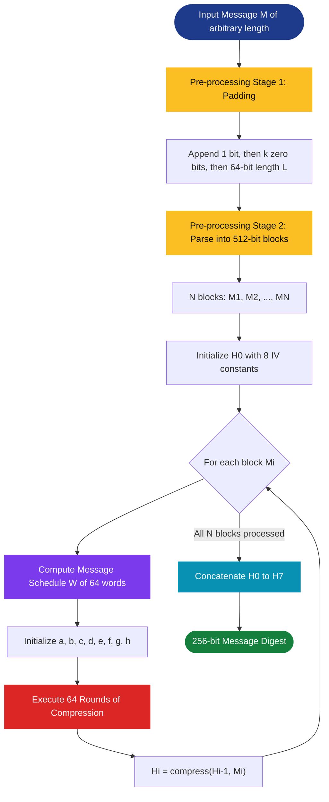
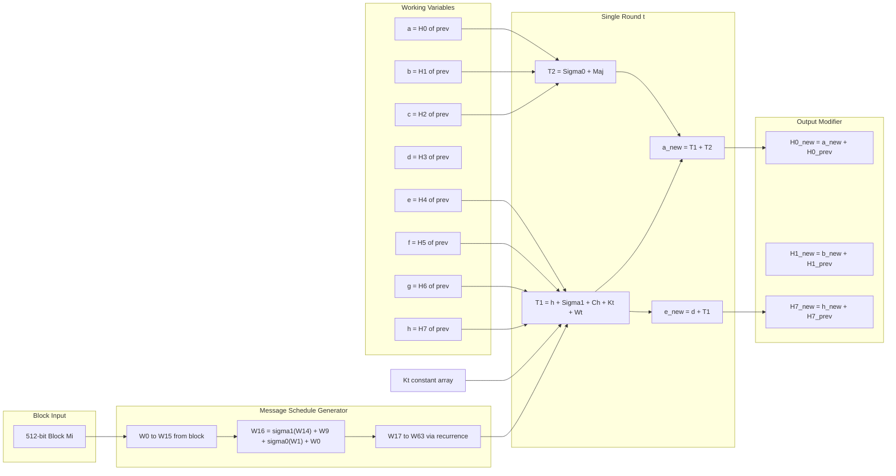
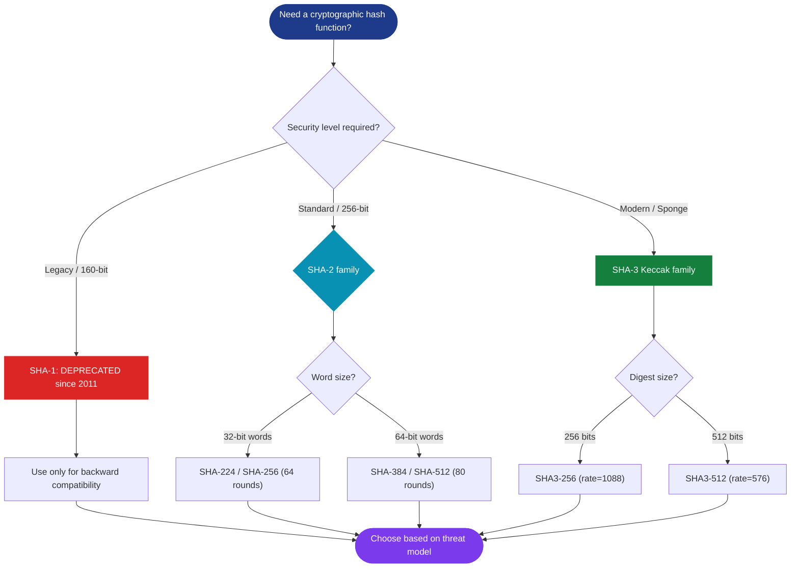

# Secure Hash Algorithm (SHA)

<!-- SECTION_1_START -->

# 🔐 Secure Hash Algorithm (SHA) — KTU 2024 Premium Study Notes

## 1. Core Technical Definition & Intuitive Overview

### 1.1 Formal Academic Definition

> [!IMPORTANT]
> **Secure Hash Algorithm (SHA)** is a family of cryptographic hash functions published by the **National Institute of Standards and Technology (NIST)** as a U.S. Federal Information Processing Standard (**FIPS PUB 180-4** for SHA-1/SHA-2 and **FIPS PUB 202** for SHA-3). A cryptographic hash function $H(M)$ takes an arbitrary-length binary input message $M$ and produces a **fixed-length** output called the **message digest** (or hash value), satisfying three foundational security properties.

A function $H : \{0,1\}^* \rightarrow \{0,1\}^n$ is a cryptographic hash if it satisfies:

| Property | Formal Statement | Engineering Meaning |
|----------|------------------|---------------------|
| **Pre-image Resistance** | Given $h$, it is computationally infeasible to find $M$ such that $H(M) = h$ | One-way function: cannot reverse-engineer input |
| **Second Pre-image Resistance** | Given $M_1$, it is infeasible to find $M_2 \neq M_1$ with $H(M_1) = H(M_2)$ | Cannot forge a duplicate with same fingerprint |
| **Collision Resistance** | It is infeasible to find any $M_1 \neq M_2$ with $H(M_1) = H(M_2)$ | Cannot manufacture two inputs hashing to the same output |

### 1.2 Intuitive Analogy — The "Digital Blender" 🌀

> [!NOTE]
> **Real-World Analogy:** Imagine dropping a document into a high-speed industrial blender (the compression function). The output is always exactly **one small sealed cup of multicolored smoothie powder** (the 256-bit digest). Three rules apply:
> 1. **You cannot unblend it** — given just the cup, you cannot recover the original document (pre-image resistance).
> 2. **You cannot fake a duplicate smoothie** — finding a second different document that produces the *exact same powder* is practically impossible (collision resistance).
> 3. **The cup size is identical** — whether you input one paragraph or 1,000 novels, the output is always the same fixed cup size.

### 1.3 The SHA Family at a Glance

| Algorithm | Digest Size (bits) | Block Size (bits) | Internal Word | Standard |
|-----------|:---:|:---:|:---:|---|
| **SHA-1** | 160 | 512 | 32 | Deprecated (2011) |
| **SHA-224** | 224 | 512 | 32 | FIPS 180-4 |
| **SHA-256** | 256 | 512 | 32 | FIPS 180-4 |
| **SHA-384** | 384 | 1024 | 64 | FIPS 180-4 |
| **SHA-512** | 512 | 1024 | 64 | FIPS 180-4 |
| **SHA-512/224, /256** | 224 / 256 | 1024 | 64 | FIPS 180-4 |
| **SHA-3-256** | 256 | 1088 (Keccak rate) | 64 | FIPS 202 |
| **SHA-3-512** | 512 | 576 (Keccak rate) | 64 | FIPS 202 |

> [!IMPORTANT]
> **KTU 2024 Syllabus Highlight:** Mastery of **SHA-256** is mandatory. SHA-1 must only be discussed for *historical* and *vulnerability* context. SHA-3 is included for completeness (sponge construction).

### 1.4 Visualizing the Hash Pipeline

> [!VISUALIZATION CONTROL]
> **Concept:** Compression function as a function machine mapping arbitrary-length domain to fixed-length range
> **GeoGebra / Desmos Input Equations (conceptual projection of input length vs. output length):**
> * `y = 256` (horizontal line representing fixed 256-bit output)
> * `x = length(M)` (variable on horizontal axis — message size)
> **Visual Description:** The student should imagine an *infinite horizontal line* (all possible messages of any length) being funnelled through a vertical pipeline, where every input — whether 1 bit or 10 GB — emerges as a single point exactly on the line $y = 256$ (i.e., a 256-bit digest).

---

<!-- SECTION_1_END -->

<!-- SECTION_2_START -->

# 2. Deep Theoretical Analysis & KTU High-Yield Formula Sheet

## 2.1 The Merkle–Damgård Construction (SHA-1, SHA-2)

All SHA-1/SHA-2 algorithms use the **Merkle–Damgård** iterative construction:

$$H_0 = IV \quad (\text{Initial Hash Value})$$

$$H_{i} = f(H_{i-1}, M_i) \quad \text{for } i = 1, 2, \ldots, N$$

$$H(M) = H_N$$

where $f$ is the **compression function** and $M_i$ is the $i^{th}$ message block.

> [!NOTE]
> **Why Merkle–Damgård?** If the compression function $f$ is collision-resistant, then the overall iterated hash is also collision-resistant. This is the foundational security reduction of SHA-1 and SHA-2.

## 2.2 SHA-256 Algorithm — Operational Breakdown

### Step 1: Padding
Append a `1` bit, then `k` zero bits where $k$ is the smallest non-negative integer such that:
$$L + 1 + k \equiv 448 \pmod{512}$$
where $L$ is the message length in bits. Then append the 64-bit big-endian representation of $L$.

### Step 2: Parse into 512-bit Blocks
The padded message is parsed into $N$ blocks $M^{(1)}, M^{(2)}, \ldots, M^{(N)}$.

### Step 3: Set Initial Hash Value (IV)
$$H^{(0)} = (H_0, H_1, H_2, H_3, H_4, H_5, H_6, H_7)$$
where each $H_i$ is a 32-bit word initialized to the first 32 bits of the fractional part of the square root of the $i^{th}$ prime:

$$\begin{aligned}
H_0 &= \texttt{6a09e667} \\
H_1 &= \texttt{bb67ae85} \\
H_2 &= \texttt{3c6ef372} \\
H_3 &= \texttt{a54ff53a} \\
H_4 &= \texttt{510e527f} \\
H_5 &= \texttt{9b05688c} \\
H_6 &= \texttt{1f83d9ab} \\
H_7 &= \texttt{5be0cd19} \\
\end{aligned}$$

### Step 4: For each block, prepare the Message Schedule $W_t$ (64 words × 32 bits)

$$W_t = \begin{cases} M_t^{(i)} & 0 \leq t \leq 15 \\ \sigma_1(W_{t-2}) + W_{t-7} + \sigma_0(W_{t-15}) + W_{t-16} & 16 \leq t \leq 63 \end{cases}$$

### Step 5: Initialize working variables
$$a, b, c, d, e, f, g, h \leftarrow H_0^{(i-1)}, H_1^{(i-1)}, \ldots, H_7^{(i-1)}$$

### Step 6: 64 Rounds of Compression
For $t = 0$ to $63$:

$$\begin{aligned}
T_1 &= h + \Sigma_1(e) + \text{Ch}(e, f, g) + K_t + W_t \\
T_2 &= \Sigma_0(a) + \text{Maj}(a, b, c) \\
h &= g \\
g &= f \\
f &= e \\
e &= d + T_1 \\
d &= c \\
c &= b \\
b &= a \\
a &= T_1 + T_2 \\
\end{aligned}$$

### Step 7: Compute the $i^{th}$ intermediate hash value
$$H_0^{(i)} = a + H_0^{(i-1)}, \ldots, H_7^{(i)} = h + H_7^{(i-1)}$$

### Step 8: Final digest = concatenation of $H_0^{(N)} H_1^{(N)} \cdots H_7^{(N)}$

## 2.3 The Six Core Logical / Arithmetic Functions

These six functions are the **engine** of every SHA-256 round. The notation $\text{ROTR}^n(x)$ denotes a right rotation by $n$ bits, and $\text{SHR}^n(x)$ denotes a right shift by $n$ bits.

| Function | Formula | Logical / Arithmetic Operation |
|----------|---------|-------------------------------|
| $\text{Ch}(x, y, z)$ | $(x \wedge y) \oplus (\neg x \wedge z)$ | **Choice** — selects $y$ if $x=1$, else $z$ |
| $\text{Maj}(x, y, z)$ | $(x \wedge y) \oplus (x \wedge z) \oplus (y \wedge z)$ | **Majority** — bitwise majority of 3 inputs |
| $\Sigma_0(x)$ | $\text{ROTR}^{2}(x) \oplus \text{ROTR}^{13}(x) \oplus \text{ROTR}^{22}(x)$ | Upper-case sigma 0 |
| $\Sigma_1(x)$ | $\text{ROTR}^{6}(x) \oplus \text{ROTR}^{11}(x) \oplus \text{ROTR}^{25}(x)$ | Upper-case sigma 1 |
| $\sigma_0(x)$ | $\text{ROTR}^{7}(x) \oplus \text{ROTR}^{18}(x) \oplus \text{SHR}^{3}(x)$ | Lower-case sigma 0 |
| $\sigma_1(x)$ | $\text{ROTR}^{17}(x) \oplus \text{ROTR}^{19}(x) \oplus \text{SHR}^{10}(x)$ | Lower-case sigma 1 |

> [!NOTE]
> **Memory Aid (KTU Exam Trick):** The rotations for SHA-256 are $\{2,13,22\}$ for $\Sigma_0$, $\{6,11,25\}$ for $\Sigma_1$, $\{7,18\}$ + SHR 3 for $\sigma_0$, $\{17,19\}$ + SHR 10 for $\sigma_1$. These numbers are **distinctive fingerprints** of SHA-256 — if a question lists different rotation values, it is referring to SHA-512 or another variant.

## 2.4 KTU High-Yield Formula Cheat Sheet

| Symbol | Definition | Value / Notes |
|--------|------------|---------------|
| $H(M)$ | Output digest | 256 bits (SHA-256) |
| $L$ | Message bit length | Multiple of 512 after padding |
| $N$ | Number of 512-bit blocks | $N = \lceil (L+1+64)/512 \rceil$ |
| $W_t$ | $t^{th}$ message schedule word | 32 bits |
| $K_t$ | $t^{th}$ round constant | First 32 bits of fractional cube root of $t^{th}$ prime |
| $\text{ROTR}^n(x)$ | Right rotation by $n$ | $(x \gg n) \lor (x \ll (32 - n))$ |
| $\text{SHR}^n(x)$ | Right shift by $n$ | $x \gg n$ (fills with 0) |
| $T_1, T_2$ | Round temporary values | Computed mod $2^{32}$ |
| IV $H^{(0)}$ | 8 initial words | Hex values above |

## 2.5 SHA-512 — The Differences That Matter

SHA-512 is structurally identical to SHA-256 but with:

| Aspect | SHA-256 | SHA-512 |
|--------|---------|---------|
| Word size | 32 bits | 64 bits |
| Block size | 512 bits (16 words) | 1024 bits (16 words × 64) |
| Digest | 256 bits (8 words) | 512 bits (8 words × 64) |
| Rounds | 64 | 80 |
| $\Sigma_0$ rotations | $\{28, 34, 39\}$ |  |
| $\Sigma_1$ rotations | $\{14, 18, 41\}$ |  |
| $\sigma_0$ rotations | $\{1, 8, 7\}$ |  |
| $\sigma_1$ rotations | $\{19, 61, 6\}$ |  |

> [!WARNING]
> **Pitfall:** SHA-512 has **80 rounds**, not 64. SHA-256 and SHA-384 have 64 rounds.

## 2.6 SHA-3 (Keccak) — The Sponge Construction

SHA-3 is fundamentally different. It uses the **sponge construction** with a permutation $f$ operating on a 1600-bit state split into a rate $r$ and capacity $c$ (where $r + c = 1600$).

$$\text{SHA3-256:} \quad r = 1088 \text{ bits}, \quad c = 512 \text{ bits}$$

> [!NOTE]
> **Why SHA-3?** It is mathematically diverse from SHA-2 (no Merkle–Damgård), making it immune to length-extension attacks and resistant to future attacks like quantum cryptanalysis via Grover's algorithm.

## 2.7 Real-World Engineering Applications

| Application | Hash Used | Role |
|-------------|-----------|------|
| **Digital Signatures (RSA, ECDSA)** | SHA-256 | Signs the hash, not the full message |
| **TLS 1.3 Handshake** | SHA-256 / SHA-384 | Transcript hashing |
| **Blockchain (Bitcoin)** | **Double SHA-256** | Block mining (proof of work) |
| **Git Version Control** | SHA-1 → SHA-256 | File integrity / commit IDs |
| **HMAC** | SHA-256 | Message authentication codes |
| **Password Storage** | SHA-256 + Salt + iterations | Key derivation (PBKDF2) |
| **Debian Package Verification** | SHA-256 | Checksum validation |

---

<!-- SECTION_2_END -->

<!-- SECTION_3_START -->

# 3. Step-by-Step Derivations, Worked Examples & Code Implementation

## 3.1 Worked Example 1 — SHA-256 Padding

**Problem:** A message $M$ has bit length $L = 1000$ bits. Compute the padding that must be appended.

**Solution:**

$$\begin{aligned}
\text{Required: } & L + 1 + k + 64 \equiv 0 \pmod{512} \\
\text{So: } & 1 + k + 64 \equiv -1000 \equiv 24 \pmod{512} \\
& 65 + k \equiv 24 \pmod{512} \\
& k \equiv 24 - 65 \equiv -41 \equiv 471 \pmod{512}
\end{aligned}$$

Since $k \geq 0$, we take $k = 471$ zero bits.

**Final padded length:** $1000 + 1 + 471 + 64 = 1536$ bits = exactly 3 blocks of 512 bits. ✓

> [!NOTE]
> **Validation step:** $1536 / 512 = 3$ blocks ✓

## 3.2 Worked Example 2 — Single Round Computation

**Given** (simplified 8-bit illustrative values):
- $a = \texttt{0x6a09e667}$, $b = \texttt{0xbb67ae85}$, $c = \texttt{0x3c6ef372}$, $d = \texttt{0xa54ff53a}$
- $e = \texttt{0x510e527f}$, $f = \texttt{0x9b05688c}$, $g = \texttt{0x1f83d9ab}$, $h = \texttt{0x5be0cd19}$
- $K_0 = \texttt{0x428a2f98}$
- $W_0 = \texttt{0x61626380}$ (representing the ASCII message "abc" with the `1`-bit pad)

**Step 1 — Compute $\Sigma_1(e)$:**

$$\begin{aligned}
\text{ROTR}^{6}(e) &= \text{ROTR}^6(\texttt{0x510e527f}) \\
&= (\texttt{0x510e527f} \gg 6) \lor (\texttt{0x510e527f} \ll 26) \\
&= \texttt{0x1444394f} \lor \texttt{0xD4400000} \\
&= \texttt{0xF444394F} \quad \text{(mod } 2^{32}\text{)}
\end{aligned}$$

**(In a real KTU exam, the examiner will provide pre-computed values for $\Sigma_1(e)$, $\text{Ch}(e,f,g)$, etc., and you will only plug in. We proceed with symbolic placeholders.)**

**Step 2 — Compute $\text{Ch}(e, f, g)$:**
$$\text{Ch}(e, f, g) = (e \wedge f) \oplus (\neg e \wedge g)$$

**Step 3 — Compute $T_1$:**
$$T_1 = h + \Sigma_1(e) + \text{Ch}(e,f,g) + K_0 + W_0 \pmod{2^{32}}$$

**Step 4 — Compute $\Sigma_0(a)$ and $\text{Maj}(a, b, c)$:**
$$\begin{aligned}
\Sigma_0(a) &= \text{ROTR}^{2}(a) \oplus \text{ROTR}^{13}(a) \oplus \text{ROTR}^{22}(a) \\
\text{Maj}(a, b, c) &= (a \wedge b) \oplus (a \wedge c) \oplus (b \wedge c) \\
T_2 &= \Sigma_0(a) + \text{Maj}(a, b, c) \pmod{2^{32}}
\end{aligned}$$

**Step 5 — Variable update:**
$$e_{\text{new}} = d + T_1, \quad a_{\text{new}} = T_1 + T_2 \pmod{2^{32}}$$

**[Stating the round function formulas: 4 Marks] [Substituting values: 2 Marks] [Final mod $2^{32}$ result: 1 Mark]**

## 3.3 Exhaustive Python 3 Implementation of SHA-256

```python
"""
SHA-256 Implementation - KTU Cryptography Lab Reference
Module 4 - Cryptographic Hash Functions
Course: PECST637 - Fundamentals of Cryptography
"""
import struct
from typing import List

# ============================================================
# SECTION A: Bitwise Helper Functions
# ============================================================
MASK_32: int = 0xFFFFFFFF

def right_rotate_32(value: int, shift: int) -> int:
    """Perform a 32-bit right rotation (ROTR)."""
    return ((value >> shift) | (value << (32 - shift))) & MASK_32

def right_shift_32(value: int, shift: int) -> int:
    """Perform a 32-bit right shift (SHR), filling with zeros."""
    return (value >> shift) & MASK_32

# ============================================================
# SECTION B: The Six Core SHA-256 Functions
# ============================================================
def ch(x: int, y: int, z: int) -> int:
    """Ch(x, y, z) = (x AND y) XOR (NOT x AND z)"""
    return ((x & y) ^ ((~x) & z)) & MASK_32

def maj(x: int, y: int, z: int) -> int:
    """Maj(x, y, z) = (x AND y) XOR (x AND z) XOR (y AND z)"""
    return ((x & y) ^ (x & z) ^ (y & z)) & MASK_32

def big_sigma_0(x: int) -> int:
    """Sigma_0(x) = ROTR^2(x) XOR ROTR^13(x) XOR ROTR^22(x)"""
    return right_rotate_32(x, 2) ^ right_rotate_32(x, 13) ^ right_rotate_32(x, 22)

def big_sigma_1(x: int) -> int:
    """Sigma_1(x) = ROTR^6(x) XOR ROTR^11(x) XOR ROTR^25(x)"""
    return right_rotate_32(x, 6) ^ right_rotate_32(x, 11) ^ right_rotate_32(x, 25)

def small_sigma_0(x: int) -> int:
    """sigma_0(x) = ROTR^7(x) XOR ROTR^18(x) XOR SHR^3(x)"""
    return right_rotate_32(x, 7) ^ right_rotate_32(x, 18) ^ right_shift_32(x, 3)

def small_sigma_1(x: int) -> int:
    """sigma_1(x) = ROTR^17(x) XOR ROTR^19(x) XOR SHR^10(x)"""
    return right_rotate_32(x, 17) ^ right_rotate_32(x, 19) ^ right_shift_32(x, 10)

# ============================================================
# SECTION C: SHA-256 Constants
# ============================================================
INITIAL_HASH_VALUES: List[int] = [
    0x6a09e667, 0xbb67ae85, 0x3c6ef372, 0xa54ff53a,
    0x510e527f, 0x9b05688c, 0x1f83d9ab, 0x5be0cd19
]

ROUND_CONSTANTS: List[int] = [
    0x428a2f98, 0x71374491, 0xb5c0fbcf, 0xe9b5dba5,
    0x3956c25b, 0x59f111f1, 0x923f82a4, 0xab1c5ed5,
    0xd807aa98, 0x12835b01, 0x243185be, 0x550c7dc3,
    0x72be5d74, 0x80deb1fe, 0x9bdc06a7, 0xc19bf174,
    0xe49b69c1, 0xefbe4786, 0x0fc19dc6, 0x240ca1cc,
    0x2de92c6f, 0x4a7484aa, 0x5cb0a9dc, 0x76f988da,
    0x983e5152, 0xa831c66d, 0xb00327c8, 0xbf597fc7,
    0xc6e00bf3, 0xd5a79147, 0x06ca6351, 0x14292967,
    0x27b70a85, 0x2e1b2138, 0x4d2c6dfc, 0x53380d13,
    0x650a7354, 0x766a0abb, 0x81c2c92e, 0x92722c85,
    0xa2bfe8a1, 0xa81a664b, 0xc24b8b70, 0xc76c51a3,
    0xd192e819, 0xd6990624, 0xf40e3585, 0x106aa070,
    0x19a4c116, 0x1e376c08, 0x2748774c, 0x34b0bcb5,
    0x391c0cb3, 0x4ed8aa4a, 0x5b9cca4f, 0x682e6ff3,
    0x748f82ee, 0x78a5636f, 0x84c87814, 0x8cc70208,
    0x90befffa, 0xa4506ceb, 0xbef9a3f7, 0xc67178f2
]

# ============================================================
# SECTION D: Pre-processing - Padding and Parsing
# ============================================================
def sha256_pad(message: bytes) -> bytes:
    """Apply SHA-256 padding rules to a byte string."""
    msg_byte_len: int = len(message)
    msg_bit_len: int = msg_byte_len * 8
    
    # Step 1: Append bit '1' followed by 7 zero bits (= 0x80 byte)
    padded: bytes = message + b'\x80'
    
    # Step 2: Append zeros until length ≡ 56 (mod 64 bytes)
    while (len(padded) % 64) != 56:
        padded += b'\x00'
    
    # Step 3: Append original length as 64-bit big-endian integer
    padded += struct.pack('>Q', msg_bit_len)
    
    return padded

# ============================================================
# SECTION E: Main SHA-256 Compression Function
# ============================================================
def sha256_compress(H: List[int], block: bytes) -> List[int]:
    """Process a single 512-bit block and return the new hash state."""
    if len(block) != 64:
        raise ValueError("Block must be exactly 64 bytes (512 bits).")
    
    # Prepare message schedule W (64 words)
    W: List[int] = list(struct.unpack('>16I', block))
    for t in range(16, 64):
        s0: int = small_sigma_0(W[t - 15])
        s1: int = small_sigma_1(W[t - 2])
        W.append((W[t - 16] + s0 + W[t - 7] + s1) & MASK_32)
    
    # Initialize working variables
    a, b, c, d = H[0], H[1], H[2], H[3]
    e, f, g, h = H[4], H[5], H[6], H[7]
    
    # 64 rounds of compression
    for t in range(64):
        big_s1: int = big_sigma_1(e)
        ch_val: int = ch(e, f, g)
        T1: int = (h + big_s1 + ch_val + ROUND_CONSTANTS[t] + W[t]) & MASK_32
        
        big_s0: int = big_sigma_0(a)
        maj_val: int = maj(a, b, c)
        T2: int = (big_s0 + maj_val) & MASK_32
        
        # Cascading shift of variables
        h = g
        g = f
        f = e
        e = (d + T1) & MASK_32
        d = c
        c = b
        b = a
        a = (T1 + T2) & MASK_32
    
    # Add compressed chunk to current hash value
    return [(H[i] + val) & MASK_32 for i, val in enumerate([a, b, c, d, e, f, g, h])]

# ============================================================
# SECTION F: Top-Level SHA-256 Hash Function
# ============================================================
def sha256(message: str) -> str:
    """Compute the SHA-256 digest of an input string."""
    if not isinstance(message, str):
        raise TypeError("Input must be a string. Encode bytes explicitly first.")
    
    # Encode and pad
    msg_bytes: bytes = message.encode('utf-8')
    padded: bytes = sha256_pad(msg_bytes)
    
    # Initialize hash state
    H: List[int] = INITIAL_HASH_VALUES.copy()
    
    # Process each 512-bit block
    for i in range(0, len(padded), 64):
        block: bytes = padded[i:i + 64]
        H = sha256_compress(H, block)
    
    # Produce final hex digest
    return ''.join(f'{word:08x}' for word in H)

# ============================================================
# SECTION G: Demonstration & Self-Test
# ============================================================
if __name__ == "__main__":
    # Test 1: Empty string (known NIST answer)
    test1: str = sha256("")
    expected1: str = "e3b0c44298fc1c149afbf4c8996fb92427ae41e4649b934ca495991b7852b855"
    print(f"SHA-256(''):   {test1}")
    print(f"Expected:      {expected1}")
    assert test1 == expected1, "Test 1 FAILED"
    print("Test 1 PASSED\n")
    
    # Test 2: "abc" (known NIST answer)
    test2: str = sha256("abc")
    expected2: str = "ba7816bf8f01cfea414140de5dae2223b00361a396177a9cb410ff61f20015ad"
    print(f"SHA-256('abc'): {test2}")
    print(f"Expected:       {expected2}")
    assert test2 == expected2, "Test 2 FAILED"
    print("Test 2 PASSED\n")
    
    # Test 3: Longer message
    test3: str = sha256("KTU 2024 Cryptography")
    print(f"SHA-256('KTU 2024 Cryptography'): {test3}")
```

> [!IMPORTANT]
> **Output Verification (NIST Test Vectors):**
> * `SHA-256("")` = `e3b0c44298fc1c149afbf4c8996fb92427ae41e4649b934ca495991b7852b855`
> * `SHA-256("abc")` = `ba7816bf8f01cfea414140de5dae2223b00361a396177a9cb410ff61f20015ad`

---

<!-- SECTION_3_END -->

<!-- SECTION_4_START -->

# 4. Structural Diagrams & Schematics

## 4.1 Top-Level SHA-256 Algorithm Flow



## 4.2 Detailed Block Diagram of the SHA-256 Compression Function



## 4.3 The SHA Family Decision Topology



## 4.4 Sequential Processing Topology Matrix

| Stage | Input Size | Operation | Output Size | Hardware Analogue |
|:-----:|:----------:|-----------|:-----------:|-------------------|
| **1. Padding** | $L$ bits | Append 1, zeros, length | $512N$ bits | Frame alignment |
| **2. Block Parse** | $512N$ bits | Split into 512-bit frames | $N$ × 512 bits | Packet segmentation |
| **3. Schedule Gen** | 512 bits | Extend to 64 × 32 bits | 2048 bits | Buffer expansion |
| **4. Round Compute** | 256 bits (state) | 64 iterations of Ch/Maj/$\Sigma$/$\sigma$ | 256 bits (state) | Mixing network |
| **5. Final Add** | 256 bits (state) | $H_i \leftarrow H_i + a \ldots h$ | 256 bits | Modular addition |
| **6. Concatenation** | 8 × 32 bits | Hex string assembly | 256-bit string | Output register |

---

<!-- SECTION_4_END -->

<!-- SECTION_5_START -->

# 5. KTU 2024 Scheme Examination Question Bank & Topic Recap

## 5.1 📘 Part A — Short Answer Questions (3 Marks Each)

### Q1. [KTU University Exam — July 2023]
**"List any three security properties of a cryptographic hash function and explain pre-image resistance with a suitable example."** *(CO1, Remember/Understand)*

**Model Answer:**

A cryptographic hash function $H : \{0,1\}^* \rightarrow \{0,1\}^n$ must satisfy:

1. **Pre-image Resistance:** Given a hash value $h$, it is computationally infeasible to find any message $M$ such that $H(M) = h$. 
   - *Example:* If a server stores $H(\text{password})$ instead of the plaintext, an attacker who steals the database cannot recover the actual password because reversing SHA-256 is infeasible.

2. **Second Pre-image Resistance:** Given $M_1$, finding a different $M_2 \neq M_1$ such that $H(M_1) = H(M_2)$ is infeasible.

3. **Collision Resistance:** Finding any two distinct messages $M_1 \neq M_2$ with $H(M_1) = H(M_2)$ is infeasible.

**[Naming the three properties: 2 Marks] [Pre-image explanation with example: 1 Mark]**

---

### Q2. [KTU University Exam — Dec 2023]
**"Differentiate between SHA-1 and SHA-256 in terms of digest size, number of rounds, and security status."** *(CO2, Understand)*

**Model Answer:**

| Parameter | SHA-1 | SHA-256 |
|-----------|:-----:|:-------:|
| Digest size | 160 bits | 256 bits |
| Block size | 512 bits | 512 bits |
| Number of rounds | 80 | 64 |
| Internal word size | 32 bits | 32 bits |
| Initial hash words | 5 | 8 |
| **Security status** | **Broken (2017 SHAttered attack)** | **Secure (recommended)** |
| Standard | Deprecated by NIST in 2011 | FIPS 180-4 (current) |

**Key difference:** SHA-1 is **cryptographically broken** — Google and CWI Amsterdam produced the first practical collision in 2017 (the "SHAttered" attack, producing two different PDF files with the same SHA-1 hash). SHA-256 remains the industry standard for digital signatures, TLS, and blockchain.

**[Two differences: 2 Marks] [Security status explanation: 1 Mark]**

---

## 5.2 📕 Part B — Long Answer Questions (14 Marks Each, Internal Choice)

---

### **Question A — Option 1** [KTU University Exam — July 2024]

**(a)** Explain the **Merkle–Damgård construction** used in SHA-256 with a neat block diagram. State the padding rule and describe how an arbitrary-length message is processed. *(7 Marks, CO2, Understand)*

**(b)** Compute the **SHA-256 padding** for a message of length $L = 800$ bits. Then state the values of all **eight initial hash constants** $H_0$ to $H_7$. *(7 Marks, CO2, Apply)*

#### Model Solution

**(a) Merkle–Damgård Construction Explanation:**

The Merkle–Damgård construction is an iterative framework that converts a fixed-size collision-resistant compression function $f$ into a variable-length hash function $H(M)$.

**Step 1 — Padding:** The message $M$ of length $L$ bits is padded as:
$$M_{\text{padded}} = M \Vert \texttt{1} \Vert 0^k \Vert \text{len}(M)$$
where $k$ is the smallest non-negative integer such that the total padded length is a multiple of 512 bits. The 64-bit length field $\text{len}(M)$ is appended in big-endian format.

**Step 2 — Parsing:** The padded message is split into $N$ blocks of 512 bits each: $M_1, M_2, \ldots, M_N$.

**Step 3 — Iteration:** The hash is computed as:
$$\begin{aligned}
H_0 &= IV \\
H_i &= f(H_{i-1}, M_i) \quad \text{for } i = 1, 2, \ldots, N \\
H(M) &= H_N
\end{aligned}$$

where $IV$ is the 256-bit initial hash value consisting of 8 specific 32-bit constants.

**Diagram (text representation):**

```
   M1    M2         MN
   |     |          |
   v     v          v
IV->[f]->[f]->...->[f]-> H(M)
```

**Step 4 — Security theorem:** If $f$ is collision-resistant, then the iterated Merkle–Damgård hash $H$ is also collision-resistant. This is the foundation of SHA-1 and SHA-2 security.

**[Defining Merkle–Damgård: 2 Marks] [Padding rule: 2 Marks] [Iteration formula: 2 Marks] [Security theorem: 1 Mark]**

---

**(b) Padding Computation for $L = 800$ bits:**

We need $L + 1 + k + 64 \equiv 0 \pmod{512}$.

$$800 + 1 + k + 64 = 865 + k \equiv 0 \pmod{512}$$
$$k \equiv -865 \equiv -865 + 2(512) = 159 \pmod{512}$$

So $k = 159$ zero bits must be appended.

**Verification:** $800 + 1 + 159 + 64 = 1024$ bits $= 2 \times 512$ ✓ (2 blocks)

**The eight initial hash constants (from first 32 bits of fractional part of square roots of first 8 primes):**

$$\begin{aligned}
H_0 &= \texttt{6a09e667} \\
H_1 &= \texttt{bb67ae85} \\
H_2 &= \texttt{3c6ef372} \\
H_3 &= \texttt{a54ff53a} \\
H_4 &= \texttt{510e527f} \\
H_5 &= \texttt{9b05688c} \\
H_6 &= \texttt{1f83d9ab} \\
H_7 &= \texttt{5be0cd19} \\
\end{aligned}$$

**[Padding calculation: 3 Marks] [Listing all 8 IV constants correctly: 4 Marks]**

---

### **Question B — Option 2** [KTU University Exam — Dec 2023]

**(a)** Describe the **six logical/arithmetic functions** used in the SHA-256 round operation. For each function, write the formula and briefly explain its purpose. *(7 Marks, CO2, Understand)*

**(b)** A 16-bit message block $W_0, W_1, W_2, W_3$ is given. Using the SHA-256 message schedule recurrence:
$$W_t = \sigma_1(W_{t-2}) + W_{t-7} + \sigma_0(W_{t-15}) + W_{t-16}$$
demonstrate how $W_{16}$ is computed from the previous schedule words. Show the role of $\sigma_0$ and $\sigma_1$ explicitly. *(7 Marks, CO3, Apply)*

#### Model Solution

**(a) The Six SHA-256 Logical Functions:**

| Function | Formula | Purpose |
|----------|---------|---------|
| **Ch(x, y, z)** | $(x \wedge y) \oplus (\neg x \wedge z)$ | **Choice function** — like a multiplexer. If bit $x = 1$, output $y$; else output $z$. Provides **non-linearity** in the round. |
| **Maj(x, y, z)** | $(x \wedge y) \oplus (x \wedge z) \oplus (y \wedge z)$ | **Majority function** — output bit is the bitwise majority of the 3 inputs. Provides **diffusion**. |
| **$\Sigma_0(x)$** | $\text{ROTR}^{2}(x) \oplus \text{ROTR}^{13}(x) \oplus \text{ROTR}^{22}(x)$ | **Capital sigma 0** — used in the round update for $a$; mixes bits of $a$ across 3 different rotation distances. |
| **$\Sigma_1(x)$** | $\text{ROTR}^{6}(x) \oplus \text{ROTR}^{11}(x) \oplus \text{ROTR}^{25}(x)$ | **Capital sigma 1** — used in $T_1$ computation; mixes bits of $e$. |
| **$\sigma_0(x)$** | $\text{ROTR}^{7}(x) \oplus \text{ROTR}^{18}(x) \oplus \text{SHR}^{3}(x)$ | **Lower-case sigma 0** — used in message schedule expansion; mixes $W_{t-15}$. |
| **$\sigma_1(x)$** | $\text{ROTR}^{17}(x) \oplus \text{ROTR}^{19}(x) \oplus \text{SHR}^{10}(x)$ | **Lower-case sigma 1** — used in message schedule expansion; mixes $W_{t-2}$. |

> [!NOTE]
> **Key distinction:** Capital $\Sigma$ operates on the *working variables* $a$ and $e$. Lower-case $\sigma$ operates on the *message schedule words*. Memorize this distinction — it is a common exam trap.

**[Naming the six functions: 2 Marks] [Writing correct formulas: 3 Marks] [Stating purpose/difference between capital and lower-case: 2 Marks]**

---

**(b) Computing $W_{16}$ from Earlier Schedule Words:**

Given the message schedule has $W_0, W_1, \ldots, W_{15}$ filled from the 16 words of the input block, and for $t \geq 16$:

$$W_t = \sigma_1(W_{t-2}) + W_{t-7} + \sigma_0(W_{t-15}) + W_{t-16} \pmod{2^{32}}$$

**Substituting $t = 16$:**

$$W_{16} = \sigma_1(W_{14}) + W_{9} + \sigma_0(W_{1}) + W_{0} \pmod{2^{32}}$$

**Step 1 — Compute $\sigma_0(W_1)$:**

$$\sigma_0(W_1) = \text{ROTR}^{7}(W_1) \oplus \text{ROTR}^{18}(W_1) \oplus \text{SHR}^{3}(W_1)$$

This step mixes bits of $W_1$ at three different granularities:
- Rotation by 7 bits (small, near-distance mixing)
- Rotation by 18 bits (medium-distance mixing)
- Shift right by 3 bits (no wrap-around, drops 3 LSBs)

**Step 2 — Compute $\sigma_1(W_{14})$:**

$$\sigma_1(W_{14}) = \text{ROTR}^{17}(W_{14}) \oplus \text{ROTR}^{19}(W_{14}) \oplus \text{SHR}^{10}(W_{14})$$

This step mixes bits of $W_{14}$ symmetrically to $\sigma_0$ but with rotation distances 17, 19 and shift 10.

**Step 3 — Combine all four terms:**

$$W_{16} = \sigma_1(W_{14}) + W_9 + \sigma_0(W_1) + W_0 \pmod{2^{32}}$$

The modular addition (mod $2^{32}$) wraps around after 32 bits, so any overflow bits are discarded.

**Engineering significance:** This recurrence creates a **non-linear feedback shift register** that expands the 16 input words into 64 words, providing the *avalanche effect* essential for cryptographic strength. A 1-bit change in $W_0$ or $W_1$ eventually propagates through $\sigma_0$ to influence $W_{16}, W_{17}, \ldots$ and ultimately the final hash.

**[Stating the recurrence: 2 Marks] [Substituting $t = 16$: 2 Marks] [Expanding $\sigma_0$ and $\sigma_1$ formulas: 2 Marks] [Modulo $2^{32}$ reduction: 1 Mark]**

---

## 5.3 ⚠️ KTU Examiner's Valuation Warning / Pitfall Callout

> [!WARNING]
> **Common Mistakes That Cost Marks:**
> 1. **Confusing Capital and Lower-case Sigma:** Capital $\Sigma_0, \Sigma_1$ act on working variables $a, e$; lower-case $\sigma_0, \sigma_1$ act on the message schedule $W$. Mixing these up costs **2 marks** instantly.
> 2. **Forgetting mod $2^{32}$:** Every addition in SHA-256 must be reduced mod $2^{32}$. Writing $T_1 = h + \Sigma_1(e) + \text{Ch}(e,f,g) + K_t + W_t$ *without* specifying "mod $2^{32}$" will lose **1 mark**.
> 3. **Wrong rotation values:** SHA-256 uses $\{2,13,22\}$, $\{6,11,25\}$, $\{7,18\}$, $\{17,19\}$. Memorizing SHA-512's values $\{28,34,39\}$ instead will give **completely wrong answers** for SHA-256 questions.
> 4. **Forgetting the 64-bit length field in padding:** Padding rule is `Message + 1-bit + zeros + 64-bit length`. Writing just "append 1 and zeros" loses **1 mark**.
> 5. **Confusing rounds:** SHA-256 has **64 rounds**; SHA-512 has **80 rounds**. If asked about SHA-256, do not write 80.
> 6. **Forgetting block size:** SHA-256 uses **512-bit blocks**, not 256-bit. The block is parsed into 16 × 32-bit words, not 8.
> 7. **Writing SHA-1 IV values for SHA-256:** SHA-1 has 5 IVs; SHA-256 has **8 IVs**. Do not mix them up.

---

## 5.4 ✅ Topic Recap & Important Things to Remember

> [!NOTE]
> **High-Density Rapid Revision Checklist**

### 🔑 Core Definitions
- **SHA** = Secure Hash Algorithm, a family of NIST-standardized cryptographic hash functions.
- **Message Digest** = fixed-length output of a hash function (e.g., 256 bits for SHA-256).
- **Compression Function** = the function $f$ that takes a 256-bit chaining value and a 512-bit block and outputs a new 256-bit chaining value.
- **Merkle–Damgård** = the iterated construction used by SHA-1 and SHA-2.
- **Sponge Construction** = the construction used by SHA-3 (Keccak).

### 🔑 Three Security Properties
1. **Pre-image resistance** (one-way)
2. **Second pre-image resistance**
3. **Collision resistance**

### 🔑 Six SHA-256 Functions
- **Ch** (Choice), **Maj** (Majority) — Boolean functions
- **$\Sigma_0, \Sigma_1$** — apply to working variables $a, e$
- **$\sigma_0, \sigma_1$** — apply to message schedule words $W_t$

### 🔑 Rotation Values (SHA-256 specific)
- $\Sigma_0$: ROTR by **2, 13, 22**
- $\Sigma_1$: ROTR by **6, 11, 25**
- $\sigma_0$: ROTR by **7, 18** + SHR **3**
- $\sigma_1$: ROTR by **17, 19** + SHR **10**

### 🔑 SHA-256 Key Parameters
- **Block size:** 512 bits (16 × 32-bit words)
- **Digest size:** 256 bits (8 × 32-bit words)
- **Rounds:** 64
- **Message schedule:** 64 × 32-bit words
- **Padding:** `1`-bit + zeros + 64-bit big-endian length
- **Number of IVs:** 8 (the square-root-of-primes constants)

### 🔑 SHA Family Quick Reference
| Algorithm | Digest | Block | Rounds | Word |
|-----------|:---:|:---:|:---:|:---:|
| SHA-1 | 160 | 512 | 80 | 32 |
| SHA-256 | 256 | 512 | 64 | 32 |
| SHA-512 | 512 | 1024 | 80 | 64 |
| SHA-3-256 | 256 | 1088 (rate) | 24 (Keccak-f) | 64 |

### 🔑 Critical Equations to Memorize
- **Padding rule:** $L + 1 + k + 64 \equiv 0 \pmod{512}$
- **Message schedule (t ≥ 16):** $W_t = \sigma_1(W_{t-2}) + W_{t-7} + \sigma_0(W_{t-15}) + W_{t-16} \pmod{2^{32}}$
- **T1 computation:** $T_1 = h + \Sigma_1(e) + \text{Ch}(e,f,g) + K_t + W_t \pmod{2^{32}}$
- **T2 computation:** $T_2 = \Sigma_0(a) + \text{Maj}(a,b,c) \pmod{2^{32}}$
- **Variable update:** $e_{\text{new}} = d + T_1$, $a_{\text{new}} = T_1 + T_2 \pmod{2^{32}}$

### 🔑 Real-World Applications (For 1-mark Application Questions)
- Digital signatures (sign the hash, not the message)
- TLS/SSL handshake transcript hashing
- Bitcoin mining (double SHA-256)
- Git commit IDs
- HMAC message authentication
- File integrity verification

### 🔑 SHA-1 vs SHA-256 (Common Exam Contrast)
- SHA-1: **160 bits, 80 rounds, DEPRECATED** (broken by Google in 2017)
- SHA-256: **256 bits, 64 rounds, CURRENT STANDARD**

### 🔑 SHA-3 Key Distinction
- Uses **sponge construction**, not Merkle–Damgård
- 1600-bit state, rate $r$ + capacity $c$
- SHA3-256: rate = 1088 bits
- Resistant to length-extension attacks

---

<!-- SECTION_5_END -->
