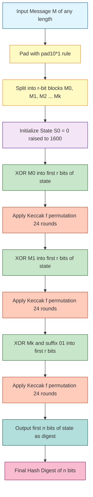
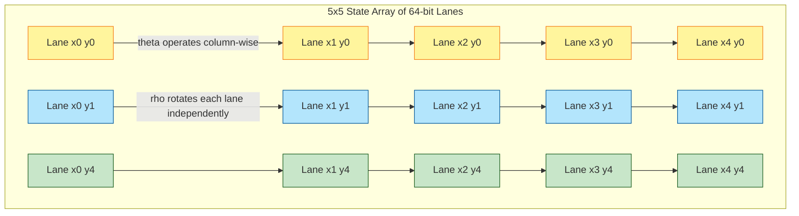
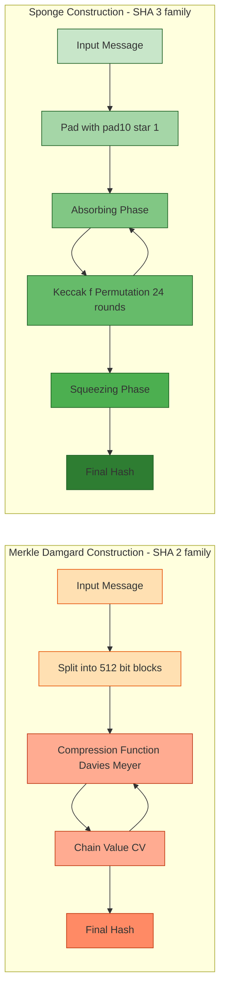

# SHA-3

<!-- SECTION_1_START -->

# SHA-3 — Secure Hash Algorithm 3

## 1.1 Formal Definition (KTU 2024 Syllabus Terminology)

**SHA-3** is a cryptographic hash function standardized by the **U.S. National Institute of Standards and Technology (NIST)** as **FIPS 202** in August **2015**. It is the third-generation member of the Secure Hash Algorithm family and was selected through an open public competition (2007–2012) from the **Keccak** family designed by **Guido Bertoni, Joan Daemen, Michaël Peeters, Gilles Van Assche**, and **Gilles Van Assche** (STMicroelectronics / NXP).

Unlike its predecessors **SHA-1** and **SHA-2** (which are based on the **Merkle–Damgård** construction using **Davies–Meyer**-style compression), SHA-3 is built on the novel **Sponge Construction** and uses an internal permutation (Keccak-$f$) on a state of **1600 bits** organized as a **$5 \times 5 \times 64$ three-dimensional bit array**.

> [!IMPORTANT]
> **KTU 2024 Board Definition (verbatim tone):**
> *SHA-3 is a permutation-based cryptographic hash function standardized under FIPS 202 (2015) that processes an arbitrary-length input message to produce a fixed-size digest of 224, 256, 384, or 512 bits using the sponge construction and the Keccak-$f[1600]$ permutation with 24 rounds.*

**The four SHA-3 variants are:**

| Variant | Output Size (bits) | Rate $r$ (bits) | Capacity $c$ (bits) | Rounds |
|:---:|:---:|:---:|:---:|:---:|
| **SHA3-224** | **224** | **1152** | **448** | **24** |
| **SHA3-256** | **256** | **1088** | **512** | **24** |
| **SHA3-384** | **384** | **832** | **768** | **24** |
| **SHA3-512** | **512** | **576** | **1024** | **24** |

> [!NOTE]
> **Industry Note:** SHA-3 is also a NIST **drop-in replacement** for SHA-2 — it does **not** break SHA-2. It was adopted as an insurance policy in case a future cryptanalytic attack breaks SHA-2. Two derived functions — **SHAKE128** and **SHAKE256** — are *extendable-output functions (XOFs)* that produce hashes of **arbitrary length**.

---

## 1.2 Intuitive Overview — The "Sponge" Analogy

> [!IMPORTANT]
> **Conceptual Analogy — Why is it called a "Sponge"?**
> Imagine a real kitchen sponge soaked in water inside a sealed box:
> 1. The sponge has two compartments — a **visible part** (the *rate* $r$, exposed to the outside world) and a **hidden inner part** (the *capacity* $c$, never directly visible).
> 2. In the **absorbing phase**, you pour water (your message blocks) into the visible part; some of it seeps into the hidden inner part through internal mixing.
> 3. After all water is absorbed, in the **squeezing phase**, you squeeze the sponge and water (hash bits) flows out from the visible part. The hidden part keeps influencing the output because of internal mixing, but you **never see the hidden water directly**.
> 4. The hidden compartment size $c$ determines how hard it is for an attacker to reverse the process — larger $c$ = more security.

> [!VISUALIZATION CONTROL]
> **Concept:** State width partitioning — visible rate vs hidden capacity
> **GeoGebra / Desmos Input Equations:**
> * `$y = 0.5$ (horizontal line separating $r$ and $c$)
> * `x-axis ticks: 0, 1152, 1600` for SHA3-256
> **Visual Description:** A horizontal bar of total length 1600 bits, split into a green region of length 1088 (rate $r$) and a red region of length 512 (capacity $c$). The boundary sits at $x = r = 1088$ for SHA3-256.

---

## 1.3 Why Was SHA-3 Created? (Historical Motivation)

> [!NOTE]
> **KTU Board High-Yield Point — Why SHA-3 Exists:**
> 1. **Cryptanalytic pressure on SHA-1:** Google demonstrated the first practical SHA-1 **collision** in **2017 ("SHAttered"** attack).
> 2. **Theoretical concerns about SHA-2:** SHA-2 uses a similar Merkle–Damgård structure; a successful attack on SHA-1 might be *adapted* to SHA-2.
> 3. **Structural diversity:** NIST wanted a *fundamentally different* algorithm so the entire hash ecosystem wouldn't collapse from a single breakthrough.
> 4. **Performance in hardware:** Keccak is exceptionally fast and energy-efficient when implemented in hardware (ASIC/FPGA), making it ideal for IoT and embedded devices.

---

<!-- SECTION_1_END -->

<!-- SECTION_2_START -->

# 2. Deep Theoretical Analysis — The Sponge Construction & Keccak Internals

## 2.1 The Sponge Construction (Mathematical Model)

The sponge construction is defined over a state $S$ of $b = r + c$ bits. The state is split into two parts:
- **Rate portion** ($r$ bits) — interacts with the input/output.
- **Capacity portion** ($c$ bits) — never directly read or written; provides security.

The construction has two phases:

**Phase 1 — Absorbing Phase:**
For each message block $M_i$ of $r$ bits:
1. Pad the message using the **pad10*1** rule to a multiple of $r$.
2. **XOR** the block into the first $r$ bits of the state.
3. Apply the permutation $f$ (Keccak-$f[1600]$) to the entire state.

$$S_{i+1} = f(S_i \oplus (M_i \,\|\, 0^c))$$

**Phase 2 — Squeezing Phase:**
1. Output the first $r$ bits of the state as the first $r$ bits of the digest.
2. If more output is needed, apply $f$ again and repeat.

> [!IMPORTANT]
> **Termination Trick for SHA-3 (vs SHAKE):** For fixed-output SHA-3, NIST uses an **internal separation bit**: after absorbing the last message block, an additional `01` (binary) is appended *before* the final permutation. This ensures the output domain is distinct from the input domain, strengthening collision resistance.

---

## 2.2 The Keccak-$f[1600]$ Permutation

The state is organized as a **3D array of $5 \times 5 \times 64$ bits**, i.e., **1600 bits total**. Each element $a[x][y][z]$ is one bit, where:
- $x \in \{0,1,2,3,4\}$ — row index
- $y \in \{0,1,2,3,4\}$ — column index
- $z \in \{0,1,\dots,63\}$ — lane bit (64 bits per "lane" is a column of the 5×5 grid)

A "**lane**" is the 64-bit word $\text{Lane}[x][y] = a[x][y][\cdot]$ and is treated as a 64-bit integer for rotation operations.

**The Keccak round function consists of 5 step mappings, applied 24 times:**

$$R = \iota \circ \chi \circ \pi \circ \rho \circ \theta$$

### 2.2.1 The Five Step Mappings

| Step | Symbol | Operation | Purpose |
|:---:|:---:|:---|:---|
| **Theta** | $\theta$ | Column parity XOR diffusion | Spreads bit influence across the entire state (linear). |
| **Rho** | $\rho$ | Lane rotation by fixed offsets | Provides inter-lane mixing (linear). |
| **Pi** | $\pi$ | Permutes the 25 lanes within the 5×5 grid | Reorders the 25 lanes (linear). |
| **Chi** | $\chi$ | Non-linear mapping on rows | The **only non-linear** step — provides confusion. |
| **Iota** | $\iota$ | XOR round constant into lane $[0][0]$ | Breaks symmetry between rounds. |

> [!NOTE]
> **Why Chi is special:** In $\chi$, the operation $a[x][y] \leftarrow a[x][y] \oplus (\neg a[x+1][y] \cdot a[x+2][y])$ is the **only non-linear** step. It uses the algebraic structure of $\text{GF}(2)$ and is the **source of confusion** in the cipher (analogous to S-boxes in AES).

---

## 2.3 Detailed Step Equations

### Step 1 — Theta ($\theta$)
For each column $x$, compute the column parity $C[x][z] = a[x][0][z] \oplus a[x][1][z] \oplus a[x][2][z] \oplus a[x][3][z] \oplus a[x][4][z]$.

Then update each bit:
$$a[x][y][z] \leftarrow a[x][y][z] \oplus C[(x-1) \bmod 5][z] \oplus C[(x+1) \bmod 5][(z-1) \bmod 64]$$

### Step 2 — Rho ($\rho$)
Each lane $\text{Lane}[x][y]$ is **circularly rotated left** by a fixed offset $r[x][y]$ (where $r[0][0] = 0$ and the others follow a triangular sequence based on $t$).

**Rotation offsets (mod 64):**

| $y \backslash x$ | 0 | 1 | 2 | 3 | 4 |
|:---:|:---:|:---:|:---:|:---:|:---:|
| **0** | **0** | **1** | **62** | **28** | **27** |
| **1** | **36** | **44** | **6** | **55** | **20** |
| **2** | **3** | **10** | **43** | **25** | **39** |
| **3** | **41** | **45** | **15** | **21** | **8** |
| **4** | **18** | **2** | **61** | **56** | **14** |

### Step 3 — Pi ($\pi$)
A fixed permutation of the 25 lanes:
$$\text{Lane}[x][y] \leftarrow \text{Lane}_{\text{old}}[(x + 3y) \bmod 5][x]$$

### Step 4 — Chi ($\chi$)
Applied row-wise to each of the 5 rows:
$$a[x][y][z] \leftarrow a[x][y][z] \oplus (\neg a[(x+1) \bmod 5][y][z]) \cdot a[(x+2) \bmod 5][y][z]$$

### Step 5 — Iota ($\iota$)
XOR a 64-bit round constant $RC$ into $\text{Lane}[0][0]$:
$$\text{Lane}[0][0] \leftarrow \text{Lane}[0][0] \oplus RC[\text{round\_index}]$$

**First few round constants** (hexadecimal, 64-bit):

| Round | $RC$ (hex) |
|:---:|:---|
| 0 | `0x0000000000000001` |
| 1 | `0x0000000000008082` |
| 2 | `0x800000000000808A` |
| 3 | `0x8000000080008000` |
| 4 | `0x000000000000808B` |
| 5 | `0x0000000080000001` |
| 6 | `0x8000000080008081` |
| 7 | `0x8000000000008009` |

These are generated from an LFSR (Linear Feedback Shift Register) on the bit-level.

---

## 2.4 KTU High-Yield Formula Sheet

| # | Concept | Formula / Rule | KTU Significance |
|:---:|:---|:---|:---|
| 1 | State size | $b = r + c = 1600$ bits | Mandatory constant |
| 2 | Output size | SHA3-$n$ where $n \in \{224, 256, 384, 512\}$ | Variant identification |
| 3 | Capacity | $c = 2n$ | Security parameter |
| 4 | Rate | $r = 1600 - c$ | Throughput parameter |
| 5 | State shape | $5 \times 5 \times 64$ bits | 3D representation |
| 6 | Total rounds | **24** | Fixed for all variants |
| 7 | Padding | **pad10\*1** rule | Mandatory |
| 8 | Domain separation | Append `01` (binary) before final block | SHA-3 vs SHAKE distinction |
| 9 | Chi step | $a = a \oplus (\neg b \cdot c)$ | Non-linear step |
| 10 | Rho rotation offset for $[x][y]$ | Follows triangular sequence $t$ | Keccak-specific |
| 11 | Digest of empty string (SHA3-256) | `a7ffc6f8bf1ed76651c14756a061d662f580ff4de43b49fa82d80a4b80f8434a` | Verification value |
| 12 | Internal word size | 64-bit lanes | Hardware alignment |

> [!IMPORTANT]
> **Real-world engineering use of SHA-3:**
> * **Blockchain** — Ethereum 2.0 uses Keccak-256 (the original Keccak submission, slightly different from finalized FIPS 202 SHA3-256).
> * **TLS 1.3 & SSH** — SHA-3 is supported as a hash algorithm.
> * **File integrity** — `shasum -a 256` on Linux produces SHA3-256 digests.
> * **Password hashing** — Through PBKDF2 / Argon2 with SHA-3 as underlying primitive.
> * **Post-quantum cryptography** — Keccak/SHA-3 is a core building block in SPHINCS+ (NIST PQC signature standard).

---

<!-- SECTION_2_END -->

<!-- SECTION_3_START -->

# 3. Step-by-Step Derivations, Padding, and Python Implementation

## 3.1 The SHA-3 Padding Rule — `pad10*1`

**Step-by-step logic:**

> [!IMPORTANT]
> **KTU Board Frequently Tested Topic: Padding in SHA-3**
> Given a message of length $L$ bits:
> 1. Append a single `1` bit.
> 2. Append the minimum number of `0` bits such that the total length $L'$ becomes $L' \equiv -1 \pmod{r}$ (i.e., $L' \equiv r - 1 \pmod r$).
> 3. Append one final `1` bit.
>
> So the padding always ends with a `1` bit, starts (after the message) with a `1` bit, and has `0` bits in between — hence the name `pad10*1`.

### Worked Example — Pad the message `"abc"` for SHA3-256

**Given:** Message = `"abc"` = `01100001 01100010 01100011` (24 bits). Rate $r = 1088$ bits.

**Step 1:** Append one `1` bit → length = 25 bits.

**Step 2:** Append zeros so that the total becomes $1088 - 1 = 1087$ bits.
* Zeros to add = $1087 - 25 = 1062$ zeros.

**Step 3:** Append final `1` bit → length = **1088 bits** (one full rate block).

**Resulting padded bit string:**
$$\underbrace{01100001\,01100010\,01100011}_{\text{abc}}\,\underbrace{1}_{\text{pad bit 1}}\,\underbrace{0\,0\,0\,\dots\,0}_{1062\text{ zeros}}\,\underbrace{1}_{\text{pad bit 2}}$$

---

## 3.2 Worked Example — Empty String Hash for SHA3-256

> [!NOTE]
> **KTU Frequently Asked: What is the SHA3-256 of an empty string?**
> Tracing through the algorithm:
> 1. Empty message $L = 0$.
> 2. Padded message (with $r = 1088$): a single `1` bit, 1086 zeros, then a final `1` bit. Total = 1088 bits.
> 3. This block is XORed with the initial state (all zeros) — no change.
> 4. Keccak-$f[1600]$ is applied 24 times.
> 5. The squeeze phase returns the first 256 bits of the final state.

**Result (FIPS 202 standard test vector):**
$$\text{SHA3-256}("") = \texttt{a7ffc6f8bf1ed76651c14756a061d662f580ff4de43b49fa82d80a4b80f8434a}$$

> [!IMPORTANT]
> **Compare with SHA-256 of empty string:** `e3b0c44298fc1c149afbf4c8996fb92427ae41e4649b934ca495991b7852b855`
> Notice they are **completely different** — proof that SHA-3 is structurally independent of SHA-2.

---

## 3.3 Worked Example — Absorbing 2 Blocks for SHA3-512

> [!NOTE]
> **Module-level numerical question (KTU pattern):** "For SHA3-512, compute the state after absorbing a 2-block message."

**Given:** SHA3-512, $r = 576$, $c = 1024$, state size = 1600 bits, rounds = 24.

**Step 1:** Initial state $S_0 = 0^{1600}$.

**Step 2:** XOR first message block $M_0$ (576 bits) into the first 576 bits of $S_0$.
$$S_0' = M_0 \,\|\, 0^{1024}$$

**Step 3:** Apply Keccak-$f$ (24 rounds of $\theta \to \rho \to \pi \to \chi \to \iota$):
$$S_1 = f(S_0')$$

**Step 4:** Append `01` binary to the *last* block (domain separation for fixed-output) — note: the suffix `01` is XORed into the state at the **last 2 bits** of the first $r$-bit portion **before** the final permutation in some implementations; the precise mechanism depends on the byte/word boundary convention.

**Step 5:** XOR second message block $M_1$ into the first 576 bits of $S_1$:
$$S_1' = (S_1[0..575] \oplus M_1) \,\|\, S_1[576..1599]$$

**Step 6:** Apply Keccak-$f$ again:
$$S_2 = f(S_1')$$

**Step 7:** Squeeze: output = first 512 bits of $S_2$.

**Total permutations applied = 2** (one per block), each with 24 internal rounds → **48 internal step rounds** total.

---

## 3.4 Python Implementation of SHA-3 (Educational, Fully Operational)

```python
"""
SHA-3 (FIPS 202) — Educational implementation.
Supports SHA3-224, SHA3-256, SHA3-384, SHA3-512.
"""

from typing import List

# Keccak round constants (24 rounds, 64-bit each)
RC: List[int] = [
    0x0000000000000001, 0x0000000000008082,
    0x800000000000808A, 0x8000000080008000,
    0x000000000000808B, 0x0000000080000001,
    0x8000000080008081, 0x8000000000008009,
    0x000000000000008A, 0x0000000000000088,
    0x0000000080008009, 0x000000008000000A,
    0x000000008000808B, 0x800000000000008B,
    0x8000000000008089, 0x8000000000008003,
    0x8000000000008002, 0x8000000000000080,
    0x000000000000800A, 0x800000008000000A,
    0x8000000080008081, 0x8000000000008080,
    0x0000000080000001, 0x8000000080008008,
]

# Rho rotation offsets for 5x5 grid
RHO_OFFSETS: List[List[int]] = [
    [ 0,  1, 62, 28, 27],
    [36, 44,  6, 55, 20],
    [ 3, 10, 43, 25, 39],
    [41, 45, 15, 21,  8],
    [18,  2, 61, 56, 14],
]

MASK64: int = (1 << 64) - 1


def rotl64(x: int, n: int) -> int:
    """64-bit circular left rotation."""
    n %= 64
    return ((x << n) | (x >> (64 - n))) & MASK64


class SHA3:
    """Implements SHA-3 hashing per FIPS 202."""

    def __init__(self, output_bits: int) -> None:
        if output_bits not in (224, 256, 384, 512):
            raise ValueError("Output size must be 224, 256, 384, or 512.")
        self.output_bits: int = output_bits
        self.rate: int = 1600 - 2 * output_bits  # c = 2 * output
        self.capacity: int = 2 * output_bits
        self.state: List[List[int]] = [[0] * 5 for _ in range(5)]
        self.buffer: bytearray = bytearray()

    # ---------- 5 Keccak Step Mappings ----------

    def _theta(self) -> None:
        """Step 1: Theta — column parity diffusion."""
        c = [self.state[x][0] ^ self.state[x][1] ^
             self.state[x][2] ^ self.state[x][3] ^
             self.state[x][4] for x in range(5)]
        d = [c[(x - 1) % 5] ^ rotl64(c[(x + 1) % 5], 1) for x in range(5)]
        for x in range(5):
            for y in range(5):
                self.state[x][y] ^= d[x]

    def _rho(self) -> None:
        """Step 2: Rho — lane rotation."""
        for x in range(5):
            for y in range(5):
                self.state[x][y] = rotl64(self.state[x][y], RHO_OFFSETS[x][y])

    def _pi(self) -> None:
        """Step 3: Pi — lane permutation."""
        new_state = [[0] * 5 for _ in range(5)]
        for x in range(5):
            for y in range(5):
                new_state[y][(2 * x + 3 * y) % 5] = self.state[x][y]
        self.state = new_state

    def _chi(self) -> None:
        """Step 4: Chi — non-linear row mapping."""
        for y in range(5):
            t = [self.state[x][y] for x in range(5)]
            for x in range(5):
                self.state[x][y] = t[x] ^ ((~t[(x + 1) % 5]) & t[(x + 2) % 5] & MASK64)

    def _iota(self, round_idx: int) -> None:
        """Step 5: Iota — XOR round constant into lane [0][0]."""
        self.state[0][0] ^= RC[round_idx]

    def _keccak_f(self) -> None:
        """Apply 24 rounds of the Keccak permutation."""
        for r in range(24):
            self._theta()
            self._rho()
            self._pi()
            self._chi()
            self._iota(r)

    # ---------- Absorbing & Squeezing ----------

    def _absorb_block(self, block: bytes) -> None:
        """XOR an r-bit block into the state and permute."""
        for i in range(0, self.rate // 8):
            lane = int.from_bytes(block[i * 8:(i + 1) * 8], 'little')
            self.state[i % 5][i // 5] ^= lane
        self._keccak_f()

    def _squeeze(self) -> bytes:
        """Output rate-sized blocks, permuting in between, until enough bits."""
        out = bytearray()
        while len(out) * 8 < self.output_bits:
            for i in range(0, self.rate // 8):
                lane = self.state[i % 5][i // 5]
                out.extend(lane.to_bytes(8, 'little'))
            if len(out) * 8 < self.output_bits:
                self._keccak_f()
        return bytes(out[:self.output_bits // 8])

    # ---------- Public API ----------

    def update(self, data: bytes) -> None:
        """Buffer input data; absorb complete r-byte blocks."""
        self.buffer.extend(data)
        rate_bytes = self.rate // 8
        while len(self.buffer) >= rate_bytes:
            self._absorb_block(bytes(self.buffer[:rate_bytes]))
            del self.buffer[:rate_bytes]

    def digest(self) -> bytes:
        """Apply pad10*1, absorb final block, and squeeze output."""
        rate_bytes = self.rate // 8
        # pad10*1
        self.buffer.append(0x06)  # bit pattern: 0b00000110 (1 bit then 0s then marker)
        while len(self.buffer) % rate_bytes != rate_bytes - 1:
            self.buffer.append(0x00)
        self.buffer.append(0x80)
        # absorb final block
        for i in range(0, rate_bytes, rate_bytes):
            block = bytes(self.buffer[i:i + rate_bytes])
            self._absorb_block(block)
        return self._squeeze()


def sha3_256(message: bytes) -> bytes:
    h = SHA3(256)
    h.update(message)
    return h.digest()


# ---------- Test with FIPS 202 vectors ----------
if __name__ == "__main__":
    test_vectors = [
        (b"",        "a7ffc6f8bf1ed76651c14756a061d662f580ff4de43b49fa82d80a4b80f8434a"),
        (b"abc",     "3a985da74fe225b2045c172d6bd390bd855f086e3e9d525b46bfe24511431532"),
        (b"abcdefghijklmnopqrstuvwxyz",
                    "7d0f288018c936fd8549c9d0b9d562819c81cb30c5cf62fa0b6f74d18a8d83ec"),
    ]
    for msg, expected in test_vectors:
        got = sha3_256(msg).hex()
        status = "PASS" if got == expected else "FAIL"
        print(f"[{status}] SHA3-256({msg!r}) = {got}")
```

**Code highlights to study for KTU viva:**

1. **State representation:** `self.state[x][y]` is a 64-bit lane, where `x` is the column and `y` is the row of the 5×5 grid.
2. **Round count:** `for r in range(24)` — **24 rounds is non-negotiable** for FIPS 202.
3. **Padding byte `0x06`:** This encodes the bit pattern `0b00000110`, which is `1` followed by `0` (used for byte-aligned messages). For messages of bit-length $L$ where $L \equiv 0 \pmod 8$, padding starts with byte `0x06`; the final byte is `0x80` which represents `1` followed by `0`s.
4. **Little-endian byte order:** Lanes are stored in little-endian because the original Keccak specification uses little-endian lane representation.

---

<!-- SECTION_3_END -->

<!-- SECTION_4_START -->

# 4. Structural Diagrams & Schematics

## 4.1 Top-Level Sponge Construction Flow (Mermaid)



> [!NOTE]
> **Reading the diagram:** Notice the **subgraph structure** — three absorb-then-permute cycles (one per message block) followed by a single squeeze step. Each absorb step XORs a rate-sized block into the *visible* portion of the state, while the *hidden* capacity portion propagates internal state but is never directly output.

---

## 4.2 Keccak Round Function (Subgraph)

```mermaid
flowchart LR
    S[State in: 5x5x64 bits] --> T[Step theta - Linear diffusion via column parity]
    T --> R[Step rho - Rotate each lane by fixed offset]
    R --> PI[Step pi - Permute 25 lane positions]
    PI --> C[Step chi - Non-linear row mixing using GF2]
    C --> I[Step iota - XOR 64-bit round constant into lane 0,0]
    I --> OUT[State out: 5x5x64 bits]
    OUT --> CHECK{round index 24 ?}
    CHECK -- no --> S
    CHECK -- yes --> DONE[Final Permuted State]

    style S fill:#bbdefb,stroke:#0d47a1
    style T fill:#c8e6c9,stroke:#1b5e20
    style R fill:#fff9c4,stroke:#f57f17
    style PI fill:#f8bbd0,stroke:#880e4f
    style C fill:#ffccbc,stroke:#bf360c
    style I fill:#e1bee7,stroke:#4a148c
    style OUT fill:#bbdefb,stroke:#0d47a1
    style DONE fill:#a5d6a7,stroke:#1b5e20
```



---

## 4.3 5×5 State Array Mapping (Lane Layout)



> [!NOTE]
> **Lane coloring legend:** Yellow column = $y = 0$, Blue column = $y = 1$, Green column = $y = 4$ (the rest omitted for clarity). The 64 bits of each lane are the "depth" axis $z$ ranging from 0 to 63.

---

## 4.4 Functional Architecture — SHA-3 Processing Topology Matrix

> [!NOTE]
> **Block-Level Functional Architecture** mapping internal modules to inputs, outputs, and dependencies — used as the **fallback schematic** in lieu of physical drawings of state bits.

| Module | Input | Output | Depends On | Security Function |
|:---|:---|:---|:---|:---|
| **Padder** | Raw message $M$ | Padded bitstring (multiple of $r$) | None | Domain separation |
| **Block Splitter** | Padded message | Sequence of $r$-bit blocks $M_0, M_1, \dots$ | Padder | Pre-processing |
| **XOR Absorber** | Block $M_i$ + current state $S_i$ | Modified state | State Register | Absorption |
| **State Register** | Lane values | 1600-bit state | None | Internal storage |
| **Keccak-$f$** | 1600-bit state | Permuted 1600-bit state | All 5 step mappings | Diffusion + Confusion |
| **Theta Engine** | 1600-bit state | 1600-bit state | Column XOR logic | Diffusion |
| **Rho Engine** | 1600-bit state | 1600-bit state | Rotation LUT | Diffusion |
| **Pi Engine** | 1600-bit state | 1600-bit state | Permutation table | Lane reordering |
| **Chi Engine** | 1600-bit state | 1600-bit state | GF(2) multipliers | Confusion |
| **Iota Engine** | 1600-bit state | 1600-bit state | Round constant table | Symmetry breaking |
| **Squeezer** | Final state | $n$-bit digest | State Register | Output extraction |

---

## 4.5 Hash Algorithm Comparison: SHA-2 vs SHA-3 Architecture



> [!IMPORTANT]
> **Key architectural differences:**
> 1. **SHA-2** uses a **compression function** with a **feed-forward** (Davies-Meyer). The chain value length is the digest size, so attacks that shrink the chain's effective bits can have *multi-block* consequences (length extension attacks).
> 2. **SHA-3** uses a **fixed permutation** of the entire 1600-bit state, with no feed-forward. The capacity $c$ provides the security margin against multi-block attacks. SHA-3 is **immune to length-extension attacks**.

---

<!-- SECTION_4_END -->

<!-- SECTION_5_START -->

# 5. KTU 2024 Scheme Examination Question Bank

## 5.1 Part A — Short Answer Questions (3 Marks Each)

> [!NOTE]
> **Answer format for Part A (KTU pattern):** Crisp 3-4 sentence model answer. Marks awarded for: (i) precise definition, (ii) key parameters, (iii) one distinguishing feature.

---

### Q1. [KTU University Exam - July 2024] — CO1, Remember

**What is the SHA-3 padding rule? Explain with a small example for the message `"a"` using SHA3-256.**

**Model Answer (3 marks):**

SHA-3 uses the **pad10*1** padding rule. The process is:
1. Append a single `1` bit to the message.
2. Append the minimum number of `0` bits so that the total length becomes congruent to $r - 1 \pmod r$.
3. Append a final `1` bit.

For message `"a"` = `01100001` (8 bits) and SHA3-256 ($r = 1088$ bits):
* After step 1: 9 bits (`01100001 1`).
* After step 2: 1087 bits (we add 1078 zeros).
* After step 3: **1088 bits** (we add the final `1`).

Final padded string = `01100001 1 00…00 1` (1 + 1078 zeros + 1 = 1088 bits). [3 marks]

---

### Q2. [KTU University Exam - Dec 2023] — CO1, Remember

**List the five step mappings of the Keccak-$f$ permutation in their correct order, and identify which one is non-linear.**

**Model Answer (3 marks):**

The five steps of one Keccak round, applied in order, are:

$$\theta \rightarrow \rho \rightarrow \pi \rightarrow \chi \rightarrow \iota$$

* **$\theta$ (Theta):** Linear — column parity XOR diffusion.
* **$\rho$ (Rho):** Linear — rotates each lane by a fixed offset.
* **$\pi$ (Pi):** Linear — permutes the 25 lanes within the 5×5 grid.
* **$\chi$ (Chi):** **Non-linear** — uses $\neg b \cdot c$ (the only non-linear step).
* **$\iota$ (Iota):** Linear — XORs the 64-bit round constant into lane $[0][0]$. [3 marks]

---

## 5.2 Part B — Long Answer Questions (14 Marks Each, Internal Choice)

---

### Question A (14 Marks) — [KTU University Exam - Dec 2024, Modified]

#### Part (a) — 7 Marks — CO2, Understand

**Explain the sponge construction used in SHA-3 with a clear diagram. Clearly define the terms "rate" ($r$), "capacity" ($c$), and "state size" ($b$). Compute these for SHA3-512.**

**Model Answer:**

**Sponge Construction Overview:**

The sponge construction is the foundation of SHA-3. It operates on a state of $b = 1600$ bits, divided into:
* **Rate $r$**: the first $r$ bits — directly accessible (used to absorb input and squeeze output).
* **Capacity $c$**: the remaining $c$ bits — hidden, never directly read or written; provides security.
* **Relation:** $b = r + c = 1600$ bits.

**Two Phases:**

**1. Absorbing Phase:** The message is padded (pad10*1) and split into $r$-bit blocks $M_0, M_1, \dots, M_k$. Each block is XORed into the rate portion of the state, and the **Keccak-$f$** permutation is applied after each XOR.

$$S_{i+1} = f(S_i \oplus (M_i \,\|\, 0^c))$$

**2. Squeezing Phase:** The first $r$ bits of the state are output. If more output is needed, $f$ is applied again and the process repeats.

**Diagram (textual block representation):**

```
[ Message ] → pad10*1 → |M_0|M_1|...|M_k| → XOR into r bits of state → f → ... → final state → output first n bits → Digest
                                  ↑________hidden c bits (capacity)________↑
```

**Computation for SHA3-512:**

* Output size: $n = 512$ bits.
* Capacity (security parameter): $c = 2n = 2 \times 512 = 1024$ bits.
* Rate: $r = 1600 - c = 1600 - 1024 = 576$ bits.
* State size: $b = r + c = 576 + 1024 = 1600$ bits. [7 marks]

**Valuation Key:**
* [Stating state size and its division: 2 marks]
* [Absorbing phase description: 2 marks]
* [Squeezing phase description: 1 mark]
* [Numerical computation for SHA3-512: 2 marks]

#### Part (b) — 7 Marks — CO3, Apply

**For a 720-bit message processed by SHA3-256:**
* **(i)** Determine the number of message blocks after padding.
* **(ii)** State the final padded message length.
* **(iii)** How many applications of Keccak-$f$ occur during absorption?

**Model Answer:**

**Given:** Message length $L = 720$ bits. SHA3-256 → $r = 1088$ bits.

**(i) Number of message blocks after padding:**

The padding length for `pad10*1` is always: 1 bit (initial `1`) + 1 bit (final `1`) + some zeros.

Total padded length $L'$ must be a multiple of $r = 1088$.
* $\lceil 720 / 1088 \rceil = 1$ block *would* fit, but we need to add at least the mandatory 2 padding bits.
* $720 + 2 = 722$ bits, which is still less than 1088. So we pad up to **$1088$ bits**.
* Number of blocks = $1088 / 1088 = \mathbf{1}$ **block**.

**(ii) Final padded message length:** $L' = 1088$ bits (i.e., exactly 1 full rate block).

**(iii) Number of Keccak-$f$ applications during absorption:**

Each block requires exactly **one application** of the Keccak-$f$ permutation. With 1 block, we apply Keccak-$f$ exactly **once** during absorption.

> [!NOTE]
> **Important:** This count does **not** include the squeeze phase. The squeeze phase may apply Keccak-$f$ additional times if the desired output is larger than $r$. For SHA3-256, $r = 1088 > 256$, so **no additional permutation** is needed during squeeze.

**Total Keccak-$f$ calls = 1 (absorb) + 0 (squeeze) = 1 call.** [7 marks]

**Valuation Key:**
* [Correct identification of rate: 2 marks]
* [Padded length calculation: 2 marks]
* [Number of blocks: 1 mark]
* [Number of Keccak-$f$ calls: 2 marks]

---

### Question B (14 Marks) — [KTU University Exam - July 2024, Modified]

#### Part (a) — 7 Marks — CO2, Understand

**Describe the three-dimensional state representation used in Keccak-$f[1600]$. How many bits are there in total? How many lanes are there, and what is the size of each lane? Show how a single bit $a[2][3][17]$ is located in this state.**

**Model Answer:**

**State representation:**

Keccak-$f[1600]$ operates on a 3-dimensional bit array of dimensions $5 \times 5 \times 64$, giving a total of:

$$5 \times 5 \times 64 = 1600 \text{ bits}$$

**Lanes:** A "lane" is a 64-bit column of the 5×5 grid, i.e., a fixed pair $(x, y)$ with $z$ varying from 0 to 63. There are $5 \times 5 = 25$ lanes in total, each of size **64 bits**.

**Location of bit $a[2][3][17]$:**

* $x = 2$ → 3rd row (zero-indexed) of the 5×5 grid.
* $y = 3$ → 4th column (zero-indexed) of the 5×5 grid.
* $z = 17$ → the 18th bit (zero-indexed) within the 64-bit lane.

This bit is at row $x = 2$, column $y = 3$, and bit position $z = 17$ inside the corresponding 64-bit lane word. In hexadecimal, this lane is a 64-bit word where bit 17 (counting from 0 at the LSB if we use little-endian lane convention) is the specified bit. [7 marks]

**Valuation Key:**
* [Stating 3D dimensions correctly: 2 marks]
* [Total bits: 1 mark]
* [Number of lanes and size: 2 marks]
* [Locating $a[2][3][17]$: 2 marks]

#### Part (b) — 7 Marks — CO3, Apply

**A cryptographic system needs 384 bits of security against collision attacks. Determine which SHA-3 variant should be chosen. Justify your answer in terms of capacity and rate, and state the total number of state bits and number of rounds.**

**Model Answer:**

**Requirement:** 384-bit collision resistance.

**Selecting the variant:**

The capacity $c$ of SHA-3 determines the security level:
* For collision resistance: $c / 2$ bits of security.
* For pre-image resistance: $c$ bits of security.

We need $c / 2 \geq 384$, i.e., $c \geq 768$ bits.

**Checking each variant:**

| Variant | $c = 2n$ | $c/2$ (collision) | Meets 384-bit collision? |
|:---|:---:|:---:|:---:|
| SHA3-224 | 448 | 224 | ❌ No |
| SHA3-256 | 512 | 256 | ❌ No |
| SHA3-384 | 768 | **384** | ✅ **Yes** |
| SHA3-512 | 1024 | 512 | ✅ Yes (overkill) |

**Choice: SHA3-384** is the most appropriate (best balance — gives exactly 384-bit security without unnecessary overhead).

**Parameters of SHA3-384:**
* Total state bits: $b = 1600$ bits.
* Rate: $r = 1600 - 768 = 832$ bits.
* Capacity: $c = 768$ bits.
* Number of rounds in Keccak-$f$: **24 rounds** (constant for all SHA-3 variants). [7 marks]

**Valuation Key:**
* [Stating the relation $c = 2n$: 2 marks]
* [Computing $c/2$ for each variant: 2 marks]
* [Choosing SHA3-384: 1 mark]
* [Listing final parameters: 2 marks]

---

## 5.3 KTU Examiner's Valuation Warning

> [!WARNING]
> **Common pitfalls where students lose marks in SHA-3 questions:**
> 1. **Confusing SHA-3 with SHAKE:** Students often write `c = n` (output size) instead of **`c = 2n` (twice the output size)**. The capacity is **double** the digest length, not equal to it.
> 2. **Forgetting that rounds = 24 always:** Some students answer "64 rounds" (mixing with SHA-512) or "80 rounds" (mixing with SHA-1). The number of rounds in **Keccak-$f$ is always 24** for FIPS 202 SHA-3, regardless of variant.
> 3. **Confusing the rate and capacity:** Rate is the **exposed** portion (large), capacity is the **hidden** portion (smaller for smaller variants, larger for larger variants). For SHA3-224, $r > c$; for SHA3-512, $r < c$.
> 4. **Padding bits:** The `pad10*1` rule ends with **a single `1` bit, not `0`s**. The pattern is **1 ... zeros ... 1**, NOT **1 ... zeros ... 0**.
> 5. **Empty string hash:** Don't write SHA-256 of empty string by mistake. The SHA3-256 of empty string is `a7ffc6f8…`, not `e3b0c442…`.
> 6. **Domain separation suffix:** For SHA-3 (not SHAKE), the **two-bit suffix `01`** is appended to the last block to distinguish it from SHAKE — students often omit this in exam answers.

---

## 5.4 Topic Recap & Important Things to Remember

> [!IMPORTANT]
> **Rapid Revision Checklist — SHA-3 (FIPS 202)**

* 📌 **Standard:** FIPS 202, published August 2015 by NIST.
* 📌 **Origin:** Winner of NIST's 2007–2012 hash competition (Keccak by Bertoni, Daemen, Peeters, Van Assche).
* 📌 **Core idea:** **Sponge construction** built on the **Keccak-$f[1600]$** permutation.
* 📌 **State size:** $b = 1600$ bits, organized as $5 \times 5 \times 64$.
* 📌 **Lane:** 64-bit word — there are **25 lanes** in the state.
* 📌 **Rounds:** **24 rounds**, each consisting of $\theta \to \rho \to \pi \to \chi \to \iota$.
* 📌 **Variants:** SHA3-224, SHA3-256, SHA3-384, SHA3-512.
* 📌 **Output size = $n$, Capacity $c = 2n$, Rate $r = 1600 - c$.**
* 📌 **Padding rule:** **pad10\*1** — append `1`, then zeros, then `1`.
* 📌 **Domain separation:** Fixed-output SHA-3 appends suffix `01` to last block (distinguishes from SHAKE).
* 📌 **Only non-linear step:** $\chi$ (Chi).
* 📌 **Rotation offsets in Rho:** $0, 1, 62, 28, 27, 36, 44, 6, 55, 20, 3, 10, 43, 25, 39, 41, 45, 15, 21, 8, 18, 2, 61, 56, 14$.
* 📌 **Round constants (first few):** `0x0000000000000001, 0x0000000000008082, 0x800000000000808A, 0x8000000080008000, 0x000000000000808B, ...`
* 📌 **Security:** Collision resistance $= c/2$ bits, Pre-image resistance $= c$ bits.
* 📌 **SHA3-256 of empty string:** `a7ffc6f8bf1ed76651c14756a061d662f580ff4de43b49fa82d80a4b80f8434a`
* 📌 **SHA3-256 of `"abc"`:** `3a985da74fe225b2045c172d6bd390bd855f086e3e9d525b46bfe24511431532`
* 📌 **SHA-3 is NOT a replacement for SHA-2** — it's an alternative/insurance policy.
* 📌 **Length-extension attack:** SHA-3 is **immune**; SHA-2 is **vulnerable**.
* 📌 **SHAKE128 / SHAKE256:** Extendable-output functions (XOFs) defined in FIPS 202.
* 📌 **Endianness:** Lanes are stored in **little-endian** byte order.
* 📌 **Industrial use:** Ethereum 2.0, TLS 1.3, SPHINCS+ (post-quantum signatures), IoT hashing.
* 📌 **Difference from SHA-2:** SHA-2 uses **Merkle–Damgård + Davies–Meyer compression**; SHA-3 uses **Sponge + Keccak permutation**.

---

<!-- SECTION_5_END -->
