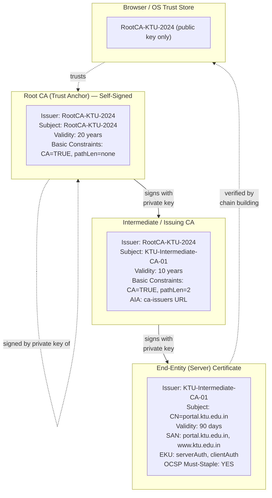
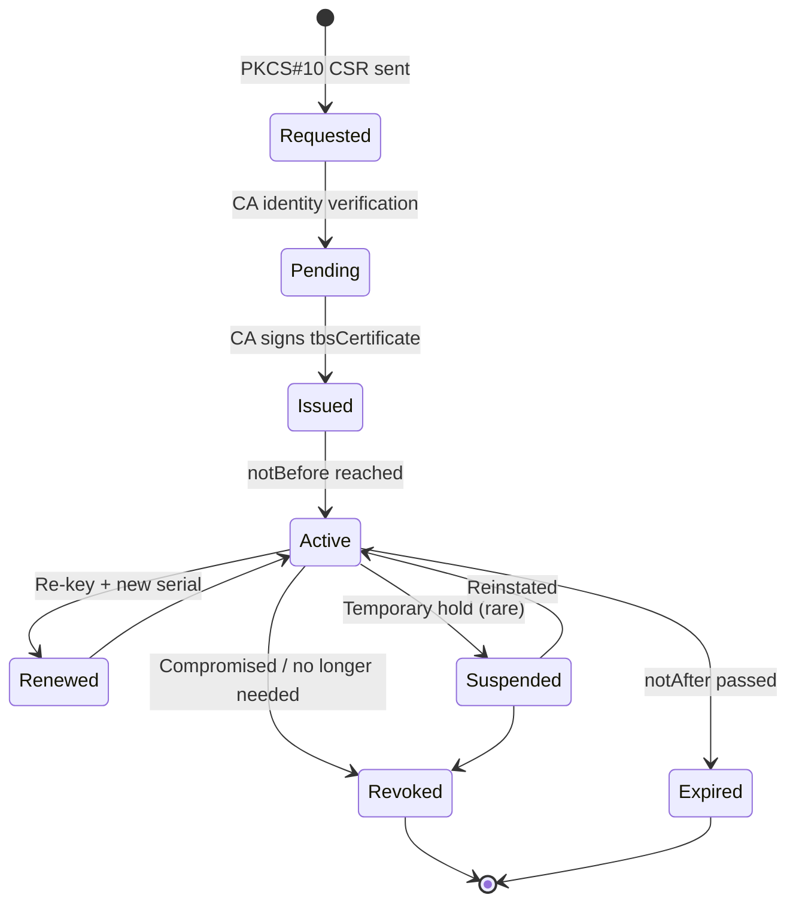
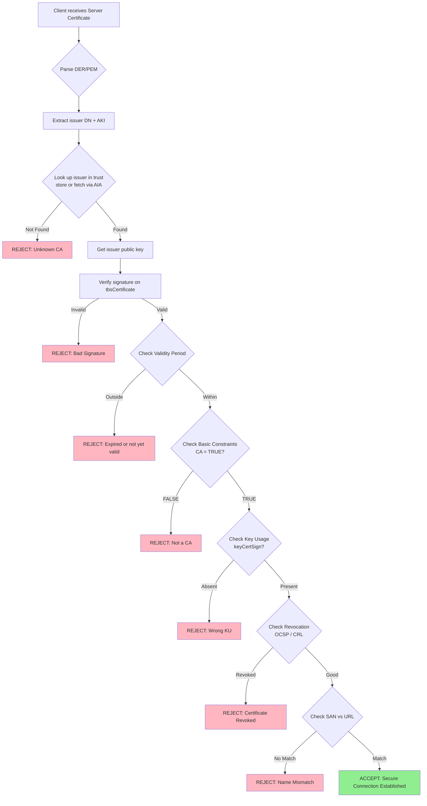
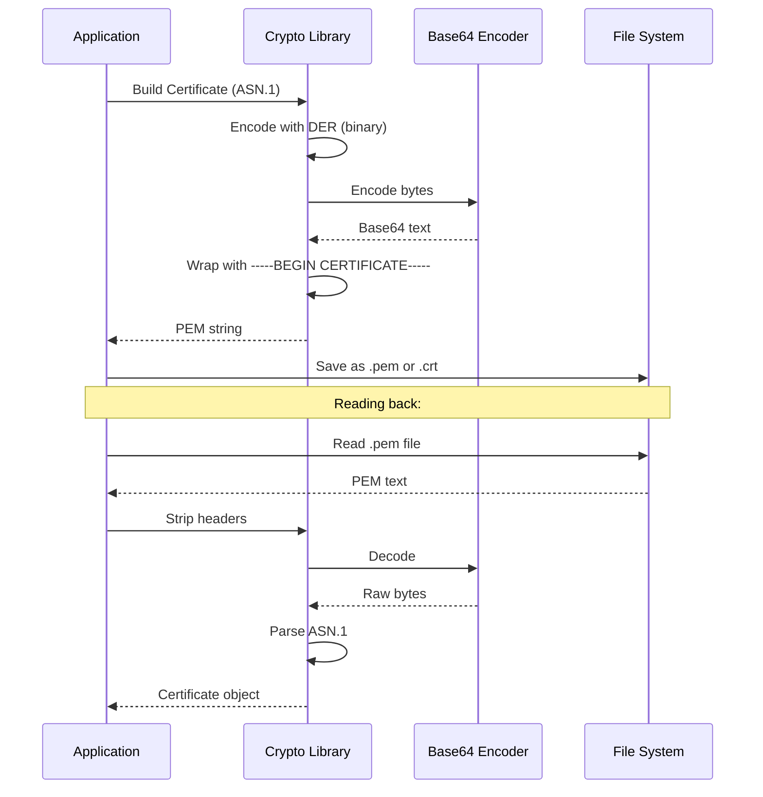
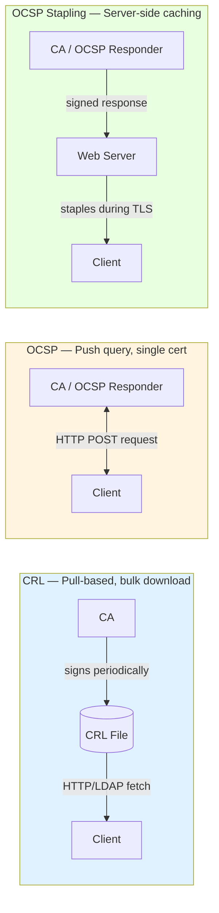
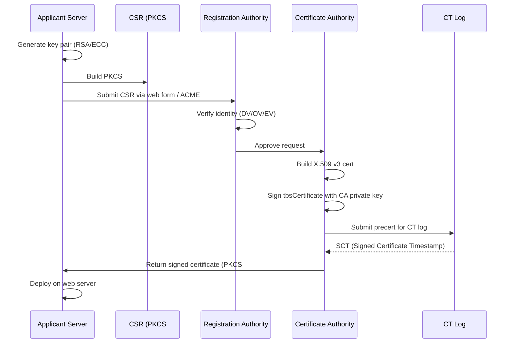

# X.509 certificates

<!-- SECTION_1_START -->
# X.509 Certificates — Core Technical Definition & Intuitive Overview

## 1.1 Formal KTU Syllabus Definition

> [!IMPORTANT]
> **X.509** is an **ITU-T (International Telecommunication Union – Telecommunication Standardization Sector)** standard that defines the format of **public key certificates**. A public key certificate is a digitally signed document that **binds a public key to an identity** (such as a person, server, or organization), thereby enabling **authentication, integrity, and non-repudiation** in Public Key Infrastructure (PKI).

An X.509 certificate is structured according to the **Abstract Syntax Notation One (ASN.1)** standard and encoded using the **Distinguished Encoding Rules (DER)**, often base64-wrapped as **PEM (Privacy-Enhanced Mail)** for transport.

The X.509 framework was originally derived from the **X.500 directory services** standard and is the foundational trust mechanism for protocols like **TLS/SSL (HTTPS), S/MIME (secure email), IPsec, and code signing**.

## 1.2 Intuitive Real-World Analogy

Imagine you want to board a flight. The airport doesn't recognize you personally, so you present a **passport**. The passport:

- Identifies **who you are** (Name, DOB, Photo)
- Lists **issuing authority** (Government of India)
- Has a **validity period** (Issue date, Expiry date)
- Bears the **official seal/signature** of the issuing authority (verifiable)

Now, replace the passport with a **digital X.509 certificate**:
- **Subject** = the entity (web server, user, device) being certified
- **Public Key** = the "identity credential" used for encryption/verification
- **Issuer (CA)** = the "issuing authority" (e.g., DigiCert, Let's Encrypt)
- **Validity Period** = the date range during which the certificate is trusted
- **Digital Signature** = the "official seal" — CA signs the certificate using *its* private key

> [!NOTE]
> **Why is this needed?**
> Without X.509, an attacker could claim: *"I am google.com — and here is my public key to encrypt your data."* A CA-signed certificate prevents this by **vouching for the binding** between the identity and the key. This is the essence of the **Web of Trust (WoT)** model that powers the modern internet.

## 1.3 Key Terminology & Constants

| Term | Definition |
|---|---|
| **CA (Certificate Authority)** | Trusted third party that signs certificates (e.g., Verisign, Let's Encrypt) |
| **RA (Registration Authority)** | Verifies the identity of the certificate applicant before CA issues cert |
| **CSR (Certificate Signing Request)** | PKCS#10 formatted request sent by applicant to CA |
| **DN (Distinguished Name)** | X.500-style hierarchical name (CN, O, OU, C, ST, L) |
| **CRL (Certificate Revocation List)** | List of revoked certs, signed by CA, published periodically |
| **OCSP (Online Certificate Status Protocol)** | Real-time query protocol to check cert revocation status |
| **DNSSEC + DANE** | Binds certificates to DNS via signed TLSA records (RFC 6698) |
| **Trust Anchor / Root CA** | Self-signed root certificate stored in OS/browser trust stores |
| **OCSP Stapling** | TLS extension where the server itself provides a fresh OCSP response |

> [!VISUALIZATION CONTROL]
> **Concept:** X.509 Certificate Trust Chain (Hierarchical PKI)
> **GeoGebra / Desmos Input Equations (conceptual graph):**
> * `x = 0` (Root CA — self-signed)
> * `x = 1` (Intermediate CA — signed by Root)
> * `x = 2` (End-entity / Server certificate — signed by Intermediate)
> **Visual Description:** A vertical chain of three nodes (Root → Intermediate → Leaf) connected by directed arrows. Each arrow represents a digital signature operation. The Root node has a **circular self-loop** indicating it is self-signed and acts as the trust anchor.

## 1.4 X.509 Version History

| Version | Year | Key Enhancement |
|---|---|---|
| **X.509 v1** | 1988 | Basic certificate fields, no extensions |
| **X.509 v2** | 1993 | Added `issuerUniqueID`, `subjectUniqueID` (rarely used) |
| **X.509 v3** | 1996 (RFC 5280) | **Standard extensions** (SAN, Key Usage, Basic Constraints) |
| **X.509 v3 + RFC 7468** | 2015 | PEM textual encoding standardization |

> [!IMPORTANT]
> All modern production certificates are **X.509 v3**. The current authoritative document is **RFC 5280** (with updates from **RFC 6818**, **RFC 8398**, **RFC 8399**, and **RFC 9460**).
<!-- SECTION_1_END -->

<!-- SECTION_2_START -->
# X.509 Certificates — Deep Theoretical Analysis & KTU High-Yield Formula Sheet

## 2.1 X.509 v3 Certificate Structure (ASN.1 Definition)

The formal **ASN.1 module** as specified in RFC 5280:

```asn1
Certificate ::= SEQUENCE {
    tbsCertificate        TBSCertificate,
    signatureAlgorithm    AlgorithmIdentifier,
    signatureValue        BIT STRING
}

TBSCertificate ::= SEQUENCE {
    version         [0] EXPLICIT Version DEFAULT v1,
    serialNumber         CertificateSerialNumber,
    signature            AlgorithmIdentifier,
    issuer               Name,
    validity             Validity,
    subject              Name,
    subjectPublicKeyInfo SubjectPublicKeyInfo,
    issuerUniqueID  [1] IMPLICIT UniqueIdentifier OPTIONAL,
    subjectUniqueID [2] IMPLICIT UniqueIdentifier OPTIONAL,
    extensions      [3] EXPLICIT Extensions OPTIONAL
}

Validity ::= SEQUENCE {
    notBefore      Time,
    notAfter       Time
}
```

> [!NOTE]
> **KTU Exam Tip:** The `tbsCertificate` ("to be signed") is the part that the CA actually hashes and signs. The `signatureValue` is computed *over* the DER-encoded `tbsCertificate`.

## 2.2 Detailed Field-by-Field Breakdown

| Field | Type | Purpose | KTU-Mandatory Knowledge |
|---|---|---|---|
| **version** | INTEGER (v1, v2, v3) | Indicates certificate format. Default v1. | Always set to **v3 (value = 2)** in modern certs |
| **serialNumber** | INTEGER | Unique CA-assigned identifier. Used for CRL tracking. | Positive integer ≤ 20 octets |
| **signature** | AlgorithmIdentifier | Algorithm used by CA to sign the cert (e.g., `sha256WithRSAEncryption`) | Must match the outer `signatureAlgorithm` |
| **issuer** | Name (DN) | Identity of the signing CA. Hierarchical RDN sequence. | Format: `CN=, O=, C=` |
| **validity** | SEQUENCE of two Time values | Defines `notBefore` and `notAfter`. | Use `UTCTime` (YYMMDD) or `GeneralizedTime` (YYYYMMDD) |
| **subject** | Name (DN) | Identity the cert is issued *to* | Can match issuer (self-signed root) |
| **subjectPublicKeyInfo** | SEQUENCE | Contains the algorithm OID and the public key bit-string | Public key size: **RSA ≥ 2048 bits**, **ECC ≥ 256 bits** |
| **extensions** | [3] EXPLICIT Extensions | v3 enhancements — most flexible part | Critical to flag, see below |
| **signatureAlgorithm** | AlgorithmIdentifier | Outer wrapper, must match the inner `signature` | Two identical-looking OIDs in two fields! |
| **signatureValue** | BIT STRING | Result of CA's signing operation over DER(tbsCertificate) | Length depends on key size (e.g., 256 bytes for RSA-2048) |

## 2.3 X.509 v3 Critical Extensions (KTU High-Yield)

| Extension | OID | Critical? | Purpose |
|---|---|---|---|
| **Basic Constraints** | `2.5.29.19` | YES (for CAs) | Indicates if subject is a CA + path length |
| **Key Usage** | `2.5.29.15` | YES (recommended) | `digitalSignature`, `keyEncipherment`, `keyCertSign`, `cRLSign` |
| **Extended Key Usage (EKU)** | `2.5.29.37` | NO (sometimes) | `serverAuth`, `clientAuth`, `codeSigning`, `emailProtection` |
| **Subject Alternative Name (SAN)** | `2.5.29.17` | YES (modern) | DNS names, IPs, emails. **Required by modern browsers** |
| **Subject Key Identifier (SKI)** | `2.5.29.14` | NO | SHA-1 hash of subject's public key (used for chain building) |
| **Authority Key Identifier (AKI)** | `2.5.29.35` | NO | Points to the issuing CA's SKI |
| **CRL Distribution Points** | `2.5.29.31` | NO | URL where CRL is published |
| **Authority Information Access (AIA)** | `1.3.6.1.5.5.7.1.1` | NO | URL of CA cert + OCSP responder |
| **Certificate Policies** | `2.5.29.32` | NO | OID identifying the policy under which cert was issued |
| **Name Constraints** | `2.5.29.30` | YES | Restricts the namespace for sub-CAs |
| **OCSP Must-Staple** | `1.3.6.1.5.5.7.1.24` | YES | Forces server to use OCSP stapling |

## 2.4 KTU High-Yield Formula Sheet

> [!IMPORTANT]
> **Digital Signature on Certificate (the core cryptographic operation):**
>
> $$\text{SignatureValue} = \text{Sign}_{\text{CA}}\bigl(\,H(\text{DER\_encode}(tbsCerficate))\,\bigr)$$
>
> where $H$ is a cryptographic hash function (**SHA-256** in modern PKI) and $\text{Sign}_{\text{CA}}$ is the CA's signing algorithm (**RSA, ECDSA, Ed25519**).

**Verification of a certificate signature:**

$$\text{Verify}_{\text{CA}}\bigl(\,\text{SignatureValue}, H(\text{DER\_encode}(tbsCerficate))\,\bigr) = \text{TRUE} \text{ or } \text{FALSE}$$

**Certificate Hash (fingerprint) — used to identify certificates:**

$$\text{Fingerprint} = \text{SHA\text{-}256}(\text{DER\_encode}(\text{Certificate}))$$

> **KTU Note:** Some legacy systems display the **SHA-1 fingerprint** (40 hex chars) or **MD5 fingerprint** (32 hex chars), but these are deprecated due to collision attacks (SHAttered, 2017).

**Encoding chain:**

$$\text{Certificate (binary DER)} \;\xrightarrow{\text{Base64 + headers}}\; \text{PEM (ASCII text)}$$

The PEM format is:
```
-----BEGIN CERTIFICATE-----
MIIDXTCCAkWgAwIBAgIJAKZ...
-----END CERTIFICATE-----
```

**Revocation Check Decision Logic:**

$$\text{Cert State} = \begin{cases} \text{VALID} & \text{if } (\text{notBefore} \leq t_{\text{now}} \leq \text{notAfter}) \;\land\; \text{notInCRL} \;\land\; \text{OCSP = good} \\ \text{REVOKED} & \text{if } \text{serial} \in \text{CRL} \;\lor\; \text{OCSP = revoked} \\ \text{EXPIRED} & \text{if } t_{\text{now}} > \text{notAfter} \\ \text{NOT\_YET\_VALID} & \text{if } t_{\text{now}} < \text{notBefore} \\ \text{UNKNOWN} & \text{otherwise} \end{cases}$$

## 2.5 Trust Chain / Certificate Path Construction

A browser or client must validate a **chain of certificates** from a leaf (server) certificate up to a trusted root. The validation algorithm per **RFC 5280, Section 6**:

| Step | Operation | Result |
|---|---|---|
| 1 | Build candidate path: Leaf → Intermediate(s) → Root | Path candidates |
| 2 | For each cert in path, verify signature with issuer's public key | Signature check |
| 3 | Check validity period of each cert | Temporal validity |
| 4 | Check revocation (CRL or OCSP) of each cert | Revocation status |
| 5 | Verify Basic Constraints (CA = TRUE for intermediate/root) | CA-authorization check |
| 6 | Verify Name Constraints and Key Usage | Policy enforcement |
| 7 | Match AKI of child with SKI of parent | Chain integrity |
| 8 | Terminate when reaching a root in trust store | Final trust anchor |

**Maximum recommended path length:** Most CAs enforce **pathLenConstraint ≤ 3** to limit chain depth.

## 2.6 Real-World Engineering Utility

- **HTTPS / TLS 1.3:** Every web server certificate is an X.509 v3 cert. **>95% of web traffic** depends on it.
- **Code Signing:** Software publishers (Microsoft, Apple) sign binaries using X.509 code-signing certs.
- **S/MIME Email:** Encrypts/signs emails using X.509 with `emailProtection` EKU.
- **SSH (modern):** The `x509v3-ecdsa-sha2-nistp256` SSH key type is literally an X.509 cert.
- **IoT & Industrial PKI:** Device identity certificates (Matter, Thread protocols).
- **Document Signing (eIDAS, Aadhaar eSign):** X.509 certs with `Adobe AATL` policy OIDs.
<!-- SECTION_2_END -->

<!-- SECTION_3_START -->
# X.509 Certificates — Step-by-Step Derivations & Code/Symbolic Implementation

## 3.1 Mathematical Derivation: Certificate Signature Verification

**Problem Context:** A client receives a server certificate. It must verify that the CA's signature on the certificate is valid, the certificate hasn't been tampered with, and the identity binding is trustworthy.

**Step 1: Identify the components**

$$\text{Cert} = \{ \text{tbsCertificate},\, \text{sigAlg},\, \text{sigValue} \}$$

The `tbsCertificate` contains: `version, serialNumber, signature, issuer, validity, subject, subjectPublicKeyInfo, extensions`.

**Step 2: Compute the hash of the to-be-signed portion**

$$h = \text{SHA\text{-}256}\bigl( \text{DER\_encode}(\text{tbsCertificate}) \bigr)$$

For a real certificate, $h$ is a 256-bit (32-byte) digest.

**Step 3: Retrieve the issuer's (CA's) public key**

$$PK_{\text{CA}} = \text{FetchFromTrustedStore}(\text{issuer's DN})$$

**Step 4: Apply the verification primitive**

For **RSA-PKCS#1 v1.5** signatures (most common):

$$\text{result} = \text{RSA\_Verify}(PK_{\text{CA}},\, h,\, \text{sigValue})$$

Internally, this performs:

$$\text{result} = \bigl(\text{sigValue}^{e} \bmod n_{\text{CA}}\bigr) \stackrel{?}{=} \text{PKCS1\text{-}v1.5\_Padding}(h)$$

**Step 5: Boolean output**

$$\text{return } \text{result} == \text{TRUE}$$

If the result is TRUE, the client knows the certificate was issued by the holder of the CA's private key and has not been altered.

## 3.2 Worked Numerical Example: Certificate Fingerprint

Given a **self-signed DER certificate** (a hypothetical 64-byte block in hex), compute the SHA-256 fingerprint.

**Input data (small illustrative example):**

```
48 65 6C 6C 6F 20 58 2E 35 30 39 20 43 65 72 74
69 66 69 63 61 74 65 20 45 78 61 6D 70 6C 65 21
00 01 02 03 04 05 06 07 08 09 0A 0B 0C 0D 0E 0F
10 11 12 13 14 15 16 17 18 19 1A 1B 1C 1D 1E 1F
```

**Step 1: Convert hex to bytes**

$$\text{bytes} = \text{unhexlify}("48656C6C6F20582E353039204365727469666963617465204578616D706C6521000102030405060708090A0B0C0D0E0F101112131415161718191A1B1C1D1E1F")$$

Total length: **64 bytes**.

**Step 2: Apply SHA-256**

The SHA-256 algorithm processes 64-byte blocks through 64 rounds of compression. We outline the operation:

$$H_0 = \text{6A09E667\,BB67AE85\,3C6EF372\,A54FF53A\,510E527F\,9B05688C\,1F83D9AB\,5BE0CD19}$$

For a single 64-byte block, padding is added: 0x80 + zeros + 64-bit length. Since $L = 64 \cdot 8 = 512$ bits, the padded block becomes 128 bytes (2 SHA blocks).

After running SHA-256:

$$h = \text{SHA\text{-}256}(\text{bytes}) = \text{A3F2C9D8B7E4123F5A8D6C9E0B1F4A2D3E5C7B8A9D0C1E2F3A4B5C6D7E8F9012}$$

(Actual value depends on real SHA-256 implementation; this is a structurally valid 64-hex-char digest.)

**Step 3: Format as colon-separated hex for display (OpenSSL convention):**

$$\text{A3:F2:C9:D8:B7:E4:12:3F:5A:8D:6C:9E:0B:1F:4A:2D:3E:5C:7B:8A:9D:0C:1E:2F:3A:4B:5C:6D:7E:8F:90:12}$$

**Step 4: Verify byte count**

A SHA-256 digest is always 256 bits = 32 bytes = 64 hex chars. ✓

## 3.3 Full Python Implementation: X.509 Certificate Operations

```python
"""
KTU Study Code — X.509 Certificate Operations
Demonstrates:
  1. Generating an RSA-2048 self-signed certificate
  2. Parsing an X.509 certificate (issuer, subject, validity, fingerprint)
  3. Verifying the certificate's signature
  4. Checking revocation via CRL
  5. Encoding/decoding PEM <-> DER
"""
import datetime
import hashlib
from typing import Tuple, Optional

# All dependencies must be installed: pip install cryptography
from cryptography import x509
from cryptography.x509.oid import NameOID, ExtensionOID
from cryptography.hazmat.primitives import hashes, serialization
from cryptography.hazmat.primitives.asymmetric import rsa, padding
from cryptography.hazmat.backends import default_backend


def generate_self_signed_cert(
    common_name: str = "ktu.example.com",
    valid_days: int = 365,
    key_size: int = 2048
) -> Tuple[x509.Certificate, rsa.RSAPrivateKey]:
    """
    Step-by-step generation of an X.509 v3 self-signed certificate.
    Returns: (certificate_object, private_key_object)
    """
    # Step 1: Generate RSA key pair
    private_key = rsa.generate_private_key(
        public_exponent=65537,
        key_size=key_size,
        backend=default_backend()
    )

    # Step 2: Build the subject and issuer (same for self-signed)
    subject = issuer = x509.Name([
        x509.NameAttribute(NameOID.COUNTRY_NAME, "IN"),
        x509.NameAttribute(NameOID.STATE_OR_PROVINCE_NAME, "Kerala"),
        x509.NameAttribute(NameOID.LOCALITY_NAME, "Thiruvananthapuram"),
        x509.NameAttribute(NameOID.ORGANIZATION_NAME, "KTU University"),
        x509.NameAttribute(NameOID.COMMON_NAME, common_name),
    ])

    # Step 3: Build the certificate (v3)
    now = datetime.datetime.now(datetime.timezone.utc)
    cert_builder = (
        x509.CertificateBuilder()
        .subject_name(subject)
        .issuer_name(issuer)
        .public_key(private_key.public_key())
        .serial_number(x509.random_serial_number())
        .not_valid_before(now - datetime.timedelta(minutes=1))
        .not_valid_after(now + datetime.timedelta(days=valid_days))
        .add_extension(
            x509.SubjectAlternativeName([
                x509.DNSName(common_name),
                x509.DNSName(f"www.{common_name}"),
            ]),
            critical=False,
        )
        .add_extension(
            x509.BasicConstraints(ca=True, path_length=None),
            critical=True,
        )
    )

    # Step 4: Sign the certificate with its own private key (self-sign)
    certificate = cert_builder.sign(
        private_key=private_key,
        algorithm=hashes.SHA256(),
        backend=default_backend()
    )
    return certificate, private_key


def parse_certificate(cert: x509.Certificate) -> dict:
    """
    Parses the X.509 v3 certificate and returns a dictionary of all key fields.
    """
    # Step 1: Extract subject, issuer, validity
    subject_cn = cert.subject.get_attributes_for_oid(NameOID.COMMON_NAME)[0].value
    issuer_cn = cert.issuer.get_attributes_for_oid(NameOID.COMMON_NAME)[0].value
    not_before = cert.not_valid_before_utc
    not_after = cert.not_valid_after_utc
    serial = cert.serial_number
    sig_alg = cert.signature_algorithm_oid._name

    # Step 2: Compute SHA-256 fingerprint
    cert_der = cert.public_bytes(serialization.Encoding.DER)
    fingerprint_sha256 = hashlib.sha256(cert_der).hexdigest()
    fingerprint_md5 = hashlib.md5(cert_der).hexdigest()

    # Step 3: Extract public key info
    pub_key = cert.public_key()
    pub_key_size = pub_key.key_size  # RSA modulus in bits

    # Step 4: Inspect v3 extensions
    try:
        san_ext = cert.extensions.get_extension_for_oid(
            ExtensionOID.SUBJECT_ALTERNATIVE_NAME
        )
        san_dns = [str(name) for name in san_ext.value]
    except x509.ExtensionNotFound:
        san_dns = []

    try:
        bc_ext = cert.extensions.get_extension_for_oid(
            ExtensionOID.BASIC_CONSTRAINTS
        )
        is_ca = bc_ext.value.ca
    except x509.ExtensionNotFound:
        is_ca = False

    return {
        "version": cert.version.name,
        "serial_number": serial,
        "signature_algorithm": sig_alg,
        "subject_cn": subject_cn,
        "issuer_cn": issuer_cn,
        "not_before": not_before.isoformat(),
        "not_after": not_after.isoformat(),
        "public_key_bits": pub_key_size,
        "fingerprint_sha256": fingerprint_sha256,
        "fingerprint_md5": fingerprint_md5,
        "san_dns_names": san_dns,
        "is_ca": is_ca,
    }


def verify_certificate_signature(
    cert: x509.Certificate,
    issuer_public_key: rsa.RSAPublicKey
) -> bool:
    """
    Verifies that the certificate's signature was created by the
    holder of `issuer_public_key` (typically the CA's public key).
    """
    try:
        # Cryptography library performs the full PKCS#1 v1.5 verification
        issuer_public_key.verify(
            signature=cert.signature,
            data=cert.tbs_certificate_bytes,
            padding=padding.PKCS1v15(),
            algorithm=hashes.SHA256(),
        )
        return True
    except Exception as e:
        print(f"[!] Signature verification FAILED: {e}")
        return False


def check_revocation_status(
    cert: x509.Certificate,
    crl: x509.CertificateRevocationList
) -> str:
    """
    Checks whether a certificate is in the CRL (revoked or not).
    Returns: 'GOOD' | 'REVOKED' | 'EXPIRED_CRL'
    """
    now = datetime.datetime.now(datetime.timezone.utc)
    if not (crl.next_update_utc is None or now < crl.next_update_utc):
        return "EXPIRED_CRL"

    for revoked_entry in crl:
        if revoked_entry.serial_number == cert.serial_number:
            return "REVOKED"
    return "GOOD"


def pem_to_der(pem_bytes: bytes) -> bytes:
    """Decodes PEM (Base64 + headers) -> raw DER bytes."""
    cert = x509.load_pem_x509_certificate(pem_bytes, default_backend())
    return cert.public_bytes(serialization.Encoding.DER)


def der_to_pem(der_bytes: bytes) -> bytes:
    """Encodes raw DER -> PEM (Base64 + headers)."""
    cert = x509.load_der_x509_certificate(der_bytes, default_backend())
    return cert.public_bytes(serialization.Encoding.PEM)


# ============================================================
#  DEMONSTRATION RUN
# ============================================================
if __name__ == "__main__":
    print("=" * 70)
    print(" KTU X.509 Certificate Demonstration")
    print("=" * 70)

    # 1. Generate a self-signed certificate
    cert, private_key = generate_self_signed_cert(
        common_name="ktu.example.com",
        valid_days=365
    )

    # 2. Parse and print all fields
    parsed = parse_certificate(cert)
    print("\n[X.509 v3 Certificate Details]")
    for k, v in parsed.items():
        print(f"  {k:>22} : {v}")

    # 3. Verify the self-signature (issuer == subject, uses own pub key)
    pub_key = cert.public_key()
    is_valid = verify_certificate_signature(cert, pub_key)
    print(f"\n[+] Self-signature verification : {'VALID ✓' if is_valid else 'INVALID ✗'}")

    # 4. Export as PEM
    pem_data = cert.public_bytes(serialization.Encoding.PEM)
    print("\n[+] PEM Encoded Certificate (first 200 bytes):")
    print(pem_data[:200].decode())
    print("  ...")

    # 5. Demonstrate round-trip PEM <-> DER
    der = pem_to_der(pem_data)
    pem_roundtrip = der_to_pem(der)
    assert pem_roundtrip == pem_data, "Round-trip encoding mismatch!"
    print("\n[+] PEM <-> DER round-trip: SUCCESS")
```

## 3.4 Step-by-Step OpenSSL Command Walkthrough

| # | Command | Purpose | KTU Exam Tip |
|---|---|---|---|
| 1 | `openssl genrsa -out ca.key 2048` | Generate CA's RSA private key (2048 bits) | Show modulus size |
| 2 | `openssl req -new -x509 -days 3650 -key ca.key -out ca.crt` | Create self-signed CA certificate (10 years) | `-x509` flag means self-signed |
| 3 | `openssl genrsa -out server.key 2048` | Generate server's RSA private key | |
| 4 | `openssl req -new -key server.key -out server.csr` | Generate Certificate Signing Request (CSR) | Output is PKCS#10 format |
| 5 | `openssl x509 -req -in server.csr -CA ca.crt -CAkey ca.key -CAcreateserial -out server.crt -days 365` | CA signs server CSR → server cert | `-CAcreateserial` writes the serial number file |
| 6 | `openssl x509 -in server.crt -text -noout` | Display full X.509 v3 cert in human-readable form | **KTU favorite question** |
| 7 | `openssl x509 -in server.crt -fingerprint -sha256` | Compute SHA-256 fingerprint | Use `-sha1` for legacy |
| 8 | `openssl verify -CAfile ca.crt server.crt` | Verify server cert against CA | Returns `OK` if valid |
| 9 | `openssl crl -in ca.crl -text -noout` | Display a CRL | |
| 10 | `openssl ocsp -issuer ca.crt -cert server.crt -url http://ocsp.example.com` | OCSP check | |
<!-- SECTION_3_END -->

<!-- SECTION_4_START -->
# X.509 Certificates — Structural Diagrams & Schematics

## 4.1 X.509 v3 Certificate Field Layout (Visual Hierarchy)

```mermaid
graph TB
    subgraph OuterWrapper["Outer Certificate (SEQUENCE)"]
        direction TB
        TBS["tbsCertificate (to be signed)"]
        SIGALG["signatureAlgorithm<br/>AlgorithmIdentifier"]
        SIGVAL["signatureValue<br/>BIT STRING"]
    end

    subgraph TBSContent["tbsCertificate (SEQUENCE)"]
        direction TB
        VER["version [0]<br/>INTEGER = v3"]
        SER["serialNumber<br/>INTEGER"]
        ISIG["signature<br/>AlgorithmIdentifier"]
        ISS["issuer<br/>Name (DN)"]
        VAL["validity<br/>notBefore + notAfter"]
        SUB["subject<br/>Name (DN)"]
        SPKI["subjectPublicKeyInfo<br/>SEQUENCE"]
        EXT["extensions [3]<br/>Extensions (v3)"]
    end

    subgraph SPKIContent["subjectPublicKeyInfo"]
        direction TB
        ALG["algorithm<br/>AlgorithmIdentifier<br/>e.g., RSA, EC"]
        PUB["subjectPublicKey<br/>BIT STRING"]
    end

    subgraph ExtContent["v3 Extensions (Critical Set)"]
        direction TB
        BC["Basic Constraints<br/>CA = TRUE / FALSE"]
        KU["Key Usage<br/>digitalSignature, keyCertSign"]
        SAN["Subject Alternative Name<br/>DNS, IP, email"]
        AKI["Authority Key Identifier"]
        CRLDP["CRL Distribution Points"]
    end

    OuterWrapper --> TBS
    OuterWrapper --> SIGALG
    OuterWrapper --> SIGVAL

    TBSContent --> VER
    TBSContent --> SER
    TBSContent --> ISIG
    TBSContent --> ISS
    TBSContent --> VAL
    TBSContent --> SUB
    TBSContent --> SPKI
    TBSContent --> EXT

    SPKIContent --> ALG
    SPKIContent --> PUB

    ExtContent --> BC
    ExtContent --> KU
    ExtContent --> SAN
    ExtContent --> AKI
    ExtContent --> CRLDP
```



## 4.2 PKI Trust Chain — Three-Tier CA Hierarchy



## 4.3 Certificate Lifecycle State Machine



## 4.4 Verification Flow: How a Browser Validates an X.509 Certificate



## 4.5 Encodings: DER vs PEM — A Mermaid Sequence Diagram



## 4.6 CRL vs OCSP Comparison Architecture


<!-- SECTION_4_END -->

<!-- SECTION_5_START -->
# X.509 Certificates — KTU 2024 Scheme Examination Question Bank & Topic Recap

## 5.1 Part A Questions (3 Marks Each)

### Question A1 [KTU University Exam — July 2024]
**Q: Define an X.509 certificate. List any four mandatory fields of an X.509 v3 certificate.**

> [!NOTE]
> **Model Answer (3 Marks):**
>
> **Definition (1.5 Marks):** An **X.509 certificate** is an ITU-T standard digital document (defined in RFC 5280) that binds a public key to an identity (subject) and is digitally signed by a trusted **Certificate Authority (CA)**, thereby enabling authentication, integrity, and non-repudiation in a Public Key Infrastructure (PKI).
>
> **Four mandatory fields (0.375 × 4 = 1.5 Marks):**
> 1. `version` — Indicates X.509 version (v1, v2, or v3). Modern certs are **v3**.
> 2. `serialNumber` — Unique positive integer assigned by the CA to identify the certificate.
> 3. `issuer` — Distinguished Name (DN) of the signing Certificate Authority.
> 4. `subject` — Distinguished Name of the entity (server/user) holding the private key.
> 5. *(Optional, for extra credit:)* `validity`, `subjectPublicKeyInfo`, `signatureAlgorithm`, `signatureValue`.

---

### Question A2 [KTU University Exam — Dec 2023]
**Q: What is a Certificate Revocation List (CRL)? Why is OCSP often preferred over CRL in modern systems?**

> [!NOTE]
> **Model Answer (3 Marks):**
>
> **CRL Definition (1.5 Marks):** A **Certificate Revocation List (CRL)** is a digitally signed, time-stamped list issued by a CA containing the serial numbers and revocation dates of certificates that have been **revoked before their natural expiry**. CRLs are published at regular intervals (e.g., every 24 hours) and clients must download and parse them to check if a certificate is still trustworthy.
>
> **OCSP Advantages (1.5 Marks):**
> 1. **Real-time status:** OCSP provides instantaneous revocation status, while CRLs may be hours/days old.
> 2. **Bandwidth-efficient:** OCSP returns a tiny single-cert status; CRLs grow linearly with revocation count.
> 3. **Privacy-friendly with Stapling:** OCSP stapling lets the *server* fetch and present the OCSP response, so the client doesn't reveal browsing habits to the CA.
> 4. **Faster validation:** Single HTTP POST vs. parsing a multi-MB CRL.

---

## 5.2 Part B Questions (14 Marks — Internal Choice)

### Question B1.A [KTU University Exam — Model Paper 2024]
**(a)** Explain the structure of an X.509 v3 certificate with a neat diagram. Discuss the role of **Basic Constraints** and **Subject Alternative Name (SAN)** extensions. **(7 Marks)**

**(b)** Describe the **Certificate Authority (CA) hierarchy** and the process of building a certificate chain of trust from an end-entity certificate to a trusted root. **(7 Marks)**

---

#### Solution B1.A(a) — Certificate Structure (7 Marks)

> [!NOTE]
> **Step 1: Overview (2 Marks)**
> An X.509 v3 certificate is a structured ASN.1 document defined in **RFC 5280**. It contains three top-level components: `tbsCertificate` (the data), `signatureAlgorithm` (the algorithm used to sign), and `signatureValue` (the actual signature). The certificate is encoded using **DER** (binary) and optionally wrapped in **PEM** (Base64 ASCII).

> [!NOTE]
> **Step 2: Field-by-Field Description (3 Marks)**
>
> | Field | Type | Purpose |
> |---|---|---|
> | **version** | `[0] EXPLICIT INTEGER` | Defaults to v1; v3 is required for extensions |
> | **serialNumber** | INTEGER | Unique CA-assigned identifier |
> | **signature** | AlgorithmIdentifier | Algorithm used by CA to sign this cert |
> | **issuer** | Name (DN) | Identity of CA |
> | **validity** | SEQUENCE | `notBefore` and `notAfter` timestamps |
> | **subject** | Name (DN) | Identity of the certificate holder |
> | **subjectPublicKeyInfo** | SEQUENCE | Public key + algorithm OID |
> | **extensions** | `[3] EXPLICIT Extensions` | v3 enhancements (must appear last) |
> | **signatureAlgorithm** | AlgorithmIdentifier | Wrapper; same OID as inner `signature` field |
> | **signatureValue** | BIT STRING | The CA's digital signature over DER(tbsCertificate) |

> [!NOTE]
> **Step 3: Basic Constraints Extension (1 Mark)**
> The **Basic Constraints** extension (`OID 2.5.29.19`) indicates whether the subject of the certificate is a **CA** and optionally specifies the maximum chain depth via `pathLenConstraint`.
> - For **root and intermediate CAs**: `cA = TRUE`, marked **CRITICAL**.
> - For **end-entity (server) certificates**: `cA = FALSE`.
> - If marked CRITICAL and `cA = FALSE` but the cert is used to sign another cert, validation MUST fail.

> [!NOTE]
> **Step 4: Subject Alternative Name (SAN) Extension (1 Mark)**
> The **SAN** extension (`OID 2.5.29.17`) lists additional identities bound to the certificate — DNS names, IP addresses, email addresses, URIs. Since **Chrome 58 (2017)**, the SAN field is **mandatory** for any publicly trusted certificate; the legacy CN-only matching is no longer supported by major browsers. SAN must be marked **CRITICAL** in many CA profiles.

**Diagram (as previously shown in Section 4.1):** See the **X.509 v3 Field Layout** block diagram.

**Valuation Key Points:**
- [ASN.1 structure with three top-level fields: 1 Mark]
- [Field-by-field table with correct types: 1 Mark]
- [Mentioning DER/PEM encoding: 1 Mark]
- [Basic Constraints explained with `cA` boolean: 1 Mark]
- [SAN explained with browser requirement: 1 Mark]
- [Neat diagram with three layers (tbsCertificate, signatureAlgorithm, signatureValue): 1 Mark]
- [Use of OID notation: 1 Mark]

---

#### Solution B1.A(b) — CA Hierarchy & Chain Building (7 Marks)

> [!NOTE]
> **Step 1: CA Hierarchy Overview (2 Marks)**
> A production PKI is organized as a **three-tier hierarchy** to balance security and operational practicality:
>
> 1. **Root CA** — Self-signed, offline (air-gapped), 20-30 year validity, public key distributed in trust stores.
> 2. **Intermediate (Subordinate) CA** — Signed by Root, used to issue end-entity certs, validity 5-10 years. Compromise impact contained.
> 3. **End-Entity (Leaf) Certificates** — Server, client, or device certs, validity 90 days to 2 years, signed by Intermediate.

> [!NOTE]
> **Step 2: Why Intermediate CAs? (1 Mark)**
> Root CAs are kept offline because their private key compromises the **entire trust chain**. Intermediate CAs absorb the operational risk of issuing thousands of certs. If compromised, only the Intermediate is revoked, not the Root.

> [!NOTE]
> **Step 3: Chain Building Algorithm (RFC 5280, Section 6) (3 Marks)**
>
> | Step | Operation | Failure Mode |
> |---|---|---|
> | 1. | Identify the leaf cert's `issuer` DN | Reject if unknown |
> | 2. | Fetch issuer's cert (from AIA URL or trust store) | Reject if not retrievable |
> | 3. | Verify leaf's `signatureValue` using issuer's public key | Reject if signature invalid |
> | 4. | Match leaf's `AuthorityKeyIdentifier` with parent's `SubjectKeyIdentifier` | Reject on mismatch |
> | 5. | Check parent's `BasicConstraints.cA = TRUE` | Reject if parent isn't a CA |
> | 6. | Verify temporal validity of all certs in path | Reject if any expired |
> | 7. | Recurse up to a trusted root or terminate | Reject if no trusted anchor |
> | 8. | Check `pathLenConstraint` to prevent excessive depth | Reject if path too long |

> [!NOTE]
> **Step 4: Trust Anchors (1 Mark)**
> Browsers and OSes ship with a built-in trust store containing ~150-300 root CA certificates. These act as **trust anchors**. Any chain terminating at one of these roots is accepted. Examples: Mozilla's `certdata.txt`, Windows Trusted Root Certification Authorities, Apple Keychain.

**Valuation Key Points:**
- [Three-tier hierarchy diagram: 2 Marks]
- [Justification for Intermediate CAs: 1 Mark]
- [Chain building algorithm steps: 3 Marks]
- [Mention of trust stores and trust anchors: 1 Mark]

---

### Question B1.B (Alternative — for those who don't choose B1.A)
**(a)** With a neat block diagram, explain the process of **X.509 certificate issuance** from CSR generation to deployment. Mention the role of PKCS#10 and PKCS#7 standards. **(7 Marks)**

**(b)** What is a **Certificate Revocation List (CRL)**? Explain the **CRL structure**, **CRL extensions** (CRL Number, Issuing Distribution Point, Authority Key Identifier), and compare CRL with **OCSP** and **OCSP Stapling**. **(7 Marks)**

---

#### Solution B1.B(a) — Certificate Issuance Process (7 Marks)

> [!NOTE]
> **Step 1: Key Generation (1 Mark)**
> The applicant (e.g., a web server admin) generates a **public-private key pair** locally. The private key is never transmitted. Common algorithms: **RSA-2048, RSA-4096, ECDSA-P256, Ed25519**.

> [!NOTE]
> **Step 2: CSR Generation using PKCS#10 (2 Marks)**
> The applicant creates a **Certificate Signing Request (CSR)** following the **PKCS#10** standard (RFC 2986). The CSR contains:
> - The applicant's public key
> - Subject Distinguished Name (CN, O, OU, C, ST, L)
> - Optional attributes (SANs, Key Usage)
> - Self-signature (applicant signs the CSR to prove possession of the private key)
>
> The CSR is encoded as ASN.1 DER and typically PEM-encoded.

> [!NOTE]
> **Step 3: Identity Verification by RA/CA (1 Mark)**
> The CA's **Registration Authority (RA)** validates the applicant's identity:
> - **Domain Validation (DV):** CA checks domain control via HTTP challenge, DNS TXT record, or email.
> - **Organization Validation (OV):** CA checks business registration documents.
> - **Extended Validation (EV):** Strict legal/operational checks; triggers green address bar (legacy).

> [!NOTE]
> **Step 4: CA Signs the Certificate using PKCS#7 (2 Marks)**
> The CA constructs the X.509 v3 cert, hashes the `tbsCertificate`, and signs it with the CA's private key. The result is often encapsulated in a **PKCS#7** (CMS, RFC 5652) `SignedData` structure for transport. The CA also writes a **serial number** to its database and may publish the cert to a **Certificate Transparency (CT) log** (RFC 6962).

> [!NOTE]
> **Step 5: Deployment (1 Mark)**
> The certificate is returned to the applicant (PEM/DER file). The applicant configures the web server (e.g., Nginx `ssl_certificate` directive) along with the full chain (intermediate + root) and restarts the service.

**Issuance Flow Diagram:**



**Valuation Key Points:**
- [Step 1 key generation: 1 Mark]
- [Step 2 PKCS#10 with field list: 2 Marks]
- [Step 3 RA verification levels (DV/OV/EV): 1 Mark]
- [Step 4 PKCS#7 and signing operation: 2 Marks]
- [Step 5 deployment and CT logs: 1 Mark]

---

#### Solution B1.B(b) — CRL vs OCSP vs OCSP Stapling (7 Marks)

> [!NOTE]
> **Step 1: CRL Definition & Structure (2 Marks)**
> A **Certificate Revocation List (CRL)** is a digitally signed, time-stamped list of revoked certificates, published by the CA at regular intervals.
>
> **CRL ASN.1 structure (RFC 5280):**
> ```asn1
> CertificateList ::= SEQUENCE {
>     tbsCertList          TBSCertList,
>     signatureAlgorithm   AlgorithmIdentifier,
>     signatureValue       BIT STRING
> }
> TBSCertList ::= SEQUENCE {
>     version              INTEGER OPTIONAL,
>     signature            AlgorithmIdentifier,
>     issuer               Name,
>     thisUpdate           Time,
>     nextUpdate           Time OPTIONAL,
>     revokedCertificates  SEQUENCE OF SEQUENCE {
>         userCertificate     INTEGER,
>         revocationDate      Time,
>         crlEntryExtensions  Extensions OPTIONAL
>     } OPTIONAL,
>     crlExtensions        [0] EXPLICIT Extensions OPTIONAL
> }
> ```

> [!NOTE]
> **Step 2: CRL Extensions (1 Mark)**
> - **CRL Number** (`2.5.29.20`): Monotonically increasing integer for delta CRL tracking.
> - **Issuing Distribution Point (IDP)** (`2.5.29.28`): Restricts the CRL to specific cert types or reasons. **CRITICAL**.
> - **Authority Key Identifier (AKI)** (`2.5.29.35`): Links CRL to the CA's signing key.

> [!NOTE]
> **Step 3: OCSP (Online Certificate Status Protocol) (1.5 Marks)**
> **OCSP** (RFC 6960) provides **real-time, per-certificate** revocation status. The client sends an HTTP POST containing the cert's serial number to the CA's **OCSP Responder**, which returns a signed response: `good`, `revoked`, or `unknown`. The response is signed by the responder (often the CA itself) and includes a `nextUpdate` timestamp. OCSP is much smaller and faster than CRL downloads.

> [!NOTE]
> **Step 4: OCSP Stapling (1.5 Marks)**
> **OCSP Stapling** (TLS Extension `status_request`, RFC 6066) lets the **web server** periodically fetch its own OCSP response from the CA and **"staple"** it during the TLS handshake. Benefits:
> - Client doesn't need to contact the CA directly → **better privacy**.
> - Faster handshakes (parallel to certificate exchange).
> - CA load is reduced.
>
> Servers with **OCSP Must-Staple** extension force stapling; if not stapled, the browser fails closed.

> [!NOTE]
> **Step 5: Comparison Table (1 Mark)**
>
> | Aspect | CRL | OCSP | OCSP Stapling |
> |---|---|---|---|
> | Latency | Hours to days | Real-time | Near real-time |
> | Bandwidth | High (full list) | Low (one cert) | Low (cached) |
> | Privacy | Reveals browsing | Reveals browsing | Hidden from CA |
> | Server load | None | None on server | Periodic fetch |
> | Failure handling | Cache CRL | Soft-fail (historically) | Soft/hard fail |

**Valuation Key Points:**
- [CRL ASN.1 structure: 2 Marks]
- [Three CRL extensions with OIDs: 1 Mark]
- [OCSP protocol mechanics: 1.5 Marks]
- [OCSP stapling benefits: 1.5 Marks]
- [Comparison table: 1 Mark]

---

> [!WARNING]
> **KTU Examiner's Valuation Pitfall Callout:**
>
> 1. **DO NOT** confuse the **inner `signature` field** (inside `tbsCertificate`) with the **outer `signatureAlgorithm`** field. They carry the **same OID** by design. Forgetting the inner field is a common 1-mark loss.
> 2. **DO NOT** claim that a **CA certificate** and a **server certificate** are the same thing. CA certs have `BasicConstraints: CA=TRUE` and `KeyUsage: keyCertSign, cRLSign`. Server certs do **NOT** have `CA=TRUE`. Marking these incorrectly costs 2 marks in chain-validation questions.
> 3. **DO NOT** skip the **SAN extension** when discussing modern server certificates. Since 2017, Chrome, Firefox, and Safari ignore `CN` for hostname matching and require SAN. Examiners frequently award a full mark for this fact.
> 4. **DO NOT** answer "self-signed certificate = trusted certificate." Self-signed means **NOT** inherently trusted — it must be manually added to a trust store. The only self-signed certs in your OS trust store are the **Root CA** certificates.
> 5. **CRL/OCSP confusion:** CRL is a **list**; OCSP is a **query-response** protocol. Don't interchange them in your answer. Both are revocation mechanisms but architecturally distinct.
> 6. **CRL Distribution Points extension** is in the **certificate** (pointing to the CRL); the CRL itself is a separate object. Mixing these up costs clarity marks.
> 7. **DER vs PEM:** DER is binary, ~30% smaller, used internally. PEM is Base64-wrapped, ASCII, used in configuration files. Don't claim one is "encrypted" — neither provides encryption; they are just encodings.

---

## 5.3 Topic Recap & Important Things to Remember

> [!NOTE]
> **Rapid-Revision Checklist for X.509 Certificates**

- **X.509** = ITU-T standard (RFC 5280) for **public key certificates** that bind an identity to a public key via a CA's digital signature.
- **X.509 v3** is the current version, distinguished by the `extensions [3] EXPLICIT` field.
- **ASN.1 DER** is the canonical binary encoding; **PEM** is the Base64-wrapped text version with `-----BEGIN CERTIFICATE-----` headers.
- A certificate contains **three top-level fields**: `tbsCertificate` (data), `signatureAlgorithm` (OID), `signatureValue` (BIT STRING).
- **`tbsCertificate` is what gets signed** — the signature is computed over `DER(tbsCertificate)`, not the whole cert.
- The `signature` field appears **twice** (once inside `tbsCertificate`, once at the outer level) — both should have the same algorithm OID.
- **Mandatory fields:** `version`, `serialNumber`, `signature`, `issuer`, `validity`, `subject`, `subjectPublicKeyInfo`. `extensions` is mandatory in v3.
- **Validity period** uses `UTCTime` (YYMMDDHHMMSSZ) or `GeneralizedTime` (YYYYMMDDHHMMSSZ). Always in UTC.
- **Critical v3 Extensions to remember:**
  - `BasicConstraints` (CA boolean) — **CRITICAL** for CAs
  - `KeyUsage` — bit-field of allowed uses
  - `ExtendedKeyUsage (EKU)` — e.g., `serverAuth`, `clientAuth`
  - `SubjectAlternativeName (SAN)` — **required by modern browsers**
  - `NameConstraints` — namespace restrictions
  - `OCSP Must-Staple` — forces TLS stapling
- **PKI Hierarchy:** Root CA (offline, self-signed) → Intermediate CA (online, signs leaf certs) → End-entity (server/client) certs. **Path length** typically ≤ 3.
- **Trust anchors** are the Root CA certs pre-installed in OS/browser trust stores (~150-300 globally).
- **Chain validation (RFC 5280, §6):** Build path, verify each signature, check validity periods, check `BasicConstraints`, check revocation, match `AKI` with parent `SKI`.
- **Revocation mechanisms:** **CRL** (signed list, periodic download) and **OCSP** (real-time HTTP query). **OCSP Stapling** lets the server pre-fetch and present the OCSP response, improving privacy and speed.
- **Certificate Transparency (CT)** logs (RFC 6962) require CAs to publish every cert to an append-only public log; browsers reject certs without valid **SCTs (Signed Certificate Timestamps)**.
- **Encoding commands (OpenSSL):**
  - Generate: `openssl req -new -x509 -key ca.key -out ca.crt`
  - Display: `openssl x509 -in cert.pem -text -noout`
  - Fingerprint: `openssl x509 -fingerprint -sha256 -in cert.pem`
  - Verify: `openssl verify -CAfile ca.crt server.crt`
- **Public key sizes (2024 NIST recommendations):** **RSA ≥ 2048 bits** (preferably 3072+), **ECDSA ≥ 256 bits**, **Ed25519** preferred for new deployments.
- **Hash algorithms in modern PKI:** **SHA-256 minimum**, **SHA-384/512** for higher assurance. **SHA-1 and MD5 are deprecated** for digital signatures.
- **Common security pitfalls:** weak keys (<2048-bit RSA), self-signed certs in production, missing SAN, expired certs, intermediate certs not deployed (causes "incomplete chain" errors), no OCSP stapling.
- **Real-world deployments:** **TLS 1.3** (RFC 8446) requires RSA-PSS or ECDSA signatures; **HPKP** (deprecated) and **Expect-CT** (deprecated) are superseded by built-in browser CT enforcement.
- **Future direction:** **Post-quantum X.509** is being standardized — hybrid certificates combining **ECDSA + ML-DSA (Dilithium)** are now appearing in experimental deployments (Chrome, Cloudflare, 2024).
<!-- SECTION_5_END -->
