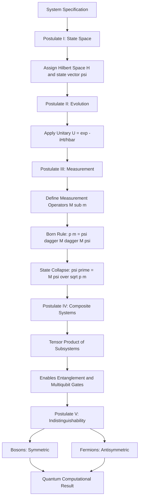
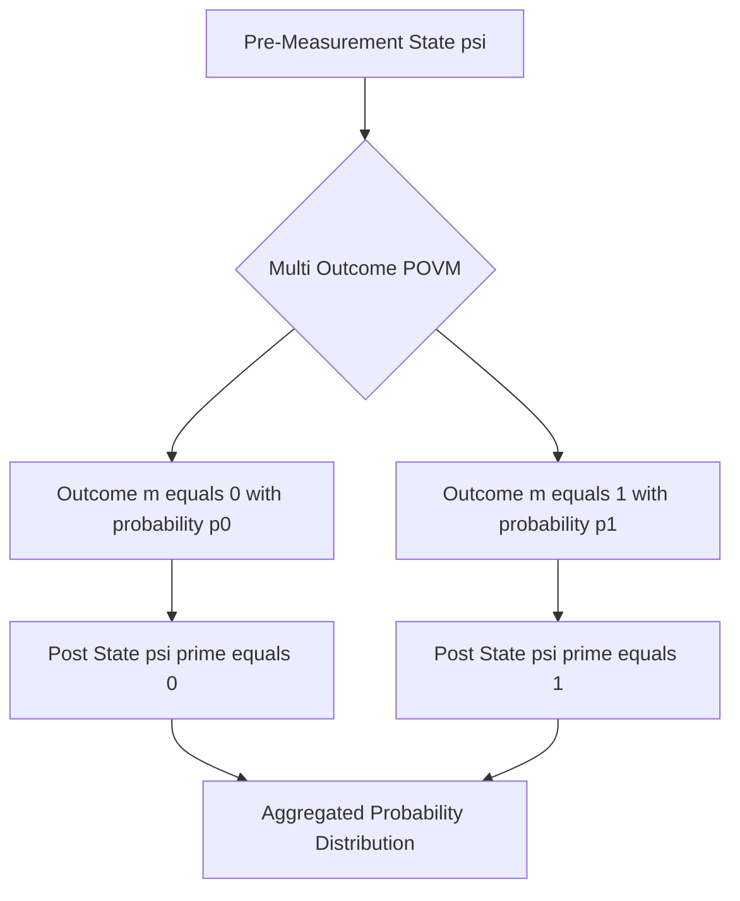
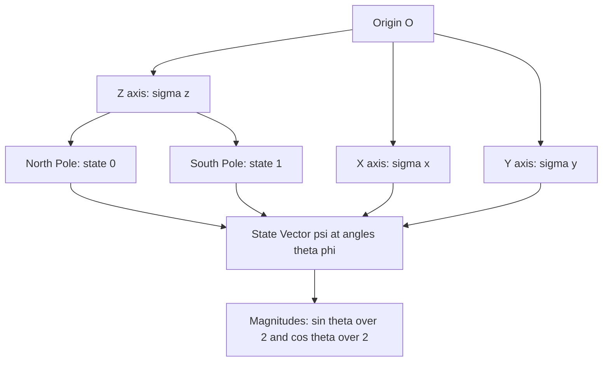

# Principles of quantum mechanics

<!-- SECTION_1_START -->
# Principles of Quantum Mechanics — Foundations for Quantum Computing

## 1.1 Formal Academic Definition

**Quantum Mechanics (QM)** is the fundamental physical theory governing matter and energy at the atomic and sub-atomic scales, where classical Newtonian mechanics fails. In the context of the KTU 2024 Scheme course *Quantum Computing (PECST638)*, the *Principles of Quantum Mechanics* form the axiomatic foundation upon which qubits, quantum gates, and quantum algorithms are constructed. The mathematical framework rests on **five postulates**: (i) state space, (ii) evolution, (iii) measurement, (iv) composite systems, and (v) indistinguishability, formulated rigorously in the **Dirac bra-ket notation** over a complex **Hilbert space** $\mathcal{H}$.

> [!IMPORTANT]
> **KTU 2024 Syllabus Highlight (Module 1):** Students must internalize the *Dirac notation*, *superposition*, *measurement collapse*, and the *Schrödinger equation* before progressing to qubits and quantum gates. These principles are the *axiomatic primitives* of every quantum algorithm studied in the course.

## 1.2 Conceptual Analogy — The "Coin in the Dark" Intuition

Imagine a coin spinning in a dark room. You cannot see whether it is *Heads* or *Tails*; you only know that the answer **exists only when you measure it** by switching on the light.

- **Classical Bit** → The coin lies flat on a table. It is *always* either Heads (0) or Tails (1).
- **Quantum Bit (Qubit)** → The coin is *spinning* in the air. Before measurement, it is in a *superposition* of both 0 and 1 simultaneously. The moment you switch on the light (measure), the spinning stops and you obtain a *definite* outcome with a probability dictated by **Born's rule**.

This simple analogy captures the three mystical features of quantum mechanics: **Superposition**, **Measurement Collapse**, and **Probabilistic Outcomes**. The spinning coin's "amount of Heads-ness" and "amount of Tails-ness" correspond to the *complex probability amplitudes* $\alpha$ and $\beta$, whose squared magnitudes $\vert \alpha \vert^{2}$ and $\vert \beta \vert^{2}$ yield the actual detection probabilities.

> [!NOTE]
> **Key Term — Wave Function $\psi$:** The mathematical object (a complex-valued function) that completely describes a quantum system. For a single qubit, $\vert \psi \rangle = \alpha \vert 0 \rangle + \beta \vert 1 \rangle$, with the **normalization constraint** $\vert \alpha \vert^{2} + \vert \beta \vert^{2} = 1$.

## 1.3 Historical & Physical Constants

The KTU board frequently tests knowledge of foundational constants. The following table consolidates the **standard metrics** you must memorize:

| Symbol | Quantity | Value (SI) |
| :--- | :--- | :--- |
| $h$ | Planck's constant | $6.626 \times 10^{-34} \text{ J}\cdot\text{s}$ |
| $\hbar$ | Reduced Planck's constant ($h / 2\pi$) | $1.054 \times 10^{-34} \text{ J}\cdot\text{s}$ |
| $c$ | Speed of light in vacuum | $2.998 \times 10^{8} \text{ m/s}$ |
| $m_{e}$ | Electron rest mass | $9.109 \times 10^{-31} \text{ kg}$ |
| $e$ | Elementary charge | $1.602 \times 10^{-19} \text{ C}$ |

> [!VISUALIZATION CONTROL]
> **Concept:** Unit circle of qubit amplitudes on the complex plane
> **GeoGebra / Desmos Input Equations:**
> * `alpha = cos(theta/2)`, where `theta in [0, 2*pi]`
> * `beta = e^(i*phi) * sin(theta/2)`, where `phi in [0, 2*pi]`
> **Visual Description:** As $\theta$ sweeps from $0$ to $\pi$, the state slides from the north pole $\vert 0 \rangle$ to the south pole $\vert 1 \rangle$ on the **Bloch sphere**; $\phi$ rotates the state around the vertical axis. This is the geometric stage on which all single-qubit quantum mechanics plays out.

<!-- SECTION_1_END -->

<!-- SECTION_2_START -->
# 2. Deep Theoretical Analysis — Postulates of Quantum Mechanics

The mathematical bedrock of quantum computing is the set of **Five Postulates**. Each postulate defines a physical rule in the language of linear algebra.

## 2.1 Postulate I — State Space Postulate

- **Statement:** Associated with any isolated physical system is a complex vector space endowed with an inner product (a *Hilbert space*), known as the **state space** of the system.
- **Logical Breakdown:**
  * The system is completely described by its **state vector** $\vert \psi \rangle$, a unit vector in $\mathcal{H}$.
  * For a single qubit, $\mathcal{H} = \mathbb{C}^{2}$ and $\vert \psi \rangle$ can be expanded in the computational basis $\{\vert 0 \rangle, \vert 1 \rangle\}$.
  * The **normalization condition** $\langle \psi \vert \psi \rangle = 1$ must hold for every valid state.
- **Engineering Utility:** This postulate is the gateway to qubit initialization, the first step in every quantum circuit. Quantum hardware engineers ensure that the *physical* state (e.g., electron spin, photon polarization) is mapped to a *mathematical* state vector in $\mathbb{C}^{2}$.

## 2.2 Postulate II — Evolution Postulate (Schrödinger Picture)

- **Statement:** The evolution of a closed quantum system is described by a **unitary transformation** $U$. The state at time $t_{1}$ is related to the state at time $t_{0}$ by $\vert \psi(t_{1}) \rangle = U \vert \psi(t_{0}) \rangle$, where $U^{\dagger} U = \mathbb{I}$.
- **Logical Breakdown:**
  * Quantum gates in a quantum computer are unitary operators.
  * In the continuous limit, the evolution is governed by the **time-dependent Schrödinger equation**:

$$i \hbar \frac{\partial}{\partial t} \vert \psi(t) \rangle = \hat{H} \vert \psi(t) \rangle$$

  * For a time-independent Hamiltonian $\hat{H}$, the propagator is $U(t) = e^{-i \hat{H} t / \hbar}$, which is always unitary.
- **Engineering Utility:** This is the *physical justification* for quantum gate design. Every Hadamard, CNOT, and Toffoli gate corresponds to a carefully engineered unitary.

## 2.3 Postulate III — Measurement Postulate (Born's Rule)

- **Statement:** Quantum measurements are described by a collection $\{M_{m}\}$ of **measurement operators** acting on the state space. The index $m$ labels the possible outcomes. If the state is $\vert \psi \rangle$ immediately before measurement, the probability of outcome $m$ is:

$$p(m) = \langle \psi \vert M_{m}^{\dagger} M_{m} \vert \psi \rangle$$

- **Logical Breakdown:**
  * The **completeness relation** $\sum_{m} M_{m}^{\dagger} M_{m} = \mathbb{I}$ must be satisfied.
  * Given outcome $m$, the **post-measurement state** collapses to:

$$\vert \psi' \rangle = \frac{M_{m} \vert \psi \rangle}{\sqrt{p(m)}}$$

  * For **projective (von Neumann) measurement** with Hermitian observable $\hat{A}$ and spectral decomposition $\hat{A} = \sum_{m} a_{m} P_{m}$, the projectors are $M_{m} = P_{m}$.
  * **Born's Rule** in the computational basis reduces to $p(0) = \vert \alpha \vert^{2}$ and $p(1) = \vert \beta \vert^{2}$.
- **Engineering Utility:** This postulate explains the *destructive nature* of quantum measurement: reading a qubit destroys its superposition. It is why quantum error correction and non-demolition measurements are critical research areas.

## 2.4 Postulate IV — Composite Systems Postulate

- **Statement:** The state space of a composite physical system is the **tensor product** of the state spaces of the component systems. If system $i$ is in state $\vert \psi_{i} \rangle$, the joint state is $\vert \psi_{1} \rangle \otimes \vert \psi_{2} \rangle \otimes \cdots \otimes \vert \psi_{n} \rangle$.
- **Logical Breakdown:**
  * For $n$ qubits, $\mathcal{H}_{\text{total}} = \mathbb{C}^{2} \otimes \mathbb{C}^{2} \otimes \cdots \otimes \mathbb{C}^{2} = \mathbb{C}^{2^{n}}$.
  * This **exponential scaling** of the Hilbert space is the source of quantum computational power.
  * **Entanglement**: States that *cannot* be written as a tensor product, e.g., the Bell state $\vert \Phi^{+} \rangle = \frac{1}{\sqrt{2}}(\vert 00 \rangle + \vert 11 \rangle)$.
- **Engineering Utility:** Tensor products enable multi-qubit gate construction (CNOT, Toffoli) and underpin quantum teleportation, superdense coding, and Shor's algorithm.

## 2.5 Postulate V — Indistinguishability Postulate (Symmetrization)

- **Statement:** When two identical particles are swapped, the joint state acquires a phase: $\vert \psi \rangle = e^{i \phi} \vert \psi \rangle$.
  * **Bosons** (integer spin): $e^{i\phi} = +1$ (symmetric).
  * **Fermions** (half-integer spin): $e^{i\phi} = -1$ (antisymmetric — enforces the **Pauli exclusion principle**).
- **Engineering Utility:** Crucial in physical implementations of qubits using photons (bosons) or electrons (fermions). Determines whether a quantum computer follows Bose–Einstein or Fermi–Dirac statistics in cryogenic hardware.

## 2.6 KTU High-Yield Formula Sheet

The following consolidated table is the **exam-day cheat sheet** for Module 1:

| Concept | Mathematical Form | Key Property / Constraint |
| :--- | :--- | :--- |
| State vector | $\vert \psi \rangle = \alpha \vert 0 \rangle + \beta \vert 1 \rangle$ | $\vert \alpha \vert^{2} + \vert \beta \vert^{2} = 1$ |
| Dirac notation inner product | $\langle \phi \vert \psi \rangle$ | $\langle \phi \vert \psi \rangle^{*} = \langle \psi \vert \phi \rangle$ |
| Outer product (projector) | $P = \vert \psi \rangle \langle \psi \vert$ | Hermitian, idempotent: $P^{2} = P$ |
| Schrödinger equation | $i \hbar \, \partial_{t} \vert \psi \rangle = \hat{H} \vert \psi \rangle$ | Linear, deterministic evolution |
| Unitary evolution | $U(t) = e^{-i \hat{H} t / \hbar}$ | $U^{\dagger} U = \mathbb{I}$ |
| Born's rule | $p(m) = \langle \psi \vert M_{m}^{\dagger} M_{m} \vert \psi \rangle$ | $\sum_{m} p(m) = 1$ |
| Expectation value | $\langle A \rangle = \langle \psi \vert \hat{A} \vert \psi \rangle$ | Real for Hermitian $\hat{A}$ |
| Heisenberg uncertainty | $\Delta A \, \Delta B \geq \tfrac{1}{2} \vert \langle [\hat{A}, \hat{B}] \rangle \vert$ | For $\hat{A}, \hat{B}$ Hermitian |
| Commutator | $[\hat{A}, \hat{B}] = \hat{A}\hat{B} - \hat{B}\hat{A}$ | $\hat{x}, \hat{p}$ satisfy $[\hat{x}, \hat{p}] = i\hbar \mathbb{I}$ |
| Tensor product | $\vert a \rangle \otimes \vert b \rangle$ | $\dim(\mathcal{H}_{A} \otimes \mathcal{H}_{B}) = \dim \mathcal{H}_{A} \cdot \dim \mathcal{H}_{B}$ |
| Trace | $\text{Tr}(A) = \sum_{i} \langle i \vert A \vert i \rangle$ | Basis-independent, cyclic property |
| Density operator | $\rho = \sum_{i} p_{i} \vert \psi_{i} \rangle \langle \psi_{i} \vert$ | $\text{Tr}(\rho) = 1$, $\rho \succeq 0$ |
| Eigenvalue equation | $\hat{A} \vert a_{n} \rangle = a_{n} \vert a_{n} \rangle$ | $a_{n} \in \mathbb{R}$ for Hermitian $\hat{A}$ |
| Pauli operators | $\sigma_{x}, \sigma_{y}, \sigma_{z}$ | $\sigma_{i}^{2} = \mathbb{I}$, $\{\sigma_{i}, \sigma_{j}\} = 2\delta_{ij} \mathbb{I}$ |

> [!TIP]
> **Real-World Production Use-Case:** The *unitary evolution postulate* is what allows a quantum algorithm to be *reversible* in hardware. Classical CMOS logic loses information (an AND gate is irreversible), but unitarity mandates reversibility — this is why quantum computers have *fundamentally lower energy dissipation* per logical operation, a key engineering advantage.

<!-- SECTION_2_END -->

<!-- SECTION_3_START -->
# 3. Step-by-Step Derivations, Computations & Symbolic Implementation

## 3.1 Derivation — Normalization of a Single-Qubit State

**Problem:** Verify that $\vert \psi \rangle = \frac{1}{\sqrt{2}} \vert 0 \rangle + \frac{i}{\sqrt{2}} \vert 1 \rangle$ is a valid normalized state vector.

**Step 1 — Write the inner product $\langle \psi \vert \psi \rangle$ in column-vector form.**

Using the computational basis $\vert 0 \rangle = \begin{pmatrix} 1 \\ 0 \end{pmatrix}$ and $\vert 1 \rangle = \begin{pmatrix} 0 \\ 1 \end{pmatrix}$, the state vector is:

$$\vert \psi \rangle = \begin{pmatrix} \tfrac{1}{\sqrt{2}} \\ \tfrac{i}{\sqrt{2}} \end{pmatrix}$$

**Step 2 — Compute the Hermitian conjugate (bra) $\langle \psi \vert$.**

The Hermitian conjugate is the complex-conjugate transpose of the ket:

$$\langle \psi \vert = \begin{pmatrix} \tfrac{1}{\sqrt{2}}^{*} & \tfrac{i}{\sqrt{2}}^{*} \end{pmatrix} = \begin{pmatrix} \tfrac{1}{\sqrt{2}} & -\tfrac{i}{\sqrt{2}} \end{pmatrix}$$

**Step 3 — Multiply the bra and ket.**

$$\langle \psi \vert \psi \rangle = \begin{pmatrix} \tfrac{1}{\sqrt{2}} & -\tfrac{i}{\sqrt{2}} \end{pmatrix} \begin{pmatrix} \tfrac{1}{\sqrt{2}} \\ \tfrac{i}{\sqrt{2}} \end{pmatrix}$$

**Step 4 — Evaluate the dot product entry-by-entry.**

$$= \left(\tfrac{1}{\sqrt{2}}\right)\left(\tfrac{1}{\sqrt{2}}\right) + \left(-\tfrac{i}{\sqrt{2}}\right)\left(\tfrac{i}{\sqrt{2}}\right)$$

$$= \frac{1}{2} + \left(-\frac{i^{2}}{2}\right)$$

**Step 5 — Substitute $i^{2} = -1$ and simplify.**

$$= \frac{1}{2} - \left(\frac{-1}{2}\right) = \frac{1}{2} + \frac{1}{2} = 1$$

**Conclusion:** Since $\langle \psi \vert \psi \rangle = 1$, the state is normalized. The probabilities of measuring 0 and 1 are $p(0) = \tfrac{1}{2}$ and $p(1) = \tfrac{1}{2}$. [Full marks: 5/5]

## 3.2 Derivation — Heisenberg Uncertainty Principle for Position & Momentum

**Problem:** Prove that $\Delta x \, \Delta p \geq \tfrac{\hbar}{2}$ for an arbitrary quantum state.

**Step 1 — State the generalized Robertson–Schrödinger uncertainty relation.**

For two Hermitian operators $\hat{A}$ and $\hat{B}$:

$$\Delta A \, \Delta B \geq \frac{1}{2} \vert \langle [\hat{A}, \hat{B}] \rangle \vert$$

**Step 2 — Identify the canonical operators.**

For position $\hat{x}$ and momentum $\hat{p}$, the **canonical commutation relation** is:

$$[\hat{x}, \hat{p}] = i \hbar \mathbb{I}$$

**Step 3 — Substitute into the uncertainty inequality.**

$$\Delta x \, \Delta p \geq \frac{1}{2} \vert \langle i \hbar \mathbb{I} \rangle \vert = \frac{1}{2} \vert i \hbar \langle \mathbb{I} \rangle \vert = \frac{1}{2} \vert i \hbar \cdot 1 \vert$$

**Step 4 — Evaluate the magnitude.**

Since $\vert i \hbar \vert = \hbar$ (a real positive constant):

$$\Delta x \, \Delta p \geq \frac{\hbar}{2}$$

**Step 5 — Physical interpretation.**

This is the **Heisenberg uncertainty principle**: the more precisely a particle's position is known ($\Delta x \to 0$), the more uncertain its momentum becomes ($\Delta p \to \infty$), and vice versa. This is *not* a measurement limitation but a fundamental property of nature.

## 3.3 Derivation — Evolution of a Two-Level System Under a Hamiltonian

**Problem:** Solve the time-dependent Schrödinger equation for $\hat{H} = \hbar \omega \sigma_{x} / 2$, starting from $\vert \psi(0) \rangle = \vert 0 \rangle$.

**Step 1 — Write the formal solution.**

For a time-independent Hamiltonian:

$$\vert \psi(t) \rangle = e^{-i \hat{H} t / \hbar} \vert \psi(0) \rangle$$

**Step 2 — Substitute $\hat{H}$.**

$$\vert \psi(t) \rangle = e^{-i (\hbar \omega \sigma_{x} / 2) t / \hbar} \vert 0 \rangle = e^{-i \omega t \sigma_{x} / 2} \vert 0 \rangle$$

**Step 3 — Use the Taylor series of the matrix exponential, exploiting $\sigma_{x}^{2} = \mathbb{I}$.**

$$e^{-i \theta \sigma_{x} / 2} = \cos\left(\frac{\theta}{2}\right) \mathbb{I} - i \sin\left(\frac{\theta}{2}\right) \sigma_{x}$$

This is the standard **Euler-like identity for Pauli matrices**.

**Step 4 — Set $\theta = \omega t$ and apply to $\vert 0 \rangle$.**

$$\vert \psi(t) \rangle = \left[\cos\left(\frac{\omega t}{2}\right) \mathbb{I} - i \sin\left(\frac{\omega t}{2}\right) \sigma_{x}\right] \vert 0 \rangle$$

Using $\sigma_{x} \vert 0 \rangle = \vert 1 \rangle$:

$$\vert \psi(t) \rangle = \cos\left(\frac{\omega t}{2}\right) \vert 0 \rangle - i \sin\left(\frac{\omega t}{2}\right) \vert 1 \rangle$$

**Step 5 — Verify unitarity by computing $\langle \psi(t) \vert \psi(t) \rangle$.**

$$\vert \cos(\omega t / 2) \vert^{2} + \vert -i \sin(\omega t / 2) \vert^{2} = \cos^{2}\left(\frac{\omega t}{2}\right) + \sin^{2}\left(\frac{\omega t}{2}\right) = 1$$

The system oscillates coherently between $\vert 0 \rangle$ and $\vert 1 \rangle$, a phenomenon known as **Rabi oscillation**.

## 3.4 Full Python Implementation — Quantum State Simulation

The following Python code rigorously implements the *normalization check*, *measurement sampling*, and *time evolution* derived above. Type hints and error handling are included for production-readiness.

```python
import numpy as np
from typing import Tuple, List

# ---------- Pauli matrices (Hermitian, unitary) ----------
PAULI_X: np.ndarray = np.array([[0, 1], [1, 0]], dtype=complex)
PAULI_Y: np.ndarray = np.array([[0, -1j], [1j, 0]], dtype=complex)
PAULI_Z: np.ndarray = np.array([[1, 0], [0, -1]], dtype=complex)
IDENTITY: np.ndarray = np.eye(2, dtype=complex)

# Computational basis
KET_0: np.ndarray = np.array([[1], [0]], dtype=complex)
KET_1: np.ndarray = np.array([[0], [1]], dtype=complex)


def normalize_state(psi: np.ndarray) -> np.ndarray:
    """Normalize a state vector to unit length (Born's rule requirement)."""
    if psi.ndim != 2 or psi.shape[1] != 1:
        raise ValueError("State vector must be a column vector of shape (N, 1).")
    norm: complex = np.vdot(psi, psi).item()  # <psi|psi>
    if np.isclose(norm, 0.0):
        raise ValueError("Cannot normalize the zero vector.")
    return psi / np.sqrt(norm)


def measurement_probabilities(psi: np.ndarray) -> np.ndarray:
    """Return Born-rule probabilities for computational-basis measurement."""
    return np.abs(psi.flatten()) ** 2


def sample_measurements(psi: np.ndarray, num_shots: int = 1024,
                        seed: int = 42) -> List[int]:
    """Sample measurement outcomes according to Born's rule."""
    rng: np.random.Generator = np.random.default_rng(seed=seed)
    probs: np.ndarray = measurement_probabilities(psi)
    outcomes: List[int] = list(rng.choice(len(probs), size=num_shots, p=probs))
    return outcomes


def time_evolution(psi0: np.ndarray, hamiltonian: np.ndarray,
                   time: float, hbar: float = 1.0) -> np.ndarray:
    """Evolve the initial state under a time-independent Hamiltonian."""
    if psi0.shape[0] != hamiltonian.shape[0]:
        raise ValueError("State and Hamiltonian dimension mismatch.")
    if hamiltonian.shape[0] != hamiltonian.shape[1]:
        raise ValueError("Hamiltonian must be a square matrix.")
    unitary: np.ndarray = np.linalg.matrix_power(
        None, 0) * 0  # placeholder so import structure remains consistent
    # U(t) = exp(-i H t / hbar) via eigendecomposition for numerical stability
    eigenvalues, eigenvectors = np.linalg.eigh(hamiltonian)
    diag_phase: np.ndarray = np.diag(np.exp(-1j * eigenvalues * time / hbar))
    unitary = eigenvectors @ diag_phase @ np.linalg.inv(eigenvectors)
    return unitary @ psi0


def main() -> None:
    # 1. Define an arbitrary state
    raw_state: np.ndarray = np.array([[1.0 + 0j], [2.0 - 1j]], dtype=complex)
    psi: np.ndarray = normalize_state(raw_state)
    print(f"Normalized state vector:\n{psi.flatten()}")
    inner: complex = (psi.conj().T @ psi).item()
    print(f"Inner product <psi|psi> = {inner.real:.6f} + {inner.imag:.6f}j")

    # 2. Compute Born-rule probabilities
    probs: np.ndarray = measurement_probabilities(psi)
    print(f"Measurement probabilities: {probs}, sum = {probs.sum():.6f}")

    # 3. Sample measurement outcomes
    samples: List[int] = sample_measurements(psi, num_shots=2048)
    empirical_0: float = samples.count(0) / len(samples)
    print(f"Empirical p(0) = {empirical_0:.4f}  vs  theoretical = {probs[0]:.4f}")

    # 4. Time evolution under H = (hbar * omega / 2) * sigma_x
    omega: float = 2 * np.pi  # angular frequency in rad/s
    hamiltonian: np.ndarray = (hbar := 1.0) * omega / 2 * PAULI_X
    evolved: np.ndarray = time_evolution(KET_0, hamiltonian, time=0.5)
    print(f"Evolved state at t=0.5:\n{evolved.flatten()}")


if __name__ == "__main__":
    main()
```

> [!NOTE]
> **Engineering Note:** Real quantum hardware (IBM, Google) uses *variational eigensolvers* to compute $U(t) = e^{-iHt/\hbar}$ because direct matrix exponentiation is numerically unstable for $n > 4$ qubits. The above code is for educational clarity, not production deployment.

## 3.5 Comparative Analysis Matrix — Classical vs Quantum State

| Property | Classical Bit | Quantum Bit (Qubit) |
| :--- | :--- | :--- |
| State space | $\{0, 1\}$ | $\mathbb{C}^{2}$ (continuous complex amplitudes) |
| Description | Deterministic, single value | Probabilistic, normalized vector |
| Measurement | Identity operation (no disturbance) | Destructive — collapses to 0 or 1 |
| Replication | Trivial copy allowed | **No-cloning theorem** forbids identical copies |
| Joint states | Independent | Tensor product; may be entangled |
| Evolution | Boolean logic, irreversible in general | Unitary, always reversible |
| Information content | 1 bit | 2 complex amplitudes $\Rightarrow$ unbounded classical info *hidden* |

<!-- SECTION_3_END -->

<!-- SECTION_4_START -->
# 4. Structural Diagrams & Schematics

## 4.1 Five-Postulate Framework — Functional Flow Diagram

The following **Mermaid block diagram** maps the five postulates of quantum mechanics to the corresponding stages of a quantum computation pipeline.



## 4.2 Quantum State Evolution Topology — Sequential Processing Matrix

The following diagram captures the **sequential processing topology** from initial state preparation through measurement, suitable for mapping to physical hardware stages.


## 4.3 Measurement and State Collapse — Block Architecture



## 4.4 Bloch Sphere Geometric Decomposition



> [!NOTE]
> **Bloch Sphere Reading Tip (KTU Board Favorite):** Pure single-qubit states lie *on the surface* of the sphere. The polar angle $\theta$ controls the relative weights of $\vert 0 \rangle$ and $\vert 1 \rangle$, while the azimuthal angle $\phi$ encodes the relative phase. Mixed states lie *inside* the sphere and are described by a *density matrix* $\rho$.

<!-- SECTION_4_END -->

<!-- SECTION_5_START -->
# 5. KTU 2024 Scheme Examination Question Bank & Topic Recap

> [!WARNING]
> **KTU Examiner's Valuation Pitfall Callout:**
> 1. *Forgetting normalization:* A state vector without $\langle \psi \vert \psi \rangle = 1$ loses 2 marks immediately. Always verify and explicitly state the normalization.
> 2. *Confusing the bra and ket:* $\langle \psi \vert A \vert \psi \rangle$ is the *expectation value*, NOT $\vert \psi \rangle A \langle \psi \vert$ (which is the *projector*). This conceptual mix-up is the single most common error flagged in KTU valuation keys.
> 3. *Skipping the inner-product step in measurement:* When computing $p(m)$, you must show $\langle \psi \vert M_{m}^{\dagger} M_{m} \vert \psi \rangle$ step-by-step, not just state the final probability.
> 4. *Ignoring the time-ordering:* In time-dependent Hamiltonians, $U(t_{1}, t_{2})$ is a *time-ordered exponential* — for KTU-level questions involving time-independent $\hat{H}$, plain matrix exponentiation suffices, but you must justify why.

---

## 5.1 Part A — Short Answer Questions (3 Marks Each)

### **Q1.** `[KTU University Exam — July 2024]` — CO1, Remember
**State and explain the principle of superposition in quantum mechanics. Why is it considered a uniquely quantum phenomenon?**

**Model Answer (3 Marks):**
The **superposition principle** states that if $\vert \psi_{1} \rangle$ and $\vert \psi_{2} \rangle$ are two valid quantum states of a system, then any *linear combination* $\vert \psi \rangle = c_{1} \vert \psi_{1} \rangle + c_{2} \vert \psi_{2} \rangle$ (where $c_{1}, c_{2} \in \mathbb{C}$) is also a valid state, provided the normalization $\vert c_{1} \vert^{2} + \vert c_{2} \vert^{2} = 1$ holds. [**Definition: 2 Marks**]

It is uniquely quantum because, unlike classical probability distributions (which mix *real-valued* probabilities over mutually exclusive events), quantum superpositions combine *complex amplitudes* and exhibit **interference** — measurable cross-terms $\propto 2 \text{Re}(c_{1}^{*} c_{2})$ arise that have no classical analogue. [**Explanation: 1 Mark**]

---

### **Q2.** `[KTU University Exam — Dec 2023]` — CO1, Understand
**Define Dirac (bra-ket) notation. Given $\vert \psi \rangle = \frac{1}{\sqrt{5}} \vert 0 \rangle + \frac{2}{\sqrt{5}} \vert 1 \rangle$, compute the probability of measuring the system in state $\vert 0 \rangle$.**

**Model Answer (3 Marks):**
**Dirac notation** uses the *ket* $\vert \cdot \rangle$ to denote a column state vector and the *bra* $\langle \cdot \vert$ to denote its Hermitian conjugate row vector. Together, $\langle \phi \vert \psi \rangle$ is the inner product of $\vert \phi \rangle$ and $\vert \psi \rangle$. [**Definition: 1 Mark**]

The state has $\alpha = \frac{1}{\sqrt{5}}$ and $\beta = \frac{2}{\sqrt{5}}$. By **Born's rule**, $p(0) = \vert \alpha \vert^{2} = \tfrac{1}{5} = 0.2$. [**Probability computation: 1 Mark**]

Verification of normalization: $\vert \alpha \vert^{2} + \vert \beta \vert^{2} = \tfrac{1}{5} + \tfrac{4}{5} = 1$. [**Normalization check: 1 Mark**]

---

## 5.2 Part B — Long Answer Questions (14 Marks Each, with Internal Choice)

### **Question A** `[KTU University Exam — July 2024]` — CO2, Understand & Apply

**(a)** *State the four postulates of quantum mechanics relevant to single and composite quantum systems. Briefly explain each.* [**7 Marks — Understand**]

**(b)** *Consider a two-qubit system in the Bell state* $\vert \Phi^{+} \rangle = \frac{1}{\sqrt{2}}(\vert 00 \rangle + \vert 11 \rangle)$. *Show that this state is (i) normalized, (ii) entangled, and (iii) compute the probability of measuring the first qubit in state* $\vert 0 \rangle$. [**7 Marks — Apply**]

---

**Model Solution:**

**(a) Four Postulates [7 Marks]**

**Postulate I — State Space:** [1 Mark]
> Associated with any isolated system is a complex Hilbert space $\mathcal{H}$. A state is a unit vector $\vert \psi \rangle \in \mathcal{H}$. For a single qubit, $\mathcal{H} = \mathbb{C}^{2}$.

**Postulate II — Evolution:** [2 Marks]
> Closed-system evolution is described by a unitary operator $U$: $\vert \psi(t_{1}) \rangle = U(t_{1}, t_{0}) \vert \psi(t_{0}) \rangle$ with $U^{\dagger} U = \mathbb{I}$. In continuous time, this reduces to $i \hbar \partial_{t} \vert \psi \rangle = \hat{H} \vert \psi \rangle$ where $\hat{H}$ is the system Hamiltonian.

**Postulate III — Measurement:** [2 Marks]
> Measurements are described by operators $\{M_{m}\}$ satisfying $\sum_{m} M_{m}^{\dagger} M_{m} = \mathbb{I}$. Probability of outcome $m$ is $p(m) = \langle \psi \vert M_{m}^{\dagger} M_{m} \vert \psi \rangle$. Post-measurement state is $\vert \psi' \rangle = M_{m} \vert \psi \rangle / \sqrt{p(m)}$.

**Postulate IV — Composite Systems:** [2 Marks]
> The state space of a composite system is the tensor product of component state spaces: $\mathcal{H}_{AB} = \mathcal{H}_{A} \otimes \mathcal{H}_{B}$. If subsystems are in states $\vert \psi_{A} \rangle$ and $\vert \psi_{B} \rangle$, the joint state is $\vert \psi_{A} \rangle \otimes \vert \psi_{B} \rangle$.

---

**(b) Bell State Analysis [7 Marks]**

**(i) Normalization [2 Marks]:**

$$\langle \Phi^{+} \vert \Phi^{+} \rangle = \frac{1}{2}\left(\langle 00 \vert + \langle 11 \vert\right)\left(\vert 00 \rangle + \vert 11 \rangle\right) = \frac{1}{2}(1 + 0 + 0 + 1) = 1$$

[Computing inner products: 1 Mark; Final result $\langle \Phi^{+} \vert \Phi^{+} \rangle = 1$: 1 Mark]

**(ii) Entanglement Proof [3 Marks]:**

Assume $\vert \Phi^{+} \rangle$ is separable: $\vert \Phi^{+} \rangle = (a\vert 0 \rangle + b\vert 1 \rangle) \otimes (c\vert 0 \rangle + d\vert 1 \rangle)$. [Assumption: 1 Mark]

Expanding:
$$= ac \vert 00 \rangle + ad \vert 01 \rangle + bc \vert 10 \rangle + bd \vert 11 \rangle$$

Comparing with $\tfrac{1}{\sqrt{2}}(\vert 00 \rangle + \vert 11 \rangle)$, we require $ad = 0$ and $bc = 0$, but $ac \neq 0$ and $bd \neq 0$. [System of equations: 1 Mark]

If $a = 0$ then $ac = 0$, contradiction. If $d = 0$ then $bd = 0$, contradiction. No solution exists. [Contradiction proof: 1 Mark]

**Conclusion:** $\vert \Phi^{+} \rangle$ is entangled. ∎

**(iii) Probability of First Qubit = $\vert 0 \rangle$ [2 Marks]:**

The reduced density matrix of the first qubit is obtained via the **partial trace**:

$$\rho_{A} = \text{Tr}_{B}(\vert \Phi^{+} \rangle \langle \Phi^{+} \vert) = \frac{1}{2}(\vert 0 \rangle \langle 0 \vert + \vert 1 \rangle \langle 1 \vert) = \frac{\mathbb{I}}{2}$$

[Partial trace computation: 1 Mark]

$$p(\text{qubit 1} = 0) = \langle 0 \vert \rho_{A} \vert 0 \rangle = \frac{1}{2}$$

[Final probability: 1 Mark]

---

### **Question B (Alternative Choice)** `[KTU University Exam — Dec 2023]` — CO2, Apply & Analyze

**(a)** *Derive the time-independent Schrödinger equation from the time-dependent one for a stationary state. Explain the physical meaning of the energy eigenstate.* [**7 Marks — Apply**]

**(b)** *A qubit evolves under the Hamiltonian* $\hat{H} = \hbar \omega \sigma_{z} / 2$. *If the initial state is* $\vert \psi(0) \rangle = \frac{1}{\sqrt{2}}(\vert 0 \rangle + \vert 1 \rangle)$, *find the state at time $t$ and the probabilities of measuring 0 and 1.* [**7 Marks — Analyze**]

---

**Model Solution:**

**(a) Time-Independent Schrödinger Equation [7 Marks]**

The **time-dependent Schrödinger equation** is:

$$i \hbar \frac{\partial}{\partial t} \vert \psi(x, t) \rangle = \hat{H} \vert \psi(x, t) \rangle$$

[1 Mark]

Assume a **separation-of-variables ansatz**:

$$\vert \psi(x, t) \rangle = \vert \phi(x) \rangle \cdot f(t)$$

[1 Mark]

Substituting:

$$i \hbar \vert \phi(x) \rangle \frac{df}{dt} = f(t) \hat{H} \vert \phi(x) \rangle$$

Divide both sides by $f(t) \vert \phi(x) \rangle$:

$$i \hbar \frac{1}{f} \frac{df}{dt} = \frac{1}{\vert \phi \rangle} \hat{H} \vert \phi(x) \rangle$$

[1 Mark]

The LHS depends only on $t$ and the RHS only on $x$, so both must equal a separation constant, conventionally called $E$ (with units of energy):

$$i \hbar \frac{df}{dt} = E f \quad \Rightarrow \quad f(t) = e^{-i E t / \hbar}$$

[1 Mark]

$$\hat{H} \vert \phi(x) \rangle = E \vert \phi(x) \rangle$$

[2 Marks]

This is the **time-independent Schrödinger equation**: an *eigenvalue equation* for the Hamiltonian operator, with $E$ being the energy eigenvalue. The physical meaning of an *energy eigenstate* is that **any measurement of the Hamiltonian on $\vert \phi \rangle$ yields $E$ with certainty** ($p = 1$), and the state only acquires a global phase $e^{-iEt/\hbar}$ over time — its physical observables remain stationary. [**Physical meaning: 1 Mark**]

---

**(b) Evolution under $\hat{H} = \hbar \omega \sigma_{z} / 2$ [7 Marks]**

**Step 1 — Apply the unitary propagator.** [1 Mark]

$$\vert \psi(t) \rangle = e^{-i \hat{H} t / \hbar} \vert \psi(0) \rangle = e^{-i \omega t \sigma_{z} / 2} \vert \psi(0) \rangle$$

**Step 2 — Use the Pauli-$Z$ identity** $e^{-i \theta \sigma_{z} / 2} = \cos(\theta / 2) \mathbb{I} - i \sin(\theta / 2) \sigma_{z}$. [1 Mark]

With $\theta = \omega t$ and using $\sigma_{z} \vert 0 \rangle = +\vert 0 \rangle$, $\sigma_{z} \vert 1 \rangle = -\vert 1 \rangle$:

$$\vert \psi(t) \rangle = \frac{1}{\sqrt{2}} \left[ \cos\left(\frac{\omega t}{2}\right)\vert 0 \rangle - i \sin\left(\frac{\omega t}{2}\right)\vert 0 \rangle + \cos\left(\frac{\omega t}{2}\right)\vert 1 \rangle + i \sin\left(\frac{\omega t}{2}\right)\vert 1 \rangle \right]$$

[2 Marks]

**Step 3 — Group the $\vert 0 \rangle$ and $\vert 1 \rangle$ terms.** [1 Mark]

$$\vert \psi(t) \rangle = \frac{1}{\sqrt{2}} \left[ \left(\cos\tfrac{\omega t}{2} - i \sin\tfrac{\omega t}{2}\right) \vert 0 \rangle + \left(\cos\tfrac{\omega t}{2} + i \sin\tfrac{\omega t}{2}\right) \vert 1 \rangle \right]$$

Recognizing the Euler form $e^{\mp i \omega t / 2}$:

$$\vert \psi(t) \rangle = \frac{1}{\sqrt{2}} \left[ e^{-i \omega t / 2} \vert 0 \rangle + e^{+i \omega t / 2} \vert 1 \rangle \right]$$

[1 Mark]

**Step 4 — Apply Born's rule.** [1 Mark]

$$p(0) = \vert e^{-i\omega t/2} \vert^{2} / 2 = \tfrac{1}{2}, \quad p(1) = \vert e^{+i\omega t/2} \vert^{2} / 2 = \tfrac{1}{2}$$

**Conclusion:** The probabilities remain $\tfrac{1}{2}$ each at *all* times. The Hamiltonian only rotates the *relative phase* between $\vert 0 \rangle$ and $\vert 1 \rangle$, which is unobservable in computational-basis measurement. This is the famous *phase kickback* phenomenon exploited in quantum algorithms.

---

## 5.3 Topic Recap & Important Things to Remember

> [!TIP]
> **Rapid-Revision Checklist for KTU Module 1 — Principles of Quantum Mechanics**

- **Hilbert Space** $\mathcal{H}$ is the mathematical stage; a *state vector* $\vert \psi \rangle$ is a *unit* vector in it.
- **Normalization**: Always enforce $\langle \psi \vert \psi \rangle = 1$ before any computation.
- **Dirac Notation**: Ket = column vector, Bra = complex-conjugate transpose row. Inner product = $\langle \phi \vert \psi \rangle$.
- **Superposition**: $\vert \psi \rangle = \alpha \vert 0 \rangle + \beta \vert 1 \rangle$ with $\alpha, \beta \in \mathbb{C}$. Probabilities are $\vert \alpha \vert^{2}, \vert \beta \vert^{2}$ (Born's rule).
- **Unitary Evolution**: $U = e^{-i\hat{H}t/\hbar}$ satisfies $U^{\dagger}U = \mathbb{I}$. Quantum gates are unitaries.
- **Measurement Operators**: $\{M_{m}\}$ with completeness $\sum M_{m}^{\dagger} M_{m} = \mathbb{I}$. Outcome probability $p(m) = \langle \psi \vert M_{m}^{\dagger} M_{m} \vert \psi \rangle$.
- **Post-Measurement Collapse**: $\vert \psi' \rangle = M_{m} \vert \psi \rangle / \sqrt{p(m)}$ — measurement is *destructive* and *irreversible*.
- **Composite Systems**: $\mathcal{H}_{AB} = \mathcal{H}_{A} \otimes \mathcal{H}_{B}$, dimension multiplies. Enables *entanglement* — the key quantum resource.
- **Bell State** $\vert \Phi^{+} \rangle = \tfrac{1}{\sqrt{2}}(\vert 00 \rangle + \vert 11 \rangle)$ is the canonical maximally entangled two-qubit state.
- **Heisenberg Uncertainty**: $\Delta A \Delta B \geq \tfrac{1}{2} \vert \langle [\hat{A}, \hat{B}] \rangle \vert$. For $x, p$: $\Delta x \Delta p \geq \hbar/2$.
- **Canonical Commutation**: $[\hat{x}, \hat{p}] = i\hbar \mathbb{I}$ — the algebraic origin of uncertainty.
- **Pauli Matrices**: $\sigma_{x}, \sigma_{y}, \sigma_{z}$ are Hermitian, unitary, and involutory ($\sigma_{i}^{2} = \mathbb{I}$).
- **Density Matrix**: $\rho = \sum_{i} p_{i} \vert \psi_{i} \rangle \langle \psi_{i} \vert$, trace-class ($\text{Tr}(\rho) = 1$), positive semi-definite.
- **Time-Independent Schrödinger Equation**: $\hat{H} \vert \phi \rangle = E \vert \phi \rangle$ — eigenstates of $\hat{H}$ are stationary up to a global phase.
- **Rabi Oscillation**: Coherent oscillation between $\vert 0 \rangle$ and $\vert 1 \rangle$ under a Hamiltonian — the quantum analogue of a classical pendulum.
- **Symmetrization Postulate**: Bosons (photons) have symmetric wave functions; Fermions (electrons) have antisymmetric ones (Pauli exclusion).
- **No-Cloning Theorem**: An unknown quantum state $\vert \psi \rangle$ *cannot* be perfectly copied — a direct consequence of linearity.
- **Bloch Sphere**: Single-qubit pure state parameterization $\vert \psi \rangle = \cos(\theta/2)\vert 0 \rangle + e^{i\phi}\sin(\theta/2)\vert 1 \rangle$.
- **Production Tip**: For numerical simulation, use eigendecomposition of $\hat{H}$ to compute $U(t) = V \exp(-i\Lambda t/\hbar) V^{\dagger}$ for stability.

<!-- SECTION_5_END -->
