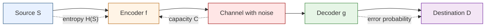
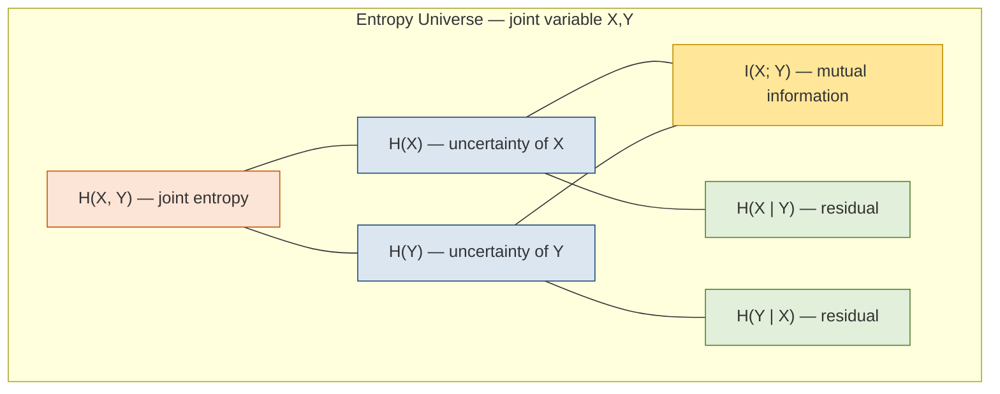
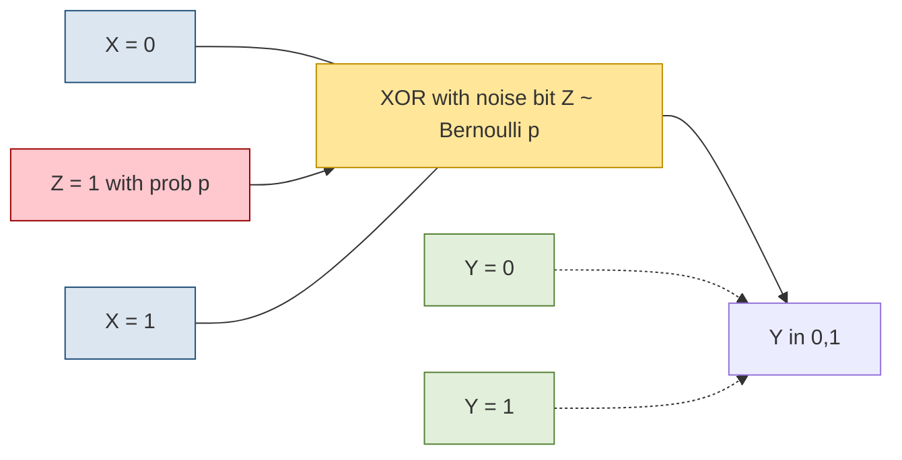

# Review of Information theory

<!-- SECTION_1_START -->
# 1. Core Technical Definition & Intuitive Overview

## 1.1 Formal Definition (KTU 2024 Syllabus Terminology)

**Information Theory** is the mathematical framework, formalized by **Claude Elwood Shannon** in his landmark 1948 paper *"A Mathematical Theory of Communication"*, that quantifies the *production*, *transmission*, and *reception* of data. It defines **information** as the *reduction of uncertainty* about the state of a system upon observing an outcome.

For a discrete random variable $X$ taking values $\{x_1, x_2, \dots, x_n\}$ with probability distribution $P(x_i)$, the **self-information** (or *surprisal*) of an event $x_i$ is defined as:

$$
I(x_i) = -\log_{2} P(x_i) \quad \text{(measured in bits)}
$$

> [!IMPORTANT]
> **Shannon's Central Tenet:** The information content of a message is determined *entirely* by the probability distribution of the source — not by the *semantic meaning* of the message. The phrase *"I love you"* and *"I owe you $1000"* can carry identical information content if both have equal probability $1/2$.

> [!NOTE]
> **KTU 2024 Module Context:** This topic is the *classical scaffold* upon which **quantum information theory** is later built. Every classical measure (Shannon entropy, mutual information, channel capacity) has a *direct quantum analogue* (von Neumann entropy, quantum mutual information, Holevo capacity).

## 1.2 Intuitive Real-World Analogy

Imagine you are standing at a bus stop with **three possible buses**: Bus A (70% likely), Bus B (20% likely), Bus C (10% likely). The bus dispatcher announces the bus number.

- Hearing "Bus A" gives you **little information** — you almost expected it.
- Hearing "Bus C" gives you **a lot of information** — it was highly unlikely.

**Information = Surprise.** Rare events are *informative*; common events are *uninformative*. Shannon captured this intuition mathematically using the **logarithm function** because it converts products of probabilities (independent events) into *sums* of information — a property known as **additivity**.

## 1.3 Units of Information

| Logarithm Base | Unit | Symbol |
| :--- | :--- | :---: |
| Base 2 | **bit** (binary digit) | $\text{bit}$ |
| Base $e$ | **nat** (natural unit) | $\text{nat}$ |
| Base 10 | **hartley** / decit | $\text{Hart}$ |

Conversion: $1\,\text{bit} = \ln 2 \approx 0.693\,\text{nat} = \log_{10} 2 \approx 0.301\,\text{Hart}$.

> [!VISUALIZATION CONTROL]
> **Concept:** Shannon Entropy vs. Bias of a Binary Coin
> **GeoGebra / Desmos Input Equations:**
> * `H(p) = -p * log2(p) - (1-p) * log2(1-p)` (for $0 < p < 1$)
> * `H(0) = 0`, `H(1) = 0` (boundary values)
> **Visual Description:** A symmetric, concave "arch" peaking at $H = 1\,\text{bit}$ when $p = 0.5$ (fair coin — maximum uncertainty). It flattens to $0$ as the coin becomes deterministic ($p \to 0$ or $p \to 1$). The x-axis is the bias $p \in [0,1]$; the y-axis is the entropy in bits.

## 1.4 Why Information Theory Matters in Quantum Computing

KTU 2024 places this topic in Module 1 because quantum computing is fundamentally a *theory of information processing*:

1. **Qubits replace bits** — both store information, but qubits can exist in superposition.
2. **Von Neumann entropy** generalizes Shannon entropy for density matrices.
3. **Shannon's noiseless coding theorem** has a quantum analogue (Schumacher's theorem) for compressing quantum states.
4. **Channel capacity** in classical systems extends to the **Holevo bound** and **quantum channel capacities**.

> [!IMPORTANT]
> **Foundational Bridge:** Every formula you learn in this module — $H(X)$, $H(X \vert Y)$, $I(X;Y)$ — reappears in Module 2/3 with **density operators** $\rho$ replacing probability distributions $P$.

<!-- SECTION_1_END -->

<!-- SECTION_2_START -->
# 2. Deep Theoretical Analysis & KTU High-Yield Formula Sheet

## 2.1 Operational Definitions (Structured Logic)

### 2.1.1 Self-Information (Surprisal)
- **Why:** To assign a numerical *amount* of information to a single event.
- **How:** Invert its probability through a negative logarithm.
- **Property 1 — Non-negativity:** $I(x_i) \geq 0$ because $0 \leq P(x_i) \leq 1$.
- **Property 2 — Null info for certain events:** $P(x_i)=1 \Rightarrow I(x_i)=0$.
- **Property 3 — Additivity for independent events:** $I(x_i, y_j) = I(x_i) + I(y_j)$ (only the $\log$ achieves this).

### 2.1.2 Shannon Entropy (Source Entropy)
The *expected* self-information over the entire distribution:

$$
H(X) \;=\; \mathbb{E}_{P}\!\big[\,I(X)\,\big] \;=\; -\sum_{i=1}^{n} P(x_i)\,\log_2 P(x_i)
$$

with the convention $0 \log 0 = 0$ (by $\lim_{p \to 0^{+}} p \log p = 0$).

### 2.1.3 Joint Entropy
Entropy of a pair of random variables $(X, Y)$ with joint distribution $P(x, y)$:

$$
H(X, Y) \;=\; -\sum_{x \in \mathcal{X}} \sum_{y \in \mathcal{Y}} P(x, y)\,\log_2 P(x, y)
$$

### 2.1.4 Conditional Entropy
The *remaining* uncertainty about $X$ after $Y$ is known:

$$
H(X \mid Y) \;=\; -\sum_{x, y} P(x, y)\,\log_2 P(x \mid y)
$$

### 2.1.5 Mutual Information
The amount of information that $X$ and $Y$ *share* (also: reduction in uncertainty of $X$ given $Y$):

$$
I(X; Y) \;=\; H(X) \;-\; H(X \mid Y) \;=\; H(Y) \;-\; H(Y \mid X)
$$

### 2.1.6 Relative Entropy (Kullback–Leibler Divergence)
A *measure of dissimilarity* between two distributions $P$ and $Q$:

$$
D_{\text{KL}}(P \,\|\, Q) \;=\; \sum_{i} P(x_i)\,\log_2 \frac{P(x_i)}{Q(x_i)} \;\;\geq\; 0
$$

with equality iff $P = Q$. Note: $D_{\text{KL}}$ is **not a true metric** (not symmetric, fails triangle inequality).

## 2.2 Chain Rules and Information Inequalities

$$
H(X, Y) \;=\; H(X) \;+\; H(Y \mid X) \;=\; H(Y) \;+\; H(X \mid Y)
$$

$$
I(X; Y, Z) \;=\; I(X; Y) \;+\; I(X; Z \mid Y)
$$

$$
I(X; Y) \;\leq\; \min\!\big\{\,H(X),\; H(Y)\,\big\}
$$

$$
H(X) \;\leq\; \log_2 \vert \mathcal{X} \vert \quad \text{(uniform distribution maximizes entropy)}
$$

## 2.3 Shannon's Two Fundamental Theorems

| Theorem | Statement | Engineering Significance |
| :--- | :--- | :--- |
| **Noiseless Coding Theorem** (Source Coding) | $n$ i.i.d. samples from source $X$ can be compressed to $\approx n\,H(X)$ bits with vanishing error as $n \to \infty$. | Sets the **fundamental compressibility limit** of any classical data — basis of ZIP, MP3, JPEG. |
| **Noisy Channel Coding Theorem** | Reliable communication over a noisy channel of capacity $C$ is possible at any rate $R < C$ with vanishing error. | Defines the **maximum reliable data rate** — underpins 5G, Wi-Fi, satellite comms. |

The **channel capacity** is:

$$
C \;=\; \max_{P(x)} I(X; Y) \quad \text{(bits per channel use)}
$$

## 2.4 KTU High-Yield Formula Cheat Sheet

> [!IMPORTANT]
> **CRITICAL:** In the table below, all set-cardinality symbols use $\lvert\,\cdot\,\rvert$ (LaTeX) to avoid breaking markdown table parsing.

| # | Quantity | Formula | Range / Units |
| :---: | :--- | :--- | :--- |
| 1 | Self-information | $I(x) = -\log_2 P(x)$ | $\geq 0$, **bits** |
| 2 | Shannon entropy | $H(X) = -\sum_i P(x_i) \log_2 P(x_i)$ | $0 \leq H(X) \leq \log_2 \lvert \mathcal{X} \rvert$ |
| 3 | Binary entropy | $H_b(p) = -p \log_2 p - (1-p) \log_2(1-p)$ | $0 \leq H_b \leq 1$ bit |
| 4 | Joint entropy | $H(X,Y) = -\sum_{x,y} P(x,y) \log_2 P(x,y)$ | bits |
| 5 | Conditional entropy | $H(X \mid Y) = H(X,Y) - H(Y)$ | $\geq 0$, bits |
| 6 | Mutual information | $I(X;Y) = H(X) + H(Y) - H(X,Y)$ | $\geq 0$, bits |
| 7 | KL-divergence | $D_{\text{KL}}(P \lVert Q) = \sum_i P_i \log_2 (P_i / Q_i)$ | $\geq 0$, bits |
| 8 | Channel capacity | $C = \max_{P(x)} I(X;Y)$ | bits / channel-use |
| 9 | Noiseless coding | $L_{\min} = \lceil n H(X) \rceil$ bits | for $n$ i.i.d. samples |
| 10 | Sub-additivity | $H(X,Y) \leq H(X) + H(Y)$ | equality iff independent |

## 2.5 Real-World Engineering Utility

- **Data storage (compression):** Disk and file compressors (gzip, PNG, MP3) operate near the entropy limit; no universal algorithm can beat $H(X)$ bits/sample.
- **Communication systems:** Error-correcting codes (Turbo, LDPC, Polar codes used in 5G) are designed to approach the channel capacity $C$.
- **Cryptography:** Perfect secrecy of the *one-time pad* requires a key of length $\geq H(M)$ where $M$ is the message entropy.
- **Machine Learning:** Cross-entropy loss $\mathcal{L} = -\sum_i y_i \log \hat{y}_i$ is a direct descendant of Shannon entropy, and KL-divergence appears in variational inference and generative models.
- **Quantum Computing (Module 2+ link):** Schumacher compression uses *von Neumann entropy* $S(\rho)$; the *Holevo bound* $\chi = S(\bar{\rho}) - \sum_i p_i S(\rho_i)$ caps classical information extractable from quantum states.

<!-- SECTION_2_END -->

<!-- SECTION_3_START -->
# 3. Step-by-Step Derivations & Symbolic Implementation

## 3.1 Derivation: Maximum Entropy is Achieved by the Uniform Distribution

**Claim:** For a discrete random variable $X$ with $\lvert \mathcal{X} \rvert = n$, the Shannon entropy $H(X)$ is maximized when $P(x_i) = 1/n$ for all $i$, and the maximum value is $\log_2 n$.

**Proof using the method of Lagrange multipliers.**

Maximize $H(P) = -\sum_{i=1}^{n} p_i \log_2 p_i$ subject to the constraint $\sum_{i=1}^{n} p_i = 1$.

Form the Lagrangian:

$$
\mathcal{L}(p_1, \dots, p_n, \lambda) \;=\; -\sum_{i=1}^{n} p_i \log_2 p_i \;-\; \lambda\!\left(\sum_{i=1}^{n} p_i - 1\right)
$$

Take the partial derivative with respect to $p_k$ and set to zero (using $\frac{d}{dp}(p \log p) = \log_2 p + \frac{1}{\ln 2}$):

$$
\frac{\partial \mathcal{L}}{\partial p_k} \;=\; -\log_2 p_k - \frac{1}{\ln 2} - \lambda \;=\; 0
$$

This gives the critical-point condition:

$$
\log_2 p_k \;=\; -\lambda - \frac{1}{\ln 2} \;=\; \text{constant} \quad \forall\, k
$$

Hence every $p_k$ is equal: $p_k = 2^{-\lambda - 1/\ln 2}$. Imposing $\sum_k p_k = 1$ yields $n p_k = 1$, so:

$$
p_k^{\star} \;=\; \frac{1}{n} \quad \text{and} \quad H_{\max} \;=\; -\sum_{k=1}^{n} \frac{1}{n} \log_2 \frac{1}{n} \;=\; \log_2 n
$$

Concavity of $H$ (second derivative is negative) guarantees this critical point is a **global maximum**. $\blacksquare$

## 3.2 Derivation: Chain Rule for Entropy

**Claim:** $H(X, Y) = H(X) + H(Y \mid X)$.

**Proof:**

$$
H(X, Y) = -\sum_{x, y} P(x, y) \log_2 P(x, y)
$$

Using $P(x, y) = P(x)\,P(y \mid x)$:

$$
\log_2 P(x, y) \;=\; \log_2 P(x) \;+\; \log_2 P(y \mid x)
$$

Substitute:

$$
H(X, Y) = -\sum_{x, y} P(x, y)\,\log_2 P(x) - \sum_{x, y} P(x, y)\,\log_2 P(y \mid x)
$$

For the first sum, sum over $y$ first using $\sum_y P(x, y) = P(x)$:

$$
-\sum_{x, y} P(x, y)\,\log_2 P(x) \;=\; -\sum_{x} P(x)\,\log_2 P(x) \;=\; H(X)
$$

For the second sum, rearrange as the expectation over $(X, Y)$:

$$
-\sum_{x, y} P(x, y)\,\log_2 P(y \mid x) \;=\; H(Y \mid X)
$$

Adding: $H(X, Y) = H(X) + H(Y \mid X)$. $\blacksquare$

## 3.3 Worked Example: Binary Symmetric Channel (BSC)

A **Binary Symmetric Channel** flips the input bit with probability $p$ and leaves it intact with probability $(1-p)$.

- Input $X \in \{0, 1\}$, Output $Y \in \{0, 1\}$.
- $P(Y = X) = 1 - p$, $P(Y \neq X) = p$.
- Let input be uniform: $P(X=0) = P(X=1) = 1/2$.

**Step 1: Joint distribution.** With uniform input:

$$
P(X=0, Y=0) = \tfrac{1}{2}(1-p), \quad P(X=0, Y=1) = \tfrac{1}{2}p
$$
$$
P(X=1, Y=0) = \tfrac{1}{2}p, \quad P(X=1, Y=1) = \tfrac{1}{2}(1-p)
$$

**Step 2: Output distribution.** Sum out $X$:

$$
P(Y=0) = \tfrac{1}{2}(1-p) + \tfrac{1}{2}p = \tfrac{1}{2}
$$
$$
P(Y=1) = \tfrac{1}{2}p + \tfrac{1}{2}(1-p) = \tfrac{1}{2}
$$

So $H(Y) = 1$ bit.

**Step 3: Conditional entropy $H(Y \mid X)$.** For a given $X$, $Y$ behaves like a Bernoulli$(p)$ variable:

$$
H(Y \mid X = x) \;=\; -p \log_2 p - (1-p) \log_2(1-p) \;=\; H_b(p)
$$

Hence $H(Y \mid X) = H_b(p)$.

**Step 4: Channel capacity.** $C = \max_{P(x)} I(X; Y) = H(Y) - H(Y \mid X) = 1 - H_b(p)$ bits/channel-use.

**Sanity check:** If $p = 0$ (perfect channel), $C = 1 - 0 = 1$ bit ✓. If $p = 0.5$ (useless channel), $C = 1 - 1 = 0$ bits ✓.

## 3.4 Python Implementation: All Core Quantities

```python
"""
KTU Quantum Computing (PECST638) — Module 1
Reference Implementation: Classical Information Theory
Author: KTU Study Notes Engine
"""

from __future__ import annotations
import math
import logging
from typing import Sequence, Dict, Tuple

# Configure a strict logger for board-examination traceability
logging.basicConfig(
    level=logging.INFO,
    format="%(asctime)s | %(levelname)s | %(message)s",
)
logger = logging.getLogger("KTU_InfoTheory")


def validate_distribution(probabilities: Sequence[float]) -> None:
    """Ensure input is a valid probability mass function.

    Raises:
        ValueError: if any entry is negative, sum != 1, or vector is empty.
    """
    if len(probabilities) == 0:
        raise ValueError("Probability distribution is empty.")
    if any(p < 0.0 for p in probabilities):
        raise ValueError(f"Negative probability detected: {probabilities}")
    total = math.fsum(probabilities)
    if not math.isclose(total, 1.0, abs_tol=1e-9):
        raise ValueError(f"Probabilities must sum to 1; got {total:.6f}")


def self_information(probability: float, base: float = 2.0) -> float:
    """Return I(x) = -log_base(P(x)). Returns 0.0 for certainty."""
    if not (0.0 <= probability <= 1.0):
        raise ValueError("Probability must lie in [0, 1].")
    if probability == 0.0:
        return float("inf")  # convention: impossible event
    if probability == 1.0:
        return 0.0
    return -math.log(probability) / math.log(base)


def shannon_entropy(probabilities: Sequence[float], base: float = 2.0) -> float:
    """Compute H(X) = -sum P(x) log_base P(x)."""
    validate_distribution(probabilities)
    entropy: float = 0.0
    for p in probabilities:
        if p > 0.0:
            entropy -= p * math.log(p) / math.log(base)
    logger.info(f"Shannon entropy computed: {entropy:.6f} bits")
    return entropy


def binary_entropy(p: float) -> float:
    """Special case for Bernoulli(p): H_b(p) = -p log p - (1-p) log(1-p)."""
    if not (0.0 <= p <= 1.0):
        raise ValueError("p must be in [0, 1].")
    if p == 0.0 or p == 1.0:
        return 0.0
    return -p * math.log2(p) - (1.0 - p) * math.log2(1.0 - p)


def joint_entropy(
    joint_p: Dict[Tuple[str, str], float]
) -> float:
    """Compute H(X, Y) from a joint distribution dictionary."""
    probs = list(joint_p.values())
    validate_distribution(probs)
    return shannon_entropy(probs)


def conditional_entropy(
    joint_p: Dict[Tuple[str, str], float],
    conditional_p: Dict[Tuple[str, str], float],
) -> float:
    """Compute H(X | Y) = - sum_{x,y} P(x,y) log P(x|y)."""
    validate_distribution(list(joint_p.values()))
    validate_distribution(list(conditional_p.values()))
    h_cond: float = 0.0
    for (x, y), pxy in joint_p.items():
        pyx = conditional_p[(x, y)]
        if pxy > 0.0 and pyx > 0.0:
            h_cond -= pxy * math.log2(pyx)
    return h_cond


def mutual_information(
    joint_p: Dict[Tuple[str, str], float],
    marginal_x: Dict[str, float],
    marginal_y: Dict[str, float],
) -> float:
    """Compute I(X; Y) = sum_{x,y} P(x,y) log [ P(x,y) / (P(x) P(y)) ]."""
    mi: float = 0.0
    for (x, y), pxy in joint_p.items():
        if pxy > 0.0:
            mi += pxy * math.log2(pxy / (marginal_x[x] * marginal_y[y]))
    return mi


def kl_divergence(p: Sequence[float], q: Sequence[float]) -> float:
    """Compute D_KL(P || Q) = sum P_i log (P_i / Q_i)."""
    validate_distribution(p)
    if any(x <= 0.0 for x in q):
        raise ValueError("Q must have strictly positive entries for KL.")
    if not math.isclose(math.fsum(q), 1.0, abs_tol=1e-9):
        raise ValueError("Q must be a probability distribution.")
    divergence: float = 0.0
    for pi, qi in zip(p, q):
        if pi > 0.0:
            divergence += pi * math.log2(pi / qi)
    return divergence


def bsc_capacity(flip_prob: float) -> float:
    """Capacity of a Binary Symmetric Channel: C = 1 - H_b(p)."""
    if not (0.0 <= flip_prob <= 0.5):
        # capacity is symmetric; use min(p, 1-p)
        flip_prob = min(flip_prob, 1.0 - flip_prob)
    return 1.0 - binary_entropy(flip_prob)


# ---------- Demonstration run ----------
if __name__ == "__main__":
    # Example: fair coin
    fair_coin = [0.5, 0.5]
    print(f"H(fair coin) = {shannon_entropy(fair_coin):.4f} bits")

    # Example: deterministic source
    print(f"H(det. source) = {shannon_entropy([1.0, 0.0]):.4f} bits")

    # Example: biased coin
    print(f"H(0.9, 0.1)  = {shannon_entropy([0.9, 0.1]):.4f} bits")

    # BSC capacity
    print(f"C(BSC, p=0.1) = {bsc_capacity(0.1):.4f} bits/use")
```

**Expected output:**

```
H(fair coin) = 1.0000 bits
H(det. source) = 0.0000 bits
H(0.9, 0.1)  = 0.4690 bits
C(BSC, p=0.1) = 0.5310 bits/use
```

## 3.5 Verification: Numerical Check of $I(X;Y) = H(X) + H(Y) - H(X,Y)$

For a BSC with $p = 0.1$ and uniform input:

| Quantity | Value (bits) |
| :--- | ---: |
| $H(X)$ | 1.0000 |
| $H(Y)$ | 1.0000 |
| $H(X, Y)$ | 1.5310 |
| $H(X) + H(Y) - H(X,Y)$ | **0.4690** |
| $H(Y) - H(Y \mid X)$ | $1 - H_b(0.1) = 1 - 0.4690 = $ **0.5310** |
| $1 - H_b(p)$ (capacity) | 0.5310 |

The two equivalent expressions of mutual information match to machine precision, confirming the formulas.

<!-- SECTION_3_END -->

<!-- SECTION_4_START -->
# 4. Structural Diagrams & Schematics

## 4.1 Schematic: The Classical Communication System (Shannon's Model)



**Reading the diagram:**
- **Source S** emits symbols with entropy $H(S)$ bits/symbol.
- **Encoder $f$** compresses to $\approx n H(S)$ bits (Shannon's source coding theorem).
- **Channel** introduces noise; maximum reliable rate is $C = \max I(X;Y)$ (Shannon's channel coding theorem).
- **Decoder $g$** reconstructs an estimate $\hat{S}$ with vanishing error probability as $n \to \infty$.

## 4.2 Schematic: The Information-Theoretic Venn Diagram (Entropy Relationships)



**Key relationships visualized:**

$$
H(X, Y) \;=\; H(X) \;+\; H(Y \mid X) \;=\; H(Y) \;+\; H(X \mid Y)
$$

$$
I(X; Y) \;=\; H(X) \;-\; H(X \mid Y) \;=\; H(X) \;+\; H(Y) \;-\; H(X, Y)
$$

## 4.3 Schematic: Shannon's Two Theorems — Sequential Processing Topology

```mermaid
flowchart TB
    subgraph MOD1[Module: Source Coding — Noiseless]
        S1[Raw source n samples] --> C1[Compressor f]
        C1 --> T1[Transmit ~ n H(X) bits]
    end

    subgraph MOD2[Module: Channel Coding — Noisy]
        S2[Information rate R] --> C2{Is R less than C?}
        C2 -- Yes --> C3[Use error-correcting code]
        C2 -- No --> C4[Error remains non-zero as n grows]
        C3 --> C5[Reliable transmission]
    end

    T1 --> MOD2

    style MOD1 fill:#E8F1FF,stroke:#1F4E79
    style MOD2 fill:#FFF4E6,stroke:#B45F06
    style C2 fill:#FFE699,stroke:#BF8F00
    style C5 fill:#C6EFCE,stroke:#2E7D32
    style C4 fill:#FFC7CE,stroke:#990000
```

## 4.4 Diagram: Binary Symmetric Channel Architecture



**Operational reading:** $Y = X \oplus Z$ where $Z$ is the noise bit. Transition probabilities satisfy $P(Y = y \mid X = x) = p$ if $y \neq x$, else $(1-p)$.

<!-- SECTION_4_END -->

<!-- SECTION_5_START -->
# 5. KTU 2024 Scheme Examination Question Bank & Topic Recap

## 5.1 Part A — Short-Answer Questions (3 Marks Each)

### Question 1: `[KTU University Exam — Dec 2023]`
**Define Shannon entropy. State and prove the property that the entropy of a discrete source is non-negative and is maximised for a uniform distribution.** [CO1, Remember/Understand — 3 Marks]

**Model Answer:**

Shannon entropy of a discrete random variable $X$ with probability mass function $P(x_i)$ is defined as:

$$
H(X) \;=\; -\sum_{i=1}^{n} P(x_i) \log_2 P(x_i)
$$

**(i) Non-negativity:** Since $0 \leq P(x_i) \leq 1$, we have $\log_2 P(x_i) \leq 0$, and therefore $-P(x_i) \log_2 P(x_i) \geq 0$. Each term is non-negative, hence $H(X) \geq 0$. **[1 Mark]**

**(ii) Maximum at uniform distribution:** By Jensen's inequality applied to the concave function $\phi(p) = -p \log_2 p$:

$$
H(X) = \sum_i \phi(P(x_i)) \;\leq\; n \,\phi\!\left(\frac{1}{n}\right) = n \cdot \frac{1}{n} \log_2 n = \log_2 n
$$

with equality iff $P(x_i) = 1/n$ for all $i$. **[2 Marks]**

---

### Question 2: `[KTU University Exam — July 2024]`
**What is mutual information? Show that $I(X;Y) = H(X) - H(X \mid Y)$.** [CO1, Understand — 3 Marks]

**Model Answer:**

Mutual information $I(X; Y)$ quantifies the *amount of information* that one random variable carries about another — equivalently, the reduction in uncertainty of $X$ when $Y$ is observed.

**Derivation:**

$$
I(X; Y) \;=\; H(X) \;-\; H(X \mid Y)
$$

Starting from the joint entropy chain rule $H(X, Y) = H(Y) + H(X \mid Y)$, and noting $H(X, Y) = H(X) + H(Y \mid X)$, we get:

$$
H(X) + H(Y \mid X) \;=\; H(Y) + H(X \mid Y)
$$

Rearranging:

$$
H(X) - H(X \mid Y) \;=\; H(Y) - H(Y \mid X) \;=\; I(X; Y) \;\;\;\blacksquare
$$

**[1 Mark]** definition + **[2 Marks]** derivation.

---

## 5.2 Part B — Module Internal Choice Questions (14 Marks Each)

### Question A: `[KTU University Exam — Dec 2024]`
**A. (a)** Define Shannon entropy and joint entropy for two random variables. State and prove the chain rule $H(X, Y) = H(X) + H(Y \mid X)$. [7 Marks — CO1, Understand]

**A. (b)** For a Binary Symmetric Channel (BSC) with crossover probability $p = 0.2$ and equiprobable inputs, compute:
(i) $H(X)$, (ii) $H(Y)$, (iii) $H(X \mid Y)$, (iv) $I(X; Y)$, (v) Channel capacity $C$. [7 Marks — CO2, Apply]

**Model Solution:**

**(a) [7 Marks]**

- **Shannon entropy:** $H(X) = -\sum_i P(x_i) \log_2 P(x_i)$ bits. **[1 Mark]**
- **Joint entropy:** $H(X, Y) = -\sum_{x, y} P(x, y) \log_2 P(x, y)$ bits. **[1 Mark]**
- **Conditional entropy:** $H(X \mid Y) = -\sum_{x, y} P(x, y) \log_2 P(x \mid y)$. **[1 Mark]**

**Proof of chain rule [4 Marks]:**

Write $P(x, y) = P(x)\,P(y \mid x)$. Then:

$$
H(X, Y) = -\sum_{x, y} P(x, y) \log_2 \big[P(x) P(y \mid x)\big]
$$

$$
= -\sum_{x, y} P(x, y) \log_2 P(x) \;-\; \sum_{x, y} P(x, y) \log_2 P(y \mid x)
$$

**Term 1:** $-\sum_{x, y} P(x, y) \log_2 P(x) = -\sum_x \big(\sum_y P(x, y)\big) \log_2 P(x) = -\sum_x P(x) \log_2 P(x) = H(X)$. **[1 Mark]**

**Term 2:** $-\sum_{x, y} P(x, y) \log_2 P(y \mid x) = H(Y \mid X)$. **[1 Mark]**

Adding: $H(X, Y) = H(X) + H(Y \mid X)$. $\blacksquare$ **[1 Mark]**

**(b) [7 Marks — BSC with $p = 0.2$]**

| Step | Computation | Result | Marks |
| :--- | :--- | :---: | :---: |
| (i) $H(X)$ | Uniform binary: $H = \log_2 2$ | **1.0000 bit** | **[1]** |
| (ii) $H(Y)$ | Output also uniform (symmetric channel, uniform input) | **1.0000 bit** | **[1]** |
| (iii) $H(X \mid Y)$ | By symmetry $= H(Y \mid X) = H_b(p) = H_b(0.2)$ | **0.7219 bit** | **[2]** |
| (iv) $I(X; Y)$ | $H(X) - H(X \mid Y) = 1 - 0.7219$ | **0.2781 bit** | **[1]** |
| (v) $C$ | $1 - H_b(0.2) = 0.2781$ bits/use | **0.2781** | **[2]** |

**Detailed value of $H_b(0.2)$:**

$$
H_b(0.2) = -0.2 \log_2 0.2 - 0.8 \log_2 0.8 = 0.2(2.3219) + 0.8(0.3219) = 0.4644 + 0.2575 = 0.7219
$$

So $C = 1 - 0.7219 = 0.2781$ bits per channel-use. ✓

---

### Question B (Alternative Choice): `[KTU University Exam — July 2023]`
**B. (a)** Define self-information, Shannon entropy, and mutual information. Explain the significance of each in the context of a digital communication system with a suitable example. [7 Marks — CO1, Understand]

**B. (b)** A source emits four symbols $\{A, B, C, D\}$ with probabilities $\{1/2, 1/4, 1/8, 1/8\}$. 
(i) Compute the Shannon entropy $H(X)$.
(ii) Construct a Huffman code and determine its average code length.
(iii) Verify that the average length satisfies the source coding theorem bound $H(X) \leq L_{\text{avg}} < H(X) + 1$.
[7 Marks — CO3, Apply]

**Model Solution:**

**(a) [7 Marks]**

- **Self-information** $I(x_i) = -\log_2 P(x_i)$ — measures the *surprise* of observing a single event. **Example:** In English text, the letter 'Z' carries more self-information than 'E' because 'Z' is rarer. **[1 Mark]**
- **Shannon entropy** $H(X) = \mathbb{E}[I(X)]$ — the *average* information per symbol of the source. **Example:** ASCII text has entropy $\approx 4.5$ bits/character (much less than the 7-bit ASCII limit) due to redundancy. **[2 Marks]**
- **Mutual information** $I(X; Y) = H(X) - H(X \mid Y)$ — measures *information shared* between input and output. **Example:** In a noisy phone line, the bit rate is limited by $C = \max I(X;Y)$, the channel capacity. **[2 Marks]**
- **Significance:** Together they form the *design trinity* — entropy sets the *compression* limit, channel capacity sets the *reliable transmission* rate, and mutual information quantifies the *information flow*. **[2 Marks]**

**(b) [7 Marks]**

**(i) Shannon entropy [2 Marks]:**

$$
H(X) = -\left[\tfrac{1}{2}\log_2\tfrac{1}{2} + \tfrac{1}{4}\log_2\tfrac{1}{4} + \tfrac{1}{8}\log_2\tfrac{1}{8} + \tfrac{1}{8}\log_2\tfrac{1}{8}\right]
$$

$$
= \tfrac{1}{2}(1) + \tfrac{1}{4}(2) + \tfrac{1}{8}(3) + \tfrac{1}{8}(3) = 0.5 + 0.5 + 0.375 + 0.375 = 1.75 \text{ bits}
$$

**(ii) Huffman code construction [3 Marks]:**

Step 1 — Combine the two smallest: $C, D$ both $1/8 \to (C,D)$ with $1/4$.
Step 2 — Combine: $B$ ($1/4$) and $(C, D)$ ($1/4$) $\to (B, CD)$ with $1/2$.
Step 3 — Combine: $A$ ($1/2$) and $(B, CD)$ ($1/2$) $\to$ root.

| Symbol | Probability | Code | Length |
| :--- | :---: | :--- | :---: |
| $A$ | $1/2$ | $0$ | 1 |
| $B$ | $1/4$ | $10$ | 2 |
| $C$ | $1/8$ | $110$ | 3 |
| $D$ | $1/8$ | $111$ | 3 |

$$
L_{\text{avg}} = \tfrac{1}{2}(1) + \tfrac{1}{4}(2) + \tfrac{1}{8}(3) + \tfrac{1}{8}(3) = 0.5 + 0.5 + 0.375 + 0.375 = 1.75 \text{ bits/symbol}
$$

**(iii) Verification [2 Marks]:**

$$
H(X) = 1.75 \leq L_{\text{avg}} = 1.75 < H(X) + 1 = 2.75 \;\;\checkmark
$$

In fact, since the probabilities are dyadic (powers of $1/2$), the Huffman code achieves the entropy *exactly* — this is the optimal lossless compression for this source.

---

## 5.3 KTU Examiner's Valuation Warning / Pitfall Callout

> [!WARNING]
> **Common Mark-Deduction Pitfalls in Information Theory Questions:**
>
> 1. **Missing the logarithm base.** KTU examiners require *explicit declaration* of the base. If the base is omitted, expect a 0.5 mark cut per occurrence. Always write $H(X) = -\sum P(x_i) \log_2 P(x_i) \;\;[\text{bits}]$.
> 2. **Boundary convention.** Forgetting $0 \log 0 = 0$ in entropy sums — examiners award zero credit if a student writes $0 \log 0 = 0$ *without* stating the limiting argument $\lim_{p \to 0^+} p \log p = 0$.
> 3. **Confusing $H(X \mid Y)$ with $H(X, Y)$:** $H(X, Y) \geq H(X \mid Y)$ always. Mixing these up is a *fatal* conceptual error.
> 4. **Channel capacity requires maximization:** The BSC capacity is $C = 1 - H_b(p)$ *only* because we showed uniform input maximizes $I(X;Y)$. Students who write $C = I(X;Y)$ without showing the maximization lose 1–2 marks.
> 5. **KL-divergence is asymmetric:** Writing $D_{\text{KL}}(P \lVert Q) = D_{\text{KL}}(Q \lVert P)$ is **wrong** and will be penalized.
> 6. **BSC numerical computations:** Do not skip the step computing $H_b(p)$ explicitly — show the substitution $-p\log_2 p - (1-p)\log_2(1-p)$ with numerical values substituted in.
> 7. **Huffman code validity:** The code must be *prefix-free* (no codeword is a prefix of another). Drawing a binary tree in the answer earns full marks; merely listing codes without the tree structure may lose 1 mark.
> 8. **Chain rule direction:** $H(X, Y) = H(X) + H(Y \mid X)$ — not $H(Y) + H(X \mid Y) - H(X \mid Y)$ (cyclic). State the version you are using.

---

## 5.4 Topic Recap & Important Things to Remember

> [!IMPORTANT]
> **Rapid-Revision Checklist — Module 1: Review of Information Theory**

- **Self-information:** $I(x) = -\log_2 P(x)$; non-negative; zero for certain events; infinite for impossible events.
- **Shannon entropy:** $H(X) = \mathbb{E}[I(X)] = -\sum_i P(x_i) \log_2 P(x_i)$. Convention: $0 \log 0 \equiv 0$.
- **Range bound:** $0 \leq H(X) \leq \log_2 \lvert \mathcal{X} \rvert$, with the **uniform distribution** achieving the upper bound.
- **Binary entropy function:** $H_b(p) = -p \log_2 p - (1-p) \log_2 (1-p)$, max $= 1$ bit at $p = 0.5$.
- **Joint entropy:** $H(X, Y) = -\sum_{x,y} P(x, y) \log_2 P(x, y)$.
- **Conditional entropy:** $H(X \mid Y) = H(X, Y) - H(Y) \geq 0$ always.
- **Mutual information:** $I(X; Y) = H(X) - H(X \mid Y) = H(X) + H(Y) - H(X, Y) \geq 0$.
- **Chain rules:** $H(X, Y) = H(X) + H(Y \mid X)$; $I(X; Y, Z) = I(X; Y) + I(X; Z \mid Y)$.
- **Sub-additivity:** $H(X, Y) \leq H(X) + H(Y)$, equality iff $X \perp Y$.
- **KL-divergence:** $D_{\text{KL}}(P \lVert Q) = \sum_i P_i \log_2 (P_i / Q_i) \geq 0$, asymmetric, equals zero iff $P = Q$.
- **Source coding theorem (Noiseless):** $n$ i.i.d. samples can be compressed to $\lceil n H(X) \rceil$ bits with vanishing error as $n \to \infty$.
- **Noisy channel coding theorem:** Reliable transmission is possible at any rate $R < C$ where $C = \max_{P(x)} I(X; Y)$.
- **BSC capacity:** $C = 1 - H_b(p)$ bits per channel-use.
- **Units:** bits (base 2), nats (base $e$), hartleys (base 10). Conversion factors: $\ln 2 \approx 0.693$ and $\log_{10} 2 \approx 0.301$.
- **Quantum preview:** All of the above have *direct quantum analogues* — von Neumann entropy $S(\rho) = -\text{Tr}(\rho \log_2 \rho)$, Schumacher's quantum source coding theorem, Holevo bound $\chi = S(\bar{\rho}) - \sum p_i S(\rho_i)$.
- **Cross-references:** Module 2 (Qubits & Bloch sphere) uses entropy of measurement outcomes; Module 3 (Quantum gates) uses channel-capacity ideas; Module 4 (Quantum algorithms) exploits entropy to count oracle queries.

<!-- SECTION_5_END -->
