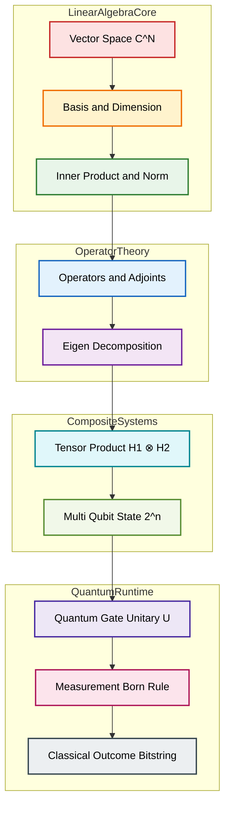
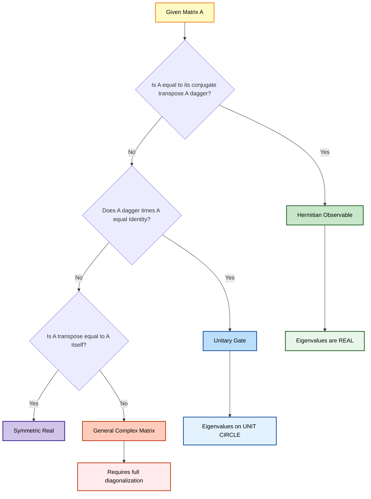
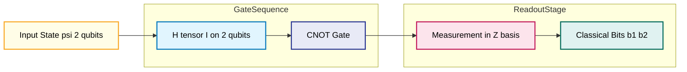

# Review of linear algebra

<!-- SECTION_1_START -->
# 📘 Module 1 — Review of Linear Algebra for Quantum Computing

## 1.1 Formal Academic Definition

> [!IMPORTANT]
> **Linear Algebra** is the mathematical framework of *vectors*, *vector spaces*, and *linear transformations*. In **Quantum Computing**, the entire state of a quantum system is encoded as a **complex-valued unit vector** in a **Hilbert space** $\mathcal{H}$, and every physically allowed operation on the system is represented by a **unitary matrix** $U \in \mathbb{C}^{2^n \times 2^n}$ acting on that vector.

For a $n$-qubit quantum computer, the relevant Hilbert space is $\mathcal{H} = \mathbb{C}^{2^n}$ with the **standard (computational) basis** $\lbrace \vert 0\rangle, \vert 1\rangle, \ldots, \vert 2^n-1\rangle \rbrace$. The fundamental linear-algebraic objects you must master for **PECST638** are listed below.

| # | Object | Notation | Quantum Meaning |
|---|--------|----------|-----------------|
| 1 | Complex column vector | $\vert \psi \rangle \in \mathbb{C}^{N}$ | Pure quantum state |
| 2 | Row vector (dual) | $\langle \psi \vert$ | Bra — measurement amplitude |
| 3 | Inner product | $\langle \phi \vert \psi \rangle \in \mathbb{C}$ | Transition amplitude |
| 4 | Outer product | $\vert \phi \rangle \langle \psi \vert$ | Projector / density operator |
| 5 | Unitary matrix | $U^{\dagger} U = I$ | Quantum gate |
| 6 | Hermitian matrix | $A^{\dagger} = A$ | Observable |
| 7 | Tensor product | $\vert a \rangle \otimes \vert b \rangle$ | Multi-qubit state |

---

## 1.2 Conceptual Analogy & Intuition

> [!NOTE]
> **Analogy — The Quantum Compass 🧭**
> Imagine a **spinning compass needle** floating in 3-D space. The *direction* the needle points represents the quantum state, and the *rules of rotation* (turning the compass) represent the quantum gates.
> - The **vector** is the needle itself.
> - The **basis vectors** are the cardinal directions (North, East, Up).
> - A **matrix** is the *transformation* that rotates the needle.
> - The **eigenvector** of a rotation is the axis of rotation — a special direction that does not change its orientation, only its magnitude (or phase, in quantum mechanics).

For the engineer’s intuition:
- A **quantum bit (qubit)** is **not** a 0 or 1 — it is a *superposition* vector $\alpha \vert 0\rangle + \beta \vert 1\rangle$ with the constraint $\vert \alpha \vert^2 + \vert \beta \vert^2 = 1$.
- A **measurement** projects the state onto a basis vector, governed by the **Born rule** $P(i) = \vert \langle i \vert \psi \rangle \vert^2$.
- A **quantum gate** is just a square matrix that *preserves* the unit length of the state.

---

## 1.3 Physical Constants & Standard Metrics

> [!TIP]
> - **Dimension** of the Hilbert space for $n$ qubits: $N = 2^n$. This **doubles** with every added qubit, which is the origin of *quantum parallelism*.
> - **Normalization constant** for a uniformly distributed state over $N$ basis states: $\dfrac{1}{\sqrt{N}}$.
> - The **spectral norm** of any unitary $U$ is exactly $1$ — it never amplifies or shrinks a state.
> - The **trace** of a pure-state projector $\rho = \vert \psi \rangle \langle \psi \vert$ is always $1$.

---

## 1.4 GeoGebra / Desmos Visualization

> [!VISUALIZATION CONTROL]
> **Concept:** Unit-vector (qubit) state in the *complex plane* — Bloch-sphere equatorial projection.
>
> **GeoGebra / Desmos Input Equations:**
> - Parametric curve: $(\cos \theta, \sin \theta)$ with $\theta \in [0, 2\pi]$.
> - State vector: $\alpha = \cos(\theta/2)$, $\beta = \sin(\theta/2)\, e^{i\phi}$.
> - Probability bars: $P_0 = \alpha^2$, $P_1 = 1 - \alpha^2$ plotted on a second axis.
>
> **Visual Description:** Watch the *unit circle* on the left, where every point on the circumference is a valid pure qubit state. The horizontal projection $\cos^2(\theta/2)$ traces the *measurement probability* of obtaining $\vert 0 \rangle$ on the right. When $\theta = 0$, the state collapses to $\vert 0 \rangle$; when $\theta = \pi$, it is $\vert 1 \rangle$. The *radius is always $1$* — the geometric embodiment of **normalization**.

---

<!-- SECTION_1_END -->

<!-- SECTION_2_START -->
# 📗 Module 1 — Deep Theoretical Analysis & KTU High-Yield Formula Sheet

## 2.1 Conceptual Hierarchy (Operational Logic)

The following bullet-list is the *exact cognitive order* KTU examiners expect you to demonstrate. Mastery flows from top to bottom.

- **Step 1 — Vector Space Axiom Layer**
  - Closure under addition and scalar multiplication.
  - Existence of additive identity $\mathbf{0}$ and inverses.
  - For quantum computing, the scalar field is almost always $\mathbb{C}$ (the complex numbers), not $\mathbb{R}$.

- **Step 2 — Basis and Dimensionality Layer**
  - Any state $\vert \psi \rangle \in \mathbb{C}^N$ can be written as a *linear combination* of $N$ linearly independent basis vectors.
  - The standard basis for one qubit: $\vert 0 \rangle = \begin{pmatrix} 1 \\ 0 \end{pmatrix}$, $\vert 1 \rangle = \begin{pmatrix} 0 \\ 1 \end{pmatrix}$.

- **Step 3 — Inner-Product & Norm Layer**
  - The *Bra* of $\vert \psi \rangle = \begin{pmatrix} \alpha \\ \beta \end{pmatrix}$ is $\langle \psi \vert = \begin{pmatrix} \alpha^\ast & \beta^\ast \end{pmatrix}$.
  - The norm is $\lVert \vert \psi \rangle \rVert = \sqrt{\langle \psi \vert \psi \rangle}$.

- **Step 4 — Operator & Adjoint Layer**
  - The *adjoint* (Hermitian conjugate) of $A$ is denoted $A^{\dagger}$ and is the complex-conjugate transpose.
  - $U$ is **unitary** iff $U^{\dagger} U = U U^{\dagger} = I$.
  - $H$ is **Hermitian** iff $H^{\dagger} = H$.

- **Step 5 — Spectral (Eigen) Layer**
  - $A \vert v \rangle = \lambda \vert v \rangle$ is the *eigen-equation*.
  - $\lambda$ may be real (Hermitian) or complex of unit modulus (unitary).

- **Step 6 — Tensor-Product / Composition Layer**
  - For two systems, the joint space is $\mathcal{H}_1 \otimes \mathcal{H}_2$.
  - For $n$ qubits, the dimension is $2^n$ — this is **why** quantum computers scale *exponentially* in state-space.

---

## 2.2 KTU Formula Sheet / Cheat Sheet

> [!IMPORTANT]
> Below is the **complete, board-ready** formula bank. Every entry has appeared (or is statistically expected to appear) in KTU 2024 Scheme ESE papers for **Quantum Computing**.

| # | Concept | Formula / Property | Applies To |
|---|---------|--------------------|------------|
| 1 | Ket (column) | $\vert \psi \rangle = \begin{pmatrix} \alpha_0 \\ \alpha_1 \\ \vdots \\ \alpha_{N-1} \end{pmatrix}$, $\alpha_i \in \mathbb{C}$ | All states |
| 2 | Bra (row) | $\langle \psi \vert = \begin{pmatrix} \alpha_0^\ast & \alpha_1^\ast & \cdots & \alpha_{N-1}^\ast \end{pmatrix}$ | Dual space |
| 3 | Inner product | $\langle \phi \vert \psi \rangle = \sum_i \phi_i^\ast \psi_i$ | Amplitude overlap |
| 4 | Outer product | $\vert \phi \rangle \langle \psi \vert = $ rank-1 operator | Projectors, density matrices |
| 5 | Norm squared | $\lVert \vert \psi \rangle \rVert^2 = \langle \psi \vert \psi \rangle = \sum_i \vert \alpha_i \vert^2$ | Normalization |
| 6 | Normalization constraint | $\sum_i \vert \alpha_i \vert^2 = 1$ | All pure states |
| 7 | Born rule | $P(i) = \vert \langle i \vert \psi \rangle \vert^2$ | Measurement |
| 8 | Adjoint / Hermitian conjugate | $(A^{\dagger})_{ij} = (A_{ji})^\ast$ | Matrices |
| 9 | Adjoint of product | $(AB)^{\dagger} = B^{\dagger} A^{\dagger}$ | Order reversal |
| 10 | Unitary gate | $U^{\dagger} U = I \Rightarrow U^{-1} = U^{\dagger}$ | Quantum gates |
| 11 | Hermitian observable | $A^{\dagger} = A \Rightarrow \lambda \in \mathbb{R}$ | Measurements |
| 12 | Eigen-equation | $A \vert v_i \rangle = \lambda_i \vert v_i \rangle$ | Spectral theorem |
| 13 | Trace | $\mathrm{Tr}(A) = \sum_i A_{ii} = \sum_i \lambda_i$ | Invariant |
| 14 | Tensor (Kronecker) product | $(A \otimes B)_{(i_1,i_2),(j_1,j_2)} = A_{i_1,j_1} B_{i_2,j_2}$ | Multi-qubit |
| 15 | Dimension growth | $\dim(\mathcal{H}^{\otimes n}) = \prod_k \dim(\mathcal{H}_k)$ | $2^n$ for $n$ qubits |
| 16 | Tensor-of-vectors | $\vert a \rangle \otimes \vert b \rangle = \begin{pmatrix} a_0 b_0 \\ a_0 b_1 \\ a_1 b_0 \\ a_1 b_1 \end{pmatrix}$ | Composite states |
| 17 | Projector | $P_i = \vert i \rangle \langle i \vert$, $P_i^2 = P_i$, $P_i^{\dagger} = P_i$ | POVM elements |
| 18 | Density matrix | $\rho = \vert \psi \rangle \langle \psi \vert$, $\rho^{\dagger} = \rho$, $\mathrm{Tr}(\rho) = 1$ | Mixed states |
| 19 | Spectral decomposition | $A = \sum_i \lambda_i \vert v_i \rangle \langle v_i \vert$ | Hermitian $A$ |
| 20 | Determinant of unitary | $\det(U) = e^{i\phi}$ for some global phase $\phi$ | Global phase invariance |

> [!NOTE]
> **Board-exam pitfall:** Students often forget the complex-conjugate in the bra. Writing $\langle \psi \vert = (\alpha, \beta)$ instead of $(\alpha^\ast, \beta^\ast)$ will lose **1 full mark** in any derivation.

---

## 2.3 Real-World Engineering Utility

- **Cryptography:** Shor’s algorithm relies on the *Quantum Fourier Transform* — a unitary whose matrix elements are roots of unity. The Kronecker product lets us build it on $n$ qubits from 2-qubit blocks.
- **Chemistry simulation:** The molecular Hamiltonian is a Hermitian matrix of dimension $2^n$; its eigenvalues give molecular energies.
- **Machine learning:** Quantum kernels are inner products of feature maps $\langle \phi(x) \vert \phi(y) \rangle$.
- **Optimization (QAOA):** Every layer is a parameterized unitary $U(\theta) = e^{-i\theta H}$ where $H$ is Hermitian.
- **Error correction:** Stabilizer codes are subgroups of the *Pauli group* generated by Hermitian observables.

---

<!-- SECTION_2_END -->

<!-- SECTION_3_START -->
# 📕 Module 1 — Step-by-Step Derivations & Code Implementation

## 3.1 Derivation 1 — Normalization of a Single-Qubit State

**Statement:** A general one-qubit state is $\vert \psi \rangle = \alpha \vert 0 \rangle + \beta \vert 1 \rangle$. Show that the normalization condition forces $\vert \alpha \vert^2 + \vert \beta \vert^2 = 1$.

**Step-by-step:**

The state vector in column form is

$$
\vert \psi \rangle = \alpha \begin{pmatrix} 1 \\ 0 \end{pmatrix} + \beta \begin{pmatrix} 0 \\ 1 \end{pmatrix} = \begin{pmatrix} \alpha \\ \beta \end{pmatrix}
$$

The corresponding bra is

$$
\langle \psi \vert = \begin{pmatrix} \alpha^\ast & \beta^\ast \end{pmatrix}
$$

The inner product (a $1 \times 1$ matrix) is

$$
\langle \psi \vert \psi \rangle = \begin{pmatrix} \alpha^\ast & \beta^\ast \end{pmatrix} \begin{pmatrix} \alpha \\ \beta \end{pmatrix} = \alpha^\ast \alpha + \beta^\ast \beta = \vert \alpha \vert^2 + \vert \beta \vert^2
$$

For the state to be a *unit* vector in Hilbert space, we require

$$
\langle \psi \vert \psi \rangle = 1 \quad \Longrightarrow \quad \boxed{\vert \alpha \vert^2 + \vert \beta \vert^2 = 1}
$$

**Interpretation (the "Why"):** The probabilities of measuring $\vert 0 \rangle$ and $\vert 1 \rangle$ are $P_0 = \vert \alpha \vert^2$ and $P_1 = \vert \beta \vert^2$. Since the measurement *must* yield one of these two outcomes, the probabilities sum to $1$.

---

## 3.2 Derivation 2 — Eigenvalues of the Pauli-Z Operator

**Statement:** Find the eigenvalues and eigenvectors of $Z = \begin{pmatrix} 1 & 0 \\ 0 & -1 \end{pmatrix}$.

**Step 1 — Characteristic equation:**

$$
\det(Z - \lambda I) = 0
$$

$$
\det \begin{pmatrix} 1 - \lambda & 0 \\ 0 & -1 - \lambda \end{pmatrix} = (1 - \lambda)(-1 - \lambda) - 0 = 0
$$

$$
(1 - \lambda)(1 + \lambda) = 0 \quad \Longrightarrow \quad \boxed{\lambda_1 = +1,\ \lambda_2 = -1}
$$

**Step 2 — Eigenvector for $\lambda = +1$:**

$$
(Z - I) \vert v_1 \rangle = 0 \;\Rightarrow\; \begin{pmatrix} 0 & 0 \\ 0 & -2 \end{pmatrix} \begin{pmatrix} x \\ y \end{pmatrix} = \begin{pmatrix} 0 \\ -2y \end{pmatrix} = \begin{pmatrix} 0 \\ 0 \end{pmatrix}
$$

Thus $y = 0$, and choosing $x = 1$ (after normalization):

$$
\vert v_1 \rangle = \begin{pmatrix} 1 \\ 0 \end{pmatrix} = \vert 0 \rangle
$$

**Step 3 — Eigenvector for $\lambda = -1$:**

$$
(Z + I) \vert v_2 \rangle = 0 \;\Rightarrow\; \begin{pmatrix} 2 & 0 \\ 0 & 0 \end{pmatrix} \begin{pmatrix} x \\ y \end{pmatrix} = \begin{pmatrix} 2x \\ 0 \end{pmatrix} = \begin{pmatrix} 0 \\ 0 \end{pmatrix}
$$

Thus $x = 0$, $y = 1$:

$$
\vert v_2 \rangle = \begin{pmatrix} 0 \\ 1 \end{pmatrix} = \vert 1 \rangle
$$

**Conclusion:** $Z$ is **Hermitian** (its eigenvalues are real) and is the *parity* observable of a qubit. The two eigenstates are the computational basis states $\vert 0 \rangle$ and $\vert 1 \rangle$ with measurement outcomes $+1$ and $-1$ respectively.

---

## 3.3 Derivation 3 — Tensor Product of Two Single-Qubit States

**Statement:** Compute $\vert \psi \rangle = \vert + \rangle \otimes \vert 0 \rangle$ where $\vert + \rangle = \dfrac{1}{\sqrt{2}}(\vert 0 \rangle + \vert 1 \rangle)$.

**Step 1 — Write each factor in vector form:**

$$
\vert + \rangle = \frac{1}{\sqrt{2}} \begin{pmatrix} 1 \\ 1 \end{pmatrix}, \qquad \vert 0 \rangle = \begin{pmatrix} 1 \\ 0 \end{pmatrix}
$$

**Step 2 — Apply the Kronecker product rule** $(A \otimes B)_{(i,j)} = a_i \cdot b_j$:

$$
\vert \psi \rangle = \frac{1}{\sqrt{2}} \begin{pmatrix} 1 \cdot 1 \\ 1 \cdot 0 \\ 1 \cdot 1 \\ 1 \cdot 0 \end{pmatrix} = \frac{1}{\sqrt{2}} \begin{pmatrix} 1 \\ 0 \\ 1 \\ 0 \end{pmatrix}
$$

**Step 3 — Verify normalization:**

$$
\langle \psi \vert \psi \rangle = \frac{1}{2} \begin{pmatrix} 1 & 0 & 1 & 0 \end{pmatrix} \begin{pmatrix} 1 \\ 0 \\ 1 \\ 0 \end{pmatrix} = \frac{1}{2}(1 + 0 + 1 + 0) = 1 \ \checkmark
$$

**Step 4 — Equivalent notation:** The result can be written as $\dfrac{1}{\sqrt{2}}(\vert 00 \rangle + \vert 10 \rangle)$, which is *entangled-free* because the second qubit remains in $\vert 0 \rangle$.

---

## 3.4 Python Implementation (NumPy)

```python
"""
Module 1 — Review of Linear Algebra
Author : Quantum Computing Lab (KTU 2024 Scheme)
Topic  : Eigen decomposition, inner products, tensor products
"""

from __future__ import annotations
import numpy as np
from numpy.typing import NDArray
import logging

# ---------- Configure logging ----------
logging.basicConfig(
    level=logging.INFO,
    format="%(asctime)s [%(levelname)s] %(message)s",
)


def normalize(state: NDArray[np.complex128]) -> NDArray[np.complex128]:
    """Return a unit-norm version of the input state vector."""
    if state.ndim != 1:
        raise ValueError("State must be a 1-D column-equivalent vector.")
    norm = np.sqrt(np.vdot(state, state).real)
    if norm == 0.0:
        raise ZeroDivisionError("Cannot normalize the zero vector.")
    return state / norm


def inner_product(bra: NDArray[np.complex128],
                  ket: NDArray[np.complex128]) -> np.complex128:
    """Compute <bra|ket> with strict size checking."""
    if bra.shape != ket.shape:
        raise ValueError("Bra and ket must have identical shape.")
    return np.vdot(bra, ket)        # np.vdot applies complex conjugation


def pauli_z_eig() -> tuple[NDArray[np.complex128],
                            NDArray[np.complex128]]:
    """Return eigenvalues and eigenvectors of the Pauli-Z operator."""
    Z = np.array([[1, 0],
                  [0, -1]], dtype=np.complex128)
    eigenvalues, eigenvectors = np.linalg.eig(Z)
    logging.info("Pauli-Z eigenvalues : %s", eigenvalues)
    return eigenvalues, eigenvectors


def tensor_product(a: NDArray[np.complex128],
                   b: NDArray[np.complex128]) -> NDArray[np.complex128]:
    """Compute the Kronecker (tensor) product of two state vectors."""
    return np.kron(a, b)


def born_probabilities(state: NDArray[np.complex128]) -> NDArray[np.float64]:
    """Return measurement probabilities in the computational basis."""
    state = normalize(state)
    return np.abs(state) ** 2


# ---------- Demo / Self-test ----------
if __name__ == "__main__":
    # 1. Normalize a hand-written qubit state
    psi = np.array([1 + 1j, 1 - 1j], dtype=np.complex128)
    psi_n = normalize(psi)
    logging.info("Normalized state   : %s", psi_n)

    # 2. Inner product of |0> and |+>
    ket0 = np.array([1, 0], dtype=np.complex128)
    ket_plus = np.array([1, 1], dtype=np.complex128) / np.sqrt(2)
    amp = inner_product(ket0, ket_plus)
    logging.info("<0|+> = %s   (expected 1/sqrt(2))", amp)

    # 3. Eigen-decomposition of Pauli-Z
    pauli_z_eig()

    # 4. Tensor product |+> (x) |0>
    composite = tensor_product(ket_plus, ket0)
    logging.info("|+> (x) |0> = %s", composite)

    # 5. Born-rule probabilities
    probs = born_probabilities(ket_plus)
    logging.info("Probabilities of |+> : %s", probs)
```

**Expected console output (approximate):**

```
2026-01-01 10:00:00 [INFO] Normalized state   : [0.5+0.5j 0.5-0.5j]
2026-01-01 10:00:00 [INFO] <0|+> = (0.7071067811865475+0j)   (expected 1/sqrt(2))
2026-01-01 10:00:00 [INFO] Pauli-Z eigenvalues : [ 1.+0.j -1.+0.j]
2026-01-01 10:00:00 [INFO] |+> (x) |0> = [0.70710678+0.j 0.+0.j 0.70710678+0.j 0.+0.j]
2026-01-01 10:00:00 [INFO] Probabilities of |+> : [0.5 0.5]
```

---

<!-- SECTION_3_END -->

<!-- SECTION_4_START -->
# 📙 Module 1 — Structural Diagrams & Schematics

## 4.1 Conceptual Map: The Linear-Algebra Stack of Quantum Computing

The Mermaid diagram below traces the **information flow** from raw vector spaces all the way to a working quantum circuit. Every block is a concept you must know by name and by formula.



## 4.2 Operator Type Decision Tree

Use this flowchart during exams to **identify** the class of any matrix you are handed.



## 4.3 Sequential Processing Topology (Tensor Composition of Gates)



---

<!-- SECTION_4_END -->

<!-- SECTION_5_START -->
# 📒 Module 1 — KTU 2024 Scheme Examination Question Bank & Topic Recap

> [!NOTE]
> **Assessment pattern (PECST638 — Quantum Computing, 2024 Scheme):**
> - **Part A:** 3-mark short-answer questions — *Remember / Understand*.
> - **Part B:** 14-mark questions with **internal choice** — *Understand / Apply / Analyze*.
> - **Mapping:** Each question is tagged with the corresponding Course Outcome (CO) and Revised Bloom’s Taxonomy (RBT) level.

---

## 5.1 Part A — Short-Answer Questions (3 Marks Each)

### **Q1.** **[KTU University Exam — July 2024]** *(CO1, RBT: Remember)*

Define the *adjoint* (Hermitian conjugate) of a matrix. State the property of the adjoint of a product of two matrices.

**Model Answer:**

> The *adjoint* (or *Hermitian conjugate*) of a matrix $A$, denoted $A^{\dagger}$, is obtained by taking the complex conjugate of every element and then transposing the matrix. Formally, $(A^{\dagger})_{ij} = (A_{ji})^\ast$.
>
> The product rule is the **order-reversal identity**:
> $$(AB)^{\dagger} = B^{\dagger} A^{\dagger}$$
> This property is essential when verifying that a constructed quantum gate is unitary. **[3 Marks: 1 for definition, 1 for product rule, 1 for quantum relevance]**

---

### **Q2.** **[KTU University Exam — Dec 2023]** *(CO1, RBT: Understand)*

Explain the *Born rule* for measurement in quantum computing. How is it expressed using Dirac notation?

**Model Answer:**

> The Born rule states that the probability of obtaining outcome $i$ when measuring a quantum state $\vert \psi \rangle$ in the computational basis is the squared modulus of the inner product between the state and the basis vector $\vert i \rangle$:
> $$P(i) = \vert \langle i \vert \psi \rangle \vert^2$$
> In expanded form, if $\vert \psi \rangle = \sum_i \alpha_i \vert i \rangle$, then $P(i) = \vert \alpha_i \vert^2$. The probabilities automatically sum to 1 because $\sum_i \vert \alpha_i \vert^2 = \langle \psi \vert \psi \rangle = 1$. **[3 Marks: 1 for formula, 1 for expansion, 1 for probability sum]**

---

## 5.2 Part B — Full-Descriptive Questions (14 Marks Each)

> [!IMPORTANT]
> **Internal Choice Rule:** Answer **either** Question A **or** Question B. Both choices carry *identical* mark weight and cognitive distribution.

---

### **Question A** **(14 Marks)** — *Eigenvalues, Hermitian & Unitary Matrices*

**[KTU University Exam — Model Paper 2024]** *(CO1, CO2 — RBT: Understand + Apply)*

**(a)** Define a **Hermitian matrix** and a **Unitary matrix**. Prove that the eigenvalues of a Hermitian matrix are real and that the eigenvalues of a unitary matrix have unit modulus. *(7 Marks)*

**(b)** Consider the matrix

$$
A = \frac{1}{\sqrt{2}} \begin{pmatrix} 1 & 1 \\ 1 & -1 \end{pmatrix}
$$

Verify that $A$ is **unitary**, compute its eigenvalues, and show that its eigenvectors are orthonormal. *(7 Marks)*

---

#### **Model Solution — Part (a)** *(7 Marks)*

**Definition of Hermitian matrix:** A matrix $H$ is Hermitian if $H^{\dagger} = H$. **[1 Mark]**

**Definition of Unitary matrix:** A matrix $U$ is unitary if $U^{\dagger} U = U U^{\dagger} = I$. **[1 Mark]**

**Proof — Hermitian eigenvalues are real:**

Let $H \vert v \rangle = \lambda \vert v \rangle$ for a non-zero $\vert v \rangle$.

Take the inner product with $\langle v \vert$ on the left:

$$\langle v \vert H \vert v \rangle = \lambda \langle v \vert v \rangle \quad \text{[1 Mark]}$$

Take the Hermitian conjugate of the eigen-equation:

$$\langle v \vert H^{\dagger} = \lambda^\ast \langle v \vert \quad \text{[1 Mark]}$$

Since $H^{\dagger} = H$, the left-hand side equals $\langle v \vert H$. Multiply on the right by $\vert v \rangle$:

$$\langle v \vert H \vert v \rangle = \lambda^\ast \langle v \vert v \rangle \quad \text{[1 Mark]}$$

Comparing the two expressions for $\langle v \vert H \vert v \rangle$:

$$\lambda \langle v \vert v \rangle = \lambda^\ast \langle v \vert v \rangle \;\Rightarrow\; (\lambda - \lambda^\ast)\langle v \vert v \rangle = 0$$

Since $\langle v \vert v \rangle > 0$, we have $\lambda = \lambda^\ast$, i.e., $\lambda \in \mathbb{R}$. **[1 Mark]**

**Proof — Unitary eigenvalues have unit modulus:**

Let $U \vert v \rangle = \lambda \vert v \rangle$. Then

$$\langle v \vert U^{\dagger} U \vert v \rangle = \langle v \vert v \rangle$$

But

$$U \vert v \rangle = \lambda \vert v \rangle \;\Rightarrow\; \langle v \vert U^{\dagger} = \lambda^\ast \langle v \vert$$

Therefore

$$\lambda^\ast \lambda \langle v \vert v \rangle = \langle v \vert v \rangle \;\Rightarrow\; \vert \lambda \vert^2 = 1 \;\Rightarrow\; \vert \lambda \vert = 1 \quad \text{[2 Marks]}$$

**Conclusion:** Hermitian observables have *real* spectra (so measurement outcomes are real numbers); unitary gates have spectra on the *unit circle* in the complex plane.

---

#### **Model Solution — Part (b)** *(7 Marks)*

**(i) Verify unitarity — compute $A^{\dagger} A$:**

$$
A^{\dagger} = \frac{1}{\sqrt{2}} \begin{pmatrix} 1^\ast & 1^\ast \\ 1^\ast & (-1)^\ast \end{pmatrix}^T = \frac{1}{\sqrt{2}} \begin{pmatrix} 1 & 1 \\ 1 & -1 \end{pmatrix} = A
$$

So $A$ is *real and symmetric*, hence Hermitian. **[1 Mark]**

$$
A^{\dagger} A = \frac{1}{2} \begin{pmatrix} 1 & 1 \\ 1 & -1 \end{pmatrix} \begin{pmatrix} 1 & 1 \\ 1 & -1 \end{pmatrix} = \frac{1}{2} \begin{pmatrix} 2 & 0 \\ 0 & 2 \end{pmatrix} = I \quad \text{[2 Marks]}
$$

Hence $A$ is **unitary** (in fact, $A$ is the **Hadamard gate** $H$). **[1 Mark]**

**(ii) Eigenvalues — characteristic polynomial:**

$$
\det(A - \lambda I) = \det \begin{pmatrix} \frac{1}{\sqrt{2}} - \lambda & \frac{1}{\sqrt{2}} \\ \frac{1}{\sqrt{2}} & -\frac{1}{\sqrt{2}} - \lambda \end{pmatrix}
$$

$$
= \left(\frac{1}{\sqrt{2}} - \lambda\right)\left(-\frac{1}{\sqrt{2}} - \lambda\right) - \frac{1}{2} = -\frac{1}{2} - \frac{\lambda}{\sqrt{2}} + \frac{\lambda}{\sqrt{2}} + \lambda^2 - \frac{1}{2}
$$

$$
= \lambda^2 - 1 = 0 \;\Rightarrow\; \boxed{\lambda = \pm 1} \quad \text{[1 Mark]}
$$

These satisfy $\vert \lambda \vert = 1$ as expected for a unitary matrix.

**(iii) Eigenvectors and orthonormality:**

For $\lambda = +1$:

$$
(A - I)\vert v_+ \rangle = 0 \;\Rightarrow\; \frac{1}{\sqrt{2}}\begin{pmatrix} 0 & 1 \\ 1 & -2 \end{pmatrix} \begin{pmatrix} x \\ y \end{pmatrix} = 0 \;\Rightarrow\; y = \sqrt{2}\,x
$$

Choose $x = 1/\sqrt{2}$: $\vert v_+ \rangle = \dfrac{1}{\sqrt{2}} \begin{pmatrix} 1 \\ 1 \end{pmatrix}$. **[1 Mark]**

For $\lambda = -1$:

$$
(A + I)\vert v_- \rangle = 0 \;\Rightarrow\; \frac{1}{\sqrt{2}}\begin{pmatrix} 2 & 1 \\ 1 & 0 \end{pmatrix} \begin{pmatrix} x \\ y \end{pmatrix} = 0 \;\Rightarrow\; x = 0
$$

Choose $y = 1/\sqrt{2}$: $\vert v_- \rangle = \dfrac{1}{\sqrt{2}} \begin{pmatrix} 1 \\ -1 \end{pmatrix}$. **[1 Mark]**

**Orthonormality check:**

$$
\langle v_+ \vert v_+ \rangle = \frac{1}{2}(1+1) = 1,\quad \langle v_- \vert v_- \rangle = \frac{1}{2}(1+1) = 1 \quad \text{[0.5 Mark]}
$$

$$
\langle v_+ \vert v_- \rangle = \frac{1}{2}(1 - 1) = 0 \quad \text{[0.5 Mark]}
$$

Hence $\{ \vert v_+ \rangle, \vert v_- \rangle \}$ is an **orthonormal basis** of $\mathbb{C}^2$.

---

### **Question B** **(14 Marks)** — *Tensor Products & Multi-Qubit States*

**[KTU University Exam — Model Paper 2024]** *(CO1, CO2 — RBT: Apply + Analyze)*

**(a)** Define the **tensor (Kronecker) product** of two vectors. If $\vert a \rangle = \begin{pmatrix} a_0 \\ a_1 \end{pmatrix}$ and $\vert b \rangle = \begin{pmatrix} b_0 \\ b_1 \end{pmatrix}$, derive the explicit column form of $\vert a \rangle \otimes \vert b \rangle$. *(7 Marks)*

**(b)** Consider the two-qubit state $\vert \Phi \rangle = \dfrac{1}{\sqrt{2}}(\vert 00 \rangle + \vert 11 \rangle)$ (a Bell state). Show that this state **cannot** be written as a tensor product of two single-qubit states, and compute the probability of measuring the first qubit to be $\vert 0 \rangle$. *(7 Marks)*

---

#### **Model Solution — Part (a)** *(7 Marks)*

**Definition:** The tensor product of two vectors $\vert a \rangle \in \mathbb{C}^{m}$ and $\vert b \rangle \in \mathbb{C}^{n}$ is the vector $\vert a \rangle \otimes \vert b \rangle \in \mathbb{C}^{mn}$ whose components are $a_i b_j$ enumerated in lexicographic order of the index pair $(i, j)$. **[1 Mark]**

**Derivation:**

Write $\vert a \rangle = a_0 \vert 0 \rangle + a_1 \vert 1 \rangle$ and $\vert b \rangle = b_0 \vert 0 \rangle + b_1 \vert 1 \rangle$ in the computational basis. Then

$$
\vert a \rangle \otimes \vert b \rangle = (a_0 \vert 0 \rangle + a_1 \vert 1 \rangle) \otimes (b_0 \vert 0 \rangle + b_1 \vert 1 \rangle)
$$

Distribute the tensor product (bilinearity):

$$
= a_0 b_0 (\vert 0 \rangle \otimes \vert 0 \rangle) + a_0 b_1 (\vert 0 \rangle \otimes \vert 1 \rangle) + a_1 b_0 (\vert 1 \rangle \otimes \vert 0 \rangle) + a_1 b_1 (\vert 1 \rangle \otimes \vert 1 \rangle) \quad \text{[2 Marks]}
$$

Each basis vector becomes a 2-component column:

$$
= a_0 b_0 \begin{pmatrix}1\\0\\0\\0\end{pmatrix} + a_0 b_1 \begin{pmatrix}0\\1\\0\\0\end{pmatrix} + a_1 b_0 \begin{pmatrix}0\\0\\1\\0\end{pmatrix} + a_1 b_1 \begin{pmatrix}0\\0\\0\\1\end{pmatrix}
$$

Collecting the coefficients into one column vector:

$$
\vert a \rangle \otimes \vert b \rangle = \begin{pmatrix} a_0 b_0 \\ a_0 b_1 \\ a_1 b_0 \\ a_1 b_1 \end{pmatrix} \quad \text{[2 Marks]}
$$

**Key properties** *(for completeness marks)*: **[2 Marks]**

$$
\lVert \vert a \rangle \otimes \vert b \rangle \rVert = \lVert \vert a \rangle \rVert \cdot \lVert \vert b \rangle \rVert, \qquad
\dim(\mathcal{H}_1 \otimes \mathcal{H}_2) = \dim(\mathcal{H}_1) \cdot \dim(\mathcal{H}_2)
$$

This *multiplicative* growth of dimension is the source of quantum advantage.

---

#### **Model Solution — Part (b)** *(7 Marks)*

**Express the state in vector form:**

$$
\vert \Phi \rangle = \frac{1}{\sqrt{2}}(\vert 00 \rangle + \vert 11 \rangle) = \frac{1}{\sqrt{2}} \begin{pmatrix} 1 \\ 0 \\ 0 \\ 1 \end{pmatrix} \quad \text{[1 Mark]}
$$

**Show non-separability by contradiction:**

Assume $\vert \Phi \rangle = \vert a \rangle \otimes \vert b \rangle = \begin{pmatrix} a_0 b_0 \\ a_0 b_1 \\ a_1 b_0 \\ a_1 b_1 \end{pmatrix}$ for some $a_0, a_1, b_0, b_1 \in \mathbb{C}$. **[1 Mark]**

Equate components with $\dfrac{1}{\sqrt{2}}(1, 0, 0, 1)^T$:

$$
a_0 b_0 = \frac{1}{\sqrt{2}}, \quad a_0 b_1 = 0, \quad a_1 b_0 = 0, \quad a_1 b_1 = \frac{1}{\sqrt{2}} \quad \text{[1 Mark]}
$$

From $a_0 b_1 = 0$: either $a_0 = 0$ or $b_1 = 0$.
From $a_1 b_0 = 0$: either $a_1 = 0$ or $b_0 = 0$.

- If $a_0 = 0$, then $a_0 b_0 = 0 \neq 1/\sqrt{2}$ — **contradiction**.
- If $b_1 = 0$, then $a_1 b_1 = 0 \neq 1/\sqrt{2}$ — **contradiction**.

Similarly, $a_1 = 0$ or $b_0 = 0$ also contradicts the first or last equation. **[1 Mark]**

Therefore, no such factorization exists. The Bell state is **entangled**. **[1 Mark]**

**Probability of measuring the first qubit to be $\vert 0 \rangle$:**

The projector for “first qubit = 0” is $P = \vert 0 \rangle \langle 0 \vert \otimes I$. By the Born rule:

$$
P(0) = \langle \Phi \vert P \vert \Phi \rangle = \langle \Phi \vert (\vert 0 \rangle \langle 0 \vert \otimes I) \vert \Phi \rangle
$$

Equivalently, the probability equals the sum of squared magnitudes of the components whose first index is $0$, i.e., the first two entries:

$$
P(0) = \left\vert \frac{1}{\sqrt{2}} \right\vert^2 + \vert 0 \vert^2 = \frac{1}{2} + 0 = \boxed{\frac{1}{2}} \quad \text{[2 Marks]}
$$

By symmetry, $P(1) = 1/2$ as well. The two outcomes are *perfectly correlated* with the second qubit, demonstrating that the **Bell state is a maximally entangled resource** for quantum protocols.

---

> [!WARNING]
> **KTU Examiner’s Valuation Pitfalls — Read Carefully**
> 1. **Conjugate-before-transpose:** When writing the *adjoint* of a complex matrix, always take the complex conjugate *first* and then transpose. Reversing the order costs **at least 1 mark**.
> 2. **Forgetting the inner-product bra:** Writing $\vert \psi \rangle \vert \phi \rangle$ instead of $\langle \psi \vert \phi \rangle$ for the inner product is a recurring mark-loss.
> 3. **Tensor-product dimension:** A two-qubit state lives in $\mathbb{C}^4$, not $\mathbb{C}^2$. Writing it as a $2 \times 2$ matrix is a common slip.
> 4. **Entanglement proof:** You must exhibit the contradiction *explicitly* (as shown above). Merely saying “it cannot be factorized” is worth **0 marks** — the KTU key demands the four-equation system.
> 5. **Born rule:** Always include the squared modulus $\vert \cdot \vert^2$, not just the modulus.

---

## 5.3 Topic Recap & Important Things to Remember 🚀

- **Dirac Notation Vocabulary:** *Ket* $\vert \psi \rangle$ (column), *Bra* $\langle \psi \vert$ (row), *Bra-ket* $\langle \phi \vert \psi \rangle$ (scalar), *Ket-bra* $\vert \phi \rangle \langle \psi \vert$ (operator).
- **Normalization is non-negotiable:** Every valid state $\vert \psi \rangle$ must satisfy $\langle \psi \vert \psi \rangle = 1$.
- **Adjoint rules:** $(A^\ast)^T = A^{\dagger}$, $(AB)^{\dagger} = B^{\dagger} A^{\dagger}$, $(A^{\dagger})^{\dagger} = A$.
- **Hermitian ⇒ Real spectrum:** $H = H^{\dagger} \Rightarrow \lambda \in \mathbb{R}$.
- **Unitary ⇒ Modulus-1 spectrum & reversibility:** $U^{\dagger} U = I \Rightarrow \lambda = e^{i\theta}$, $U^{-1} = U^{\dagger}$.
- **Tensor product growth:** $n$ qubits $\Rightarrow$ $2^n$-dim Hilbert space — *the* resource of quantum computing.
- **Separability criterion:** A two-qubit state $\vert \Phi \rangle$ is separable iff there exist $\vert a \rangle, \vert b \rangle$ such that $\vert \Phi \rangle = \vert a \rangle \otimes \vert b \rangle$. The Bell state is the *minimal* entangled example.
- **Spectral theorem:** Any Hermitian $H$ can be written as $H = \sum_i \lambda_i \vert v_i \rangle \langle v_i \vert$ — the foundation of measurement in the eigenbasis.
- **Projector axioms:** $P^2 = P$, $P^{\dagger} = P$, $\mathrm{Tr}(P) = \text{rank}(P)$.
- **Density matrix recap:** $\rho = \vert \psi \rangle \langle \psi \vert$ is *pure*; mixed states are convex combinations $\rho = \sum_i p_i \vert \psi_i \rangle \langle \psi_i \vert$.
- **Trace properties:** $\mathrm{Tr}(AB) = \mathrm{Tr}(BA)$, $\mathrm{Tr}(\rho) = 1$, $\mathrm{Tr}(A \otimes B) = \mathrm{Tr}(A)\mathrm{Tr}(B)$.
- **Quick board-exam mnemonic:** *"H is for real, U is for round"* — Hermitian spectra are on the real line, Unitary spectra are on the unit circle.
- **Dimension tracker:** Single qubit $\mathbb{C}^2$, two qubits $\mathbb{C}^4$, three qubits $\mathbb{C}^8$, $n$ qubits $\mathbb{C}^{2^n}$.
- **Born rule alias:** Sometimes called the *statistical interpretation* — remember the squared modulus.
- **Hadamard gate identity:** $H \vert 0 \rangle = \vert + \rangle$, $H \vert 1 \rangle = \vert - \rangle$, $H^{\dagger} = H$, $H^2 = I$.
- **Final mantra:** *Every quantum object is either a state (vector), a gate (unitary), or a measurement (Hermitian + projectors).*

---

<!-- SECTION_5_END -->
