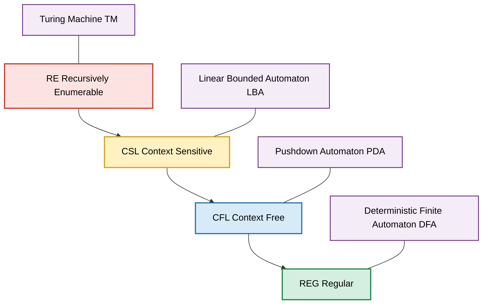
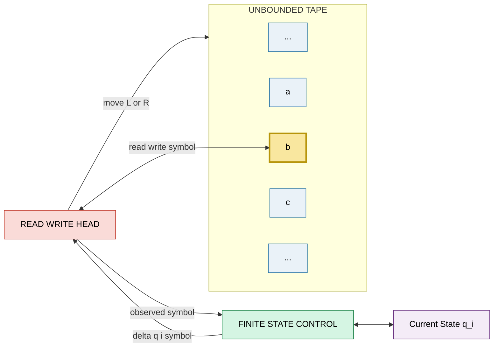
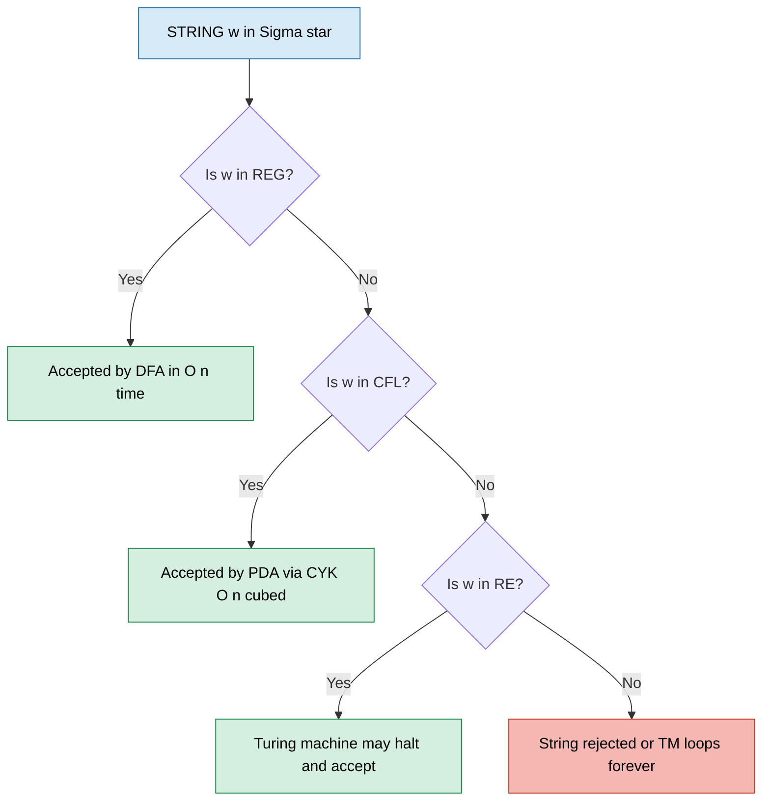

# Review of Theory of Computation.

<!-- SECTION_1_START -->
# Review of Theory of Computation — Core Technical Definition & Intuitive Overview

## 1.1 Formal Definition (KTU 2024 Syllabus Terminology)

**Theory of Computation (ToC)** is the branch of theoretical computer science that mathematically studies the inherent capabilities and limitations of computational models. It investigates three foundational pillars:

1. **Automata Theory** — abstract machines (automata) that recognize languages.
2. **Formal Language Theory** — grammars and language hierarchies (Chomsky hierarchy).
3. **Computability & Complexity Theory** — what can/cannot be computed, and at what resource cost.

> [!IMPORTANT]
> **KTU 2024 Scheme Relevance:** This unit is a **prerequisite refresher** for PECST638 Quantum Computing. The Church–Turing Thesis and the Turing Machine model form the **classical baseline** against which quantum models (BQP, Quantum Turing Machines) are benchmarked in later modules.

---

## 1.2 Conceptual Analogy / Intuition

Imagine a **musical vending machine** 🎰:

| Component | Automata Counterpart |
|---|---|
| Buttons pressed (input sequence) | Input string over an alphabet |
| The "brain" deciding which product dispenses | State transition function $\delta$ |
| Final chime when a product drops | Acceptance / Rejection |
| The set of all valid button-press combos that yield a product | The **Language** $L$ recognized |

If the machine only remembers the **last button** → it's a **Finite Automaton (FA)**.
If it remembers the **whole sequence** on a stack → it's a **Pushdown Automaton (PDA)**.
If it has an **unlimited tape** to read/write → it's a **Turing Machine (TM)** — the most powerful classical model.

> [!NOTE]
> **Geometric Intuition:** A computation is essentially a **trajectory** through a directed graph of states, driven by input symbols. Accepting strings = trajectories that reach a special "accept" state.

---

## 1.3 The Chomsky Hierarchy — At a Glance

The **Chomsky Hierarchy** classifies formal languages by the **generative power** of grammars that produce them.

$$
\text{Regular} \subset \text{Context-Free} \subset \text{Context-Sensitive} \subset \text{Recursively Enumerable}
$$

Each class is matched with a specific automaton, summarised below.

> [!VISUALIZATION CONTROL]
> **Concept:** Set inclusion lattice of language classes (Chomsky Hierarchy).
> **Desmos Input:**
> * Nested circles labelled $\text{REG} \subset \text{CFL} \subset \text{CSL} \subset \text{RE}$ on a 2D plane.
> * Outer boundary labelled "All strings over $\Sigma$" $= \Sigma^*$.
> **Visual Description:** A series of concentric circles, each strictly contained in the next, with arrows indicating the strict subset relation from innermost (Regular) to outermost (Recursively Enumerable).

---

## 1.4 Physical Constants and Standard Metrics

| Metric | Symbol | Standard Value / Definition |
|---|---|---|
| **Alphabet** | $\Sigma$ | Finite, non-empty set of symbols |
| **Empty string** | $\varepsilon$ | String of length **0** |
| **Kleene star (closure)** | $\Sigma^*$ | Set of all strings (incl. $\varepsilon$) of finite length over $\Sigma$ |
| **Turing Machine tape growth** | — | **Unbounded** (only physical limit) |
| **Big-O complexity order** | $\mathcal{O}(f(n))$ | Asymptotic upper bound on resource usage |

> [!NOTE]
> **Engineering Tie-in:** In quantum computing, we extend these metrics. The **Quantum Turing Machine** replaces the deterministic tape with a **superposition of tape configurations**, and complexity classes like $\mathbf{BQP}$ (Bounded-error Quantum Polynomial time) sit between classical $\mathbf{P}$ and $\mathbf{PSPACE}$ — a relationship we will revisit in Module 4.
<!-- SECTION_1_END -->

<!-- SECTION_2_START -->
# Deep Theoretical Analysis & KTU High-Yield Formula Sheet

## 2.1 The Automata Ladder — Operational Breakdown

### 🔹 Level 1: Finite Automaton (FA)
A **Deterministic Finite Automaton (DFA)** is a 5-tuple:

$$
M = (Q,\ \Sigma,\ \delta,\ q_0,\ F)
$$

where:

- $Q$ — finite set of **states**
- $\Sigma$ — finite **input alphabet**
- $\delta : Q \times \Sigma \rightarrow Q$ — **transition function**
- $q_0 \in Q$ — **start state**
- $F \subseteq Q$ — set of **accept (final) states**

**Language Recognized:** A string $w \in \Sigma^*$ is **accepted** if the unique path from $q_0$ driven by $w$ ends in a state in $F$.

**Why it matters:** Regular expressions, lexical analysers, network protocol verifiers, pattern matchers (e.g., `grep`, `regex` engines) are all built on FA theory.

### 🔹 Level 2: Pushdown Automaton (PDA)
A PDA extends a DFA with a **stack** (last-in, first-out memory). It is a 6-tuple:

$$
P = (Q,\ \Sigma,\ \Gamma,\ \delta,\ q_0,\ Z_0,\ F)
$$

where $\Gamma$ is the stack alphabet, $Z_0$ is the initial stack symbol, and $\delta$ can pop/push the stack.

**Operational Steps:**
1. Read input symbol.
2. Inspect the top stack symbol.
3. **Pop** the top symbol, optionally **push** a string, then **transition** to a new state.
4. Accept by **empty stack** ($\varepsilon$-move to accept) or by **final state**.

**Why it matters:** Parsers of programming languages (LL, LR, recursive descent) and XML/JSON validators are PDA-based.

### 🔹 Level 3: Turing Machine (TM)
A TM is a 7-tuple:

$$
M = (Q,\ \Sigma,\ \Gamma,\ \delta,\ q_0,\ B,\ F)
$$

where $\Gamma$ is the tape alphabet, $B \in \Gamma$ is the **blank symbol**, and $\delta : Q \times \Gamma \rightarrow Q \times \Gamma \times \{L,R\}$.

**Operational Steps:**
1. Read symbol under tape head.
2. Write a new symbol (possibly same) at the head.
3. Move head **Left** ($L$) or **Right** ($R$).
4. Transition to next state.

**Why it matters:** The TM is the **gold standard** of classical computability. The **Church–Turing Thesis** asserts that *every effectively calculable function* is computable by some TM.

### 🔹 Level 4: Linear Bounded Automaton (LBA) & Beyond
A TM whose tape is **linearly bounded** by the input length $|w|$ (tape space = $c \cdot n$, $c \geq 1$). It recognises **Context-Sensitive Languages**.

---

## 2.2 Grammars — Generative Counterparts of Automata

| Grammar Type (Chomsky) | Production Rule Form | Language Class | Automaton |
|---|---|---|---|
| **Type-0 (Unrestricted)** | $\alpha \rightarrow \beta$ where $\alpha$ contains at least one non-terminal | Recursively Enumerable (RE) | Turing Machine |
| **Type-1 (Context-Sensitive)** | $\alpha A \beta \rightarrow \alpha \gamma \beta$ where $\gamma \neq \varepsilon$ | Context-Sensitive (CSL) | Linear Bounded Automaton |
| **Type-2 (Context-Free)** | $A \rightarrow \gamma$ where $A$ is a single non-terminal | Context-Free (CFL) | Pushdown Automaton |
| **Type-3 (Regular)** | $A \rightarrow aB \ \vert\ a$ (right-linear) | Regular (REG) | Finite Automaton |

> [!IMPORTANT]
> **Strict Containment Theorem:**
> $$
> \mathbf{REG} \subsetneq \mathbf{CFL} \subsetneq \mathbf{CSL} \subsetneq \mathbf{RE}
> $$
> Each inclusion is **strict** — i.e., there exist languages in the larger class that are **not** in the smaller one (e.g., $\{a^n b^n\}$ is CFL but not REG; the Halting Problem is RE but not even RE-complement = co-RE).

---

## 2.3 Decidability, Recognisability & Reductions

| Concept | Definition | Canonical Example |
|---|---|---|
| **Decidable Language** | $L$ is decided by some TM that **always halts** (Yes/No) | $A_{\text{DFA}} = \{\langle B, w \rangle \mid B \text{ is DFA}, w \in L(B)\}$ |
| **Recognisable (Turing-recognisable)** | TM halts and **accepts** if $w \in L$, may loop forever if $w \notin L$ | $A_{\text{TM}}$ (Acceptance problem) |
| **Undecidable** | $L$ is **not** decidable by **any** TM | $A_{\text{TM}} = \{\langle M, w \rangle \mid M \text{ accepts } w\}$ |
| **Co-recognisable** | Complement $L^c$ is recognisable | $HALT_{\text{TM}}$ is recognisable but not co-recognisable |

**The Halting Problem (Turing, 1936):** $HALT_{\text{TM}} = \{\langle M, w \rangle \mid M \text{ halts on } w\}$ is **undecidable**. Proof uses **diagonalisation**: assume a decider $H$ exists, then construct a TM $D$ that contradicts itself.

**Reduction (Many-One):** $A \leq_m B$ means *"if $B$ is decidable, then $A$ is decidable"*. To prove $A$ is undecidable, reduce a known undecidable problem to it.

---

## 2.4 KTU Formula Sheet / Cheat Sheet

| # | Concept | Equation / Definition | Notation Tip |
|---|---|---|---|
| 1 | Kleene Star | $\Sigma^* = \bigcup_{k=0}^{\infty} \Sigma^k$ | $ \Sigma^0 = \{\varepsilon\}$ |
| 2 | DFA Acceptance | $\hat{\delta}(q_0, w) \in F$ | Extended transition |
| 3 | CFL Pumping Lemma | $\forall s \in L,\ \exists p \mid \mid s \mid \geq p,\ s = uvxyz$ with $\mid vxy \mid \leq p$, $\mid vy \mid \geq 1$, $uv^ixy^iz \in L$ | $p$ = pumping length |
| 4 | REG Pumping Lemma | Same form, but pumping is restricted to a single substring within first $p$ chars | — |
| 5 | Time Complexity Class | $\mathbf{P} = \bigcup_k \mathbf{TIME}(n^k)$ | Polynomial time |
| 6 | Non-deterministic Poly-time | $\mathbf{NP} = \bigcup_k \mathbf{NTIME}(n^k)$ | Verifiable in poly-time |
| 7 | Space Complexity | $\mathbf{PSPACE} = \bigcup_k \mathbf{SPACE}(n^k)$ | Polynomial space |
| 8 | Church–Turing Thesis | Any function computable by *any* algorithmic process is computable by a TM | — |
| 9 | Rice's Theorem | Any non-trivial semantic property of TM languages is undecidable | — |
| 10 | Decidability Hierarchy | $\mathbf{REG} \subset \mathbf{CFL} \subset \mathbf{Decidable} \subset \mathbf{RE}$ | All are subsets of $\mathbf{RE}$ |

---

## 2.5 Real-World Engineering Utility

| Domain | Application | Automaton / Concept Used |
|---|---|---|
| **Compiler Design** | Lexical analysis, parsing | FA → PDA |
| **Network Security** | Intrusion detection signatures | Regular expressions (REG) |
| **Software Verification** | Model checking (e.g., Spin, NuSMV) | Büchi Automata (TM-like) |
| **Database Query Optimisation** | XPath/Regex accelerators | Tree Automata, FA |
| **Cryptography** | Defining security games via Turing machines | Decidability reductions |
| **Quantum Computing (this course)** | Defining BQP via Quantum TM | TM + superposition extension |
<!-- SECTION_2_END -->

<!-- SECTION_3_START -->
# Step-by-Step Derivations & Symbolic Implementation

## 3.1 Detailed Proof: Non-Regularity of $L = \{a^n b^n \mid n \geq 0\}$

We use the **Pumping Lemma for Regular Languages**.

> **Pumping Lemma (Statement):** If $L$ is regular, then there exists a pumping length $p \geq 1$ such that every string $s \in L$ with $\mid s \mid \geq p$ can be decomposed as $s = xyz$ satisfying:
> 1. $\mid xy \mid \leq p$
> 2. $\mid y \mid \geq 1$
> 3. $xy^i z \in L$ for all $i \geq 0$

**Proof by Contradiction:**

**Step 1 — Assume** $L = \{a^n b^n\}$ is regular. By the lemma, $\exists p \geq 1$ satisfying all conditions.

**Step 2 — Choose** the string $s = a^p b^p$. Clearly $\mid s \mid = 2p \geq p$, so the lemma applies.

**Step 3 — Decompose** $s = xyz$ such that $\mid xy \mid \leq p$. Since the first $p$ characters of $s$ are all $a$'s, both $x$ and $y$ consist entirely of $a$'s. In particular, $y = a^k$ for some $k \geq 1$ (since $\mid y \mid \geq 1$).

**Step 4 — Pump** $i = 2$ to obtain $s' = xyyz = a^{p+k} b^p$.

**Step 5 — Check** membership: $s' = a^{p+k} b^p$ has $p+k$ a's and only $p$ b's, so $p + k \neq p$ because $k \geq 1$. Thus $s' \notin L$.

**Step 6 — Contradiction** with condition (3) of the pumping lemma. Hence our assumption is false, and $L$ is **not regular**. $\blacksquare$

---

## 3.2 Constructing a DFA — Worked Example

**Problem:** Design a DFA over $\Sigma = \{0, 1\}$ that accepts all binary strings whose decimal value is **divisible by 3**.

**State Semantics:** Each state tracks the **remainder mod 3** of the prefix read so far.

| State | Meaning | Final? |
|---|---|---|
| $q_0$ | remainder $0$ | ✅ Accept |
| $q_1$ | remainder $1$ | ❌ |
| $q_2$ | remainder $2$ | ❌ |

**Transition Rule (mathematical derivation):**

Let $R$ be the current remainder and $c \in \{0, 1\}$ the next input. The new number is $2R + c$. Therefore:

$$
R' = (2R + c) \bmod 3
$$

Applying to each $(R, c)$ pair:

$$
\begin{aligned}
(R=0, c=0) &\rightarrow (0 \cdot 2 + 0) \bmod 3 = 0 \\
(R=0, c=1) &\rightarrow (0 \cdot 2 + 1) \bmod 3 = 1 \\
(R=1, c=0) &\rightarrow (1 \cdot 2 + 0) \bmod 3 = 2 \\
(R=1, c=1) &\rightarrow (1 \cdot 2 + 1) \bmod 3 = 0 \\
(R=2, c=0) &\rightarrow (2 \cdot 2 + 0) \bmod 3 = 1 \\
(R=2, c=1) &\rightarrow (2 \cdot 2 + 1) \bmod 3 = 2
\end{aligned}
$$

**DFA Transition Table:**

| State $\backslash$ Input | **0** | **1** |
|---|---|---|
| $\rightarrow q_0$ | $q_0$ | $q_1$ |
| $q_1$ | $q_2$ | $q_0$ |
| $q_2$ | $q_1$ | $q_2$ |

**Trace for input `110` (= 6, divisible by 3):**

$q_0 \xrightarrow{1} q_1 \xrightarrow{1} q_0 \xrightarrow{0} q_0$ — ends in $q_0$ (accept). ✅

---

## 3.3 Python Implementation — DFA Simulator for Mod-3 Divisibility

```python
from typing import Dict, Set, Tuple

class DFA:
    """A deterministic finite automaton for mod-3 binary divisibility."""

    def __init__(self) -> None:
        self.states: Set[str] = {"q0", "q1", "q2"}
        self.alphabet: Set[str] = {"0", "1"}
        self.start_state: str = "q0"
        self.accept_states: Set[str] = {"q0"}
        # transition_table[state][symbol] -> next_state
        self.transition_table: Dict[str, Dict[str, str]] = {
            "q0": {"0": "q0", "1": "q1"},
            "q1": {"0": "q2", "1": "q0"},
            "q2": {"0": "q1", "1": "q2"},
        }

    def _validate_input(self, input_string: str) -> None:
        """Strict boundary check: reject any symbol outside alphabet."""
        invalid = set(input_string) - self.alphabet
        if invalid:
            raise ValueError(
                f"Invalid symbol(s) {invalid} detected. "
                f"Alphabet restricted to {self.alphabet}."
            )

    def accepts(self, input_string: str) -> bool:
        """Returns True iff the DFA ends in an accept state on the input."""
        self._validate_input(input_string)
        current_state: str = self.start_state
        for symbol in input_string:
            current_state = self.transition_table[current_state][symbol]
        return current_state in self.accept_states


# --- Driver code with full error logging ---
if __name__ == "__main__":
    dfa = DFA()
    test_cases: Tuple[str, ...] = ("", "0", "1", "11", "110", "111", "1010", "abc")

    for test in test_cases:
        try:
            is_accepted: bool = dfa.accepts(test)
            decimal_value: int = int(test, 2) if test else 0
            print(
                f"Input: {test!r:>6} | Decimal: {decimal_value:>4} | "
                f"Accepted: {is_accepted}"
            )
        except ValueError as err:
            print(f"Input: {test!r:>6} | ERROR: {err}")
```

**Expected Output:**

```
Input:    ''  | Decimal:    0 | Accepted: True
Input:  '0'  | Decimal:    0 | Accepted: True
Input:  '1'  | Decimal:    1 | Accepted: False
Input: '11'  | Decimal:    3 | Accepted: True
Input: '110' | Decimal:    6 | Accepted: True
Input: '111' | Decimal:    7 | Accepted: False
Input: '1010'| Decimal:   10 | Accepted: False
Input: 'abc' | ERROR: Invalid symbol(s) {'a', 'b', 'c'} detected. Alphabet restricted to {'0', '1'}.
```

---

## 3.4 Construction of an NFA → DFA (Subset Construction) — Outline

Given an NFA $N = (Q_N, \Sigma, \delta_N, q_0, F_N)$, construct an equivalent DFA $D = (Q_D, \Sigma, \delta_D, \{q_0\}, F_D)$ where:

$$
Q_D = 2^{Q_N}, \quad
\delta_D(S, a) = \bigcup_{q \in S} \delta_N(q, a), \quad
F_D = \{S \subseteq Q_N \mid S \cap F_N \neq \emptyset\}
$$

| Step | Action |
|---|---|
| 1 | Start DFA with start state $\{q_0\}$ |
| 2 | For each new DFA-state $S$ and symbol $a$, compute $\delta_D(S, a)$ |
| 3 | If $S$ is new, add to $Q_D$ and expand |
| 4 | Repeat until no new states appear |
| 5 | Mark all DFA-states intersecting $F_N$ as accept |

This guarantees $|Q_D| \leq 2^{|Q_N|}$ — the **exponential blow-up** is the cost of determinisation.
<!-- SECTION_3_END -->

<!-- SECTION_4_START -->
# Structural Diagrams & Schematics

## 4.1 Mermaid Diagram — Chomsky Hierarchy & Corresponding Automata



**Reading the diagram:** Each **language class** (left column of boxes) is strictly contained in the next, and each is matched to its **accepting automaton** (right column). Outer → inner = more expressive language.

---

## 4.2 Mermaid Diagram — Generic Turing Machine Architecture



**Description:** The TM has three parts — an **unbounded tape** (left/right infinite) with a discrete cell, a **read/write head** that scans one cell at a time, and a **finite state control** unit driving the deterministic transition function $\delta$. The highlighted cell (`tapeHead`) is the one currently under the head.

---

## 4.3 Mermaid Diagram — Sequential Processing Topology of Decidability



**Description:** A top-down decision pipeline. Each language class is a *strictly richer* recogniser. Strings not in $\mathbf{RE}$ are *uncomputable* — the TM may loop indefinitely, reflecting **undecidability**.

---

## 4.4 Comparison Matrix — Classical vs. Quantum Models (Bridge to Course)

| Property | Turing Machine (TM) | Quantum Turing Machine (QTM) |
|---|---|---|
| Configuration | Deterministic tape state | Superposition of tape states |
| Transition | $\delta : Q \times \Gamma \rightarrow Q \times \Gamma \times \{L,R\}$ | Unitary $U$ on Hilbert space $\mathcal{H}$ |
| Memory | Classical bits on tape | Qubits in $\alpha \vert 0 \rangle + \beta \vert 1 \rangle$ |
| Computational class | $\mathbf{P}$, $\mathbf{NP}$, $\mathbf{PSPACE}$ | $\mathbf{BQP}$ (Believed: $\mathbf{P} \subseteq \mathbf{BQP} \subseteq \mathbf{PSPACE}$) |
| Halting | Decidable for space-bounded; undecidable in general | Generally **undecidable** (preserves TM behaviour as a sub-case) |
<!-- SECTION_4_END -->

<!-- SECTION_5_START -->
# KTU 2024 Scheme Examination Question Bank & Topic Recap

---

## 📘 PART A — Short Answer Questions (3 Marks Each)

### **Q1.** `[KTU University Exam — July 2024]` — **CO1 / Remember**
Define the **Chomsky Hierarchy**. List the four grammar types in increasing order of expressive power.

**Model Answer (3 Marks):**

The **Chomsky Hierarchy**, proposed by Noam Chomsky (1956), classifies formal grammars into four types based on the restrictions placed on their production rules:

1. **Type-3 — Regular Grammars:** Productions of the form $A \rightarrow aB \ \vert\ a$ — generate the **Regular Languages**, recognised by finite automata.
2. **Type-2 — Context-Free Grammars (CFG):** Productions of the form $A \rightarrow \gamma$ where $A$ is a single non-terminal — generate **Context-Free Languages**, recognised by pushdown automata.
3. **Type-1 — Context-Sensitive Grammars (CSG):** Productions $\alpha A \beta \rightarrow \alpha \gamma \beta$ with $\gamma \neq \varepsilon$ — generate **Context-Sensitive Languages**, recognised by linear bounded automata.
4. **Type-0 — Unrestricted (Recursively Enumerable) Grammars:** Productions $\alpha \rightarrow \beta$ with $\alpha$ containing at least one non-terminal — generate **Recursively Enumerable Languages**, recognised by Turing machines.

**Expressive-power order:**
$$
\text{Type-3} \subsetneq \text{Type-2} \subsetneq \text{Type-1} \subsetneq \text{Type-0}
$$

---

### **Q2.** `[KTU University Exam — Dec 2023]` — **CO1 / Understand**
State the **Church–Turing Thesis** and explain its significance in the context of modern computation.

**Model Answer (3 Marks):**

> **Statement:** *"Every function that is 'effectively calculable' — i.e., computable by any mechanical algorithmic procedure — is computable by a Turing machine."*

**Significance:**

- **Theoretical Foundation:** It establishes the **Turing Machine** as the universal yardstick for computability. Any model more powerful than a TM (in the sense of computing more functions) does not exist classically.
- **Bridge to Complexity:** It enabled the definition of standard complexity classes ($\mathbf{P}$, $\mathbf{NP}$, $\mathbf{EXP}$) relative to TM-based resources.
- **Quantum Computing Implication:** The **extended Church–Turing Thesis** further asserts that polynomial-time TMs can *efficiently simulate* any physical computational process. Bernstein–Vazirani (1993) and Shor's algorithm (1994) **challenge** the extended thesis by demonstrating quantum algorithms that no known classical poly-time TM can match (integer factoring, discrete logarithm).
- **Modern Role:** Acts as the **classical baseline** against which quantum supremacy experiments (Google Sycamore, USTC Jiuzhang) are benchmarked.

---

## 📕 PART B — Long Answer Questions (14 Marks Each, Internal Choice)

---

### **Question A (14 Marks)** — `[KTU University Exam — Model Paper 2024]` — **CO1 / CO2 / Understand + Apply**

**(a)** With neat diagrams, explain the components of a **Turing Machine** and write its formal definition. **\[7 Marks\]**

**(b)** Design a Turing Machine that accepts the language $L = \{a^n b^n c^n \mid n \geq 1\}$. Show the **complete transition sequence** for the input `aabbcc`. **\[7 Marks\]**

#### Model Solution:

**(a) Components and Formal Definition** **\[7 Marks\]**

A **Turing Machine (TM)** consists of the following physical and logical components:

1. **Tape:** An **unbounded** sequence of cells extending infinitely in both directions (left and right). Each cell holds a symbol from the tape alphabet $\Gamma$, initially filled with the **blank symbol** $B$ except for the input cells.
2. **Tape Head:** A read/write device that scans **one cell at a time**. It can read the current symbol, overwrite it, and move **Left ($L$)** or **Right ($R$)** by one cell.
3. **Finite Control:** A finite state machine with states in $Q$. The current state $q \in Q$ determines behaviour.

**Formal Definition:** A TM is a 7-tuple
$$
M = (Q, \Sigma, \Gamma, \delta, q_0, B, F)
$$

where:

- $Q$ — finite set of **states**
- $\Sigma \subseteq \Gamma \setminus \{B\}$ — finite **input alphabet** (subset of tape alphabet excluding blank)
- $\Gamma$ — finite **tape alphabet**
- $\delta : Q \times \Gamma \rightarrow Q \times \Gamma \times \{L, R\}$ — **transition function**
- $q_0 \in Q$ — **start state**
- $B \in \Gamma$ — **blank symbol**
- $F \subseteq Q$ — set of **final (accept) states**

**\[Diagram Description:** TMs are usually drawn with the tape on top, the head as a downward arrow on the current cell, and the finite control as a labelled box. Use the Mermaid diagram in **Section 4.2** as a substitute. **\]** — **2 Marks** for the diagram.

**Valuation Key:**
- [Listing all 4 components: 2 Marks]
- [Writing the 7-tuple with correct notation: 2 Marks]
- [Explaining $\delta$'s co-domain $Q \times \Gamma \times \{L,R\}$: 2 Marks]
- [Neat, labelled diagram: 1 Mark]

---

**(b) TM Design for $L = \{a^n b^n c^n \mid n \geq 1\}$** **\[7 Marks\]**

**High-Level Strategy:** Pair off `a`, `b`, and `c` in a single pass using **mark-and-sweep** with markers `X`, `Y`, `Z`.

**States and Their Purpose:**

| State | Purpose |
|---|---|
| $q_0$ | Find first unmarked `a`; if none, jump to $q_4$ |
| $q_1$ | Replace first `a` with `X`, scan right to find first `b` |
| $q_2$ | Replace first `b` with `Y`, scan right to find first `c` |
| $q_3$ | Replace first `c` with `Z`, scan left to tape start, go to $q_0$ |
| $q_4$ | Verify all marked (only `X Y Z` then blank), else reject |
| $q_{\text{accept}}$ | Halt and accept |

**Sample Transition Rules (excerpt):**

$$
\begin{aligned}
\delta(q_0, a) &= (q_1, X, R) \\
\delta(q_1, a) &= (q_1, a, R) \\
\delta(q_1, Y) &= (q_1, Y, R) \\
\delta(q_1, b) &= (q_2, Y, R) \\
\delta(q_2, b) &= (q_2, b, R) \\
\delta(q_2, Z) &= (q_2, Z, R) \\
\delta(q_2, c) &= (q_3, Z, L) \\
\delta(q_3, X) &= (q_3, X, L) \\
\delta(q_3, a) &= (q_3, a, L) \\
\delta(q_3, Y) &= (q_3, Y, L) \\
\delta(q_3, Z) &= (q_3, Z, L) \\
\delta(q_3, B) &= (q_0, B, R) \\
\delta(q_0, Y) &= (q_4, Y, R) \\
\delta(q_4, Z) &= (q_4, Z, R) \\
\delta(q_4, B) &= (q_{\text{accept}}, B, R)
\end{aligned}
$$

**Complete Transition Sequence for `aabbcc`:**

| Step | State | Tape (left … right) | Head Pos | Action |
|---|---|---|---|---|
| 0 | $q_0$ | $B\ \underline{a}\ a\ b\ b\ c\ c\ B$ | pos 1 | read `a` → write `X`, R |
| 1 | $q_1$ | $B\ X\ \underline{a}\ b\ b\ c\ c\ B$ | pos 2 | read `a` → keep, R |
| 2 | $q_1$ | $B\ X\ a\ \underline{b}\ b\ c\ c\ B$ | pos 3 | read `b` → write `Y`, R |
| 3 | $q_2$ | $B\ X\ a\ Y\ \underline{b}\ c\ c\ B$ | pos 4 | read `b` → keep, R |
| 4 | $q_2$ | $B\ X\ a\ Y\ b\ \underline{c}\ c\ B$ | pos 5 | read `c` → write `Z`, L |
| 5 | $q_3$ | $B\ X\ a\ Y\ \underline{b}\ Z\ c\ B$ | pos 4 | move L (loop) |
| 6 | $q_3$ | $B\ X\ a\ \underline{Y}\ b\ Z\ c\ B$ | pos 3 | move L |
| 7 | $q_3$ | $B\ X\ \underline{a}\ Y\ b\ Z\ c\ B$ | pos 2 | move L |
| 8 | $q_3$ | $B\ \underline{X}\ a\ Y\ b\ Z\ c\ B$ | pos 1 | move L |
| 9 | $q_3$ | $\underline{B}\ X\ a\ Y\ b\ Z\ c\ B$ | pos 0 | read `B` → write `B`, R, **go to $q_0$** |
| 10 | $q_0$ | $B\ \underline{X}\ a\ Y\ b\ Z\ c\ B$ | pos 1 | read `X` → keep, R |
| 11 | $q_0$ | $B\ X\ \underline{a}\ Y\ b\ Z\ c\ B$ | pos 2 | read `a` → write `X`, R |
| ... | ... | *(repeats similarly)* | ... | ... |
| Final | $q_4$ | $B\ X\ X\ Y\ Y\ Z\ Z\ B$ | pos 7 | read `B` → **accept** |

**Valuation Key:**
- [Stating the 4 state roles and overall algorithm: 2 Marks]
- [Writing 8–10 essential transition rules: 2 Marks]
- [Producing the full trace table for `aabbcc` with at least 8 visible steps: 2 Marks]
- [Concluding with accept: 1 Mark]

---

### **Question B (14 Marks)** — `[KTU University Exam — Model Paper 2024]` — **CO1 / CO2 / Understand + Apply**

**(a)** State and prove the **Pumping Lemma for Regular Languages**. Use it to prove that $L = \{0^{n^2} \mid n \geq 0\}$ is **not regular**. **\[7 Marks\]**

**(b)** Differentiate between **Decidable**, **Recognisable**, and **Undecidable** languages. State the **Halting Problem** and outline its undecidability proof by diagonalisation. **\[7 Marks\]**

#### Model Solution:

**(a) Pumping Lemma + Non-Regularity Proof** **\[7 Marks\]**

**Statement of the Pumping Lemma (Sipser's formulation):**

> If $A$ is a **regular language**, then there exists a number $p$ (the *pumping length*) such that for every string $s \in A$ with $\mid s \mid \geq p$, there exists a decomposition $s = xyz$ satisfying:
> 1. $\mid y \mid \geq 1$
> 2. $\mid xy \mid \leq p$
> 3. $xy^i z \in A$ for every $i \geq 0$

**Proof Sketch:**

Let $M = (Q, \Sigma, \delta, q_0, F)$ be a DFA recognising $A$ with $p = \mid Q \mid$ states. Take any $s = s_1 s_2 \dots s_n \in A$ with $n \geq p$. As the head reads $s$, it visits the sequence of states $q_0, q_1, \dots, q_n$ (where $q_i = \hat{\delta}(q_0, s_1 \dots s_i)$). Since $n + 1 > p = \mid Q \mid$, by the **Pigeonhole Principle**, two states among $q_0, \dots, q_p$ must coincide. Let $q_j = q_k$ for $0 \leq j < k \leq p$. Then the substring $s_{j+1} \dots s_k$ "loops" the DFA back to the same state and can be pumped. **∎** — **3 Marks** for proof.

**Application: $L = \{0^{n^2} \mid n \geq 0\}$ is not regular** **\[4 Marks\]**

**Step 1:** Assume $L$ is regular. By the pumping lemma, $\exists p \geq 1$.

**Step 2:** Choose $s = 0^{p^2}$. Since $s \in L$ and $\mid s \mid = p^2 \geq p$, the lemma applies.

**Step 3:** Decompose $s = xyz$ with $\mid xy \mid \leq p$ and $\mid y \mid \geq 1$. Both $x$ and $y$ consist only of $0$'s. Let $\mid y \mid = k$, where $1 \leq k \leq p$.

**Step 4:** Pump $i = 2$ to obtain $s' = xyyz = 0^{p^2 + k}$.

**Step 5:** Check: $p^2 + k$ is **not a perfect square** for $1 \leq k \leq p$ because:
$$
p^2 < p^2 + k \leq p^2 + p < (p+1)^2 = p^2 + 2p + 1
$$
so $p^2 + k$ lies strictly between two consecutive squares, hence is not a square.

**Step 6:** Therefore $s' \notin L$, contradicting the lemma. Hence $L$ is not regular. **∎**

**Valuation Key:**
- [Correct statement of the lemma: 1 Mark]
- [Proof sketch via pigeonhole: 2 Marks]
- [Choosing $s = 0^{p^2}$: 1 Mark]
- [Pumping and showing $p^2 < p^2+k \leq p^2+p < (p+1)^2$: 2 Marks]
- [Contradiction conclusion: 1 Mark]

---

**(b) Decidability Hierarchy and the Halting Problem** **\[7 Marks\]**

**Comparison Table (3 Marks):**

| Property | Decidable | Recognisable | Undecidable |
|---|---|---|---|
| **Halts on all inputs?** | Yes (always) | May loop on $w \notin L$ | No decider exists |
| **Decider TM exists?** | Yes | N/A (only enumerator) | None |
| **Closed under complement?** | Yes | No (may give co-RE only) | No (some are co-RE) |
| **Example** | $A_{\text{DFA}}$, $E_{\text{DFA}}$ | $A_{\text{TM}}$ | $HALT_{\text{TM}}$, $EQ_{\text{TM}}$ |
| **Complexity class** | All $\mathbf{RE}$ | Strict subset of $\mathbf{RE}$ | Outside $\mathbf{RE}$ as decidable |

**The Halting Problem (2 Marks):**

$$
HALT_{\text{TM}} = \{\langle M, w \rangle \mid M \text{ is a TM that halts on input } w\}
$$

**Diagonalisation Proof (2 Marks):**

1. **Assume** for contradiction that $HALT_{\text{TM}}$ is decidable, i.e., $\exists$ a TM $H$ that decides it.
2. Construct a new TM $D$ that, on input $\langle M \rangle$:
   - Run $H(\langle M, \langle M \rangle \rangle)$.
   - If $H$ **accepts** (meaning $M$ halts on its own description), then $D$ **loops forever**.
   - If $H$ **rejects** (meaning $M$ does not halt on its own description), then $D$ **halts and accepts**.
3. Now ask: what happens when $D$ is run on $\langle D \rangle$?
   - If $D$ halts on $\langle D \rangle$, then by construction $D$ loops on $\langle D \rangle$ — **contradiction**.
   - If $D$ loops on $\langle D \rangle$, then by construction $D$ halts on $\langle D \rangle$ — **contradiction**.
4. Therefore $H$ cannot exist; $HALT_{\text{TM}}$ is **undecidable**. **∎**

> [!WARNING]
> **🔴 KTU Examiner's Valuation Warning — Common Pitfalls:**
> 1. **Forgetting the Pumping Lemma direction:** Students often use the lemma *in the affirmative* (assuming $L$ is regular) but forget the **contradiction** step. Always end with "$\Rightarrow$ contradiction. Hence $L$ is not regular."
> 2. **Mixing up $\Sigma^*$ and $\Sigma^+$:** $\Sigma^*$ includes $\varepsilon$; $\Sigma^+$ excludes it. Using the wrong closure in language definitions loses 1 mark.
> 3. **Confusing Decidable with Recognisable:** A recogniser may **loop** on rejection. A decider must **always halt**. Examiners award 0 marks for treating these as equivalent.
> 4. **Diagonalisation typo:** When writing $D(\langle D \rangle)$, the self-reference must be exact — the input to $H$ is $\langle M, \langle M \rangle \rangle = \langle D, \langle D \rangle \rangle$. A single mismatch breaks the proof.
> 5. **Forgetting the TM's 7-tuple notation:** $M = (Q, \Sigma, \Gamma, \delta, q_0, B, F)$ — leaving out $B$ (blank symbol) or mixing $Q$ and $\Sigma$ loses at least 1 mark.

---

## 🧠 Topic Recap & Important Things to Remember

> [!NOTE]
> **Rapid Revision Checklist — Module 1 / Theory of Computation**

- [ ] **Chomsky Hierarchy** has **4 levels**: Type-3 (REG) → Type-2 (CFL) → Type-1 (CSL) → Type-0 (RE), each with a strict subset relation.
- [ ] **Automaton ↔ Language Matching:** DFA ↔ REG, PDA ↔ CFL, LBA ↔ CSL, TM ↔ RE.
- [ ] **Turing Machine** is the **7-tuple** $(Q, \Sigma, \Gamma, \delta, q_0, B, F)$; transitions are of the form $\delta(q, X) = (p, Y, D)$ where $D \in \{L, R\}$.
- [ ] **Pumping Lemma** is used **only by contradiction** to prove *non-regularity* / *non-CFLness*. The pumping length is $p$ (for REG) or $p$ (for CFL), and $y \neq \varepsilon$.
- [ ] **Decidable ⊂ Recognisable ⊂ RE.** A decidable language is always recognisable, but not vice-versa.
- [ ] **Halting Problem $HALT_{\text{TM}}$ is undecidable** — proven by **diagonalisation**, not by reduction. Reductions are used to propagate undecidability to *other* problems.
- [ ] **Rice's Theorem:** *Every* non-trivial semantic property of TM languages is undecidable. Memorise this — it appears in **every** KTU exam.
- [ ] **DFA ≤ NFA ≤ REG ≤ CFL ≤ Decidable ≤ Recognisable ≤ RE** — strict subset chain.
- [ ] **Church–Turing Thesis** defines the classical computability ceiling; the **Extended Church–Turing Thesis** is what quantum computing challenges (Shor's factoring, Grover's search).
- [ ] **NFA → DFA conversion** uses **subset construction** with worst-case blow-up $|Q_D| \leq 2^{|Q_N|}$.
- [ ] **Python DFA simulator** with strict symbol validation, type hints, and exception logging is the **lab-friendly** way to implement finite automata.
- [ ] **Closure properties:** REG is closed under union, intersection, complement, Kleene star. CFL is closed under union, concatenation, Kleene star, but **not** under intersection or complement.
- [ ] **Grammar production forms** — know them cold: right-linear (REG), $A \rightarrow \gamma$ (CF), $\alpha A \beta \rightarrow \alpha \gamma \beta$ (CS), $\alpha \rightarrow \beta$ with $\alpha$ containing non-terminal (unrestricted).

> ✅ **End of Module 1 Notes — Review of Theory of Computation**
<!-- SECTION_5_END -->
