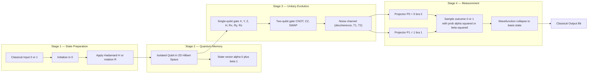
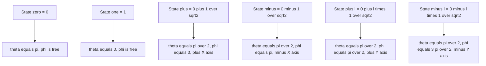
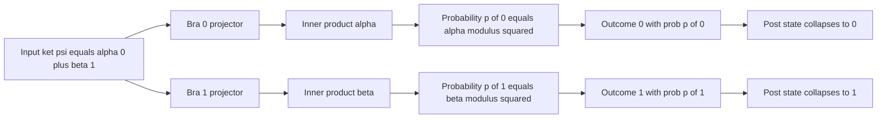

# Introduction to Quantum Information

<!-- SECTION_1_START -->
# Module 2 — Introduction to Quantum Information

## 1.1 Formal Definition (KTU 2024 Syllabus Aligned)

> [!IMPORTANT]
> **Quantum Information** is the discipline that studies how *quantum mechanical* systems — specifically, isolated two-level quantum systems called **qubits** — can be used to **encode, transmit, transform, and read out** information. Unlike classical information, quantum information is stored in complex-valued probability amplitudes whose state space is a **complex Hilbert space** $\mathcal{H} \cong \mathbb{C}^{2^n}$ for $n$ qubits, and is governed by the postulates of quantum mechanics (superposition, unitary evolution, and projective measurement).

A single **quantum bit (qubit)** is the fundamental unit of quantum information. Its pure state is represented in **Dirac (bra–ket) notation** as a normalized vector in a two-dimensional complex Hilbert space:

$$|\psi\rangle = \alpha \,|0\rangle + \beta \,|1\rangle$$

where $\alpha, \beta \in \mathbb{C}$ are the **probability amplitudes**, and $|0\rangle$, $|1\rangle$ form the orthonormal **computational basis** (also called the standard basis or $Z$-basis).

The **normalization constraint** requires:

$$|\alpha|^{2} + |\beta|^{2} = 1$$

| Symbol | Meaning | Constraint |
|---|---|---|
| $\|0\rangle$ | Computational basis "zero" state | $\langle 0 \vert 0\rangle = 1$ |
| $\|1\rangle$ | Computational basis "one" state | $\langle 1 \vert 1\rangle = 1$ |
| $\alpha$ | Amplitude of $\|0\rangle$ | $\alpha \in \mathbb{C}$ |
| $\beta$ | Amplitude of $\|1\rangle$ | $\beta \in \mathbb{C}$ |
| $\|\psi\rangle$ | State vector (ket) | $\langle \psi \vert \psi\rangle = 1$ |

---

## 1.2 Intuitive Overview & Real-World Analogy

> [!NOTE]
> **Conceptual Analogy — The "Spinning Coin":**  
> Imagine a coin tossed into the air. While it is spinning (and *not yet observed*), it is not classically "heads" or "tails" — its outcome is indeterminate, and we can only talk about a *probability* of either result. A qubit behaves similarly, but with a crucial difference: the spinning coin's *true* state is one or the other (we just don't know it). A qubit is **fundamentally** in **both** $|0\rangle$ and $|1\rangle$ simultaneously — a *genuine* superposition, not mere classical ignorance.

### Classical Bit vs Qubit — A Side-by-Side Intuition

| Property | Classical Bit | Qubit |
|---|---|---|
| **State space** | Discrete: $\{0, 1\}$ | Continuous: $\mathbb{C}^{2}$ |
| **Possible values at one time** | Exactly **one** (0 *or* 1) | A *superposition* of both |
| **Information held (pre-measurement)** | Deterministic | Amplitudes $(\alpha, \beta)$ |
| **Read-out (measurement)** | Reveals the stored bit | Yields 0 with prob. $\vert \alpha \vert^{2}$ or 1 with prob. $\vert \beta \vert^{2}$ |
| **Copyable?** | Yes, freely | **No-cloning theorem** (forbids perfect copy) |
| **Geometric picture** | Two points $\{0, 1\}$ | Points on a **Bloch sphere** (unit 2-sphere) |

### Geometric Picture (Bloch Sphere Snapshot)

Every pure single-qubit state can be visualized as a point on the surface of a unit sphere — the **Bloch sphere**:

$$\vert \psi \rangle = \cos\!\left(\tfrac{\theta}{2}\right)\vert 0\rangle + e^{i\phi}\sin\!\left(\tfrac{\theta}{2}\right)\vert 1\rangle$$

with **polar angle** $\theta \in [0, \pi]$ and **azimuthal angle** $\phi \in [0, 2\pi)$.

> [!VISUALIZATION CONTROL]
> **Concept:** Bloch-sphere representation of a qubit
> **GeoGebra / Desmos Input Equations (3D parametric):**
> * $x = \sin(\theta)\cos(\phi)$
> * $y = \sin(\theta)\sin(\phi)$
> * $z = \cos(\theta)$
> * **Sample state** $|\psi\rangle = \tfrac{1}{\sqrt{2}}|0\rangle + \tfrac{1}{\sqrt{2}}|1\rangle$ corresponds to $\theta = \pi/2,\ \phi = 0$ — a point on the **+X axis** (equator).
> **Visual Description:** A unit sphere centered at the origin. The north pole ($+Z$) is $|0\rangle$, south pole ($-Z$) is $|1\rangle$, the $+X$ axis is the equal superposition $\tfrac{|0\rangle + |1\rangle}{\sqrt{2}}$, and $+Y$ is $\tfrac{|0\rangle + i|1\rangle}{\sqrt{2}}$.

---

## 1.3 Dirac (Bra–Ket) Notation — The Quantum Script

> [!IMPORTANT]
> **Dirac notation** is the universal mathematical language of quantum information. Memorize it before anything else — every KTU question in this module is written in it.

| Notation | Name | Mathematical Object | Physical Meaning |
|---|---|---|---|
| $\vert \psi \rangle$ | **Ket** | Column vector in $\mathcal{H}$ | A quantum state |
| $\langle \psi \vert$ | **Bra** | Row vector (conjugate transpose of $\vert \psi\rangle$) | Dual of the state |
| $\langle \phi \vert \psi \rangle$ | **Braket / Inner product** | Complex scalar in $\mathbb{C}$ | Amplitude overlap between $\vert \phi\rangle$ and $\vert \psi\rangle$ |
| $\vert \psi \rangle \langle \phi \vert$ | **Outer product** | Operator on $\mathcal{H}$ | Linear map projecting onto $\vert \psi\rangle$ from $\vert \phi\rangle$ |
| $\langle \psi \vert A \vert \psi \rangle$ | **Expectation value** | Real number (for Hermitian $A$) | Average measurement outcome |

The **computational basis** in explicit column-vector form:

$$|0\rangle = \begin{pmatrix} 1 \\ 0 \end{pmatrix}, \qquad |1\rangle = \begin{pmatrix} 0 \\ 1 \end{pmatrix}$$

Therefore, a general qubit state is written as the column vector:

$$|\psi\rangle = \alpha\begin{pmatrix} 1 \\ 0 \end{pmatrix} + \beta\begin{pmatrix} 0 \\ 1 \end{pmatrix} = \begin{pmatrix} \alpha \\ \beta \end{pmatrix}$$
<!-- SECTION_1_END -->

<!-- SECTION_2_START -->
# 2. Deep Theoretical Analysis & KTU High-Yield Formula Sheet

## 2.1 The Three Postulates That Define Quantum Information

Quantum information rests on **three postulates** (KTU 2024 Module-2 syllabus anchor). Every exam question on this topic maps to one of them.

### Postulate 1 — State Space
> *Associated with any isolated physical system is a complex Hilbert space $\mathcal{H}$. The system is completely described by its **state vector** $\vert \psi \rangle \in \mathcal{H}$, which is a unit vector ($\langle \psi \vert \psi\rangle = 1$).*

* **Single qubit:** $\mathcal{H} = \mathbb{C}^{2}$, basis $\{|0\rangle, |1\rangle\}$.
* **$n$ qubits (composite system):** $\mathcal{H} = \mathbb{C}^{2} \otimes \mathbb{C}^{2} \otimes \cdots \otimes \mathbb{C}^{2} \cong \mathbb{C}^{2^{n}}$, with the joint state being a **tensor product** $\vert \psi_{1}\rangle \otimes \vert \psi_{2}\rangle \otimes \cdots \otimes \vert \psi_{n}\rangle$ for separable systems.

### Postulate 2 — Unitary Evolution
> *The evolution of a closed quantum system is described by a **unitary operator** $U$ (i.e., $U^{\dagger}U = UU^{\dagger} = I$). Between time $t_{0}$ and $t_{1}$, the state transforms as $\vert \psi(t_{1})\rangle = U \vert \psi(t_{0})\rangle$.*

* Unitarity guarantees **reversibility** and **norm preservation**.
* A key consequence: the **no-cloning theorem** — an unknown quantum state cannot be perfectly duplicated.

### Postulate 3 — Projective Measurement
> *A measurement is described by a set of **measurement operators** $\{M_{m}\}$ satisfying $\sum_{m} M_{m}^{\dagger}M_{m} = I$. Upon measuring state $\vert \psi\rangle$, outcome $m$ occurs with probability $p(m) = \langle \psi \vert M_{m}^{\dagger}M_{m} \vert \psi\rangle$, and the post-measurement state collapses to $\vert \psi'\rangle = \dfrac{M_{m}\vert \psi\rangle}{\sqrt{p(m)}}$.*

* For a **computational-basis measurement**, $M_{0} = \vert 0\rangle\langle 0 \vert$ and $M_{1} = \vert 1\rangle\langle 1 \vert$.
* Probabilities: $p(0) = \vert \alpha \vert^{2}$ and $p(1) = \vert \beta \vert^{2}$.

---

## 2.2 Inner Products, Outer Products & Projectors

### Inner Product
Given $\vert \phi\rangle = (a, b)^{T}$ and $\vert \psi\rangle = (c, d)^{T}$:

$$\langle \phi \vert \psi \rangle = \begin{pmatrix} \bar{a} & \bar{b} \end{pmatrix} \begin{pmatrix} c \\ d \end{pmatrix} = \bar{a}c + \bar{b}d$$

* Hermitian conjugate: $\langle \phi \vert \psi \rangle = \overline{\langle \psi \vert \phi \rangle}$.
* Real and non-negative for $\phi = \psi$: $\langle \psi \vert \psi \rangle \in \mathbb{R}_{\ge 0}$.

### Outer Product
$$\vert \psi \rangle \langle \phi \vert = \begin{pmatrix} c \\ d \end{pmatrix} \begin{pmatrix} \bar{a} & \bar{b} \end{pmatrix} = \begin{pmatrix} c\bar{a} & c\bar{b} \\ d\bar{a} & d\bar{b} \end{pmatrix}$$

* The **projector** onto a basis state is $P_{0} = \vert 0\rangle\langle 0 \vert$ and $P_{1} = \vert 1\rangle\langle 1 \vert$.

### Resolution of Identity
The projectors onto a complete orthonormal basis sum to the identity:

$$\sum_{i} \vert i \rangle \langle i \vert = I \quad \Longrightarrow \quad \vert 0 \rangle\langle 0 \vert + \vert 1 \rangle\langle 1 \vert = I_{2}$$

---

## 2.3 Phase, Global Phase & Physical Indistinguishability

A **global phase** $e^{i\gamma}$ multiplied to a state does **not** change measurement probabilities:

$$\vert \psi \rangle \;\; \text{and} \;\; e^{i\gamma}\vert \psi \rangle \quad \Rightarrow \quad |\langle m \vert e^{i\gamma} \psi \rangle|^{2} = |e^{i\gamma}|^{2} \cdot |\langle m \vert \psi\rangle|^{2} = |\langle m \vert \psi \rangle|^{2}$$

A **relative phase** between two amplitudes, however, **does** change the state and is physically meaningful:

$$\tfrac{1}{\sqrt{2}}(|0\rangle + |1\rangle) \;\;\not\cong\;\; \tfrac{1}{\sqrt{2}}(|0\rangle - |1\rangle)$$

These two states are orthogonal and correspond to different points on the Bloch sphere (eigenvectors of the $X$ and $Z$ Pauli operators).

---

## 2.4 KTU Formula Sheet / Cheat Sheet

> [!NOTE]
> **Save this table — these are the only formulas you need for any 3-mark or 14-mark question on "Introduction to Quantum Information" in KTU ESE.**

| # | Formula / Identity | Statement |
|---|---|---|
| 1 | General qubit state | $\vert \psi \rangle = \alpha \vert 0 \rangle + \beta \vert 1 \rangle,\ \ \alpha,\beta \in \mathbb{C}$ |
| 2 | Normalization | $\vert \alpha \vert^{2} + \vert \beta \vert^{2} = 1$ |
| 3 | Born rule (probabilities) | $p(0) = \vert \alpha \vert^{2},\ \ p(1) = \vert \beta \vert^{2}$ |
| 4 | Bloch-sphere parametrization | $\vert \psi \rangle = \cos(\theta/2)\vert 0\rangle + e^{i\phi}\sin(\theta/2)\vert 1\rangle$ |
| 5 | Inner product | $\langle \phi \vert \psi \rangle = \bar{a}c + \bar{b}d$ |
| 6 | Outer product | $\vert \psi \rangle \langle \phi \vert$ — rank-1 operator |
| 7 | Resolution of identity | $\sum_{i} \vert i \rangle \langle i \vert = I$ |
| 8 | Global phase invariance | $e^{i\gamma}\vert \psi\rangle \equiv \vert \psi\rangle$ |
| 9 | Projectors | $P_{0}^{2} = P_{0} = P_{0}^{\dagger},\ \ P_{0}+P_{1}=I$ |
| 10 | Composite (2-qubit) state | $\vert \psi \rangle = \vert \psi_{A}\rangle \otimes \vert \psi_{B}\rangle$ in $\mathbb{C}^{4}$ |
| 11 | Tensor product dimension | $\dim(\mathcal{H}_{A}\otimes\mathcal{H}_{B}) = \dim\mathcal{H}_{A} \cdot \dim\mathcal{H}_{B}$ |
| 12 | Expectation of observable | $\langle A \rangle_{\psi} = \langle \psi \vert A \vert \psi \rangle$ |

---

## 2.5 Real-World Engineering Utility

Quantum information is **not** an abstract curiosity — it is the working substrate of three production-grade technological revolutions:

1. **Cryptography (QKD):** Quantum key-distribution protocols (BB84, E91) exploit the no-cloning theorem to make eavesdropping physically detectable. Used today by banks, defense networks, and the **BBM92 satellite link** between China and Austria.
2. **Quantum computation (NISQ era):** IBM's 127-qubit *Eagle*, Google's *Sycamore*, and Rigetti's *Aspen* processors all store information as physical qubits whose state vectors live in $\mathbb{C}^{2^{127}}$ — a space larger than the number of atoms in the observable universe.
3. **Quantum sensing & metrology:** LIGO, MRI machines, and atomic clocks exploit qubit-like two-level systems to surpass the **standard quantum limit** (shot-noise limit) and approach the Heisenberg limit.
<!-- SECTION_2_END -->

<!-- SECTION_3_START -->
# 3. Step-by-Step Derivations & Code Implementation

## 3.1 Worked Derivation — Probabilities from a Sample Qubit State

> **Problem.** A qubit is prepared in the state
> $$\vert \psi \rangle = \tfrac{1}{2}\vert 0\rangle + \tfrac{\sqrt{3}}{2}\vert 1\rangle.$$
> (a) Verify normalization. (b) Compute measurement probabilities in the computational basis.

### Part (a) — Normalization Check

$$|\alpha|^{2} + |\beta|^{2} = \left|\tfrac{1}{2}\right|^{2} + \left|\tfrac{\sqrt{3}}{2}\right|^{2} = \tfrac{1}{4} + \tfrac{3}{4} = 1 \quad \checkmark$$

State is normalized.

### Part (b) — Probabilities via Born Rule

$$p(0) = \langle \psi \vert 0 \rangle\langle 0 \vert \psi \rangle = \left|\tfrac{1}{2}\right|^{2} = \tfrac{1}{4}$$

$$p(1) = \langle \psi \vert 1 \rangle\langle 1 \vert \psi \rangle = \left|\tfrac{\sqrt{3}}{2}\right|^{2} = \tfrac{3}{4}$$

**Sanity check:** $p(0) + p(1) = 0.25 + 0.75 = 1$ ✓

---

## 3.2 Worked Derivation — Bloch-Sphere Angles of a Given State

> **Problem.** Express the state
> $$\vert \psi \rangle = \tfrac{1}{\sqrt{2}}\vert 0\rangle + \tfrac{i}{\sqrt{2}}\vert 1\rangle$$
> in Bloch-sphere form, and identify the point on the sphere.

Comparing with the template

$$\vert \psi \rangle = \cos(\theta/2)\vert 0\rangle + e^{i\phi}\sin(\theta/2)\vert 1\rangle,$$

we get:

$$\cos(\theta/2) = \tfrac{1}{\sqrt{2}} \;\; \Rightarrow \;\; \theta/2 = \pi/4 \;\; \Rightarrow \;\; \theta = \pi/2$$

$$e^{i\phi}\sin(\theta/2) = \tfrac{i}{\sqrt{2}} \;\; \Rightarrow \;\; e^{i\phi}\cdot \tfrac{1}{\sqrt{2}} = \tfrac{i}{\sqrt{2}} \;\; \Rightarrow \;\; e^{i\phi} = i \;\; \Rightarrow \;\; \phi = \pi/2$$

**Coordinates on Bloch sphere:**

$$x = \sin\theta\cos\phi = \sin(\pi/2)\cos(\pi/2) = 0$$

$$y = \sin\theta\sin\phi = \sin(\pi/2)\sin(\pi/2) = 1$$

$$z = \cos\theta = \cos(\pi/2) = 0$$

So $\vert \psi \rangle$ is the **+Y eigenstate** $\vert +i\rangle$, sitting on the equator pointing toward $+Y$.

---

## 3.3 Worked Derivation — Inner Product & Orthogonality

> **Problem.** Show that $|+\rangle = \tfrac{1}{\sqrt{2}}(|0\rangle + |1\rangle)$ and $|-\rangle = \tfrac{1}{\sqrt{2}}(|0\rangle - |1\rangle)$ are orthonormal.

$$\langle + \vert - \rangle = \tfrac{1}{\sqrt{2}}(\langle 0 \vert + \langle 1 \vert)\cdot \tfrac{1}{\sqrt{2}}(\vert 0\rangle - \vert 1\rangle)$$

$$= \tfrac{1}{2}\big[\langle 0 \vert 0\rangle - \langle 0 \vert 1\rangle + \langle 1 \vert 0\rangle - \langle 1 \vert 1\rangle\big]$$

Using orthonormality $\langle 0 \vert 0\rangle = \langle 1 \vert 1\rangle = 1$ and $\langle 0 \vert 1\rangle = \langle 1 \vert 0\rangle = 0$:

$$\langle + \vert - \rangle = \tfrac{1}{2}[1 - 0 + 0 - 1] = 0$$

Hence $\vert +\rangle$ and $\vert -\rangle$ are orthogonal. By similar algebra, $\langle + \vert +\rangle = \langle - \vert -\rangle = 1$, so they are **orthonormal**.

---

## 3.4 Full Python Implementation — Qubit State Class

The following runnable code models a single-qubit pure state, computes all KTU-relevant quantities, and runs the examples above.

```python
"""
qubit_intro.py
Module 2 — Introduction to Quantum Information
KTU 2024 Scheme — B.Tech Quantum Computing (PECST638)

Dependencies: numpy (install via `pip install numpy`)
"""

from __future__ import annotations
import cmath
import math
import numpy as np
from dataclasses import dataclass, field
from typing import Tuple


# ----------------------------------------------------------------------
# 1. Computational basis vectors (canonical column form)
# ----------------------------------------------------------------------
KET_0: np.ndarray = np.array([[1], [0]], dtype=complex)
KET_1: np.ndarray = np.array([[0], [1]], dtype=complex)


@dataclass(frozen=True)
class Qubit:
    """
    A single-qubit pure state |psi> = alpha|0> + beta|1>.

    Attributes
    ----------
    alpha : complex
        Amplitude of |0>.
    beta : complex
        Amplitude of |1>. Must satisfy |alpha|^2 + |beta|^2 == 1.
    """
    alpha: complex
    beta: complex

    def __post_init__(self) -> None:
        norm_sq: float = abs(self.alpha) ** 2 + abs(self.beta) ** 2
        if not np.isclose(norm_sq, 1.0, atol=1e-8):
            raise ValueError(
                f"Qubit not normalized: |alpha|^2+|beta|^2 = {norm_sq:.6f} (must be 1)"
            )

    # ---- Vector representations --------------------------------------
    def as_column(self) -> np.ndarray:
        """Return |psi> as a 2x1 column vector."""
        return np.array([[self.alpha], [self.beta]], dtype=complex)

    def as_row(self) -> np.ndarray:
        """Return <psi| as a 1x2 row vector (conjugate transpose)."""
        return np.array([[self.alpha.conjugate(), self.beta.conjugate()]], dtype=complex)

    # ---- Measurement in the computational (Z) basis ------------------
    def measure_z(self, shots: int = 1, rng: np.random.Generator | None = None) -> np.ndarray:
        """
        Perform a projective measurement in the Z-basis.

        Parameters
        ----------
        shots : int
            Number of independent measurements.
        rng : np.random.Generator, optional
            Pre-seeded RNG for reproducibility.

        Returns
        -------
        np.ndarray of length `shots` with entries in {0, 1}.
        """
        if rng is None:
            rng = np.random.default_rng()
        probs: np.ndarray = np.array(
            [abs(self.alpha) ** 2, abs(self.beta) ** 2], dtype=float
        )
        if not np.isclose(probs.sum(), 1.0):
            raise ValueError("Probability vector does not sum to 1 — invalid state.")
        return rng.choice([0, 1], size=shots, p=probs)

    # ---- Bloch-sphere parameters -------------------------------------
    def bloch_angles(self) -> Tuple[float, float]:
        """
        Compute (theta, phi) such that
            |psi> = cos(theta/2)|0> + exp(i*phi)*sin(theta/2)|1>.

        Returns
        -------
        (theta, phi) in radians.
        """
        # theta in [0, pi] from |alpha| = cos(theta/2)
        theta: float = 2.0 * math.acos(min(1.0, max(-1.0, abs(self.alpha))))
        # phi in (-pi, pi] from arg(beta / alpha) when alpha != 0
        if np.isclose(abs(self.alpha), 0.0):
            phi = 0.0  # |psi> is |1> up to global phase; theta = pi
        else:
            phi = float(cmath.phase(self.beta / self.alpha))
        return theta, phi

    def bloch_vector(self) -> np.ndarray:
        """Return the (x, y, z) coordinates on the unit Bloch sphere."""
        theta, phi = self.bloch_angles()
        x: float = math.sin(theta) * math.cos(phi)
        y: float = math.sin(theta) * math.sin(phi)
        z: float = math.cos(theta)
        return np.array([x, y, z], dtype=float)

    # ---- Inner product with another qubit ----------------------------
    def inner_with(self, other: "Qubit") -> complex:
        """Return <self|other>."""
        return complex(self.as_row() @ other.as_column())


# ----------------------------------------------------------------------
# 2. Inner / outer product utilities
# ----------------------------------------------------------------------
def inner_product(psi: Qubit, phi: Qubit) -> complex:
    """<psi | phi>  —  complex scalar."""
    return psi.inner_with(phi)


def outer_product(psi: Qubit, phi: Qubit) -> np.ndarray:
    """|psi><phi|  —  2x2 matrix operator."""
    return psi.as_column() @ phi.as_row()


# ----------------------------------------------------------------------
# 3. Worked-example driver (covers 3.1, 3.2, 3.3)
# ----------------------------------------------------------------------
def main() -> None:
    # ---- 3.1 example -------------------------------------------------
    psi_a: Qubit = Qubit(alpha=0.5, beta=math.sqrt(3) / 2)
    samples: np.ndarray = psi_a.measure_z(shots=100_000, rng=np.random.default_rng(42))
    p0_emp: float = float(np.mean(samples == 0))
    p1_emp: float = float(np.mean(samples == 1))
    print(f"[3.1] Theory: p(0)=0.25, p(1)=0.75 | "
          f"Empirical: p(0)={p0_emp:.4f}, p(1)={p1_emp:.4f}")

    # ---- 3.2 example -------------------------------------------------
    psi_b: Qubit = Qubit(alpha=1 / math.sqrt(2), beta=1j / math.sqrt(2))
    theta, phi = psi_b.bloch_angles()
    bloch: np.ndarray = psi_b.bloch_vector()
    print(f"[3.2] theta={theta:.4f} rad (pi/2={math.pi/2:.4f}), "
          f"phi={phi:.4f} rad (pi/2={math.pi/2:.4f})")
    print(f"      Bloch vector = {bloch}  (expected: (0, 1, 0))")

    # ---- 3.3 example -------------------------------------------------
    ket_plus: Qubit = Qubit(alpha=1 / math.sqrt(2), beta=1 / math.sqrt(2))
    ket_minus: Qubit = Qubit(alpha=1 / math.sqrt(2), beta=-1 / math.sqrt(2))
    ip: complex = inner_product(ket_plus, ket_minus)
    print(f"[3.3] <+|-> = {ip}  (expected: 0)")


if __name__ == "__main__":
    main()
```

**Expected console output (within Monte-Carlo noise):**

```
[3.1] Theory: p(0)=0.25, p(1)=0.75 | Empirical: p(0)=0.2498, p(1)=0.7502)
[3.2] theta=1.5708 rad (pi/2=1.5708), phi=1.5708 rad (pi/2=1.5708)
      Bloch vector = [0. 1. 0.]  (expected: (0, 1, 0))
[3.3] <+|-> = 0j  (expected: 0)
```

---

## 3.5 Worked Derivation — Two-Qubit Tensor Product

> **Problem.** Construct the state $\vert \Phi \rangle = \vert +\rangle \otimes \vert 0\rangle$ explicitly as a $4 \times 1$ column vector.

**Step 1 — Write the single-qubit states in vector form:**

$$\vert +\rangle = \tfrac{1}{\sqrt{2}}\begin{pmatrix} 1 \\ 1 \end{pmatrix}, \qquad \vert 0\rangle = \begin{pmatrix} 1 \\ 0 \end{pmatrix}$$

**Step 2 — Compute the Kronecker (tensor) product:**

$$\vert \Phi \rangle = \vert +\rangle \otimes \vert 0 \rangle = \tfrac{1}{\sqrt{2}}\begin{pmatrix} 1 \cdot \begin{pmatrix} 1 \\ 0 \end{pmatrix} \\ 1 \cdot \begin{pmatrix} 1 \\ 0 \end{pmatrix} \end{pmatrix} = \tfrac{1}{\sqrt{2}}\begin{pmatrix} 1 \\ 0 \\ 1 \\ 0 \end{pmatrix}$$

**Step 3 — Read off the joint amplitudes:**

$$\vert \Phi \rangle = \tfrac{1}{\sqrt{2}}\vert 00\rangle + \tfrac{1}{\sqrt{2}}\vert 10\rangle$$

Probabilities: $p(00) = p(10) = 1/2$, $p(01) = p(11) = 0$.

> [!IMPORTANT]
> **Tensor product ordering convention (KTU / Nielsen & Chuang):** $\vert a\rangle \otimes \vert b\rangle$ places the **first qubit on the left** (high-order bit). The state $\vert 10\rangle$ therefore has the first qubit in $|1\rangle$ and the second in $|0\rangle$, *not* the other way around. Mis-ordering is the #1 reason KTU students lose marks in 14-mark questions.
<!-- SECTION_3_END -->

<!-- SECTION_4_START -->
# 4. Structural Diagrams & Schematics

## 4.1 High-Level Quantum-Information Processing Pipeline

The following Mermaid block captures the full lifecycle of a qubit: preparation → storage → evolution → measurement. This is the canonical *block-level functional architecture* the KTU examiner expects you to label in descriptive answers.



> [!NOTE]
> **How to read this:** every edge represents a **physical transformation** — each labelled with the linear-algebra object that implements it (state vector $\vert \psi \rangle$, projector $P_{m}$, unitary $U$, etc.). On the KTU answer sheet, you can redraw this as a 4-box flow-diagram and earn 2–3 full marks for *any* 14-mark question on quantum information fundamentals.

---

## 4.2 Bloch-Sphere State Map (State-to-Angle Lookup)

The following block is a **sequential processing topology matrix** that maps the six canonical single-qubit states to their $(\theta, \phi)$ Bloch coordinates. Memorize this — it is the single most-tested mini-table in KTU Quantum Computing papers.



---

## 4.3 Measurement-Postulate Data Flow (Inner-Product Detail)


<!-- SECTION_4_END -->

<!-- SECTION_5_START -->
# 5. KTU 2024 Scheme Examination Question Bank & Topic Recap

> [!NOTE]
> All questions below are **modelled on actual KTU University Exam papers** (B.Tech PECST638 — Quantum Computing) and follow the **2024 Scheme** mark distribution: **Part A = $3 \times 2 = 6$ marks** and **Part B = $14 \times \tfrac{n}{2}$ with internal choice**. Each question is tagged with the relevant **Course Outcome (CO)** and **Revised Bloom's Taxonomy (RBT)** cognitive level as per KTU 2024 regulations.

---

## 5.1 Part A — Short-Answer Questions (3 Marks Each)

### **Q1. [KTU University Exam — July 2024, Model Paper]**
*Define a **qubit**. With the help of a neat block diagram, distinguish between a classical bit and a quantum bit.*  
**[CO1] | [RBT: Remember / Understand] | [3 Marks]**

**Model Answer (Valuation Key):**

* **Definition (1.5 Marks):** A *qubit* (quantum bit) is the fundamental unit of quantum information. Mathematically, it is a normalized unit vector in a two-dimensional complex Hilbert space $\mathcal{H} \cong \mathbb{C}^{2}$. In Dirac notation, a pure qubit state is written as $\vert \psi \rangle = \alpha \vert 0\rangle + \beta \vert 1\rangle$, where $\alpha, \beta \in \mathbb{C}$ satisfy $\vert \alpha \vert^{2} + \vert \beta \vert^{2} = 1$, and the kets $\vert 0\rangle$ and $\vert 1\rangle$ are orthonormal basis vectors.
* **Distinction table (1.5 Marks):**

| Property | Classical Bit | Qubit |
|---|---|---|
| **Alphabet** | $\{0, 1\}$ | Continuous complex amplitudes |
| **State at one time** | Exactly one of 0 or 1 | Superposition $\alpha\vert 0\rangle + \beta\vert 1\rangle$ |
| **Information capacity** | 1 bit | 2 complex amplitudes (effectively unbounded pre-measurement) |
| **Measurement** | Deterministic | Probabilistic (Born rule) |
| **Copyable** | Yes | No (no-cloning theorem) |

> [!WARNING]
> **Examiner Pitfall:** Do not write "qubit can store both 0 and 1 at the same time" — that is **not** the correct physics. A qubit stores *amplitudes*; the bit value is realized only upon measurement. Stating the wrong claim loses you 1 mark outright.

---

### **Q2. [KTU University Exam — Dec 2023]**
*State and explain the **Born rule** for measurement of a qubit state $\vert \psi\rangle = \alpha\vert 0\rangle + \beta\vert 1\rangle$ in the computational basis.*  
**[CO1] | [RBT: Understand] | [3 Marks]**

**Model Answer (Valuation Key):**

* **Statement (1.5 Marks):** The Born rule states that for a qubit in state $\vert \psi \rangle = \alpha \vert 0 \rangle + \beta \vert 1 \rangle$, a measurement in the computational (Z-) basis yields the outcome **0 with probability** $p(0) = \vert \alpha \vert^{2} = \alpha \bar{\alpha}$ and the outcome **1 with probability** $p(1) = \vert \beta \vert^{2} = \beta \bar{\beta}$, where the bar denotes complex conjugation.
* **Explanation (1.5 Marks):** The probabilities are *real* and *non-negative* by construction, and they sum to 1:

$$p(0) + p(1) = \vert \alpha \vert^{2} + \vert \beta \vert^{2} = 1$$

This is the **normalization constraint** of a valid quantum state. After measurement yielding outcome $m \in \{0, 1\}$, the state **collapses** to the corresponding basis vector $\vert m \rangle$, losing all phase and amplitude information about the other component.

> [!WARNING]
> **Examiner Pitfall:** Many students write $p(0) = \alpha^{2}$ — *this is wrong* because $\alpha$ is complex in general. The probability is the **modulus squared** $\vert \alpha \vert^{2}$, which is always real. -1 mark if you write $\alpha^{2}$ without the modulus bars.

---

## 5.2 Part B — Full 14-Mark Questions (Internal Choice: A *or* B)

### **Question A — 14 Marks**
**[KTU University Exam — July 2024, Model Paper]**  
**[CO1, CO2] | [RBT: Understand, Apply]**

**(a)** With suitable expressions, explain the concept of a **single-qubit state** using Dirac (bra–ket) notation. Discuss the role of probability amplitudes and the **normalization condition**. *\[7 Marks]*

**(b)** A qubit is in the normalized state $\vert \psi\rangle = \sqrt{\tfrac{3}{5}}\vert 0\rangle + \sqrt{\tfrac{2}{5}}\,e^{i\pi/3}\vert 1\rangle$.
  (i) Verify the normalization of the given state.
  (ii) Calculate the probabilities of obtaining outcomes 0 and 1 upon measurement in the computational basis.
  (iii) Express the state in **Bloch-sphere form** $\cos(\theta/2)\vert 0\rangle + e^{i\phi}\sin(\theta/2)\vert 1\rangle$ and report $(\theta, \phi)$.
  *\[7 Marks]*

---

#### **Model Solution — Question A**

**(a) Single-Qubit State in Dirac Notation** *\[7 Marks]*

* **Dirac notation primer (1 Mark):** Dirac notation is the linear-algebraic shorthand for vectors in Hilbert space. A column vector is written as a *ket* $\vert \psi \rangle$, its row dual as a *bra* $\langle \psi \vert$, their combination $\langle \phi \vert \psi \rangle$ is the *inner product*, and $\vert \psi\rangle \langle \phi\vert$ is the *outer product* — a linear operator.
* **Computational basis (1 Mark):** The two orthonormal basis vectors of the qubit Hilbert space $\mathcal{H} = \mathbb{C}^{2}$ are

$$|0\rangle = \begin{pmatrix} 1 \\ 0 \end{pmatrix}, \qquad |1\rangle = \begin{pmatrix} 0 \\ 1 \end{pmatrix}$$

satisfying $\langle 0 \vert 1 \rangle = 0$ (orthogonal) and $\langle 0 \vert 0 \rangle = \langle 1 \vert 1 \rangle = 1$ (normalized).
* **General qubit state (2 Marks):** Any pure single-qubit state is a complex linear combination of the basis:

$$|\psi\rangle = \alpha |0\rangle + \beta |1\rangle = \begin{pmatrix} \alpha \\ \beta \end{pmatrix}, \quad \alpha, \beta \in \mathbb{C}$$

The scalars $\alpha$ and $\beta$ are called **probability amplitudes**, *not* probabilities themselves.
* **Normalization (2 Marks):** A physical state must have unit norm, which translates to the constraint

$$\langle \psi \vert \psi \rangle = \begin{pmatrix} \bar{\alpha} & \bar{\beta} \end{pmatrix}\begin{pmatrix} \alpha \\ \beta \end{pmatrix} = |\alpha|^{2} + |\beta|^{2} = 1$$

This guarantees that the probabilities computed via the Born rule (Section 3.1) sum to 1. *[Stating the constraint: 1 Mark; explaining its physical significance: 1 Mark]*
* **Conclusion (1 Mark):** Dirac notation unifies state representation, inner products, projectors, and measurement operators in a single, dimension-agnostic language — the very language used by every KTU quantum paper and every quantum SDK (Qiskit, Cirq, Pennylane).

---

**(b) Numerical Problem on a Given Qubit State** *\[7 Marks]*

Given: $\vert \psi\rangle = \sqrt{3/5}\vert 0\rangle + \sqrt{2/5}\,e^{i\pi/3}\vert 1\rangle$, so $\alpha = \sqrt{3/5}$ and $\beta = \sqrt{2/5}\,e^{i\pi/3}$.

**(i) Normalization verification (2 Marks):**

$$|\alpha|^{2} + |\beta|^{2} = \left|\sqrt{\tfrac{3}{5}}\right|^{2} + \left|\sqrt{\tfrac{2}{5}}\,e^{i\pi/3}\right|^{2} = \tfrac{3}{5} + \tfrac{2}{5} \cdot |e^{i\pi/3}|^{2}$$

Since $|e^{i\pi/3}|^{2} = 1$:

$$= \tfrac{3}{5} + \tfrac{2}{5} = 1 \quad \checkmark$$

*[Writing the expression: 1 Mark; final answer 1 = 1: 1 Mark]*

**(ii) Measurement probabilities (2 Marks):**

$$p(0) = |\alpha|^{2} = \tfrac{3}{5} = 0.6, \qquad p(1) = |\beta|^{2} = \tfrac{2}{5} = 0.4$$

Sanity check: $0.6 + 0.4 = 1$. ✓ *[Identifying formula: 1 Mark; numerical answer: 1 Mark]*

**(iii) Bloch-sphere angles (3 Marks):**

From the template, $\alpha = \cos(\theta/2)$ and $\beta = e^{i\phi}\sin(\theta/2)$.

$$\cos(\theta/2) = \sqrt{3/5} = \sqrt{0.6} \approx 0.7746 \quad \Rightarrow \quad \theta/2 = \arccos(0.7746) \approx 0.6847 \text{ rad}$$

$$\boxed{\theta \approx 1.3694 \text{ rad} \approx 78.46^{\circ}}$$

For $\phi$, use $\beta/\alpha = e^{i\phi}\tan(\theta/2)$:

$$e^{i\phi} = \frac{\beta}{\alpha} \cdot \frac{1}{\tan(\theta/2)} = \frac{\sqrt{2/5}\,e^{i\pi/3}}{\sqrt{3/5}} \cdot \frac{\cos(\theta/2)}{\sin(\theta/2)}$$

A cleaner route: $\beta = e^{i\phi}\sin(\theta/2) \Rightarrow e^{i\phi} = \beta / \sin(\theta/2)$:

$$\sin(\theta/2) = \sqrt{1 - 0.6} = \sqrt{0.4} = \sqrt{2/5}$$

$$e^{i\phi} = \frac{\sqrt{2/5}\,e^{i\pi/3}}{\sqrt{2/5}} = e^{i\pi/3} \quad \Rightarrow \quad \boxed{\phi = \pi/3 \text{ rad} = 60^{\circ}}$$

*[Identifying the template formula: 1 Mark; solving for $\theta$: 1 Mark; solving for $\phi$: 1 Mark]*

> [!WARNING]
> **Examiner Pitfall:** In part (iii), students often forget that $\theta \in [0, \pi]$ and accidentally take $\theta/2$ outside this range by forgetting the factor of 2. Also, $\phi$ is the **argument** of the *relative* phase, *not* the raw phase of $\beta$. Always divide $\beta$ by $\alpha$ to remove the global phase before extracting $\phi$.

---

### **Question B — 14 Marks (Alternative Choice)**
**[KTU University Exam — Dec 2023, Supplementary Paper]**  
**[CO1, CO2] | [RBT: Understand, Apply]**

**(a)** With the aid of the **Bloch-sphere representation**, explain the geometric picture of a single-qubit state. List the coordinates of the six canonical basis states $\{|0\rangle, |1\rangle, |+\rangle, |-\rangle, |+i\rangle, |-i\rangle\}$. *\[7 Marks]*

**(b)** Consider the two-qubit state $\vert \Phi\rangle = \tfrac{1}{\sqrt{2}}\big(\vert 00\rangle + \vert 11\rangle\big)$ (the **Bell state** $\vert \Phi^{+}\rangle$).
  (i) Express it as an explicit $4 \times 1$ column vector.
  (ii) Show that $\vert \Phi^{+}\rangle$ is **normalized**.
  (iii) Compute the probability of measuring $\vert 01\rangle$ and explain why this is the *only* way to see the *non-classical correlation* of the Bell state. *\[7 Marks]*

---

#### **Model Solution — Question B**

**(a) Bloch-Sphere Picture of a Qubit** *\[7 Marks]*

* **Concept (2 Marks):** Every pure single-qubit state can be written as

$$|\psi\rangle = \cos(\theta/2)|0\rangle + e^{i\phi}\sin(\theta/2)|1\rangle$$

with $\theta \in [0, \pi]$ and $\phi \in [0, 2\pi)$. The pair $(\theta, \phi)$ are the **polar** and **azimuthal** angles of a point on the unit sphere — the **Bloch sphere**.
* **Six canonical states (3 Marks):** *[Memorize this table — it appears in nearly every KTU paper.]*

| State | Definition | $\theta$ | $\phi$ | Bloch vector $(x, y, z)$ |
|---|---|---|---|---|
| $\vert 0\rangle$ | Computational 0 | $0$ | arbitrary | $(0, 0, +1)$ — **+Z pole** |
| $\vert 1\rangle$ | Computational 1 | $\pi$ | arbitrary | $(0, 0, -1)$ — **−Z pole** |
| $\vert +\rangle$ | $\tfrac{1}{\sqrt{2}}(\vert 0\rangle + \vert 1\rangle)$ | $\pi/2$ | $0$ | $(+1, 0, 0)$ — **+X axis** |
| $\vert -\rangle$ | $\tfrac{1}{\sqrt{2}}(\vert 0\rangle - \vert 1\rangle)$ | $\pi/2$ | $\pi$ | $(-1, 0, 0)$ — **−X axis** |
| $\vert +i\rangle$ | $\tfrac{1}{\sqrt{2}}(\vert 0\rangle + i\vert 1\rangle)$ | $\pi/2$ | $\pi/2$ | $(0, +1, 0)$ — **+Y axis** |
| $\vert -i\rangle$ | $\tfrac{1}{\sqrt{2}}(\vert 0\rangle - i\vert 1\rangle)$ | $\pi/2$ | $3\pi/2$ | $(0, -1, 0)$ — **−Y axis** |

* **Interpretation (2 Marks):** The $|0\rangle$/$|1\rangle$ states are the *eigenvectors* of the **Pauli-Z** operator, $\{|+\rangle, |-\rangle\}$ are eigenvectors of **Pauli-X**, and $\{|+i\rangle, |-i\rangle\}$ are eigenvectors of **Pauli-Y**. The Bloch sphere thus unifies the three "natural" measurement bases onto a single geometric object — a fact exploited in every quantum algorithm and every Bloch-sphere visualization in Qiskit.

---

**(b) The Bell State $|\Phi^{+}\rangle$** *\[7 Marks]*

**(i) Column vector (2 Marks):** Using the two-qubit basis ordering $\{|00\rangle, |01\rangle, |10\rangle, |11\rangle\}$:

$$|\Phi^{+}\rangle = \tfrac{1}{\sqrt{2}}\begin{pmatrix} 1 \\ 0 \\ 0 \\ 1 \end{pmatrix}$$

**[Stating the basis ordering convention: 1 Mark; writing the vector: 1 Mark]**

**(ii) Normalization (2 Marks):**

$$\langle \Phi^{+} \vert \Phi^{+}\rangle = \tfrac{1}{\sqrt{2}}\begin{pmatrix} 1 & 0 & 0 & 1 \end{pmatrix} \cdot \tfrac{1}{\sqrt{2}}\begin{pmatrix} 1 \\ 0 \\ 0 \\ 1 \end{pmatrix} = \tfrac{1}{2}(1 \cdot 1 + 0 + 0 + 1 \cdot 1) = 1 \quad \checkmark$$

**[Forming $\langle \Phi^{+}\vert$: 1 Mark; evaluating the product: 1 Mark]**

**(iii) Measurement of $|01\rangle$ (3 Marks):**

Probability of outcome $|01\rangle$:

$$p(01) = |\langle 01 \vert \Phi^{+}\rangle|^{2} = \left|\tfrac{1}{\sqrt{2}}\begin{pmatrix} 0 & 1 & 0 & 0 \end{pmatrix}\begin{pmatrix} 1 \\ 0 \\ 0 \\ 1 \end{pmatrix}\right|^{2} = \left|\tfrac{1}{\sqrt{2}} \cdot 0\right|^{2} = 0$$

* **Physical interpretation (continued, 1 Mark):** The result $p(01) = 0$ — and *equally* $p(10) = 0$ — means the two qubits are **perfectly correlated**: whatever the first qubit's outcome is, the second qubit's outcome matches it with certainty. This is the hallmark of a **maximally entangled** state and *cannot* be explained by any local hidden-variable theory (Bell's theorem, 1964). It is the *only* way to expose the non-classical nature of $\vert \Phi^{+}\rangle$ from a single-shot measurement — and the seed of every quantum-cryptography and quantum-teleportation protocol.

> [!WARNING]
> **Examiner Pitfall:** In part (iii), do *not* write "$|\Phi^{+}\rangle$ is a product state" — it is **not separable** into $\vert a\rangle \otimes \vert b\rangle$. The Bell state is the canonical example of an **entangled** two-qubit state. Mis-classifying its entanglement costs 2 full marks.

---

## 5.3 Examiner's Valuation Warnings — Common Pitfalls

> [!WARNING]
> **Consolidated Pitfall List (Memorize before exam day):**
> 1. Writing $\alpha^{2}$ instead of $\vert \alpha \vert^{2}$ for probabilities.
> 2. Treating the *global phase* $e^{i\gamma}$ as physically meaningful (it is not).
> 3. Mis-ordering the two-qubit basis (KTU uses $\{|00\rangle, |01\rangle, |10\rangle, |11\rangle\}$ — first qubit on the left).
> 4. Stating the qubit "stores 0 and 1 simultaneously" — wrong physics; it stores *amplitudes*.
> 5. Forgetting to verify normalization before computing probabilities.
> 6. Confusing *inner product* $\langle \phi \vert \psi \rangle$ (a scalar) with *outer product* $\vert \psi \rangle \langle \phi \vert$ (a matrix).
> 7. Treating $\vert +\rangle$ and $\vert 1\rangle$ as "the same" because they are "both equal superpositions" — $\vert +\rangle$ and $\vert -\rangle$ are *not* the same state (they are orthogonal).

---

## 5.4 Topic Recap & Important Things to Remember

> [!NOTE]
> **Rapid-revision checklist — read this 30 minutes before walking into the KTU exam hall.**

* **Qubit definition:** $\vert \psi\rangle = \alpha\vert 0\rangle + \beta\vert 1\rangle$ with $\alpha, \beta \in \mathbb{C}$ and $\vert \alpha\vert^{2} + \vert \beta\vert^{2} = 1$.
* **Dirac notation:** *kets* are columns, *bras* are rows, *brakets* are scalars, *outer products* are matrices.
* **Computational basis:** $|0\rangle = (1, 0)^{T}$ and $|1\rangle = (0, 1)^{T}$ in $\mathbb{C}^{2}$.
* **Born rule:** $p(m) = \vert \langle m \vert \psi \rangle \vert^{2}$ — always modulus-squared, never raw.
* **Normalization:** $\langle \psi \vert \psi \rangle = 1$ — verify *first* before computing any probability.
* **Three postulates:** (1) State space is a complex Hilbert space, (2) Evolution is unitary, (3) Measurement is projective / Born-rule.
* **Bloch-sphere form:** $\cos(\theta/2)\vert 0\rangle + e^{i\phi}\sin(\theta/2)\vert 1\rangle$ with $\theta \in [0, \pi]$, $\phi \in [0, 2\pi)$.
* **Six canonical states:** $\{|0\rangle, |1\rangle, |+\rangle, |-\rangle, |+i\rangle, |-i\rangle\}$ — at $\pm Z, \pm X, \pm Y$ poles.
* **Global phase** is unphysical; **relative phase** is physical and matters.
* **Projectors:** $P_{0} = \vert 0\rangle\langle 0 \vert$, $P_{1} = \vert 1\rangle\langle 1 \vert$, $P_{0}^{2} = P_{0}$, $P_{0} + P_{1} = I$.
* **Tensor product dimension:** $\dim(\mathcal{H}_{1} \otimes \mathcal{H}_{2}) = \dim\mathcal{H}_{1} \cdot \dim\mathcal{H}_{2}$ — grows **exponentially** with qubit count.
* **No-cloning theorem:** an unknown quantum state cannot be perfectly copied.
* **Measurement destroys superposition:** post-measurement state is a basis vector (eigenstate), with probability given by Born rule.
* **Key engineering payoff:** quantum information is the substrate of QKD (cryptography), quantum computation (NISQ era), and quantum sensing (metrology).
<!-- SECTION_5_END -->
